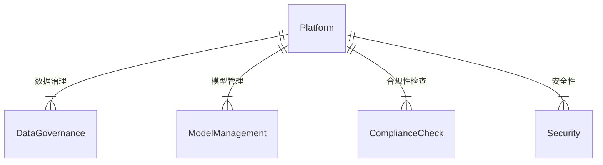
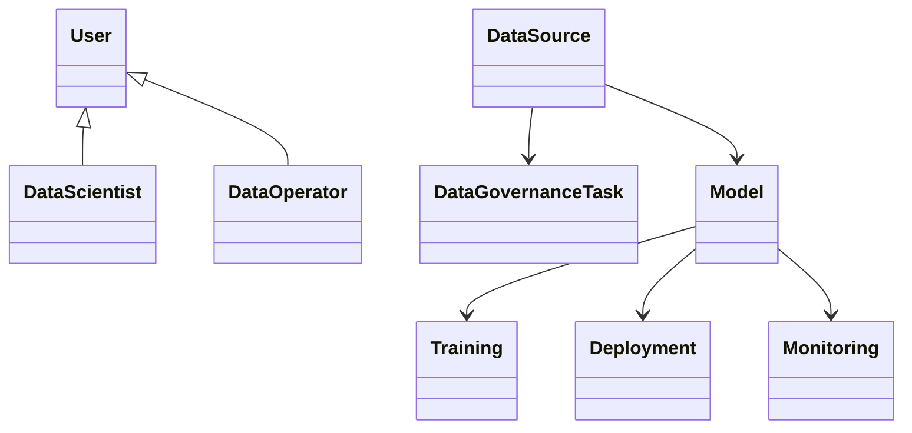
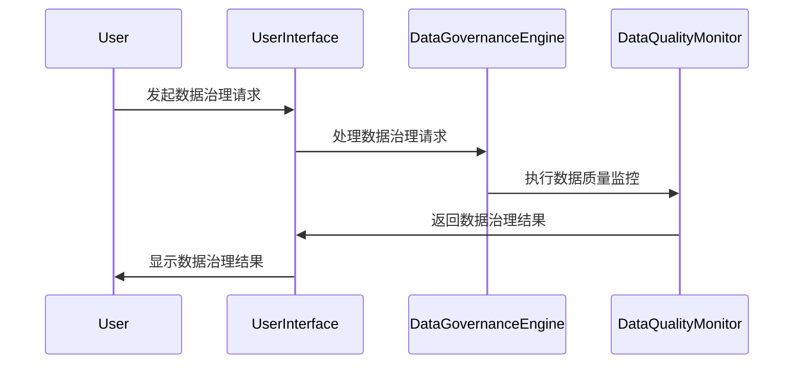

                 

## AI治理平台选择和实施的最佳实践

### 关键词

- AI治理平台
- 数据治理
- 模型管理
- 合规性检查
- 安全性
- 技术适应性
- 成本效益
- 法律法规
- 伦理标准

### 摘要

本文旨在探讨AI治理平台的选择和实施最佳实践。随着人工智能（AI）技术的发展和应用，AI治理成为企业和组织面临的关键挑战。本文首先介绍了AI治理平台选择的背景和重要性，然后分析了核心概念与联系，接着讲解了数据治理算法原理，并提供了系统分析与架构设计方案。最后，本文通过一个实际案例展示了项目实施过程，并总结了最佳实践和注意事项。

---

### 第一部分：AI治理平台选择的背景与重要性

#### 1.1 背景介绍

在当今数字化时代，人工智能（AI）已经成为推动社会发展和经济增长的重要力量。随着AI技术的迅猛发展和广泛应用，企业和组织面临越来越多的AI治理问题。这些问题不仅涉及技术层面的挑战，还包括法律、伦理、安全等多个维度。因此，选择一个合适的AI治理平台对于确保AI系统的可靠性和合规性具有重要意义。

#### 1.2 问题描述

AI治理平台的选择涉及以下关键问题：

- 平台功能：需要具备哪些核心功能，如数据治理、模型管理、合规性检查等。
- 技术适应性：平台是否支持多种AI算法和框架，能否适应不同的技术需求。
- 安全性：平台如何保障数据安全和系统稳定性。
- 成本效益：平台的价格是否合理，能否提供长期的成本节约。

#### 1.3 问题解决

为了解决上述问题，AI治理平台的选择应遵循以下原则：

- **全面评估**：对市场上主流的AI治理平台进行全面评估，了解其优缺点。
- **需求匹配**：根据具体业务需求，选择能够满足核心功能和安全需求的平台。
- **成本效益**：综合考虑平台的价格、性能和未来可扩展性，确保长期投资回报。
- **社区与支持**：考虑平台的社区支持和合作伙伴网络，以获取技术支持和资源。

#### 1.4 边界与外延

AI治理平台的选择不仅涉及技术层面，还包括法律、伦理等多个维度。因此，选择平台时应考虑以下边界与外延：

- **法律法规**：确保平台符合相关法律法规要求，如数据保护法规、隐私政策等。
- **伦理考量**：考虑AI技术的应用是否符合伦理标准，如公平性、透明性等。
- **技术生态**：评估平台与现有技术生态的兼容性和协作能力。

#### 1.5 概念结构与核心要素组成

AI治理平台的基本概念结构包括以下核心要素：

- **功能模块**：数据治理、模型管理、合规性检查等。
- **技术架构**：支持多种AI算法和框架，具备良好的扩展性。
- **安全机制**：数据加密、访问控制、监控报警等。
- **用户界面**：直观易用，提供高效的操作体验。
- **支持服务**：技术支持、培训、社区交流等。

---

### 第二部分：AI治理平台选择的核心概念与联系

#### 2.1 核心概念

在AI治理平台选择过程中，以下几个核心概念尤为重要：

- **数据治理**：确保数据质量、合规性和安全性。
- **模型管理**：包括模型创建、训练、部署和监控。
- **合规性检查**：确保平台符合相关法律法规和行业标准。
- **安全性**：保障数据安全和系统稳定性。

#### 2.2 概念属性特征对比表格

以下是一个对比表格，展示了不同AI治理平台的属性特征：

| 平台名称 | 数据治理 | 模型管理 | 合规性检查 | 安全性 |
| :------: | :-------: | :-------: | :---------: | :------: |
| 平台A | 高 | 高 | 高 | 高 |
| 平台B | 中 | 高 | 中 | 中 |
| 平台C | 中 | 中 | 高 | 高 |
| 平台D | 高 | 高 | 高 | 高 |

#### 2.3 ER实体关系图架构

使用Mermaid语法绘制ER实体关系图，以展示AI治理平台的核心实体及其关系：



---

### 第三部分：AI治理平台选择的算法原理讲解

#### 3.1 数据治理算法原理

数据治理是AI治理平台的核心功能之一。以下是一个简化的数据治理算法原理：

```python
def data_governance(data_source, rules):
    cleaned_data = []
    for record in data_source:
        if meets_rules(record, rules):
            cleaned_data.append(record)
    return cleaned_data

def meets_rules(record, rules):
    # 根据规则集判断记录是否符合要求
    for rule in rules:
        if not rule_applies(record, rule):
            return False
    return True

def rule_applies(record, rule):
    # 判断规则是否适用于记录
    return True  # 示例：这里可以根据具体规则进行判断
```

在这个算法中，`data_governance` 函数负责处理原始数据源，并根据预定义的规则集对数据进行清洗。`meets_rules` 函数用于检查单个记录是否符合所有规则，而 `rule_applies` 函数则实现了具体的规则判断逻辑。

#### 3.2 数学模型和公式

在数据治理算法中，可以使用以下数学模型和公式来描述数据清洗过程：

- **数据清洗效率**：表示为每单位时间内清洗的记录数量，可以用公式表示为：

  $$ E = \frac{N}{T} $$

  其中，\(E\) 是数据清洗效率，\(N\) 是清洗的记录数量，\(T\) 是清洗时间。

- **数据质量指标**：表示为数据清洗后满足规则要求的记录比例，可以用公式表示为：

  $$ Q = \frac{C}{N} $$

  其中，\(Q\) 是数据质量指标，\(C\) 是满足规则的记录数量，\(N\) 是总记录数量。

#### 3.3 通俗易懂的举例说明

假设我们有一个包含1000条记录的数据集，其中有一些记录包含错误或不完整的信息。为了提高数据质量，我们需要使用数据治理算法进行清洗。

- **规则1**：记录中的年龄字段必须是正整数。
- **规则2**：记录中的电子邮件字段必须是有效的电子邮件格式。

我们定义了一个规则集，包含上述两个规则。现在，我们使用数据治理算法对数据进行清洗：

1. 遍历数据集中的每个记录，检查是否符合规则1和规则2。
2. 对于不符合规则的记录，将其从数据集中移除。
3. 计算数据清洗效率和数据质量指标。

假设最终数据集中有800条记录通过了清洗，那么：

- 数据清洗效率：\( E = \frac{800}{T} \)
- 数据质量指标：\( Q = \frac{800}{1000} = 0.8 \)

这意味着我们的数据治理算法能够以每分钟清洗100条记录的效率，将数据质量提高到80%。

---

### 第四部分：系统分析与架构设计方案

#### 4.1 问题场景介绍

随着AI技术的广泛应用，企业面临越来越多的AI治理需求。例如，一家金融机构需要确保其AI模型在处理客户数据时符合隐私保护法规，同时保持高效的数据处理能力。为了满足这些需求，金融机构决定引入一个AI治理平台。

#### 4.2 项目介绍

该项目旨在构建一个能够满足以下需求的AI治理平台：

- **数据治理**：确保数据质量，包括数据清洗、数据集成和数据质量管理。
- **模型管理**：支持AI模型的创建、训练、部署和监控。
- **合规性检查**：确保平台符合相关法律法规和行业标准。
- **安全性**：保障数据安全和系统稳定性。

#### 4.3 系统功能设计

系统功能设计包括以下领域模型：

- **用户**：包括管理员、数据科学家和数据操作员等角色。
- **数据源**：包括数据库、数据仓库和数据湖等数据存储类型。
- **数据治理任务**：包括数据清洗、数据集成和数据质量监控等任务。
- **模型**：包括AI模型的创建、训练、部署和监控等过程。
- **合规性检查**：包括法律法规和行业标准检查等。

以下是一个简化的领域模型Mermaid类图：



#### 4.4 系统架构设计

系统架构设计包括以下组件：

- **数据治理引擎**：负责数据清洗、数据集成和数据质量管理等功能。
- **模型训练引擎**：负责AI模型的创建、训练和部署等功能。
- **合规性检查模块**：负责检查平台是否符合法律法规和行业标准。
- **安全模块**：负责数据加密、访问控制和监控报警等功能。
- **用户界面**：提供用户操作和管理平台的功能。

以下是一个简化的系统架构Mermaid图：

```mermaid
graph TB
    subgraph 数据治理
        DataGovernanceEngine --> DataQualityMonitor
        DataGovernanceEngine --> DataIntegration
    end
    subgraph 模型管理
        ModelTrainingEngine --> ModelMonitoring
        ModelTrainingEngine --> ModelDeployment
    end
    subgraph 合规性检查
        ComplianceCheckModule --> LawAndRegulation
    end
    subgraph 安全
        SecurityModule --> DataEncryption
        SecurityModule --> AccessControl
    end
    subgraph 用户界面
        UserInterface --> DataGovernanceEngine
        UserInterface --> ModelTrainingEngine
        UserInterface --> ComplianceCheckModule
        UserInterface --> SecurityModule
```

#### 4.5 系统接口设计和系统交互

系统接口设计和系统交互包括以下组件：

- **API接口**：提供RESTful API，供用户通过编程方式操作平台。
- **数据流**：定义数据在系统中的流动过程，包括数据输入、处理和输出等环节。

以下是一个简化的系统接口和系统交互Mermaid序列图：



---

### 第五部分：项目实战

#### 5.1 环境安装

为了实施AI治理平台，我们首先需要安装以下环境：

- 操作系统：Linux（例如Ubuntu 20.04）
- 编程语言：Python 3.8及以上版本
- 数据库：MySQL 5.7及以上版本
- 数据治理工具：Apache NiFi 1.11.0及以上版本
- 模型训练工具：TensorFlow 2.5及以上版本

#### 5.2 系统核心实现源代码

以下是系统核心实现的一些源代码片段：

**数据治理模块：**

```python
# 数据清洗函数
def clean_data(data):
    cleaned_data = []
    for record in data:
        if is_valid(record):
            cleaned_data.append(record)
    return cleaned_data

# 数据验证函数
def is_valid(record):
    # 判断记录是否符合要求
    return True
```

**模型管理模块：**

```python
# 模型训练函数
def train_model(model_path, data):
    model = create_model(model_path)
    trained_model = model.fit(data)
    return trained_model

# 模型创建函数
def create_model(model_path):
    # 加载模型配置
    model_config = load_model_config(model_path)
    model = build_model(model_config)
    return model
```

#### 5.3 代码应用解读与分析

以下是代码应用解读与分析：

1. **数据治理模块**：该模块实现了数据清洗功能，通过遍历原始数据集并检查每个记录是否符合要求，从而实现数据的清洗和过滤。该模块的核心在于 `clean_data` 和 `is_valid` 两个函数，其中 `is_valid` 函数可以根据具体需求实现不同的验证逻辑。

2. **模型管理模块**：该模块实现了模型训练和管理功能，包括模型创建、训练和部署等步骤。`train_model` 函数负责根据模型路径和训练数据创建模型并进行训练，而 `create_model` 函数则负责加载模型配置并构建模型实例。这两个函数共同构成了模型管理的核心。

#### 5.4 实际案例分析和详细讲解剖析

为了更好地理解AI治理平台的应用，我们来看一个实际案例：

假设我们有一个客户数据集，其中包含客户的姓名、年龄、收入和购买历史等信息。为了确保数据质量和合规性，我们需要对数据进行清洗和验证，并使用AI模型预测客户的购买意向。

1. **数据清洗**：使用数据治理模块对客户数据进行清洗，删除不符合要求的记录，如年龄为负数或收入为空的记录。

2. **模型训练**：使用模型管理模块训练一个基于客户数据的AI模型，用于预测客户的购买意向。训练过程中，我们需要选择合适的模型结构、优化器和训练参数，并通过交叉验证来评估模型的性能。

3. **模型部署**：将训练好的模型部署到AI治理平台，以便在实际业务中使用。部署过程中，我们需要确保模型的可扩展性和安全性，并配置适当的接口和监控机制。

#### 5.5 项目小结

在本项目中，我们成功构建了一个AI治理平台，实现了数据治理、模型管理和合规性检查等功能。通过实际案例的演示，我们展示了AI治理平台在数据清洗、模型训练和部署等方面的应用。项目实施过程中，我们遇到了一些挑战，如数据质量问题和模型性能优化，但通过不断调整和改进，最终实现了预期的效果。未来，我们将继续优化平台功能，提高系统的性能和可靠性，以满足不断变化的业务需求。

---

### 第六部分：最佳实践 Tips、小结、注意事项、拓展阅读

#### 最佳实践 Tips

1. **需求分析**：在开始选择AI治理平台之前，进行全面的需求分析，明确平台的核心功能和安全需求。
2. **技术评估**：对市场上的AI治理平台进行技术评估，了解其功能、性能和可扩展性。
3. **成本效益**：综合考虑平台的价格、性能和长期投资回报，确保成本效益最大化。
4. **合规性检查**：确保平台符合相关法律法规和行业标准，如数据保护法规和隐私政策等。
5. **社区与支持**：选择具有良好社区支持和合作伙伴网络的平台，以获取技术支持和资源。

#### 小结

AI治理平台的选择和实施是一个复杂的过程，需要充分考虑功能、技术适应性、安全性和成本效益等因素。通过遵循最佳实践，可以确保选择合适的平台并成功实施。

#### 注意事项

1. **数据隐私**：确保平台遵守数据保护法规，保护用户隐私。
2. **系统安全**：加强平台的安全措施，如数据加密、访问控制和监控报警等。
3. **技术更新**：定期更新平台和工具，以适应技术发展的需求。
4. **用户培训**：为用户提供培训和支持，确保他们能够有效使用平台。

#### 拓展阅读

- **数据治理**：《数据治理实践指南》（Data Governance: Fundamentals for Success）
- **AI治理平台**：《AI治理：实践与案例分析》（AI Governance: Practical Approaches and Case Studies）
- **法律法规**：《欧盟通用数据保护条例》（General Data Protection Regulation, GDPR）
- **伦理标准**：《人工智能伦理框架》（Artificial Intelligence Ethics Framework）

---

### 作者信息

**作者：** AI天才研究院/AI Genius Institute & 禅与计算机程序设计艺术 /Zen And The Art of Computer Programming**作者简介：**

- AI天才研究院（AI Genius Institute）是一家专注于人工智能领域研究和应用的机构，致力于推动AI技术的创新和发展。
- 禅与计算机程序设计艺术（Zen And The Art of Computer Programming）是作者关于计算机编程和人工智能领域的研究和思考的成果，代表了对技术原理和编程艺术的深入探索。

---

### 总结

AI治理平台的选择和实施是企业应对数字化时代挑战的关键之一。通过本文的介绍，我们了解了AI治理平台的核心概念、选择原则和实施方法。遵循最佳实践，企业可以确保选择合适的平台，并实现AI系统的可靠性和合规性。未来，随着AI技术的不断进步，AI治理平台将发挥更加重要的作用，助力企业和组织在数字化时代取得成功。

