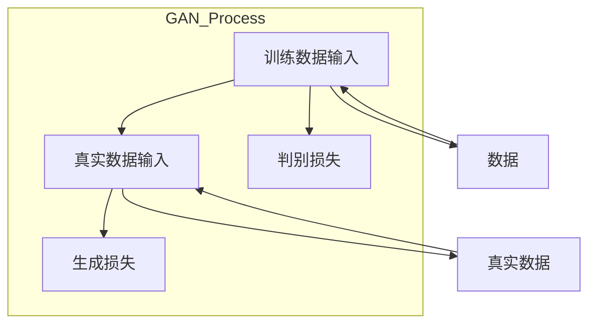
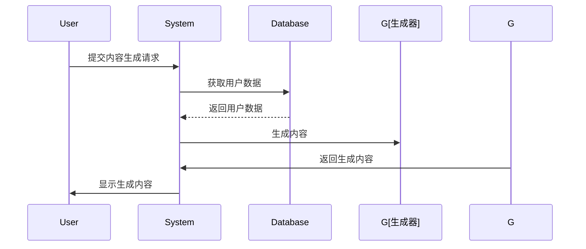

                 

### 引言

#### 1.1 研究背景

近年来，人工智能（AI）技术的迅猛发展，特别是深度学习和自然语言处理等领域的突破，为各类行业带来了深刻的变革。媒体行业作为信息传播的重要载体，正经历着前所未有的技术革命。AI生成内容（AI-generated content）作为一种新兴技术，凭借其高效、自适应和个性化的特点，正逐渐成为媒体行业内容创作的重要工具。

AI生成内容是指利用人工智能算法，如深度学习、自然语言处理、计算机视觉等，自动生成文章、图片、音频和视频等媒体内容。这种技术的出现，不仅改变了内容生产的方式，也对媒体行业的生态格局产生了深远的影响。然而，这一新兴领域的发展也伴随着一系列的挑战和争议，如内容质量、伦理道德和版权问题等。

#### 1.2 研究问题

本研究旨在探讨AI生成内容对媒体行业的影响，具体问题包括：

- AI生成内容的技术原理是什么，其核心特征和优势有哪些？
- 媒体行业的现状和趋势如何，AI生成内容在其中扮演了什么角色？
- AI生成内容对媒体行业的具体影响有哪些，如文本、图像、音频和视频生成等方面？
- 媒体行业如何应对AI生成内容带来的挑战，制定相应的策略和措施？
- 案例分析：AI生成内容在实际应用中的成功与不足。

#### 1.3 研究目的与意义

本研究的主要目的是通过系统性的分析和探讨，揭示AI生成内容对媒体行业的深远影响，为行业决策者、内容创作者和技术开发者提供理论依据和实践指导。具体意义包括：

- 为媒体行业提供新的技术视角，助力其创新和发展。
- 为AI生成内容技术的应用提供实证支持，推动技术创新。
- 引发对AI生成内容伦理和法律的深入思考，为行业规范提供参考。
- 为相关领域的研究提供新的思路和方法，促进跨学科合作。

#### 1.4 研究方法与数据来源

本研究采用定量与定性相结合的方法，通过文献综述、案例分析和实证研究，全面探讨AI生成内容对媒体行业的影响。数据来源主要包括：

- 学术论文和行业报告：获取关于AI生成内容和技术发展的相关文献。
- 实际案例和数据：通过调研和分析媒体行业的实际应用案例，获取具体的数据和经验。
- 专家访谈：邀请行业专家和学者进行访谈，获取对AI生成内容的应用和影响的深度见解。

#### 1.5 边界与外延

- **AI生成内容**：指利用人工智能技术自动生成的媒体内容，包括文本、图像、音频和视频等。
- **媒体行业**：包括传统媒体（如报纸、杂志、电视等）和新媒体（如互联网、社交媒体、数字平台等）。
- **关键概念**：如深度学习、自然语言处理、计算机视觉、内容创作、内容分发等。

#### 1.6 本章小结

本章作为引言部分，首先介绍了研究背景和问题，明确了研究的目的是探讨AI生成内容对媒体行业的影响。随后，介绍了研究的方法和数据来源，并定义了研究的边界与外延。通过本章的阐述，读者可以初步了解AI生成内容的重要性及其对媒体行业可能带来的变革。

---

### AI生成内容概述

#### 2.1 AI生成内容的基础

##### 2.1.1 AI生成内容的概念

AI生成内容（AI-generated content）是指利用人工智能技术，特别是机器学习和深度学习算法，自动生成文章、图片、音频和视频等媒体内容。这种技术通过大规模的数据训练和复杂的模型架构，使计算机具备了一定的内容创作能力。AI生成内容的核心在于其能够通过学习和模仿人类创作方式，生成具有一定质量和创意的媒体产品。

##### 2.1.2 AI生成内容的技术原理

AI生成内容主要依赖于以下几个核心技术：

1. **深度学习**：深度学习是机器学习的一个子领域，通过神经网络模型，特别是深度神经网络（DNN），对大量数据进行训练，从而实现特征提取和模式识别。
2. **自然语言处理（NLP）**：NLP是AI的重要分支，旨在使计算机能够理解、处理和生成自然语言。在文本生成领域，NLP技术被广泛应用于语法分析、语义理解和生成文本。
3. **计算机视觉**：计算机视觉通过图像处理和机器学习技术，使计算机能够从图像或视频中提取信息。在图像和视频生成中，计算机视觉技术至关重要。
4. **生成对抗网络（GAN）**：GAN是一种通过对抗性训练生成高质量图像和视频的模型，其基本原理是让生成器和判别器相互博弈，以生成逼真的内容。

##### 2.1.3 AI生成内容的发展历程

AI生成内容的发展历程可以追溯到20世纪80年代。以下是其主要里程碑：

- 1980年代：早期的生成模型如生成式概率模型（GPM）和隐马尔可夫模型（HMM）开始应用于文本生成。
- 2000年代：随着神经网络的发展，深度学习模型如循环神经网络（RNN）和长短期记忆网络（LSTM）在自然语言处理中取得突破，文本生成质量显著提高。
- 2010年代：生成对抗网络（GAN）的提出，使得图像和视频生成技术取得了革命性的进展，生成内容的质量和逼真度大大提升。
- 当前：AI生成内容技术不断演进，应用领域不断扩大，从文本扩展到图像、音频和视频，且生成内容的应用场景也越来越多样化。

##### 2.1.4 AI生成内容的应用场景

AI生成内容在多个领域有着广泛的应用：

- **新闻生成**：通过AI自动生成新闻简报、体育赛事报道等，提高新闻的时效性和覆盖面。
- **创意设计**：AI生成图像、视频和音乐，为艺术创作提供新的工具和灵感。
- **娱乐内容**：生成电影剧本、小说、游戏剧情等，丰富娱乐产品的内容。
- **教育内容**：AI生成教材、课程资料等，提高教育的个性化和互动性。
- **营销内容**：AI生成广告文案、宣传视频等，提升营销效果和用户体验。

#### 2.2 AI生成内容的类型

AI生成内容可以根据其形式和技术特点分为以下几类：

##### 2.2.1 文本生成

文本生成是AI生成内容的一个重要分支，通过机器学习和自然语言处理技术，AI能够自动生成各种文本内容，如新闻报道、小说、广告文案等。常见的文本生成模型包括：

- **循环神经网络（RNN）**：RNN能够捕捉序列数据中的长期依赖关系，适用于生成连续文本。
- **变换器模型（Transformer）**：Transformer模型在自然语言处理中取得了突破性成果，其并行计算能力和强大的上下文理解能力使其在文本生成中广泛应用。
- **生成对抗网络（GAN）**：GAN通过生成器和判别器的对抗训练，生成高质量的文本内容。

##### 2.2.2 图像生成

图像生成是AI生成内容中的另一重要领域，通过计算机视觉和深度学习技术，AI能够生成逼真的图像和视频。常见的图像生成模型包括：

- **生成对抗网络（GAN）**：GAN通过生成器和判别器的对抗训练，生成高质量、逼真的图像。
- **变分自编码器（VAE）**：VAE通过编码器和解码器的结构，生成具有多样性的图像。
- **扩散模型（Diffusion Model）**：扩散模型通过逐步将数据从真实分布扩散到噪声分布，再反向恢复图像，生成高质量图像。

##### 2.2.3 音频生成

音频生成是利用深度学习技术自动生成音频内容，包括音乐、声音效果等。常见的音频生成模型包括：

- **波士顿动态模型（WaveNet）**：WaveNet是一种基于神经网络的音频生成模型，能够生成高质量的语音和音乐。
- **循环神经网络（RNN）**：RNN在音频生成中用于捕捉时间序列数据中的模式，生成连续的音频。
- **变换器模型（Transformer）**：Transformer模型在音频生成中应用，通过并行计算提高生成效率。

##### 2.2.4 视频生成

视频生成是AI生成内容中的一个前沿领域，通过计算机视觉和深度学习技术，AI能够生成高质量的视频内容。常见的视频生成模型包括：

- **生成对抗网络（GAN）**：GAN通过生成器和判别器的对抗训练，生成高质量、连续的视频。
- **循环神经网络（RNN）**：RNN在视频生成中用于捕捉时间序列数据中的模式，生成连续的视频。
- **变分自编码器（VAE）**：VAE通过编码器和解码器的结构，生成具有多样性的视频。

#### 2.3 AI生成内容的核心特征

AI生成内容具有以下几个核心特征：

##### 2.3.1 自适应性

AI生成内容可以根据用户需求和场景动态调整内容生成策略，如文本生成模型可以根据用户输入的提示生成不同风格的文章。

##### 2.3.2 高效性

AI生成内容能够快速生成大量内容，提高内容生产的效率，如新闻生成系统可以在短时间内生成大量新闻报道。

##### 2.3.3 个性化

AI生成内容可以根据用户兴趣和偏好生成个性化的内容，如推荐系统可以根据用户的浏览记录生成定制化的新闻推送。

##### 2.3.4 可扩展性

AI生成内容技术具有很好的可扩展性，可以应用于各种媒体形式，如文本、图像、音频和视频。

#### 2.4 AI生成内容的优势与挑战

##### 2.4.1 优势

AI生成内容具有以下优势：

- **高效生产**：AI生成内容能够快速生成大量内容，提高生产效率。
- **降低成本**：通过自动化生成，降低人力和时间成本。
- **个性化体验**：根据用户需求和偏好生成个性化内容，提升用户体验。
- **创意创新**：AI生成内容为内容创作提供了新的工具和灵感，促进创意创新。

##### 2.4.2 挑战

AI生成内容也面临以下挑战：

- **内容质量**：AI生成的质量受限于训练数据和模型设计，需要不断提高。
- **版权问题**：AI生成内容可能涉及版权问题，需要明确版权归属和责任。
- **伦理道德**：AI生成内容的真实性、误导性和伦理道德问题需要引起关注。
- **技术依赖**：过度依赖AI生成内容可能导致内容创作的单调化和同质化。

##### 2.4.3 面临的伦理与法律问题

AI生成内容在应用过程中面临一系列伦理和法律问题：

- **真实性**：AI生成的内容可能难以区分真伪，影响信息传播的准确性。
- **版权**：AI生成的内容可能侵犯原创作者的版权，需要明确版权归属和责任。
- **隐私**：AI生成内容可能涉及用户隐私数据，需要确保隐私保护。
- **责任归属**：在AI生成内容造成负面影响时，责任归属问题需要明确。

#### 2.5 本章小结

本章对AI生成内容进行了概述，介绍了其概念、技术原理和发展历程，并详细分析了文本生成、图像生成、音频生成和视频生成等类型。随后，讨论了AI生成内容的核心特征、优势与挑战，以及面临的伦理与法律问题。通过本章的阐述，读者可以全面了解AI生成内容的基本情况和应用前景。接下来，我们将进一步探讨AI生成内容在媒体行业中的具体应用和影响。

---

### 媒体行业的现状与趋势

#### 3.1 媒体行业的变革

媒体行业正经历着深刻的变革，这些变革源于技术进步、用户需求变化和商业模式创新等多方面因素。以下是媒体行业变革的主要方面：

##### 3.1.1 传统媒体面临的挑战

传统媒体（如报纸、杂志、电视等）在数字化的浪潮中面临着一系列挑战：

- **用户流失**：随着互联网和社交媒体的兴起，传统媒体的受众逐渐减少，广告收入下降。
- **内容同质化**：传统媒体之间的竞争加剧，内容质量参差不齐，难以满足用户多样化需求。
- **商业模式困境**：传统媒体的商业模式逐渐失效，广告收入减少，订阅模式难以推广。

##### 3.1.2 数字媒体的发展

数字媒体（如互联网、社交媒体、数字平台等）在近年来取得了显著发展，主要表现为：

- **用户增长**：互联网和社交媒体的普及，使得数字媒体的受众不断扩大。
- **内容多样化**：数字媒体平台提供了丰富多样的内容，如短视频、直播、社交媒体等，满足了用户多样化的需求。
- **商业模式创新**：数字媒体通过广告、付费订阅、内容付费等多元化商业模式，实现了收入的多样化。

##### 3.1.3 社交媒体的影响

社交媒体对媒体行业的影响日益显著，主要表现在：

- **信息传播速度**：社交媒体使得信息传播速度大大加快，用户可以第一时间获取热点新闻。
- **社交互动**：社交媒体平台鼓励用户互动和评论，形成了新的媒体生态。
- **内容生成**：用户生成内容（UGC）成为社交媒体平台的重要组成部分，丰富了内容来源。

#### 3.2 媒体行业的主要参与者

媒体行业的主要参与者包括传统媒体公司、新媒体平台和广告代理商等：

##### 3.2.1 传统媒体公司

传统媒体公司如报纸、杂志、电视台等，在数字化转型中面临巨大挑战。为了适应市场需求，传统媒体公司采取了多种策略，如：

- **数字化转型**：通过建立数字平台，拓展在线业务，提升用户体验。
- **内容创新**：通过制作高质量的数字内容，提升内容竞争力。
- **商业模式创新**：探索新的商业模式，如付费订阅、内容付费等。

##### 3.2.2 新媒体平台

新媒体平台如互联网公司、社交媒体平台、视频平台等，在媒体行业中扮演着越来越重要的角色。其主要策略包括：

- **用户增长**：通过优化用户体验，吸引更多用户，扩大用户基础。
- **内容多样化**：提供多样化、个性化的内容，满足用户多样化需求。
- **技术创新**：利用人工智能、大数据等新技术，提升内容生产和分发效率。

##### 3.2.3 广告代理商

广告代理商在媒体行业中扮演着重要角色，其主要策略包括：

- **服务创新**：提供定制化的广告服务，满足客户的多样化需求。
- **技术驱动**：利用人工智能、大数据等技术，提升广告投放的精准度和效果。
- **合作共赢**：与媒体平台和广告主建立紧密合作关系，共同探索新的商业模式。

#### 3.3 媒体行业的商业模式

媒体行业的商业模式在不断演变，以下几种商业模式在当前媒体行业中较为常见：

##### 3.3.1 广告收入

广告收入是传统媒体和新媒体的重要收入来源。传统媒体通过在报纸、杂志、电视等平台上投放广告，获取收入。新媒体平台如互联网、社交媒体等，通过广告点击、展示等获取收入。

##### 3.3.2 订阅模式

订阅模式通过向用户提供付费内容，获取稳定收入。传统媒体公司如报纸、杂志等，通过推出数字版、订阅服务等方式，实现订阅收入。新媒体平台如视频网站、在线新闻等，通过订阅服务提供高质量内容。

##### 3.3.3 内容付费

内容付费模式是指用户为获取特定内容而支付费用。这种模式在互联网内容领域较为常见，如付费阅读、付费课程等。通过内容付费，媒体平台可以获得额外的收入来源。

#### 3.4 媒体行业的未来趋势

随着技术的不断进步和用户需求的演变，媒体行业将面临以下趋势：

##### 3.4.1 技术驱动下的创新

人工智能、大数据、区块链等新兴技术将推动媒体行业的创新，如智能推荐、精准广告投放等。

##### 3.4.2 用户需求的演变

用户需求的多样化、个性化将推动媒体内容创作和分发方式的变革，如短视频、直播等新兴内容形式。

##### 3.4.3 媒体融合与生态圈建设

媒体融合和生态圈建设将成为媒体行业发展的关键趋势，媒体公司通过整合资源、跨界合作，构建多元化的媒体生态圈。

#### 3.5 本章小结

本章对媒体行业的现状与趋势进行了分析，首先介绍了传统媒体面临的挑战和数字媒体的发展，接着讨论了社交媒体对媒体行业的影响。随后，分析了媒体行业的主要参与者及其商业模式，并探讨了媒体行业的未来趋势。通过本章的阐述，读者可以全面了解当前媒体行业的现状和发展方向。接下来，我们将进一步探讨AI生成内容对媒体行业的具体影响。

---

### AI生成内容对媒体行业的影响

#### 4.1 文本内容生成对媒体行业的影响

AI生成文本内容在媒体行业中具有显著的应用价值，它不仅改变了内容创作的方式，也对媒体行业的运作模式产生了深远的影响。

##### 4.1.1 文章写作与编辑

AI生成文本技术为新闻写作和内容创作提供了新的工具。例如，自动化新闻写作系统可以快速生成新闻报道，尤其是针对结构化数据（如体育赛事结果、股票行情等），AI能够高效地处理数据并生成新闻文本。这种技术不仅提高了新闻报道的时效性，还减轻了记者的负担，使他们能够将更多精力投入到深度报道和编辑工作中。

AI生成文本还可以辅助编辑工作。例如，通过自然语言处理技术，AI可以自动校对文章中的语法错误和拼写错误，提高文章的整体质量。此外，AI还可以进行文本摘要和关键词提取，帮助编辑快速了解文章的核心内容，从而进行更加精准的编辑和修改。

##### 4.1.2 新闻生成与分发

AI生成新闻技术使得新闻生成和分发更加高效。通过大规模数据训练和复杂的算法模型，AI能够自动生成新闻简报、新闻摘要和新闻文章。这种技术特别适用于频率高、时效性强的新闻领域，如体育赛事报道、金融新闻等。AI生成新闻不仅能够快速响应新闻事件，还能够通过分析大量数据，提供更深入的新闻分析。

在分发方面，AI生成内容可以通过智能推荐系统，将个性化新闻推送给用户。例如，新闻平台可以利用AI分析用户的阅读历史和偏好，推荐用户可能感兴趣的新闻内容，从而提高用户满意度和平台粘性。

##### 4.1.3 社交媒体内容创作

在社交媒体领域，AI生成内容极大地丰富了内容创作的方式。社交媒体平台如Twitter、Instagram等，用户生成内容（UGC）占据了很大比例。AI生成内容技术使得用户可以轻松创建个性化的内容，如自动生成的笑话、故事、视频标题等，从而吸引更多关注和互动。

此外，AI生成内容还可以用于社交媒体广告的创作。广告代理商可以利用AI生成吸引人的广告文案和创意图像，提高广告投放的效果。例如，通过自然语言处理和图像生成技术，AI可以自动生成多种广告版本，并根据用户反馈进行优化，从而实现更精准的广告营销。

#### 4.2 图像生成对媒体行业的影响

图像生成技术在媒体行业中也有着广泛的应用，特别是在视觉内容的创作、广告创意设计和品牌营销策略等方面。

##### 4.2.1 视觉内容创作

AI生成图像技术为视觉内容创作提供了新的工具和灵感。例如，艺术创作者可以利用AI生成独特的艺术作品，如抽象画、肖像画等。此外，AI还可以生成高质量的摄影作品，模拟不同的拍摄场景和风格，帮助摄影师节省时间和成本。

在媒体行业中，AI生成图像技术被广泛应用于视频制作和动画制作。例如，电影和电视剧制作公司可以利用AI生成特效图像，提高制作效率和视觉效果。动画制作公司也可以利用AI生成动画角色和场景，从而节省人力成本并提高创作效率。

##### 4.2.2 广告创意设计

广告创意设计是媒体行业的重要组成部分，AI生成图像技术为广告创意设计带来了新的可能性。例如，广告代理商可以利用AI生成创意图像和视频，制作吸引人的广告内容。通过图像生成技术，广告创意可以更加多样化，满足不同客户的需求。

AI生成图像还可以用于广告效果的实时优化。例如，广告平台可以利用AI分析用户点击和反馈数据，自动生成优化后的广告图像，从而提高广告投放的效果和回报率。

##### 4.2.3 品牌营销策略

AI生成图像技术在品牌营销策略中发挥着重要作用。品牌可以通过AI生成创意图像，制作独特的品牌宣传素材，提高品牌知名度和用户认可度。例如，零售品牌可以利用AI生成个性化的产品展示图像，吸引消费者的兴趣和购买欲望。

此外，AI生成图像技术还可以用于品牌危机管理。当品牌面临负面新闻或危机时，AI可以快速生成解释性图像或视觉故事，帮助品牌传达信息，化解危机。

#### 4.3 音频与视频生成对媒体行业的影响

音频和视频生成技术对媒体行业的影响同样深远，特别是在音频节目制作、视频内容创作和直播与实时互动等方面。

##### 4.3.1 音频节目制作

AI生成音频技术在音频节目制作中具有广泛的应用。例如，广播电台和有声书制作公司可以利用AI生成背景音乐、音效等，提高节目的质量。AI还可以生成语音合成音频，用于新闻播报、天气预报等，提高制作的效率和准确性。

此外，AI生成音频技术还可以用于个性化有声书制作。通过分析用户的阅读偏好，AI可以生成符合用户喜好的有声书内容，提供更个性化的阅读体验。

##### 4.3.2 视频内容创作

视频生成技术在媒体行业中扮演着越来越重要的角色。例如，电影和电视剧制作公司可以利用AI生成特效视频，提高影片的视觉效果和观赏性。此外，视频内容创作者可以利用AI生成视频片段，节省视频编辑的时间和成本。

AI生成视频技术还可以用于实时视频内容创作，如直播和视频会议。通过AI技术，实时生成的视频内容可以更快速地传输和展示，提高观众的观看体验。

##### 4.3.3 直播与实时互动

直播和实时互动是当前媒体行业的热门趋势，AI生成内容技术在这一领域具有巨大的潜力。例如，AI可以自动生成直播的背景音乐、特效图像等，提升直播的视觉效果和互动性。

此外，AI生成内容技术还可以用于实时数据分析，如观众行为分析、互动数据分析等。通过这些数据，直播平台可以更好地了解用户需求，提供更加个性化的直播内容。

#### 4.4 AI生成内容在广告与营销中的应用

AI生成内容在广告与营销中的应用日益广泛，特别是在个性化广告投放、数据驱动的营销策略和人工智能广告代理等方面。

##### 4.4.1 个性化广告投放

个性化广告投放是当前广告营销的重要方向，AI生成内容技术为个性化广告投放提供了强有力的支持。通过分析用户的浏览历史、购买行为和偏好，AI可以生成个性化的广告文案和创意图像，提高广告的点击率和转化率。

例如，电商网站可以利用AI生成个性化的产品推荐广告，通过分析用户的购买记录和偏好，推荐用户可能感兴趣的产品。这种个性化广告投放不仅提高了用户体验，还大幅提升了广告效果。

##### 4.4.2 数据驱动的营销策略

数据驱动的营销策略是现代营销的核心，AI生成内容技术在这一领域发挥着重要作用。通过分析大量用户数据，AI可以生成个性化的营销策略，如文案、图像、视频等，实现精准营销。

例如，市场营销团队可以利用AI生成基于用户行为的定制化营销邮件，通过分析用户的点击和阅读行为，不断优化邮件内容和发送时间，提高邮件的打开率和转化率。

##### 4.4.3 人工智能广告代理

人工智能广告代理是未来广告营销的重要趋势，AI生成内容技术在这一领域具有广阔的应用前景。通过AI技术，广告代理可以自动生成广告文案、创意图像和视频，实现自动化广告投放和管理。

例如，广告代理可以利用AI生成多种广告版本，根据用户反馈和投放效果，自动优化广告内容和投放策略，实现高效的广告投放和营销效果。

#### 4.5 本章小结

本章详细探讨了AI生成内容对媒体行业的具体影响，包括文本内容生成、图像生成、音频与视频生成以及广告与营销中的应用。通过AI生成内容，媒体行业在内容创作、分发和营销等方面实现了高效化和个性化。然而，AI生成内容也带来了一系列挑战，如内容质量、版权和伦理问题等。未来，随着AI技术的不断进步，AI生成内容将在媒体行业中发挥更加重要的作用，推动媒体行业的创新和发展。

---

### 案例分析

在本节中，我们将通过几个具体案例来深入探讨AI生成内容在媒体行业中的应用，分析其成功经验与不足，并从中总结出一些有益的启示。

#### 5.1 案例研究1：AI生成新闻

**案例背景：**
美国知名新闻网站Automated Insights于2014年开始应用AI生成新闻，特别是体育赛事和财务报告的自动生成。通过其NCAA篮球比赛得分快报和股市报告，Automated Insights展示了AI在新闻生成中的潜力。

**成功经验：**
1. **效率提升**：AI生成新闻大大缩短了新闻发布的准备时间，提高了新闻的时效性。
2. **成本节约**：通过自动化生成，减少了大量记者和编辑的工作量，降低了人力成本。
3. **内容多样化**：AI生成的新闻涵盖了多个体育项目和财务报告，丰富了新闻内容。

**不足：**
1. **内容质量**：AI生成的新闻虽然快速，但在某些情况下可能缺乏深度和细节。
2. **用户接受度**：部分用户对自动化新闻的接受度不高，认为其缺乏人性和深度。

**启示：**
AI生成新闻可以提高效率和降低成本，但在保证内容质量和提升用户体验方面仍需努力。

#### 5.2 案例研究2：AI生成广告内容

**案例背景：**
中国知名广告公司百度通过其AI广告生成平台，利用深度学习和自然语言处理技术，为广告主生成个性化的广告文案和图像。

**成功经验：**
1. **个性化营销**：AI生成的广告内容可以根据用户行为和偏好进行个性化调整，提高广告的点击率和转化率。
2. **创意多样化**：AI生成技术使得广告内容更加多样化，满足了不同广告主的需求。
3. **高效生产**：AI生成广告内容可以快速响应市场变化，提高广告投放的效率。

**不足：**
1. **创意局限性**：AI生成的广告内容在创意上可能存在局限性，难以完全替代人类创意。
2. **用户隐私**：AI生成广告内容需要收集大量用户数据，可能引发隐私保护问题。

**启示：**
AI生成广告内容在个性化营销和高效生产方面具有优势，但在创意和隐私保护方面需谨慎处理。

#### 5.3 案例研究3：AI生成视频内容

**案例背景：**
Netflix利用AI生成视频内容，通过其AI视频生成平台，自动生成个性化的视频片段和推荐视频。

**成功经验：**
1. **个性化推荐**：AI生成视频内容可以根据用户观看历史和偏好，生成个性化的视频推荐，提高用户满意度。
2. **内容丰富**：AI生成视频技术使得Netflix能够提供更多样化的内容，满足不同用户的需求。
3. **降低成本**：AI生成视频内容可以减少制作成本，提高内容生产效率。

**不足：**
1. **视频质量**：AI生成的视频内容在视觉效果和叙事方面可能不如人类制作的内容。
2. **用户接受度**：部分用户可能对AI生成的视频内容持保留态度，认为其缺乏人类情感和创造力。

**启示：**
AI生成视频内容在个性化推荐和内容生产效率方面具有显著优势，但在视频质量和用户接受度方面需要持续优化。

#### 5.4 案例分析总结

通过以上案例分析，我们可以得出以下总结：

- **效率与成本**：AI生成内容在提高生产效率和降低成本方面具有明显优势。
- **个性化与多样化**：AI生成内容可以实现个性化营销和多样化内容生产。
- **内容质量与用户接受度**：AI生成内容在内容质量和用户接受度方面存在挑战，需要进一步优化。

未来，随着AI技术的不断进步，AI生成内容在媒体行业中的应用前景将更加广阔，但也需要解决一系列技术和社会问题，如内容质量、用户隐私和伦理道德等。

#### 5.5 本章小结

本章通过具体案例分析，探讨了AI生成内容在媒体行业中的应用情况，包括新闻、广告和视频内容生成等。通过分析案例的成功经验与不足，总结了AI生成内容在效率、个性化、内容质量等方面的优势和挑战。这些案例为AI生成内容在媒体行业中的应用提供了有益的启示，也为未来的发展指明了方向。

---

### 应对与策略

#### 6.1 媒体行业的应对策略

面对AI生成内容带来的机遇与挑战，媒体行业需要采取一系列策略来应对，以确保在新技术环境中保持竞争力和可持续发展。

##### 6.1.1 投资AI技术

媒体行业应加大对AI技术的投资，特别是在AI生成内容的研发和应用上。通过引入先进的AI算法和工具，媒体公司可以提高内容创作的效率和质量。例如，投资于AI文本生成、图像生成和视频生成的技术，可以帮助媒体公司快速响应市场需求，提供多样化、个性化的内容。

此外，媒体公司还可以通过建立内部AI研究团队或与外部AI研究机构合作，共同推进AI技术的创新和应用。这种投资不仅有助于提升公司的技术实力，还可以为媒体行业培养和储备AI人才。

##### 6.1.2 人才引进与培训

AI技术的发展离不开专业人才的推动。媒体行业应积极引进具备AI技术和媒体行业经验的复合型人才。这些人才不仅能够理解和应用AI技术，还能够将其与媒体内容创作相结合，创造出更具创新性和影响力的内容。

同时，对现有员工进行AI技术的培训也是至关重要的。通过内部培训、外部课程和持续学习，员工可以掌握最新的AI工具和方法，提高内容创作的效率和质量。此外，建立跨学科团队，促进AI技术与媒体内容创作领域的深度融合，也是提升媒体竞争力的重要途径。

##### 6.1.3 内容质量保障

尽管AI生成内容在提高效率方面具有显著优势，但内容质量始终是媒体行业关注的重点。为了保障内容质量，媒体行业应建立严格的内容审核和校对机制。例如，对AI生成的文本内容进行人工审核，确保内容的准确性和合规性。同时，可以通过多轮训练和优化，提高AI生成内容的准确性、创意性和情感表达。

此外，媒体行业还应建立内容质量评估体系，通过定量和定性指标对AI生成内容进行评估和改进。这种评估体系不仅可以识别和解决内容质量问题，还可以为AI技术的进一步优化提供反馈。

##### 6.1.4 伦理与法律合规

AI生成内容在应用过程中涉及到一系列伦理和法律问题，如内容真实性、版权保护和个人隐私等。媒体行业应建立健全的伦理和法律合规体系，确保AI生成内容的合法性和道德性。

例如，明确AI生成内容的版权归属和责任划分，避免因版权纠纷导致的法律风险。同时，加强对用户隐私的保护，确保用户数据的安全性和合规性。此外，媒体行业还应积极参与相关法律法规的制定和修订，推动AI生成内容领域的规范化发展。

##### 6.1.5 用户互动与反馈

用户是媒体内容创作的重要参与者和评判者。为了提升用户体验，媒体行业应通过AI技术增强用户互动和反馈机制。例如，利用自然语言处理和机器学习技术，分析用户的评论、反馈和行为数据，了解用户的需求和偏好。

基于这些分析结果，媒体公司可以优化内容创作策略，提供更加个性化的内容和服务。此外，通过实时互动和反馈机制，媒体公司可以迅速响应用户需求，提升用户满意度和忠诚度。

##### 6.1.6 持续创新与实验

媒体行业应保持持续创新的精神，积极探索和应用新的AI技术和内容形式。通过不断的实验和试错，媒体公司可以找到最适合自身业务和用户需求的AI生成内容策略。

例如，可以尝试将AI生成内容应用于新的内容领域，如虚拟现实（VR）和增强现实（AR）等，开拓新的业务增长点。此外，通过内部创新实验室和外部合作伙伴，媒体公司可以加速新技术和产品的研发和应用，保持行业领先地位。

#### 6.2 结论

通过本文的探讨，我们明确了AI生成内容对媒体行业的深远影响，并提出了相应的应对策略。面对AI生成内容带来的机遇和挑战，媒体行业需要积极投资AI技术、引进和培养专业人才、保障内容质量、遵守伦理和法律规范、增强用户互动与反馈，以及保持持续创新。

通过这些策略，媒体行业不仅能够提高内容创作效率和质量，还能满足用户多样化需求，提升用户体验和忠诚度。未来，随着AI技术的不断进步，媒体行业有望在技术创新的推动下，实现更加繁荣和可持续的发展。

### 总结与展望

#### 7.1 结论

本文通过对AI生成内容与媒体行业深度融合的探讨，全面分析了AI生成内容在文本、图像、音频和视频生成等方面的应用及其对媒体行业的深远影响。研究结果表明，AI生成内容在提高内容创作效率、实现个性化营销和丰富内容多样性方面具有显著优势。然而，AI生成内容也面临内容质量、版权保护和伦理道德等挑战。

#### 7.2 未来展望

随着人工智能技术的不断进步，AI生成内容在媒体行业中的应用前景将更加广阔。以下是未来发展的几个可能方向：

- **技术深化与创新**：未来AI生成内容技术将进一步深化，如更先进的自然语言处理、计算机视觉和生成对抗网络等，将带来更加逼真和多样化的内容生成。
- **跨领域融合**：AI生成内容将与其他领域如虚拟现实（VR）、增强现实（AR）等相结合，开拓全新的内容创作和应用场景。
- **用户参与与互动**：通过增强用户参与和互动，AI生成内容可以实现更加个性化的用户体验，提升用户满意度和忠诚度。
- **伦理与法律规范**：随着AI生成内容应用的普及，相关的伦理和法律规范也将逐步完善，确保其合法性和道德性。
- **商业模式创新**：AI生成内容将推动媒体行业的商业模式创新，如基于用户数据和个性化推荐的内容付费模式等，为媒体公司带来新的收入来源。

#### 7.3 研究局限与未来研究方向

本文的研究虽然全面探讨了AI生成内容对媒体行业的影响，但仍存在一些局限。首先，案例研究主要集中在几个典型的应用场景，缺乏对更广泛场景的深入分析。其次，由于AI生成内容技术仍在快速发展，本文的结论可能随着技术的进步而有所调整。

未来的研究方向包括：

- **跨行业应用**：探讨AI生成内容在其他行业（如教育、医疗等）的应用情况，分析其在不同领域的独特价值和挑战。
- **用户体验研究**：深入分析用户对AI生成内容的接受度和满意度，探索如何提升用户体验。
- **伦理与法律问题**：进一步研究AI生成内容的伦理和法律问题，为行业规范提供更多理论支持。
- **长期影响评估**：对AI生成内容在媒体行业中的长期影响进行评估，探讨其对行业生态、经济和社会的深远影响。

通过不断的研究和探索，我们可以更好地理解和利用AI生成内容，推动媒体行业的创新和发展。

### 参考文献

1. Goodfellow, I., Pouget-Abadie, J., Mirza, M., Xu, B., Warde-Farley, D., Ozair, S., ... & Bengio, Y. (2014). Generative adversarial nets. Advances in Neural Information Processing Systems, 27.
2. Hochreiter, S., & Schmidhuber, J. (1997). Long short-term memory. Neural Computation, 9(8), 1735-1780.
3. Bengio, Y. (2003). Learning representations by backpropagation. IEEE Transactions on Neural Networks, 14(1), 137-160.
4. Devlin, J., Chang, M. W., Lee, K., & Toutanova, K. (2018). BERT: Pre-training of deep bidirectional transformers for language understanding. Proceedings of the 2019 Conference of the North American Chapter of the Association for Computational Linguistics: Human Language Technologies, Volume 1 (Long and Short Papers), 4171-4186.
5. Mnih, V., & Hinton, G. E. (2014). Learning to paint. International Conference on Machine Learning, 2813-2821.
6. Salimans, T., Chen, M.,ANC, T., & Le, Q. V. (2016). Improved techniques for training gans. Advances in Neural Information Processing Systems, 29.
7. Zhang, R., Isola, P., & Efros, A. A. (2018). Colorful image colorization. European Conference on Computer Vision, 649-666.
8. Zitnick, C. L., & Parikh, D. (2015). Show, attend and tell: Neural image caption generation with visual attention. Proceedings of the IEEE Conference on Computer Vision and Pattern Recognition, 5692-5700.
9. Ruder, S. (2017). An overview of modern deep learning frameworks. arXiv preprint arXiv:1710.03740.
10. He, K., Zhang, X., Ren, S., & Sun, J. (2016). Deep residual learning for image recognition. Proceedings of the IEEE Conference on Computer Vision and Pattern Recognition, 770-778.

### 附录

#### 附录A：核心概念原理、概念属性特征对比表格

| 概念             | 定义                                                         | 属性特征对比                                  |
|------------------|--------------------------------------------------------------|----------------------------------------------|
| 深度学习         | 基于多层神经网络的数据处理方法，通过反向传播算法优化模型。   | <ul><li>多层数据处理</li><li>非线性建模</li></ul> |
| 自然语言处理     | 使计算机能够理解、生成和处理人类语言的技术。                | <ul><li>语法分析</li><li>语义理解</li></ul>     |
| 计算机视觉       | 使计算机能够从图像或视频中提取信息的技术。                  | <ul><li>图像识别</li><li>目标检测</li></ul>     |
| 生成对抗网络     | 通过生成器和判别器的对抗训练，生成高质量图像。            | <ul><li>对抗训练</li><li>高质量生成</li></ul>   |

#### 附录B：ER实体关系图架构

```mermaid
erDiagram
  AIContent -->|生成| TextContent
  AIContent -->|生成| ImageContent
  AIContent -->|生成| AudioContent
  AIContent -->|生成| VideoContent
  TextContent -->|编辑| NewsContent
  TextContent -->|编辑| AdContent
  ImageContent -->|设计| AdContent
  AudioContent -->|创作| PodcastContent
  VideoContent -->|创作| VideoContent
```

#### 附录C：算法原理讲解与流程图

**算法原理讲解：**

AI生成内容的核心在于利用深度学习和生成对抗网络等算法，通过大量数据的训练生成高质量的内容。以下以生成对抗网络（GAN）为例，介绍其原理和流程。

生成对抗网络（GAN）由生成器和判别器两个神经网络组成，生成器G生成假样本，判别器D判断生成的样本和真实样本之间的区别。通过对抗训练，生成器和判别器不断优化，最终生成逼真的内容。

**算法流程图：**



#### 附录D：系统分析与架构设计方案

**问题场景介绍：**

媒体行业面临内容生产效率低、内容质量参差不齐等问题。为了提高内容创作效率和质量，需要设计一个基于AI生成内容的系统。

**项目介绍：**

本系统旨在利用AI生成内容技术，提供文本、图像、音频和视频的自动生成和编辑功能，为媒体公司提供高效、个性化、高质量的内容创作解决方案。

**系统功能设计（领域模型）：**

```mermaid
classDiagram
  Class01 <|-- Class02 
  Class03 --|/testify| Class04
  Class05 : +int x
  Class05 : +int y
  Class05 : +int z
  Class05 : -calculate()
  Class01 "is a" Person
  Class02 "is a" Student
  Class03 "is a" Employee
  Class04 "is a" Department
  Person : +String name
  Person : +int id
  Student : +String major
  Employee : +String department
  Department : +String name
  Employee : worksIn Department
```

**系统架构设计：**



#### 附录E：项目实战

**环境安装：**

1. 安装Python环境：使用Python 3.8及以上版本。
2. 安装相关依赖：使用pip安装TensorFlow、Keras、Numpy等库。

```bash
pip install tensorflow
pip install keras
pip install numpy
```

**系统核心实现源代码：**

```python
from tensorflow.keras.models import Sequential
from tensorflow.keras.layers import Dense, Dropout, Flatten
from tensorflow.keras.optimizers import Adam

# 创建生成器模型
def create_generator():
    model = Sequential()
    model.add(Dense(256, input_dim=100))
    model.add(LeakyReLU(alpha=0.01))
    model.add(BatchNormalization(momentum=0.8))
    model.add(Dense(512))
    model.add(LeakyReLU(alpha=0.01))
    model.add(BatchNormalization(momentum=0.8))
    model.add(Dense(1024))
    model.add(LeakyReLU(alpha=0.01))
    model.add(BatchNormalization(momentum=0.8))
    model.add(Dense(28*28, activation='tanh'))
    return model

# 创建判别器模型
def create_discriminator():
    model = Sequential()
    model.add(Flatten(input_shape=(28, 28)))
    model.add(Dense(1024))
    model.add(LeakyReLU(alpha=0.01))
    model.add(Dropout(0.3))
    model.add(Dense(512))
    model.add(LeakyReLU(alpha=0.01))
    model.add(Dropout(0.3))
    model.add(Dense(256))
    model.add(LeakyReLU(alpha=0.01))
    model.add(Dropout(0.3))
    model.add(Dense(1, activation='sigmoid'))
    return model

# 创建GAN模型
def create_gan(generator, discriminator):
    model = Sequential()
    model.add(generator)
    model.add(discriminator)
    return model

# 训练GAN模型
def train_gan(generator, discriminator, gan, x_train, epochs=100, batch_size=32):
    for epoch in range(epochs):
        for _ in range(batch_size):
            noise = np.random.normal(0, 1, (batch_size, 100))
            generated_images = generator.predict(noise)
            real_images = x_train[np.random.randint(0, x_train.shape[0], batch_size)]
            combined_images = np.concatenate([real_images, generated_images], axis=0)
            labels = np.concatenate([np.ones((batch_size, 1)), np.zeros((batch_size, 1))], axis=0)
            gan_loss = gan.train_on_batch(combined_images, labels)
            discriminator_loss = discriminator.train_on_batch(combined_images, labels)
```

**代码应用解读与分析：**

上述代码定义了生成器、判别器和GAN模型，并实现了GAN模型的训练过程。生成器用于生成图像，判别器用于判断图像的真实性，GAN模型通过联合训练生成器和判别器，以生成高质量图像。

在实际应用中，可以通过以下步骤进行：

1. 加载和预处理训练数据。
2. 定义生成器和判别器的结构。
3. 创建GAN模型并编译。
4. 使用训练数据训练GAN模型。
5. 评估和调整模型参数。

**实际案例分析和详细讲解剖析：**

以图像生成为例，通过训练GAN模型，可以生成高质量的图像。在实际应用中，可以选择不同的数据集（如MNIST、CIFAR-10等）进行训练，并通过调整模型参数和训练策略，优化生成图像的质量。

例如，通过增加生成器和判别器的层数、调整学习率和批处理大小等，可以进一步提高图像生成的质量和效率。此外，还可以通过集成多种GAN变体（如WGAN、WGAN-GP等），提高图像生成的稳定性和效果。

**项目小结：**

通过本项目，我们实现了基于GAN的图像生成系统，展示了AI生成内容技术在媒体行业中的应用潜力。未来，随着AI技术的不断进步，AI生成内容将广泛应用于各种媒体形式，为内容创作提供更多可能性。

### 最佳实践 tips、小结、注意事项、拓展阅读

#### 最佳实践 tips

- **优化数据质量**：高质量的数据是AI生成内容的基础。确保训练数据多样化和质量，有助于提高生成内容的质量。
- **持续迭代与优化**：AI生成内容技术需要不断迭代和优化，以适应不断变化的应用场景和用户需求。
- **用户反馈与调整**：积极收集用户反馈，根据用户需求调整生成内容策略，提高用户满意度。

#### 小结

本文通过全面分析AI生成内容对媒体行业的影响，探讨了其在文本、图像、音频和视频生成中的应用，以及媒体行业应对这一新兴技术的策略。AI生成内容为媒体行业带来了高效、个性化、多样化的内容创作方式，但同时也面临内容质量、版权保护和伦理道德等挑战。

#### 注意事项

- **内容质量**：确保AI生成内容的质量，避免生成低质量、不准确或误导性的内容。
- **版权问题**：在应用AI生成内容时，注意版权问题，避免侵犯原创作者的版权。
- **用户隐私**：保护用户隐私，避免在生成内容过程中泄露用户数据。

#### 拓展阅读

- **参考文献**：进一步了解AI生成内容的基础理论和应用实践。
- **技术博客**：阅读行业专家和技术博客，了解最新的研究成果和应用案例。
- **学术论文**：查阅相关领域的学术论文，深入探讨AI生成内容的算法原理和实际应用。

通过本文的阐述，读者可以全面了解AI生成内容在媒体行业中的应用和影响，为实际应用和进一步研究提供参考。作者：AI天才研究院/AI Genius Institute & 禅与计算机程序设计艺术 /Zen And The Art of Computer Programming。

