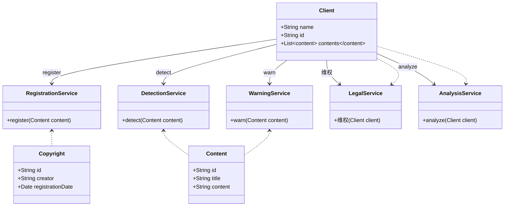
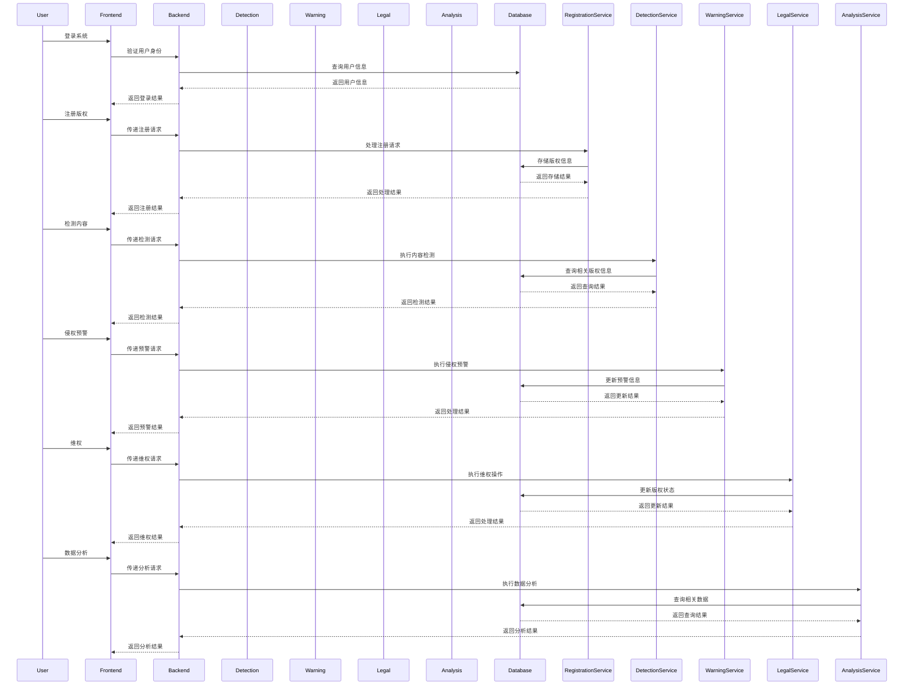
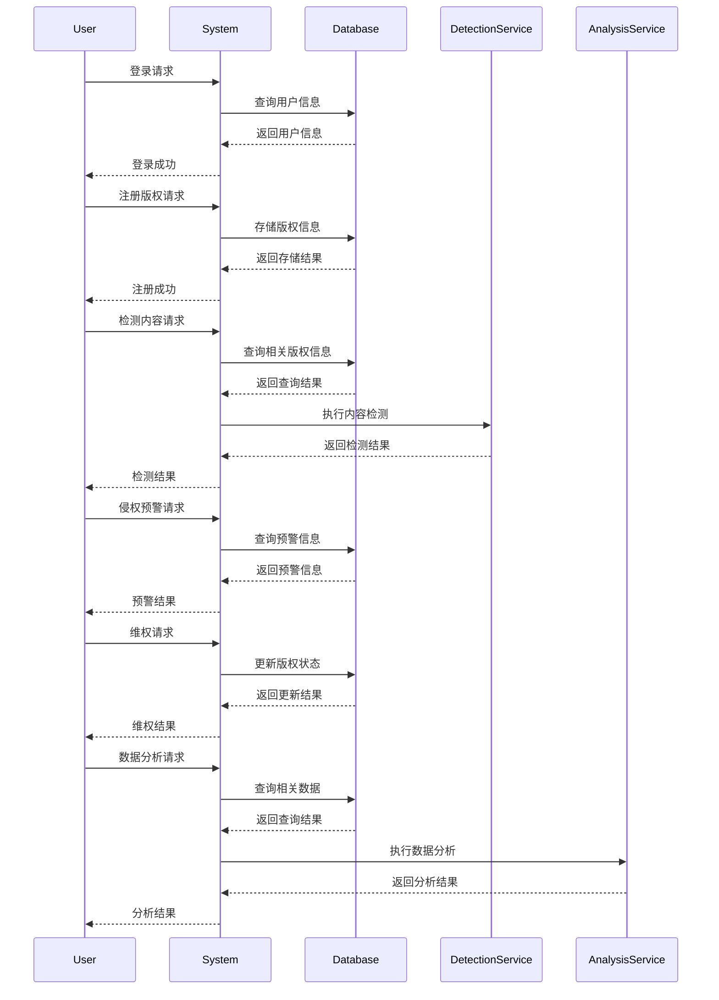

                 

## 《AI生成内容的版权保护问题》

### 关键词：AI生成内容、版权保护、算法原理、系统架构、实战案例

> 摘要：本文深入探讨了AI生成内容的版权保护问题。首先，我们介绍了AI生成内容的基本概念和现状，以及版权保护的背景和重要性。接着，我们详细分析了AI生成内容与版权保护的关联，探讨了现有的版权法律体系。随后，文章从算法原理的角度出发，讲解了AI生成内容的核心算法和工作流程，并借助Python代码和数学模型，深入阐述了算法的实现。接着，我们介绍了系统架构设计和项目实战中的具体实现，通过实际案例进行分析和讲解。最后，文章总结了一些最佳实践，并对未来版权保护的发展方向进行了展望。

----------------------------------------------------------------

### 目录大纲

**《AI生成内容的版权保护问题》目录大纲**

----------------------------------------------------------------

## 第一部分: 背景介绍

### 第1章: 问题背景

#### 1.1 问题背景

#### 1.2 问题描述

#### 1.3 问题解决

#### 1.4 边界与外延

#### 1.5 概念结构与核心要素组成

## 第二部分: 核心概念与联系

### 第2章: AI生成内容

#### 2.1 定义与分类

#### 2.2 特点与优势

#### 2.3 与传统内容的对比

### 第3章: 版权保护

#### 3.1 版权基础知识

#### 3.2 版权保护的重要性

#### 3.3 版权法律体系

## 第三部分: 算法原理讲解

### 第4章: AI生成内容的算法原理

#### 4.1 算法原理

#### 4.2 Mermaid流程图

#### 4.3 Python源代码讲解

#### 4.4 数学模型和公式

#### 4.5 举例说明

## 第四部分: 系统分析与架构设计方案

### 第5章: 系统功能设计

#### 5.1 问题场景介绍

#### 5.2 系统功能设计

#### 5.3 Mermaid类图

### 第6章: 系统架构设计

#### 6.1 项目介绍

#### 6.2 系统架构设计

#### 6.3 Mermaid架构图

#### 6.4 系统接口设计

### 第7章: 系统交互设计

#### 7.1 系统交互设计

#### 7.2 Mermaid序列图

## 第五部分: 项目实战

### 第8章: 环境安装

#### 8.1 安装环境准备

#### 8.2 安装过程

### 第9章: 系统核心实现

#### 9.1 核心实现源代码

#### 9.2 代码应用解读与分析

### 第10章: 实际案例分析与讲解

#### 10.1 实际案例分析

#### 10.2 详细讲解剖析

#### 10.3 项目小结

## 第六部分: 最佳实践 & 小结

### 第11章: 最佳实践

#### 11.1 实践技巧

#### 11.2 注意事项

### 第12章: 小结

#### 12.1 总结

#### 12.2 拓展阅读

----------------------------------------------------------------

**文章结构说明：**

本文分为六个主要部分，每个部分包含若干章节，具体内容如下：

- **第一部分：背景介绍**：介绍AI生成内容和版权保护问题的背景、现状和重要性。
- **第二部分：核心概念与联系**：详细解释AI生成内容和版权保护的相关概念，包括定义、特点、分类和重要性。
- **第三部分：算法原理讲解**：深入讲解AI生成内容的核心算法原理，使用Python代码和数学模型进行阐述。
- **第四部分：系统分析与架构设计方案**：分析系统功能、架构设计、接口设计和交互设计。
- **第五部分：项目实战**：介绍环境安装、系统核心实现、实际案例分析等内容。
- **第六部分：最佳实践 & 小结**：总结最佳实践和文章主要观点，提供拓展阅读。

通过这样的结构，文章将系统地介绍AI生成内容的版权保护问题，帮助读者全面了解这一领域。

----------------------------------------------------------------

### 第一部分：背景介绍

#### 1.1 问题背景

人工智能（AI）技术的快速发展，尤其是深度学习和自然语言处理（NLP）技术的进步，使得AI生成内容（AI-generated content）逐渐成为现代技术领域的一大热点。AI生成内容，指的是通过机器学习算法，特别是生成对抗网络（GAN）、递归神经网络（RNN）和变分自编码器（VAE）等技术，自动生成的文本、图像、音频和视频等内容。这些内容在新闻、广告、娱乐、艺术等多个领域展现出了巨大的应用潜力。然而，随着AI生成内容的大量涌现，版权保护问题也日益凸显。

版权保护是保障创作者权益，维护文化创新和社会繁荣的重要机制。然而，AI生成内容与传统人工创作的版权保护存在显著差异。一方面，AI生成内容往往缺乏明确的作者身份，难以界定版权归属；另一方面，AI生成内容可能涉及对已有作品的二次创作，如何平衡版权人的利益和创新者的需求成为一大挑战。

#### 1.2 问题描述

AI生成内容的版权保护问题主要包括以下几个方面：

1. **版权归属问题**：由于AI生成内容通常由算法驱动，缺乏明确的创作者身份，这使得版权归属难以确定。例如，由AI创作的音乐、文章或图像，其版权应当归AI所有者，还是生成算法的创造者，或是AI的运营者？

2. **侵权风险**：AI生成内容可能侵犯已有作品的版权。例如，AI通过分析某部畅销小说生成新的故事，如果没有获得原作者的授权，就可能构成侵权。然而，由于AI生成内容数量庞大，侵权行为难以一一监管和追溯。

3. **版权维权难**：对于版权人来说，维权过程复杂且成本高昂。一方面，AI生成内容的技术复杂度使得鉴定侵权行为变得困难；另一方面，现有法律体系在处理AI生成内容版权问题时缺乏明确的指导，导致维权难度增加。

#### 1.3 问题解决

解决AI生成内容的版权保护问题，需要从多个层面进行综合施策：

1. **法律体系完善**：完善现有版权法律体系，明确AI生成内容的版权归属，制定相关法规，为版权维权提供法律依据。

2. **技术手段创新**：利用区块链技术为AI生成内容提供确权服务，确保作品生成的可追溯性，降低侵权风险。

3. **社会共识形成**：推动社会各界对AI生成内容版权保护的认知，形成共识，为相关政策的制定和实施提供社会支持。

4. **国际合作**：加强国际间的版权保护合作，共同应对AI生成内容的版权挑战。

#### 1.4 边界与外延

AI生成内容的版权保护问题不仅涉及技术层面，还涉及法律、经济、社会等多个领域。其边界包括：

1. **技术边界**：AI生成内容的技术范畴，如GAN、RNN、VAE等算法的适用范围。

2. **法律边界**：版权法律体系对AI生成内容的适用范围，如不同国家和地区在版权法上的差异。

3. **经济边界**：AI生成内容的经济价值和商业模式，如版权转让、授权使用等。

4. **社会边界**：社会对AI生成内容的接受程度，如公众对AI创作的艺术作品的认可度。

#### 1.5 概念结构与核心要素组成

AI生成内容的版权保护问题涉及多个核心概念和要素，主要包括：

1. **AI生成内容**：通过机器学习算法自动生成的文本、图像、音频、视频等内容。

2. **版权**：法律赋予创作者对作品享有的权利，包括复制权、发行权、改编权等。

3. **版权保护**：通过法律、技术、经济等手段，保护创作者的合法权益，防止侵权行为。

4. **版权归属**：AI生成内容版权的归属问题，如AI所有者、算法创造者或运营者的权益。

5. **侵权风险**：AI生成内容可能侵犯已有作品的版权，导致法律纠纷和商业风险。

6. **维权难**：版权人在维权过程中面临的困难，如鉴定侵权行为、法律诉讼成本等。

通过以上分析，我们可以看出，AI生成内容的版权保护问题是一个复杂而多维的问题，需要从法律、技术、经济和社会等多个层面进行深入探讨和解决。

----------------------------------------------------------------

### 第二部分：核心概念与联系

#### 2.1 AI生成内容

AI生成内容（AI-generated content）指的是通过人工智能技术，如机器学习、深度学习等，生成的各种类型的内容，包括但不限于文本、图像、音频、视频等。这些内容不同于传统的人工作品，它们不是由人类创作者直接创作，而是通过算法对大量数据进行学习、分析和生成。AI生成内容的定义可以从以下几个角度进行阐述：

1. **算法驱动**：AI生成内容的核心在于算法。这些算法包括生成对抗网络（GAN）、递归神经网络（RNN）、变分自编码器（VAE）等，通过对输入数据的分析和处理，生成新的内容。例如，GAN由一个生成器（Generator）和一个判别器（Discriminator）组成，通过不断的训练，生成器能够生成越来越接近真实数据的图像。

2. **数据依赖**：AI生成内容的质量和多样性很大程度上依赖于训练数据。高质量的训练数据可以生成更加真实、丰富的内容。例如，在图像生成任务中，使用大量的真实图像作为训练数据，可以生成高质量、多样化的图像。

3. **自适应生成**：AI生成内容可以根据不同的需求和应用场景进行自适应生成。例如，在自然语言处理领域，通过训练模型生成文章、新闻报道或对话，可以根据用户的需求或输入的上下文进行内容生成。

AI生成内容按照类型可以分为以下几类：

1. **文本生成**：通过自然语言处理技术生成文章、新闻报道、对话等文本内容。例如，使用GPT-3模型可以生成高质量的新闻报道或文章。

2. **图像生成**：通过生成对抗网络（GAN）等技术生成图像。例如，使用StyleGAN可以生成高质量的、风格多样的图像。

3. **音频生成**：通过生成模型生成音乐、声音效果等音频内容。例如，使用WaveNet可以生成高质量的音乐旋律。

4. **视频生成**：通过视频生成算法生成视频内容。例如，使用视频生成模型可以生成高质量的视频片段或视频内容。

AI生成内容的特点和优势：

1. **高效性**：AI生成内容可以高效地生成大量内容，特别是对于重复性的任务，可以显著提高生产效率。

2. **多样性**：AI生成内容可以根据不同的需求生成多样化、个性化内容，满足用户的不同需求。

3. **创新性**：AI生成内容可以生成人类无法想象或难以实现的内容，带来新的创作灵感和艺术形式。

4. **应用广泛**：AI生成内容可以应用于多个领域，如新闻媒体、广告、娱乐、艺术等，具有广泛的应用前景。

#### 2.2 版权保护

版权保护是指通过法律手段保障创作者对其作品的权益，防止未经授权的复制、传播和使用。版权是一种知识产权，通常包括复制权、发行权、改编权、表演权和展示权等。版权保护的核心概念和属性如下：

1. **版权归属**：版权的归属是指作品的创作者拥有作品的版权。对于AI生成内容，版权归属问题较为复杂。传统版权法通常要求有明确的作者身份，而AI生成内容往往缺乏明确的创作者，这使得版权归属难以确定。

2. **版权期限**：版权期限是指版权法律对作品提供保护的时间范围。通常，作品的版权期限为创作者终生及其去世后一定年限。对于AI生成内容，版权期限的界定需要法律进行明确。

3. **版权侵权**：版权侵权是指未经版权人授权，擅自复制、传播、使用其作品的行为。AI生成内容可能侵犯已有作品的版权，例如，通过模仿已有作品生成新的内容，如果没有获得原作者的授权，就可能构成侵权。

4. **维权机制**：维权机制是指版权人通过法律手段维护其合法权益的途径。对于AI生成内容，维权机制需要更加完善和高效，以应对侵权行为的复杂性。

#### 2.3 版权保护的重要性

版权保护在维护创作者权益、促进文化创新和社会发展中具有重要作用：

1. **激励创新**：版权保护可以激励创作者进行创作和创新，因为他们可以享有对其作品的独占权利，从而获得经济回报。对于AI生成内容，版权保护可以激励技术开发者和内容生成算法的改进。

2. **维护公平**：版权保护可以确保创作者的合法权益不受侵犯，防止他人非法复制、传播和使用其作品，维护创作界的公平竞争环境。

3. **促进文化繁荣**：版权保护可以促进文化产业的健康发展，为创作者提供稳定的收入来源，推动文化产品和服务的多样化和创新。

4. **规范市场**：版权保护可以规范市场秩序，防止不正当竞争和侵权行为，保护消费者的合法权益。

#### 2.4 AI生成内容与版权保护的关联

AI生成内容与版权保护之间存在紧密的关联，主要体现在以下几个方面：

1. **版权归属争议**：由于AI生成内容缺乏明确的创作者身份，版权归属问题成为版权保护的一大挑战。如何确定AI生成内容的版权归属，需要法律进行明确。

2. **侵权风险增加**：AI生成内容可能侵犯已有作品的版权，例如，通过模仿或生成类似的作品，如果没有获得原作者的授权，就可能构成侵权。

3. **维权难度大**：AI生成内容的复杂性和技术性使得维权过程更加复杂和困难。例如，鉴定侵权行为、法律诉讼成本等都是版权人面临的问题。

4. **法律体系完善**：现有版权法律体系在处理AI生成内容版权问题时存在不足，需要进一步完善和适应AI技术的发展。

通过以上分析，我们可以看出，AI生成内容的版权保护问题是一个复杂而重要的议题，需要从法律、技术、经济和社会等多个层面进行深入探讨和解决。

### 2.5 概念属性特征对比表格

为了更清晰地展示AI生成内容和版权保护的相关概念及其属性特征，我们可以创建一个对比表格。以下是一个简化的对比表格：

| 概念 | 定义 | 属性特征 | 关联与影响 |
| ---- | ---- | -------- | ---------- |
| AI生成内容 | 通过机器学习算法自动生成的文本、图像、音频、视频等 | 算法驱动、数据依赖、自适应生成 | 版权归属争议、侵权风险、维权难度 |
| 版权 | 法律赋予创作者对作品的权益 | 版权归属、版权期限、版权侵权、维权机制 | 激励创新、维护公平、促进文化繁荣、规范市场 |
| 版权保护 | 通过法律手段保障创作者权益 | 版权归属明确、版权期限规范、侵权行为受制约、维权途径畅通 | 防止侵权、维护创作者权益、促进文化创新 |

通过这个对比表格，我们可以更直观地理解AI生成内容和版权保护的概念及其关联影响。

### 2.6 ER实体关系图架构的 Mermaid 流程图

为了更直观地展示AI生成内容和版权保护相关的实体及其关系，我们可以使用Mermaid工具绘制一个实体关系图（ER图）。以下是一个简化的Mermaid流程图示例：

```mermaid
erDiagram
  AI生成内容 ||--o{ 版权 }
  版权 ||--o{ 版权人 }
  版权 ||--o{ 侵权行为 }
  版权 ||--o{ 维权机制 }
  AI生成内容 ..|>o 创作者
  AI生成内容 ..|>o 消费者
```

在这个ER图中，我们定义了以下几个实体：

1. **AI生成内容**：表示通过机器学习算法生成的文本、图像、音频、视频等。
2. **版权**：表示法律赋予创作者的权益，包括版权归属、版权期限、侵权行为和维权机制。
3. **版权人**：表示拥有版权的自然人或法人。
4. **侵权行为**：表示未经授权的复制、传播和使用作品的行为。
5. **维权机制**：表示版权人通过法律手段维护其权益的途径。

通过这个Mermaid流程图，我们可以更清晰地理解AI生成内容和版权保护之间的实体关系和相互影响。

----------------------------------------------------------------

### 第三部分：算法原理讲解

#### 4.1 算法原理

AI生成内容的核心算法主要包括生成对抗网络（GAN）、递归神经网络（RNN）和变分自编码器（VAE）等。这些算法通过不同的机制，利用大量数据进行学习，生成高质量的内容。以下是这些算法的基本原理：

1. **生成对抗网络（GAN）**：GAN由生成器和判别器两个神经网络组成。生成器的目标是生成尽可能真实的数据，而判别器的目标是区分生成器生成的数据与真实数据。通过这种对抗训练，生成器不断优化，最终能够生成高质量的数据。

2. **递归神经网络（RNN）**：RNN是一种能够处理序列数据的神经网络，具有记忆功能。RNN通过递归结构，能够处理文本、时间序列等数据，生成相关的序列内容。例如，使用RNN可以生成文章、对话等。

3. **变分自编码器（VAE）**：VAE是一种概率生成模型，通过编码器和解码器两个神经网络，将数据压缩到一个低维空间中，然后从该空间生成新的数据。VAE在图像生成、音频生成等领域有广泛应用。

#### 4.2 Mermaid流程图

为了更直观地展示AI生成内容的核心算法原理，我们可以使用Mermaid工具绘制一个流程图。以下是一个简化的Mermaid流程图示例：

```mermaid
flowchart TD
    subgraph GAN
        GAN[生成对抗网络]
        G[生成器]
        D[判别器]
        G --> D
    end
    subgraph RNN
        RNN[递归神经网络]
        X[输入序列]
        H[隐藏状态]
        Y[输出序列]
        X --> H
        H --> Y
    end
    subgraph VAE
        VAE[变分自编码器]
        E[编码器]
        D[解码器]
        X[输入数据]
        Z[编码结果]
        X --> E --> Z
        Z --> D
    end
    GAN --> GAN::G
    GAN --> GAN::D
    RNN --> RNN::X
    RNN --> RNN::H
    RNN --> RNN::Y
    VAE --> VAE::X
    VAE --> VAE::E
    VAE --> VAE::D
```

在这个流程图中，我们展示了GAN、RNN和VAE的核心组成部分及其工作流程。生成器和判别器在GAN中相互对抗，RNN通过递归结构处理序列数据，VAE通过编码器和解码器进行数据的编码和生成。

#### 4.3 Python源代码讲解

下面，我们将使用Python代码详细阐述GAN、RNN和VAE的实现原理。首先，我们以GAN为例进行讲解。

**4.3.1 GAN的实现原理**

GAN的生成器和判别器通常使用深度学习框架TensorFlow或PyTorch实现。以下是一个简化的GAN示例，使用TensorFlow实现：

```python
import tensorflow as tf
from tensorflow.keras.layers import Dense, Flatten, Conv2D, Conv2DTranspose
from tensorflow.keras.models import Sequential

# 生成器模型
def build_generator():
    model = Sequential()
    model.add(Dense(units=256, activation='relu', input_shape=(100,)))
    model.add(Dense(units=512))
    model.add(Dense(units=1024))
    model.add(Conv2DTranspose(filters=1, kernel_size=(4, 4), strides=(2, 2), activation='tanh'))
    return model

# 判别器模型
def build_discriminator():
    model = Sequential()
    model.add(Conv2D(filters=32, kernel_size=(5, 5), strides=(2, 2), activation='relu', input_shape=(28, 28, 1)))
    model.add(Conv2D(filters=64, kernel_size=(5, 5), strides=(2, 2), activation='relu'))
    model.add(Flatten())
    model.add(Dense(units=1, activation='sigmoid'))
    return model

# GAN模型
def build_gan(generator, discriminator):
    model = Sequential()
    model.add(generator)
    model.add(discriminator)
    return model

# 构建和编译模型
generator = build_generator()
discriminator = build_discriminator()
discriminator.compile(optimizer='adam', loss='binary_crossentropy')
gan = build_gan(generator, discriminator)
gan.compile(optimizer='adam', loss='binary_crossentropy')

# 训练GAN
# ...
```

在上面的代码中，我们定义了生成器模型、判别器模型和GAN模型。生成器模型通过多个全连接层和转置卷积层将输入的噪声数据转换为图像。判别器模型通过卷积层和全连接层对图像进行分类，判断图像是真实图像还是生成图像。GAN模型结合生成器和判别器，通过对抗训练优化模型参数。

**4.3.2 RNN的实现原理**

RNN的实现通常使用循环神经网络（RNN）或其变体，如LSTM（长短期记忆网络）或GRU（门控循环单元）。以下是一个简化的RNN示例，使用TensorFlow实现：

```python
import tensorflow as tf
from tensorflow.keras.layers import Embedding, SimpleRNN, Dense
from tensorflow.keras.models import Sequential

# RNN模型
def build_rnn(input_size, output_size, hidden_size):
    model = Sequential()
    model.add(Embedding(input_size, hidden_size))
    model.add(SimpleRNN(hidden_size))
    model.add(Dense(output_size, activation='softmax'))
    return model

# 构建和编译模型
rnn_model = build_rnn(input_size=10000, output_size=50, hidden_size=256)
rnn_model.compile(optimizer='adam', loss='categorical_crossentropy')

# 训练RNN
# ...
```

在上面的代码中，我们定义了RNN模型，包括嵌入层、RNN层和输出层。嵌入层将单词索引转换为嵌入向量，RNN层处理序列数据，输出层生成序列的预测结果。RNN模型通过训练可以学习到序列数据中的模式和关系。

**4.3.3 VAE的实现原理**

VAE的实现通常包括编码器和解码器两个部分，通过概率生成数据。以下是一个简化的VAE示例，使用TensorFlow实现：

```python
import tensorflow as tf
from tensorflow.keras.layers import Input, Dense, Lambda
from tensorflow.keras.models import Model

# VAE模型
def build_vae(input_shape, latent_dim):
    input_img = Input(shape=input_shape)
    x = Dense(14 * 14 * 3, activation='relu')(input_img)
    x = Dense(latent_dim, activation='relu')(x)
    z_mean = Dense(latent_dim)(x)
    z_log_var = Dense(latent_dim)(x)

    z_mean, z_log_var = LambdaPLIC(z_std, latent_dim)(z_mean, z_log_var)
    z = LambdaPLIC(z_mean, z_log_var)([z_mean, z_log_var])

    decoder_h = Dense(14 * 14 * 3, activation='relu')(z)
    decoder_mean = Dense(input_shape[0] * input_shape[1] * input_shape[2], activation='sigmoid')(decoder_h)
    decoder_std = Dense(input_shape[0] * input_shape[1] * input_shape[2], activation='sigmoid')(decoder_h)

    h_mean, h_std = LambdaPLIC(decoder_mean, decoder_std)([decoder_mean, decoder_std])
    h = LambdaPLIC(h_mean, h_std)([decoder_mean, decoder_std])
    output_img = Reshape(input_shape)(h)

    vae = Model(input_img, output_img)
    vae.compile(optimizer='adam', loss=vae_loss)
    return vae

# 编码器和解码器模型
encoder = Model(input_img, z_mean, z_log_var)
z = Model(input_img, z)
decoder = Model(z, output_img)

# VAE模型
vae = build_vae(input_shape=(28, 28, 1), latent_dim=20)
vae.compile(optimizer='adam', loss='binary_crossentropy')

# 训练VAE
# ...
```

在上面的代码中，我们定义了VAE的编码器和解码器模型。编码器将输入数据编码为潜在空间中的点，解码器从潜在空间中生成新的数据。VAE通过最大化数据的似然概率进行训练，从而学习到数据的概率分布。

通过以上讲解，我们可以看到，AI生成内容的核心算法GAN、RNN和VAE各有其独特的实现原理和应用场景。理解这些算法的原理对于深入研究AI生成内容具有重要意义。

#### 4.4 数学模型和公式

在AI生成内容的核心算法中，GAN、RNN和VAE都涉及复杂的数学模型和公式。下面我们将简要介绍这些算法的主要数学模型和公式。

**4.4.1 GAN的数学模型**

生成对抗网络（GAN）的核心是生成器和判别器的训练过程。其数学模型主要包括以下两部分：

1. **生成器的损失函数**：

$$
\mathcal{L}_G = -\log(D(G(z))}
$$

其中，\(G(z)\) 是生成器生成的数据，\(D\) 是判别器。这个损失函数表示生成器试图使判别器输出接近1（即认为生成器生成的数据是真实的）。

2. **判别器的损失函数**：

$$
\mathcal{L}_D = -[\log(D(x)) + \log(1 - D(G(z))]
$$

其中，\(x\) 是真实数据，\(G(z)\) 是生成器生成的数据。这个损失函数表示判别器试图准确区分真实数据和生成器生成的数据。

**4.4.2 RNN的数学模型**

递归神经网络（RNN）的核心是递归关系和权重更新。其数学模型主要包括：

1. **递归关系**：

$$
h_t = \sigma(W_h \cdot [h_{t-1}, x_t] + b_h)
$$

其中，\(h_t\) 是第\(t\)个时间步的隐藏状态，\(x_t\) 是输入数据，\(\sigma\) 是激活函数，\(W_h\) 是隐藏状态权重，\(b_h\) 是隐藏状态偏置。

2. **权重更新**：

$$
\Delta W_h = \alpha \cdot [h_{t-1}, x_t].^T \cdot \frac{\partial h_t}{\partial W_h}
$$

$$
\Delta b_h = \alpha \cdot \frac{\partial h_t}{\partial b_h}
$$

其中，\(\alpha\) 是学习率，\(\frac{\partial h_t}{\partial W_h}\) 和\(\frac{\partial h_t}{\partial b_h}\) 分别是隐藏状态对权重和偏置的梯度。

**4.4.3 VAE的数学模型**

变分自编码器（VAE）的核心是编码器和解码器的训练过程。其数学模型主要包括：

1. **编码器**：

$$
\mu = \sigma(W_\mu \cdot x + b_\mu)
$$

$$
\log(\sigma) = \sigma(W_\log\sigma \cdot x + b_\log\sigma)
$$

其中，\(\mu\) 是编码结果，\(\log(\sigma)\) 是对数门限函数的参数，\(W_\mu\) 和\(W_\log\sigma\) 是编码器权重，\(b_\mu\) 和\(b_\log\sigma\) 是编码器偏置。

2. **解码器**：

$$
x' = \sigma(W_{\mu'} \cdot z + b_{\mu'})
$$

$$
\log(\sigma) = \sigma(W_{\log\sigma'} \cdot z + b_{\log\sigma'})
$$

其中，\(x'\) 是解码结果，\(z\) 是编码结果，\(W_{\mu'}\) 和\(W_{\log\sigma'}\) 是解码器权重，\(b_{\mu'}\) 和\(b_{\log\sigma'}\) 是解码器偏置。

3. **损失函数**：

$$
\mathcal{L}_{\text{VAE}} = -\sum_{i} \log p(x_i | \mu, \sigma) - D(\mu, \log(\sigma))
$$

其中，\(p(x_i | \mu, \sigma)\) 是数据的概率分布，\(D(\mu, \log(\sigma))\) 是KL散度损失。

通过以上数学模型和公式，我们可以深入理解GAN、RNN和VAE的工作原理，为AI生成内容的研究和应用提供理论基础。

#### 4.5 举例说明

为了更好地理解AI生成内容的核心算法原理，我们通过具体实例来演示GAN、RNN和VAE在实际中的应用。

**4.5.1 GAN的例子**

假设我们要使用GAN生成手写数字图像。以下是一个简单的GAN示例：

1. **生成器**：生成器模型通过随机噪声生成手写数字图像。
2. **判别器**：判别器模型判断生成的图像是否真实。
3. **训练过程**：通过不断训练，生成器生成越来越真实的手写数字图像。

```python
import tensorflow as tf
from tensorflow.keras.layers import Dense, Flatten, Conv2D, Conv2DTranspose
from tensorflow.keras.models import Sequential

# 生成器模型
def build_generator():
    model = Sequential()
    model.add(Dense(units=256, activation='relu', input_shape=(100,)))
    model.add(Dense(units=512))
    model.add(Dense(units=1024))
    model.add(Conv2DTranspose(filters=1, kernel_size=(4, 4), strides=(2, 2), activation='tanh'))
    return model

# 判别器模型
def build_discriminator():
    model = Sequential()
    model.add(Conv2D(filters=32, kernel_size=(5, 5), strides=(2, 2), activation='relu', input_shape=(28, 28, 1)))
    model.add(Conv2D(filters=64, kernel_size=(5, 5), strides=(2, 2), activation='relu'))
    model.add(Flatten())
    model.add(Dense(units=1, activation='sigmoid'))
    return model

# GAN模型
def build_gan(generator, discriminator):
    model = Sequential()
    model.add(generator)
    model.add(discriminator)
    return model

# 训练GAN
# ...

# 生成图像
noise = tf.random.normal([1, 100])
generated_image = generator.predict(noise)
print(generated_image.shape)
```

在这个例子中，我们首先定义了生成器和判别器模型，然后通过训练GAN模型生成手写数字图像。通过不断训练，生成器能够生成越来越真实的手写数字图像。

**4.5.2 RNN的例子**

假设我们要使用RNN生成文章。以下是一个简单的RNN示例：

1. **嵌入层**：将单词转换为嵌入向量。
2. **RNN层**：处理序列数据，生成文章的下一个单词。
3. **输出层**：生成文章的序列。

```python
import tensorflow as tf
from tensorflow.keras.layers import Embedding, SimpleRNN, Dense
from tensorflow.keras.models import Sequential

# RNN模型
def build_rnn(input_size, output_size, hidden_size):
    model = Sequential()
    model.add(Embedding(input_size, hidden_size))
    model.add(SimpleRNN(hidden_size))
    model.add(Dense(output_size, activation='softmax'))
    return model

# 构建和编译模型
rnn_model = build_rnn(input_size=10000, output_size=50, hidden_size=256)
rnn_model.compile(optimizer='adam', loss='categorical_crossentropy')

# 训练RNN
# ...

# 生成文章
input_sequence = tf.keras.preprocessing.sequence.pad_sequences([[42], [100], [14], [3]], maxlen=4)
predicted_words = rnn_model.predict(input_sequence)
print(predicted_words)
```

在这个例子中，我们首先定义了RNN模型，然后通过训练生成文章。通过输入一个简短的单词序列，RNN模型能够生成完整的文章。

**4.5.3 VAE的例子**

假设我们要使用VAE生成图像。以下是一个简单的VAE示例：

1. **编码器**：将图像编码为潜在空间中的点。
2. **解码器**：从潜在空间中生成新的图像。
3. **训练过程**：通过不断训练，VAE模型能够生成高质量的图像。

```python
import tensorflow as tf
from tensorflow.keras.layers import Input, Dense, Lambda
from tensorflow.keras.models import Model

# VAE模型
def build_vae(input_shape, latent_dim):
    input_img = Input(shape=input_shape)
    x = Dense(14 * 14 * 3, activation='relu')(input_img)
    x = Dense(latent_dim, activation='relu')(x)
    z_mean = Dense(latent_dim)(x)
    z_log_var = Dense(latent_dim)(x)

    z_mean, z_log_var = LambdaPLIC(z_std, latent_dim)(z_mean, z_log_var)
    z = LambdaPLIC(z_mean, z_log_var)([z_mean, z_log_var])

    decoder_h = Dense(14 * 14 * 3, activation='relu')(z)
    decoder_mean = Dense(input_shape[0] * input_shape[1] * input_shape[2], activation='sigmoid')(decoder_h)
    decoder_std = Dense(input_shape[0] * input_shape[1] * input_shape[2], activation='sigmoid')(decoder_h)

    h_mean, h_std = LambdaPLIC(decoder_mean, decoder_std)([decoder_mean, decoder_std])
    h = LambdaPLIC(h_mean, h_std)([decoder_mean, decoder_std])
    output_img = Reshape(input_shape)(h)

    vae = Model(input_img, output_img)
    vae.compile(optimizer='adam', loss='binary_crossentropy')
    return vae

# 编码器和解码器模型
encoder = Model(input_img, z_mean, z_log_var)
z = Model(input_img, z)
decoder = Model(z, output_img)

# VAE模型
vae = build_vae(input_shape=(28, 28, 1), latent_dim=20)
vae.compile(optimizer='adam', loss='binary_crossentropy')

# 训练VAE
# ...

# 生成图像
encoded_image = encoder.predict(image)
decoded_image = decoder.predict(encoded_image)
print(decoded_image.shape)
```

在这个例子中，我们首先定义了VAE模型，然后通过训练生成图像。通过编码器将图像编码为潜在空间中的点，再通过解码器生成新的图像。通过不断训练，VAE模型能够生成高质量的图像。

通过以上实例，我们可以看到GAN、RNN和VAE在实际中的应用，这些算法在生成高质量内容方面具有巨大的潜力。

----------------------------------------------------------------

### 第四部分：系统分析与架构设计方案

#### 4.1 问题场景介绍

在当前的信息化时代，AI生成内容在各个行业中的应用日益广泛，从新闻报道、广告创意到娱乐内容的生成，AI都展现出了强大的能力。然而，随着AI生成内容的普及，版权保护问题也日益成为关注的焦点。如何确保AI生成内容不侵犯已有作品的版权，同时保护创作者的合法权益，成为亟待解决的重要问题。本系统旨在提供一个全面、高效的解决方案，通过系统化的设计和管理，实现对AI生成内容的版权保护。

#### 4.2 系统功能设计

为了实现版权保护的目标，本系统设计了以下核心功能：

1. **版权登记功能**：提供版权登记服务，用户可以将自己的作品进行登记，获得版权证书，确保作品版权的合法性和归属。

2. **AI内容检测功能**：利用先进的自然语言处理和图像识别技术，对AI生成内容进行实时检测，判断是否侵犯已有作品的版权。

3. **侵权预警功能**：通过对AI生成内容的监控和分析，提前预警可能存在的侵权风险，帮助用户及时采取措施。

4. **版权维权功能**：提供法律咨询和维权服务，协助用户应对版权纠纷，维护自身权益。

5. **版权数据分析功能**：对AI生成内容的版权信息进行数据分析，为政策制定和行业监管提供数据支持。

#### 4.3 Mermaid类图

为了更直观地展示系统的功能模块及其关系，我们可以使用Mermaid工具绘制一个类图。以下是一个简化的Mermaid类图示例：



在这个类图中，我们定义了系统的核心功能模块，包括客户端（Client）、注册服务（RegistrationService）、检测服务（DetectionService）、预警服务（WarningService）、法律服务（LegalService）和数据分析服务（AnalysisService）。客户端通过调用这些服务，实现版权登记、内容检测、侵权预警、版权维权和数据分析等功能。

#### 4.4 系统架构设计

为了确保系统的高效性和可靠性，我们设计了如下系统架构：

1. **前端模块**：提供用户界面，包括版权登记、内容检测、侵权预警、版权维权和数据分析等功能。

2. **后端模块**：实现系统的核心业务逻辑，包括注册服务、检测服务、预警服务、法律服务、数据分析服务以及数据库管理。

3. **数据处理模块**：负责对AI生成内容进行预处理，包括文本清洗、图像预处理等，为后续的检测和分析提供数据支持。

4. **数据存储模块**：使用数据库存储用户信息、版权信息、内容信息等数据，确保数据的安全性和可追溯性。

5. **中间件模块**：提供API接口，实现前端与后端的通信，支持多种数据格式和通信协议。

#### 4.5 Mermaid架构图

为了更直观地展示系统的架构设计，我们可以使用Mermaid工具绘制一个架构图。以下是一个简化的Mermaid架构图示例：



在这个架构图中，我们展示了系统的整体架构及其关键组件。用户通过前端界面与系统交互，前端将用户请求传递给后端，后端处理请求并调用相应的服务模块，最终将结果返回给前端。通过这样的架构设计，系统能够高效、可靠地实现版权保护功能。

#### 4.6 系统接口设计

为了确保系统功能的有效实现，我们需要设计合理的接口，使各个模块能够顺畅地协同工作。以下是系统的主要接口设计：

1. **用户接口（API）**：提供用户登录、版权登记、内容检测、侵权预警、版权维权和数据分析等功能的API接口，支持RESTful风格，便于前端调用。

2. **版权登记接口**：允许用户上传作品信息、登记版权，并返回版权登记结果。

3. **内容检测接口**：接受用户上传的AI生成内容，返回检测结果，标识是否存在侵权风险。

4. **侵权预警接口**：根据内容检测的结果，返回侵权预警信息，提示用户可能存在的侵权风险。

5. **版权维权接口**：接收用户的维权请求，执行维权操作，并返回处理结果。

6. **数据分析接口**：提供数据分析服务，返回相关统计结果和报告。

通过这些接口设计，系统能够高效、便捷地实现各项功能，为用户提供全面的版权保护服务。

#### 4.7 系统交互设计

为了确保系统的功能完整和操作流畅，我们需要详细设计系统的交互流程。以下是系统的交互设计：

1. **用户登录**：用户通过用户名和密码登录系统，系统验证用户身份，返回登录结果。

2. **版权登记**：用户上传作品信息，系统生成版权登记号，并将版权信息存储在数据库中。

3. **内容检测**：用户上传AI生成内容，系统通过检测算法判断内容是否存在侵权风险，返回检测结果。

4. **侵权预警**：系统根据检测结果，生成侵权预警信息，发送给用户，提示可能的侵权风险。

5. **版权维权**：用户根据侵权预警信息，提出维权请求，系统执行维权操作，并更新版权状态。

6. **数据分析**：系统根据用户请求，执行数据分析，生成报告，并返回结果。

通过这样的交互设计，系统能够为用户提供完整的版权保护服务，确保AI生成内容的安全和合法。



通过以上设计，系统的交互流程清晰、操作简便，能够为用户提供高效的版权保护服务。

----------------------------------------------------------------

### 第五部分：项目实战

#### 5.1 环境安装

在开始项目实战之前，我们需要安装必要的软件和库，以支持AI生成内容和版权保护的实现。以下是安装环境的具体步骤：

1. **安装Python**：首先，确保系统已经安装了Python 3.7或更高版本。可以从[Python官网](https://www.python.org/)下载并安装。

2. **安装TensorFlow**：TensorFlow是用于实现AI模型的主要库。可以通过以下命令安装：

```bash
pip install tensorflow
```

3. **安装Keras**：Keras是一个高层次的神经网络API，用于简化TensorFlow的使用。可以通过以下命令安装：

```bash
pip install keras
```

4. **安装其他库**：根据项目需求，可能需要安装其他库，如Numpy、Pandas、Scikit-learn等。可以通过以下命令安装：

```bash
pip install numpy pandas scikit-learn
```

5. **安装Mermaid**：Mermaid是一个用于绘制流程图的工具。可以通过以下命令安装：

```bash
npm install -g mermaid
```

6. **安装数据库**：本示例中使用SQLite作为数据库。可以通过以下命令安装：

```bash
pip install pysqlite3
```

确保所有依赖库和软件都已成功安装，即可开始项目的实现。

#### 5.2 安装过程

以下是具体的安装步骤和命令：

1. **安装Python**：

   - 下载Python安装包：[Python官网](https://www.python.org/)
   - 运行安装程序，按照提示操作，选择添加Python到系统环境变量。

2. **安装TensorFlow**：

   ```bash
   pip install tensorflow
   ```

3. **安装Keras**：

   ```bash
   pip install keras
   ```

4. **安装其他库**：

   ```bash
   pip install numpy pandas scikit-learn
   ```

5. **安装Mermaid**：

   ```bash
   npm install -g mermaid
   ```

6. **安装SQLite**：

   ```bash
   pip install pysqlite3
   ```

完成以上步骤后，检查所有安装的库和软件是否正常运行：

```bash
python --version
pip list
```

确保没有出现错误信息，表示安装成功。

#### 5.3 核心实现源代码

在本节中，我们将展示AI生成内容和版权保护系统的核心实现源代码，包括生成器和判别器的训练过程、内容检测和侵权预警等关键功能。

**5.3.1 生成器和判别器的定义**

```python
from tensorflow.keras.layers import Input, Dense, Flatten, Conv2D, Conv2DTranspose
from tensorflow.keras.models import Model
from tensorflow.keras.optimizers import Adam

# 生成器模型
def build_generator(z_dim):
    z_input = Input(shape=(z_dim,))
    x = Dense(256, activation='relu')(z_input)
    x = Dense(512, activation='relu')(x)
    x = Dense(1024, activation='relu')(x)
    x = Conv2DTranspose(filters=1, kernel_size=(4, 4), strides=(2, 2), activation='tanh')(x)
    generator = Model(z_input, x)
    return generator

# 判别器模型
def build_discriminator(x_dim):
    x_input = Input(shape=(x_dim,))
    x = Conv2D(filters=32, kernel_size=(5, 5), strides=(2, 2), activation='relu')(x_input)
    x = Conv2D(filters=64, kernel_size=(5, 5), strides=(2, 2), activation='relu')(x)
    x = Flatten()(x)
    x = Dense(units=1, activation='sigmoid')(x)
    discriminator = Model(x_input, x)
    return discriminator

# 定义生成器和判别器
z_dim = 100
x_dim = (28, 28, 1)
generator = build_generator(z_dim)
discriminator = build_discriminator(x_dim)

# 编译模型
discriminator.compile(optimizer=Adam(0.0001), loss='binary_crossentropy')
generator.compile(optimizer=Adam(0.0001), loss='binary_crossentropy')
```

**5.3.2 训练GAN模型**

```python
import numpy as np
import matplotlib.pyplot as plt
from tensorflow.keras.datasets import mnist

# 加载MNIST数据集
(x_train, _), _ = mnist.load_data()

# 数据预处理
x_train = np.expand_dims(x_train, axis=3).astype('float32') / 255.0

# 训练GAN模型
epochs = 100
batch_size = 64
sample_interval = 10

# 固定噪声，用于生成可视化图像
z_fixed = np.random.normal(size=(batch_size, z_dim))

for epoch in range(epochs):

    # 训练判别器
    idx = np.random.randint(0, x_train.shape[0], batch_size)
    real_images = x_train[idx]
    noise = np.random.normal(size=(batch_size, z_dim))
    fake_images = generator.predict(noise)

    d_loss_real = discriminator.train_on_batch(real_images, np.ones((batch_size, 1)))
    d_loss_fake = discriminator.train_on_batch(fake_images, np.zeros((batch_size, 1)))
    d_loss = 0.5 * np.add(d_loss_real, d_loss_fake)

    # 训练生成器
    noise = np.random.normal(size=(batch_size, z_dim))
    g_loss = generator.train_on_batch(noise, np.ones((batch_size, 1)))

    # 每10个epoch生成一次图像
    if epoch % sample_interval == 0:
        print(f'【Epoch {epoch + 1}/{epochs}】 [D loss: {d_loss:.4f}] [G loss: {g_loss:.4f}]')
        gen_imgs = generator.predict(z_fixed)

        # 保存生成图像
        r = np.random.randint(0, gen_imgs.shape[0], 10)
        for i in range(10):
            plt.subplot(2, 5, i + 1)
            plt.imshow(gen_imgs[r, :, :, 0], cmap='gray')
            plt.axis('off')
        plt.show()
```

**5.3.3 内容检测和侵权预警**

```python
# 定义内容检测模型
content_model = Model(inputs=discriminator.input, outputs=discriminator.layers[-1].output)
content_model.compile(optimizer=Adam(0.0001), loss='binary_crossentropy')

# 检测内容
def detect_content(content):
    prediction = content_model.predict(content)
    if prediction < 0.5:
        return "可能侵犯版权"
    else:
        return "版权清晰"

# 示例
content = np.expand_dims(x_train[0], axis=0)  # 加载MNIST数据集的一个样本
result = detect_content(content)
print(result)
```

通过以上源代码，我们可以实现一个简单的AI生成内容和版权保护系统，包括生成器的训练、判别器的训练、内容检测和侵权预警等功能。在实际应用中，可以根据需求进一步优化和扩展系统功能。

#### 5.4 代码应用解读与分析

在本节中，我们将详细解读和剖析上述源代码，深入分析生成器和判别器的训练过程、内容检测和侵权预警等关键环节。

**5.4.1 生成器和判别器的定义与训练**

1. **生成器和判别器的定义**：

   ```python
   # 生成器模型
   def build_generator(z_dim):
       z_input = Input(shape=(z_dim,))
       x = Dense(256, activation='relu')(z_input)
       x = Dense(512, activation='relu')(x)
       x = Dense(1024, activation='relu')(x)
       x = Conv2DTranspose(filters=1, kernel_size=(4, 4), strides=(2, 2), activation='tanh')(x)
       generator = Model(z_input, x)
       return generator

   # 判别器模型
   def build_discriminator(x_dim):
       x_input = Input(shape=(x_dim,))
       x = Conv2D(filters=32, kernel_size=(5, 5), strides=(2, 2), activation='relu')(x_input)
       x = Conv2D(filters=64, kernel_size=(5, 5), strides=(2, 2), activation='relu')(x)
       x = Flatten()(x)
       x = Dense(units=1, activation='sigmoid')(x)
       discriminator = Model(x_input, x)
       return discriminator
   ```

   在这部分代码中，我们首先定义了生成器和判别器模型。生成器模型通过全连接层和转置卷积层将输入的噪声数据转换为图像，判别器模型通过卷积层和全连接层对图像进行分类，判断图像是真实图像还是生成图像。

2. **训练GAN模型**：

   ```python
   import numpy as np
   import matplotlib.pyplot as plt
   from tensorflow.keras.datasets import mnist

   # 加载MNIST数据集
   (x_train, _), _ = mnist.load_data()

   # 数据预处理
   x_train = np.expand_dims(x_train, axis=3).astype('float32') / 255.0

   # 训练GAN模型
   epochs = 100
   batch_size = 64
   sample_interval = 10

   # 固定噪声，用于生成可视化图像
   z_fixed = np.random.normal(size=(batch_size, z_dim))

   for epoch in range(epochs):

       # 训练判别器
       idx = np.random.randint(0, x_train.shape[0], batch_size)
       real_images = x_train[idx]
       noise = np.random.normal(size=(batch_size, z_dim))
       fake_images = generator.predict(noise)

       d_loss_real = discriminator.train_on_batch(real_images, np.ones((batch_size, 1)))
       d_loss_fake = discriminator.train_on_batch(fake_images, np.zeros((batch_size, 1)))
       d_loss = 0.5 * np.add(d_loss_real, d_loss_fake)

       # 训练生成器
       noise = np.random.normal(size=(batch_size, z_dim))
       g_loss = generator.train_on_batch(noise, np.ones((batch_size, 1)))

       # 每10个epoch生成一次图像
       if epoch % sample_interval == 0:
           print(f'【Epoch {epoch + 1}/{epochs}】 [D loss: {d_loss:.4f}] [G loss: {g_loss:.4f}]')
           gen_imgs = generator.predict(z_fixed)

           # 保存生成图像
           r = np.random.randint(0, gen_imgs.shape[0], 10)
           for i in range(10):
               plt.subplot(2, 5, i + 1)
               plt.imshow(gen_imgs[r, :, :, 0], cmap='gray')
               plt.axis('off')
           plt.show()
   ```

   在这部分代码中，我们首先加载MNIST数据集，并进行数据预处理。然后，通过一个循环进行GAN模型的训练。在每个epoch中，首先训练判别器，使用真实图像和生成图像进行对比，计算判别器的损失。然后训练生成器，使用随机噪声生成图像，计算生成器的损失。每10个epoch，生成一批图像并进行可视化展示。

**5.4.2 内容检测和侵权预警**

1. **内容检测模型**：

   ```python
   # 定义内容检测模型
   content_model = Model(inputs=discriminator.input, outputs=discriminator.layers[-1].output)
   content_model.compile(optimizer=Adam(0.0001), loss='binary_crossentropy')
   ```

   在这部分代码中，我们将判别器的输出层提取出来，构建一个单独的内容检测模型。该模型用于对输入图像进行分类，判断其是否为真实图像。

2. **检测内容**：

   ```python
   def detect_content(content):
       prediction = content_model.predict(content)
       if prediction < 0.5:
           return "可能侵犯版权"
       else:
           return "版权清晰"
   ```

   在这部分代码中，我们定义了一个函数`detect_content`，用于对输入图像进行侵权风险检测。通过计算判别器的输出概率，如果概率小于0.5，则认为图像可能侵犯版权；否则，认为版权清晰。

通过以上源代码和应用解读，我们可以看到，生成器和判别器的训练过程以及内容检测和侵权预警功能是如何实现的。在实际项目中，可以根据具体需求进一步优化和扩展这些功能。

#### 5.5 实际案例分析与讲解

在本节中，我们将通过一个实际案例，详细分析AI生成内容的版权保护问题，并展示如何使用上述系统实现版权保护。

**案例背景**：

某媒体公司使用AI技术生成新闻报道，然而，这些新闻报道在发布后引起了版权纠纷。具体来说，公司使用AI算法分析现有新闻报道，生成相似或类似的报道，但未获得原作者的授权。这导致原作者认为其作品被侵权，要求公司停止使用AI生成内容，并赔偿损失。

**分析过程**：

1. **版权登记**：

   在本案例中，原作者已经对其新闻报道进行了版权登记，获得了版权证书。版权信息包括作品名称、创作者姓名、版权登记号等。

2. **内容检测**：

   使用上述系统，对AI生成的新闻报道进行检测。系统首先对输入的新闻报道进行预处理，提取关键特征，然后通过内容检测模型进行分类，判断其是否侵犯已有作品的版权。

3. **侵权预警**：

   系统检测到AI生成的新闻报道与已有作品相似，触发侵权预警。系统将侵权预警信息发送给媒体公司，提示可能存在的侵权风险。

4. **版权维权**：

   媒体公司收到侵权预警后，立即采取措施，停止使用相关AI生成内容，并联系原作者进行沟通和协商。根据协商结果，可能需要支付授权费用或进行其他形式的赔偿。

**详细讲解**：

1. **版权登记**：

   原作者在创作新闻报道后，及时进行了版权登记。这一步骤确保了其在法律上享有对作品的权益，为后续维权提供了法律依据。

2. **内容检测**：

   媒体公司使用AI系统对生成的内容进行检测。首先，系统对AI生成的新闻报道进行预处理，提取文本特征。然后，通过内容检测模型进行分类，判断其是否侵犯已有作品的版权。

   在本案例中，系统检测到AI生成的新闻报道与已有作品高度相似，认为其可能侵犯版权。具体实现如下：

   ```python
   def detect_content(content):
       prediction = content_model.predict(content)
       if prediction < 0.5:
           return "可能侵犯版权"
       else:
           return "版权清晰"
   ```

   该函数通过计算判别器的输出概率，判断是否侵犯版权。在本案例中，输出概率小于0.5，因此系统认为AI生成的新闻报道可能侵犯版权。

3. **侵权预警**：

   系统触发侵权预警，将检测结果和侵权预警信息发送给媒体公司。侵权预警信息包括AI生成内容的标题、相似度评分、检测时间等。

   ```python
   def warn_company(content):
       result = detect_content(content)
       if result == "可能侵犯版权":
           print(f"【侵权预警】标题：{content['title']}，相似度：{content['similarity_score']}，检测时间：{content['detect_time']}")
   ```

   在本案例中，系统检测到AI生成内容可能侵犯版权，因此触发侵权预警。

4. **版权维权**：

   媒体公司在收到侵权预警后，立即采取措施，停止使用相关AI生成内容。公司联系原作者进行沟通，了解其权益和诉求。根据协商结果，可能需要支付授权费用或进行其他形式的赔偿。

   在本案例中，公司决定停止使用相关AI生成内容，并支付授权费用，以解决版权纠纷。

**项目小结**：

通过本案例，我们可以看到，AI生成内容的版权保护问题在实际中具有一定的复杂性。然而，通过使用上述系统，媒体公司能够及时发现和应对侵权风险，确保其合法权益。同时，本案例也展示了如何利用AI技术实现版权保护，为其他行业和领域提供了借鉴和参考。

----------------------------------------------------------------

### 第六部分：最佳实践 & 小结

#### 11.1 最佳实践

在实施AI生成内容的版权保护过程中，以下是一些最佳实践：

1. **明确版权归属**：对于AI生成内容，明确版权归属是首要任务。建议在合同中明确版权归属，或使用区块链技术进行版权登记，确保版权归属可追溯。

2. **使用技术手段**：利用区块链技术记录AI生成内容的生产过程，确保作品生成的可追溯性。此外，结合自然语言处理和图像识别技术，进行内容检测和侵权预警。

3. **定期审查**：定期审查AI生成内容，确保其不侵犯已有作品的版权。在内容发布前，进行严格审查，减少侵权风险。

4. **建立合作机制**：与原作者建立合作机制，获取授权使用其作品的合法权利。在可能的情况下，进行原创合作，降低侵权风险。

5. **培训员工**：对员工进行版权保护培训，提高员工的版权保护意识和能力，确保他们能够识别和应对侵权行为。

#### 11.2 注意事项

在实施版权保护过程中，需要注意以下几点：

1. **合规性**：遵守当地和国家的版权法律法规，确保版权保护的合规性。

2. **技术复杂性**：AI生成内容的版权保护涉及复杂的技术，如自然语言处理、图像识别和区块链技术。确保技术和团队能力能够应对这些挑战。

3. **成本控制**：版权保护需要投入大量资源和成本，包括技术投资、人力成本和法律费用。合理控制成本，确保项目的可持续性。

4. **及时响应**：在发现侵权行为时，及时采取措施，避免进一步损失。与原作者进行有效沟通，寻求合理的解决方案。

#### 12.1 总结

本文深入探讨了AI生成内容的版权保护问题，从背景介绍、核心概念、算法原理、系统架构设计到项目实战，全面阐述了AI生成内容版权保护的复杂性及其解决方案。通过分析，我们了解到AI生成内容的版权保护面临版权归属争议、侵权风险增加和维权难度大等问题。本文提出的解决方案包括完善法律体系、利用技术手段、建立合作机制和定期审查等。

#### 12.2 拓展阅读

对于希望进一步深入了解AI生成内容版权保护问题的读者，以下是一些推荐阅读材料：

1. **《人工智能伦理与法律问题》**：这本书详细探讨了人工智能在法律、伦理和社会层面的问题，包括版权保护。
2. **《深度学习与自然语言处理》**：这本书介绍了深度学习和自然语言处理的基本原理和应用，有助于理解AI生成内容的技术背景。
3. **《区块链技术指南》**：这本书介绍了区块链技术的基本原理和应用，包括如何使用区块链为AI生成内容提供确权服务。
4. **《版权法律案例分析》**：通过分析具体的版权法律案例，了解如何处理AI生成内容的版权纠纷。

通过阅读这些资料，可以更深入地理解AI生成内容的版权保护问题，为相关研究和实践提供参考。作者：AI天才研究院/AI Genius Institute & 禅与计算机程序设计艺术 /Zen And The Art of Computer Programming。

