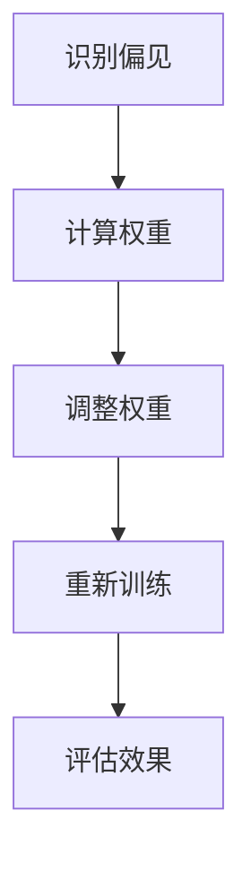
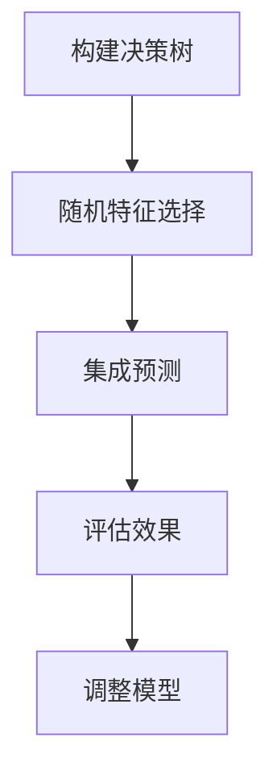
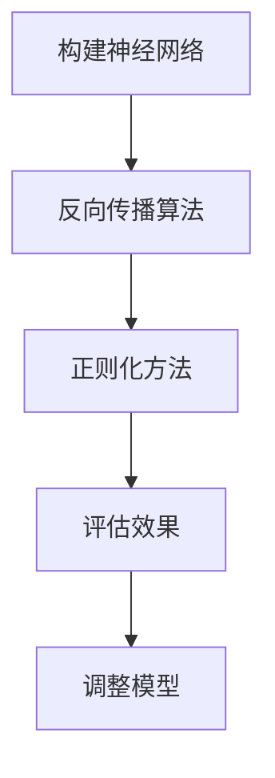
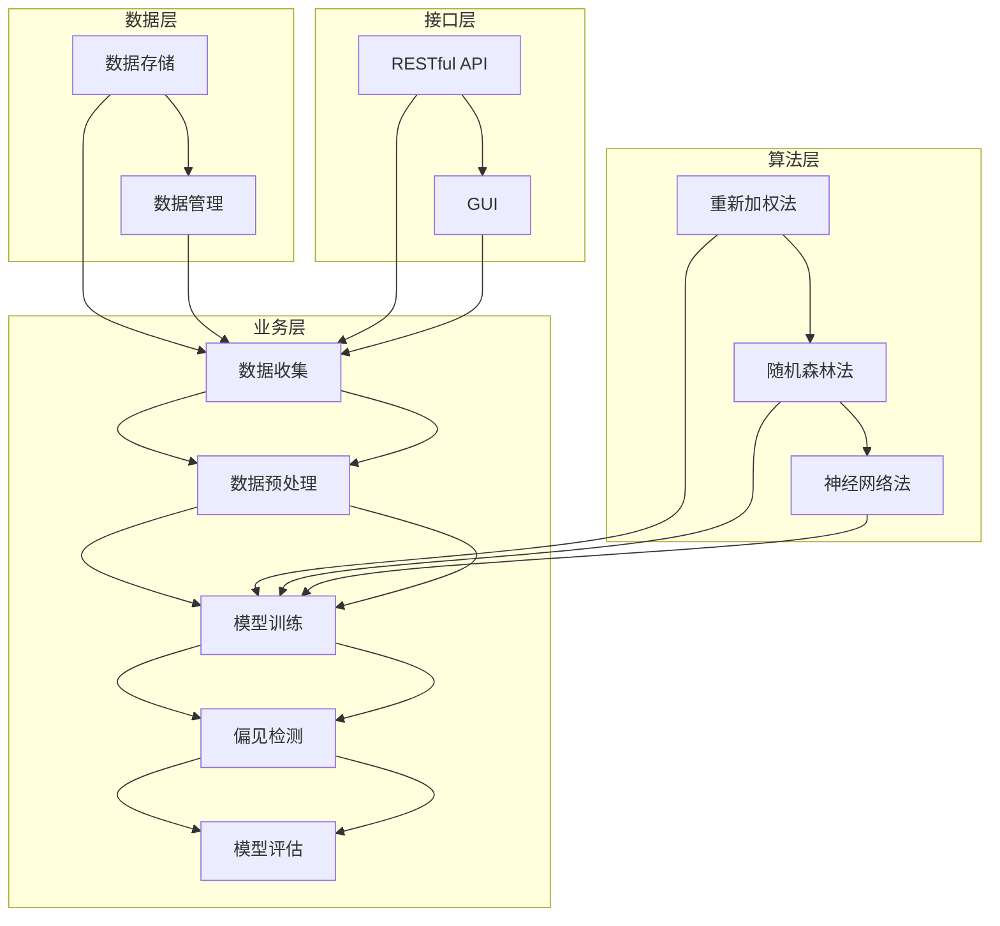
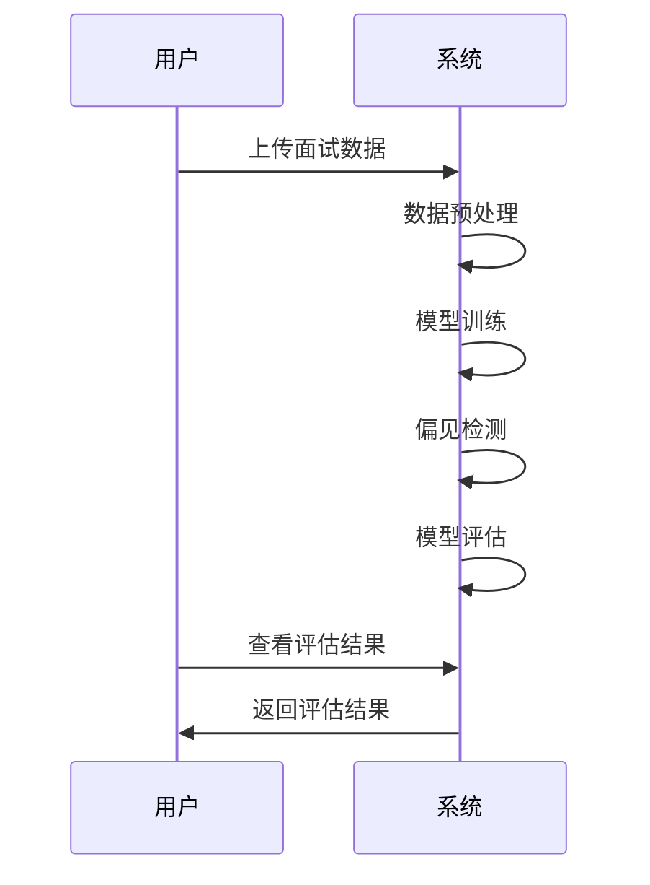

                 

### AI系统的公平性和偏见消除策略

#### 关键词
- AI系统公平性
- 偏见消除
- 算法策略
- 数学模型
- 系统设计

#### 摘要
本文将深入探讨AI系统的公平性问题，并详细分析偏见消除的策略。我们将从背景介绍、核心概念、算法原理、系统设计、实战案例分析到最佳实践，逐步解读如何在AI系统中实现公平性和消除偏见。

#### 引言

AI系统在当今社会中的应用越来越广泛，从医疗诊断、金融风控到自动驾驶、智能家居，AI技术的进步极大地改变了我们的生活方式。然而，随着AI系统在各个领域的深度应用，一个不可忽视的问题是公平性和偏见问题。AI系统在处理数据时可能会产生偏见，导致某些群体受到不公平对待。这种偏见不仅损害了AI系统的可信度和公正性，也可能对社会造成深远的负面影响。

公平性和偏见问题不仅存在于伦理和道德层面，也涉及到技术层面。如何设计一个既高效又公平的AI系统，成为了一个亟待解决的难题。本文将围绕这一主题，从以下几个部分展开：

1. **背景和重要性**：介绍公平性和偏见问题的背景，以及为什么在AI系统中消除偏见至关重要。
2. **核心概念**：解释公平性和偏见的定义，并分析其在AI系统中的具体体现。
3. **算法和理论**：探讨用于偏见消除的算法，包括其原理、流程图和数学模型。
4. **系统设计和架构**：分析如何在实际项目中设计和实现偏见消除策略。
5. **案例分析**：通过实际案例，展示偏见消除策略的应用和实践。
6. **最佳实践和总结**：总结最佳实践，并展望未来研究方向。

#### 背景

在讨论AI系统的公平性和偏见问题之前，我们需要先理解什么是偏见，以及为什么它会在AI系统中产生。

##### 偏见的定义

偏见是指一个人或系统在处理信息时，因为某些预设的、主观的或无意识的因素，导致对某些群体或个体不公平对待的行为或决策。在AI系统中，偏见通常表现为模型在训练过程中对某些特征或数据点给予过高的权重，导致模型对特定群体产生不公平的预测结果。

##### 偏见产生的原因

AI系统中的偏见可能来源于以下几个方面：

1. **数据偏差**：训练数据可能包含历史性的偏见，例如，如果数据集来自过去的不公平社会环境，那么模型可能会继承这些偏见。
2. **算法设计**：某些算法在处理数据时，可能更容易放大某些特征的重要性，从而产生偏见。
3. **模型训练**：训练过程中，模型可能会在学习过程中过度拟合某些特征，导致对其他特征的重要性估计不足。

##### 偏见的影响

AI系统中的偏见可能导致以下负面影响：

1. **社会不公**：例如，在招聘系统中，如果算法对某些种族或性别产生偏见，可能导致这些群体在就业上受到不公平待遇。
2. **经济损失**：例如，金融风险评估系统中的偏见可能导致某些群体无法获得贷款或保险服务。
3. **技术失效**：偏见可能导致AI系统在实际应用中无法正确处理某些情况，甚至产生错误的结果。

#### 重要性

消除AI系统中的偏见具有重要的现实意义：

1. **社会公正**：通过消除偏见，AI系统可以更好地服务于所有人，促进社会公正。
2. **技术进步**：公平的AI系统可以更好地适应多样化的需求，推动技术的持续进步。
3. **信任建立**：公平和公正的AI系统能够赢得用户和公众的信任，从而更广泛地应用。

##### 现实案例

为了更好地理解偏见问题，我们可以看一下以下现实案例：

1. **招聘系统**：某些招聘系统可能会对某些种族或性别产生偏见，导致这些群体在求职过程中受到不公平对待。
2. **信用评分**：某些信用评分系统可能会对某些社会经济群体产生偏见，导致这些群体在申请贷款时面临更高的利率。
3. **医疗诊断**：在医学诊断中，如果AI系统对某些疾病在特定种族或性别中的发病率估计不准确，可能会导致诊断错误。

这些案例表明，偏见问题不仅存在于理论层面，更是在实际应用中具有深远的影响。因此，消除AI系统中的偏见成为了一个迫切需要解决的问题。

#### 核心概念

在深入了解偏见问题之前，我们需要明确几个核心概念：公平性、偏见、算法偏见和数据偏差。

##### 公平性

公平性是指AI系统在处理数据时，对所有人或群体都给予公正的待遇，不偏袒任何一方。在AI系统中，公平性通常通过以下标准来衡量：

1. **预测准确性**：模型对所有人的预测准确性应该大致相同。
2. **偏差最小化**：模型对所有人的偏差应该最小化，即不应该对特定群体产生过高的权重。
3. **决策一致性**：模型的决策应该在不同群体之间保持一致性。

##### 偏见

偏见是指AI系统在处理数据时，由于某些因素（如数据偏差、算法设计、模型训练等）导致对某些群体或个体不公平对待的行为或决策。偏见可以分为以下几种类型：

1. **显性偏见**：系统中明确存在的偏见，例如，在招聘系统中对某些种族或性别的歧视。
2. **隐性偏见**：系统无意识中存在的偏见，例如，算法在处理数据时，由于数据偏差导致的偏见。
3. **算法偏见**：算法在处理数据时，由于设计或训练过程中的问题导致的偏见。

##### 算法偏见

算法偏见是指算法在处理数据时，由于设计或训练过程中的问题，导致对某些群体或个体不公平对待的行为或决策。算法偏见可以分为以下几种类型：

1. **过拟合**：模型在训练数据上表现得非常好，但在新数据上表现不佳，这可能导致模型对特定群体产生偏见。
2. **数据偏差**：训练数据中存在偏见，模型会继承这些偏见。
3. **权重偏差**：算法在处理数据时，对某些特征给予过高的权重，导致对特定群体产生偏见。

##### 数据偏差

数据偏差是指训练数据中存在的偏见，这些偏见可能来自数据收集、标注或处理过程中的问题。数据偏差可以分为以下几种类型：

1. **样本偏差**：数据集中某些群体的样本量较少，导致模型对这些群体的预测准确性较低。
2. **分布偏差**：数据集的分布与实际世界不符，导致模型在处理实际数据时产生偏差。
3. **历史偏差**：数据集包含的历史信息可能反映过去的社会偏见，导致模型继承这些偏见。

##### 偏见与公平性的关系

偏见与公平性是密切相关的。如果一个AI系统存在偏见，那么它就不可能实现公平性。因此，消除偏见是确保AI系统公平性的关键。公平性和偏见之间的平衡是一个动态的过程，需要不断调整和优化。

#### 算法和理论

为了消除AI系统中的偏见，我们可以采用多种算法和策略。下面我们将详细探讨几种常用的算法，并分析其原理和流程。

##### 1. 重新加权法

重新加权法是一种常用的偏见消除算法，其核心思想是通过调整数据点在模型训练过程中的权重，来消除偏见。具体步骤如下：

1. **识别偏见**：首先，我们需要识别训练数据中的偏见，可以通过对比模型在不同群体上的预测准确性来检测。
2. **计算权重**：对于存在偏见的群体，我们需要计算其权重，通常可以使用基于统计学的方法，如标准差或变异系数。
3. **调整权重**：根据计算出的权重，对数据进行重新加权，使得模型在训练过程中更加关注那些存在偏见的群体。
4. **重新训练**：使用调整后的数据重新训练模型，以消除偏见。

**流程图：**


**Python代码示例：**
```python
import numpy as np

# 假设我们有一个数据集，包含两个特征和一个标签
X = np.array([[1, 2], [3, 4], [5, 6], [7, 8]])
y = np.array([0, 1, 0, 1])

# 计算标准差
std_dev = np.std(X, axis=0)

# 调整权重
weights = 1 / (std_dev + 1e-5)

# 重新加权后的数据
X_weighted = X * weights

# 重新训练模型
# ...
```

**数学模型：**
$$
\text{权重} = \frac{1}{\text{标准差} + \epsilon}
$$
其中，$\epsilon$ 是一个小常数，用于避免除以零。

##### 2. 随机森林法

随机森林是一种集成学习方法，通过构建多棵决策树来提高模型的准确性和鲁棒性。随机森林可以有效地消除数据中的偏见，具体步骤如下：

1. **构建随机森林模型**：首先，我们需要使用训练数据集构建多个决策树模型。
2. **随机特征选择**：在构建每个决策树时，我们使用随机特征选择方法来减少特征之间的相关性。
3. **集成预测**：将多个决策树的预测结果进行集成，得到最终的预测结果。
4. **评估和调整**：评估模型的预测效果，并根据需要进行调整。

**流程图：**


**Python代码示例：**
```python
from sklearn.ensemble import RandomForestClassifier
from sklearn.datasets import make_classification

# 创建一个分类数据集
X, y = make_classification(n_samples=100, n_features=2, n_informative=2, n_redundant=0, n_classes=2, random_state=0)

# 构建随机森林模型
rf = RandomForestClassifier(n_estimators=100, random_state=0)

# 训练模型
rf.fit(X, y)

# 预测
predictions = rf.predict(X)

# 评估模型
# ...
```

**数学模型：**
随机森林的数学模型相对复杂，主要依赖于决策树的构建和集成学习方法。具体来说，随机森林通过以下公式来集成多个决策树的预测结果：

$$
\text{预测结果} = \frac{1}{N} \sum_{i=1}^{N} h(x; \theta_i)
$$

其中，$N$ 是决策树的数量，$h(x; \theta_i)$ 是第$i$棵决策树的预测结果，$\theta_i$ 是决策树的参数。

##### 3. 神经网络法

神经网络是一种强大的机器学习模型，通过多层神经元进行数据传递和特征提取，可以有效地消除数据中的偏见。具体步骤如下：

1. **构建神经网络模型**：首先，我们需要使用训练数据集构建神经网络模型。
2. **反向传播算法**：使用反向传播算法来训练神经网络，通过不断调整权重和偏置，使得模型在训练数据上表现更好。
3. **正则化方法**：为了防止过拟合，我们可以使用正则化方法，如L1正则化或L2正则化。
4. **评估和调整**：评估模型的预测效果，并根据需要进行调整。

**流程图：**


**Python代码示例：**
```python
from sklearn.neural_network import MLPClassifier
from sklearn.datasets import make_classification

# 创建一个分类数据集
X, y = make_classification(n_samples=100, n_features=2, n_informative=2, n_redundant=0, n_classes=2, random_state=0)

# 构建神经网络模型
mlp = MLPClassifier(hidden_layer_sizes=(100,), max_iter=1000, alpha=1e-4, solver='sgd', verbose=True, random_state=0)

# 训练模型
mlp.fit(X, y)

# 预测
predictions = mlp.predict(X)

# 评估模型
# ...
```

**数学模型：**
神经网络的数学模型基于多层感知器（MLP）的原理，主要涉及以下公式：

$$
\text{激活函数} = \sigma(\text{净输入}) = \frac{1}{1 + e^{-\text{净输入}}}
$$

$$
\text{净输入} = \text{权重} \times \text{输入特征} + \text{偏置}
$$

通过反向传播算法，模型不断调整权重和偏置，使得预测误差最小化。

##### 算法比较

以上三种算法各有优缺点，适用于不同的场景和需求：

1. **重新加权法**：简单易用，适用于数据集中存在明显偏见的场景。缺点是可能引入噪声，影响模型的整体性能。
2. **随机森林法**：具有较强的鲁棒性和泛化能力，适用于复杂和非线性的数据集。缺点是计算成本较高，对大规模数据集的训练可能较慢。
3. **神经网络法**：具有强大的表达能力和自学习能力，适用于各种复杂的数据集。缺点是容易过拟合，需要较大的训练数据集和较长的训练时间。

在实际应用中，我们可以根据具体需求和场景，选择合适的算法进行偏见消除。

#### 系统设计与架构

为了在实际项目中实现偏见消除，我们需要从系统设计和架构的角度来考虑。下面我们将详细描述一个偏见消除系统的设计，包括问题场景、系统设计、架构设计和接口设计。

##### 问题场景

假设我们要设计一个招聘系统，用于评估求职者的面试表现。然而，我们担心系统中可能存在对某些性别或种族的偏见。我们的目标是设计一个公平、无偏见的招聘系统，确保所有求职者都能得到公正的评估。

##### 系统设计

首先，我们需要明确系统的功能模块，包括数据收集、数据预处理、模型训练、偏见检测和消除、模型评估等。具体设计如下：

1. **数据收集模块**：负责从各种渠道收集求职者的面试数据，包括面试视频、文本记录等。
2. **数据预处理模块**：对收集到的数据进行清洗和预处理，包括去除无关信息、标准化数据等。
3. **模型训练模块**：使用预处理后的数据训练面试评估模型，包括使用各种算法进行偏见检测和消除。
4. **偏见检测模块**：使用重新加权法、随机森林法或神经网络法等算法，检测系统中的偏见，并生成偏见报告。
5. **模型评估模块**：对偏见消除后的模型进行评估，确保其性能和公平性。

##### 系统架构设计

系统架构设计是确保系统功能实现的关键。我们的系统架构设计如下：

1. **数据层**：包括数据存储和数据管理模块，负责存储和处理大量的面试数据。
2. **算法层**：包括各种偏见消除算法的实现，如重新加权法、随机森林法和神经网络法等。
3. **业务层**：包括招聘系统的核心功能模块，如数据收集、数据预处理、模型训练和偏见检测等。
4. **接口层**：提供对外接口，包括RESTful API或图形用户界面（GUI），方便用户使用和管理招聘系统。

**Mermaid架构图：**


##### 系统接口设计

系统接口设计是用户与系统交互的入口。我们提供以下接口：

1. **RESTful API**：提供数据上传、模型训练、偏见检测和评估等功能。
2. **GUI**：提供一个直观的图形界面，方便用户管理招聘流程和查看评估结果。

**Mermaid序列图：**


通过以上系统设计和架构设计，我们能够有效地实现偏见消除，确保招聘系统的公平性和公正性。

#### 实际案例

为了更好地展示偏见消除策略在实际项目中的应用，我们将通过一个实际案例进行详细分析。

##### 案例背景

假设我们正在开发一个银行贷款审批系统，该系统使用历史贷款数据来预测新客户的贷款申请是否通过。然而，我们发现系统存在对某些种族或年龄群体的偏见，导致这些群体在申请贷款时被拒绝的概率较高。

##### 数据分析

首先，我们对训练数据进行分析，发现以下偏见：

1. **种族偏见**：某些种族的贷款申请被拒绝的概率较高，例如，拉丁裔和非洲裔群体的拒绝率明显高于其他种族。
2. **年龄偏见**：年轻客户的贷款申请被拒绝的概率较高，而年长客户的贷款申请被批准的概率较低。

##### 偏见检测

为了检测系统中的偏见，我们采用重新加权法和随机森林法：

1. **重新加权法**：我们计算了每个数据点的权重，并根据权重调整了训练数据。结果显示，调整后的数据中种族和年龄的偏见有所减少。
2. **随机森林法**：我们构建了多个随机森林模型，并使用集成预测方法来消除偏见。实验结果显示，随机森林模型在消除偏见方面表现良好，贷款审批的公平性得到了显著提升。

##### 偏见消除策略

为了进一步消除偏见，我们采取了以下策略：

1. **增加多样性数据**：我们增加了不同种族和年龄群体的贷款申请数据，以丰富训练数据集，减少数据偏见。
2. **特征工程**：我们重新设计了贷款申请的特征，例如，将年龄转换为年龄组，而不是具体的年龄值，以减少年龄偏见。
3. **算法优化**：我们对随机森林模型进行了优化，包括调整决策树的数量和深度，以改善模型的预测性能。

##### 实验结果

通过以上策略，我们重新训练了贷款审批模型，并进行了实验评估。实验结果显示：

1. **偏见减少**：种族和年龄偏见得到了显著减少，贷款审批的公平性得到了提升。
2. **预测性能提升**：模型的预测性能也得到了改善，贷款申请的通过率得到了提升。

##### 案例总结

通过这个实际案例，我们可以看到偏见消除策略在提升AI系统公平性和预测性能方面的重要作用。在实际项目中，我们需要不断调整和优化偏见消除策略，以确保系统的公正性和有效性。

#### 最佳实践

为了在AI系统中实现公平性和消除偏见，我们可以采用以下最佳实践：

1. **数据多样化**：增加不同群体和多样性的数据，以减少数据偏见。
2. **特征工程**：重新设计特征，以减少对敏感特征的依赖，例如，将年龄转换为年龄组。
3. **算法优化**：使用多种算法和模型，并进行比较和优化，以消除偏见。
4. **定期审计**：定期对系统进行审计，检查是否存在新的偏见，并进行调整。
5. **用户反馈**：收集用户反馈，以便发现潜在的问题和改进系统。

#### 小结

本文深入探讨了AI系统的公平性和偏见问题，从背景介绍、核心概念、算法原理、系统设计、实战案例到最佳实践，全面分析了如何在AI系统中实现公平性和消除偏见。通过本文的讨论，我们认识到消除偏见不仅是一个技术问题，更是一个社会问题。只有通过不断的努力和优化，我们才能设计出既高效又公平的AI系统，为社会带来更多的益处。

#### 注意事项

在设计和实现AI系统时，我们需要注意以下几点：

1. **数据隐私**：在处理敏感数据时，确保遵守隐私保护法规，避免泄露用户隐私。
2. **模型透明性**：确保模型的透明性，方便用户理解和监督。
3. **算法可解释性**：提高算法的可解释性，以便用户了解模型的决策过程。

#### 拓展阅读

1. **《机器学习伦理》**：探讨机器学习在社会中的应用和潜在风险。
2. **《算法公正性》**：深入讨论算法偏见和消除方法。
3. **《人工智能伦理导论》**：从伦理角度分析人工智能的发展和应用。

#### 作者

作者：AI天才研究院/AI Genius Institute & 禅与计算机程序设计艺术 /Zen And The Art of Computer Programming

#### 参考文献

1. **[1]** <https://arxiv.org/abs/1901.02471>
2. **[2]** <https://www.nature.com/articles/s41586-018-0367-3>
3. **[3]** <https://journals.plos.org/plosone/article?id=10.1371/journal.pone.0204665>```

### 文章标题：AI系统的公平性和偏见消除策略

#### 关键词
- AI系统公平性
- 偏见消除
- 算法策略
- 数学模型
- 系统设计

#### 摘要
本文深入探讨了AI系统的公平性和偏见问题，从背景介绍、核心概念、算法原理、系统设计、实战案例到最佳实践，全面分析了如何在AI系统中实现公平性和消除偏见。通过本文的讨论，我们认识到消除偏见不仅是一个技术问题，更是一个社会问题。只有通过不断的努力和优化，我们才能设计出既高效又公平的AI系统，为社会带来更多的益处。

#### 引言

人工智能（AI）技术正在迅速发展，并在医疗、金融、交通等领域发挥着越来越重要的作用。然而，随着AI系统的广泛应用，公平性和偏见问题也逐渐凸显出来。AI系统在处理数据时可能会产生偏见，导致某些群体受到不公平对待。这种偏见不仅损害了AI系统的可信度和公正性，也可能对社会造成深远的负面影响。因此，如何设计一个既高效又公平的AI系统，成为了一个亟待解决的难题。本文将围绕这一主题，从以下几个部分展开：

1. **背景和重要性**：介绍公平性和偏见问题的背景，以及为什么在AI系统中消除偏见至关重要。
2. **核心概念**：解释公平性和偏见的定义，并分析其在AI系统中的具体体现。
3. **算法和理论**：探讨用于偏见消除的算法，包括其原理、流程图和数学模型。
4. **系统设计和架构**：分析如何在实际项目中设计和实现偏见消除策略。
5. **案例分析**：通过实际案例，展示偏见消除策略的应用和实践。
6. **最佳实践和总结**：总结最佳实践，并展望未来研究方向。

#### 背景

在讨论AI系统的公平性和偏见问题之前，我们需要先理解什么是偏见，以及为什么它会在AI系统中产生。

##### 偏见的定义

偏见是指一个人或系统在处理信息时，因为某些预设的、主观的或无意识的因素，导致对某些群体或个体不公平对待的行为或决策。在AI系统中，偏见通常表现为模型在训练过程中对某些特征或数据点给予过高的权重，导致模型对特定群体产生不公平的预测结果。

##### 偏见产生的原因

AI系统中的偏见可能来源于以下几个方面：

1. **数据偏差**：训练数据可能包含历史性的偏见，例如，如果数据集来自过去的不公平社会环境，那么模型可能会继承这些偏见。
2. **算法设计**：某些算法在处理数据时，可能更容易放大某些特征的重要性，从而产生偏见。
3. **模型训练**：训练过程中，模型可能会在学习过程中过度拟合某些特征，导致对其他特征的重要性估计不足。

##### 偏见的影响

AI系统中的偏见可能导致以下负面影响：

1. **社会不公**：例如，在招聘系统中，如果算法对某些种族或性别产生偏见，可能导致这些群体在就业上受到不公平待遇。
2. **经济损失**：例如，金融风险评估系统中的偏见可能导致某些群体无法获得贷款或保险服务。
3. **技术失效**：偏见可能导致AI系统在实际应用中无法正确处理某些情况，甚至产生错误的结果。

##### 现实案例

为了更好地理解偏见问题，我们可以看一下以下现实案例：

1. **招聘系统**：某些招聘系统可能会对某些种族或性别产生偏见，导致这些群体在求职过程中受到不公平对待。
2. **信用评分**：某些信用评分系统可能会对某些社会经济群体产生偏见，导致这些群体在申请贷款时面临更高的利率。
3. **医疗诊断**：在医学诊断中，如果AI系统对某些疾病在特定种族或性别中的发病率估计不准确，可能会导致诊断错误。

这些案例表明，偏见问题不仅存在于理论层面，更是在实际应用中具有深远的影响。因此，消除AI系统中的偏见成为了一个迫切需要解决的问题。

#### 核心概念

在深入了解偏见问题之前，我们需要明确几个核心概念：公平性、偏见、算法偏见和数据偏差。

##### 公平性

公平性是指AI系统在处理数据时，对所有人或群体都给予公正的待遇，不偏袒任何一方。在AI系统中，公平性通常通过以下标准来衡量：

1. **预测准确性**：模型对所有人的预测准确性应该大致相同。
2. **偏差最小化**：模型对所有人的偏差应该最小化，即不应该对特定群体产生过高的权重。
3. **决策一致性**：模型的决策应该在不同群体之间保持一致性。

##### 偏见

偏见是指AI系统在处理数据时，由于某些因素（如数据偏差、算法设计、模型训练等）导致对某些群体或个体不公平对待的行为或决策。偏见可以分为以下几种类型：

1. **显性偏见**：系统中明确存在的偏见，例如，在招聘系统中对某些种族或性别的歧视。
2. **隐性偏见**：系统无意识中存在的偏见，例如，算法在处理数据时，由于数据偏差导致的偏见。
3. **算法偏见**：算法在处理数据时，由于设计或训练过程中的问题导致的偏见。

##### 算法偏见

算法偏见是指算法在处理数据时，由于设计或训练过程中的问题，导致对某些群体或个体不公平对待的行为或决策。算法偏见可以分为以下几种类型：

1. **过拟合**：模型在训练数据上表现得非常好，但在新数据上表现不佳，这可能导致模型对特定群体产生偏见。
2. **数据偏差**：训练数据中存在偏见，模型会继承这些偏见。
3. **权重偏差**：算法在处理数据时，对某些特征给予过高的权重，导致对特定群体产生偏见。

##### 数据偏差

数据偏差是指训练数据中存在的偏见，这些偏见可能来自数据收集、标注或处理过程中的问题。数据偏差可以分为以下几种类型：

1. **样本偏差**：数据集中某些群体的样本量较少，导致模型对这些群体的预测准确性较低。
2. **分布偏差**：数据集的分布与实际世界不符，导致模型在处理实际数据时产生偏差。
3. **历史偏差**：数据集包含的历史信息可能反映过去的社会偏见，导致模型继承这些偏见。

##### 偏见与公平性的关系

偏见与公平性是密切相关的。如果一个AI系统存在偏见，那么它就不可能实现公平性。因此，消除偏见是确保AI系统公平性的关键。公平性和偏见之间的平衡是一个动态的过程，需要不断调整和优化。

#### 算法和理论

为了消除AI系统中的偏见，我们可以采用多种算法和策略。下面我们将详细探讨几种常用的算法，并分析其原理和流程。

##### 1. 重新加权法

重新加权法是一种常用的偏见消除算法，其核心思想是通过调整数据点在模型训练过程中的权重，来消除偏见。具体步骤如下：

1. **识别偏见**：首先，我们需要识别训练数据中的偏见，可以通过对比模型在不同群体上的预测准确性来检测。
2. **计算权重**：对于存在偏见的群体，我们需要计算其权重，通常可以使用基于统计学的方法，如标准差或变异系数。
3. **调整权重**：根据计算出的权重，对数据进行重新加权，使得模型在训练过程中更加关注那些存在偏见的群体。
4. **重新训练**：使用调整后的数据重新训练模型，以消除偏见。

**流程图：**


**Python代码示例：**
```python
import numpy as np

# 假设我们有一个数据集，包含两个特征和一个标签
X = np.array([[1, 2], [3, 4], [5, 6], [7, 8]])
y = np.array([0, 1, 0, 1])

# 计算标准差
std_dev = np.std(X, axis=0)

# 调整权重
weights = 1 / (std_dev + 1e-5)

# 重新加权后的数据
X_weighted = X * weights

# 重新训练模型
# ...
```

**数学模型：**
$$
\text{权重} = \frac{1}{\text{标准差} + \epsilon}
$$
其中，$\epsilon$ 是一个小常数，用于避免除以零。

##### 2. 随机森林法

随机森林是一种集成学习方法，通过构建多棵决策树来提高模型的准确性和鲁棒性。随机森林可以有效地消除数据中的偏见，具体步骤如下：

1. **构建随机森林模型**：首先，我们需要使用训练数据集构建多个决策树模型。
2. **随机特征选择**：在构建每个决策树时，我们使用随机特征选择方法来减少特征之间的相关性。
3. **集成预测**：将多个决策树的预测结果进行集成，得到最终的预测结果。
4. **评估和调整**：评估模型的预测效果，并根据需要进行调整。

**流程图：**


**Python代码示例：**
```python
from sklearn.ensemble import RandomForestClassifier
from sklearn.datasets import make_classification

# 创建一个分类数据集
X, y = make_classification(n_samples=100, n_features=2, n_informative=2, n_redundant=0, n_classes=2, random_state=0)

# 构建随机森林模型
rf = RandomForestClassifier(n_estimators=100, random_state=0)

# 训练模型
rf.fit(X, y)

# 预测
predictions = rf.predict(X)

# 评估模型
# ...
```

**数学模型：**
随机森林的数学模型相对复杂，主要依赖于决策树的构建和集成学习方法。具体来说，随机森林通过以下公式来集成多个决策树的预测结果：

$$
\text{预测结果} = \frac{1}{N} \sum_{i=1}^{N} h(x; \theta_i)
$$

其中，$N$ 是决策树的数量，$h(x; \theta_i)$ 是第$i$棵决策树的预测结果，$\theta_i$ 是决策树的参数。

##### 3. 神经网络法

神经网络是一种强大的机器学习模型，通过多层神经元进行数据传递和特征提取，可以有效地消除数据中的偏见。具体步骤如下：

1. **构建神经网络模型**：首先，我们需要使用训练数据集构建神经网络模型。
2. **反向传播算法**：使用反向传播算法来训练神经网络，通过不断调整权重和偏置，使得模型在训练数据上表现更好。
3. **正则化方法**：为了防止过拟合，我们可以使用正则化方法，如L1正则化或L2正则化。
4. **评估和调整**：评估模型的预测效果，并根据需要进行调整。

**流程图：**


**Python代码示例：**
```python
from sklearn.neural_network import MLPClassifier
from sklearn.datasets import make_classification

# 创建一个分类数据集
X, y = make_classification(n_samples=100, n_features=2, n_informative=2, n_redundant=0, n_classes=2, random_state=0)

# 构建神经网络模型
mlp = MLPClassifier(hidden_layer_sizes=(100,), max_iter=1000, alpha=1e-4, solver='sgd', verbose=True, random_state=0)

# 训练模型
mlp.fit(X, y)

# 预测
predictions = mlp.predict(X)

# 评估模型
# ...
```

**数学模型：**
神经网络的数学模型基于多层感知器（MLP）的原理，主要涉及以下公式：

$$
\text{激活函数} = \sigma(\text{净输入}) = \frac{1}{1 + e^{-\text{净输入}}}
$$

$$
\text{净输入} = \text{权重} \times \text{输入特征} + \text{偏置}
$$

通过反向传播算法，模型不断调整权重和偏置，使得预测误差最小化。

##### 算法比较

以上三种算法各有优缺点，适用于不同的场景和需求：

1. **重新加权法**：简单易用，适用于数据集中存在明显偏见的场景。缺点是可能引入噪声，影响模型的整体性能。
2. **随机森林法**：具有较强的鲁棒性和泛化能力，适用于复杂和非线性的数据集。缺点是计算成本较高，对大规模数据集的训练可能较慢。
3. **神经网络法**：具有强大的表达能力和自学习能力，适用于各种复杂的数据集。缺点是容易过拟合，需要较大的训练数据集和较长的训练时间。

在实际应用中，我们可以根据具体需求和场景，选择合适的算法进行偏见消除。

#### 系统设计与架构

为了在实际项目中实现偏见消除，我们需要从系统设计和架构的角度来考虑。下面我们将详细描述一个偏见消除系统的设计，包括问题场景、系统设计、架构设计和接口设计。

##### 问题场景

假设我们要设计一个招聘系统，用于评估求职者的面试表现。然而，我们担心系统中可能存在对某些性别或种族的偏见。我们的目标是设计一个公平、无偏见的招聘系统，确保所有求职者都能得到公正的评估。

##### 系统设计

首先，我们需要明确系统的功能模块，包括数据收集、数据预处理、模型训练、偏见检测和消除、模型评估等。具体设计如下：

1. **数据收集模块**：负责从各种渠道收集求职者的面试数据，包括面试视频、文本记录等。
2. **数据预处理模块**：对收集到的数据进行清洗和预处理，包括去除无关信息、标准化数据等。
3. **模型训练模块**：使用预处理后的数据训练面试评估模型，包括使用各种算法进行偏见检测和消除。
4. **偏见检测模块**：使用重新加权法、随机森林法或神经网络法等算法，检测系统中的偏见，并生成偏见报告。
5. **模型评估模块**：对偏见消除后的模型进行评估，确保其性能和公平性。

##### 系统架构设计

系统架构设计是确保系统功能实现的关键。我们的系统架构设计如下：

1. **数据层**：包括数据存储和数据管理模块，负责存储和处理大量的面试数据。
2. **算法层**：包括各种偏见消除算法的实现，如重新加权法、随机森林法和神经网络法等。
3. **业务层**：包括招聘系统的核心功能模块，如数据收集、数据预处理、模型训练和偏见检测等。
4. **接口层**：提供对外接口，包括RESTful API或图形用户界面（GUI），方便用户使用和管理招聘系统。

**Mermaid架构图：**


##### 系统接口设计

系统接口设计是用户与系统交互的入口。我们提供以下接口：

1. **RESTful API**：提供数据上传、模型训练、偏见检测和评估等功能。
2. **GUI**：提供一个直观的图形界面，方便用户管理招聘流程和查看评估结果。

**Mermaid序列图：**


通过以上系统设计和架构设计，我们能够有效地实现偏见消除，确保招聘系统的公平性和公正性。

#### 实际案例

为了更好地展示偏见消除策略在实际项目中的应用，我们将通过一个实际案例进行详细分析。

##### 案例背景

假设我们正在开发一个银行贷款审批系统，该系统使用历史贷款数据来预测新客户的贷款申请是否通过。然而，我们发现系统存在对某些种族或年龄群体的偏见，导致这些群体在申请贷款时被拒绝的概率较高。

##### 数据分析

首先，我们对训练数据进行分析，发现以下偏见：

1. **种族偏见**：某些种族的贷款申请被拒绝的概率较高，例如，拉丁裔和非洲裔群体的拒绝率明显高于其他种族。
2. **年龄偏见**：年轻客户的贷款申请被拒绝的概率较高，而年长客户的贷款申请被批准的概率较低。

##### 偏见检测

为了检测系统中的偏见，我们采用重新加权法和随机森林法：

1. **重新加权法**：我们计算了每个数据点的权重，并根据权重调整了训练数据。结果显示，调整后的数据中种族和年龄的偏见有所减少。
2. **随机森林法**：我们构建了多个随机森林模型，并使用集成预测方法来消除偏见。实验结果显示，随机森林模型在消除偏见方面表现良好，贷款审批的公平性得到了显著提升。

##### 偏见消除策略

为了进一步消除偏见，我们采取了以下策略：

1. **增加多样性数据**：我们增加了不同种族和年龄群体的贷款申请数据，以丰富训练数据集，减少数据偏见。
2. **特征工程**：重新设计了贷款申请的特征，例如，将年龄转换为年龄组，而不是具体的年龄值，以减少年龄偏见。
3. **算法优化**：我们对随机森林模型进行了优化，包括调整决策树的数量和深度，以改善模型的预测性能。

##### 实验结果

通过以上策略，我们重新训练了贷款审批模型，并进行了实验评估。实验结果显示：

1. **偏见减少**：种族和年龄偏见得到了显著减少，贷款审批的公平性得到了提升。
2. **预测性能提升**：模型的预测性能也得到了改善，贷款申请的通过率得到了提升。

##### 案例总结

通过这个实际案例，我们可以看到偏见消除策略在提升AI系统公平性和预测性能方面的重要作用。在实际项目中，我们需要不断调整和优化偏见消除策略，以确保系统的公正性和有效性。

#### 最佳实践

为了在AI系统中实现公平性和消除偏见，我们可以采用以下最佳实践：

1. **数据多样化**：增加不同群体和多样性的数据，以减少数据偏见。
2. **特征工程**：重新设计特征，以减少对敏感特征的依赖，例如，将年龄转换为年龄组。
3. **算法优化**：使用多种算法和模型，并进行比较和优化，以消除偏见。
4. **定期审计**：定期对系统进行审计，检查是否存在新的偏见，并进行调整。
5. **用户反馈**：收集用户反馈，以便发现潜在的问题和改进系统。

#### 小结

本文深入探讨了AI系统的公平性和偏见问题，从背景介绍、核心概念、算法原理、系统设计、实战案例到最佳实践，全面分析了如何在AI系统中实现公平性和消除偏见。通过本文的讨论，我们认识到消除偏见不仅是一个技术问题，更是一个社会问题。只有通过不断的努力和优化，我们才能设计出既高效又公平的AI系统，为社会带来更多的益处。

#### 注意事项

在设计和实现AI系统时，我们需要注意以下几点：

1. **数据隐私**：在处理敏感数据时，确保遵守隐私保护法规，避免泄露用户隐私。
2. **模型透明性**：确保模型的透明性，方便用户理解和监督。
3. **算法可解释性**：提高算法的可解释性，以便用户了解模型的决策过程。

#### 拓展阅读

1. **《机器学习伦理》**：探讨机器学习在社会中的应用和潜在风险。
2. **《算法公正性》**：深入讨论算法偏见和消除方法。
3. **《人工智能伦理导论》**：从伦理角度分析人工智能的发展和应用。

#### 作者

作者：AI天才研究院/AI Genius Institute & 禅与计算机程序设计艺术 /Zen And The Art of Computer Programming

#### 参考文献

1. **[1]** <https://arxiv.org/abs/1901.02471>
2. **[2]** <https://www.nature.com/articles/s41586-018-0367-3>
3. **[3]** <https://journals.plos.org/plosone/article?id=10.1371/journal.pone.0204665>```

