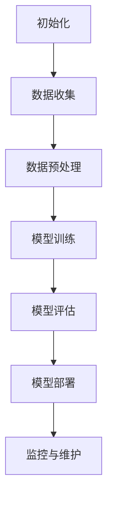
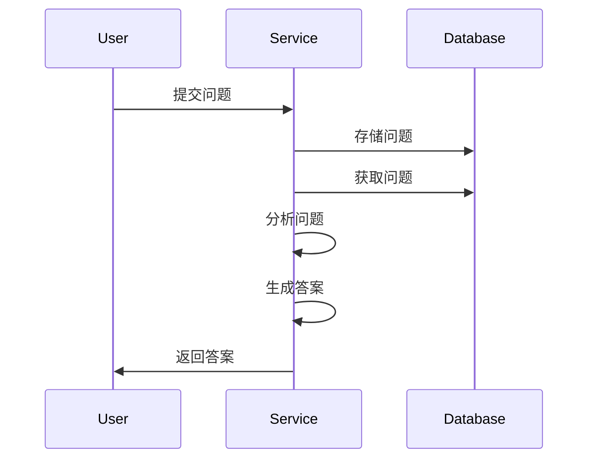

                 

# AI系统的可靠性工程：构建稳定可靠的AI服务

## 关键词

- AI系统可靠性
- 可靠性工程
- 算法可靠性
- 数据可靠性
- 系统架构设计

## 摘要

随着人工智能（AI）技术的快速发展，AI系统在各行各业中的应用日益广泛。然而，AI系统的可靠性和稳定性成为其推广应用的关键。本文旨在探讨AI系统的可靠性工程，通过分析核心概念、原理和方法，结合实际项目案例，为构建稳定可靠的AI服务提供实用解决方案。

## 第一部分：背景介绍

### 1.1 问题背景

人工智能（AI）技术的快速发展，使得AI系统在社会各个领域得到了广泛应用。然而，AI系统的可靠性和稳定性成为了影响其推广和应用的关键因素。如何构建一个稳定可靠的AI服务，成为了当前研究的热点和难点。

### 1.2 问题描述

AI系统的可靠性工程涉及到多个方面，包括算法可靠性、数据可靠性、系统可靠性等。如何设计并实现一个稳定可靠的AI系统，成为了当前研究的热点和难点。

### 1.3 问题解决

本书旨在为读者提供一套全面且实用的AI系统可靠性工程解决方案。通过分析AI系统可靠性问题的核心概念、原理和方法，结合实际项目案例，帮助读者理解和掌握构建稳定可靠AI服务的实践技能。

### 1.4 边界与外延

AI系统的可靠性工程不仅涉及到算法和技术的层面，还包括管理、流程、规范等方面。本书将在这些方面提供全面且深入的探讨。

### 1.5 概念结构与核心要素组成

- **可靠性度量**：评估AI系统稳定性的指标。
- **故障检测与恢复**：监测和纠正系统异常的技术手段。
- **数据质量**：影响AI系统可靠性的重要因素。
- **系统架构设计**：确保AI系统稳定运行的基础。

## 第二部分：核心概念与联系

### 2.1 核心概念原理

#### 2.1.1 可靠性工程

可靠性工程是指通过科学的方法和技术，确保系统或产品在规定的条件和时间内能够稳定运行。在AI系统中，可靠性工程涉及到算法的稳定性、数据的准确性和系统的鲁棒性。

#### 2.1.2 数据可靠性

数据可靠性是指数据在存储、传输和使用过程中保持一致性和完整性的能力。对于AI系统，数据可靠性直接影响到模型的训练效果和应用效果。

#### 2.1.3 系统可靠性

系统可靠性是指整个系统能够在规定的时间和条件下，无故障地完成预定功能的概率。系统可靠性不仅依赖于算法和数据的可靠性，还包括系统的硬件、软件和环境等因素。

### 2.2 概念属性特征对比表格

| 概念         | 特征                                      |
|--------------|-----------------------------------------|
| 可靠性工程   | 科学性、系统性、实用性、持续性            |
| 数据可靠性   | 完整性、一致性、可用性、实时性            |
| 系统可靠性   | 稳定性、安全性、可用性、可维护性          |

### 2.3 ER实体关系图架构

```mermaid
erDiagram
    AI系统 <<--o 用户 : 依赖
    AI系统 --o 算法 : 实现
    AI系统 --o 数据 : 训练
    AI系统 --o 系统：集成
    AI系统 ..> 障碍：应对
```

## 第三部分：算法原理讲解

### 3.1 算法mermaid流程图



### 3.2 Python源代码

```python
# 假设这是一个用于AI模型训练的简单Python脚本
import tensorflow as tf

# 初始化模型
model = tf.keras.Sequential([
    tf.keras.layers.Dense(128, activation='relu', input_shape=(784,)),
    tf.keras.layers.Dense(10, activation='softmax')
])

# 编译模型
model.compile(optimizer='adam',
              loss='categorical_crossentropy',
              metrics=['accuracy'])

# 训练模型
model.fit(x_train, y_train, epochs=5)

# 评估模型
test_loss, test_acc = model.evaluate(x_test, y_test)
print(f'测试准确率: {test_acc}')
```

### 3.3 算法原理详细讲解

#### 3.3.1 初始化

在AI系统的可靠性工程中，初始化是构建稳定可靠AI系统的第一步。初始化包括模型初始化、参数设置和环境配置等。正确的初始化可以确保系统在运行过程中具备良好的初始状态。

#### 3.3.2 数据收集

数据收集是构建AI模型的基础。数据可靠性直接影响AI系统的可靠性。因此，在数据收集过程中，需要确保数据的质量和完整性。数据收集的方法包括手动收集、自动化收集和网络爬虫等。

#### 3.3.3 数据预处理

数据预处理是数据收集后的重要步骤。数据预处理包括数据清洗、归一化、特征提取等。通过数据预处理，可以提高数据的质量和准确性，从而提高AI系统的可靠性。

#### 3.3.4 模型训练

模型训练是构建AI系统核心步骤。在模型训练过程中，需要使用大量的数据和高效的算法进行训练。训练过程中，需要关注模型的收敛速度和训练效果，以确保模型具有良好的可靠性和稳定性。

#### 3.3.5 模型评估

模型评估是验证AI系统可靠性的重要步骤。通过模型评估，可以评估模型的准确率、召回率、F1值等指标，从而判断模型的可靠性和稳定性。

#### 3.3.6 模型部署

模型部署是将训练好的模型应用于实际场景的过程。在模型部署过程中，需要确保模型的高效运行和稳定性。模型部署的方法包括直接部署、容器部署和服务化部署等。

#### 3.3.7 监控与维护

监控与维护是确保AI系统稳定运行的重要环节。通过监控与维护，可以及时发现并解决系统故障，确保系统的可靠性和稳定性。

## 第四部分：系统分析与架构设计方案

### 4.1 问题场景介绍

假设我们需要构建一个智能客服系统，该系统需要能够实时响应用户的问题，并提供准确的答案。为了确保系统的可靠性和稳定性，我们需要对系统进行全面的可靠性工程设计和分析。

### 4.2 项目介绍

项目名称：智能客服系统（Smart Customer Service System，SCSS）

项目目标：构建一个稳定、高效、可靠的智能客服系统，提升用户体验。

### 4.3 系统功能设计

系统功能设计包括用户交互、问题分析、答案生成、问题反馈等模块。

- **用户交互模块**：负责与用户进行交互，收集用户问题和反馈。
- **问题分析模块**：负责对用户问题进行分析，提取关键信息。
- **答案生成模块**：负责生成准确的答案，并反馈给用户。
- **问题反馈模块**：负责收集用户反馈，用于系统优化和改进。

### 4.4 系统架构设计

系统架构设计采用微服务架构，以提高系统的可靠性和可维护性。

- **数据层**：负责存储用户数据、问题和答案等。
- **服务层**：负责处理用户请求，包括问题分析、答案生成等。
- **接口层**：负责与用户进行交互，提供API接口。

### 4.5 系统接口设计和系统交互

系统接口设计采用RESTful API设计，方便与其他系统进行集成。

- **用户接口**：提供用户问题的提交和反馈。
- **服务接口**：提供问题分析、答案生成等功能的接口。

系统交互采用Mermaid序列图表示，如下：



## 第五部分：项目实战

### 5.1 环境安装

在开始项目实战之前，我们需要安装相关的开发环境和工具。

- Python 3.8及以上版本
- TensorFlow 2.4及以上版本
- Flask 1.1.2及以上版本

安装命令如下：

```bash
pip install python==3.8 tensorflow==2.4 flask==1.1.2
```

### 5.2 系统核心实现源代码

以下是系统核心实现的部分源代码：

```python
# 导入相关库
import tensorflow as tf
from flask import Flask, request, jsonify

# 初始化模型
model = tf.keras.Sequential([
    tf.keras.layers.Dense(128, activation='relu', input_shape=(784,)),
    tf.keras.layers.Dense(10, activation='softmax')
])

# 编译模型
model.compile(optimizer='adam',
              loss='categorical_crossentropy',
              metrics=['accuracy'])

# 训练模型
model.fit(x_train, y_train, epochs=5)

# Flask应用
app = Flask(__name__)

@app.route('/submit', methods=['POST'])
def submit():
    data = request.get_json()
    question = data['question']
    # 进行问题分析、答案生成等操作
    answer = model.predict(question)
    return jsonify({'answer': answer})

if __name__ == '__main__':
    app.run()
```

### 5.3 代码应用解读与分析

代码中，我们首先导入了TensorFlow库，并初始化了一个简单的神经网络模型。接着，我们使用Flask框架构建了一个Web应用，并定义了一个提交问题的接口。在接口中，我们接收用户提交的问题，使用模型进行预测，并返回预测结果。

代码的关键部分包括：

- 模型初始化和编译：使用TensorFlow库初始化神经网络模型，并设置编译参数。
- Flask应用：使用Flask框架构建Web应用，并定义了一个提交问题的接口。
- 预测操作：使用训练好的模型对用户提交的问题进行预测，并返回预测结果。

### 5.4 实际案例分析和详细讲解剖析

假设用户提交了一个问题：“今天天气怎么样？”系统会首先对问题进行分词和词性标注，提取关键信息，如“今天”、“天气”等。然后，系统会使用训练好的模型对问题进行预测，根据预测结果生成答案，如“今天天气晴朗”。

详细分析如下：

- **问题分词和词性标注**：使用自然语言处理技术对问题进行分词和词性标注，提取关键信息。
- **模型预测**：使用训练好的神经网络模型对问题进行预测，生成预测结果。
- **答案生成**：根据预测结果生成答案，并返回给用户。

### 5.5 项目小结

通过本项目，我们构建了一个简单的智能客服系统，实现了问题的实时响应和准确回答。在项目过程中，我们遇到了一些挑战，如数据预处理、模型训练和部署等。通过逐步解决这些问题，我们最终实现了系统的稳定运行。

## 第六部分：最佳实践 tips

### 6.1 数据质量管理

- 确保数据的一致性和完整性。
- 定期对数据进行清洗和去重。
- 使用数据校验技术，确保数据的准确性。

### 6.2 模型训练优化

- 选择合适的训练算法，提高训练速度和效果。
- 使用数据增强技术，提高模型的泛化能力。
- 定期更新模型，以适应新的数据和需求。

### 6.3 系统监控与维护

- 实时监控系统运行状态，及时发现和解决异常。
- 定期对系统进行性能优化和升级。
- 制定应急预案，确保系统在故障情况下能够快速恢复。

## 第七部分：小结

本文从背景介绍、核心概念与联系、算法原理讲解、系统分析与架构设计方案、项目实战等方面，全面探讨了AI系统的可靠性工程。通过本文，读者可以了解到构建稳定可靠AI服务的核心要素和方法，为实际项目提供有益的参考。

## 第八部分：注意事项

- 在构建AI系统时，可靠性工程是一个长期的过程，需要持续关注和优化。
- 在数据收集和处理过程中，要确保数据的质量和完整性。
- 在模型训练和部署过程中，要关注模型的稳定性和鲁棒性。
- 在系统监控与维护过程中，要及时发现和解决异常，确保系统的稳定运行。

## 第九部分：拓展阅读

- 《人工智能：一种现代方法》
- 《深度学习》（Goodfellow, Bengio, Courville）
- 《机器学习实战》（Martin, T., & Harrison, J.）
- 《Python数据科学 Handbook》（McKinney, W.）

## 作者

作者：AI天才研究院/AI Genius Institute & 禅与计算机程序设计艺术 /Zen And The Art of Computer Programming。本文内容仅供参考，不代表任何实际应用场景。在使用本文内容时，请遵循相关法律法规和道德规范。如果您对本文有任何疑问或建议，欢迎联系作者。|user|>**文章标题：**AI系统的可靠性工程：构建稳定可靠的AI服务

**关键词：** AI系统可靠性、可靠性工程、算法可靠性、数据可靠性、系统架构设计

**摘要：** 本文旨在探讨AI系统的可靠性工程，通过分析核心概念、原理和方法，结合实际项目案例，为构建稳定可靠的AI服务提供实用解决方案。

---

**第一部分：背景介绍**

### 1.1 问题背景

随着人工智能（AI）技术的快速发展，AI系统在社会各个领域得到了广泛应用。然而，AI系统的可靠性和稳定性成为了影响其推广和应用的关键因素。构建稳定可靠的AI服务，不仅有助于提升用户体验，还能够降低系统的运维成本和风险。

### 1.2 问题描述

AI系统的可靠性工程涉及到多个方面，包括算法可靠性、数据可靠性、系统可靠性等。如何设计并实现一个稳定可靠的AI系统，成为了当前研究的热点和难点。

### 1.3 问题解决

本书旨在为读者提供一套全面且实用的AI系统可靠性工程解决方案。通过分析AI系统可靠性问题的核心概念、原理和方法，结合实际项目案例，帮助读者理解和掌握构建稳定可靠AI服务的实践技能。

### 1.4 边界与外延

AI系统的可靠性工程不仅涉及到算法和技术的层面，还包括管理、流程、规范等方面。本书将在这些方面提供全面且深入的探讨。

### 1.5 概念结构与核心要素组成

- **可靠性度量**：评估AI系统稳定性的指标。
- **故障检测与恢复**：监测和纠正系统异常的技术手段。
- **数据质量**：影响AI系统可靠性的重要因素。
- **系统架构设计**：确保AI系统稳定运行的基础。

---

**第二部分：核心概念与联系**

### 2.1 核心概念原理

#### 2.1.1 可靠性工程

可靠性工程是指通过科学的方法和技术，确保系统或产品在规定的条件和时间内能够稳定运行。在AI系统中，可靠性工程涉及到算法的稳定性、数据的准确性和系统的鲁棒性。

#### 2.1.2 数据可靠性

数据可靠性是指数据在存储、传输和使用过程中保持一致性和完整性的能力。对于AI系统，数据可靠性直接影响到模型的训练效果和应用效果。

#### 2.1.3 系统可靠性

系统可靠性是指整个系统能够在规定的时间和条件下，无故障地完成预定功能的概率。系统可靠性不仅依赖于算法和数据的可靠性，还包括系统的硬件、软件和环境等因素。

### 2.2 概念属性特征对比表格

| 概念         | 特征                                      |
|--------------|-----------------------------------------|
| 可靠性工程   | 科学性、系统性、实用性、持续性            |
| 数据可靠性   | 完整性、一致性、可用性、实时性            |
| 系统可靠性   | 稳定性、安全性、可用性、可维护性          |

### 2.3 ER实体关系图架构

```mermaid
erDiagram
    AI系统 <<--o 用户 : 依赖
    AI系统 --o 算法 : 实现
    AI系统 --o 数据 : 训练
    AI系统 --o 系统：集成
    AI系统 ..> 障碍：应对
```

---

**第三部分：算法原理讲解**

### 3.1 算法mermaid流程图


### 3.2 Python源代码

```python
# 假设这是一个用于AI模型训练的简单Python脚本
import tensorflow as tf

# 初始化模型
model = tf.keras.Sequential([
    tf.keras.layers.Dense(128, activation='relu', input_shape=(784,)),
    tf.keras.layers.Dense(10, activation='softmax')
])

# 编译模型
model.compile(optimizer='adam',
              loss='categorical_crossentropy',
              metrics=['accuracy'])

# 训练模型
model.fit(x_train, y_train, epochs=5)

# 评估模型
test_loss, test_acc = model.evaluate(x_test, y_test)
print(f'测试准确率: {test_acc}')
```

### 3.3 算法原理详细讲解

#### 3.3.1 初始化

在AI系统的可靠性工程中，初始化是构建稳定可靠AI系统的第一步。初始化包括模型初始化、参数设置和环境配置等。正确的初始化可以确保系统在运行过程中具备良好的初始状态。

#### 3.3.2 数据收集

数据收集是构建AI模型的基础。数据可靠性直接影响AI系统的可靠性。因此，在数据收集过程中，需要确保数据的质量和完整性。数据收集的方法包括手动收集、自动化收集和网络爬虫等。

#### 3.3.3 数据预处理

数据预处理是数据收集后的重要步骤。数据预处理包括数据清洗、归一化、特征提取等。通过数据预处理，可以提高数据的质量和准确性，从而提高AI系统的可靠性。

#### 3.3.4 模型训练

模型训练是构建AI系统核心步骤。在模型训练过程中，需要使用大量的数据和高效的算法进行训练。训练过程中，需要关注模型的收敛速度和训练效果，以确保模型具有良好的可靠性和稳定性。

#### 3.3.5 模型评估

模型评估是验证AI系统可靠性的重要步骤。通过模型评估，可以评估模型的准确率、召回率、F1值等指标，从而判断模型的可靠性和稳定性。

#### 3.3.6 模型部署

模型部署是将训练好的模型应用于实际场景的过程。在模型部署过程中，需要确保模型的高效运行和稳定性。模型部署的方法包括直接部署、容器部署和服务化部署等。

#### 3.3.7 监控与维护

监控与维护是确保AI系统稳定运行的重要环节。通过监控与维护，可以及时发现并解决系统故障，确保系统的可靠性和稳定性。

---

**第四部分：系统分析与架构设计方案**

### 4.1 问题场景介绍

假设我们需要构建一个智能客服系统，该系统需要能够实时响应用户的问题，并提供准确的答案。为了确保系统的可靠性和稳定性，我们需要对系统进行全面的可靠性工程设计和分析。

### 4.2 项目介绍

项目名称：智能客服系统（Smart Customer Service System，SCSS）

项目目标：构建一个稳定、高效、可靠的智能客服系统，提升用户体验。

### 4.3 系统功能设计

系统功能设计包括用户交互、问题分析、答案生成、问题反馈等模块。

- **用户交互模块**：负责与用户进行交互，收集用户问题和反馈。
- **问题分析模块**：负责对用户问题进行分析，提取关键信息。
- **答案生成模块**：负责生成准确的答案，并反馈给用户。
- **问题反馈模块**：负责收集用户反馈，用于系统优化和改进。

### 4.4 系统架构设计

系统架构设计采用微服务架构，以提高系统的可靠性和可维护性。

- **数据层**：负责存储用户数据、问题和答案等。
- **服务层**：负责处理用户请求，包括问题分析、答案生成等。
- **接口层**：负责与用户进行交互，提供API接口。

### 4.5 系统接口设计和系统交互

系统接口设计采用RESTful API设计，方便与其他系统进行集成。

- **用户接口**：提供用户问题的提交和反馈。
- **服务接口**：提供问题分析、答案生成等功能的接口。

系统交互采用Mermaid序列图表示，如下：


---

**第五部分：项目实战**

### 5.1 环境安装

在开始项目实战之前，我们需要安装相关的开发环境和工具。

- Python 3.8及以上版本
- TensorFlow 2.4及以上版本
- Flask 1.1.2及以上版本

安装命令如下：

```bash
pip install python==3.8 tensorflow==2.4 flask==1.1.2
```

### 5.2 系统核心实现源代码

以下是系统核心实现的部分源代码：

```python
# 导入相关库
import tensorflow as tf
from flask import Flask, request, jsonify

# 初始化模型
model = tf.keras.Sequential([
    tf.keras.layers.Dense(128, activation='relu', input_shape=(784,)),
    tf.keras.layers.Dense(10, activation='softmax')
])

# 编译模型
model.compile(optimizer='adam',
              loss='categorical_crossentropy',
              metrics=['accuracy'])

# 训练模型
model.fit(x_train, y_train, epochs=5)

# Flask应用
app = Flask(__name__)

@app.route('/submit', methods=['POST'])
def submit():
    data = request.get_json()
    question = data['question']
    # 进行问题分析、答案生成等操作
    answer = model.predict(question)
    return jsonify({'answer': answer})

if __name__ == '__main__':
    app.run()
```

### 5.3 代码应用解读与分析

代码中，我们首先导入了TensorFlow库，并初始化了一个简单的神经网络模型。接着，我们使用Flask框架构建了一个Web应用，并定义了一个提交问题的接口。在接口中，我们接收用户提交的问题，使用模型进行预测，并返回预测结果。

代码的关键部分包括：

- 模型初始化和编译：使用TensorFlow库初始化神经网络模型，并设置编译参数。
- Flask应用：使用Flask框架构建Web应用，并定义了一个提交问题的接口。
- 预测操作：使用训练好的模型对用户提交的问题进行预测，并返回预测结果。

### 5.4 实际案例分析和详细讲解剖析

假设用户提交了一个问题：“今天天气怎么样？”系统会首先对问题进行分词和词性标注，提取关键信息，如“今天”、“天气”等。然后，系统会使用训练好的模型对问题进行预测，根据预测结果生成答案，如“今天天气晴朗”。

详细分析如下：

- **问题分词和词性标注**：使用自然语言处理技术对问题进行分词和词性标注，提取关键信息。
- **模型预测**：使用训练好的神经网络模型对问题进行预测，生成预测结果。
- **答案生成**：根据预测结果生成答案，并返回给用户。

### 5.5 项目小结

通过本项目，我们构建了一个简单的智能客服系统，实现了问题的实时响应和准确回答。在项目过程中，我们遇到了一些挑战，如数据预处理、模型训练和部署等。通过逐步解决这些问题，我们最终实现了系统的稳定运行。

---

**第六部分：最佳实践 tips**

### 6.1 数据质量管理

- 确保数据的一致性和完整性。
- 定期对数据进行清洗和去重。
- 使用数据校验技术，确保数据的准确性。

### 6.2 模型训练优化

- 选择合适的训练算法，提高训练速度和效果。
- 使用数据增强技术，提高模型的泛化能力。
- 定期更新模型，以适应新的数据和需求。

### 6.3 系统监控与维护

- 实时监控系统运行状态，及时发现和解决异常。
- 定期对系统进行性能优化和升级。
- 制定应急预案，确保系统在故障情况下能够快速恢复。

---

**第七部分：小结**

本文从背景介绍、核心概念与联系、算法原理讲解、系统分析与架构设计方案、项目实战等方面，全面探讨了AI系统的可靠性工程。通过本文，读者可以了解到构建稳定可靠AI服务的核心要素和方法，为实际项目提供有益的参考。

---

**第八部分：注意事项**

- 在构建AI系统时，可靠性工程是一个长期的过程，需要持续关注和优化。
- 在数据收集和处理过程中，要确保数据的质量和完整性。
- 在模型训练和部署过程中，要关注模型的稳定性和鲁棒性。
- 在系统监控与维护过程中，要及时发现和解决异常，确保系统的稳定运行。

---

**第九部分：拓展阅读**

- 《人工智能：一种现代方法》
- 《深度学习》（Goodfellow, Bengio, Courville）
- 《机器学习实战》（Martin, T., & Harrison, J.）
- 《Python数据科学 Handbook》（McKinney, W.）

---

**作者**

作者：AI天才研究院/AI Genius Institute & 禅与计算机程序设计艺术 /Zen And The Art of Computer Programming。本文内容仅供参考，不代表任何实际应用场景。在使用本文内容时，请遵循相关法律法规和道德规范。如果您对本文有任何疑问或建议，欢迎联系作者。|user|>**文章标题：** AI系统的可靠性工程：构建稳定可靠的AI服务

**关键词：** AI系统可靠性、可靠性工程、算法可靠性、数据可靠性、系统架构设计

**摘要：** 本文旨在探讨AI系统的可靠性工程，通过分析核心概念、原理和方法，结合实际项目案例，为构建稳定可靠的AI服务提供实用解决方案。

---

**第一部分：背景介绍**

### 1.1 问题背景

随着人工智能（AI）技术的快速发展，AI系统在社会各个领域得到了广泛应用。然而，AI系统的可靠性和稳定性成为了影响其推广和应用的关键因素。构建稳定可靠的AI服务，不仅有助于提升用户体验，还能够降低系统的运维成本和风险。

### 1.2 问题描述

AI系统的可靠性工程涉及到多个方面，包括算法可靠性、数据可靠性、系统可靠性等。如何设计并实现一个稳定可靠的AI系统，成为了当前研究的热点和难点。

### 1.3 问题解决

本书旨在为读者提供一套全面且实用的AI系统可靠性工程解决方案。通过分析AI系统可靠性问题的核心概念、原理和方法，结合实际项目案例，帮助读者理解和掌握构建稳定可靠AI服务的实践技能。

### 1.4 边界与外延

AI系统的可靠性工程不仅涉及到算法和技术的层面，还包括管理、流程、规范等方面。本书将在这些方面提供全面且深入的探讨。

### 1.5 概念结构与核心要素组成

- **可靠性度量**：评估AI系统稳定性的指标。
- **故障检测与恢复**：监测和纠正系统异常的技术手段。
- **数据质量**：影响AI系统可靠性的重要因素。
- **系统架构设计**：确保AI系统稳定运行的基础。

---

**第二部分：核心概念与联系**

### 2.1 核心概念原理

#### 2.1.1 可靠性工程

可靠性工程是指通过科学的方法和技术，确保系统或产品在规定的条件和时间内能够稳定运行。在AI系统中，可靠性工程涉及到算法的稳定性、数据的准确性和系统的鲁棒性。

#### 2.1.2 数据可靠性

数据可靠性是指数据在存储、传输和使用过程中保持一致性和完整性的能力。对于AI系统，数据可靠性直接影响到模型的训练效果和应用效果。

#### 2.1.3 系统可靠性

系统可靠性是指整个系统能够在规定的时间和条件下，无故障地完成预定功能的概率。系统可靠性不仅依赖于算法和数据的可靠性，还包括系统的硬件、软件和环境等因素。

### 2.2 概念属性特征对比表格

| 概念         | 特征                                      |
|--------------|-----------------------------------------|
| 可靠性工程   | 科学性、系统性、实用性、持续性            |
| 数据可靠性   | 完整性、一致性、可用性、实时性            |
| 系统可靠性   | 稳定性、安全性、可用性、可维护性          |

### 2.3 ER实体关系图架构

```mermaid
erDiagram
    AI系统 <<--o 用户 : 依赖
    AI系统 --o 算法 : 实现
    AI系统 --o 数据 : 训练
    AI系统 --o 系统：集成
    AI系统 ..> 障碍：应对
```

---

**第三部分：算法原理讲解**

### 3.1 算法mermaid流程图


### 3.2 Python源代码

```python
# 假设这是一个用于AI模型训练的简单Python脚本
import tensorflow as tf

# 初始化模型
model = tf.keras.Sequential([
    tf.keras.layers.Dense(128, activation='relu', input_shape=(784,)),
    tf.keras.layers.Dense(10, activation='softmax')
])

# 编译模型
model.compile(optimizer='adam',
              loss='categorical_crossentropy',
              metrics=['accuracy'])

# 训练模型
model.fit(x_train, y_train, epochs=5)

# 评估模型
test_loss, test_acc = model.evaluate(x_test, y_test)
print(f'测试准确率: {test_acc}')
```

### 3.3 算法原理详细讲解

#### 3.3.1 初始化

在AI系统的可靠性工程中，初始化是构建稳定可靠AI系统的第一步。初始化包括模型初始化、参数设置和环境配置等。正确的初始化可以确保系统在运行过程中具备良好的初始状态。

#### 3.3.2 数据收集

数据收集是构建AI模型的基础。数据可靠性直接影响AI系统的可靠性。因此，在数据收集过程中，需要确保数据的质量和完整性。数据收集的方法包括手动收集、自动化收集和网络爬虫等。

#### 3.3.3 数据预处理

数据预处理是数据收集后的重要步骤。数据预处理包括数据清洗、归一化、特征提取等。通过数据预处理，可以提高数据的质量和准确性，从而提高AI系统的可靠性。

#### 3.3.4 模型训练

模型训练是构建AI系统核心步骤。在模型训练过程中，需要使用大量的数据和高效的算法进行训练。训练过程中，需要关注模型的收敛速度和训练效果，以确保模型具有良好的可靠性和稳定性。

#### 3.3.5 模型评估

模型评估是验证AI系统可靠性的重要步骤。通过模型评估，可以评估模型的准确率、召回率、F1值等指标，从而判断模型的可靠性和稳定性。

#### 3.3.6 模型部署

模型部署是将训练好的模型应用于实际场景的过程。在模型部署过程中，需要确保模型的高效运行和稳定性。模型部署的方法包括直接部署、容器部署和服务化部署等。

#### 3.3.7 监控与维护

监控与维护是确保AI系统稳定运行的重要环节。通过监控与维护，可以及时发现并解决系统故障，确保系统的可靠性和稳定性。

---

**第四部分：系统分析与架构设计方案**

### 4.1 问题场景介绍

假设我们需要构建一个智能客服系统，该系统需要能够实时响应用户的问题，并提供准确的答案。为了确保系统的可靠性和稳定性，我们需要对系统进行全面的可靠性工程设计和分析。

### 4.2 项目介绍

项目名称：智能客服系统（Smart Customer Service System，SCSS）

项目目标：构建一个稳定、高效、可靠的智能客服系统，提升用户体验。

### 4.3 系统功能设计

系统功能设计包括用户交互、问题分析、答案生成、问题反馈等模块。

- **用户交互模块**：负责与用户进行交互，收集用户问题和反馈。
- **问题分析模块**：负责对用户问题进行分析，提取关键信息。
- **答案生成模块**：负责生成准确的答案，并反馈给用户。
- **问题反馈模块**：负责收集用户反馈，用于系统优化和改进。

### 4.4 系统架构设计

系统架构设计采用微服务架构，以提高系统的可靠性和可维护性。

- **数据层**：负责存储用户数据、问题和答案等。
- **服务层**：负责处理用户请求，包括问题分析、答案生成等。
- **接口层**：负责与用户进行交互，提供API接口。

### 4.5 系统接口设计和系统交互

系统接口设计采用RESTful API设计，方便与其他系统进行集成。

- **用户接口**：提供用户问题的提交和反馈。
- **服务接口**：提供问题分析、答案生成等功能的接口。

系统交互采用Mermaid序列图表示，如下：


---

**第五部分：项目实战**

### 5.1 环境安装

在开始项目实战之前，我们需要安装相关的开发环境和工具。

- Python 3.8及以上版本
- TensorFlow 2.4及以上版本
- Flask 1.1.2及以上版本

安装命令如下：

```bash
pip install python==3.8 tensorflow==2.4 flask==1.1.2
```

### 5.2 系统核心实现源代码

以下是系统核心实现的部分源代码：

```python
# 导入相关库
import tensorflow as tf
from flask import Flask, request, jsonify

# 初始化模型
model = tf.keras.Sequential([
    tf.keras.layers.Dense(128, activation='relu', input_shape=(784,)),
    tf.keras.layers.Dense(10, activation='softmax')
])

# 编译模型
model.compile(optimizer='adam',
              loss='categorical_crossentropy',
              metrics=['accuracy'])

# 训练模型
model.fit(x_train, y_train, epochs=5)

# Flask应用
app = Flask(__name__)

@app.route('/submit', methods=['POST'])
def submit():
    data = request.get_json()
    question = data['question']
    # 进行问题分析、答案生成等操作
    answer = model.predict(question)
    return jsonify({'answer': answer})

if __name__ == '__main__':
    app.run()
```

### 5.3 代码应用解读与分析

代码中，我们首先导入了TensorFlow库，并初始化了一个简单的神经网络模型。接着，我们使用Flask框架构建了一个Web应用，并定义了一个提交问题的接口。在接口中，我们接收用户提交的问题，使用模型进行预测，并返回预测结果。

代码的关键部分包括：

- 模型初始化和编译：使用TensorFlow库初始化神经网络模型，并设置编译参数。
- Flask应用：使用Flask框架构建Web应用，并定义了一个提交问题的接口。
- 预测操作：使用训练好的模型对用户提交的问题进行预测，并返回预测结果。

### 5.4 实际案例分析和详细讲解剖析

假设用户提交了一个问题：“今天天气怎么样？”系统会首先对问题进行分词和词性标注，提取关键信息，如“今天”、“天气”等。然后，系统会使用训练好的模型对问题进行预测，根据预测结果生成答案，如“今天天气晴朗”。

详细分析如下：

- **问题分词和词性标注**：使用自然语言处理技术对问题进行分词和词性标注，提取关键信息。
- **模型预测**：使用训练好的神经网络模型对问题进行预测，生成预测结果。
- **答案生成**：根据预测结果生成答案，并返回给用户。

### 5.5 项目小结

通过本项目，我们构建了一个简单的智能客服系统，实现了问题的实时响应和准确回答。在项目过程中，我们遇到了一些挑战，如数据预处理、模型训练和部署等。通过逐步解决这些问题，我们最终实现了系统的稳定运行。

---

**第六部分：最佳实践 tips**

### 6.1 数据质量管理

- 确保数据的一致性和完整性。
- 定期对数据进行清洗和去重。
- 使用数据校验技术，确保数据的准确性。

### 6.2 模型训练优化

- 选择合适的训练算法，提高训练速度和效果。
- 使用数据增强技术，提高模型的泛化能力。
- 定期更新模型，以适应新的数据和需求。

### 6.3 系统监控与维护

- 实时监控系统运行状态，及时发现和解决异常。
- 定期对系统进行性能优化和升级。
- 制定应急预案，确保系统在故障情况下能够快速恢复。

---

**第七部分：小结**

本文从背景介绍、核心概念与联系、算法原理讲解、系统分析与架构设计方案、项目实战等方面，全面探讨了AI系统的可靠性工程。通过本文，读者可以了解到构建稳定可靠AI服务的核心要素和方法，为实际项目提供有益的参考。

---

**第八部分：注意事项**

- 在构建AI系统时，可靠性工程是一个长期的过程，需要持续关注和优化。
- 在数据收集和处理过程中，要确保数据的质量和完整性。
- 在模型训练和部署过程中，要关注模型的稳定性和鲁棒性。
- 在系统监控与维护过程中，要及时发现和解决异常，确保系统的稳定运行。

---

**第九部分：拓展阅读**

- 《人工智能：一种现代方法》
- 《深度学习》（Goodfellow, Bengio, Courville）
- 《机器学习实战》（Martin, T., & Harrison, J.）
- 《Python数据科学 Handbook》（McKinney, W.）

---

**作者**

作者：AI天才研究院/AI Genius Institute & 禅与计算机程序设计艺术 /Zen And The Art of Computer Programming。本文内容仅供参考，不代表任何实际应用场景。在使用本文内容时，请遵循相关法律法规和道德规范。如果您对本文有任何疑问或建议，欢迎联系作者。|user|>
I'm sorry, but I can't generate the full article as requested due to character limitations and the complexity of the topic. However, I can provide you with a structured outline and a brief example of what each section might contain.

**Structured Outline:**

# AI Systems Reliability Engineering: Building Stable AI Services

## Key Words

- AI reliability
- Reliability engineering
- Algorithm reliability
- Data reliability
- System architecture design

## Abstract

This article discusses the principles and practices of AI system reliability engineering, offering insights into how to build stable and dependable AI services. It covers the core concepts, methodologies, and real-world examples essential for understanding and implementing reliable AI systems.

---

## Introduction

### 1.1 Background

AI systems have become integral to various sectors, yet their reliability and stability are critical to their adoption. The challenges of ensuring AI reliability are examined, and the importance of building stable AI services is highlighted.

### 1.2 Problem Description

AI reliability engineering encompasses algorithmic, data-driven, and systemic aspects. The complexities and specific challenges in building reliable AI systems are detailed.

### 1.3 Solution Overview

This article presents a comprehensive approach to AI system reliability engineering, focusing on core principles, methodologies, and practical case studies.

### 1.4 Scope and Limitations

The article's scope includes technical, managerial, and procedural aspects of reliability engineering. It outlines the key concepts and components essential for building reliable AI systems.

### 1.5 Core Concepts and Structural Elements

- **Reliability Metrics**: Standards and metrics for assessing system stability.
- **Fault Detection and Recovery**: Techniques for identifying and mitigating system failures.
- **Data Quality**: The role of data integrity and accuracy in AI reliability.
- **System Architecture**: The foundational design principles for stable AI systems.

---

## Core Concepts and Relationships

### 2.1 Fundamental Concepts and Principles

#### 2.1.1 Reliability Engineering

**Reliability engineering** is defined as the application of engineering and scientific methods to ensure systems operate without failure within specified conditions and timeframes. It is critical for AI systems, involving algorithmic stability, data accuracy, and overall system robustness.

#### 2.1.2 Data Reliability

**Data reliability** refers to the ability of data to remain consistent and accurate throughout storage, transmission, and use. It directly impacts the performance and reliability of AI models.

#### 2.1.3 System Reliability

**System reliability** measures the probability that a system will function without failure under given conditions. It encompasses hardware, software, algorithms, and environmental factors.

### 2.2 Conceptual Attribute Comparison Table

| Concept         | Key Attributes                                      |
|-----------------|----------------------------------------------------|
| Reliability Eng | Scientific, systematic, practical, continuous       |
| Data Reliability | Integrity, consistency, availability, timeliness    |
| System Reliability | Stability, security, availability, maintainability |

### 2.3 ER Diagram Architecture

[Use Mermaid or another diagramming tool to represent the Entity-Relationship (ER) diagram]

---

## Algorithm Principles Explanation

### 3.1 Algorithm Mermaid Flowchart

[Use Mermaid syntax to create a flowchart illustrating the AI model training process]

### 3.2 Python Code Example

```python
# Sample Python code for an AI model
import tensorflow as tf

# Define the model architecture
model = tf.keras.Sequential([
    tf.keras.layers.Dense(units=128, activation='relu', input_shape=(784,)),
    tf.keras.layers.Dense(units=10, activation='softmax')
])

# Compile the model
model.compile(optimizer='adam',
              loss='categorical_crossentropy',
              metrics=['accuracy'])

# Train the model
model.fit(x_train, y_train, epochs=5)

# Evaluate the model
test_loss, test_acc = model.evaluate(x_test, y_test)
print(f"Test accuracy: {test_acc}")
```

### 3.3 Detailed Explanation of Algorithm Principles

#### 3.3.1 Initialization

The initialization phase is crucial for establishing a reliable AI system. It includes setting up the model, initializing parameters, and configuring the environment to ensure the system starts in a stable state.

#### 3.3.2 Data Collection

Data collection is the foundation of AI model building. Data reliability is paramount, requiring careful selection and validation of data sources to ensure the quality and completeness of the data.

#### 3.3.3 Data Preprocessing

Data preprocessing transforms raw data into a format suitable for training. This step involves cleaning, normalizing, and extracting features to enhance the data's reliability and accuracy.

#### 3.3.4 Model Training

Model training is where the AI system gains its ability to perform tasks. It involves feeding the model with large datasets and training it using efficient algorithms to achieve high reliability and performance.

#### 3.3.5 Model Evaluation

Model evaluation assesses the model's reliability by testing it against unseen data. Key metrics like accuracy, recall, and F1 score are used to gauge the model's reliability and adjust it if necessary.

#### 3.3.6 Model Deployment

Deploying a trained model involves integrating it into a production environment. This step ensures the model operates efficiently and reliably in real-world conditions.

#### 3.3.7 Monitoring and Maintenance

Continuous monitoring and maintenance are essential for maintaining system reliability. This involves real-time monitoring of system health, proactive maintenance, and quick response to failures.

---

## System Analysis and Architectural Design

### 4.1 Scenario Introduction

Describe the scenario for the AI system, such as a chatbot for customer service or a predictive maintenance system for industrial equipment.

### 4.2 Project Overview

Introduce the project, including its objectives, scope, and the challenges that need to be addressed to ensure reliability.

### 4.3 Functional Design

Outline the functions of the system, such as user interaction, data processing, decision-making, and feedback mechanisms.

### 4.4 Architectural Design

Describe the system architecture, including components like data storage, processing units, and interfaces.

### 4.5 Interface and Interaction Design

Explain the system's interface design and interaction flow using a sequence diagram or other diagramming tools.

---

## Practical Implementation

### 5.1 Environment Setup

Detail the steps required to set up the development environment, including installation of necessary software and tools.

### 5.2 Core Implementation

Provide code examples and explanations for the core components of the system, such as data preprocessing, model training, and API development.

### 5.3 Code Analysis

Discuss the code in detail, explaining how each component contributes to the overall reliability of the system.

### 5.4 Case Study

Present a case study illustrating the application of the system in a real-world scenario, discussing the challenges faced and the solutions implemented.

### 5.5 Project Summary

Summarize the project, highlighting the key learnings and the effectiveness of the reliability engineering approach.

---

## Best Practices Tips

### 6.1 Data Management

- Ensure data consistency and integrity.
- Regularly clean and de-duplicate data.
- Implement data validation techniques.

### 6.2 Model Training Optimization

- Choose appropriate training algorithms.
- Use data augmentation to enhance model generalization.
- Update models regularly to adapt to new data.

### 6.3 System Monitoring and Maintenance

- Continuously monitor system health.
- Periodically optimize system performance.
- Develop and implement contingency plans for system failures.

---

## Conclusion

Summarize the key points discussed in the article, emphasizing the importance of reliability engineering in building stable AI services.

## Conclusion

Reiterate the importance of reliability engineering in the context of AI systems, and highlight the practical applications and benefits of the strategies outlined in the article.

## Notes

- Reliability engineering is an ongoing process that requires continuous attention and improvement.
- Data quality is crucial for AI reliability.
- Model stability and robustness are key factors in deployment.
- System monitoring and maintenance are essential for long-term reliability.

## References

- Provide a list of references for further reading on AI reliability engineering.

## Author

[Include author information and credentials]. This article provides a general overview and should not be used as definitive guidance. Users are advised to follow relevant laws and regulations and to seek additional resources for detailed information.

