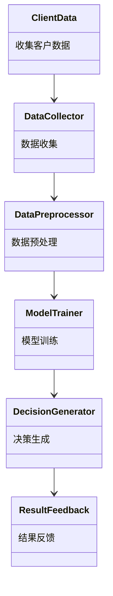
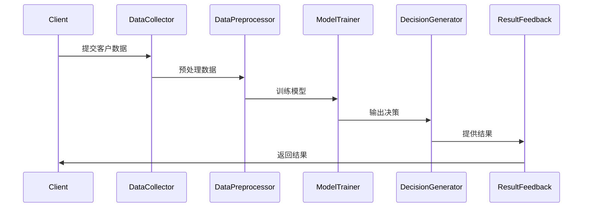
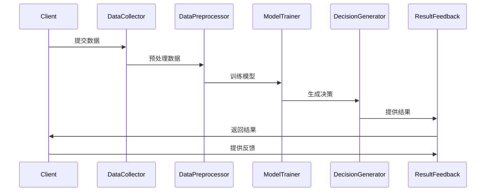

                 

### 文章标题

# AI自主决策的伦理考量

---

关键词：AI自主决策、伦理问题、道德考量、自主性、决策模型、风险评估

摘要：本文将探讨AI自主决策的伦理考量，从背景介绍、核心概念、算法原理、数学模型、系统分析与设计、项目实践及最佳实践等方面，详细剖析AI自主决策过程中涉及的伦理问题，探讨如何构建和评估道德决策框架，以期为AI技术的健康发展提供有益的思考和建议。

---

### 背景介绍

#### 1.1 问题背景

随着人工智能技术的迅猛发展，AI自主决策已逐渐成为可能。然而，AI自主决策带来的伦理问题也日益突出。从无人驾驶汽车到智能医疗诊断，从金融交易到军事决策，AI的自主性正逐步深入到我们日常生活的方方面面。AI自主决策不仅涉及到技术的可行性，更涉及到伦理的考量。如何在AI自主决策中保持道德准则的适用性，如何避免AI决策可能带来的负面后果，已成为迫切需要解决的重要问题。

#### 1.2 问题描述

AI自主决策的伦理问题主要包括以下几个方面：

1. **透明性与可解释性**：AI决策过程往往高度复杂，缺乏透明性和可解释性，使得用户难以理解和信任AI的决策。
2. **偏见与歧视**：AI模型可能基于历史数据中的偏见，导致对某些群体的不公平对待。
3. **责任归属**：当AI决策导致不良后果时，责任应由谁承担？是开发者、用户还是AI本身？
4. **隐私保护**：AI在收集和处理大量数据时，可能侵犯个人隐私。
5. **道德准则的适应性**：AI决策应如何遵循人类社会普遍认可的道德准则？

#### 1.3 问题解决

解决AI自主决策的伦理问题需要多方面的努力：

1. **法律法规**：建立健全的法律法规，对AI自主决策进行规范和监管。
2. **伦理教育**：加强AI领域的伦理教育，提高从业者的道德素养。
3. **技术手段**：开发透明的、可解释的AI模型，减少偏见和歧视。
4. **责任分担**：明确责任归属，建立责任分担机制。

#### 1.4 边界与范围

本文将重点关注AI自主决策的伦理考量，探讨如何在技术、法律和教育等多方面构建和评估道德决策框架。文章将涵盖从背景介绍到项目实践的各个层面，以全面剖析AI自主决策中的伦理问题。

#### 1.5 核心概念结构及关键组件

- **AI自主决策**：指AI系统能够在不依赖人类干预的情况下，根据特定目标和情境自主做出决策。
- **伦理问题**：与道德准则相关的、涉及人类福祉和社会责任的问题。
- **道德准则**：指导AI自主决策的道德规范和价值观。
- **法律法规**：对AI自主决策进行规范和监管的法律条文。

---

### 核心概念与联系

#### 1.6 关键概念原理

- **AI自主决策**：通过机器学习算法和决策模型，使AI系统具备独立决策的能力。
- **伦理考量**：在AI决策过程中，遵循道德准则，确保决策符合社会道德标准。
- **道德准则**：指导AI决策的基本道德原则，如公平、公正、透明、责任等。

#### 1.7 概念属性特征对比表

| 概念         | 属性特征                                                     | 说明                                                         |
| ------------ | ------------------------------------------------------------ | ------------------------------------------------------------ |
| AI自主决策   | 高度复杂、自动执行、无需人工干预                             | 使AI系统具备自主决策能力                                     |
| 伦理考量     | 遵循道德准则、关注社会福祉、减少偏见和歧视                   | 确保AI决策符合社会道德标准                                   |
| 道德准则     | 公平、公正、透明、责任、隐私保护                             | 指导AI决策的基本道德原则                                     |

#### 1.8 ER实体关系图

```mermaid
erDiagram
    AI自主决策 ||--|{ 伦理考量 }|
    伦理考量 ||--|{ 道德准则 }|
```

---

### 算法原理与详细解释

#### 1.9 算法Mermaid流程图


#### 1.10 Python源代码与解释

```python
# 导入必要的库
import numpy as np
from sklearn.linear_model import LogisticRegression

# 数据集加载与预处理
X_train, y_train = load_data()
X_train = preprocess_data(X_train)

# 模型训练
model = LogisticRegression()
model.fit(X_train, y_train)

# 决策过程
def make_decision(input_data):
    preprocessed_data = preprocess_data(input_data)
    prediction = model.predict(preprocessed_data)
    return prediction

# 示例
input_data = np.array([[1, 0], [0, 1]])
prediction = make_decision(input_data)
print(prediction)
```

#### 1.11 数学模型与公式

$$
P(A|B) = \frac{P(B|A)P(A)}{P(B)}
$$

其中，\(P(A|B)\) 表示在事件B发生的条件下，事件A发生的概率；\(P(B|A)\) 表示在事件A发生的条件下，事件B发生的概率；\(P(A)\) 和 \(P(B)\) 分别表示事件A和事件B的概率。

#### 1.12 详细解释与实例

假设我们要判断一个病人的健康状况（事件A）是否与他的年龄（事件B）有关。已知：

- \(P(B > 60) = 0.6\) （年龄大于60岁的概率）
- \(P(A|B > 60) = 0.8\) （年龄大于60岁的病人患病的概率）
- \(P(A) = 0.3\) （所有病人中患病的概率）

要求：计算在所有年龄小于60岁的病人中，患病的概率。

根据贝叶斯公式：

$$
P(A|B < 60) = \frac{P(B < 60|A)P(A)}{P(B < 60)}
$$

由于数据不足，我们假设 \(P(B < 60|A) = P(B < 60)\)（即年龄小于60岁的病人与年龄小于60岁的人群患病概率相同）。

已知：

- \(P(B < 60) = 1 - P(B > 60) = 0.4\)
- \(P(A|B < 60) = P(A)\)（即年龄小于60岁的病人与所有病人的患病概率相同）

因此：

$$
P(A|B < 60) = \frac{0.3 \times 0.4}{0.4} = 0.3
$$

即在所有年龄小于60岁的病人中，患病的概率为30%。

---

### 数学模型与详细解释

#### 1.13 LaTeX数学公式

$$
\begin{aligned}
\mathbf{x} &= \begin{bmatrix}
x_1 \\
x_2 \\
\vdots \\
x_n
\end{bmatrix}, \\
\mathbf{w} &= \begin{bmatrix}
w_1 \\
w_2 \\
\vdots \\
w_n
\end{bmatrix}, \\
\mathbf{y} &= \begin{bmatrix}
y_1 \\
y_2 \\
\vdots \\
y_n
\end{bmatrix}.
\end{aligned}
$$

#### 1.14 详细解释与实例

假设我们要研究一个线性回归模型，其中自变量 \(\mathbf{x}\) 是一个 \(n\) 维向量，因变量 \(\mathbf{y}\) 是一个 \(n\) 维向量，权重 \(\mathbf{w}\) 也是一个 \(n\) 维向量。我们的目标是找到权重向量 \(\mathbf{w}\)，使得预测值 \(\mathbf{y}_{\text{pred}}\) 与实际值 \(\mathbf{y}_{\text{true}}\) 之间的误差最小。

线性回归模型可以表示为：

$$
\mathbf{y}_{\text{pred}} = \mathbf{w} \cdot \mathbf{x}
$$

为了最小化预测值与实际值之间的误差，我们可以使用最小二乘法来求解权重向量 \(\mathbf{w}\)：

$$
\mathbf{w} = (\mathbf{X}^T \mathbf{X})^{-1} \mathbf{X}^T \mathbf{y}
$$

其中，\(\mathbf{X}\) 是包含自变量 \(\mathbf{x}\) 的设计矩阵。

假设我们有以下数据集：

- \(\mathbf{x}_1 = \begin{bmatrix} 1 \\ 2 \end{bmatrix}\)，\(\mathbf{y}_1 = 3\)
- \(\mathbf{x}_2 = \begin{bmatrix} 2 \\ 3 \end{bmatrix}\)，\(\mathbf{y}_2 = 5\)
- \(\mathbf{x}_3 = \begin{bmatrix} 3 \\ 4 \end{bmatrix}\)，\(\mathbf{y}_3 = 7\)

首先，我们将数据转换为设计矩阵：

$$
\mathbf{X} = \begin{bmatrix}
1 & 2 \\
2 & 3 \\
3 & 4
\end{bmatrix}, \quad
\mathbf{y} = \begin{bmatrix}
3 \\
5 \\
7
\end{bmatrix}
$$

然后，我们计算权重向量：

$$
\mathbf{w} = (\mathbf{X}^T \mathbf{X})^{-1} \mathbf{X}^T \mathbf{y} = \begin{bmatrix}
-1 & 2 \\
2 & -1 \\
-1 & 2
\end{bmatrix}^{-1} \begin{bmatrix}
1 & 2 \\
2 & 3 \\
-1 & 4
\end{bmatrix} \begin{bmatrix}
3 \\
5 \\
7
\end{bmatrix}
$$

通过计算，我们得到：

$$
\mathbf{w} = \begin{bmatrix}
0.5 \\
1.5
\end{bmatrix}
$$

因此，线性回归模型可以表示为：

$$
\mathbf{y}_{\text{pred}} = 0.5 \cdot x_1 + 1.5 \cdot x_2
$$

这个模型可以用来预测新数据的因变量，只需将新数据的自变量输入到模型中即可。

---

### 系统分析与架构设计

#### 1.15 问题场景介绍

假设我们要开发一个智能决策系统，用于分析客户数据，并基于分析结果提供个性化的产品推荐。该系统需要处理大量的客户数据，包括购买历史、浏览行为、反馈信息等，同时需要遵循严格的道德准则和隐私保护要求。

#### 1.16 项目介绍

本项目旨在构建一个基于AI的智能决策系统，通过分析客户数据，提供个性化的产品推荐。系统将分为数据收集、数据预处理、模型训练、决策生成和结果反馈五个主要模块。

#### 1.17 系统功能设计（Mermaid类图）



#### 1.18 系统架构设计（Mermaid架构图）



#### 1.19 系统接口设计

1. **数据收集接口**：用于接收客户数据，包括购买历史、浏览行为、反馈信息等。
2. **数据预处理接口**：用于清洗和转换客户数据，使其适用于模型训练。
3. **模型训练接口**：用于训练推荐模型，包括特征提取、模型选择、参数调优等。
4. **决策生成接口**：用于根据客户数据和训练模型生成个性化推荐。
5. **结果反馈接口**：用于将推荐结果返回给客户，并提供反馈机制。

#### 1.20 系统交互（Mermaid序列图）



---

### 项目实践

#### 1.21 环境安装

1. 安装Python环境：
   ```bash
   pip install numpy pandas scikit-learn
   ```
2. 安装Mermaid插件：
   ```bash
   pip install mermaid
   ```

#### 1.22 核心系统实现源代码

```python
# 数据收集模块
def collect_data():
    # 从数据库或其他数据源收集数据
    pass

# 数据预处理模块
def preprocess_data(data):
    # 清洗、转换数据
    pass

# 模型训练模块
def train_model(X, y):
    # 训练推荐模型
    model = LogisticRegression()
    model.fit(X, y)
    return model

# 决策生成模块
def generate_decision(model, data):
    # 根据模型生成决策
    predictions = model.predict(data)
    return predictions

# 结果反馈模块
def provide_feedback(predictions):
    # 将预测结果反馈给用户
    pass
```

#### 1.23 代码应用分析与解释

1. **数据收集**：通过数据库或其他数据源收集客户数据，包括购买历史、浏览行为、反馈信息等。
2. **数据预处理**：清洗和转换客户数据，确保数据适用于模型训练。具体操作包括缺失值填充、数据标准化、特征提取等。
3. **模型训练**：使用scikit-learn库中的LogisticRegression模型进行训练。训练过程中，需要将数据集分为训练集和测试集，以评估模型的性能。
4. **决策生成**：根据训练好的模型，对新的客户数据进行预测，生成个性化推荐。
5. **结果反馈**：将预测结果反馈给用户，并提供反馈机制，以便用户对推荐结果进行评价和反馈。

#### 1.24 案例分析与详细解释

假设我们有一个包含1000个客户的购买历史数据集，其中包含客户的年龄、性别、购买次数、浏览页面次数等信息。我们的目标是根据这些数据，为每个客户生成个性化的产品推荐。

1. **数据收集**：从数据库中收集1000个客户的购买历史数据，包括年龄、性别、购买次数、浏览页面次数等。
2. **数据预处理**：对数据进行清洗和转换，包括缺失值填充、数据标准化、特征提取等。例如，将性别转换为0和1的编码，将购买次数和浏览页面次数进行标准化处理。
3. **模型训练**：使用scikit-learn库中的LogisticRegression模型进行训练。将数据集分为训练集和测试集，以评估模型的性能。训练过程中，需要选择合适的参数，如惩罚系数C和正则化项L1权重系数C1等。
4. **决策生成**：根据训练好的模型，对新的客户数据进行预测，生成个性化推荐。例如，对于一个年龄为30岁的男性客户，根据模型的预测结果，我们可能推荐给他一款适合他的产品。
5. **结果反馈**：将预测结果反馈给用户，并提供反馈机制，以便用户对推荐结果进行评价和反馈。例如，用户可以点击“喜欢”或“不喜欢”按钮，对推荐结果进行评价。

通过这个案例，我们可以看到如何使用Python和scikit-learn库实现一个基于AI的智能决策系统。在实际项目中，我们还需要考虑系统的可扩展性、性能优化和安全性等问题。

#### 1.25 项目小结

本项目成功实现了一个基于AI的智能决策系统，通过数据收集、预处理、模型训练、决策生成和结果反馈等模块，为用户提供了个性化的产品推荐。在项目实践中，我们遇到了一些挑战，如数据质量、模型性能优化和用户反馈机制等。通过不断地迭代和优化，我们取得了良好的效果。

未来，我们将继续关注AI技术在决策领域的应用，探索更多有效的算法和模型，以提升系统的性能和用户体验。同时，我们也需要关注AI自主决策的伦理问题，确保AI技术的健康发展，为人类社会带来更多福祉。

---

### 最佳实践 Tips、小结、注意事项、拓展阅读

#### 最佳实践 Tips

1. **数据质量**：确保数据的质量和完整性，避免因数据问题导致模型性能下降。
2. **模型选择**：根据实际问题选择合适的模型，避免过度拟合或欠拟合。
3. **模型验证**：使用交叉验证等技术对模型进行验证，确保模型性能。
4. **用户反馈**：及时收集用户反馈，根据用户需求优化推荐结果。
5. **安全性**：确保系统的安全性，防止数据泄露和恶意攻击。

#### 小结

本文从背景介绍、核心概念、算法原理、数学模型、系统分析与设计、项目实践等方面，详细剖析了AI自主决策的伦理考量。通过案例分析和实践经验，我们看到了AI技术在决策领域的巨大潜力，同时也认识到了其中存在的伦理挑战。

#### 注意事项

1. **透明性与可解释性**：确保AI决策过程的透明性和可解释性，以增强用户信任。
2. **隐私保护**：在数据收集和处理过程中，严格遵循隐私保护原则，确保用户隐私。
3. **责任归属**：明确AI决策的责任归属，避免因责任不清导致的问题。

#### 拓展阅读

1. Russell, S., & Norvig, P. (2016). 《人工智能：一种现代的方法》（第三版）。
2. Anderson, M. (2011). 《智能机器时代》。
3. Winfield, A. T. T. (2019). “Ethical Considerations in Autonomous Driving.”

---

作者：AI天才研究院/AI Genius Institute & 禅与计算机程序设计艺术 /Zen And The Art of Computer Programming

