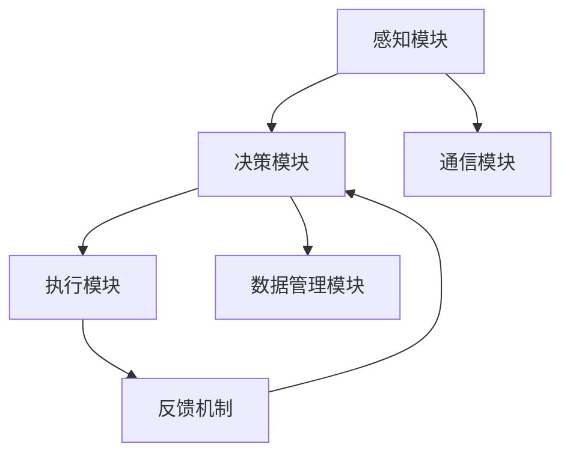
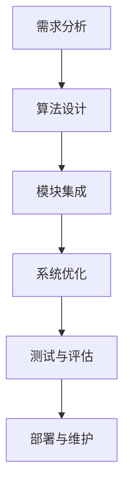
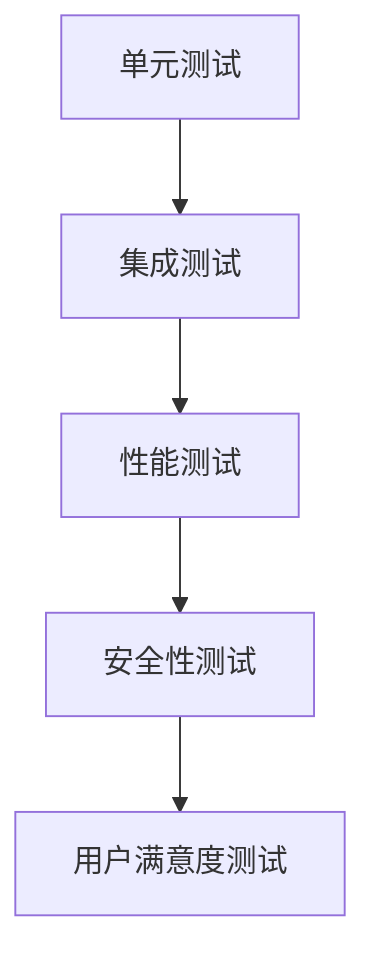
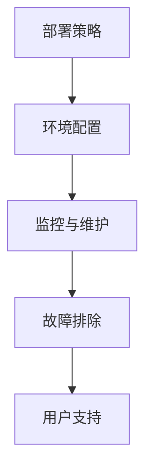

                 

## 引言与背景

### 1.1 书籍主题与目标

在当今快速发展的技术时代，人工智能（AI）已经成为了社会发展的关键驱动力。随着AI技术的不断成熟和普及，自主性AI系统的研究与应用日益受到关注。本书的主题是“AI自主性：从辅助决策到独立决策的演进”，旨在深入探讨AI自主性的概念、理论基础、关键技术、系统设计以及社会影响等各个方面。

本书的主要目标有三：

1. **全面解析AI自主性的核心概念和理论框架**：帮助读者理解AI自主性的定义、层级、作用以及与传统AI的区别。
2. **系统介绍AI自主性的关键技术与方法**：详细阐述深度学习、强化学习、遗传算法、多智能体系统等技术在自主性AI中的应用和实现方法。
3. **探讨AI自主性的系统设计与实现**：介绍自主性AI系统的设计原则、架构、实现方法、测试与评估、部署与维护，并提供实际案例研究。

### 1.2 AI自主性的概念与意义

AI自主性是指人工智能系统能够在不依赖外部指令的情况下，自主进行决策和行动的能力。自主性AI能够根据环境和任务的需求，自主选择行动策略，从而实现自主决策和执行。

AI自主性的意义主要体现在以下几个方面：

1. **提高效率和智能化水平**：自主性AI系统能够自动执行复杂任务，减少人工干预，提高系统效率和智能化水平。
2. **拓展AI应用场景**：自主性AI使得AI技术可以应用于更加复杂和动态的情境中，如自动驾驶、智能机器人、智能医疗等。
3. **解决复杂决策问题**：自主性AI能够处理复杂的多目标决策问题，为人类解决一些传统方法难以应对的问题提供了新的可能性。

### 1.3 从辅助决策到独立决策的发展历程

AI自主性的发展历程可以分为三个阶段：辅助决策、半自主决策和独立决策。

1. **辅助决策**：在这一阶段，AI系统主要作为人类决策的辅助工具，提供数据分析和建议。例如，在金融分析、医疗诊断等领域，AI系统通过对数据的分析和预测，为人类提供决策支持。

2. **半自主决策**：随着AI技术的进步，AI系统开始具备一定的自主决策能力，能够在特定场景下做出决策。例如，自动驾驶汽车可以自主感知环境并做出驾驶决策，但仍然需要人类在某些情况下进行干预。

3. **独立决策**：当前，AI自主性的研究目标主要是实现独立决策，即AI系统能够完全自主地处理任务和决策，不需要人工干预。这一阶段的研究重点是如何提高AI系统的自主性、决策能力和适应能力。

### 1.4 自主性在AI领域的应用现状与挑战

目前，自主性AI在多个领域已经取得了显著的应用成果，如自动驾驶、智能机器人、智能医疗、智能家居等。然而，自主性AI的发展仍面临许多挑战：

1. **算法性能和可靠性**：自主性AI系统的决策能力和可靠性直接关系到其在实际应用中的表现。目前，AI算法在处理复杂环境和动态变化时仍存在一定的局限。

2. **数据隐私与安全性**：自主性AI系统需要大量数据来训练和学习，这涉及到数据隐私和安全问题。如何保护用户数据隐私，防止数据泄露和滥用，是自主性AI发展的重要挑战。

3. **伦理与责任**：自主性AI系统的决策过程可能涉及到伦理问题，如道德判断、责任归属等。如何制定相应的法律法规和伦理准则，确保AI系统的公正性和透明性，是自主性AI发展的重要议题。

### 1.5 书籍结构安排与主要内容概述

本书分为五个部分，共八个章节，具体结构如下：

1. **第一部分：引言与背景**：介绍书籍的主题、目标、AI自主性的概念与意义、发展历程、应用现状与挑战以及书籍结构安排。
2. **第二部分：AI自主性的基础理论**：讨论AI自主性的核心概念、理论框架、属性与特征，以及自主性AI与传统AI的区别和发展趋势。
3. **第三部分：AI自主性的关键技术与方法**：介绍深度学习、强化学习、遗传算法、多智能体系统等关键技术，以及自主性AI的方法论和实际应用实例。
4. **第四部分：AI自主性的系统设计与实现**：介绍自主性AI系统的设计原则、架构、实现方法、测试与评估、部署与维护，并提供实际案例研究。
5. **第五部分：AI自主性的法律法规与社会影响**：探讨AI自主性的法律法规框架、社会影响、社会责任与伦理问题，以及可持续发展策略。

通过本书的阅读，读者可以全面了解AI自主性的概念、理论、技术和应用，为自主性AI系统的研究和实践提供指导。

### 1.6 小结

AI自主性是当前人工智能领域的一个热点话题，其研究不仅具有重要的理论意义，也具有广泛的应用前景。通过对AI自主性的全面解析，本书旨在为读者提供一个系统、深入的了解，帮助读者掌握自主性AI的核心知识，为未来的研究和实践奠定基础。接下来，我们将进入第二部分，探讨AI自主性的基础理论，包括核心概念、理论框架、属性与特征以及自主性AI与传统AI的区别。

## AI自主性的基础理论

### 2.1 AI自主性的核心概念

AI自主性是指人工智能系统在不依赖外部指令的情况下，能够自主进行决策和行动的能力。这种能力使AI系统能够在复杂、动态的环境中自主学习和适应，从而提高系统的效率和智能化水平。自主性AI的目标是实现完全的独立决策，即AI系统能够在无需人类干预的情况下，自主完成复杂的任务和决策。

自主性AI的核心概念包括：

- **感知**：AI系统通过传感器或其他数据源获取环境信息。
- **决策**：AI系统基于感知到的信息，自主选择行动策略。
- **行动**：AI系统执行所选定的行动策略。
- **学习**：AI系统在执行任务的过程中，不断调整和优化自身的决策策略。

### 2.2 AI自主性的层级

AI自主性可以分为不同的层级，从低级到高级包括：

1. **无自主性**：AI系统完全依赖外部指令，不具备自主决策能力。
2. **辅助决策**：AI系统在人类决策过程中提供数据分析和建议，但不具备独立决策能力。
3. **半自主决策**：AI系统在特定场景下具备一定的自主决策能力，但仍需要人类在某些情况下进行干预。
4. **独立决策**：AI系统完全自主进行决策和行动，无需人类干预。

不同层级的自主性AI具有不同的应用场景和挑战，如自动驾驶、智能机器人、智能医疗等。

### 2.3 自主性在AI系统中的作用

自主性AI在AI系统中的作用主要体现在以下几个方面：

1. **提高系统的智能化水平**：自主性AI系统能够自主学习和适应，提高系统的智能化水平，从而更好地应对复杂环境和动态变化。
2. **减少人工干预**：自主性AI系统能够在无需人工干预的情况下自主完成任务，减少人力资源的消耗，提高系统的效率和可靠性。
3. **扩展应用场景**：自主性AI系统能够应用于更加复杂和动态的情境中，如自动驾驶、智能机器人、智能医疗等，从而推动AI技术的发展和普及。
4. **解决复杂决策问题**：自主性AI系统能够处理复杂的多目标决策问题，为人类解决一些传统方法难以应对的问题提供了新的可能性。

### 2.4 AI自主性的理论框架

AI自主性的理论框架包括基于决策理论、学习理论和多智能体系统的自主性模型。

1. **基于决策理论的自主性**：决策理论是研究如何在不确定性和复杂环境中做出最优决策的理论。基于决策理论的自主性AI系统通过分析环境信息，运用决策算法选择最佳行动策略。

2. **基于学习理论的自主性**：学习理论是研究如何从数据中学习并改进性能的理论。基于学习理论的自主性AI系统通过不断学习和调整决策策略，提高系统的自主性和智能化水平。

3. **基于多智能体系统的自主性**：多智能体系统是由多个智能体组成的分布式系统，各智能体之间通过通信和协调实现共同目标。基于多智能体系统的自主性AI系统能够通过智能体之间的协作和通信，实现自主决策和行动。

### 2.5 自主性AI的属性与特征

自主性AI具有以下属性和特征：

1. **决策能力**：自主性AI系统能够根据感知到的环境信息，自主选择最佳行动策略。
2. **学习能力**：自主性AI系统能够通过不断学习和调整，提高自身的决策能力和适应能力。
3. **适应性**：自主性AI系统能够在复杂和动态的环境中自主适应，从而更好地完成任务。
4. **自主性**：自主性AI系统能够在不依赖外部指令的情况下，自主进行决策和行动。

自主性AI的这些属性和特征使其在应对复杂、动态环境和处理复杂决策问题时具有显著优势。

### 2.6 自主性AI与传统AI的区别

自主性AI与传统AI的主要区别在于：

1. **算法与架构**：自主性AI系统采用更加复杂和先进的算法架构，如深度学习、强化学习、遗传算法等，以实现更高的自主性和智能化水平。
2. **系统设计**：自主性AI系统在设计和实现过程中，更注重系统的自主性和自适应能力，以应对复杂和动态的环境。
3. **应用效果**：自主性AI系统在处理复杂决策问题和动态变化环境时，通常具有更好的性能和可靠性。

### 2.7 自主性AI的发展趋势与未来展望

随着AI技术的不断进步，自主性AI的发展趋势和未来展望主要包括：

1. **算法性能的提升**：通过不断优化和改进算法，提高自主性AI系统的决策能力和可靠性。
2. **应用场景的拓展**：自主性AI将在更多领域得到应用，如智能交通、智能医疗、智能制造等。
3. **伦理与法律的完善**：随着自主性AI技术的普及，相关的伦理和法律问题将得到更多关注和解决。

通过深入研究和应用自主性AI，我们可以期待在未来实现更加智能化、高效化的人工智能系统。

### 小结

在本章中，我们详细探讨了AI自主性的核心概念、层级、作用、理论框架、属性与特征以及与传统AI的区别和发展趋势。这些内容为理解和应用自主性AI奠定了基础。接下来，我们将进入第三部分，探讨AI自主性的关键技术与方法，包括深度学习、强化学习、遗传算法、多智能体系统等，并介绍这些技术在自主性AI中的应用和实现方法。

### 第三部分: AI自主性的关键技术与方法

#### 3.1 自主性AI的关键技术

自主性AI的发展依赖于一系列关键技术的支持，这些技术包括深度学习、强化学习、遗传算法和多智能体系统。本节将分别介绍这些技术的基本概念、原理以及在自主性AI中的应用。

#### 3.1.1 深度学习技术

深度学习是近年来AI领域的一项重要突破，通过构建多层神经网络模型，从大量数据中自动提取特征和模式。深度学习技术为自主性AI提供了强大的学习和表征能力。

**基本概念：**
深度学习基于人工神经网络，通过多个隐藏层对数据进行逐层抽象和提取，从而实现复杂的非线性映射。

**原理：**
深度学习模型通过反向传播算法不断调整网络权重，以最小化损失函数，提高模型的预测准确性。

**在自主性AI中的应用：**
1. **图像识别**：深度学习技术在图像识别领域取得了显著成果，如卷积神经网络（CNN）在自动驾驶、安防监控等场景中的应用。
2. **自然语言处理**：深度学习模型在自然语言处理（NLP）领域也取得了重要突破，如用于智能客服、机器翻译等。

**实例：**
假设一个自动驾驶系统需要识别道路上的行人。我们可以使用CNN模型对道路图像进行特征提取，从而准确识别行人。

$$
\text{损失函数} = \frac{1}{m} \sum_{i=1}^{m} (-y_i \log(z_i) + (1 - y_i) \log(1 - z_i))
$$

其中，$m$表示样本数量，$y_i$表示真实标签，$z_i$表示模型预测的概率。

#### 3.1.2 强化学习技术

强化学习是一种通过试错和反馈机制进行学习和决策的AI方法。强化学习模型通过与环境交互，不断调整策略以最大化累积奖励。

**基本概念：**
强化学习模型包括智能体（Agent）、环境（Environment）和奖励机制（Reward Mechanism）。

**原理：**
强化学习模型通过Q值函数或策略迭代来评估和选择最佳动作。

**在自主性AI中的应用：**
1. **游戏AI**：如AlphaGo在围棋比赛中的成功应用。
2. **机器人控制**：如自主移动机器人在复杂环境中的路径规划。

**实例：**
假设一个机器人需要在迷宫中找到出口。我们可以使用Q学习算法来训练机器人选择最佳路径。

$$
Q(s, a) \leftarrow Q(s, a) + \alpha [r + \gamma \max_{a'} Q(s', a') - Q(s, a)]
$$

其中，$s$表示状态，$a$表示动作，$r$表示即时奖励，$\gamma$表示折扣因子，$\alpha$表示学习率。

#### 3.1.3 遗传算法技术

遗传算法是一种基于自然选择和遗传机制进行全局搜索和优化的AI方法。遗传算法通过模拟生物进化过程，逐步优化解决方案。

**基本概念：**
遗传算法包括种群（Population）、个体（Individual）、基因（Gene）和适应度（Fitness）。

**原理：**
遗传算法通过交叉、变异和选择操作，不断优化种群中的个体，直至达到最优解。

**在自主性AI中的应用：**
1. **优化问题求解**：如供应链管理、生产调度等。
2. **机器人路径规划**：如自主飞行器在复杂地形中的路径规划。

**实例：**
假设我们需要优化一个机器人从起点到终点的路径。我们可以使用遗传算法来搜索最优路径。

$$
\text{适应度} = \frac{1}{\text{路径长度}}
$$

#### 3.1.4 多智能体系统技术

多智能体系统是由多个独立智能体组成的系统，各智能体通过协作和通信实现共同目标。多智能体系统技术为自主性AI提供了强大的协作和适应能力。

**基本概念：**
多智能体系统包括智能体、环境、通信机制和协调策略。

**原理：**
多智能体系统通过分布式计算和协同优化，实现复杂任务的自动完成。

**在自主性AI中的应用：**
1. **智能交通系统**：如车辆调度和交通流量控制。
2. **无人机编队**：如军事侦察、灾害救援等。

**实例：**
假设一个智能交通系统需要优化城市道路的交通流量。我们可以使用多智能体系统来协调不同路口的交通灯，从而实现交通流量的最优分配。

$$
\text{目标函数} = \sum_{i=1}^{n} \frac{1}{\text{车辆通过时间}_i}
$$

#### 3.2 自主性AI的方法论

自主性AI的方法论包括模型构建、训练策略和评估优化等方面。

**3.2.1 自主性模型的构建**
自主性模型的构建是自主性AI系统设计的关键。模型构建需要考虑以下方面：
1. **任务目标**：明确系统需要完成的任务和目标。
2. **数据集**：选择适合的数据集进行训练和测试。
3. **模型结构**：设计适合任务需求的模型结构，如CNN、RNN、GAN等。

**3.2.2 自主性AI的训练策略**
训练策略包括以下方面：
1. **超参数调优**：通过调整学习率、批量大小等超参数，提高模型性能。
2. **正则化技术**：如Dropout、L2正则化等，防止过拟合。
3. **训练过程**：采用合适的学习算法，如梯度下降、Adam等，进行模型训练。

**3.2.3 自主性AI的评估与优化**
评估与优化是确保自主性AI系统性能的关键。评估与优化包括以下方面：
1. **评估指标**：如准确率、召回率、F1分数等，用于评估模型性能。
2. **优化方法**：如迁移学习、集成学习等，用于提高模型性能。
3. **模型部署**：将训练好的模型部署到实际应用场景中，进行持续优化和迭代。

#### 3.3 自主性AI的应用实例

自主性AI在多个领域取得了显著的成果。以下介绍几个典型的应用实例：

**3.3.1 辅助决策系统**
辅助决策系统是自主性AI在商业和工业领域的典型应用。例如，在金融领域，自主性AI系统可以分析市场数据，为投资决策提供支持。在工业领域，自主性AI系统可以优化生产流程，提高生产效率。

**3.3.2 独立决策系统**
独立决策系统是自主性AI在智能交通、智能医疗等领域的应用。例如，在自动驾驶领域，自主性AI系统可以完全自主地控制车辆，实现自动驾驶。在智能医疗领域，自主性AI系统可以自主诊断疾病，为医生提供诊断建议。

**3.3.3 复杂场景下的自主性AI应用**
在复杂场景下，自主性AI需要具备更高的适应能力和决策能力。例如，在灾害救援领域，自主性AI系统可以自主搜索灾区，为救援工作提供支持。在军事领域，自主性AI系统可以自主执行作战任务，提高作战效能。

#### 3.4 自主性AI的挑战与解决方案

自主性AI的发展面临许多挑战，如算法性能、数据隐私、安全性等问题。以下介绍一些常见的挑战和解决方案：

**3.4.1 算法性能优化**
优化算法性能是提升自主性AI系统性能的关键。常见的方法包括：
1. **数据增强**：通过增加数据样本、生成虚假数据等方式，提高模型泛化能力。
2. **模型压缩**：通过剪枝、量化等方法，减小模型规模，提高运行效率。

**3.4.2 数据隐私保护**
保护数据隐私是自主性AI发展的重要问题。常见的方法包括：
1. **联邦学习**：通过分布式学习，保护数据隐私。
2. **差分隐私**：通过添加噪声，确保数据隐私。

**3.4.3 自主性AI的安全与伦理问题**
自主性AI的安全与伦理问题涉及到系统的透明性、责任归属等方面。常见的解决方案包括：
1. **可解释性AI**：提高模型的可解释性，确保系统决策的透明性。
2. **责任归属机制**：明确系统开发者和使用者的责任，确保系统的安全和合规性。

#### 3.5 自主性AI的未来发展方向

随着技术的不断进步，自主性AI将在未来得到更广泛的应用和发展。以下是一些可能的发展方向：

1. **算法创新**：通过引入新的算法和技术，提高自主性AI的性能和效率。
2. **跨学科融合**：将AI技术与其他领域（如生物、物理、化学等）相结合，推动AI技术的创新发展。
3. **应用拓展**：将自主性AI应用于更多领域，如智能医疗、智能制造、智能交通等，实现AI技术的全面普及。
4. **伦理与法律完善**：随着自主性AI技术的发展，相关的伦理和法律问题将得到更多关注和解决，确保AI技术的可持续发展。

### 小结

在本章中，我们详细介绍了AI自主性的关键技术与方法，包括深度学习、强化学习、遗传算法和多智能体系统等。这些技术为自主性AI提供了强大的支持，使其在处理复杂决策问题和应对动态环境时具有显著优势。在下一章中，我们将探讨AI自主性的系统设计与实现，包括设计原则、架构、实现方法、测试与评估等方面。

### 第四部分：AI自主性的系统设计与实现

#### 4.1 自主性AI系统的设计原则

设计自主性AI系统时，需要遵循一系列关键原则，以确保系统的高效性、可靠性和可维护性。以下是一些核心设计原则：

1. **模块化设计**：将系统划分为多个功能模块，每个模块具有明确的功能和接口。模块化设计有助于系统的维护和扩展。

2. **可扩展性**：系统设计应具备良好的可扩展性，以适应未来技术的发展和需求变化。例如，可以通过设计灵活的接口和模块，方便后续的功能扩展。

3. **安全性**：自主性AI系统需要具备完善的安全措施，包括数据加密、访问控制和安全审计等，以防止数据泄露和恶意攻击。

4. **可解释性**：为了确保系统的透明性和可信度，自主性AI系统的决策过程应具备良好的可解释性。可以通过可视化工具和可解释的算法模型，帮助用户理解系统的决策过程。

5. **适应性**：自主性AI系统应在不同环境和任务需求下具备良好的适应性，能够自动调整和优化其行为策略。

#### 4.2 自主性AI的系统架构

自主性AI系统的架构设计是系统实现的关键环节。一个典型的自主性AI系统通常包括以下几个核心模块：

1. **感知模块**：负责收集和解析外部环境信息，如摄像头、传感器、GPS等数据。

2. **决策模块**：基于感知模块收集的信息，通过算法模型进行决策。决策模块通常包括多种算法，如深度学习、强化学习等。

3. **执行模块**：根据决策模块的决策结果，执行相应的行动策略，如移动机器人、控制设备等。

4. **通信模块**：负责与其他系统或智能体进行通信和协作，以实现分布式计算和协同决策。

5. **数据管理模块**：负责系统的数据存储、管理和分析，包括数据采集、预处理、存储和查询等功能。

以下是一个简单的自主性AI系统架构图：

#### 4.3 自主性AI系统的实现

自主性AI系统的实现包括算法设计、模块集成、系统优化等环节。以下是一些关键的实现步骤：

1. **算法设计**：根据应用需求，选择合适的算法模型，如深度学习、强化学习等。设计算法模型时，需要考虑模型的复杂度、训练时间和计算资源等因素。

2. **模块集成**：将各个功能模块集成到系统中，确保模块之间的接口和通信机制正确无误。在集成过程中，需要遵循模块化设计和可扩展性的原则。

3. **系统优化**：对系统进行性能优化和调优，以提高系统的响应速度、效率和稳定性。优化方法包括算法优化、硬件加速、分布式计算等。

以下是一个简单的自主性AI系统实现流程：

#### 4.4 自主性AI系统的测试与评估

测试与评估是确保自主性AI系统性能和可靠性的关键环节。以下是一些常见的测试和评估方法：

1. **单元测试**：对各个功能模块进行独立测试，确保模块的功能正确和性能稳定。

2. **集成测试**：将各个模块集成到系统中，进行整体测试，验证系统功能是否正常。

3. **性能测试**：对系统进行压力测试和性能测试，评估系统的响应时间、处理能力和稳定性。

4. **安全性测试**：对系统进行安全测试，评估系统的抗攻击能力和数据保护措施。

5. **用户满意度测试**：通过用户调查和反馈，评估系统的用户体验和用户满意度。

以下是一个简单的自主性AI系统测试与评估流程：

#### 4.5 自主性AI系统的部署与维护

自主性AI系统的部署与维护是确保系统稳定运行和持续优化的重要环节。以下是一些关键步骤：

1. **部署策略**：根据系统需求和运行环境，选择合适的部署策略，如云部署、边缘计算等。

2. **环境配置**：配置系统运行环境，包括操作系统、硬件设备、软件工具等。

3. **监控与维护**：建立系统监控机制，实时监测系统运行状态和性能指标。定期进行系统维护和升级，确保系统的稳定性和安全性。

4. **故障排除**：在系统运行过程中，及时解决出现的问题和故障，确保系统正常运行。

5. **用户支持**：提供用户支持和服务，解决用户在使用过程中遇到的问题，收集用户反馈，持续优化系统功能。

以下是一个简单的自主性AI系统部署与维护流程：

#### 4.6 自主性AI系统的案例研究

为了更好地理解自主性AI系统的设计、实现和应用，以下介绍几个典型的案例研究：

**4.6.1 智能客服系统**

智能客服系统是一个典型的自主性AI应用案例。该系统通过自然语言处理和对话生成技术，实现与用户的自动对话，提供在线客服服务。

- **系统架构**：智能客服系统包括感知模块（语音识别、自然语言处理）、决策模块（对话管理、意图识别）、执行模块（语音合成、文本生成）和通信模块（与用户交互）。
- **实现方法**：使用深度学习和自然语言处理技术，构建对话生成模型和意图识别模型，实现智能客服系统的核心功能。
- **测试与评估**：通过模拟用户对话和实际用户反馈，评估智能客服系统的性能和用户满意度。

**4.6.2 自动驾驶系统**

自动驾驶系统是另一个重要的自主性AI应用领域。该系统通过传感器、摄像头和AI算法，实现车辆的自主驾驶。

- **系统架构**：自动驾驶系统包括感知模块（传感器数据融合、障碍物检测）、决策模块（路径规划、决策控制）和执行模块（车辆控制、制动）。
- **实现方法**：使用深度学习、强化学习和多智能体系统技术，构建自动驾驶系统的感知、决策和执行模块。
- **测试与评估**：通过实际道路测试和模拟测试，评估自动驾驶系统的性能和安全性。

**4.6.3 智能工厂系统**

智能工厂系统通过自主性AI技术，实现生产过程的自动化和智能化，提高生产效率和质量。

- **系统架构**：智能工厂系统包括感知模块（传感器数据采集、设备监控）、决策模块（生产计划、设备调度）和执行模块（自动化设备控制）。
- **实现方法**：使用机器学习、遗传算法和优化技术，构建智能工厂系统的感知、决策和执行模块。
- **测试与评估**：通过实际生产测试和模拟测试，评估智能工厂系统的性能和效率。

通过这些案例研究，我们可以更深入地了解自主性AI系统的设计、实现和应用，为实际项目的开发和实施提供参考。

### 小结

在本部分，我们详细探讨了自主性AI系统的设计原则、架构、实现方法、测试与评估、部署与维护，并通过案例研究展示了自主性AI系统的实际应用。这些内容为理解和实施自主性AI系统提供了全面的指导。在下一部分，我们将探讨AI自主性的法律法规与社会影响，分析当前的法律框架、社会影响以及伦理问题，并提出相应的可持续发展策略。

### 第五部分：AI自主性的法律法规与社会影响

#### 5.1 AI自主性的法律法规框架

随着AI自主性技术的迅猛发展，各国政府和国际组织开始意识到制定相关法律法规的必要性，以保障AI技术的健康、有序发展。以下是AI自主性相关的国际与国内法律法规框架的对比分析。

##### 5.1.1 国际与国内法律法规对比

在国际层面，欧盟、美国和我国等国家和地区已经相继出台了有关AI自主性的法律法规。欧盟颁布的《通用数据保护条例》（GDPR）和《人工智能法》对AI自主性技术的应用和数据隐私保护提出了严格的要求。美国则通过《算法透明度和问责法案》等政策文件，加强对AI算法的监管和透明度要求。而我国则发布了《新一代人工智能发展规划》和《人工智能伦理规范》等政策文件，旨在推动AI技术的健康、有序发展。

在国际与国内法律法规对比中，以下是一些主要差异：

1. **数据隐私保护**：欧盟的GDPR对个人数据的收集、处理和存储提出了严格的要求，强调了数据主体的知情权和控制权。而我国的法律法规在数据隐私保护方面也有相应规定，但相对较为宽松。

2. **算法透明度和问责**：美国对AI算法的透明度和问责要求较高，要求算法开发者公开算法的决策过程和依据。而欧盟的《人工智能法》也对算法的透明度和解释性提出了具体要求。

3. **技术监管**：我国的法律法规对AI技术的监管较为全面，涵盖了研发、应用、伦理等多个方面。而国际上的法律法规则更多地侧重于数据隐私和算法透明度等方面。

##### 5.1.2 AI自主性相关的法律法规分析

AI自主性相关的法律法规主要关注以下几个方面：

1. **数据隐私与保护**：随着AI自主性技术的应用，数据隐私保护成为法规制定的重要内容。相关法规对数据的收集、处理、存储和传输提出了严格的要求，确保数据主体权益。

2. **算法透明度和解释性**：算法的透明度和解释性是确保AI自主性技术公正性和可靠性的关键。法规要求算法开发者公开算法的决策过程和依据，以提高算法的透明度和可信度。

3. **伦理与责任**：随着AI自主性技术的发展，相关伦理问题日益突出。法律法规对AI自主性技术的伦理问题进行了规范，明确开发者和使用者的责任，防止AI技术对社会产生负面影响。

4. **技术监管**：法律法规对AI自主性技术进行了全面监管，包括研发、测试、部署、应用等环节。通过监管，确保AI自主性技术符合法律法规要求，保障社会公共利益。

##### 5.1.3 法律法规对自主性AI系统开发的影响

法律法规对自主性AI系统开发的影响主要体现在以下几个方面：

1. **合规性要求**：开发者需要遵守相关法律法规，确保AI系统在研发、测试、部署和应用过程中符合法律要求，避免法律风险。

2. **数据隐私保护**：开发者需加强对数据隐私的保护，遵循数据隐私保护法规，确保数据安全。

3. **算法透明度和解释性**：开发者需提高算法的透明度和解释性，满足法规要求，提高AI系统的可信度。

4. **伦理和责任**：开发者需关注AI自主性技术的伦理问题，明确自身的责任，确保AI系统在社会中的公正应用。

#### 5.2 AI自主性的社会影响

AI自主性的发展对社会产生了深远的影响，涵盖了经济发展、劳动力市场、社会伦理与道德等多个方面。

##### 5.2.1 对经济发展的影响

AI自主性的发展推动了数字经济的发展，提高了生产效率和创新能力。以下是对经济发展影响的几个方面：

1. **产业升级**：AI自主性技术的应用有助于传统产业的转型升级，推动智能制造、智能服务等新型产业的发展。

2. **经济增长**：AI自主性技术提高了生产效率，降低了生产成本，推动了经济的快速增长。

3. **创新驱动**：AI自主性技术为创新提供了新的工具和手段，促进了科技创新和创业活动的蓬勃发展。

##### 5.2.2 对劳动力市场的影响

AI自主性的发展对劳动力市场产生了深远的影响，主要体现在以下几个方面：

1. **就业结构变化**：随着AI自主性技术的应用，一些传统岗位可能被取代，同时也会创造出新的就业机会，就业结构发生重大变化。

2. **技能需求变化**：劳动力市场对技能需求发生变化，对高技能人才的需求增加，同时对技术工人的培训和教育提出了更高要求。

3. **劳动力市场的动态调整**：政府和企业需要采取措施，促进劳动力市场的动态调整，帮助劳动者适应新的就业形势。

##### 5.2.3 对社会伦理与道德的影响

AI自主性的发展引发了一系列伦理和道德问题，对社会的伦理与道德产生了深远影响。以下是对社会伦理与道德影响的几个方面：

1. **隐私保护**：AI自主性技术的应用涉及大量个人数据的收集和使用，如何保护个人隐私成为重要伦理问题。

2. **决策透明度**：AI自主性技术的决策过程通常具有较高的复杂度，如何确保决策的透明度和可解释性，使其受到公众的信任，是重要的伦理问题。

3. **责任归属**：当AI自主性系统出现问题时，如何确定责任归属，确保各方承担相应的责任，是重要的伦理问题。

#### 5.3 AI自主性的社会责任与伦理问题

AI自主性的发展不仅带来了经济和社会效益，同时也引发了一系列社会责任和伦理问题。以下是对AI自主性社会责任与伦理问题的探讨：

##### 5.3.1 AI自主性的伦理问题

AI自主性的伦理问题主要包括：

1. **隐私与数据安全**：如何保护个人隐私，防止数据泄露和滥用，是重要的伦理问题。

2. **公平与公正**：AI自主性技术可能带来社会不公，如何确保技术的公平性和公正性，避免歧视和偏见，是重要的伦理问题。

3. **责任归属**：当AI自主性系统出现问题时，如何确定责任归属，确保各方承担相应的责任，是重要的伦理问题。

##### 5.3.2 社会责任与伦理责任的关系

社会责任与伦理责任密切相关。社会责任是指企业和社会组织在追求经济利益的同时，应承担的社会责任和义务。伦理责任则是指企业在追求经济利益的过程中，应遵循的道德原则和伦理规范。

1. **伦理责任的内涵**：伦理责任包括遵守法律法规、保护消费者权益、维护社会公平与正义等方面。

2. **社会责任与伦理责任的关系**：社会责任与伦理责任相辅相成，企业应通过履行社会责任，实现伦理责任。

##### 5.3.3 企业与个人在AI自主性发展中的角色与责任

在AI自主性的发展中，企业和个人都扮演着重要角色，应承担相应的责任：

1. **企业角色与责任**：企业是AI自主性技术的主要研发和应用主体，应严格遵守法律法规，加强技术创新，确保技术安全和伦理合规。

2. **个人角色与责任**：个人是AI自主性技术的主要使用者，应提高自身素质，增强对AI技术的理解和认识，积极参与社会监督和治理。

#### 5.4 AI自主性的可持续发展策略

为了推动AI自主性的可持续发展，需要从技术、政策和社会等多个层面采取一系列措施。以下是一些可能的可持续发展策略：

##### 5.4.1 技术发展策略

1. **技术创新**：加大研发投入，推动AI自主性技术的创新和发展，提高技术的性能和可靠性。

2. **人才培养**：加强AI自主性技术的人才培养，提高人才的综合素质和创新能力。

3. **技术标准**：制定和完善AI自主性技术标准，确保技术的统一和兼容，提高技术的可解释性和可信赖度。

##### 5.4.2 政策与法规完善

1. **法律法规**：加强法律法规建设，完善AI自主性技术的法律法规体系，确保技术的合法合规。

2. **政策支持**：制定相关政策，鼓励AI自主性技术的研发和应用，为技术发展提供政策保障。

3. **国际合作**：加强国际合作，借鉴国际经验，推动全球AI自主性技术的发展。

##### 5.4.3 社会参与与监督

1. **社会参与**：鼓励社会各界参与AI自主性技术的研发、应用和治理，提高社会对技术的认识和理解。

2. **公众监督**：加强对AI自主性技术的监督，确保技术的公正、透明和可靠。

3. **伦理审查**：建立伦理审查机制，对AI自主性技术进行伦理审查，确保技术的伦理合规。

#### 5.5 小结

AI自主性的发展对社会产生了深远的影响，涵盖了法律法规、经济、劳动力市场、社会伦理与道德等多个方面。为了实现AI自主性的可持续发展，需要各方共同努力，从技术、政策和社会等多个层面采取一系列措施。通过加强技术创新、完善法律法规、推动国际合作和加强社会参与与监督，我们可以确保AI自主性技术的健康、有序发展，为社会带来更大的利益。

### 结论

在本文中，我们深入探讨了AI自主性的概念、理论基础、关键技术、系统设计以及社会影响。从辅助决策到独立决策，AI自主性技术正逐渐改变我们的生活和工作方式。通过本文的详细分析，我们了解到：

1. **核心概念**：AI自主性是指人工智能系统能够在不依赖外部指令的情况下，自主进行决策和行动的能力。这一能力使得AI系统在复杂、动态的环境中表现出更高的智能化和效率。

2. **关键技术**：深度学习、强化学习、遗传算法和多智能体系统等技术是推动AI自主性发展的关键。这些技术为AI系统提供了强大的学习和适应能力，使其能够在不同应用场景中实现自主决策。

3. **系统设计**：自主性AI系统的设计原则包括模块化、可扩展性、安全性、可解释性和适应性。通过合理的设计和架构，可以确保AI系统在复杂环境中的高效运行。

4. **社会影响**：AI自主性对社会经济、劳动力市场和社会伦理等方面产生了深远的影响。为了实现可持续发展，需要完善相关法律法规，推动技术创新，加强社会参与和监督。

### 展望未来

展望未来，AI自主性技术将继续快速发展，并在更多领域得到应用。以下是一些可能的趋势和展望：

1. **算法性能提升**：随着算法的不断优化和新型算法的引入，AI自主性的性能和可靠性将得到显著提升。

2. **跨学科融合**：AI自主性技术将与其他领域（如生物、物理、化学等）相结合，推动新技术的创新发展。

3. **应用场景拓展**：AI自主性技术将在智能交通、智能医疗、智能制造等领域得到更广泛的应用，推动产业升级和社会进步。

4. **伦理与法律完善**：随着AI自主性技术的发展，相关的伦理和法律问题将得到更多关注和解决，确保技术的可持续发展。

### 最佳实践 tips

为了更好地应用AI自主性技术，以下是一些建议：

1. **数据质量**：确保数据质量和多样性，为AI系统提供丰富的训练数据，提高模型的泛化能力。

2. **算法优化**：针对不同应用场景，选择合适的算法和优化策略，提高系统的性能和效率。

3. **可解释性**：提高AI系统的可解释性，确保决策过程的透明性和可信度。

4. **安全性**：加强数据安全和系统保护，防止数据泄露和恶意攻击。

5. **社会责任**：关注AI自主性技术的社会责任，确保技术的社会价值和公正性。

### 小结

通过本文的探讨，我们全面了解了AI自主性的概念、理论、技术和应用。未来，随着技术的不断进步，AI自主性技术将在更多领域发挥重要作用，推动社会的发展与进步。让我们期待AI自主性技术带来的美好未来。作者：AI天才研究院/AI Genius Institute & 禅与计算机程序设计艺术 /Zen And The Art of Computer Programming。

