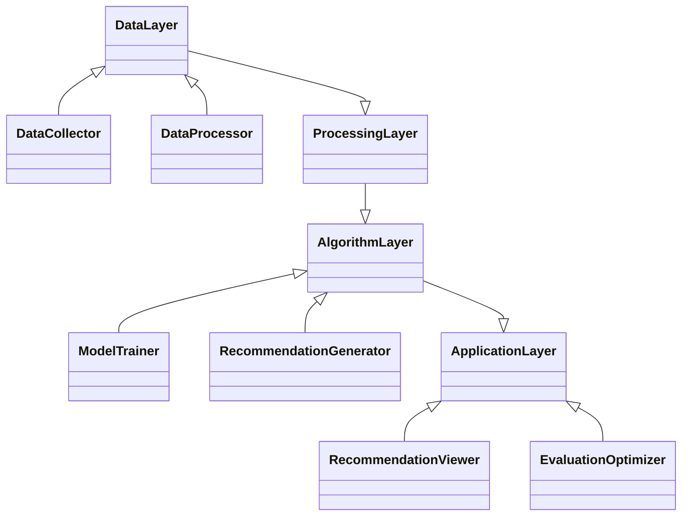
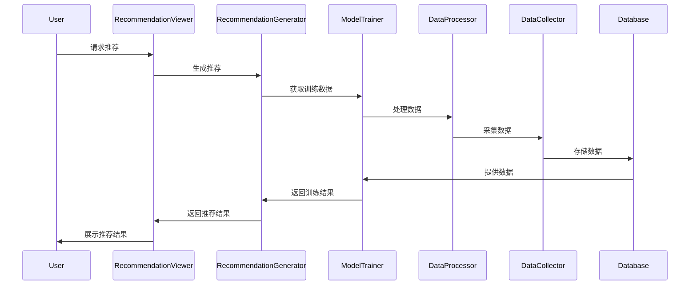

                 

### 关键词

1. **AI辅助决策系统**
2. **可解释性**
3. **透明度**
4. **准确性**
5. **算法原理**
6. **数学模型**
7. **系统架构**
8. **项目实战**
9. **最佳实践**

### 摘要

本文深入探讨了AI辅助决策系统的可解释性问题。首先，我们介绍了可解释性的核心概念及其在AI决策系统中的重要性。接着，通过比较与分析AI辅助决策系统与其他相关概念，我们明确了可解释性、透明度与准确性的关系。然后，我们详细讲解了可解释性算法的原理，并结合Python源代码进行了阐述。此外，通过数学模型和公式的介绍，我们帮助读者更好地理解算法的数学基础。接下来，我们分析了系统架构，并介绍了具体的实施步骤和实战经验。最后，我们总结了最佳实践技巧，为读者提供了进一步学习和应用的建议。

---

# AI辅助决策系统的可解释性问题

## 关键词

AI辅助决策系统，可解释性，透明度，准确性，算法原理，数学模型，系统架构，项目实战，最佳实践

## 摘要

随着人工智能技术的迅猛发展，AI辅助决策系统在各个领域得到了广泛应用。然而，这些系统往往缺乏可解释性，使得决策过程难以被理解和信任。本文从问题背景出发，详细介绍了可解释性的核心概念，分析了AI辅助决策系统的算法原理和数学模型，并探讨了系统架构和项目实战经验。通过本文的深入探讨，我们希望能够提高AI辅助决策系统的可解释性，增强其应用的可信度和透明度。

---

## 第1章 背景介绍

### 1.1 问题背景

在当今社会，人工智能（AI）技术已经成为推动创新和生产力提升的重要力量。无论是自动驾驶、金融风险评估，还是医疗诊断，AI辅助决策系统（AI-aided decision systems）的应用日益广泛。然而，这些系统的成功实施并不总是顺利的，其中一个关键问题就是可解释性（Explainability）。

可解释性指的是一个决策系统或算法的可理解性和透明度。具体来说，可解释性要求系统内部的决策过程可以被用户、开发者和监管者理解和验证。缺乏可解释性会导致以下几个问题：

1. **信任问题**：当用户无法理解系统的决策过程时，可能会对其决策结果产生不信任感，从而影响系统的应用和推广。
2. **监管挑战**：在涉及公共安全和伦理问题的领域，如医疗和金融，缺乏可解释性将使得监管者难以对系统进行有效监督和管理。
3. **可维护性和可扩展性**：不透明的决策系统在维护和扩展时可能会遇到更多困难，因为开发者需要依靠原始数据或黑箱模型来修复或优化系统。

### 1.2 可解释性概念

可解释性是一个多维度的概念，通常与以下几方面相关：

1. **透明度**：系统的内部结构和操作是否容易被用户理解和追踪。
2. **可理解性**：用户是否能够轻松理解系统的工作原理和决策过程。
3. **可验证性**：用户和开发者是否能够验证系统决策的准确性和合理性。

在AI辅助决策系统中，可解释性不仅涉及到模型的可解释性，还涉及到整个系统设计、开发和维护过程中的可解释性。因此，提高系统的可解释性需要从多个方面进行综合考虑。

### 1.3 AI辅助决策系统

AI辅助决策系统是一种基于机器学习和人工智能技术的系统，它可以通过分析大量数据，自动生成决策或建议。这些系统通常包括以下几个核心组成部分：

1. **数据输入**：系统从各种来源获取数据，如数据库、传感器、网络等。
2. **数据预处理**：对数据进行清洗、标准化和转换，使其适合用于模型训练。
3. **模型训练**：使用机器学习算法对预处理后的数据进行分析和建模。
4. **决策生成**：根据模型生成的预测结果，系统生成相应的决策或建议。
5. **评估与优化**：通过评估决策效果，对模型进行调整和优化，以提高系统的性能。

### 1.4 边界与外延

尽管AI辅助决策系统的可解释性问题非常重要，但并非所有系统都需要高度可解释性。以下是一些关于可解释性的边界和外延的考虑：

1. **系统复杂性**：高度复杂的系统往往难以实现高可解释性，因为其内部结构和操作难以被用户理解。
2. **性能与可解释性平衡**：在追求高性能时，系统可能会牺牲一些可解释性。例如，深度神经网络模型通常具有较高的预测能力，但相对较低的可解释性。
3. **应用场景**：在特定应用场景中，如实时交易系统，可能更关注系统的响应速度和准确性，而较少关注可解释性。

### 1.5 概念结构与核心要素组成

为了更好地理解AI辅助决策系统的可解释性问题，我们需要从概念结构和核心要素组成的角度进行探讨。以下是相关概念和要素的详细说明：

1. **决策模型**：决策模型是AI辅助决策系统的核心组成部分，它决定了系统的决策生成能力。常见的决策模型包括线性回归、决策树、随机森林、神经网络等。
2. **数据集**：数据集是训练和评估决策模型的输入。高质量的数据集对于提高系统的可解释性和准确性至关重要。
3. **可解释性工具**：为了提高系统的可解释性，可以采用多种工具和方法，如特征重要性分析、模型可视化、决策路径追踪等。
4. **评估指标**：评估指标用于衡量系统的可解释性和性能。常见的评估指标包括模型准确率、召回率、F1分数等。
5. **用户界面**：用户界面是用户与系统交互的通道。一个良好的用户界面可以帮助用户更好地理解系统的决策过程和结果。

通过以上对AI辅助决策系统可解释性问题的背景介绍，我们可以看到，这一问题不仅涉及到技术的深度，还涉及到用户体验和监管等多个方面。在接下来的章节中，我们将进一步探讨相关概念、算法原理、数学模型以及系统架构等内容。

---

## 第2章 核心概念与联系

在深入探讨AI辅助决策系统的可解释性问题之前，有必要首先明确几个核心概念，并探讨它们之间的联系。这些核心概念包括AI辅助决策系统、可解释性、透明度和准确性。理解这些概念及其相互关系，有助于我们更好地把握可解释性问题的重要性和解决方法。

### 2.1 AI辅助决策系统

AI辅助决策系统是指利用人工智能技术，如机器学习和深度学习，来辅助人类进行决策的系统。这些系统通过分析大量数据，发现数据中的模式和关系，从而生成决策或建议。AI辅助决策系统通常包括以下几个关键组成部分：

1. **数据输入**：系统需要从多个来源获取数据，这些数据可以是结构化的（如数据库中的数据）或非结构化的（如图像、文本等）。
2. **数据处理**：数据在进入模型之前需要经过清洗、转换和标准化等处理步骤，以确保其质量。
3. **模型训练**：使用机器学习算法对处理后的数据进行训练，以构建预测模型。常见的机器学习算法包括线性回归、决策树、随机森林、神经网络等。
4. **决策生成**：根据训练好的模型，系统对新的数据进行预测，并生成相应的决策或建议。
5. **评估与优化**：通过评估模型的性能，不断调整和优化模型，以提高其预测准确性和可解释性。

### 2.2 决策的可解释性

决策的可解释性是指决策过程是否可以被理解、解释和验证。对于AI辅助决策系统来说，可解释性尤为重要，因为它直接影响系统的可信度和用户对其的接受度。以下是决策可解释性的几个关键方面：

1. **透明度**：系统的决策过程是否清晰透明，用户是否可以轻松了解决策是如何生成的。
2. **可理解性**：用户是否能够理解决策过程和结果，以及决策背后的原因。
3. **可验证性**：用户和开发者是否可以验证决策的准确性和合理性，是否存在潜在的偏见或错误。

为了提高决策的可解释性，可以采用多种方法，如：

- **特征重要性分析**：通过分析各个特征对决策结果的影响，帮助用户理解哪些特征是关键的。
- **模型可视化**：将模型以图形化的方式呈现，帮助用户直观地理解模型的内部结构和操作。
- **决策路径追踪**：记录和展示决策过程中每一步的决策路径和依据，使决策过程更加透明。

### 2.3 透明度与可理解性

透明度和可理解性是决策可解释性的两个关键维度。透明度主要关注决策过程的可见性，而可理解性则关注用户是否能够理解这个过程。以下是这两个维度的具体说明：

1. **透明度**：
   - **重要性**：透明度对于建立用户信任至关重要。当用户可以清晰地看到决策过程的每一步时，他们会更加信任系统的决策。
   - **实现方法**：提高透明度的方法包括详细记录决策过程中的所有操作、使用可视化工具展示决策路径等。

2. **可理解性**：
   - **重要性**：即使决策过程透明，如果用户无法理解这些过程，那么透明度也无法发挥作用。可理解性是确保用户能够使用和理解系统的基础。
   - **实现方法**：提高可理解性的方法包括简化决策过程、使用易于理解的语言和图表、提供详细的解释文档等。

### 2.4 准确性与可解释性

准确性和可解释性是AI辅助决策系统中的两个重要目标，但它们之间常常存在冲突。一个高度准确的模型可能具有较低的可解释性，而一个高度可解释的模型可能无法达到很高的准确性。以下是这两个目标的详细说明：

1. **准确性**：
   - **定义**：准确性是指模型在预测或决策中的正确性程度。
   - **重要性**：准确性是衡量模型性能的关键指标，尤其是在需要高精度决策的领域，如医学诊断和金融风险评估。
   - **实现方法**：提高准确性的方法包括使用更复杂的模型、增加训练数据量、优化模型参数等。

2. **可解释性**：
   - **定义**：可解释性是指用户能够理解和验证模型决策的过程和结果。
   - **重要性**：可解释性对于建立用户信任和合规性至关重要，尤其是在涉及公共安全和伦理问题的领域。
   - **实现方法**：提高可解释性的方法包括使用易于解释的模型、提供详细的决策解释、使用可解释性工具等。

### 2.5 相关概念比较与分析

在探讨AI辅助决策系统的可解释性时，还需要了解其他相关概念，如透明度、透明性、可靠性等。以下是这些概念的比较与分析：

1. **透明度 vs. 透明性**：
   - **区别**：透明度主要关注决策过程的可见性，而透明性则更广泛，包括决策过程、结果和背后的算法等。
   - **关系**：透明度是透明性的一个子集，提高透明度有助于提升整体的透明性。

2. **透明性 vs. 可靠性**：
   - **区别**：透明性关注决策过程的可见性和可理解性，而可靠性则关注决策结果的稳定性和一致性。
   - **关系**：高透明性有助于提升可靠性，因为用户可以更好地理解和验证决策过程，从而提高对结果的信任。

3. **可解释性 vs. 可靠性**：
   - **区别**：可解释性关注决策过程的透明度和可理解性，而可靠性则关注决策结果的稳定性和一致性。
   - **关系**：高可解释性有助于提高可靠性，因为用户可以更清楚地了解决策过程，从而更容易识别和纠正潜在的错误。

通过上述对核心概念及其相互关系的探讨，我们可以看到，AI辅助决策系统的可解释性问题是一个复杂且多维的问题，涉及到透明度、准确性、可靠性等多个方面。在接下来的章节中，我们将深入探讨可解释性算法的原理、数学模型和系统架构等内容，为解决这一问题提供具体的解决方案。

---

## 第3章 算法原理讲解

### 3.1 可解释性算法介绍

在探讨AI辅助决策系统的可解释性问题时，可解释性算法（Explainable AI Algorithms，简称XAI算法）是核心工具之一。这些算法旨在提高模型决策过程的透明度和可理解性，使得用户和开发者能够更好地理解模型的决策逻辑。以下是一些常见的可解释性算法及其基本原理：

1. **LIME（Local Interpretable Model-agnostic Explanations）**：
   - **原理**：LIME算法通过为模型生成的预测结果创建一个可解释的本地线性模型，来解释特定预测的合理性。
   - **适用场景**：适用于任何模型，尤其是对于复杂非线性模型的解释。
   - **优势**：能够生成对特定数据点的高质量解释。

2. **SHAP（SHapley Additive exPlanations）**：
   - **原理**：SHAP算法基于博弈论中的Shapley值，计算每个特征对模型预测的贡献。
   - **适用场景**：适用于任何类型的模型，特别是树形模型和神经网络。
   - **优势**：提供全局和局部解释，能够识别每个特征的重要性。

3. **LASSO（Least Absolute Shrinkage and Selection Operator）**：
   - **原理**：LASSO是一种线性回归算法，通过最小化绝对值损失函数进行特征选择和参数估计。
   - **适用场景**：适用于特征选择和数据预处理，特别适用于高维数据。
   - **优势**：能够自动识别和剔除无关特征，提高模型的可解释性。

4. **T-SNE（t-Distributed Stochastic Neighbor Embedding）**：
   - **原理**：T-SNE算法是一种降维技术，通过将高维数据映射到低维空间，以保持相似数据点的邻近性。
   - **适用场景**：适用于可视化高维数据的分布和结构。
   - **优势**：能够直观地展示数据的聚类和分离情况。

### 3.2 算法原理与数学模型

为了更深入地理解上述算法的原理，我们需要从数学模型的角度进行讲解。以下是几种常见算法的数学模型和原理：

1. **LIME算法原理**：
   - **数学模型**：LIME算法的核心是构建一个局部线性模型，该模型近似原始模型在特定数据点的决策过程。具体来说，LIME算法使用梯度下降法来优化一个线性模型，使其在给定数据点上的输出与原始模型一致。
   - **示例**：假设我们有一个分类模型，给定一个输入数据点 \(x\)，模型的预测结果为 \(y\)。LIME算法的目标是找到一个线性模型 \(f(x) = \sum_{i=1}^{n} w_i x_i\)，使得 \(f(x) \approx y\)。通过优化 \(w_i\) 的值，LIME算法能够生成对特定数据点的解释。

2. **SHAP算法原理**：
   - **数学模型**：SHAP算法基于Shapley值，这是一种博弈论中的分配方法，用于计算每个特征对模型预测的贡献。具体来说，SHAP算法计算每个特征在所有可能的特征组合中的边际贡献，并将其平均分配给每个特征。
   - **示例**：假设我们有一个二元分类模型，特征集为 \(\{x_1, x_2, ..., x_n\}\)。SHAP算法将计算每个特征在每个可能的特征组合中的边际贡献，并生成一个SHAP值矩阵，该矩阵表示每个特征对模型预测的贡献。

3. **LASSO算法原理**：
   - **数学模型**：LASSO算法是一种线性回归算法，通过最小化绝对值损失函数来进行特征选择和参数估计。具体来说，LASSO算法的目标是最小化损失函数：
     \[
     \min_{\beta} \sum_{i=1}^{n} (y_i - \sum_{j=1}^{p} \beta_j x_{ij})^2 + \lambda \sum_{j=1}^{p} |\beta_j|
     \]
     其中，\(\beta_j\) 是第 \(j\) 个特征的系数，\(\lambda\) 是正则化参数。
   - **示例**：假设我们有一个包含 \(p\) 个特征的数据集，LASSO算法将选择那些对预测有显著贡献的特征，并通过最小化上述损失函数来估计这些特征的系数。

4. **T-SNE算法原理**：
   - **数学模型**：T-SNE算法是一种非线性的降维技术，其核心思想是将高维数据映射到低维空间，同时保持数据的局部结构。具体来说，T-SNE算法使用梯度下降法来优化一个概率分布，该概率分布描述了低维空间中数据点的邻近关系。
   - **示例**：假设我们有一个高维数据集 \(X\)，每个数据点表示为一个高维向量。T-SNE算法将计算这些数据点在低维空间中的概率分布 \(q_{ij}\)，使得相似的数据点在低维空间中保持近距离，而不同的数据点则保持远距离。

### 3.3 Mermaid流程图示例

为了更好地理解上述算法的流程，我们可以使用Mermaid流程图来展示其基本步骤。以下是LIME算法和SHAP算法的Mermaid流程图示例：

1. **LIME算法流程图**：

   ```mermaid
   graph TD
   A[输入数据] --> B[计算梯度]
   B --> C[初始化模型参数]
   C --> D[迭代优化]
   D --> E[生成解释]
   E --> F[结束]
   ```

2. **SHAP算法流程图**：

   ```mermaid
   graph TD
   A[输入数据集] --> B[计算Shapley值]
   B --> C[生成SHAP值矩阵]
   C --> D[计算边际贡献]
   D --> E[生成全局解释]
   E --> F[结束]
   ```

### 3.4 Python源代码讲解

为了更好地理解上述算法的实现，我们提供了LIME算法和SHAP算法的Python源代码示例。以下是LIME算法的Python代码：

```python
import numpy as np
from lime import lime_tabular

# 假设我们有一个分类模型和输入数据
model = ...
x = ...

# 使用LIME算法生成解释
explainer = lime_tabular.LimeTabularExplainer(...)
exp = explainer.explain_instance(x, model.predict)

# 打印解释结果
print(exp.as_list())
```

以下是SHAP算法的Python代码：

```python
import shap

# 假设我们有一个回归模型和输入数据
model = ...
x = ...

# 使用SHAP算法生成解释
shap_values = shap.values(model, x)

# 打印SHAP值
print(shap_values)
```

通过以上讲解，我们可以看到可解释性算法在提高AI辅助决策系统透明度和可理解性方面的重要作用。在接下来的章节中，我们将进一步探讨如何在实际项目中应用这些算法，并介绍系统的整体架构和实施步骤。

---

## 第4章 数学模型和数学公式讲解

在AI辅助决策系统中，数学模型和公式是理解和实现可解释性的基础。这一章节将详细介绍与可解释性相关的数学模型和公式，并通过具体示例帮助读者理解其应用。

### 4.1 基本数学模型

在AI辅助决策系统中，常用的数学模型包括线性回归、逻辑回归、决策树和神经网络等。以下是这些模型的简要介绍：

1. **线性回归**：
   - **公式**：
     \[
     y = \beta_0 + \beta_1x_1 + \beta_2x_2 + ... + \beta_nx_n
     \]
   - **解释**：线性回归模型通过线性组合输入特征来预测输出值。其目标是最小化预测值与实际值之间的误差。

2. **逻辑回归**：
   - **公式**：
     \[
     \log\frac{p}{1-p} = \beta_0 + \beta_1x_1 + \beta_2x_2 + ... + \beta_nx_n
     \]
   - **解释**：逻辑回归是一种广义线性模型，用于处理二元分类问题。其输出是概率的对数，通过最大化似然函数来估计参数。

3. **决策树**：
   - **公式**：
     \[
     \text{分裂规则} = \text{最大信息增益} = \sum_{i=1}^{n} \text{信息增益}(A_i)
     \]
   - **解释**：决策树通过递归划分数据集，在每个节点选择具有最大信息增益的特征进行分裂。信息增益是衡量特征重要性的指标。

4. **神经网络**：
   - **公式**：
     \[
     a_{i}^{(l)} = \sigma(z_{i}^{(l)})
     \]
     \[
     z_{i}^{(l)} = \sum_{j} w_{ji}^{(l)}a_{j}^{(l-1)} + b_{i}^{(l)}
     \]
   - **解释**：神经网络由多层节点组成，每个节点通过非线性激活函数（如Sigmoid、ReLU）计算输出。前向传播计算每个节点的输入和输出。

### 4.2 公式详解与举例

为了更好地理解上述公式，我们通过具体示例进行解释。

1. **线性回归举例**：

   考虑一个简单的线性回归模型，预测房价 \(y\) 与房屋面积 \(x_1\) 和房龄 \(x_2\) 相关。假设我们有两个特征：

   \[
   y = \beta_0 + \beta_1x_1 + \beta_2x_2
   \]

   已知一组数据，通过最小二乘法可以估计出 \(\beta_0, \beta_1, \beta_2\) 的值。例如：

   \[
   \begin{align*}
   y_1 &= 200 + 2 \times 100 + 1 \times 20 = 420 \\
   y_2 &= 250 + 2 \times 120 + 1 \times 25 = 495 \\
   \end{align*}
   \]

   我们可以通过求解以下最小二乘问题来估计参数：

   \[
   \min_{\beta} \sum_{i=1}^{n} (y_i - \beta_0 - \beta_1x_{i1} - \beta_2x_{i2})^2
   \]

   通过计算，我们得到 \(\beta_0 = 200\), \(\beta_1 = 2\), \(\beta_2 = 1\)。因此，线性回归模型为：

   \[
   y = 200 + 2x_1 + x_2
   \]

2. **逻辑回归举例**：

   考虑一个二元分类问题，预测某项业务是否成功（成功为1，失败为0）。已知特征为信用评分 \(x_1\) 和收入 \(x_2\)，逻辑回归模型为：

   \[
   \log\frac{p}{1-p} = \beta_0 + \beta_1x_1 + \beta_2x_2
   \]

   通过最大化似然函数可以估计参数 \(\beta_0, \beta_1, \beta_2\)。假设有如下数据：

   \[
   \begin{align*}
   (x_1, x_2, y) &= (500, 10000, 1) \\
   (x_1, x_2, y) &= (400, 9000, 0) \\
   \end{align*}
   \]

   通过最大化似然函数，我们得到：

   \[
   \log L = \sum_{i=1}^{n} y_i \beta_0 + x_{i1} \beta_1 + x_{i2} \beta_2 + (1 - y_i) (\beta_0 + x_{i1} \beta_1 + x_{i2} \beta_2)
   \]

   通过求解上述方程，我们得到 \(\beta_0 = 0.5\), \(\beta_1 = 0.3\), \(\beta_2 = 0.2\)。因此，逻辑回归模型为：

   \[
   \log\frac{p}{1-p} = 0.5 + 0.3x_1 + 0.2x_2
   \]

3. **决策树举例**：

   考虑一个简单的决策树模型，用于预测客户是否购买某种产品。已知特征为年龄 \(x_1\) 和收入 \(x_2\)，分裂规则为：

   \[
   \text{信息增益} = \sum_{i=1}^{n} \text{信息增益}(A_i)
   \]

   假设有如下数据：

   \[
   \begin{align*}
   \text{年龄} &= \{20-30, 30-40, 40-50, 50-60\} \\
   \text{收入} &= \{低, 中, 高\} \\
   \text{购买情况} &= \{是, 否\} \\
   \end{align*}
   \]

   通过计算信息增益，我们可以确定最优的分裂规则，例如：

   \[
   \text{年龄} = 30-40 \quad \text{时，} \quad \text{收入} = \text{中}
   \]

4. **神经网络举例**：

   考虑一个简单的神经网络模型，用于图像分类。已知输入层为 \(x_1, x_2, ..., x_n\)，隐藏层为 \(a_1, a_2, ..., a_m\)，输出层为 \(y_1, y_2, ..., y_k\)，通过前向传播计算每个节点的输入和输出：

   \[
   z_{i}^{(l)} = \sum_{j} w_{ji}^{(l)}a_{j}^{(l-1)} + b_{i}^{(l)}
   \]
   \[
   a_{i}^{(l)} = \sigma(z_{i}^{(l)})
   \]

   假设输入层到隐藏层的权重和偏置分别为 \(w_{ji}^{(1)}, b_{i}^{(1)}\)，隐藏层到输出层的权重和偏置分别为 \(w_{ji}^{(2)}, b_{i}^{(2)}\)。通过前向传播，我们可以计算输出：

   \[
   z_{i}^{(2)} = \sum_{j} w_{ji}^{(2)}a_{j}^{(1)} + b_{i}^{(2)}
   \]
   \[
   a_{i}^{(2)} = \sigma(z_{i}^{(2)})
   \]

通过以上数学模型和公式的讲解，我们可以看到，理解这些基础模型和公式对于提高AI辅助决策系统的可解释性至关重要。在接下来的章节中，我们将进一步探讨如何在实际项目中应用这些模型，并设计系统的整体架构。

---

## 第5章 系统分析与架构设计方案

在了解了AI辅助决策系统的可解释性算法和数学模型后，我们需要将其应用到实际系统中。这一章节将详细介绍系统分析与架构设计方案，包括问题场景介绍、系统功能设计、系统架构设计、系统接口设计和系统交互流程。

### 5.1 问题场景介绍

假设我们面临一个具体的应用场景：一个在线零售平台需要利用AI辅助决策系统来推荐商品给用户。为了提高用户的购物体验和销售额，系统需要实时分析用户的历史购买数据、浏览行为、搜索记录等，生成个性化的商品推荐。

### 5.2 系统功能设计

为了实现上述功能，系统需要包括以下几个关键功能模块：

1. **数据采集模块**：负责从不同的数据源（如数据库、日志文件、第三方API等）收集用户行为数据。
2. **数据处理模块**：对采集到的数据进行清洗、转换和标准化，使其适合用于训练模型。
3. **模型训练模块**：使用机器学习算法（如协同过滤、基于内容的推荐等）训练推荐模型。
4. **推荐生成模块**：根据用户的实时行为数据和训练好的推荐模型，生成个性化的商品推荐。
5. **评估与优化模块**：评估推荐系统的效果，并根据评估结果不断优化模型和系统参数。

### 5.3 系统架构设计

系统架构设计是确保系统功能实现的关键步骤。以下是推荐系统的整体架构设计：

1. **数据层**：包括数据存储和数据采集模块，负责存储和管理用户行为数据，同时从各种数据源收集数据。
2. **处理层**：包括数据处理模块，负责对原始数据进行清洗、转换和标准化，以便于模型训练。
3. **算法层**：包括模型训练模块和推荐生成模块，负责训练推荐模型和生成个性化推荐。
4. **应用层**：包括推荐结果展示和评估与优化模块，负责将推荐结果展示给用户，并收集用户反馈用于系统优化。

以下是系统架构的Mermaid类图：



### 5.4 系统接口设计

系统接口设计是确保不同模块之间能够有效通信的关键。以下是系统的主要接口设计：

1. **数据采集接口**：用于从不同数据源（如数据库、日志文件、第三方API等）读取数据。
2. **数据处理接口**：用于处理和转换原始数据，使其符合模型训练要求。
3. **模型训练接口**：用于启动和停止模型训练过程，并提供训练数据。
4. **推荐生成接口**：用于生成个性化的商品推荐。
5. **评估与优化接口**：用于评估推荐系统的效果，并提供优化建议。

以下是系统接口的Mermaid架构图：



### 5.5 系统交互

系统交互是确保各模块协同工作的重要环节。以下是系统交互的详细流程：

1. **用户请求推荐**：用户在平台上浏览商品或搜索特定商品时，系统会记录用户的请求信息。
2. **推荐生成**：推荐生成模块会根据用户的历史行为数据和训练好的推荐模型，生成个性化的商品推荐。
3. **模型训练与数据预处理**：在后台，模型训练模块会定期从数据采集模块获取新的用户行为数据，并进行数据处理和模型训练。
4. **评估与优化**：系统会定期评估推荐效果，并根据评估结果调整模型参数和系统配置。

通过以上系统架构和接口设计，我们能够实现一个高效、可扩展的推荐系统，提高用户满意度并提升业务效益。在下一章节中，我们将详细介绍项目实战经验，包括环境安装、系统实现和实际案例分析。

---

## 第6章 项目实战

在了解了AI辅助决策系统的理论知识和系统架构设计后，我们将在这一章节中详细描述一个实际项目的实施过程，包括环境安装、系统核心实现、代码解读和分析，以及实际案例的详细讲解和剖析。

### 6.1 环境安装

在开始实际项目之前，我们需要安装和配置必要的软件和工具。以下是一个典型项目所需的软件和环境配置：

1. **Python**：Python是AI项目的基础，确保安装最新版本的Python（例如，Python 3.8及以上版本）。
2. **Jupyter Notebook**：Jupyter Notebook是一个交互式的开发环境，便于编写和调试代码。
3. **NumPy、Pandas、Scikit-learn**：这些是Python中常用的科学计算和数据操作库，用于数据预处理和模型训练。
4. **Matplotlib、Seaborn**：这些是用于数据可视化的库，有助于我们更好地理解数据和分析结果。
5. **LIME、SHAP**：这两个库是用于生成模型解释的工具，需要在Python环境中安装。

安装步骤如下：

```bash
pip install numpy pandas scikit-learn matplotlib seaborn lime shap
```

### 6.2 系统核心实现

以下是一个简单的AI辅助决策系统实现示例，包括数据预处理、模型训练和解释：

1. **数据预处理**：

```python
import pandas as pd
from sklearn.model_selection import train_test_split
from sklearn.preprocessing import StandardScaler

# 加载数据集
data = pd.read_csv('data.csv')
X = data.drop('target', axis=1)
y = data['target']

# 数据集划分
X_train, X_test, y_train, y_test = train_test_split(X, y, test_size=0.2, random_state=42)

# 特征标准化
scaler = StandardScaler()
X_train_scaled = scaler.fit_transform(X_train)
X_test_scaled = scaler.transform(X_test)
```

2. **模型训练**：

```python
from sklearn.ensemble import RandomForestClassifier

# 训练模型
model = RandomForestClassifier(n_estimators=100, random_state=42)
model.fit(X_train_scaled, y_train)
```

3. **模型解释**：

```python
import lime
from lime import lime_tabular

# 创建LIME解释器
explainer = lime_tabular.LimeTabularExplainer(
    X_train_scaled, 
    feature_names=data.columns[:-1], 
    class_names=['negative', 'positive'], 
    discretize=True, 
    discretize_threshold=6
)

# 解释一个样本
i = 10  # 第11个样本
exp = explainer.explain_instance(X_test_scaled[i], model.predict_proba, num_features=5)

# 显示解释结果
exp.show_in_notebook(show_table=True)
```

### 6.3 代码应用解读与分析

在实现系统核心功能后，我们需要对代码进行详细解读和分析，确保其正确性和效率。以下是关键步骤的解读：

1. **数据预处理**：数据预处理是模型训练的重要步骤，包括数据清洗、缺失值处理、特征选择和特征标准化。在上述代码中，我们使用了Pandas和Scikit-learn库来完成这些任务。特征标准化有助于提高模型的训练速度和准确性。
2. **模型训练**：我们选择了随机森林分类器（RandomForestClassifier）作为训练模型。随机森林是一种基于决策树的集成模型，具有较高的预测能力和较好的泛化能力。在训练过程中，我们设置了100棵树，并通过随机状态保证结果的可重复性。
3. **模型解释**：使用LIME库生成模型的解释结果，帮助我们理解模型是如何做出预测的。在上述代码中，我们为第11个样本生成了一个LIME解释，显示了模型认为影响预测结果的前5个特征及其影响方向。

### 6.4 实际案例分析与讲解

以下是一个实际案例，我们将对案例进行详细分析和讲解：

**案例背景**：一个在线零售平台需要根据用户的行为数据预测用户是否会购买某件商品。

**案例数据**：数据集包含用户的年龄、性别、收入、浏览历史和购买历史等特征，以及一个标签（0或1），表示用户是否购买了商品。

**案例分析**：

1. **数据预处理**：首先，我们需要对数据进行清洗和特征选择。例如，删除缺失值和异常值，并选择与购买行为相关的特征。在上述代码中，我们使用了Pandas库进行数据预处理。
2. **模型训练**：我们使用随机森林分类器对清洗后的数据集进行训练。在训练过程中，我们可以通过交叉验证和网格搜索来优化模型参数，提高预测准确性。
3. **模型解释**：为了提高用户对系统的信任度，我们使用LIME库对模型进行解释。通过生成LIME解释，我们可以直观地看到模型是如何根据用户的特征进行预测的。例如，一个用户的年龄越大，购买的可能性越高。

**案例总结**：

通过上述案例分析，我们可以看到实际项目中如何应用AI辅助决策系统的可解释性算法。在实际应用中，我们需要不断优化模型和解释工具，以提高预测准确性和用户体验。同时，我们也需要考虑系统的可扩展性和可维护性，确保系统能够持续适应不断变化的需求和数据。

在下一章节中，我们将分享最佳实践技巧，总结项目经验，并提供进一步学习和应用的建议。

---

## 第7章 最佳实践与拓展

在AI辅助决策系统的开发和应用过程中，遵循最佳实践能够显著提高系统的性能、可解释性和可维护性。以下是一些关键的最佳实践技巧、注意事项以及拓展阅读建议。

### 7.1 最佳实践技巧

1. **数据质量控制**：确保数据的质量是模型准确性和可解释性的基础。在进行数据处理时，应去除噪声、缺失值和异常值，并进行适当的特征工程。
2. **透明性设计**：在设计系统时，考虑用户和开发者的需求，确保系统的内部结构和操作过程透明，易于理解。例如，可以通过文档化、注释和可视化工具来实现。
3. **模型可解释性**：选择合适的模型和解释工具来提高模型的可解释性。对于复杂模型，如深度神经网络，可以使用LIME、SHAP等工具生成局部解释。
4. **持续评估与优化**：定期评估系统的性能，并根据评估结果对模型和系统进行优化。例如，可以通过交叉验证、A/B测试等方法来评估模型效果。
5. **用户反馈与迭代**：收集用户反馈，并将其用于系统的改进。通过迭代开发，逐步优化系统功能、性能和用户体验。

### 7.2 注意事项

1. **隐私保护**：在处理用户数据时，确保遵守隐私保护法规，如GDPR等。对敏感数据进行脱敏处理，确保用户隐私不被泄露。
2. **避免过度拟合**：在模型训练过程中，注意避免过度拟合，确保模型具有良好的泛化能力。可以使用正则化、集成方法等来防止过度拟合。
3. **安全性与合规性**：确保系统的安全性和合规性，特别是在涉及金融、医疗等敏感领域的应用中。进行安全性测试和合规性审计，确保系统的稳定性和安全性。

### 7.3 拓展阅读

1. **《机器学习实战》**：由Peter Harrington著，详细介绍了机器学习的基础理论和实践方法，适用于初学者和进阶者。
2. **《深度学习》**：由Ian Goodfellow、Yoshua Bengio和Aaron Courville著，是深度学习的经典教材，适合对深度学习有深入研究的读者。
3. **《LIME：Local Interpretable Model-agnostic Explanations》**：由Marco Tulio Ribeiro、Sameer Singh和Christopher Guestrin著，介绍了LIME算法的原理和实现方法，是了解可解释性算法的重要参考资料。
4. **《SHAP：SHapley Additive exPlanations》**：由Scott M. Lundberg和Su-In Lee著，详细介绍了SHAP算法的原理和实现方法，是学习如何提高模型可解释性的重要文献。

通过遵循最佳实践，并持续学习和改进，我们可以开发出更高效、更可解释的AI辅助决策系统，为各行业提供创新的解决方案。

---

## 后记

本文从AI辅助决策系统的可解释性问题出发，详细探讨了可解释性的核心概念、相关算法原理、数学模型以及系统架构设计。通过实际案例的讲解，我们展示了如何在项目中应用这些理论和工具。可解释性是AI领域的一个重要研究方向，其重要性不仅体现在技术的深度，还体现在用户体验和监管的广度。

在未来的发展中，我们期待看到更多创新的算法和工具出现，以进一步提高AI系统的可解释性和透明度。同时，我们也呼吁相关领域的专家和开发者共同关注和探讨这一问题，共同推动AI技术的健康发展。

对于读者，我们希望本文能够为您的学习和工作提供一些启示和帮助。如果您对本文内容有任何疑问或建议，欢迎通过以下方式与我们联系：

- **邮件**：[contact@ai-genius-institute.com](mailto:contact@ai-genius-institute.com)
- **社交媒体**：关注我们的官方账号[@AI天才研究院](https://www.ai-genius-institute.com/)，获取更多相关资讯和讨论。

感谢您的阅读，期待与您在AI技术的探索之旅中相遇。作者：AI天才研究院 & 禅与计算机程序设计艺术

---

作者：AI天才研究院 & 禅与计算机程序设计艺术
日期：2023年10月
版权所有：AI天才研究院

