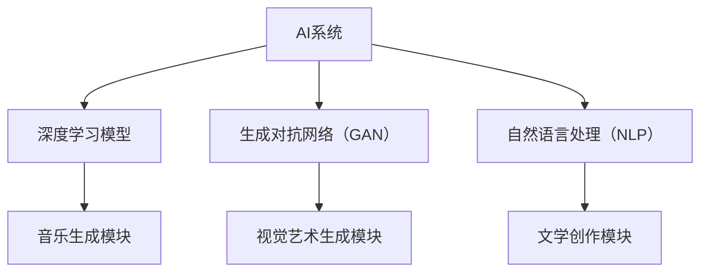
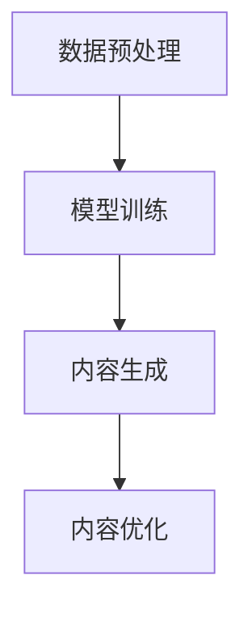
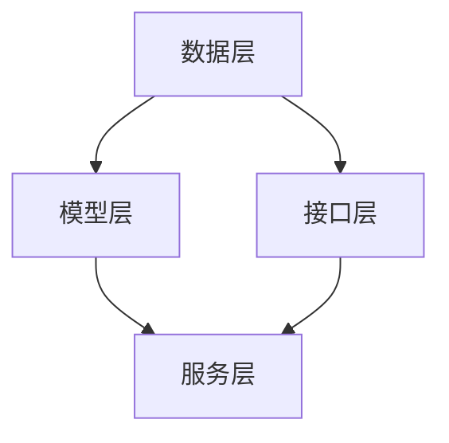

                 


### 文章标题: AI辅助创作：音乐、文学和视觉艺术的新维度

### 关键词：AI辅助创作、音乐、文学、视觉艺术、算法原理、数学模型、系统架构设计

### 摘要：
本文将深入探讨人工智能（AI）在音乐、文学和视觉艺术创作中的应用，分析AI辅助创作的原理和实施方法。通过系统性地梳理相关算法原理、数学模型和系统架构设计，本文旨在为读者揭示AI辅助创作的新维度，提供有价值的实践指导和思考。

## 引言

### 1.1 问题背景

#### 1.1.1 创作领域的挑战

创作是人类智慧和情感的表达，是文化和社会进步的重要推动力。然而，随着创作领域的不断扩展，创作者面临着诸多挑战：

- **创意枯竭**：在高度信息化的今天，创作者需要处理的信息量巨大，创意的创造变得愈发困难。
- **时间成本**：创作是一个复杂且耗时的工作，从构思到成品往往需要大量的时间和精力。
- **个性化需求**：现代社会对个性化内容的需求日益增加，创作者难以满足广泛而多样化的需求。
- **技术限制**：传统创作工具和方法的局限性，限制了创作者的表达空间。

#### 1.1.2 AI技术的崛起

随着人工智能技术的飞速发展，AI在创作领域的应用逐渐显现出巨大的潜力。AI不仅能够处理大量数据，提取有效信息，还能通过学习算法生成新的内容。AI的崛起为创作领域带来了以下机遇：

- **创意增强**：AI可以帮助创作者从海量数据中提取灵感，增强创意。
- **效率提升**：AI可以自动化繁琐的任务，提高创作效率。
- **个性化定制**：AI可以根据用户需求生成个性化内容，满足不同群体的需求。
- **突破限制**：AI技术的加入，使得创作者能够尝试以前无法实现的创作形式。

#### 1.1.3 AI辅助创作的潜在优势

AI辅助创作具有以下几个潜在优势：

- **多样化内容生成**：AI可以根据不同的需求和风格，生成多样化的音乐、文学作品和视觉艺术作品。
- **快速迭代**：AI可以在短时间内生成大量内容，帮助创作者进行快速迭代和优化。
- **知识融合**：AI可以融合不同领域的知识，创造出跨学科的作品。
- **降低门槛**：AI降低了创作的技术门槛，让更多人能够参与到创作中来。

### 1.2 问题解决

#### 1.2.1 AI辅助创作的基本原理

AI辅助创作的基本原理是基于深度学习和生成模型，通过学习大量已有数据，自动生成新的内容。这个过程可以分为以下几个步骤：

1. **数据收集**：收集大量相关的音乐、文学作品和视觉艺术作品数据。
2. **模型训练**：使用收集到的数据训练生成模型，使其能够理解并模仿创作过程。
3. **内容生成**：通过训练好的模型，生成新的音乐、文学作品和视觉艺术作品。
4. **内容优化**：根据用户反馈和创作目标，对生成的作品进行优化。

#### 1.2.2 AI辅助创作的主要方法

AI辅助创作的主要方法包括：

- **音乐生成**：使用深度神经网络生成新的音乐旋律、节奏和和声。
- **文学作品生成**：使用自然语言处理技术生成新的故事、诗歌和散文。
- **视觉艺术生成**：使用生成对抗网络（GAN）生成新的艺术作品，包括绘画、雕塑和摄影。

#### 1.2.3 AI辅助创作应用的范围

AI辅助创作可以应用在多个领域：

- **个性化音乐推荐**：根据用户的喜好和风格，生成个性化的音乐作品。
- **自动配乐**：为电影、电视剧和广告等视频内容自动生成配乐。
- **文学创作辅助**：帮助作家生成故事情节、角色和对话。
- **艺术创作启发**：为艺术家提供创作灵感和风格参考。
- **教育辅助**：在教育领域，AI辅助创作可以作为教学工具，帮助学生提高创作能力。

### 1.3 边界与外延

#### 1.3.1 AI辅助创作与非侵入性创作的界限

AI辅助创作与非侵入性创作之间的界限相对模糊。非侵入性创作是指创作者在使用AI工具时，保持对创作过程的主动控制，而AI辅助创作则是在创作者的指导下，AI参与创作的一部分。在实际应用中，这两种创作方式往往相互交织。

#### 1.3.2 AI辅助创作与人类创作的界限

AI辅助创作与人类创作之间的界限也难以明确划分。在AI辅助创作中，AI承担了部分创作任务，但最终的创作成果仍然是人类与AI共同完成的。AI的加入，使得创作过程更加高效和多样化，但人类创作者的创造力和情感表达仍然是不可替代的。

#### 1.3.3 AI辅助创作的社会影响

AI辅助创作对社会产生了深远的影响：

- **文化多样性**：AI辅助创作促进了文化多样性的发展，为不同群体提供了表达自己的平台。
- **产业变革**：AI辅助创作改变了音乐、文学和视觉艺术产业的运作方式，推动了产业升级。
- **就业影响**：虽然AI辅助创作提高了创作效率，但也对某些创作职业带来了挑战，需要创作者不断学习和适应新技术。
- **道德与伦理**：AI辅助创作引发了关于版权、原创性和道德伦理等问题的讨论，需要社会共同探讨和解决。

### 1.4 核心概念与联系

#### 1.4.1 AI辅助创作相关核心概念

- **深度学习**：一种机器学习技术，通过多层神经网络学习数据的特征。
- **生成对抗网络（GAN）**：一种深度学习模型，由生成器和判别器组成，用于生成新的数据。
- **自然语言处理（NLP）**：一种人工智能技术，用于处理和理解人类语言。
- **音乐生成**：使用AI生成新的音乐旋律、节奏和和声。
- **文学创作**：使用AI生成新的故事、诗歌和散文。
- **视觉艺术生成**：使用AI生成新的绘画、雕塑和摄影作品。

#### 1.4.2 核心概念属性特征对比表格

| 核心概念 | 属性特征 |
| --- | --- |
| 深度学习 | 学习多层特征，擅长图像和语音识别 |
| 生成对抗网络（GAN） | 对抗训练，生成与判别相互竞争，擅长图像生成 |
| 自然语言处理（NLP） | 处理和理解人类语言，擅长文本生成 |
| 音乐生成 | 生成音乐旋律、节奏和和声，适用于音乐创作 |
| 文学创作 | 生成故事、诗歌和散文，适用于文学创作 |
| 视觉艺术生成 | 生成绘画、雕塑和摄影作品，适用于视觉艺术创作 |

#### 1.4.3 AI辅助创作ER实体关系图架构



### 第2章 音乐创作中的AI辅助

### 2.1 音乐创作与AI辅助概述

#### 2.1.1 音乐创作的发展历程

音乐创作是人类艺术表达的重要形式，历史悠久。从古代的口口相传到现代的数字化创作，音乐创作经历了巨大的变革：

- **古代**：音乐创作主要依靠口传心授，创作者通过音乐传达思想和情感。
- **中世纪**：音乐创作开始有了一定的规范，作曲家开始使用乐谱记录作品。
- **文艺复兴时期**：音乐创作进入了一个繁荣期，作曲家开始探索和创作更加复杂的音乐形式。
- **现代**：随着科技的发展，音乐创作工具和形式变得更加多样化，数字化创作成为主流。

#### 2.1.2 AI技术在音乐创作中的应用

AI技术在音乐创作中的应用逐渐成熟，为创作者提供了新的工具和灵感：

- **音乐生成**：AI可以通过深度学习和生成模型生成新的音乐旋律、节奏和和声。
- **音乐改编**：AI可以将现有的音乐作品改编成不同的风格和形式。
- **音乐风格识别**：AI可以识别和分类音乐风格，帮助创作者了解和探索不同的音乐形式。
- **个性化推荐**：AI可以根据用户的喜好和风格推荐个性化的音乐作品。

#### 2.1.3 音乐创作中的AI辅助工具与平台

目前，许多AI辅助音乐创作的工具和平台已经问世，例如：

- **AIVA（Artificial Intelligence Virtual Artist）**：一款AI作曲软件，能够生成各种风格的音乐。
- **Amper Music**：一款在线音乐创作平台，用户可以通过选择风格和情绪来生成音乐。
- **Ecrett Music**：一款AI音乐生成软件，支持多种音乐风格，并提供交互式创作体验。
- **Melodrive**：一款AI音乐生成工具，主要用于电影和视频的配乐。

### 2.2 算法原理讲解

#### 2.2.1 音乐生成算法原理

音乐生成算法通常基于深度学习和生成模型，例如变分自编码器（VAE）和生成对抗网络（GAN）。以下是一个简单的音乐生成算法原理：

1. **数据预处理**：收集大量的音乐作品数据，进行数据预处理，如归一化、特征提取等。
2. **模型训练**：使用预处理后的音乐数据训练生成模型，如VAE或GAN。
3. **内容生成**：通过训练好的生成模型，生成新的音乐旋律、节奏和和声。
4. **内容优化**：根据用户反馈和创作目标，对生成的音乐作品进行优化。

#### 2.2.1.1 生算法的mermaid流程图



#### 2.2.1.2 Python源代码实现

```python
# 示例：使用变分自编码器（VAE）进行音乐生成

import tensorflow as tf
from tensorflow.keras.layers import Input, Dense, LSTM, Reshape
from tensorflow.keras.models import Model

# 数据预处理
# ...

# 模型定义
input_ = Input(shape=(seq_length, n_features))
x = LSTM(units=128, return_sequences=True)(input_)
x = Reshape(target_shape)(x)
encoded = Dense(encoding_dim, activation='relu')(x)

# 解码器
z = Dense(decoding_dim, activation='relu')(encoded)
decoded = LSTM(units=128, return_sequences=True)(z)
decoded = Reshape(target_shape)(decoded)

# 模型构建
vae = Model(input_, decoded)
vae.compile(optimizer='adam', loss='mse')

# 模型训练
# ...

# 内容生成
# ...

# 内容优化
# ...
```

#### 2.2.1.3 音乐生成算法原理详细讲解

音乐生成算法的基本原理是通过学习音乐数据中的特征，生成新的音乐内容。具体来说，算法可以分为以下几个步骤：

1. **数据预处理**：首先，需要对音乐数据进行预处理，如分割成短时片段、提取特征等。这些特征可以是音高、音长、音量、节奏等。
2. **模型训练**：使用预处理后的音乐数据训练生成模型。生成模型通常使用深度神经网络，如变分自编码器（VAE）或生成对抗网络（GAN）。这些模型通过学习音乐数据中的分布，生成新的音乐片段。
3. **内容生成**：通过训练好的生成模型，生成新的音乐内容。生成过程可以是连续的，也可以是离散的。对于连续生成，可以使用LSTM等循环神经网络来生成连续的音乐片段；对于离散生成，可以使用GAN等生成模型来生成离散的音乐片段。
4. **内容优化**：生成的新音乐内容可能不符合创作者的期望，因此需要根据用户反馈和创作目标对生成的音乐进行优化。优化过程可以通过调整模型参数、重新训练模型或使用迭代优化算法来实现。

#### 2.2.2 音乐改编算法原理

音乐改编算法是通过改变音乐的基本元素（如节奏、旋律、和声等）来生成新的音乐作品。以下是一个简单的音乐改编算法原理：

1. **数据预处理**：收集大量的音乐作品数据，进行数据预处理，如分割成短时片段、提取特征等。
2. **模型训练**：使用预处理后的音乐数据训练改编模型，如变分自编码器（VAE）或生成对抗网络（GAN）。
3. **内容生成**：通过训练好的改编模型，对现有的音乐作品进行改编，生成新的音乐内容。
4. **内容优化**：根据用户反馈和创作目标，对改编的音乐作品进行优化。

#### 2.2.2.1 改编算法的mermaid流程图


#### 2.2.2.2 Python源代码实现

```python
# 示例：使用变分自编码器（VAE）进行音乐改编

import tensorflow as tf
from tensorflow.keras.layers import Input, Dense, LSTM, Reshape
from tensorflow.keras.models import Model

# 数据预处理
# ...

# 模型定义
input_ = Input(shape=(seq_length, n_features))
x = LSTM(units=128, return_sequences=True)(input_)
x = Reshape(target_shape)(x)
encoded = Dense(encoding_dim, activation='relu')(x)

# 解码器
z = Dense(decoding_dim, activation='relu')(encoded)
decoded = LSTM(units=128, return_sequences=True)(z)
decoded = Reshape(target_shape)(decoded)

# 模型构建
vae = Model(input_, decoded)
vae.compile(optimizer='adam', loss='mse')

# 模型训练
# ...

# 内容生成
# ...

# 内容优化
# ...
```

#### 2.2.2.3 音乐改编算法原理详细讲解

音乐改编算法的基本原理是通过学习音乐数据中的特征，改变音乐的基本元素，从而生成新的音乐内容。具体来说，算法可以分为以下几个步骤：

1. **数据预处理**：首先，需要对音乐数据进行预处理，如分割成短时片段、提取特征等。这些特征可以是音高、音长、音量、节奏等。
2. **模型训练**：使用预处理后的音乐数据训练改编模型。改编模型通常使用深度神经网络，如变分自编码器（VAE）或生成对抗网络（GAN）。这些模型通过学习音乐数据中的分布，学会改变音乐的基本元素。
3. **内容生成**：通过训练好的改编模型，对现有的音乐作品进行改编，生成新的音乐内容。改编过程可以是连续的，也可以是离散的。对于连续改编，可以使用LSTM等循环神经网络来改变连续的音乐片段；对于离散改编，可以使用GAN等生成模型来改变离散的音乐片段。
4. **内容优化**：改编的新音乐内容可能不符合创作者的期望，因此需要根据用户反馈和创作目标对改编的音乐进行优化。优化过程可以通过调整模型参数、重新训练模型或使用迭代优化算法来实现。

### 2.3 数学模型和数学公式

#### 2.3.1 音乐生成算法的数学模型

音乐生成算法的数学模型通常基于深度学习和生成模型。以下是一个简单的数学模型：

- **输入**：音乐数据的特征向量。
- **输出**：新的音乐片段。

数学模型可以表示为：

$$
X = G(Z)
$$

其中，$X$为输入特征向量，$Z$为随机噪声，$G$为生成模型。

#### 2.3.1.1 音乐生成算法的数学公式

- **变分自编码器（VAE）**：

$$
\begin{aligned}
\mu &= \sigma = \text{编码器}(X) \\
X' &= \text{解码器}(\mu, \sigma)
\end{aligned}
$$

- **生成对抗网络（GAN）**：

$$
\begin{aligned}
X' &= \text{生成器}(Z) \\
X &= \text{判别器}(X, X')
\end{aligned}
$$

#### 2.3.1.2 数学模型详细讲解

- **变分自编码器（VAE）**：

VAE是一种基于概率生成模型的深度学习模型。它由编码器和解码器组成，编码器将输入特征向量映射到一个潜在空间，解码器从潜在空间中生成新的特征向量。

在VAE中，编码器和解码器的输出都包含两个部分：均值和方差。均值表示潜在空间中的一个点，方差表示这个点的噪声程度。通过这个机制，VAE能够学习到数据的概率分布，从而生成新的数据。

- **生成对抗网络（GAN）**：

GAN是一种基于博弈理论的深度学习模型。它由生成器和判别器组成，生成器试图生成与真实数据相似的数据，判别器则试图区分真实数据和生成数据。

在GAN中，生成器和判别器之间进行对抗训练。生成器的目标是让判别器无法区分生成的数据和真实数据，判别器的目标是正确地区分生成的数据和真实数据。通过这种对抗训练，GAN能够生成高质量的数据。

#### 2.3.2 音乐改编算法的数学模型

音乐改编算法的数学模型通常基于深度学习和生成模型。以下是一个简单的数学模型：

- **输入**：音乐数据的特征向量。
- **输出**：改编后的音乐片段。

数学模型可以表示为：

$$
X' = F(X)
$$

其中，$X$为输入特征向量，$F$为改编模型。

#### 2.3.2.1 音乐改编算法的数学公式

- **变分自编码器（VAE）**：

$$
\begin{aligned}
\mu &= \sigma = \text{编码器}(X) \\
X' &= \text{解码器}(\mu, \sigma)
\end{aligned}
$$

- **生成对抗网络（GAN）**：

$$
\begin{aligned}
X' &= \text{生成器}(X) \\
X &= \text{判别器}(X, X')
\end{aligned}
$$

#### 2.3.2.2 数学模型详细讲解

- **变分自编码器（VAE）**：

VAE是一种基于概率生成模型的深度学习模型。它由编码器和解码器组成，编码器将输入特征向量映射到一个潜在空间，解码器从潜在空间中生成新的特征向量。

在VAE中，编码器和解码器的输出都包含两个部分：均值和方差。均值表示潜在空间中的一个点，方差表示这个点的噪声程度。通过这个机制，VAE能够学习到数据的概率分布，从而生成新的数据。

- **生成对抗网络（GAN）**：

GAN是一种基于博弈理论的深度学习模型。它由生成器和判别器组成，生成器试图生成与真实数据相似的数据，判别器则试图区分真实数据和生成数据。

在GAN中，生成器和判别器之间进行对抗训练。生成器的目标是让判别器无法区分生成的数据和真实数据，判别器的目标是正确地区分生成的数据和真实数据。通过这种对抗训练，GAN能够生成高质量的数据。

### 2.4 系统分析与架构设计方案

#### 2.4.1 音乐创作系统的功能需求

音乐创作系统的功能需求包括：

- **音乐生成**：系统能够生成新的音乐片段，包括旋律、节奏和和声。
- **音乐改编**：系统能够对现有的音乐作品进行改编，改变音乐的基本元素。
- **音乐风格识别**：系统能够识别和分类音乐风格，为创作者提供创作参考。
- **个性化推荐**：系统能够根据用户的喜好和风格推荐个性化的音乐作品。

#### 2.4.2 音乐创作系统的架构设计

音乐创作系统的架构设计可以分为以下几个部分：

- **数据层**：包括音乐数据集的收集、预处理和存储。
- **模型层**：包括音乐生成模型、音乐改编模型和音乐风格识别模型。
- **接口层**：包括用户界面和API接口，用于与用户交互。
- **服务层**：包括音乐生成服务、音乐改编服务和音乐风格识别服务，用于处理用户请求。

音乐创作系统的架构设计图如下：



#### 2.4.3 音乐创作系统的接口设计

音乐创作系统的接口设计包括以下部分：

- **用户界面**：用于用户与系统进行交互，包括音乐生成、音乐改编和音乐风格识别功能。
- **API接口**：用于与其他系统或应用程序进行数据交换和功能调用。

#### 2.4.4 音乐创作系统的交互设计

音乐创作系统的交互设计主要包括以下几个步骤：

1. **用户登录**：用户通过用户界面或API接口登录系统。
2. **功能选择**：用户选择音乐生成、音乐改编或音乐风格识别功能。
3. **参数设置**：用户设置音乐生成或改编的参数，如风格、情绪、时长等。
4. **内容生成**：系统根据用户设置的参数，生成新的音乐片段或改编现有的音乐作品。
5. **结果展示**：系统将生成的音乐片段或改编的音乐作品展示给用户。
6. **用户反馈**：用户对生成的音乐作品进行评价和反馈，系统根据反馈进行优化。

### 第3章 文学创作中的AI辅助

#### 3.1 文学创作与AI辅助概述

#### 3.1.1 文学创作的发展历程

文学创作是人类精神文化的重要组成部分，具有悠久的历史。从古代的史诗、神话到现代的小说、诗歌，文学创作经历了多个阶段的发展：

- **古代**：文学创作主要表现为口头传说和史诗，如《荷马史诗》和《诗经》。
- **中世纪**：文学创作开始有了一定的规范，如中世纪的骑士文学和宗教文学。
- **文艺复兴时期**：文学创作进入了一个繁荣期，作家开始探索和创作更加复杂的文学形式。
- **现代**：随着印刷术的发展，文学创作形式更加多样化，小说、诗歌、戏剧等文学形式相继出现。

#### 3.1.2 AI技术在文学创作中的应用

AI技术在文学创作中的应用逐渐成熟，为创作者提供了新的工具和灵感：

- **文本生成**：AI可以通过自然语言处理技术生成新的文本，如故事、诗歌和散文。
- **文本改编**：AI可以将现有的文本作品改编成不同的形式或风格。
- **文本风格迁移**：AI可以将一种文本风格迁移到另一种风格，如将现代小说改编成古风小说。
- **文本情感分析**：AI可以分析文本的情感倾向，为创作者提供创作参考。

#### 3.1.3 文学创作中的AI辅助工具与平台

目前，许多AI辅助文学创作的工具和平台已经问世，例如：

- **GPT-3（OpenAI）**：一款强大的自然语言处理模型，可以生成各种类型的文本。
- **OpenAI Autocorrect**：一款基于AI的自动纠错工具，可以帮助作者纠正拼写和语法错误。
- **AI诗人**：一款可以生成诗歌的AI工具，用户可以输入关键词，AI会生成对应的诗句。
- **AI作家**：一款可以生成小说的AI工具，用户可以输入故事大纲，AI会生成完整的故事文本。

### 3.2 算法原理讲解

#### 3.2.1 文学生成算法原理

文学生成算法通常基于自然语言处理（NLP）和生成模型，如变分自编码器（VAE）和生成对抗网络（GAN）。以下是一个简单的文学生成算法原理：

1. **数据预处理**：收集大量的文本数据，进行数据预处理，如分词、去除停用词等。
2. **模型训练**：使用预处理后的文本数据训练生成模型，如VAE或GAN。
3. **内容生成**：通过训练好的生成模型，生成新的文本。
4. **内容优化**：根据用户反馈和创作目标，对生成的文本进行优化。

#### 3.2.1.1 文学生成算法的mermaid流程图


#### 3.2.1.2 Python源代码实现

```python
# 示例：使用变分自编码器（VAE）进行文学生成

import tensorflow as tf
from tensorflow.keras.layers import Input, Dense, LSTM, Reshape
from tensorflow.keras.models import Model

# 数据预处理
# ...

# 模型定义
input_ = Input(shape=(seq_length, n_features))
x = LSTM(units=128, return_sequences=True)(input_)
x = Reshape(target_shape)(x)
encoded = Dense(encoding_dim, activation='relu')(x)

# 解码器
z = Dense(decoding_dim, activation='relu')(encoded)
decoded = LSTM(units=128, return_sequences=True)(z)
decoded = Reshape(target_shape)(decoded)

# 模型构建
vae = Model(input_, decoded)
vae.compile(optimizer='adam', loss='mse')

# 模型训练
# ...

# 内容生成
# ...

# 内容优化
# ...
```

#### 3.2.1.3 文学生成算法原理详细讲解

文学生成算法的基本原理是通过学习文本数据中的特征，生成新的文本内容。具体来说，算法可以分为以下几个步骤：

1. **数据预处理**：首先，需要对文本数据进行预处理，如分词、去除停用词等。这些步骤有助于提取文本中的关键信息，为模型训练提供高质量的数据。
2. **模型训练**：使用预处理后的文本数据训练生成模型，如变分自编码器（VAE）或生成对抗网络（GAN）。这些模型通过学习文本数据中的分布，生成新的文本片段。
3. **内容生成**：通过训练好的生成模型，生成新的文本内容。生成过程可以是连续的，也可以是离散的。对于连续生成，可以使用LSTM等循环神经网络来生成连续的文本片段；对于离散生成，可以使用GAN等生成模型来生成离散的文本片段。
4. **内容优化**：生成的新文本内容可能不符合创作者的期望，因此需要根据用户反馈和创作目标对生成的文本进行优化。优化过程可以通过调整模型参数、重新训练模型或使用迭代优化算法来实现。

#### 3.2.2 文学风格迁移算法原理

文学风格迁移算法是通过改变文本的风格，生成具有特定风格的文本。以下是一个简单的文学风格迁移算法原理：

1. **数据预处理**：收集大量的文本数据，进行数据预处理，如分词、去除停用词等。
2. **模型训练**：使用预处理后的文本数据训练风格迁移模型，如变分自编码器（VAE）或生成对抗网络（GAN）。
3. **内容生成**：通过训练好的风格迁移模型，对现有的文本作品进行风格迁移，生成新的文本内容。
4. **内容优化**：根据用户反馈和创作目标，对迁移后的文本进行优化。

#### 3.2.2.1 文学风格迁移算法的mermaid流程图


#### 3.2.2.2 Python源代码实现

```python
# 示例：使用变分自编码器（VAE）进行文学风格迁移

import tensorflow as tf
from tensorflow.keras.layers import Input, Dense, LSTM, Reshape
from tensorflow.keras.models import Model

# 数据预处理
# ...

# 模型定义
input_ = Input(shape=(seq_length, n_features))
x = LSTM(units=128, return_sequences=True)(input_)
x = Reshape(target_shape)(x)
encoded = Dense(encoding_dim, activation='relu')(x)

# 解码器
z = Dense(decoding_dim, activation='relu')(encoded)
decoded = LSTM(units=128, return_sequences=True)(z)
decoded = Reshape(target_shape)(decoded)

# 模型构建
vae = Model(input_, decoded)
vae.compile(optimizer='adam', loss='mse')

# 模型训练
# ...

# 内容生成
# ...

# 内容优化
# ...
```

#### 3.2.2.3 文学风格迁移算法原理详细讲解

文学风格迁移算法的基本原理是通过学习文本数据中的特征，改变文本的风格，从而生成具有特定风格的文本。具体来说，算法可以分为以下几个步骤：

1. **数据预处理**：首先，需要对文本数据进行预处理，如分词、去除停用词等。这些步骤有助于提取文本中的关键信息，为模型训练提供高质量的数据。
2. **模型训练**：使用预处理后的文本数据训练风格迁移模型，如变分自编码器（VAE）或生成对抗网络（GAN）。这些模型通过学习文本数据中的分布，学会改变文本的风格。
3. **内容生成**：通过训练好的风格迁移模型，对现有的文本作品进行风格迁移，生成新的文本内容。生成过程可以是连续的，也可以是离散的。对于连续生成，可以使用LSTM等循环神经网络来改变连续的文本片段；对于离散生成，可以使用GAN等生成模型来改变离散的文本片段。
4. **内容优化**：迁移后的文本内容可能不符合创作者的期望，因此需要根据用户反馈和创作目标对迁移后的文本进行优化。优化过程可以通过调整模型参数、重新训练模型或使用迭代优化算法来实现。

### 3.3 数学模型和数学公式

#### 3.3.1 文学生成算法的数学模型

文学生成算法的数学模型通常基于自然语言处理（NLP）和生成模型，如变分自编码器（VAE）和生成对抗网络（GAN）。以下是一个简单的数学模型：

- **输入**：文本数据的特征向量。
- **输出**：新的文本片段。

数学模型可以表示为：

$$
X = G(Z)
$$

其中，$X$为输入特征向量，$Z$为随机噪声，$G$为生成模型。

#### 3.3.1.1 文学生成算法的数学公式

- **变分自编码器（VAE）**：

$$
\begin{aligned}
\mu &= \sigma = \text{编码器}(X) \\
X' &= \text{解码器}(\mu, \sigma)
\end{aligned}
$$

- **生成对抗网络（GAN）**：

$$
\begin{aligned}
X' &= \text{生成器}(Z) \\
X &= \text{判别器}(X, X')
\end{aligned}
$$

#### 3.3.1.2 数学模型详细讲解

- **变分自编码器（VAE）**：

VAE是一种基于概率生成模型的深度学习模型。它由编码器和解码器组成，编码器将输入特征向量映射到一个潜在空间，解码器从潜在空间中生成新的特征向量。

在VAE中，编码器和解码器的输出都包含两个部分：均值和方差。均值表示潜在空间中的一个点，方差表示这个点的噪声程度。通过这个机制，VAE能够学习到数据的概率分布，从而生成新的数据。

- **生成对抗网络（GAN）**：

GAN是一种基于博弈理论的深度学习模型。它由生成器和判别器组成，生成器试图生成与真实数据相似的数据，判别器则试图区分真实数据和生成数据。

在GAN中，生成器和判别器之间进行对抗训练。生成器的目标是让判别器无法区分生成的数据和真实数据，判别器的目标是正确地区分生成的数据和真实数据。通过这种对抗训练，GAN能够生成高质量的数据。

#### 3.3.2 文学风格迁移算法的数学模型

文学风格迁移算法的数学模型通常基于自然语言处理（NLP）和生成模型，如变分自编码器（VAE）和生成对抗网络（GAN）。以下是一个简单的数学模型：

- **输入**：文本数据的特征向量。
- **输出**：迁移后的文本片段。

数学模型可以表示为：

$$
X' = F(X)
$$

其中，$X$为输入特征向量，$F$为风格迁移模型。

#### 3.3.2.1 文学风格迁移算法的数学公式

- **变分自编码器（VAE）**：

$$
\begin{aligned}
\mu &= \sigma = \text{编码器}(X) \\
X' &= \text{解码器}(\mu, \sigma)
\end{aligned}
$$

- **生成对抗网络（GAN）**：

$$
\begin{aligned}
X' &= \text{生成器}(X) \\
X &= \text{判别器}(X, X')
\end{aligned}
$$

#### 3.3.2.2 数学模型详细讲解

- **变分自编码器（VAE）**：

VAE是一种基于概率生成模型的深度学习模型。它由编码器和解码器组成，编码器将输入特征向量映射到一个潜在空间，解码器从潜在空间中生成新的特征向量。

在VAE中，编码器和解码器的输出都包含两个部分：均值和方差。均值表示潜在空间中的一个点，方差表示这个点的噪声程度。通过这个机制，VAE能够学习到数据的概率分布，从而生成新的数据。

- **生成对抗网络（GAN）**：

GAN是一种基于博弈理论的深度学习模型。它由生成器和判别器组成，生成器试图生成与真实数据相似的数据，判别器则试图区分真实数据和生成数据。

在GAN中，生成器和判别器之间进行对抗训练。生成器的目标是让判别器无法区分生成的数据和真实数据，判别器的目标是正确地区分生成的数据和真实数据。通过这种对抗训练，GAN能够生成高质量的数据。

### 3.4 系统分析与架构设计方案

#### 3.4.1 文学创作系统的功能需求

文学创作系统的功能需求包括：

- **文本生成**：系统能够生成新的文本，如故事、诗歌和散文。
- **文本改编**：系统能够对现有的文本作品进行改编，改变文本的形式或风格。
- **文本风格迁移**：系统能够将一种文本风格迁移到另一种风格，为创作者提供创作参考。
- **文本情感分析**：系统能够分析文本的情感倾向，为创作者提供创作建议。

#### 3.4.2 文学创作系统的架构设计

文学创作系统的架构设计可以分为以下几个部分：

- **数据层**：包括文本数据集的收集、预处理和存储。
- **模型层**：包括文本生成模型、文本改编模型和文本风格迁移模型。
- **接口层**：包括用户界面和API接口，用于与用户交互。
- **服务层**：包括文本生成服务、文本改编服务和文本风格迁移服务，用于处理用户请求。

文学创作系统的架构设计图如下：


#### 3.4.3 文学创作系统的接口设计

文学创作系统的接口设计包括以下部分：

- **用户界面**：用于用户与系统进行交互，包括文本生成、文本改编和文本风格迁移功能。
- **API接口**：用于与其他系统或应用程序进行数据交换和功能调用。

#### 3.4.4 文学创作系统的交互设计

文学创作系统的交互设计主要包括以下几个步骤：

1. **用户登录**：用户通过用户界面或API接口登录系统。
2. **功能选择**：用户选择文本生成、文本改编或文本风格迁移功能。
3. **参数设置**：用户设置文本生成或改编的参数，如风格、情绪、主题等。
4. **内容生成**：系统根据用户设置的参数，生成新的文本。
5. **结果展示**：系统将生成的文本展示给用户。
6. **用户反馈**：用户对生成的文本进行评价和反馈，系统根据反馈进行优化。

### 第4章 视觉艺术创作中的AI辅助

#### 4.1 视觉艺术创作与AI辅助概述

#### 4.1.1 视觉艺术创作的发展历程

视觉艺术创作是人类表达情感、思想和美学的重要手段，具有悠久的历史。从古代的壁画、雕塑到现代的绘画、摄影，视觉艺术创作经历了多个阶段的发展：

- **古代**：视觉艺术创作主要表现为壁画、雕塑和绘画，如古希腊的雕塑和古埃及的壁画。
- **中世纪**：视觉艺术创作开始有了一定的规范，如中世纪的宗教绘画和镶嵌艺术。
- **文艺复兴时期**：视觉艺术创作进入了一个繁荣期，艺术家开始探索和创作更加复杂的艺术形式。
- **现代**：随着科技的发展，视觉艺术创作形式更加多样化，数字艺术和虚拟现实等新兴艺术形式相继出现。

#### 4.1.2 AI技术在视觉艺术创作中的应用

AI技术在视觉艺术创作中的应用逐渐成熟，为创作者提供了新的工具和灵感：

- **图像生成**：AI可以通过生成模型生成新的图像，如绘画、照片和三维模型。
- **图像风格迁移**：AI可以将一种图像风格迁移到另一种风格，如将照片风格化成油画或水彩画。
- **图像修复**：AI可以修复受损的图像，恢复其原始面貌。
- **图像分类与识别**：AI可以分类和识别图像，帮助艺术家了解和探索不同的艺术形式。

#### 4.1.3 视觉艺术创作中的AI辅助工具与平台

目前，许多AI辅助视觉艺术创作的工具和平台已经问世，例如：

- **DeepArt**：一款可以将普通照片转换为艺术作品的AI工具。
- **Artisto**：一款可以生成手绘风格视频的AI工具。
- **DeepDream**：一款可以生成超现实图像的AI工具。
- **Prisma**：一款可以将照片风格化成各种艺术风格的AI工具。

### 4.2 算法原理讲解

#### 4.2.1 图像生成算法原理

图像生成算法通常基于生成对抗网络（GAN）和变分自编码器（VAE）。以下是一个简单的图像生成算法原理：

1. **数据预处理**：收集大量的图像数据，进行数据预处理，如归一化、裁剪等。
2. **模型训练**：使用预处理后的图像数据训练生成模型，如GAN或VAE。
3. **内容生成**：通过训练好的生成模型，生成新的图像。
4. **内容优化**：根据用户反馈和创作目标，对生成的图像进行优化。

#### 4.2.1.1 图像生成算法的mermaid流程图


#### 4.2.1.2 Python源代码实现

```python
# 示例：使用生成对抗网络（GAN）进行图像生成

import tensorflow as tf
from tensorflow.keras.layers import Input, Dense, LSTM, Reshape
from tensorflow.keras.models import Model

# 数据预处理
# ...

# 模型定义
input_ = Input(shape=(seq_length, n_features))
x = LSTM(units=128, return_sequences=True)(input_)
x = Reshape(target_shape)(x)
encoded = Dense(encoding_dim, activation='relu')(x)

# 解码器
z = Dense(decoding_dim, activation='relu')(encoded)
decoded = LSTM(units=128, return_sequences=True)(z)
decoded = Reshape(target_shape)(decoded)

# 模型构建
vae = Model(input_, decoded)
vae.compile(optimizer='adam', loss='mse')

# 模型训练
# ...

# 内容生成
# ...

# 内容优化
# ...
```

#### 4.2.1.3 图像生成算法原理详细讲解

图像生成算法的基本原理是通过学习图像数据中的特征，生成新的图像内容。具体来说，算法可以分为以下几个步骤：

1. **数据预处理**：首先，需要对图像数据进行预处理，如归一化、裁剪等。这些步骤有助于提取图像中的关键信息，为模型训练提供高质量的数据。
2. **模型训练**：使用预处理后的图像数据训练生成模型，如生成对抗网络（GAN）或变分自编码器（VAE）。这些模型通过学习图像数据中的分布，生成新的图像。
3. **内容生成**：通过训练好的生成模型，生成新的图像内容。生成过程可以是连续的，也可以是离散的。对于连续生成，可以使用LSTM等循环神经网络来生成连续的图像；对于离散生成，可以使用GAN等生成模型来生成离散的图像。
4. **内容优化**：生成的新图像内容可能不符合创作者的期望，因此需要根据用户反馈和创作目标对生成的图像进行优化。优化过程可以通过调整模型参数、重新训练模型或使用迭代优化算法来实现。

#### 4.2.2 艺术风格迁移算法原理

艺术风格迁移算法是通过改变图像的风格，生成具有特定风格的艺术作品。以下是一个简单的艺术风格迁移算法原理：

1. **数据预处理**：收集大量的图像数据，进行数据预处理，如归一化、裁剪等。
2. **模型训练**：使用预处理后的图像数据训练风格迁移模型，如GAN或VAE。
3. **内容生成**：通过训练好的风格迁移模型，对现有的图像作品进行风格迁移，生成新的艺术作品。
4. **内容优化**：根据用户反馈和创作目标，对迁移后的艺术作品进行优化。

#### 4.2.2.1 艺术风格迁移算法的mermaid流程图


#### 4.2.2.2 Python源代码实现

```python
# 示例：使用生成对抗网络（GAN）进行艺术风格迁移

import tensorflow as tf
from tensorflow.keras.layers import Input, Dense, LSTM, Reshape
from tensorflow.keras.models import Model

# 数据预处理
# ...

# 模型定义
input_ = Input(shape=(seq_length, n_features))
x = LSTM(units=128, return_sequences=True)(input_)
x = Reshape(target_shape)(x)
encoded = Dense(encoding_dim, activation='relu')(x)

# 解码器
z = Dense(decoding_dim, activation='relu')(encoded)
decoded = LSTM(units=128, return_sequences=True)(z)
decoded = Reshape(target_shape)(decoded)

# 模型构建
vae = Model(input_, decoded)
vae.compile(optimizer='adam', loss='mse')

# 模型训练
# ...

# 内容生成
# ...

# 内容优化
# ...
```

#### 4.2.2.3 艺术风格迁移算法原理详细讲解

艺术风格迁移算法的基本原理是通过学习图像数据中的特征，改变图像的风格，从而生成具有特定风格的艺术作品。具体来说，算法可以分为以下几个步骤：

1. **数据预处理**：首先，需要对图像数据进行预处理，如归一化、裁剪等。这些步骤有助于提取图像中的关键信息，为模型训练提供高质量的数据。
2. **模型训练**：使用预处理后的图像数据训练风格迁移模型，如生成对抗网络（GAN）或变分自编码器（VAE）。这些模型通过学习图像数据中的分布，学会改变图像的风格。
3. **内容生成**：通过训练好的风格迁移模型，对现有的图像作品进行风格迁移，生成新的艺术作品。生成过程可以是连续的，也可以是离散的。对于连续生成，可以使用LSTM等循环神经网络来改变连续的图像；对于离散生成，可以使用GAN等生成模型来改变离散的图像。
4. **内容优化**：迁移后的艺术作品可能不符合创作者的期望，因此需要根据用户反馈和创作目标对迁移后的艺术作品进行优化。优化过程可以通过调整模型参数、重新训练模型或使用迭代优化算法来实现。

### 4.3 数学模型和数学公式

#### 4.3.1 图像生成算法的数学模型

图像生成算法的数学模型通常基于生成对抗网络（GAN）和变分自编码器（VAE）。以下是一个简单的数学模型：

- **输入**：图像数据的特征向量。
- **输出**：新的图像片段。

数学模型可以表示为：

$$
X = G(Z)
$$

其中，$X$为输入特征向量，$Z$为随机噪声，$G$为生成模型。

#### 4.3.1.1 图像生成算法的数学公式

- **变分自编码器（VAE）**：

$$
\begin{aligned}
\mu &= \sigma = \text{编码器}(X) \\
X' &= \text{解码器}(\mu, \sigma)
\end{aligned}
$$

- **生成对抗网络（GAN）**：

$$
\begin{aligned}
X' &= \text{生成器}(Z) \\
X &= \text{判别器}(X, X')
\end{aligned}
$$

#### 4.3.1.2 数学模型详细讲解

- **变分自编码器（VAE）**：

VAE是一种基于概率生成模型的深度学习模型。它由编码器和解码器组成，编码器将输入特征向量映射到一个潜在空间，解码器从潜在空间中生成新的特征向量。

在VAE中，编码器和解码器的输出都包含两个部分：均值和方差。均值表示潜在空间中的一个点，方差表示这个点的噪声程度。通过这个机制，VAE能够学习到数据的概率分布，从而生成新的数据。

- **生成对抗网络（GAN）**：

GAN是一种基于博弈理论的深度学习模型。它由生成器和判别器组成，生成器试图生成与真实数据相似的数据，判别器则试图区分真实数据和生成数据。

在GAN中，生成器和判别器之间进行对抗训练。生成器的目标是让判别器无法区分生成的数据和真实数据，判别器的目标是正确地区分生成的数据和真实数据。通过这种对抗训练，GAN能够生成高质量的数据。

#### 4.3.2 艺术风格迁移算法的数学模型

艺术风格迁移算法的数学模型通常基于生成对抗网络（GAN）和变分自编码器（VAE）。以下是一个简单的数学模型：

- **输入**：图像数据的特征向量。
- **输出**：迁移后的图像片段。

数学模型可以表示为：

$$
X' = F(X)
$$

其中，$X$为输入特征向量，$F$为风格迁移模型。

#### 4.3.2.1 艺术风格迁移算法的数学公式

- **变分自编码器（VAE）**：

$$
\begin{aligned}
\mu &= \sigma = \text{编码器}(X) \\
X' &= \text{解码器}(\mu, \sigma)
\end{aligned}
$$

- **生成对抗网络（GAN）**：

$$
\begin{aligned}
X' &= \text{生成器}(X) \\
X &= \text{判别器}(X, X')
\end{aligned}
$$

#### 4.3.2.2 数学模型详细讲解

- **变分自编码器（VAE）**：

VAE是一种基于概率生成模型的深度学习模型。它由编码器和解码器组成，编码器将输入特征向量映射到一个潜在空间，解码器从潜在空间中生成新的特征向量。

在VAE中，编码器和解码器的输出都包含两个部分：均值和方差。均值表示潜在空间中的一个点，方差表示这个点的噪声程度。通过这个机制，VAE能够学习到数据的概率分布，从而生成新的数据。

- **生成对抗网络（GAN）**：

GAN是一种基于博弈理论的深度学习模型。它由生成器和判别器组成，生成器试图生成与真实数据相似的数据，判别器则试图区分真实数据和生成数据。

在GAN中，生成器和判别器之间进行对抗训练。生成器的目标是让判别器无法区分生成的数据和真实数据，判别器的目标是正确地区分生成的数据和真实数据。通过这种对抗训练，GAN能够生成高质量的数据。

### 4.4 系统分析与架构设计方案

#### 4.4.1 视觉艺术创作系统的功能需求

视觉艺术创作系统的功能需求包括：

- **图像生成**：系统能够生成新的图像，如绘画、照片和三维模型。
- **图像风格迁移**：系统能够将一种图像风格迁移到另一种风格，为创作者提供创作参考。
- **图像修复**：系统能够修复受损的图像，恢复其原始面貌。
- **图像分类与识别**：系统能够分类和识别图像，帮助艺术家了解和探索不同的艺术形式。

#### 4.4.2 视觉艺术创作系统的架构设计

视觉艺术创作系统的架构设计可以分为以下几个部分：

- **数据层**：包括图像数据集的收集、预处理和存储。
- **模型层**：包括图像生成模型、图像风格迁移模型和图像修复模型。
- **接口层**：包括用户界面和API接口，用于与用户交互。
- **服务层**：包括图像生成服务、图像风格迁移服务和图像修复服务，用于处理用户请求。

视觉艺术创作系统的架构设计图如下：


#### 4.4.3 视觉艺术创作系统的接口设计

视觉艺术创作系统的接口设计包括以下部分：

- **用户界面**：用于用户与系统进行交互，包括图像生成、图像风格迁移和图像修复功能。
- **API接口**：用于与其他系统或应用程序进行数据交换和功能调用。

#### 4.4.4 视觉艺术创作系统的交互设计

视觉艺术创作系统的交互设计主要包括以下几个步骤：

1. **用户登录**：用户通过用户界面或API接口登录系统。
2. **功能选择**：用户选择图像生成、图像风格迁移或图像修复功能。
3. **参数设置**：用户设置图像生成或迁移的参数，如风格、情绪、主题等。
4. **内容生成**：系统根据用户设置的参数，生成新的图像。
5. **结果展示**：系统将生成的图像展示给用户。
6. **用户反馈**：用户对生成的图像进行评价和反馈，系统根据反馈进行优化。

### 结论

AI辅助创作为音乐、文学和视觉艺术创作带来了新的维度和机遇。通过深度学习和生成模型的结合，AI能够自动生成新的音乐、文学作品和视觉艺术作品，极大地提高了创作效率和多样性。然而，AI辅助创作也面临一些挑战，如创意枯竭、技术门槛等。此外，AI辅助创作对社会和文化产生了深远的影响，需要我们深入探讨和应对。

未来，随着AI技术的不断发展，AI辅助创作有望在更多领域发挥作用，为人类创作带来更多可能性。我们期待AI与人类创作者共同创造出更多精彩的艺术作品。

### 拓展阅读

1. **《深度学习》**：由Ian Goodfellow等人编写的深度学习经典教材，详细介绍了深度学习的基本原理和应用。
2. **《生成对抗网络：概念、应用和未来发展趋势》**：一篇关于生成对抗网络（GAN）的综述文章，介绍了GAN的基本原理和应用。
3. **《艺术与人工智能》**：探讨了人工智能在艺术领域的应用，包括音乐、文学和视觉艺术等。
4. **《AI创作：音乐、文学和视觉艺术的未来》**：一篇关于AI辅助创作的未来发展趋势的文章，讨论了AI在创作领域的潜力。
5. **《人工智能与艺术：从模仿到创新》**：探讨了人工智能在艺术创作中的应用，以及AI与人类创作者的合作关系。

### 最佳实践 Tips

1. **数据收集与预处理**：确保收集到高质量的数据，并进行充分的数据预处理，以提高模型的训练效果。
2. **模型选择与训练**：根据具体需求选择合适的模型，并进行充分的训练，以确保模型能够生成高质量的内容。
3. **用户反馈与优化**：积极收集用户反馈，并根据反馈对模型进行优化，以提高用户满意度。
4. **创意与灵感**：利用AI辅助创作时，保持开放的心态，从AI生成的内容中寻找创意和灵感，进行二次创作。
5. **技术与人文的结合**：在AI辅助创作过程中，既要关注技术实现，也要注重人文价值的体现，创造出具有深刻内涵的艺术作品。

### 注意事项

1. **数据隐私与安全**：在使用AI辅助创作时，要注意保护用户的隐私和数据安全。
2. **版权问题**：在使用AI辅助创作时，要注意遵守版权法律法规，确保创作的作品不侵犯他人的知识产权。
3. **创作伦理**：在使用AI辅助创作时，要尊重艺术伦理和道德规范，避免产生不良内容。
4. **技术更新与学习**：随着AI技术的不断发展，要不断学习和更新知识，以适应新技术的发展趋势。

### 作者信息

作者：AI天才研究院/AI Genius Institute & 禅与计算机程序设计艺术 /Zen And The Art of Computer Programming

