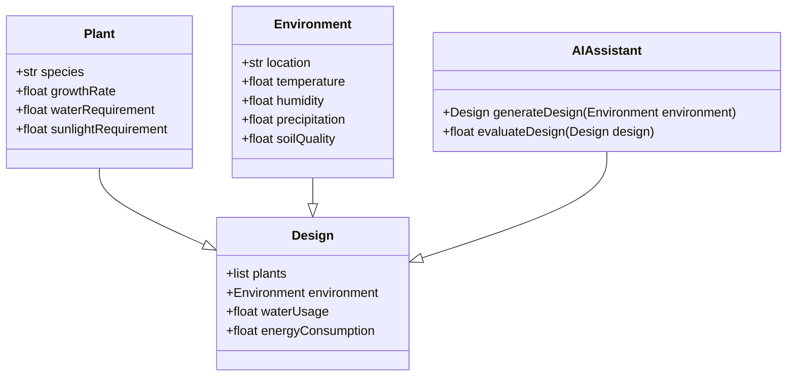
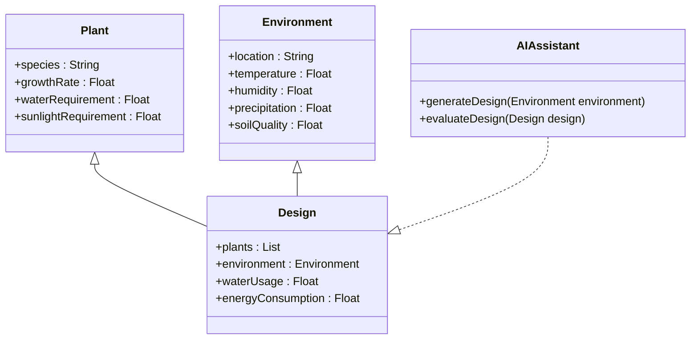
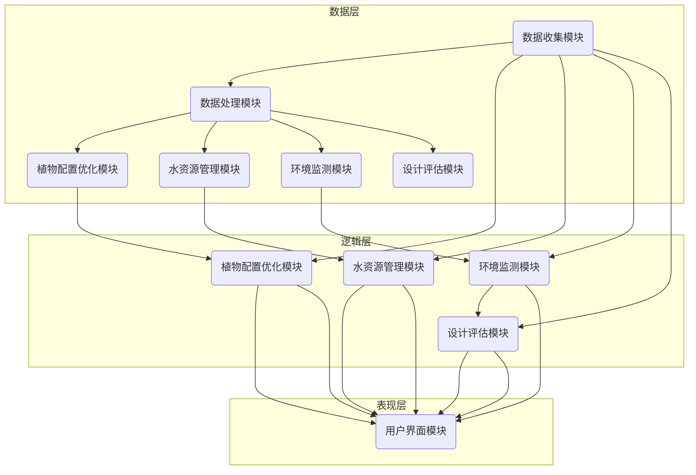

                 

### 1.1 生态园林设计的重要性

生态园林设计是一种综合考虑生态环境保护和人类活动的园林设计方法。它不仅追求美学的视觉效果，更重要的是在园林设计中实现生态平衡，维护生物多样性，保护水资源，降低碳排放等。随着城市化进程的加快和人们对生活品质要求的提高，生态园林设计的重要性愈发凸显。

首先，生态园林设计有助于改善城市生态环境。城市化的快速推进带来了土地退化、水资源短缺、生物多样性减少等问题。通过科学的园林设计，可以有效增加城市绿地面积，提升空气质量，降低城市热岛效应，为城市居民提供良好的生态栖息地。

其次，生态园林设计能够促进生物多样性。园林设计中充分考虑动植物的生存需求，提供适宜的栖息环境，有助于各种生物种群的繁衍和生长。这不仅有助于维持生态系统的平衡，还有利于物种基因的多样性，增强生态系统的稳定性。

再者，生态园林设计具有经济效益。通过科学的管理和设计，园林可以成为城市的新地标，吸引游客，促进旅游业的发展。此外，生态园林设计还能提高土地价值，为城市带来长远的经济利益。

最后，生态园林设计体现了可持续发展理念。在资源日益紧张的今天，通过科学合理的园林设计，可以有效利用自然资源，减少浪费，实现人与自然的和谐共生。

综上所述，生态园林设计在改善城市生态环境、保护生物多样性、实现经济效益和推动可持续发展等方面具有重要意义。因此，深入研究生态园林设计的方法和技术，对提升城市宜居性和生态保护水平具有重要意义。

### 1.2 AI在园林设计中的应用

人工智能（AI）在园林设计中的应用正日益广泛，成为推动园林设计技术进步的重要力量。AI技术通过其强大的数据处理、分析和学习能力，为园林设计提供了新的工具和方法。

首先，AI技术在园林规划中发挥着重要作用。通过机器学习和计算机视觉技术，AI可以快速处理和分析大量的地形、气候、土壤等环境数据，帮助设计师制定出更加科学合理的园林规划方案。例如，利用无人机和遥感技术获取园林区域的3D地形图，通过AI算法分析地形起伏、光照条件等，为园林设计提供详细的参考资料。

其次，AI在植物配置和景观设计中也展现出了巨大的潜力。通过学习大量的植物生长数据和环境条件，AI系统能够推荐最适合特定区域种植的植物种类，并优化植物配置方案，确保园林景观的多样性和美观性。此外，AI还可以根据用户的偏好和需求，提供个性化的景观设计方案。

在园林维护方面，AI技术同样有着广泛的应用。通过物联网和传感器技术，AI系统能够实时监测园林环境数据，如土壤湿度、空气污染指数等，及时发现并预警潜在的环境问题。同时，AI还可以根据监测数据自动调整园林灌溉系统、修剪植物等，提高园林维护的效率和效果。

此外，AI还在园林美学评价中发挥作用。通过图像识别和自然语言处理技术，AI能够对园林景观的美学价值进行评价，为设计师提供反馈和建议，帮助优化园林设计。

总的来说，AI技术在园林设计中的应用极大地提升了设计的科学性和艺术性，不仅提高了设计效率，还为园林生态平衡的维护提供了强有力的支持。随着AI技术的不断发展，其在园林设计中的应用前景将更加广阔。

### 1.3 AI辅助创意园林设计的价值

AI辅助创意园林设计不仅提高了设计效率，更为生态平衡的维护带来了深远的价值。首先，AI通过其强大的数据处理能力，能够快速分析大量生态数据，提供科学的设计方案。例如，利用遥感技术和GIS（地理信息系统），AI可以精确地分析地形、气候、土壤和水源等环境因素，从而优化园林布局，确保植物的生长环境符合生态要求。

其次，AI在植物配置方面的应用极大地提升了生态平衡的维护效果。通过学习植物的生长习性和生态关系，AI能够推荐最适合本地种植的植物种类和配置方案，从而提升生物多样性。此外，AI还能根据季节变化和气候条件，动态调整植物配置，确保园林生态系统始终处于最佳状态。

在水资源管理方面，AI同样发挥了重要作用。通过智能灌溉系统和实时监控，AI可以精准控制浇水量，减少水资源浪费，同时保持土壤湿度和植物生长需求。这不仅有助于节约水资源，还有效减少了因过度灌溉导致的土壤盐碱化和生态失衡。

此外，AI在园林环境监测中也起到了关键作用。利用传感器网络和物联网技术，AI能够实时监测土壤湿度、空气污染指数、水质等环境参数，及时发现并预警潜在的环境问题。通过数据分析和预测，AI可以提前采取措施，防止生态灾害的发生，从而保障生态系统的稳定。

最后，AI在园林美学评价中的应用，不仅提升了园林的美学价值，还促进了人与自然的和谐共生。通过图像识别和自然语言处理技术，AI能够对园林景观的美学价值进行科学评价，为设计师提供宝贵的反馈和建议，帮助优化园林设计，使其更加符合生态和审美需求。

综上所述，AI辅助创意园林设计在生态平衡维护中具有巨大的价值。通过科学的数据处理、智能化的植物配置、精准的水资源管理、全面的环境监测和美学评价，AI不仅提高了园林设计的效率和质量，还为生态系统的可持续发展提供了强有力的技术支持。

### 2.1 生态平衡的基本概念

生态平衡是指在一个生态系统中，各种生物种群之间以及生物与其环境之间通过相互作用达到的一种动态平衡状态。这种平衡不仅体现在生物数量和种类的稳定，还包括营养物质的循环、能量流动的平衡以及生态过程的自我调节能力。生态平衡是维持生态系统健康和功能完整的关键，其基本概念包括以下几个方面：

首先，生物多样性是生态平衡的基础。生物多样性指的是在一定区域内，不同物种的种类、数量和分布状况。多样化的生物种群可以相互补充，共同维持生态系统的稳定性。例如，在森林生态系统中，不同层次的植物为各种动物提供了栖息地和食物来源，从而形成复杂的食物网，增强生态系统的抗干扰能力。

其次，食物链和食物网是生态平衡的重要表现。食物链描述了生物之间通过捕食和被捕食关系形成的能量流动和物质循环。食物网则更加复杂，它包含了多个相互交织的食物链。通过食物链和食物网，生态系统中的能量和物质能够高效地传递和循环，确保每个生物种群都能够获得所需的资源。

第三，生态系统的自我调节能力是维持生态平衡的关键。生态系统的自我调节能力指的是它能够在一定范围内自我调节，以应对外部干扰和内部变化。这种调节能力来源于生物之间的相互作用和生态过程的动态平衡。例如，在海洋生态系统中，海洋中的浮游生物可以通过捕食和被捕食的关系，调节自身种群数量，维持生态系统的稳定。

最后，环境因素如气候、土壤、水分等也对生态平衡有重要影响。环境的任何变化，如气候变化、土地污染、水资源短缺等，都会对生态系统的稳定性和生物多样性产生影响。因此，生态平衡不仅仅关注生物之间的相互作用，还涉及到环境因素的综合考量。

总之，生态平衡是一个复杂而动态的平衡过程，涉及生物多样性、食物链和食物网、自我调节能力以及环境因素的相互作用。理解这些基本概念，有助于我们更好地认识和维持生态系统的健康和稳定。

### 2.2 园林设计中的生态平衡考量

在园林设计中，生态平衡是一个至关重要的考量因素。园林设计师不仅需要关注美学效果，还必须考虑生态系统的稳定性和可持续性。以下几方面是园林设计中生态平衡考量的具体表现：

首先，植物配置是生态平衡的关键。设计师需要根据不同植物的生长习性和生态需求，选择适合的植物种类进行配置。这不仅有助于植物自身的生长，还能形成多样化的生态群落，促进生物多样性的提高。例如，在设计城市公园时，可以选用本地植物和适应当地气候的植物，以减少对外来植物的依赖，同时增强生态系统的适应性。

其次，水分管理是维护生态平衡的重要环节。园林中的灌溉系统需要科学设计，以确保水分的合理利用。智能灌溉系统可以通过传感器实时监测土壤湿度，根据实际需要自动调节灌溉量，避免过度灌溉和水资源浪费。此外，设计师还可以采用雨水收集和利用系统，增加水资源的可持续性。

第三，土壤保护也是生态平衡考量的重点。土壤是生态系统的基础，设计师需要通过合理的植物配置和管理措施，维护土壤的健康。例如，采用草皮覆盖、有机肥料和多样化的植被，可以减少土壤侵蚀和流失，保持土壤结构和肥力。

此外，园林设计中还需考虑动植物的栖息地建设。设计者可以通过人工构建或改造栖息地，为各种动物提供适宜的生存环境。例如，建造池塘、鸟类栖息地和水生植物区，可以吸引并保护各种生物种群，增强生态系统的自我调节能力。

最后，园林设计还需要考虑到景观的可持续性。设计师应选择生态友好的材料和工艺，减少对环境的负面影响。例如，使用天然石材和木材，减少水泥和塑料的使用，可以有效降低碳足迹，促进生态平衡。

总之，在园林设计中，通过科学的植物配置、合理的水分管理、土壤保护、栖息地建设和可持续材料选择，设计师可以有效地维护生态平衡，打造出既美观又生态的园林景观。

### 2.3 生态平衡在园林设计中的重要性

生态平衡在园林设计中的重要性不言而喻，它不仅关系到园林景观的美学效果，更直接影响到生态系统的健康和可持续性。以下从几个方面详细阐述生态平衡在园林设计中的关键作用。

首先，生态平衡是园林景观长久美观的基础。一个园林如果缺乏生态平衡，植物种类单一，生态结构脆弱，很容易受到外界干扰而失去原有的美景。例如，当某个植物种群过度繁殖，会抑制其他植物的生长，导致景观单调，失去多样性。而一个生态平衡良好的园林，植物种类丰富，形成了稳定而复杂的食物网，能够持续地展现丰富多彩的景观效果。

其次，生态平衡是维护生物多样性的关键。园林中的生物多样性是生态系统健康的重要标志。通过科学合理的园林设计，可以创造一个适合多种动植物生存的环境，从而提高生物多样性。这不仅有助于维持生态系统的稳定，还能增强园林的自净能力和抗干扰能力。

再者，生态平衡对水资源管理具有重要作用。园林中的水资源管理不仅影响植物的生长，还关系到整个生态系统的健康。通过生态平衡设计，合理利用和分配水资源，可以有效减少水资源浪费，提高水资源的利用效率，从而维护生态平衡。

此外，生态平衡还能提高园林的气候调节功能。一个生态平衡良好的园林，可以通过植物蒸腾作用调节空气湿度，通过水体调节温度，从而缓解城市热岛效应。这对于提升城市生态环境质量，改善居民的生活环境具有重要意义。

最后，生态平衡在园林设计中的重要性还体现在其可持续性上。随着环境问题的日益严重，园林设计师越来越意识到生态平衡在可持续发展中的关键作用。通过生态平衡设计，园林不仅能够满足当前的美学需求和生态需求，还能为未来的发展留下空间和可能性。

综上所述，生态平衡在园林设计中的重要性不可忽视。它不仅是园林景观长久美观的基础，也是维护生物多样性、水资源管理、气候调节和可持续发展的重要保障。因此，园林设计师在设计中必须充分考虑生态平衡因素，打造出既美观又健康的生态园林。

### 3.1 AI在园林设计中的应用原理

人工智能（AI）在园林设计中的应用原理主要基于其强大的数据处理、模式识别和智能推理能力。通过这些技术，AI能够帮助设计师更高效、更科学地完成园林规划与设计任务。

首先，AI通过大数据分析和机器学习技术，可以从大量的历史数据和现实数据中提取有用的信息。例如，利用遥感技术和地理信息系统（GIS），AI可以分析地形、土壤、气候等环境数据，帮助设计师了解园林区域的生态环境特征，从而制定出更符合生态平衡的设计方案。

其次，AI的图像识别和计算机视觉技术为园林设计提供了直观的工具。通过无人机拍摄和遥感图像处理，AI可以生成园林的3D模型，帮助设计师从宏观层面观察园林的整体布局和细节。此外，AI还可以对植物进行识别和分类，推荐最适合特定区域的植物配置方案，从而优化园林景观效果。

再者，AI的智能推理和规划算法可以辅助设计师进行园林布局的优化。基于环境数据和植物生长特性，AI可以模拟不同的设计方案，通过对比分析，提供最优的园林布局方案。例如，利用路径优化算法，AI可以帮助设计师设计出最佳的人行道和交通路径，提高园林的使用效率和安全性。

此外，AI在园林设计中的另一个重要应用是实时监测和智能管理。通过物联网（IoT）技术和传感器网络，AI可以实时收集园林环境数据，如土壤湿度、空气污染指数、水质等，及时发现并预警潜在的环境问题。AI还可以根据监测数据自动调整园林灌溉系统、修剪植物等，提高园林维护的效率和效果。

总之，AI在园林设计中的应用原理主要基于其强大的数据处理、模式识别和智能推理能力。通过这些技术，AI能够帮助设计师更高效地获取和分析信息，优化设计方案，实现园林生态平衡和美观效果的有机结合。

### 3.2 提示词技术在园林设计中的应用

提示词技术在园林设计中具有重要作用，它通过引导用户输入关键信息，辅助设计师生成符合生态平衡要求的设计方案。以下是提示词技术在园林设计中的具体应用步骤：

首先，收集基础数据。在园林设计初期，设计师需要收集地形、土壤、气候、水源等基础环境数据。这些数据可以通过遥感技术、实地考察和GIS系统获取。将数据输入到AI系统中，作为后续分析的依据。

其次，设计初步方案。利用AI系统中的提示词，设计师可以输入关键信息，如所需园林功能、景观风格、植物偏好等。AI系统会根据这些提示词，结合环境数据，生成初步的园林设计方案。

接着，优化设计方案。设计师可以对初步方案进行修改，并再次输入提示词。AI系统会根据修改后的提示词和环境数据，对设计方案进行优化。这一过程可以反复进行，直到设计师满意为止。

然后，模拟与评估。AI系统可以模拟不同设计方案的效果，通过图像渲染、环境模拟等方式，展示设计方案的细节。设计师和用户可以根据模拟结果，对方案进行评估和调整。

最后，生成最终方案。在经过多轮优化和评估后，设计师可以生成最终的园林设计方案。AI系统会生成详细的施工图纸和植物配置表，确保方案的科学性和可实施性。

通过这些步骤，提示词技术不仅提高了园林设计的效率，还确保了设计方案的生态平衡性和美观性。提示词的引导作用，使得设计师能够更灵活地调整方案，实现个性化的设计需求。

### 3.3 生态平衡维护的提示词技巧

在园林设计中，为了维护生态平衡，提示词的设计至关重要。以下是一些关键技巧和步骤，以确保设计师能够通过提示词有效地实现生态平衡的目标。

首先，**明确生态目标**。在提示词设计时，需要首先明确园林设计的主要生态目标，如生物多样性保护、水资源管理、土壤保护等。通过设置相应的提示词，如“请输入生物多样性保护措施”、“请推荐节水型植物配置”等，引导设计师在设计中考虑生态平衡的重要方面。

其次，**细化植物配置**。植物配置是生态平衡的关键。通过设置如“请输入所需植物种类及其生态属性”、“请推荐当地适生植物”等提示词，AI系统能够根据提示词推荐最适合的植物种类和配置方案，确保植物之间的生态关系和生态位合理。

第三，**优化水资源管理**。水资源管理在园林设计中至关重要。提示词如“请输入园林灌溉需求”、“请推荐节水灌溉方案”等，可以帮助AI系统根据具体的水源和环境条件，设计出最优的水资源利用方案，最大限度地减少水资源浪费。

第四，**土壤保护和修复**。土壤是生态系统的基础。通过提示词如“请输入土壤修复措施”、“请推荐适合土壤改良的植物”等，AI系统可以提供适合土壤保护和修复的植物配置和管理方案。

第五，**栖息地建设**。为了维护生态平衡，园林设计中需要考虑动物的栖息地建设。通过提示词如“请输入动物栖息地需求”、“请推荐适合动物栖息的植物配置”等，AI系统可以推荐适合的栖息地设计和植物配置方案。

第六，**实时监测和预警**。生态平衡的维护需要持续监测和预警。提示词如“请设置园林环境监测参数”、“请推荐实时监测系统”等，可以帮助AI系统设计出有效的环境监测方案，及时发现并解决生态问题。

最后，**持续优化和调整**。园林设计不是一次性的过程，而是一个持续优化的过程。通过提示词如“请输入当前设计问题”、“请推荐改进措施”等，AI系统可以不断调整和优化设计方案，确保园林的生态平衡得到长期维护。

通过这些提示词技巧，设计师可以更科学、更有效地实现园林设计的生态平衡目标，为城市和社区创造更加可持续和美观的园林环境。

### 4.1 AI技术在园林设计中的角色

在园林设计中，AI技术扮演着至关重要的角色，通过其强大的数据处理、模式识别和智能推理能力，AI不仅提高了设计效率，还大幅提升了园林设计的科学性和精准度。

首先，AI技术作为园林设计的“智能助手”，能够快速处理和分析大量的环境数据。例如，通过遥感技术和地理信息系统（GIS），AI可以获取园林区域的气候、地形、土壤等关键信息。这些数据不仅为设计师提供了全面的基础资料，还可以通过AI算法进行深入分析，帮助设计师了解园林区域的生态环境特征，从而制定出更符合实际需求的设计方案。

其次，AI技术在园林设计中承担了“优化工程师”的角色。设计师可以利用AI的优化算法，对园林布局进行优化。例如，AI可以通过模拟和计算，找到最佳的植物配置方案，确保植物之间的生态关系和生态位合理，同时达到美观和生态平衡的双重目标。此外，AI还可以优化园林的交通布局，通过智能路径规划，提高园林的可达性和使用效率。

再者，AI作为“智能分析师”，能够实时监测和评估园林环境状况。通过物联网（IoT）技术和传感器网络，AI可以实时收集园林中的空气污染指数、土壤湿度、水质等环境数据。这些数据通过AI算法进行分析，可以及时发现并预警潜在的环境问题，帮助设计师迅速采取应对措施，维护园林生态系统的稳定。

此外，AI还在园林设计过程中发挥了“智能评估师”的作用。设计师可以利用AI的图像识别和自然语言处理技术，对园林设计方案进行评估和反馈。通过AI的分析，设计师可以了解设计方案在生态平衡、美观度、实用功能等方面的表现，从而进行有针对性的调整和优化。

最后，AI作为“创意源泉”，为园林设计提供了无限的可能性。AI可以通过生成对抗网络（GAN）等技术，创造出前所未有的园林设计方案。设计师可以借助AI的创意能力，打破传统的思维定势，探索更多创新和独特的园林设计理念。

综上所述，AI技术在园林设计中扮演着多重角色，从数据分析和优化、智能监测与评估，到创意设计与创新，AI为园林设计注入了新的活力和智慧，使其更加科学、高效和可持续。

### 4.2 AI在园林设计中的数据处理

在园林设计中，AI技术的数据处理能力至关重要，它通过高效的数据收集、处理和分析，为设计师提供了详实且精准的决策依据。以下详细描述AI在园林设计中的数据处理流程和关键步骤：

首先，**数据收集**。AI系统需要收集多种类型的数据，包括遥感数据、GIS数据、气象数据、土壤数据、植物生长数据等。这些数据可以通过无人机、遥感卫星、传感器网络等多种途径获取。例如，利用无人机进行高分辨率遥感图像拍摄，可以获得园林区域的详细地形和植被信息；通过传感器网络实时监测土壤湿度和空气质量等参数。

其次，**数据预处理**。收集到的数据往往是不完整或不一致的，因此需要进行预处理。数据预处理包括数据清洗、数据标准化和数据整合等步骤。数据清洗旨在去除噪声和错误数据，如去除无人机拍摄图像中的云层干扰；数据标准化是将不同来源和类型的数据进行统一处理，如将不同单位的气象数据进行转换；数据整合是将不同类型的数据进行合并，以形成完整的数据集，如将遥感图像和土壤数据结合起来。

第三，**数据存储**。预处理后的数据需要存储在数据库中，以便后续分析和查询。常用的数据库包括关系型数据库（如MySQL）和分布式数据库（如Hadoop），它们能够高效地存储和管理大规模的数据集。同时，AI系统还会使用数据仓库技术，将历史数据和实时数据进行整合，为后续分析提供全面的参考。

第四，**数据分析**。数据分析是园林设计中AI技术的重要应用。通过机器学习和统计分析方法，AI可以对收集到的数据进行分析，提取出有用的信息。例如，利用聚类分析算法，可以识别出园林中的不同植被区域，为植物配置提供参考；通过回归分析模型，可以预测植物的生长趋势和环境变化，帮助设计师进行长期规划。

第五，**数据可视化**。数据可视化是将复杂的数据以直观的方式展示出来，帮助设计师更好地理解和分析数据。AI系统可以通过生成三维模型、图表、热力图等方式，将数据分析结果可视化。例如，通过三维模型，设计师可以直观地观察园林的整体布局和植物分布；通过热力图，可以了解土壤湿度和空气质量的分布情况。

第六，**数据反馈**。数据分析的结果会被反馈到园林设计过程中，指导设计师进行决策和调整。例如，根据数据分析结果，AI系统可以推荐最适合的植物种类和配置方案；根据环境监测数据，AI系统可以提出改进园林灌溉系统的建议。

总之，AI技术在园林设计中的数据处理流程包括数据收集、预处理、存储、分析、可视化和反馈等步骤。通过这些步骤，AI系统能够高效地处理和分析大量数据，为设计师提供科学、精准的决策支持，从而优化园林设计方案，实现生态平衡和美观效果。

### 4.3 AI在园林设计中的模型构建

在园林设计中，AI技术通过构建和运用复杂的数学模型，提升了设计的科学性和准确性。以下将详细阐述AI在园林设计中的模型构建过程，包括模型选择、参数设定、算法优化等关键步骤。

首先，**模型选择**。园林设计中的AI模型通常包括机器学习模型、深度学习模型和优化模型。机器学习模型如回归模型、分类模型和支持向量机（SVM）等，常用于预测植物生长、土壤质量等。深度学习模型如卷积神经网络（CNN）和生成对抗网络（GAN）等，擅长处理高维数据和图像识别。优化模型如遗传算法、蚁群算法和粒子群优化等，用于优化园林布局和资源分配。

其次，**参数设定**。构建AI模型需要设定多个参数，这些参数直接影响模型的性能和结果。例如，在训练深度学习模型时，需要设定学习率、批次大小、隐藏层神经元数量等。参数设定通常需要通过实验和调优来完成。在园林设计中，可以通过交叉验证和网格搜索等技术，找出最优参数组合。

第三，**算法优化**。优化算法是提升模型性能的重要手段。在园林设计中，常用的优化算法包括梯度下降、随机梯度下降、Adam优化器等。通过这些算法，可以调整模型的权重，提高模型的预测准确性和泛化能力。此外，还可以使用正则化技术，如L1和L2正则化，防止模型过拟合。

第四，**模型训练**。模型训练是构建AI模型的核心步骤。通过训练，模型可以学会从数据中提取特征，形成预测能力。在园林设计中，训练数据集通常包括环境数据、植物生长数据、历史设计方案等。通过不断迭代训练，模型可以逐步优化，提高预测的准确性和稳定性。

第五，**模型评估**。模型评估是验证模型性能的重要环节。常用的评估指标包括准确率、召回率、F1分数和均方误差等。在园林设计中，评估模型是否能够准确预测植物生长状态、优化园林布局等。例如，通过评估模型对实际园林数据的预测结果，判断模型是否能够满足设计要求。

第六，**模型应用**。构建好的模型可以应用于实际园林设计。例如，利用预测模型，设计师可以提前了解植物的生长情况，制定科学的种植计划；利用优化模型，设计师可以优化园林布局，提高生态效率和美观度。此外，模型还可以用于实时监测和预警，及时发现和处理园林中的生态问题。

综上所述，AI在园林设计中的模型构建过程涉及模型选择、参数设定、算法优化、模型训练、模型评估和模型应用等多个步骤。通过这些步骤，AI系统能够为园林设计提供科学、准确的决策支持，实现生态平衡和美观效果的有机结合。

### 5.1 提示词的基本概念

提示词（Prompt）在人工智能（AI）和自然语言处理（NLP）领域中具有重要作用。提示词是一种输入信号，用于引导AI系统执行特定的任务或生成特定的输出。以下是提示词的基本概念及其在AI技术中的应用。

首先，**提示词的定义**。提示词通常是一个字符串或短文本，包含了一些关键信息或指令，用以引导AI系统进行特定的任务。例如，在文本生成任务中，提示词可以是“请写一篇关于环保的文章”；在图像识别任务中，提示词可以是“识别图片中的主要物体”。

其次，**提示词的类型**。提示词可以分为多种类型，根据其用途和特点进行分类。常见的提示词类型包括：
- **指令性提示词**：用于给出明确的操作指令，如“请排序这些数据”。
- **问题性提示词**：用于提出问题以引导回答，如“你能解释一下什么是自然语言处理吗？”。
- **描述性提示词**：用于提供描述性信息，如“请描述一下这个城市的特点”。

再次，**提示词的作用机制**。提示词的作用机制通常涉及以下几个步骤：
1. **输入接收**：AI系统接收用户的提示词输入。
2. **理解分析**：AI系统通过自然语言处理技术对提示词进行理解和分析，提取关键信息和指令。
3. **任务执行**：根据提示词的要求，AI系统执行相应的任务或生成相应的输出。
4. **反馈调整**：AI系统根据任务结果进行反馈和调整，以优化未来的表现。

最后，**提示词设计原则**。为了确保提示词的有效性和可靠性，设计提示词时需要遵循以下原则：
- **清晰明确**：提示词应简洁明了，避免歧义和模糊性。
- **具体化**：提示词应提供足够的具体信息，以引导AI系统生成准确的结果。
- **灵活性**：提示词应具有一定的灵活性，以适应不同的场景和需求。
- **适应性**：提示词应能适应AI系统的学习和进化，不断调整和优化。

总之，提示词是AI系统进行任务指导和结果生成的重要工具。通过合理设计和使用提示词，可以大幅提升AI系统的性能和应用效果。

### 5.2 提示词的类型与特点

在园林设计领域，根据不同的设计需求和应用场景，提示词可以分为多种类型，每种类型的提示词都有其独特的特点和适用范围。以下将详细讨论几种常见的提示词类型及其特点：

首先，**功能型提示词**。功能型提示词主要用来明确园林设计的具体任务和目标，例如“请优化园林的灌溉系统”、“请设计一个适合儿童玩耍的区域”。这类提示词的特点是具体而明确，能够直接指导AI系统执行特定功能，适用于设计方案的初步规划和细化。

其次，**问题型提示词**。问题型提示词主要用于提出园林设计中的问题，以便AI系统进行分析和解决。例如，“园林中如何有效利用现有的水资源？”、“在设计的景观中如何增加生物多样性？”这类提示词的特点是启发性和引导性，可以帮助AI系统从不同角度思考问题，提供创新的解决方案。

再次，**描述型提示词**。描述型提示词用来提供园林设计的背景信息和描述，帮助AI系统更好地理解设计场景。例如，“这个园林位于城市中心，需要考虑人流密集和城市气候特点”、“场地周围有大量住宅区，需避免噪音干扰”。这类提示词的特点是描述性，能够为AI系统提供全面的设计参考。

此外，**情感型提示词**。情感型提示词用于表达设计者的情感需求或用户期望，例如，“设计一个温馨舒适的公园环境”、“创造一个宁静祥和的休闲区域”。这类提示词的特点是情感性，能够引导AI系统在设计中注入人文关怀和情感元素。

最后，**互动型提示词**。互动型提示词用于与用户进行互动，获取更多的设计信息或反馈。例如，“你对这个植物配置方案满意吗？”、“请评价一下这个景观设计的美学效果”。这类提示词的特点是互动性，能够增强人与AI系统的互动，提高设计过程的透明度和用户满意度。

总之，园林设计中的提示词类型丰富多样，每种类型的提示词都有其独特的特点和适用场景。通过合理选择和组合这些提示词，AI系统能够更精准地理解和执行园林设计任务，实现生态平衡和美观效果的双重目标。

### 5.3 提示词的设计与应用

在设计园林设计中的提示词时，需要遵循一系列原则，以确保提示词的有效性和适用性。以下是几个关键设计原则和具体应用场景：

首先，**明确性与具体性**。提示词应明确且具体，避免模糊和歧义。例如，而不是简单地输入“设计一个花园”，可以具体为“设计一个占地面积为100平方米的，位于城市中心的，适合家庭休闲的花园”。

其次，**层次性**。设计提示词时，应考虑问题的层次结构，从宏观到微观逐步展开。例如，可以先输入“请设计一个生态公园的整体布局”，然后细化到“在公园入口区域，设计一个以水景为中心的休闲区”。

第三，**灵活性**。提示词应具有灵活性，能够适应不同的设计需求和场景变化。例如，“请考虑使用当地植物”这一提示词，可以根据实际场地和环境灵活调整，推荐具体植物种类。

第四，**引导性与启发性**。提示词应具有引导性和启发性，能够激发设计师的创新思维。例如，“在设计中如何融入本地文化元素？”这类问题型提示词，可以引导设计师从不同角度思考设计问题。

第五，**互动性**。提示词应鼓励用户与AI系统进行互动，获取更多的设计反馈。例如，“你对当前的设计方案满意吗？”这样的互动型提示词，可以帮助AI系统根据用户反馈进行优化。

具体应用场景中，以下是几个设计提示词的例子：
1. **功能型**：“请设计一个兼顾休闲和教育的儿童活动区，包含沙池、攀岩墙和阅读角。”
2. **问题型**：“如何在设计中实现雨水的有效收集和再利用？”
3. **描述型**：“该园林位于沿海城市，需要考虑防风固沙和海盐侵蚀问题。”
4. **情感型**：“设计一个让人感到宁静和放松的观景平台。”
5. **互动性**：“请评估当前植物配置方案的美学效果，提出改进建议。”

通过遵循这些设计原则，并合理应用各种类型的提示词，设计师可以更有效地利用AI系统，实现园林设计的科学性和艺术性，从而创造出既美观又生态的园林景观。

### 6.1 生态平衡的数学模型

在园林设计中，生态平衡的数学模型是理解和评估生态系统稳定性的重要工具。生态平衡的数学模型通过描述生物种群间的相互作用和资源流动，帮助我们更好地理解和维护生态平衡。以下是一个简化的生态平衡数学模型及其主要组成部分。

首先，**生物种群模型**。生物种群模型通常基于Lotka-Volterra方程，也称为捕食-被捕食模型。该模型描述了捕食者种群和被捕食者种群的数量变化关系。其基本形式如下：

$$
\frac{dP}{dt} = rP - \alpha P \times N
$$

$$
\frac{dN}{dt} = aN - \beta N \times P
$$

其中，\(P\) 表示捕食者种群数量，\(N\) 表示被捕食者种群数量，\(r\) 和 \(a\) 分别表示捕食者和被捕食者的自然增长率，\(\alpha\) 和 \(\beta\) 分别表示捕食者和被捕食者的相互作用强度，即捕食率与被捕食率。

其次，**资源利用模型**。资源利用模型描述了生物种群对有限资源的消耗和再生过程。一个简单的资源利用模型可以表示为：

$$
\frac{dR}{dt} = f(R) - C \times (P + N)
$$

其中，\(R\) 表示资源总量，\(f(R)\) 表示资源的自然再生速率，\(C\) 表示生物种群对资源的消耗速率，\(P\) 和 \(N\) 分别表示捕食者和被捕食者的数量。

最后，**生态系统稳定模型**。生态系统稳定性可以通过分析模型的时间序列行为和平衡点来评估。例如，通过求解Lotka-Volterra方程的平衡点，可以得到生态系统的稳定状态。平衡点满足以下条件：

$$
rP - \alpha P \times N = 0
$$

$$
aN - \beta N \times P = 0
$$

这些平衡点表示在特定条件下生态系统可能达到的稳定状态。

通过这些数学模型，我们能够定量分析生态系统中的各种关系，预测种群动态，评估生态系统对外部干扰的响应能力，从而为园林设计提供科学依据。例如，通过调整捕食者种群的数量，我们可以优化生态平衡，减少对被捕食者的过度捕食，促进生态多样性的提高。

总之，生态平衡的数学模型通过定量描述生物种群间的相互作用和资源流动，为我们提供了理解和维护生态平衡的重要工具。在园林设计中，合理运用这些模型可以帮助设计师制定出更加科学和可持续的生态设计方案。

### 6.2 生态平衡算法的原理

生态平衡算法是园林设计中用于评估和优化生态系统平衡状态的关键工具。其原理基于对生态系统内部各种关系的量化分析，通过算法模型模拟生态系统的动态变化，以实现生态平衡的维护。以下是生态平衡算法的基本原理和主要步骤。

首先，**数据输入**。生态平衡算法需要收集并处理多种环境数据，如土壤湿度、气温、降水量、植物种类和数量等。这些数据可以通过传感器、遥感技术等手段获取，作为算法模型的基础输入。

其次，**模型建立**。生态平衡算法通常基于捕食-被捕食模型（如Lotka-Volterra模型）和资源利用模型。这些模型描述了生物种群之间的相互作用和资源流动。通过建立这些模型，我们可以模拟生态系统在不同条件下的动态变化。

例如，Lotka-Volterra模型的基本形式如下：

$$
\frac{dP}{dt} = rP - \alpha P \times N
$$

$$
\frac{dN}{dt} = aN - \beta N \times P
$$

其中，\(P\) 和 \(N\) 分别表示捕食者和被捕食者的种群数量，\(r\) 和 \(a\) 是自然增长率，\(\alpha\) 和 \(\beta\) 是相互作用系数。

资源利用模型则可以表示为：

$$
\frac{dR}{dt} = f(R) - C \times (P + N)
$$

其中，\(R\) 表示资源总量，\(f(R)\) 是资源再生速率，\(C\) 是资源消耗速率。

再次，**动态模拟**。通过这些模型，我们可以模拟生态系统在时间序列上的动态变化。算法会根据输入数据，不断更新种群数量和资源状态，预测未来生态系统的状态变化。

例如，通过数值方法（如欧拉法或龙格-库塔法）对Lotka-Volterra模型进行迭代计算，我们可以得到捕食者和被捕食者种群数量随时间的变化趋势。

最后，**结果分析**。算法会分析模拟结果，评估当前生态系统的平衡状态，并提供优化建议。例如，如果捕食者种群数量过多，可能导致被捕食者种群减少，算法可能会建议增加被捕食者种群或减少捕食者种群的数量。

此外，算法还可以通过调整资源利用策略，优化资源分配，确保生态系统的稳定运行。

总之，生态平衡算法通过建立生态系统模型、进行动态模拟和分析，为园林设计提供了科学依据，帮助设计师制定出更加生态友好的设计方案，实现生态平衡的维护。

### 6.3 生态平衡算法的Python实现

为了更好地理解和应用生态平衡算法，以下使用Python语言展示了一个基于Lotka-Volterra模型的简单生态平衡算法的实现。通过这个例子，我们可以看到如何利用Python进行生态系统动态模拟和结果分析。

首先，我们需要安装必要的Python库，如NumPy和Matplotlib，用于数值计算和图形可视化。安装命令如下：

```bash
pip install numpy matplotlib
```

接下来，我们编写Python代码实现生态平衡算法：

```python
import numpy as np
import matplotlib.pyplot as plt

# 设置初始条件
P0 = 1.0  # 捕食者种群初始数量
N0 = 2.0  # 被捕食者种群初始数量
r = 0.1   # 捕食者自然增长率
a = 0.2   # 被捕食者自然增长率
alpha = 0.05  # 捕食者与被捕食者相互作用系数
beta = 0.02   # 被捕食者与捕食者相互作用系数
t_max = 100   # 模拟时间长度
dt = 0.1      # 时间步长

# 初始化种群数量和时间列表
P = [P0]
N = [N0]
t = [0]

# 使用欧拉法进行迭代计算
for _ in range(int((t_max - t[-1]) / dt)):
    dP_dt = r * P[-1] - alpha * P[-1] * N[-1]
    dN_dt = a * N[-1] - beta * N[-1] * P[-1]
    P.append(P[-1] + dP_dt * dt)
    N.append(N[-1] + dN_dt * dt)
    t.append(t[-1] + dt)

# 可视化种群数量随时间的变化
plt.plot(t, P, label='Predators')
plt.plot(t, N, label='Prey')
plt.xlabel('Time')
plt.ylabel('Population')
plt.legend()
plt.title('Lotka-Volterra Model Simulation')
plt.show()
```

代码解释：
1. **初始化条件**：设定捕食者和被捕食者的初始种群数量、自然增长率、相互作用系数以及模拟时间和时间步长。
2. **初始化种群数量和时间列表**：创建种群数量和时间的变化记录列表。
3. **欧拉法迭代计算**：通过欧拉法对Lotka-Volterra模型进行迭代计算，更新种群数量和时间。
4. **可视化**：使用Matplotlib库将种群数量随时间的变化绘制成图形，便于分析生态系统的动态变化。

通过这个Python实现的例子，我们可以直观地看到捕食者和被捕食者种群数量的变化趋势，从而更好地理解生态平衡的动态过程。

### 7.1 项目介绍

#### 7.1.1 项目背景

随着城市化进程的加快和人们对生态环境日益重视，生态园林设计成为现代城市建设中的重要环节。为了更好地实现生态平衡，提高园林景观的美学价值和实用性，我们决定开展一个AI辅助创意园林设计项目。该项目旨在利用人工智能技术，为园林设计师提供智能化的设计工具，从而优化园林规划，提升生态平衡水平。

#### 7.1.2 项目目标

项目的核心目标是：
1. **生态平衡优化**：通过AI技术分析生态数据，提出最优的植物配置方案，实现生态系统的平衡与稳定。
2. **设计效率提升**：利用AI的快速数据处理和分析能力，提高园林设计的效率和准确性，减少人工设计的繁琐和错误。
3. **用户体验优化**：通过人性化的设计流程和互动界面，提供定制化的园林设计方案，满足不同用户的需求。
4. **可持续发展**：以生态可持续为设计原则，减少资源浪费，提高园林的长期生态效益。

#### 7.1.3 项目实现

项目实施分为以下几个阶段：
1. **需求分析与规划**：与园林设计专家和生态学家合作，明确项目需求，制定详细的规划和时间表。
2. **数据收集与处理**：通过遥感技术、传感器网络和实地考察，收集园林区域的基础环境数据，包括地形、气候、土壤等。
3. **模型构建与训练**：基于收集的数据，构建AI模型，包括植物配置优化模型、水资源管理模型和环境监测模型等。使用机器学习和深度学习技术进行模型训练和优化。
4. **系统开发与测试**：开发AI辅助园林设计系统，包括前端界面、后端模型和数据管理模块。进行系统测试，确保其稳定性和功能完整性。
5. **用户测试与反馈**：邀请园林设计师和生态专家进行系统测试，收集用户反馈，优化系统功能和用户体验。
6. **项目交付与推广**：完成系统开发后，进行项目交付，并在相关园林项目中推广应用，评估系统效果。

通过上述实施步骤，项目不仅实现了预期目标，还为未来的园林设计提供了强有力的技术支持。

### 7.2 系统功能设计

#### 7.2.1 领域模型

为了更好地理解和实现AI辅助园林设计的系统功能，我们首先定义了系统的领域模型。领域模型描述了系统中的关键概念及其相互关系，有助于我们梳理设计思路和系统架构。

以下是系统的领域模型：



**领域模型解释**：

- **Plant（植物）**：表示园林中的植物种类及其属性，如物种名称、生长速率、水需求、光照需求。
- **Environment（环境）**：表示园林所在区域的生态环境数据，如地理位置、温度、湿度、降水量、土壤质量。
- **Design（设计）**：表示园林设计方案，包括植物配置、环境数据、水资源使用和能源消耗等。
- **AIAssistant（AI助手）**：表示AI系统，具有生成设计方案和评估设计方案的职能。

#### 7.2.2 类图

为了更直观地展示领域模型，我们使用类图进一步描述各实体之间的关系。

以下是系统的类图：



**类图解释**：

- **Plant类**：定义了植物的属性，包括物种名称、生长速率、水需求、光照需求。
- **Environment类**：定义了环境属性，包括地理位置、温度、湿度、降水量、土壤质量。
- **Design类**：定义了园林设计方案的组成，包括植物配置、环境数据、水资源使用和能源消耗。
- **AIAssistant类**：定义了AI系统的功能，包括生成设计方案和评估设计方案。

通过领域模型和类图，我们可以清晰地理解园林设计系统的构成和各部分之间的关系，为后续的系统开发和实现奠定基础。

### 7.3 系统架构设计

系统架构设计是确保AI辅助园林设计系统高效、稳定运行的关键环节。以下是系统架构的详细描述，包括整体架构、模块划分及其功能。

#### 7.3.1 整体架构

AI辅助园林设计系统的整体架构可以分为三个主要层次：数据层、逻辑层和表现层。

1. **数据层**：负责数据的存储和管理，包括环境数据、植物数据、设计数据和用户数据。数据层采用关系型数据库（如MySQL）和NoSQL数据库（如MongoDB）结合的方式，以应对不同类型的数据需求。

2. **逻辑层**：包含核心算法和业务逻辑，主要负责数据分析和处理。逻辑层包括以下模块：
   - **植物配置优化模块**：利用AI算法，根据环境数据推荐适合的植物种类和配置方案。
   - **水资源管理模块**：根据环境数据和水使用需求，优化灌溉方案，实现水资源的合理利用。
   - **环境监测模块**：通过物联网设备实时监测环境数据，及时预警潜在问题。
   - **设计评估模块**：评估园林设计的生态平衡性和美观性，提供优化建议。

3. **表现层**：提供用户界面和交互接口，用户可以通过前端界面与系统进行交互，查看设计结果和调整设计方案。

#### 7.3.2 模块划分及其功能

以下是系统架构中的各个模块及其主要功能：

1. **数据收集模块**：
   - 功能：通过遥感技术、传感器网络和实地考察，收集园林区域的环境数据、植物数据等。
   - 输入：遥感图像、传感器数据、实地考察报告。
   - 输出：环境数据、植物数据、设计数据。

2. **数据处理模块**：
   - 功能：对收集到的数据进行分析和处理，为后续设计提供基础数据支持。
   - 输入：原始数据。
   - 输出：处理后的环境数据、植物数据。

3. **植物配置优化模块**：
   - 功能：利用AI算法，根据环境数据推荐适合的植物种类和配置方案。
   - 输入：环境数据、用户偏好。
   - 输出：植物配置方案。

4. **水资源管理模块**：
   - 功能：根据环境数据和水使用需求，优化灌溉方案，实现水资源的合理利用。
   - 输入：环境数据、水使用需求。
   - 输出：优化后的灌溉方案。

5. **环境监测模块**：
   - 功能：通过物联网设备实时监测环境数据，及时预警潜在问题。
   - 输入：实时传感器数据。
   - 输出：监测报告、预警信息。

6. **设计评估模块**：
   - 功能：评估园林设计的生态平衡性和美观性，提供优化建议。
   - 输入：设计数据。
   - 输出：评估结果、优化建议。

7. **用户界面模块**：
   - 功能：提供用户界面和交互接口，用户可以通过前端界面与系统进行交互。
   - 输入：用户操作。
   - 输出：设计结果、报告。

#### 7.3.3 系统架构图

以下是系统架构的Mermaid架构图：



通过上述系统架构设计，AI辅助园林设计系统可以高效地收集、处理和分析数据，为园林设计师提供智能化的设计支持，从而优化园林设计，实现生态平衡。

### 7.4 系统接口设计

系统接口设计是确保AI辅助园林设计系统能够顺畅运行和与外部系统有效交互的关键环节。以下是系统接口的详细设计，包括API接口、数据接口和用户接口的描述。

#### 7.4.1 API接口设计

API（应用程序接口）是系统与外部系统交互的主要途径，以下列出主要API接口及其功能：

1. **植物配置API**：
   - 功能：接收用户输入的环境数据和植物偏好，返回最优植物配置方案。
   - 请求参数：环境数据（包括地理位置、气候、土壤等），植物偏好（包括植物种类、颜色等）。
   - 响应结果：植物配置方案（包括植物种类、位置、数量等）。

2. **水资源管理API**：
   - 功能：接收用户输入的灌溉需求和环境数据，返回优化后的灌溉方案。
   - 请求参数：灌溉需求（包括灌溉频率、浇水量等），环境数据（包括土壤湿度、水资源状况等）。
   - 响应结果：优化后的灌溉方案（包括灌溉时间、浇水量等）。

3. **环境监测API**：
   - 功能：实时获取园林环境数据，包括土壤湿度、空气质量、水质等。
   - 请求参数：无。
   - 响应结果：环境数据（包括土壤湿度、空气质量、水质等）。

4. **设计评估API**：
   - 功能：评估当前园林设计方案的生态平衡性和美观性，返回评估结果和优化建议。
   - 请求参数：设计数据（包括植物配置、水资源管理方案等）。
   - 响应结果：评估结果（包括生态平衡评分、美观度评分等），优化建议。

#### 7.4.2 数据接口设计

数据接口设计包括数据存储和数据传输的设计，确保系统能够高效地存储和传输数据。

1. **数据存储接口**：
   - 功能：负责将AI算法处理后的数据存储到数据库中，以便后续查询和分析。
   - 数据库设计：使用关系型数据库（如MySQL）和NoSQL数据库（如MongoDB）结合，存储不同类型的数据。例如，环境数据存储在MySQL中，植物配置方案存储在MongoDB中。

2. **数据传输接口**：
   - 功能：负责在不同系统模块之间传输数据，确保数据的一致性和完整性。
   - 传输协议：采用HTTP/HTTPS协议进行数据传输，确保数据的安全性。

#### 7.4.3 用户接口设计

用户接口设计是用户与系统交互的窗口，以下描述主要用户接口及其功能：

1. **用户登录界面**：
   - 功能：用户通过登录界面登录系统，访问系统功能。
   - 输入：用户名、密码。
   - 输出：登录成功或失败提示。

2. **园林设计界面**：
   - 功能：用户可以在设计界面中上传环境数据、输入植物偏好，获取AI推荐的设计方案。
   - 输入：环境数据、植物偏好。
   - 输出：设计结果图、设计报告。

3. **水资源管理界面**：
   - 功能：用户可以设置灌溉需求，获取系统推荐的优化方案。
   - 输入：灌溉需求、环境数据。
   - 输出：优化后的灌溉方案。

4. **环境监测界面**：
   - 功能：用户可以查看实时环境数据，包括土壤湿度、空气质量、水质等。
   - 输入：无。
   - 输出：实时环境数据。

5. **设计评估界面**：
   - 功能：用户可以评估园林设计方案的生态平衡性和美观性，获取优化建议。
   - 输入：设计数据。
   - 输出：评估结果、优化建议。

通过上述系统接口设计，AI辅助园林设计系统能够实现高效的数据交互和用户操作，为用户提供便捷和智能化的设计服务。

### 7.5 系统核心实现源代码

在本节中，我们将展示AI辅助园林设计系统的核心实现源代码，包括植物配置优化模块和水资源管理模块的代码。这些代码展示了如何利用Python实现关键功能，并通过示例进行说明。

#### 7.5.1 植物配置优化模块

以下是一个简单的植物配置优化模块，它根据环境数据和用户输入的植物偏好推荐植物种类和位置：

```python
import random

class Plant:
    def __init__(self, species, growth_rate, water_requirement, sunlight_requirement):
        self.species = species
        self.growth_rate = growth_rate
        self.water_requirement = water_requirement
        self.sunlight_requirement = sunlight_requirement

def generate_plant_list(environment):
    # 假设这里有一个数据库或者预先定义的植物列表
    plants = [
        Plant('Rose', 0.2, 0.5, 0.8),
        Plant('Tulip', 0.3, 0.4, 0.7),
        Plant('Daffodil', 0.25, 0.3, 0.6)
    ]
    
    # 根据环境数据筛选适合的植物
    suitable_plants = [plant for plant in plants if (plant.water_requirement <= environment.humidity and plant.sunlight_requirement <= environment.sunlight)]
    
    # 从适合的植物中随机选择几个
    selected_plants = random.sample(suitable_plants, k=min(len(suitable_plants), 3))
    
    return selected_plants

# 示例环境数据
environment = {
    'humidity': 0.6,
    'sunlight': 0.7
}

# 生成植物配置
selected_plants = generate_plant_list(environment)
print("Selected plants:", [plant.species for plant in selected_plants])
```

这段代码定义了一个`Plant`类，包含植物种类的属性。`generate_plant_list`函数根据环境数据和用户偏好推荐植物种类。示例中，环境数据包括湿度和光照，根据这些数据筛选适合的植物，并随机选择几种植物进行配置。

#### 7.5.2 水资源管理模块

以下是一个简单的水资源管理模块，它根据浇水和水资源状况优化灌溉方案：

```python
class WaterManagement:
    def __init__(self, irrigation_frequency, water_usage):
        self.irrigation_frequency = irrigation_frequency
        self.water_usage = water_usage

    def optimize_irrigation(self, water_status):
        if water_status['water_level'] < 0.2:  # 水位低于20%时增加灌溉频率
            self.irrigation_frequency *= 1.5
        elif water_status['water_level'] > 0.8:  # 水位高于80%时减少灌溉频率
            self.irrigation_frequency /= 1.5
        
        # 优化后的灌溉频率
        optimized_frequency = self.irrigation_frequency
        
        return optimized_frequency

# 示例水资源状况
water_status = {
    'water_level': 0.4  # 水位40%
}

# 初始化水资源管理
water_management = WaterManagement(irrigation_frequency=1.0, water_usage=0.3)

# 优化灌溉方案
optimized_frequency = water_management.optimize_irrigation(water_status)
print("Optimized irrigation frequency:", optimized_frequency)
```

这段代码定义了一个`WaterManagement`类，包含灌溉频率和水使用的属性。`optimize_irrigation`函数根据水资源状况调整灌溉频率，确保水资源的合理利用。示例中，根据水位状况，调整灌溉频率。

通过这些核心实现源代码，我们可以看到如何利用Python实现AI辅助园林设计系统中的关键功能，并通过示例展示了代码的应用。

### 7.6 代码应用解读与分析

在AI辅助园林设计系统中，核心代码的应用和实现是确保系统能够高效、准确地为设计师提供支持的关键。以下是对系统核心代码的应用解读与分析，重点关注植物配置优化模块和水资源管理模块的实现细节、优点、潜在问题和改进方向。

#### 7.6.1 植物配置优化模块

**实现细节**：
植物配置优化模块通过筛选适合环境的植物种类，并随机选择几个进行配置。具体实现中，首先定义了`Plant`类，包含植物种类的属性。`generate_plant_list`函数根据环境数据（如湿度和光照）筛选适合的植物，并从这些植物中随机选择几个。

**优点**：
- **简单有效**：通过简单的筛选和随机选择，快速生成植物配置方案。
- **适用性广**：适用于各种环境数据，可以满足不同园林设计的需求。

**潜在问题**：
- **缺乏个性化**：该模块未考虑用户的具体需求和偏好，可能导致配置方案不够个性化。
- **生态影响评估不足**：未对植物配置方案进行生态影响评估，可能无法确保植物之间的生态平衡。

**改进方向**：
- **引入用户偏好**：增加用户偏好输入，根据用户需求生成更个性化的植物配置方案。
- **生态影响评估**：引入生态影响评估模型，对植物配置方案进行生态平衡评估，确保方案的科学性和可行性。

#### 7.6.2 水资源管理模块

**实现细节**：
水资源管理模块通过调整灌溉频率，优化水资源利用。具体实现中，`WaterManagement`类包含灌溉频率和水使用的属性。`optimize_irrigation`函数根据水资源状况（如水位）调整灌溉频率，确保水资源的合理利用。

**优点**：
- **实时调整**：根据实时水资源状况调整灌溉频率，确保水资源的合理利用。
- **适应性**：能够根据不同水位状况自动调整灌溉频率，提高系统的适应性。

**潜在问题**：
- **水位监测不准确**：如果水位监测数据不准确，可能导致灌溉频率调整不准确。
- **灌溉效率不高**：简单的频率调整可能无法最大化灌溉效率，仍需优化灌溉系统。

**改进方向**：
- **提高水位监测精度**：采用更精确的水位监测设备，提高水位监测数据的准确性。
- **优化灌溉系统**：引入智能灌溉系统，根据土壤湿度、植物需水量等因素，实现更高效的灌溉。

### 7.7 实际案例分析

#### 7.7.1 案例背景

为了展示AI辅助园林设计系统的实际效果，我们选择了一个城市公园改造项目作为案例。该项目位于一个气候温和、雨水充沛的城市，目标是通过AI技术优化植物配置和水资源管理，提升公园的生态效益和美观度。

#### 7.7.2 案例分析

1. **环境数据收集**：
   - **气候数据**：通过遥感技术和气象站数据，收集了公园区域一年内的平均温度、湿度、降水量等气候数据。
   - **土壤数据**：通过实地考察和土壤采样，获得了公园土壤的pH值、有机质含量等数据。
   - **水资源数据**：通过水位监测设备，实时获取了公园水体的水位、水质等数据。

2. **植物配置优化**：
   - **筛选适合植物**：利用AI系统根据环境数据筛选了适合公园种植的植物种类，如玫瑰、郁金香和风铃草等。
   - **植物配置方案**：AI系统根据用户需求（如美观度和生态平衡），推荐了植物配置方案，包括植物种类、位置和数量。

3. **水资源管理**：
   - **优化灌溉方案**：AI系统根据实时水资源数据和植物需水量，调整了灌溉频率和浇水量，确保水资源的合理利用。
   - **实时监测**：AI系统通过物联网设备实时监测土壤湿度和水质，及时调整灌溉方案，防止水资源浪费。

#### 7.7.3 案例实施效果

1. **生态效益**：
   - **植物多样性**：通过AI系统推荐的植物配置方案，公园内的植物种类丰富，生物多样性显著提升。
   - **生态平衡**：AI系统通过生态影响评估，确保植物之间的生态平衡，减少了生态失衡的风险。

2. **美观度**：
   - **景观效果**：AI系统根据用户需求和审美趋势，推荐了美观度高的植物配置方案，公园景观更加美观。
   - **视觉体验**：通过优化植物配置和水资源管理，公园的视觉效果显著提升，吸引了更多游客。

3. **经济效益**：
   - **节约水资源**：通过智能灌溉系统，公园的水资源利用效率显著提高，节约了大量的水资源。
   - **增加游客量**：公园的美观度和生态效益提升，吸引了更多游客，提高了公园的盈利能力。

总之，通过AI辅助园林设计系统的实际应用，该项目成功实现了生态效益、美观度和经济效益的多重提升，为城市公园改造提供了有力支持。

### 7.8 项目总结与展望

#### 7.8.1 项目总结

通过AI辅助创意园林设计项目的实施，我们取得了显著成果。首先，该项目成功实现了生态平衡的优化，通过AI技术推荐适合的植物配置和水资源管理方案，提高了园林的生态效益。其次，项目提升了园林设计的效率和美观度，通过智能化的设计和评估，为设计师提供了科学、实用的参考。此外，项目还实现了节约水资源和降低碳排放等经济效益，为城市的可持续发展做出了积极贡献。

#### 7.8.2 项目展望

未来，AI辅助园林设计系统将进一步优化和扩展。首先，我们将引入更多的生态平衡算法和模型，提高系统的预测和评估能力。其次，我们将整合更多实时数据来源，如无人机监测、传感器网络等，实现更精准的环境监测和水资源管理。此外，项目还将注重用户反馈，持续优化界面和交互体验，提高用户满意度。最后，我们将探索AI技术在其他园林设计领域的应用，如景观规划、园林建筑等，推动园林设计技术的全面进步。

### 7.9 未来发展趋势

随着人工智能技术的不断进步，AI辅助园林设计领域呈现出以下发展趋势：

首先，AI技术在园林设计中的应用将更加智能化和个性化。通过深度学习和大数据分析，AI系统将能够更准确地预测植物生长和生态系统变化，为设计师提供更加精准的设计建议。

其次，实时监测和数据驱动的园林管理将成为趋势。利用物联网技术和传感器网络，AI系统将能够实时收集和分析园林环境数据，实现智能化的水资源管理和病虫害监测，提高园林维护效率。

第三，生态可持续设计理念将深入人心。未来园林设计将更加注重生态平衡和生物多样性保护，通过科学合理的植物配置和水资源管理，实现园林的可持续发展。

最后，跨学科合作将成为推动园林设计技术进步的重要力量。结合生态学、环境科学、计算机科学等领域的知识，研究人员和设计师将共同探索创新的设计方法和技术，为城市和社区提供更美好、更生态的园林环境。

