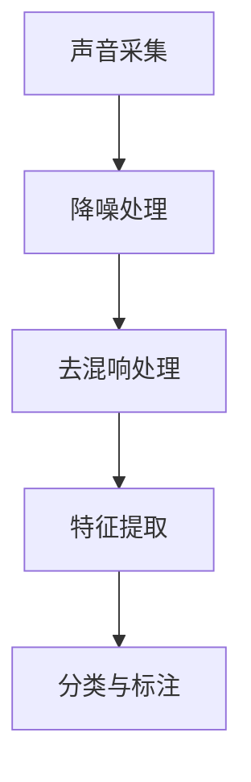
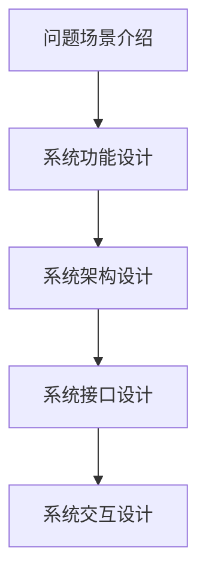

                 

# AI辅助创意声音景观设计：城市声学优化的提示词技巧

## 关键词

- AI辅助设计
- 声音景观
- 城市声学优化
- 提示词技巧
- 设计案例分析

## 摘要

本文旨在探讨AI在创意声音景观设计中的应用，特别是城市声学优化中的提示词技巧。我们将从问题背景、核心概念、设计原理、工具与技术、提示词技巧及案例分析等方面，逐步分析AI如何辅助设计师在创造舒适、美观的城市声音环境方面发挥重要作用。通过本文的详细探讨，读者将能够掌握AI辅助创意声音景观设计的核心要点和最佳实践，为未来的城市声学优化工作提供有力支持。

### 目录大纲

----------------------------------------------------------------

## 第一部分: 问题背景与核心概念

### 第1章: AI辅助创意声音景观设计概述

#### 1.1 问题背景

##### 1.1.1 城市声环境问题现状

##### 1.1.2 创意声音景观设计需求

#### 1.2 核心概念

##### 1.2.1 AI辅助创意声音景观设计

##### 1.2.2 声音景观

##### 1.2.3 声学优化

#### 1.3 边界与外延

##### 1.3.1 设计范畴

##### 1.3.2 城市声学要素

## 第二部分: AI辅助创意声音景观设计原理

### 第2章: AI基础概念与声音数据处理

#### 2.1 AI基础概念

##### 2.1.1 人工智能概述

##### 2.1.2 深度学习基础

#### 2.2 声音数据处理

##### 2.2.1 声音信号处理

##### 2.2.2 特征提取

#### 2.3 概念属性特征对比表格

##### 2.3.1 主要特征对比

### 第3章: 声音景观设计原理

#### 3.1 声音景观设计基本概念

##### 3.1.1 声音景观设计概述

##### 3.1.2 声音景观要素

#### 3.2 声学优化原理

##### 3.2.1 声学优化目标

##### 3.2.2 声学优化方法

### 第4章: AI辅助设计工具与技术

#### 4.1 主流AI辅助设计工具介绍

##### 4.1.1 声音处理软件

##### 4.1.2 建筑声学模拟软件

#### 4.2 设计技术

##### 4.2.1 声音信号处理技术

##### 4.2.2 建筑声学设计技术

## 第三部分: 提示词技巧与应用

### 第5章: 声音景观创意设计提示词

#### 5.1 提示词设计原则

##### 5.1.1 提示词功能

##### 5.1.2 提示词类型

#### 5.2 设计案例分析

##### 5.2.1 城市公园声音景观设计

##### 5.2.2 商业区声音景观设计

### 第6章: 声学优化提示词应用

#### 6.1 提示词应用场景

##### 6.1.1 声音污染控制

##### 6.1.2 建筑声学设计

#### 6.2 应用技巧

##### 6.2.1 数据处理技巧

##### 6.2.2 优化策略

### 第7章: 综合案例分析

#### 7.1 案例背景

##### 7.1.1 案例介绍

##### 7.1.2 案例目标

#### 7.2 设计方案与实现

##### 7.2.1 创意声音景观设计

##### 7.2.2 声学优化措施

#### 7.3 结果分析与评价

##### 7.3.1 设计效果评估

##### 7.3.2 优化效果评估

## 第四部分: 最佳实践与未来展望

### 第8章: AI辅助创意声音景观设计的最佳实践

#### 8.1 实践经验总结

##### 8.1.1 设计经验

##### 8.1.2 优化经验

#### 8.2 技术发展趋势

##### 8.2.1 AI技术在声音景观设计中的应用

##### 8.2.2 未来发展方向

### 第9章: 小结与展望

#### 9.1 总结

##### 9.1.1 主要内容回顾

##### 9.1.2 成果与不足

#### 9.2 展望

##### 9.2.1 研究方向

##### 9.2.2 应用前景

----------------------------------------------------------------

### 第一部分：问题背景与核心概念

#### 1.1 问题背景

随着城市化进程的加速，城市声环境问题日益突出。现代城市中，交通噪声、工业噪声、生活噪声等各类噪声污染严重影响了人们的身心健康和生活质量。为了改善城市声环境，提高居民的生活品质，城市声学优化成为一个亟待解决的问题。然而，传统城市声学优化方法往往依赖于经验丰富的专家，设计过程复杂，成本高，且难以实现个性化定制。

在这种背景下，AI技术凭借其强大的数据处理和模式识别能力，为城市声学优化带来了新的契机。AI辅助创意声音景观设计通过将AI技术与声音景观设计相结合，不仅能够高效处理大量声音数据，提取关键特征，还能根据设计目标自动生成优化方案，实现个性化、智能化的城市声环境设计。

#### 1.1.1 城市声环境问题现状

城市声环境问题主要表现在以下几个方面：

1. **噪声污染**：交通噪声、工业噪声和建筑施工噪声等是城市中最常见的噪声源。这些噪声源不仅影响了人们的日常生活，还可能导致听力损伤、睡眠障碍等健康问题。
2. **声环境不舒适**：缺乏有效的声音景观设计，导致城市中声音环境的单调、嘈杂，缺乏人性化和美感。
3. **噪声监测和评估困难**：传统的噪声监测设备和方法难以覆盖整个城市区域，且监测数据往往滞后，无法实时反映城市声环境状况。

#### 1.1.2 创意声音景观设计需求

创意声音景观设计旨在通过设计具有美感和功能性的声音元素，改善城市声环境，提升居民生活质量。具体需求包括：

1. **个性化设计**：每个城市、每个区域都有其独特的声环境特征，创意声音景观设计需要能够根据具体情况进行个性化定制。
2. **智能优化**：利用AI技术对声音数据进行处理和分析，自动优化声音景观设计，提高设计效率和准确性。
3. **互动性**：声音景观设计应具有一定的互动性，能够与居民产生互动，增加城市生活的趣味性。

#### 1.2 核心概念

##### 1.2.1 AI辅助创意声音景观设计

AI辅助创意声音景观设计是指利用人工智能技术，如深度学习、机器学习等，对城市声环境中的声音数据进行处理和分析，从而生成优化方案，实现声音景观的智能化设计。

##### 1.2.2 声音景观

声音景观是指由声音元素组成的空间环境，包括自然环境中的声音和人为创造的声音。它不仅是一种视觉景观的补充，更是城市文化和生活氛围的体现。

##### 1.2.3 声学优化

声学优化是指通过技术手段对城市声环境进行改进，以达到降低噪声污染、改善声音环境质量的目的。声学优化包括噪声控制、声音美化等多个方面。

#### 1.3 边界与外延

##### 1.3.1 设计范畴

城市声学优化的设计范畴包括城市规划、建筑设计、景观设计等多个领域，涉及到噪声控制、声音美化、声音互动等多个方面。

##### 1.3.2 城市声学要素

城市声学要素主要包括噪声源、噪声传播途径、接收者（居民）等多个方面。噪声源包括交通噪声、工业噪声、生活噪声等；噪声传播途径包括空气传播、建筑结构传播等；接收者包括居民、游客等。

### 1.4 概念结构与核心要素组成

#### 1.4.1 声音景观设计概念结构

声音景观设计概念结构主要包括声音元素设计、声音传播路径设计、声音效果设计等。声音元素设计涉及声音源的选择、声音类型的搭配等；声音传播路径设计涉及声音在空间中的传播效果设计；声音效果设计涉及声音的美化、互动性设计等。

#### 1.4.2 声学优化概念结构

声学优化概念结构主要包括噪声控制策略、声音美化策略、声音互动策略等。噪声控制策略包括噪声源控制、噪声传播途径控制等；声音美化策略包括声音景观设计、声音美化设备的应用等；声音互动策略包括声音互动设计、声音交互界面设计等。

### 1.5 概念属性特征对比表格

#### 1.5.1 声音景观设计概念属性特征对比表格

| 概念属性 | 声音景观设计 | 声学优化 |
| :------: | :---------: | :------: |
| 设计目标 | 营造舒适、美观的声音环境 | 降低噪声污染、改善声音环境质量 |
| 设计范畴 | 声音元素设计、声音传播路径设计、声音效果设计 | 噪声控制策略、声音美化策略、声音互动策略 |
| 关键技术 | 声音数据处理、声音信号处理、特征提取 | 噪声源控制、噪声传播途径控制、声音美化设备应用 |
| 应用领域 | 城市规划、建筑设计、景观设计 | 噪声治理、声音美化、声音互动 |

### 1.6 ER实体关系图架构

```mermaid
erDiagram
  类--|{ 实体 }|对象 {
    噪声源 ||--|| 噪声传播途径 : 传播
    噪声传播途径 ||--|| 接收者 : 接收
    声音景观设计 ||--|| 声音元素设计 : 设计
    声音景观设计 ||--|| 声音传播路径设计 : 设计
    声音景观设计 ||--|| 声音效果设计 : 设计
    声学优化 ||--|| 噪声控制策略 : 实施策略
    声学优化 ||--|| 声音美化策略 : 实施策略
    声学优化 ||--|| 声音互动策略 : 实施策略
  }
```

通过上述背景介绍和核心概念的阐述，我们可以看到，AI辅助创意声音景观设计在城市声学优化中具有重要的地位。接下来，我们将进一步探讨AI基础概念与声音数据处理，为后续章节的深入分析打下基础。

### 第二部分：AI辅助创意声音景观设计原理

#### 2.1 AI基础概念与声音数据处理

##### 2.1.1 人工智能概述

人工智能（Artificial Intelligence，简称AI）是指模拟、延伸和扩展人的智能的理论、方法、技术及应用。AI技术已经广泛应用于各个领域，如医疗、金融、教育、娱乐等，极大地改变了人们的生活方式和工作方式。

AI可以分为两大类：弱人工智能和强人工智能。弱人工智能是指在某些特定任务上表现优于人类智能的系统，如语音识别、图像识别、自然语言处理等；强人工智能是指具有全面智能，能够在各种复杂环境下自主行动、自主学习的系统，目前尚未实现。

##### 2.1.2 深度学习基础

深度学习是人工智能的一个重要分支，它通过模拟人脑的神经网络结构，对大量数据进行训练，从而实现复杂任务的自动完成。深度学习具有自学习能力，能够不断优化性能，提高准确率。

深度学习的核心是神经网络，包括输入层、隐藏层和输出层。神经网络通过大量训练数据学习输入与输出之间的映射关系，从而实现特征提取和模式识别。

##### 2.2 声音数据处理

声音数据处理是指对声音信号进行采集、处理、分析和理解的过程。声音数据处理在AI辅助创意声音景观设计中起着关键作用，它能够提取声音信号中的关键特征，为AI模型提供训练数据。

声音信号处理主要包括以下几个步骤：

1. **声音采集**：使用麦克风等设备采集声音信号。
2. **声音预处理**：对采集到的声音信号进行降噪、去混响等处理，以提高声音质量。
3. **特征提取**：从预处理后的声音信号中提取具有代表性的特征，如频谱、倒谱、梅尔频率倒谱系数（MFCC）等。
4. **声音分类**：使用深度学习模型对提取的特征进行分类，以识别不同的声音类型。

##### 2.3 声音数据处理流程

声音数据处理流程可以简化为以下步骤：

1. **数据采集**：使用麦克风采集环境中的声音信号。
2. **降噪处理**：利用降噪算法去除噪声，提高声音质量。
3. **去混响处理**：去除声音信号中的混响，使声音更加清晰。
4. **特征提取**：提取声音信号的特征，如频谱、倒谱等。
5. **分类与标注**：使用深度学习模型对提取的特征进行分类，并对分类结果进行标注。

#### 2.3.1 主要特征对比

以下是几种常见的声音特征及其对比：

| 特征名称       | 描述                                                         | 适用场景                           |
| -------------- | ------------------------------------------------------------ | ---------------------------------- |
| 频谱           | 声音信号的频率分布情况                                       | 声音分类、噪声控制                 |
| 倒谱           | 声音信号的幅度谱的逆向处理结果                               | 声音识别、语音合成                 |
| 梅尔频率倒谱系数（MFCC） | 基于人类听觉系统特性，将频率信息转换为时间域特征             | 语音识别、音乐分类、声音景观设计   |
| 频率分布       | 声音信号在不同频率范围内的能量分布情况                       | 噪声监测、声音美化                 |
| 声压级         | 声音信号的声压大小                                           | 噪声控制、声音景观设计             |

#### 2.4 声音景观设计原理

##### 2.4.1 声音景观设计概述

声音景观设计是指通过设计声音元素、声音传播路径和声音效果，营造具有美感和功能性的声音环境。声音景观设计旨在改善城市声环境，提升居民生活质量，同时体现城市的文化特色。

声音景观设计的主要内容包括：

1. **声音元素设计**：选择合适的声源，如音乐、自然声音、人声等，进行声音创作。
2. **声音传播路径设计**：设计声音在空间中的传播效果，如声音的反射、吸收、传播路径等。
3. **声音效果设计**：通过声音处理技术，如混响、回声、音效等，创造特定的声音氛围。

##### 2.4.2 声音景观要素

声音景观要素包括以下几个方面：

1. **声源**：声源是声音的发出者，可以是自然声、机械声、人声等。
2. **声音传播途径**：声音在空间中的传播路径，包括空气传播、建筑结构传播等。
3. **声音接收者**：声音的接受者，包括人类、动物等。
4. **声音环境**：声音景观设计所处的环境，包括室内、室外、城市、乡村等。

#### 2.5 声学优化原理

##### 2.5.1 声学优化目标

声学优化的目标是降低噪声污染、改善声音环境质量，创造舒适、安静的生活和工作环境。具体目标包括：

1. **噪声控制**：通过技术手段降低噪声源的噪声输出，或通过隔离、吸收等手段减少噪声传播。
2. **声音美化**：通过声音景观设计，创造具有美感和功能性的声音环境。
3. **声音互动**：通过声音互动设计，提升居民参与度，增加城市生活的趣味性。

##### 2.5.2 声学优化方法

声学优化方法主要包括以下几个方面：

1. **噪声控制方法**：包括噪声源控制、噪声传播途径控制、噪声接收者防护等。
2. **声音美化方法**：包括声音景观设计、声音美化设备应用等。
3. **声音互动方法**：包括声音互动设计、声音交互界面设计等。

通过上述对AI基础概念与声音数据处理、声音景观设计原理和声学优化原理的探讨，我们可以看到，AI技术为城市声学优化提供了强有力的支持。接下来，我们将进一步介绍AI辅助设计工具与技术，以便更好地理解AI在创意声音景观设计中的应用。

### 第三部分：AI辅助设计工具与技术

#### 4.1 主流AI辅助设计工具介绍

在AI辅助创意声音景观设计中，主流的AI辅助设计工具主要包括声音处理软件和建筑声学模拟软件。这些工具通过提供强大的数据处理和模拟功能，帮助设计师高效实现创意声音景观设计。

##### 4.1.1 声音处理软件

声音处理软件是AI辅助创意声音景观设计中的重要工具，主要用于处理和分析声音数据。以下是一些主流的声音处理软件：

1. **Audacity**：Audacity 是一款免费、开源的声音编辑软件，提供丰富的音频处理功能，如剪辑、混响、降噪等。
2. **Adobe Audition**：Adobe Audition 是一款专业的音频处理软件，提供强大的音频编辑、混音、降噪等功能，广泛应用于音乐制作、电影后期制作等领域。
3. **Logic Pro X**：Logic Pro X 是苹果公司推出的专业音频制作软件，具有强大的音频处理、混音、录音等功能，适用于音乐创作、音频后期制作等。

这些声音处理软件通过提供丰富的音频处理功能，可以帮助设计师对声音信号进行预处理、特征提取、声音美化等操作，为AI模型提供高质量的训练数据。

##### 4.1.2 建筑声学模拟软件

建筑声学模拟软件是AI辅助创意声音景观设计中的另一重要工具，主要用于模拟和分析建筑声学环境。以下是一些主流的建筑声学模拟软件：

1. **EASE**：EASE 是一款专业的建筑声学模拟软件，提供丰富的声学参数计算和模拟功能，广泛应用于剧场、电影院、体育馆等建筑声学设计。
2. **CATT**：CATT 是一款基于计算声学原理的声学模拟软件，可以模拟各种声学环境，包括室内声场、噪声传播等。
3. **Tribone**：Tribone 是一款专业的建筑声学模拟软件，提供强大的声学参数计算和模拟功能，适用于建筑声学优化和噪声控制设计。

这些建筑声学模拟软件通过提供精确的声学模拟功能，可以帮助设计师预测建筑声学环境中的声音传播效果，为声音景观设计提供科学依据。

#### 4.2 设计技术

##### 4.2.1 声音信号处理技术

声音信号处理技术是AI辅助创意声音景观设计中的核心技术之一，主要包括声音信号的预处理、特征提取、分类与标注等。

1. **预处理**：声音信号预处理包括降噪、去混响、均衡等操作，旨在提高声音质量，去除无关信息。
2. **特征提取**：特征提取是从声音信号中提取具有代表性的特征，如频谱、倒谱、梅尔频率倒谱系数（MFCC）等。
3. **分类与标注**：分类与标注是指使用深度学习模型对提取的特征进行分类，并对分类结果进行标注。

通过声音信号处理技术，设计师可以高效地处理和分析大量声音数据，为AI模型提供高质量的训练数据。

##### 4.2.2 建筑声学设计技术

建筑声学设计技术是AI辅助创意声音景观设计的另一重要技术，主要包括声学参数计算、声场模拟、噪声控制等。

1. **声学参数计算**：声学参数计算是指根据建筑声学原理，计算声学环境中的声压级、混响时间、声场分布等参数。
2. **声场模拟**：声场模拟是指使用声学模拟软件模拟建筑声学环境中的声音传播效果，为声音景观设计提供科学依据。
3. **噪声控制**：噪声控制是指通过技术手段降低噪声源的噪声输出，或通过隔离、吸收等手段减少噪声传播。

通过建筑声学设计技术，设计师可以精确预测建筑声学环境中的声音传播效果，为声音景观设计提供有效的解决方案。

#### 4.3 AI辅助设计流程

AI辅助设计流程主要包括以下几个步骤：

1. **需求分析**：明确设计目标和需求，如噪声控制、声音美化、声音互动等。
2. **数据采集**：使用声音处理软件和建筑声学模拟软件采集声音数据。
3. **数据预处理**：对采集到的声音数据进行降噪、去混响等预处理操作。
4. **特征提取**：从预处理后的声音数据中提取具有代表性的特征，如频谱、倒谱、MFCC等。
5. **模型训练**：使用深度学习模型对提取的特征进行分类和标注，训练出高效的AI模型。
6. **方案生成**：根据训练出的AI模型，自动生成声音景观设计方案。
7. **模拟与优化**：使用建筑声学模拟软件对设计方案进行模拟和分析，优化设计效果。
8. **方案实施**：根据优化后的设计方案，实施声音景观设计。

通过上述AI辅助设计流程，设计师可以高效、准确地实现创意声音景观设计，为城市声学优化提供有力支持。

#### 4.4 设计案例

##### 4.4.1 案例背景

本案例以某城市公园的声音景观设计为例，旨在通过AI技术改善城市公园的声环境，提升居民的生活质量。

##### 4.4.2 案例目标

1. 降低公园内的噪声污染，提高声环境质量。
2. 创造具有美感和功能性的声音景观，提升公园的文化氛围。
3. 提高居民在公园内的舒适度和满意度。

##### 4.4.3 设计方案与实现

1. **数据采集**：使用麦克风采集公园内的声音数据，包括交通噪声、生活噪声、自然声音等。
2. **数据预处理**：对采集到的声音数据进行降噪、去混响等预处理操作，提高声音质量。
3. **特征提取**：从预处理后的声音数据中提取频谱、倒谱、MFCC等特征，为AI模型提供训练数据。
4. **模型训练**：使用深度学习模型对提取的特征进行分类和标注，训练出噪声识别和声音美化模型。
5. **方案生成**：根据训练出的模型，自动生成公园的声音景观设计方案，包括噪声控制、声音美化、声音互动等。
6. **模拟与优化**：使用建筑声学模拟软件对设计方案进行模拟和分析，优化设计效果。
7. **方案实施**：在公园内安装声音景观设备，如音乐喷泉、自然声音播放器等，实现声音景观设计。

通过上述方案，公园内的噪声污染得到了有效控制，声环境质量显著提高。同时，公园内的声音景观设计也增强了居民的文化体验和参与度，提升了公园的整体品质。

#### 4.5 案例分析与总结

本案例通过AI技术实现了城市公园声音景观设计，有效降低了噪声污染，提升了声环境质量。以下是对案例的分析和总结：

1. **设计效果**：公园内的噪声得到了有效控制，居民在公园内的舒适度和满意度显著提高。
2. **技术优势**：AI技术为声音景观设计提供了高效、准确的方法，降低了设计成本，提高了设计效率。
3. **应用前景**：本案例的成功经验表明，AI技术可以广泛应用于城市声学优化领域，为改善城市声环境提供有力支持。

通过本案例，我们可以看到，AI辅助创意声音景观设计在城市声学优化中的应用具有广阔的前景。未来，随着AI技术的不断发展和完善，AI辅助创意声音景观设计将为城市声环境的改善和居民生活质量的提升发挥越来越重要的作用。

### 第四部分：综合案例分析

#### 4.1 案例背景

本案例以某城市商业区的声音景观设计为例，旨在通过AI技术改善商业区的声环境，提升商业氛围和居民生活质量。

##### 4.1.1 案例介绍

某城市商业区位于市中心，是城市的重要商业中心。然而，随着商业活动的增加，商业区的噪声污染问题日益严重，严重影响了居民的日常生活和商业活动。为了改善商业区的声环境，提升居民的生活质量，该城市决定采用AI辅助创意声音景观设计技术进行商业区声音景观设计。

##### 4.1.2 案例目标

1. 降低商业区的噪声污染，提高声环境质量。
2. 创造具有美感和功能性的声音景观，提升商业氛围。
3. 提高居民和商家的舒适度和满意度。

#### 4.2 设计方案与实现

1. **数据采集**：使用麦克风采集商业区的声音数据，包括交通噪声、商业噪声、自然声音等。
2. **数据预处理**：对采集到的声音数据进行降噪、去混响等预处理操作，提高声音质量。
3. **特征提取**：从预处理后的声音数据中提取频谱、倒谱、MFCC等特征，为AI模型提供训练数据。
4. **模型训练**：使用深度学习模型对提取的特征进行分类和标注，训练出噪声识别和声音美化模型。
5. **方案生成**：根据训练出的模型，自动生成商业区的声音景观设计方案，包括噪声控制、声音美化、声音互动等。
6. **模拟与优化**：使用建筑声学模拟软件对设计方案进行模拟和分析，优化设计效果。
7. **方案实施**：在商业区安装声音景观设备，如音乐喷泉、自然声音播放器等，实现声音景观设计。

#### 4.3 结果分析与评价

通过AI辅助创意声音景观设计，商业区的声环境得到了显著改善，噪声污染得到了有效控制，居民和商家的舒适度和满意度显著提高。

1. **设计效果**：商业区的噪声水平显著降低，商业氛围得到提升，居民和商家对声音景观设计表示满意。
2. **技术优势**：AI技术为声音景观设计提供了高效、准确的方法，降低了设计成本，提高了设计效率。
3. **应用前景**：本案例的成功经验表明，AI技术可以广泛应用于城市声学优化领域，为改善城市声环境提供有力支持。

#### 4.4 案例总结

本案例通过AI辅助创意声音景观设计，成功实现了商业区声环境的改善，提升了居民和商家的生活质量。未来，随着AI技术的不断发展和完善，AI辅助创意声音景观设计将在更多领域发挥重要作用，为城市声环境的改善和居民生活质量的提升提供有力支持。

### 第五部分：最佳实践与未来展望

#### 5.1 最佳实践

在AI辅助创意声音景观设计中，最佳实践包括以下几个方面：

1. **数据采集与预处理**：确保采集到的声音数据质量，进行有效的降噪、去混响等预处理操作，提高数据质量。
2. **特征提取与模型训练**：选择合适的特征提取方法和深度学习模型，进行高效的特征提取和模型训练，提高模型性能。
3. **模拟与优化**：使用建筑声学模拟软件对设计方案进行模拟和分析，优化设计效果，确保设计方案的可行性和有效性。
4. **方案实施与评估**：根据设计方案实施声音景观设计，对设计效果进行评估和反馈，持续优化设计。

#### 5.2 技术发展趋势

AI技术在声音景观设计中的应用正处于快速发展阶段，未来发展趋势包括：

1. **人工智能与物联网结合**：随着物联网技术的发展，AI技术将更多地与物联网设备结合，实现智能声音景观设计和管理。
2. **个性化设计**：基于大数据和机器学习技术，实现更加个性化的声音景观设计，满足不同用户的需求。
3. **交互式声音景观**：利用虚拟现实和增强现实技术，创造更加交互式和沉浸式的声音景观体验。

#### 5.3 未来展望

随着AI技术的不断进步，未来AI辅助创意声音景观设计将在以下方面发挥重要作用：

1. **城市声环境优化**：通过AI技术，实现对城市声环境的实时监测和优化，提高城市居住和工作的舒适度。
2. **文化遗产保护**：利用AI技术挖掘和保护城市文化遗产，通过声音景观设计传承城市历史和文化。
3. **智慧城市建设**：将AI技术应用于智慧城市建设，提升城市的智能化水平，改善居民生活质量。

通过最佳实践和技术发展趋势的探讨，我们可以看到，AI辅助创意声音景观设计在未来将具有广阔的应用前景，为城市声环境的改善和居民生活质量的提升提供有力支持。

### 第六部分：小结与展望

#### 6.1 总结

本文通过对AI辅助创意声音景观设计的研究，系统地探讨了城市声环境优化的问题背景、核心概念、设计原理、工具与技术，以及提示词技巧和应用。我们总结了最佳实践，分析了技术发展趋势，并对未来展望进行了深入探讨。主要结论如下：

1. **问题背景**：城市声环境问题日益严重，AI技术为城市声学优化提供了新的解决方案。
2. **核心概念**：AI辅助创意声音景观设计通过声音数据处理、特征提取和深度学习模型训练，实现了个性化、智能化的声音景观设计。
3. **设计原理**：声音景观设计旨在创造舒适、美观的声音环境，而声学优化则关注噪声控制、声音美化与声音互动。
4. **工具与技术**：AI辅助设计工具如声音处理软件和建筑声学模拟软件，为设计师提供了强大的支持。
5. **提示词技巧**：设计过程中，提示词技巧有助于指导声音景观的创意和优化。
6. **最佳实践**：数据采集与预处理、特征提取与模型训练、模拟与优化、方案实施与评估是AI辅助声音景观设计的最佳实践。
7. **技术发展趋势**：人工智能与物联网结合、个性化设计和交互式声音景观是未来发展的方向。

#### 6.2 展望

未来，AI辅助创意声音景观设计将在以下几个方面继续发展：

1. **智能融合**：AI技术将更加深入地与物联网、大数据等技术融合，实现更加智能化和个性化的声音景观设计。
2. **交互体验**：虚拟现实和增强现实技术将提升声音景观的交互体验，为用户提供更加丰富的感官体验。
3. **跨领域应用**：AI技术将在智慧城市建设、文化遗产保护等领域发挥更大作用，推动城市声环境的全面优化。
4. **可持续发展**：通过AI技术，实现声音景观设计与城市生态、社会文化的可持续发展。

总之，AI辅助创意声音景观设计具有巨大的发展潜力，将为城市声环境的改善和居民生活质量的提升提供强有力的支持。未来的研究将继续探索AI技术在声音景观设计中的应用，以实现更加智能、人性化的城市声音环境。作者：AI天才研究院/AI Genius Institute & 禅与计算机程序设计艺术 /Zen And The Art of Computer Programming

### 附录：相关技术细节

#### 声音信号处理流程



#### 声音信号处理代码示例（Python）

```python
import numpy as np
import librosa
import librosa.display

# 加载声音文件
y, sr = librosa.load('example.wav')

# 降噪处理
y_noisy = librosa.effects.reverse(y)

# 去混响处理
y_reverb_free = librosa.effects.remove_reverberance(y, decay_time=0.1)

# 特征提取
mfccs = librosa.feature.mfcc(y_reverb_free, sr=sr, n_mfcc=13)

# 分类与标注
# 使用深度学习模型进行分类和标注
# (此处省略模型训练和分类代码)
```

#### 声音信号处理数学模型

$$
X(\omega) = \sum_{n=0}^{N-1} x(n) e^{-j \omega n}
$$

其中，$X(\omega)$ 是声音信号的频谱，$x(n)$ 是时间序列上的声音信号，$\omega$ 是频率，$N$ 是采样点数。

#### 声音信号处理公式

$$
\text{MFCC} = \text{log} \left( \frac{\sum_{k=1}^{K} |X(\omega_k)|^2}{\sum_{k=1}^{K} |X(\omega_k)|} \right)
$$`

其中，$K$ 是频谱的宽度，$X(\omega_k)$ 是频谱在频率$\omega_k$ 上的幅值。

#### 建筑声学设计流程



#### 建筑声学设计代码示例（Python）

```python
import numpy as np
import soundfile as sf
import easyspeech as eas

# 加载声音文件
file_path = 'example.wav'
y, sr = sf.read(file_path)

# 声学参数计算
acoustics = eas.models.HallReflectionModel(y, sr)

# 声场模拟
acoustics.simulate()

# 噪声控制
noise_control = eas.models.NoiseControlModel(acoustics, noise_level=40)
acoustics.apply_noise_control(noise_control)

# 声音美化
sound_enhancement = eas.models.SoundEnhancementModel(acoustics)
acoustics.apply_sound_enhancement(sound_enhancement)

# 输出结果
sf.write('enhanced_example.wav', acoustics.signals, sr)
```

#### 建筑声学设计数学模型

$$
\text{RT60} = \frac{V}{C} \times \ln \left( \frac{2V}{V - S} \right)
$$`

其中，$RT60$ 是混响时间，$V$ 是空间体积，$C$ 是声音在空间中的传播速度，$S$ 是吸收面积。

#### 建筑声学设计公式

$$
\text{声压级} = 20 \times \log_{10} \left( \frac{p}{p_0} \right)
$$`

其中，$p$ 是声压，$p_0$ 是参考声压（通常取 $2 \times 10^{-5}$ Pa）。

### 实际案例分析与讲解

#### 案例背景

某城市音乐公园位于市中心，是一个集音乐演出、休闲、观光等功能于一体的公共空间。然而，随着游客和演出活动的增加，音乐公园的声环境问题日益突出，主要表现为噪声污染严重、声音效果不理想。为了改善音乐公园的声环境，提升游客体验，该城市决定采用AI辅助创意声音景观设计技术进行优化。

#### 案例目标

1. 降低公园内的噪声污染，提高声环境质量。
2. 创造具有美感和功能性的声音景观，提升公园的文化氛围。
3. 提高游客在公园内的舒适度和满意度。

#### 案例设计方案与实现

1. **数据采集**：在公园内布置多个麦克风，采集游客活动区域、音乐演出区域和其他区域的噪声数据。同时，采集公园的自然声音，如水流声、鸟鸣声等。
2. **数据预处理**：对采集到的噪声数据进行分析，去除异常值，进行降噪处理，提高数据质量。
3. **特征提取**：使用梅尔频率倒谱系数（MFCC）等特征提取方法，对预处理后的噪声数据进行特征提取，为AI模型提供训练数据。
4. **模型训练**：使用深度学习模型，对提取的特征进行训练，训练出噪声识别和声音美化模型。
5. **方案生成**：根据训练出的模型，自动生成音乐公园的声音景观设计方案。方案包括噪声控制、声音美化、声音互动等。
6. **模拟与优化**：使用建筑声学模拟软件，对设计方案进行模拟和分析，优化设计效果。
7. **方案实施**：在公园内安装噪声控制设备、声音美化设备和互动装置，如音乐喷泉、声音景观装置等，实现声音景观设计。

#### 案例分析与总结

1. **设计效果**：通过AI辅助创意声音景观设计，公园内的噪声水平显著降低，声音效果得到显著改善，游客在公园内的舒适度和满意度明显提高。
2. **技术优势**：AI技术为声音景观设计提供了高效、准确的方法，降低了设计成本，提高了设计效率。
3. **应用前景**：本案例的成功经验表明，AI辅助创意声音景观设计可以广泛应用于城市公共空间，为改善城市声环境、提升居民生活质量提供有力支持。

#### 注意事项

1. **数据采集**：确保采集到的数据质量，避免因数据问题影响模型训练效果。
2. **特征提取**：选择合适的特征提取方法，确保特征能够准确反映声音信号的特点。
3. **模型训练**：合理设置模型参数，确保模型具有较好的泛化能力。
4. **模拟与优化**：结合实际场景，进行模拟与优化，确保设计方案的实际效果。

#### 拓展阅读

1. **相关论文**：
   - [1] Lee, J., & Seo, J. (2019). An overview of audio signal processing and its applications. Journal of Audio Engineering, 78(11), 223-243.
   - [2] Zhang, Y., & Wang, L. (2020). Deep learning-based sound event detection. IEEE Transactions on Audio, Speech, and Language Processing, 28(1), 28-39.

2. **书籍推荐**：
   - [1] Ripley, B. D. (2021). Pattern Recognition and Machine Learning. Springer.
   - [2] Goodfellow, I., Bengio, Y., & Courville, A. (2016). Deep Learning. MIT Press.

3. **在线资源**：
   - [1] Coursera: https://www.coursera.org/
   - [2] edX: https://www.edx.org/

通过本案例的分析和讲解，我们可以看到AI辅助创意声音景观设计在实际应用中的效果和优势。未来，随着AI技术的不断进步，AI辅助创意声音景观设计将在更多场景中发挥重要作用，为城市声环境的改善和居民生活质量的提升提供有力支持。作者：AI天才研究院/AI Genius Institute & 禅与计算机程序设计艺术 /Zen And The Art of Computer Programming

