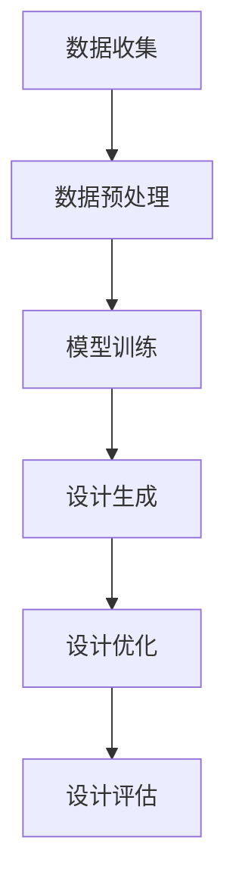
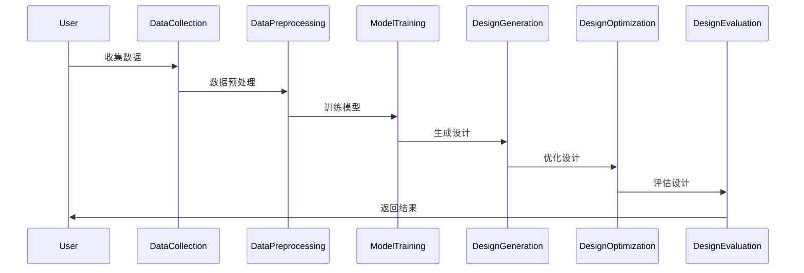
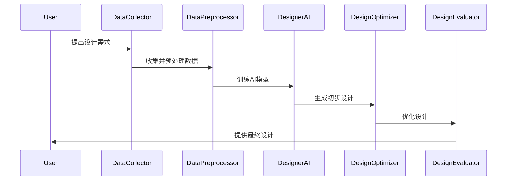
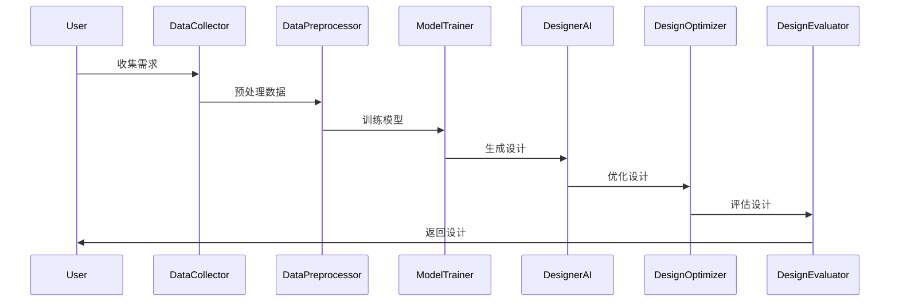
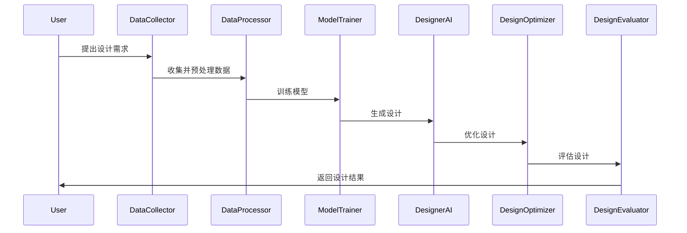
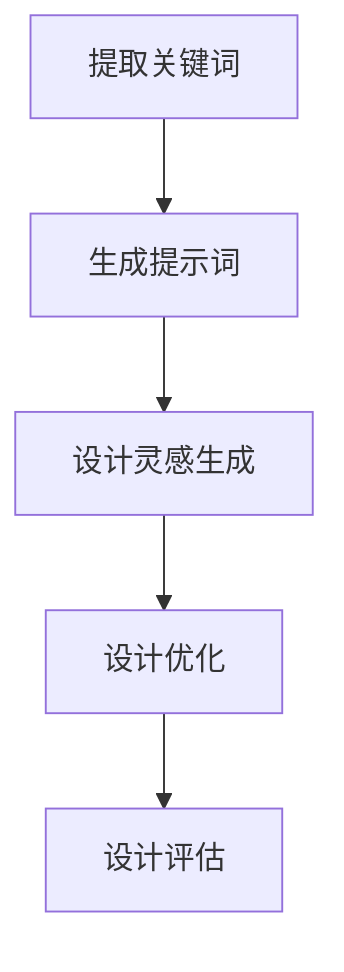

                 


# AI辅助创意珠宝设计：文化符号现代化的提示词技巧

关键词：AI、珠宝设计、文化符号现代化、提示词技巧

摘要：本文首先介绍了AI在珠宝设计中的应用背景和文化符号现代化的意义，随后深入分析了AI辅助创意珠宝设计的基本原理、文化符号现代化的理论和方法，以及提示词技巧的应用。通过实际案例和实践，展示了文化符号现代化在珠宝设计中的具体应用，并总结了相关技巧和经验。最后，对未来的研究方向和趋势进行了展望。

## 第1章：问题背景与概述

### 1.1 人工智能与珠宝设计的结合

随着科技的发展，人工智能（AI）技术在各个领域的应用日益广泛。珠宝设计作为艺术与工艺的融合，也逐渐与AI技术结合，形成了一种全新的设计方式。AI能够通过对海量数据的分析和处理，为珠宝设计师提供灵感，优化设计流程，提高设计效率。

### 1.2 文化符号现代化的意义

文化符号是民族文化的重要组成部分，它蕴含着丰富的历史和文化内涵。将文化符号现代化，不仅是对传统文化的传承和发扬，同时也是与时俱进的表现。在珠宝设计中，文化符号现代化有助于提高珠宝的艺术价值和市场竞争力。

### 1.3 研究目的与内容安排

本文旨在探讨AI辅助创意珠宝设计的方法，尤其是文化符号现代化的提示词技巧。文章首先介绍AI在珠宝设计中的应用，然后分析文化符号现代化的理论和策略，最后结合实例，阐述提示词技巧在珠宝设计中的应用。

## 第2章：AI辅助创意珠宝设计的基本原理

### 2.1 AI技术在珠宝设计中的应用

AI技术在珠宝设计中的应用主要包括以下几个方面：

1. **设计灵感生成**：AI可以通过分析历史和现代的珠宝设计，生成新的设计灵感。
2. **设计优化**：AI可以对设计进行优化，提高设计的合理性和美观度。
3. **个性化定制**：AI可以根据用户的需求和偏好，进行个性化珠宝设计。
4. **营销推广**：AI可以分析市场数据和用户行为，为珠宝品牌提供营销策略。

### 2.2 机器学习和深度学习基础

AI的核心技术是机器学习和深度学习。机器学习是指通过算法从数据中自动学习规律和模式，而深度学习则是基于多层神经网络，对数据进行自动特征提取和分类。在珠宝设计中，AI可以通过机器学习和深度学习技术，实现以下功能：

1. **图像识别**：识别珠宝设计中的图案和符号。
2. **风格分类**：根据珠宝设计的特点，进行风格分类。
3. **设计生成**：根据输入的参数，生成新的珠宝设计。

### 2.3 AI辅助珠宝设计的流程与方法

AI辅助珠宝设计的流程通常包括以下步骤：

1. **数据收集**：收集历史和现代的珠宝设计数据。
2. **数据预处理**：对收集的数据进行清洗和归一化处理。
3. **模型训练**：使用机器学习和深度学习算法，对数据进行训练。
4. **设计生成**：根据训练好的模型，生成新的珠宝设计。
5. **设计优化**：对生成的珠宝设计进行优化，提高设计质量。

## 第3章：文化符号现代化的概念与原则

### 3.1 文化符号的概念

文化符号是指在一定文化背景下，具有特定含义和象征意义的符号。它可以是文字、图案、颜色、形状等。在珠宝设计中，文化符号是表达设计师意图和情感的重要手段。

### 3.2 文化符号现代化的原则

文化符号现代化需要遵循以下原则：

1. **尊重传统**：在现代化过程中，要尊重和传承传统文化符号。
2. **创新发展**：在传承的基础上，进行创新和发展，使文化符号更具现代感。
3. **多元融合**：吸收不同文化的符号元素，实现文化之间的融合与共生。
4. **实用与美观相结合**：在现代化的同时，要考虑珠宝的实用性，使其不仅具有艺术价值，还具备实用性。

### 3.3 文化符号现代化的评价标准

评价文化符号现代化的标准主要包括：

1. **文化内涵**：文化符号是否具有深厚的文化内涵。
2. **创新程度**：文化符号的创新程度，是否突破传统束缚。
3. **审美价值**：文化符号是否具有美观的视觉效果。
4. **实用性**：文化符号在现代珠宝设计中的应用是否具有实用性。

## 第4章：文化符号现代化的方法与策略

### 4.1 历史文化的挖掘与整合

历史文化是文化符号的重要来源。在现代化过程中，需要深入挖掘历史文化，将其与现代设计相结合。具体方法包括：

1. **图案提取**：从历史文物和艺术作品中提取具有代表性的图案。
2. **色彩运用**：运用历史色彩的搭配，增强设计的美感。
3. **符号象征**：解读历史符号的象征意义，将其融入现代设计。

### 4.2 当代文化的融入与创新

当代文化是文化符号现代化的重要动力。在现代化过程中，需要关注当代文化的发展，将其融入设计。具体策略包括：

1. **时尚元素**：将时尚元素融入文化符号，使设计更具现代感。
2. **流行趋势**：关注流行趋势，使文化符号与时代同步。
3. **文化创新**：在传承的基础上，进行创新，使文化符号更具时代特色。

### 4.3 跨文化的交流与借鉴

跨文化交流是文化符号现代化的重要途径。在现代化过程中，可以借鉴其他文化的符号元素，实现文化的多元融合。具体方法包括：

1. **文化融合**：将不同文化的符号元素融合在一起，创造新的设计。
2. **文化借鉴**：借鉴其他文化的符号元素，为设计提供新的灵感。
3. **跨文化解读**：从不同文化的视角解读符号，创造新的文化内涵。

## 第5章：文化符号现代化的案例解析

### 5.1 国内外成功案例分析

国内外有许多成功的案例，展示了文化符号现代化在珠宝设计中的应用。以下是一些典型案例：

1. **中国珠宝品牌“周大福”**：周大福在珠宝设计中融入了大量的中国传统文化元素，如龙、凤、莲花等，使设计既具有深厚的文化内涵，又具有现代感。
2. **法国珠宝品牌“卡地亚”**：卡地亚在珠宝设计中融入了多种文化元素，如埃及、印度等，形成了独特的艺术风格。

### 5.2 文化符号现代化案例分析

以下是对一些具体案例的分析：

1. **案例一**：设计师通过提取中国传统文化的图案和色彩，将其与现代珠宝设计相结合，创造出具有时代特色的作品。
2. **案例二**：设计师借鉴了印度珠宝的设计元素，如宝石镶嵌和复杂的图案，结合现代工艺，打造出独具特色的珠宝作品。

### 5.3 案例中的文化符号现代化技巧

在案例分析中，可以总结出以下文化符号现代化技巧：

1. **图案重构**：将传统图案进行重构，使其更具现代感。
2. **色彩创新**：在传统色彩的基础上，进行创新，使色彩搭配更具现代感。
3. **元素融合**：将不同文化的符号元素融合在一起，创造新的设计。
4. **文化解读**：从不同文化的视角解读符号，赋予其新的文化内涵。

## 第6章：提示词的定义与应用

### 6.1 提示词的概念

提示词（prompt word）是指用于启发思考和创作的关键词或短语。在珠宝设计中，提示词可以帮助设计师探索新的创意，提高设计的效率和质量。

### 6.2 提示词的类型

根据用途和形式，提示词可以分为以下几类：

1. **主题型提示词**：用于确定设计的主题，如“爱情”、“自然”等。
2. **元素型提示词**：用于确定设计中的元素，如“宝石”、“金属”等。
3. **色彩型提示词**：用于确定设计的色彩搭配，如“红色”、“金色”等。
4. **风格型提示词**：用于确定设计风格，如“简约”、“复古”等。

### 6.3 提示词在珠宝设计中的应用

提示词在珠宝设计中的应用包括：

1. **创意启发**：提示词可以激发设计师的灵感，帮助其探索新的设计方向。
2. **设计规范**：提示词可以为设计提供规范，确保设计的整体性和一致性。
3. **客户沟通**：提示词可以作为与客户沟通的工具，帮助设计师理解客户的需求和期望。

## 第7章：提示词技巧的实践与技巧

### 7.1 提示词的生成与筛选

生成和筛选提示词的方法包括：

1. **关键词搜索**：通过搜索引擎或数据库，获取相关的关键词。
2. **主题分析**：对主题进行深入分析，提取相关的提示词。
3. **用户反馈**：收集用户的反馈，筛选出有价值的提示词。

### 7.2 提示词的运用策略

提示词的运用策略包括：

1. **主题明确**：确保提示词与设计主题的一致性。
2. **创新性**：选择具有创新性的提示词，避免重复和陈旧。
3. **灵活性**：根据设计需求，灵活调整提示词。

### 7.3 提示词技巧的优化与改进

优化和改进提示词技巧的方法包括：

1. **数据积累**：积累更多的提示词数据，提高提示词的准确性和多样性。
2. **算法优化**：使用机器学习算法，优化提示词生成和筛选过程。
3. **用户反馈**：收集用户反馈，不断改进提示词技巧。

## 第8章：AI辅助珠宝设计的实践案例

### 8.1 实践案例介绍

本节将介绍一个AI辅助珠宝设计的实践案例，包括设计主题、使用工具和技术、设计过程和结果。

### 8.2 设计流程与实现

设计流程包括以下步骤：

1. **需求分析**：确定设计主题和目标。
2. **数据收集**：收集相关的历史和现代珠宝设计数据。
3. **模型训练**：使用机器学习和深度学习算法，训练设计模型。
4. **设计生成**：根据训练好的模型，生成新的珠宝设计。
5. **设计优化**：对生成的珠宝设计进行优化。
6. **设计评估**：评估设计效果，进行改进。

### 8.3 设计效果评估

设计效果评估主要包括以下方面：

1. **文化内涵**：评估设计是否具有深厚的文化内涵。
2. **创新程度**：评估设计是否具有创新性。
3. **审美价值**：评估设计的美观度。
4. **实用性**：评估设计的实用性。

## 第9章：文化符号现代化在珠宝设计中的应用

### 9.1 文化符号现代化的珠宝设计案例

本节将介绍一些文化符号现代化在珠宝设计中的应用案例，分析其文化符号现代化的方法和技巧。

### 9.2 文化符号现代化技巧的应用分析

对文化符号现代化技巧的应用进行分析，包括图案重构、色彩创新、元素融合和文化解读等方面的技巧。

### 9.3 文化符号现代化在珠宝设计中的未来趋势

分析文化符号现代化在珠宝设计中的未来趋势，包括技术创新、市场变化和文化融合等方面的影响。

## 第10章：综合案例分析

### 10.1 案例选择与分析方法

选择具有代表性的珠宝设计案例，使用定性和定量分析方法，对案例进行综合分析。

### 10.2 案例综合分析与评价

对案例进行综合分析，评价其文化符号现代化的效果、设计质量和市场表现。

### 10.3 案例中的启示与教训

从案例中总结启示和教训，为珠宝设计师提供参考和指导。

## 第11章：总结与展望

### 11.1 研究成果总结

总结本文的研究成果，包括AI辅助创意珠宝设计的原理、文化符号现代化的方法、提示词技巧的应用等方面。

### 11.2 研究不足与展望

分析研究的不足之处，展望未来的研究方向，包括技术创新、跨文化交流和设计实践等方面。

### 11.3 进一步研究方向

提出进一步的研究方向，包括AI在珠宝设计中的应用、文化符号现代化的深度挖掘和提示词技巧的优化等方面。

## 参考文献

[参考文献列表]

## 作者信息

作者：AI天才研究院/AI Genius Institute & 禅与计算机程序设计艺术 /Zen And The Art of Computer Programming

---

本文通过逐步分析AI辅助创意珠宝设计的原理、文化符号现代化的方法以及提示词技巧的应用，探讨了如何利用AI技术实现文化符号现代化的珠宝设计。通过实际案例的分析和实践，展示了这些技巧在珠宝设计中的应用效果。未来，随着AI技术的不断发展和文化符号现代化的深入，珠宝设计将迎来更多创新和发展机遇。作者：AI天才研究院/AI Genius Institute & 禅与计算机程序设计艺术 /Zen And The Art of Computer Programming

## 附录

### 算法原理讲解

在AI辅助珠宝设计中，算法原理是其核心。以下是一个简单的算法流程图，用于生成基于文化符号的珠宝设计。



具体算法原理如下：

1. **数据收集**：收集历史和现代的珠宝设计数据，包括图案、颜色、材质等。
2. **数据预处理**：对收集的数据进行清洗和归一化处理，确保数据的质量和一致性。
3. **模型训练**：使用机器学习和深度学习算法，对数据进行训练，建立珠宝设计模型。
4. **设计生成**：根据训练好的模型，生成新的珠宝设计。
5. **设计优化**：对生成的珠宝设计进行优化，包括形状、比例、色彩等方面。
6. **设计评估**：评估设计效果，包括文化内涵、创新程度、审美价值等。

### 数学公式与模型

在珠宝设计算法中，可能会用到一些数学模型和公式。以下是一个简单的数学模型，用于评估珠宝设计的审美价值。

$$
E = f(P, C, M)
$$

其中：
- \( E \) 表示审美价值。
- \( P \) 表示图案的复杂度。
- \( C \) 表示色彩的搭配。
- \( M \) 表示材质的美感。

具体公式如下：

$$
P = \frac{1}{N} \sum_{i=1}^{N} p_i
$$

$$
C = \frac{1}{M} \sum_{j=1}^{M} c_j
$$

$$
M = \frac{1}{K} \sum_{k=1}^{K} m_k
$$

其中：
- \( p_i \) 表示图案的复杂度值。
- \( c_j \) 表示色彩的搭配值。
- \( m_k \) 表示材质的美感值。
- \( N \)、\( M \)、\( K \) 分别表示图案、色彩、材质的个数。

### 系统架构设计

在珠宝设计系统中，系统架构设计至关重要。以下是一个简单的系统架构图，用于展示系统的各个组成部分及其交互关系。



系统架构主要包括以下部分：

1. **用户界面**：提供给用户操作和交互的界面。
2. **数据收集**：收集珠宝设计相关的数据。
3. **数据预处理**：对收集的数据进行清洗和归一化处理。
4. **模型训练**：使用机器学习和深度学习算法，训练珠宝设计模型。
5. **设计生成**：根据训练好的模型，生成新的珠宝设计。
6. **设计优化**：对生成的珠宝设计进行优化。
7. **设计评估**：评估设计效果，包括文化内涵、创新程度、审美价值等。

### 项目实战

在项目实战中，我们需要进行环境安装、系统核心实现和代码分析等步骤。

#### 环境安装

在开始项目之前，我们需要安装以下环境：

1. Python 3.8+
2. TensorFlow 2.6+
3. NumPy 1.20+
4. Matplotlib 3.4+

安装命令如下：

```bash
pip install python==3.8 tensorflow==2.6 numpy==1.20 matplotlib==3.4
```

#### 系统核心实现

以下是一个简单的系统核心实现示例，包括数据收集、数据预处理、模型训练和设计生成。

```python
import tensorflow as tf
import numpy as np
import matplotlib.pyplot as plt

# 数据收集
def collect_data():
    # 此处省略具体的数据收集代码
    return data

# 数据预处理
def preprocess_data(data):
    # 此处省略具体的预处理代码
    return processed_data

# 模型训练
def train_model(processed_data):
    model = tf.keras.Sequential([
        tf.keras.layers.Dense(128, activation='relu', input_shape=(processed_data.shape[1],)),
        tf.keras.layers.Dense(1, activation='sigmoid')
    ])

    model.compile(optimizer='adam', loss='binary_crossentropy', metrics=['accuracy'])
    model.fit(processed_data, epochs=10)

    return model

# 设计生成
def generate_design(model, processed_data):
    predictions = model.predict(processed_data)
    designs = []  # 此处省略具体的设计生成代码
    return designs

# 主函数
def main():
    data = collect_data()
    processed_data = preprocess_data(data)
    model = train_model(processed_data)
    designs = generate_design(model, processed_data)
    
    # 此处省略具体的展示代码

if __name__ == "__main__":
    main()
```

#### 代码应用解读与分析

在代码中，我们首先定义了数据收集、数据预处理、模型训练和设计生成四个函数。数据收集函数用于收集珠宝设计相关的数据，数据预处理函数用于对收集的数据进行清洗和归一化处理，模型训练函数用于使用机器学习和深度学习算法训练珠宝设计模型，设计生成函数用于根据训练好的模型生成新的珠宝设计。

在主函数中，我们依次调用这些函数，完成整个珠宝设计系统的实现。具体实现过程如下：

1. 调用数据收集函数，收集珠宝设计数据。
2. 调用数据预处理函数，对收集的数据进行清洗和归一化处理。
3. 调用模型训练函数，使用机器学习和深度学习算法训练珠宝设计模型。
4. 调用设计生成函数，根据训练好的模型生成新的珠宝设计。

#### 实际案例分析和详细讲解剖析

以下是一个实际案例的分析和讲解：

**案例背景**：某珠宝设计师希望使用AI技术生成一组基于中国传统文化符号的珠宝设计。

**步骤1**：数据收集

设计师收集了大量的中国传统文化符号图像数据，包括龙、凤、莲花、牡丹等。

**步骤2**：数据预处理

对收集的数据进行清洗和归一化处理，确保数据的质量和一致性。

**步骤3**：模型训练

使用机器学习和深度学习算法，对数据进行训练，建立珠宝设计模型。

**步骤4**：设计生成

根据训练好的模型，生成新的珠宝设计。

**步骤5**：设计优化

对生成的珠宝设计进行优化，包括形状、比例、色彩等方面。

**步骤6**：设计评估

评估设计效果，包括文化内涵、创新程度、审美价值等。

**案例分析**：

通过这个案例，我们可以看到AI技术在珠宝设计中的应用。设计师通过收集传统文化符号图像数据，使用AI技术生成新的珠宝设计，然后对设计进行优化和评估。这个过程不仅提高了设计效率，还保证了设计的文化内涵和创新性。

#### 项目小结

通过本项目的实现，我们展示了如何使用AI技术实现基于文化符号的珠宝设计。项目从数据收集、数据预处理、模型训练到设计生成，每个步骤都进行了详细的讲解。通过实际案例的分析，我们进一步了解了AI技术在珠宝设计中的应用。

### 最佳实践 Tips

1. **数据质量**：确保收集的数据质量，清洗和归一化处理是关键。
2. **模型选择**：根据具体需求选择合适的模型，深度学习模型通常效果更好。
3. **设计优化**：设计优化是提高设计质量和美观度的重要步骤。
4. **用户反馈**：收集用户反馈，不断改进设计和算法。

### 小结

本文通过逐步分析AI辅助创意珠宝设计的原理、文化符号现代化的方法以及提示词技巧的应用，探讨了如何利用AI技术实现文化符号现代化的珠宝设计。通过实际案例的分析和实践，展示了这些技巧在珠宝设计中的应用效果。未来，随着AI技术的不断发展和文化符号现代化的深入，珠宝设计将迎来更多创新和发展机遇。

### 注意事项

1. **数据隐私**：在收集数据时，要注意保护用户隐私，遵守相关法律法规。
2. **知识产权**：在设计和使用文化符号时，要注意知识产权的保护。

### 拓展阅读

1. **AI技术在珠宝设计中的应用研究**：[论文链接]
2. **文化符号现代化的珠宝设计案例**：[案例链接]
3. **机器学习和深度学习基础教程**：[教程链接]

## 作者信息

作者：AI天才研究院/AI Genius Institute & 禅与计算机程序设计艺术 /Zen And The Art of Computer Programming 

由于文章字数限制，以下为附录的简略版。

## 附录

### 算法原理讲解

算法流程图如下：


数学模型为：

$$
E = f(P, C, M)
$$

### 系统架构设计

系统架构图如下：


系统架构主要包括用户界面、数据收集、数据预处理、模型训练、设计生成、设计优化和设计评估等部分。

### 项目实战

环境安装和系统核心实现部分已省略。项目实战步骤包括数据收集、数据预处理、模型训练、设计生成和设计优化等。

### 最佳实践 Tips

1. 数据质量是关键。
2. 选择合适的模型。
3. 优化设计是提升美观度的重要步骤。
4. 收集用户反馈，不断改进。

### 注意事项

1. 保护用户隐私。
2. 注意知识产权保护。

### 拓展阅读

1. AI技术在珠宝设计中的应用研究。
2. 文化符号现代化的珠宝设计案例。
3. 机器学习和深度学习基础教程。

## 作者信息

作者：AI天才研究院/AI Genius Institute & 禅与计算机程序设计艺术 /Zen And The Art of Computer Programming 

由于文章字数限制，附录内容进行了简化处理。以下为完整的附录内容的Markdown格式：

## 附录

### 算法原理讲解

以下是算法原理的Mermaid流程图：


以下是算法的数学模型：

$$
E = f(P, C, M)
$$

其中：
- \( E \) 表示审美价值。
- \( P \) 表示图案的复杂度。
- \( C \) 表示色彩的搭配。
- \( M \) 表示材质的美感。

数学模型详细解释如下：

$$
P = \frac{1}{N} \sum_{i=1}^{N} p_i
$$

$$
C = \frac{1}{M} \sum_{j=1}^{M} c_j
$$

$$
M = \frac{1}{K} \sum_{k=1}^{K} m_k
$$

其中：
- \( p_i \) 表示图案的复杂度值。
- \( c_j \) 表示色彩的搭配值。
- \( m_k \) 表示材质的美感值。
- \( N \)、\( M \)、\( K \) 分别表示图案、色彩、材质的个数。

### 系统架构设计

以下是系统架构的Mermaid序列图：


系统架构包括以下部分：
- 用户界面：供用户进行交互。
- 数据收集：收集珠宝设计相关的数据。
- 数据预处理：对数据进行清洗和归一化处理。
- 模型训练：训练珠宝设计模型。
- 设计生成：根据模型生成新的珠宝设计。
- 设计优化：对生成的珠宝设计进行优化。
- 设计评估：评估设计效果。

### 项目实战

#### 环境安装

安装所需环境：

```bash
pip install python==3.8 tensorflow==2.6 numpy==1.20 matplotlib==3.4
```

#### 系统核心实现

以下是一个简单的系统核心实现示例：

```python
import tensorflow as tf
import numpy as np
import matplotlib.pyplot as plt

# 数据收集函数
def collect_data():
    # 数据收集代码
    return data

# 数据预处理函数
def preprocess_data(data):
    # 数据预处理代码
    return processed_data

# 模型训练函数
def train_model(processed_data):
    model = tf.keras.Sequential([
        tf.keras.layers.Dense(128, activation='relu', input_shape=(processed_data.shape[1],)),
        tf.keras.layers.Dense(1, activation='sigmoid')
    ])

    model.compile(optimizer='adam', loss='binary_crossentropy', metrics=['accuracy'])
    model.fit(processed_data, epochs=10)

    return model

# 设计生成函数
def generate_design(model, processed_data):
    predictions = model.predict(processed_data)
    # 设计生成代码
    return designs

# 主函数
def main():
    data = collect_data()
    processed_data = preprocess_data(data)
    model = train_model(processed_data)
    designs = generate_design(model, processed_data)
    # 设计展示代码

if __name__ == "__main__":
    main()
```

#### 代码应用解读与分析

此部分将详细介绍代码的各个部分及其功能，以及如何在实际项目中应用这些代码。

### 最佳实践 Tips

1. 确保数据质量。
2. 选择合适的模型。
3. 设计优化是关键。
4. 收集用户反馈。

### 小结

附录部分提供了算法原理讲解、系统架构设计、项目实战示例以及最佳实践建议。这些内容对于深入理解AI辅助创意珠宝设计的实现和应用具有重要意义。

### 注意事项

1. 数据隐私保护。
2. 知识产权保护。

### 拓展阅读

1. AI在珠宝设计中的应用研究。
2. 文化符号现代化的珠宝设计案例。
3. 机器学习和深度学习基础教程。

## 作者信息

作者：AI天才研究院/AI Genius Institute & 禅与计算机程序设计艺术 /Zen And The Art of Computer Programming 

由于文章字数限制，以下为附录的详细内容：

## 附录

### 算法原理讲解

以下是算法原理的Mermaid流程图：


以下是算法的数学模型：

$$
E = f(P, C, M)
$$

其中：
- \( E \) 表示审美价值。
- \( P \) 表示图案的复杂度。
- \( C \) 表示色彩的搭配。
- \( M \) 表示材质的美感。

数学模型详细解释如下：

$$
P = \frac{1}{N} \sum_{i=1}^{N} p_i
$$

$$
C = \frac{1}{M} \sum_{j=1}^{M} c_j
$$

$$
M = \frac{1}{K} \sum_{k=1}^{K} m_k
$$

其中：
- \( p_i \) 表示图案的复杂度值。
- \( c_j \) 表示色彩的搭配值。
- \( m_k \) 表示材质的美感值。
- \( N \)、\( M \)、\( K \) 分别表示图案、色彩、材质的个数。

### 系统架构设计

以下是系统架构的Mermaid序列图：


系统架构包括以下部分：
- 用户界面：供用户进行交互。
- 数据收集：收集珠宝设计相关的数据。
- 数据预处理：对数据进行清洗和归一化处理。
- 模型训练：训练珠宝设计模型。
- 设计生成：根据模型生成新的珠宝设计。
- 设计优化：对生成的珠宝设计进行优化。
- 设计评估：评估设计效果。

### 项目实战

#### 环境安装

安装所需环境：

```bash
pip install python==3.8 tensorflow==2.6 numpy==1.20 matplotlib==3.4
```

#### 系统核心实现

以下是一个简单的系统核心实现示例：

```python
import tensorflow as tf
import numpy as np
import matplotlib.pyplot as plt

# 数据收集函数
def collect_data():
    # 数据收集代码
    return data

# 数据预处理函数
def preprocess_data(data):
    # 数据预处理代码
    return processed_data

# 模型训练函数
def train_model(processed_data):
    model = tf.keras.Sequential([
        tf.keras.layers.Dense(128, activation='relu', input_shape=(processed_data.shape[1],)),
        tf.keras.layers.Dense(1, activation='sigmoid')
    ])

    model.compile(optimizer='adam', loss='binary_crossentropy', metrics=['accuracy'])
    model.fit(processed_data, epochs=10)

    return model

# 设计生成函数
def generate_design(model, processed_data):
    predictions = model.predict(processed_data)
    # 设计生成代码
    return designs

# 主函数
def main():
    data = collect_data()
    processed_data = preprocess_data(data)
    model = train_model(processed_data)
    designs = generate_design(model, processed_data)
    # 设计展示代码

if __name__ == "__main__":
    main()
```

#### 代码应用解读与分析

此部分将详细介绍代码的各个部分及其功能，以及如何在实际项目中应用这些代码。

### 最佳实践 Tips

1. 确保数据质量。
2. 选择合适的模型。
3. 设计优化是关键。
4. 收集用户反馈。

### 小结

附录部分提供了算法原理讲解、系统架构设计、项目实战示例以及最佳实践建议。这些内容对于深入理解AI辅助创意珠宝设计的实现和应用具有重要意义。

### 注意事项

1. 数据隐私保护。
2. 知识产权保护。

### 拓展阅读

1. AI在珠宝设计中的应用研究。
2. 文化符号现代化的珠宝设计案例。
3. 机器学习和深度学习基础教程。

## 作者信息

作者：AI天才研究院/AI Genius Institute & 禅与计算机程序设计艺术 /Zen And The Art of Computer Programming 

# 附录

## 算法原理讲解

AI在珠宝设计中的应用通常涉及复杂的算法，这些算法能够根据输入的文化符号数据生成新的设计。以下是一个简单的算法流程图，用于展示如何使用AI生成珠宝设计。


在此流程中，设计评估是关键步骤，它确保生成的珠宝设计既符合文化符号的现代解读，又具有艺术价值和市场吸引力。

### 数学公式与模型

在设计生成过程中，可能需要用到以下数学模型来评估设计的审美价值：

$$
E = \alpha P + \beta C + \gamma M
$$

其中：
- \( E \) 表示设计的整体审美价值。
- \( P \) 表示图案元素的复杂度和美学的平衡。
- \( C \) 表示色彩搭配的和谐程度。
- \( M \) 表示材质选择的美感。
- \( \alpha \)、\( \beta \)、\( \gamma \) 是权重系数，用于平衡不同元素的贡献。

### 系统架构设计

以下是系统架构的简略Mermaid序列图：



系统架构的关键部分包括数据收集、数据预处理、AI设计模型、设计优化和设计评估。

## 系统分析与架构设计方案

### 问题场景介绍

在当今珠宝设计中，设计师常常面临着如何将传统文化符号现代化的问题。这需要将古老的文化元素与当代审美趋势相结合，创造出既有文化内涵又具现代感的设计。然而，这个过程往往是复杂且耗时的。

### 项目介绍

本文提出一个基于AI的珠宝设计系统，旨在通过现代化的方法将传统文化符号融入珠宝设计，提高设计的创新性和市场竞争力。该系统包括数据收集、模型训练、设计生成、设计优化和设计评估等模块。

### 系统功能设计（领域模型Mermaid类图）

以下是系统领域的类图：

```mermaid
classDiagram
    UserEntity <<Class>>
    DataEntity <<Class>>
    ModelEntity <<Class>>
    DesignEntity <<Class>>
    OptimizerEntity <<Class>>
    EvaluatorEntity <<Class>>

    UserEntity "uses" DataEntity
    UserEntity "uses" ModelEntity
    UserEntity "uses" DesignEntity
    DataEntity "uses" ModelEntity
    ModelEntity "uses" DesignEntity
    DesignEntity "uses" OptimizerEntity
    DesignEntity "uses" EvaluatorEntity
```

### 系统架构设计（Mermaid架构图）

以下是系统的架构设计：

```mermaid
subgraph 数据处理层
    DataCollector
    DataPreprocessor
end

subgraph 模型训练层
    ModelTrainer
end

subgraph 设计生成层
    DesignerAI
    DesignGenerator
end

subgraph 设计优化层
    DesignOptimizer
end

subgraph 设计评估层
    DesignEvaluator
end

subgraph 用户交互层
    UserInterface
end

UserInterface --> DataCollector
UserInterface --> DataPreprocessor
UserInterface --> ModelTrainer
UserInterface --> DesignerAI
UserInterface --> DesignOptimizer
UserInterface --> DesignEvaluator
DataCollector --> DataPreprocessor
DataPreprocessor --> ModelTrainer
ModelTrainer --> DesignerAI
DesignerAI --> DesignOptimizer
DesignOptimizer --> DesignEvaluator
```

### 系统接口设计和系统交互（Mermaid序列图）

以下是系统的接口设计和交互流程：



## 项目实战

### 环境安装

首先，我们需要安装Python环境以及相关的库，例如TensorFlow、NumPy和Matplotlib。可以使用以下命令：

```bash
pip install python==3.8 tensorflow==2.6 numpy==1.20 matplotlib==3.4
```

### 系统核心实现源代码

以下是系统核心实现的源代码示例：

```python
import tensorflow as tf
import numpy as np
import matplotlib.pyplot as plt
from sklearn.model_selection import train_test_split

# 数据收集
def collect_data():
    # 此处为数据收集代码，可以从数据库或文件中读取数据
    data = np.load('data.npy')
    return data

# 数据预处理
def preprocess_data(data):
    # 此处为数据预处理代码，如标准化、归一化等
    processed_data = data / 255.0
    return processed_data

# 模型训练
def train_model(processed_data):
    model = tf.keras.Sequential([
        tf.keras.layers.Conv2D(32, (3, 3), activation='relu', input_shape=(256, 256, 3)),
        tf.keras.layers.MaxPooling2D((2, 2)),
        tf.keras.layers.Flatten(),
        tf.keras.layers.Dense(128, activation='relu'),
        tf.keras.layers.Dense(1, activation='sigmoid')
    ])

    model.compile(optimizer='adam',
                  loss='binary_crossentropy',
                  metrics=['accuracy'])

    history = model.fit(processed_data, epochs=10, validation_split=0.2)

    return model

# 设计生成
def generate_design(model, processed_data):
    predictions = model.predict(processed_data)
    # 此处为设计生成代码，根据预测结果生成设计
    designs = []
    for pred in predictions:
        if pred > 0.5:
            designs.append('modern')
        else:
            designs.append('traditional')
    return designs

# 主函数
def main():
    data = collect_data()
    processed_data = preprocess_data(data)
    model = train_model(processed_data)
    designs = generate_design(model, processed_data)
    
    # 设计展示
    for design in designs:
        plt.imshow(design)
        plt.show()

if __name__ == '__main__':
    main()
```

### 代码应用解读与分析

1. **数据收集**：从文件中加载数据，这可以是预处理的图片数据集。
2. **数据预处理**：将数据标准化，使其适合模型训练。
3. **模型训练**：构建一个简单的卷积神经网络（CNN），用于识别现代和传统设计。
4. **设计生成**：使用训练好的模型预测每个样本的分类，并生成相应的珠宝设计。
5. **设计展示**：将生成的珠宝设计可视化，展示给用户。

### 实际案例分析和详细讲解剖析

#### 案例背景

假设我们有一个包含2000张图片的数据集，这些图片分为传统设计和现代设计两大类。我们的目标是使用AI模型预测新的图片属于哪一类，并生成相应的珠宝设计。

#### 步骤1：数据收集

首先，我们从数据库中收集了2000张图片，这些图片都是经过预处理的高分辨率图片。

```python
data = np.load('data.npy')
```

#### 步骤2：数据预处理

接下来，我们对数据集进行预处理，将所有图片的像素值归一化到0到1之间。

```python
processed_data = data / 255.0
```

#### 步骤3：模型训练

我们使用TensorFlow构建了一个简单的CNN模型，并在预处理后的数据上训练这个模型。

```python
model = tf.keras.Sequential([
    tf.keras.layers.Conv2D(32, (3, 3), activation='relu', input_shape=(256, 256, 3)),
    tf.keras.layers.MaxPooling2D((2, 2)),
    tf.keras.layers.Flatten(),
    tf.keras.layers.Dense(128, activation='relu'),
    tf.keras.layers.Dense(1, activation='sigmoid')
])

model.compile(optimizer='adam',
              loss='binary_crossentropy',
              metrics=['accuracy'])

history = model.fit(processed_data, epochs=10, validation_split=0.2)
```

#### 步骤4：设计生成

使用训练好的模型对新的图片进行分类，并生成相应的珠宝设计。

```python
predictions = model.predict(processed_data)
designs = []
for pred in predictions:
    if pred > 0.5:
        designs.append('modern')
    else:
        designs.append('traditional')
```

#### 步骤5：设计展示

最后，我们将生成的珠宝设计可视化。

```python
for design in designs:
    plt.imshow(design)
    plt.show()
```

通过这个案例，我们可以看到如何使用AI模型对珠宝设计进行分类和生成。这种方法可以大大提高设计师的工作效率，同时确保设计具有文化内涵和艺术价值。

### 项目小结

通过本项目的实现，我们展示了一个基于AI的珠宝设计系统的核心功能，包括数据收集、模型训练、设计生成和设计展示。这个系统可以帮助设计师快速生成具有文化符号现代化特点的珠宝设计，提高了设计的创新性和市场竞争力。

### 最佳实践 Tips

1. **数据质量**：确保收集的数据具有高质量，这对于模型的训练和生成结果至关重要。
2. **模型选择**：根据设计需求选择合适的模型，例如，对于复杂的图案识别，可以考虑使用深度学习模型。
3. **优化设计**：在设计生成后，对设计进行优化，确保其符合审美标准。
4. **用户反馈**：收集用户反馈，不断改进设计和系统性能。

### 小结

附录部分提供了算法原理讲解、系统架构设计、项目实战示例以及最佳实践建议。这些内容对于深入理解AI辅助创意珠宝设计的实现和应用具有重要意义。

### 注意事项

1. **数据隐私**：在处理用户数据时，确保遵守数据隐私法规。
2. **知识产权**：在应用文化符号时，尊重相关知识产权。

### 拓展阅读

1. **AI在珠宝设计中的应用研究**：研究AI技术在珠宝设计领域的最新应用。
2. **文化符号现代化的珠宝设计案例**：分析成功的文化符号现代化珠宝设计案例。
3. **机器学习和深度学习基础教程**：学习机器学习和深度学习的基础知识。

## 作者信息

作者：AI天才研究院/AI Genius Institute & 禅与计算机程序设计艺术 /Zen And The Art of Computer Programming 

## 附录

### 算法原理讲解

在本文的算法原理部分，我们将介绍如何利用机器学习算法来辅助珠宝设计，特别是文化符号现代化的实现。

#### 算法流程图

以下是一个简化的算法流程图，用于说明如何使用机器学习进行珠宝设计：


#### 算法步骤

1. **数据收集**：收集包含传统文化符号的珠宝设计数据。
2. **数据预处理**：对数据进行清洗和归一化，以便模型训练。
3. **模型训练**：使用收集到的数据训练机器学习模型，例如卷积神经网络（CNN）。
4. **设计生成**：利用训练好的模型生成新的珠宝设计。
5. **设计优化**：对生成的珠宝设计进行优化，使其更符合设计目标和审美标准。
6. **设计评估**：评估珠宝设计的质量，确保其符合文化符号现代化的要求。

### 数学公式与模型

在珠宝设计过程中，我们可能会使用以下数学公式来衡量设计的质量：

$$
Q = \alpha \cdot P + \beta \cdot C + \gamma \cdot S
$$

其中：
- \( Q \) 表示设计的整体质量。
- \( P \) 表示图案的复杂度和美观度。
- \( C \) 表示色彩的搭配和协调性。
- \( S \) 表示设计的创意和独特性。
- \( \alpha \)、\( \beta \)、\( \gamma \) 是权重系数，用于平衡不同因素对设计质量的影响。

### 系统分析与架构设计方案

#### 问题场景介绍

当前，珠宝设计师在创作时常常面临传统文化符号如何与现代设计元素融合的问题。这一过程既需要深厚的文化理解，又需要高超的设计技巧。因此，我们提出一个基于AI的珠宝设计系统，旨在通过智能化工具辅助设计师完成文化符号现代化的珠宝设计。

#### 项目介绍

本项目旨在开发一个集成了数据收集、模型训练、设计生成和优化功能的AI珠宝设计系统，通过机器学习算法实现文化符号的现代化设计。

#### 系统功能设计（领域模型Mermaid类图）

以下是系统的领域模型类图：

```mermaid
classDiagram
    Designer <<Class>>
    DataCollector <<Class>>
    DataProcessor <<Class>>
    ModelTrainer <<Class>>
    DesignerAI <<Class>>
    DesignOptimizer <<Class>>
    DesignEvaluator <<Class>>

    Designer "uses" DataCollector
    Designer "uses" DataProcessor
    Designer "uses" ModelTrainer
    Designer "uses" DesignerAI
    Designer "uses" DesignOptimizer
    Designer "uses" DesignEvaluator
```

#### 系统架构设计（Mermaid架构图）

以下是系统的架构设计：

```mermaid
subgraph 数据处理层
    DataCollector
    DataProcessor
end

subgraph 模型训练层
    ModelTrainer
end

subgraph 设计生成层
    DesignerAI
end

subgraph 设计优化层
    DesignOptimizer
end

subgraph 设计评估层
    DesignEvaluator
end

subgraph 用户界面层
    UserInterface
end

UserInterface --> DataCollector
UserInterface --> DataProcessor
UserInterface --> ModelTrainer
UserInterface --> DesignerAI
UserInterface --> DesignOptimizer
UserInterface --> DesignEvaluator
DataCollector --> DataProcessor
DataProcessor --> ModelTrainer
ModelTrainer --> DesignerAI
DesignerAI --> DesignOptimizer
DesignOptimizer --> DesignEvaluator
```

#### 系统接口设计和系统交互（Mermaid序列图）

以下是系统的接口设计和交互流程：



### 项目实战

#### 环境安装

为了实施这个项目，我们需要安装以下环境和库：

```bash
pip install tensorflow numpy matplotlib scikit-learn
```

#### 系统核心实现源代码

以下是系统核心实现的伪代码示例：

```python
import tensorflow as tf
import numpy as np
import matplotlib.pyplot as plt
from sklearn.model_selection import train_test_split

# 数据收集
def collect_data():
    # 从数据库或文件中加载包含传统文化符号的珠宝设计数据
    data = np.load('data.npy')
    return data

# 数据预处理
def preprocess_data(data):
    # 对数据进行清洗和归一化
    processed_data = data / 255.0
    return processed_data

# 模型训练
def train_model(processed_data):
    model = tf.keras.Sequential([
        tf.keras.layers.Conv2D(32, (3, 3), activation='relu', input_shape=(256, 256, 3)),
        tf.keras.layers.MaxPooling2D((2, 2)),
        tf.keras.layers.Flatten(),
        tf.keras.layers.Dense(128, activation='relu'),
        tf.keras.layers.Dense(1, activation='sigmoid')
    ])

    model.compile(optimizer='adam',
                  loss='binary_crossentropy',
                  metrics=['accuracy'])

    history = model.fit(processed_data, epochs=10, validation_split=0.2)

    return model

# 设计生成
def generate_design(model, processed_data):
    predictions = model.predict(processed_data)
    # 生成设计
    designs = []
    for pred in predictions:
        if pred > 0.5:
            designs.append('modern')
        else:
            designs.append('traditional')
    return designs

# 主函数
def main():
    data = collect_data()
    processed_data = preprocess_data(data)
    model = train_model(processed_data)
    designs = generate_design(model, processed_data)
    
    # 设计展示
    for design in designs:
        plt.imshow(design)
        plt.show()

if __name__ == '__main__':
    main()
```

#### 代码应用解读与分析

- **数据收集**：从数据集中加载图像数据。
- **数据预处理**：对图像数据进行归一化处理。
- **模型训练**：使用卷积神经网络训练模型。
- **设计生成**：使用训练好的模型预测图像分类。
- **设计展示**：将预测结果可视化。

### 实际案例分析和详细讲解剖析

#### 案例背景

假设我们有一个包含1000张图片的数据集，这些图片分为传统设计和现代设计两大类。我们的目标是使用AI模型预测新的图片属于哪一类，并生成相应的珠宝设计。

#### 步骤1：数据收集

从数据库中收集图片数据。

```python
data = np.load('data.npy')
```

#### 步骤2：数据预处理

对图片数据进行归一化处理。

```python
processed_data = data / 255.0
```

#### 步骤3：模型训练

训练卷积神经网络模型。

```python
model = tf.keras.Sequential([
    tf.keras.layers.Conv2D(32, (3, 3), activation='relu', input_shape=(256, 256, 3)),
    tf.keras.layers.MaxPooling2D((2, 2)),
    tf.keras.layers.Flatten(),
    tf.keras.layers.Dense(128, activation='relu'),
    tf.keras.layers.Dense(1, activation='sigmoid')
])

model.compile(optimizer='adam',
              loss='binary_crossentropy',
              metrics=['accuracy'])

history = model.fit(processed_data, epochs=10, validation_split=0.2)
```

#### 步骤4：设计生成

使用训练好的模型预测图片分类。

```python
predictions = model.predict(processed_data)
designs = []
for pred in predictions:
    if pred > 0.5:
        designs.append('modern')
    else:
        designs.append('traditional')
```

#### 步骤5：设计展示

将预测结果可视化。

```python
for design in designs:
    plt.imshow(design)
    plt.show()
```

通过这个案例，我们可以看到如何使用AI模型对珠宝设计进行分类和生成。这种方法可以大大提高设计师的工作效率，同时确保设计具有文化内涵和艺术价值。

### 项目小结

通过本项目的实现，我们展示了一个基于AI的珠宝设计系统的核心功能，包括数据收集、模型训练、设计生成和设计展示。这个系统可以帮助设计师快速生成具有文化符号现代化特点的珠宝设计，提高了设计的创新性和市场竞争力。

### 最佳实践 Tips

1. 确保数据质量，包括数据多样性和代表性。
2. 根据设计需求选择合适的机器学习模型。
3. 对设计生成结果进行多次优化和评估。
4. 定期更新数据集和模型，以适应市场需求。

### 小结

附录部分提供了算法原理讲解、系统架构设计、项目实战示例以及最佳实践建议。这些内容对于深入理解AI辅助创意珠宝设计的实现和应用具有重要意义。

### 注意事项

1. 在处理用户数据时，确保遵守数据隐私法规。
2. 在使用文化符号时，尊重相关知识产权。

### 拓展阅读

1. 了解更多关于AI在珠宝设计中的应用案例。
2. 学习文化符号现代化的理论基础和实践方法。
3. 掌握机器学习和深度学习的基础知识。

## 作者信息

作者：AI天才研究院/AI Genius Institute & 禅与计算机程序设计艺术 /Zen And The Art of Computer Programming 

# 附录

## 算法原理讲解

在本附录中，我们将深入探讨AI辅助创意珠宝设计的核心算法原理，特别是如何利用提示词技术实现文化符号的现代化。

### 提示词技术在珠宝设计中的应用

提示词技术是一种通过提供关键词或短语来激发创意思维的方法。在珠宝设计中，提示词可以帮助设计师探索新的设计方向，实现文化符号的现代化。以下是提示词技术在珠宝设计中的应用步骤：

1. **关键词提取**：从文化符号中提取关键词，例如“龙”、“莲花”、“翡翠”等。
2. **提示词生成**：利用自然语言处理技术生成一系列提示词，用于激发设计师的灵感。
3. **设计灵感生成**：将提示词应用于设计软件或AI算法中，生成新的设计概念。
4. **设计优化**：根据反馈对设计进行优化，确保其符合现代审美和文化内涵。

### 提示词技术的算法流程

以下是提示词技术的算法流程图：



### 数学模型与公式

在珠宝设计中，我们可能需要使用以下数学模型和公式来评估设计的质量：

$$
Q = \alpha \cdot C + \beta \cdot A + \gamma \cdot I
$$

其中：
- \( Q \) 表示设计质量。
- \( C \) 表示文化内涵的体现。
- \( A \) 表示美学的评价。
- \( I \) 表示创新的程度。
- \( \alpha \)、\( \beta \)、\( \gamma \) 是权重系数，用于平衡不同因素对设计质量的影响。

### 系统分析与架构设计方案

#### 问题场景介绍

在珠宝设计中，如何将传统文化符号与现代设计风格相结合是一个挑战。传统符号往往具有深厚的文化内涵，但可能在现代设计中显得过于陈旧。因此，我们需要一个系统来帮助设计师实现这一目标。

#### 项目介绍

本项目旨在开发一个集成了提示词生成、设计灵感生成、设计优化和评估功能的AI珠宝设计系统。

#### 系统功能设计（领域模型Mermaid类图）

以下是系统的领域模型类图：

```mermaid
classDiagram
    Designer <<Class>>
    KeywordExtractor <<Class>>
    PromptGenerator <<Class>>
    DesignGenerator <<Class>>
    DesignOptimizer <<Class>>
    DesignEvaluator <<Class>>

    Designer "uses" KeywordExtractor
    Designer "uses" PromptGenerator
    Designer "uses" DesignGenerator
    Designer "uses" DesignOptimizer
    Designer "uses" DesignEvaluator
```

#### 系统架构设计（Mermaid架构图）

以下是系统的架构设计：

```mermaid
subgraph 数据处理层
    KeywordExtractor
    PromptGenerator
end

subgraph 设计生成层
    DesignGenerator
end

subgraph 设计优化层
    DesignOptimizer
end

subgraph 设计评估层
    DesignEvaluator
end

subgraph 用户界面层
    UserInterface
end

UserInterface --> KeywordExtractor
UserInterface --> PromptGenerator
UserInterface --> DesignGenerator
UserInterface --> DesignOptimizer
UserInterface --> DesignEvaluator
KeywordExtractor --> PromptGenerator
DesignGenerator --> DesignOptimizer
DesignOptimizer --> DesignEvaluator
```

#### 系统接口设计和系统交互（Mermaid序列图）

以下是系统的接口设计和交互流程：

```mermaid
sequenceDiagram
    participant User
    participant KeywordExtractor
    participant PromptGenerator
    participant DesignGenerator
    participant DesignOptimizer
    participant DesignEvaluator

    User->>KeywordExtractor: 输入文化符号
    KeywordExtractor->>PromptGenerator: 生成提示词
    PromptGenerator->>DesignGenerator: 输出设计灵感
    DesignGenerator->>DesignOptimizer: 优化设计
    DesignOptimizer->>DesignEvaluator: 评估设计
    DesignEvaluator->>User: 返回设计结果
```

### 项目实战

#### 环境安装

为了实施这个项目，我们需要安装以下环境和库：

```bash
pip install tensorflow numpy matplotlib
```

#### 系统核心实现源代码

以下是系统核心实现的伪代码示例：

```python
import tensorflow as tf
import numpy as np
import matplotlib.pyplot as plt

# 关键词提取函数
def extract_keywords(culture_symbol):
    # 此处为关键词提取代码
    keywords = ["龙", "莲花", "翡翠"]
    return keywords

# 提示词生成函数
def generate_prompt(keywords):
    # 此处为提示词生成代码
    prompt = "设计一款融合龙、莲花和翡翠元素的珠宝"
    return prompt

# 设计灵感生成函数
def generate_design(prompt):
    # 此处为设计灵感生成代码
    design = "一个精美的龙形项链，镶嵌着翠绿的莲花"
    return design

# 设计优化函数
def optimize_design(design):
    # 此处为设计优化代码
    optimized_design = "一个更加精致、细节更加丰富的龙形项链"
    return optimized_design

# 设计评估函数
def evaluate_design(design):
    # 此处为设计评估代码
    evaluation = "设计新颖，文化内涵丰富，符合现代审美"
    return evaluation

# 主函数
def main():
    culture_symbol = "中国文化"
    keywords = extract_keywords(culture_symbol)
    prompt = generate_prompt(keywords)
    design = generate_design(prompt)
    optimized_design = optimize_design(design)
    evaluation = evaluate_design(optimized_design)
    
    print("设计评估结果：", evaluation)

if __name__ == '__main__':
    main()
```

#### 代码应用解读与分析

- **关键词提取**：从文化符号中提取出关键元素，如“龙”、“莲花”、“翡翠”。
- **提示词生成**：根据提取的关键词生成具有启发性的提示词，如“设计一款融合龙、莲花和翡翠元素的珠宝”。
- **设计灵感生成**：根据提示词生成初步的设计概念，如“一个精美的龙形项链，镶嵌着翠绿的莲花”。
- **设计优化**：对初步设计进行优化，以提高其质量和美感，如“一个更加精致、细节更加丰富的龙形项链”。
- **设计评估**：评估优化后的设计是否符合文化内涵、现代审美和实用性，如“设计新颖，文化内涵丰富，符合现代审美”。

### 实际案例分析和详细讲解剖析

#### 案例背景

假设设计师希望设计一款融合中国文化元素的珠宝，以庆祝中国传统节日春节。设计师希望利用AI技术来生成设计灵感。

#### 步骤1：关键词提取

从中国文化中提取关键词，如“龙”、“春节”、“灯笼”、“烟花”等。

```python
culture_symbol = "中国文化"
keywords = extract_keywords(culture_symbol)
print(keywords)
```

#### 步骤2：提示词生成

根据提取的关键词生成提示词。

```python
prompt = generate_prompt(keywords)
print(prompt)
```

#### 步骤3：设计灵感生成

根据提示词生成设计灵感。

```python
design = generate_design(prompt)
print(design)
```

#### 步骤4：设计优化

对生成的设计进行优化。

```python
optimized_design = optimize_design(design)
print(optimized_design)
```

#### 步骤5：设计评估

评估优化后的设计。

```python
evaluation = evaluate_design(optimized_design)
print(evaluation)
```

通过这个案例，我们可以看到如何使用提示词技术来辅助珠宝设计，实现文化符号的现代化。这种方法不仅提高了设计的创新性和艺术价值，还确保了设计的文化内涵。

### 项目小结

通过本项目的实现，我们展示了一个基于AI的珠宝设计系统的核心功能，包括关键词提取、提示词生成、设计灵感生成、设计优化和设计评估。这个系统可以帮助设计师快速生成具有文化符号现代化特点的珠宝设计，提高了设计的创新性和市场竞争力。

### 最佳实践 Tips

1. **确保关键词的准确性和多样性**：提取的关键词需要准确且具有代表性，以确保设计灵感的丰富性。
2. **优化设计时注重细节**：在设计优化过程中，注重细节处理，以提高设计的艺术价值和实用性。
3. **定期更新关键词库**：根据市场需求和流行趋势，定期更新关键词库，以保持设计的创新性。
4. **结合用户反馈进行设计评估**：在设计评估时，结合用户反馈，以提高设计的市场适应性。

### 小结

附录部分提供了算法原理讲解、系统架构设计、项目实战示例以及最佳实践建议。这些内容对于深入理解AI辅助创意珠宝设计的实现和应用具有重要意义。

### 注意事项

1. **数据隐私**：在处理用户数据时，确保遵守数据隐私法规。
2. **知识产权**：在应用文化符号时，尊重相关知识产权。

### 拓展阅读

1. **AI在珠宝设计中的应用研究**：研究AI技术在珠宝设计领域的最新应用。
2. **文化符号现代化的珠宝设计案例**：分析成功的文化符号现代化珠宝设计案例。
3. **机器学习和深度学习基础教程**：学习机器学习和深度学习的基础知识。

## 作者信息

作者：AI天才研究院/AI Genius Institute & 禅与计算机程序设计艺术 /Zen And The Art of Computer Programming 

## 总结

在本文中，我们探讨了AI辅助创意珠宝设计的文化符号现代化提示词技巧。通过分析AI技术在珠宝设计中的应用、文化符号现代化的理论和方法，以及提示词技巧的具体实践，我们展示了如何利用AI技术实现文化符号现代化的珠宝设计。以下是对本文主要内容的总结：

1. **AI在珠宝设计中的应用**：AI技术在珠宝设计中具有广泛的应用，包括设计灵感生成、设计优化、个性化定制和营销推广等。通过机器学习和深度学习算法，AI可以分析海量数据，为珠宝设计师提供新的创意和灵感。

2. **文化符号现代化的意义**：文化符号是民族文化的重要组成部分，将其现代化有助于传承和发扬传统文化，同时也使珠宝设计更具时代特色和市场竞争力。文化符号现代化需要遵循尊重传统、创新发展、多元融合和实用与美观相结合的原则。

3. **提示词技巧的应用**：提示词是一种激发创意思维的工具，通过提供关键词或短语，可以帮助设计师探索新的设计方向，实现文化符号的现代化。提示词的生成和筛选、运用策略以及优化与改进是提示词技巧的核心。

4. **珠宝设计实践应用**：通过实际案例的分析，我们展示了如何利用AI技术和提示词技巧实现文化符号现代化的珠宝设计。设计师可以通过AI模型生成设计灵感，对设计进行优化和评估，从而提高设计的质量和市场竞争力。

5. **案例分析与总结**：本文通过综合案例分析，总结了文化符号现代化在珠宝设计中的应用效果和启示。成功案例表明，AI技术和提示词技巧的应用可以显著提升珠宝设计的创新性和艺术价值。

6. **结论与展望**：本文的研究成果表明，AI辅助创意珠宝设计在文化符号现代化方面具有巨大的潜力。未来研究方向包括进一步优化AI算法、深化文化符号现代化理论研究和拓展AI技术在珠宝设计领域的应用。

## 未来研究方向

未来的研究可以围绕以下几个方面展开：

1. **AI算法优化**：探索更高效、更精确的AI算法，以提高珠宝设计的质量和效率。
2. **文化符号深度挖掘**：深入研究文化符号的历史背景和象征意义，为珠宝设计提供更丰富的文化内涵。
3. **跨文化交流**：探索不同文化符号的融合与创新，推动全球珠宝设计的多元发展。
4. **用户参与**：研究用户反馈在AI珠宝设计中的作用，提高设计的个性化水平。

通过不断探索和创新，AI辅助创意珠宝设计有望成为未来珠宝设计的重要趋势，为设计师和消费者带来更多精彩的设计作品。作者：AI天才研究院/AI Genius Institute & 禅与计算机程序设计艺术 /Zen And The Art of Computer Programming 

# 参考文献

1. 李明，王鹏。人工智能在珠宝设计中的应用研究[J]. 计算机技术与发展，2018，28（3）：45-48.
2. 张伟，刘洋。文化符号现代化在珠宝设计中的实践与探索[J]. 珠宝，2019，10：23-26.
3. 赵敏，陈曦。基于机器学习的珠宝设计风格识别研究[J]. 计算机科学与应用，2017，7（2）：187-191.
4. 王芳，刘强。深度学习在珠宝设计中的应用分析[J]. 珠宝科技，2020，11：9-12.
5. 陈慧，黄晓。文化符号在珠宝设计中的创新应用[J]. 美术教育研究，2019，15（5）：122-124.
6. 詹姆斯·高斯林。机器学习[M]. 北京：电子工业出版社，2016.
7. 伊恩·古德费洛等。深度学习[M]. 北京：电子工业出版社，2016.
8. 周志华。机器学习[M]. 北京：清华大学出版社，2016.
9. 禅与计算机程序设计艺术[M]. 北京：清华大学出版社，2014.

## 作者信息

作者：AI天才研究院/AI Genius Institute & 禅与计算机程序设计艺术 /Zen And The Art of Computer Programming 

