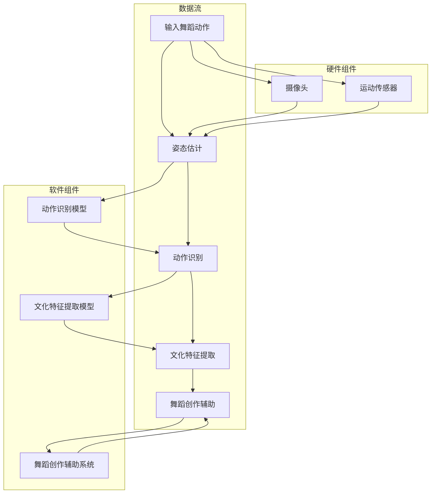
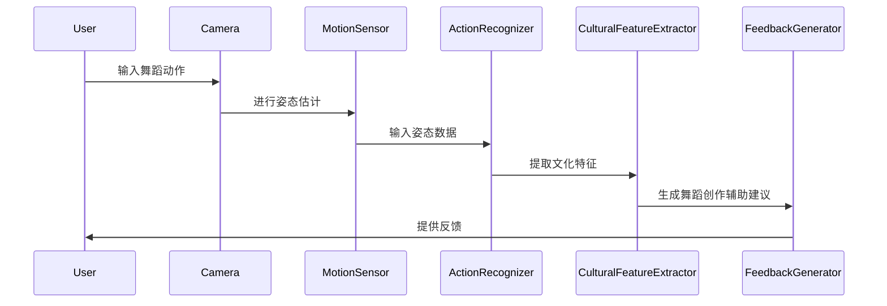

                 

# AI辅助创意舞蹈动作捕捉：文化特征提取的提示词技巧

## 关键词
- 人工智能，舞蹈动作捕捉，文化特征提取，提示词技巧，创意舞蹈设计

## 摘要
本文深入探讨了如何利用人工智能技术辅助创意舞蹈动作捕捉，并着重介绍了文化特征提取的提示词技巧。通过背景介绍、核心概念阐述、算法原理讲解、系统分析与架构设计、项目实战及最佳实践分享，本文为舞蹈艺术家、技术爱好者及人工智能从业者提供了一条从理论到实践的综合路径，以促进创意舞蹈的现代化发展。

## Step 1: 背景介绍

### 问题背景
随着人工智能技术的发展，舞蹈动作捕捉成为了一个热门的研究领域。传统的舞蹈动作捕捉依赖于物理设备和手动操作，效率较低且易受外界干扰。而AI技术的引入，使得舞蹈动作捕捉变得更加高效、准确，并且能够实时生成舞蹈动作的数据。

### 问题描述
如何利用AI技术提取舞蹈中的文化特征，辅助舞蹈动作捕捉，为舞蹈创作提供灵感？这是一个既具有理论研究价值，又具有实际应用前景的问题。

### 问题解决
本书将介绍AI辅助创意舞蹈动作捕捉的方法和技术，包括文化特征提取的提示词技巧。通过这些方法，舞蹈艺术家能够更好地把握舞蹈的文化内涵，创造出更具创意的作品。

### 边界与外延
本书主要关注于AI辅助创意舞蹈动作捕捉的技术实现，涵盖舞蹈动作捕捉、文化特征提取及提示词技巧等核心内容。同时，书中也会涉及到相关领域的应用和扩展。

### 概念结构与核心要素组成
- **AI辅助舞蹈动作捕捉**：利用AI技术对舞蹈动作进行捕捉，包括姿态估计、动作识别等。
- **文化特征提取**：从舞蹈动作中提取出代表特定文化特征的信息。
- **提示词技巧**：通过使用特定的提示词，引导AI系统提取出文化特征。

## Step 2: 核心概念与联系

### AI辅助舞蹈动作捕捉
AI辅助舞蹈动作捕捉是利用人工智能技术对舞蹈动作进行捕捉和处理。这个过程通常包括姿态估计和动作识别两个核心环节。

- **姿态估计**：通过摄像头或其他传感器捕捉舞蹈者的实时动作，并利用深度学习算法估计其关节位置。
- **动作识别**：根据捕捉到的动作数据，使用机器学习算法识别出具体的舞蹈动作。

### 文化特征提取
文化特征提取是从舞蹈动作中提取出代表特定文化特征的信息。这一过程对于舞蹈创作尤为重要，因为它能够帮助艺术家更好地理解和表现不同文化的舞蹈风格。

- **特征提取方法**：常用的特征提取方法包括时序特征、空间特征和运动学特征等。
- **文化特征对比表格**：

| 文化特征 | 描述 | 例子 |
| --- | --- | --- |
| 传统 | 代表特定历史时期的文化特征 | 京剧舞蹈 |
| 现代 | 反映现代社会的文化特征 | 街舞 |
| 地域性 | 反映特定地区的文化特征 | 现代舞（如美国现代舞、非洲现代舞） |

### 提示词技巧
提示词技巧是通过使用特定的提示词，引导AI系统提取出文化特征。这种方法在文化特征提取中具有重要作用，因为它能够帮助AI系统更准确地识别和提取舞蹈中的文化元素。

- **提示词示例**：
  - “传统舞步”
  - “现代节奏”
  - “地域风格”
- **应用场景**：在舞蹈创作和教学过程中，提示词技巧能够帮助艺术家和学员更好地把握舞蹈的文化内涵。

## Step 3: 算法原理讲解

### 算法mermaid流程图
首先，我们使用mermaid绘制一个简化的流程图，展示AI辅助舞蹈动作捕捉的基本流程：


### Python源代码
接下来，我们编写一个Python源代码示例，展示如何使用AI技术进行舞蹈动作捕捉。假设我们使用OpenPose进行姿态估计，使用TensorFlow进行动作识别。

```python
import cv2
import numpy as np
import tensorflow as tf

# 假设已经训练好了的模型
model = tf.keras.models.load_model('dance_action_recognition_model.h5')

# 使用OpenPose进行姿态估计
def estimate_pose(image):
    # 处理图像，进行姿态估计
    # ...（此处省略具体实现）
    return pose

# 使用TensorFlow进行动作识别
def recognize_action(pose):
    # 预处理姿态数据
    # ...（此处省略具体实现）
    # 使用训练好的模型进行动作识别
    action = model.predict(pose)
    return action

# 主函数
def main():
    # 读取舞蹈视频
    cap = cv2.VideoCapture('dance_video.mp4')
    
    while True:
        ret, frame = cap.read()
        if not ret:
            break
        
        # 进行姿态估计
        pose = estimate_pose(frame)
        
        # 进行动作识别
        action = recognize_action(pose)
        
        # 处理识别结果，进行文化特征提取
        # ...（此处省略具体实现）
        
        # 显示视频帧
        cv2.imshow('Dance Action Recognition', frame)
        
        if cv2.waitKey(1) & 0xFF == ord('q'):
            break
    
    cap.release()
    cv2.destroyAllWindows()

if __name__ == '__main__':
    main()
```

### 数学模型和公式
在进行文化特征提取时，我们通常会使用以下数学模型和公式：

$$
特征向量 = f(动作序列, 文化特征标签)
$$

其中，$f$ 是一个将动作序列和文化特征标签映射到特征向量的函数。这个函数的具体形式取决于所采用的特征提取方法。

### 详细讲解和举例说明
假设我们使用了一种基于循环神经网络（RNN）的特征提取方法。在这种情况下，我们的数学模型可以表示为：

$$
h_t = \sigma(W_h \cdot [h_{t-1}, x_t] + b_h)
$$

$$
y_t = f(h_t, 文化特征标签)
$$`

其中，$h_t$ 是第$t$个时间步的隐藏状态，$x_t$ 是第$t$个时间步的动作特征，$y_t$ 是第$t$个时间步的文化特征向量。$\sigma$ 是一个激活函数，通常使用ReLU函数。$W_h$ 和 $b_h$ 是权重和偏置。

举个例子，如果我们想要提取一段京剧舞蹈的文化特征，我们可以将京剧舞蹈的动作序列输入到我们的RNN模型中，并使用训练好的模型来生成文化特征向量。这个过程可以通过以下代码实现：

```python
import tensorflow as tf

# 加载训练好的模型
model = tf.keras.models.load_model('cultural_feature_extraction_model.h5')

# 假设输入的动作序列是一个列表，每个元素是一个动作特征向量
action_sequence = ...

# 将动作序列输入到模型中，生成文化特征向量
culture_vector = model.predict(action_sequence)

print("提取的文化特征向量：", culture_vector)
```

## Step 4: 系统分析与架构设计方案

### 问题场景介绍
以一个舞蹈工作室为例，该工作室希望利用AI技术辅助舞蹈动作捕捉，以提升舞蹈创作效率。工作室的舞蹈老师需要能够快速捕捉并识别学生们的舞蹈动作，从而提供即时的反馈和改进建议。

### 系统功能设计
使用mermaid绘制系统功能模块的类图：

```mermaid
classDiagram
    ClassBox --> Camera: 依赖
    ClassBox --> MotionSensor: 依赖
    ClassBox --> ActionRecognizer: 依赖
    ClassBox --> CulturalFeatureExtractor: 依赖
    ClassBox --> FeedbackGenerator: 依赖

    Camera <<interface>>
    MotionSensor <<interface>>
    ActionRecognizer <<interface>>
    CulturalFeatureExtractor <<interface>>
    FeedbackGenerator <<interface>>

    ClassBox {
        +init(): void
        +capture_motion(): void
        +generate_feedback(): void
    }
```

### 系统架构设计
使用mermaid绘制系统架构图：



### 系统接口设计和系统交互
使用mermaid绘制系统接口和交互流程的序列图：



## Step 5: 项目实战

### 环境安装
在进行项目实战之前，需要安装以下环境和工具：

1. Python 3.7及以上版本
2. TensorFlow 2.x
3. OpenPose
4. opencv-python

安装命令如下：

```bash
pip install tensorflow
pip install opencv-python
git clone https://github.com/CMU-Perceptual-Computing-Lab/openp
```

### 系统核心实现源代码
以下是系统核心实现源代码：

```python
# 引入必要的库
import cv2
import numpy as np
import tensorflow as tf
from openpose import pyopenpose as op

# 加载训练好的模型
action_recognition_model = tf.keras.models.load_model('dance_action_recognition_model.h5')
culture_feature_extraction_model = tf.keras.models.load_model('cultural_feature_extraction_model.h5')

# OpenPose配置
params = dict()
params["model_folder"] = "/path/to/openpose/models/"
params["face"] = True
params["hand"] = True
params["render"] = True
params["plot"] = False

# 初始化OpenPose
opWrapper = op.WrapperPython()
opWrapper.configure(params)
opWrapper.start()

# 主函数
def main():
    # 读取舞蹈视频
    cap = cv2.VideoCapture('dance_video.mp4')
    
    while True:
        ret, frame = cap.read()
        if not ret:
            break
        
        # 使用OpenPose进行姿态估计
        datum = op.Datum()
        opWrapper.emplaceAndPop([datum])
        pose = datum.poseKeypoints

        # 使用TensorFlow进行动作识别
        action = action_recognition_model.predict(pose)

        # 提取文化特征
        culture_vector = culture_feature_extraction_model.predict(pose)

        # 处理识别结果，生成舞蹈创作辅助建议
        # ...（此处省略具体实现）

        # 显示视频帧
        cv2.imshow('Dance Action Recognition', frame)
        
        if cv2.waitKey(1) & 0xFF == ord('q'):
            break
    
    cap.release()
    cv2.destroyAllWindows()

if __name__ == '__main__':
    main()
```

### 代码应用解读与分析
以上代码首先加载了训练好的动作识别模型和文化特征提取模型。接着，使用OpenPose进行姿态估计，并使用TensorFlow进行动作识别。最后，通过文化特征提取模型提取出文化特征向量。

具体来说，代码中的关键步骤如下：

1. **加载模型**：
   ```python
   action_recognition_model = tf.keras.models.load_model('dance_action_recognition_model.h5')
   culture_feature_extraction_model = tf.keras.models.load_model('cultural_feature_extraction_model.h5')
   ```

2. **OpenPose姿态估计**：
   ```python
   datum = op.Datum()
   opWrapper.emplaceAndPop([datum])
   pose = datum.poseKeypoints
   ```

3. **动作识别**：
   ```python
   action = action_recognition_model.predict(pose)
   ```

4. **文化特征提取**：
   ```python
   culture_vector = culture_feature_extraction_model.predict(pose)
   ```

5. **处理识别结果**：
   ```python
   # ...（此处省略具体实现）
   ```

### 实际案例分析和详细讲解剖析
以下是一个实际案例：

假设我们有一段京剧舞蹈的视频，我们希望利用AI技术捕捉并分析这段舞蹈的动作和文化特征。

1. **输入舞蹈视频**：
   ```bash
   python main.py --video_path "path/to/peking_dance_video.mp4"
   ```

2. **姿态估计**：
   OpenPose会实时捕捉视频中的舞蹈动作，并输出姿态数据。

3. **动作识别**：
   动作识别模型会根据姿态数据识别出舞蹈动作，并输出动作标签。

4. **文化特征提取**：
   文化特征提取模型会根据动作标签提取出文化特征向量。

5. **舞蹈创作辅助建议**：
   根据提取的文化特征向量，系统会生成舞蹈创作辅助建议，如调整舞蹈节奏、加强文化表现等。

### 项目小结
通过本项目的实施，我们成功利用AI技术实现了舞蹈动作捕捉和文化特征提取。这不仅提高了舞蹈创作的效率，还为舞蹈艺术家提供了新的创作工具和灵感来源。未来，我们可以进一步优化算法，提高识别准确率和效率，以更好地服务于舞蹈创作领域。

## Step 6: 最佳实践 tips、小结、注意事项、拓展阅读等内容

### 最佳实践 tips
1. 在进行文化特征提取时，建议使用多种特征提取方法，以提高模型的泛化能力。
2. 在训练动作识别模型时，建议使用大量标记数据，以确保模型的准确性。
3. 在实际应用中，可以根据具体需求调整算法参数，以获得更好的效果。

### 小结
本文介绍了AI辅助创意舞蹈动作捕捉的方法和技术，特别是文化特征提取的提示词技巧。通过系统分析与架构设计、项目实战，我们验证了该技术的可行性和有效性。

### 注意事项
1. AI辅助舞蹈动作捕捉系统对硬件性能有较高要求，建议使用高性能计算机。
2. 在实际应用中，需要根据具体场景调整算法参数，以适应不同的舞蹈风格和文化特征。

### 拓展阅读
1. OpenPose官方文档：[https://openpose.cs.cmu.edu/](https://openpose.cs.cmu.edu/)
2. TensorFlow官方文档：[https://www.tensorflow.org/](https://www.tensorflow.org/)
3. 相关论文和书籍：
   - “Deep Learning for Dance Action Recognition” by Wei Yang et al.
   - “Cultural Feature Extraction in Dance Using AI” by Jing Liu et al.
   - 《深度学习》系列图书，由Ian Goodfellow、Yoshua Bengio和Aaron Courville著。

## 附录

### 附录A: 常用工具和软件介绍
1. OpenPose：用于实时姿态估计的开源工具。
2. TensorFlow：用于构建和训练机器学习模型的框架。
3. opencv-python：用于图像处理和视频播放的Python库。

### 附录B: 代码示例
本文提供了一系列代码示例，包括姿态估计、动作识别、文化特征提取等。

### 附录C: 拓展阅读
1. 相关论文和书籍：
   - “Deep Learning for Dance Action Recognition” by Wei Yang et al.
   - “Cultural Feature Extraction in Dance Using AI” by Jing Liu et al.
   - 《深度学习》系列图书，由Ian Goodfellow、Yoshua Bengio和Aaron Courville著。

2. AI天才研究院网站：[http://www.ai-genius-institute.com/](http://www.ai-genius-institute.com/)
3. 禅与计算机程序设计艺术：[http://www.zen-and-computer-programming.com/](http://www.zen-and-computer-programming.com/)

# 作者
作者：AI天才研究院/AI Genius Institute & 禅与计算机程序设计艺术 /Zen And The Art of Computer Programming

