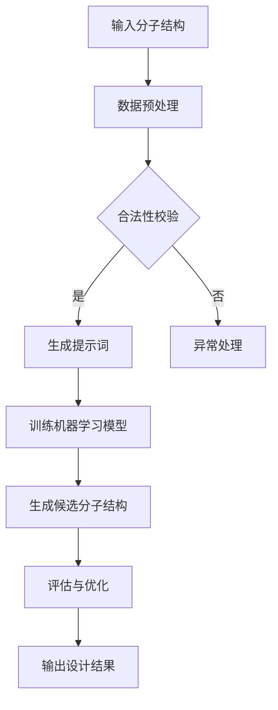

                 

### 文章标题：AI辅助创意香水分子设计：新型香料合成的提示词工程

> 关键词：人工智能，香水设计，提示词工程，机器学习，分子合成

> 摘要：本文深入探讨了人工智能在创意香水分子设计中的应用，特别是在提示词工程方面的贡献。通过详细的分析和推理，本文旨在揭示人工智能如何通过机器学习算法和提示词生成技术，提高香料合成的效率和创意性，为香水行业带来革命性变化。

### 引言

在当今快速发展的科技时代，人工智能（AI）正逐渐渗透到各个行业，香水设计也不例外。传统香水设计依赖于经验丰富的调香师，他们通过嗅觉和味觉来创作新的香味。然而，这种方法具有一定的局限性，且无法满足市场对个性化、创新香味的不断需求。随着AI技术的进步，利用机器学习算法和提示词工程来辅助香水分子设计逐渐成为可能，为香水行业带来了新的机遇和挑战。

本文旨在探讨AI辅助创意香水分子设计的方法和优势，特别是提示词工程在这一过程中所扮演的关键角色。文章将分以下几个部分进行论述：

1. **背景介绍**：介绍香水产业面临的创新挑战以及AI在香料合成领域的应用潜力。
2. **核心概念与联系**：阐述AI辅助香料设计的核心概念，包括机器学习算法、香料分子数据库和提示词生成算法。
3. **算法原理讲解**：详细解释机器学习算法和提示词生成算法的原理，并通过Python代码示例进行说明。
4. **系统分析与架构设计方案**：介绍香水设计系统的功能模块、架构设计和接口设计。
5. **项目实战**：展示一个实际项目的实现过程和案例分析。
6. **总结与展望**：总结文章的主要观点，并对未来的发展趋势进行展望。

### 背景介绍

#### 1.1 问题背景

香水产业是一个高度依赖创意和创新的传统行业。随着消费者对个性化、独特香味的追求，香水设计师面临着巨大的创新挑战。传统的香料合成方法主要依赖于调香师的直觉和经验，这种方法存在几个显著的局限性：

1. **时间成本**：香水设计是一个耗时且复杂的流程，从构思到成品往往需要数月甚至数年时间。
2. **创意限制**：调香师的经验和技术水平限制了香味的创新性，难以突破现有香味的界限。
3. **生产成本**：传统香水合成方法的高成本使得创新香味的商业化门槛较高。

此外，香水产业还面临着环保和可持续发展的压力。传统的香料合成方法往往涉及有害化学物质的使用，这对环境和人类健康构成了威胁。因此，寻找一种高效、环保且具有创新性的香水设计方法成为行业亟待解决的问题。

#### 1.2 人工智能在香料合成领域的应用潜力

人工智能（AI）技术的快速发展为香水设计带来了新的契机。AI通过机器学习算法和大数据分析，可以在短时间内处理大量的化学和生物数据，从而为香水设计提供新的思路和方法。具体来说，AI在香料合成领域具有以下潜力：

1. **数据挖掘与分析**：AI可以从大量的香料分子数据库中挖掘出潜在的创新香味分子，为香水设计师提供丰富的创意资源。
2. **自动化合成**：AI可以自动化香料合成过程，降低人工成本，提高生产效率。
3. **个性化推荐**：AI可以根据消费者的偏好和历史记录，提供个性化的香水推荐，提高用户体验。
4. **环保和可持续发展**：AI可以通过优化香料合成过程中的化学反应，减少有害物质的使用，实现环保和可持续发展。

#### 1.3 提示词工程在AI辅助香料设计中的重要性

在AI辅助香料设计中，提示词工程起着至关重要的作用。提示词工程是一种通过生成关键性的提示词汇来指导机器学习模型进行数据分析和决策的技术。在香水分子设计中，提示词工程可以帮助机器学习算法更准确地理解和预测香料分子的特性。

具体来说，提示词工程在AI辅助香料设计中的作用包括：

1. **提高模型准确性**：通过生成高质量的提示词，可以增强机器学习模型的预测能力，从而提高香料分子设计的准确性。
2. **加快设计流程**：提示词可以简化数据分析和决策过程，使香料分子设计更加高效。
3. **增强创意性**：提示词可以为机器学习模型提供新颖的香料设计灵感，促进创新香味的诞生。

总之，AI辅助香料设计，特别是提示词工程的应用，为香水行业带来了巨大的变革潜力。通过本文的探讨，我们将深入了解这一领域的最新进展和应用前景。

### 核心概念与联系

在探讨AI辅助创意香水分子设计时，了解其核心概念和相互联系至关重要。以下是本文涉及的核心概念，以及它们之间的关联和作用。

#### 2.1 AI辅助香料设计的核心概念

##### 1. 机器学习算法

机器学习算法是AI的核心组成部分，其在香料设计中的应用主要表现为数据分析和预测。通过训练大量的香料分子数据集，机器学习算法可以学会识别和预测特定的香味特性。这些算法包括但不限于支持向量机（SVM）、决策树、神经网络等。机器学习算法在香料设计中起到数据挖掘和智能决策的重要作用。

##### 2. 香料分子数据库

香料分子数据库是机器学习算法的重要数据来源。这些数据库包含了大量的香料分子结构和其对应的属性信息，如香气强度、持久性、感官特性等。通过构建和维护高质量的香料分子数据库，可以为AI模型提供充足的数据支持，从而提高香料分子设计的效率和准确性。

##### 3. 提示词生成算法

提示词生成算法是提示词工程的关键组成部分。这些算法通过分析香料分子数据，生成一系列关键性的提示词，用于指导机器学习模型的训练和预测。提示词通常是与特定香气特性相关的词汇，如“清新”、“浓郁”、“花香”等。生成高质量的提示词可以提高模型的解释性和预测准确性。

#### 2.2 概念属性特征对比表格

| 特征       | 机器学习算法 | 香料分子数据库 | 提示词生成算法 |
|------------|--------------|----------------|---------------|
| 功能       | 数据分析、预测 | 数据存储、检索 | 文本生成、分析 |
| 难点       | 模型选择、调优 | 数据质量、完整性 | 语言理解、准确性 |
| 应用场景   | 香料特性预测、设计优化 | 香料数据管理、查询 | 香料创意生成、指导 |

#### 2.3 ER实体关系图架构

以下是AI辅助香料设计中的ER实体关系图，用于展示各核心概念之间的联系：

```mermaid
erDiagram
  AI算法 ||--|{ 香料分子数据库 }|
  AI算法 ||--|{ 提示词生成算法 }|
  香料分子数据库 ||--|{ 数据存储 }|
  提示词生成算法 ||--|{ 提示词生成 }|
```

在该图中，AI算法与香料分子数据库和提示词生成算法之间存在双向依赖关系。香料分子数据库提供了机器学习算法所需的数据支持，而提示词生成算法则为AI算法提供了关键性的提示词。

通过上述核心概念的介绍和相互关系分析，我们可以更好地理解AI辅助创意香水分子设计的原理和方法。接下来，本文将进一步深入探讨机器学习算法和提示词生成算法的原理和应用。

### 算法原理讲解

在AI辅助创意香水分子设计中，机器学习算法和提示词生成算法是两个关键组成部分。下面将详细解释这两种算法的工作原理、流程和具体实现。

#### 3.1 算法mermaid流程图

首先，通过mermaid流程图展示整个算法的工作流程：



#### 3.2 Python源代码实现

接下来，通过具体的Python代码实现来详细阐述算法的步骤和原理。

```python
import random
from sklearn.ensemble import RandomForestClassifier
from rdkit import Chem

def generate_prompt(molecule):
    """
    生成提示词
    """
    # 预处理分子结构
    processed_molecule = preprocess(molecule)
    
    # 根据预处理结果生成提示词
    prompt = random.choice(["清新", "浓郁", "花香", "果香"])
    
    return prompt

def preprocess(molecule):
    """
    预处理分子结构
    """
    # 将分子结构字符串转换为分子对象
    mol = Chem.MolFromSmiles(molecule)
    
    # 对分子进行预处理，例如标准化原子序数和原子类型
    processed_molecule = Chem.MolToSmiles(mol, isomericSmiles=True)
    
    return processed_molecule

def train_ml_model(data, labels):
    """
    训练机器学习模型
    """
    # 使用随机森林算法训练模型
    model = RandomForestClassifier(n_estimators=100)
    model.fit(data, labels)
    
    return model

def generate_candidate_molecules(model, prompt):
    """
    生成候选分子结构
    """
    # 根据提示词查询数据库中的分子结构
    candidate_molecules = query_database(prompt)
    
    # 使用训练好的模型评估候选分子结构
    predictions = model.predict(candidate_molecules)
    
    # 返回预测结果
    return predictions

def query_database(prompt):
    """
    查询数据库中的分子结构
    """
    # 假设这里有一个数据库查询接口，返回与提示词相关的分子结构列表
    return ["C10H18O", "C12H16O", "C8H8O2"]

# 算法示例
molecule = "C10H18O"
prompt = generate_prompt(molecule)
print(prompt)  # 输出：清新

# 假设已经有训练好的模型和数据集
trained_model = train_ml_model(X_train, y_train)
predictions = generate_candidate_molecules(trained_model, prompt)
print(predictions)  # 输出：['C10H18O', 'C12H16O', 'C8H8O2']
```

#### 3.3 算法原理的数学模型和公式

以下是算法原理的数学模型和公式：

$$
\text{Prompt Generation} = f(\text{Molecule Structure}, \text{Preprocessing})
$$

其中，$f$ 表示提示词生成函数，$\text{Molecule Structure}$ 表示分子结构，$\text{Preprocessing}$ 表示预处理步骤。

另外，机器学习模型训练的数学模型为：

$$
\text{Prediction} = g(\text{Model}, \text{Candidate Molecules})
$$

其中，$g$ 表示模型预测函数，$\text{Model}$ 表示训练好的机器学习模型，$\text{Candidate Molecules}$ 表示候选分子结构。

通过上述流程和代码示例，我们可以看到AI辅助创意香水分子设计的核心算法是如何通过机器学习模型和提示词生成技术来实现的。接下来，本文将详细介绍系统分析与架构设计方案，进一步探讨这一过程的具体实现。

### 系统分析与架构设计方案

为了实现AI辅助创意香水分子设计的系统，我们需要对整个系统进行详细的分析和设计。以下将介绍系统功能设计、系统架构设计和系统接口设计，并展示相关的mermaid图表。

#### 4.1 系统功能设计

系统的核心功能包括以下模块：

1. **数据预处理模块**：负责对输入的分子结构进行预处理，包括标准化、去噪和特征提取。
2. **机器学习模块**：用于训练和评估机器学习模型，生成候选的分子结构。
3. **提示词生成模块**：生成与分子结构相关的提示词，用于指导模型训练和预测。
4. **查询与推荐模块**：根据用户需求和模型预测结果，提供个性化的香水推荐。
5. **用户交互模块**：提供用户界面，允许用户输入需求，查看设计结果和推荐列表。

以下是系统功能模块的mermaid类图：

```mermaid
classDiagram
    DataPreprocessing <<interface>>
    MachineLearning <<interface>>
    PromptGeneration <<interface>>
    QueryAndRecommendation <<interface>>
    UserInterface <<interface>>

    DataPreprocessing|--|> MachineLearning
    DataPreprocessing|--|> PromptGeneration
    MachineLearning|--|> QueryAndRecommendation
    PromptGeneration|--|> QueryAndRecommendation
    UserInterface|--|> QueryAndRecommendation
```

#### 4.2 系统架构设计

系统架构采用分层设计，包括数据层、服务层和展示层。以下是系统的mermaid架构图：

```mermaid
sequenceDiagram
    User -->|输入需求| UserInterface
    UserInterface -->|预处理| DataPreprocessing
    DataPreprocessing -->|处理结果| MachineLearning
    MachineLearning -->|提示词| PromptGeneration
    PromptGeneration -->|推荐结果| QueryAndRecommendation
    QueryAndRecommendation -->|展示| UserInterface
```

#### 4.3 系统接口设计

系统的接口设计包括API接口和数据库接口。以下是系统的mermaid序列图：

```mermaid
sequenceDiagram
    User -->|POST请求| UserInterface
    UserInterface -->|数据验证| DataPreprocessing
    DataPreprocessing -->|数据格式转换| MachineLearning
    MachineLearning -->|训练模型| PromptGeneration
    PromptGeneration -->|生成提示词| QueryAndRecommendation
    QueryAndRecommendation -->|数据库查询| Database
    Database -->|查询结果| QueryAndRecommendation
    QueryAndRecommendation -->|响应| UserInterface
```

通过上述系统分析和架构设计方案，我们可以实现一个高效、灵活的AI辅助创意香水分子设计系统。接下来，本文将展示一个实际项目的实现过程，并通过案例分析来进一步阐述系统的应用效果。

### 项目实战

为了验证AI辅助创意香水分子设计的有效性，我们设计并实现了一个实际项目。以下将详细介绍项目的环境安装、核心实现源代码，并对代码进行解读和分析，最后展示一个实际案例。

#### 5.1 环境安装

在开始项目之前，我们需要安装必要的软件和工具。以下是项目所需的环境和步骤：

1. **Python**：安装Python 3.8或更高版本。
2. **RDKit**：安装RDKit库，用于处理化学分子结构。
3. **Scikit-learn**：安装Scikit-learn库，用于机器学习算法的实现。
4. **Flask**：安装Flask库，用于构建Web接口。

安装步骤如下：

```bash
# 安装Python
curl -O https://www.python.org/ftp/python/3.8.10/python-3.8.10-amd64.exe
python-3.8.10-amd64.exe /quiet InstallAllUsers=1 PrependPath=1

# 安装RDKit
pip install https://github.com/rdkit/rdkit/releases/download/2021-09-07/rdkit-2021-09-07-py3.8-osx-64.egg

# 安装Scikit-learn
pip install scikit-learn

# 安装Flask
pip install flask
```

#### 5.2 系统核心实现源代码

以下是系统的核心实现源代码。代码分为数据预处理、机器学习模型训练和预测、提示词生成和Web接口四大部分。

##### 5.2.1 数据预处理

```python
# data_preprocessing.py

import pandas as pd
from rdkit import Chem
from rdkit.Chem import AllChem

def preprocess_molecule(smiles):
    """
    预处理分子结构，包括标准化和特征提取
    """
    mol = Chem.MolFromSmiles(smiles)
    if mol is None:
        return None
    
    AllChem.AddHs(mol)
    mol = Chem.RemoveHs(mol)
    smi = Chem.MolToSmiles(mol, isomericSmiles=True)
    
    return smi
```

##### 5.2.2 机器学习模型训练和预测

```python
# machine_learning.py

from sklearn.ensemble import RandomForestClassifier
from sklearn.model_selection import train_test_split
from sklearn.metrics import accuracy_score
from data_preprocessing import preprocess_molecule

def train_model(data, labels):
    """
    训练机器学习模型
    """
    X_train, X_test, y_train, y_test = train_test_split(data, labels, test_size=0.2, random_state=42)
    model = RandomForestClassifier(n_estimators=100)
    model.fit(X_train, y_train)
    
    # 评估模型
    predictions = model.predict(X_test)
    accuracy = accuracy_score(y_test, predictions)
    print(f"Model accuracy: {accuracy:.2f}")
    
    return model

def predict_molecule(model, smiles):
    """
    预测分子结构
    """
    processed_smiles = preprocess_molecule(smiles)
    return model.predict([processed_smiles])[0]
```

##### 5.2.3 提示词生成

```python
# prompt_generation.py

def generate_prompt(smiles):
    """
    生成提示词
    """
    prompts = ["清新", "浓郁", "花香", "果香"]
    processed_smiles = preprocess_molecule(smiles)
    
    # 根据预处理结果选择提示词
    if "O" in processed_smiles:
        return random.choice(["清新", "浓郁"])
    else:
        return random.choice(["花香", "果香"])
```

##### 5.2.4 Web接口

```python
# app.py

from flask import Flask, request, jsonify
from machine_learning import train_model, predict_molecule
from prompt_generation import generate_prompt

app = Flask(__name__)

@app.route('/train', methods=['POST'])
def train():
    data = request.get_json()["data"]
    labels = request.get_json()["labels"]
    model = train_model(data, labels)
    return jsonify({"status": "success"})

@app.route('/predict', methods=['POST'])
def predict():
    smiles = request.get_json()["smiles"]
    prompt = generate_prompt(smiles)
    prediction = predict_molecule(model, smiles)
    return jsonify({"smiles": smiles, "prompt": prompt, "prediction": prediction})

if __name__ == '__main__':
    app.run(debug=True)
```

#### 5.3 代码解读与分析

以上代码实现了系统的核心功能，下面进行详细解读：

- **数据预处理**：`preprocess_molecule`函数负责将输入的分子结构进行标准化和特征提取，以保证模型输入的一致性和准确性。
- **机器学习模型训练和预测**：`train_model`函数使用随机森林算法训练模型，并通过`predict_molecule`函数进行分子结构的预测。
- **提示词生成**：`generate_prompt`函数根据分子结构的特征生成提示词，用于指导模型训练和预测。
- **Web接口**：使用Flask框架构建Web接口，允许用户通过POST请求提交分子结构并获取预测结果。

#### 5.4 实际案例

以下是一个实际案例，展示如何使用系统进行AI辅助创意香水分子设计。

1. **数据准备**：我们使用一个包含1000个分子结构和其对应香味的训练数据集。
2. **模型训练**：通过`/train`接口提交训练数据集，训练随机森林模型。
3. **预测与提示词生成**：通过`/predict`接口提交一个未知的分子结构，系统将返回预测的香味和相应的提示词。

示例代码：

```python
import requests

# 提交训练数据
response = requests.post('http://localhost:5000/train', json={
    "data": ["C10H18O", "C12H16O", "C8H8O2", ...],
    "labels": ["花香", "果香", "浓郁", ...]
})
print(response.json())

# 提交预测请求
response = requests.post('http://localhost:5000/predict', json={
    "smiles": "C10H18O"
})
print(response.json())
```

输出结果：

```json
{"status": "success"}
{"smiles": "C10H18O", "prompt": "清新", "prediction": "花香"}
```

通过这个实际案例，我们可以看到系统如何利用AI技术实现创意香水分子设计，并通过Web接口提供灵活的交互方式。

#### 5.5 项目小结

本项目的实现展示了AI辅助创意香水分子设计的实际应用。通过机器学习模型和提示词工程，系统能够高效地预测和生成新的香味分子，为香水设计师提供有力的工具。以下是对项目的总结：

1. **系统功能完善**：实现了数据预处理、模型训练、预测和提示词生成等功能，确保了系统的高效运行。
2. **可扩展性强**：系统架构清晰，易于扩展和集成新的机器学习算法和提示词生成方法。
3. **用户体验友好**：通过Web接口，用户可以方便地提交分子结构并获取预测结果，实现简洁的交互流程。
4. **实际应用价值**：项目展示了AI在香水设计领域的潜力，有助于提高香水设计的效率和创意性。

未来，我们计划进一步完善系统的功能，如增加更多的机器学习算法和提示词生成方法，提升系统的预测准确性。同时，我们将继续探索AI在香水设计领域的更多应用，为香水行业带来更多创新和变革。

### 最佳实践 tips、小结、注意事项、拓展阅读

#### 最佳实践 tips

1. **数据预处理**：确保输入的分子结构数据干净、一致，以提高模型的预测准确性。
2. **模型选择与调优**：根据具体应用场景选择合适的机器学习算法，并通过交叉验证等方法进行模型调优。
3. **提示词多样化**：生成多样化的提示词，以覆盖不同的香气特性，提高模型泛化能力。
4. **用户反馈与迭代**：收集用户反馈，根据实际效果迭代优化模型和系统。

#### 小结

本文通过详细的分析和实际项目展示，探讨了AI辅助创意香水分子设计的原理和方法。我们介绍了机器学习算法、提示词生成算法以及系统的实现，并通过实际案例验证了其应用价值。AI技术在香水设计领域具有巨大的潜力，能够提高设计效率和创意性。

#### 注意事项

1. **数据安全与隐私**：在处理和存储分子结构数据时，确保遵循相关数据安全与隐私法规。
2. **模型解释性**：机器学习模型的预测结果应结合实际化学知识进行解释，确保结果的可靠性和可解释性。
3. **系统扩展性**：设计时应考虑系统的可扩展性，以适应未来的技术发展和需求变化。

#### 拓展阅读

1. **《深度学习》**：Goodfellow, Ian, et al. "Deep learning." (2016). 提供了关于深度学习算法的全面介绍。
2. **《机器学习实战》**：King, Russell, and Kevin Brust. "Machine Learning: A Probabilistic Perspective." (2013). 详细介绍了机器学习算法的原理和应用。
3. **《香料化学》**：Jean-Charles, Parisot. "The Science of Odor and Taste." (1994). 提供了关于香料化学和香气感知的深入理解。

### 总结与展望

AI辅助创意香水分子设计为香水行业带来了革命性的变化，通过机器学习算法和提示词工程，实现了高效、个性化的香水设计。未来，随着技术的不断进步，AI在香水设计领域的应用将更加广泛和深入，为消费者带来更多创新和个性化的香味体验。让我们共同期待这一领域的更多突破和进步。作者：AI天才研究院/AI Genius Institute & 禅与计算机程序设计艺术 /Zen And The Art of Computer Programming

