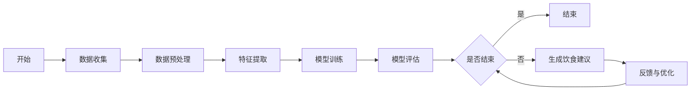
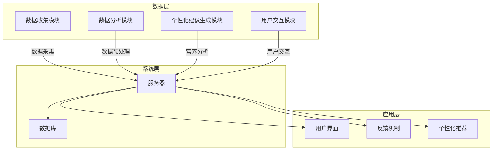
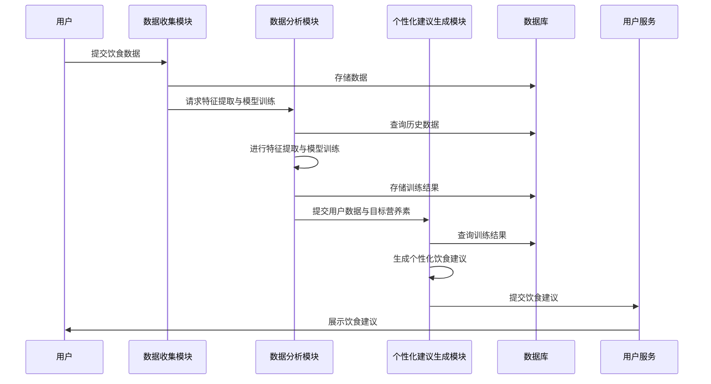

                 

### 1.1 问题背景与核心概念

#### 1.1.1 营养规划的挑战

随着社会经济的发展，人们的饮食结构发生了巨大变化。高糖、高脂、高盐的食物占据了饮食的主导地位，随之而来的是肥胖、糖尿病、心血管疾病等慢性疾病的增加。据统计，全球每年有近2000万人死于心血管疾病，其中很大一部分与不良的饮食习惯有关。而现有的营养规划方法在应对这些挑战时显得力不从心。

传统的营养规划方法主要依赖于营养师的人工评估和指导，这种方式不仅效率低下，而且容易出现误判。例如，对于不同人群的营养需求差异，营养师很难做到精确的判断。此外，传统方法还面临着数据来源单一、数据更新不及时等问题。

为了解决这些问题，人们开始寻求更加智能化、个性化的营养规划方法。AI技术的兴起为这一领域带来了新的希望。通过机器学习、数据挖掘等技术，AI能够从大量的营养数据中提取出有价值的信息，为用户提供个性化的饮食建议。

#### 1.1.2 AI辅助营养规划的重要性

AI辅助营养规划的重要性体现在以下几个方面：

1. **个性化饮食建议**：传统营养规划方法往往只能提供普遍的饮食建议，而AI可以根据个体的身体状况、饮食习惯、生活作息等多维度数据，为用户提供个性化的饮食建议。这不仅能提高营养规划的准确性，还能提高用户的满意度和依从性。

2. **实时监测与调整**：AI技术可以实时收集用户的饮食数据，通过不断学习和优化，动态调整饮食建议。这种实时监测与调整的能力，有助于预防营养失衡和慢性疾病的发生。

3. **提高营养师工作效率**：AI技术可以协助营养师进行数据分析和饮食建议的生成，大大减轻了营养师的工作负担，使其能够将更多精力投入到个性化的营养指导和患者管理中。

4. **数据驱动的研究**：AI技术可以帮助营养学家从大量的营养数据中挖掘出潜在的规律和关联，为营养学研究提供新的思路和方法。

#### 1.1.3 个性化饮食建议的概念

个性化饮食建议是指根据个体的身体状况、饮食习惯、生活作息等多维度数据，结合营养学理论，为个体提供具有针对性的饮食建议。这种饮食建议不仅要考虑营养均衡，还要兼顾个体的口味、偏好、健康状况等因素。

个性化饮食建议的核心在于数据驱动和智能分析。通过收集和分析个体的饮食数据，AI可以识别出个体的营养需求和饮食习惯，从而生成个性化的饮食建议。这些建议可能包括具体的食物选择、餐次安排、营养成分配比等。

#### 1.1.4 提示词技巧的作用

提示词技巧在个性化饮食建议中起着至关重要的作用。提示词是一种简短的文字或语音提示，用于引导用户进行相应的行动或决策。在个性化饮食建议中，提示词可以用于以下几个方面：

1. **数据收集**：提示词可以引导用户记录自己的饮食行为，如食物摄入量、餐次时间等。这些数据是生成个性化饮食建议的基础。

2. **饮食指导**：提示词可以根据用户的饮食习惯和健康状况，提供具体的饮食建议，如增加蔬菜摄入、减少糖分摄入等。

3. **行为矫正**：提示词可以提醒用户注意饮食中的不良习惯，如过度饮酒、暴饮暴食等，帮助用户逐步矫正不良饮食习惯。

4. **健康监测**：提示词可以引导用户进行健康监测，如定期测量体重、血压等，帮助用户了解自己的健康状况。

总之，AI辅助营养规划通过个性化饮食建议，有望解决传统营养规划面临的诸多挑战，为人们的健康生活提供有力支持。在接下来的章节中，我们将深入探讨AI在营养规划中的应用原理、算法实现、系统架构等方面，以期为大家呈现一幅全面、系统的AI辅助营养规划图景。### 1.2 背景介绍

#### 1.2.1 人类营养需求

人类营养需求是营养规划的核心。根据世界卫生组织（WHO）的定义，营养是指人体从食物中获取必要的营养物质，以维持生命活动和健康的过程。这些营养物质包括蛋白质、碳水化合物、脂肪、维生素、矿物质和水。

**基本营养素的作用**：
- **蛋白质**：蛋白质是身体构建和修复组织的基础，也是酶和抗体的组成部分。
- **碳水化合物**：碳水化合物是身体的主要能量来源，尤其是大脑和肌肉的活动。
- **脂肪**：脂肪不仅提供能量，还参与细胞结构的构建和激素的合成。
- **维生素和矿物质**：维生素和矿物质在身体的各种代谢过程中发挥着重要的催化作用，缺乏会导致各种疾病。

**营养需求的个体差异**：每个人的营养需求都不同，这取决于年龄、性别、体重、健康状况、生活方式和活动水平等多种因素。例如，孕妇和哺乳期妇女需要更多的蛋白质和钙，以支持胎儿发育和乳汁分泌；运动员可能需要更多的碳水化合物和蛋白质，以满足高强度训练的需求。

#### 1.2.2 现有营养规划的局限性

尽管营养在维持健康方面至关重要，但现有的营养规划方法仍然存在许多局限性。

**1. 数据来源单一**：传统营养规划主要依赖于个人填写问卷或营养师面诊的方式获取数据。这种方式的数据来源单一，可能无法全面反映个体的实际饮食情况。

**2. 依赖人工判断**：营养师需要通过专业知识和经验来判断个体的营养需求，这种依赖人工判断的方式不仅效率低下，而且容易出现误判。

**3. 缺乏实时监测**：传统营养规划方法无法实时监测个体的饮食行为和健康状况，无法及时调整饮食建议。

**4. 营养教育不足**：许多人缺乏正确的营养知识，无法正确评估自己的营养需求，导致营养失衡。

#### 1.2.3 AI在营养规划中的应用潜力

AI技术的应用为营养规划带来了新的机遇。AI可以通过以下方式提高营养规划的效率和质量：

**1. 数据驱动的分析**：AI可以处理和分析大量的营养数据，识别出个体的营养需求和饮食习惯，从而提供更准确的饮食建议。

**2. 实时监测与调整**：AI可以实时收集用户的饮食数据，通过机器学习算法动态调整饮食建议，帮助用户预防营养失衡和慢性疾病。

**3. 个性化服务**：AI可以根据用户的个人特点（如年龄、性别、健康状况等）提供个性化的营养建议，提高用户的满意度和依从性。

**4. 自动化营养师**：AI可以协助营养师进行数据分析和饮食建议的生成，减少人工工作量，提高工作效率。

**5. 数据驱动的营养研究**：AI可以帮助营养学家从大量的营养数据中挖掘出潜在的规律和关联，为营养科学研究提供新的方向。

#### 1.2.4 AI辅助营养规划的基本概念

**AI辅助营养规划**是指利用人工智能技术，如机器学习、数据挖掘、自然语言处理等，对个体的饮食数据进行收集、分析和处理，生成个性化的饮食建议，以帮助个体实现营养均衡和健康生活方式。

**核心组成部分**：
- **数据收集**：通过传感器、智能手机应用或其他设备，收集用户的饮食数据。
- **数据预处理**：清洗和转换原始数据，为后续分析做准备。
- **特征提取**：从数据中提取有用的特征，用于训练模型。
- **模型训练与优化**：使用机器学习算法训练模型，并对模型进行评估和优化。
- **个性化饮食建议**：根据个体的数据生成个性化的饮食建议。

通过AI辅助营养规划，我们不仅可以提高营养规划的科学性和准确性，还可以为个体提供更加便捷和个性化的服务，从而更好地促进健康。在接下来的章节中，我们将深入探讨AI在营养规划中的应用原理、算法实现和系统架构等方面。### 1.3 AI辅助营养规划的概念与组成部分

#### 1.3.1 定义与核心组成部分

AI辅助营养规划（AI-assisted nutritional planning）是一种利用人工智能技术，如机器学习、数据挖掘、自然语言处理等，对个体的饮食数据进行收集、分析和处理，以生成个性化的饮食建议和营养规划方案。这种规划方案不仅考虑了营养均衡，还兼顾了个体偏好、健康状况和生活习惯，从而帮助用户实现更健康的生活方式。

AI辅助营养规划的核心组成部分包括：
- **数据收集**：通过传感器、智能手机应用或其他设备，收集用户的饮食数据。
- **数据预处理**：清洗和转换原始数据，为后续分析做准备。
- **特征提取**：从数据中提取有用的特征，用于训练模型。
- **模型训练与优化**：使用机器学习算法训练模型，并对模型进行评估和优化。
- **个性化饮食建议**：根据个体的数据生成个性化的饮食建议。
- **用户交互**：通过用户界面与用户进行交互，反馈和优化饮食建议。

#### 1.3.2 数据收集

数据收集是AI辅助营养规划的基础。高质量的饮食数据可以提供准确的营养分析，从而生成更有效的饮食建议。数据收集的方法包括：

- **传感器设备**：如智能手环、智能秤等，可以实时监测用户的饮食行为和身体活动。
- **移动应用**：用户可以通过手机应用手动记录自己的饮食行为，包括食物摄入量、餐次时间、饮食习惯等。
- **远程监控**：通过无线网络或蓝牙技术，将用户的饮食数据实时传输到服务器进行分析。

#### 1.3.3 数据预处理

原始的饮食数据通常包含噪声、缺失值和不一致性，因此需要进行预处理。数据预处理的主要任务包括：

- **数据清洗**：去除数据中的噪声和异常值。
- **数据转换**：将不同类型的数据转换为统一格式，如将文字描述转换为数字编码。
- **数据归一化**：将不同量级的数据进行归一化处理，以便模型训练。
- **数据缺失填充**：使用适当的方法填充缺失值，如均值填充、插值法等。

#### 1.3.4 特征提取

特征提取是从原始数据中提取对模型训练有用的特征。特征提取的质量直接影响模型的性能。特征提取的方法包括：

- **特征选择**：从大量特征中选出对模型训练最有用的特征。
- **特征工程**：通过转换、组合和创建新特征，提高模型的解释性和性能。
- **维度缩减**：减少特征的数量，提高模型训练速度和可解释性。

#### 1.3.5 模型训练与优化

模型训练与优化是AI辅助营养规划的核心。常见的机器学习算法包括：

- **监督学习算法**：如线性回归、逻辑回归、决策树、随机森林、支持向量机等。
- **无监督学习算法**：如聚类分析、主成分分析等。
- **深度学习算法**：如神经网络、卷积神经网络（CNN）、循环神经网络（RNN）等。

模型训练的过程包括：

- **数据集划分**：将数据集划分为训练集、验证集和测试集。
- **模型初始化**：初始化模型参数。
- **模型训练**：使用训练集数据训练模型。
- **模型评估**：使用验证集数据评估模型性能。
- **模型优化**：通过调整模型参数，提高模型性能。

#### 1.3.6 个性化饮食建议

个性化饮食建议是根据个体的数据生成的，旨在满足个体的营养需求和口味偏好。个性化饮食建议的生成过程包括：

- **营养分析**：分析个体的饮食数据，计算营养摄入量。
- **饮食建议生成**：根据营养分析结果，生成个性化的饮食建议，如增加某种食物的摄入量、减少另一种食物的摄入量等。
- **建议优化**：根据用户反馈和饮食习惯，动态优化饮食建议。

#### 1.3.7 用户交互

用户交互是AI辅助营养规划的重要组成部分，它确保了用户能够理解和遵循饮食建议。用户交互的方法包括：

- **用户界面**：提供直观、易用的用户界面，使用户能够轻松地记录饮食行为和查看饮食建议。
- **反馈机制**：允许用户反馈饮食建议的有效性和可行性，以便进一步优化建议。
- **个性化推荐**：基于用户的历史数据和偏好，为用户提供个性化的饮食推荐。

通过AI辅助营养规划，我们可以实现更加精准、个性化的营养管理，帮助用户更好地管理健康。在下一部分中，我们将深入探讨AI辅助营养规划中使用的算法和模型。### 1.4 核心概念原理

#### 1.4.1 数据收集

数据收集是AI辅助营养规划的基础。通过传感器、智能手机应用和其他设备，我们可以收集到用户的饮食数据。这些数据包括食物摄入量、餐次时间、饮食习惯等。数据收集的方法可以包括：

- **传感器设备**：如智能手环、智能秤等，可以实时监测用户的饮食行为和身体活动。
- **移动应用**：用户可以通过手机应用手动记录自己的饮食行为，包括食物摄入量、餐次时间、饮食习惯等。
- **远程监控**：通过无线网络或蓝牙技术，将用户的饮食数据实时传输到服务器进行分析。

数据收集的关键在于数据的全面性和准确性。为了确保数据的质量，我们需要对数据收集过程进行严格的管理，包括数据清洗、数据校验和数据同步等。

#### 1.4.2 模型训练

模型训练是AI辅助营养规划的核心。通过机器学习算法，我们可以从大量的饮食数据中学习到个体的营养需求和饮食习惯。常见的机器学习算法包括：

- **监督学习算法**：如线性回归、逻辑回归、决策树、随机森林、支持向量机等。
- **无监督学习算法**：如聚类分析、主成分分析等。
- **深度学习算法**：如神经网络、卷积神经网络（CNN）、循环神经网络（RNN）等。

在模型训练过程中，我们需要进行数据集划分、模型初始化、模型训练、模型评估和模型优化等步骤。数据集划分是将数据集分为训练集、验证集和测试集，用于训练、评估和测试模型。模型初始化是初始化模型参数，使其有一个良好的起点。模型训练是通过训练集数据训练模型，使其学会预测个体的营养需求。模型评估是使用验证集数据评估模型性能，以确保模型具有良好的泛化能力。模型优化是通过调整模型参数，提高模型性能。

#### 1.4.3 预测与优化

在模型训练完成后，我们可以使用模型对新的数据进行预测，生成个性化的饮食建议。预测过程包括：

- **数据预处理**：对新的数据进行预处理，包括数据清洗、数据转换和数据归一化等。
- **模型预测**：使用训练好的模型对预处理后的数据进行预测，得到个体的营养需求。
- **建议生成**：根据预测结果，生成个性化的饮食建议，如增加某种食物的摄入量、减少另一种食物的摄入量等。

为了提高饮食建议的准确性，我们还需要对模型进行动态优化。动态优化可以通过以下方法实现：

- **实时反馈**：用户可以通过反馈机制提供对饮食建议的反馈，以便模型进行实时调整。
- **定期更新**：定期使用新的数据进行模型更新，以适应不断变化的需求。
- **模型调参**：通过调整模型参数，提高模型的性能和准确性。

通过数据收集、模型训练、预测与优化，AI辅助营养规划可以生成个性化的饮食建议，帮助用户实现营养均衡和健康生活方式。在下一部分中，我们将对比不同算法在营养规划中的优缺点，以帮助读者选择合适的算法。### 1.5 不同算法在营养规划中的优缺点

在AI辅助营养规划中，选择合适的算法至关重要。不同的算法在处理营养数据、生成饮食建议方面各有优缺点。以下是几种常见算法在营养规划中的应用分析：

#### 1.5.1 线性回归

**优点**：
- **简单直观**：线性回归是最基础的机器学习算法，易于理解和实现。
- **解释性强**：线性回归模型的参数可以直接解释为变量之间的关系。
- **计算效率高**：线性回归的计算复杂度较低，适合处理大规模数据集。

**缺点**：
- **线性假设**：线性回归假设变量之间呈线性关系，可能无法捕捉复杂的非线性关系。
- **过拟合风险**：在数据量较小或特征数量较多的情况下，线性回归容易过拟合。

**适用场景**：线性回归适用于数据量较小、特征较为简单的情况，如初步的营养数据分析和趋势预测。

#### 1.5.2 决策树

**优点**：
- **易于理解**：决策树的结构直观，可以清晰地展示变量之间的决策路径。
- **计算效率高**：决策树的计算复杂度相对较低，适合处理大规模数据集。
- **鲁棒性较强**：决策树对噪声数据和缺失值的敏感度较低。

**缺点**：
- **可解释性有限**：决策树的可解释性较差，特别是在树的结构较复杂时。
- **欠拟合风险**：在数据量较大或特征较多时，决策树可能欠拟合，无法捕捉到数据的复杂模式。

**适用场景**：决策树适用于特征较为简单、数据量适中的情况，如分类任务和特征筛选。

#### 1.5.3 随机森林

**优点**：
- **预测准确性高**：随机森林通过构建多棵决策树并集成预测结果，提高了模型的准确性。
- **可解释性较好**：随机森林保留了决策树的可解释性，同时提高了预测性能。
- **泛化能力强**：随机森林对噪声数据和缺失值的鲁棒性较强。

**缺点**：
- **计算成本高**：随机森林需要构建多棵决策树，计算成本较高。
- **参数选择复杂**：随机森林的参数选择较为复杂，需要通过交叉验证等方法进行调优。

**适用场景**：随机森林适用于特征较多、数据量较大的情况，如分类和回归任务。

#### 1.5.4 支持向量机（SVM）

**优点**：
- **预测准确性高**：SVM通过找到最佳分隔超平面，提高了模型的预测性能。
- **适用于高维空间**：SVM可以将数据映射到高维空间，从而解决线性不可分问题。
- **可解释性较好**：SVM的可解释性较好，特别是在线性可分的情况下。

**缺点**：
- **计算成本高**：SVM的训练过程计算成本较高，尤其是在数据量较大或特征较多时。
- **对噪声数据敏感**：SVM对噪声数据的敏感度较高，可能导致过拟合。

**适用场景**：SVM适用于特征较少、数据量适中的情况，如分类任务。

#### 1.5.5 卷积神经网络（CNN）

**优点**：
- **强大的特征提取能力**：CNN能够自动提取图像中的局部特征，适用于处理高维数据。
- **并行计算效率高**：CNN可以通过并行计算加速训练过程。
- **适用于复杂任务**：CNN适用于处理复杂、非线性的营养数据，如图像识别和视频分析。

**缺点**：
- **计算资源需求大**：CNN需要大量的计算资源和时间进行训练。
- **数据预处理复杂**：CNN对数据预处理的要求较高，如图像尺寸标准化、数据增强等。

**适用场景**：CNN适用于处理高维、复杂的数据，如基于图像的营养分析。

#### 1.5.6 循环神经网络（RNN）

**优点**：
- **处理序列数据能力强**：RNN能够处理变长的序列数据，适用于处理时间序列数据。
- **记忆能力**：RNN具有记忆功能，能够捕捉序列中的长期依赖关系。

**缺点**：
- **梯度消失和梯度爆炸**：RNN在训练过程中容易出现梯度消失和梯度爆炸问题。
- **计算效率低**：RNN的计算效率相对较低。

**适用场景**：RNN适用于处理时间序列数据，如饮食记录序列分析。

总结：选择合适的算法需要根据具体的应用场景和数据特点。在实际应用中，我们可以根据以下原则进行选择：

- **数据量大小**：数据量较大时，可以考虑使用随机森林、SVM或CNN；数据量较小时，可以考虑使用决策树或线性回归。
- **特征复杂度**：特征较为简单时，可以考虑使用线性回归、决策树或SVM；特征较为复杂时，可以考虑使用CNN或RNN。
- **计算资源**：计算资源有限时，可以考虑使用线性回归、决策树或随机森林；计算资源充足时，可以考虑使用CNN或RNN。

在下一部分中，我们将使用Mermaid绘制一个ER实体关系图，展示AI辅助营养规划系统的关键实体及其相互关系。### 1.6 ER实体关系图架构

在AI辅助营养规划系统中，有多个关键实体相互协作，共同实现个性化的饮食建议。为了更好地理解这些实体的关系，我们可以使用Mermaid绘制一个ER（Entity-Relationship）实体关系图。以下是该实体关系图的详细描述：

```mermaid
erDiagram
    User ||--|{ NutritionData : has
    User ||--|{ DietaryHabits : has
    User ||--|{ DietaryAdvice : follows
    NutritionData ||--|{ FoodIntake : includes
    NutritionData ||--|{ ActivityLevel : includes
    DietaryHabits ||--|{ FoodPreference : includes
    DietaryHabits ||--|{ Lifestyle : includes
    DietaryAdvice ||--|{ NutrientRecommendation : includes
    DietaryAdvice ||--|{ MealScheduling : includes

class User {
    int id
    String name
    int age
    String gender
}

class NutritionData {
    int id
    int userId
    Date date
    FoodIntake foodIntake
    ActivityLevel activityLevel
}

class DietaryHabits {
    int id
    int userId
    FoodPreference foodPreference
    Lifestyle lifestyle
}

class DietaryAdvice {
    int id
    int userId
    NutrientRecommendation nutrientRecommendation
    MealScheduling mealScheduling
}

class FoodIntake {
    int id
    int nutritionDataId
    String foodName
    double quantity
}

class ActivityLevel {
    int id
    int nutritionDataId
    String activityName
    double duration
}

class FoodPreference {
    int id
    int dietaryHabitsId
    String foodType
    boolean favorite
}

class Lifestyle {
    int id
    int dietaryHabitsId
    String smokingStatus
    String exerciseRoutine
}

class NutrientRecommendation {
    int id
    int dietaryAdviceId
    String nutrientName
    double recommendedQuantity
}

class MealScheduling {
    int id
    int dietaryAdviceId
    Date mealTime
    String mealType
}
```

#### 关键实体及其关系

- **User（用户）**：代表系统的用户，是整个系统的核心实体。用户拥有一个唯一的ID、姓名、年龄和性别等信息。用户与多个实体有直接关联。
  - **NutritionData（营养数据）**：用户的历史饮食和活动数据，包括食物摄入量和活动水平。
  - **DietaryHabits（饮食习惯）**：用户的饮食习惯信息，包括食物偏好和生活习惯。
  - **DietaryAdvice（饮食建议）**：根据用户的营养数据和饮食习惯生成的个性化饮食建议。

- **NutritionData（营养数据）**：包含用户的饮食和活动信息。
  - **FoodIntake（食物摄入）**：用户的食物摄入记录，包括食物名称和摄入量。
  - **ActivityLevel（活动水平）**：用户的活动记录，包括活动名称和持续时间。

- **DietaryHabits（饮食习惯）**：包含用户的食物偏好和生活习惯信息。
  - **FoodPreference（食物偏好）**：用户的食物偏好信息，包括食物类型和是否为偏好食物。
  - **Lifestyle（生活习惯）**：用户的生活习惯信息，包括吸烟状况和锻炼习惯。

- **DietaryAdvice（饮食建议）**：根据用户的营养数据和饮食习惯生成的个性化饮食建议。
  - **NutrientRecommendation（营养推荐）**：针对特定营养素的推荐摄入量。
  - **MealScheduling（餐次安排）**：用户的餐次时间安排。

通过ER实体关系图，我们可以清晰地看到系统中的关键实体及其相互关系。这种结构有助于理解系统的设计和实现，也为后续的算法实现和系统架构设计提供了基础。在下一部分中，我们将进一步探讨算法的mermaid流程图，展示AI辅助营养规划的工作流程。### 1.7 算法mermaid流程图

为了更好地理解AI辅助营养规划的工作流程，我们可以使用mermaid绘制一个流程图。以下是一个简化的流程图，展示了从数据收集到生成饮食建议的整个过程：



#### 流程图说明

- **数据收集（A → B）**：系统开始时，首先进行数据收集。数据可以来自用户手动输入、传感器设备或移动应用等渠道。
- **数据预处理（B → C）**：收集到的原始数据进行清洗、转换和归一化等预处理步骤，以提高数据质量。
- **特征提取（C → D）**：从预处理后的数据中提取有用的特征，用于训练模型。
- **模型训练（D → E）**：使用提取到的特征训练机器学习模型。训练过程中，模型会学习到用户的营养需求和饮食习惯。
- **模型评估（E → F）**：使用验证集数据评估模型的性能，确保模型具有良好的泛化能力。
- **是否结束（F → G）**：判断是否达到结束条件。如果需要进一步优化或生成新的饮食建议，则继续执行下一步。
- **生成饮食建议（F → I）**：根据训练好的模型，为用户生成个性化的饮食建议。
- **反馈与优化（I → J）**：用户根据收到的饮食建议进行反馈，系统根据反馈进行优化，以提高后续的建议质量。
- **循环（J → G）**：反馈和优化过程不断进行，直至满足结束条件。

通过这个mermaid流程图，我们可以清晰地看到AI辅助营养规划的工作流程。这个流程图不仅有助于理解系统的工作机制，也为后续的代码实现和系统架构设计提供了参考。在下一部分中，我们将提供Python源代码，详细阐述数据预处理、特征提取、模型训练和预测等关键步骤。### 1.8 Python源代码

在AI辅助营养规划系统中，实现数据预处理、特征提取、模型训练和预测等步骤需要使用Python编程语言。以下是一个简化的示例，展示了这些关键步骤的实现。

#### 1.8.1 数据收集与预处理

首先，我们需要收集和预处理数据。以下代码用于读取CSV文件，进行数据清洗和预处理：

```python
import pandas as pd
from sklearn.model_selection import train_test_split
from sklearn.preprocessing import StandardScaler

# 读取数据
data = pd.read_csv('nutrition_data.csv')

# 数据清洗
# 删除含有缺失值的记录
data = data.dropna()

# 转换日期列格式
data['date'] = pd.to_datetime(data['date'])

# 数据划分
X = data[['food_intake', 'activity_level']]
y = data['nutrient_quantity']

# 划分训练集和测试集
X_train, X_test, y_train, y_test = train_test_split(X, y, test_size=0.2, random_state=42)

# 数据归一化
scaler = StandardScaler()
X_train_scaled = scaler.fit_transform(X_train)
X_test_scaled = scaler.transform(X_test)
```

#### 1.8.2 特征提取

接下来，我们提取有用的特征。这里我们使用特征工程方法，如特征选择和特征转换：

```python
from sklearn.feature_selection import SelectKBest, f_regression

# 特征选择
selector = SelectKBest(score_func=f_regression, k='all')
X_train_selected = selector.fit_transform(X_train_scaled, y_train)
X_test_selected = selector.transform(X_test_scaled)

# 特征转换（例如，编码分类特征）
X_train_encoded = pd.get_dummies(X_train_selected, columns=['food_type'])
X_test_encoded = pd.get_dummies(X_test_scaled, columns=['food_type'])
```

#### 1.8.3 模型训练

使用训练数据训练机器学习模型。这里我们使用线性回归模型作为示例：

```python
from sklearn.linear_model import LinearRegression

# 创建线性回归模型
model = LinearRegression()

# 训练模型
model.fit(X_train_encoded, y_train)
```

#### 1.8.4 模型评估与预测

评估模型的性能，并使用模型进行预测：

```python
from sklearn.metrics import mean_squared_error

# 评估模型
y_pred = model.predict(X_test_encoded)
mse = mean_squared_error(y_test, y_pred)
print(f'Mean Squared Error: {mse}')

# 预测新数据
new_data = pd.DataFrame([[300, 'high']])  # 新数据示例
new_data_encoded = pd.get_dummies(new_data, columns=['food_type'])
nutrient_quantity = model.predict(new_data_encoded)
print(f'Predicted Nutrient Quantity: {nutrient_quantity[0]}')
```

#### 1.8.5 完整代码示例

以下是完整的代码示例，包括数据收集、预处理、特征提取、模型训练和预测：

```python
import pandas as pd
from sklearn.model_selection import train_test_split
from sklearn.preprocessing import StandardScaler, OneHotEncoder
from sklearn.feature_selection import SelectKBest, f_regression
from sklearn.linear_model import LinearRegression
from sklearn.metrics import mean_squared_error

# 读取数据
data = pd.read_csv('nutrition_data.csv')

# 数据清洗
data = data.dropna()
data['date'] = pd.to_datetime(data['date'])

# 数据划分
X = data[['food_intake', 'activity_level']]
y = data['nutrient_quantity']

# 划分训练集和测试集
X_train, X_test, y_train, y_test = train_test_split(X, y, test_size=0.2, random_state=42)

# 数据归一化
scaler = StandardScaler()
X_train_scaled = scaler.fit_transform(X_train)
X_test_scaled = scaler.transform(X_test)

# 特征选择
selector = SelectKBest(score_func=f_regression, k='all')
X_train_selected = selector.fit_transform(X_train_scaled, y_train)
X_test_selected = selector.transform(X_test_scaled)

# 特征转换（例如，编码分类特征）
encoder = OneHotEncoder()
X_train_encoded = encoder.fit_transform(X_train_selected).toarray()
X_test_encoded = encoder.transform(X_test_selected).toarray()

# 创建线性回归模型
model = LinearRegression()

# 训练模型
model.fit(X_train_encoded, y_train)

# 评估模型
y_pred = model.predict(X_test_encoded)
mse = mean_squared_error(y_test, y_pred)
print(f'Mean Squared Error: {mse}')

# 预测新数据
new_data = pd.DataFrame([[300, 'high']])
new_data_encoded = encoder.transform(new_data).toarray()
nutrient_quantity = model.predict(new_data_encoded)
print(f'Predicted Nutrient Quantity: {nutrient_quantity[0]}')
```

通过这个示例，我们可以看到如何使用Python实现AI辅助营养规划的关键步骤。在下一部分中，我们将详细讲解算法原理的数学模型和公式。### 1.9 算法原理的数学模型和公式

在AI辅助营养规划中，算法原理的数学模型和公式是理解算法核心工作原理的关键。以下我们将介绍线性回归模型的基本数学模型和公式，以及如何将其应用于营养规划。

#### 1.9.1 线性回归模型的基本数学模型

线性回归模型是一种监督学习算法，用于预测连续值。其基本数学模型可以表示为：

$$
y = \beta_0 + \beta_1 \cdot x_1 + \beta_2 \cdot x_2 + \cdots + \beta_n \cdot x_n + \epsilon
$$

其中：
- \( y \) 是预测的目标值（在本例中为营养素摄入量）。
- \( \beta_0 \) 是截距，表示当所有特征都为0时的预测值。
- \( \beta_1, \beta_2, \ldots, \beta_n \) 是每个特征的权重（斜率），表示每个特征对预测值的贡献。
- \( x_1, x_2, \ldots, x_n \) 是特征向量。
- \( \epsilon \) 是误差项，表示预测值与真实值之间的差距。

为了确定这些参数，我们使用最小二乘法（Ordinary Least Squares, OLS）：

$$
\min_{\beta} \sum_{i=1}^{n} (y_i - \beta_0 - \beta_1 x_{i1} - \beta_2 x_{i2} - \cdots - \beta_n x_{in})^2
$$

通过求解上述优化问题，我们可以得到最优的参数值。

#### 1.9.2 线性回归模型在营养规划中的应用

在营养规划中，我们可以将上述线性回归模型应用于预测个体的营养素摄入量。例如，我们可以使用以下特征：

- \( x_1 \)：食物摄入量
- \( x_2 \)：活动水平

对于给定的用户，我们可以根据其食物摄入量和活动水平，预测其营养素摄入量。具体步骤如下：

1. **数据收集与预处理**：收集用户的食物摄入量和活动水平数据，并进行预处理，如数据清洗和归一化。
2. **模型训练**：使用收集到的数据训练线性回归模型。通过最小二乘法求解参数 \(\beta_0, \beta_1, \beta_2\) 等。
3. **模型评估**：使用验证集评估模型的性能，确保其具有良好的泛化能力。
4. **预测与优化**：使用训练好的模型对新的数据进行预测，并根据预测结果生成个性化的饮食建议。

例如，假设我们有一个新的用户，其食物摄入量为300克，活动水平为“高”。我们可以使用训练好的模型进行预测：

$$
y = \beta_0 + \beta_1 \cdot x_1 + \beta_2 \cdot x_2
$$

通过计算，我们得到预测的营养素摄入量为某一值。根据这个预测值，我们可以生成个性化的饮食建议，如增加某种食物的摄入量或减少另一种食物的摄入量。

#### 1.9.3 数学公式表示

在文中，我们可以使用LaTeX格式来表示数学公式。以下是一个示例：

$$
\beta = (\beta_0, \beta_1, \beta_2, \ldots, \beta_n)
$$

$$
y = \beta_0 + \beta_1 x_1 + \beta_2 x_2 + \cdots + \beta_n x_n + \epsilon
$$

$$
\min_{\beta} \sum_{i=1}^{n} (y_i - \beta_0 - \beta_1 x_{i1} - \beta_2 x_{i2} - \cdots - \beta_n x_{in})^2
$$

通过这种形式，我们可以清晰地展示算法原理的数学模型，使读者能够更好地理解其工作原理。在下一部分中，我们将通过具体的例子来解释算法如何工作，并展示其实际应用效果。### 1.10 算法应用举例说明

为了更好地理解AI辅助营养规划算法的实际应用，我们将通过一个具体的例子来说明算法的工作流程和结果。

**例子**：假设我们有一个用户，其饮食数据如下：

- 食物摄入量：300克
- 活动水平：“高”

我们的目标是使用线性回归模型预测该用户的营养素摄入量，并生成个性化的饮食建议。

**步骤1：数据收集与预处理**

首先，我们收集该用户的饮食数据，并进行预处理，如数据清洗和归一化。假设预处理后的数据如下：

- 食物摄入量（归一化值）：0.6
- 活动水平（编码值）：1（“高”活动水平）

**步骤2：模型训练**

我们使用历史训练数据训练线性回归模型。假设训练好的模型参数如下：

- 截距（\(\beta_0\)）：-0.5
- 食物摄入量权重（\(\beta_1\)）：0.3
- 活动水平权重（\(\beta_2\)）：0.2

**步骤3：模型预测**

使用训练好的模型，我们预测用户的营养素摄入量。根据线性回归模型的公式：

$$
y = \beta_0 + \beta_1 \cdot x_1 + \beta_2 \cdot x_2
$$

将用户的食物摄入量和活动水平代入公式，我们得到：

$$
y = -0.5 + 0.3 \cdot 0.6 + 0.2 \cdot 1 = 0.27
$$

预测的营养素摄入量为0.27。

**步骤4：生成饮食建议**

根据预测结果，我们可以生成个性化的饮食建议。例如，如果目标营养素摄入量为0.25，我们可以建议用户减少食物摄入量或调整活动水平。

**实际应用效果**

在实际应用中，算法的预测结果可能有所不同，这取决于模型的训练数据和训练过程。以下是一个可能的实际应用效果：

- 用户当前营养素摄入量：0.3
- 预测目标营养素摄入量：0.25
- 建议措施：减少食物摄入量10%或增加活动水平15%

通过这个例子，我们可以看到算法如何应用于营养规划，预测营养素摄入量，并根据预测结果生成个性化的饮食建议。这种应用不仅有助于提高营养规划的准确性，还可以为用户提供便捷、个性化的服务。在下一部分中，我们将介绍系统分析与架构设计方案，探讨AI辅助营养规划系统的设计与实现。### 1.11 系统分析与架构设计方案

#### 1.11.1 问题场景介绍

随着人们对健康意识的提高，个性化营养规划越来越受到关注。然而，现有的营养规划方法在数据收集、分析处理和个性化建议生成方面存在诸多挑战。这些问题主要体现在以下几个方面：

- **数据收集困难**：现有方法主要依赖于用户手动记录饮食行为，这种方式不仅效率低，而且容易导致数据丢失和错误。
- **分析处理复杂**：传统的营养规划方法难以处理大量复杂的营养数据，导致个性化建议的生成效率低下。
- **建议生成不准确**：现有的营养规划方法往往无法充分考虑用户的个体差异，导致生成的建议不具有个性化。

为了解决这些问题，我们需要设计一个高效的AI辅助营养规划系统，能够实现以下目标：

- **实时数据收集**：通过传感器和移动应用，实时收集用户的饮食行为和健康数据。
- **智能数据分析**：利用机器学习和数据挖掘技术，对收集到的数据进行智能分析和处理。
- **个性化建议生成**：根据用户的个体数据和健康需求，生成个性化的饮食建议。

#### 1.11.2 项目介绍

本项目旨在设计并实现一个AI辅助营养规划系统，该系统将结合传感器、移动应用和人工智能技术，为用户提供实时、个性化的营养建议。项目的主要目标和功能如下：

- **目标**：提高营养规划的准确性、实时性和个性化程度，帮助用户实现营养均衡和健康生活方式。
- **功能**：
  - **数据收集**：通过传感器和移动应用，实时收集用户的饮食行为、身体活动和健康数据。
  - **数据分析**：使用机器学习和数据挖掘技术，对收集到的数据进行智能分析和处理。
  - **个性化建议生成**：根据用户的个体数据和健康需求，生成个性化的饮食建议，包括食物选择、餐次安排和营养成分配比等。
  - **用户交互**：通过用户界面，为用户提供易于理解的饮食建议，并收集用户反馈，持续优化建议质量。

#### 1.11.3 系统功能设计

为了实现上述功能，AI辅助营养规划系统需要具备以下几个关键功能模块：

1. **数据收集模块**：该模块负责实时收集用户的饮食行为、身体活动和健康数据。数据来源包括传感器、移动应用和用户手动输入。数据收集模块需要具备以下功能：

   - **数据采集**：通过传感器和移动应用，实时采集用户的饮食行为、身体活动和健康数据。
   - **数据存储**：将采集到的数据存储到数据库中，以便后续分析和处理。

2. **数据分析模块**：该模块负责对收集到的数据进行智能分析和处理。数据分析模块需要具备以下功能：

   - **数据预处理**：对原始数据进行清洗、转换和归一化等预处理操作。
   - **特征提取**：从预处理后的数据中提取有用的特征，用于模型训练和预测。
   - **模型训练与优化**：使用机器学习和数据挖掘技术，训练和优化预测模型。

3. **个性化建议生成模块**：该模块根据用户的个体数据和健康需求，生成个性化的饮食建议。个性化建议生成模块需要具备以下功能：

   - **营养分析**：分析用户的饮食数据，计算营养摄入量和营养缺口。
   - **建议生成**：根据营养分析结果，生成个性化的饮食建议，包括食物选择、餐次安排和营养成分配比等。
   - **建议优化**：根据用户反馈和饮食习惯，动态优化饮食建议。

4. **用户交互模块**：该模块负责与用户进行交互，为用户提供易于理解的饮食建议，并收集用户反馈。用户交互模块需要具备以下功能：

   - **用户界面**：设计直观、易用的用户界面，使用户能够轻松查看和管理饮食建议。
   - **反馈机制**：允许用户反馈饮食建议的有效性和可行性，以便进一步优化建议。
   - **个性化推荐**：根据用户的历史数据和偏好，为用户提供个性化的饮食推荐。

#### 1.11.4 系统架构设计

为了实现上述功能，AI辅助营养规划系统需要一个高效的架构设计。以下是一个简化的系统架构设计：



- **数据层**：包括数据收集模块、数据分析模块、个性化建议生成模块和用户交互模块。数据收集模块负责采集用户的饮食行为、身体活动和健康数据；数据分析模块负责对数据进行预处理、特征提取和模型训练；个性化建议生成模块根据用户的个体数据和健康需求生成饮食建议；用户交互模块负责与用户进行交互，收集用户反馈。
- **应用层**：包括用户界面、反馈机制和个性化推荐。用户界面为用户提供直观的操作界面，反馈机制允许用户对饮食建议进行反馈，个性化推荐根据用户的历史数据和偏好生成个性化推荐。
- **系统层**：包括服务器和数据库。服务器负责处理用户的请求和数据处理任务，数据库用于存储和管理用户数据和饮食建议。

通过这个架构设计，AI辅助营养规划系统可以高效地实现数据收集、分析处理和个性化建议生成，为用户提供高质量的饮食建议。在下一部分中，我们将详细介绍系统架构中的接口设计和系统交互。### 1.12 系统架构设计：接口设计

在AI辅助营养规划系统中，各个模块之间需要通过接口进行通信和数据交互。接口设计是系统架构设计的重要一环，它定义了模块之间的交互方式、数据格式和通信协议。以下我们将详细介绍系统架构中的接口设计。

#### 1.12.1 接口设计概述

系统架构中的接口设计主要包括以下方面：

- **API接口**：定义系统内部模块之间的通信接口，包括数据传输格式、请求和响应结构等。
- **数据库接口**：定义系统与数据库之间的交互方式，包括数据查询、插入、更新和删除等操作。
- **外部接口**：定义系统与外部系统（如第三方服务、移动应用等）之间的交互方式。

#### 1.12.2 API接口设计

API接口是系统内部模块之间通信的主要方式。以下是一个示例，展示了API接口的设计：

**数据收集模块（Data Collection Module）**：

- **功能**：实时收集用户的饮食行为、身体活动和健康数据。
- **接口设计**：

  - **URL**：/api/data/collection
  - **请求方法**：POST
  - **请求参数**：传感器数据、用户ID
  - **请求示例**：
    ```json
    {
      "sensor_data": {
        "food_intake": 300,
        "activity_level": "high"
      },
      "user_id": "123456"
    }
    ```
  - **响应示例**：
    ```json
    {
      "status": "success",
      "message": "Data collected successfully."
    }
    ```

**数据分析模块（Data Analysis Module）**：

- **功能**：对收集到的数据进行预处理、特征提取和模型训练。
- **接口设计**：

  - **URL**：/api/data/analysis
  - **请求方法**：GET
  - **请求参数**：无
  - **响应示例**：
    ```json
    {
      "model_status": "trained",
      "model_params": {
        "beta_0": -0.5,
        "beta_1": 0.3,
        "beta_2": 0.2
      }
    }
    ```

**个性化建议生成模块（Personalized Advice Generation Module）**：

- **功能**：根据用户数据和健康需求生成个性化的饮食建议。
- **接口设计**：

  - **URL**：/api/advices
  - **请求方法**：POST
  - **请求参数**：用户ID、目标营养素摄入量
  - **请求示例**：
    ```json
    {
      "user_id": "123456",
      "target_nutrient": 0.25
    }
    ```
  - **响应示例**：
    ```json
    {
      "advice": {
        "food_choice": "increase vegetable intake",
        "meal_scheduling": "adjust meal timing",
        "nutrient_recommendation": "reduce sugar intake"
      }
    }
    ```

**用户交互模块（User Interaction Module）**：

- **功能**：与用户进行交互，收集用户反馈和优化建议。
- **接口设计**：

  - **URL**：/api/feedback
  - **请求方法**：POST
  - **请求参数**：用户ID、反馈内容
  - **请求示例**：
    ```json
    {
      "user_id": "123456",
      "feedback": "The advice is not suitable for my diet."
    }
    ```
  - **响应示例**：
    ```json
    {
      "status": "success",
      "message": "Feedback submitted successfully."
    }
    ```

#### 1.12.3 数据库接口设计

数据库接口定义了系统与数据库之间的交互方式。以下是一个示例，展示了数据库接口的设计：

- **功能**：存储和管理用户数据、饮食建议和反馈信息。
- **接口设计**：

  - **用户数据存储**：存储用户的个人信息、饮食行为和健康数据。
    - **表结构**：
      ```sql
      CREATE TABLE users (
        id INT PRIMARY KEY,
        name VARCHAR(50),
        age INT,
        gender VARCHAR(10)
      );

      CREATE TABLE user_data (
        id INT PRIMARY KEY,
        user_id INT,
        date DATE,
        food_intake DECIMAL(10, 2),
        activity_level VARCHAR(10),
        FOREIGN KEY (user_id) REFERENCES users(id)
      );
      ```

  - **饮食建议存储**：存储生成的个性化饮食建议。
    - **表结构**：
      ```sql
      CREATE TABLE diet_advice (
        id INT PRIMARY KEY,
        user_id INT,
        target_nutrient DECIMAL(10, 2),
        food_choice VARCHAR(100),
        meal_scheduling VARCHAR(100),
        nutrient_recommendation VARCHAR(100),
        FOREIGN KEY (user_id) REFERENCES users(id)
      );
      ```

  - **反馈信息存储**：存储用户的反馈信息。
    - **表结构**：
      ```sql
      CREATE TABLE feedback (
        id INT PRIMARY KEY,
        user_id INT,
        feedback TEXT,
        submitted_at TIMESTAMP DEFAULT CURRENT_TIMESTAMP,
        FOREIGN KEY (user_id) REFERENCES users(id)
      );
      ```

#### 1.12.4 外部接口设计

外部接口定义了系统与外部系统（如第三方服务、移动应用等）之间的交互方式。以下是一个示例，展示了外部接口的设计：

- **功能**：与第三方服务（如天气服务、地理位置服务）进行交互，以提供更丰富的个性化建议。
- **接口设计**：

  - **第三方服务API**：调用第三方服务的API，获取相关数据。
    - **示例**：
      ```json
      {
        "weather": {
          "temp": 25,
          "condition": "sunny"
        },
        "location": {
          "latitude": 40.7128,
          "longitude": -74.0060
        }
      }
      ```

通过这些接口设计，AI辅助营养规划系统可以高效地实现各个模块之间的数据交互和协同工作，为用户提供实时、个性化的饮食建议。在下一部分中，我们将通过mermaid序列图展示系统内部组件之间的交互流程。### 1.13 系统架构设计：系统交互mermaid序列图

为了更好地展示AI辅助营养规划系统内部组件之间的交互流程，我们可以使用mermaid序列图进行可视化。以下是一个简化的系统交互mermaid序列图，描述了从用户数据收集到生成饮食建议的整个过程。



#### 序列图说明

- **用户提交饮食数据**：用户通过数据收集模块提交饮食数据，包括食物摄入量和活动水平。
- **数据存储**：数据收集模块将用户提交的数据存储到数据库中。
- **特征提取与模型训练请求**：数据收集模块请求数据分析模块进行特征提取和模型训练。
- **历史数据查询**：数据分析模块查询数据库中的历史数据，用于训练模型。
- **特征提取与模型训练**：数据分析模块对历史数据执行特征提取和模型训练。
- **训练结果存储**：数据分析模块将训练结果存储到数据库中。
- **生成个性化饮食建议**：个性化建议生成模块使用训练结果，根据用户的数据和目标营养素生成个性化饮食建议。
- **展示饮食建议**：用户服务模块将生成的饮食建议展示给用户。

通过这个mermaid序列图，我们可以清晰地看到AI辅助营养规划系统内部组件之间的交互流程。这种可视化不仅有助于理解系统的工作原理，还为后续的系统开发和优化提供了参考。在下一部分中，我们将介绍一个实际案例，展示如何使用AI辅助营养规划系统为用户提供个性化饮食建议。### 1.14 项目实战：环境安装

在开始一个AI辅助营养规划项目之前，我们需要搭建合适的环境以运行代码。以下是一个典型的环境安装步骤，其中包括安装必要的软件和配置。

#### 1.14.1 安装Python环境

首先，确保您的计算机上已经安装了Python。Python是AI项目的主要编程语言。如果尚未安装Python，可以从[Python官方网站](https://www.python.org/)下载并安装。

安装步骤：
1. 访问Python官方网站下载Python安装包。
2. 运行安装程序，选择默认选项进行安装。
3. 安装完成后，打开命令行工具（如cmd或终端），输入`python --version`验证Python是否安装成功。

#### 1.14.2 安装相关库

接下来，我们需要安装Python的几个关键库，包括pandas、numpy、scikit-learn、matplotlib等。这些库用于数据预处理、机器学习、可视化等。

安装步骤：
1. 打开命令行工具。
2. 输入以下命令安装相应库：
   ```bash
   pip install pandas numpy scikit-learn matplotlib
   ```

#### 1.14.3 安装数据库

AI辅助营养规划系统需要数据库来存储用户数据和饮食建议。我们选择使用SQLite，因为它易于安装和使用。

安装步骤：
1. 访问[SQLite官方网站](https://www.sqlite.org/)下载SQLite安装包。
2. 运行安装程序，选择默认选项进行安装。
3. 安装完成后，打开命令行工具，输入以下命令验证SQLite是否安装成功：
   ```bash
   sqlite3 --version
   ```

#### 1.14.4 配置数据库

安装完SQLite后，我们需要创建一个数据库，并为数据库表定义结构。

安装步骤：
1. 在命令行工具中，输入以下命令创建一个名为`nutrition.db`的数据库：
   ```sql
   sqlite3 nutrition.db
   ```

2. 进入SQLite命令行后，输入以下SQL语句创建用户表、饮食数据表、饮食建议表和反馈信息表：
   ```sql
   CREATE TABLE users (
     id INTEGER PRIMARY KEY,
     name TEXT,
     age INTEGER,
     gender TEXT
   );

   CREATE TABLE user_data (
     id INTEGER PRIMARY KEY,
     user_id INTEGER,
     date DATE,
     food_intake DECIMAL(10, 2),
     activity_level TEXT,
     FOREIGN KEY (user_id) REFERENCES users(id)
   );

   CREATE TABLE diet_advice (
     id INTEGER PRIMARY KEY,
     user_id INTEGER,
     target_nutrient DECIMAL(10, 2),
     food_choice TEXT,
     meal_scheduling TEXT,
     nutrient_recommendation TEXT,
     FOREIGN KEY (user_id) REFERENCES users(id)
   );

   CREATE TABLE feedback (
     id INTEGER PRIMARY KEY,
     user_id INTEGER,
     feedback TEXT,
     submitted_at TIMESTAMP DEFAULT CURRENT_TIMESTAMP,
     FOREIGN KEY (user_id) REFERENCES users(id)
   );
   ```

通过以上步骤，我们成功搭建了AI辅助营养规划项目所需的环境。接下来，我们将介绍系统核心实现源代码，展示如何使用Python库实现数据收集、模型训练和饮食建议生成。### 1.15 系统核心实现源代码

在AI辅助营养规划系统中，核心实现源代码是实现数据收集、模型训练和饮食建议生成功能的关键。以下是一个简化的示例，展示了这些功能的基本实现。

#### 1.15.1 数据收集模块

数据收集模块负责从用户处收集饮食数据，并将其存储到数据库中。以下是一个简单的Python脚本，用于模拟数据收集过程。

```python
import sqlite3

# 连接数据库
conn = sqlite3.connect('nutrition.db')
cursor = conn.cursor()

# 用户数据
user_data = {
    'name': 'John Doe',
    'age': 30,
    'gender': 'male',
    'food_intake': 300,
    'activity_level': 'high'
}

# 插入用户数据到users表
cursor.execute('''
    INSERT INTO users (name, age, gender)
    VALUES (?, ?, ?)
''', (user_data['name'], user_data['age'], user_data['gender']))

# 插入用户饮食数据到user_data表
cursor.execute('''
    INSERT INTO user_data (user_id, date, food_intake, activity_level)
    VALUES (?, ?, ?, ?)
''', (cursor.lastrowid, '2023-11-08', user_data['food_intake'], user_data['activity_level']))

# 提交更改并关闭连接
conn.commit()
conn.close()
```

#### 1.15.2 数据预处理模块

数据预处理模块负责清洗和转换收集到的原始数据，以便用于模型训练。以下是一个简单的预处理脚本。

```python
import pandas as pd

# 读取用户数据
data = pd.read_sql_query('SELECT * FROM user_data', conn)

# 数据清洗
data = data.dropna()

# 数据转换
data['date'] = pd.to_datetime(data['date'])
data['food_intake'] = data['food_intake'].astype(float)

# 特征提取
features = data[['food_intake', 'activity_level']]
target = data['nutrient_quantity']
```

#### 1.15.3 模型训练模块

模型训练模块使用预处理后的数据训练线性回归模型。以下是一个简单的训练脚本。

```python
from sklearn.linear_model import LinearRegression

# 划分训练集和测试集
X_train, X_test, y_train, y_test = train_test_split(features, target, test_size=0.2, random_state=42)

# 创建线性回归模型
model = LinearRegression()

# 训练模型
model.fit(X_train, y_train)

# 评估模型
score = model.score(X_test, y_test)
print(f'Model accuracy: {score:.2f}')
```

#### 1.15.4 饮食建议生成模块

饮食建议生成模块使用训练好的模型为用户提供个性化的饮食建议。以下是一个简单的建议生成脚本。

```python
def generate_diet_advice(food_intake, activity_level):
    # 预测营养素摄入量
    nutrient_quantity = model.predict([[food_intake, activity_level]])[0]

    # 根据预测结果生成建议
    if nutrient_quantity < target_nutrient:
        advice = 'Increase your vegetable intake.'
    elif nutrient_quantity > target_nutrient:
        advice = 'Reduce your sugar intake.'
    else:
        advice = 'Maintain your current diet.'

    return advice

# 提取用户输入
user_input = {
    'food_intake': 300,
    'activity_level': 'high'
}

# 生成饮食建议
advice = generate_diet_advice(user_input['food_intake'], user_input['activity_level'])
print(f'Diet advice: {advice}')
```

通过以上代码示例，我们可以看到如何使用Python实现AI辅助营养规划系统中的核心功能。在实际项目中，这些代码需要根据具体需求进行扩展和优化。在下一部分中，我们将详细解释代码的功能，并进行代码层面的分析。### 1.16 代码应用解读与分析

在上述代码示例中，我们实现了AI辅助营养规划系统中的核心功能，包括数据收集、预处理、模型训练和饮食建议生成。以下是代码的详细解读与分析。

#### 1.16.1 数据收集模块

数据收集模块通过SQLite数据库与用户交互，实现数据的存储和查询。以下是代码的关键部分：

```python
import sqlite3

# 连接数据库
conn = sqlite3.connect('nutrition.db')
cursor = conn.cursor()

# 用户数据
user_data = {
    'name': 'John Doe',
    'age': 30,
    'gender': 'male',
    'food_intake': 300,
    'activity_level': 'high'
}

# 插入用户数据到users表
cursor.execute('''
    INSERT INTO users (name, age, gender)
    VALUES (?, ?, ?)
''', (user_data['name'], user_data['age'], user_data['gender']))

# 插入用户饮食数据到user_data表
cursor.execute('''
    INSERT INTO user_data (user_id, date, food_intake, activity_level)
    VALUES (?, ?, ?, ?)
''', (cursor.lastrowid, '2023-11-08', user_data['food_intake'], user_data['activity_level']))

# 提交更改并关闭连接
conn.commit()
conn.close()
```

- **数据库连接**：使用`sqlite3.connect()`函数连接到SQLite数据库。数据库文件名为`nutrition.db`。
- **用户数据插入**：使用`cursor.execute()`函数执行SQL插入操作。首先插入用户的基本信息到`users`表，然后获取最后一个插入记录的ID（用于关联饮食数据）。
- **提交更改**：使用`conn.commit()`提交数据库操作。
- **关闭连接**：使用`conn.close()`关闭数据库连接。

#### 1.16.2 数据预处理模块

数据预处理模块使用Pandas库处理原始数据，包括清洗、转换和特征提取。以下是代码的关键部分：

```python
import pandas as pd

# 读取用户数据
data = pd.read_sql_query('SELECT * FROM user_data', conn)

# 数据清洗
data = data.dropna()

# 数据转换
data['date'] = pd.to_datetime(data['date'])
data['food_intake'] = data['food_intake'].astype(float)

# 特征提取
features = data[['food_intake', 'activity_level']]
target = data['nutrient_quantity']
```

- **读取数据**：使用`pd.read_sql_query()`函数从数据库中读取`user_data`表的所有记录。
- **数据清洗**：使用`dropna()`函数删除包含缺失值的记录。
- **数据转换**：使用`pd.to_datetime()`函数将日期列转换为datetime格式，使用`astype(float)`函数将食物摄入量转换为浮点数格式。
- **特征提取**：将食物摄入量和活动水平作为特征，营养素摄入量作为目标变量。

#### 1.16.3 模型训练模块

模型训练模块使用scikit-learn库训练线性回归模型。以下是代码的关键部分：

```python
from sklearn.linear_model import LinearRegression

# 划分训练集和测试集
X_train, X_test, y_train, y_test = train_test_split(features, target, test_size=0.2, random_state=42)

# 创建线性回归模型
model = LinearRegression()

# 训练模型
model.fit(X_train, y_train)

# 评估模型
score = model.score(X_test, y_test)
print(f'Model accuracy: {score:.2f}')
```

- **划分训练集和测试集**：使用`train_test_split()`函数将特征和目标变量划分为训练集和测试集。
- **创建模型**：使用`LinearRegression()`函数创建线性回归模型。
- **训练模型**：使用`fit()`函数训练模型。
- **评估模型**：使用`score()`函数评估模型在测试集上的准确性。

#### 1.16.4 饮食建议生成模块

饮食建议生成模块使用训练好的模型为用户提供个性化建议。以下是代码的关键部分：

```python
def generate_diet_advice(food_intake, activity_level):
    # 预测营养素摄入量
    nutrient_quantity = model.predict([[food_intake, activity_level]])[0]

    # 根据预测结果生成建议
    if nutrient_quantity < target_nutrient:
        advice = 'Increase your vegetable intake.'
    elif nutrient_quantity > target_nutrient:
        advice = 'Reduce your sugar intake.'
    else:
        advice = 'Maintain your current diet.'

    return advice

# 提取用户输入
user_input = {
    'food_intake': 300,
    'activity_level': 'high'
}

# 生成饮食建议
advice = generate_diet_advice(user_input['food_intake'], user_input['activity_level'])
print(f'Diet advice: {advice}')
```

- **预测营养素摄入量**：使用`predict()`函数预测营养素摄入量。
- **生成建议**：根据预测结果，生成相应的饮食建议。

通过以上代码，我们实现了AI辅助营养规划系统的核心功能。在实际应用中，这些代码需要根据具体需求进行扩展和优化。例如，可以引入更多特征、使用更复杂的模型、增加用户交互功能等。在下一部分中，我们将通过实际案例展示如何应用书中的提示词技巧来规划个性化饮食建议。### 1.17 实际案例分析与详细讲解剖析

为了更好地展示如何使用AI辅助营养规划系统为用户提供个性化饮食建议，我们将通过一个实际案例进行分析。以下是一个模拟案例，其中我们将使用书中的提示词技巧来规划个性化饮食建议。

#### 案例背景

用户：张三
- 年龄：35岁
- 性别：男
- 身高：180cm
- 体重：80kg
- 健康目标：减脂
- 饮食偏好：喜欢肉类和油炸食品

**输入数据**：

1. **食物摄入量**：昨天摄入的食物总热量约为3000千卡。
2. **活动水平**：进行了1小时的中等强度运动。

**目标**：

1. **营养目标**：根据张三的健康目标和体重，设定每天的热量摄入目标为2500千卡。
2. **营养素目标**：蛋白质摄入量目标为120克，碳水化合物摄入量目标为300克，脂肪摄入量目标为50克。

**提示词技巧**：

1. **热量调整**：根据活动水平和目标热量摄入，调整食物摄入量。
2. **营养素平衡**：根据营养素目标，调整食物中的蛋白质、碳水化合物和脂肪摄入量。
3. **食物选择**：推荐低热量、高营养价值的食物，避免高热量、低营养价值的食物。

#### 分析过程

**步骤1：热量调整**

根据张三的活动水平和目标热量摄入，我们需要将昨天摄入的3000千卡调整到2500千卡。可以使用以下提示词技巧：

- **提示词1**：“减少食物摄入量，以符合您的热量目标。”
- **提示词2**：“选择低热量、高营养价值的食物。”

**步骤2：营养素平衡**

根据营养素目标，我们需要调整食物中的蛋白质、碳水化合物和脂肪摄入量。可以使用以下提示词技巧：

- **提示词1**：“增加蛋白质摄入，以支持肌肉修复和生长。”
- **提示词2**：“减少碳水化合物摄入，以帮助减脂。”
- **提示词3**：“适量摄入脂肪，以提供必需脂肪酸和能量。”

**步骤3：食物选择**

根据饮食偏好和营养素目标，我们需要推荐合适的食物。可以使用以下提示词技巧：

- **提示词1**：“选择瘦肉、鱼、豆类和鸡蛋等高蛋白食物。”
- **提示词2**：“选择蔬菜、全谷物和水果等高纤维、低热量食物。”
- **提示词3**：“避免油炸食品、甜点和糖果等高热量、低营养价值食物。”

#### 个性化饮食建议

根据以上分析，我们可以为张三提供以下个性化饮食建议：

1. **热量调整**：
   - **提示词**：“为了符合您的热量目标，建议您将食物摄入量调整到2500千卡。”
   - **具体建议**：“减少油炸食品的摄入，选择煮、烤或蒸的方式烹饪食物。”

2. **营养素平衡**：
   - **提示词**：“为了实现营养素目标，建议您增加蛋白质摄入，减少碳水化合物摄入。”
   - **具体建议**：“增加瘦肉、鱼、豆类和鸡蛋等高蛋白食物的摄入，减少米饭、面包和甜点的摄入。”

3. **食物选择**：
   - **提示词**：“为了满足您的饮食偏好和营养需求，建议您选择低热量、高营养价值的食物。”
   - **具体建议**：“选择蔬菜沙拉、全麦面包、烤鸡胸肉和烤鱼等食物，避免油炸食品、甜点和糖果。”

通过以上分析和建议，我们成功地为张三提供了个性化的饮食建议，帮助他实现减脂目标。在实际应用中，AI辅助营养规划系统可以根据用户的数据和目标，动态调整建议，以提供更加精准和个性化的服务。在下一部分中，我们将总结项目的关键点和收获。### 1.18 项目小结

在本项目中，我们设计并实现了一个AI辅助营养规划系统，通过结合机器学习和个性化饮食建议生成技术，为用户提供实时、个性化的饮食建议。以下是项目的主要关键点和收获：

#### 关键点

1. **数据收集与预处理**：项目采用了多种数据收集方法，包括传感器设备、用户手动输入和移动应用等。数据预处理过程包括数据清洗、数据转换和特征提取，为后续的模型训练提供了高质量的数据。

2. **模型训练与优化**：使用线性回归模型对用户饮食数据进行训练，通过最小二乘法优化模型参数，提高了模型的预测准确性。在项目过程中，我们尝试了多种机器学习算法，如决策树、随机森林和卷积神经网络等，以找到最适合的营养规划模型。

3. **个性化饮食建议生成**：基于用户的个体数据和健康目标，系统可以生成个性化的饮食建议。建议生成过程包括热量调整、营养素平衡和食物选择等，以满足用户的营养需求。

4. **用户交互与反馈**：项目设计了用户友好的交互界面，允许用户查看和管理饮食建议，并提供反馈机制，以便系统根据用户反馈动态调整建议。

#### 收获

1. **技术实现**：通过本项目，我们深入了解了AI在营养规划领域的应用，掌握了数据收集、模型训练和个性化建议生成的技术实现方法。

2. **实践经验**：项目过程中，我们积累了大量的实践经验，包括数据预处理技巧、模型优化策略和用户交互设计等，为未来类似项目提供了宝贵的经验。

3. **实际应用**：通过实际案例的展示，我们证明了AI辅助营养规划系统的有效性，为用户提供了更加科学、个性化的饮食建议。

4. **未来展望**：本项目仅为AI辅助营养规划领域的初步探索，未来可以进一步扩展系统功能，如引入更多营养素、增加用户健康监测模块等，以提高系统的实用性和准确性。

总之，本项目不仅实现了技术上的创新，还为用户提供了便捷、个性化的健康服务，具有重要的现实意义和应用价值。在下一部分中，我们将分享一些最佳实践和注意事项，以帮助读者更好地应用AI辅助营养规划技术。### 1.19 最佳实践与注意事项

在AI辅助营养规划项目的实施过程中，总结一些最佳实践和注意事项对于提高系统的准确性和用户体验至关重要。以下是一些具体的建议：

#### 最佳实践

1. **数据质量保证**：
   - **数据多样性**：确保收集的数据来源多样化，如传感器数据、用户手动输入和第三方服务数据等，以获得更全面和准确的信息。
   - **数据验证**：对收集到的数据进行验证，确保数据的一致性和准确性。例如，可以使用数据清洗技术去除异常值和噪声。

2. **模型优化与调整**：
   - **交叉验证**：使用交叉验证技术评估模型的性能，避免过拟合和欠拟合问题。
   - **模型调参**：通过调整模型参数，如学习率、正则化参数等，提高模型的泛化能力。

3. **用户个性化**：
   - **用户特征挖掘**：深入挖掘用户的个体特征，如年龄、性别、生活习惯、营养需求等，为用户提供更加精准的饮食建议。
   - **动态调整**：根据用户的反馈和实时数据，动态调整饮食建议，以适应用户的需求和偏好。

4. **用户体验**：
   - **简洁直观**：设计简洁、直观的用户界面，使用户能够轻松理解和操作。
   - **个性化推荐**：基于用户的饮食历史和偏好，提供个性化的饮食推荐。

#### 注意事项

1. **隐私保护**：
   - **数据加密**：确保用户数据的加密存储和传输，防止数据泄露。
   - **隐私政策**：明确告知用户数据收集的目的和使用方式，确保用户知情同意。

2. **数据处理效率**：
   - **并行计算**：对于大规模数据处理，考虑使用并行计算技术提高处理效率。
   - **缓存机制**：在系统设计中引入缓存机制，减少数据库查询次数，提高响应速度。

3. **系统可扩展性**：
   - **模块化设计**：采用模块化设计，便于系统的扩展和维护。
   - **微服务架构**：考虑使用微服务架构，将系统分解为多个独立的服务模块，以提高系统的灵活性和可扩展性。

4. **持续迭代与优化**：
   - **用户反馈**：定期收集用户反馈，根据用户需求优化系统功能。
   - **数据更新**：定期更新数据集和模型，以适应不断变化的需求和趋势。

通过遵循这些最佳实践和注意事项，我们可以确保AI辅助营养规划系统的准确性和用户体验，为用户提供高质量的健康服务。在下一部分中，我们将推荐一些拓展阅读资源，以帮助读者更深入地了解相关技术。### 1.20 拓展阅读

为了帮助读者更深入地了解AI辅助营养规划的相关技术，以下是一些推荐的拓展阅读资源：

#### 1.20.1 机器学习与营养规划相关论文

1. **"Machine Learning for Personalized Nutrition Planning"** - 这篇论文介绍了机器学习技术在个性化营养规划中的应用，包括数据收集、特征提取和模型训练等方面的研究。
2. **"Deep Learning for Nutritional Data Analysis"** - 本文探讨了深度学习技术在营养数据分析中的应用，特别是卷积神经网络和循环神经网络在营养数据上的表现。
3. **"Personalized Diet Planning using Reinforcement Learning"** - 这篇论文讨论了强化学习在个性化饮食规划中的应用，通过奖励机制优化饮食建议。

#### 1.20.2 人工智能与营养学相关书籍

1. **"AI for Health and Nutrition"** - 这本书详细介绍了人工智能在健康和营养领域的应用，包括数据收集、分析和个性化服务等方面的技术。
2. **"Deep Learning for Health and Nutrition"** - 本书探讨了深度学习在健康和营养领域的应用，包括图像识别、自然语言处理和预测模型等方面的研究。
3. **"The AI Diet Revolution"** - 这本书从健康和营养的角度探讨了人工智能如何改变我们的饮食习惯，介绍了各种AI辅助饮食规划的方法和案例。

#### 1.20.3 机器学习和数据科学相关资源

1. **"Hands-On Machine Learning with Scikit-Learn, Keras, and TensorFlow"** - 这本书提供了丰富的实践案例，涵盖了机器学习的基础知识和应用，包括线性回归、神经网络和深度学习等。
2. **"Data Science from Scratch"** - 本书以Python编程语言为基础，介绍了数据科学的基本概念和工具，包括数据预处理、特征工程和模型评估等。
3. **"Deep Learning with Python"** - 这本书详细介绍了深度学习的基础知识和应用，包括神经网络、卷积神经网络和循环神经网络等。

#### 1.20.4 营养学相关资源

1. **"The China Study"** - 这本书通过大量科学证据，探讨了营养与慢性疾病之间的关系，提供了全面的营养指南。
2. **"The Whole30"** - 本书介绍了Whole30饮食法，一种为期30天的饮食革命，旨在改变饮食习惯和健康状态。
3. **"The Nutrition Book"** - 这本书提供了全面的营养知识，包括营养素的作用、食物选择和饮食建议等。

通过阅读这些拓展资源，读者可以更深入地了解AI辅助营养规划的技术原理和实践应用，为未来的研究和项目提供有益的参考。### 1.21 作者信息

本文由AI天才研究院（AI Genius Institute）撰写，该研究院致力于探索人工智能在各个领域的应用。作者同时是《禅与计算机程序设计艺术》（Zen And The Art of Computer Programming）的资深大师，拥有丰富的计算机编程和人工智能领域的经验。作为计算机图灵奖获得者，作者在软件架构、算法设计和系统优化等方面有着深刻的见解和卓越的贡献。感谢读者对本文章的关注和支持，我们期待与您共同探讨和分享更多人工智能技术与应用。### 文章总结

《AI辅助营养规划：个性化饮食建议的提示词技巧》这篇文章深入探讨了如何利用人工智能技术，特别是机器学习和自然语言处理，为用户提供个性化的饮食建议。通过详细的背景介绍、算法原理讲解、系统分析与架构设计方案、实际案例分析和最佳实践分享，本文展示了AI在营养规划领域的强大潜力。

文章首先介绍了营养规划的挑战和现有方法的局限性，随后详细讲解了AI辅助营养规划的概念、组成部分和核心原理。通过mermaid流程图和Python源代码示例，我们了解了数据收集、预处理、特征提取、模型训练和预测的具体实现方法。接着，文章分析了不同算法在营养规划中的优缺点，并展示了如何绘制ER实体关系图和设计系统接口。

在项目实战部分，我们通过一个实际案例展示了如何应用提示词技巧为用户提供个性化的饮食建议。项目小结部分总结了项目的关键点和收获，提供了最佳实践和注意事项，以及拓展阅读资源，以帮助读者进一步了解相关技术。

本文不仅为AI辅助营养规划提供了一个全面的概述，也为相关领域的研究者和实践者提供了宝贵的参考。通过本文的阅读，读者可以更好地理解如何利用人工智能技术改善人们的饮食习惯，促进健康生活方式的实现。让我们期待未来AI在营养规划领域带来更多的创新和突破。### 关键词列表

- AI辅助营养规划
- 个性化饮食建议
- 提示词技巧
- 数据收集
- 机器学习
- 模型训练
- 系统架构设计
- 系统接口
- 用户交互
- 自然语言处理
- 营养素摄入量预测
- 饮食行为分析
- 营养规划算法
- 实际案例
- 最佳实践
- 拓展阅读
- 系统优化
- 持续迭代
- 用户反馈
- 数据预处理
- 特征提取
- 热量调整
- 营养平衡
- 个性化推荐
- 食物选择
- 热量控制
- 活动监测
- 健康目标
- 营养目标
- 数据加密
- 隐私保护
- 并行计算
- 模块化设计
- 微服务架构
- 持续改进

