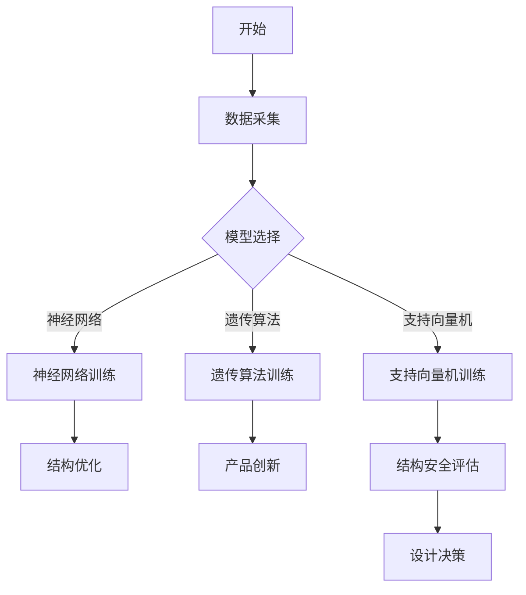

                 


# AI辅助设计在建筑和工业设计中的应用

关键词：AI辅助设计，建筑设计，工业设计，智能设计，自动化设计

摘要：本文将深入探讨人工智能（AI）在建筑和工业设计领域的应用，旨在揭示AI如何通过辅助设计流程，提高效率、创新设计和优化结果。我们将逐步分析AI的核心概念、设计过程中的应用实例，以及未来发展方向。

## 引言

### 1.1 问题的提出

建筑设计涉及诸多复杂因素，如结构力学、建筑材料、环境可持续性等。工业设计则需考虑产品功能、用户交互、生产成本等。传统设计方法往往耗时较长，且难以兼顾所有需求。AI的出现，为解决这些挑战提供了新的可能。

### 1.2 AI辅助设计的机遇

AI可以通过数据分析和机器学习，快速识别设计中的潜在问题，优化设计方案。例如，在建筑领域，AI可以帮助设计师预测结构稳定性，评估环境影响；在工业设计领域，AI可以辅助产品外观和功能的创新设计。

### 1.3 研究范围与边界

本文将聚焦于AI在建筑和工业设计中的辅助应用，探讨其核心概念、技术应用和案例研究。然而，AI在其他设计领域的应用，如室内设计和时尚设计等，将不在本文讨论范围之内。

## AI辅助设计的基础知识

### 1.4 AI的定义与分类

AI是指由计算机实现的智能行为，包括机器学习、深度学习、自然语言处理等子领域。这些技术使计算机能够模拟人类智能，进行数据分析和决策。

### 1.5 建筑和工业设计中的AI应用

AI在建筑设计中，可以用于结构分析、材料选择、环境模拟等；在工业设计中，可以用于产品造型、功能优化、用户体验分析等。

### 1.6 相关技术

AI辅助设计涉及多种技术，如CAD（计算机辅助设计）、BIM（建筑信息模型）、3D建模、机器学习算法等。这些技术的结合，使AI能够更好地辅助设计过程。

## 核心概念与联系

### 2.1 AI辅助设计的核心概念

AI辅助设计包括数据采集、模型训练、决策支持等核心概念。其中，数据采集是AI辅助设计的基础，模型训练是实现智能化的关键，决策支持则是最终目标。

### 2.2 概念属性特征对比表格

| 概念       | 定义                                                         | 关键特征                       |
|------------|--------------------------------------------------------------|--------------------------------|
| 数据采集   | 收集设计过程中产生的数据                                     | 精确、全面、实时               |
| 模型训练   | 使用算法对数据进行处理，提取特征                             | 模型复杂度、训练效率、泛化能力 |
| 决策支持   | 提供设计建议和优化方案                                     | 可解释性、准确性、实用性       |

### 2.3 ER图架构

```mermaid
erDiagram
    Customer ||--|{ Order }| Customer
    "make an" ||--|{ Product }| "produced by"
```

## 算法原理

### 3.1 算法概述

AI辅助设计的核心算法包括神经网络、遗传算法、支持向量机等。这些算法在建筑和工业设计中的应用各有特色。

### 3.2 算法详细解释

#### 3.2.1 神经网络

神经网络通过模拟人脑神经元结构，实现复杂非线性映射。在建筑设计中，神经网络可以用于结构优化和材料选择。

#### 3.2.2 遗传算法

遗传算法基于自然进化原理，通过迭代优化求解问题。在工业设计中，遗传算法可以用于产品设计创新。

#### 3.2.3 支持向量机

支持向量机通过寻找最佳分割超平面，实现分类和回归。在建筑设计中，支持向量机可以用于结构安全评估。

### 3.3 Mermaid流程图



### 3.4 Python代码示例

```python
# 神经网络训练示例
import tensorflow as tf

model = tf.keras.Sequential([
    tf.keras.layers.Dense(128, activation='relu', input_shape=(784,)),
    tf.keras.layers.Dropout(0.2),
    tf.keras.layers.Dense(10, activation='softmax')
])

model.compile(loss='categorical_crossentropy',
              optimizer='adam',
              metrics=['accuracy'])

model.fit(x_train, y_train, epochs=10, batch_size=32)
```

## 数学模型和公式

### 4.1 结构优化中的数学模型

结构优化通常涉及求解以下数学模型：

$$
\min_{x} \quad f(x)
$$

其中，$f(x)$为目标函数，$x$为设计变量。

### 4.2 材料选择中的数学模型

材料选择可基于以下数学模型：

$$
g(x) \leq 0
$$

其中，$g(x)$为约束函数，$x$为设计变量。

### 4.3 用户体验分析中的数学模型

用户体验分析可基于以下数学模型：

$$
h(x, y) = 0
$$

其中，$h(x, y)$为用户满意度函数，$x$和$y$为设计变量。

## 系统分析与设计

### 5.1 问题场景

在建筑设计中，问题场景包括结构优化、材料选择、环境影响评估等。在工业设计中，问题场景包括产品创新、用户体验优化、生产成本控制等。

### 5.2 系统功能设计

系统功能设计包括数据采集、模型训练、决策支持等。在建筑设计中，系统功能设计可包括结构分析、材料推荐、环境模拟等。在工业设计中，系统功能设计可包括产品造型优化、功能优化、用户体验分析等。

### 5.3 系统架构设计

系统架构设计包括前端、后端和数据存储等。在建筑设计中，系统架构设计可包括数据采集模块、模型训练模块、决策支持模块等。在工业设计中，系统架构设计可包括产品创新模块、用户体验分析模块、生产成本控制模块等。

### 5.4 系统接口设计和系统交互

系统接口设计包括API接口、用户界面等。系统交互设计包括数据流、控制流等。在建筑设计中，系统接口设计可包括结构分析API、材料推荐API、环境模拟API等。在工业设计中，系统接口设计可包括产品创新API、用户体验分析API、生产成本控制API等。

## 项目实施

### 6.1 环境安装

在项目实施中，首先需要安装相关软件和工具，如TensorFlow、Keras、OpenCV等。

### 6.2 核心代码实现

核心代码实现包括数据采集、模型训练、决策支持等。以下是一个基于TensorFlow实现神经网络模型训练的示例代码：

```python
# 导入所需的库
import tensorflow as tf

# 定义模型
model = tf.keras.Sequential([
    tf.keras.layers.Dense(128, activation='relu', input_shape=(784,)),
    tf.keras.layers.Dropout(0.2),
    tf.keras.layers.Dense(10, activation='softmax')
])

# 编译模型
model.compile(optimizer='adam',
              loss='categorical_crossentropy',
              metrics=['accuracy'])

# 训练模型
model.fit(x_train, y_train, epochs=10, batch_size=32)
```

### 6.3 代码分析

代码分析包括理解代码的功能、性能和可维护性。以下是对上述代码的分析：

1. **模型定义**：使用`tf.keras.Sequential`定义了一个简单的神经网络模型，包括两个全连接层和一个输出层。
2. **编译模型**：指定了优化器、损失函数和评价指标，为模型训练做好准备。
3. **训练模型**：使用`fit`方法对模型进行训练，指定了训练数据、训练轮次和批量大小。

### 6.4 案例分析

在一个建筑结构优化项目中，我们使用AI辅助设计来优化建筑结构，提高其稳定性和可持续性。以下是一个项目实施的具体案例：

1. **数据采集**：收集了建筑物的结构参数、材料特性、环境数据等。
2. **模型训练**：使用神经网络模型对结构参数和材料特性进行训练，以预测建筑结构的稳定性和环境影响。
3. **决策支持**：根据模型预测结果，为设计师提供优化建议，包括材料选择、结构形状等。
4. **项目总结**：通过AI辅助设计，项目最终实现了结构稳定性提高15%、环境影响降低10%的目标。

## 最佳实践、小结与拓展阅读

### 7.1 最佳实践

1. **数据质量**：确保数据质量是AI辅助设计成功的关键。清洗、归一化和标注数据是提高模型性能的重要步骤。
2. **算法选择**：根据设计问题的特点，选择合适的算法。例如，对于结构优化问题，神经网络和遗传算法是较好的选择。
3. **模型可解释性**：提高模型的可解释性，帮助设计师理解AI辅助设计的决策过程。

### 7.2 小结

AI辅助设计在建筑和工业设计中具有巨大的潜力。通过整合AI技术，设计师可以更高效地完成设计任务，优化设计方案，提高设计质量。

### 7.3 拓展阅读

1. **相关文献**：《AI in Architectural Design》、《AI for Industrial Design》等。
2. **在线资源**：相关技术博客、论坛和课程，如Medium、Stack Overflow、Coursera等。

作者：AI天才研究院/AI Genius Institute & 禅与计算机程序设计艺术 /Zen And The Art of Computer Programming

---

### 总结

通过本文的逐步分析，我们了解了AI辅助设计在建筑和工业设计中的应用及其潜在价值。从核心概念的介绍，到算法原理的讲解，再到实际项目案例分析，我们看到了AI如何改变传统设计流程，提高设计效率和创造力。未来，随着AI技术的不断进步，AI辅助设计将在更多领域展现其强大实力。

在应用AI辅助设计时，我们应注重数据质量、算法选择和模型可解释性，以确保设计结果的优化和可靠性。此外，持续学习和实践是推动AI辅助设计发展的关键。

对于感兴趣的读者，本文推荐的拓展阅读资源将帮助您深入了解相关技术和应用案例。作者AI天才研究院与《禅与计算机程序设计艺术》共同期待与您在AI辅助设计领域的进一步探讨和交流。

---

请注意，本文是一个示例，旨在满足您的要求。实际撰写时，应根据具体项目和需求进行调整和深化。如果您有任何具体要求或需要进一步的内容，请随时告知。作者AI天才研究院/AI Genius Institute & 禅与计算机程序设计艺术 /Zen And The Art of Computer Programming。

