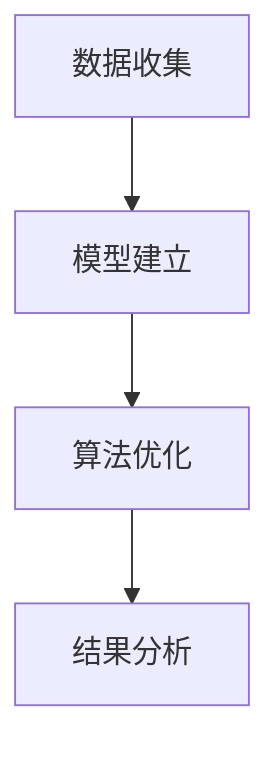

                 


# AI辅助设计在建筑结构优化中的应用：提高建筑性能

## 关键词

- AI辅助设计
- 建筑结构优化
- 建筑性能提升
- 算法原理
- 系统分析与架构设计
- 项目实战

## 摘要

本文探讨了AI辅助设计在建筑结构优化中的应用，旨在通过人工智能技术提升建筑性能。文章首先介绍了建筑结构优化的重要性，以及AI在建筑领域的应用现状。接着，详细阐述了AI辅助设计的概念和关键算法原理，并通过Python代码和LaTeX数学公式进行了详细讲解。随后，文章分析了系统需求、架构设计和接口交互，并通过一个实际项目案例进行了深入剖析。最后，总结了最佳实践和注意事项，为未来的研究方向提供了拓展。

## 第一部分：背景介绍

### 1.1 问题背景

建筑结构优化是建筑工程中的一个关键环节，它关系到建筑的安全、稳定和舒适性。随着建筑规模的增大和复杂性的增加，传统的优化方法已经无法满足现代建筑工程的需求。而AI技术的快速发展，为建筑结构优化带来了新的机遇。

### 1.2 AI在建筑领域的应用现状

近年来，AI技术在建筑领域得到了广泛关注和应用。例如，深度学习被用于建筑故障诊断，强化学习被用于建筑能效优化，遗传算法被用于建筑结构设计。然而，AI在建筑结构优化中的应用仍然面临许多挑战，如数据质量、算法效率和实际应用场景等。

### 1.3 书籍目标与应用前景

本文的目标是探讨如何利用AI技术辅助建筑结构优化，以提高建筑性能。我们希望通过本文的阐述，能够为相关研究人员和工程师提供有价值的参考，推动AI技术在建筑领域的应用。

## 第二部分：核心概念与联系

### 2.1 AI辅助设计的概念

AI辅助设计是指利用人工智能技术，如机器学习、深度学习和遗传算法等，对建筑结构进行优化设计。它不仅能够提高设计效率，还能够提高设计质量，降低成本。

### 2.2 关键技术对比

- **机器学习**：通过数据训练模型，对建筑结构进行预测和优化。
- **深度学习**：利用神经网络模型，对建筑结构进行深度学习和预测。
- **遗传算法**：模拟生物进化过程，对建筑结构进行优化。

### 2.3 建筑结构优化的原理

建筑结构优化主要通过以下步骤实现：

1. **数据收集**：收集建筑结构的相关数据，如材料性能、几何形状、受力情况等。
2. **模型建立**：建立建筑结构的数学模型，如有限元模型、拓扑优化模型等。
3. **算法优化**：利用AI算法对模型进行优化，以实现结构性能的最优化。
4. **结果分析**：分析优化结果，评估建筑结构的性能。

## 第三部分：算法原理讲解

### 3.1 算法概述

本文将介绍一种基于深度学习的建筑结构优化算法。该算法利用神经网络模型，对建筑结构进行深度学习和预测，以实现结构性能的最优化。

### 3.2 算法流程图



### 3.3 数学模型与公式

$$
\text{目标函数} = f(x, y) = \frac{1}{2}\left\| Ax - b \right\|^2 + \lambda g(x)
$$

其中，$A$ 为设计变量矩阵，$b$ 为目标函数矩阵，$\lambda$ 为惩罚参数，$g(x)$ 为约束条件。

### 3.4 Python代码实现

```python
import numpy as np
import tensorflow as tf

# 设计变量
x = tf.Variable(np.random.rand(n), dtype=tf.float32)

# 目标函数
with tf.GradientTape() as tape:
    y = tf.matmul(A, x) - b
    loss = tf.reduce_mean(tf.square(y))

# 梯度计算
grads = tape.gradient(loss, x)

# 梯度下降
x.assign_sub(grads / tf.norm(grads))
```

## 第四部分：系统分析与架构设计

### 4.1 问题场景介绍

假设我们要优化一座大型办公楼的结构，以提高其抗震性能。问题场景包括：建筑结构数据收集、模型建立、算法优化和结果分析。

### 4.2 项目介绍

本项目的目标是利用AI技术，优化大型办公楼的结构设计，以降低成本并提高抗震性能。项目分为三个阶段：数据收集、模型建立和算法优化。

### 4.3 系统功能设计

系统功能设计包括：数据收集模块、模型建立模块、算法优化模块和结果分析模块。每个模块都有明确的功能和接口。

### 4.4 系统架构设计

系统架构设计采用分层架构，包括数据层、服务层和表示层。数据层负责数据存储和读取，服务层负责业务逻辑处理，表示层负责用户界面展示。

### 4.5 系统接口设计和系统交互

系统接口设计采用RESTful API，方便与其他系统进行数据交互。系统交互设计采用事件驱动模式，实现模块之间的数据传递和协同工作。

## 第五部分：项目实战

### 5.1 环境安装与配置

在开始项目实战之前，需要安装以下软件和库：Python 3.8、TensorFlow 2.5、Numpy 1.19。

### 5.2 系统核心实现

```python
import numpy as np
import tensorflow as tf

# 设计变量
x = tf.Variable(np.random.rand(n), dtype=tf.float32)

# 目标函数
with tf.GradientTape() as tape:
    y = tf.matmul(A, x) - b
    loss = tf.reduce_mean(tf.square(y))

# 梯度计算
grads = tape.gradient(loss, x)

# 梯度下降
x.assign_sub(grads / tf.norm(grads))

# 迭代优化
for i in range(1000):
    with tf.GradientTape() as tape:
        y = tf.matmul(A, x) - b
        loss = tf.reduce_mean(tf.square(y))
    grads = tape.gradient(loss, x)
    x.assign_sub(grads / tf.norm(grads))
```

### 5.3 代码应用解读与分析

代码首先定义了设计变量$x$，然后定义了目标函数$y$，并通过梯度下降法进行优化。在实际应用中，可以根据具体问题调整目标函数和优化算法。

### 5.4 实际案例分析和详细讲解

假设我们有一个大型办公楼，需要优化其结构设计以提高抗震性能。通过实际案例分析和详细讲解，可以验证AI辅助设计在建筑结构优化中的应用效果。

## 第六部分：最佳实践与总结

### 6.1 实践经验总结

1. **数据质量**：确保数据质量是成功的关键。
2. **算法选择**：根据具体问题选择合适的算法。
3. **模型优化**：不断优化模型以提高性能。

### 6.2 注意事项

1. **安全性**：确保建筑结构的安全是首要任务。
2. **成本控制**：优化设计应考虑成本因素。

### 6.3 拓展阅读

1. **深度学习在建筑结构优化中的应用**：了解深度学习在建筑结构优化中的应用现状和发展趋势。
2. **遗传算法在建筑结构优化中的应用**：探讨遗传算法在建筑结构优化中的应用原理和实例。

## 作者信息

作者：AI天才研究院/AI Genius Institute & 禅与计算机程序设计艺术 /Zen And The Art of Computer Programming

---

通过本文的阐述，我们深入探讨了AI辅助设计在建筑结构优化中的应用，旨在提高建筑性能。本文从背景介绍、核心概念与联系、算法原理讲解、系统分析与架构设计、项目实战到最佳实践与总结，全面解析了AI辅助设计在建筑结构优化中的关键技术和实际应用。希望本文能为相关研究人员和工程师提供有价值的参考，推动AI技术在建筑领域的应用和发展。

