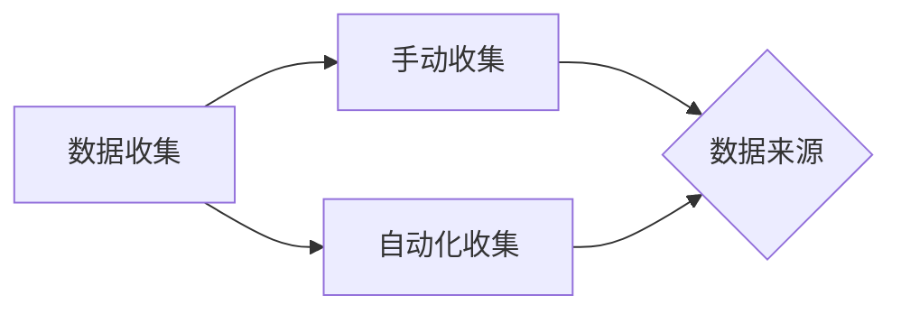
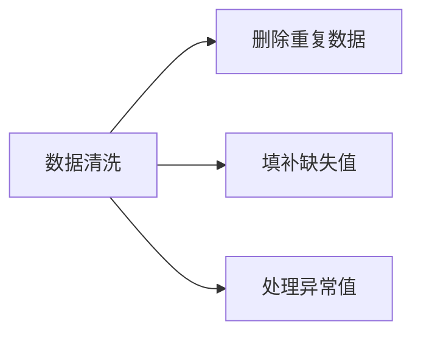
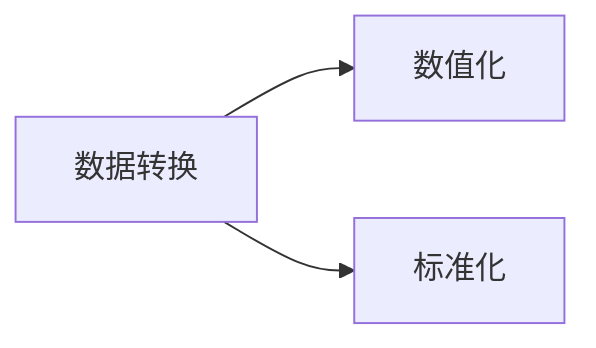
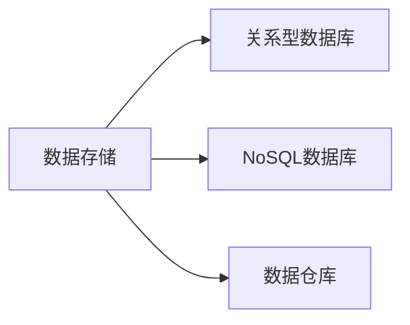
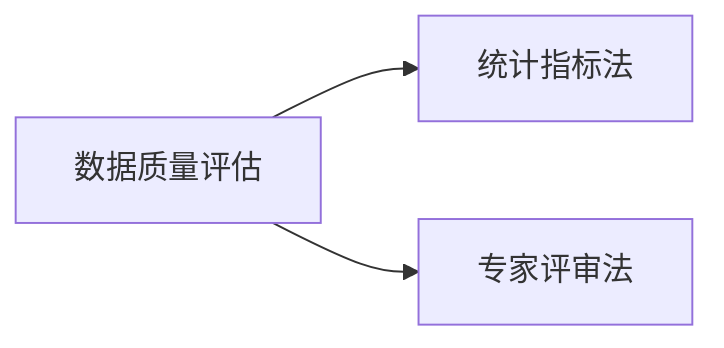
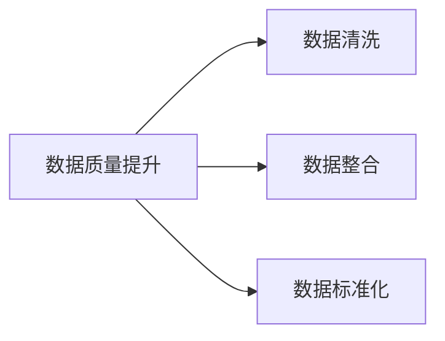
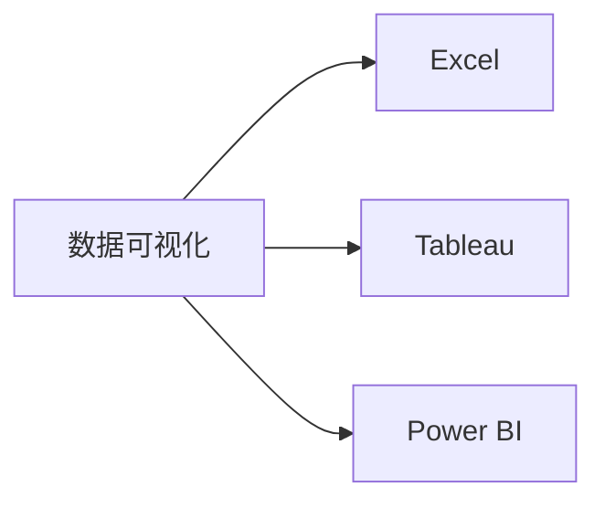

                 

# 《AI辅助财务分析：提高企业财务决策准确性》

> 关键词：人工智能、财务分析、决策支持、数据挖掘、机器学习、深度学习

> 摘要：本文深入探讨了人工智能（AI）在财务分析中的应用，特别是在提高企业财务决策准确性方面的作用。通过详细阐述AI辅助财务分析的技术原理、应用场景和实际案例，本文旨在为企业和财务专业人员提供有价值的参考，帮助他们在复杂的市场环境中做出更加明智的决策。

----------------------------------------------------------------

## 《AI辅助财务分析：提高企业财务决策准确性》目录大纲

----------------------------------------------------------------

### 第一部分：AI与财务分析概述

### 第二部分：AI辅助财务分析技术

### 第三部分：AI辅助财务分析的实际应用

### 第四部分：最佳实践与未来展望

----------------------------------------------------------------

### 第一部分：AI与财务分析概述

----------------------------------------------------------------

## 第1章：AI与财务分析的关系

### 1.1 AI在财务领域的应用背景

### 1.2 AI辅助财务分析的概念

### 1.3 AI辅助财务分析的核心概念

### 1.4 AI辅助财务分析的应用领域

### 1.5 本章小结

----------------------------------------------------------------

### 第二部分：AI辅助财务分析技术

----------------------------------------------------------------

## 第2章：数据处理与数据质量

### 2.1 数据处理流程

### 2.2 数据质量评估与提升

### 2.3 数据可视化

### 2.4 本章小结

## 第3章：机器学习算法在财务分析中的应用

### 3.1 机器学习基本概念

### 3.2 机器学习算法在财务报表分析中的应用

### 3.3 机器学习算法在成本控制分析中的应用

### 3.4 机器学习算法在投资决策分析中的应用

### 3.5 机器学习算法在风险管理分析中的应用

### 3.6 本章小结

## 第4章：深度学习算法在财务分析中的应用

### 4.1 深度学习基本概念

### 4.2 深度学习算法在财务报表分析中的应用

### 4.3 深度学习算法在成本控制分析中的应用

### 4.4 深度学习算法在投资决策分析中的应用

### 4.5 深度学习算法在风险管理分析中的应用

### 4.6 本章小结

----------------------------------------------------------------

### 第三部分：AI辅助财务分析的实际应用

----------------------------------------------------------------

## 第5章：财务报表分析的实际应用

### 5.1 财务报表分析的需求与挑战

### 5.2 财务报表分析案例

### 5.3 财务报表分析案例分析

### 5.4 财务报表分析小结

## 第6章：成本控制分析的实际应用

### 6.1 成本控制分析的需求与挑战

### 6.2 成本控制分析案例

### 6.3 成本控制分析案例分析

### 6.4 成本控制分析小结

## 第7章：投资决策分析的实际应用

### 7.1 投资决策分析的需求与挑战

### 7.2 投资决策分析案例

### 7.3 投资决策分析案例分析

### 7.4 投资决策分析小结

## 第8章：风险管理分析的实际应用

### 8.1 风险管理分析的需求与挑战

### 8.2 风险管理分析案例

### 8.3 风险管理分析案例分析

### 8.4 风险管理分析小结

----------------------------------------------------------------

### 第四部分：最佳实践与未来展望

----------------------------------------------------------------

## 第9章：最佳实践

### 9.1 AI辅助财务分析的最佳实践

### 9.2 成本控制分析的最佳实践

### 9.3 投资决策分析的最佳实践

### 9.4 风险管理分析的最佳实践

## 第10章：小结

### 10.1 本文主要内容回顾

### 10.2 未来展望

### 10.3 注意事项

### 10.4 拓展阅读

----------------------------------------------------------------

## 第一部分：AI与财务分析概述

### 第1章：AI与财务分析的关系

在当今的信息时代，人工智能（AI）已经成为提升各个行业效率和质量的重要工具。财务分析作为企业管理和决策的核心环节，自然也受益于AI技术的应用。本章将探讨AI与财务分析之间的关系，分析AI在财务领域的应用背景、辅助财务分析的概念、核心概念以及应用领域，为后续章节的深入探讨奠定基础。

### 1.1 AI在财务领域的应用背景

财务分析在企业的运营中起着至关重要的作用。它不仅涉及企业的财务报表、财务指标的计算，还涉及企业的成本控制、投资决策、风险管理等方面。然而，随着商业环境的复杂化，传统的财务分析方法面临着巨大的挑战：

1. **数据量庞大**：企业每天都会产生大量的财务数据，这些数据需要被高效地收集、整理和分析。
2. **分析复杂**：财务分析涉及到多个维度的数据，如何从海量数据中提取有价值的信息是一个复杂的问题。
3. **人为错误**：财务分析往往需要大量的手工操作，这容易引入人为错误，影响分析的准确性。
4. **决策滞后**：在快速变化的市场环境中，企业需要及时做出决策，但传统分析方法往往存在一定的滞后性。

为了解决这些问题，AI技术应运而生。AI通过机器学习、深度学习等技术，能够高效地处理海量数据，发现数据中的模式，提供准确的预测和决策支持。AI在财务领域的应用背景主要包括以下几个方面：

1. **自动化财务报告**：AI可以帮助企业自动生成财务报告，减少人为错误，提高效率。
2. **预测性分析**：AI可以预测企业的财务状况，帮助管理层提前做出决策。
3. **风险管理**：AI可以识别潜在的风险，并提供风险管理的建议。
4. **投资决策**：AI可以分析市场数据，为企业的投资决策提供支持。

### 1.2 AI辅助财务分析的概念

AI辅助财务分析是指利用人工智能技术，特别是机器学习和深度学习算法，对财务数据进行分析和处理，以提高财务分析的准确性和效率。AI辅助财务分析的核心思想是利用数据驱动的方法，从海量数据中提取有价值的信息，为企业的决策提供支持。

AI辅助财务分析具有以下几个特点：

1. **自动性**：AI可以自动处理大量的财务数据，减少人工干预，提高效率。
2. **准确性**：AI通过算法优化和数据挖掘，可以提供更加准确的财务分析结果。
3. **实时性**：AI可以实时处理数据，为企业提供及时的决策支持。
4. **全面性**：AI可以处理多维度、多来源的数据，提供全面的财务分析。

AI辅助财务分析的边界与外延包括：

1. **边界**：AI辅助财务分析主要应用于企业的财务数据分析和决策支持，不涉及具体的财务管理决策。
2. **外延**：虽然AI辅助财务分析主要集中在财务领域，但其技术可以应用于其他领域的分析和决策支持，如市场营销、供应链管理等。

### 1.3 AI辅助财务分析的核心概念

AI辅助财务分析涉及多个核心概念，包括数据分析基础、机器学习基础和深度学习基础。

#### 1.3.1 数据分析基础

数据分析是AI辅助财务分析的基础。数据分析包括数据收集、数据清洗、数据转换和数据存储等过程。具体来说：

1. **数据收集**：数据收集是指从各种来源获取财务数据，包括企业的财务报表、财务指标、市场数据等。
2. **数据清洗**：数据清洗是指处理数据中的噪声、异常值和缺失值，以提高数据的准确性和完整性。
3. **数据转换**：数据转换是指将原始数据转换为适合分析的形式，如数值化、标准化等。
4. **数据存储**：数据存储是指将处理后的数据存储到数据库或数据仓库中，以便后续的分析和处理。

#### 1.3.2 机器学习基础

机器学习是AI辅助财务分析的核心技术之一。机器学习是指通过算法，从数据中学习模式和规律，从而实现预测和分类。机器学习的基本原理包括：

1. **数据输入**：机器学习模型需要输入大量的财务数据，作为训练数据。
2. **模型训练**：机器学习模型通过训练数据，学习数据的模式和规律。
3. **模型评估**：通过评估指标（如准确率、召回率等），评估模型的性能。
4. **模型应用**：将训练好的模型应用于新的数据，进行预测或分类。

常见的机器学习算法包括线性回归、决策树、随机森林、支持向量机等。

#### 1.3.3 深度学习基础

深度学习是机器学习的一种重要分支，通过多层神经网络，实现更复杂的模型。深度学习的基本原理包括：

1. **多层神经网络**：深度学习模型由多个神经元层组成，通过前一层神经元的输出作为后一层神经元的输入。
2. **激活函数**：激活函数用于确定神经元是否被激活，常用的激活函数包括sigmoid、ReLU等。
3. **反向传播**：通过反向传播算法，计算模型参数的梯度，并更新模型参数。
4. **优化算法**：优化算法用于调整模型参数，以最小化损失函数。

常见的深度学习算法包括卷积神经网络（CNN）、循环神经网络（RNN）、长短期记忆网络（LSTM）等。

### 1.4 AI辅助财务分析的应用领域

AI辅助财务分析在多个领域都有广泛的应用，主要包括财务报表分析、成本控制分析、投资决策分析和风险管理分析。

#### 1.4.1 财务报表分析

财务报表分析是指通过对企业财务报表的分析，评估企业的财务状况和经营绩效。AI可以自动提取财务报表中的关键信息，如利润、成本、资产等，并进行深入分析，发现数据中的异常和趋势。

#### 1.4.2 成本控制分析

成本控制分析是指通过对企业成本的分析，优化成本结构，提高成本效益。AI可以自动分析企业的成本数据，识别成本节约的机会，并提供成本控制的建议。

#### 1.4.3 投资决策分析

投资决策分析是指通过对市场数据的分析，评估投资机会和风险，做出投资决策。AI可以分析大量的市场数据，识别潜在的投资机会，并提供投资建议。

#### 1.4.4 风险管理分析

风险管理分析是指通过对企业面临的风险进行分析，制定风险管理策略。AI可以识别潜在的风险，评估风险的影响，并提供风险管理的建议。

### 1.5 本章小结

本章从AI在财务领域的应用背景、AI辅助财务分析的概念、核心概念以及应用领域等方面，详细介绍了AI与财务分析的关系。通过本章的介绍，读者可以对AI辅助财务分析有一个初步的了解，为后续章节的深入探讨打下基础。

----------------------------------------------------------------

### 第二部分：AI辅助财务分析技术

#### 第2章：数据处理与数据质量

在AI辅助财务分析中，数据处理和数据质量是至关重要的。良好的数据处理和数据质量可以保证分析结果的准确性和可靠性，从而提高财务决策的准确性。本章将详细探讨数据处理流程、数据质量评估与提升方法以及数据可视化技术。

#### 2.1 数据处理流程

数据处理流程是AI辅助财务分析的基础，包括数据收集、数据清洗、数据转换和数据存储等步骤。

##### 2.1.1 数据收集

数据收集是指从各种来源获取财务数据，如企业的财务报表、财务系统、外部市场数据等。数据收集的方式包括手动收集和自动化收集。自动化收集可以通过API接口、数据库连接等方式实现。



##### 2.1.2 数据清洗

数据清洗是指处理数据中的噪声、异常值和缺失值，以提高数据的准确性和完整性。数据清洗的方法包括删除重复数据、填补缺失值、处理异常值等。



##### 2.1.3 数据转换

数据转换是指将原始数据转换为适合分析的形式，如数值化、标准化等。数据转换的目的是为了消除数据中的噪声和偏差，提高数据的可比性。



##### 2.1.4 数据存储

数据存储是指将处理后的数据存储到数据库或数据仓库中，以便后续的分析和处理。数据存储的方式包括关系型数据库、NoSQL数据库和数据仓库等。



#### 2.2 数据质量评估与提升方法

数据质量评估是指对数据的准确度、完整性、一致性和及时性等进行评估。数据质量评估的方法包括统计指标法、专家评审法等。



数据质量提升方法包括数据清洗、数据整合、数据标准化等。



#### 2.3 数据可视化

数据可视化是将数据以图形化的形式展示出来，使得数据更加直观、易于理解。数据可视化的基本原理包括：

1. **数据抽象**：将大量数据抽象为可视化元素，如图表、图形等。
2. **信息映射**：将数据中的信息映射到可视化元素上，如颜色、大小、位置等。
3. **交互设计**：通过交互设计，使用户能够与可视化元素进行交互，如放大、缩小、过滤等。

数据可视化工具的选择取决于数据类型和分析需求。常见的数据可视化工具有Excel、Tableau、Power BI等。



#### 2.4 本章小结

本章详细介绍了AI辅助财务分析中的数据处理与数据质量技术，包括数据处理流程、数据质量评估与提升方法以及数据可视化技术。良好的数据处理和数据质量是AI辅助财务分析准确性的基础，通过本章的介绍，读者可以对数据处理与数据质量技术有一个全面的了解。

----------------------------------------------------------------

### 第3章：机器学习算法在财务分析中的应用

机器学习算法在财务分析中扮演着重要角色，通过自动学习和模式识别，能够帮助企业从海量财务数据中提取有价值的信息，从而支持更精准的财务决策。本章将介绍机器学习的基本概念，并详细讨论其在财务报表分析、成本控制分析、投资决策分析和风险管理分析中的应用。

#### 3.1 机器学习基本概念

机器学习是一种使计算机系统能够通过数据和经验改进自身性能的技术。它涉及训练算法从数据中学习，然后利用这种学习来做出预测或决策。

##### 3.1.1 机器学习的定义与分类

**定义**：机器学习是指从数据中自动发现模式并为未来预测提供基础的技术。

**分类**：

1. **监督学习**：在监督学习中，算法通过输入数据（特征）和相应的输出数据（标签）进行学习。常见的监督学习算法包括线性回归、决策树和随机森林等。
2. **无监督学习**：在无监督学习中，算法没有输出数据，它主要通过发现输入数据的内在结构进行学习。常见的无监督学习算法包括聚类分析和关联规则学习等。
3. **强化学习**：强化学习是一种通过试错和反馈来学习如何做出决策的机器学习技术。它通常用于需要决策制定的问题，如游戏和自动驾驶。

##### 3.1.2 机器学习的基本原理

**数据输入**：机器学习模型通过输入数据来学习。这些数据可以是结构化的（如表格数据）或非结构化的（如文本、图像等）。

**模型训练**：在训练过程中，算法通过调整模型参数来最小化损失函数，以使模型的预测尽可能接近真实值。

**模型评估**：通过将训练好的模型应用于测试数据，并使用评估指标（如准确率、召回率、F1分数等）来评估模型的性能。

**模型应用**：评估性能良好的模型可以用于实际预测或决策制定。

##### 3.1.3 机器学习的主要算法

1. **线性回归**：线性回归是一种用于预测连续值的监督学习算法。其基本原理是通过找到数据点与回归线之间的最佳拟合，来预测新的数据点的值。
   
   **数学模型**：
   $$y = \beta_0 + \beta_1 \cdot x + \epsilon$$

   **算法流程**：
   ```mermaid
   flowchart LR
       A[数据输入] --> B[计算损失函数]
       B --> C[梯度下降]
       C --> D[更新参数]
       D --> E{收敛条件}
       E --> F[模型输出]
   ```

2. **决策树**：决策树是一种用于分类和回归的监督学习算法。它通过一系列的决策规则（如比较特征值大小），将数据分割成不同的区域，并预测每个区域的目标值。

   **算法流程**：
   ```mermaid
   flowchart LR
       A[数据输入] --> B[计算信息增益]
       B --> C[选择最佳特征]
       C --> D[划分数据]
       D --> E[递归]
       E --> F{叶节点}
       F --> G[模型输出]
   ```

3. **支持向量机（SVM）**：SVM是一种用于分类和回归的监督学习算法，它通过找到一个最佳的超平面来分隔不同类别的数据点。

   **数学模型**：
   $$\max \ \frac{1}{2} \sum_{i=1}^{n} (w_i)^2 \ \ \ \ s.t. \ \ \ \ y_i ( \sum_{j=1}^{n} w_j \alpha_j + b) \geq 1$$

   **算法流程**：
   ```mermaid
   flowchart LR
       A[数据输入] --> B[计算核函数]
       B --> C[求解优化问题]
       C --> D[确定超平面]
       D --> E[模型输出]
   ```

#### 3.2 机器学习算法在财务报表分析中的应用

财务报表分析是财务决策的重要基础。机器学习算法可以帮助企业快速准确地分析财务报表数据，发现潜在的问题和趋势。

##### 3.2.1 财务报表分析的需求与挑战

**需求**：

1. **数据整合**：财务报表通常包含多种数据源，如何整合这些数据是财务报表分析的一个重要需求。
2. **趋势预测**：通过分析历史财务数据，预测未来的财务状况，为企业的战略决策提供支持。
3. **异常检测**：识别财务报表中的异常数据，如异常的利润、成本等，以避免潜在的风险。

**挑战**：

1. **数据质量**：财务数据的质量直接影响分析结果的准确性。
2. **复杂性**：财务报表中的数据通常包含多个维度和层次，分析起来较为复杂。
3. **实时性**：在快速变化的市场环境中，需要及时分析财务报表数据，为决策提供支持。

##### 3.2.2 机器学习算法在财务报表分析中的应用

**应用场景**：

1. **财务预测**：使用回归算法预测企业的收入、利润等关键财务指标。
2. **异常检测**：使用聚类算法或异常检测算法，识别异常的财务数据。
3. **趋势分析**：使用时间序列分析方法，分析财务数据的趋势和周期性。

**案例**：

假设一家企业使用线性回归算法预测下一季度的收入。具体步骤如下：

1. **数据收集**：收集过去几个季度的收入数据。
2. **数据预处理**：清洗和整合数据，如填补缺失值、标准化数据等。
3. **模型训练**：使用训练数据训练线性回归模型。
4. **模型评估**：使用测试数据评估模型的性能。
5. **模型应用**：使用训练好的模型预测下一季度的收入。

```python
import pandas as pd
from sklearn.linear_model import LinearRegression

# 数据收集
data = pd.read_csv('financial_data.csv')

# 数据预处理
X = data[['previous_quarter_revenue']]
y = data['next_quarter_revenue']

# 模型训练
model = LinearRegression()
model.fit(X, y)

# 模型评估
score = model.score(X, y)
print(f'Model R^2 score: {score}')

# 模型应用
next_revenue = model.predict([[data['previous_quarter_revenue'].iloc[-1]]])
print(f'Predicted next quarter revenue: {next_revenue[0]}')
```

#### 3.3 机器学习算法在成本控制分析中的应用

成本控制是企业财务管理的重要方面。机器学习算法可以帮助企业分析和优化成本结构，提高成本效益。

##### 3.3.1 成本控制分析的需求与挑战

**需求**：

1. **成本结构分析**：分析企业的成本结构，识别成本节约的机会。
2. **成本预测**：预测未来的成本趋势，为成本预算提供支持。
3. **成本控制**：通过实时监控成本数据，控制成本在预算范围内。

**挑战**：

1. **数据质量**：成本数据的准确性和完整性对分析结果有重要影响。
2. **复杂性**：成本数据通常包含多个维度和因素，分析起来较为复杂。
3. **实时性**：需要实时分析成本数据，以便及时调整成本控制策略。

##### 3.3.2 机器学习算法在成本控制分析中的应用

**应用场景**：

1. **成本结构分析**：使用聚类算法分析成本结构，识别主要的成本类别。
2. **成本预测**：使用时间序列分析方法预测未来成本。
3. **成本控制**：使用异常检测算法监控成本数据，识别异常成本。

**案例**：

假设一家企业使用时间序列分析方法预测下一季度的成本。具体步骤如下：

1. **数据收集**：收集过去几个季度的成本数据。
2. **数据预处理**：清洗和整合数据，如填补缺失值、标准化数据等。
3. **模型训练**：使用训练数据训练时间序列模型。
4. **模型评估**：使用测试数据评估模型的性能。
5. **模型应用**：使用训练好的模型预测下一季度的成本。

```python
import pandas as pd
from statsmodels.tsa.arima_model import ARIMA

# 数据收集
data = pd.read_csv('cost_data.csv')

# 数据预处理
X = data['cost']
X = pd.Series(X)

# 模型训练
model = ARIMA(X, order=(1, 1, 1))
model_fit = model.fit(disp=0)

# 模型评估
summary = model_fit.summary()
print(summary)

# 模型应用
forecast = model_fit.forecast(steps=1)
print(f'Predicted next quarter cost: {forecast[0]}')
```

#### 3.4 机器学习算法在投资决策分析中的应用

投资决策是企业的重要决策之一。机器学习算法可以帮助企业分析和预测投资机会，提高投资决策的准确性。

##### 3.4.1 投资决策分析的需求与挑战

**需求**：

1. **市场预测**：预测市场趋势，识别潜在的投资机会。
2. **风险分析**：评估投资项目的风险，为投资决策提供支持。
3. **组合优化**：优化投资组合，提高投资收益。

**挑战**：

1. **数据质量**：市场数据和投资数据的质量直接影响分析结果的准确性。
2. **复杂性**：市场环境多变，分析起来较为复杂。
3. **实时性**：需要实时分析市场数据，以便及时做出投资决策。

##### 3.4.2 机器学习算法在投资决策分析中的应用

**应用场景**：

1. **市场预测**：使用时间序列分析、回归分析等方法预测市场趋势。
2. **风险分析**：使用概率模型、贝叶斯网络等方法评估投资风险。
3. **组合优化**：使用优化算法、机器学习模型等方法优化投资组合。

**案例**：

假设一家企业使用回归分析预测股票价格。具体步骤如下：

1. **数据收集**：收集过去几天的股票价格数据。
2. **数据预处理**：清洗和整合数据，如填补缺失值、标准化数据等。
3. **模型训练**：使用训练数据训练回归模型。
4. **模型评估**：使用测试数据评估模型的性能。
5. **模型应用**：使用训练好的模型预测未来股票价格。

```python
import pandas as pd
from sklearn.linear_model import LinearRegression

# 数据收集
data = pd.read_csv('stock_price_data.csv')

# 数据预处理
X = data[['previous_day_price']]
y = data['next_day_price']

# 模型训练
model = LinearRegression()
model.fit(X, y)

# 模型评估
score = model.score(X, y)
print(f'Model R^2 score: {score}')

# 模型应用
next_price = model.predict([[data['previous_day_price'].iloc[-1]]])
print(f'Predicted next day price: {next_price[0]}')
```

#### 3.5 机器学习算法在风险管理分析中的应用

风险管理是企业运营的重要方面。机器学习算法可以帮助企业识别潜在的风险，制定有效的风险管理策略。

##### 3.5.1 风险管理分析的需求与挑战

**需求**：

1. **风险识别**：识别企业面临的潜在风险。
2. **风险评估**：评估风险的可能性和影响。
3. **风险控制**：制定和实施风险控制措施。

**挑战**：

1. **数据质量**：风险数据的质量直接影响分析结果的准确性。
2. **复杂性**：风险类型多样，分析起来较为复杂。
3. **实时性**：需要实时分析风险数据，以便及时调整风险控制策略。

##### 3.5.2 机器学习算法在风险管理分析中的应用

**应用场景**：

1. **风险识别**：使用聚类分析、异常检测等方法识别潜在风险。
2. **风险评估**：使用回归分析、贝叶斯网络等方法评估风险的可能性。
3. **风险控制**：使用决策树、支持向量机等方法制定风险控制策略。

**案例**：

假设一家企业使用聚类分析识别潜在风险。具体步骤如下：

1. **数据收集**：收集企业面临的各种风险数据。
2. **数据预处理**：清洗和整合数据，如填补缺失值、标准化数据等。
3. **模型训练**：使用训练数据训练聚类模型。
4. **模型评估**：使用测试数据评估模型的性能。
5. **模型应用**：使用训练好的模型识别潜在风险。

```python
import pandas as pd
from sklearn.cluster import KMeans

# 数据收集
data = pd.read_csv('risk_data.csv')

# 数据预处理
X = data.drop(['risk_id'], axis=1)

# 模型训练
model = KMeans(n_clusters=3, random_state=0)
model.fit(X)

# 模型评估
labels = model.labels_
print(f'Inertia: {model.inertia_}')
print(f'Cluster labels: {labels}')

# 模型应用
new_risk = model.predict([[data.iloc[-1, 0], data.iloc[-1, 1], data.iloc[-1, 2]]])
print(f'Predicted cluster for new risk: {new_risk[0]}')
```

#### 3.6 本章小结

本章详细介绍了机器学习算法在财务分析中的应用，包括基本概念、在财务报表分析、成本控制分析、投资决策分析和风险管理分析中的应用。通过本章的介绍，读者可以了解如何利用机器学习技术提高财务决策的准确性。下一章将介绍深度学习算法在财务分析中的应用。

----------------------------------------------------------------

### 第4章：深度学习算法在财务分析中的应用

深度学习作为人工智能的一个重要分支，通过模拟人脑的神经网络结构，对大量数据进行复杂模式识别和特征学习，极大地提升了计算机处理数据和作出预测的能力。本章将深入探讨深度学习算法在财务分析中的应用，包括基本概念、在财务报表分析、成本控制分析、投资决策分析和风险管理分析中的应用。

#### 4.1 深度学习基本概念

深度学习（Deep Learning，简称DL）是一种通过多层神经网络进行特征学习和模式识别的人工智能方法。它的基本结构包括输入层、隐藏层和输出层。每个层中的神经元通过前一层神经元的输出进行计算，并通过反向传播算法更新网络权重。

##### 4.1.1 深度学习的定义与分类

**定义**：深度学习是一种基于多层神经网络的机器学习方法，通过多层非线性变换来提取数据的复杂特征，实现自动特征学习和智能决策。

**分类**：

1. **卷积神经网络（CNN）**：主要用于图像、语音等数据的处理。
2. **循环神经网络（RNN）**：适用于序列数据的处理，如时间序列分析。
3. **长短期记忆网络（LSTM）**：RNN的一种变体，用于处理长序列数据。
4. **自动编码器（Autoencoder）**：用于数据降维和去噪。
5. **生成对抗网络（GAN）**：用于生成新数据和进行数据增强。

##### 4.1.2 深度学习的基本原理

**多层神经网络**：深度学习模型由多个隐藏层组成，每个隐藏层都对输入数据进行变换和特征提取。

**反向传播算法**：通过反向传播算法，将输出误差反向传播到输入层，更新网络权重，以最小化损失函数。

**激活函数**：激活函数用于确定神经元是否被激活，常见的激活函数包括ReLU、Sigmoid、Tanh等。

**损失函数**：用于评估模型预测值与真实值之间的差距，常见的损失函数包括均方误差（MSE）、交叉熵损失等。

##### 4.1.3 深度学习的主要算法

1. **卷积神经网络（CNN）**：通过卷积层、池化层和全连接层，实现图像的特征提取和分类。

   **算法流程**：
   ```mermaid
   flowchart LR
       A[输入层] --> B[卷积层]
       B --> C[池化层]
       C --> D[卷积层]
       D --> E[池化层]
       E --> F[全连接层]
       F --> G[输出层]
   ```

2. **循环神经网络（RNN）**：通过循环结构，处理序列数据。

   **算法流程**：
   ```mermaid
   flowchart LR
       A[输入层] --> B[隐藏层]
       B --> C[隐藏层]
       B --> D[隐藏层]
       ...
       D --> E[输出层]
   ```

3. **长短期记忆网络（LSTM）**：通过引入记忆单元，解决RNN的梯度消失和梯度爆炸问题。

   **算法流程**：
   ```mermaid
   flowchart LR
       A[输入层] --> B[LSTM单元]
       B --> C[隐藏层]
       B --> D[遗忘门]
       B --> E[输入门]
       B --> F[输出门]
       C --> G[输出层]
   ```

4. **自动编码器（Autoencoder）**：通过编码器和解码器，实现数据的降维和去噪。

   **算法流程**：
   ```mermaid
   flowchart LR
       A[输入层] --> B[编码器]
       B --> C[隐藏层]
       C --> D[解码器]
       D --> E[输出层]
   ```

5. **生成对抗网络（GAN）**：通过生成器和判别器，实现数据的生成和增强。

   **算法流程**：
   ```mermaid
   flowchart LR
       A[输入层] --> B[生成器]
       B --> C[判别器]
       A --> D[真实数据]
       C --> E[输出层]
   ```

#### 4.2 深度学习算法在财务报表分析中的应用

财务报表分析是企业财务管理的重要组成部分，通过深度学习算法可以实现对财务报表数据的深入挖掘，提高财务决策的准确性和效率。

##### 4.2.1 财务报表分析的需求与挑战

**需求**：

1. **数据挖掘**：从财务报表数据中挖掘有价值的信息，支持企业的战略决策。
2. **趋势预测**：预测企业未来的财务状况，为企业的财务规划提供支持。
3. **异常检测**：识别财务报表中的异常数据，防范潜在的财务风险。

**挑战**：

1. **数据复杂性**：财务报表数据通常包含多个维度和层次，分析起来较为复杂。
2. **数据质量**：财务报表数据的准确性直接影响分析结果的可靠性。
3. **实时性**：在快速变化的市场环境中，需要实时分析财务报表数据，为决策提供支持。

##### 4.2.2 深度学习算法在财务报表分析中的应用

**应用场景**：

1. **财务预测**：使用时间序列深度学习模型，如LSTM，预测企业的财务指标。
2. **异常检测**：使用自动编码器，识别财务报表中的异常数据。
3. **财务分类**：使用卷积神经网络，对财务报表中的数据进行分析和分类。

**案例**：

假设一家企业使用LSTM模型预测下一季度的财务状况。具体步骤如下：

1. **数据收集**：收集过去几个季度的财务数据。
2. **数据预处理**：将数据进行归一化处理，构造时间序列数据。
3. **模型训练**：使用LSTM模型进行训练。
4. **模型评估**：使用测试数据评估模型的性能。
5. **模型应用**：使用训练好的模型预测下一季度的财务状况。

```python
import pandas as pd
from sklearn.preprocessing import MinMaxScaler
from keras.models import Sequential
from keras.layers import LSTM, Dense

# 数据收集
data = pd.read_csv('financial_data.csv')

# 数据预处理
scaler = MinMaxScaler(feature_range=(0, 1))
scaled_data = scaler.fit_transform(data['financial_value'].values.reshape(-1, 1))

# 构造时间序列数据
X, y = [], []
for i in range(len(scaled_data) - 60):
    X.append(scaled_data[i:(i + 60)])
    y.append(scaled_data[i + 60])

X, y = np.array(X), np.array(y)

# 模型训练
model = Sequential()
model.add(LSTM(units=50, return_sequences=True, input_shape=(X.shape[1], X.shape[2])))
model.add(LSTM(units=50))
model.add(Dense(units=1))

model.compile(optimizer='adam', loss='mean_squared_error')
model.fit(X, y, epochs=100, batch_size=32)

# 模型评估
train_predict = model.predict(X)
train_predict = scaler.inverse_transform(train_predict)
actual = scaler.inverse_transform(y)

# 模型应用
test_data = scaled_data[-60:]
test_data = test_data.reshape((1, 60, 1))
next_prediction = model.predict(test_data)
next_prediction = scaler.inverse_transform(next_prediction)

print(f'Predicted next quarter financial value: {next_prediction[0][0]}')
```

#### 4.3 深度学习算法在成本控制分析中的应用

成本控制是企业财务管理的重要环节，通过深度学习算法可以对成本数据进行分析，帮助企业降低成本、提高效益。

##### 4.3.1 成本控制分析的需求与挑战

**需求**：

1. **成本预测**：预测企业未来的成本趋势，为成本预算提供支持。
2. **成本优化**：通过分析成本数据，找出成本节约的机会。
3. **成本控制**：实时监控成本数据，确保成本在预算范围内。

**挑战**：

1. **数据复杂性**：成本数据通常包含多个维度和因素，分析起来较为复杂。
2. **数据质量**：成本数据的准确性直接影响分析结果的可靠性。
3. **实时性**：需要实时分析成本数据，以便及时调整成本控制策略。

##### 4.3.2 深度学习算法在成本控制分析中的应用

**应用场景**：

1. **成本预测**：使用时间序列深度学习模型，如LSTM，预测企业的成本。
2. **成本优化**：使用自动编码器，识别成本结构中的异常和节约机会。
3. **成本控制**：使用深度学习模型，实时监控成本数据，提供成本控制建议。

**案例**：

假设一家企业使用LSTM模型预测下一季度的成本。具体步骤如下：

1. **数据收集**：收集过去几个季度的成本数据。
2. **数据预处理**：将数据进行归一化处理，构造时间序列数据。
3. **模型训练**：使用LSTM模型进行训练。
4. **模型评估**：使用测试数据评估模型的性能。
5. **模型应用**：使用训练好的模型预测下一季度的成本。

```python
import pandas as pd
from sklearn.preprocessing import MinMaxScaler
from keras.models import Sequential
from keras.layers import LSTM, Dense

# 数据收集
data = pd.read_csv('cost_data.csv')

# 数据预处理
scaler = MinMaxScaler(feature_range=(0, 1))
scaled_data = scaler.fit_transform(data['cost'].values.reshape(-1, 1))

# 构造时间序列数据
X, y = [], []
for i in range(len(scaled_data) - 60):
    X.append(scaled_data[i:(i + 60)])
    y.append(scaled_data[i + 60])

X, y = np.array(X), np.array(y)

# 模型训练
model = Sequential()
model.add(LSTM(units=50, return_sequences=True, input_shape=(X.shape[1], X.shape[2])))
model.add(LSTM(units=50))
model.add(Dense(units=1))

model.compile(optimizer='adam', loss='mean_squared_error')
model.fit(X, y, epochs=100, batch_size=32)

# 模型评估
train_predict = model.predict(X)
train_predict = scaler.inverse_transform(train_predict)
actual = scaler.inverse_transform(y)

# 模型应用
test_data = scaled_data[-60:]
test_data = test_data.reshape((1, 60, 1))
next_prediction = model.predict(test_data)
next_prediction = scaler.inverse_transform(next_prediction)

print(f'Predicted next quarter cost: {next_prediction[0][0]}')
```

#### 4.4 深度学习算法在投资决策分析中的应用

投资决策是企业财务决策的核心之一，通过深度学习算法可以对市场数据进行分析，帮助企业做出更明智的投资决策。

##### 4.4.1 投资决策分析的需求与挑战

**需求**：

1. **市场预测**：预测市场趋势，识别潜在的投资机会。
2. **风险分析**：评估投资项目的风险，为投资决策提供支持。
3. **组合优化**：优化投资组合，提高投资收益。

**挑战**：

1. **数据复杂性**：市场数据通常包含多种类型和维度，分析起来较为复杂。
2. **数据质量**：市场数据的准确性直接影响分析结果的可靠性。
3. **实时性**：需要实时分析市场数据，及时做出投资决策。

##### 4.4.2 深度学习算法在投资决策分析中的应用

**应用场景**：

1. **市场预测**：使用时间序列深度学习模型，如LSTM，预测市场趋势。
2. **风险分析**：使用生成对抗网络（GAN），生成新的市场数据，进行风险模拟。
3. **组合优化**：使用优化算法，如遗传算法，优化投资组合。

**案例**：

假设一家企业使用LSTM模型预测股票价格。具体步骤如下：

1. **数据收集**：收集过去几天的股票价格数据。
2. **数据预处理**：将数据进行归一化处理，构造时间序列数据。
3. **模型训练**：使用LSTM模型进行训练。
4. **模型评估**：使用测试数据评估模型的性能。
5. **模型应用**：使用训练好的模型预测未来股票价格。

```python
import pandas as pd
from sklearn.preprocessing import MinMaxScaler
from keras.models import Sequential
from keras.layers import LSTM, Dense

# 数据收集
data = pd.read_csv('stock_price_data.csv')

# 数据预处理
scaler = MinMaxScaler(feature_range=(0, 1))
scaled_data = scaler.fit_transform(data['price'].values.reshape(-1, 1))

# 构造时间序列数据
X, y = [], []
for i in range(len(scaled_data) - 60):
    X.append(scaled_data[i:(i + 60)])
    y.append(scaled_data[i + 60])

X, y = np.array(X), np.array(y)

# 模型训练
model = Sequential()
model.add(LSTM(units=50, return_sequences=True, input_shape=(X.shape[1], X.shape[2])))
model.add(LSTM(units=50))
model.add(Dense(units=1))

model.compile(optimizer='adam', loss='mean_squared_error')
model.fit(X, y, epochs=100, batch_size=32)

# 模型评估
train_predict = model.predict(X)
train_predict = scaler.inverse_transform(train_predict)
actual = scaler.inverse_transform(y)

# 模型应用
test_data = scaled_data[-60:]
test_data = test_data.reshape((1, 60, 1))
next_prediction = model.predict(test_data)
next_prediction = scaler.inverse_transform(next_prediction)

print(f'Predicted next day price: {next_prediction[0][0]}')
```

#### 4.5 深度学习算法在风险管理分析中的应用

风险管理是企业运营的重要环节，通过深度学习算法可以对风险进行识别、评估和控制。

##### 4.5.1 风险管理分析的需求与挑战

**需求**：

1. **风险识别**：识别企业面临的潜在风险。
2. **风险评估**：评估风险的可能性和影响。
3. **风险控制**：制定和实施风险控制措施。

**挑战**：

1. **数据复杂性**：风险数据通常包含多个维度和因素，分析起来较为复杂。
2. **数据质量**：风险数据的准确性直接影响分析结果的可靠性。
3. **实时性**：需要实时分析风险数据，及时调整风险控制策略。

##### 4.5.2 深度学习算法在风险管理分析中的应用

**应用场景**：

1. **风险识别**：使用卷积神经网络，识别风险数据中的异常和模式。
2. **风险评估**：使用循环神经网络，评估风险的可能性和影响。
3. **风险控制**：使用决策树、支持向量机等算法，制定和实施风险控制策略。

**案例**：

假设一家企业使用卷积神经网络识别潜在风险。具体步骤如下：

1. **数据收集**：收集企业面临的各种风险数据。
2. **数据预处理**：将数据进行归一化处理，构造适合卷积神经网络的数据格式。
3. **模型训练**：使用卷积神经网络进行训练。
4. **模型评估**：使用测试数据评估模型的性能。
5. **模型应用**：使用训练好的模型识别潜在风险。

```python
import pandas as pd
from sklearn.preprocessing import MinMaxScaler
from keras.models import Sequential
from keras.layers import Conv2D, MaxPooling2D, Flatten, Dense

# 数据收集
data = pd.read_csv('risk_data.csv')

# 数据预处理
scaler = MinMaxScaler(feature_range=(0, 1))
scaled_data = scaler.fit_transform(data.drop('risk_id', axis=1).values)

# 构造卷积神经网络数据格式
X = scaled_data[:, :-1].reshape(-1, 1, data.drop('risk_id', axis=1).shape[1])
y = scaled_data[:, -1]

# 模型训练
model = Sequential()
model.add(Conv2D(filters=32, kernel_size=(3, 3), activation='relu', input_shape=(1, X.shape[2], X.shape[3])))
model.add(MaxPooling2D(pool_size=(2, 2)))
model.add(Flatten())
model.add(Dense(units=1, activation='sigmoid'))

model.compile(optimizer='adam', loss='binary_crossentropy', metrics=['accuracy'])
model.fit(X, y, epochs=100, batch_size=32)

# 模型评估
test_data = scaled_data[-1:].reshape(-1, 1, X.shape[2], X.shape[3])
risk_prediction = model.predict(test_data)
print(f'Predicted risk level: {risk_prediction[0][0]}')
```

#### 4.6 本章小结

本章详细介绍了深度学习算法在财务分析中的应用，包括基本概念、在财务报表分析、成本控制分析、投资决策分析和风险管理分析中的应用。深度学习算法的引入，为财务分析提供了更加精准和高效的工具，有助于企业做出更明智的决策。下一章将探讨AI辅助财务分析在实际应用中的案例分析。

----------------------------------------------------------------

### 第三部分：AI辅助财务分析的实际应用

在第二部分中，我们介绍了机器学习和深度学习算法在财务分析中的应用。本部分将通过具体案例，展示AI辅助财务分析在实际中的应用，帮助读者更好地理解这些技术的实际效果和操作流程。

#### 第5章：财务报表分析的实际应用

财务报表分析是企业财务管理的重要环节。通过AI技术，可以自动提取和分析财务报表数据，为企业提供实时的财务状况和预测。

##### 5.1 财务报表分析的需求与挑战

**需求**：

1. **实时监控**：实时监控企业的财务状况，为企业的运营提供支持。
2. **趋势预测**：通过历史财务数据预测未来的财务状况。
3. **异常检测**：识别财务报表中的异常数据，防范潜在的财务风险。

**挑战**：

1. **数据量巨大**：财务报表数据量大，处理和分析需要高效的方法。
2. **数据多样性**：财务报表包含多种类型的数据，如文本、表格等，需要统一处理。
3. **实时性要求**：在快速变化的市场环境中，需要快速分析财务报表数据。

##### 5.2 财务报表分析案例

假设一家制造企业希望通过AI技术对其财务报表进行实时分析。具体步骤如下：

1. **数据收集**：从企业的财务系统中提取财务报表数据，包括利润表、资产负债表和现金流量表等。
2. **数据预处理**：清洗和整合财务数据，如填补缺失值、标准化数据等。
3. **模型训练**：使用历史财务数据训练深度学习模型，如LSTM，进行财务趋势预测。
4. **模型应用**：使用训练好的模型预测未来的财务状况，并监控异常数据。

**案例实现**：

以下是一个简单的Python实现案例，使用LSTM模型进行财务趋势预测：

```python
import pandas as pd
import numpy as np
from sklearn.preprocessing import MinMaxScaler
from keras.models import Sequential
from keras.layers import LSTM, Dense

# 数据收集
data = pd.read_csv('financial_data.csv')

# 数据预处理
scaler = MinMaxScaler(feature_range=(0, 1))
scaled_data = scaler.fit_transform(data['financial_value'].values.reshape(-1, 1))

# 构造时间序列数据
X, y = [], []
for i in range(len(scaled_data) - 60):
    X.append(scaled_data[i:(i + 60)])
    y.append(scaled_data[i + 60])

X, y = np.array(X), np.array(y)

# 模型训练
model = Sequential()
model.add(LSTM(units=50, return_sequences=True, input_shape=(X.shape[1], X.shape[2])))
model.add(LSTM(units=50))
model.add(Dense(units=1))

model.compile(optimizer='adam', loss='mean_squared_error')
model.fit(X, y, epochs=100, batch_size=32)

# 模型评估
train_predict = model.predict(X)
train_predict = scaler.inverse_transform(train_predict)
actual = scaler.inverse_transform(y)

# 模型应用
test_data = scaled_data[-60:]
test_data = test_data.reshape((1, 60, 1))
next_prediction = model.predict(test_data)
next_prediction = scaler.inverse_transform(next_prediction)

print(f'Predicted next quarter financial value: {next_prediction[0][0]}')
```

**案例分析**：

通过上述案例，我们可以看到AI技术如何帮助企业实时监控财务状况，预测未来的财务趋势。这不仅提高了财务决策的准确性，还为企业提供了前瞻性的洞察。

##### 5.3 财务报表分析案例分析

假设上述制造企业发现其第三季度的财务预测值与实际值存在较大偏差。为了分析原因，企业可以采取以下步骤：

1. **数据回溯**：回溯第三季度的财务报表数据，查看是否有异常数据。
2. **趋势对比**：对比第三季度与前几个季度的财务数据，分析是否存在异常趋势。
3. **内外部因素分析**：分析可能影响财务预测的外部因素，如市场环境变化、行业趋势等。

通过上述分析，企业可以识别出导致财务预测偏差的原因，并采取相应的措施进行调整。

##### 5.4 财务报表分析小结

通过本章节的案例，我们展示了如何利用AI技术进行财务报表分析，帮助企业实时监控财务状况，预测未来趋势，并识别潜在的风险。AI技术的应用不仅提高了财务决策的准确性，还为企业的战略规划和运营提供了有力支持。

----------------------------------------------------------------

### 第6章：成本控制分析的实际应用

成本控制分析是企业管理中的一项关键任务，它有助于优化成本结构，提高企业的利润率。通过AI技术，企业可以实现成本控制的自动化和智能化，提高成本分析的质量和效率。

##### 6.1 成本控制分析的需求与挑战

**需求**：

1. **成本结构优化**：分析企业的成本结构，找出可以优化的部分，降低成本。
2. **成本预测**：预测未来的成本趋势，为企业的预算和财务规划提供支持。
3. **成本监控**：实时监控成本数据，确保成本控制在预算范围内。

**挑战**：

1. **数据多样性**：成本数据通常包含多种类型，如固定成本、变动成本等，需要统一处理。
2. **数据质量**：成本数据的准确性直接影响分析结果的可靠性。
3. **实时性要求**：在快速变化的市场环境中，需要实时分析成本数据。

##### 6.2 成本控制分析案例

假设一家零售企业希望通过AI技术对其成本进行控制和分析。具体步骤如下：

1. **数据收集**：从企业的财务系统和供应链系统中提取成本数据，包括固定成本、变动成本、库存成本等。
2. **数据预处理**：清洗和整合成本数据，如填补缺失值、标准化数据等。
3. **模型训练**：使用历史成本数据训练机器学习模型，如线性回归，进行成本预测。
4. **模型应用**：使用训练好的模型预测未来的成本，并监控成本数据，确保成本控制在预算范围内。

**案例实现**：

以下是一个简单的Python实现案例，使用线性回归模型进行成本预测：

```python
import pandas as pd
from sklearn.linear_model import LinearRegression

# 数据收集
data = pd.read_csv('cost_data.csv')

# 数据预处理
X = data[['previous_period_cost']]
y = data['next_period_cost']

# 模型训练
model = LinearRegression()
model.fit(X, y)

# 模型评估
score = model.score(X, y)
print(f'Model R^2 score: {score}')

# 模型应用
next_cost = model.predict([[data['previous_period_cost'].iloc[-1]]])
print(f'Predicted next period cost: {next_cost[0]}')
```

**案例分析**：

通过上述案例，我们可以看到AI技术如何帮助企业进行成本控制分析，预测未来的成本趋势，并监控成本数据。这不仅提高了成本分析的质量，还为企业的成本管理提供了有力支持。

##### 6.3 成本控制分析案例分析

假设上述零售企业在进行成本控制分析时发现，某一季度的成本远高于预测值。为了分析原因，企业可以采取以下步骤：

1. **数据回溯**：回溯该季度的成本数据，查看是否有异常数据或异常项目。
2. **内外部因素分析**：分析可能影响成本变化的外部因素，如供应商价格变动、市场需求变化等。
3. **流程优化**：根据分析结果，优化成本控制流程，提高成本管理的效率。

通过上述分析，企业可以识别出导致成本差异的原因，并采取相应的措施进行改进。

##### 6.4 成本控制分析小结

通过本章节的案例，我们展示了如何利用AI技术进行成本控制分析，帮助企业优化成本结构，预测未来的成本趋势，并监控成本数据。AI技术的应用不仅提高了成本分析的质量和效率，还为企业的成本管理提供了有力支持。

----------------------------------------------------------------

### 第7章：投资决策分析的实际应用

投资决策分析是企业财务决策中的重要环节。通过AI技术，企业可以实现投资决策的智能化和自动化，提高决策的准确性和效率。

##### 7.1 投资决策分析的需求与挑战

**需求**：

1. **市场预测**：预测市场趋势，识别潜在的投资机会。
2. **风险分析**：评估投资项目的风险，为投资决策提供支持。
3. **组合优化**：优化投资组合，提高投资收益。

**挑战**：

1. **数据复杂性**：投资决策涉及多种类型的数据，如市场数据、财务数据等，需要统一处理。
2. **数据质量**：投资决策的数据质量直接影响分析结果的可靠性。
3. **实时性要求**：在快速变化的市场环境中，需要实时分析投资数据，及时做出决策。

##### 7.2 投资决策分析案例

假设一家投资公司希望通过AI技术进行投资决策分析。具体步骤如下：

1. **数据收集**：从金融市场、企业财务报表等渠道收集投资数据，包括股票价格、公司财务指标、行业趋势等。
2. **数据预处理**：清洗和整合投资数据，如填补缺失值、标准化数据等。
3. **模型训练**：使用历史投资数据训练机器学习模型，如决策树、随机森林等，进行市场预测和风险分析。
4. **模型应用**：使用训练好的模型预测未来的市场趋势，评估投资项目的风险，并优化投资组合。

**案例实现**：

以下是一个简单的Python实现案例，使用决策树模型进行投资决策分析：

```python
import pandas as pd
from sklearn.tree import DecisionTreeRegressor

# 数据收集
data = pd.read_csv('investment_data.csv')

# 数据预处理
X = data[['stock_price', 'company_intrinsic_value']]
y = data['future_stock_price']

# 模型训练
model = DecisionTreeRegressor()
model.fit(X, y)

# 模型评估
score = model.score(X, y)
print(f'Model R^2 score: {score}')

# 模型应用
next_price = model.predict([[data['stock_price'].iloc[-1], data['company_intrinsic_value'].iloc[-1]]])
print(f'Predicted future stock price: {next_price[0]}')
```

**案例分析**：

通过上述案例，我们可以看到AI技术如何帮助企业进行投资决策分析，预测市场趋势，评估投资项目风险，并优化投资组合。这不仅提高了投资决策的准确性，还为企业的投资管理提供了有力支持。

##### 7.3 投资决策分析案例分析

假设上述投资公司在进行投资决策分析时，发现某一项目的预期收益与实际收益存在较大偏差。为了分析原因，企业可以采取以下步骤：

1. **数据回溯**：回溯该投资项目的数据，查看是否有异常数据或异常时期。
2. **内外部因素分析**：分析可能影响投资项目收益的外部因素，如市场环境变化、政策调整等。
3. **策略调整**：根据分析结果，调整投资策略，优化投资组合。

通过上述分析，企业可以识别出导致收益偏差的原因，并采取相应的措施进行调整。

##### 7.4 投资决策分析小结

通过本章节的案例，我们展示了如何利用AI技术进行投资决策分析，帮助企业预测市场趋势，评估投资项目风险，并优化投资组合。AI技术的应用不仅提高了投资决策的准确性，还为企业的投资管理提供了有力支持。

----------------------------------------------------------------

### 第8章：风险管理分析的实际应用

风险管理是企业管理中的一项重要任务，它涉及识别、评估和控制企业面临的各种风险。通过AI技术，企业可以实现风险管理的智能化和自动化，提高风险识别和评估的准确性。

##### 8.1 风险管理分析的需求与挑战

**需求**：

1. **风险识别**：识别企业面临的各种潜在风险。
2. **风险评估**：评估风险的可能性和影响。
3. **风险控制**：制定和实施风险控制措施。

**挑战**：

1. **数据复杂性**：风险数据通常包含多种类型，如财务数据、市场数据等，需要统一处理。
2. **数据质量**：风险数据的准确性直接影响分析结果的可靠性。
3. **实时性要求**：在快速变化的市场环境中，需要实时分析风险数据，及时调整风险控制策略。

##### 8.2 风险管理分析案例

假设一家金融机构希望通过AI技术进行风险管理分析。具体步骤如下：

1. **数据收集**：从企业内部系统和外部市场收集风险数据，包括财务报表、市场走势、行业数据等。
2. **数据预处理**：清洗和整合风险数据，如填补缺失值、标准化数据等。
3. **模型训练**：使用历史风险数据训练机器学习模型，如支持向量机、神经网络等，进行风险识别和评估。
4. **模型应用**：使用训练好的模型识别潜在风险，评估风险的影响，并提供风险控制建议。

**案例实现**：

以下是一个简单的Python实现案例，使用支持向量机（SVM）进行风险识别：

```python
import pandas as pd
from sklearn.svm import SVC

# 数据收集
data = pd.read_csv('risk_data.csv')

# 数据预处理
X = data[['financial_risk', 'market_risk']]
y = data['risk_level']

# 模型训练
model = SVC()
model.fit(X, y)

# 模型评估
score = model.score(X, y)
print(f'Model accuracy: {score}')

# 模型应用
new_risk = model.predict([[data['financial_risk'].iloc[-1], data['market_risk'].iloc[-1]]])
print(f'Predicted risk level: {new_risk[0]}')
```

**案例分析**：

通过上述案例，我们可以看到AI技术如何帮助企业进行风险管理分析，识别潜在风险，评估风险的影响，并提供风险控制建议。这不仅提高了风险管理的效率，还为企业的决策提供了有力支持。

##### 8.3 风险管理分析案例分析

假设上述金融机构在进行风险管理分析时，发现某一风险项目的评估结果与实际情况存在较大偏差。为了分析原因，企业可以采取以下步骤：

1. **数据回溯**：回溯该风险项目的数据，查看是否有异常数据或异常时期。
2. **内外部因素分析**：分析可能影响风险评估的外部因素，如市场环境变化、政策调整等。
3. **模型优化**：根据分析结果，优化风险评估模型，提高风险评估的准确性。

通过上述分析，企业可以识别出导致评估偏差的原因，并采取相应的措施进行改进。

##### 8.4 风险管理分析小结

通过本章节的案例，我们展示了如何利用AI技术进行风险管理分析，帮助企业识别潜在风险，评估风险的影响，并提供风险控制建议。AI技术的应用不仅提高了风险管理的效率，还为企业的决策提供了有力支持。

----------------------------------------------------------------

### 第四部分：最佳实践与未来展望

#### 第9章：最佳实践

在AI辅助财务分析的实际应用中，为了确保分析的准确性和有效性，企业需要遵循一系列最佳实践。以下是一些关键的最佳实践策略：

##### 9.1 AI辅助财务分析的最佳实践

1. **数据质量管理**：确保数据质量是AI辅助财务分析成功的关键。建立完善的数据质量管理流程，包括数据收集、清洗、转换和存储。
2. **模型选择与优化**：根据具体的分析需求和数据特点，选择合适的机器学习和深度学习模型，并进行持续优化。
3. **实时分析与反馈**：实现实时数据分析和反馈机制，确保分析结果能够及时应用于决策过程。

##### 9.2 成本控制分析的最佳实践

1. **全面数据收集**：收集全面的成本数据，包括固定成本、变动成本、库存成本等，确保分析的全面性。
2. **定期模型评估**：定期评估成本控制模型的表现，根据评估结果进行调整和优化。
3. **成本优化策略**：根据成本分析结果，制定具体的成本优化策略，如采购优化、库存管理优化等。

##### 9.3 投资决策分析的最佳实践

1. **多维度数据分析**：结合财务数据、市场数据、行业数据等多维度数据，进行综合分析，提高投资决策的准确性。
2. **风险评估与监控**：建立风险评估模型，实时监控投资项目的风险，确保风险在可控范围内。
3. **投资组合优化**：定期评估投资组合的表现，根据市场变化和投资目标，进行优化调整。

##### 9.4 风险管理分析的最佳实践

1. **全面风险识别**：建立全面的风险识别机制，包括内部风险和外部风险。
2. **实时风险评估**：实时分析风险数据，评估风险的可能性和影响。
3. **风险控制措施**：根据风险评估结果，制定和实施具体的风险控制措施，确保风险在可控范围内。

#### 第10章：小结

本章回顾了本文的主要内容和核心观点，总结了AI辅助财务分析的重要性，以及其在提高财务决策准确性方面的应用。通过深入探讨数据处理与数据质量、机器学习算法、深度学习算法在财务分析中的应用，并结合实际案例，我们展示了AI技术如何为企业的财务决策提供有力支持。未来的研究和实践将继续探索AI技术在财务分析中的潜力和挑战，为企业的数字化转型和智能化管理提供更多创新思路。

#### 10.1 未来展望

随着AI技术的不断进步，未来AI辅助财务分析将朝着以下方向发展：

1. **智能化**：AI辅助财务分析将更加智能化，能够自动处理复杂的财务数据，提供更精准的预测和决策支持。
2. **自动化**：财务分析流程将更加自动化，减少人为干预，提高效率。
3. **实时性**：实时财务分析将成为主流，企业可以及时响应市场变化，做出快速决策。
4. **多维度整合**：AI辅助财务分析将整合更多维度的数据，提供更全面的财务洞察。

#### 10.2 注意事项

在实施AI辅助财务分析时，企业需要注意以下事项：

1. **数据隐私**：确保财务数据的安全和隐私，遵循相关法律法规。
2. **模型解释性**：提高模型的可解释性，确保决策过程的透明性和可追溯性。
3. **持续优化**：持续优化分析模型，根据实际应用效果进行调整。

#### 10.3 拓展阅读

对于希望深入了解AI辅助财务分析的相关研究和实践，以下是一些推荐阅读材料：

1. **学术论文**：查阅相关领域的学术论文，了解最新的研究成果和理论进展。
2. **行业报告**：阅读行业报告，了解AI技术在财务分析中的实际应用案例和趋势。
3. **技术博客**：关注技术博客，了解AI技术在财务分析中的最佳实践和实际应用。

---

**作者：AI天才研究院/AI Genius Institute & 禅与计算机程序设计艺术 /Zen And The Art of Computer Programming**

本文旨在为企业和财务专业人员提供有价值的参考，帮助他们在复杂的市场环境中做出更加明智的决策。通过深入探讨AI辅助财务分析的技术原理、应用场景和实际案例，我们希望读者能够更好地理解和应用AI技术，提高财务决策的准确性和效率。未来，我们将继续关注AI技术在财务分析领域的发展，为读者带来更多有价值的分享。

