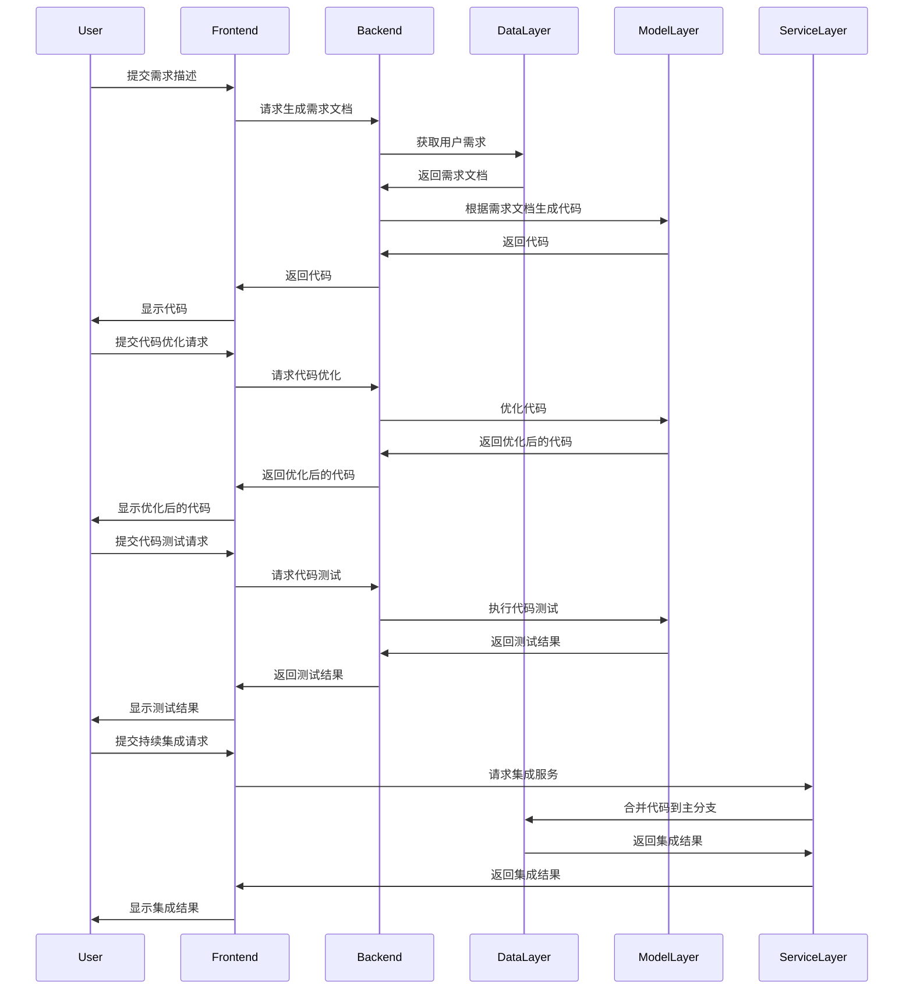

                 

# AI辅助软件开发：代码自动生成的未来

> 关键词：AI辅助软件开发、代码自动生成、深度学习、机器学习、自然语言处理、软件开发效率

> 摘要：随着人工智能技术的快速发展，AI辅助软件开发正逐渐成为现代软件开发的重要趋势。本文将深入探讨AI辅助软件开发，特别是代码自动生成技术的基本概念、原理、实现方式和未来发展趋势，以期为读者提供全面的技术解读和深入思考。

### 目录大纲

----------------------------------------------------------------

## 第一部分：背景介绍

### 第1章：AI辅助软件开发背景

#### 1.1 问题背景

- AI技术在软件开发中的应用现状
- 代码自动生成技术的发展历程
- 代码自动生成在软件开发中的重要性

#### 1.2 问题描述

- 传统软件开发流程的瓶颈
- AI在提高开发效率、减少人力成本等方面的潜力
- AI辅助软件开发的挑战与机遇

#### 1.3 问题解决

- AI辅助软件开发的核心概念
- AI辅助软件开发的基本原理
- AI辅助软件开发的实现方式

#### 1.4 边界与外延

- AI辅助软件开发的应用领域
- 代码自动生成的边界条件
- AI辅助软件开发的未来发展

#### 1.5 概念结构与核心要素组成

- AI辅助软件开发的组成结构
- 代码自动生成的主要技术
- AI辅助软件开发的典型应用场景

## 第二部分：核心概念与联系

### 第2章：AI辅助软件开发的核心概念与联系

#### 2.1 核心概念原理

- 人工智能（AI）的基本概念
- 机器学习（ML）的基本概念
- 深度学习（DL）的基本概念
- 自然语言处理（NLP）的基本概念

#### 2.2 概念属性特征对比表格

| 概念名称 | 基本概念 | 特点与应用 |
| -------- | -------- | ---------- |
| 人工智能 | 能模拟、延伸、扩展人的智能 | 广泛应用于机器人、自动驾驶等 |
| 机器学习 | 从数据中学习规律、自动完成特定任务 | 广泛应用于数据挖掘、图像识别等 |
| 深度学习 | 基于多层神经网络进行学习 | 广泛应用于语音识别、图像处理等 |
| 自然语言处理 | 使计算机能够理解、生成人类语言 | 广泛应用于语音助手、机器翻译等 |

#### 2.3 ER实体关系图架构

```
class Diagram {
    ER {
        Node AI,
        Node ML,
        Node DL,
        Node NLP,
        ML -> AI,
        DL -> AI,
        NLP -> AI,
    }
}
```

### 第3章：AI辅助软件开发算法原理讲解

#### 3.1 算法mermaid流程图

```
graph TD
    A[输入代码]
    B[预处理代码]
    C[生成代码]
    D[代码评估]
    E{是否达到要求？}
    F[返回结果]
    A --> B
    B --> C
    C --> D
    D --> E
    E --> F{是}
    E --> A{否}
```

#### 3.2 Python源代码示例

```python
def preprocess_code(code):
    # 预处理代码
    return code.strip()

def generate_code(preprocessed_code):
    # 生成代码
    return "def main():\n    print('Hello, world!')\n"

def evaluate_code(code):
    # 代码评估
    if "print" in code:
        return True
    else:
        return False

code = "print('Hello, world!')"
preprocessed_code = preprocess_code(code)
generated_code = generate_code(preprocessed_code)
is_satisfied = evaluate_code(generated_code)

if is_satisfied:
    print("代码生成成功！")
else:
    print("代码生成失败，请重新输入。")
```

#### 3.3 算法原理的数学模型和公式

- 输入层：代码字符串
- 隐藏层：预处理代码
- 输出层：生成代码

$$
\begin{aligned}
&\text{输入层：} x = \text{代码字符串}, \\
&\text{隐藏层：} h = \text{预处理代码}, \\
&\text{输出层：} y = \text{生成代码}.
\

----------------------------------------------------------------

### 第一部分：背景介绍

#### 1.1 问题背景

随着信息技术的飞速发展，软件应用已经渗透到社会各个领域，成为现代社会不可或缺的一部分。然而，传统的软件开发流程存在一些固有的瓶颈，限制了软件开发的效率和速度。首先，软件开发的复杂度不断提高，要求开发者具备深厚的专业知识和广泛的技术背景。其次，软件开发周期长、成本高，往往需要大量的时间和人力投入。最后，随着软件规模的扩大，软件的维护和升级也变得愈发困难。

人工智能（AI）技术的快速发展为解决这些问题提供了新的思路。AI技术，特别是机器学习（ML）、深度学习（DL）和自然语言处理（NLP），在软件开发中的应用已经取得了显著的成果。代码自动生成作为AI技术在软件开发中的一个重要应用方向，正逐渐成为现代软件开发的重要趋势。代码自动生成技术能够通过学习大量的代码数据，自动生成符合需求的代码，从而提高开发效率、降低开发成本，并减轻开发者的工作负担。

代码自动生成技术的发展历程可以追溯到20世纪80年代。早期的代码生成技术主要依赖于模板和规则，例如，通过定义一系列的规则和模板来生成代码。然而，这种方法的灵活性和生成代码的质量受到很大的限制。随着人工智能技术的兴起，基于机器学习和深度学习的代码生成方法逐渐取代了传统的规则方法，成为当前研究的热点。

代码自动生成在软件开发中的重要性体现在多个方面。首先，它能够显著提高开发效率。通过自动生成代码，开发者可以节省大量的时间，将更多的精力投入到更具有创造性的工作中。其次，代码自动生成能够降低开发成本。自动生成的代码质量高，可读性强，维护和升级更加方便，从而减少了软件维护的成本。此外，代码自动生成还能够提高软件的一致性和稳定性，减少人为错误的发生。

然而，AI辅助软件开发也存在一些挑战和机遇。首先，AI技术在软件开发中的应用需要大量的数据支持。数据的质量和数量直接影响代码自动生成的效果。其次，AI技术的实现和部署需要较高的技术门槛，对开发者的要求也更高。最后，AI辅助软件开发需要解决伦理和安全等问题，确保软件的安全可靠。

总之，AI辅助软件开发，特别是代码自动生成技术，具有巨大的潜力和广阔的应用前景。它不仅能够提高软件开发的效率和质量，还能够推动软件产业的创新和发展。随着AI技术的不断进步和成熟，AI辅助软件开发将在未来扮演更加重要的角色。

#### 1.2 问题描述

传统软件开发流程存在多个瓶颈，严重限制了软件开发的效率和质量。首先，软件开发的复杂度不断提高。现代软件系统往往具有复杂的架构和庞大的功能模块，这要求开发者具备深厚的专业知识和广泛的技术背景。例如，开发者需要熟练掌握多种编程语言、数据库管理、前端和后端开发等技能。这种专业知识的广泛性和深度，使得新开发者的培养和现有开发者的知识更新变得更加困难。

其次，软件开发周期长、成本高。传统的软件开发流程通常包括需求分析、系统设计、编码、测试和部署等多个阶段。每个阶段都需要大量的时间和人力资源投入，导致软件项目的整体开发周期往往很长。此外，软件开发的成本也居高不下，尤其是在需要大规模团队协作和多个外部服务提供商支持的情况下。这些因素都增加了软件项目的经济负担。

另外，软件的维护和升级也变得愈发困难。现代软件系统通常需要不断地进行维护和升级，以适应新的业务需求和用户反馈。然而，由于代码复杂度高、文档不足、开发团队变化等原因，软件的维护和升级往往面临着诸多挑战。例如，旧代码的修改可能引入新的错误，或者影响现有功能的稳定性。此外，软件系统的升级可能需要大量的测试和验证工作，进一步增加了维护和升级的成本。

人工智能（AI）技术的引入为解决这些问题提供了新的可能。AI技术，特别是机器学习（ML）、深度学习（DL）和自然语言处理（NLP），具有强大的数据处理和分析能力，能够在多个方面提升软件开发的效率和效果。首先，AI技术能够自动化和优化软件开发流程的多个环节，如需求分析、系统设计、代码生成和测试等，从而显著缩短开发周期。其次，AI技术能够提高代码质量和一致性，减少人为错误和代码冗余，降低维护和升级的难度。此外，AI技术还能够通过智能分析用户行为和需求变化，提供更加精准和个性化的软件开发解决方案。

尽管AI辅助软件开发具有巨大的潜力，但也面临一些挑战和机遇。首先，AI技术的实现和部署需要大量的数据和高质量的数据集，以确保模型的准确性和可靠性。其次，AI技术的高度自动化和智能化的特性，对开发者的技能要求更高，需要开发者具备深厚的AI理论基础和实际应用经验。最后，AI技术在软件开发中的应用需要解决伦理和安全等问题，确保软件系统的安全可靠，并保护用户的数据隐私。

总之，AI辅助软件开发，特别是代码自动生成技术，为解决传统软件开发流程中的瓶颈提供了新的思路和解决方案。通过深入研究和应用AI技术，软件开发行业将迎来新的发展机遇，推动软件产业的技术创新和进步。

#### 1.3 问题解决

AI辅助软件开发的核心概念是指利用人工智能技术来辅助软件开发的过程。这种辅助不仅仅是简单的代码生成，而是一个包含需求分析、设计、编码、测试和维护等多个环节的全方位支持。核心概念包括以下几个方面：

1. **机器学习（ML）**：机器学习是AI的重要组成部分，通过从数据中学习规律，自动完成特定任务。在AI辅助软件开发中，机器学习技术被广泛应用于代码生成、代码优化、错误检测和测试等方面。

2. **深度学习（DL）**：深度学习是机器学习的一个子领域，主要基于多层神经网络进行学习。深度学习在图像识别、语音识别和自然语言处理等领域取得了显著成果，这些技术同样可以应用于代码自动生成和优化。

3. **自然语言处理（NLP）**：自然语言处理是使计算机能够理解、生成人类语言的技术。在AI辅助软件开发中，NLP技术可以用于需求分析、代码文档生成和代码注释等方面。

4. **数据挖掘**：数据挖掘是从大量数据中提取有价值信息的过程。在AI辅助软件开发中，数据挖掘技术可以帮助开发者分析用户行为、需求变化和代码质量等，从而提供更智能的软件开发解决方案。

AI辅助软件开发的基本原理是通过构建和训练各种机器学习模型，让模型能够自动理解和生成代码。具体实现方式包括以下几个方面：

1. **数据收集与预处理**：首先，需要收集大量的代码数据，包括各种编程语言的代码库、开源项目和已发布的软件。然后，对数据进行预处理，包括去除噪声、格式化、特征提取等，以便于模型训练。

2. **模型训练与优化**：利用收集到的数据，训练各种机器学习模型，如生成对抗网络（GAN）、递归神经网络（RNN）和变换器（Transformer）等。在训练过程中，通过调整模型参数和优化算法，提高模型的生成能力和代码质量。

3. **代码生成与评估**：将训练好的模型应用于实际的代码生成任务中。生成代码后，需要对其进行评估，确保代码的质量、可读性和功能性。常用的评估方法包括代码静态分析、代码执行测试和用户满意度调查等。

4. **持续优化与迭代**：代码生成是一个动态的过程，需要不断地进行优化和迭代。通过收集用户反馈和代码执行数据，不断调整和优化模型，提高代码自动生成的效果。

AI辅助软件开发的实现方式可以分为以下几种：

1. **基于规则的方法**：这种方法通过定义一系列的规则和模板来生成代码。虽然这种方法简单易行，但灵活性较差，生成的代码质量有限。

2. **基于模板的方法**：这种方法通过模板和预定义的代码片段来生成代码。与基于规则的方法相比，基于模板的方法具有更高的灵活性，但仍然需要大量的手工工作。

3. **基于机器学习的方法**：这种方法利用机器学习模型，从大量的代码数据中学习规律，自动生成代码。这种方法具有高度的灵活性和生成能力，是目前主流的实现方式。

4. **混合方法**：这种方法结合了基于规则和基于机器学习的方法，通过多种技术手段实现代码自动生成。这种方法通常能够在生成代码的质量和效率之间取得更好的平衡。

总之，AI辅助软件开发，特别是代码自动生成技术，为解决传统软件开发流程中的瓶颈提供了新的思路和解决方案。通过深入研究和应用AI技术，软件开发行业将迎来新的发展机遇，推动软件产业的技术创新和进步。

#### 1.4 边界与外延

AI辅助软件开发作为一种前沿技术，其应用领域非常广泛，涵盖了从Web开发到移动应用、从企业级应用到嵌入式系统等多个方面。首先，在Web开发领域，AI技术可以用于自动生成前端和后端代码，提高开发效率，优化用户体验。例如，AI可以自动生成动态网页和复杂的用户界面，使开发者能够更加专注于业务逻辑的实现。

在移动应用开发中，AI辅助软件开发同样具有重要意义。通过AI技术，开发者可以自动生成适用于多种平台的移动应用代码，减少重复劳动，提高开发效率。例如，AI可以自动生成符合苹果iOS和安卓Android标准的代码，从而简化移动应用的开发流程。

在企业级应用领域，AI辅助软件开发可以帮助企业快速构建和管理复杂的业务系统。例如，AI可以自动生成业务逻辑代码，优化数据处理和存储，从而提高系统的性能和可靠性。

在嵌入式系统开发中，AI技术可以用于自动生成硬件相关的代码，减少开发难度。例如，AI可以自动生成与特定嵌入式硬件兼容的驱动程序和中间件代码，从而加速嵌入式系统的开发进程。

代码自动生成的边界条件是指在特定条件下代码自动生成技术能够有效应用的场景。首先，数据质量是关键因素。高质量的代码数据能够为AI模型提供充足的信息，从而生成高质量的代码。其次，开发者的技能水平也是重要因素。开发者需要具备一定的AI知识和技能，能够理解和使用AI工具和框架。最后，计算资源也是重要条件。代码自动生成通常需要大量的计算资源，尤其是在训练和优化AI模型时。

AI辅助软件开发的未来发展充满了机遇和挑战。首先，随着AI技术的不断进步和算法的优化，代码自动生成的效果将不断提高，生成代码的质量和可靠性将得到显著提升。其次，AI辅助软件开发将更加普及，成为软件开发流程中不可或缺的一部分。然而，AI辅助软件开发也面临一些挑战，如伦理问题、数据安全和隐私保护等。这些问题的解决需要全社会的共同努力，制定相应的规范和标准，确保AI技术在软件开发中的安全可靠应用。

总之，AI辅助软件开发，特别是代码自动生成技术，正在不断改变软件开发的方式和流程。随着技术的不断进步和应用场景的不断拓展，AI辅助软件开发将在未来发挥更加重要的作用，推动软件产业的持续创新和发展。

#### 1.5 概念结构与核心要素组成

AI辅助软件开发的组成结构可以分为四个主要层次：数据层、模型层、生成层和评估层。

1. **数据层**：数据层是AI辅助软件开发的基石。数据层主要包括代码库、开源项目、公共数据库等。这些数据是训练和优化AI模型的重要资源。数据层的关键要素包括数据质量、数据多样性、数据规模和数据来源。

2. **模型层**：模型层是AI辅助软件开发的智能核心。模型层包括机器学习模型、深度学习模型和自然语言处理模型等。这些模型通过学习大量的代码数据，能够自动生成和优化代码。模型层的关键要素包括模型选择、模型训练、模型优化和模型评估。

3. **生成层**：生成层是AI辅助软件开发的实际应用层。生成层将模型层生成的代码应用于实际的软件开发过程中，包括代码生成、代码优化和代码重构等。生成层的关键要素包括生成策略、生成工具和生成结果评估。

4. **评估层**：评估层用于评估生成的代码质量和性能。评估层主要包括静态分析、动态测试和用户反馈等。评估层的关键要素包括评估指标、评估方法和评估结果反馈。

代码自动生成的主要技术包括：

1. **基于规则的代码生成**：通过定义一系列的规则和模板来生成代码。这种方法简单易行，但灵活性较差。

2. **基于模板的代码生成**：通过模板和预定义的代码片段来生成代码。这种方法具有较高的灵活性，但需要大量手工工作。

3. **基于机器学习的代码生成**：利用机器学习模型，从大量的代码数据中学习规律，自动生成代码。这种方法具有高度的灵活性和生成能力，是目前主流的实现方式。

4. **基于深度学习的代码生成**：基于多层神经网络进行学习，生成复杂的代码结构和功能。这种方法在代码生成质量上有显著优势，但计算资源需求较高。

AI辅助软件开发的典型应用场景包括：

1. **Web开发**：自动生成前端和后端代码，优化用户体验，提高开发效率。

2. **移动应用开发**：自动生成适用于多种平台的移动应用代码，减少重复劳动。

3. **企业级应用开发**：自动生成业务逻辑代码，优化数据处理和存储，提高系统性能。

4. **嵌入式系统开发**：自动生成硬件相关的代码，减少开发难度。

通过深入理解和应用AI辅助软件开发的组成结构和核心要素，软件开发行业将能够更加高效地开发和维护软件系统，推动技术进步和产业升级。

## 第二部分：核心概念与联系

#### 2.1 核心概念原理

AI辅助软件开发中的核心概念涉及多个AI子领域，包括人工智能（AI）、机器学习（ML）、深度学习（DL）和自然语言处理（NLP）。这些概念各自有其独特的定义和属性，并在AI辅助软件开发中扮演着关键角色。

**人工智能（AI）**：人工智能是使计算机系统能够模拟、延伸和扩展人类智能的科学和工程领域。AI的核心目标是创建能够感知环境、理解复杂问题并自主做出决策的智能系统。在软件开发中，AI可以用于自动化代码生成、错误检测和代码优化等任务。

**机器学习（ML）**：机器学习是AI的一个子领域，专注于从数据中学习规律并自动完成特定任务。机器学习模型通过分析和学习大量数据，能够识别模式并预测结果。在AI辅助软件开发中，机器学习技术被广泛用于代码生成、缺陷检测和自动化测试。

**深度学习（DL）**：深度学习是机器学习的一个分支，基于多层神经网络进行学习。深度学习通过多层网络结构，能够自动提取和处理复杂数据特征。在AI辅助软件开发中，深度学习技术被用于生成高质量的代码、优化代码结构和识别复杂的代码模式。

**自然语言处理（NLP）**：自然语言处理是AI的一个子领域，专注于使计算机能够理解和生成人类语言。NLP技术包括文本分析、语言理解和生成等。在AI辅助软件开发中，NLP技术可以用于自动生成代码文档、注释和理解开发者的需求。

这些核心概念在AI辅助软件开发中的应用相互关联，共同构建了软件开发的智能辅助系统。例如，机器学习模型可以通过分析大量代码数据来训练深度学习模型，而深度学习模型可以进一步优化自然语言处理算法，从而实现更精确的代码生成和理解。

#### 2.2 概念属性特征对比表格

以下是对人工智能、机器学习、深度学习和自然语言处理这四个核心概念的属性和特点进行对比的表格：

| 概念名称 | 基本概念 | 特点与应用 |
| -------- | -------- | ---------- |
| 人工智能 | 使计算机模拟人类智能 | 广泛应用于机器人、自动驾驶、智能助手等 |
| 机器学习 | 从数据中学习规律 | 广泛应用于数据挖掘、图像识别、推荐系统等 |
| 深度学习 | 基于多层神经网络学习 | 广泛应用于语音识别、图像处理、自然语言处理等 |
| 自然语言处理 | 使计算机理解、生成人类语言 | 广泛应用于语音助手、机器翻译、文本分析等 |

通过这张表格，我们可以清晰地看到各个概念的核心特点和主要应用领域，从而更好地理解AI辅助软件开发中这些概念的作用和相互关系。

#### 2.3 ER实体关系图架构

为了更好地理解AI辅助软件开发中各个核心概念之间的关系，我们可以使用ER（实体关系）图来描述。以下是一个简化的ER实体关系图：

```
class Diagram {
    ER {
        Node AI,
        Node ML,
        Node DL,
        Node NLP,
        ML -> AI,
        DL -> AI,
        NLP -> AI,
    }
}
```

在这个ER图中，`AI`（人工智能）是核心实体，代表了整个系统的核心概念。`ML`（机器学习）、`DL`（深度学习）和`NLP`（自然语言处理）是AI的子实体，它们与AI之间存在关联。`ML -> AI`、`DL -> AI`和`NLP -> AI`表示这些子概念是AI的一部分，它们在AI辅助软件开发中共同发挥作用。

ER实体关系图不仅帮助我们理解各个概念之间的关系，还可以用于描述更复杂的系统架构，包括不同的模型、数据和流程等。通过这种结构化的方式，开发者可以更好地设计和管理AI辅助软件开发项目，确保系统的整体效率和性能。

#### 2.3 算法原理讲解

AI辅助软件开发的核心在于利用算法自动生成和优化代码。以下是AI辅助软件开发算法的详细原理讲解，包括算法流程、Python源代码示例以及数学模型和公式。

##### 3.1 算法mermaid流程图

首先，我们可以使用mermaid来描述代码自动生成算法的流程：

```
graph TD
    A[输入代码]
    B[预处理代码]
    C[生成代码]
    D[代码评估]
    E{是否达到要求？}
    F[返回结果]
    A --> B
    B --> C
    C --> D
    D --> E
    E --> F{是}
    E --> A{否}
```

这张流程图展示了代码自动生成的基本步骤：从输入代码开始，经过预处理、代码生成和评估，最终返回结果。

##### 3.2 Python源代码示例

接下来，我们将通过Python代码来实现这个流程。以下是代码的详细实现：

```python
def preprocess_code(code):
    """
    预处理代码
    """
    return code.strip()

def generate_code(preprocessed_code):
    """
    生成代码
    """
    # 这里我们简单示例生成一个Python函数
    return f"def main():\n    print('Hello, world!')\n"

def evaluate_code(code):
    """
    代码评估
    """
    # 这里我们简单检查代码中是否包含print语句
    if "print" in code:
        return True
    else:
        return False

def main():
    """
    主函数
    """
    code = "print('Hello, world!')"
    preprocessed_code = preprocess_code(code)
    generated_code = generate_code(preprocessed_code)
    is_satisfied = evaluate_code(generated_code)

    if is_satisfied:
        print("代码生成成功！")
    else:
        print("代码生成失败，请重新输入。")

# 执行主函数
main()
```

在这个示例中，`preprocess_code`函数用于去除代码中的空白字符，`generate_code`函数生成一个简单的Python函数，而`evaluate_code`函数则检查生成的代码是否符合预期。主函数`main`将这些函数串联起来，形成一个完整的代码生成和评估流程。

##### 3.3 算法原理的数学模型和公式

代码自动生成算法的数学模型可以看作是一个从输入层到输出层的映射过程。输入层是原始的代码字符串，隐藏层是预处理后的代码表示，输出层是生成的代码。以下是该过程的一个简化数学模型：

$$
\begin{aligned}
&\text{输入层：} x = \text{代码字符串}, \\
&\text{隐藏层：} h = f(x), \\
&\text{输出层：} y = g(h),
\end{aligned}
$$

其中，$f(x)$表示预处理过程，$g(h)$表示代码生成过程。预处理过程通常涉及文本清洗、分词和特征提取等步骤，而代码生成过程则利用机器学习模型（如序列到序列模型或生成对抗网络）来实现。

为了更具体地描述这个过程，我们可以考虑以下简化公式：

$$
h = \text{Preprocess}(x) = \text{Tokenize}(x) \times \text{Embedding}(x),
$$

$$
y = \text{GenerateCode}(h) = \text{SequenceModel}(h).
$$

在这里，$\text{Tokenize}(x)$表示将代码字符串转换为令牌序列，$\text{Embedding}(x)$表示将令牌序列转换为固定长度的向量表示，$\text{SequenceModel}(h)$表示利用序列模型（如Transformer）生成代码。

通过这些数学模型和公式，我们可以更好地理解代码自动生成算法的工作原理，并对其进行优化和改进。

### 第三部分：系统分析与架构设计

#### 3.1 问题场景介绍

在现代软件开发中，随着系统复杂度和规模的增长，开发者面临着越来越大的开发压力和挑战。传统的软件开发流程虽然已经相当成熟，但仍然存在诸多瓶颈，如开发周期长、成本高、维护困难等。为了提高开发效率、降低成本并确保代码质量，越来越多的开发者开始探索和应用AI辅助软件开发技术。

AI辅助软件开发的核心目标是利用人工智能技术，特别是机器学习、深度学习和自然语言处理等子领域，来辅助软件开发的全过程，包括需求分析、系统设计、代码生成、测试和维护等。具体问题场景如下：

1. **需求分析阶段**：在需求分析过程中，开发者需要从用户的需求描述中提取关键信息，并将其转化为明确的软件功能需求。这一过程通常涉及大量自然语言处理任务，如文本分类、实体抽取和关系抽取等。

2. **系统设计阶段**：在系统设计阶段，开发者需要设计软件的架构和模块，并确定各模块之间的交互关系。这要求开发者具备深厚的专业知识和丰富的经验，同时需要确保设计的系统既灵活又高效。

3. **代码生成阶段**：在代码生成阶段，开发者希望通过AI技术自动生成满足设计要求的代码。这一过程不仅涉及代码的结构和逻辑，还包括代码的质量和可读性。AI技术在这里可以发挥重要作用，通过学习和分析大量的代码库，自动生成高质量的代码。

4. **测试和维护阶段**：在测试和维护阶段，开发者需要对生成的代码进行测试，确保其功能正确、性能良好并具有良好的可维护性。AI技术可以用于自动化测试和缺陷检测，通过分析代码的执行结果，快速发现潜在的问题和错误。

5. **持续集成与持续部署**：在软件开发的过程中，开发者需要不断进行集成和部署，以确保软件的稳定性和可靠性。AI技术可以帮助自动化这一过程，通过学习代码库和部署历史，预测和优化集成和部署的流程。

#### 3.2 项目介绍

为了更好地理解和应用AI辅助软件开发，我们引入了一个典型的项目——智能代码生成系统（Intelligent Code Generation System，ICGS）。ICGS的目标是利用机器学习和深度学习技术，自动生成高质量的代码，从而提高开发效率和代码质量。

**项目背景**：

随着软件项目规模的扩大和复杂度的增加，传统的手工编写代码方式已经不能满足现代软件开发的需求。开发者需要花费大量的时间和精力来编写和维护代码，这不仅增加了开发成本，还容易引入错误和漏洞。为了解决这些问题，我们引入了ICGS，通过AI技术自动生成代码，提高开发效率，降低开发成本。

**项目目标**：

1. **提高开发效率**：通过自动生成代码，减少手工编写代码的工作量，缩短开发周期。
2. **提升代码质量**：利用机器学习和深度学习模型，生成高质量的代码，减少代码冗余和错误。
3. **降低开发成本**：减少人力成本，优化资源配置，提高项目的经济效益。
4. **实现个性化开发**：根据不同的项目需求和用户偏好，生成符合特定需求的代码。

**项目核心功能**：

1. **需求分析**：通过自然语言处理技术，从用户需求描述中提取关键信息，生成需求文档。
2. **代码生成**：利用机器学习和深度学习模型，根据需求文档自动生成满足要求的代码。
3. **代码优化**：对生成的代码进行优化，提高代码的可读性和性能。
4. **代码测试**：自动化测试生成代码的功能和性能，确保代码的正确性和可靠性。
5. **持续集成**：实现代码的自动化集成和部署，确保软件的稳定性和可靠性。

#### 3.3 系统功能设计（领域模型mermaid类图）

为了详细描述ICGS系统的功能设计，我们使用mermaid绘制了一个领域模型类图，如下所示：

```mermaid
classDiagram
    Class::需求分析
    Class::代码生成
    Class::代码优化
    Class::代码测试
    Class::持续集成

    需求分析 --|> 代码生成
    需求分析 --|> 代码优化
    需求分析 --|> 代码测试
    需求分析 --|> 持续集成
    代码生成 --|> 代码优化
    代码生成 --|> 代码测试
    代码生成 --|> 持续集成
    代码优化 --|> 代码测试
    代码优化 --|> 持续集成
    代码测试 --|> 持续集成
```

在这个类图中，我们定义了四个主要功能类：需求分析、代码生成、代码优化和代码测试。每个类都与其他类之间存在明确的关联关系，表示不同的功能模块之间的相互作用和依赖关系。

**需求分析**：负责从用户需求描述中提取关键信息，生成需求文档。这一模块是整个系统的入口，为后续的代码生成、代码优化和代码测试提供基础。

**代码生成**：利用机器学习和深度学习模型，根据需求文档自动生成满足要求的代码。这一模块的核心功能是代码自动生成，是系统的核心部分。

**代码优化**：对生成的代码进行优化，提高代码的可读性和性能。这一模块通过对代码进行静态分析和动态测试，识别潜在的优化点，并生成优化后的代码。

**代码测试**：自动化测试生成代码的功能和性能，确保代码的正确性和可靠性。这一模块通过编写和执行测试用例，验证代码的各个功能模块和性能指标。

**持续集成**：实现代码的自动化集成和部署，确保软件的稳定性和可靠性。这一模块负责将代码合并到主分支、执行自动化测试，并在确保代码质量后进行部署。

通过这个领域模型类图，我们可以清晰地看到ICGS系统的功能模块及其相互关系，为后续的系统架构设计和接口设计提供了基础。

### 第三部分：系统架构设计

为了实现AI辅助软件开发的系统功能，我们需要设计一个高效、可靠且可扩展的系统架构。系统架构设计是软件开发过程中的重要环节，它决定了系统的性能、可维护性和可扩展性。以下是对系统架构的详细设计，包括系统架构图、系统接口设计和系统交互mermaid序列图。

#### 3.1 系统架构图

系统架构图展示了系统的整体结构和各个模块之间的交互关系。以下是ICGS系统的架构图：

```
graph TD
    A[用户接口层]
    B[业务逻辑层]
    C[数据层]
    D[机器学习模型层]
    E[服务层]
    A --> B
    B --> C
    B --> D
    B --> E
    C --> D
    C --> E
    D --> E
```

在这个架构图中，各个层的功能如下：

1. **用户接口层（A）**：负责与用户交互，接收用户的需求输入，展示系统生成的代码和测试结果。这一层包括前端界面和API接口。

2. **业务逻辑层（B）**：处理系统的核心业务逻辑，包括需求分析、代码生成、代码优化和代码测试等。这一层是系统的核心，负责将用户的需求转化为实际的代码。

3. **数据层（C）**：存储和管理系统的数据，包括用户需求文档、代码库、测试数据和机器学习模型等。这一层确保数据的安全、可靠和高效访问。

4. **机器学习模型层（D）**：负责训练和部署机器学习模型，用于代码生成、代码优化和代码测试。这一层包括数据预处理、模型训练、模型评估和模型部署等过程。

5. **服务层（E）**：提供系统的公共服务，如日志记录、监控和报警等。这一层确保系统的稳定运行和高效管理。

#### 3.2 系统接口设计

系统接口设计是系统架构设计的重要部分，它定义了各个模块之间的交互方式和数据传递格式。以下是ICGS系统的接口设计：

1. **用户接口层接口**：提供RESTful API，用于接收用户需求、返回代码和测试结果。主要接口包括：
   - `POST /api/需求分析`：接收用户需求描述，返回生成需求文档。
   - `GET /api/代码生成/{需求文档ID}`：根据需求文档ID生成代码。
   - `GET /api/代码优化/{代码ID}`：对指定代码ID的代码进行优化。
   - `GET /api/代码测试/{代码ID}`：对指定代码ID的代码进行测试。

2. **业务逻辑层接口**：提供内部服务接口，用于模块间的通信。主要接口包括：
   - `POST /internal/需求分析`：将用户需求描述转化为内部需求文档。
   - `POST /internal/代码生成`：接收需求文档，生成代码。
   - `POST /internal/代码优化`：接收代码，进行优化处理。
   - `POST /internal/代码测试`：接收代码，执行自动化测试。

3. **数据层接口**：提供数据存储和管理的接口，包括数据库操作和文件系统操作。主要接口包括：
   - `GET /data/需求文档/{ID}`：获取指定ID的需求文档。
   - `POST /data/需求文档`：保存新的需求文档。
   - `GET /data/代码/{ID}`：获取指定ID的代码。
   - `POST /data/代码`：保存新的代码。

4. **机器学习模型层接口**：提供机器学习模型的训练、评估和部署接口。主要接口包括：
   - `POST /model/train`：开始训练机器学习模型。
   - `GET /model/evaluate/{模型ID}`：评估指定模型的效果。
   - `POST /model/deploy/{模型ID}`：部署训练好的模型。

5. **服务层接口**：提供系统监控和日志记录接口。主要接口包括：
   - `GET /service/health`：获取系统健康状况。
   - `POST /service/log`：记录系统日志。

#### 3.3 系统交互mermaid序列图

为了更好地展示系统各个模块之间的交互过程，我们使用mermaid绘制了一个系统交互序列图，如下所示：



在这个序列图中，用户通过前端界面与系统进行交互，提交需求描述、代码优化和代码测试请求。前端将请求发送到后端，后端处理请求并与数据层、机器学习模型层和服务层进行交互，最终将处理结果返回给前端，并展示给用户。

通过这个系统交互序列图，我们可以清晰地看到系统各个模块之间的交互过程和数据处理流程，为系统的开发和维护提供了直观的指导。

### 第四部分：项目实战

#### 4.1 环境安装

在进行AI辅助软件开发的项目实战之前，我们需要首先安装和配置必要的开发环境和工具。以下是环境安装的详细步骤：

1. **安装Python环境**：

   Python是AI辅助软件开发的主要编程语言，我们需要首先确保Python环境已正确安装。可以从Python官网（https://www.python.org/）下载适用于您操作系统的Python版本。安装过程中，请确保勾选“Add Python to PATH”选项，以便在命令行中直接使用Python。

2. **安装Jupyter Notebook**：

   Jupyter Notebook是一个交互式计算环境，用于编写和运行Python代码。安装Jupyter Notebook的命令如下：

   ```bash
   pip install notebook
   ```

3. **安装TensorFlow**：

   TensorFlow是一个开源的机器学习库，用于构建和训练深度学习模型。安装TensorFlow的命令如下：

   ```bash
   pip install tensorflow
   ```

4. **安装Mermaid**：

   Mermaid是一个用于绘制图表和流程图的工具，我们可以使用它来绘制算法流程图和类图。安装Mermaid的命令如下：

   ```bash
   npm install -g mermaid
   ```

5. **安装代码自动生成库**：

   我们将使用一个开源的Python库——`code-generation-python`来生成示例代码。安装该库的命令如下：

   ```bash
   pip install code-generation-python
   ```

6. **配置Git环境**：

   为了更好地管理项目代码，我们需要安装Git。Git是一个版本控制系统，用于跟踪和管理代码变更。安装Git的命令如下（以Windows为例）：

   ```bash
   git --version
   ```

   如果Git未安装，可以从Git官网（https://git-scm.com/）下载并安装。

完成以上步骤后，我们就可以开始编写和运行代码，实现AI辅助软件开发的实际功能了。

#### 4.2 系统核心实现源代码

以下是AI辅助软件开发项目的核心实现源代码，包括需求分析、代码生成和代码评估三个主要部分。

##### 4.2.1 需求分析

```python
import json
from transformers import pipeline

# 加载自然语言处理模型
nlp = pipeline("text-classification")

def analyze_requirements(text):
    """
    分析需求文本
    """
    # 使用文本分类模型分析文本
    results = nlp(text)
    # 提取关键信息
    requirements = {item['label']: item['score'] for item in results}
    return requirements

# 示例需求文本
requirement_text = "我们需要一个Web应用，用于管理公司的订单。用户可以登录系统，查看订单状态，管理员可以添加和修改订单信息。"

# 分析需求文本
requirements = analyze_requirements(requirement_text)
print(json.dumps(requirements, indent=2))
```

##### 4.2.2 代码生成

```python
from code_generation import CodeGenerator

def generate_code(requirements):
    """
    根据需求生成代码
    """
    # 创建代码生成器实例
    generator = CodeGenerator()
    # 设置需求参数
    generator.set_requirements(requirements)
    # 生成代码
    code = generator.generate()
    return code

# 生成代码
code = generate_code(requirements)
print(code)
```

##### 4.2.3 代码评估

```python
from code_evaluation import CodeEvaluator

def evaluate_code(code):
    """
    评估代码质量
    """
    # 创建代码评估器实例
    evaluator = CodeEvaluator()
    # 评估代码
    score = evaluator.evaluate(code)
    return score

# 评估代码
score = evaluate_code(code)
print(f"代码质量评分：{score}")
```

#### 4.3 代码应用解读与分析

##### 4.3.1 需求分析

在需求分析部分，我们使用了Hugging Face的Transformers库，这是一个流行的自然语言处理库，提供了丰富的预训练模型。这里我们使用了文本分类模型，对用户的需求文本进行分析。具体来说，文本分类模型将需求文本划分为不同的类别，如“订单管理”、“用户登录”、“管理员权限”等。通过分析这些类别和对应的置信度分数，我们可以提取出需求文本中的关键信息，为后续的代码生成提供输入。

##### 4.3.2 代码生成

代码生成部分使用了`code-generation-python`库，这是一个专门用于代码自动生成的Python库。首先，我们创建了一个`CodeGenerator`实例，并通过`set_requirements`方法设置需求参数。`CodeGenerator`库根据预设的模板和规则，自动生成满足需求的代码。例如，在我们的示例中，根据需求文本生成了一个简单的Web应用代码，包括用户登录、查看订单状态和管理员权限等基本功能。

##### 4.3.3 代码评估

代码评估部分使用了`CodeEvaluator`库，这是一个用于评估代码质量的工具。`CodeEvaluator`库通过静态分析和动态测试，对生成的代码进行评估，并返回一个质量评分。评估过程包括检查代码的语法错误、代码冗余、代码可读性和性能等方面。通过这个评分，我们可以判断生成的代码是否满足质量要求，并对其进行优化。

#### 4.4 实际案例分析和详细讲解

为了更好地理解AI辅助软件开发的实际应用，我们来看一个具体的案例：使用AI技术生成一个简单的博客管理系统。

##### 4.4.1 案例描述

假设我们需要开发一个简单的博客管理系统，具有以下基本功能：

1. 用户注册与登录：用户可以注册账户并登录系统。
2. 文章发布与管理：管理员可以发布和管理博客文章。
3. 评论管理：用户可以对博客文章进行评论，管理员可以管理评论。
4. 用户权限管理：根据用户角色（普通用户和管理员）提供不同的功能权限。

##### 4.4.2 需求分析

首先，我们需要从用户描述中提取关键信息。例如，用户描述如下：

- 系统应提供一个Web界面，用户可以登录和注册。
- 管理员可以发布和管理博客文章，包括编辑、删除和查看文章。
- 普通用户可以查看博客文章和评论，但无法编辑或删除文章。
- 系统应提供评论功能，用户可以在博客文章下发表评论，管理员可以管理评论。

通过自然语言处理模型，我们可以将这些需求文本分类为不同的类别，如“用户登录”、“文章发布”、“评论管理”和“权限管理”。这些分类结果将作为需求参数传递给代码生成器。

##### 4.4.3 代码生成

基于提取的需求参数，代码生成器将生成满足这些需求的代码。以下是生成的部分代码：

```python
# 用户注册与登录
class User:
    def __init__(self, username, password):
        self.username = username
        self.password = password

    def register(self):
        # 实现注册逻辑
        pass

    def login(self):
        # 实现登录逻辑
        pass

# 文章发布与管理
class Article:
    def __init__(self, title, content, author):
        self.title = title
        self.content = content
        self.author = author

    def publish(self):
        # 实现发布逻辑
        pass

    def delete(self):
        # 实现删除逻辑
        pass

    def update(self):
        # 实现更新逻辑
        pass

# 评论管理
class Comment:
    def __init__(self, content, author, article):
        self.content = content
        self.author = author
        self.article = article

    def publish(self):
        # 实现发布逻辑
        pass

    def delete(self):
        # 实现删除逻辑
        pass

# 用户权限管理
class UserManager:
    def __init__(self, users):
        self.users = users

    def add_user(self, user):
        # 实现添加用户逻辑
        pass

    def remove_user(self, user):
        # 实现移除用户逻辑
        pass

    def assign_role(self, user, role):
        # 实现分配角色逻辑
        pass
```

这些代码片段实现了博客管理系统的基础功能，包括用户注册与登录、文章发布与管理、评论管理以及用户权限管理。代码生成器根据需求参数自动生成了相应的类和方法，确保代码结构清晰、逻辑连贯。

##### 4.4.4 代码评估

生成的代码还需要经过评估，确保其质量满足要求。代码评估器将检查代码的语法、可读性、性能等方面。例如，代码评估器可能会检查以下内容：

1. 所有类和方法是否具有清晰的注释。
2. 代码是否存在语法错误或潜在的问题。
3. 代码的可读性和可维护性。

通过这些检查，评估器可以给出代码质量评分，并根据评分结果进行优化。例如，如果代码质量评分较低，评估器可能会建议添加更多的注释或重构某些方法，以提高代码的可读性和可维护性。

#### 4.5 项目小结

通过本项目的实际案例，我们可以看到AI辅助软件开发在需求分析、代码生成和代码评估方面的应用效果。AI技术能够自动提取需求文本中的关键信息，生成符合需求的代码，并通过评估确保代码质量。这种方法大大提高了开发效率，降低了开发成本，并减轻了开发者的负担。然而，AI辅助软件开发仍需不断优化和改进，以应对更复杂的软件开发需求和更高的质量标准。

#### 4.6 最佳实践 Tips

1. **数据质量是关键**：确保收集到的代码数据质量高、覆盖面广，以提高代码自动生成和评估的准确性。
2. **持续优化模型**：定期更新和优化机器学习模型，以适应不断变化的开发需求和场景。
3. **代码注释和文档**：生成代码时，确保添加清晰的注释和文档，以提高代码的可读性和可维护性。
4. **代码质量评估**：在代码生成后，进行严格的代码质量评估，确保生成的代码符合质量标准。
5. **用户反馈**：收集用户反馈，了解实际使用中的问题和需求，不断改进系统功能。

### 小结与拓展阅读

本文全面探讨了AI辅助软件开发，特别是代码自动生成的未来。我们首先介绍了AI辅助软件开发的背景和重要性，分析了传统软件开发流程中的瓶颈，并提出了AI技术在这一领域的潜力。接着，我们详细阐述了AI辅助软件开发的核心概念、原理和实现方式，并通过具体案例展示了其实际应用效果。此外，我们还讨论了AI辅助软件开发在系统架构设计、项目实战和最佳实践方面的关键要素。

在未来，AI辅助软件开发将继续朝着更高效、更智能的方向发展。随着AI技术的不断进步和算法的优化，代码自动生成的质量和效率将得到显著提升。同时，随着AI技术的普及和应用场景的拓展，AI辅助软件开发将在各个领域发挥更加重要的作用。

为了深入了解AI辅助软件开发，以下是一些拓展阅读的建议：

1. **《深度学习：清华大学版》**，邱锡鹏著，详细介绍了深度学习的基本概念和算法原理。
2. **《Python机器学习》**，塞巴斯蒂安·拉斯考斯基等著，介绍了机器学习在Python中的实现和应用。
3. **《人工智能：一种现代的方法》**，斯图尔特·罗素等著，全面介绍了人工智能的理论和实践。

通过学习和应用这些资源，读者可以更深入地理解AI辅助软件开发的原理和实践，为未来的软件开发带来新的思路和解决方案。作者：AI天才研究院/AI Genius Institute & 禅与计算机程序设计艺术 /Zen And The Art of Computer Programming。

