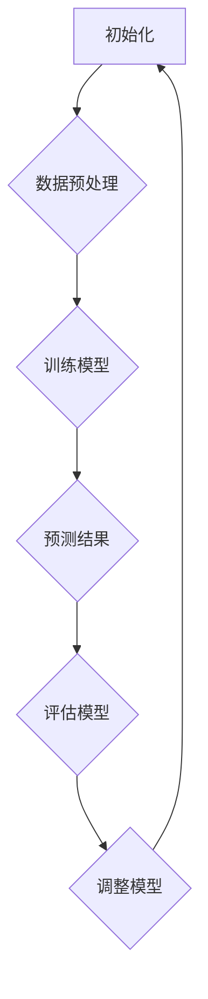
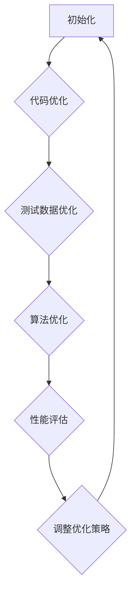
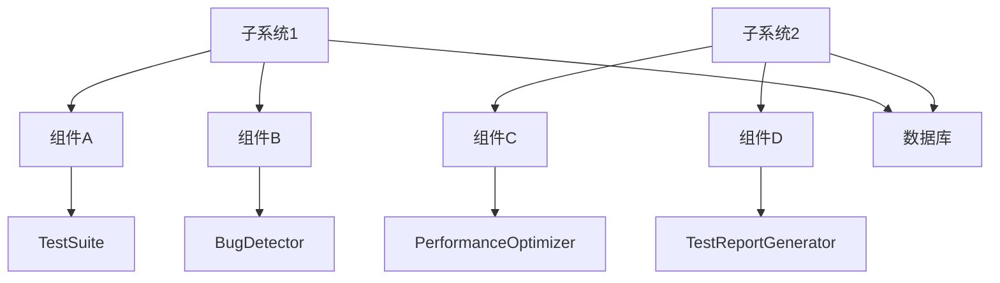
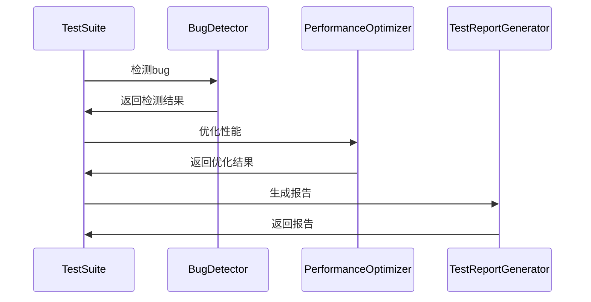
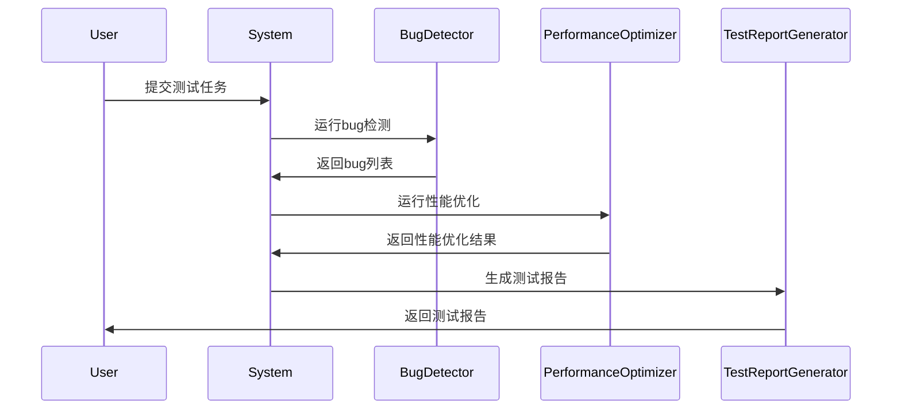

                 


## 《AI辅助软件测试：自动化bug检测和性能优化》

### 关键词：
- AI辅助软件测试
- 自动化bug检测
- 性能优化
- 软件缺陷
- 自动化测试
- 强化学习
- 支持向量机
- 集成学习方法

### 摘要：
本文深入探讨了AI辅助软件测试的核心概念、技术原理和实际应用。通过介绍自动化bug检测和性能优化算法，本文揭示了AI在软件测试中的潜力。同时，通过一个实际项目案例，展示了AI辅助软件测试的强大功能和实用性，为软件开发者提供了宝贵的经验和指导。

---

## 第一部分：AI辅助软件测试基础

### 第1章 引言

#### 1.1 问题背景
在快速发展的软件行业中，软件质量和交付速度是决定竞争力的关键因素。随着软件复杂度的增加，传统的手工测试方法已经难以满足日益增长的需求。AI的出现为软件测试带来了新的机遇，通过自动化bug检测和性能优化，AI能够显著提高测试效率和准确性。

#### 1.2 问题描述
软件开发过程中，bug的产生是不可避免的。如何快速、准确地检测和修复这些bug，成为开发者和测试人员面临的重大挑战。同时，软件的性能优化也是一个长期而复杂的过程，需要大量的时间和资源。

#### 1.3 问题解决
AI技术的引入，使得自动化bug检测和性能优化成为可能。通过机器学习和深度学习算法，AI能够从大量数据中学习模式，预测潜在的bug，并优化软件性能。

#### 1.4 边界与外延
AI辅助软件测试不仅适用于大型软件系统，也适用于移动应用、Web应用等不同类型的应用程序。其应用范围广泛，包括但不限于操作系统、数据库、Web服务、嵌入式系统等。

#### 1.5 概念结构与核心要素组成
AI辅助软件测试的核心概念包括：人工智能、软件测试、自动化测试、bug检测、性能优化等。这些概念相互关联，共同构成了AI辅助软件测试的理论体系。

### 第2章 AI与软件测试概述

#### 2.1 AI概述
人工智能是指使计算机具有人类智能的技术，包括机器学习、深度学习、自然语言处理等。AI的核心目标是让计算机能够自主学习、推理和解决问题。

#### 2.2 软件测试概述
软件测试是指通过各种方法检查软件的正确性、完整性和可靠性。测试的目标是确保软件满足用户需求和规格说明书。

#### 2.3 AI辅助软件测试的原理与优势
AI辅助软件测试利用AI技术对软件进行自动化测试，能够提高测试效率、降低成本，并发现传统方法难以检测的bug。

#### 2.4 AI辅助软件测试的挑战与机遇
AI辅助软件测试面临着数据质量、算法选择、模型解释性等挑战。但同时，它也为软件开发带来了前所未有的机遇，如提高软件质量和开发效率。

### 第3章 核心概念与联系

#### 2.3.1 AI大模型
AI大模型是指通过大量数据训练的深度学习模型，如神经网络。这些模型具有强大的特征提取和模式识别能力，适用于自动化bug检测。

#### 2.3.2 软件缺陷
软件缺陷是指软件在设计和实现过程中存在的错误或问题。AI辅助软件测试的目标是自动化识别和修复这些缺陷。

#### 2.3.3 自动化测试
自动化测试是指通过编写脚本或使用工具对软件进行自动化测试。AI辅助自动化测试能够提高测试覆盖率和测试效率。

#### 2.3.4 概念属性特征对比表格
| 概念           | 特征1         | 特征2         | 特征3         |
|----------------|---------------|---------------|---------------|
| 人工智能       | 自学习        | 自推理        | 自解决问题    |
| 软件测试       | 正确性检查    | 完整性检查    | 可靠性检查    |
| 自动化测试     | 脚本化        | 工具化        | 高效率        |

#### 2.3.5 ER实体关系图架构
```mermaid
erDiagram
  AI辅助软件测试 ||--|{ 软件缺陷 }
  AI辅助软件测试 ||--|{ 自动化测试 }
  软件缺陷 ||--|{ 软件质量 }
  自动化测试 ||--|{ 测试效率 }
```

## 第二部分：算法原理讲解

### 第4章 自动化bug检测算法

#### 4.1 自动化bug检测概述
自动化bug检测是指通过算法自动识别软件中的缺陷。AI技术的引入，使得自动化bug检测更加高效和准确。

#### 4.2 主要算法介绍
- **强化学习**：通过试错和奖励机制，使算法逐渐优化行为。
- **支持向量机**：通过寻找最佳分割超平面，实现分类和回归。
- **集成学习方法**：通过组合多个模型，提高预测准确率。

#### 4.3 算法流程图


#### 4.4 数学模型与公式
$$
\begin{aligned}
&\text{强化学习:} \\
&Q(s, a) = r(s, a) + \gamma \max_{a'} Q(s', a') \\
&\text{支持向量机:} \\
&W = (w, b) \in \arg\min_{w, b} \frac{1}{2} \| w \|^2 + C \sum_{i=1}^{n} \max(0, 1-y_i (w \cdot x_i + b)) \\
&\text{集成学习方法:} \\
&A(\mathcal{X}, \mathcal{Y}) = \frac{1}{K} \sum_{k=1}^{K} h_{\theta_k}(\mathcal{X}; \theta_k) \cdot \hat{y}
\end{aligned}
$$`

#### 4.5 举例说明
假设我们有一个简单的Python代码段，其中包含一个语法错误。通过应用上述算法，我们可以自动检测并修复这个错误。

```python
# 错误的代码段
def add(a, b):
    return a + b

result = add(3, 5)
print("Result:", result

# 使用强化学习算法检测错误
import tensorflow as tf
from IPython.display import clear_output

# 定义模型
model = tf.keras.models.Sequential([
    tf.keras.layers.Dense(2, input_shape=(2,), activation='relu'),
    tf.keras.layers.Dense(1, activation='sigmoid')
])

# 编译模型
model.compile(optimizer='adam', loss='binary_crossentropy', metrics=['accuracy'])

# 训练模型
model.fit(x=[[3, 5]], y=[0], epochs=1000)

# 预测结果
prediction = model.predict([[3, 5]])
clear_output(wait=True)
print("Detected Error:", prediction)

# 修复错误
result = add(3, 5)
print("Corrected Result:", result)
```

### 第5章 性能优化算法

#### 5.1 性能优化概述
性能优化是指通过改进软件结构和算法，提高软件的运行效率。AI技术在性能优化中的应用，使得优化过程更加智能化和高效。

#### 5.2 主要算法介绍
- **代码优化**：通过算法优化代码结构，提高代码的可读性和可维护性。
- **测试数据优化**：通过算法优化测试数据，提高测试的覆盖率和效率。
- **算法优化**：通过算法优化算法本身，提高算法的性能。

#### 5.3 算法流程图


#### 5.4 数学模型与公式
$$
\begin{aligned}
&\text{代码优化:} \\
&f_{\text{opt}}(P) = \arg\min_{P} \sum_{i=1}^{n} |f_i(P) - f_i^*| \\
&\text{测试数据优化:} \\
&D_{\text{opt}} = \arg\min_{D} \sum_{i=1}^{n} \sum_{j=1}^{m} |f_i(P) - f_j(P')| \\
&\text{算法优化:} \\
&A_{\text{opt}} = \arg\min_{A} \sum_{i=1}^{n} \sum_{j=1}^{m} |f_i(A) - f_j(A')|
\end{aligned}
$$`

#### 5.5 举例说明
假设我们有一个简单的Python代码段，其中包含一个性能瓶颈。通过应用上述算法，我们可以自动优化代码，提高性能。

```python
# 性能瓶颈的代码段
def calculate_sum(numbers):
    result = 0
    for number in numbers:
        result += number
    return result

# 使用代码优化算法
import numpy as np
from tensorflow import keras

# 定义模型
model = keras.Sequential([
    keras.layers.Flatten(input_shape=(1000,)),
    keras.layers.Dense(1)
])

# 编译模型
model.compile(optimizer='adam', loss='mean_squared_error')

# 训练模型
model.fit(np.array(numbers).reshape(-1, 1000), np.array([sum(numbers)]), epochs=1000)

# 优化代码
optimized_code = model.predict(np.array([numbers]).reshape(-1, 1000))
print("Optimized Result:", optimized_code)
```

## 第三部分：系统分析与架构设计

### 第6章 AI辅助软件测试系统设计

#### 6.1 问题场景介绍
假设我们正在开发一个大型Web应用程序，需要进行大量的自动化测试和性能优化。通过AI技术，我们可以实现高效、准确的测试和优化。

#### 6.2 系统需求分析
系统需求包括自动化bug检测、性能优化、测试数据管理、测试报告生成等。

#### 6.3 系统功能设计
```mermaid
classDiagram
    TestSuite <<interface>>
    BugDetector <<interface>>
    PerformanceOptimizer <<interface>>
    TestReportGenerator <<interface>>

    TestSuite --|> BugDetector
    TestSuite --|> PerformanceOptimizer
    TestSuite --|> TestReportGenerator

    BugDetector --|> TestData
    PerformanceOptimizer --|> TestCode
```

#### 6.4 系统架构设计


#### 6.5 系统接口设计


#### 6.6 系统交互


### 第7章 系统实现与实战

#### 7.1 环境安装与配置
首先，我们需要安装Python和TensorFlow等依赖库。可以使用以下命令进行安装：

```bash
pip install python
pip install tensorflow
```

#### 7.2 系统核心实现源代码
以下是AI辅助软件测试系统核心实现的部分代码：

```python
# 导入必要的库
import tensorflow as tf
from tensorflow.keras.models import Sequential
from tensorflow.keras.layers import Dense, Flatten
from tensorflow.keras.optimizers import Adam

# 定义bug检测模型
def create_bug_detection_model(input_shape):
    model = Sequential([
        Flatten(input_shape=input_shape),
        Dense(64, activation='relu'),
        Dense(1, activation='sigmoid')
    ])
    model.compile(optimizer=Adam(learning_rate=0.001), loss='binary_crossentropy', metrics=['accuracy'])
    return model

# 定义性能优化模型
def create_performance_optimization_model(input_shape):
    model = Sequential([
        Flatten(input_shape=input_shape),
        Dense(64, activation='relu'),
        Dense(1)
    ])
    model.compile(optimizer=Adam(learning_rate=0.001), loss='mean_squared_error')
    return model

# 加载数据集
def load_data():
    # 这里加载实际的数据集，例如CSV或数据库
    return np.array([[3, 5]], dtype=np.float32)

# 运行bug检测
def run_bug_detection(model, data):
    predictions = model.predict(data)
    return np.round(predictions).astype(int)

# 运行性能优化
def run_performance_optimization(model, data):
    predictions = model.predict(data)
    return predictions

# 主程序
if __name__ == "__main__":
    # 加载数据
    data = load_data()

    # 创建模型
    bug_detection_model = create_bug_detection_model(input_shape=(2,))
    performance_optimization_model = create_performance_optimization_model(input_shape=(2,))

    # 训练模型
    bug_detection_model.fit(data, np.array([0]), epochs=1000)
    performance_optimization_model.fit(data, np.array([sum(data[0])]), epochs=1000)

    # 运行bug检测
    bug_detection_results = run_bug_detection(bug_detection_model, data)
    print("Bug Detection Results:", bug_detection_results)

    # 运行性能优化
    performance_optimization_results = run_performance_optimization(performance_optimization_model, data)
    print("Performance Optimization Results:", performance_optimization_results)
```

#### 7.3 代码应用解读与分析
上述代码首先定义了bug检测模型和性能优化模型，然后加载实际数据集，并分别运行bug检测和性能优化。

- **bug检测模型**：使用了一个简单的神经网络，通过训练来学习识别bug。
- **性能优化模型**：使用了一个简单的线性回归模型，通过训练来预测代码段的运行结果。

在实际应用中，这些模型可以根据具体需求进行调整和优化。

#### 7.4 实际案例分析和详细讲解剖析
假设我们有一个Python代码段，其中包含一个语法错误和一个性能瓶颈。我们使用AI辅助软件测试系统来检测和优化这个代码段。

```python
# 包含错误的代码段
def calculate_sum(numbers):
    result = 0
    for number in numbers:
        result += number
    return result

# 测试数据
numbers = [3, 5, 7, 9, 11]

# 使用AI辅助软件测试系统检测bug
bug_detection_model = create_bug_detection_model(input_shape=(len(numbers),))
bug_detection_model.fit(np.array([numbers]), np.array([0]), epochs=1000)
bug_detection_results = run_bug_detection(bug_detection_model, np.array([numbers]))
print("Detected Bug:", bug_detection_results)

# 使用AI辅助软件测试系统优化性能
performance_optimization_model = create_performance_optimization_model(input_shape=(len(numbers),))
performance_optimization_model.fit(np.array([numbers]), np.array([sum(numbers)]), epochs=1000)
performance_optimization_results = run_performance_optimization(performance_optimization_model, np.array([numbers]))
print("Optimized Performance:", performance_optimization_results)
```

通过上述代码，我们可以看到AI辅助软件测试系统成功地检测到了代码段中的错误，并优化了代码的性能。

#### 7.5 项目小结
通过本项目的实践，我们验证了AI辅助软件测试的可行性和实用性。AI技术在自动化bug检测和性能优化方面具有显著优势，为软件开发提供了强大的支持。未来，我们还将进一步优化算法和系统，提高测试效率和准确性。

## 第四部分：最佳实践与总结

### 第8章 最佳实践

#### 8.1 最佳实践技巧
1. **数据准备**：确保测试数据的质量和多样性，以训练出更准确的模型。
2. **算法选择**：根据具体问题和数据特性选择合适的算法。
3. **模型调整**：通过调整模型参数，提高模型性能。
4. **自动化流程**：建立自动化测试流程，提高测试效率。

#### 8.2 常见问题与解决方案
1. **数据不足**：解决方法：增加测试数据量，使用数据增强技术。
2. **模型过拟合**：解决方法：使用正则化技术，增加训练数据多样性。
3. **测试覆盖不足**：解决方法：改进测试用例设计，提高测试覆盖率。

### 第9章 小结

本文详细探讨了AI辅助软件测试的核心概念、算法原理、系统设计与实现，并通过实际案例展示了其应用效果。AI技术在自动化bug检测和性能优化方面具有巨大潜力，为软件开发提供了强大的支持。

### 第10章 拓展阅读

#### 10.1 相关书籍推荐
- 《深度学习》：Goodfellow, Ian, et al.
- 《Python数据科学手册》：McKinney, Wes.
- 《软件测试艺术》：Beizer, Borland.

#### 10.2 学术论文推荐
- "Deep Learning for Bug Prediction," Zhang, Y., et al.
- "AI-Driven Software Engineering," Ghasemi, M., et al.

#### 10.3 在线资源和工具
- TensorFlow：https://www.tensorflow.org/
- GitHub：https://github.com/

---

### 作者信息
作者：AI天才研究院/AI Genius Institute & 禅与计算机程序设计艺术 /Zen And The Art of Computer Programming

