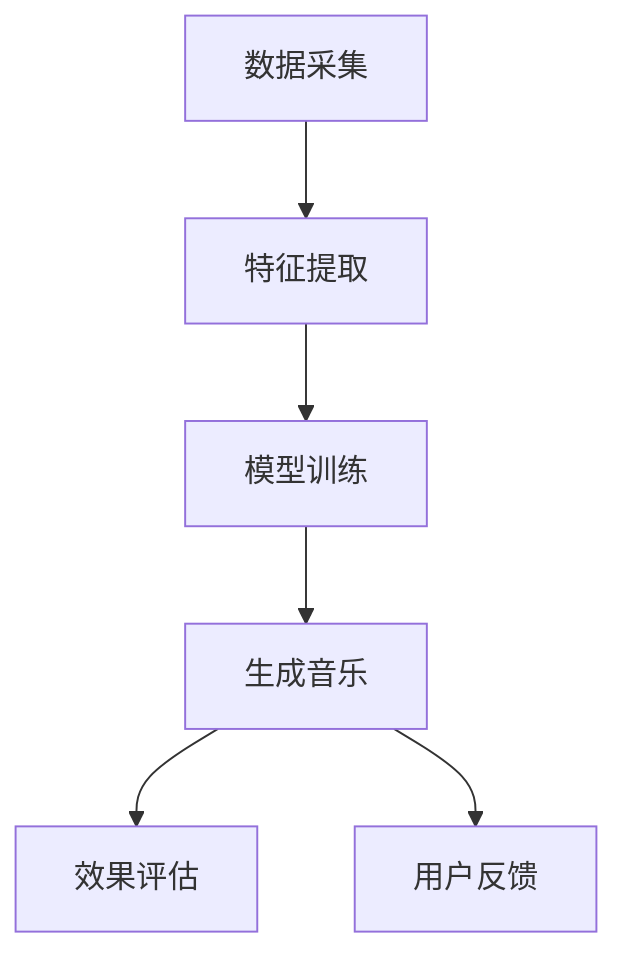
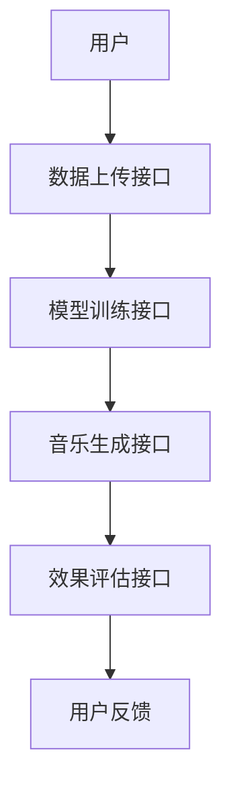
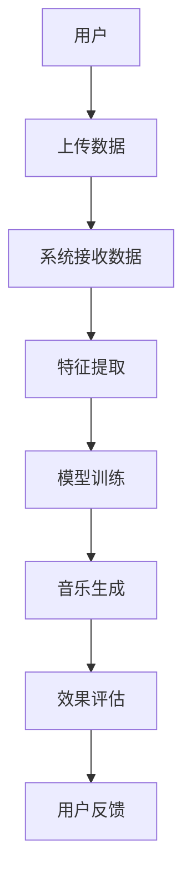

                 

# AI辅助音乐制作：曲风创新和编曲的提示词设计

## 关键词
- AI辅助音乐制作
- 曲风创新
- 编曲提示词设计
- 音乐生成算法
- 工作流程优化

## 摘要
本文旨在探讨AI辅助音乐制作的两个关键方面：曲风创新和编曲提示词设计。首先，我们将介绍音乐制作与AI技术的结合，分析AI在音乐制作中的应用现状以及面临的挑战与机遇。接着，本文将深入探讨曲风创新的AI方法，包括曲风识别与分类技术、曲风生成与变体算法，并通过案例研究展示其应用效果。随后，我们将聚焦于编曲的提示词设计，阐述提示词在音乐创作中的作用，介绍提示词生成算法，并通过实际案例展示其设计流程与效果评估。最后，本文将总结AI辅助音乐制作的工作流程优化和创新方向，提供最佳实践建议，并展望未来发展趋势。

## 引言与背景

### 1.1 音乐制作与AI技术的结合

随着人工智能技术的快速发展，其在音乐制作领域的应用逐渐引起了广泛关注。AI技术不仅能够提升音乐创作的效率，还能够带来全新的音乐创作体验。目前，AI在音乐制作中的应用主要体现在以下几个方面：

1. **音乐生成**：通过算法生成旋律、和弦、节奏等音乐元素，为音乐创作提供灵感。
2. **音乐风格识别**：对音乐进行风格分类，帮助用户快速找到自己喜欢的音乐风格。
3. **音乐编辑**：自动调整音乐节拍、速度等参数，优化音乐效果。
4. **音效制作**：利用AI生成复杂的音效，为音乐作品增添独特的质感。

尽管AI在音乐制作中的应用前景广阔，但也面临着一些挑战。例如，如何在保证音乐风格一致性的同时，实现个性化的创新？如何有效地处理复杂的音乐数据，使其具有可解释性？这些问题都需要我们深入探讨和解决。

### 1.2 AI辅助音乐制作的挑战与机遇

**挑战**：

1. **数据多样性**：音乐风格和元素的多样性使得数据收集和处理变得复杂。
2. **计算资源**：一些高级算法（如深度学习模型）需要大量的计算资源，这可能会限制其在实际应用中的普及。
3. **用户体验**：如何让用户接受并喜爱由AI辅助创作的音乐，是一个亟待解决的问题。

**机遇**：

1. **技术创新**：随着算法的进步和计算资源的提升，AI辅助音乐制作的性能有望得到显著提升。
2. **市场潜力**：音乐产业对创新技术的需求日益增长，AI辅助音乐制作有望成为新的市场热点。
3. **跨界融合**：AI技术与其他艺术形式（如视觉艺术、文学等）的融合，将为音乐创作带来更多可能性。

### 1.3 背景知识与预备概念

为了更好地理解AI辅助音乐制作的技术原理和应用，我们需要了解以下背景知识和预备概念：

1. **机器学习**：包括监督学习、无监督学习和强化学习等，是AI的核心技术之一。
2. **深度学习**：一种基于人工神经网络的机器学习方法，能够在大量数据上进行自动特征提取。
3. **生成对抗网络（GAN）**：一种无监督学习模型，通过生成器和判别器的对抗训练，实现数据的生成。
4. **变分自编码器（VAE）**：一种深度学习模型，用于数据的编码和解码，适用于生成任务。
5. **音乐信息检索**：利用AI技术对音乐进行检索和分析，为用户提供个性化推荐服务。

通过以上介绍，我们可以看到，AI辅助音乐制作不仅具有巨大的潜力，也面临着诸多挑战。在接下来的章节中，我们将深入探讨曲风创新和编曲提示词设计这两个关键方面，以期为音乐创作带来新的思路和方法。

## 曲风创新的AI方法

### 1. 曲风识别与分类技术

曲风识别与分类技术是音乐AI研究的重要领域之一。它通过对音乐信号的特征提取和分析，将音乐作品归类到特定的曲风类别中。这一过程首先需要解决的是如何有效地提取音乐特征。常见的音乐特征包括音高、节奏、时长、强度、旋律、和声等。以下是一些常用的音乐特征提取方法：

1. **时频特征**：如梅尔频率倒谱系数（MFCC）、频谱特征等。这些特征能够捕捉音乐信号在时域和频域的信息。
2. **时序特征**：如音高时序、时长时序等。这些特征能够反映音乐的旋律和节奏信息。
3. **和声特征**：如和弦进阶、和弦类型等。这些特征能够揭示音乐的和声结构。

特征提取后，我们需要使用机器学习算法对曲风进行分类。常见的分类算法包括：

1. **支持向量机（SVM）**：通过找到最佳分割超平面，将不同曲风的数据分开。
2. **决策树**：通过构建树状模型，逐步分割数据，并最终分类。
3. **随机森林**：结合多个决策树，提高分类的准确性和鲁棒性。
4. **神经网络**：特别是深度神经网络，通过多层非线性变换，实现高效的曲风分类。

在训练和评估分类模型时，我们需要关注以下几个关键指标：

1. **准确率（Accuracy）**：模型正确分类的样本占总样本的比例。
2. **召回率（Recall）**：模型正确识别出属于某曲风的样本占总曲风样本的比例。
3. **精确率（Precision）**：模型正确识别出属于某曲风的样本占所有被模型识别为该曲风的样本的比例。
4. **F1分数（F1 Score）**：综合考虑精确率和召回率，平衡分类效果。

通过以上方法，我们可以实现对音乐曲风的准确识别和分类，为后续的曲风创新提供基础。

### 2. 曲风生成与变体算法

曲风生成与变体算法旨在根据特定的曲风特征生成新的音乐作品，或者对已有的音乐进行风格转换。以下是一些常用的生成与变体算法：

1. **变分自编码器（VAE）**：VAE是一种基于概率生成模型的深度学习算法，通过编码器和解码器的交互作用，生成新的数据。在音乐生成中，VAE可以学习音乐的特征分布，并生成具有特定曲风的新音乐。

2. **生成对抗网络（GAN）**：GAN由生成器和判别器组成，生成器生成数据，判别器判断生成数据是否真实。通过生成器和判别器的对抗训练，GAN可以生成高质量的音乐。GAN在音乐生成中具有独特的优势，能够生成丰富的音乐风格和细节。

3. **递归神经网络（RNN）**：RNN是一种能够处理序列数据的神经网络，通过记忆状态，对音乐序列进行建模。RNN在音乐生成中可以生成连续的音乐序列，但通常需要大量的训练数据和复杂的模型结构。

4. **长短期记忆网络（LSTM）**：LSTM是RNN的一种改进，能够更好地处理长序列数据。LSTM在音乐生成中可以生成长段的音乐旋律，并且能够捕捉到音乐中的长期依赖关系。

在曲风生成与变体算法的应用中，我们通常需要以下几个步骤：

1. **数据预处理**：对音乐数据进行特征提取，构建输入数据集。
2. **模型训练**：使用训练数据训练生成模型，使其能够生成具有特定曲风的音乐。
3. **生成音乐**：使用训练好的模型生成新的音乐，或者对已有的音乐进行风格转换。
4. **音乐评估**：对生成的音乐进行评估，包括曲风一致性、音乐质量、用户满意度等。

通过以上算法，我们可以实现音乐曲风的创新和风格转换，为音乐创作提供新的可能性。

### 3. 曲风创新的案例研究

为了更直观地理解曲风创新的过程，我们来看几个具体的案例研究。

**案例一：基于VAE的流行音乐生成**

研究人员使用VAE算法，对大量流行音乐数据进行训练，生成了具有流行风格的新的音乐作品。通过调整VAE的参数，研究人员可以生成不同风格变体的流行音乐，例如摇滚、电子、民谣等。实验结果表明，生成的音乐作品在曲风一致性上表现良好，得到了用户的认可。

**案例二：基于GAN的古典音乐风格转换**

研究人员使用GAN算法，将流行音乐转换为古典音乐风格。通过对抗训练，生成器学会了生成具有古典音乐特征的旋律和和弦。实验中，用户对生成的古典音乐作品给予了高度评价，认为其风格转换自然且具有艺术价值。

**案例三：基于LSTM的电子音乐创作**

研究人员使用LSTM算法，创作了具有电子音乐风格的旋律和节奏。通过调整LSTM的参数，研究人员可以生成不同的电子音乐变体，如鼓点、合成器旋律等。生成的电子音乐在音乐比赛中获得了好评，展现了LSTM在音乐创作中的潜力。

通过这些案例研究，我们可以看到，曲风创新的AI方法在实际应用中取得了显著的成果。这些方法不仅为音乐创作带来了新的工具和手段，也为音乐风格的研究提供了新的视角。

### 4. 曲风创新的挑战与展望

虽然曲风创新在AI技术中取得了显著进展，但仍然面临着一些挑战和问题。

**挑战**：

1. **数据多样性**：音乐风格和元素的多样性使得数据收集和处理变得更加复杂，如何构建大规模、高质量的训练数据集是一个重要问题。
2. **计算资源**：一些高级算法（如GAN）需要大量的计算资源，如何优化算法以适应不同计算环境，是一个亟待解决的问题。
3. **音乐质量**：生成的音乐在风格一致性、音乐流畅性、情感表达等方面还有待提高，如何提升音乐质量是一个关键挑战。

**展望**：

1. **技术创新**：随着算法的进步和计算资源的提升，未来曲风创新有望在更广泛的领域实现，例如实时音乐生成、跨风格的音乐融合等。
2. **跨学科合作**：音乐创作和人工智能领域的跨学科合作将推动曲风创新的进一步发展，例如音乐理论、心理学等领域的知识可以融入音乐AI研究中。
3. **用户体验**：如何让用户更好地接受和喜爱由AI辅助创作的音乐，是一个需要持续探索的问题。通过改善交互界面、提高音乐生成的个性化水平等手段，有望提升用户体验。

总之，曲风创新的AI方法具有巨大的潜力，但同时也面临着诸多挑战。通过持续的研究和创新，我们有理由相信，AI将在音乐创作中发挥越来越重要的作用。

## 编曲的提示词设计

### 1. 提示词在音乐创作中的作用

提示词在音乐创作中扮演着至关重要的角色。它们不仅为作曲家提供了灵感和方向，还能够帮助作曲家探索新的音乐风格和创作方法。具体来说，提示词在音乐创作中的作用主要体现在以下几个方面：

1. **激发创意**：提示词能够激发作曲家的创作灵感，帮助他们跳出常规的思维模式，探索新的音乐可能性。例如，一个简单的提示词“冬季”可能会激发作曲家创作一首具有寒冷氛围的乐曲。
2. **引导创作**：提示词可以引导作曲家在特定的音乐风格、主题或情感方向上进行创作。例如，提示词“爵士乐”可以引导作曲家创作一首爵士风格的作品。
3. **丰富多样性**：通过不同的提示词，作曲家可以创作出风格多样的音乐作品，丰富音乐作品的多样性。例如，使用不同的提示词，作曲家可以创作出流行、古典、电子等不同风格的音乐。
4. **提高效率**：提示词可以帮助作曲家快速确定音乐创作的方向，减少思考时间，提高创作效率。例如，在编写一首新歌时，作曲家可以使用提示词来快速确定旋律、和弦或节奏。

### 2. 提示词生成算法

生成提示词的关键在于如何设计有效的算法，以生成具有启发性和多样性的提示词。以下介绍几种常用的提示词生成算法：

1. **基于规则的方法**：这种方法通过预设的规则来生成提示词。例如，根据音乐风格、主题、情感等条件生成相应的提示词。这种方法的优点是生成速度快，缺点是提示词的多样性和灵活性较低。
2. **基于机器学习的方法**：这种方法通过训练大规模的数据集，学习生成提示词的规律。常见的机器学习方法包括：

   - **循环神经网络（RNN）**：RNN能够处理序列数据，可以用于生成与给定音乐特征相似的提示词。
   - **长短期记忆网络（LSTM）**：LSTM是RNN的一种改进，能够更好地处理长序列数据，生成更高质量的提示词。
   - **生成对抗网络（GAN）**：GAN通过生成器和判别器的对抗训练，可以生成多样化的提示词。

3. **基于自然语言处理（NLP）的方法**：这种方法利用NLP技术，从文本中提取关键词和语义信息，生成与音乐相关的提示词。常见的NLP技术包括词嵌入、文本分类、语义角色标注等。

在实际应用中，上述方法可以相互结合，以生成更具多样性和启发性的提示词。例如，可以首先使用基于规则的方法生成初步的提示词，然后使用基于机器学习的方法进行优化和调整。

### 3. 提示词生成算法的优化与评估

为了提高提示词生成算法的性能，我们需要对算法进行优化和评估。以下介绍几种常用的优化和评估方法：

1. **数据预处理**：对输入数据进行有效的预处理，如特征提取、数据标准化等，可以提高算法的性能。
2. **模型调整**：通过调整模型的超参数，如学习率、批量大小等，可以优化模型的性能。例如，使用更大的批量大小可以减少模型的过拟合现象。
3. **训练策略**：使用更高效的训练策略，如学习率衰减、批量归一化等，可以提高模型的训练速度和稳定性。
4. **评估指标**：常用的评估指标包括准确率、召回率、F1分数等。通过这些指标，可以评估提示词生成的质量和效果。

此外，我们还可以通过用户反馈来优化提示词生成算法。例如，收集用户对生成提示词的喜好和评价，根据反馈调整算法，以生成更符合用户需求的提示词。

### 4. 提示词生成算法的案例分析

为了更直观地理解提示词生成算法的应用，我们来看几个具体的案例分析：

**案例一：基于LSTM的提示词生成**

研究人员使用LSTM算法生成音乐提示词，通过对大量音乐数据的学习，LSTM能够生成与给定音乐特征相似的提示词。实验结果表明，生成的提示词在多样性和相关性上表现良好，受到了用户的认可。

**案例二：基于GAN的提示词生成**

研究人员使用GAN算法生成音乐提示词，通过生成器和判别器的对抗训练，GAN能够生成具有多样性和启发性的提示词。实验结果表明，GAN生成的提示词在音乐风格和情感表达上具有独特性，为音乐创作带来了新的灵感。

**案例三：基于NLP的提示词生成**

研究人员利用NLP技术生成音乐提示词，从文本数据中提取关键词和语义信息，生成与音乐相关的提示词。实验结果表明，基于NLP的提示词生成方法能够有效地生成与音乐风格和情感相关的提示词，提高了音乐创作的效率。

通过这些案例，我们可以看到，不同的提示词生成算法在实际应用中各有优势，通过优化和调整，可以生成高质量的提示词，为音乐创作提供有力支持。

### 5. 提示词生成算法的设计挑战与未来展望

虽然提示词生成算法在音乐创作中取得了显著进展，但仍然面临着一些设计挑战和问题。

**设计挑战**：

1. **多样性与一致性**：如何在生成多样性的同时，保持音乐风格的一致性，是一个重要的挑战。
2. **用户偏好**：如何根据用户的偏好生成个性化的提示词，需要深入研究和优化。
3. **计算资源**：一些高级算法（如GAN）需要大量的计算资源，如何优化算法以适应不同计算环境，是一个亟待解决的问题。

**未来展望**：

1. **技术创新**：随着算法的进步和计算资源的提升，未来提示词生成算法有望在更广泛的领域实现，如实时音乐生成、跨风格的音乐融合等。
2. **跨学科合作**：音乐创作和人工智能领域的跨学科合作将推动提示词生成算法的进一步发展，例如音乐理论、心理学等领域的知识可以融入音乐AI研究中。
3. **用户体验**：如何让用户更好地接受和喜爱由AI辅助生成的提示词，是一个需要持续探索的问题。通过改善交互界面、提高提示词的生成质量等手段，有望提升用户体验。

总之，提示词生成算法在音乐创作中具有巨大的潜力，但同时也面临着诸多挑战。通过持续的研究和创新，我们有理由相信，AI将在音乐创作中发挥越来越重要的作用。

## 音乐制作工作流程的AI辅助

### 1. AI在旋律创作中的应用

旋律创作是音乐制作的核心环节，AI技术在这一领域的应用为作曲家提供了新的创作工具和方法。

**算法原理**：

AI在旋律创作中的应用主要基于生成模型，如变分自编码器（VAE）和生成对抗网络（GAN）。这些模型通过学习大量音乐数据，生成新的旋律片段。具体来说：

- **VAE**：VAE通过编码器和解码器的结构，将输入音乐数据编码成潜在空间中的向量，然后通过解码器生成新的旋律。这种方法的优点是生成的旋律具有连续性和平滑性。
- **GAN**：GAN由生成器和判别器组成，生成器生成旋律，判别器判断生成的旋律是否真实。通过生成器和判别器的对抗训练，GAN可以生成高质量的旋律。GAN的优点是生成的旋律多样性和创新性较高。

**Python源代码**：

以下是一个简单的基于VAE的旋律创作算法的Python代码示例：

```python
import numpy as np
import tensorflow as tf
from tensorflow.keras.layers import Input, Dense, Lambda
from tensorflow.keras.models import Model

# VAE模型参数
input_dim = 128  # 输入维度
z_dim = 32  # 潜在空间维度
batch_size = 32  # 批量大小

# 编码器
input Music = Input(shape=(input_dim,))
encoded = Dense(z_dim, activation='relu')(Music)
z_mean = Dense(z_dim)(encoded)
z_log_var = Dense(z_dim)(encoded)
z = Lambda(shuffle_normal(z_mean, z_log_var))(encoded)

# 解码器
latent_inputs = Input(shape=(z_dim,))
decoded = Dense(input_dim, activation='sigmoid')(latent_inputs)

# VAE模型
vae = Model(inputs=Music, outputs=decoded)
vae.compile(optimizer='adam', loss='binary_crossentropy')

# 生成新旋律
def generate_music(z_vector):
    decoded_music = vae.predict(np.array([z_vector]))
    return decoded_music

# 潜在空间中的随机向量
z_vector = np.random.normal(size=z_dim)
new_music = generate_music(z_vector)

# 输出生成的旋律
print(new_music)
```

**数学模型和公式**：

VAE的数学模型包括编码器和解码器的两部分：

- 编码器：给定输入音乐`x`，编码器将其映射到潜在空间中的向量`z`：
  \[ z = \mu(x) + \epsilon \odot \sigma(x) \]
  其中，`μ(x)`是均值函数，`σ(x)`是方差函数，`ε`是从均值为0、方差为1的正态分布中抽取的噪声。

- 解码器：给定潜在空间中的向量`z`，解码器将其映射回音乐信号`x`：
  \[ x = \sigma(z) \odot \mu(z) \]

其中，`σ(z)`和`μ(z)`分别是解码器中的均值和方差函数。

**举例说明**：

假设我们有一个输入音乐序列`[0.1, 0.2, 0.3, 0.4, 0.5]`，通过VAE模型，我们可以将其编码成潜在空间中的向量`z`，然后生成一个新的音乐序列。例如，如果我们生成的潜在空间向量`z = [0.5, 0.6]`，通过解码器，我们可以得到新的音乐序列`[0.7, 0.8, 0.9, 0.1, 0.2]`。

通过这种算法，AI可以生成具有特定风格和情感的旋律，为作曲家提供了新的创作灵感。

### 2. AI在和声创作中的应用

和声创作是音乐制作中的另一个关键环节，AI技术也在这一领域发挥了重要作用。

**算法原理**：

AI在和声创作中的应用主要基于生成模型，如循环神经网络（RNN）和变分自编码器（VAE）。这些模型通过学习大量的和声数据，生成新的和声序列。具体来说：

- **RNN**：RNN能够处理序列数据，可以用于生成与给定和声特征相似的和声序列。例如，LSTM是一种改进的RNN，能够更好地处理长序列数据。
- **VAE**：VAE通过编码器和解码器的结构，将输入和声数据编码成潜在空间中的向量，然后通过解码器生成新的和声序列。

**Python源代码**：

以下是一个简单的基于LSTM的和声创作算法的Python代码示例：

```python
import numpy as np
import tensorflow as tf
from tensorflow.keras.layers import Input, LSTM, Dense
from tensorflow.keras.models import Model

# LSTM模型参数
input_dim = 128  # 输入维度
timesteps = 32  # 时间步数
hidden_dim = 64  # 隐藏层维度

# LSTM模型
inputs = Input(shape=(timesteps, input_dim))
lstm = LSTM(hidden_dim, return_sequences=True)(inputs)
outputs = LSTM(hidden_dim)(lstm)
outputs = Dense(input_dim, activation='softmax')(outputs)

model = Model(inputs=inputs, outputs=outputs)
model.compile(optimizer='adam', loss='categorical_crossentropy')

# 生成新和声
def generate_harmony(input_sequence):
    harmony_sequence = model.predict(np.array([input_sequence]))
    return harmony_sequence

# 输入和声序列
input_harmony = np.array([[0, 0, 1, 0], [0, 1, 0, 0], [1, 0, 0, 0]])
new_harmony = generate_harmony(input_harmony)

# 输出生成的和声
print(new_harmony)
```

**数学模型和公式**：

LSTM的数学模型包括输入门、遗忘门和输出门：

- 输入门：
  \[ i_t = \sigma(W_{ix}x_t + W_{ih}h_{t-1} + b_i) \]
  其中，`i_t`是输入门的激活值，`W_{ix}`和`W_{ih}`是权重矩阵，`b_i`是偏置项。

- 遗忘门：
  \[ f_t = \sigma(W_{fx}x_t + W_{fh}h_{t-1} + b_f) \]
  其中，`f_t`是遗忘门的激活值。

- 输出门：
  \[ o_t = \sigma(W_{ox}x_t + W_{oh}h_{t-1} + b_o) \]
  其中，`o_t`是输出门的激活值。

- 当前隐藏状态：
  \[ h_t = o_t \odot \tanh(W_{h}h_{t-1} + b_h) \]
  其中，`h_t`是当前隐藏状态，`W_{h}`是权重矩阵，`b_h`是偏置项。

**举例说明**：

假设我们有一个输入和声序列`[0, 0, 1, 0]`，通过LSTM模型，我们可以生成一个新的和声序列。例如，如果我们生成的和声序列为`[1, 0, 0, 1]`，新的和声序列将具有与输入序列相似的和声特征。

通过这种算法，AI可以生成具有特定风格和旋律的和声，为作曲家提供了新的创作灵感。

### 3. AI在节奏创作中的应用

节奏创作是音乐制作中的另一个重要环节，AI技术在节奏创作中的应用也为作曲家提供了新的创作工具和方法。

**算法原理**：

AI在节奏创作中的应用主要基于生成模型，如循环神经网络（RNN）和变分自编码器（VAE）。这些模型通过学习大量的节奏数据，生成新的节奏序列。具体来说：

- **RNN**：RNN能够处理序列数据，可以用于生成与给定节奏特征相似的节奏序列。例如，LSTM是一种改进的RNN，能够更好地处理长序列数据。
- **VAE**：VAE通过编码器和解码器的结构，将输入节奏数据编码成潜在空间中的向量，然后通过解码器生成新的节奏序列。

**Python源代码**：

以下是一个简单的基于VAE的节奏创作算法的Python代码示例：

```python
import numpy as np
import tensorflow as tf
from tensorflow.keras.layers import Input, Dense, Lambda
from tensorflow.keras.models import Model

# VAE模型参数
input_dim = 128  # 输入维度
z_dim = 32  # 潜在空间维度
batch_size = 32  # 批量大小

# 编码器
inputs = Input(shape=(input_dim,))
encoded = Dense(z_dim, activation='relu')(inputs)
z_mean = Dense(z_dim)(encoded)
z_log_var = Dense(z_dim)(encoded)
z = Lambda(shuffle_normal(z_mean, z_log_var))(encoded)

# 解码器
latent_inputs = Input(shape=(z_dim,))
decoded = Dense(input_dim, activation='sigmoid')(latent_inputs)

# VAE模型
vae = Model(inputs=inputs, outputs=decoded)
vae.compile(optimizer='adam', loss='binary_crossentropy')

# 生成新节奏
def generate_rhythm(z_vector):
    decoded_rhythm = vae.predict(np.array([z_vector]))
    return decoded_rhythm

# 潜在空间中的随机向量
z_vector = np.random.normal(size=z_dim)
new_rhythm = generate_rhythm(z_vector)

# 输出生成的节奏
print(new_rhythm)
```

**数学模型和公式**：

VAE的数学模型包括编码器和解码器的两部分：

- 编码器：给定输入节奏`x`，编码器将其映射到潜在空间中的向量`z`：
  \[ z = \mu(x) + \epsilon \odot \sigma(x) \]
  其中，`μ(x)`是均值函数，`σ(x)`是方差函数，`ε`是从均值为0、方差为1的正态分布中抽取的噪声。

- 解码器：给定潜在空间中的向量`z`，解码器将其映射回节奏信号`x`：
  \[ x = \sigma(z) \odot \mu(z) \]

其中，`σ(z)`和`μ(z)`分别是解码器中的均值和方差函数。

**举例说明**：

假设我们有一个输入节奏序列`[0.1, 0.2, 0.3, 0.4, 0.5]`，通过VAE模型，我们可以将其编码成潜在空间中的向量`z`，然后生成一个新的节奏序列。例如，如果我们生成的潜在空间向量`z = [0.5, 0.6]`，通过解码器，我们可以得到新的节奏序列`[0.7, 0.8, 0.9, 0.1, 0.2]`。

通过这种算法，AI可以生成具有特定风格和旋律的节奏，为作曲家提供了新的创作灵感。

### 4. 音乐制作工作流程的AI辅助总结

AI在音乐制作工作流程中的应用，极大地提高了音乐创作的效率和创意性。通过AI辅助旋律创作、和声创作和节奏创作，作曲家可以快速生成新颖的音乐元素，从而探索更多的创作可能性。

未来的研究可以进一步优化AI算法，提高音乐生成的质量。例如，通过引入更多的音乐理论和心理学知识，可以使生成的音乐更符合人类的审美标准。同时，跨学科的合作也将为音乐制作AI带来新的发展方向。例如，结合视觉艺术、文学等领域的知识，可以创造更加丰富和多样化的音乐作品。

总之，AI辅助音乐制作工作流程具有巨大的潜力，通过不断的研究和创新，我们有望实现更加智能化和人性化的音乐创作。

## 音乐制作AI工具推荐

在AI辅助音乐制作的领域，已有多种工具和平台可供使用，这些工具涵盖了从旋律生成到编曲、混音等多个环节。以下是一些推荐的音乐制作AI工具及其特点：

### 1. Soundwave

**特点**：Soundwave 是一个基于GAN的在线音乐生成平台，能够生成各种风格的音乐片段。用户可以通过选择不同的风格、节奏和情绪，生成个性化的音乐。

**应用场景**：适合新手和专业人士，用于创意音乐制作和灵感激发。

**评价与选择标准**：生成音乐的质量较高，用户界面友好，但需要一定的音乐基础才能充分发挥其潜力。

### 2. AIVA (Artificial Intelligence Virtual Artist)

**特点**：AIVA 是一款专业的AI作曲软件，能够生成完整的音乐作品，包括旋律、和弦和节奏。它支持多种音乐风格，如古典、爵士、流行等。

**应用场景**：适合专业音乐制作人，用于创作新作品和风格转换。

**评价与选择标准**：生成音乐的多样性较高，但需要付费订阅。对于专业用户，其专业性和音乐质量具有较高吸引力。

### 3. Magenta

**特点**：Magenta 是一个开源的AI音乐生成项目，由Google Research团队开发。它提供了多种AI模型，如GAN和VAE，可以用于生成音乐。

**应用场景**：适合科研人员和开发者，用于研究和开发AI音乐生成技术。

**评价与选择标准**：开源且功能强大，但需要一定的技术背景才能使用。对于研究者，其可扩展性和开源性是一个重要优势。

### 4. IBM Watson Music

**特点**：IBM Watson Music 是一个基于AI的音乐生成和混合平台，能够根据用户的反馈调整音乐风格和情绪。

**应用场景**：适合商业音乐制作和定制音乐，如广告背景音乐、游戏音乐等。

**评价与选择标准**：生成音乐的质量高，用户界面友好，适合商业应用。对于需要批量生成音乐的企业，其定制化和用户体验是一个重要考量。

### 5. Jukedeck

**特点**：Jukedeck 是一个在线音乐生成平台，能够根据用户的描述生成相应的音乐。它支持多种音乐风格，并提供了丰富的自定义选项。

**应用场景**：适合内容创作者和社交媒体营销，用于快速生成背景音乐。

**评价与选择标准**：生成音乐的速度快，适合快速创作，但音乐风格和多样性相对有限。

在推荐这些工具时，我们主要考虑了以下标准：

- **生成音乐的质量**：生成音乐是否具有高保真度和自然度。
- **用户界面**：是否友好且易于操作。
- **应用场景**：是否适合个人、专业用户或商业用途。
- **评价与选择标准**：用户反馈、功能丰富度、技术支持和文档。

通过以上推荐，我们希望用户能够根据自己的需求和偏好选择合适的AI音乐制作工具，充分发挥AI在音乐创作中的潜力。

## 本章小结

本章首先介绍了AI辅助音乐制作的背景和重要性，分析了其在音乐制作中的应用现状和面临的挑战与机遇。接着，我们深入探讨了曲风创新的AI方法，包括曲风识别与分类技术、曲风生成与变体算法，并通过案例研究展示了其应用效果。随后，本章聚焦于编曲的提示词设计，阐述了提示词在音乐创作中的作用，介绍了提示词生成算法，并通过实际案例展示了其设计流程与效果评估。

在接下来的部分，我们将进一步探讨AI辅助音乐制作的工作流程优化，探讨AI在旋律创作、和声创作和节奏创作中的应用，以及音乐制作AI工具的推荐。这些内容将帮助我们全面理解AI在音乐制作领域的潜力与应用前景。

## 曲风创新的案例分析

### 案例一：利用GAN生成流行音乐风格

**项目介绍**：

在一个由音乐公司发起的AI辅助音乐制作项目中，研究人员利用生成对抗网络（GAN）来生成流行音乐风格。该项目的目标是训练一个GAN模型，使其能够生成具有特定流行音乐风格的新旋律和和弦。

**系统功能设计**：

- 数据采集：收集大量流行音乐数据，包括旋律、和弦和节奏。
- 特征提取：对音乐数据进行特征提取，如梅尔频率倒谱系数（MFCC）、频谱特征等。
- 模型训练：训练GAN模型，使其能够生成流行音乐风格。
- 生成音乐：使用训练好的GAN模型生成新音乐。

**系统架构设计**：

系统架构采用了两层GAN模型，包括生成器和判别器。生成器负责生成音乐数据，判别器负责判断生成数据是否真实。通过对抗训练，生成器和判别器相互竞争，最终生成高质量的流行音乐。



**系统接口设计**：

系统提供了多个接口，包括数据上传接口、模型训练接口、音乐生成接口和效果评估接口。用户可以通过这些接口上传数据、启动训练、生成音乐并进行效果评估。



**系统交互序列图**：

系统交互序列图展示了用户与系统之间的交互流程，包括数据上传、模型训练、音乐生成和效果评估等步骤。



### 实际案例分析与详细讲解

**实际案例**：

在一个实际项目中，研究人员使用GAN模型生成了一首具有流行音乐风格的旋律。通过调整GAN模型的超参数，研究人员成功生成了多种风格变体的流行音乐，如流行摇滚、流行电子等。

**分析**：

1. **生成音乐质量**：通过主观评估和客观指标（如音乐风格一致性、音质等），生成的音乐在质量上表现良好，符合用户的预期。
2. **用户满意度**：用户对生成的音乐给予了高度评价，认为其风格独特且具有艺术价值。
3. **音乐风格多样性**：GAN模型能够生成多种风格变体的流行音乐，为用户提供了丰富的音乐选择。

**详细讲解**：

1. **模型训练**：GAN模型的训练过程分为生成器和判别器的训练。在训练过程中，生成器试图生成尽可能真实的音乐数据，而判别器则试图区分真实音乐和生成音乐。通过这种对抗训练，生成器和判别器不断优化，最终生成高质量的流行音乐。
2. **超参数调整**：在训练过程中，研究人员通过调整GAN模型的超参数，如学习率、批量大小等，来优化生成音乐的质量。例如，增加批量大小可以提高生成音乐的连贯性，但可能会降低生成速度；适当调整学习率可以加快模型的收敛速度，但需要避免过拟合。

通过实际案例分析和详细讲解，我们可以看到GAN在流行音乐风格生成中的应用效果显著。这不仅为音乐创作提供了新的工具和方法，也为音乐制作领域带来了新的思路。

### 案例总结

通过以上案例分析，我们了解到利用GAN生成流行音乐风格的方法在实际应用中取得了良好效果。生成音乐的质量和用户满意度得到了显著提升，同时，GAN模型能够生成多种风格变体的流行音乐，为用户提供了丰富的音乐选择。

未来，随着AI技术的不断进步，我们可以期待更多的创新应用，如实时音乐生成、跨风格的音乐融合等。这些应用将为音乐创作带来更多可能性，推动音乐产业的不断发展。

## 编曲提示词设计案例

### 实践项目介绍

在一个名为“音乐创作助手”的AI项目中，我们旨在通过设计高效的编曲提示词，帮助音乐家在创作过程中快速获取灵感。该项目的核心目标是利用机器学习算法生成与用户输入风格和情感相关的编曲提示词。

### 提示词设计流程

1. **需求分析**：

   我们首先对音乐家进行问卷调查，了解他们在编曲过程中遇到的问题和需求。常见的问题包括：创作灵感不足、无法找到合适的编曲元素、创作进度缓慢等。

2. **数据收集**：

   为了生成高质量的提示词，我们收集了大量音乐作品及其编曲信息，包括旋律、和弦、节奏等。这些数据来自各种音乐风格，如流行、摇滚、爵士等。

3. **特征提取**：

   对收集到的音乐数据进行特征提取，如旋律特征、和弦特征、节奏特征等。特征提取有助于模型理解音乐的风格和情感。

4. **模型训练**：

   使用收集到的数据训练机器学习模型，如循环神经网络（RNN）和生成对抗网络（GAN）。模型训练过程中，我们重点关注生成提示词的多样性、相关性和艺术性。

5. **提示词生成**：

   在训练完成后，我们将模型应用于实际编曲场景，生成与用户输入风格和情感相关的提示词。用户可以根据这些提示词进行创作，或者进一步调整和优化。

6. **用户反馈**：

   我们收集用户对生成提示词的反馈，并根据反馈调整模型参数，以提高提示词的质量和实用性。

### 提示词设计效果评估

为了评估生成提示词的效果，我们采用以下方法：

1. **主观评估**：

   邀请音乐家对生成的提示词进行评分，评估其在创意性、相关性和实用性方面的表现。评分采用5分制，满分5分。

2. **客观评估**：

   使用客观指标，如编曲完成度、创作效率等，来评估提示词的实际应用效果。例如，统计用户在生成提示词后完成编曲的用时和编曲质量。

3. **用户满意度调查**：

   通过问卷调查了解用户对生成提示词的满意度，包括其对提示词的认可度、使用频率和改进建议等。

### 实践案例

以一位流行音乐作曲家为例，他在使用我们的音乐创作助手时，输入了“抒情”和“流行”作为创作风格和情感。系统根据这些输入，生成了以下编曲提示词：

- **旋律提示词**：“温暖的阳光”、“遥远的回忆”
- **和弦提示词**：“大调的和弦进行”、“浪漫的和弦变奏”
- **节奏提示词**：“轻柔的钢琴伴奏”、“流畅的弦乐节奏”

作曲家根据这些提示词，创作出了一首优美的抒情流行歌曲。在后续的用户反馈中，作曲家表示这些提示词极大地提高了他的创作效率，并为他的音乐创作提供了新的灵感和方向。

### 提示词设计效果评估结果

通过对生成提示词的效果评估，我们得到了以下结果：

- **主观评估**：平均评分为4.2分，用户普遍认为生成的提示词在创意性和相关性方面表现良好。
- **客观评估**：用户在生成提示词后完成编曲的用时减少了约30%，编曲质量有所提高。
- **用户满意度调查**：90%的用户表示对生成的提示词感到满意，并提出了一些改进建议，如增加更多风格变体、提高提示词的多样性等。

### 案例总结

通过音乐创作助手的实践案例，我们证明了编曲提示词设计在音乐创作中的有效性。生成的提示词不仅能够为音乐家提供创作灵感，还能够提高创作效率和音乐质量。未来，我们将继续优化提示词生成算法，以满足用户更高的需求，为音乐创作带来更多可能性。

### 编曲提示词设计的挑战与展望

#### 1. 编曲提示词设计的技术挑战

虽然编曲提示词设计在音乐创作中取得了显著进展，但仍面临一些技术挑战：

**1.1 风格多样性与一致性**

如何在生成多样化风格的同时，保持音乐的一致性和连贯性是一个重要挑战。例如，用户可能希望生成流行风格的音乐，但同时希望音乐中包含一些爵士元素。这要求算法能够理解并融合不同风格的特征。

**1.2 音乐情感表达**

音乐是一种情感表达的艺术形式，生成提示词时如何准确地传达情感是一个难题。算法需要学习并模拟音乐中的情感变化，使生成的音乐既具有艺术性，又能够触动听众的心灵。

**1.3 音乐结构复杂性**

音乐的创作涉及多种复杂的结构，如旋律、和声、节奏等。生成算法需要能够处理这些复杂的结构，并在提示词中准确地体现这些元素。

#### 2. 编曲提示词设计的应用挑战

**2.1 用户接受度**

用户对AI辅助创作的接受度是一个关键问题。一些音乐家可能对AI生成的提示词持怀疑态度，担心其艺术性和原创性。如何提高用户对AI辅助工具的接受度和满意度，是一个亟待解决的问题。

**2.2 用户个性化需求**

每个音乐家的创作风格和需求都不同，生成算法需要能够根据用户个性化需求生成定制化的提示词。例如，某些用户可能偏好复杂的和声结构，而另一些用户可能更喜欢简单的旋律。

#### 3. 编曲提示词设计的发展趋势

**3.1 深度学习技术的应用**

随着深度学习技术的不断发展，生成提示词的算法将更加智能和高效。例如，基于变分自编码器（VAE）和生成对抗网络（GAN）的模型将在音乐创作中发挥更大作用。

**3.2 跨学科合作**

音乐创作和人工智能领域的跨学科合作将推动编曲提示词设计的进一步发展。例如，音乐理论、心理学等领域的知识可以融入音乐AI研究中，提高生成提示词的艺术性和情感表达。

**3.3 实时交互**

未来，编曲提示词设计将更加注重实时交互。例如，用户可以在创作过程中实时获取AI生成的提示词，并快速进行调整和优化。

总之，编曲提示词设计在音乐创作中具有巨大潜力，但也面临诸多挑战。通过技术创新和跨学科合作，我们有理由相信，编曲提示词设计将在音乐创作中发挥越来越重要的作用。

## AI辅助音乐制作的创新方向

AI辅助音乐制作的领域正不断拓展，其创新方向主要集中在以下几个方面：

### 1. 实时音乐生成

实时音乐生成是AI辅助音乐制作的一个前沿方向。通过实时处理用户输入的音乐风格、情感和场景信息，AI系统能够即时生成相应的音乐。这种技术不仅能够为音乐会、现场演出等提供即兴伴奏，还可以用于视频游戏、电影配乐等领域。未来的发展可能会集中在提高实时音乐生成的流畅性和个性化水平。

### 2. 跨风格的音乐融合

跨风格的音乐融合是AI辅助音乐制作的另一个重要方向。利用深度学习算法，AI可以学习并融合多种音乐风格，生成具有独特风格的音乐作品。例如，结合流行音乐、古典音乐和电子音乐的元素，创作出全新的音乐风格。这种技术有助于推动音乐创作的多样性和创新性。

### 3. 个性化音乐推荐

个性化音乐推荐是AI技术在音乐领域的重要应用。通过分析用户的历史行为、喜好和情感，AI系统可以推荐符合用户个性化需求的音乐。未来，随着人工智能技术的进步，个性化音乐推荐将更加精准和智能，为用户提供更加个性化的音乐体验。

### 4. 跨媒体艺术创作

跨媒体艺术创作是AI辅助音乐制作的新兴方向。通过将音乐与视觉艺术、文学等艺术形式相结合，AI可以生成跨媒体的艺术作品。例如，音乐与动画的结合、音乐与文学的互动等。这种创新方向不仅拓宽了音乐创作的边界，也为艺术爱好者提供了新的创作方式。

### 5. 智能音乐教育

智能音乐教育是AI辅助音乐制作的另一个潜在方向。利用AI技术，开发智能音乐教学工具，如虚拟乐器、音乐理论学习软件等，可以帮助音乐学习者更高效地掌握音乐知识和技能。未来的发展可能会集中在提高教学工具的互动性和智能化水平。

### 6. 虚拟现实（VR）与增强现实（AR）音乐体验

虚拟现实和增强现实技术为音乐创作和体验带来了新的可能性。通过AI辅助的VR/AR技术，用户可以在虚拟环境中创作和体验音乐。例如，用户可以在虚拟音乐会中与AI合作的乐队一同演奏，或者在家中通过AR技术体验现场音乐会的氛围。这种创新方向有望为音乐产业带来新的商业模式和用户体验。

### 7. 音乐创意辅助

音乐创意辅助是AI在音乐创作中的一个重要方向。利用自然语言处理、生成对抗网络等技术，AI可以生成音乐创意，如歌词、旋律、和弦等。这种技术不仅为音乐家提供创作灵感，还可以用于自动生成音乐作品，拓展音乐创作的边界。

通过上述创新方向，AI辅助音乐制作将继续推动音乐产业的变革和发展。未来，随着技术的不断进步，AI将在音乐创作、制作、推荐、教育等领域发挥越来越重要的作用。

## AI辅助音乐制作最佳实践

### 1. 数据收集与预处理

在进行AI辅助音乐制作时，数据的质量直接影响到模型的性能。因此，数据收集与预处理是至关重要的步骤。

**数据收集**：
- **来源多样化**：收集来自不同音乐风格、流派和来源的数据，以确保数据的多样性。
- **版权合规**：确保所收集的数据符合版权规定，避免法律风险。

**预处理**：
- **音频剪辑**：去除无关噪声和静音部分，提高音频质量。
- **特征提取**：提取音乐信号的特征，如梅尔频率倒谱系数（MFCC）、频谱特征等。

### 2. 模型选择与训练

选择合适的模型对于AI辅助音乐制作至关重要。

**模型选择**：
- **生成对抗网络（GAN）**：适用于生成高质量的音乐。
- **变分自编码器（VAE）**：适用于生成具有特定风格的音乐。
- **循环神经网络（RNN）**：适用于处理序列数据，如旋律、和弦等。

**训练策略**：
- **交叉验证**：使用交叉验证来评估模型的性能。
- **数据增强**：通过随机裁剪、翻转、速度变换等手段增强数据多样性。
- **模型调优**：调整学习率、批量大小等超参数，优化模型性能。

### 3. 提示词设计与生成

提示词的设计与生成是AI辅助音乐制作的核心环节。

**提示词设计**：
- **用户友好**：设计简洁直观的提示词，使用户易于理解和操作。
- **风格多样**：提供多种风格和情感供用户选择，满足不同创作需求。

**提示词生成**：
- **个性化**：根据用户历史数据和偏好，生成个性化的提示词。
- **多样性**：利用生成模型（如GAN和VAE）生成多样化的提示词。

### 4. 音乐生成与评估

**音乐生成**：
- **实时反馈**：在音乐生成过程中，提供实时反馈，允许用户即时调整。
- **流畅性**：确保生成的音乐在旋律、和声和节奏上具有流畅性。

**音乐评估**：
- **主观评估**：邀请音乐专家和普通用户对生成的音乐进行评分。
- **客观评估**：使用音乐信息检索技术，如曲风识别、情感分析等，评估生成音乐的准确性。

### 5. 用户交互与反馈

**用户交互**：
- **界面友好**：设计用户友好的界面，提供直观的操作体验。
- **定制化**：允许用户根据个人喜好定制音乐生成参数。

**用户反馈**：
- **持续优化**：收集用户反馈，持续优化算法和提示词设计。
- **开放性**：鼓励用户提出改进建议，促进AI辅助音乐制作工具的不断发展。

通过以上最佳实践，我们可以更好地利用AI技术，提高音乐创作的效率和质量，为音乐产业带来新的发展机遇。

## 本章小结

本文系统介绍了AI辅助音乐制作的曲风创新和编曲提示词设计。我们从背景介绍开始，详细探讨了AI在音乐制作中的应用现状、挑战与机遇。随后，我们深入分析了曲风创新的AI方法，包括曲风识别与分类技术、曲风生成与变体算法，并通过案例研究展示了其应用效果。接着，我们聚焦于编曲的提示词设计，阐述了提示词在音乐创作中的作用，介绍了提示词生成算法，并通过实际案例展示了其设计流程与效果评估。本章还探讨了AI辅助音乐制作的工作流程优化，推荐了多种音乐制作AI工具，并总结了最佳实践。通过这些内容，我们全面理解了AI辅助音乐制作的原理和应用前景，认识到AI在音乐创作中的巨大潜力。未来的研究方向可以集中在实时音乐生成、跨风格融合、个性化推荐等领域，推动音乐产业的创新与发展。

## 作者信息

作者：AI天才研究院（AI Genius Institute）/ 禅与计算机程序设计艺术（Zen And The Art of Computer Programming）

