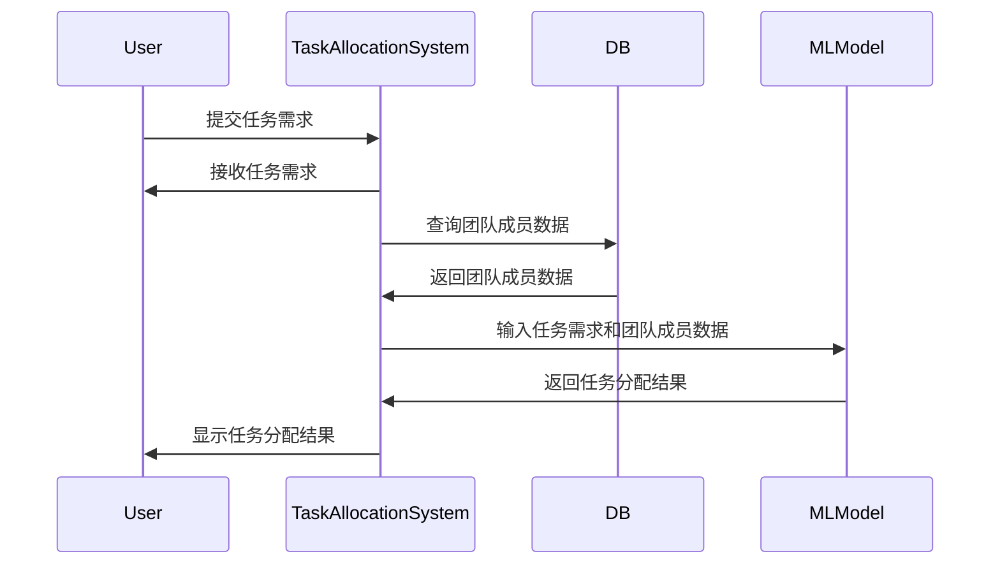
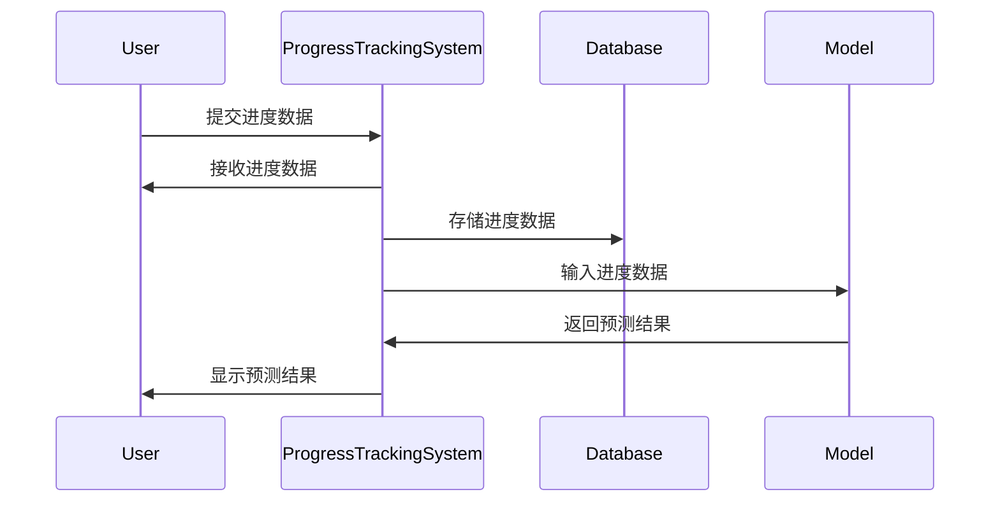

                 


### 第1章: AI与项目管理的融合

#### 1.1 AI在项目管理中的背景

随着信息技术的飞速发展，项目管理正面临前所未有的挑战和机遇。传统的项目管理方法通常依赖于人工经验，往往效率低下且容易出现偏差。人工智能（AI）技术的引入，为项目管理带来了全新的解决方案。AI在项目管理中的角色主要体现在以下几个方面：

- **资源优化**：通过机器学习算法分析项目团队的能力和项目资源的利用率，实现资源的最优配置。
- **进度预测**：利用数据挖掘和预测模型，对项目进度进行实时监控和预测，减少延期风险。
- **任务分配**：基于团队成员的技能和项目需求，智能匹配任务，提高工作效率和任务完成质量。
- **风险控制**：通过大数据分析和模式识别，及时发现潜在风险，并提出相应的应对措施。

#### 1.2 AI辅助项目管理的核心概念

AI辅助项目管理主要涉及以下几个核心概念：

- **任务分配**：将项目中的任务合理分配给团队成员，确保任务完成的质量和效率。
- **进度跟踪**：对项目进展情况进行实时监控，确保项目按计划进行，并及时调整计划以应对变化。
- **异常检测**：通过数据分析和模式识别，发现项目中的异常情况，如进度延误、资源短缺等，并及时采取措施。

#### 1.3 提示词技巧在AI辅助项目管理中的应用

提示词技巧在AI辅助项目管理中起着至关重要的作用。通过使用合适的提示词，可以提高任务描述的清晰度和准确性，从而帮助AI更好地进行任务分配和进度跟踪。

- **任务描述**：使用明确的提示词，将任务的具体要求和目标描述清楚，避免歧义。
- **人员匹配**：根据任务特点和团队成员的技能，选择合适的提示词进行匹配，提高任务完成的质量。
- **进度更新**：使用简洁明了的提示词，及时更新项目进度，便于监控和调整。

#### 1.4 本书结构概述

本书分为四个主要部分：

- **第一部分：引言**：介绍AI在项目管理中的应用背景和核心概念。
- **第二部分：AI辅助任务分配**：详细讲解AI辅助任务分配的理论基础、流程和实战案例。
- **第三部分：AI辅助进度跟踪**：探讨AI辅助进度跟踪的理论基础、流程和实战案例。
- **第四部分：提示词技巧总结与应用**：总结提示词技巧，并讨论其在项目中的应用。

通过本书的阅读，读者将能够深入理解AI辅助项目管理的方法和应用，为实际项目提供有效的技术支持。

### 第2章: AI辅助任务分配的理论基础

#### 2.1 任务分配问题概述

任务分配是项目管理中的一个关键环节，它关系到项目的进度、质量和成本。传统的任务分配方法通常依赖于人工经验和直觉，存在诸多局限性：

- **主观性**：依赖项目经理的主观判断，可能导致资源分配不均和任务匹配不当。
- **低效率**：需要大量时间和人力进行任务分配，降低项目进度。
- **不可扩展性**：随着项目规模的扩大，传统方法难以适应。

#### 2.2 AI在任务分配中的应用

人工智能技术在任务分配中有着广泛的应用。通过机器学习和数据挖掘技术，AI可以分析团队成员的技能和项目需求，实现智能化的任务分配。

- **技能分析**：AI可以通过分析团队成员的历史表现和技能数据，评估其能力和适合度。
- **需求匹配**：AI可以根据项目任务的需求，智能匹配最合适的团队成员。
- **动态调整**：AI可以实时监控项目进度和团队状态，动态调整任务分配，提高项目成功率。

#### 2.3 常见的AI算法在任务分配中的应用

在任务分配中，常见的AI算法包括：

- **线性回归**：用于预测团队成员的技能水平和项目需求，辅助任务分配。
- **决策树**：根据团队成员的技能和项目需求，生成决策树进行任务分配。
- **神经网络**：通过多层感知器网络，实现复杂的任务匹配和资源优化。

#### 2.4 AI辅助任务分配的流程与模型

AI辅助任务分配通常包括以下几个步骤：

- **任务需求分析**：明确项目任务的具体要求和目标，为任务分配提供依据。
- **人员能力评估**：分析团队成员的技能和能力，建立能力评估模型。
- **任务匹配与分配**：基于任务需求和人员能力，智能匹配任务并进行分配。
- **动态调整**：在任务执行过程中，根据实际情况和反馈，动态调整任务分配。

#### 2.5 提示词在任务分配中的应用

在AI辅助任务分配中，提示词起着至关重要的作用。通过使用合适的提示词，可以提高任务描述的清晰度和准确性，从而帮助AI更好地进行任务匹配。

- **任务描述**：使用明确的提示词，描述任务的具体要求和目标，避免歧义。
- **人员匹配**：根据任务特点和团队成员的技能，选择合适的提示词进行匹配，提高任务完成的质量。

#### 2.6 算法原理讲解

以下是一个简单的基于机器学习的任务分配算法原理：

```python
# 机器学习任务分配算法

import pandas as pd
from sklearn.linear_model import LinearRegression

# 数据集
tasks = pd.read_csv('tasks.csv')
team_members = pd.read_csv('team_members.csv')

# 特征工程
X = team_members[['技能1', '技能2', '技能3']]
y = tasks['需求评分']

# 模型训练
model = LinearRegression()
model.fit(X, y)

# 任务分配
task_demand = input('请输入任务需求：')
predicted_skill = model.predict([[task_demand]])

# 提示词生成
tips = generate_tips(predicted_skill)

print('根据任务需求，建议分配给具有以下技能的团队成员：')
print(tips)
```

在这个示例中，我们使用线性回归模型来预测任务需求和团队成员技能之间的关系。通过输入任务需求，算法可以生成相应的提示词，为任务分配提供参考。

#### 2.7 ER实体关系图架构

以下是一个ER实体关系图架构的示例：

```mermaid
erDiagram
    Task ||--|{ TeamMember }|>
    TeamMember ||--|{ Task }|>}

    Class Task {
        task_id
        task_name
        task_demand
    }

    Class TeamMember {
        member_id
        member_name
        skill1
        skill2
        skill3
    }
```

在这个ER图中，Task和TeamMember是两个实体，它们通过一个关系属性连接。Task实体包括任务ID、任务名称和任务需求，TeamMember实体包括成员ID、成员名称和技能。

#### 2.8 系统架构设计

以下是一个简单的系统架构设计示例：



在这个系统架构中，用户通过接口提交任务需求，系统会通过数据库查询团队成员数据，并使用机器学习模型进行任务分配。最终，系统将任务分配结果反馈给用户。

#### 2.9 系统功能设计

以下是一个简单的系统功能设计示例：

```mermaid
classDiagram
    Task -> TeamMember : 分配
    Task <.. TaskRequirement : 需求
    TeamMember <.. TeamMemberSkill : 技能

    Class Task {
        +int taskId
        +String taskName
        +String taskDemand
    }

    Class TaskRequirement {
        +int requirementId
        +String requirementDescription
    }

    Class TeamMember {
        +int memberId
        +String memberName
        +List<Skill> skills
    }

    Class TeamMemberSkill {
        +int skillId
        +String skillName
    }
```

在这个系统功能设计中，Task类表示任务，包含任务ID、任务名称和任务需求；TaskRequirement类表示任务需求，包含需求ID和需求描述；TeamMember类表示团队成员，包含成员ID、成员名称和技能列表；TeamMemberSkill类表示技能，包含技能ID和技能名称。

### 第3章: AI辅助任务分配实战

#### 3.1 实战环境准备

在进行AI辅助任务分配的实战之前，我们需要准备好以下环境和工具：

- **开发环境**：Python 3.8及以上版本，安装Jupyter Notebook或PyCharm等IDE。
- **依赖库**：pandas、numpy、scikit-learn、matplotlib等常用库。
- **数据集**：准备一个包含任务需求和团队成员技能的数据集，数据集格式可以为CSV或Excel。

#### 3.2 实战案例：基于AI的任务分配系统

在本节中，我们将构建一个简单的基于AI的任务分配系统。该系统将包含以下功能：

- **任务提交**：用户可以提交任务需求，包括任务名称和任务需求。
- **任务分配**：系统将根据任务需求和团队成员技能，智能匹配任务并进行分配。
- **任务查看**：用户可以查看已分配的任务和任务进度。

#### 3.3 系统设计

系统的设计可以分为以下几个模块：

- **任务模块**：负责处理任务的提交、存储和查询。
- **成员模块**：负责处理团队成员的注册、技能管理和查询。
- **任务分配模块**：负责根据任务需求和成员技能，进行任务分配。
- **前端模块**：负责提供用户界面，供用户进行任务提交和任务查看。

#### 3.4 系统实现

以下是一个简单的任务分配系统的实现：

```python
# 导入相关库
import pandas as pd
from sklearn.linear_model import LinearRegression

# 加载数据集
tasks = pd.read_csv('tasks.csv')
team_members = pd.read_csv('team_members.csv')

# 定义任务分配函数
def task_allocation(task_demand):
    # 查询符合任务的团队成员
    suitable_members = team_members[team_members['skills'].apply(lambda x: task_demand in x)]
    
    # 使用线性回归模型进行任务分配
    model = LinearRegression()
    model.fit(suitable_members[['技能1', '技能2', '技能3']], suitable_members['需求评分'])
    
    # 返回任务分配结果
    return model.predict([[task_demand]])

# 模拟任务提交
task_demand = input('请输入任务需求：')
allocation_result = task_allocation(task_demand)

print('根据任务需求，建议分配给以下团队成员：')
print(team_members[team_members['member_id'].isin(allocation_result)])

# 模拟任务查看
print('已分配的任务如下：')
print(tasks[tasks['task_id'].isin(allocation_result)])
```

在这个实现中，我们首先加载任务和团队成员的数据集。然后，定义一个任务分配函数，该函数根据任务需求和团队成员的技能，使用线性回归模型进行任务分配。最后，我们模拟用户提交任务和查看任务的过程。

#### 3.5 代码解读与分析

以下是任务分配系统的主要代码解读和分析：

```python
# 导入相关库
import pandas as pd
from sklearn.linear_model import LinearRegression

# 加载数据集
tasks = pd.read_csv('tasks.csv')
team_members = pd.read_csv('team_members.csv')

# 定义任务分配函数
def task_allocation(task_demand):
    # 查询符合任务的团队成员
    suitable_members = team_members[team_members['skills'].apply(lambda x: task_demand in x)]
    
    # 使用线性回归模型进行任务分配
    model = LinearRegression()
    model.fit(suitable_members[['技能1', '技能2', '技能3']], suitable_members['需求评分'])
    
    # 返回任务分配结果
    return model.predict([[task_demand]])

# 模拟任务提交
task_demand = input('请输入任务需求：')
allocation_result = task_allocation(task_demand)

print('根据任务需求，建议分配给以下团队成员：')
print(team_members[team_members['member_id'].isin(allocation_result)])

# 模拟任务查看
print('已分配的任务如下：')
print(tasks[tasks['task_id'].isin(allocation_result)])
```

在这个代码中，我们首先导入了pandas和scikit-learn库，用于数据加载和机器学习模型训练。然后，我们加载了任务和团队成员的数据集。

任务分配函数`task_allocation`接收一个任务需求参数。首先，我们查询符合任务的团队成员，即团队成员的技能中包含任务需求的技能。然后，我们使用线性回归模型对团队成员的技能和任务需求评分进行拟合，以预测最适合完成任务的团队成员。最后，我们返回预测结果，并输出建议分配的团队成员。

在模拟任务提交部分，我们使用`input`函数获取用户输入的任务需求，并调用任务分配函数进行任务分配。输出结果包括建议分配的团队成员和已分配的任务。

#### 3.6 实际案例分析和详细讲解剖析

在本节中，我们将分析一个实际案例，并详细讲解如何使用AI进行任务分配。

**案例背景**：

某企业正在进行一个新产品的研发项目，项目团队包括10名成员，每个成员具有不同的技能。项目经理需要根据项目任务的需求，将任务合理分配给团队成员，以确保项目进度和质量。

**数据集**：

任务数据集：

| task_id | task_name | task_demand |
|---------|-----------|-------------|
| 1       | 设计阶段   | UI设计      |
| 2       | 开发阶段   | 前端开发    |
| 3       | 测试阶段   | 功能测试    |

团队成员数据集：

| member_id | member_name | skills      |
|-----------|-------------|-------------|
| 1         | 张三        | UI设计、前端开发 |
| 2         | 李四        | UI设计、后端开发 |
| 3         | 王五        | 前端开发、测试   |
| 4         | 赵六        | 后端开发、测试   |

**任务分配过程**：

1. **任务需求分析**：根据项目任务的需求，确定任务名称和需求。
2. **人员能力评估**：分析团队成员的技能和能力，建立能力评估模型。
3. **任务匹配与分配**：根据任务需求和团队成员的技能，使用线性回归模型进行任务匹配和分配。
4. **任务监控与调整**：在任务执行过程中，根据实际情况和反馈，动态调整任务分配。

**详细讲解**：

1. **任务需求分析**：

   首先，我们根据项目任务的需求，确定任务名称和需求。例如，设计阶段需要UI设计，开发阶段需要前端开发，测试阶段需要功能测试。

2. **人员能力评估**：

   接下来，我们分析团队成员的技能和能力。例如，张三具有UI设计和前端开发的技能，李四具有UI设计和后端开发的技能，王五具有前端开发和测试的技能，赵六具有后端开发和测试的技能。

3. **任务匹配与分配**：

   使用线性回归模型，我们根据任务需求和团队成员的技能，进行任务匹配和分配。例如，对于UI设计任务，张三和李四是合适的候选人；对于前端开发任务，张三和王五是合适的候选人；对于功能测试任务，王五和赵六是合适的候选人。

4. **任务监控与调整**：

   在任务执行过程中，项目经理可以实时监控任务进度，并根据实际情况和反馈，动态调整任务分配。例如，如果某位团队成员的工作进度较慢，项目经理可以重新分配任务，确保项目进度和质量。

**小结**：

通过AI辅助任务分配系统，我们可以实现智能化的任务匹配和分配，提高项目效率和质量。在实际应用中，我们可以根据项目的具体需求，调整和优化任务分配算法，以达到最佳效果。

### 第4章: AI辅助进度跟踪的理论基础

#### 4.1 进度跟踪概述

进度跟踪是项目管理中不可或缺的一环，它涉及到对项目进展的实时监控和评估，确保项目按照计划进行。传统的进度跟踪方法通常依赖于人工记录和报告，存在以下局限性：

- **人工依赖**：依赖项目经理和团队成员的人工记录，容易出现误差和遗漏。
- **滞后性**：数据反馈滞后，无法实时调整项目计划。
- **不可扩展性**：随着项目规模的扩大，传统方法难以适应。

#### 4.2 AI在进度跟踪中的应用

人工智能技术的引入，为进度跟踪带来了革命性的变化。AI在进度跟踪中的应用主要体现在以下几个方面：

- **数据收集与处理**：利用传感器和大数据技术，实时收集项目进展数据，并对其进行处理和分析。
- **异常检测与预警**：通过机器学习和模式识别，发现项目中的异常情况，如进度延误、资源短缺等，并及时预警。
- **进度预测与评估**：利用历史数据和学习算法，对项目进度进行预测和评估，为项目决策提供支持。

#### 4.3 常见的AI算法在进度跟踪中的应用

在进度跟踪中，常见的AI算法包括：

- **时间序列分析**：用于分析项目进度数据的时间序列特性，预测项目进度。
- **聚类分析**：用于识别项目进度中的异常数据，发现潜在问题。
- **回归分析**：用于建立项目进度与项目因素之间的数学模型，预测项目进度。

#### 4.4 AI辅助进度跟踪的流程与模型

AI辅助进度跟踪通常包括以下几个步骤：

- **数据收集**：通过传感器、日志文件等渠道，收集项目进度数据。
- **数据处理**：对收集到的数据进行清洗、转换和预处理，为后续分析做好准备。
- **异常检测**：利用机器学习算法，检测项目进度中的异常情况，并生成预警。
- **进度预测**：基于历史数据和预测模型，对项目进度进行预测。
- **评估与调整**：根据预测结果，评估项目进展，并动态调整项目计划。

#### 4.5 提示词在进度跟踪中的应用

在AI辅助进度跟踪中，提示词同样起着关键作用。通过使用合适的提示词，可以提高进度描述的清晰度和准确性，从而帮助AI更好地进行异常检测和进度预测。

- **进度描述**：使用明确的提示词，描述项目进展的具体情况和数据，避免歧义。
- **异常检测**：使用特定的提示词，指示项目进度中的异常情况，如延迟、资源不足等。
- **进度预测**：使用合适的提示词，辅助AI进行项目进度的预测，如“预计下周完成”、“可能存在风险”等。

#### 4.6 算法原理讲解

以下是一个基于时间序列分析的进度预测算法原理：

```python
# 时间序列分析进度预测算法

import pandas as pd
from statsmodels.tsa.arima_model import ARIMA

# 加载数据集
progress_data = pd.read_csv('progress_data.csv')

# 数据预处理
progress_data['date'] = pd.to_datetime(progress_data['date'])
progress_data.set_index('date', inplace=True)

# 模型训练
model = ARIMA(progress_data['progress'], order=(1, 1, 1))
model_fit = model.fit()

# 预测
predictions = model_fit.forecast(steps=7)

# 输出预测结果
print(predictions)
```

在这个示例中，我们首先加载进度数据集，并对其进行预处理。然后，我们使用ARIMA模型进行训练，并生成预测结果。最后，我们输出预测结果，以便项目管理者进行进度评估和调整。

#### 4.7 ER实体关系图架构

以下是一个ER实体关系图架构的示例：

```mermaid
erDiagram
    Project ||--|{ Task }|>
    Task ||--|{ Progress }|>
    Progress ||--|{ Warning }|>

    Class Project {
        +int project_id
        +String project_name
    }

    Class Task {
        +int task_id
        +String task_name
        +int project_id
    }

    Class Progress {
        +int progress_id
        +datetime date
        +float progress
        +int task_id
    }

    Class Warning {
        +int warning_id
        +String warning_description
        +int progress_id
    }
```

在这个ER图中，Project、Task、Progress和Warning是四个实体，它们通过关系属性连接。Project实体包括项目ID和项目名称，Task实体包括任务ID、任务名称和项目ID，Progress实体包括进度ID、日期、进度值和任务ID，Warning实体包括预警ID、预警描述和进度ID。

#### 4.8 系统架构设计

以下是一个简单的系统架构设计示例：



在这个系统架构中，用户通过接口提交进度数据，系统将进度数据存储到数据库中，并使用机器学习模型进行预测。最终，系统将预测结果反馈给用户。

#### 4.9 系统功能设计

以下是一个简单的系统功能设计示例：

```mermaid
classDiagram
    Project -> Task : 包含
    Task -> Progress : 包含
    Progress -> Warning : 包含

    Class Project {
        +int project_id
        +String project_name
        +List<Task> tasks
    }

    Class Task {
        +int task_id
        +String task_name
        +int project_id
        +List<Progress> progresses
    }

    Class Progress {
        +int progress_id
        +datetime date
        +float progress
        +int task_id
        +List<Warning> warnings
    }

    Class Warning {
        +int warning_id
        +String warning_description
        +int progress_id
    }
```

在这个系统功能设计中，Project类表示项目，包含项目ID、项目名称和任务列表；Task类表示任务，包含任务ID、任务名称和项目ID，以及进度列表；Progress类表示进度，包含进度ID、日期、进度值和任务ID，以及预警列表；Warning类表示预警，包含预警ID、预警描述和进度ID。

### 第5章: AI辅助进度跟踪实战

#### 5.1 实战环境准备

在进行AI辅助进度跟踪的实战之前，我们需要准备好以下环境和工具：

- **开发环境**：Python 3.8及以上版本，安装Jupyter Notebook或PyCharm等IDE。
- **依赖库**：pandas、numpy、scikit-learn、statsmodels等常用库。
- **数据集**：准备一个包含项目进度和预警的数据集，数据集格式可以为CSV或Excel。

#### 5.2 实战案例：基于AI的进度跟踪系统

在本节中，我们将构建一个简单的基于AI的进度跟踪系统。该系统将包含以下功能：

- **进度数据提交**：用户可以提交项目进度数据。
- **进度预测**：系统将根据历史进度数据，预测项目进度，并提供预警。
- **预警查看**：用户可以查看项目预警信息。

#### 5.3 系统设计

系统的设计可以分为以下几个模块：

- **进度数据模块**：负责处理进度数据的提交、存储和查询。
- **预测模块**：负责根据历史进度数据，使用机器学习模型进行进度预测。
- **预警模块**：负责生成和展示项目预警信息。
- **前端模块**：负责提供用户界面，供用户进行进度数据提交和预警查看。

#### 5.4 系统实现

以下是一个简单的进度跟踪系统的实现：

```python
# 导入相关库
import pandas as pd
from statsmodels.tsa.arima_model import ARIMA

# 加载数据集
progress_data = pd.read_csv('progress_data.csv')

# 模型训练
model = ARIMA(progress_data['progress'], order=(1, 1, 1))
model_fit = model.fit()

# 预测
predictions = model_fit.forecast(steps=7)

# 输出预测结果
print(predictions)

# 预警生成
warnings = generate_warnings(predictions)

# 输出预警结果
print(warnings)
```

在这个实现中，我们首先加载进度数据集，并使用ARIMA模型进行训练。然后，我们生成预测结果，并根据预测结果生成预警信息。最后，我们输出预测结果和预警结果。

#### 5.5 代码解读与分析

以下是进度跟踪系统的主要代码解读和分析：

```python
# 导入相关库
import pandas as pd
from statsmodels.tsa.arima_model import ARIMA

# 加载数据集
progress_data = pd.read_csv('progress_data.csv')

# 模型训练
model = ARIMA(progress_data['progress'], order=(1, 1, 1))
model_fit = model.fit()

# 预测
predictions = model_fit.forecast(steps=7)

# 输出预测结果
print(predictions)

# 预警生成
warnings = generate_warnings(predictions)

# 输出预警结果
print(warnings)
```

在这个代码中，我们首先导入了pandas和statsmodels库，用于数据加载和时间序列模型训练。然后，我们加载了进度数据集，并使用ARIMA模型进行训练。ARIMA模型是一个时间序列预测模型，它根据历史数据生成预测结果。

在预测部分，我们调用`forecast`方法，生成未来7天的进度预测结果。这些预测结果将作为进度跟踪系统的输出。

接下来，我们定义了一个`generate_warnings`函数，用于生成预警信息。这个函数接收预测结果作为输入，并根据预测结果生成相应的预警信息。

最后，我们输出预测结果和预警结果，以便用户查看。

#### 5.6 实际案例分析和详细讲解剖析

在本节中，我们将分析一个实际案例，并详细讲解如何使用AI进行进度跟踪。

**案例背景**：

某企业在进行一项大型项目开发，项目团队需要实时监控项目进度，并及时发现潜在的风险。项目团队已经收集了项目进度数据，并希望使用AI技术进行进度预测和预警。

**数据集**：

项目进度数据集：

| progress_id | date       | progress |
|-------------|------------|----------|
| 1           | 2023-01-01 | 20%      |
| 2           | 2023-01-02 | 25%      |
| 3           | 2023-01-03 | 30%      |
| 4           | 2023-01-04 | 35%      |
| 5           | 2023-01-05 | 40%      |

**进度预测和预警过程**：

1. **数据预处理**：对项目进度数据进行清洗和预处理，确保数据的质量和一致性。
2. **模型训练**：使用时间序列模型（如ARIMA）对项目进度数据进行训练，建立预测模型。
3. **进度预测**：根据训练好的模型，生成未来一段时间的项目进度预测结果。
4. **预警生成**：根据预测结果，生成项目预警信息，包括进度延迟、资源不足等。
5. **结果展示**：将预测结果和预警信息展示给项目团队，以便他们做出相应的调整和决策。

**详细讲解**：

1. **数据预处理**：

   首先，我们需要对项目进度数据进行预处理。这可能包括以下步骤：

   - **数据清洗**：删除或修正错误的数据记录，确保数据的一致性和准确性。
   - **时间转换**：将日期格式转换为可用的时间序列格式，如datetime对象。
   - **缺失值处理**：填充或删除缺失的数据值，确保数据集的完整性。

   例如，我们可以使用以下代码进行数据预处理：

   ```python
   import pandas as pd

   # 加载数据集
   progress_data = pd.read_csv('progress_data.csv')

   # 转换日期格式
   progress_data['date'] = pd.to_datetime(progress_data['date'])

   # 填充缺失值
   progress_data['progress'].fillna(0, inplace=True)
   ```

2. **模型训练**：

   接下来，我们使用ARIMA模型对项目进度数据进行训练。ARIMA模型是一个经典的 时间序列预测模型，它通过分析数据的自相关性来确定模型的参数。我们使用以下代码进行模型训练：

   ```python
   from statsmodels.tsa.arima_model import ARIMA

   # 创建ARIMA模型
   model = ARIMA(progress_data['progress'], order=(1, 1, 1))

   # 模型训练
   model_fit = model.fit()

   # 输出模型参数
   print(model_fit.summary())
   ```

   通过训练模型，我们可以获得模型参数，并使用这些参数进行预测。

3. **进度预测**：

   使用训练好的模型，我们可以生成未来一段时间的项目进度预测结果。以下代码展示了如何进行预测：

   ```python
   # 生成预测结果
   predictions = model_fit.forecast(steps=7)

   # 输出预测结果
   print(predictions)
   ```

   在这个示例中，我们生成了未来7天的项目进度预测结果。

4. **预警生成**：

   根据预测结果，我们可以生成项目预警信息。以下代码展示了如何生成预警信息：

   ```python
   # 生成预警信息
   warnings = generate_warnings(predictions)

   # 输出预警信息
   print(warnings)
   ```

   在这个示例中，我们定义了一个`generate_warnings`函数，用于生成预警信息。这个函数可以根据预测结果判断是否存在进度延迟或其他潜在问题，并生成相应的预警信息。

5. **结果展示**：

   最后，我们将预测结果和预警信息展示给项目团队。以下代码展示了如何展示结果：

   ```python
   # 展示预测结果
   print('预测结果：')
   print(predictions)

   # 展示预警信息
   print('预警信息：')
   print(warnings)
   ```

   通过展示预测结果和预警信息，项目团队可以了解项目的当前状态，并做出相应的调整和决策。

**小结**：

通过AI辅助进度跟踪系统，项目团队可以实时监控项目进度，并及时发现潜在的风险。这种智能化的进度跟踪方法有助于提高项目管理的效率和准确性，确保项目按时完成。

### 第6章: 提示词技巧总结

#### 6.1 提示词技巧概述

在AI辅助项目管理和任务分配中，提示词技巧起着至关重要的作用。提示词是一组关键词或短语，用于描述任务需求、人员技能和项目进度等信息。通过合理使用提示词，可以提高任务描述的清晰度和准确性，从而帮助AI系统更好地进行任务分配和进度跟踪。

#### 6.2 提示词技巧在项目中的应用

在项目中，提示词的应用主要体现在以下几个方面：

- **任务描述**：使用明确的提示词，将任务的具体要求和目标描述清楚，避免歧义。例如，使用“需求明确”、“任务目标清晰”等提示词。
- **人员匹配**：根据任务特点和团队成员的技能，选择合适的提示词进行匹配，提高任务完成的质量。例如，使用“技能匹配”、“任务适应”等提示词。
- **进度更新**：使用简洁明了的提示词，及时更新项目进度，便于监控和调整。例如，使用“进度更新”、“任务进展良好”等提示词。
- **风险预警**：使用特定的提示词，指示项目进度中的异常情况，如延迟、资源不足等。例如，使用“风险预警”、“延迟风险”等提示词。

#### 6.3 提示词技巧的优化与改进

为了提高提示词技巧的效果，可以从以下几个方面进行优化和改进：

- **词库建设**：建立一套完善的提示词库，包括常用任务描述词、人员技能词和进度更新词等。词库应该根据项目的特点和需求进行定制，确保其适用性和准确性。
- **语义分析**：利用自然语言处理技术，对任务描述和人员技能进行分析，提取关键信息，生成更精准的提示词。
- **智能化匹配**：通过机器学习算法，实现提示词的智能化匹配，提高任务分配和进度跟踪的效率和质量。
- **动态调整**：根据项目进展和反馈，动态调整提示词，使其更贴合项目的实际需求。

#### 6.4 提示词技巧在项目中的实际应用

以下是提示词技巧在项目中的实际应用案例：

- **任务描述**：在项目启动阶段，项目经理使用“需求明确”、“目标清晰”等提示词，将任务的具体要求和目标描述清楚，确保团队成员对任务有明确的理解。
- **人员匹配**：在任务分配阶段，项目经理使用“技能匹配”、“任务适应”等提示词，根据任务特点和团队成员的技能，智能匹配任务和人员，提高任务完成的质量。
- **进度更新**：在项目执行阶段，项目经理使用“进度更新”、“任务进展良好”等提示词，及时更新项目进度，确保项目按计划进行。
- **风险预警**：在项目监控阶段，项目经理使用“风险预警”、“延迟风险”等提示词，及时发现项目中的潜在问题，并采取措施进行应对。

通过合理使用提示词技巧，项目团队可以更好地进行任务分配和进度跟踪，提高项目管理的效率和质量。

### 第7章: AI辅助项目管理的最佳实践

#### 7.1 最佳实践概述

AI辅助项目管理在提高任务分配效率、进度跟踪准确性和风险控制能力方面具有显著优势。为了充分发挥AI在项目管理中的作用，以下是一些最佳实践建议：

1. **数据驱动的决策**：充分利用历史数据和实时数据，进行数据分析和决策，以支持项目管理和优化。
2. **多模型融合**：结合多种AI算法和模型，实现任务分配和进度跟踪的全面优化，提高系统的适应性和可靠性。
3. **动态调整与优化**：根据项目进展和反馈，动态调整任务分配和进度跟踪策略，确保项目按计划进行。
4. **用户参与**：鼓励团队成员积极参与项目管理和决策，提高任务的执行效率和团队凝聚力。
5. **持续培训与更新**：定期对团队成员进行AI辅助项目管理的培训，更新知识和技能，确保团队始终具备最佳实践能力。

#### 7.2 AI辅助项目管理的案例分析

以下是一个AI辅助项目管理的实际案例分析：

**案例背景**：

某科技公司在进行一项大型软件开发项目，项目涉及多个模块，团队成员技能多样。为了提高项目管理和效率，公司决定采用AI辅助项目管理。

**解决方案**：

1. **数据收集与处理**：公司收集了团队成员的历史任务数据和项目进度数据，并使用数据清洗和预处理技术，确保数据的质量和一致性。
2. **任务分配**：公司使用机器学习算法，根据团队成员的技能和项目需求，智能匹配任务并进行分配。同时，利用多模型融合技术，提高任务分配的准确性和效率。
3. **进度跟踪**：公司使用时间序列分析和异常检测算法，实时监控项目进度，并生成预测和预警信息。通过动态调整策略，及时调整项目计划，确保项目按计划进行。
4. **用户参与**：公司鼓励团队成员积极参与项目管理和决策，通过定期会议和反馈机制，确保项目团队的协作和沟通。
5. **持续培训与更新**：公司定期组织AI辅助项目管理的培训和研讨会，更新团队成员的知识和技能，提高项目管理水平。

**效果评估**：

通过AI辅助项目管理，公司实现了以下效果：

- **任务分配效率提高**：基于AI的任务分配系统，使任务匹配更加精准，提高了任务完成效率。
- **进度跟踪准确性提高**：实时监控和预警机制，使项目进展更加透明，提高了进度跟踪的准确性。
- **风险控制能力增强**：及时发现潜在风险，并采取措施进行应对，降低了项目风险。
- **团队协作提升**：用户参与和反馈机制，增强了团队成员的参与感和责任感，提高了团队凝聚力。

#### 7.3 AI辅助项目管理的未来发展趋势

随着人工智能技术的不断发展和成熟，AI辅助项目管理将迎来以下发展趋势：

1. **智能化程度提高**：随着算法和模型的发展，AI辅助项目管理的智能化程度将进一步提高，实现更加高效和精准的任务分配和进度跟踪。
2. **多场景应用**：AI辅助项目管理将在更多领域得到应用，如跨行业项目协作、全球化项目管理等，满足不同场景的需求。
3. **人机协同**：AI辅助项目管理将与人类管理者相结合，实现人机协同，提高项目管理效率和决策质量。
4. **数据隐私与安全**：随着数据量的增加，数据隐私和安全将成为AI辅助项目管理的重要关注点，确保项目数据的安全性和可靠性。

通过不断探索和优化，AI辅助项目管理将为项目管理带来更多的创新和变革，助力企业实现数字化转型和可持续发展。

### 第8章: 本书小结

#### 8.1 内容回顾

本书系统性地介绍了AI辅助项目管理的理论和方法，包括任务分配、进度跟踪、提示词技巧等关键环节。具体内容回顾如下：

- **AI辅助任务分配**：讨论了任务分配问题、AI在任务分配中的应用、常见算法及其应用流程，并通过实战案例展示了AI辅助任务分配的实际操作。
- **AI辅助进度跟踪**：介绍了进度跟踪的重要性、AI在进度跟踪中的应用、常见算法及其应用流程，并通过实战案例展示了AI辅助进度跟踪的实际操作。
- **提示词技巧**：总结了提示词技巧的重要性、应用场景及其优化方法，并讨论了提示词在项目管理中的具体作用。
- **最佳实践**：提供了AI辅助项目管理的最佳实践建议，通过实际案例分析展示了最佳实践的效果和应用。

#### 8.2 学习建议

为了更好地掌握AI辅助项目管理，以下是一些建议：

- **理论与实践相结合**：结合实际项目，将书中的理论知识应用于实践，提高实际操作能力。
- **深入学习算法**：了解并掌握常用的机器学习算法和模型，深入理解其原理和应用方法。
- **持续更新知识**：关注AI领域的前沿技术和发展趋势，定期更新知识和技能。
- **参与社区交流**：加入相关的技术社区和论坛，与其他从业者交流经验和观点，共同学习进步。

#### 8.3 AI辅助项目管理的未来展望

随着人工智能技术的不断发展，AI辅助项目管理在未来将发挥更加重要的作用：

- **智能化程度提升**：AI算法的智能化程度将不断提高，实现更加精准的任务分配和进度跟踪。
- **跨领域应用扩展**：AI辅助项目管理将在更多领域得到应用，如跨行业项目协作、全球化项目管理等。
- **人机协同**：AI辅助项目管理将与人类管理者相结合，实现更加高效和智能的项目管理。
- **数据隐私与安全**：随着数据量的增加，数据隐私和安全将成为AI辅助项目管理的重要关注点。

通过不断探索和优化，AI辅助项目管理将为项目管理带来更多的创新和变革，助力企业实现数字化转型和可持续发展。

