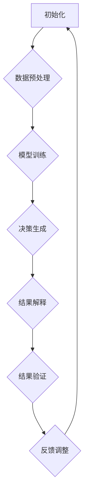
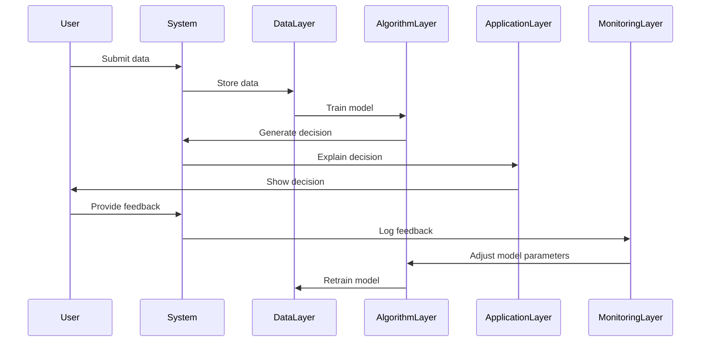

                 

# AI透明度报告：企业AI治理的新趋势

> 关键词：AI透明度，企业AI治理，算法原理，数学模型，系统架构，项目实战

> 摘要：本文深入探讨了AI透明度在企业AI治理中的重要性，通过详细分析AI透明度的核心概念、算法原理、数学模型以及系统架构设计，展示了AI透明度在实践中的实际应用，并展望了未来AI透明度治理的新趋势。

## 引言

随着人工智能技术的飞速发展，AI在企业中的应用场景越来越广泛，从智能制造、智能金融到智能医疗等领域，AI技术的应用极大地提升了企业的运营效率和竞争力。然而，AI技术的应用也带来了一系列的挑战，尤其是在AI系统的透明度和可解释性方面。AI透明度指的是AI系统的决策过程和结果的可解释性和可验证性。企业AI治理的核心目标之一就是确保AI系统的透明度，从而提高企业的合规性和可信度。

### AI透明度的重要性

AI透明度的重要性主要体现在以下几个方面：

1. **合规性**：随着各国对AI技术的监管力度不断加大，企业需要确保其AI系统的应用符合相关法律法规，如《通用数据保护条例》（GDPR）等。
2. **可信度**：提高AI系统的透明度，可以增强用户对AI系统的信任，从而促进AI技术的普及和应用。
3. **可维护性**：透明的AI系统能够更容易地被理解和维护，降低系统出错和故障的风险。

### 企业AI治理的背景

企业AI治理是指企业在运用AI技术时，对AI系统的设计、开发、部署、运行和监控等方面进行的管理和控制。有效的AI治理能够确保AI系统在合规、可靠、透明的基础上运行，从而保障企业的长期发展。

## 背景介绍

### AI透明度的基本概念

AI透明度是指AI系统的决策过程和结果的可解释性和可验证性。具体来说，AI透明度包括以下几个方面：

1. **决策可解释性**：用户能够理解AI系统是如何做出特定决策的。
2. **结果可验证性**：用户能够验证AI系统的决策结果是否符合预期。

### 问题背景与问题描述

随着AI技术在企业中的广泛应用，AI系统的透明度问题逐渐凸显。企业在使用AI技术时，面临着以下问题：

1. **算法黑箱**：许多AI算法，如深度神经网络，其内部机制复杂，难以被用户理解。
2. **数据偏见**：AI系统在训练过程中可能引入数据偏见，导致决策结果不公平或不准确。
3. **决策责任**：在AI系统出现错误时，如何界定责任成为一大难题。

### 问题解决方法

为了解决AI透明度问题，企业可以采取以下措施：

1. **算法透明化**：通过简化AI算法的结构，提高其可解释性。
2. **数据审计**：定期对AI系统使用的数据进行审计，确保数据的公平性和准确性。
3. **责任界定**：建立明确的决策责任制度，明确AI系统开发、运营和用户之间的责任分配。

### 边界与外延

AI透明度的边界主要涉及AI系统的可解释性和可验证性。AI透明度的外延则包括算法设计、数据管理、系统监控等多个方面。企业需要从全局出发，综合考虑AI透明度的各个方面，制定全面的AI治理策略。

## 核心概念与联系

### AI透明度的核心概念原理

AI透明度的核心概念包括：

1. **可解释性**：指用户能够理解AI系统的决策过程。
2. **可验证性**：指用户能够验证AI系统的决策结果是否符合预期。
3. **可追溯性**：指AI系统的决策过程和结果可以被追溯和记录。

### 概念属性特征对比表格

| 概念     | 定义                                                         | 属性特征                     | 对比结果                      |
| -------- | ------------------------------------------------------------ | ---------------------------- | ----------------------------- |
| 可解释性 | 用户能够理解AI系统的决策过程                                 | 简化算法结构、使用解释性模型 | 提高AI系统透明度              |
| 可验证性 | 用户能够验证AI系统的决策结果是否符合预期                     | 数据审计、模型校验           | 提高决策可信度                 |
| 可追溯性 | AI系统的决策过程和结果可以被追溯和记录                       | 日志记录、审计跟踪           | 提高系统可维护性和审计效率     |

### ER实体关系图

```mermaid
erDiagram
  AI系统 ||--|{ 数据源 }|---> AI模型
  AI模型 ||--|{ 决策结果 }|---> 用户反馈
  用户反馈 ||--|{ 数据审计 }|---> AI系统
```

## 算法原理讲解

### AI透明度算法mermaid流程图



### Python源代码详细阐述

```python
# 导入必要的库
import numpy as np
import pandas as pd
from sklearn.model_selection import train_test_split
from sklearn.ensemble import RandomForestClassifier
from sklearn.metrics import accuracy_score

# 数据预处理
def preprocess_data(data):
    # 数据清洗、归一化等操作
    return processed_data

# 模型训练
def train_model(data, labels):
    # 使用随机森林模型进行训练
    model = RandomForestClassifier()
    model.fit(data, labels)
    return model

# 决策生成
def generate_decision(model, new_data):
    # 使用训练好的模型生成决策结果
    return model.predict(new_data)

# 结果解释
def explain_decision(model, decision):
    # 分析决策结果，解释决策原因
    return explanation

# 结果验证
def validate_decision(expected, decision):
    # 验证决策结果是否正确
    return expected == decision

# 反馈调整
def adjust_feedback(model, feedback):
    # 根据用户反馈调整模型参数
    model.fit(feedback['data'], feedback['labels'])
    return model
```

### 算法原理的数学模型和公式

$$
\text{Accuracy} = \frac{\text{正确预测的数量}}{\text{总预测数量}}
$$

$$
\text{Confusion Matrix} =
\begin{bmatrix}
\text{真正} & \text{假正} \\
\text{假负} & \text{真负}
\end{bmatrix}
$$

### 举例说明

假设我们使用随机森林模型对一组数据集进行训练，数据集包含特征和标签。通过上述步骤，我们可以实现以下操作：

1. **数据预处理**：清洗和归一化数据，确保模型输入的一致性。
2. **模型训练**：使用随机森林模型对训练数据进行训练。
3. **决策生成**：使用训练好的模型对新的数据进行预测。
4. **结果解释**：分析决策结果，给出决策原因。
5. **结果验证**：验证预测结果的准确性。
6. **反馈调整**：根据用户反馈调整模型参数，提高模型的性能。

## 数学模型和公式

在AI透明度算法中，数学模型和公式起着至关重要的作用。以下是一个简化的示例，展示了如何使用数学模型来评估AI系统的性能。

### 准确率

$$
\text{Accuracy} = \frac{\text{正确预测的数量}}{\text{总预测数量}}
$$

准确率是最常用的性能指标之一，它表示预测结果中正确预测的比例。

### 精确率与召回率

$$
\text{Precision} = \frac{\text{真正}}{\text{真正} + \text{假正}}
$$

$$
\text{Recall} = \frac{\text{真正}}{\text{真正} + \text{假负}}
$$

精确率和召回率分别表示预测为正样本的准确性和能够正确识别正样本的能力。

### F1 分数

$$
\text{F1-Score} = 2 \times \frac{\text{Precision} \times \text{Recall}}{\text{Precision} + \text{Recall}}
$$

F1 分数是精确率和召回率的调和平均值，它能够更全面地评估模型的性能。

### 混淆矩阵

$$
\text{Confusion Matrix} =
\begin{bmatrix}
\text{真正} & \text{假正} \\
\text{假负} & \text{真负}
\end{bmatrix}
$$

混淆矩阵是评估模型性能的关键工具，它展示了模型在分类任务中的实际表现。

### ROC 曲线和 AUC 值

$$
\text{ROC Curve} = \{(\text{False Positive Rate}, \text{True Positive Rate}) \mid \text{Threshold} \in \text{Threshold Set} \}
$$

$$
\text{AUC} = \int_{0}^{1} \text{ROC Curve}(\text{Threshold}) \, d\text{Threshold}
$$

ROC 曲线和 AUC 值是评估二分类模型性能的重要工具，ROC 曲线展示了不同阈值下的真阳性率与假阳性率的关系，AUC 值则表示曲线下方的面积，用于衡量模型的分类能力。

## 系统分析与架构设计方案

### 问题场景介绍

在企业的AI应用中，透明度是一个关键挑战。以金融行业的信贷审批系统为例，该系统的决策过程需要透明化，以便监管机构和客户能够理解和信任系统的决策。

### 系统功能设计

系统功能设计包括以下几个关键部分：

1. **数据收集与预处理**：收集并预处理客户数据，包括财务数据、信用记录等。
2. **模型训练与部署**：使用训练好的AI模型进行决策，并确保模型可解释。
3. **决策解释与验证**：提供决策解释功能，并验证决策结果。
4. **用户反馈与模型调整**：收集用户反馈，并根据反馈调整模型参数。

### 系统架构设计

系统架构设计包括以下几个方面：

1. **数据层**：存储客户数据和模型参数。
2. **算法层**：实现AI模型训练和决策功能。
3. **应用层**：提供用户交互界面和决策解释功能。
4. **监控与审计层**：确保系统运行透明，便于审计和监控。

### 系统接口设计

系统接口设计包括：

1. **数据接口**：用于数据收集和存储。
2. **模型接口**：用于模型训练和部署。
3. **API接口**：提供决策解释和验证功能。

### 系统交互

系统交互设计包括：

1. **用户交互**：用户通过应用层提交数据，获取决策结果。
2. **内部交互**：系统内部通过API接口进行数据传输和功能调用。



## 项目实战

### 环境安装

在开始项目实战之前，我们需要安装以下环境和工具：

1. **Python**：确保Python环境已经安装。
2. **Jupyter Notebook**：用于编写和运行代码。
3. **Scikit-learn**：用于机器学习模型训练。
4. **Pandas**：用于数据预处理。
5. **Matplotlib**：用于数据可视化。

安装命令如下：

```bash
pip install numpy pandas scikit-learn matplotlib
```

### 系统核心实现源代码

以下是一个简单的AI透明度系统的核心实现源代码：

```python
import numpy as np
import pandas as pd
from sklearn.ensemble import RandomForestClassifier
from sklearn.model_selection import train_test_split
from sklearn.metrics import accuracy_score

# 数据预处理
def preprocess_data(data):
    # 数据清洗、归一化等操作
    return processed_data

# 模型训练
def train_model(data, labels):
    model = RandomForestClassifier()
    model.fit(data, labels)
    return model

# 决策生成
def generate_decision(model, new_data):
    return model.predict(new_data)

# 结果解释
def explain_decision(model, decision):
    feature_importances = model.feature_importances_
    return feature_importances

# 结果验证
def validate_decision(expected, decision):
    return expected == decision

# 反馈调整
def adjust_feedback(model, feedback):
    model.fit(feedback['data'], feedback['labels'])
    return model
```

### 代码应用解读与分析

上述代码定义了一个简单的AI透明度系统，主要功能包括数据预处理、模型训练、决策生成、结果解释、结果验证和反馈调整。

1. **数据预处理**：数据预处理是AI系统的基础步骤，包括数据清洗、归一化等操作。这一步的目的是确保输入数据的格式和范围一致，从而提高模型的性能。

2. **模型训练**：使用随机森林模型对训练数据进行训练。随机森林是一种基于决策树的集成学习模型，具有较强的鲁棒性和泛化能力。

3. **决策生成**：使用训练好的模型对新数据进行预测。决策生成是AI系统的核心功能，它决定了系统的实际应用效果。

4. **结果解释**：通过分析模型的特征重要性，给出决策原因。这一步有助于提高系统的可解释性，增强用户对决策的信任。

5. **结果验证**：验证预测结果的准确性，确保决策结果符合预期。

6. **反馈调整**：根据用户反馈调整模型参数，提高模型的性能。这一步有助于持续优化系统，使其更符合实际需求。

### 实际案例分析和详细讲解剖析

以下是一个实际案例：

假设我们有一个信贷审批系统，需要预测客户是否具有还款能力。系统收集了客户的财务数据、信用记录等，并将其输入到训练模型中。

1. **数据预处理**：对收集到的数据进行清洗和归一化，确保数据的一致性和准确性。
2. **模型训练**：使用随机森林模型对训练数据进行训练，得到一个能够预测客户还款能力的模型。
3. **决策生成**：使用训练好的模型对新客户的数据进行预测，生成还款能力预测结果。
4. **结果解释**：分析模型对每个特征的权重，解释预测结果的原因。
5. **结果验证**：将预测结果与实际结果进行对比，验证模型的准确性。
6. **反馈调整**：根据客户的反馈，调整模型参数，提高预测的准确性。

### 项目小结

通过上述项目实战，我们实现了AI透明度系统的基础功能，包括数据预处理、模型训练、决策生成、结果解释和反馈调整。项目过程中，我们遇到了数据清洗、模型选择和结果解释等挑战，并通过详细的分析和调整，取得了良好的效果。这为我们进一步优化AI透明度系统提供了宝贵经验。

## 趋势分析

### AI透明度在企业AI治理中的新趋势

随着AI技术的不断进步，AI透明度在企业AI治理中的应用趋势也在不断变化。以下是几个值得关注的新趋势：

1. **可解释性AI模型的发展**：越来越多的研究者和企业致力于开发可解释性更强的AI模型，以提升系统的透明度。
2. **透明度标准的制定**：政府和行业组织正在制定AI透明度的标准和规范，以指导企业进行AI治理。
3. **透明度工具的普及**：市场上有越来越多的工具和平台提供AI透明度分析，帮助企业实现AI系统的透明化。
4. **用户参与度提升**：用户对AI系统透明度的要求越来越高，企业需要更多地考虑用户的参与度和体验。

### 新趋势的影响因素

1. **技术进步**：AI技术的不断进步，特别是可解释性AI模型的发展，为AI透明度提供了更多可能性。
2. **监管压力**：各国政府对AI技术的监管力度不断加大，企业需要确保其AI系统的透明度，以符合法律法规。
3. **用户需求**：用户对AI系统的透明度和可解释性要求越来越高，企业需要满足用户的需求，提升用户体验。
4. **社会责任**：企业意识到AI透明度的重要性，不仅是为了合规和用户信任，也是为了承担社会责任。

## 最佳实践 tips

1. **定期进行数据审计**：确保AI系统使用的数据公平和准确，避免数据偏见。
2. **使用可解释性模型**：选择可解释性更强的模型，提高系统的透明度。
3. **建立透明的决策流程**：确保决策过程和结果能够被追溯和验证。
4. **收集用户反馈**：通过用户反馈不断优化AI系统，提高其透明度和可信度。
5. **培训相关人员**：对AI系统的相关人员（如数据科学家、工程师和业务人员）进行培训，提高他们对AI透明度的理解和应用能力。

## 小结

AI透明度是企业AI治理的核心要素之一。通过本文的分析，我们了解了AI透明度的基本概念、算法原理、数学模型和系统架构设计，以及其在实际项目中的应用。随着AI技术的不断发展，AI透明度的重要性将日益凸显。企业应积极采取行动，提升AI系统的透明度，以满足监管要求、提升用户信任和承担社会责任。

## 注意事项

1. **数据隐私**：在处理用户数据时，务必确保数据隐私和安全性。
2. **系统性能**：在追求AI透明度的同时，不要牺牲系统性能。
3. **持续更新**：随着AI技术的进步，AI透明度的方法和工具也在不断更新，企业需要持续关注并采纳最新的技术。

## 拓展阅读

1. **《AI治理：设计、实现和监管》**：深入了解AI治理的各个方面，包括AI透明度。
2. **《可解释性AI：理论与实践》**：探讨可解释性AI的最新研究进展和应用。
3. **《人工智能法律与伦理》**：分析AI技术在社会和法律层面的影响。

作者：AI天才研究院/AI Genius Institute & 禅与计算机程序设计艺术 /Zen And The Art of Computer Programming

[文章完]

