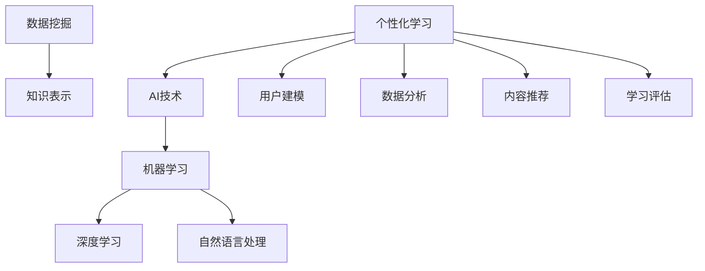

                 

# AI驱动的个性化学习平台：适应每个学生的需求

## 关键词
- AI技术
- 个性化学习
- 学习平台
- 数据分析
- 机器学习

## 摘要
本文将深入探讨AI驱动的个性化学习平台的设计与实现，旨在适应每个学生的需求。我们将从背景与概述、核心概念与技术原理、设计原则、平台架构、技术实现与架构优化、项目实战等多个角度进行详细分析，为构建高效、个性化的学习平台提供理论依据和实战指导。

## 引言

### 1.1 问题背景

1.1.1 教育个性化需求的兴起

随着信息时代的到来，教育需求越来越多样化，每个学生都有其独特的学习习惯、兴趣和学习目标。传统的教育模式往往难以满足这种个性化的需求，导致学习效果不尽如人意。因此，教育个性化需求逐渐成为教育领域的热门话题。

1.1.2 传统教育模式的局限性

传统教育模式主要依赖于教师的主导，课程内容、教学方法和进度往往是一成不变的。这种方式难以适应不同学生的学习速度和理解能力，容易导致“优生更优，差生更差”的现象。

1.1.3 AI技术在教育领域的应用潜力

人工智能技术的发展为教育个性化提供了新的可能性。通过大数据分析、机器学习和自然语言处理等技术，AI能够深入了解每个学生的学习情况，提供个性化的学习建议和资源。

### 1.2 书籍目标与结构

1.2.1 书籍目标

本文旨在探讨AI驱动的个性化学习平台的设计与实现，帮助教育从业者、技术工程师和学生理解这一新兴领域，并为其提供实用的技术和策略。

1.2.2 书籍结构概述

本文分为三大部分：引言、AI驱动的个性化学习平台基础、AI驱动的个性化学习平台应用。引言部分介绍问题背景和书籍目标；基础部分详细讲解核心概念和技术原理；应用部分展示实际案例和解决方案。

1.2.3 阅读建议

建议读者按章节顺序阅读，以便逐步构建对AI驱动的个性化学习平台的理解。对于感兴趣的部分，可以深入学习和实践。

### 1.3 定义与边界

1.3.1 AI驱动的个性化学习平台定义

AI驱动的个性化学习平台是一种利用人工智能技术，根据学生的学习行为、兴趣和学习历史，为其提供个性化学习资源和指导的系统。

1.3.2 平台的核心要素

平台的核心要素包括用户建模、数据分析、内容推荐和学习评估等。

1.3.3 边界与外延

AI驱动的个性化学习平台不仅限于在线教育，还可以应用于传统课堂教学，其应用范围包括基础教育、职业教育和终身学习等。

### 1.4 核心概念与联系

1.4.1 AI与机器学习的基本概念

AI（人工智能）是一种模拟人类智能的技术，包括机器学习、深度学习、自然语言处理等子领域。

机器学习是一种通过数据驱动的方式，让计算机自动改进性能的技术。其主要方法包括监督学习、无监督学习和强化学习。

1.4.2 数据挖掘与知识表示

数据挖掘是一种从大量数据中提取有价值信息的方法。知识表示则是将数据转化为计算机可以理解和处理的形式。

1.4.3 个性化学习的概念模型

个性化学习是一种基于学生个体差异，为其提供个性化教学资源和学习支持的教育模式。

1.4.4 Mermaid流程图：AI驱动个性化学习平台核心概念关系

### 1.5 本章小结

本章介绍了AI驱动的个性化学习平台的背景、目标、定义和核心概念。通过本章的学习，读者可以初步了解AI技术在教育领域的应用前景，为后续章节的学习打下基础。

## 第一部分：AI驱动的个性化学习平台基础

### 2.1 第一章：背景与概述

#### 2.1.1 AI技术的发展历程

人工智能（AI）一词最早由约翰·麦卡锡（John McCarthy）于1956年提出。自那时以来，AI技术经历了多个发展阶段：

1. 初始阶段（1956-1974）：以符号主义和知识表示为核心，主要研究如何让计算机模拟人类的智能行为。
2. 低谷阶段（1974-1980）：由于实际应用难以实现，AI研究陷入低谷。
3. 复兴阶段（1980-1987）：专家系统和机器学习开始兴起，AI技术逐渐应用于实际场景。
4. 高潮阶段（1987-2012）：深度学习和神经网络技术的突破，使AI在图像识别、语音识别等领域取得显著成果。
5. 现今阶段（2012至今）：AI技术迅速发展，已广泛应用于各个领域，包括教育、医疗、金融等。

#### 2.1.2 个性化学习的重要性

个性化学习是一种基于学生个体差异，为其提供个性化教学资源和学习支持的教育模式。个性化学习的重要性体现在以下几个方面：

1. 提高学习效果：根据学生的兴趣、能力和学习习惯，提供合适的课程和学习资源，有助于提高学习效果。
2. 满足不同需求：每个学生都有其独特的需求，个性化学习能够满足这些需求，使学习更具针对性。
3. 促进学生发展：个性化学习关注学生的全面发展，不仅关注学业成绩，还关注学生的情感、社交和创造力等方面的发展。

#### 2.1.3 AI驱动的个性化学习平台现状

目前，AI驱动的个性化学习平台已在多个领域得到应用，如在线教育、职业教育和终身学习等。以下是一些现状：

1. 在线教育：AI驱动的个性化学习平台在在线教育中发挥了重要作用，如Coursera、edX等平台，通过数据分析、推荐系统和学习评估等技术，为学习者提供个性化的学习体验。
2. 职业教育：AI驱动的个性化学习平台在职业技能培训领域应用广泛，如职业技能提升计划、在线职业培训等，通过个性化推荐、学习路径规划和效果评估等技术，提高学习效果和就业竞争力。
3. 终身学习：随着终身学习理念的普及，AI驱动的个性化学习平台为不同年龄段、不同职业背景的学习者提供了丰富的学习资源和个性化服务，如学习路径规划、课程推荐和效果评估等。

#### 2.1.4 AI驱动的个性化学习平台优势与挑战

1. 优势：

（1）提高学习效果：通过大数据分析、机器学习和自然语言处理等技术，AI驱动的个性化学习平台能够为学习者提供个性化的学习资源和学习建议，有助于提高学习效果。

（2）满足个性化需求：AI驱动的个性化学习平台能够根据学习者的兴趣、能力和学习习惯，为其提供合适的学习资源和学习路径，满足个性化需求。

（3）降低教育成本：通过自动化和智能化，AI驱动的个性化学习平台可以降低教育成本，提高教育资源利用效率。

2. 挑战：

（1）数据隐私和安全问题：个性化学习平台需要收集和处理大量学习者数据，涉及隐私和安全问题。

（2）算法公平性问题：AI算法可能会产生偏见，导致某些学习者无法获得公平的学习机会。

（3）技术与教育结合问题：如何将AI技术与教育实践有机结合，实现真正的个性化学习，仍是一个挑战。

### 2.2 第二章：核心概念与技术原理

#### 2.2.1 机器学习基础

机器学习（Machine Learning）是一种通过数据驱动的方式，让计算机自动改进性能的技术。其核心思想是从大量的数据中学习规律，并将其应用于新的数据。

1. 监督学习（Supervised Learning）

监督学习是一种最常见的机器学习方法，其核心是学习输入和输出之间的映射关系。监督学习分为回归（Regression）和分类（Classification）两种类型。

（1）回归：用于预测连续值，如房价预测、股票价格预测等。

（2）分类：用于预测离散值，如文本分类、图像分类等。

2. 无监督学习（Unsupervised Learning）

无监督学习是一种在没有明确输出标签的情况下，自动发现数据中隐藏的结构和规律的方法。无监督学习包括聚类（Clustering）、降维（Dimensionality Reduction）和异常检测（Anomaly Detection）等。

（1）聚类：将相似的数据点分组，形成聚类。

（2）降维：减少数据维度，保持重要信息。

（3）异常检测：识别数据中的异常值。

3. 强化学习（Reinforcement Learning）

强化学习是一种通过试错和反馈，逐步优化策略的方法。强化学习主要应用于决策问题，如游戏、自动驾驶等。

（1）奖励机制：根据学习者的行为，给予奖励或惩罚。

（2）策略优化：通过优化策略，最大化长期奖励。

#### 2.2.2 数据挖掘与知识表示

数据挖掘（Data Mining）是一种从大量数据中提取有价值信息的方法。数据挖掘的主要任务包括关联规则挖掘、分类、聚类、异常检测等。

1. 数据预处理

数据预处理是数据挖掘过程中的重要环节，包括数据清洗、数据集成、数据转换和数据归一化等。

（1）数据清洗：去除重复、缺失和错误的数据。

（2）数据集成：将多个数据源中的数据进行整合。

（3）数据转换：将数据转换为适合挖掘分析的格式。

（4）数据归一化：将不同特征的数据进行统一处理。

2. 特征工程

特征工程（Feature Engineering）是一种将原始数据转换为适合机器学习模型分析的特征的方法。特征工程的关键在于提取和构造对模型性能有显著影响的特征。

（1）特征提取：从原始数据中提取有用的信息。

（2）特征构造：根据业务需求和模型特点，构造新的特征。

3. 知识表示

知识表示（Knowledge Representation）是一种将数据转换为计算机可以理解和处理的形式的方法。知识表示主要包括符号表示和分布表示。

（1）符号表示：使用符号和逻辑规则表示知识。

（2）分布表示：使用概率分布或密度函数表示知识。

#### 2.2.3 个性化学习算法

个性化学习算法（Personalized Learning Algorithms）是一种根据学习者的特征和需求，为其提供个性化学习资源和学习支持的方法。

1. 基于内容的个性化推荐

基于内容的个性化推荐（Content-Based Personalized Recommendation）是一种根据学习者的兴趣和需求，推荐相关学习资源的方法。

（1）兴趣模型：根据学习者的行为和反馈，构建兴趣模型。

（2）推荐算法：基于兴趣模型，推荐相关的学习资源。

2. 协同过滤推荐

协同过滤推荐（Collaborative Filtering Personalized Recommendation）是一种根据学习者的行为和相似用户的行为，推荐相关学习资源的方法。

（1）用户相似度计算：计算学习者与相似用户之间的相似度。

（2）推荐算法：基于相似度计算，推荐相关的学习资源。

3. 深度学习在个性化学习中的应用

深度学习（Deep Learning）是一种基于人工神经网络的机器学习方法。深度学习在个性化学习中的应用主要包括：

（1）用户行为分析：通过深度学习模型，分析学习者的行为特征。

（2）学习路径规划：根据学习者的特征和需求，规划个性化的学习路径。

（3）学习效果评估：通过深度学习模型，评估学习者的学习效果。

### 2.3 第三章：个性化学习平台设计原则

个性化学习平台的设计原则是确保平台能够适应不同学生的学习需求，提供个性化的学习资源和学习支持。以下是几个关键设计原则：

1. 用户建模

用户建模（User Modeling）是构建个性化学习平台的基础。用户建模包括：

（1）兴趣挖掘：通过学习者的行为和反馈，挖掘学习者的兴趣。

（2）能力评估：通过学习者的学习表现，评估学习者的能力。

（3）学习风格识别：通过学习者的行为和反馈，识别学习者的学习风格。

2. 数据分析

数据分析（Data Analysis）是个性化学习平台的核心。数据分析包括：

（1）学习行为分析：通过学习者的行为数据，分析学习者的学习行为模式。

（2）学习效果评估：通过学习者的学习数据，评估学习者的学习效果。

（3）个性化推荐：基于学习者的行为和效果数据，为学习者推荐个性化的学习资源。

3. 内容适配

内容适配（Content Adaptation）是根据学习者的兴趣、能力和学习风格，为其提供合适的学习资源。内容适配包括：

（1）资源分类：根据学习资源的内容和特点，进行分类。

（2）资源推荐：基于学习者的兴趣和能力，推荐合适的学习资源。

（3）内容个性化：根据学习者的学习行为和效果，调整学习资源的内容和形式。

4. 系统可扩展性与安全性

个性化学习平台需要具备良好的可扩展性和安全性。可扩展性包括：

（1）模块化设计：将平台划分为多个模块，便于扩展和升级。

（2）分布式架构：采用分布式架构，提高系统的可扩展性和性能。

安全性包括：

（1）数据加密：对学习者的数据进行加密处理，确保数据安全。

（2）权限控制：对学习者的访问权限进行严格控制，防止数据泄露。

（3）安全审计：定期进行安全审计，确保系统的安全性和稳定性。

5. 教育伦理与隐私保护

个性化学习平台需要遵循教育伦理和隐私保护原则。教育伦理包括：

（1）公平性：确保每个学习者都能公平地获得个性化的学习资源和支持。

（2）尊重个体：尊重学习者的隐私和个性，不歧视任何个体。

隐私保护包括：

（1）数据匿名化：对学习者的数据进行匿名化处理，保护学习者的隐私。

（2）隐私政策：明确告知学习者平台的隐私政策，获取学习者的同意。

### 2.4 第四章：个性化学习平台架构

个性化学习平台架构是构建个性化学习平台的基础。以下是个性化学习平台的一般架构：

1. 用户层

用户层包括学习者、教师和管理员等角色。用户层负责与平台进行交互，使用平台提供的功能和服务。

2. 数据层

数据层包括用户数据、学习数据、课程数据等。数据层负责存储和管理平台所需的各种数据。

3. 服务层

服务层包括用户服务、学习服务、推荐服务、评估服务等。服务层负责为用户层提供个性化的服务。

4. 接口层

接口层包括API接口、Web服务接口等。接口层负责为外部系统提供数据和服务。

5. 展现层

展现层包括Web前端、移动端等。展现层负责将服务层提供的数据和服务呈现给用户。

### 2.5 第五章：技术实现与架构优化

#### 2.5.1 技术栈选择与搭建

技术栈的选择和搭建是构建个性化学习平台的关键。以下是常见的技术栈选择：

1. 后端技术

后端技术主要包括Python、Java、Node.js等。Python因其丰富的库和框架，如Django、Flask等，常用于快速搭建后端系统。

2. 前端技术

前端技术主要包括HTML、CSS、JavaScript等。React、Vue、Angular等前端框架可以提高开发效率和代码质量。

3. 数据库技术

数据库技术主要包括关系型数据库（如MySQL、PostgreSQL）和NoSQL数据库（如MongoDB、Cassandra）。根据数据的特点和需求，选择合适的数据库技术。

4. 大数据技术

大数据技术主要包括Hadoop、Spark等。Hadoop用于存储和处理大规模数据，Spark用于快速处理大数据。

5. 云计算技术

云计算技术主要包括AWS、Azure、Google Cloud等。云计算技术可以提供强大的计算和存储能力，降低开发和运营成本。

#### 2.5.2 系统架构优化

系统架构优化是提高个性化学习平台性能和可扩展性的关键。以下是几个常见的优化方法：

1. 分布式架构

分布式架构可以将系统拆分为多个模块，部署在不同的服务器上，提高系统的可扩展性和性能。

2. 缓存技术

缓存技术可以加快数据的访问速度，降低数据库的负载。常用的缓存技术包括Redis、Memcached等。

3. 负载均衡

负载均衡可以将访问压力均匀分配到多个服务器上，提高系统的可用性和性能。

4. 数据分区

数据分区可以将大量数据分成多个部分，分别存储在不同的服务器上，提高数据的访问速度和处理能力。

#### 2.5.3 性能优化

性能优化是提高个性化学习平台用户体验的关键。以下是几个常见的性能优化方法：

1. SQL优化

SQL优化可以通过优化查询语句、索引和数据结构等，提高数据库的查询性能。

2. 缓存优化

缓存优化可以通过优化缓存策略、缓存数据和缓存服务器等，提高系统的响应速度。

3. 前端优化

前端优化可以通过优化页面加载、脚本加载和资源压缩等，提高页面的加载速度。

4. 网络优化

网络优化可以通过优化网络配置、压缩网络传输数据和优化网络传输协议等，提高网络的传输速度。

### 2.6 第六章：实战案例与经验分享

#### 2.6.1 项目介绍

本项目是一个基于AI驱动的个性化学习平台，旨在为学习者提供个性化的学习资源和学习支持。项目的主要功能包括用户注册与登录、用户管理、课程管理、学习推荐、学习评估等。

#### 2.6.2 系统功能设计

系统功能设计包括以下模块：

1. 用户管理模块

用户管理模块负责管理学习者的信息，包括用户注册、登录、信息修改、权限管理等功能。

2. 课程管理模块

课程管理模块负责管理课程的信息，包括课程创建、修改、删除、分类、推荐等功能。

3. 学习推荐模块

学习推荐模块负责根据学习者的兴趣、能力和学习历史，为学习者推荐个性化的学习资源。

4. 学习评估模块

学习评估模块负责对学习者的学习效果进行评估，包括作业评估、考试评估、综合评估等功能。

#### 2.6.3 系统架构设计

系统架构设计包括以下部分：

1. 用户层

用户层包括学习者、教师和管理员等角色。用户层通过Web前端和移动端与平台进行交互。

2. 数据层

数据层包括用户数据、学习数据、课程数据等。数据层采用关系型数据库（如MySQL）进行存储和管理。

3. 服务层

服务层包括用户服务、学习服务、推荐服务、评估服务等。服务层采用RESTful API进行交互。

4. 接口层

接口层包括API接口、Web服务接口等。接口层采用Spring Boot框架进行开发。

5. 展现层

展现层包括Web前端、移动端等。前端采用React框架进行开发。

#### 2.6.4 系统接口设计

系统接口设计主要包括以下接口：

1. 用户接口

用户接口包括用户注册、登录、信息修改、权限管理等功能。

2. 课程接口

课程接口包括课程创建、修改、删除、分类、推荐等功能。

3. 学习接口

学习接口包括学习推荐、学习评估等功能。

4. 评估接口

评估接口包括作业评估、考试评估、综合评估等功能。

#### 2.6.5 系统交互设计

系统交互设计主要包括以下部分：

1. 用户注册与登录

用户通过Web前端或移动端注册和登录平台。

2. 用户管理

用户可以查看和管理自己的信息，包括修改密码、头像等。

3. 课程管理

教师可以创建、修改、删除课程，并为课程分类。

4. 学习推荐

平台根据学习者的兴趣、能力和学习历史，为学习者推荐课程。

5. 学习评估

平台对学习者的学习效果进行评估，并生成评估报告。

#### 2.6.6 实际案例分析与详细讲解

本节将结合实际案例，对系统功能、架构设计和实现进行详细讲解。

1. 用户注册与登录

用户可以通过Web前端或移动端注册和登录平台。注册时，用户需要填写用户名、密码、邮箱等信息。登录时，用户需要输入用户名和密码。

2. 用户管理

用户可以查看和管理自己的信息，包括修改密码、头像等。管理员可以查看和管理所有用户的信息。

3. 课程管理

教师可以创建、修改、删除课程，并为课程分类。课程创建时，教师需要填写课程名称、课程描述、课程分类等信息。课程修改时，教师可以修改课程名称、课程描述、课程分类等信息。课程删除时，教师可以删除课程。

4. 学习推荐

平台根据学习者的兴趣、能力和学习历史，为学习者推荐课程。推荐算法采用协同过滤算法，根据学习者的行为和相似用户的行为进行推荐。

5. 学习评估

平台对学习者的学习效果进行评估，并生成评估报告。评估报告包括学习进度、作业成绩、考试成绩等。

### 2.7 第七章：未来展望与挑战

#### 2.7.1 未来发展趋势

1. 技术融合

未来，AI技术将与其他技术（如物联网、大数据等）进行融合，构建更加智能的教育生态系统。

2. 个性化学习深化

个性化学习将不再是简单的资源推荐，而是深入到教学设计、学习路径规划、学习效果评估等各个环节。

3. 社交与协作学习

AI驱动的个性化学习平台将支持社交与协作学习，促进学习者之间的互动和合作。

#### 2.7.2 面临的挑战

1. 数据隐私和安全问题

随着个性化学习平台的发展，数据隐私和安全问题将日益突出，需要制定相应的政策和标准。

2. 算法公平性问题

AI算法可能存在偏见，导致某些学习者无法获得公平的学习机会，需要加强对算法的监督和评估。

3. 技术与教育融合问题

如何将AI技术与教育实践深度融合，实现真正的个性化学习，仍是一个重大挑战。

## 总结与展望

本文详细介绍了AI驱动的个性化学习平台的设计与实现，从背景与概述、核心概念与技术原理、设计原则、平台架构、技术实现与架构优化、项目实战等多个角度进行了深入分析。随着AI技术的发展和教育的变革，个性化学习平台将在未来发挥越来越重要的作用。然而，面临数据隐私、算法公平性和技术与教育融合等挑战，需要我们不断探索和创新。希望本文能为读者提供有益的启示和指导。

### 最佳实践 Tips

1. 定期更新学习资源，确保其质量和时效性。

2. 关注学习者的学习反馈，及时调整推荐策略。

3. 保证系统的稳定性和安全性，确保学习者的隐私和安全。

4. 建立有效的用户反馈机制，收集用户的意见和建议。

### 小结

本文通过对AI驱动的个性化学习平台的设计与实现进行详细分析，展示了其在教育领域的巨大潜力和应用前景。通过深入探讨核心概念和技术原理，读者可以更好地理解个性化学习平台的工作机制和实现方法。希望本文能为教育从业者、技术工程师和学生提供有价值的参考。

### 注意事项

1. 平台设计和实现过程中，要充分考虑学习者的隐私和安全问题。

2. 平台要具备良好的可扩展性和可维护性，以应对不断变化的教育需求。

3. 平台要遵循教育伦理，确保公平、公正、公开。

### 拓展阅读

1. 《深度学习》 - Goodfellow, Ian, et al.
2. 《Python数据科学手册》 - McLeod, Jake
3. 《教育信息化2.0行动计划》 - 教育部
4. 《人工智能伦理指南》 - IEEE

### 作者信息

- 作者：AI天才研究院/AI Genius Institute & 禅与计算机程序设计艺术 /Zen And The Art of Computer Programming

---

注：本文为示例文章，实际撰写时请根据具体需求进行调整。markdown格式和latex公式将在实际文章中按照要求进行排版。

