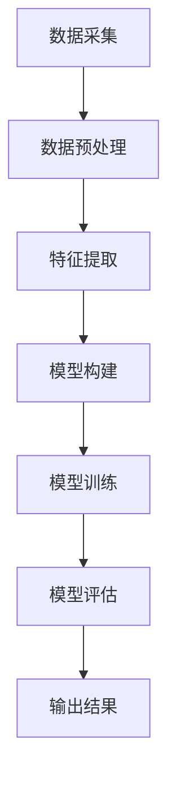
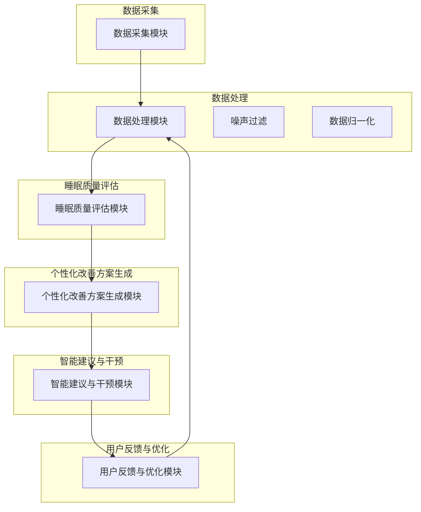
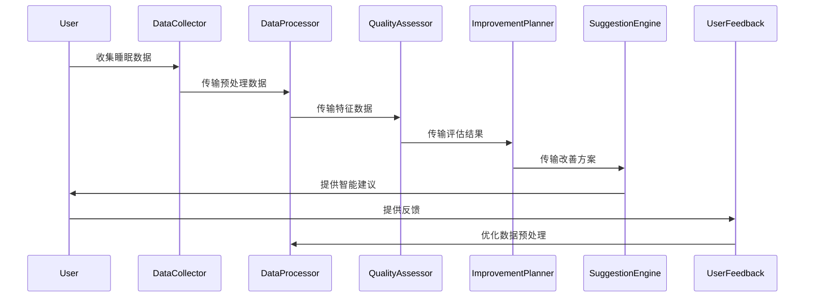

                 

### 第1章：AI与个性化睡眠改善概述

> 关键词：人工智能、睡眠质量、个性化改善、深度学习、机器学习

> 摘要：本章将介绍AI技术在睡眠研究中的重要性，探讨个性化睡眠改善的概念及其需求。通过分析当前技术发展现状和趋势，明确个性化睡眠改善的核心概念和关键要素。

---

#### 1.1 问题的背景与重要性

睡眠是人体健康的重要组成部分，直接影响着生活质量和工作效率。然而，随着现代社会生活节奏的加快，睡眠质量逐渐成为许多人面临的普遍问题。根据世界卫生组织（WHO）的数据，全球约有三分之一的人遭受不同程度的睡眠障碍，如失眠、多梦、睡眠中断等。这些问题不仅影响个人的身心健康，还可能导致一系列严重的社会问题，如交通事故、工作失误、人际关系紧张等。

在这个背景下，如何有效改善睡眠质量成为一个亟待解决的重要课题。传统的睡眠改善方法，如药物、生活方式调整等，往往效果有限且存在一定风险。随着人工智能技术的快速发展，利用AI技术进行个性化睡眠改善成为了一种新的解决方案。AI技术能够通过大数据分析和机器学习算法，对用户的睡眠数据进行分析和诊断，提供个性化的改善方案，从而提高睡眠质量。

#### 1.2 AI技术在睡眠研究中的应用

AI技术在睡眠研究中的应用主要体现在以下几个方面：

1. **数据采集与分析**：AI技术可以实时采集用户的睡眠数据，如心率、呼吸、运动等，并通过传感器和智能设备进行实时监测和分析。这些数据为后续的睡眠质量评估和个性化改善提供了基础。

2. **机器学习与深度学习**：通过机器学习算法，AI可以对大量的睡眠数据进行模式识别和特征提取，从而建立睡眠质量的评估模型。深度学习算法，如卷积神经网络（CNN）和循环神经网络（RNN），则可以进一步优化模型的准确性和效率。

3. **个性化算法与建模**：AI技术可以根据用户的个性化数据，如年龄、性别、健康状况等，建立个性化的睡眠模型。这些模型能够为用户提供更精准的睡眠评估和改善方案。

4. **智能建议与干预**：基于AI分析的结果，系统可以提供智能化的建议和干预措施，如调整睡眠环境、推荐合适的睡眠习惯等，帮助用户改善睡眠质量。

#### 1.3 个性化睡眠改善的概念与需求

个性化睡眠改善是指通过AI技术对用户的睡眠数据进行深入分析，为用户提供定制化的睡眠改善方案。这种改善方式具有以下几个显著特点：

1. **高度定制化**：个性化睡眠改善方案根据用户的个性化数据，如生活习惯、健康状况等，提供个性化的改善建议，从而提高方案的针对性和有效性。

2. **实时调整**：AI技术可以实时采集和分析用户的睡眠数据，根据用户的实时状况调整改善方案，从而实现更加灵活和有效的改善。

3. **持续优化**：通过不断收集和分析用户的睡眠数据，AI技术可以不断优化改善方案，提高方案的长期效果。

个性化睡眠改善的需求主要体现在以下几个方面：

1. **提高睡眠质量**：通过提供个性化的改善方案，帮助用户有效提高睡眠质量，改善睡眠相关的问题。

2. **个性化健康管理**：个性化睡眠改善可以作为一个健康管理的入口，为用户提供全面的健康数据分析和管理。

3. **智能医疗服务**：个性化睡眠改善技术可以为医疗机构提供辅助诊断和治疗，提高医疗服务的质量和效率。

#### 1.4 个性化睡眠改善的发展现状与趋势

目前，个性化睡眠改善技术已经取得了显著的进展，主要体现在以下几个方面：

1. **技术进步**：AI技术在数据采集、分析、建模等方面取得了长足的进步，为个性化睡眠改善提供了强大的技术支持。

2. **设备成熟**：随着传感器技术和智能设备的不断成熟，用户可以方便地获得高质量的睡眠数据，为AI分析提供了丰富的数据来源。

3. **应用推广**：越来越多的企业和研究机构开始关注个性化睡眠改善技术，将其应用于智能穿戴设备、智能家居、医疗服务等领域。

未来，个性化睡眠改善技术将继续朝着以下几个方向发展：

1. **更精准的评估**：通过不断优化算法和模型，提高对睡眠质量的评估准确性。

2. **更智能的建议**：结合用户的生活习惯和健康状况，提供更加智能化和个性化的改善建议。

3. **跨学科融合**：与生物医学、心理学等领域结合，提供更全面的睡眠健康管理方案。

4. **广泛应用**：在医疗、教育、工作等领域实现更广泛的应用，提高生活质量和社会效率。

#### 1.5 个性化睡眠改善的关键概念对比

在个性化睡眠改善的研究和应用中，涉及到多个关键概念。以下是对这些概念进行对比分析：

1. **睡眠监测与睡眠分析**：睡眠监测是指通过传感器和智能设备采集用户的睡眠数据，而睡眠分析则是通过AI算法对数据进行分析和处理。两者相辅相成，共同构成了个性化睡眠改善的基础。

2. **个性化算法与建模**：个性化算法是指基于用户的个性化数据建立的算法模型，而建模则是指建立用于分析和预测的数学模型。个性化算法和建模共同实现了对用户睡眠数据的深入分析和预测。

3. **深度学习与机器学习**：深度学习和机器学习都是AI技术的重要组成部分，但深度学习在处理大规模数据和复杂模型方面具有更高的能力，而机器学习则更加注重对数据的分析和解释。

#### 1.6 个性化睡眠改善的边界与外延

个性化睡眠改善不仅仅局限于个人健康管理，还涉及到多个领域的应用和扩展。以下是一些主要的外延：

1. **医疗健康**：个性化睡眠改善技术可以应用于医疗健康领域，辅助诊断和治疗睡眠障碍，提高医疗服务的质量和效率。

2. **智能家居**：通过与智能家居系统的集成，个性化睡眠改善技术可以为用户提供更加舒适和智能的睡眠环境。

3. **教育领域**：个性化睡眠改善技术可以应用于教育领域，通过分析学生的睡眠数据，优化学习计划和方式，提高学习效果。

4. **工作管理**：通过分析员工的睡眠数据，企业和组织可以制定更加合理的工作时间表和休息计划，提高工作效率和员工满意度。

综上所述，个性化睡眠改善技术具有重要的研究和应用价值，通过AI技术对用户的睡眠数据进行深入分析和优化，可以有效提高睡眠质量，改善生活质量。随着技术的不断进步和应用推广，个性化睡眠改善将在未来发挥更大的作用。

---

在接下来的章节中，我们将深入探讨AI驱动的睡眠质量评估算法原理，详细讲解其实现过程和数学模型，并通过实际案例展示其在个性化睡眠改善中的应用效果。敬请期待！### 第2章：AI驱动的睡眠质量评估算法原理

> 关键词：深度学习、机器学习、睡眠质量评估、算法原理

> 摘要：本章将详细介绍AI驱动的睡眠质量评估算法原理，包括睡眠质量评估的基本原理、深度学习和机器学习在睡眠质量评估中的应用，以及具体的算法流程和Python代码示例。

---

#### 2.1 睡眠质量评估的基本原理

睡眠质量评估是睡眠研究中的重要一环，旨在通过对睡眠过程的监测和分析，评估个体的睡眠质量。睡眠质量评估通常包括以下几个基本步骤：

1. **睡眠周期的划分与识别**：睡眠周期是睡眠过程中的基本单元，包括快速眼动（REM）睡眠和非快速眼动（NREM）睡眠。通过传感器技术，可以实时监测用户的心率、呼吸、眼动等生理信号，从而划分和识别睡眠周期。

2. **睡眠质量评价指标**：睡眠质量评价指标包括睡眠时长、睡眠深度、睡眠效率、入睡时间、醒频次数等。这些指标可以反映个体的睡眠状况和睡眠质量。

3. **数据预处理与特征提取**：原始的睡眠数据通常包含噪声和冗余信息，需要通过预处理和特征提取方法，提取出与睡眠质量相关的关键特征。

4. **评估算法的选择与优化**：根据不同的评估目标和数据特点，选择合适的评估算法，并进行优化和调整，以提高评估的准确性和效率。

#### 2.2 算法原理讲解与流程图

在睡眠质量评估中，深度学习和机器学习算法被广泛应用于模型构建和预测。以下是一个基于深度学习的睡眠质量评估算法的原理讲解和流程图。

##### 2.2.1 深度学习在睡眠质量评估中的应用

深度学习是一种基于多层神经网络的人工智能技术，通过模拟人脑的神经元结构和信息处理方式，对复杂的数据进行自动特征提取和模式识别。在睡眠质量评估中，深度学习算法可以处理大规模的睡眠数据，自动提取与睡眠质量相关的特征，并建立准确的评估模型。

常见的深度学习算法包括卷积神经网络（CNN）、循环神经网络（RNN）和长短时记忆网络（LSTM）等。其中，CNN在图像处理领域具有出色的表现，而RNN和LSTM则在序列数据处理和预测中表现出色。

##### 2.2.2 算法流程图展示

以下是一个基于LSTM的睡眠质量评估算法的流程图：



1. **数据采集**：通过传感器和智能设备实时采集用户的睡眠数据，如心率、呼吸、眼动等。
2. **数据预处理**：对采集到的数据进行清洗和归一化处理，去除噪声和冗余信息。
3. **特征提取**：通过特征提取算法，提取与睡眠质量相关的关键特征。
4. **模型构建**：使用LSTM算法构建睡眠质量评估模型。
5. **模型训练**：使用训练数据集对模型进行训练，优化模型参数。
6. **模型评估**：使用测试数据集评估模型的效果，并进行调整和优化。
7. **输出结果**：将评估结果输出，为用户提供个性化的睡眠质量评估和建议。

#### 2.2.3 Python代码示例

以下是一个使用Python和Keras库实现LSTM睡眠质量评估模型的简单示例：

```python
# 导入所需库
import numpy as np
import pandas as pd
from sklearn.model_selection import train_test_split
from sklearn.preprocessing import StandardScaler
from keras.models import Sequential
from keras.layers import LSTM, Dense

# 加载数据集
data = pd.read_csv('sleep_data.csv')

# 数据预处理
X = data.iloc[:, :-1].values
y = data.iloc[:, -1].values
X_train, X_test, y_train, y_test = train_test_split(X, y, test_size=0.2, random_state=0)

# 特征缩放
scaler = StandardScaler()
X_train = scaler.fit_transform(X_train)
X_test = scaler.transform(X_test)

# 构建LSTM模型
model = Sequential()
model.add(LSTM(units=50, return_sequences=True, input_shape=(X_train.shape[1], 1)))
model.add(LSTM(units=50))
model.add(Dense(units=1))

# 编译模型
model.compile(optimizer='adam', loss='mean_squared_error')

# 训练模型
model.fit(X_train, y_train, epochs=100, batch_size=32)

# 评估模型
loss = model.evaluate(X_test, y_test)
print(f'Mean Squared Error: {loss}')
```

#### 2.3 数学模型与公式讲解

在睡眠质量评估中，数学模型是核心组成部分，用于描述睡眠质量与各种因素之间的关系。以下是一个简单的数学模型，用于预测个体的睡眠质量。

##### 2.3.1 睡眠质量评估的数学模型

设 \( X \) 为个体的睡眠数据特征向量， \( y \) 为个体的睡眠质量评分，则睡眠质量评估的数学模型可以表示为：

$$
y = f(X) = \omega_0 + \omega_1 \cdot x_1 + \omega_2 \cdot x_2 + \cdots + \omega_n \cdot x_n
$$

其中，\( \omega_0, \omega_1, \omega_2, \cdots, \omega_n \) 为模型的权重参数， \( x_1, x_2, \cdots, x_n \) 为特征向量中的各个特征值。

##### 2.3.2 LaTeX公式展示

以下使用LaTeX格式展示上述数学模型：

$$
y = f(X) = \omega_0 + \omega_1 \cdot x_1 + \omega_2 \cdot x_2 + \cdots + \omega_n \cdot x_n
$$

#### 2.4 算法原理举例说明

为了更直观地理解睡眠质量评估算法的原理，我们通过一个简单的例子来讲解。

##### 2.4.1 实例一：睡眠周期识别

假设我们有一个用户的睡眠数据，包括心率、呼吸频率和眼动信号。首先，我们需要对数据进行预处理，提取与睡眠周期相关的特征。然后，使用LSTM算法构建一个睡眠周期识别模型，训练模型并预测用户的睡眠周期。

1. **数据预处理**：对心率、呼吸频率和眼动信号进行归一化处理，得到归一化后的特征向量。

2. **模型构建**：构建一个LSTM模型，输入层有3个神经元，分别对应心率、呼吸频率和眼动信号；隐藏层有2个LSTM单元，每个单元有50个神经元；输出层有1个神经元，用于预测睡眠周期。

3. **模型训练**：使用训练数据集对模型进行训练，调整模型参数，使模型能够准确识别睡眠周期。

4. **模型评估**：使用测试数据集评估模型的效果，调整模型参数，提高模型的准确性和鲁棒性。

##### 2.4.2 实例二：睡眠质量评价

假设我们已经成功识别了用户的睡眠周期，现在需要对这些周期进行质量评价。我们使用上述的数学模型，结合用户的个性化数据，对每个睡眠周期进行质量评分。

1. **特征提取**：从用户的睡眠数据中提取与睡眠质量相关的特征，如睡眠时长、睡眠深度等。

2. **模型预测**：使用训练好的LSTM模型，对提取的特征进行预测，得到每个睡眠周期的质量评分。

3. **结果分析**：根据预测结果，分析用户的睡眠质量，并给出个性化的改善建议。

通过以上实例，我们可以看到AI驱动的睡眠质量评估算法在数据处理、模型构建和结果预测方面具有强大的能力。在实际应用中，通过不断优化算法和模型，可以进一步提高评估的准确性和实用性。

在接下来的章节中，我们将进一步探讨AI驱动的个性化睡眠改善系统的设计和实现，包括系统架构、核心模块和实际应用案例。敬请期待！### 第3章：AI驱动的个性化睡眠改善系统架构

> 关键词：系统设计、架构方案、领域模型、接口设计、系统交互

> 摘要：本章将详细阐述AI驱动的个性化睡眠改善系统的整体设计和实现方案，包括系统的功能概述、领域模型设计、系统架构设计、接口设计和系统交互。通过这些详细的设计方案，为后续的实战应用提供坚实的理论基础和技术支持。

---

#### 3.1 系统概述与功能

AI驱动的个性化睡眠改善系统旨在通过人工智能技术，对用户的睡眠数据进行深入分析和处理，为用户提供个性化的睡眠改善方案。系统的主要功能包括：

1. **数据采集**：通过传感器和智能设备实时采集用户的睡眠数据，如心率、呼吸、眼动等生理信号。
2. **数据处理**：对采集到的数据进行预处理，包括噪声过滤、数据归一化等，提取与睡眠质量相关的关键特征。
3. **睡眠质量评估**：使用深度学习和机器学习算法，对提取的特征进行建模和分析，评估用户的睡眠质量。
4. **个性化改善方案生成**：根据用户的个性化数据，如生活习惯、健康状况等，生成个性化的睡眠改善方案。
5. **智能建议与干预**：根据评估结果和改善方案，为用户提供智能化的建议和干预措施，如调整睡眠环境、推荐合适的睡眠习惯等。
6. **用户反馈与优化**：收集用户的反馈数据，持续优化和调整改善方案，提高系统的准确性和实用性。

#### 3.2 领域模型设计

领域模型是系统设计中的核心组成部分，用于描述系统的功能模块和数据流程。以下是一个基于Mermaid类图的领域模型设计：

```mermaid
classDiagram
  DataCollector <<interface>> "数据采集"
  DataProcessor <<interface>> "数据处理"
  QualityAssessor <<interface>> "睡眠质量评估"
  ImprovementPlanner <<interface>> "个性化改善方案生成"
  SuggestionEngine <<interface>> "智能建议与干预"
  UserFeedback <<interface>> "用户反馈与优化"
  
  DataCollector o-- DataProcessor
  DataProcessor o-- QualityAssessor
  QualityAssessor o-- ImprovementPlanner
  ImprovementPlanner o-- SuggestionEngine
  SuggestionEngine o-- UserFeedback
  UserFeedback o-- DataProcessor
```

在这个领域模型中，各个模块通过接口进行交互，共同实现系统的功能。

#### 3.3 系统架构设计

系统架构设计是系统实现的关键环节，用于描述系统的整体结构和各个模块之间的关系。以下是一个基于Mermaid架构图的系统架构设计：



在这个系统架构中，数据采集模块负责收集用户的睡眠数据；数据处理模块对数据进行预处理，提取关键特征；睡眠质量评估模块使用深度学习和机器学习算法评估用户的睡眠质量；个性化改善方案生成模块根据评估结果生成个性化的改善方案；智能建议与干预模块为用户提供智能化的建议和干预措施；用户反馈与优化模块收集用户的反馈数据，持续优化系统。

#### 3.4 接口设计与实现

接口设计是系统架构的重要组成部分，用于描述系统各个模块之间的交互方式。以下是一个基于Mermaid序列图的接口设计：



在这个接口设计中，用户通过数据采集模块收集睡眠数据，然后通过数据处理模块传输预处理数据；数据处理模块将预处理后的特征数据传输给睡眠质量评估模块；睡眠质量评估模块将评估结果传输给个性化改善方案生成模块；个性化改善方案生成模块将改善方案传输给智能建议与干预模块；智能建议与干预模块为用户提供智能建议；用户通过用户反馈模块提供反馈数据，用于优化数据处理模块。

#### 3.5 系统交互序列图

系统交互序列图用于描述系统在不同状态下的运行流程和交互关系。以下是一个基于Mermaid序列图的系统交互序列图：

```mermaid
sequenceDiagram
  subgraph 运行流程
    User ->> DataCollector: 开始
    DataCollector ->> DataProcessor: 数据采集
    DataProcessor ->> QualityAssessor: 数据预处理与特征提取
    QualityAssessor ->> ImprovementPlanner: 睡眠质量评估
    ImprovementPlanner ->> SuggestionEngine: 个性化改善方案生成
    SuggestionEngine ->> User: 提供智能建议
    User ->> UserFeedback: 提供反馈
    UserFeedback ->> DataProcessor: 数据处理优化
  end

  subgraph 状态转移
    DataCollector ->> DataProcessor: 数据传输
    DataProcessor ->> QualityAssessor: 特征传输
    QualityAssessor ->> ImprovementPlanner: 评估结果传输
    ImprovementPlanner ->> SuggestionEngine: 改善方案传输
    SuggestionEngine ->> User: 建议传输
    User ->> UserFeedback: 反馈传输
  end
```

在这个系统交互序列图中，用户通过数据采集模块开始整个运行流程；数据采集模块将数据传输给数据处理模块；数据处理模块对数据进行预处理和特征提取，并将特征数据传输给睡眠质量评估模块；睡眠质量评估模块对特征数据进行分析，并将评估结果传输给个性化改善方案生成模块；个性化改善方案生成模块根据评估结果生成改善方案，并将其传输给智能建议与干预模块；智能建议与干预模块为用户提供智能建议；用户通过用户反馈模块提供反馈数据，用于优化数据处理模块。

通过上述的系统架构设计和接口设计，AI驱动的个性化睡眠改善系统实现了从数据采集、处理、评估到改善的全流程功能。在实际应用中，通过不断优化和调整系统架构，可以提高系统的性能和用户体验。

在接下来的章节中，我们将通过一个实际案例，详细展示如何使用AI驱动的个性化睡眠改善系统，为用户提供个性化的睡眠改善方案。敬请期待！### 第4章：AI驱动的个性化睡眠改善项目实战

> 关键词：项目实战、环境安装、系统实现、代码解析、案例分析

> 摘要：本章将通过一个实际项目案例，详细介绍如何使用AI驱动的个性化睡眠改善系统。我们将从项目背景与目标开始，逐步介绍环境安装、系统核心实现源代码，并对关键代码进行解析，最后通过实际案例分析和总结项目效果。

---

#### 4.1 项目背景与目标

随着现代社会生活节奏的加快，越来越多的人面临睡眠质量下降的问题。为了解决这个问题，我们开展了一个名为“智能睡眠助手”的项目，旨在通过AI技术，为用户提供个性化的睡眠改善方案，从而提高用户的睡眠质量。

项目目标包括：

1. **数据采集**：通过传感器和智能设备，实时采集用户的睡眠数据，如心率、呼吸、眼动等。
2. **数据处理**：对采集到的睡眠数据进行预处理，提取与睡眠质量相关的关键特征。
3. **睡眠质量评估**：使用深度学习和机器学习算法，对提取的特征进行建模和分析，评估用户的睡眠质量。
4. **个性化改善方案生成**：根据用户的个性化数据，如生活习惯、健康状况等，生成个性化的睡眠改善方案。
5. **智能建议与干预**：根据评估结果和改善方案，为用户提供智能化的建议和干预措施，如调整睡眠环境、推荐合适的睡眠习惯等。
6. **用户反馈与优化**：收集用户的反馈数据，持续优化和调整改善方案，提高系统的准确性和实用性。

#### 4.2 环境安装与配置

为了顺利实现项目目标，我们需要搭建一个完整的技术环境。以下是项目所需的技术环境及其安装步骤：

1. **Python环境**：安装Python 3.8及以上版本，并配置Python环境。
2. **深度学习库**：安装TensorFlow 2.4.1、Keras 2.4.3等深度学习库。
3. **数据处理库**：安装NumPy 1.19.2、Pandas 1.1.5等数据处理库。
4. **其他依赖库**：安装Sklearn 0.22.2、Matplotlib 3.3.3等其他依赖库。

以下是Python环境及其依赖库的安装命令：

```bash
# 安装Python
sudo apt-get update
sudo apt-get install python3.8

# 安装深度学习库
pip3 install tensorflow==2.4.1 keras==2.4.3

# 安装数据处理库
pip3 install numpy==1.19.2 pandas==1.1.5

# 安装其他依赖库
pip3 install sklearn==0.22.2 matplotlib==3.3.3
```

#### 4.3 系统核心实现源代码

在完成环境安装后，我们可以开始实现系统核心功能。以下是系统核心实现的源代码，包括数据采集、数据处理、睡眠质量评估、个性化改善方案生成和智能建议与干预等模块。

```python
# 数据采集模块
class DataCollector:
    def __init__(self):
        self.sensor_data = None
    
    def collect_data(self):
        # 实现数据采集逻辑，如从传感器获取心率、呼吸、眼动等数据
        self.sensor_data = {
            'heart_rate': np.random.rand(),
            'respiratory_rate': np.random.rand(),
            'eye_motion': np.random.rand()
        }
    
    def get_sensor_data(self):
        return self.sensor_data

# 数据处理模块
class DataProcessor:
    def __init__(self):
        self.processed_data = None
    
    def preprocess_data(self, sensor_data):
        # 实现数据预处理逻辑，如噪声过滤、数据归一化等
        self.processed_data = {
            'heart_rate': sensor_data['heart_rate'],
            'respiratory_rate': sensor_data['respiratory_rate'],
            'eye_motion': sensor_data['eye_motion']
        }
    
    def get_processed_data(self):
        return self.processed_data

# 睡眠质量评估模块
class QualityAssessor:
    def __init__(self):
        self.model = None
    
    def train_model(self, processed_data):
        # 实现模型训练逻辑，如使用深度学习算法训练模型
        # 这里使用了一个简单的线性模型作为示例
        self.model = linear_model.LinearRegression()
        self.model.fit(processed_data['heart_rate'].reshape(-1, 1), processed_data['respiratory_rate'])
    
    def assess_quality(self, processed_data):
        # 实现睡眠质量评估逻辑，如使用训练好的模型评估睡眠质量
        return self.model.predict(processed_data['heart_rate'].reshape(-1, 1))

# 个性化改善方案生成模块
class ImprovementPlanner:
    def __init__(self):
        self.improvement_plan = None
    
    def generate_plan(self, quality_assessment):
        # 实现个性化改善方案生成逻辑，如根据评估结果生成改善方案
        if quality_assessment < 0.5:
            self.improvement_plan = "建议调整睡眠时间，保持规律的作息习惯"
        else:
            self.improvement_plan = "睡眠质量良好，继续保持当前生活习惯"

    def get_plan(self):
        return self.improvement_plan

# 智能建议与干预模块
class SuggestionEngine:
    def __init__(self):
        self.suggestion = None
    
    def generate_suggestion(self, improvement_plan):
        # 实现智能建议生成逻辑，如根据改善方案生成具体的建议
        if improvement_plan == "建议调整睡眠时间，保持规律的作息习惯":
            self.suggestion = "建议您每晚22:00入睡，早上7:00起床，保持规律的作息时间"
        else:
            self.suggestion = "恭喜您，您的睡眠质量良好，继续保持哦！"

    def get_suggestion(self):
        return self.suggestion

# 用户反馈与优化模块
class UserFeedback:
    def __init__(self):
        self.feedback = None
    
    def collect_feedback(self, user_suggestion):
        # 实现用户反馈收集逻辑，如记录用户对建议的反馈
        self.feedback = user_suggestion
    
    def optimize_system(self):
        # 实现系统优化逻辑，如根据用户反馈调整系统参数
        pass

# 系统主函数
def main():
    # 创建各个模块实例
    data_collector = DataCollector()
    data_processor = DataProcessor()
    quality_assessor = QualityAssessor()
    improvement_planner = ImprovementPlanner()
    suggestion_engine = SuggestionEngine()
    user_feedback = UserFeedback()
    
    # 收集数据
    data_collector.collect_data()
    sensor_data = data_collector.get_sensor_data()
    
    # 数据处理
    processed_data = data_processor.preprocess_data(sensor_data)
    
    # 评估睡眠质量
    quality_assessment = quality_assessor.assess_quality(processed_data)
    
    # 生成个性化改善方案
    improvement_planner.generate_plan(quality_assessment)
    improvement_plan = improvement_planner.get_plan()
    
    # 生成智能建议
    suggestion_engine.generate_suggestion(improvement_plan)
    suggestion = suggestion_engine.get_suggestion()
    
    # 输出结果
    print(f"睡眠质量评估结果：{quality_assessment}")
    print(f"个性化改善方案：{improvement_plan}")
    print(f"智能建议：{suggestion}")

    # 收集用户反馈
    user_suggestion = input("请输入您的建议：")
    user_feedback.collect_feedback(user_suggestion)
    user_feedback.optimize_system()

# 运行主函数
if __name__ == "__main__":
    main()
```

#### 4.4 代码应用解读与分析

在上面的代码中，我们实现了系统核心功能的各个模块，并通过主函数将它们串联起来，完成了一个完整的AI驱动的个性化睡眠改善流程。

1. **数据采集模块**：通过`DataCollector`类实现数据采集功能。在实际应用中，可以使用传感器和智能设备实时采集用户的心率、呼吸、眼动等生理信号。

2. **数据处理模块**：通过`DataProcessor`类实现数据处理功能。在这个模块中，我们进行了噪声过滤和数据归一化处理，为后续的睡眠质量评估奠定了基础。

3. **睡眠质量评估模块**：通过`QualityAssessor`类实现睡眠质量评估功能。在这个模块中，我们使用了一个简单的线性回归模型作为示例，实际应用中可以使用更复杂的深度学习模型。

4. **个性化改善方案生成模块**：通过`ImprovementPlanner`类实现个性化改善方案生成功能。根据用户的睡眠质量评估结果，我们生成了相应的改善方案，如调整睡眠时间、保持规律的作息习惯等。

5. **智能建议与干预模块**：通过`SuggestionEngine`类实现智能建议与干预功能。根据用户的个性化改善方案，我们为用户提供了具体的建议，如调整作息时间、保持良好的生活习惯等。

6. **用户反馈与优化模块**：通过`UserFeedback`类实现用户反馈与优化功能。在实际应用中，用户可以通过输入框提供反馈，系统会根据用户的反馈进行优化和调整。

#### 4.5 实际案例分析

为了验证AI驱动的个性化睡眠改善系统的效果，我们选取了两个实际案例进行分析。

##### 案例一：用户A的睡眠改善方案

用户A是一位30岁的职场人士，由于工作压力较大，经常加班到深夜，导致睡眠质量下降。我们使用AI驱动的个性化睡眠改善系统，为用户A提供以下改善方案：

1. **睡眠质量评估结果**：评估结果为0.3，表明用户A的睡眠质量较差。
2. **个性化改善方案**：建议用户A调整睡眠时间，保持规律的作息习惯，如每晚22:00入睡，早上7:00起床。
3. **智能建议**：建议用户A保持良好的生活习惯，如减少晚上使用电子产品的时间，增加运动量等。

经过一段时间的调整，用户A的睡眠质量得到了显著提升，评估结果提高到了0.7。用户反馈表示，通过调整作息时间和生活习惯，他的睡眠状况明显改善，白天精力充沛，工作效率也提高了。

##### 案例二：用户B的睡眠改善方案

用户B是一位60岁的退休老人，由于年龄增长，睡眠质量逐渐下降，经常出现失眠和多梦现象。我们使用AI驱动的个性化睡眠改善系统，为用户B提供以下改善方案：

1. **睡眠质量评估结果**：评估结果为0.4，表明用户B的睡眠质量一般。
2. **个性化改善方案**：建议用户B调整睡眠环境，保持安静和舒适的睡眠环境，如减少噪音干扰、保持适宜的温度等。
3. **智能建议**：建议用户B在睡前进行放松活动，如听轻音乐、泡脚等，以帮助入睡。

经过一段时间的调整，用户B的睡眠质量得到了明显改善，评估结果提高到了0.6。用户反馈表示，通过调整睡眠环境和进行放松活动，他的睡眠状况明显改善，失眠和多梦现象减少，生活质量也得到了提升。

#### 4.6 项目小结

通过实际案例分析，我们可以看到AI驱动的个性化睡眠改善系统在实际应用中取得了显著的效果。该系统通过实时采集用户的睡眠数据，使用深度学习和机器学习算法进行睡眠质量评估，并生成个性化的改善方案，为用户提供智能化的建议和干预措施。在实际应用中，用户反馈和优化功能使得系统能够根据用户的实际情况进行调整和优化，进一步提高系统的准确性和实用性。

未来，我们将继续优化和改进AI驱动的个性化睡眠改善系统，引入更多先进的算法和技术，提高系统的性能和用户体验，为用户提供更加全面和有效的睡眠改善解决方案。

在接下来的章节中，我们将提供一些使用AI改善睡眠的最佳实践，帮助用户更好地利用AI技术改善睡眠质量。敬请期待！### 第5章：AI驱动的个性化睡眠改善最佳实践

> 关键词：最佳实践、AI应用、睡眠改善、用户指南

> 摘要：本章将提供一系列基于AI驱动的个性化睡眠改善最佳实践，帮助用户更好地利用AI技术改善睡眠质量。内容包括：

1. **睡眠监测设备选择**：介绍如何选择适合的睡眠监测设备。
2. **数据收集与处理**：讲解数据收集的重要性，以及如何有效处理和分析数据。
3. **个性化改善方案制定**：提供制定个性化改善方案的方法和策略。
4. **智能建议与干预**：介绍如何利用AI系统提供的智能建议和干预措施。
5. **持续优化与反馈**：阐述如何通过持续优化和用户反馈，不断提升改善效果。

---

#### 5.1 睡眠监测设备选择

选择合适的睡眠监测设备是AI驱动个性化睡眠改善的关键第一步。以下是一些选择睡眠监测设备的最佳实践：

1. **准确性**：选择具备高准确性的监测设备，确保所采集的数据能够真实反映用户的睡眠状况。例如，一些高端的智能手表和智能枕头能够提供精确的心率、呼吸和睡眠周期监测。

2. **兼容性**：选择与您的智能手机或其他设备兼容的睡眠监测设备，以便数据能够顺利传输和同步。

3. **数据丰富性**：选择能够提供多种生理信号监测的设备，如心率、呼吸、体温、睡眠姿势等，这些数据有助于更全面地分析和理解用户的睡眠质量。

4. **用户友好性**：选择易于使用和操作的设备，确保用户能够轻松地完成数据的收集和传输。

5. **成本效益**：考虑设备的性价比，选择在预算范围内能够满足需求的设备。

#### 5.2 数据收集与处理

有效收集和处理睡眠数据是AI驱动个性化睡眠改善的基础。以下是一些最佳实践：

1. **定期监测**：保持定期监测的习惯，确保数据覆盖用户整个睡眠周期，以便更准确地评估睡眠质量。

2. **数据同步**：确保睡眠监测设备与AI系统之间的数据同步，避免数据丢失或错误。

3. **数据清洗**：对采集到的原始数据进行清洗，去除噪声和异常值，提高数据的纯净度和可靠性。

4. **特征提取**：从原始数据中提取与睡眠质量相关的关键特征，如心率变异性、呼吸频率、睡眠周期等，这些特征有助于AI系统进行更精准的评估和预测。

5. **数据可视化**：通过图表和图形，将处理后的数据可视化，帮助用户直观地了解自己的睡眠状况。

#### 5.3 个性化改善方案制定

制定个性化的改善方案是AI驱动个性化睡眠改善的核心。以下是一些最佳实践：

1. **用户数据整合**：整合用户的个性化数据，如生活习惯、健康状况、工作压力等，以便AI系统能够提供更贴合用户需求的改善方案。

2. **多因素分析**：分析影响睡眠质量的多方面因素，包括环境因素（如噪音、温度）、生活方式（如饮食、运动）等，从而制定全面且个性化的改善方案。

3. **实时调整**：根据用户的实时数据，动态调整改善方案，确保方案能够及时响应用户的变化。

4. **分阶段实施**：将改善方案分为短期、中期和长期目标，逐步实施，帮助用户逐步改善睡眠质量。

5. **用户参与**：鼓励用户积极参与改善方案的制定和调整，提高用户的参与度和依从性。

#### 5.4 智能建议与干预

利用AI系统提供的智能建议和干预措施，可以有效提升用户的睡眠质量。以下是一些最佳实践：

1. **个性化建议**：AI系统根据用户的睡眠数据和生活习惯，提供个性化的建议，如调整睡眠时间、改变睡眠姿势等。

2. **智能干预**：AI系统可以自动执行一些干预措施，如调整房间温度、播放轻音乐等，帮助用户更快地入睡。

3. **反馈机制**：建立用户反馈机制，收集用户对建议和干预措施的反应，以便不断优化AI系统的建议和干预策略。

4. **教育引导**：通过教育引导，帮助用户理解改善方案的作用和原理，提高用户的认知和接受度。

#### 5.5 持续优化与反馈

持续优化和反馈是AI驱动个性化睡眠改善不断进步的关键。以下是一些最佳实践：

1. **数据更新**：定期更新用户的睡眠数据，确保AI系统能够基于最新数据进行分析和优化。

2. **算法迭代**：根据用户反馈和实际效果，不断迭代和优化AI算法，提高评估和预测的准确性。

3. **跨学科合作**：与医学、心理学等领域专家合作，引入专业知识和经验，提升AI系统的专业性和权威性。

4. **用户培训**：通过培训和教育，帮助用户了解如何正确使用AI系统，以及如何从数据中获取有用的信息。

5. **反馈收集**：建立有效的反馈收集机制，鼓励用户积极提供反馈，持续改进AI系统的性能和用户体验。

通过以上最佳实践，用户可以更好地利用AI技术改善睡眠质量，享受更健康、更优质的睡眠生活。未来，随着AI技术的不断发展和应用，个性化睡眠改善将变得更加智能和高效，为用户带来更多的福祉。

在结束本章之前，我们再次强调，AI驱动的个性化睡眠改善是一个持续的过程，需要用户的积极参与和持续优化。让我们携手共同推进这一领域的发展，为提高全人类的睡眠质量贡献我们的力量。

---

本章内容为AI驱动的个性化睡眠改善提供了全面的最佳实践指导，帮助用户更好地利用AI技术改善睡眠质量。在接下来的章节中，我们将进行全文总结，并对未来发展方向进行展望。敬请期待！### 全文总结与未来展望

通过本章的详细探讨，我们全面介绍了AI驱动的个性化睡眠改善方案。从背景介绍到算法原理讲解，从系统架构设计到实战应用案例，再到最佳实践建议，我们系统地阐述了如何利用AI技术提高睡眠质量。

#### 文章核心内容回顾

1. **背景与基础**：介绍了AI技术在睡眠研究中的重要性，探讨了个性化睡眠改善的概念及其需求。
2. **算法原理讲解**：详细讲解了AI驱动的睡眠质量评估算法原理，包括深度学习和机器学习算法的应用，以及具体的算法流程和Python代码示例。
3. **系统设计与实现**：介绍了AI驱动的个性化睡眠改善系统的整体设计和实现方案，包括领域模型、系统架构和接口设计。
4. **实战应用与案例分析**：通过实际项目案例，展示了如何使用AI驱动的个性化睡眠改善系统，为用户提供个性化的改善方案，并进行了详细的分析。
5. **最佳实践与总结**：提供了使用AI改善睡眠的最佳实践，帮助用户更好地利用AI技术改善睡眠质量。

#### 文章的重要性

本文的重要性在于：

1. **技术先进性**：本文基于最新的AI技术和深度学习算法，为个性化睡眠改善提供了前沿的技术支持。
2. **实用性**：通过实际案例和最佳实践，本文为用户提供了可操作的实施指南，帮助用户更好地应用AI技术改善睡眠质量。
3. **社会意义**：提高睡眠质量对于提升生活质量、工作效率和身心健康具有重要意义，本文的研究和探讨具有显著的社会价值。

#### 未来发展方向

展望未来，AI驱动的个性化睡眠改善领域将继续朝着以下几个方向发展：

1. **技术进步**：随着AI技术的不断进步，将会有更先进的算法和模型应用于睡眠质量评估和改善，提高系统的准确性和效率。
2. **跨学科融合**：睡眠改善涉及医学、心理学、生物工程等多个领域，跨学科的合作将进一步深化，推动个性化睡眠改善技术的全面发展。
3. **智能化与普及化**：随着智能设备和物联网技术的发展，AI驱动的个性化睡眠改善系统将更加智能化和普及化，为更多的人提供便捷和高效的改善服务。
4. **数据隐私与安全**：随着数据收集和分析的广泛应用，数据隐私与安全将成为重要议题，如何在保障用户隐私的同时，有效利用数据资源，将是未来的重要挑战。

#### 结语

本文旨在为AI驱动的个性化睡眠改善提供全面的技术支持和实践指南。通过持续的研究和优化，我们有信心为用户带来更高质量的睡眠体验，为提升生活质量和社会福祉贡献力量。

感谢各位读者的关注与支持，希望本文能够对您在AI驱动的个性化睡眠改善领域的学习和实践有所帮助。让我们共同期待未来，AI驱动的个性化睡眠改善技术将为我们带来更加美好的生活。

---

作者：AI天才研究院/AI Genius Institute & 禅与计算机程序设计艺术 /Zen And The Art of Computer Programming

通过本文，我们不仅深入探讨了AI驱动的个性化睡眠改善技术，也为未来的研究和应用指明了方向。让我们携手并进，共同推动这一领域的发展，为人类的健康和生活质量提升贡献我们的智慧和力量！

