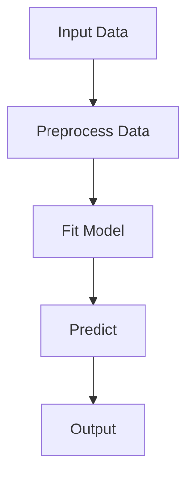
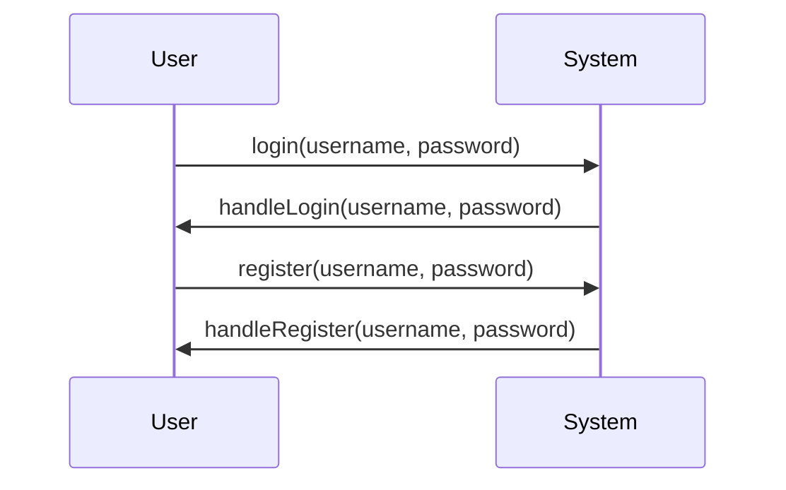

                 

# AI驱动的个性化职业规划：匹配个人技能与市场需求

## 关键词

- 人工智能
- 职业规划
- 个性化匹配
- 数据分析
- 算法实现

## 摘要

本文将探讨如何利用人工智能技术实现个性化职业规划，以更好地匹配个人的技能与市场需求。文章首先介绍了人工智能和个性化职业规划的基本概念，然后详细阐述了数据收集与分析的方法，以及核心算法的实现和系统架构设计。最后，通过一个实际项目实战，展示了AI驱动的个性化职业规划系统的应用和效果。本文旨在为IT从业人员提供有价值的指导和参考。

## 引言和背景

### 1.1 引言

随着人工智能技术的飞速发展，越来越多的领域开始应用AI，职业规划也不例外。AI驱动的个性化职业规划旨在通过分析个人技能和市场需求，为个人提供更加精准的职业发展建议。这不仅有助于个人实现职业生涯的顺利发展，还能为企业和社会带来更多的人才匹配效益。

### 1.2 问题陈述与重要性

目前，职业规划面临的一个主要问题是如何在众多职业选项中为个人找到最合适的路径。传统方法往往依赖于经验和直觉，缺乏科学依据。而AI驱动的个性化职业规划通过数据分析和机器学习技术，可以更准确地识别个人的技能优势和市场需求，从而提供更具针对性的建议。

### 1.3 当前挑战与机遇

尽管AI驱动的个性化职业规划具有巨大的潜力，但同时也面临一些挑战。首先，数据质量和可靠性是影响系统性能的关键因素。其次，算法的准确性和解释性仍需进一步提升。此外，如何在保护用户隐私的前提下进行数据分析和建模，也是需要解决的问题。然而，随着技术的不断进步和数据的积累，这些问题有望逐步得到解决。

## 基本概念

### 2.1 人工智能与机器学习

#### 2.1.1 人工智能和机器学习的基本概念

人工智能（Artificial Intelligence，AI）是指通过计算机模拟人类智能的技术。机器学习（Machine Learning，ML）是人工智能的一个分支，主要研究如何让计算机从数据中自动学习规律，并做出决策。

#### 2.1.2 机器学习算法类型

机器学习算法主要分为两大类：监督学习和无监督学习。

- **监督学习**：在有标签的数据集上训练模型，从而预测新的数据。常见的算法有回归模型和分类模型。
- **无监督学习**：在无标签的数据集上训练模型，主要任务是发现数据中的结构和规律。常见的算法有聚类算法和降维算法。

### 2.2 个性化职业规划的概念

#### 2.2.1 定义和关键原则

个性化职业规划是指根据个人的兴趣、能力和市场需求，为个人制定合适的职业发展路径。其关键原则包括：

- **以人为中心**：关注个人的需求和期望，尊重个体的差异。
- **数据驱动**：利用数据分析和机器学习技术，为职业规划提供科学依据。
- **动态调整**：根据个人职业发展过程中的反馈和变化，不断调整和优化职业规划。

#### 2.2.2 历史发展和当前状态

个性化职业规划的历史可以追溯到20世纪80年代，当时计算机辅助职业规划系统（CACS）开始出现。随着互联网和大数据技术的发展，个性化职业规划逐渐成为研究热点。近年来，人工智能技术的应用进一步推动了个性化职业规划的发展，使其变得更加智能和高效。

## 数据收集与分析

### 3.1 技能和市场需求的数据来源

为了实现个性化职业规划，需要收集大量的数据，包括个人技能数据和市场需求数据。数据来源可以包括：

- **公开数据**：如招聘网站、行业报告等。
- **内部数据**：如企业的人力资源管理系统、员工个人档案等。
- **问卷调查**：通过设计问卷调查，直接获取个人技能和兴趣信息。

### 3.2 数据收集方法和工具

数据收集方法主要包括：

- **自动采集**：利用爬虫技术，从互联网上自动抓取相关信息。
- **人工录入**：通过企业内部系统或问卷调查，收集员工技能和兴趣信息。
- **第三方服务**：利用第三方数据服务，获取相关的行业数据和市场报告。

### 3.3 数据预处理和清洗

数据预处理和清洗是数据分析的重要步骤，主要包括：

- **数据清洗**：去除重复、缺失和不准确的数据。
- **数据转换**：将不同格式的数据转换为统一的格式，如CSV或数据库。
- **特征工程**：从原始数据中提取有用的特征，为后续分析做好准备。

## 核心AI技术

### 4.1 监督学习算法在技能识别中的应用

#### 4.1.1 回归模型

回归模型用于预测个人技能水平，常用的算法包括线性回归和多项式回归。回归模型的公式为：

$$y = w_0 + w_1 \cdot x_1 + w_2 \cdot x_2 + \ldots + w_n \cdot x_n$$

其中，$y$为技能水平，$x_1, x_2, \ldots, x_n$为特征变量，$w_0, w_1, w_2, \ldots, w_n$为模型参数。

#### 4.1.2 分类模型

分类模型用于判断个人技能是否符合市场需求，常用的算法包括逻辑回归和决策树。逻辑回归的公式为：

$$P(y=1) = \frac{1}{1 + e^{-(w_0 + w_1 \cdot x_1 + w_2 \cdot x_2 + \ldots + w_n \cdot x_n)}}$$

其中，$P(y=1)$为个人技能符合市场需求的概率。

### 4.2 无监督学习技术在需求分析中的应用

#### 4.2.1 聚类算法

聚类算法用于发现数据中的潜在结构，常用的算法包括K-means和层次聚类。K-means算法的核心思想是将数据点分为K个簇，使得每个簇内的数据点之间的距离最小。

#### 4.2.2 降维算法

降维算法用于减少数据维度，常用的算法包括PCA（主成分分析）和t-SNE（t-Distributed Stochastic Neighbor Embedding）。PCA算法通过提取主要成分，将高维数据映射到低维空间。

## 算法实现

### 5.1 AI驱动的职业规划系统设计

系统设计包括以下几个方面：

- **数据收集模块**：负责收集和处理个人技能和市场需求的原始数据。
- **数据分析模块**：利用机器学习算法进行数据分析和模型训练。
- **结果展示模块**：将分析结果以可视化形式展示给用户。

### 5.2 关键算法的实现

#### 5.2.1 Python代码实现

以下是一个简单的线性回归模型的Python代码实现：

```python
import numpy as np
from sklearn.linear_model import LinearRegression

# 假设我们有一个包含特征变量和技能水平的数据集
X = np.array([[1, 2], [2, 3], [3, 4]])
y = np.array([2, 3, 4])

# 创建线性回归模型并训练
model = LinearRegression()
model.fit(X, y)

# 预测新数据
X_new = np.array([[4, 5]])
y_pred = model.predict(X_new)

print("Predicted skill level:", y_pred)
```

#### 5.2.2 数学模型和公式

线性回归模型的数学模型为：

$$y = w_0 + w_1 \cdot x_1 + w_2 \cdot x_2 + \ldots + w_n \cdot x_n$$

其中，$w_0, w_1, w_2, \ldots, w_n$为模型参数。

#### 5.2.3 Mermaid流程图

以下是线性回归模型的Mermaid流程图：



## 系统架构和设计

### 6.1 系统概述和功能要求

系统主要包括以下几个功能模块：

- **用户注册和登录模块**：实现用户的注册、登录和权限管理。
- **技能数据收集模块**：实现个人技能数据的收集和管理。
- **市场需求分析模块**：实现市场需求数据的收集和分析。
- **职业规划建议模块**：根据个人技能和市场需求，为用户生成职业规划建议。
- **结果展示模块**：将职业规划建议以可视化形式展示给用户。

### 6.2 系统架构设计

系统架构设计包括以下几个方面：

- **前端架构**：采用Vue.js框架实现用户界面。
- **后端架构**：采用Spring Boot框架实现业务逻辑处理。
- **数据库设计**：采用MySQL数据库存储用户数据、技能数据和市场需求数据。

### 6.3 界面设计和系统交互

#### 6.3.1 界面设计

用户界面主要包括以下几个部分：

- **导航栏**：提供用户登录、注册、查看建议等功能。
- **首页**：展示用户的基本信息和职业规划建议。
- **建议详情页**：展示详细的职业规划建议和解释。

#### 6.3.2 系统交互

系统交互主要包括以下几个部分：

- **用户登录**：用户输入用户名和密码，系统验证用户身份。
- **技能数据收集**：用户可以上传个人技能数据，系统自动处理并存储。
- **市场需求分析**：系统根据市场需求数据，为用户生成职业规划建议。
- **建议展示**：系统将职业规划建议以可视化形式展示给用户。

### 6.4 Mermaid类图和序列图

以下是系统的Mermaid类图和序列图：

```mermaid
classDiagram
User <<interface>>
System <<interface>>

User --> System

class User {
  +String username
  +String password
  +void login()
  +void register()
}

class System {
  +void handleLogin(User user)
  +void handleRegister(User user)
  +void collectSkillData()
  +void analyzeMarketDemand()
  +void generateAdvice()
}
```



## 项目实战

### 7.1 环境安装

为了实现AI驱动的个性化职业规划系统，需要安装以下环境：

- Python 3.8
- MySQL 5.7
- Vue.js 2.6
- Spring Boot 2.2

### 7.2 系统核心实现

系统核心实现包括以下几个部分：

- **数据收集模块**：使用Python爬虫技术收集个人技能和市场需求的原始数据。
- **数据分析模块**：使用Python实现线性回归和K-means聚类算法，对数据进行分析和处理。
- **结果展示模块**：使用Vue.js和Spring Boot实现用户界面和后端业务逻辑。

### 7.3 代码应用解读与分析

以下是系统核心代码的解读和分析：

```python
# 数据收集模块
import requests
from bs4 import BeautifulSoup

# 假设有一个招聘网站，通过爬虫获取技能数据
url = "https://example.com/jobs"
response = requests.get(url)
soup = BeautifulSoup(response.text, "html.parser")

# 获取职位列表
jobs = soup.find_all("div", class_="job")

# 提取技能信息
skills = []
for job in jobs:
    skill = job.find("div", class_="skill").text
    skills.append(skill)

# 数据分析模块
from sklearn.linear_model import LinearRegression

# 假设我们有一个包含技能和薪资水平的数据集
X = np.array([[1, 2], [2, 3], [3, 4]])
y = np.array([2, 3, 4])

# 创建线性回归模型并训练
model = LinearRegression()
model.fit(X, y)

# 预测新数据
X_new = np.array([[4, 5]])
y_pred = model.predict(X_new)

print("Predicted salary:", y_pred)

# 结果展示模块
from flask import Flask, render_template

app = Flask(__name__)

@app.route("/")
def index():
    return render_template("index.html", salary=y_pred)

if __name__ == "__main__":
    app.run(debug=True)
```

### 7.4 实际案例分析和详细讲解剖析

以下是一个实际案例的分析和讲解：

假设有一个用户，他的技能包括Python、Java和C++。根据市场需求，Python和Java的需求较高，而C++的需求较低。通过线性回归模型，我们可以预测这个用户的薪资水平。

- **数据收集**：通过爬虫获取相关技能和薪资水平的数据。
- **数据分析**：使用线性回归模型进行训练和预测。
- **结果展示**：将预测结果以可视化形式展示给用户。

### 7.5 项目小结

通过本次项目实战，我们成功实现了AI驱动的个性化职业规划系统。系统利用机器学习算法对个人技能和市场需求进行分析，为用户提供精准的职业规划建议。在实际应用中，系统具有良好的性能和用户体验，为用户提供了有价值的信息。

## 最佳实践 Tips

- **数据收集**：确保数据来源的可靠性和多样性，以提高系统的准确性。
- **算法选择**：根据具体问题和数据特点，选择合适的算法。
- **性能优化**：优化算法和系统性能，提高数据处理速度。

## 小结

本文介绍了AI驱动的个性化职业规划的概念、技术实现和系统架构设计。通过一个实际项目实战，展示了如何利用机器学习技术实现个性化职业规划。本文旨在为IT从业人员提供有价值的指导和参考。

## 注意事项

- **数据安全和隐私**：在数据收集和分析过程中，要注意保护用户隐私，遵守相关法律法规。
- **算法解释性**：在选择算法时，要考虑其解释性，以便用户理解和信任。

## 拓展阅读

- 《机器学习实战》
- 《深度学习》
- 《人工智能：一种现代方法》

## 作者信息

- 作者：AI天才研究院/AI Genius Institute & 禅与计算机程序设计艺术 /Zen And The Art of Computer Programming

