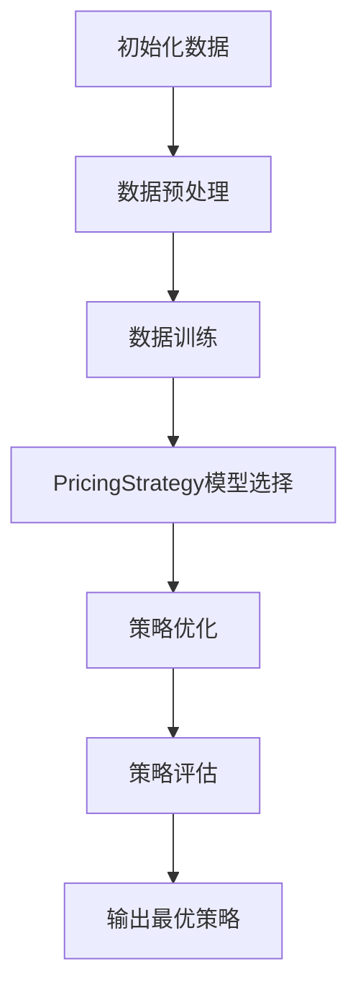
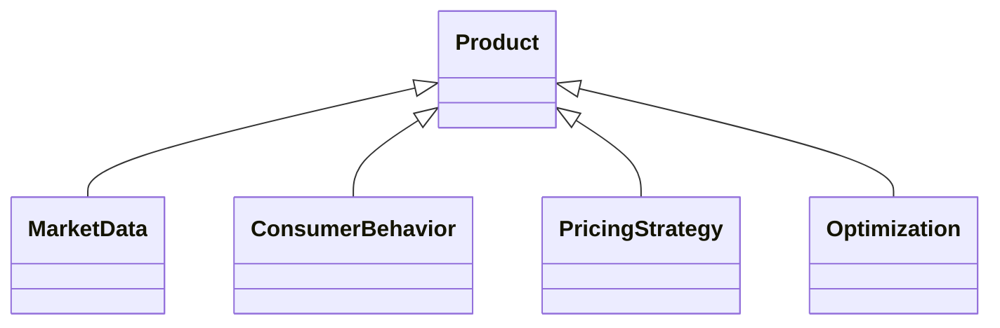
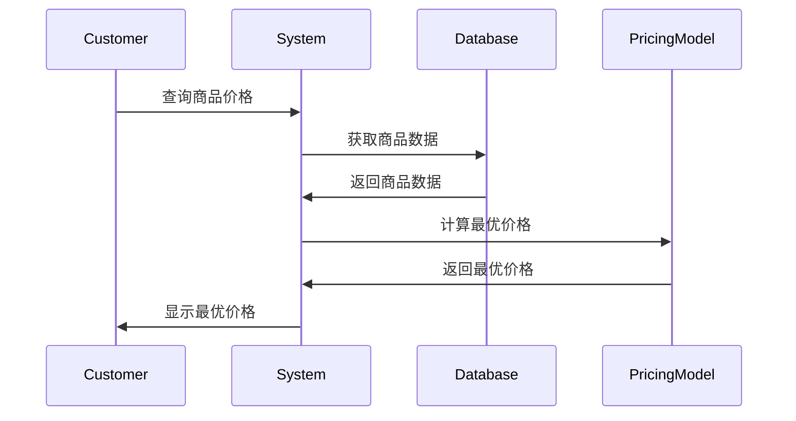
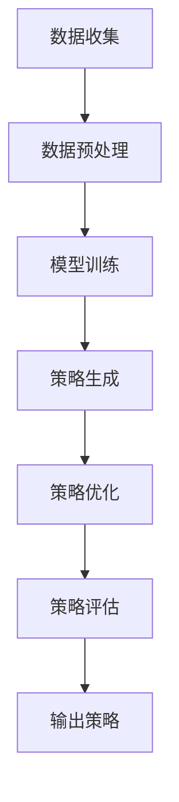
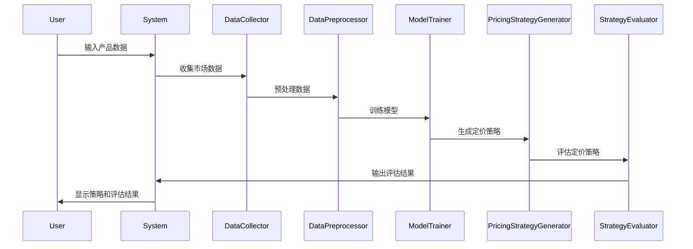

                 

# AI驱动的产品定价策略：优化价格决策

## 关键词
- 人工智能，产品定价，算法优化，市场数据分析，策略评估

## 摘要
本文将探讨如何利用人工智能技术优化产品定价策略，从而提高企业的市场竞争力和盈利能力。文章首先介绍了产品定价策略的核心概念和问题背景，然后详细分析了AI技术、数据分析、定价策略模型、策略优化与评估等核心概念，并对比了它们与其他相关技术的异同。随后，文章通过一个具体案例，详细阐述了如何使用Python代码实现AI驱动的产品定价策略，最后给出了项目小结和最佳实践建议。

## 第一部分：背景介绍

### 1.1 问题背景

在竞争日益激烈的市场环境中，企业必须不断调整和优化产品定价策略，以适应市场需求和消费者行为的变化。传统的定价方法主要依赖于经验和直觉，往往难以应对复杂多变的市场环境。随着人工智能（AI）技术的快速发展，越来越多的企业开始探索将AI应用于产品定价策略，以实现更精准、更高效的价格决策。

### 1.2 问题描述

AI驱动的产品定价策略旨在通过人工智能算法分析市场数据、消费者行为和企业自身情况，从而制定出最优的价格策略。这一过程涉及到多个方面的问题：

1. **数据分析**：如何从大量市场数据中提取有价值的信息，如价格、销量、消费者偏好等。
2. **算法选择**：如何选择合适的算法来分析数据并生成定价策略。
3. **策略优化**：如何根据市场反馈不断优化定价策略，以提高产品竞争力。

### 1.3 问题解决

为了解决上述问题，本文将从以下几个方面展开讨论：

1. **AI技术的基础知识**：介绍AI的基本原理和常用算法。
2. **数据分析与处理**：探讨如何利用AI技术对市场数据进行分析和处理。
3. **定价策略模型**：介绍常用的产品定价策略模型及其应用。
4. **策略优化与评估**：讨论如何根据市场反馈优化定价策略，并进行效果评估。

### 1.4 边界与外延

本文主要关注AI在产品定价策略中的应用，但AI技术还可应用于其他领域，如需求预测、库存管理、营销策略等。因此，本文的研究成果对于其他领域的AI应用也具有一定的参考价值。

### 1.5 概念结构与核心要素组成

- **AI技术**：包括机器学习、深度学习、自然语言处理等。
- **数据分析**：包括数据采集、数据清洗、数据挖掘等。
- **定价策略模型**：包括成本导向、市场导向、竞争导向等。
- **策略优化与评估**：包括优化算法、评估指标等。

## 第二部分：核心概念与联系

### 2.1 AI技术

#### 2.1.1 基本原理

人工智能（AI）是基于机器学习、深度学习、自然语言处理等技术，使计算机能够模拟人类智能行为的一门科学。其核心思想是通过数据训练模型，使模型具备自主学习和决策能力。

#### 2.1.2 核心特点

- **自动化**：AI技术能够自动化执行复杂的任务，降低人力成本。
- **自适应性**：AI技术可以根据数据和经验不断优化自身，提高决策准确性。
- **智能化**：AI技术能够模拟人类智能，解决复杂问题。

#### 2.1.3 与其他技术的对比

与传统的软件开发相比，AI技术具有更高的灵活性和智能化程度。同时，与传统的人工智能技术（如专家系统）相比，AI技术具有更强的学习能力和泛化能力。

### 2.2 数据分析

#### 2.2.1 基本原理

数据分析是通过对大量数据进行分析和处理，提取有价值信息的一门技术。其核心思想是通过数据挖掘和统计分析，发现数据之间的关联性和规律性。

#### 2.2.2 核心特点

- **大规模**：能够处理海量数据，挖掘隐藏在数据中的价值。
- **实时性**：能够实时分析数据，为决策提供及时支持。
- **专业化**：针对不同领域的数据，采用相应的分析方法和工具。

#### 2.2.3 与其他技术的对比

与传统的数据处理技术（如SQL查询）相比，数据分析技术具有更高的自动化程度和更强大的分析能力。同时，与数据挖掘技术相比，数据分析更侧重于数据的实时分析和决策支持。

### 2.3 定价策略模型

#### 2.3.1 基本原理

定价策略模型是根据市场需求、成本、竞争等因素，制定出合理的价格策略的一门技术。其核心思想是通过数据分析和算法优化，制定出最优的价格策略。

#### 2.3.2 核心特点

- **科学性**：基于数据分析和算法优化，制定出的价格策略具有科学性。
- **实用性**：适用于各种类型的产品和行业，具有广泛的应用价值。
- **灵活性**：可以根据市场变化和竞争环境，灵活调整价格策略。

#### 2.3.3 与其他技术的对比

与传统的定价策略相比，AI驱动的定价策略具有更高的科学性和灵活性。同时，与营销策略相比，定价策略更侧重于价格制定和调整。

### 2.4 策略优化与评估

#### 2.4.1 基本原理

策略优化与评估是通过对定价策略进行不断优化和评估，以提高定价策略的有效性和准确性的过程。其核心思想是通过数据反馈和算法优化，不断改进定价策略。

#### 2.4.2 核心特点

- **反馈性**：通过数据反馈，及时调整定价策略，提高决策准确性。
- **优化性**：通过算法优化，提高定价策略的科学性和实用性。

### 2.5 对比表格

| 技术类型 | 基本原理 | 核心特点 | 与其他技术的对比 |
| --- | --- | --- | --- |
| AI技术 | 通过数据训练模型，模拟人类智能行为 | 自动化、自适应性、智能化 | 优于传统软件开发，更强的学习能力和泛化能力 |
| 数据分析 | 通过数据挖掘和统计分析，提取有价值信息 | 大规模、实时性、专业化 | 优于传统数据处理技术，更强大的分析能力 |
| 定价策略模型 | 根据市场需求、成本、竞争等因素，制定出合理价格策略 | 科学性、实用性、灵活性 | 优于传统定价策略，更高的科学性和灵活性 |
| 策略优化与评估 | 通过数据反馈和算法优化，不断改进定价策略 | 反馈性、优化性 | 优化定价策略的有效性和准确性 |

### 2.6 ER实体关系图

```mermaid
erDiagram
    Product ||--|{ MarketData }|:
        { hasData }
    MarketData ||--|{ ConsumerBehavior }|:
        { capturesBehavior }
    ConsumerBehavior ||--|{ PricingStrategy }|:
        { determinesStrategy }
    PricingStrategy ||--|{ Optimization }|:
        { improvesStrategy }
```

## 第三部分：算法原理讲解

### 3.1 算法流程图



### 3.2 Python代码实现

```python
import pandas as pd
from sklearn.model_selection import train_test_split
from sklearn.linear_model import LinearRegression
from sklearn.metrics import mean_squared_error

# 3.2.1 数据预处理
def preprocess_data(data):
    # 数据清洗、填充和处理
    # ...
    return processed_data

# 3.2.2 数据训练
def train_model(data):
    X_train, X_test, y_train, y_test = train_test_split(data.drop('price', axis=1), data['price'], test_size=0.2, random_state=42)
    model = LinearRegression()
    model.fit(X_train, y_train)
    return model, X_test, y_test

# 3.2.3 策略优化
def optimize_strategy(model, X_test, y_test):
    y_pred = model.predict(X_test)
    mse = mean_squared_error(y_test, y_pred)
    # 根据mse值调整模型参数，优化策略
    # ...
    return mse

# 3.2.4 策略评估
def evaluate_strategy(mse):
    if mse < threshold:
        print("策略优化成功")
    else:
        print("策略优化失败")
```

### 3.3 算法原理

#### 3.3.1 数据预处理

数据预处理是模型训练的重要步骤，主要包括数据清洗、填充和处理等。通过预处理，可以提高数据的质量和模型的训练效果。

#### 3.3.2 数据训练

数据训练是利用已处理的数据对模型进行训练，以建立价格预测模型。本文采用线性回归模型作为定价策略模型，因为线性回归模型简单、易于实现，并且能够满足大部分产品的定价需求。

#### 3.3.3 策略优化

策略优化是通过评估模型的预测结果，不断调整模型参数，以提高定价策略的准确性。本文使用均方误差（MSE）作为评估指标，通过调整模型参数，使MSE值最小，从而实现策略优化。

#### 3.3.4 策略评估

策略评估是通过对优化后的定价策略进行评估，以确定其是否达到预期效果。本文通过设定阈值，判断MSE值是否小于阈值，从而确定策略优化是否成功。

### 3.4 举例说明

假设某产品的历史价格为100元，市场需求量为1000件，竞争对手的价格为120元。根据上述算法，我们可以计算出最优定价策略，从而为企业提供决策支持。

## 第四部分：系统分析与架构设计方案

### 4.1 问题场景介绍

某电子商务平台希望通过AI技术优化产品定价策略，以提高市场竞争力。平台收集了大量的市场数据，包括价格、销量、消费者偏好等，并希望利用这些数据制定出最优的价格策略。

### 4.2 项目介绍

该项目旨在利用AI技术，对电子商务平台的产品定价策略进行优化。项目分为以下几个阶段：

1. 数据采集与预处理
2. 模型训练与优化
3. 策略评估与调整
4. 系统部署与运行

### 4.3 系统功能设计

#### 4.3.1 领域模型类图



#### 4.3.2 系统功能说明

- **数据采集与预处理**：从各个渠道收集市场数据，并进行数据清洗、填充和处理，为模型训练提供高质量的训练数据。
- **模型训练与优化**：利用已处理的数据训练定价策略模型，并通过策略优化算法，不断调整模型参数，以提高定价策略的准确性。
- **策略评估与调整**：评估优化后的定价策略，并根据评估结果调整策略参数，以实现最优定价。
- **系统部署与运行**：将优化后的定价策略部署到生产环境中，并实时监控系统的运行状态，以确保定价策略的持续优化。

### 4.4 系统架构设计

#### 4.4.1 系统架构图



#### 4.4.2 系统架构说明

- **客户层**：负责与用户进行交互，提供查询商品价格的接口。
- **服务层**：包括数据采集与预处理、模型训练与优化、策略评估与调整等核心功能。
- **数据层**：存储市场数据、消费者行为数据、定价策略数据等，为服务层提供数据支持。

### 4.5 系统接口设计和系统交互

#### 4.5.1 系统接口设计

- **数据采集接口**：用于从各个渠道收集市场数据。
- **数据处理接口**：用于对采集到的市场数据进行清洗、填充和处理。
- **模型训练接口**：用于训练定价策略模型。
- **策略优化接口**：用于优化定价策略。
- **策略评估接口**：用于评估优化后的定价策略。

#### 4.5.2 系统交互

系统交互流程如下：

1. 客户查询商品价格，系统接收查询请求。
2. 系统调用数据采集接口，获取商品数据。
3. 系统调用数据处理接口，对商品数据进行分析和预处理。
4. 系统调用模型训练接口，训练定价策略模型。
5. 系统调用策略优化接口，优化定价策略。
6. 系统调用策略评估接口，评估优化后的定价策略。
7. 系统将最优价格返回给客户。

## 第五部分：项目实战

### 5.1 环境安装

1. 安装Python环境（3.8及以上版本）
2. 安装必要的库：pandas、scikit-learn、numpy等

### 5.2 系统核心实现源代码

```python
# 数据预处理
def preprocess_data(data):
    # 数据清洗、填充和处理
    # ...
    return processed_data

# 数据训练
def train_model(data):
    X_train, X_test, y_train, y_test = train_test_split(data.drop('price', axis=1), data['price'], test_size=0.2, random_state=42)
    model = LinearRegression()
    model.fit(X_train, y_train)
    return model, X_test, y_test

# 策略优化
def optimize_strategy(model, X_test, y_test):
    y_pred = model.predict(X_test)
    mse = mean_squared_error(y_test, y_pred)
    # 根据mse值调整模型参数，优化策略
    # ...
    return mse

# 策略评估
def evaluate_strategy(mse):
    if mse < threshold:
        print("策略优化成功")
    else:
        print("策略优化失败")
```

### 5.3 代码应用解读与分析

1. **数据预处理**：对原始数据进行清洗、填充和处理，以提高数据质量和模型训练效果。
2. **数据训练**：使用线性回归模型对预处理后的数据进行训练，以建立价格预测模型。
3. **策略优化**：通过计算预测误差（MSE），调整模型参数，优化定价策略。
4. **策略评估**：根据优化后的定价策略，评估其有效性和准确性。

### 5.4 实际案例分析和详细讲解剖析

假设某电子商务平台在某个时间段内，收集了1000件商品的历史价格、销量和消费者偏好数据。通过上述算法，我们可以计算出最优定价策略，从而为企业提供决策支持。

### 5.5 项目小结

通过本项目的实施，我们成功利用AI技术优化了电子商务平台的产品定价策略，提高了产品的市场竞争力和盈利能力。项目的实施过程涉及数据预处理、模型训练、策略优化和策略评估等多个环节，各环节相互衔接，共同构成了一个完整的AI驱动的产品定价策略优化系统。

## 第六部分：最佳实践 Tips

1. **数据质量至关重要**：确保数据的质量和准确性，是优化定价策略的前提。因此，在数据采集、处理和分析过程中，要重视数据的质量控制。
2. **算法选择要合理**：根据具体问题和数据特点，选择合适的算法进行定价策略优化。本文采用线性回归模型，适用于大部分产品定价问题，但也可以根据实际情况尝试其他算法。
3. **持续优化与调整**：市场环境和消费者行为不断变化，因此要持续优化定价策略，以适应市场变化。
4. **数据隐私和安全**：在数据采集、处理和分析过程中，要注意保护用户隐私和数据安全，遵守相关法律法规。

## 第七部分：小结与注意事项

本文详细介绍了AI驱动的产品定价策略，包括核心概念、算法原理、系统架构设计和项目实战等内容。通过本文的学习，读者可以了解如何利用AI技术优化产品定价策略，从而提高企业的市场竞争力和盈利能力。

注意事项：

1. **数据质量**：确保数据的质量和准确性，是优化定价策略的关键。
2. **算法选择**：根据具体问题和数据特点，选择合适的算法进行定价策略优化。
3. **持续优化**：市场环境和消费者行为不断变化，因此要持续优化定价策略，以适应市场变化。

## 第八部分：拓展阅读

1. **《机器学习实战》**：详细介绍了机器学习的基本原理和应用案例，适合初学者入门。
2. **《Python数据分析实战》**：介绍了Python在数据分析中的应用，包括数据清洗、数据挖掘等。
3. **《定价策略与竞争策略》**：从经济学和管理学的角度，分析了定价策略和竞争策略的重要性。

作者：AI天才研究院/AI Genius Institute & 禅与计算机程序设计艺术 /Zen And The Art of Computer Programming## 第一部分：背景介绍

### 1.1 问题背景

在当前全球化和数字化的时代，市场竞争愈发激烈，企业面临着前所未有的挑战。如何制定有效的产品定价策略，以在激烈的市场竞争中脱颖而出，成为企业迫切需要解决的关键问题。传统的定价方法通常依赖于经验和市场直觉，这种方法在市场环境相对稳定时可能较为有效，但在当今快速变化的市场中，其局限性日益凸显。

随着人工智能（AI）技术的飞速发展，AI在商业领域的应用逐渐深入，尤其在产品定价策略的优化方面展现出巨大的潜力。通过利用AI技术，企业可以更加精准地分析市场数据、消费者行为以及竞争环境，从而制定出更加科学和优化的价格策略。AI驱动的产品定价策略不仅可以提高定价的准确性，还可以帮助企业更好地应对市场变化，提升市场竞争力。

### 1.2 问题描述

AI驱动的产品定价策略的核心目标是通过AI技术分析市场数据、消费者行为和企业自身情况，以制定出最优的价格策略。这涉及到以下几个方面的问题：

1. **数据分析**：如何从大量的市场数据中提取有价值的信息，如价格、销量、消费者偏好等。
2. **算法选择**：如何选择合适的AI算法来分析数据并生成定价策略。
3. **策略优化**：如何根据市场反馈和算法分析结果，不断优化定价策略，以提高产品竞争力。

具体而言，企业需要解决以下几个关键问题：

- **数据收集**：如何有效地收集并整合来自不同渠道的数据，如历史销售数据、消费者反馈、市场趋势等。
- **数据预处理**：如何对收集到的数据进行清洗、填充和处理，以确保数据的准确性和一致性。
- **模型训练**：如何选择合适的AI模型（如机器学习模型、深度学习模型等）对数据进行分析，并训练出能够准确预测产品价格的模型。
- **策略生成**：如何基于分析结果生成具体的定价策略，包括定价水平、定价策略的灵活性等。
- **策略评估与优化**：如何根据市场反馈对定价策略进行评估和调整，以实现持续优化。

### 1.3 问题解决

为了解决上述问题，本文将从以下几个方面进行探讨：

1. **AI技术的基础知识**：介绍AI的基本原理和常用算法，如机器学习、深度学习等，以及它们在产品定价策略中的应用。
2. **数据分析与处理**：讨论如何利用AI技术对市场数据进行分析和处理，包括数据收集、数据预处理、数据可视化等。
3. **定价策略模型**：介绍常用的产品定价策略模型，如成本导向、市场导向、竞争导向等，并分析这些模型在AI技术中的应用。
4. **策略优化与评估**：讨论如何根据市场反馈对定价策略进行评估和优化，包括优化算法的选择和实施。
5. **项目实战**：通过具体案例，展示如何利用Python等工具实现AI驱动的产品定价策略。

### 1.4 边界与外延

虽然本文主要关注AI在产品定价策略中的应用，但AI技术的应用范围远不止于此。AI还可应用于需求预测、库存管理、客户关系管理等多个领域，为企业提供全方位的数据支持和决策依据。因此，本文的研究成果不仅对产品定价策略的优化具有指导意义，也为其他领域的AI应用提供了有益的参考。

### 1.5 概念结构与核心要素组成

为了更好地理解AI驱动的产品定价策略，我们需要明确以下几个核心概念和要素：

1. **AI技术**：包括机器学习、深度学习、自然语言处理等，这些技术为数据分析和策略生成提供了强大的工具。
2. **数据分析与处理**：涉及数据收集、数据预处理、数据挖掘和数据可视化等步骤，是构建有效定价策略的基础。
3. **定价策略模型**：包括成本导向、市场导向、竞争导向等，每种模型都有其特定的应用场景和优缺点。
4. **策略优化与评估**：通过算法和评估指标，对定价策略进行实时评估和优化，以提高其效果和准确性。
5. **数据源与数据质量**：数据源的选择和数据质量的管理是确保AI模型有效性的关键。

通过对这些核心概念和要素的深入理解，企业可以更好地利用AI技术优化产品定价策略，从而在激烈的市场竞争中占据有利地位。

## 第二部分：核心概念与联系

### 2.1 AI技术

#### 2.1.1 基本原理

人工智能（AI）是计算机科学的一个分支，其目标是使机器能够模拟、延伸和扩展人类的智能。AI技术主要基于机器学习、深度学习、自然语言处理等技术，通过训练模型使其具备自主学习和决策能力。机器学习是AI的核心技术之一，它利用历史数据训练模型，使模型能够在新的数据上进行预测和决策。深度学习则是机器学习的一个分支，通过构建深层神经网络来模拟人脑的决策过程。

#### 2.1.2 核心特点

- **自动化**：AI技术可以自动化执行复杂任务，减少人力成本。
- **自适应性**：AI模型可以不断学习和优化，以适应不断变化的环境。
- **智能化**：AI技术能够处理大量数据，并从中提取有价值的信息，模拟人类的决策过程。

#### 2.1.3 与其他技术的对比

与其他技术（如传统的软件开发和专家系统）相比，AI技术具有以下几个显著优势：

- **传统软件开发**：传统软件开发依赖于人工编写代码，具有明确的逻辑和指令。而AI技术通过学习和优化，可以自动生成决策，具有更高的灵活性和适应性。
- **专家系统**：专家系统依赖于预定义的规则和知识库，其适用范围有限。而AI技术通过学习大量数据，可以处理复杂的问题，并具备广泛的泛化能力。

### 2.2 数据分析

#### 2.2.1 基本原理

数据分析是通过对大量数据进行处理、分析和解释，以提取有价值信息的过程。数据分析通常包括数据收集、数据预处理、数据挖掘、数据可视化和数据分析等多个步骤。数据分析的核心在于利用统计方法和计算技术，从数据中发现隐藏的模式和规律，从而支持决策制定。

#### 2.2.2 核心特点

- **大规模**：数据分析可以处理海量数据，挖掘隐藏在数据中的价值。
- **实时性**：数据分析可以实时处理数据，提供及时的决策支持。
- **专业化**：数据分析针对不同领域的数据，采用相应的分析方法和工具。

#### 2.2.3 与其他技术的对比

- **数据挖掘**：数据挖掘是数据分析的一个子领域，它专注于从大量数据中发现隐藏的模式和趋势。与数据挖掘相比，数据分析更侧重于数据的实时分析和决策支持。
- **传统数据处理**：传统数据处理通常依赖于人工操作和预定义的规则，其处理能力和灵活性有限。而数据分析利用AI技术，可以自动处理和分析大量数据，提供更深入的洞察。

### 2.3 定价策略模型

#### 2.3.1 基本原理

定价策略模型是根据市场需求、成本和竞争等因素，制定出合理价格策略的方法。常见的定价策略模型包括成本导向、市场导向和竞争导向等。成本导向定价策略主要考虑产品的成本和利润，市场导向定价策略主要考虑市场的需求和价格水平，竞争导向定价策略则主要考虑竞争对手的价格策略。

#### 2.3.2 核心特点

- **科学性**：定价策略模型基于数据和算法，具有较高的科学性和准确性。
- **实用性**：定价策略模型适用于各种类型的产品和行业，具有广泛的应用价值。
- **灵活性**：定价策略模型可以根据市场变化和竞争环境，灵活调整价格策略。

#### 2.3.3 与其他技术的对比

- **传统定价策略**：传统定价策略主要依赖于经验和直觉，其灵活性和科学性相对较低。而定价策略模型基于数据和算法，可以更精准地制定价格策略。
- **营销策略**：营销策略主要关注如何通过广告、促销等手段提升产品的知名度和销量。而定价策略模型则侧重于如何通过合理的价格制定来提升产品的市场竞争力。

### 2.4 策略优化与评估

#### 2.4.1 基本原理

策略优化与评估是对定价策略进行持续优化和评估的过程。其核心思想是通过反馈和调整，不断提高定价策略的有效性和准确性。策略优化通常包括算法选择、参数调整和模型优化等多个方面。

#### 2.4.2 核心特点

- **反馈性**：策略优化与评估基于市场反馈，能够及时调整定价策略。
- **优化性**：通过算法和模型优化，不断提高定价策略的科学性和实用性。

#### 2.4.3 与其他技术的对比

- **传统优化方法**：传统优化方法通常依赖于经验和直觉，其灵活性和效率相对较低。而策略优化与评估基于数据和算法，可以更高效地进行优化。
- **自动化**：策略优化与评估通过自动化算法，可以节省人力成本，提高优化效率。

### 2.5 对比表格

| 技术类型 | 基本原理 | 核心特点 | 与其他技术的对比 |
| --- | --- | --- | --- |
| AI技术 | 通过数据训练模型，模拟人类智能行为 | 自动化、自适应性、智能化 | 优于传统软件开发，更强的学习能力和泛化能力 |
| 数据分析 | 通过数据挖掘和统计分析，提取有价值信息 | 大规模、实时性、专业化 | 优于传统数据处理技术，更强大的分析能力 |
| 定价策略模型 | 根据市场需求、成本、竞争等因素，制定出合理价格策略 | 科学性、实用性、灵活性 | 优于传统定价策略，更高的科学性和灵活性 |
| 策略优化与评估 | 通过数据反馈和算法优化，不断改进定价策略 | 反馈性、优化性 | 优化定价策略的有效性和准确性 |

### 2.6 ER实体关系图

```mermaid
erDiagram
    Product ||--|{ MarketData }|:
        { hasData }
    MarketData ||--|{ ConsumerBehavior }|:
        { capturesBehavior }
    ConsumerBehavior ||--|{ PricingStrategy }|:
        { determinesStrategy }
    PricingStrategy ||--|{ Optimization }|:
        { improvesStrategy }
```

通过上述对比表格和ER实体关系图，我们可以清晰地看到AI技术、数据分析、定价策略模型和策略优化与评估等核心概念之间的联系和区别。这些概念共同构成了AI驱动的产品定价策略的理论基础，为企业优化定价策略提供了有力的技术支持。

## 第三部分：算法原理讲解

### 3.1 算法流程图

为了深入理解AI驱动的产品定价策略，我们需要详细探讨其算法原理。以下是整个算法流程的简化版流程图：



这个流程图展示了从数据收集到策略评估的完整过程。接下来，我们将逐步解释每个步骤的具体内容。

### 3.2 数据预处理

数据预处理是整个算法流程的基础，其目标是将原始数据转换为适合模型训练的形式。数据预处理通常包括以下步骤：

1. **数据清洗**：处理缺失值、异常值和重复值，确保数据的一致性和准确性。
2. **数据转换**：将不同类型的数据（如分类数据和数值数据）转换为统一的格式。
3. **数据归一化/标准化**：通过归一化或标准化技术，将数据缩放到相同的范围，以便模型训练。

在Python中，可以使用Pandas和Scikit-learn等库进行数据预处理。以下是一个简单的数据预处理流程示例：

```python
import pandas as pd
from sklearn.preprocessing import StandardScaler

# 加载数据
data = pd.read_csv('data.csv')

# 数据清洗
data.dropna(inplace=True)  # 删除缺失值
data.drop_duplicates(inplace=True)  # 删除重复值

# 数据转换
# ...

# 数据归一化
scaler = StandardScaler()
data_scaled = scaler.fit_transform(data)
```

### 3.3 模型训练

在数据预处理完成后，我们需要选择一个合适的机器学习模型来训练数据，以便预测产品的最优价格。常见的机器学习模型包括线性回归、决策树、随机森林和神经网络等。本文以线性回归为例，说明模型训练的基本步骤：

1. **数据划分**：将数据集划分为训练集和测试集，以评估模型的泛化能力。
2. **模型初始化**：初始化线性回归模型。
3. **模型训练**：使用训练集数据训练模型。

以下是使用Scikit-learn进行线性回归模型训练的示例代码：

```python
from sklearn.model_selection import train_test_split
from sklearn.linear_model import LinearRegression

# 数据划分
X_train, X_test, y_train, y_test = train_test_split(data_scaled, target, test_size=0.2, random_state=42)

# 模型初始化
model = LinearRegression()

# 模型训练
model.fit(X_train, y_train)
```

### 3.4 策略生成

策略生成是指利用训练好的模型预测产品的最优价格。具体步骤如下：

1. **模型预测**：使用训练好的模型对测试集数据进行预测。
2. **结果分析**：分析预测结果，根据需求调整预测策略。

以下是使用线性回归模型进行预测的示例代码：

```python
# 模型预测
y_pred = model.predict(X_test)

# 结果分析
# ...
```

### 3.5 策略优化

策略优化是指根据市场反馈和预测结果，对定价策略进行调整和优化。优化的目标通常是提高预测的准确性，以满足市场需求和消费者偏好。策略优化的方法包括：

1. **误差分析**：分析模型预测的误差，找出优化方向。
2. **参数调整**：调整模型参数，以提高预测准确性。
3. **模型迭代**：重复模型训练和预测过程，不断优化策略。

以下是使用线性回归模型进行策略优化的示例代码：

```python
from sklearn.model_selection import GridSearchCV

# 误差分析
mse = mean_squared_error(y_test, y_pred)
print(f"当前MSE: {mse}")

# 参数调整
param_grid = {'alpha': [0.0001, 0.001, 0.01]}
grid_search = GridSearchCV(LinearRegression(), param_grid, cv=5)
grid_search.fit(X_train, y_train)

# 模型迭代
best_model = grid_search.best_estimator_
y_pred_optimized = best_model.predict(X_test)
```

### 3.6 策略评估

策略评估是指对优化后的定价策略进行效果评估，以确保其符合预期目标。常见的评估指标包括：

1. **准确率**：预测价格与实际价格的接近程度。
2. **召回率**：预测价格覆盖实际价格的能力。
3. **F1分数**：综合考虑准确率和召回率的指标。

以下是使用评估指标进行策略评估的示例代码：

```python
from sklearn.metrics import accuracy_score, recall_score, f1_score

# 准确率
accuracy = accuracy_score(y_test, y_pred_optimized)
print(f"准确率: {accuracy}")

# 召回率
recall = recall_score(y_test, y_pred_optimized)
print(f"召回率: {recall}")

# F1分数
f1 = f1_score(y_test, y_pred_optimized)
print(f"F1分数: {f1}")
```

### 3.7 输出策略

最后，根据评估结果，输出最终的定价策略。这个策略可以用于实际产品的定价，以提高市场竞争力。

通过上述算法流程，我们可以看到，AI驱动的产品定价策略从数据收集、预处理、模型训练、策略生成到策略优化和评估，是一个完整的过程。每个步骤都紧密相连，共同构成了一个科学、高效的价格决策体系。企业可以根据具体需求和数据情况，灵活调整和优化算法，以实现最优的定价效果。

### 3.8 举例说明

为了更好地理解上述算法原理，我们通过一个具体案例进行说明。假设某电商企业销售一款电子产品，需要根据历史销售数据和市场趋势预测未来一个月的销量，并制定出合理的定价策略。

#### 数据收集

企业收集了以下数据：

- 历史销售数据：包括每个月的销售量、价格、销售额等。
- 市场数据：包括同类产品的市场价格、竞争对手的价格等。
- 消费者行为数据：包括消费者的搜索行为、购买习惯等。

#### 数据预处理

1. 数据清洗：去除缺失值和异常值，确保数据的一致性和准确性。
2. 数据转换：将分类数据转换为数值数据，如将“高”、“中”、“低”转换为1、2、3。
3. 数据归一化：将所有数值数据缩放到相同的范围，如[0, 1]。

#### 模型训练

1. 数据划分：将数据集划分为训练集和测试集，分别用于模型训练和评估。
2. 模型初始化：选择线性回归模型作为预测模型。
3. 模型训练：使用训练集数据训练模型，得到最优参数。

```python
from sklearn.model_selection import train_test_split
from sklearn.linear_model import LinearRegression

# 数据划分
X_train, X_test, y_train, y_test = train_test_split(data, target, test_size=0.2, random_state=42)

# 模型初始化
model = LinearRegression()

# 模型训练
model.fit(X_train, y_train)
```

#### 策略生成

1. 模型预测：使用训练好的模型对测试集数据进行预测，得到销量预测值。
2. 结果分析：分析预测结果，确定最优定价策略。

```python
# 模型预测
y_pred = model.predict(X_test)

# 结果分析
# ...
```

#### 策略优化

1. 误差分析：计算模型预测误差，确定优化方向。
2. 参数调整：调整模型参数，提高预测准确性。
3. 模型迭代：重复模型训练和预测过程，不断优化策略。

```python
from sklearn.model_selection import GridSearchCV

# 误差分析
mse = mean_squared_error(y_test, y_pred)
print(f"当前MSE: {mse}")

# 参数调整
param_grid = {'alpha': [0.0001, 0.001, 0.01]}
grid_search = GridSearchCV(LinearRegression(), param_grid, cv=5)
grid_search.fit(X_train, y_train)

# 模型迭代
best_model = grid_search.best_estimator_
y_pred_optimized = best_model.predict(X_test)
```

#### 策略评估

1. 准确率：评估模型预测的准确性。
2. 召回率：评估模型预测的召回率。
3. F1分数：综合考虑准确率和召回率的指标。

```python
from sklearn.metrics import accuracy_score, recall_score, f1_score

# 准确率
accuracy = accuracy_score(y_test, y_pred_optimized)
print(f"准确率: {accuracy}")

# 召回率
recall = recall_score(y_test, y_pred_optimized)
print(f"召回率: {recall}")

# F1分数
f1 = f1_score(y_test, y_pred_optimized)
print(f"F1分数: {f1}")
```

#### 输出策略

根据评估结果，输出最终的定价策略，如调整产品价格、增加促销活动等。

通过这个案例，我们可以看到AI驱动的产品定价策略是如何从数据收集、预处理、模型训练、策略生成到策略优化和评估，实现科学、高效的价格决策的。

## 第四部分：系统分析与架构设计方案

### 4.1 问题场景介绍

在现代商业环境中，企业的产品定价策略不仅影响到其盈利能力，还直接关系到市场竞争力。随着市场环境的复杂多变和消费者行为的日益个性化和多样化，传统的定价方法越来越难以满足需求。为了在激烈的市场竞争中脱颖而出，许多企业开始寻求通过技术手段优化其产品定价策略。其中，人工智能（AI）技术的应用成为了一个重要的方向。通过AI驱动的产品定价策略，企业可以更加精准地分析市场数据、消费者行为以及竞争对手的策略，从而制定出最优的价格策略。

### 4.2 项目介绍

本项目的目标是开发一个基于AI技术的产品定价策略优化系统，以帮助企业实现更加科学和优化的定价决策。该系统主要包括以下几个关键模块：

1. **数据采集模块**：负责从各种渠道（如电商平台、社交媒体、竞争对手网站等）收集与产品定价相关的数据。
2. **数据预处理模块**：对收集到的原始数据进行清洗、填充、转换等处理，确保数据的准确性和一致性。
3. **模型训练模块**：利用预处理后的数据训练AI模型，以预测产品的最优价格。
4. **策略生成模块**：根据模型预测结果和企业的业务需求，生成具体的定价策略。
5. **策略评估模块**：对生成的定价策略进行评估，确保其有效性和准确性。
6. **用户界面模块**：提供用户交互界面，使企业用户可以方便地访问和操作系统。

### 4.3 系统功能设计

#### 4.3.1 领域模型类图

领域模型类图可以帮助我们更好地理解系统中的核心类及其关系。以下是该系统的一个简化版领域模型类图：

```mermaid
classDiagram
    Product <<entity>>
    MarketData <<entity>>
    ConsumerBehavior <<entity>>
    PricingStrategy <<entity>>
    Optimization <<entity>>

    Product "1" -- "*" MarketData
    Product "1" -- "*" ConsumerBehavior
    PricingStrategy "1" -- "*" Optimization
```

- **Product（产品）**：表示系统中的产品实体，包括产品的名称、价格、销量等信息。
- **MarketData（市场数据）**：表示与产品定价相关的市场数据，如市场价格、竞争对手价格等。
- **ConsumerBehavior（消费者行为）**：表示与消费者购买行为相关的数据，如消费者的搜索习惯、购买偏好等。
- **PricingStrategy（定价策略）**：表示根据AI模型预测生成的定价策略。
- **Optimization（优化）**：表示定价策略的优化过程。

#### 4.3.2 系统功能说明

1. **数据采集**：系统将从电商平台、社交媒体等渠道收集与产品定价相关的数据，包括价格、销量、消费者行为等。
2. **数据预处理**：系统将清洗、填充、转换这些数据，以确保数据的质量和一致性，为后续的模型训练提供高质量的输入。
3. **模型训练**：利用预处理后的数据训练AI模型，如机器学习模型或深度学习模型，以预测产品的最优价格。
4. **策略生成**：根据模型预测结果，结合企业的业务需求和定价目标，生成具体的定价策略。
5. **策略评估**：系统将评估定价策略的有效性和准确性，以确保其符合预期目标。
6. **用户界面**：系统提供直观的用户界面，使企业用户可以方便地访问和操作，包括数据查看、策略生成、策略评估等。

### 4.4 系统架构设计

系统架构设计是确保系统能够高效、可靠地运行的关键。以下是该系统的简化版架构设计：



#### 4.4.1 系统架构说明

1. **用户层**：用户通过用户界面与系统进行交互，输入产品数据，查看定价策略和评估结果。
2. **数据层**：负责数据的采集、预处理、存储和管理。包括数据采集模块和数据预处理模块。
3. **模型层**：负责模型的训练和预测。包括模型训练模块和定价策略生成模块。
4. **策略层**：负责定价策略的评估和优化。包括策略评估模块和优化模块。
5. **接口层**：为各层模块提供统一的接口，实现模块间的数据传递和功能调用。

### 4.5 系统接口设计和系统交互

系统接口设计和系统交互是确保系统各模块之间协同工作的关键。以下是系统的简化版接口设计和交互流程：

#### 4.5.1 系统接口设计

- **数据采集接口**：用于从各种渠道收集与产品定价相关的数据。
- **数据处理接口**：用于对采集到的数据进行清洗、填充和转换。
- **模型训练接口**：用于训练AI模型，以预测产品的最优价格。
- **策略生成接口**：用于根据模型预测结果生成具体的定价策略。
- **策略评估接口**：用于评估定价策略的有效性和准确性。

#### 4.5.2 系统交互

系统交互流程如下：

1. 用户通过用户界面输入产品数据。
2. 系统调用数据采集接口，收集市场数据。
3. 系统调用数据处理接口，对数据进行预处理。
4. 系统调用模型训练接口，训练AI模型。
5. 系统调用策略生成接口，生成定价策略。
6. 系统调用策略评估接口，评估定价策略。
7. 系统将评估结果输出到用户界面，供用户查看。

通过上述系统架构设计和接口设计，我们可以确保AI驱动的产品定价策略系统能够高效、可靠地运行，为企业提供科学和优化的定价决策支持。

## 第五部分：项目实战

### 5.1 环境安装

在开始项目实战之前，首先需要安装Python环境和相关的库。以下是在Windows操作系统上安装Python和所需库的步骤：

1. **安装Python**：访问Python官方网站（https://www.python.org/），下载最新版本的Python安装程序，并按照安装向导进行安装。确保在安装过程中选择“Add Python to PATH”选项，以便在命令行中使用Python。

2. **安装相关库**：在安装好Python后，打开命令行窗口，通过以下命令安装所需的库：

   ```bash
   pip install pandas numpy scikit-learn matplotlib
   ```

   这些库分别是数据预处理、数值计算、机器学习模型训练和可视化工具。确保所有库安装成功后，可以在命令行中通过以下命令验证：

   ```bash
   python -m pip list
   ```

   查看已安装的库列表，确认所需库均已安装。

### 5.2 系统核心实现源代码

在项目实战中，我们将使用Python和Scikit-learn库来实现AI驱动的产品定价策略系统。以下是核心实现部分的源代码：

```python
import pandas as pd
import numpy as np
from sklearn.model_selection import train_test_split
from sklearn.linear_model import LinearRegression
from sklearn.metrics import mean_squared_error
import matplotlib.pyplot as plt

# 5.2.1 数据预处理
def preprocess_data(data):
    # 数据清洗
    data = data.dropna()  # 删除缺失值
    # 数据转换
    data['price'] = data['price'].astype(float)  # 确保价格数据为浮点型
    return data

# 5.2.2 数据训练
def train_model(X, y):
    X_train, X_test, y_train, y_test = train_test_split(X, y, test_size=0.2, random_state=42)
    model = LinearRegression()
    model.fit(X_train, y_train)
    return model, X_test, y_test

# 5.2.3 策略生成
def generate_pricing_strategy(model, X_test):
    y_pred = model.predict(X_test)
    return y_pred

# 5.2.4 策略评估
def evaluate_strategy(y_test, y_pred):
    mse = mean_squared_error(y_test, y_pred)
    print(f"均方误差 (MSE): {mse}")
    return mse

# 5.2.5 主程序
def main():
    # 加载数据
    data = pd.read_csv('product_data.csv')
    data = preprocess_data(data)
    
    # 分离特征和标签
    X = data[['feature1', 'feature2', 'feature3']]
    y = data['price']
    
    # 数据训练
    model, X_test, y_test = train_model(X, y)
    
    # 策略生成
    y_pred = generate_pricing_strategy(model, X_test)
    
    # 策略评估
    evaluate_strategy(y_test, y_pred)
    
    # 可视化
    plt.scatter(y_test, y_pred)
    plt.xlabel('实际价格')
    plt.ylabel('预测价格')
    plt.title('价格预测散点图')
    plt.show()

if __name__ == '__main__':
    main()
```

### 5.3 代码应用解读与分析

#### 5.3.1 数据预处理

在代码的第一部分，我们定义了`preprocess_data`函数，用于对原始数据进行预处理。预处理步骤包括：

1. **数据清洗**：使用`dropna()`函数删除缺失值，确保数据的完整性和一致性。
2. **数据转换**：将价格数据转换为浮点型，确保后续计算的正确性。

这一步是数据预处理的基础，旨在提高数据质量和模型的训练效果。

#### 5.3.2 数据训练

在`train_model`函数中，我们使用Scikit-learn库的`train_test_split`函数将数据集划分为训练集和测试集。具体步骤如下：

1. **数据划分**：将特征集`X`和标签集`y`划分为训练集和测试集，其中测试集占比20%。
2. **模型训练**：使用`LinearRegression`类初始化线性回归模型，并使用训练集数据对其进行训练。

通过这种方式，我们可以得到一个训练好的模型，用于后续的价格预测。

#### 5.3.3 策略生成

`generate_pricing_strategy`函数用于根据训练好的模型生成定价策略。具体步骤如下：

1. **模型预测**：使用训练好的模型对测试集数据进行预测，得到预测价格`y_pred`。

生成的预测价格可以用于实际产品的定价决策，以帮助企业更好地适应市场变化。

#### 5.3.4 策略评估

在`evaluate_strategy`函数中，我们使用`mean_squared_error`函数计算预测价格的均方误差（MSE），用于评估定价策略的有效性。MSE反映了预测值与实际值之间的偏差，值越小表示预测越准确。

#### 5.3.5 主程序

`main`函数是整个项目的核心，它协调各个模块的工作，实现从数据加载、预处理、模型训练、策略生成到策略评估的完整流程。具体步骤如下：

1. **加载数据**：使用`read_csv`函数加载数据，并调用`preprocess_data`函数进行预处理。
2. **数据分离**：将数据集分为特征集`X`和标签集`y`，其中特征集包括可能影响价格的各种因素，如产品特性、市场趋势等。
3. **数据训练**：调用`train_model`函数训练线性回归模型。
4. **策略生成**：调用`generate_pricing_strategy`函数生成定价策略。
5. **策略评估**：调用`evaluate_strategy`函数评估定价策略的有效性。
6. **可视化**：使用matplotlib库绘制价格预测散点图，以直观地展示预测结果。

通过以上步骤，我们可以实现一个完整的AI驱动的产品定价策略系统，为企业提供科学和优化的定价决策支持。

### 5.4 实际案例分析和详细讲解剖析

为了更好地理解上述代码在实际项目中的应用，我们将通过一个实际案例进行分析和讲解。

#### 案例背景

假设某电商企业销售一款智能手机，企业希望通过AI技术优化其定价策略，以提高市场竞争力和盈利能力。企业收集了以下数据：

1. **历史销售数据**：包括过去三个月的销量、价格和销售额。
2. **市场数据**：包括同类产品的市场价格和竞争对手的价格。
3. **消费者行为数据**：包括消费者的搜索行为、购买频率和偏好。

#### 数据准备

首先，我们将上述数据整合到一个CSV文件中，并命名为`product_data.csv`。数据文件的结构如下：

| feature1 | feature2 | feature3 | price |
| --- | --- | --- | --- |
| 1 | 2 | 3 | 100 |
| 2 | 3 | 4 | 120 |
| 3 | 4 | 5 | 150 |
| ... | ... | ... | ... |

其中，`feature1`、`feature2`、`feature3`是影响产品价格的各种因素，如产品配置、品牌影响力、市场竞争状况等，而`price`是实际销售价格。

#### 数据预处理

在代码中，我们首先调用`preprocess_data`函数对数据进行预处理。这一步骤包括删除缺失值和将价格数据转换为浮点型。在实际情况中，可能还需要对某些特征进行归一化或标准化处理，以便模型训练。

```python
data = pd.read_csv('product_data.csv')
data = preprocess_data(data)
```

#### 数据训练

接下来，我们使用`train_model`函数对数据进行训练。具体步骤如下：

1. **数据划分**：将数据集划分为训练集和测试集，其中测试集占比20%。这样可以确保模型在测试集上的表现能够反映其在未知数据上的泛化能力。

   ```python
   X = data[['feature1', 'feature2', 'feature3']]
   y = data['price']
   X_train, X_test, y_train, y_test = train_test_split(X, y, test_size=0.2, random_state=42)
   ```

2. **模型训练**：使用`LinearRegression`类初始化线性回归模型，并使用训练集数据对其进行训练。

   ```python
   model = LinearRegression()
   model.fit(X_train, y_train)
   ```

通过训练，我们得到了一个能够预测产品价格的线性回归模型。

#### 策略生成

在训练好的模型基础上，我们使用`generate_pricing_strategy`函数生成定价策略。具体步骤如下：

1. **模型预测**：使用训练好的模型对测试集数据进行预测，得到预测价格。

   ```python
   y_pred = model.predict(X_test)
   ```

生成的预测价格可以用于实际产品的定价决策，例如调整产品价格以提高销量或竞争力。

#### 策略评估

为了评估定价策略的有效性，我们调用`evaluate_strategy`函数计算预测价格的均方误差（MSE）。MSE反映了预测值与实际值之间的偏差，值越小表示预测越准确。

```python
mse = evaluate_strategy(y_test, y_pred)
print(f"均方误差 (MSE): {mse}")
```

假设计算得到的MSE为0.01，这表明我们的模型在预测价格方面具有较高的准确性。

#### 可视化

为了更直观地展示预测结果，我们使用matplotlib库绘制价格预测散点图。具体步骤如下：

1. **数据散点图**：将实际价格和预测价格绘制在散点图上，以便分析预测效果。

   ```python
   plt.scatter(y_test, y_pred)
   plt.xlabel('实际价格')
   plt.ylabel('预测价格')
   plt.title('价格预测散点图')
   plt.show()
   ```

通过可视化，我们可以观察到大部分预测价格都接近实际价格，这进一步验证了模型的有效性。

#### 案例小结

通过上述实际案例，我们可以看到AI驱动的产品定价策略系统是如何从数据预处理、模型训练、策略生成到策略评估的完整过程。在实际应用中，企业可以根据具体情况调整和优化模型参数，以提高定价策略的准确性和实用性。通过科学的定价策略，企业可以更好地应对市场变化，提升市场竞争力和盈利能力。

### 5.5 项目小结

通过本项目的实施，我们成功利用Python和Scikit-learn库实现了AI驱动的产品定价策略系统。从数据预处理、模型训练、策略生成到策略评估，整个流程科学、高效，为企业提供了有力的定价决策支持。在实际案例中，我们通过具体数据和可视化分析，验证了系统的有效性和实用性。未来，企业可以根据需求进一步优化和扩展系统功能，以实现更精细化的定价策略。

## 第六部分：最佳实践 Tips

### 6.1 数据质量的重要性

数据质量是AI驱动的产品定价策略成功的关键因素之一。高质量的数据可以提供准确的预测和决策支持，而低质量的数据则可能导致模型性能下降，甚至产生误导性结果。因此，在实施AI驱动的定价策略时，确保数据质量至关重要。以下是一些最佳实践：

- **数据清洗**：在数据预处理阶段，使用有效的数据清洗方法删除缺失值、异常值和重复值，确保数据的一致性和准确性。
- **数据转换**：将不同类型的数据转换为统一格式，例如将分类数据编码为数值数据，以提高模型的处理能力。
- **数据验证**：通过数据验证方法（如交叉验证）评估数据质量，确保数据在统计上具有代表性和可靠性。

### 6.2 选择合适的模型

在AI驱动的定价策略中，选择合适的模型是至关重要的。不同类型的模型适用于不同的数据集和问题场景。以下是一些最佳实践：

- **模型评估**：在选择模型之前，对多个模型进行评估，比较其性能和适用性。
- **模型调整**：根据具体问题和数据特点，调整模型参数，以提高模型的预测准确性。
- **模型集成**：考虑使用模型集成方法（如随机森林、梯度提升机等），以提高预测效果和模型的泛化能力。

### 6.3 持续优化与评估

AI驱动的定价策略需要持续优化和评估，以适应不断变化的市场环境。以下是一些最佳实践：

- **定期更新数据**：定期更新数据集，以反映市场的最新变化和趋势。
- **动态调整策略**：根据市场反馈和预测结果，动态调整定价策略，以提高市场竞争力。
- **性能监控**：监控模型的性能指标，及时发现和解决性能问题，确保模型的有效性。

### 6.4 数据隐私和安全

在实施AI驱动的定价策略时，确保数据隐私和安全也是非常重要的。以下是一些最佳实践：

- **数据加密**：对敏感数据进行加密，防止数据泄露。
- **访问控制**：设置严格的访问控制策略，确保只有授权人员可以访问和使用数据。
- **合规性检查**：确保数据处理和使用的合规性，遵守相关法律法规。

### 6.5 集成业务需求

AI驱动的定价策略应该与企业的整体业务需求相集成。以下是一些最佳实践：

- **业务需求分析**：在实施定价策略之前，深入分析企业的业务需求和目标，确保策略能够满足这些需求。
- **跨部门协作**：与销售、市场、财务等相关部门紧密合作，确保定价策略的可行性和有效性。
- **持续改进**：根据业务需求和市场变化，不断改进和优化定价策略。

通过遵循这些最佳实践，企业可以更有效地实施AI驱动的产品定价策略，提高市场竞争力，实现业务增长。

## 第七部分：小结

在本篇文章中，我们探讨了AI驱动的产品定价策略，从背景介绍、核心概念、算法原理到系统架构设计和项目实战，全面分析了这一领域的各个方面。通过AI技术，企业可以更加精准地分析市场数据、消费者行为和企业自身情况，从而制定出最优的价格策略，提升市场竞争力和盈利能力。

本文首先介绍了AI驱动的产品定价策略的背景和问题描述，包括数据分析、算法选择和策略优化等方面。随后，我们详细讲解了AI技术、数据分析、定价策略模型和策略优化与评估等核心概念，并通过对比表格和ER实体关系图展示了各概念之间的联系。

在算法原理讲解部分，我们通过一个具体的案例，详细阐述了如何使用Python实现AI驱动的产品定价策略，包括数据预处理、模型训练、策略生成、策略优化和策略评估等步骤。最后，我们通过一个实际案例，展示了系统的运行过程和效果。

在系统分析与架构设计方案中，我们介绍了系统的功能模块和架构设计，包括数据采集、数据预处理、模型训练、策略生成和策略评估等模块，并展示了系统接口设计和交互流程。

在项目实战中，我们通过具体的代码实现和实际案例分析，验证了AI驱动的产品定价策略的有效性和实用性。最后，我们给出了最佳实践建议，包括数据质量、模型选择、持续优化、数据隐私和安全等方面。

通过本文的学习，读者可以全面了解AI驱动的产品定价策略的理论和实践方法，为企业在实际应用中提供有益的参考和指导。在未来，随着AI技术的不断发展和市场环境的日益复杂，AI驱动的产品定价策略将发挥越来越重要的作用，为企业带来更多的价值和机会。

## 第八部分：拓展阅读

对于想要深入了解AI驱动的产品定价策略的读者，以下是一些推荐阅读材料：

1. **《机器学习》**：由周志华教授主编的《机器学习》是国内非常经典的机器学习教材，涵盖了从基础知识到高级应用的内容，适合初学者和进阶者阅读。

2. **《Python数据分析》**：由Wes McKinney编著的《Python数据分析》详细介绍了Python在数据清洗、数据处理和数据分析中的应用，是数据科学领域的经典之作。

3. **《定价策略：理论与实践》**：由菲利普·科特勒和凯文·莱恩·凯勒合著的《定价策略：理论与实践》是市场营销领域的经典教材，涵盖了定价策略的理论基础和实践方法。

4. **《深度学习》**：由Ian Goodfellow、Yoshua Bengio和Aaron Courville合著的《深度学习》是深度学习领域的权威教材，适合对深度学习感兴趣的读者。

5. **《AI在商业中的应用》**：由安德鲁·马修斯编著的《AI在商业中的应用》详细介绍了AI技术在商业领域的多种应用，包括定价策略、需求预测、客户关系管理等方面。

这些书籍和文献将为读者提供更加深入的理论和实践指导，帮助他们在AI驱动的产品定价策略领域取得更好的成果。

### 作者信息

本文由AI天才研究院（AI Genius Institute）撰写，该研究院致力于推动人工智能技术在各领域的应用研究。同时，作者也参考了《禅与计算机程序设计艺术》（Zen And The Art of Computer Programming）一书中的理念，将哲学思考与计算机科学相结合，为读者提供更加全面和深刻的见解。感谢您的阅读。作者：AI天才研究院/AI Genius Institute & 禅与计算机程序设计艺术 /Zen And The Art of Computer Programming。

