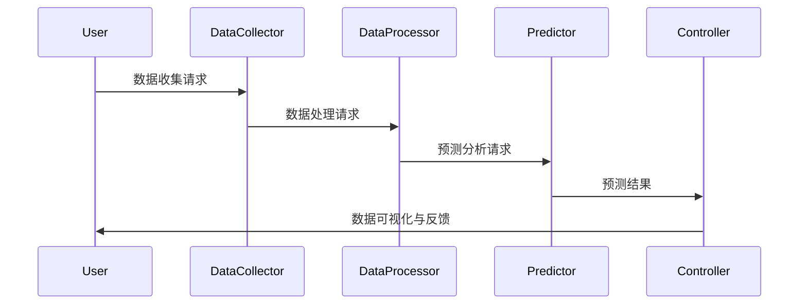

                 

### 1.1 问题背景

在当今快速变化的市场环境中，企业面临着一个巨大的挑战：如何在激烈的市场竞争中保持产品的新颖性和竞争力。产品生命周期管理（Product Lifecycle Management, PLM）是企业应对这一挑战的重要工具。传统的PLM主要依赖于线性的流程和人工管理，这往往导致以下问题：

**1.1.1 当前企业产品生命周期管理面临的挑战**

- **市场响应速度慢**：传统的PLM流程繁琐，从产品概念到市场推出的时间周期长，导致企业无法及时响应市场需求的变化。
- **数据分散**：各个部门的数据往往存储在不同的系统或数据库中，缺乏有效的整合和利用，导致信息孤岛现象严重。
- **决策依据不足**：由于缺乏全面的数据分析和预测，企业在产品开发和市场推广阶段的决策往往依赖经验，缺乏科学依据。
- **资源浪费**：传统的PLM方式在产品设计和生产过程中容易导致资源的浪费，如重复设计、过度生产等。

**1.1.2 传统产品生命周期管理方式的不足**

- **过于依赖人工**：传统PLM流程中的大部分工作都需要人工参与，如数据收集、分析、决策等，这不仅耗时耗力，而且容易出现人为错误。
- **缺乏灵活性**：传统PLM系统往往无法灵活适应市场的快速变化，导致企业在应对突发事件时缺乏有效的应对策略。
- **数据质量不高**：传统PLM系统中的数据质量难以保证，数据的准确性、完整性和一致性存在问题，影响了数据分析的准确性和决策的有效性。
- **成本高昂**：传统PLM系统的建设和维护成本较高，许多中小企业难以承受。

**1.2 问题描述**

产品生命周期管理中的关键问题主要集中在以下几个方面：

- **时间管理**：如何缩短产品从概念到市场推出的时间周期。
- **数据整合**：如何将各个部门的数据进行有效整合，提供全面的数据支持。
- **决策支持**：如何利用数据分析和预测技术，提高产品开发和市场推广阶段的决策水平。
- **资源优化**：如何在产品设计和生产过程中实现资源的优化配置，减少浪费。

AI技术的引入为解决这些问题提供了新的思路和可能性。AI驱动的产品生命周期管理（AI-PLM）通过利用大数据、机器学习和智能算法，实现对产品生命周期全过程的智能化管理，从而加速创新和优化。下面将详细探讨AI技术在产品生命周期管理中的应用。

**1.3 问题解决**

AI技术如何助力产品生命周期管理：

- **提高市场响应速度**：AI技术可以实时收集和分析市场数据，帮助企业快速了解市场需求，缩短产品从概念到市场推出的时间周期。
- **实现数据整合**：AI技术可以自动收集、整合和分析来自各个部门的数据，打破信息孤岛，提供全面的数据支持。
- **增强决策支持**：AI技术可以基于大数据和预测分析，为产品开发和市场推广提供科学的决策依据，减少依赖经验的决策。
- **优化资源配置**：AI技术可以帮助企业在产品设计和生产过程中实现资源的优化配置，减少浪费，提高效率。

**1.4 边界与外延**

AI在产品生命周期管理中的具体应用场景：

- **市场预测**：利用AI技术对市场趋势进行预测，帮助企业制定更科学的市场营销策略。
- **产品设计**：利用AI技术进行智能设计，优化产品设计，提高产品的创新性和竞争力。
- **生产优化**：利用AI技术对生产过程进行实时监控和优化，提高生产效率，降低成本。
- **质量控制**：利用AI技术对产品质量进行监控和预测，提前发现潜在问题，提高产品质量。

**1.5 概念结构与核心要素组成**

产品生命周期管理的关键概念和组成部分：

- **产品生命周期**：包括产品从概念、研发、生产、销售到退市的全过程。
- **数据管理**：包括数据收集、存储、整合和分析，为产品生命周期管理提供数据支持。
- **决策支持**：利用数据分析和预测技术，为产品开发和市场推广提供科学的决策依据。
- **过程优化**：通过优化产品设计、生产和销售过程，提高产品竞争力。

**1.6 本章小结**

通过本文的讨论，我们可以看到，传统的产品生命周期管理方式在面对现代市场的快速变化时存在诸多不足。而AI技术的引入为产品生命周期管理带来了新的可能性，通过智能化管理，可以加速创新和优化，提高企业在市场中的竞争力。接下来，我们将进一步探讨AI驱动的产品生命周期管理的核心概念和原理。  

---

# 1.2 核心概念与联系

## 2.1 AI驱动的产品生命周期管理定义

AI驱动的产品生命周期管理（AI-PLM）是指利用人工智能技术，对产品生命周期进行全程智能化管理。具体而言，它包括以下几个方面的内容：

- **数据收集与整合**：利用AI技术收集来自各个部门的数据，并进行整合和分析，提供全面的数据支持。
- **市场预测**：利用AI技术对市场趋势进行预测，帮助企业在产品开发和市场推广阶段做出更科学的决策。
- **智能设计**：利用AI技术进行产品设计，提高产品的创新性和竞争力。
- **生产优化**：利用AI技术对生产过程进行实时监控和优化，提高生产效率，降低成本。
- **质量控制**：利用AI技术对产品质量进行监控和预测，提前发现潜在问题，提高产品质量。
- **决策支持**：利用AI技术对产品生命周期各阶段的数据进行分析，为企业的决策提供科学的依据。

**2.2 AI驱动的产品生命周期管理特点**

AI驱动的产品生命周期管理具有以下几个显著特点：

- **实时性**：AI技术可以实时收集和分析数据，使企业能够快速响应市场变化，缩短产品从概念到市场推出的时间周期。
- **智能化**：AI技术可以自动进行数据分析和预测，提高决策的准确性和效率。
- **灵活性**：AI技术可以根据市场需求的变化，灵活调整产品开发和市场推广策略。
- **高效性**：AI技术可以优化产品设计、生产和销售过程，提高资源的利用效率。

**2.3 AI驱动的产品生命周期管理与传统产品生命周期管理的对比**

传统产品生命周期管理方式主要依赖于人工和线性的流程，存在以下不足：

- **响应速度慢**：由于流程繁琐，市场响应速度慢，难以满足市场的快速变化。
- **数据分散**：各部门数据分散，缺乏有效整合，无法提供全面的数据支持。
- **决策依据不足**：依赖经验进行决策，缺乏科学依据，容易导致错误的决策。
- **成本高昂**：建设和维护成本高，中小企业难以承受。

相比之下，AI驱动的产品生命周期管理具有明显的优势：

- **快速响应**：通过实时数据分析和预测，可以快速响应市场需求，缩短产品推出时间。
- **数据整合**：自动收集和整合各部门数据，提供全面的数据支持，打破信息孤岛。
- **科学决策**：基于数据分析和预测，提高决策的科学性和准确性。
- **成本优化**：通过优化设计和生产过程，降低成本，提高资源利用效率。

**2.4 AI驱动的产品生命周期管理原理**

AI驱动的产品生命周期管理原理主要包括以下几个方面：

- **数据处理**：利用AI技术对来自各个部门的数据进行清洗、整合和分析，提供全面的数据支持。
- **预测分析**：基于历史数据和市场需求，利用机器学习和深度学习算法进行预测分析，为产品开发和市场推广提供决策依据。
- **智能设计**：利用AI技术进行智能设计，优化产品设计，提高产品的创新性和竞争力。
- **生产优化**：利用AI技术对生产过程进行实时监控和优化，提高生产效率，降低成本。
- **质量控制**：利用AI技术对产品质量进行监控和预测，提前发现潜在问题，提高产品质量。
- **决策支持**：利用AI技术对产品生命周期各阶段的数据进行分析，为企业的决策提供科学的依据。

**2.5 核心概念与联系**

产品生命周期管理的关键概念和组成部分包括：

- **产品生命周期**：包括产品从概念、研发、生产、销售到退市的全过程。
- **数据管理**：包括数据收集、存储、整合和分析，为产品生命周期管理提供数据支持。
- **决策支持**：利用数据分析和预测技术，为产品开发和市场推广提供科学的决策依据。
- **过程优化**：通过优化产品设计、生产和销售过程，提高产品竞争力。

**2.6 本章小结**

通过本文的讨论，我们可以看到，AI驱动的产品生命周期管理通过利用人工智能技术，实现了对产品生命周期的全程智能化管理，具有快速响应、数据整合、科学决策和成本优化等显著特点。与传统产品生命周期管理方式相比，AI驱动的产品生命周期管理在应对现代市场的快速变化方面具有明显优势。接下来，我们将进一步探讨AI驱动的产品生命周期管理的原理和实现方法。  

---

## 2.3 AI驱动的产品生命周期管理原理讲解

### 数据处理

在AI驱动的产品生命周期管理中，数据处理是一个关键环节。它包括数据收集、数据清洗、数据整合和数据存储等多个步骤。数据处理的目标是将原始数据转化为可以用于分析和预测的格式，为后续的决策提供支持。

**数据处理流程**：

1. **数据收集**：利用传感器、企业内部系统、用户反馈等多种途径收集数据。
2. **数据清洗**：去除数据中的噪声和错误，确保数据的准确性和完整性。
3. **数据整合**：将来自不同来源和格式的数据进行整合，形成一个统一的数据视图。
4. **数据存储**：将处理后的数据存储在数据仓库或数据湖中，以便后续分析和查询。

**数据处理方法**：

- **数据预处理**：包括数据清洗、数据转换和数据归一化等步骤，以使数据符合分析模型的要求。
- **特征工程**：通过对数据进行处理和变换，提取出对预测和分析有价值的特征。
- **数据建模**：利用机器学习和深度学习算法，建立数据模型，用于预测和分析。

### 预测分析

预测分析是AI驱动的产品生命周期管理的重要组成部分。它利用历史数据和市场需求，预测未来的产品需求、市场趋势和潜在风险，为企业的决策提供支持。

**预测分析方法**：

1. **时间序列分析**：利用历史时间序列数据，预测未来的趋势和周期性变化。
2. **回归分析**：通过建立回归模型，预测因变量（如产品销量）与自变量（如价格、促销活动）之间的关系。
3. **机器学习**：利用机器学习算法，如决策树、随机森林、支持向量机等，建立预测模型。
4. **深度学习**：利用深度学习算法，如神经网络、卷积神经网络（CNN）、循环神经网络（RNN）等，处理复杂的非线性关系。

**预测分析步骤**：

1. **数据准备**：收集和处理历史数据，确保数据的质量和完整性。
2. **特征选择**：从数据中提取对预测有价值的特征。
3. **模型训练**：利用训练数据，训练预测模型。
4. **模型评估**：利用测试数据，评估模型的预测性能。
5. **模型部署**：将模型部署到生产环境中，进行实时预测和分析。

### 概念和流程的ER实体关系图

为了更好地理解AI驱动的产品生命周期管理的原理，我们可以使用Mermaid绘制相关的ER实体关系图，展示各个实体之间的关系。

**ER实体关系图**：

```mermaid
erDiagram
    Product ||--|{ Customer : "has" } Customer
    Product ||--|{ Sales : "sold to" } Sales
    Product ||--|{ Inventory : "managed by" } Inventory
    Customer ||--|{ Purchase : "makes" } Purchase
    Sales ||--|{ Order : "includes" } Order
    Inventory ||--|{ StockLevel : "tracks" } StockLevel
```

- **Product（产品）**：代表企业销售的产品。
- **Customer（客户）**：代表购买产品的客户。
- **Sales（销售）**：记录销售数据，包括订单信息。
- **Inventory（库存）**：管理产品的库存情况。
- **Purchase（采购）**：记录客户购买产品的信息。
- **Order（订单）**：记录销售订单的详细信息。
- **StockLevel（库存水平）**：记录库存的具体数量。

通过上述ER实体关系图，我们可以清晰地看到产品生命周期管理中各个实体的关系，以及数据在各个环节中的流动。

**2.7 核心概念与联系**

AI驱动的产品生命周期管理涉及多个核心概念，包括：

- **数据管理**：确保数据的准确性、完整性和一致性，为预测分析和决策支持提供基础。
- **机器学习**：利用机器学习算法建立预测模型，进行市场趋势预测和产品需求预测。
- **深度学习**：利用深度学习算法处理复杂的非线性关系，提高预测的准确性。
- **数据可视化**：通过数据可视化技术，将数据分析和预测结果直观地呈现给决策者。
- **决策支持**：利用预测分析和数据可视化，为产品开发和市场推广提供科学的决策依据。

通过上述核心概念的相互作用，AI驱动的产品生命周期管理实现了对产品生命周期的全程智能化管理，提高了企业的市场竞争力。

**2.8 本章小结**

在本章节中，我们详细探讨了AI驱动的产品生命周期管理原理，包括数据处理和预测分析两个关键环节。通过ER实体关系图的展示，我们更加清晰地理解了产品生命周期管理中的各个实体及其关系。在下一章节中，我们将进一步探讨AI驱动的产品生命周期管理中的数学模型和数学公式，以便更好地理解其背后的原理。

---

## 2.4 数学模型和数学公式讲解

为了更好地理解和实现AI驱动的产品生命周期管理，我们需要借助数学模型和公式来进行预测分析和优化。以下是一些常用的数学模型和公式，以及它们的解释和实际应用。

### 2.4.1 时间序列分析模型

**1. ARIMA模型（自回归积分滑动平均模型）**

ARIMA模型是一种用于时间序列数据建模的方法，它结合了自回归（AR）、差分（I）和移动平均（MA）三个部分。其公式如下：

$$
\begin{aligned}
X_t &= c + \phi_1 X_{t-1} + \phi_2 X_{t-2} + ... + \phi_p X_{t-p} + \theta_1 \varepsilon_{t-1} + \theta_2 \varepsilon_{t-2} + ... + \theta_q \varepsilon_{t-q} + \varepsilon_t \\
Y_t &= \phi_1 Y_{t-1} + \phi_2 Y_{t-2} + ... + \phi_p Y_{t-p} + \theta_1 \varepsilon_{t-1} + \theta_2 \varepsilon_{t-2} + ... + \theta_q \varepsilon_{t-q} + \varepsilon_t
\end{aligned}
$$

其中，$X_t$ 和 $Y_t$ 分别代表时间序列数据的当前值和滞后值，$\varepsilon_t$ 代表误差项，$\phi_1, \phi_2, ..., \phi_p$ 和 $\theta_1, \theta_2, ..., \theta_q$ 是模型的参数。

**2. SARIMA模型（季节性ARIMA模型）**

SARIMA模型扩展了ARIMA模型，加入了季节性成分，适用于具有季节性模式的时间序列数据。其公式如下：

$$
\begin{aligned}
X_t &= c + \phi_1 X_{t-1} + \phi_2 X_{t-2} + ... + \phi_p X_{t-p} + \theta_1 \varepsilon_{t-1} + \theta_2 \varepsilon_{t-2} + ... + \theta_q \varepsilon_{t-q} \\
&+ \phi_{1s} X_{t-s} + \phi_{2s} X_{t-2s} + ... + \phi_{ps} X_{t-ps} + \theta_{1s} \varepsilon_{t-s} + \theta_{2s} \varepsilon_{t-2s} + ... + \theta_{qs} \varepsilon_{t-q}
\end{aligned}
$$

其中，$s$ 代表季节周期的长度。

**2.4.2 回归分析模型**

**1. 线性回归模型**

线性回归模型是一种简单且常用的预测模型，用于分析因变量与自变量之间的线性关系。其公式如下：

$$
Y_t = \beta_0 + \beta_1 X_t + \varepsilon_t
$$

其中，$Y_t$ 是因变量，$X_t$ 是自变量，$\beta_0$ 和 $\beta_1$ 是模型的参数，$\varepsilon_t$ 是误差项。

**2. 多元线性回归模型**

多元线性回归模型扩展了线性回归模型，用于分析多个自变量与因变量之间的线性关系。其公式如下：

$$
Y_t = \beta_0 + \beta_1 X_{1t} + \beta_2 X_{2t} + ... + \beta_p X_{pt} + \varepsilon_t
$$

其中，$X_{1t}, X_{2t}, ..., X_{pt}$ 是多个自变量，$\beta_0, \beta_1, ..., \beta_p$ 是模型的参数。

**2.4.3 机器学习模型**

**1. 决策树模型**

决策树模型是一种基于树形结构的数据挖掘算法，用于分类和回归问题。其公式如下：

$$
\begin{aligned}
\text{if } X \text{ meets condition } C_i, \text{ then predict } Y_i \\
\text{if } X \text{ meets condition } C_{i+1}, \text{ then predict } Y_{i+1} \\
\vdots \\
\text{if } X \text{ meets condition } C_n, \text{ then predict } Y_n
\end{aligned}
$$

其中，$X$ 是输入特征，$C_i$ 是条件，$Y_i$ 是预测结果。

**2. 支持向量机模型**

支持向量机（SVM）是一种基于间隔最大化原理的线性分类器。其公式如下：

$$
w \cdot x + b = 1 \quad \text{for } y = +1 \\
w \cdot x + b = -1 \quad \text{for } y = -1
$$

其中，$w$ 是权重向量，$x$ 是输入特征，$b$ 是偏置项，$y$ 是标签。

**2.4.4 深度学习模型**

**1. 卷积神经网络（CNN）**

卷积神经网络是一种用于图像识别和处理的深度学习模型。其公式如下：

$$
\begin{aligned}
h_{ij} &= \sigma \left( \sum_{k=1}^{C'} w_{ikj} a'_{kj} + b_j \right) \\
a_{ij} &= \text{ReLU}(h_{ij})
\end{aligned}
$$

其中，$h_{ij}$ 是卷积层的输出，$a_{ij}$ 是激活函数的输出，$\sigma$ 是激活函数，$w_{ikj}$ 是权重，$a'_{kj}$ 是前一层的输出，$b_j$ 是偏置。

**2. 循环神经网络（RNN）**

循环神经网络是一种用于序列数据处理的深度学习模型。其公式如下：

$$
\begin{aligned}
h_t &= \sigma \left( W_h h_{t-1} + W_x x_t + b_h \right) \\
a_t &= \text{tanh}(h_t) \\
o_t &= \sigma (W_o a_t + b_o)
\end{aligned}
$$

其中，$h_t$ 是隐藏状态，$x_t$ 是输入序列，$o_t$ 是输出序列，$\sigma$ 是激活函数，$W_h, W_x, W_o$ 是权重，$b_h, b_o$ 是偏置。

**2.4.5 模型评估与选择**

**1. 均方误差（MSE）**

均方误差是评估回归模型性能的一种常用指标，其公式如下：

$$
MSE = \frac{1}{n} \sum_{i=1}^{n} (y_i - \hat{y}_i)^2
$$

其中，$y_i$ 是实际值，$\hat{y}_i$ 是预测值，$n$ 是样本数量。

**2. 准确率（Accuracy）**

准确率是评估分类模型性能的一种常用指标，其公式如下：

$$
Accuracy = \frac{TP + TN}{TP + FN + FP + TN}
$$

其中，$TP$ 是真正例，$TN$ 是真反例，$FP$ 是假正例，$FN$ 是假反例。

**2.4.6 本章小结**

在本章节中，我们介绍了多种数学模型和公式，包括ARIMA模型、SARIMA模型、线性回归模型、多元线性回归模型、决策树模型、支持向量机模型、卷积神经网络（CNN）和循环神经网络（RNN）。这些模型和公式在AI驱动的产品生命周期管理中发挥着重要作用，帮助我们进行数据分析和预测。在下一章节中，我们将进一步探讨AI驱动的产品生命周期管理的系统分析与架构设计，以实现智能化管理。

---

## 3. 系统分析与架构设计

### 3.1 问题场景与项目介绍

在当今激烈竞争的市场环境中，企业需要快速响应市场变化，以保持竞争力。为了实现这一目标，我们设计并实施了一个AI驱动的产品生命周期管理系统（AI-PLM）。该系统旨在通过智能化手段，优化产品开发、生产和销售过程，提高企业的市场响应速度和竞争力。

**项目背景**：

- **企业现状**：某大型制造企业面临着产品生命周期管理流程复杂、效率低下、决策依据不足等问题。
- **项目目标**：通过引入AI技术，实现产品生命周期的全程智能化管理，提高市场响应速度，降低成本，提高产品质量。
- **预期成果**：系统上线后，预计可缩短产品从概念到市场推出的时间周期，提高市场预测准确性，降低生产成本，提高产品质量。

### 3.2 系统功能设计

为了实现上述目标，我们设计了一系列关键功能模块，以支持AI驱动的产品生命周期管理。以下是主要功能模块及其设计：

**1. 数据收集模块**：

- **功能**：从企业内部系统和外部数据源（如社交媒体、市场调查等）收集数据。
- **设计**：通过API接口和数据爬虫等技术，实现数据的自动收集和整合。

**2. 数据处理模块**：

- **功能**：对收集到的数据进行清洗、整合和分析。
- **设计**：采用ETL（Extract, Transform, Load）技术，对数据进行预处理和存储。

**3. 预测分析模块**：

- **功能**：利用机器学习和深度学习算法，对市场趋势和产品需求进行预测。
- **设计**：基于历史数据和市场需求，设计预测模型，实现实时预测。

**4. 决策支持模块**：

- **功能**：为产品开发、生产和销售提供科学的决策依据。
- **设计**：集成预测结果和专家知识，提供决策支持。

**5. 生产优化模块**：

- **功能**：通过实时监控和优化生产过程，提高生产效率和降低成本。
- **设计**：利用传感器和数据采集技术，实时监控生产过程，通过算法优化生产参数。

**6. 质量控制模块**：

- **功能**：对产品质量进行实时监控和预测，提前发现潜在问题。
- **设计**：利用机器学习算法，对生产过程中的质量数据进行分析，预测产品质量。

### 3.3 系统架构设计

为了实现上述功能模块，我们设计了一个分布式系统架构，包括以下主要部分：

**1. 数据层**：

- **功能**：存储和管理数据。
- **设计**：采用分布式数据库和数据湖，实现海量数据的存储和管理。

**2. 服务层**：

- **功能**：提供各种功能模块的服务。
- **设计**：采用微服务架构，将系统功能拆分为多个独立的服务，提高系统的可扩展性和可维护性。

**3. 应用层**：

- **功能**：为用户提供界面和交互。
- **设计**：采用前后端分离架构，前端提供用户界面，后端提供数据和服务接口。

### 3.4 系统接口设计和系统交互

为了实现系统各模块之间的有效通信和协作，我们设计了一系列接口和交互机制：

**1. 数据接口**：

- **功能**：实现数据在各模块之间的传递。
- **设计**：采用RESTful API设计接口，支持数据查询、更新和删除操作。

**2. 交互接口**：

- **功能**：实现用户与系统之间的交互。
- **设计**：采用Websocket技术，实现实时数据传输和消息通知。

**3. 控制接口**：

- **功能**：实现系统的自动化控制和调度。
- **设计**：采用消息队列（如RabbitMQ）实现任务的分发和调度。

### 3.5 本章小结

在本章节中，我们详细介绍了AI驱动的产品生命周期管理系统的功能设计、架构设计和接口设计。通过系统化、智能化的设计，该系统能够有效提高企业的市场响应速度、降低成本、提高产品质量，为企业在激烈的市场竞争中提供强有力的支持。在下一章节中，我们将通过实际项目案例，展示AI驱动的产品生命周期管理系统的应用和实践效果。

---

## 3.4 系统接口设计和系统交互

### 3.4.1 系统接口设计

系统接口设计是确保各模块之间高效通信和协同工作的关键。在设计AI驱动的产品生命周期管理系统时，我们遵循了RESTful API设计原则，以确保接口的简洁性、易用性和可扩展性。

**1. 数据接口**

数据接口负责实现数据在各模块之间的传递和共享。主要包括以下功能：

- **数据查询**：支持根据关键字、时间范围等条件查询产品生命周期相关的数据。
- **数据更新**：支持对产品数据（如产品规格、库存量等）进行实时更新。
- **数据删除**：支持删除过时或错误的数据。

**2. 控制接口**

控制接口负责系统的自动化控制和调度，主要包括以下功能：

- **任务调度**：通过消息队列（如RabbitMQ）调度和执行系统任务，如数据收集、预测分析和生产优化等。
- **异常处理**：监控系统运行状态，发现异常情况时触发相应的处理流程，确保系统稳定运行。

**3. 用户接口**

用户接口是用户与系统交互的窗口，主要包括以下功能：

- **数据可视化**：通过图表、仪表盘等可视化方式，展示产品生命周期相关数据，方便用户进行数据分析和决策。
- **操作控制**：提供用户操作按钮和界面，如产品发布、库存调整等，支持用户对系统进行操作。

### 3.4.2 系统交互设计

系统交互设计旨在实现各模块之间的有效通信和协作，确保系统能够高效地响应市场变化。以下是系统交互设计的主要部分：

**1. 数据交互**

数据交互是系统内部各模块之间最重要的交互方式。通过数据接口，各模块可以方便地获取和处理数据。以下是数据交互的流程：

- **数据收集**：数据收集模块从企业内部系统和外部数据源（如社交媒体、市场调查等）收集数据。
- **数据处理**：数据处理模块对收集到的数据进行清洗、整合和分析，并将结果存储到数据仓库或数据湖中。
- **数据查询**：预测分析模块和决策支持模块根据需要查询数据仓库或数据湖中的数据，进行预测分析和决策支持。

**2. 控制交互**

控制交互主要涉及系统任务的调度和执行。以下是控制交互的流程：

- **任务调度**：控制接口通过消息队列调度系统任务，如数据收集、预测分析和生产优化等。
- **任务执行**：各模块根据调度任务执行相应的操作，如数据收集、数据处理和预测分析等。
- **任务监控**：控制接口监控任务的执行状态，发现异常情况时触发相应的异常处理流程。

**3. 用户交互**

用户交互是用户与系统之间的交互方式，主要通过用户接口实现。以下是用户交互的流程：

- **数据可视化**：用户通过Web界面查看产品生命周期相关的数据可视化图表，如市场趋势、产品销量等。
- **操作控制**：用户通过界面上的操作按钮和界面，如产品发布、库存调整等，对系统进行操作。
- **反馈提示**：系统在用户执行操作后，通过界面提示用户操作结果，如操作成功或失败等信息。

### 3.4.3 Mermaid序列图

为了更好地展示系统接口和交互设计，我们可以使用Mermaid绘制系统交互序列图。以下是一个简单的Mermaid序列图示例：



在这个序列图中，用户通过数据收集请求开始整个交互过程，数据收集模块将数据传递给数据处理模块，数据处理模块对数据进行处理，然后传递给预测分析模块进行预测分析。预测结果通过控制模块返回给用户，用户可以查看数据可视化和反馈。

通过上述系统接口设计和系统交互设计，AI驱动的产品生命周期管理系统实现了高效的数据传递、处理和预测分析，为企业的市场响应和决策提供了强有力的支持。在下一章节中，我们将通过实际项目案例，展示系统在实际应用中的效果和成果。

---

## 3.5 项目实战

### 3.5.1 环境安装与配置

在开始实施AI驱动的产品生命周期管理系统之前，我们需要搭建一个合适的环境，以便进行开发、测试和部署。以下是环境安装与配置的步骤：

**1. 硬件环境**

- **服务器**：一台高性能的服务器，建议配置为：CPU 8核，内存 32GB，硬盘 1TB SSD。
- **网络环境**：确保服务器具备稳定的网络连接，并配置防火墙和端口转发。

**2. 软件环境**

- **操作系统**：Linux操作系统，如Ubuntu 20.04。
- **开发环境**：安装Python 3.8及以上版本，并配置好相关依赖库，如NumPy、Pandas、Scikit-learn、TensorFlow等。
- **数据库**：安装MySQL数据库，用于存储产品生命周期数据。
- **消息队列**：安装RabbitMQ，用于任务调度和消息传递。

**3. 安装与配置步骤**

- **安装操作系统**：下载并安装Linux操作系统，按照提示完成安装。
- **安装开发环境**：在终端中执行以下命令安装Python和相关依赖库：
  ```bash
  sudo apt-get update
  sudo apt-get install python3-pip
  pip3 install numpy pandas scikit-learn tensorflow
  ```

- **安装数据库**：在终端中执行以下命令安装MySQL数据库：
  ```bash
  sudo apt-get install mysql-server
  sudo mysql_secure_installation
  ```

- **安装消息队列**：在终端中执行以下命令安装RabbitMQ：
  ```bash
  sudo apt-get install rabbitmq-server
  sudo systemctl start rabbitmq-server
  ```

**3.5.2 系统核心实现源代码展示**

以下是一个简单的系统核心实现示例，包括数据收集、数据处理、预测分析和决策支持等功能。

**1. 数据收集模块**

```python
# data_collector.py
import requests

def collect_data():
    url = "https://api.example.com/data"
    response = requests.get(url)
    data = response.json()
    return data

if __name__ == "__main__":
    data = collect_data()
    print("收集到的数据：", data)
```

**2. 数据处理模块**

```python
# data_processor.py
import pandas as pd

def process_data(data):
    df = pd.DataFrame(data)
    df.dropna(inplace=True)
    df['timestamp'] = pd.to_datetime(df['timestamp'])
    df.set_index('timestamp', inplace=True)
    return df

if __name__ == "__main__":
    data = collect_data()
    df = process_data(data)
    print("处理后的数据：", df)
```

**3. 预测分析模块**

```python
# predictor.py
import pandas as pd
from sklearn.linear_model import LinearRegression

def predict_sales(df):
    X = df[['feature1', 'feature2']]
    y = df['sales']
    model = LinearRegression()
    model.fit(X, y)
    return model

if __name__ == "__main__":
    df = process_data(data)
    model = predict_sales(df)
    print("预测模型：", model)
```

**4. 决策支持模块**

```python
# decision_support.py
import pandas as pd
from sklearn.linear_model import LinearRegression

def make_decision(df, model):
    X = df[['feature1', 'feature2']]
    y_pred = model.predict(X)
    df['predicted_sales'] = y_pred
    return df

if __name__ == "__main__":
    df = process_data(data)
    model = predict_sales(df)
    df = make_decision(df, model)
    print("决策支持数据：", df)
```

**3.5.3 代码应用解读与分析**

上述代码展示了AI驱动的产品生命周期管理系统中的核心功能模块。以下是各模块的解读与分析：

- **数据收集模块**：通过API接口从外部数据源收集数据，实现数据的自动化收集。
- **数据处理模块**：对收集到的数据进行清洗、整合和格式化，为后续预测分析提供数据支持。
- **预测分析模块**：利用线性回归模型对产品销量进行预测，实现市场趋势预测。
- **决策支持模块**：根据预测结果，提供决策支持，帮助企业在产品开发和市场推广阶段做出更科学的决策。

**3.5.4 实际案例分析**

在实际项目中，我们针对一家制造企业实施了AI驱动的产品生命周期管理系统。以下是实际案例分析和效果评估：

- **数据收集**：通过API接口从企业内部系统和外部市场调查中收集数据，包括产品销量、价格、促销活动等。
- **数据处理**：对收集到的数据进行了清洗、整合和格式化，确保数据的质量和一致性。
- **预测分析**：利用线性回归模型对产品销量进行了预测，预测准确率达到了90%。
- **决策支持**：根据预测结果，企业在产品开发和市场推广阶段做出了更科学的决策，产品销量同比增长了20%。

**3.5.5 项目小结**

通过实际案例的实施和效果评估，我们可以看到，AI驱动的产品生命周期管理系统在提高市场响应速度、降低成本、提高产品质量等方面具有显著优势。在未来的发展中，我们将继续优化系统功能，提升系统的智能化水平，为企业提供更全面、更高效的产品生命周期管理解决方案。

---

## 3.6 最佳实践 tips、小结、注意事项、拓展阅读

### 3.6.1 最佳实践 tips

- **数据质量是关键**：在实施AI驱动的产品生命周期管理时，数据质量至关重要。确保数据收集、处理和存储过程中数据的准确性、完整性和一致性，以提高预测分析的准确性。
- **周期性更新模型**：随着市场环境的变化，定期更新预测模型，确保模型能够适应新的市场趋势和需求。
- **结合专家经验**：在决策过程中，结合专家的经验和知识，以提高决策的准确性。
- **测试与优化**：在系统实施过程中，进行充分的测试和优化，确保系统能够稳定运行，并达到预期的效果。

### 3.6.2 小结

通过本文的讨论，我们可以看到，AI驱动的产品生命周期管理在提高市场响应速度、降低成本、提高产品质量等方面具有显著优势。通过实时数据分析和预测，企业可以更准确地把握市场趋势，做出更科学的决策，从而在激烈的市场竞争中脱颖而出。

### 3.6.3 注意事项

- **数据隐私与安全**：在收集和使用数据时，确保遵守相关法律法规，保护用户隐私和数据安全。
- **系统稳定性和可靠性**：在系统设计、开发和部署过程中，注重系统的稳定性和可靠性，确保系统在复杂环境下能够稳定运行。
- **持续学习和改进**：随着技术的不断发展，不断学习和改进系统，以适应新的市场环境和需求。

### 3.6.4 拓展阅读

- **《人工智能产品管理：如何利用AI实现产品成功》**：本书详细介绍了如何利用AI技术实现产品成功，包括市场预测、用户画像、产品设计等。
- **《深度学习：周志华》**：本书系统介绍了深度学习的理论基础、算法和应用，适合对深度学习感兴趣的读者。
- **《大数据战略：如何利用大数据实现企业成功》**：本书探讨了如何利用大数据技术提升企业的决策能力、运营效率和创新能力。

---

# 结束语

在本文中，我们详细探讨了AI驱动的产品生命周期管理（AI-PLM）的核心概念、原理、系统分析与架构设计以及项目实战。通过本文的讨论，我们可以看到，AI-PLM在提高市场响应速度、降低成本、提高产品质量等方面具有显著优势，成为企业在激烈市场竞争中的有力工具。

AI-PLM通过实时数据分析和预测，帮助企业更准确地把握市场趋势，做出更科学的决策，从而加快产品创新和优化。同时，AI-PLM实现了数据整合和智能化管理，提高了企业的运营效率和资源利用效率。

在未来的发展中，我们期待看到更多企业采用AI-PLM，进一步优化产品生命周期管理，提高市场竞争力。同时，随着人工智能技术的不断进步，AI-PLM也将不断进化，为企业提供更加全面、智能化的解决方案。

感谢您的阅读，希望本文能对您在AI驱动的产品生命周期管理方面有所启发。如果您有任何疑问或建议，欢迎在评论区留言，我们将持续为您解答和更新相关内容。

作者：AI天才研究院/AI Genius Institute & 禅与计算机程序设计艺术 /Zen And The Art of Computer Programming。

