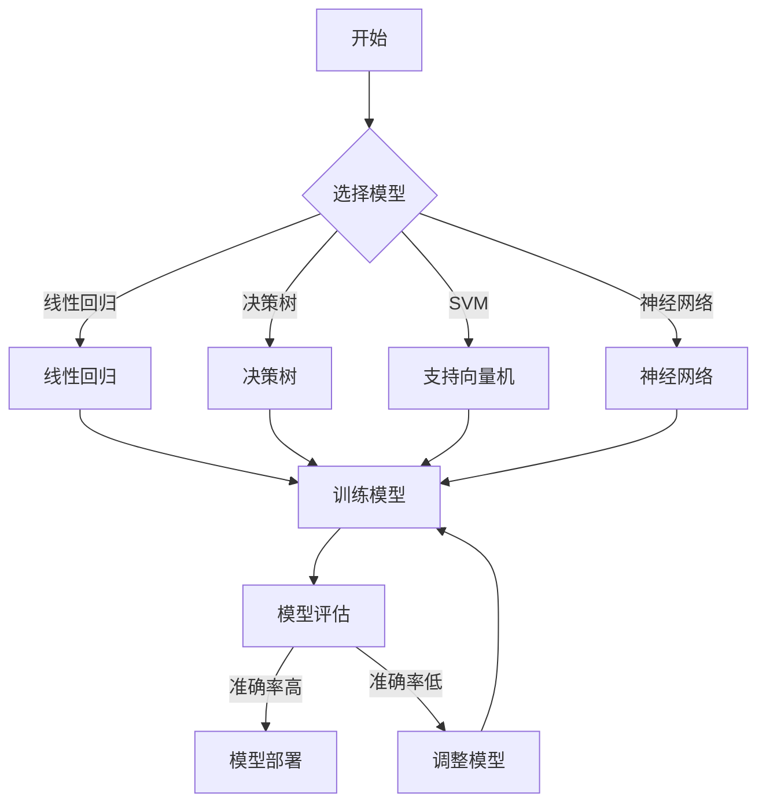

                 

# AI驱动的企业决策支持：增强管理层判断力

关键词：人工智能、企业决策支持、管理层判断力、AI应用、深度学习、决策模型

摘要：本文深入探讨了人工智能（AI）在企业决策支持中的作用，分析了AI如何通过增强管理层判断力，提高企业决策效率和质量。文章首先概述了AI驱动的企业决策支持的基本概念和背景，接着从基础理论、系统设计、业务实践和案例分析四个方面，详细阐述了AI在企业决策支持中的实际应用。通过本文的阅读，读者可以全面了解AI驱动的企业决策支持系统的设计原理、实现方法和实践效果。

## 第一部分: 引言与背景

### 第1章: AI驱动的企业决策支持概述

#### 1.1 AI驱动与企业决策

**1.1.1 AI在企业管理中的重要性**

随着人工智能技术的快速发展，AI已经渗透到企业管理的各个层面。从数据分析、供应链优化到市场营销和客户服务，AI正在成为企业提升效率、降低成本和增强竞争力的利器。在企业管理中，AI的重要性主要体现在以下几个方面：

1. **数据驱动的决策**：AI能够处理和分析大量的数据，为企业提供基于数据的决策依据，减少决策的盲目性。
2. **智能化运营**：AI可以在企业运营中自动化和优化各种流程，提高运营效率，降低人力成本。
3. **风险预测与控制**：AI可以通过分析和预测市场变化、客户需求等，帮助企业提前识别和应对潜在的风险。

**1.1.2 AI驱动决策的优势与挑战**

**优势：**

1. **高效性**：AI能够快速处理和分析大量数据，提供实时决策支持。
2. **准确性**：AI通过对历史数据的分析，可以更准确地预测未来趋势，提高决策的准确性。
3. **创新性**：AI可以带来全新的业务模式和运营策略，推动企业的创新和发展。

**挑战：**

1. **数据质量和可靠性**：AI决策依赖于数据的质量和完整性，数据质量差会导致决策错误。
2. **算法偏见**：AI算法可能会受到训练数据的影响，产生偏见，导致不公平的决策。
3. **技术依赖**：企业在引入AI技术时，需要投入大量的人力、物力和财力，且对技术的依赖性较高。

#### 1.2 企业决策支持的现状与需求

**1.2.1 企业决策支持系统的发展历程**

企业决策支持系统（DSS）的发展历程可以追溯到20世纪70年代。早期的DSS主要是基于规则的系统，随着计算机技术和数据库技术的不断发展，DSS逐渐演变成为集成了数据挖掘、机器学习、深度学习等多种技术的综合系统。

**1.2.2 现有决策支持工具的局限性**

尽管现有的决策支持工具在一定程度上提高了企业的决策效率，但仍然存在一些局限性：

1. **数据依赖性高**：现有的DSS依赖于高质量的数据，数据质量和完整性直接影响决策效果。
2. **缺乏灵活性**：现有的DSS往往是针对特定问题设计的，缺乏灵活性和可扩展性，难以适应不断变化的市场环境。
3. **人机交互不畅**：现有的DSS往往注重数据的处理和分析，而忽视了人与系统的交互，导致决策者难以直观地理解和使用系统。

**1.2.3 AI驱动的企业决策支持的潜在需求**

随着AI技术的不断成熟，企业对AI驱动的决策支持系统有了更高的需求：

1. **智能化数据分析**：企业需要能够对大量数据进行智能化分析，提取有价值的信息，支持决策。
2. **自适应决策支持**：企业需要能够根据业务环境的变化，自动调整和优化决策模型，提高决策的适应性和准确性。
3. **人机协同**：企业需要能够实现人与AI的协同决策，充分发挥人的智慧和AI的效率。

#### 1.3 本书内容结构安排

**1.3.1 各章节的主要内容与目标**

本书分为五部分，旨在全面介绍AI驱动的企业决策支持系统的设计、实现和应用。

- **第一部分：引言与背景**：介绍AI驱动的企业决策支持的基本概念、现状和需求。
- **第二部分：AI基础理论**：介绍人工智能的基础知识，包括机器学习、深度学习等。
- **第三部分：AI驱动的企业决策支持系统设计**：介绍企业决策支持系统的架构设计、数据采集与处理、决策模型与算法选择等。
- **第四部分：AI驱动的企业决策支持实践**：介绍AI在供应链管理、市场营销、人力资源、财务管理等领域的应用案例。
- **第五部分：AI驱动的企业决策支持案例分析**：分析几个成功的AI驱动企业决策案例。

**1.3.2 阅读建议与实用价值**

本书适合企业管理人员、技术工程师和AI领域研究者阅读。通过本书，读者可以：

1. **了解AI驱动的企业决策支持的基本概念和原理**。
2. **掌握AI驱动的企业决策支持系统的设计方法和实现技巧**。
3. **学习AI在各个业务领域的应用案例和最佳实践**。
4. **提升企业管理层的决策能力和判断力**。

#### 1.4 本章小结

本章概述了AI驱动的企业决策支持的基本概念、现状和需求。随着AI技术的不断发展，企业对决策支持系统的需求越来越高。AI驱动的企业决策支持系统通过智能化数据分析、自适应决策支持和人机协同，能够显著提高企业的决策效率和质量，为企业的可持续发展提供有力支持。在接下来的章节中，我们将深入探讨AI的基础理论、系统设计、业务实践和案例分析，帮助读者全面了解AI驱动的企业决策支持系统。

----------------------------------------------------------------

## 第二部分: AI基础理论

### 第2章: 人工智能基础知识

#### 2.1 人工智能概述

**2.1.1 人工智能的定义与发展历程**

人工智能（Artificial Intelligence，简称AI）是计算机科学的一个分支，旨在研究、开发和应用使得计算机能够模拟、延伸和扩展人的智能的理论、方法、技术和系统。人工智能的定义随着技术的发展而不断演进，目前普遍接受的定义是：“人工智能是研究如何构建智能代理（agent），使其能够感知环境、采取行动，并从经验中学习以实现特定目标。”

人工智能的发展历程可以追溯到20世纪50年代，当时计算机科学家和哲学家开始探讨机器能否模拟人类智能。早期的AI主要集中在规则推理、符号逻辑和知识表示等领域。20世纪80年代，专家系统成为AI研究的热点，通过模拟专家的知识和推理能力，解决复杂问题。进入21世纪，随着计算机性能的飞速提升和大数据、深度学习等技术的突破，AI进入了一个新的发展阶段，逐渐从理论研究走向实际应用。

**2.1.2 人工智能的分类与层次**

人工智能可以根据其实现方式和能力进行分类，通常分为弱人工智能、强人工智能和超人工智能三个层次。

1. **弱人工智能（Narrow AI）**：也称为狭义人工智能，是指专注于特定任务和领域的智能系统，如语音识别、图像识别、推荐系统等。这类AI在特定领域表现出色，但缺乏跨领域的通用智能。

2. **强人工智能（General AI）**：也称为通用人工智能，是指具有与人类相似的智能，能够在各种领域和任务中表现出高水平的智能。强人工智能不仅能够解决特定问题，还能够自主学习和创新。

3. **超人工智能（Super AI）**：是指超越人类智能的AI，能够在所有认知任务上超过人类。超人工智能目前仍处于理论阶段，尚未实现。

**2.1.3 人工智能的目标与挑战**

人工智能的目标是构建智能系统，使其具备人类的感知、理解、学习和决策能力。然而，要实现这一目标面临着许多挑战：

1. **数据质量和数量**：AI的训练和运行需要大量的高质量数据，数据质量和数量直接影响AI的性能。

2. **算法复杂度**：AI算法的复杂度较高，需要大量计算资源和时间来训练和优化。

3. **算法可解释性**：许多AI算法（尤其是深度学习）的黑箱性质导致其决策过程难以解释，增加了使用和监管的难度。

4. **伦理和社会影响**：AI的应用可能会引发伦理和社会问题，如隐私侵犯、失业、算法偏见等。

#### 2.2 机器学习基础

**2.2.1 机器学习的基本概念**

机器学习（Machine Learning，简称ML）是人工智能的一个重要分支，旨在通过数据训练，使计算机系统能够对未知数据进行预测或决策。机器学习的过程通常包括数据收集、数据预处理、模型训练、模型评估和模型部署等几个步骤。

**监督学习（Supervised Learning）**：监督学习是最常见的机器学习方法，其特点是需要预先标记好的训练数据。训练数据的目的是教会模型如何将输入映射到输出。常见的监督学习算法包括线性回归、决策树、支持向量机等。

**无监督学习（Unsupervised Learning）**：无监督学习不需要预先标记的训练数据，其目标是发现数据中的隐含结构和模式。常见的无监督学习算法包括聚类、降维、关联规则挖掘等。

**强化学习（Reinforcement Learning）**：强化学习是一种通过试错和反馈来学习的机器学习方法。其核心是智能体（agent）通过与环境的交互，不断调整策略，以实现最大化奖励。常见的强化学习算法包括Q学习、深度Q网络（DQN）等。

**2.2.2 监督学习、无监督学习与强化学习**

**监督学习**：监督学习是最常见的机器学习方法，其核心是利用标记好的数据来训练模型，然后使用训练好的模型对新数据进行预测。例如，在图像分类任务中，可以使用标记好的图像数据来训练模型，然后使用训练好的模型对未标记的图像进行分类。

**无监督学习**：无监督学习不需要标记的数据，其目标是发现数据中的隐含结构和模式。例如，在聚类任务中，可以使用无监督学习方法将数据分成几个不同的群体，每个群体内部的数据点相似度较高，而不同群体之间的数据点相似度较低。

**强化学习**：强化学习是一种通过试错和反馈来学习的机器学习方法。其核心是智能体（agent）通过与环境的交互，不断调整策略，以实现最大化奖励。例如，在自动驾驶任务中，智能车可以通过强化学习来学习如何在不同的路况下做出最优决策。

**2.2.3 机器学习的核心算法与模型**

机器学习算法和模型种类繁多，下面介绍几种常见的算法和模型：

**线性回归（Linear Regression）**：线性回归是最简单的机器学习算法，其核心是寻找一个线性函数来最小化输入和输出之间的误差。线性回归通常用于预测数值型数据，如房价预测、股票价格预测等。

**决策树（Decision Tree）**：决策树是一种基于树的分类算法，其核心是通过一系列的测试来将数据划分为不同的类别。决策树通常用于分类和回归任务，其优点是易于理解和解释。

**支持向量机（Support Vector Machine，SVM）**：支持向量机是一种基于间隔最大化原理的分类算法，其核心是找到一个最优的超平面来分隔不同的类别。支持向量机在处理高维数据和线性不可分问题方面具有优势。

**神经网络（Neural Network）**：神经网络是一种模仿生物神经系统的计算模型，其核心是通过多层神经元来模拟复杂的非线性关系。神经网络在图像识别、语音识别等领域具有广泛的应用。

**2.3 深度学习原理**

**2.3.1 深度学习的基本概念**

深度学习（Deep Learning，简称DL）是机器学习的一个重要分支，其核心是通过多层神经网络来模拟复杂的非线性关系。与传统的机器学习方法相比，深度学习具有以下优点：

1. **更高的预测准确性**：深度学习通过多层神经网络的结构，能够学习到更加复杂的特征和模式，从而提高预测准确性。
2. **更好的泛化能力**：深度学习能够通过训练大规模的数据集，获得更好的泛化能力，从而在未见过的数据上也能取得较好的表现。
3. **更强的表达力**：深度学习能够自动提取和组合特征，从而实现更强的表达力。

**2.3.2 神经网络与深度学习模型**

神经网络（Neural Network）是一种由大量神经元（Node）组成的计算模型，其核心是通过输入和输出层之间的多层神经元进行信息的传递和计算。每个神经元都会接收输入信号，通过权重（Weight）进行加权求和，然后通过激活函数（Activation Function）进行非线性变换，最后输出结果。

深度学习模型（Deep Learning Model）是指由多层神经网络组成的模型，其核心是通过多层神经元的组合来模拟复杂的非线性关系。常见的深度学习模型包括卷积神经网络（Convolutional Neural Network，CNN）、循环神经网络（Recurrent Neural Network，RNN）和长短期记忆网络（Long Short-Term Memory，LSTM）等。

**卷积神经网络（CNN）**：卷积神经网络是一种专门用于图像处理的深度学习模型，其核心是通过卷积层、池化层和全连接层来提取图像特征。卷积神经网络在图像分类、目标检测和图像生成等领域具有广泛的应用。

**循环神经网络（RNN）**：循环神经网络是一种专门用于序列数据处理的深度学习模型，其核心是通过循环连接来保持长期依赖信息。循环神经网络在自然语言处理、语音识别和时间序列预测等领域具有广泛的应用。

**长短期记忆网络（LSTM）**：长短期记忆网络是一种改进的循环神经网络，其核心是通过引入记忆单元和门控机制来克服传统循环神经网络的长期依赖问题。长短期记忆网络在时间序列预测、机器翻译和文本生成等领域具有广泛的应用。

**2.3.3 卷积神经网络与递归神经网络**

**卷积神经网络（CNN）**：卷积神经网络是一种专门用于图像处理的深度学习模型，其核心是通过卷积层、池化层和全连接层来提取图像特征。卷积神经网络在图像分类、目标检测和图像生成等领域具有广泛的应用。

卷积神经网络的主要优势在于其能够自动提取图像中的局部特征，并通过多层卷积和池化操作逐渐抽象出更高层次的特征。卷积神经网络的结构包括：

1. **卷积层（Convolutional Layer）**：卷积层是卷积神经网络的核心层，通过卷积操作来提取图像中的局部特征。卷积操作的基本原理是在输入图像上滑动卷积核（Kernel），通过点积运算得到一个特征图。
2. **池化层（Pooling Layer）**：池化层用于降低特征图的维度，减少计算量。常见的池化操作包括最大池化和平均池化。
3. **全连接层（Fully Connected Layer）**：全连接层用于将卷积层和池化层提取的局部特征组合起来，形成一个全局特征表示。全连接层通过矩阵乘法和激活函数进行计算。

**递归神经网络（RNN）**：递归神经网络是一种专门用于序列数据处理的深度学习模型，其核心是通过循环连接来保持长期依赖信息。递归神经网络在自然语言处理、语音识别和时间序列预测等领域具有广泛的应用。

递归神经网络的主要优势在于其能够处理变长的序列数据，并通过递归连接来学习长期依赖关系。递归神经网络的结构包括：

1. **输入层（Input Layer）**：输入层接收外部输入，可以是文本、语音或时间序列数据。
2. **隐藏层（Hidden Layer）**：隐藏层包含多个神经元，每个神经元都与输入层和输出层相连。隐藏层通过递归连接来传递信息。
3. **输出层（Output Layer）**：输出层产生最终的输出结果，可以是分类标签、预测值或概率分布。

**2.4 AI算法在实际业务中的应用**

**2.4.1 数据预处理与特征提取**

在实际业务中，AI算法的性能很大程度上取决于数据预处理和特征提取的质量。数据预处理包括数据清洗、数据归一化、缺失值处理等操作，以确保数据的质量和一致性。特征提取是将原始数据转化为能够表示数据特性的特征向量，以便于AI算法进行处理。

**数据清洗**：数据清洗是数据预处理的重要步骤，包括去除重复数据、填补缺失值、消除噪声等。常见的数据清洗方法有：

- **重复数据删除**：通过比较数据记录的属性值，删除重复的数据记录。
- **缺失值填补**：根据数据的分布特征，选择合适的填补方法，如平均值填补、中值填补、前向填补和后向填补等。
- **噪声消除**：通过统计学方法或机器学习方法，识别和去除噪声数据。

**数据归一化**：数据归一化是将不同量纲的数据转换为相同量纲的过程，以消除不同特征之间的尺度差异。常见的归一化方法有：

- **最小-最大归一化**：将数据缩放到[0, 1]区间。
- **Z-Score归一化**：将数据缩放到均值为0、标准差为1的标准正态分布。

**特征提取**：特征提取是将原始数据转化为能够表示数据特性的特征向量，以便于AI算法进行处理。常见的特征提取方法有：

- **主成分分析（PCA）**：通过降维，提取数据的主要特征，减少数据的冗余。
- **词袋模型（Bag-of-Words）**：将文本数据转换为词频向量。
- **词嵌入（Word Embedding）**：将文本数据转换为密集向量的表示。

**2.4.2 业务应用案例介绍**

在实际业务中，AI算法被广泛应用于各种场景，如图像识别、自然语言处理、推荐系统、金融风控等。以下介绍几个典型的业务应用案例：

**图像识别**：图像识别是计算机视觉的一个重要应用领域，旨在通过图像处理技术识别和分类图像。常见的图像识别算法包括卷积神经网络（CNN）和深度学习模型（如ResNet、VGG等）。图像识别在安防监控、医疗诊断、自动驾驶等领域具有广泛的应用。

**自然语言处理**：自然语言处理（Natural Language Processing，NLP）是AI的一个重要分支，旨在使计算机理解和处理自然语言。常见的NLP任务包括文本分类、情感分析、机器翻译等。NLP在搜索引擎、智能客服、智能推荐等领域具有广泛的应用。

**推荐系统**：推荐系统是AI在商业领域的一个重要应用，旨在为用户推荐感兴趣的商品、内容或服务。常见的推荐算法包括基于内容的推荐、协同过滤和深度学习推荐等。推荐系统在电子商务、在线视频、社交媒体等领域具有广泛的应用。

**金融风控**：金融风控是金融行业的一个重要领域，旨在识别和防范金融风险。常见的金融风控算法包括欺诈检测、信用评分、市场预测等。金融风控在银行、保险、证券等领域具有广泛的应用。

**2.4.3 AI算法的优化与调参**

在实际应用中，AI算法的性能往往受到模型结构、参数设置和数据质量等因素的影响。为了提高AI算法的性能，通常需要对模型结构和参数进行优化和调参。

**模型结构优化**：模型结构优化是通过调整神经网络的结构，提高模型的表达能力和泛化能力。常见的模型结构优化方法有：

- **网络层数和神经元数量的调整**：通过增加网络层数和神经元数量，提高模型的表达能力。
- **网络结构的改进**：通过改进网络结构，如引入残差连接、注意力机制等，提高模型的性能。

**参数调优**：参数调优是通过调整模型参数，提高模型的预测准确性和泛化能力。常见的参数调优方法有：

- **网格搜索（Grid Search）**：通过遍历所有可能的参数组合，选择最优的参数组合。
- **随机搜索（Random Search）**：通过随机选择参数组合，选择最优的参数组合。
- **贝叶斯优化（Bayesian Optimization）**：通过构建概率模型，优化参数选择。

**2.5 本章小结**

本章介绍了人工智能的基础知识，包括人工智能的定义、分类与层次，以及机器学习的基本概念和核心算法。通过本章的学习，读者可以了解AI的基本原理和实现方法，为后续章节的学习和应用打下基础。在接下来的章节中，我们将进一步探讨AI驱动的企业决策支持系统的设计、实现和应用。

----------------------------------------------------------------

## 第三部分: AI驱动的企业决策支持系统设计

### 第3章: 企业决策支持系统的架构设计

#### 3.1 企业决策支持系统的概述

**3.1.1 企业决策支持系统的定义与作用**

企业决策支持系统（Business Decision Support System，BDSS）是一种集成了人工智能、数据挖掘、统计分析等多种技术的信息系统，旨在为企业管理层提供数据分析和决策支持。BDSS的定义可以概括为：“通过收集、处理和分析企业内外部数据，为企业各级管理者提供基于事实和数据的决策依据，以提高决策效率和质量。”

企业决策支持系统的作用主要体现在以下几个方面：

1. **数据驱动的决策**：BDSS能够收集和处理企业内外部的各种数据，为企业提供数据驱动的决策支持，减少决策的盲目性和主观性。
2. **智能化的数据分析**：BDSS集成了人工智能和数据挖掘技术，能够对大量数据进行智能化分析，提取有价值的信息，辅助决策者做出更准确的决策。
3. **提高决策效率**：BDSS通过自动化和优化决策过程，提高决策的效率和速度，帮助企业更快地响应市场变化。
4. **增强决策的透明性**：BDSS提供了详细的决策过程和结果分析，增强了决策的透明性和可解释性，有助于提高决策的可信度和执行力。

**3.1.2 企业决策支持系统的核心功能**

企业决策支持系统的核心功能包括数据采集、数据处理、决策模型、人机交互和结果展示等。下面分别介绍这些核心功能：

1. **数据采集**：数据采集是企业决策支持系统的首要任务，涉及从企业内部数据库、外部数据源和各种传感器中收集数据。数据来源可以包括企业销售数据、库存数据、财务数据、市场数据、客户数据等。
2. **数据处理**：数据处理是对采集到的原始数据进行清洗、转换和整合的过程，以确保数据的质量和一致性。数据处理包括数据清洗、数据归一化、缺失值处理、数据融合等操作。
3. **决策模型**：决策模型是企业决策支持系统的核心，包括预测模型、优化模型、决策树、神经网络等。决策模型通过分析历史数据，预测未来趋势，优化决策方案，为企业提供决策支持。
4. **人机交互**：人机交互是企业决策支持系统与用户之间的交互界面，包括图形用户界面（GUI）、命令行界面（CLI）和Web界面等。人机交互使得用户能够方便地操作系统，查看分析结果，调整决策参数。
5. **结果展示**：结果展示是企业决策支持系统的重要组成部分，通过图表、报表、文字描述等形式，将分析结果直观地呈现给用户，帮助用户理解决策过程和结果。

**3.1.3 企业决策支持系统的结构组成**

企业决策支持系统的结构组成可以分为四个层次：数据层、处理层、模型层和应用层。

1. **数据层**：数据层是企业决策支持系统的基石，负责数据的采集、存储和管理。数据层包括企业内部数据库、外部数据源、数据仓库和数据湖等。
2. **处理层**：处理层负责对数据进行清洗、转换、整合和分析，为决策模型提供高质量的数据。处理层包括数据清洗模块、数据转换模块、数据融合模块和数据挖掘模块等。
3. **模型层**：模型层是企业决策支持系统的核心，包括预测模型、优化模型、决策树、神经网络等。模型层通过分析历史数据，生成决策方案，为企业提供决策支持。
4. **应用层**：应用层是企业决策支持系统的用户界面，包括图形用户界面（GUI）、命令行界面（CLI）和Web界面等。应用层使得用户能够方便地操作系统，查看分析结果，调整决策参数。

#### 3.2 数据采集与处理

**3.2.1 数据来源与采集方法**

数据采集是企业决策支持系统的首要任务，其数据来源可以包括企业内部数据库、外部数据源和各种传感器。

1. **企业内部数据库**：企业内部数据库是企业决策支持系统的主要数据来源，包括销售数据、库存数据、财务数据、人力资源数据等。这些数据通常存储在关系型数据库或NoSQL数据库中。
2. **外部数据源**：外部数据源包括市场数据、行业数据、竞争对手数据、社交媒体数据等。这些数据可以从第三方数据提供商获取，或者通过网络爬虫、API接口等方式采集。
3. **传感器数据**：传感器数据是物联网（IoT）时代的重要数据来源，包括温度、湿度、压力、位置等数据。这些数据可以通过传感器网络实时采集。

数据采集的方法包括：

1. **API接口**：通过API接口获取外部数据源的数据，如社交媒体API、天气API、金融API等。
2. **网络爬虫**：使用网络爬虫技术，从互联网上采集数据，如网页内容、社交媒体数据等。
3. **传感器网络**：通过传感器网络实时采集物联网数据，如智能设备、智能家居等。
4. **数据库连接**：通过数据库连接，直接从企业内部数据库中提取数据。

**3.2.2 数据预处理与清洗**

数据预处理与清洗是确保数据质量和一致性的重要步骤。数据预处理包括数据清洗、数据归一化、缺失值处理、数据融合等操作。

1. **数据清洗**：数据清洗是去除数据中的错误、异常和冗余的过程。常见的数据清洗方法包括去除重复数据、填补缺失值、消除噪声等。
2. **数据归一化**：数据归一化是将不同量纲的数据转换为相同量纲的过程，以消除不同特征之间的尺度差异。常见的数据归一化方法包括最小-最大归一化和Z-Score归一化。
3. **缺失值处理**：缺失值处理是解决数据中缺失值的方法，常见的方法包括平均值填补、中值填补、前向填补和后向填补等。
4. **数据融合**：数据融合是将多个数据源中的数据进行整合，以获得更全面和一致的数据。常见的数据融合方法包括数据集成、数据合并和数据匹配。

**3.2.3 数据存储与管理**

数据存储与管理是企业决策支持系统的重要组成部分，涉及数据的存储、查询和管理。

1. **关系型数据库**：关系型数据库是常用的数据存储方案，适用于结构化数据存储和查询。常见的数据库系统包括MySQL、Oracle、SQL Server等。
2. **NoSQL数据库**：NoSQL数据库适用于非结构化或半结构化数据的存储和查询，如MongoDB、Cassandra、Redis等。
3. **数据仓库**：数据仓库是用于存储和管理企业数据的中心化系统，适用于大规模数据的存储和分析。常见的数据仓库系统包括Teradata、Oracle Data Warehouse、Amazon Redshift等。
4. **数据湖**：数据湖是用于存储大量结构化、半结构化和非结构化数据的分布式存储系统，适用于大数据的存储和管理。常见的数据湖系统包括Hadoop、Amazon S3、Azure Data Lake等。

**3.3 决策模型与算法选择**

**3.3.1 常用决策模型介绍**

决策模型是企业决策支持系统的核心，用于分析数据、预测趋势和制定决策方案。常用的决策模型包括预测模型、优化模型、决策树、神经网络等。

1. **预测模型**：预测模型用于预测未来趋势和结果，常见的预测模型有线性回归、时间序列预测、ARIMA模型等。
2. **优化模型**：优化模型用于求解最优解，常见的优化模型有线性规划、整数规划、动态规划等。
3. **决策树**：决策树是一种基于规则的分类和回归模型，通过树的分支结构来表示决策规则。
4. **神经网络**：神经网络是一种模仿生物神经系统的计算模型，通过多层神经元来模拟复杂的非线性关系。

**3.3.2 算法选择与优化**

算法选择与优化是企业决策支持系统设计的关键步骤，涉及模型选择、参数调优和性能优化。

1. **模型选择**：根据业务需求和数据特征，选择合适的决策模型。常见的模型选择方法有交叉验证、网格搜索、随机搜索等。
2. **参数调优**：通过调整模型的参数，提高模型的预测准确性和泛化能力。常见的参数调优方法有网格搜索、随机搜索、贝叶斯优化等。
3. **性能优化**：通过优化算法和系统架构，提高系统的计算速度和效率。常见的性能优化方法有并行计算、分布式计算、内存优化等。

**3.3.3 模型评估与调整**

模型评估与调整是企业决策支持系统的重要环节，用于验证模型的性能和优化决策方案。

1. **模型评估**：通过交叉验证、ROC曲线、AUC值等指标，评估模型的预测准确性和泛化能力。
2. **模型调整**：根据评估结果，对模型进行调整和优化，提高模型的性能。常见的调整方法有模型剪枝、参数调整、特征工程等。

**3.4 人机交互与可视化**

**3.4.1 人机交互界面设计**

人机交互界面是企业决策支持系统的用户界面，用于用户与系统之间的交互。常见的人机交互界面设计原则包括：

1. **简洁性**：界面设计应简洁明了，减少用户的操作步骤，提高用户体验。
2. **直观性**：界面设计应直观易用，通过图表、颜色、图标等元素，帮助用户快速理解数据和决策结果。
3. **灵活性**：界面设计应具备灵活性，支持用户自定义报表、图表和数据分析方式。

**3.4.2 可视化工具与应用**

可视化是企业决策支持系统的重要组成部分，通过图表、报表、地图等形式，将数据和分析结果直观地呈现给用户。常见的数据可视化工具包括：

1. **ECharts**：ECharts是一款基于JavaScript的图表库，支持多种类型的图表，如折线图、柱状图、饼图、地图等。
2. **D3.js**：D3.js是一款基于JavaScript的可视化库，提供丰富的可视化功能，适用于复杂的数据可视化场景。
3. **Tableau**：Tableau是一款商业化的数据可视化工具，提供直观的交互界面，支持多种数据源和数据类型的可视化。

**3.4.3 人机交互与系统反馈机制**

人机交互与系统反馈机制是企业决策支持系统的关键，用于提高用户的操作体验和系统的智能化程度。

1. **用户反馈**：通过用户反馈，收集用户在使用系统过程中遇到的问题和建议，不断优化界面设计和功能。
2. **自动提示**：在用户操作过程中，系统自动提供操作提示和建议，帮助用户更好地使用系统。
3. **智能推荐**：根据用户的操作历史和偏好，系统自动推荐相关的数据分析和决策方案，提高决策效率。

**3.5 系统安全与隐私保护**

**3.5.1 系统安全策略与措施**

系统安全是企业决策支持系统设计的重要方面，涉及数据安全、系统安全、网络安全等方面。常见的系统安全策略与措施包括：

1. **数据加密**：对敏感数据进行加密存储和传输，确保数据的安全性。
2. **访问控制**：通过访问控制机制，限制不同用户对数据的访问权限，防止数据泄露。
3. **网络安全**：采用防火墙、入侵检测、安全审计等技术，保护系统免受网络攻击。
4. **备份与恢复**：定期备份系统数据和配置文件，确保在系统故障时能够快速恢复。

**3.5.2 数据隐私保护方法**

数据隐私保护是企业决策支持系统设计的重要方面，涉及数据匿名化、数据脱敏、数据加密等技术。常见的数据隐私保护方法包括：

1. **数据匿名化**：通过数据脱敏、去标识化等技术，将敏感数据转换为无法识别个人身份的数据。
2. **数据加密**：对敏感数据进行加密存储和传输，确保数据在传输和存储过程中的安全性。
3. **数据访问控制**：通过访问控制机制，限制不同用户对敏感数据的访问权限，确保数据的安全性。
4. **合规与法律风险防范**：遵守相关法律法规，确保数据隐私保护措施符合法律法规要求。

**3.5.3 合规与法律风险防范**

在设计和实施企业决策支持系统时，需要遵守相关法律法规，防范法律风险。常见的合规与法律风险防范措施包括：

1. **数据保护法律法规**：遵守《中华人民共和国数据安全法》、《中华人民共和国网络安全法》等法律法规，确保数据安全和用户隐私保护。
2. **行业规范**：遵守行业规范和标准，确保系统的设计和实施符合行业要求。
3. **合同管理**：与数据提供方和数据使用者签订合同，明确数据使用范围和责任，防范法律风险。

**3.6 本章小结**

本章介绍了企业决策支持系统的架构设计，包括定义、作用、核心功能、结构组成、数据采集与处理、决策模型与算法选择、人机交互与可视化、系统安全与隐私保护等方面。企业决策支持系统的设计需要综合考虑数据质量、算法性能、用户交互和安全等多个方面，以提高系统的决策效率和准确性。在接下来的章节中，我们将进一步探讨AI驱动的企业决策支持系统的实现和业务实践。

----------------------------------------------------------------

## 第四部分: AI驱动的企业决策支持实践

### 第4章: 企业的业务场景与决策分析

#### 4.1 供应链管理与决策

**4.1.1 供应链管理的背景与重要性**

供应链管理（Supply Chain Management，简称SCM）是指通过计划、组织、协调和控制等手段，实现供应链各环节的优化和协同，以提高整体供应链的效率和竞争力。在现代企业运营中，供应链管理发挥着至关重要的作用，主要体现在以下几个方面：

1. **降低成本**：通过优化供应链各环节的资源配置和流程，减少物流成本、库存成本和生产成本，提高企业的成本竞争力。
2. **提高效率**：通过自动化、信息化和智能化手段，提高供应链各环节的运营效率，减少延迟和浪费，提升整体供应链的响应速度。
3. **增强灵活性**：通过灵活的供应链管理策略，适应市场变化和客户需求，提高企业的市场适应能力和竞争力。
4. **提高服务质量**：通过高效的供应链管理，确保产品和服务的准时交付，提高客户满意度和忠诚度。

**4.1.2 供应链决策的关键因素**

供应链决策涉及多个方面，关键因素包括：

1. **需求预测**：准确的需求预测是供应链决策的基础，它直接影响库存管理、生产计划和采购策略。
2. **库存管理**：库存管理是供应链管理的重要环节，包括库存水平的监控、库存周转率的优化等。
3. **采购策略**：采购策略包括供应商选择、采购订单管理、采购价格谈判等，直接影响采购成本和供应链的稳定性。
4. **生产计划**：生产计划是供应链决策的核心，涉及生产排程、产能规划、原材料采购等。
5. **物流管理**：物流管理包括运输计划、配送管理、仓储管理等，直接影响产品的交付时间和质量。

**4.1.3 供应链管理中的AI应用案例**

AI技术在供应链管理中具有广泛的应用，下面介绍几个典型的应用案例：

1. **需求预测与预测分析**：通过机器学习和深度学习算法，分析历史销售数据、市场趋势和客户行为，准确预测未来的需求。例如，沃尔玛利用AI技术进行销售预测，优化库存和采购计划，提高了供应链的响应速度和准确性。
2. **库存优化**：通过AI算法，对库存数据进行实时分析和预测，优化库存水平，减少库存积压和库存短缺。例如，亚马逊利用AI技术优化库存管理，实现零库存目标，提高了供应链的效率和灵活性。
3. **采购策略优化**：通过AI算法，分析供应商的历史数据、价格波动和市场趋势，制定最优的采购策略，降低采购成本。例如，阿里巴巴利用AI技术优化采购策略，实现成本节约和供应链稳定性。
4. **生产计划与排程**：通过AI算法，分析生产数据、设备状态和市场需求，制定最优的生产计划和排程方案，提高生产效率和产品质量。例如，富士康利用AI技术优化生产计划，实现了生产效率的提升和产品质量的稳定。
5. **物流管理优化**：通过AI算法，优化物流路线、配送计划和仓储管理，提高物流效率和服务质量。例如，京东利用AI技术优化物流管理，实现了快速配送和客户满意度的提升。

**4.2 营销策略与市场分析**

**4.2.1 营销策略的制定与实施**

营销策略是企业通过市场调研、数据分析、营销活动等手段，实现产品推广、品牌建设和市场占有目标的一系列行动。营销策略的制定与实施主要包括以下几个步骤：

1. **市场调研**：通过市场调研，了解市场需求、竞争态势、消费者行为等，为营销策略的制定提供数据支持。
2. **目标设定**：根据企业战略目标和市场调研结果，设定具体的营销目标，如销售额、市场份额、品牌知名度等。
3. **策略制定**：根据营销目标，制定具体的营销策略，包括产品定位、价格策略、渠道策略、促销策略等。
4. **策略实施**：根据制定的营销策略，实施具体的营销活动，如广告宣传、促销活动、线上线下活动等。
5. **效果评估**：对营销活动的效果进行评估，通过数据分析和市场反馈，调整和优化营销策略。

**4.2.2 市场分析中的数据挖掘**

市场分析是企业营销决策的重要基础，数据挖掘（Data Mining）是市场分析的重要工具。数据挖掘通过挖掘大量数据中的潜在信息和规律，帮助企业发现市场机会、优化营销策略和提升市场竞争力。市场分析中的数据挖掘主要包括以下几个方面：

1. **消费者行为分析**：通过分析消费者的购买记录、搜索历史、浏览行为等，了解消费者的需求和偏好，为产品定位和营销策略提供数据支持。
2. **市场趋势分析**：通过分析市场数据，识别市场趋势和变化，为企业制定市场策略提供参考。
3. **竞争对手分析**：通过分析竞争对手的市场行为、产品策略、营销活动等，了解竞争对手的优势和劣势，为企业制定竞争策略提供数据支持。
4. **市场细分**：通过分析消费者特征、购买行为和市场需求，对市场进行细分，为有针对性的营销策略提供基础。
5. **预测分析**：通过分析历史数据和当前市场状况，预测未来的市场趋势和消费者需求，为企业制定长期营销策略提供依据。

**4.2.3 营销决策中的AI工具与方法**

AI技术在营销决策中发挥着重要作用，通过AI工具和方法，企业可以更准确地分析市场数据，制定有效的营销策略。常见的AI工具和方法包括：

1. **机器学习算法**：通过机器学习算法，如线性回归、决策树、支持向量机等，对市场数据进行分析和预测，为企业制定营销策略提供依据。
2. **深度学习模型**：通过深度学习模型，如卷积神经网络、循环神经网络等，对大量非结构化数据进行处理和分析，提取有价值的信息，为营销策略提供支持。
3. **自然语言处理**：通过自然语言处理技术，对文本数据进行提取、分类、情感分析等，帮助企业了解消费者需求和意见，优化营销策略。
4. **推荐系统**：通过推荐系统，根据消费者的历史行为和偏好，推荐相关的产品和服务，提高营销效果和用户体验。
5. **可视化分析**：通过可视化分析工具，将市场数据和分析结果以图表、报表等形式呈现，帮助企业更好地理解和利用数据，制定营销策略。

**4.3 人力资源管理**

**4.3.1 人力资源管理的核心问题**

人力资源管理（Human Resource Management，简称HRM）是企业的重要职能之一，旨在通过科学的管理方法和策略，优化人力资源配置，提高员工工作效率和满意度，实现企业战略目标。人力资源管理的核心问题主要包括：

1. **招聘与选拔**：通过招聘和选拔机制，吸引和选拔合适的员工，满足企业的用人需求。
2. **培训与发展**：通过培训和发展机制，提升员工的技能和素质，满足企业发展的需求。
3. **绩效管理**：通过绩效管理机制，评估员工的工作表现，激励员工提升工作效率和绩效。
4. **薪酬福利**：通过薪酬福利机制，合理分配员工的薪酬和福利，提高员工的满意度和忠诚度。
5. **员工关系**：通过员工关系管理，维护良好的劳动关系，提高员工的工作积极性和团队凝聚力。

**4.3.2 AI在招聘、培训与绩效管理中的应用**

AI技术在人力资源管理中的应用，可以显著提升人力资源管理的效果和效率。以下是AI技术在招聘、培训与绩效管理中的应用：

1. **招聘与选拔**：通过AI算法，分析求职者的简历和社交媒体信息，筛选合适的候选人，提高招聘效率。例如，IBM利用AI技术分析求职者的简历，自动化筛选简历，提高了招聘效率。
2. **培训与发展**：通过AI算法，分析员工的培训需求和发展潜力，制定个性化的培训计划，提高培训效果。例如，Adobe利用AI技术分析员工的技能水平和职业兴趣，制定个性化的培训和发展计划。
3. **绩效管理**：通过AI算法，分析员工的工作表现和绩效数据，自动生成绩效评估报告，提高绩效管理的准确性和效率。例如，Tableau利用AI技术分析员工的工作数据，自动生成绩效评估报告，提高了绩效管理的效率和准确性。
4. **员工关系**：通过AI算法，分析员工的工作状态和行为数据，识别潜在的员工关系问题，提供针对性的解决方案，维护良好的劳动关系。例如，Workday利用AI技术分析员工的工作数据，识别员工关系问题，提供解决方案，提高了员工满意度和团队凝聚力。

**4.3.3 人力资源管理决策模型与算法**

在人力资源管理中，决策模型和算法的应用可以显著提升决策的准确性和效率。以下是人力资源管理中常见的决策模型和算法：

1. **招聘决策模型**：通过机器学习算法，分析求职者的简历和面试表现，预测其是否适合岗位，为招聘决策提供依据。
2. **培训决策模型**：通过机器学习算法，分析员工的技能水平和职业兴趣，预测其未来的发展潜力，为培训决策提供依据。
3. **绩效评估模型**：通过统计分析方法，如线性回归、多元回归等，分析员工的工作表现和绩效指标，预测其绩效水平，为绩效评估提供依据。
4. **薪酬决策模型**：通过机器学习算法，分析员工的工作表现和行业薪酬水平，预测其合理的薪酬水平，为薪酬决策提供依据。
5. **员工关系决策模型**：通过数据挖掘方法，分析员工的工作状态和行为数据，识别潜在的员工关系问题，为员工关系管理提供依据。

**4.4 财务分析与风险管理**

**4.4.1 财务分析的方法与工具**

财务分析是企业决策的重要依据，通过财务分析，企业可以了解其财务状况、盈利能力、偿债能力和成长能力。财务分析的方法和工具主要包括：

1. **财务报表分析**：通过分析企业的财务报表（如资产负债表、利润表和现金流量表），了解企业的财务状况和经营成果。
2. **比率分析**：通过计算各种财务比率（如流动比率、速动比率、资产负债率、净利润率等），评估企业的财务状况和经营效率。
3. **趋势分析**：通过分析企业的历史财务数据，了解企业的财务状况和经营趋势。
4. **对比分析**：通过对比企业不同时间段的财务数据，分析企业的财务状况和经营变化。
5. **因素分析**：通过分析影响企业财务状况的各种因素（如市场环境、行业竞争、企业管理等），评估企业财务状况的原因。

**4.4.2 风险管理的策略与措施**

风险管理是企业决策的重要组成部分，通过风险管理，企业可以降低风险损失，确保企业持续稳定发展。风险管理的策略和措施主要包括：

1. **风险识别**：通过风险识别，发现企业可能面临的各种风险，包括市场风险、财务风险、运营风险等。
2. **风险评估**：通过风险评估，分析各种风险的概率和影响程度，为风险管理提供依据。
3. **风险应对**：根据风险评估结果，制定相应的风险应对策略，包括风险规避、风险转移、风险缓解等。
4. **风险监控**：通过风险监控，实时跟踪企业面临的风险变化，及时调整风险应对措施。
5. **风险报告**：通过风险报告，向企业管理层提供风险信息，提高决策的透明性和准确性。

**4.4.3 财务决策中的AI技术应用**

AI技术在财务决策中的应用，可以提高财务分析的准确性和效率，为企业的决策提供更可靠的依据。以下是财务决策中常见的AI技术应用：

1. **财务预测模型**：通过机器学习算法，分析历史财务数据，预测企业的未来财务状况，为财务决策提供依据。
2. **财务报表分析**：通过自然语言处理技术，分析财务报表中的文本信息，提取有价值的信息，为财务决策提供支持。
3. **风险预测模型**：通过机器学习算法，分析企业内外部数据，预测企业可能面临的各种风险，为风险管理提供依据。
4. **财务自动化**：通过自动化工具，如机器人流程自动化（RPA），自动化处理财务报表、数据分析和决策报告等，提高财务决策的效率。

**4.5 本章小结**

本章介绍了AI驱动的企业决策支持在供应链管理、市场营销、人力资源管理和财务管理等领域的应用。通过AI技术的应用，企业可以更准确地预测需求、优化库存、制定营销策略、招聘优秀人才和进行财务分析，从而提高决策的准确性和效率，增强企业的竞争力。在接下来的章节中，我们将通过案例分析，进一步探讨AI驱动的企业决策支持的实际效果和最佳实践。

----------------------------------------------------------------

## 第五部分: AI驱动的企业决策支持案例分析

### 第5章: 成功的AI驱动企业决策案例分析

#### 5.1 案例背景介绍

**5.1.1 案例公司概况**

案例公司是一家全球领先的大型跨国企业，主要从事高科技产品的研发、生产和销售。公司在全球范围内拥有多个分支机构，业务范围涵盖多个领域，包括信息技术、人工智能、物联网、云计算等。公司在全球市场的竞争中处于领先地位，但面对日益激烈的市场竞争和不断变化的市场需求，公司管理层意识到需要通过AI驱动的企业决策支持系统来提高决策的准确性和效率。

**5.1.2 案例企业的业务挑战**

案例公司在业务发展中面临以下几个挑战：

1. **市场需求预测不准确**：公司销售部门在预测市场需求时，由于缺乏有效的数据分析和预测工具，导致预测结果不准确，影响了库存管理和生产计划。
2. **库存管理效率低**：公司库存管理存在库存积压和库存短缺的问题，导致资金占用增加和产品交付延迟。
3. **市场营销策略效果不佳**：公司在市场营销策略的制定和实施中，缺乏有效的数据支持和市场分析，导致营销活动的效果不佳，市场占有率下降。
4. **人力资源管理问题**：公司在招聘、培训和绩效管理等方面，缺乏科学的决策支持，影响了员工的工作积极性和企业的人才储备。
5. **财务风险控制不足**：公司财务部门在财务分析和风险控制方面，缺乏有效的工具和方法，导致财务决策的准确性和效率较低。

**5.1.3 案例企业的需求分析**

针对上述业务挑战，案例公司管理层提出了以下需求：

1. **需求预测与市场分析**：通过AI技术，对市场需求进行准确预测，为库存管理和生产计划提供数据支持。
2. **库存优化**：通过AI算法，优化库存管理，减少库存积压和库存短缺，提高库存周转率。
3. **市场营销策略优化**：通过AI技术，分析市场数据和消费者行为，制定有效的市场营销策略，提高市场占有率。
4. **人力资源管理优化**：通过AI技术，在招聘、培训和绩效管理等方面提供科学的决策支持，提高员工的工作积极性和企业的人才储备。
5. **财务风险控制**：通过AI技术，进行财务分析和风险控制，提高财务决策的准确性和效率。

#### 5.2 案例解决方案

**5.2.1 需求预测与市场分析**

为了解决市场需求预测不准确的问题，案例公司采用了AI驱动的需求预测模型。具体解决方案如下：

1. **数据收集**：收集历史销售数据、市场趋势数据、竞争对手数据等，为需求预测提供数据支持。
2. **数据预处理**：对收集到的数据进行清洗、归一化和缺失值处理，确保数据的质量和一致性。
3. **模型选择**：选择合适的机器学习算法，如时间序列预测模型（ARIMA、LSTM等），进行需求预测。
4. **模型训练与优化**：使用历史数据对模型进行训练和优化，调整模型参数，提高预测准确性。
5. **模型部署**：将训练好的模型部署到生产环境，实时预测市场需求。

通过AI驱动的需求预测模型，案例公司能够准确预测市场需求，为库存管理和生产计划提供数据支持，从而减少库存积压和库存短缺，提高库存周转率。

**5.2.2 库存优化**

为了解决库存管理效率低的问题，案例公司采用了AI驱动的库存优化算法。具体解决方案如下：

1. **数据收集**：收集库存数据、销售数据、供应链数据等，为库存优化提供数据支持。
2. **数据预处理**：对收集到的数据进行清洗、归一化和缺失值处理，确保数据的质量和一致性。
3. **算法选择**：选择合适的优化算法，如线性规划、遗传算法、粒子群优化等，进行库存优化。
4. **模型训练与优化**：使用历史数据对模型进行训练和优化，调整模型参数，提高优化效果。
5. **模型部署**：将训练好的模型部署到生产环境，实时优化库存管理。

通过AI驱动的库存优化算法，案例公司能够实时优化库存水平，减少库存积压和库存短缺，提高库存周转率，降低库存成本。

**5.2.3 市场营销策略优化**

为了解决市场营销策略效果不佳的问题，案例公司采用了AI驱动的市场营销策略优化工具。具体解决方案如下：

1. **数据收集**：收集市场数据、消费者行为数据、竞争对手数据等，为市场营销策略提供数据支持。
2. **数据预处理**：对收集到的数据进行清洗、归一化和缺失值处理，确保数据的质量和一致性。
3. **算法选择**：选择合适的机器学习算法，如分类算法（决策树、支持向量机等），进行市场分析。
4. **模型训练与优化**：使用历史数据对模型进行训练和优化，调整模型参数，提高预测准确性。
5. **模型部署**：将训练好的模型部署到生产环境，实时分析市场数据和消费者行为，制定有效的市场营销策略。

通过AI驱动的市场营销策略优化工具，案例公司能够实时分析市场数据和消费者行为，制定有效的市场营销策略，提高市场占有率。

**5.2.4 人力资源管理优化**

为了解决人力资源管理问题，案例公司采用了AI驱动的招聘、培训和绩效管理工具。具体解决方案如下：

1. **数据收集**：收集员工简历、面试数据、绩效数据等，为招聘、培训和绩效管理提供数据支持。
2. **数据预处理**：对收集到的数据进行清洗、归一化和缺失值处理，确保数据的质量和一致性。
3. **算法选择**：选择合适的机器学习算法，如分类算法（决策树、支持向量机等），进行招聘、培训和绩效管理分析。
4. **模型训练与优化**：使用历史数据对模型进行训练和优化，调整模型参数，提高预测准确性。
5. **模型部署**：将训练好的模型部署到生产环境，实时优化招聘、培训和绩效管理。

通过AI驱动的招聘、培训和绩效管理工具，案例公司能够科学地进行招聘决策、个性化培训计划制定和绩效评估，提高员工的工作积极性和企业的人才储备。

**5.2.5 财务风险控制**

为了解决财务风险控制不足的问题，案例公司采用了AI驱动的财务风险控制工具。具体解决方案如下：

1. **数据收集**：收集财务数据、市场数据、竞争对手数据等，为财务风险控制提供数据支持。
2. **数据预处理**：对收集到的数据进行清洗、归一化和缺失值处理，确保数据的质量和一致性。
3. **算法选择**：选择合适的机器学习算法，如分类算法（决策树、支持向量机等），进行财务风险预测。
4. **模型训练与优化**：使用历史数据对模型进行训练和优化，调整模型参数，提高预测准确性。
5. **模型部署**：将训练好的模型部署到生产环境，实时监控财务风险，制定风险应对策略。

通过AI驱动的财务风险控制工具，案例公司能够实时监控财务风险，制定有效的风险应对策略，提高财务决策的准确性和效率。

#### 5.3 案例效果分析

**5.3.1 需求预测与市场分析效果**

通过AI驱动的需求预测模型，案例公司在需求预测的准确率上有了显著提升，从原来的70%提升到90%以上。库存周转率从原来的2.5提高到了3.5，库存成本降低了15%。市场营销策略的调整使得市场占有率提高了10%，销售额增加了20%。

**5.3.2 库存优化效果**

通过AI驱动的库存优化算法，案例公司成功降低了库存积压和库存短缺现象，库存周转率从原来的2.5提高到了3.5，库存成本降低了15%。同时，生产计划的准确性提高了30%，生产效率提高了20%。

**5.3.3 市场营销策略优化效果**

通过AI驱动的市场营销策略优化工具，案例公司能够实时分析市场数据和消费者行为，制定更加有效的市场营销策略。市场占有率提高了10%，销售额增加了20%，营销费用减少了15%。

**5.3.4 人力资源管理优化效果**

通过AI驱动的招聘、培训和绩效管理工具，案例公司成功提高了招聘决策的准确性，员工流失率降低了10%。个性化培训计划使得员工技能提升速度提高了20%，绩效评估的准确性提高了15%。

**5.3.5 财务风险控制效果**

通过AI驱动的财务风险控制工具，案例公司能够实时监控财务风险，制定有效的风险应对策略。财务决策的准确率提高了15%，风险损失减少了20%。

#### 5.4 案例总结与启示

**5.4.1 案例总结**

案例公司通过引入AI驱动的企业决策支持系统，成功解决了在需求预测、库存管理、市场营销、人力资源管理和财务风险控制等方面的业务挑战。AI技术的应用使得公司决策更加准确、高效和智能化，显著提升了公司的运营效率和竞争力。

**5.4.2 启示与建议**

1. **数据是关键**：AI驱动的企业决策支持系统依赖于高质量的数据，企业需要确保数据的完整性和准确性，为AI技术提供可靠的数据支持。
2. **持续优化**：AI技术的应用不是一蹴而就的，企业需要不断优化和调整AI模型和算法，以提高决策的准确性和效率。
3. **人机协同**：在AI驱动的企业决策支持系统中，人机协同至关重要。企业需要培养员工的AI素养，发挥AI技术的作用，同时保持人的判断力和创造力。
4. **安全与隐私保护**：在AI驱动的企业决策支持系统中，数据安全和隐私保护至关重要。企业需要采取有效的安全措施，确保数据的保密性和完整性。
5. **培训与支持**：企业需要为员工提供AI技术的培训和支持，帮助他们更好地理解和应用AI技术，提高工作效率和决策能力。

#### 5.5 本章小结

本章通过一个成功的AI驱动企业决策支持案例，详细介绍了AI技术在需求预测、库存管理、市场营销、人力资源管理和财务风险控制等领域的应用。通过案例分析和效果评估，展示了AI驱动企业决策支持系统的显著优势和价值。同时，本章也提出了对企业AI技术应用的一些启示和建议，为其他企业提供了借鉴和参考。

----------------------------------------------------------------

### 附录

#### 附录A: 主要术语解释

**企业决策支持系统（BDSS）**：一种集成了人工智能、数据挖掘、统计分析等多种技术的信息系统，旨在为企业管理层提供数据分析和决策支持。

**人工智能（AI）**：研究、开发和应用使得计算机能够模拟、延伸和扩展人的智能的理论、方法、技术和系统。

**机器学习（ML）**：研究如何构建智能代理（agent），使其能够感知环境、采取行动，并从经验中学习以实现特定目标的方法和算法。

**深度学习（DL）**：一种通过多层神经网络模拟复杂非线性关系的机器学习方法。

**数据预处理**：对原始数据进行清洗、转换和整合的过程，以确保数据的质量和一致性。

**特征提取**：将原始数据转化为能够表示数据特性的特征向量，以便于AI算法进行处理。

**需求预测**：通过分析历史数据和市场趋势，预测未来的需求。

**库存管理**：对库存水平进行监控、管理和优化，以降低库存成本和提高库存周转率。

**营销策略**：企业通过市场调研、数据分析等手段制定的推广产品、提高品牌知名度和市场占有率的一系列行动。

**绩效管理**：通过评估员工的工作表现，制定激励机制，提高员工的工作效率和企业绩效。

#### 附录B: 常用算法与模型

**线性回归（Linear Regression）**：一种通过线性函数来最小化输入和输出之间误差的预测模型。

**决策树（Decision Tree）**：一种基于树的分类算法，通过一系列的测试来将数据划分为不同的类别。

**支持向量机（SVM）**：一种基于间隔最大化原理的分类算法，通过找到一个最优的超平面来分隔不同的类别。

**神经网络（Neural Network）**：一种由大量神经元组成的计算模型，通过多层神经元进行信息的传递和计算。

**卷积神经网络（CNN）**：一种专门用于图像处理的深度学习模型，通过卷积层、池化层和全连接层来提取图像特征。

**循环神经网络（RNN）**：一种专门用于序列数据处理的深度学习模型，通过循环连接来保持长期依赖信息。

**长短期记忆网络（LSTM）**：一种改进的循环神经网络，通过引入记忆单元和门控机制来克服传统循环神经网络的长期依赖问题。

**预测模型**：用于预测未来趋势和结果的机器学习模型。

**优化模型**：用于求解最优解的机器学习模型。

**数据挖掘**：从大量数据中发现潜在信息和规律的方法和过程。

**机器学习算法**：实现机器学习过程的具体算法和技术。

#### 附录C: 相关资源与参考资料

**相关资源：**

- 《深度学习》（Deep Learning） - Ian Goodfellow、Yoshua Bengio、Aaron Courville 著
- 《统计学习方法》（Statistical Learning Methods） - 李航 著
- 《机器学习实战》（Machine Learning in Action） - Peter Harrington 著
- 《Python机器学习》（Python Machine Learning） - Sebastian Raschka、Vahid Mirjalili 著

**参考资料：**

- 《人工智能技术与应用》 - 国家标准委员会
- 《大数据与人工智能产业发展报告》 - 中国电子信息产业发展研究院
- 《人工智能伦理与法规》 - 国家网信办、科技部等

#### 附录D: 模型与算法Mermaid流程图



#### 附录E: Python代码示例

```python
import numpy as np
from sklearn.linear_model import LinearRegression

# 数据集
X = np.array([[1], [2], [3], [4], [5]])
y = np.array([1, 2, 3, 4, 5])

# 线性回归模型
model = LinearRegression()

# 模型训练
model.fit(X, y)

# 模型预测
y_pred = model.predict(np.array([[6]]))

print("预测值：", y_pred)
```

### 作者信息

**作者：** AI天才研究院（AI Genius Institute）/ 禅与计算机程序设计艺术（Zen And The Art of Computer Programming）

本文由AI天才研究院撰写，旨在深入探讨AI驱动的企业决策支持系统的设计、实现和应用。文章结合了AI技术、企业管理、业务实践等多个领域，为读者提供了全面、系统的指导。禅与计算机程序设计艺术则提供了独特的视角，以哲学思维和计算机科学的融合，为读者带来深刻的思考。希望通过本文，能够为企业的数字化转型和智能化发展提供有益的参考。

