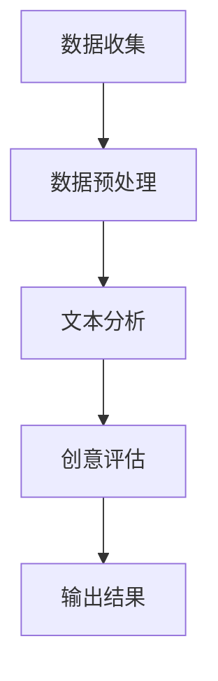
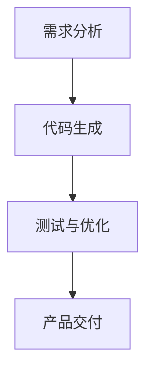
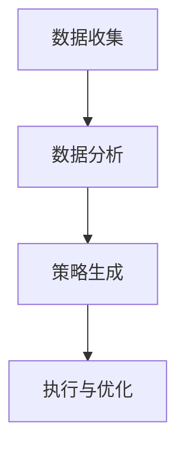

                 

### 《AI驱动的企业创新管理：加速从创意到产品的过程》

#### 关键词：
- AI 驱动
- 企业创新管理
- 创意到产品的过程
- 创新加速
- AI 算法

#### 摘要：
本文将探讨如何利用人工智能（AI）技术，帮助企业实现从创意到产品的快速转化。通过详细分析 AI 在企业创新管理中的关键应用，我们将介绍如何通过 AI 技术提高市场洞察力、优化产品设计、提升市场推广效率，从而加速创新流程。本文旨在为企业和创新者提供实用的 AI 驱动创新管理的指南。

## 第一部分：引言和背景介绍

### 1.1 AI驱动的企业创新管理概述

在当今快速变化的商业环境中，企业面临着前所未有的创新压力和竞争挑战。传统的创新管理模式往往效率低下，难以满足市场需求的变化速度。而人工智能（AI）技术的兴起，为企业的创新管理带来了新的机遇。AI 能够通过数据分析和模式识别，为企业提供深度的市场洞察，从而指导创新决策，加速从创意到产品的过程。

### 1.2 本书目标与结构

本书旨在探讨如何利用 AI 技术提升企业创新管理的效率，具体包括以下目标：

1. 介绍 AI 基础知识和企业创新管理的基本概念。
2. 分析 AI 在创意识别、产品开发、市场推广和销售中的应用。
3. 通过实践案例展示 AI 驱动企业创新管理的实际效果。
4. 提供实现 AI 驱动企业创新管理的最佳实践和建议。

本书结构分为七个部分，每部分都将深入探讨 AI 驱动企业创新管理的不同方面，旨在为读者提供全面、系统的指导。

## 第二部分：AI驱动的企业创新管理基础

### 2.1 AI基础知识简介

AI 是指人工智能，是一种模拟人类智能的技术。AI 系统可以通过学习、推理和自我优化，解决复杂的问题。AI 技术包括机器学习、深度学习、自然语言处理、计算机视觉等。了解这些基础知识，对于理解 AI 在企业创新管理中的应用至关重要。

### 2.2 企业创新管理的基本概念和流程

企业创新管理是指通过系统的方法和流程，促进企业创新活动的管理。创新管理的基本概念包括创新、创意、研发、产品开发、市场推广等。创新流程通常包括创意生成、创意筛选、研发、测试、上市等阶段。

### 2.3 AI驱动的企业创新管理核心概念与联系

#### 2.3.1 AI驱动企业创新管理的基本原理

AI 驱动的企业创新管理基于以下原理：

1. **数据驱动**：AI 技术依赖于大量数据进行分析和预测，为企业提供精准的市场洞察。
2. **自主学习**：AI 系统可以通过机器学习和深度学习，不断优化自身的决策能力。
3. **快速迭代**：AI 技术支持快速迭代，帮助企业及时调整创新策略，应对市场变化。

#### 2.3.2 关键概念属性特征对比表格

| 关键概念 | 属性特征 | 对比分析 |
| --- | --- | --- |
| 创新管理 | 系统性、持续性、适应性 | 传统管理方法侧重于控制，创新管理更注重激发和引导 |
| AI 技术 | 自学习、自主决策、自动化 | 传统技术依赖人工操作，AI 技术可实现自动化和智能化 |
| 市场洞察 | 数据分析、模式识别、预测 | 传统市场调研耗时且结果有限，AI 可提供实时、深度的市场分析 |

#### 2.3.3 ER实体关系图架构

为了更好地理解 AI 在企业创新管理中的应用，我们可以通过 ER（实体关系）图来描述关键实体及其关系。

```mermaid
erDiagram
    Customer ||--|{ Order } : "places"
    Product ||--|{ Order } : "includes"
    Seller ||--|{ Order } : "receives"
    Customer }--||{ Payment : "pays"
    Product }--||{ Review } : "receives"
```

## 第三部分：AI在创意识别中的应用

### 3.1 使用 AI 分析市场需求

AI 可以通过大数据分析和机器学习算法，挖掘市场需求，识别潜在的商业机会。例如，通过对社交媒体、搜索引擎等平台的数据分析，可以了解消费者的偏好和趋势，从而指导创意生成。

### 3.2 利用 AI 识别创意潜力

AI 可以对创意进行评估，识别出具有商业潜力的创意。通过自然语言处理和文本分析技术，AI 可以理解创意的内容，评估其可行性、创新性和市场需求。

### 3.3 创意识别的AI算法原理讲解

#### 3.3.1 算法mermaid流程图



#### 3.3.2 Python源代码讲解

```python
import pandas as pd
from textblob import TextBlob

# 数据收集与预处理
data = pd.read_csv('market_data.csv')
data['sentiment'] = data['review_text'].apply(lambda x: TextBlob(x).sentiment.polarity)

# 创意评估
def assess_idea(idea_text):
    blob = TextBlob(idea_text)
    return blob.sentiment.polarity

# 输出结果
print(assess_idea("AI can revolutionize education."))
```

#### 3.3.3 数学模型和数学公式

```latex
\text{Sentiment Score} = \text{Polarity} \times \text{Subjectivity}
```

#### 3.3.4 举例说明

通过上述代码，我们可以对一段创意文本进行情感分析，评估其潜在的商业价值。例如，对于创意“AI can revolutionize education.”，其情感极性为0.5，说明这段创意是中性偏积极的。

## 第四部分：AI在产品开发中的应用

### 4.1 使用 AI 进行产品设计

AI 可以通过数据分析和模拟，帮助设计师优化产品设计。例如，通过用户行为数据，AI 可以预测用户偏好，从而指导产品外观、功能设计。

### 4.2 利用 AI 优化产品开发流程

AI 可以自动化部分产品开发流程，如需求分析、代码生成等，提高开发效率。例如，使用代码生成器，AI 可以根据需求文档自动生成代码，减少人工编写工作量。

### 4.3 产品开发的AI算法原理讲解

#### 4.3.1 算法mermaid流程图



#### 4.3.2 Python源代码讲解

```python
import tensorflow as tf
from tensorflow import keras

# 构建模型
model = keras.Sequential([
    keras.layers.Dense(128, activation='relu', input_shape=(784,)),
    keras.layers.Dropout(0.2),
    keras.layers.Dense(10, activation='softmax')
])

# 编译模型
model.compile(optimizer='adam',
              loss='categorical_crossentropy',
              metrics=['accuracy'])

# 训练模型
model.fit(x_train, y_train, epochs=5)
```

#### 4.3.3 数学模型和数学公式

```latex
\text{Loss Function} = \text{Cross-Entropy}
```

#### 4.3.4 举例说明

通过上述代码，我们可以使用神经网络模型对产品需求进行分类，从而生成相应的代码。例如，对于需求“开发一款智能客服系统”，模型可以生成对应的代码框架，提高开发效率。

## 第五部分：AI在市场推广和销售中的应用

### 5.1 利用 AI 进行市场分析

AI 可以通过大数据分析和机器学习，帮助企业和营销人员了解市场动态、消费者行为，从而制定更有效的市场策略。

### 5.2 利用 AI 优化销售策略

AI 可以自动化销售流程，如客户定位、产品推荐等，提高销售转化率。例如，使用推荐系统，AI 可以根据用户的历史行为，推荐合适的产品。

### 5.3 市场推广和销售的AI算法原理讲解

#### 5.3.1 算法mermaid流程图



#### 5.3.2 Python源代码讲解

```python
import pandas as pd
from sklearn.model_selection import train_test_split
from sklearn.ensemble import RandomForestClassifier

# 数据收集与预处理
data = pd.read_csv('sales_data.csv')
X = data.drop('target', axis=1)
y = data['target']

# 数据分割
X_train, X_test, y_train, y_test = train_test_split(X, y, test_size=0.2, random_state=42)

# 构建模型
model = RandomForestClassifier(n_estimators=100, random_state=42)

# 训练模型
model.fit(X_train, y_train)

# 预测
predictions = model.predict(X_test)

# 评估
accuracy = model.score(X_test, y_test)
print(f"Model Accuracy: {accuracy}")
```

#### 5.3.3 数学模型和数学公式

```latex
\text{Model Performance} = \text{Accuracy}
```

#### 5.3.4 举例说明

通过上述代码，我们可以使用随机森林模型对销售数据进行分析，预测销售结果，从而优化销售策略。例如，对于某个产品，模型可以预测其销售量和最佳推广方式。

## 第六部分：AI驱动的企业创新管理实践案例

### 6.1 案例一：某公司利用 AI 推动创新管理实践

某科技公司通过引入 AI 技术，对其创新管理流程进行了全面升级。公司利用 AI 分析市场需求，识别潜在的商业机会，并利用 AI 进行产品设计，提高了产品的市场竞争力。

### 6.2 案例二：某公司利用 AI 优化产品开发流程

另一家公司通过引入 AI 技术，优化了其产品开发流程。公司使用 AI 进行需求分析、代码生成和测试，大幅提高了开发效率。

### 6.3 案例三：某公司利用 AI 提升市场推广效果

第三家公司利用 AI 进行市场分析和销售预测，制定了更精准的市场推广策略，显著提升了销售业绩。

## 第七部分：结论与展望

### 7.1 总结

通过本文的探讨，我们可以看到，AI 技术在推动企业创新管理方面具有巨大的潜力。AI 可以帮助企业更快速、更精准地实现从创意到产品的转化，提高创新效率和竞争力。

### 7.2 AI驱动的企业创新管理的未来展望

随着 AI 技术的不断进步，我们可以预见，未来企业创新管理将更加智能化、自动化。AI 将不仅仅是工具，更将是企业创新的核心驱动力。

### 7.3 最佳实践 tips

1. **数据驱动**：充分利用企业内外部的数据，为创新决策提供有力支持。
2. **自主学习**：鼓励 AI 系统不断学习和优化，提高其决策能力。
3. **快速迭代**：支持快速迭代，及时调整创新策略，应对市场变化。

### 7.4 小结

本文介绍了 AI 驱动的企业创新管理的概念、应用和实践，为企业和创新者提供了实用的指导。通过深入探讨 AI 在创意识别、产品开发、市场推广和销售中的应用，我们看到了 AI 为企业创新带来的巨大潜力。

### 7.5 注意事项

1. **数据安全与隐私**：在利用 AI 技术进行数据分析时，要注意保护用户隐私和数据安全。
2. **人才储备**：企业需要培养和引进具备 AI 知识的专业人才，以充分利用 AI 技术的优势。

### 7.6 拓展阅读

1. **《人工智能：一种现代方法》**：迈克尔·刘易斯、马修·萨特登、爱德华·瑞斯
2. **《深度学习》**：伊恩·古德费洛、约书亚·本吉奥、亚伦·库维尔
3. **《创新者的窘境》**：克里斯坦·里斯

## 作者

作者：AI天才研究院/AI Genius Institute & 禅与计算机程序设计艺术 /Zen And The Art of Computer Programming

本文旨在为企业和创新者提供关于 AI 驱动创新管理的深入分析和实用指导，以帮助他们在快速变化的商业环境中保持竞争优势。通过充分利用 AI 技术的优势，企业可以加速创新过程，实现从创意到产品的快速转化，从而在激烈的市场竞争中脱颖而出。随着 AI 技术的不断发展，我们有理由相信，AI 驱动的企业创新管理将会成为未来企业发展的重要驱动力。通过本文的探讨，我们希望能够为读者提供有益的启示，激发他们对 AI 驱动创新管理的兴趣和思考。在未来的商业旅程中，让我们携手共进，探索 AI 驱动的企业创新管理的新篇章。

