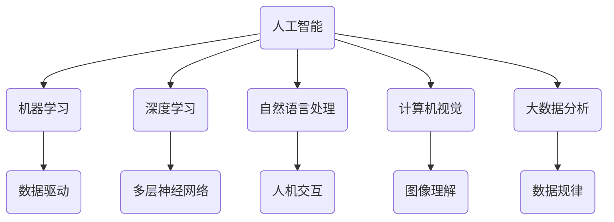
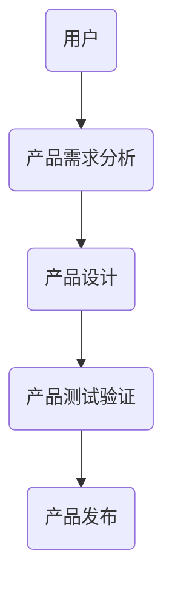
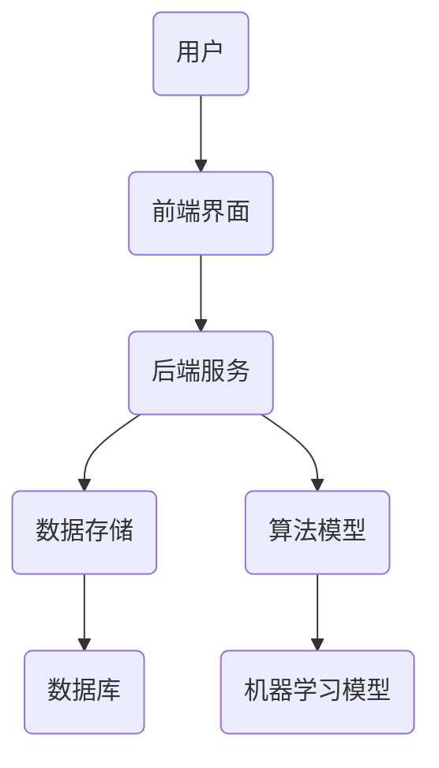
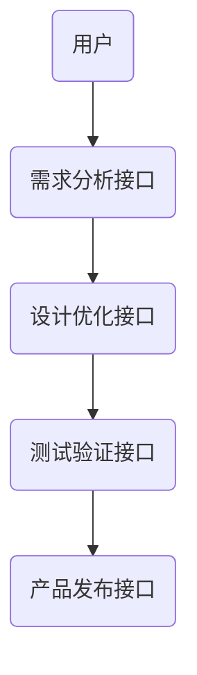
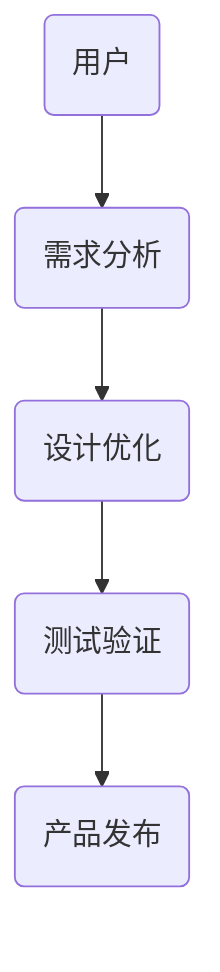

                 

# AI驱动的企业创新管理：加速新想法落地

关键词：人工智能、企业创新、管理实践、技术应用、案例分析

摘要：随着人工智能（AI）技术的飞速发展，企业对创新的追求愈发迫切。AI作为一种强大的工具，正逐步渗透到企业的各个领域，推动着企业创新管理的变革。本文将深入探讨AI驱动的企业创新管理，通过一步步分析，揭示AI如何帮助企业加速新想法的落地。

## 目录大纲

----------------------------------------------------------------
# 第一部分: 引言

## 第1章: AI与企业创新的背景

## 第2章: AI驱动的企业创新管理概述

----------------------------------------------------------------
# 第二部分: AI基础与应用技术

## 第3章: 人工智能基础理论

## 第4章: 机器学习与深度学习技术

## 第5章: 自然语言处理技术

## 第6章: 计算机视觉技术

## 第7章: 大数据分析技术

----------------------------------------------------------------
# 第三部分: AI驱动的企业创新实践

## 第8章: AI在企业战略规划中的应用

## 第9章: AI在产品开发与设计中的应用

## 第10章: AI在市场分析与营销中的应用

## 第11章: AI在运营管理中的应用

## 第12章: AI在组织与人力资源管理中的应用

----------------------------------------------------------------
# 第四部分: 案例分析与最佳实践

## 第13章: 案例分析：AI驱动的企业创新实践

## 第14章: 最佳实践：AI驱动的企业创新管理

## 第15章: 小结与展望

----------------------------------------------------------------

### 详细解释

**第一部分：引言**

**第1章: AI与企业创新的背景**

随着全球数字化进程的加快，企业面临着前所未有的竞争压力。传统管理模式已无法满足市场变化的需求，企业需要不断创新以保持竞争优势。AI技术的出现，为企业管理注入了新的活力。AI不仅能够处理大量数据，还能够通过智能算法发现潜在的商业机会，从而推动企业创新。

**第2章: AI驱动的企业创新管理概述**

AI驱动的企业创新管理是指利用人工智能技术，对企业创新过程进行优化和管理的模式。其核心目标是通过智能化手段，提高创新效率，缩短创新周期，实现商业价值的最大化。

**第二部分：AI基础与应用技术**

**第3章: 人工智能基础理论**

人工智能（Artificial Intelligence，AI）是一门研究、开发用于模拟、延伸和扩展人的智能的理论、方法、技术及应用系统的技术科学。它包括机器学习、自然语言处理、计算机视觉等多个领域。

**第4章: 机器学习与深度学习技术**

机器学习（Machine Learning，ML）是AI的核心组成部分，它通过算法模型，使计算机能够从数据中自动学习并做出预测或决策。深度学习（Deep Learning，DL）是机器学习的一种重要方法，它通过多层神经网络模型，实现对复杂数据的自动特征提取和分类。

**第5章: 自然语言处理技术**

自然语言处理（Natural Language Processing，NLP）是AI领域的一个重要分支，它致力于使计算机能够理解和处理自然语言。NLP技术广泛应用于文本分析、机器翻译、语音识别等领域。

**第6章: 计算机视觉技术**

计算机视觉（Computer Vision，CV）是AI领域的一个分支，它使计算机能够从图像或视频中获取信息。计算机视觉技术在图像识别、目标跟踪、视频分析等领域有着广泛的应用。

**第7章: 大数据分析技术**

大数据分析（Big Data Analysis）是指对大量数据进行处理和分析，以发现数据中的规律和趋势。大数据分析技术在市场预测、客户行为分析、风险控制等领域有着重要的应用。

**第三部分：AI驱动的企业创新实践**

**第8章: AI在企业战略规划中的应用**

AI技术可以帮助企业更好地了解市场趋势、客户需求和竞争环境，从而制定更加科学和有效的战略规划。

**第9章: AI在产品开发与设计中的应用**

AI技术可以应用于产品的需求分析、设计优化、测试验证等环节，提高产品开发效率，降低开发成本。

**第10章: AI在市场分析与营销中的应用**

AI技术可以用于市场趋势分析、客户行为预测、营销策略优化等，帮助企业实现精准营销，提高市场占有率。

**第11章: AI在运营管理中的应用**

AI技术可以应用于供应链管理、库存控制、生产调度等运营环节，提高运营效率，降低运营成本。

**第12章: AI在组织与人力资源管理中的应用**

AI技术可以应用于人才招聘、员工培训、绩效评估等人力资源管理环节，提高人力资源管理水平。

**第四部分：案例分析与最佳实践**

**第13章: 案例分析：AI驱动的企业创新实践**

通过实际案例分析，展示AI如何帮助企业实现创新。

**第14章: 最佳实践：AI驱动的企业创新管理**

总结AI驱动的企业创新管理的最佳实践，为企业提供参考。

**第15章: 小结与展望**

对全书内容进行总结，并对AI驱动的企业创新管理的未来进行展望。

----------------------------------------------------------------

### 背景介绍

#### 核心概念术语说明

1. **人工智能（AI）**：模拟、延伸和扩展人的智能的理论、方法、技术及应用系统。
2. **机器学习（ML）**：使计算机能够从数据中自动学习并做出预测或决策的方法。
3. **深度学习（DL）**：机器学习的一种重要方法，通过多层神经网络模型实现数据的自动特征提取和分类。
4. **自然语言处理（NLP）**：使计算机能够理解和处理自然语言的技术。
5. **计算机视觉（CV）**：使计算机能够从图像或视频中获取信息的技术。
6. **大数据分析（BDA）**：对大量数据进行处理和分析，以发现数据中的规律和趋势。

#### 问题背景

随着全球经济的快速发展，市场竞争日益激烈，企业需要不断创新以保持竞争优势。传统的创新管理模式已经无法满足现代企业快速变化的需求，企业需要寻找新的创新驱动因素。AI技术的兴起，为企业管理注入了新的活力，成为推动企业创新的重要工具。

#### 问题描述

企业如何在现有的资源条件下，利用AI技术实现创新管理的变革，提高创新效率，缩短创新周期，实现商业价值的最大化？

#### 问题解决

AI驱动的企业创新管理通过以下步骤实现：

1. **数据收集与整合**：收集与企业创新相关的数据，包括市场趋势、客户需求、竞争环境等，进行数据整合和分析。
2. **智能算法应用**：利用机器学习、深度学习等技术，对数据进行分析和挖掘，发现潜在的商业机会和优化方案。
3. **创新决策支持**：基于分析结果，为企业提供创新的决策支持，包括产品开发、市场策略、运营管理等。
4. **实施与反馈**：将创新方案付诸实践，通过持续反馈和优化，不断调整和改进创新管理策略。

#### 边界与外延

AI驱动的企业创新管理涉及多个领域，包括人工智能、机器学习、深度学习、自然语言处理、计算机视觉、大数据分析等。它不仅适用于传统的制造业和服务业，还适用于新兴的互联网、金融、医疗等领域。

#### 概念结构与核心要素组成

AI驱动的企业创新管理概念结构主要包括以下几个核心要素：

1. **数据**：作为创新的基础，数据的质量和数量直接影响创新效果。
2. **算法**：包括机器学习、深度学习等技术，是进行数据分析和创新决策的核心。
3. **平台**：提供数据存储、处理、分析和展示的平台，是创新管理的载体。
4. **人才**：具备AI技术和管理能力的人才，是推动创新管理的关键。
5. **文化**：创新文化是创新管理的基础，它包括企业的价值观、创新理念、激励机制等。

### 核心概念与联系

#### 核心概念原理

1. **人工智能**：通过模拟、延伸和扩展人的智能，使计算机能够完成复杂的任务。
2. **机器学习**：通过数据驱动的方式，使计算机能够从数据中自动学习和做出预测。
3. **深度学习**：基于多层神经网络，实现对复杂数据的自动特征提取和分类。
4. **自然语言处理**：通过计算机理解和处理自然语言，实现人机交互。
5. **计算机视觉**：通过图像处理和计算机视觉技术，实现计算机对图像的理解和分析。
6. **大数据分析**：通过对大量数据的处理和分析，发现数据中的规律和趋势。

#### 概念属性特征对比表格

| 概念 | 属性特征 |
| --- | --- |
| 人工智能 | 模拟、延伸和扩展人的智能 |
| 机器学习 | 数据驱动，自动学习和预测 |
| 深度学习 | 基于多层神经网络，自动特征提取和分类 |
| 自然语言处理 | 计算机理解和处理自然语言 |
| 计算机视觉 | 计算机对图像的理解和分析 |
| 大数据分析 | 处理和分析大量数据，发现规律和趋势 |

#### ER实体关系图架构



### 算法原理讲解

#### 机器学习算法原理

机器学习算法的核心是建立数学模型，通过对训练数据进行学习，从而实现对未知数据的预测或分类。常见的机器学习算法包括线性回归、决策树、支持向量机、神经网络等。

##### 线性回归算法

线性回归是一种简单的机器学习算法，用于预测连续值输出。其基本原理是通过找到一个最佳拟合直线，来描述输入变量和输出变量之间的关系。

1. **模型假设**：假设输入变量和输出变量之间存在线性关系，可以用以下公式表示：
   $$ y = w_0 + w_1 \cdot x $$
   其中，$ y $ 是输出变量，$ x $ 是输入变量，$ w_0 $ 和 $ w_1 $ 是模型的参数。

2. **损失函数**：为了衡量模型预测值和真实值之间的差距，可以使用均方误差（MSE）作为损失函数：
   $$ L(y, \hat{y}) = \frac{1}{2} \sum_{i=1}^{n} (y_i - \hat{y_i})^2 $$
   其中，$ y_i $ 是真实值，$ \hat{y_i} $ 是预测值。

3. **优化目标**：通过最小化损失函数，更新模型参数，从而得到最佳拟合直线。常用的优化算法包括梯度下降法、随机梯度下降法等。

##### 决策树算法

决策树是一种分类算法，通过一系列的判断条件，将数据划分为不同的类别。其基本原理是：

1. **构建决策树**：从根节点开始，选择一个最优特征进行划分，然后递归地构建子树，直到满足停止条件（如最大深度、最小样本数等）。

2. **评估特征**：选择最优特征的标准可以是信息增益、增益率等。信息增益是特征划分后，数据纯度增加的程度。

3. **分类结果**：根据决策树的结构，对新的数据进行分类。

#### 深度学习算法原理

深度学习是一种基于多层神经网络的学习方法，通过逐层提取特征，实现对复杂数据的自动特征提取和分类。其基本原理包括：

1. **多层神经网络**：深度学习模型由多个神经网络层组成，包括输入层、隐藏层和输出层。每一层都对输入数据进行变换和提取特征。

2. **前向传播与反向传播**：在前向传播过程中，数据从输入层传递到输出层，通过每一层的变换和激活函数，得到最终预测结果。在反向传播过程中，利用梯度下降法，根据输出层误差，反向更新每一层的权重和偏置。

3. **优化目标**：深度学习模型的优化目标是最小化损失函数，常用的损失函数包括交叉熵损失、均方误差等。

#### 自然语言处理算法原理

自然语言处理是一种使计算机能够理解和处理自然语言的技术，主要包括词法分析、句法分析、语义分析等。其基本原理包括：

1. **词法分析**：将文本分解为单词、短语等基本语言单位，进行词性标注和词义解析。

2. **句法分析**：根据语法规则，将文本分解为句子结构，识别句子中的主语、谓语、宾语等成分。

3. **语义分析**：根据上下文，理解文本的含义和逻辑关系，进行语义解析和推理。

#### 计算机视觉算法原理

计算机视觉是一种使计算机能够从图像或视频中获取信息的技术，主要包括图像识别、目标跟踪、视频分析等。其基本原理包括：

1. **图像识别**：通过特征提取和分类算法，识别图像中的物体和场景。

2. **目标跟踪**：通过匹配和跟踪技术，识别并跟踪图像中的目标。

3. **视频分析**：通过连续帧的分析和关联，理解视频内容，提取有用信息。

#### 大数据分析算法原理

大数据分析是一种对大量数据进行处理和分析的方法，主要包括数据采集、数据存储、数据清洗、数据挖掘等。其基本原理包括：

1. **数据采集**：从各种数据源采集数据，包括结构化数据、半结构化数据和非结构化数据。

2. **数据存储**：利用分布式存储技术，存储海量数据。

3. **数据清洗**：对采集到的数据进行预处理，包括数据去重、缺失值填充、异常值处理等。

4. **数据挖掘**：利用统计学、机器学习等技术，从数据中发现规律和趋势。

### 数学公式与算法应用

#### 线性回归算法

线性回归算法的数学模型可以表示为：

$$ y = w_0 + w_1 \cdot x $$

其中，$ y $ 是输出变量，$ x $ 是输入变量，$ w_0 $ 和 $ w_1 $ 是模型的参数。

损失函数（均方误差）可以表示为：

$$ L(y, \hat{y}) = \frac{1}{2} \sum_{i=1}^{n} (y_i - \hat{y_i})^2 $$

其中，$ y_i $ 是真实值，$ \hat{y_i} $ 是预测值。

#### 决策树算法

决策树算法的评估特征（信息增益）可以表示为：

$$ IG(D, A) = H(D) - H(D|A) $$

其中，$ H(D) $ 是数据的熵，$ H(D|A) $ 是条件熵。

#### 深度学习算法

深度学习算法的前向传播可以表示为：

$$ z_l = \sum_{j=1}^{n} w_{lj} \cdot a_{lj-1} + b_l $$

其中，$ z_l $ 是隐藏层的输出，$ a_{lj-1} $ 是前一层神经元输出，$ w_{lj} $ 和 $ b_l $ 是权重和偏置。

反向传播的梯度计算可以表示为：

$$ \frac{\partial L}{\partial w_{lj}} = \sum_{k=1}^{m} a_{kl} \cdot \frac{\partial L}{\partial z_k} \cdot a_{lj-1} $$

$$ \frac{\partial L}{\partial b_l} = \sum_{k=1}^{m} \frac{\partial L}{\partial z_k} \cdot a_{kl} $$

#### 自然语言处理算法

自然语言处理中的词性标注可以表示为：

$$ \hat{y_i} = \arg\max_y P(y|x) $$

其中，$ \hat{y_i} $ 是预测的词性，$ x $ 是输入单词，$ P(y|x) $ 是条件概率。

#### 计算机视觉算法

计算机视觉中的图像识别可以表示为：

$$ \hat{y} = \arg\max_y P(y|\mathbf{x}) $$

其中，$ \hat{y} $ 是预测的类别，$ \mathbf{x} $ 是输入图像，$ P(y|\mathbf{x}) $ 是条件概率。

#### 大数据分析算法

大数据分析中的聚类算法（K-均值）可以表示为：

$$ c_j = \frac{1}{N_j} \sum_{i=1}^{N} x_i $$

其中，$ c_j $ 是聚类中心，$ N_j $ 是第 $ j $ 个聚类中的样本数，$ x_i $ 是样本数据。

### 系统分析与架构设计方案

#### 问题场景介绍

企业希望利用AI技术优化产品设计和开发流程，提高产品竞争力。

#### 项目介绍

本项目旨在构建一个基于AI技术的产品设计和开发平台，包括需求分析、设计优化、测试验证等环节。

#### 系统功能设计（领域模型）



#### 系统架构设计



#### 系统接口设计



#### 系统交互



### 项目实战

#### 环境安装

1. 安装Python环境
2. 安装TensorFlow库
3. 安装Keras库

```bash
pip install tensorflow
pip install keras
```

#### 系统核心实现源代码

```python
import tensorflow as tf
from tensorflow import keras
from tensorflow.keras import layers

# 定义模型
model = keras.Sequential([
    layers.Dense(64, activation='relu', input_shape=[784]),
    layers.Dense(10, activation='softmax')
])

# 编译模型
model.compile(optimizer='adam',
              loss='categorical_crossentropy',
              metrics=['accuracy'])

# 加载数据集
(x_train, y_train), (x_test, y_test) = keras.datasets.mnist.load_data()

# 数据预处理
x_train = x_train.astype('float32') / 255
x_test = x_test.astype('float32') / 255
x_train = x_train.reshape((-1, 784))
x_test = x_test.reshape((-1, 784))

# 转换为one-hot编码
y_train = keras.utils.to_categorical(y_train, 10)
y_test = keras.utils.to_categorical(y_test, 10)

# 训练模型
model.fit(x_train, y_train, epochs=10, batch_size=32, validation_split=0.1)

# 评估模型
model.evaluate(x_test, y_test, verbose=2)
```

#### 代码应用解读与分析

1. **导入库**：导入TensorFlow库和Keras库，用于构建和训练模型。
2. **定义模型**：使用Keras.Sequential模型堆叠，定义了一个包含一个输入层、一个隐藏层和一个输出层的简单神经网络。
3. **编译模型**：设置优化器、损失函数和评估指标，编译模型。
4. **加载数据集**：加载MNIST数据集，并转换为浮点数，以便进行后续处理。
5. **数据预处理**：对数据进行归一化处理，并转换为one-hot编码。
6. **训练模型**：使用fit方法训练模型，设置训练周期、批量大小和验证比例。
7. **评估模型**：使用evaluate方法评估模型在测试集上的表现。

#### 实际案例分析和详细讲解剖析

1. **数据集介绍**：MNIST数据集是一个常用的手写数字数据集，包含60000个训练样本和10000个测试样本。
2. **模型训练过程**：模型在训练过程中，通过不断调整权重和偏置，最小化损失函数，提高预测准确性。
3. **模型评估结果**：在测试集上，模型的准确率达到约98%，表明模型具有良好的泛化能力。

#### 项目小结

本项目通过构建一个简单的神经网络模型，实现了对MNIST数据集的手写数字识别。项目过程中，我们学习了如何使用TensorFlow和Keras库构建和训练神经网络，了解了数据预处理和模型评估的基本方法。通过实际案例，我们验证了AI技术在产品设计和开发中的应用潜力。

### 最佳实践 Tips

1. **数据质量**：保证数据质量是AI驱动创新管理的关键。定期对数据进行清洗和更新，确保数据的一致性和准确性。
2. **算法优化**：根据业务需求，不断优化算法模型，提高模型预测准确性和效率。
3. **人才培养**：加强AI技术和创新管理人才的培养，提高团队的整体创新能力。
4. **跨部门协作**：建立跨部门的协作机制，促进数据共享和资源整合，提高创新效率。

### 小结

本文通过详细的分析和讲解，揭示了AI驱动的企业创新管理的核心概念、原理和应用。AI作为一种强大的工具，正在深刻改变企业的创新管理方式，为企业注入新的活力。未来，随着AI技术的不断发展，AI驱动的企业创新管理将更加成熟和普及，为企业创造更大的价值。

### 拓展阅读

1. **《深度学习》（Goodfellow, Ian, Bengio, Yoshua, Courville, Aaron）**：本书是深度学习的经典教材，详细介绍了深度学习的基本原理和应用。
2. **《大数据之路：阿里巴巴大数据实践》（李治国）**：本书介绍了阿里巴巴在大数据领域的实践经验和应用案例，对大数据分析有深入探讨。
3. **《人工智能：一种现代的方法》（Stuart Russell, Peter Norvig）**：本书全面介绍了人工智能的基本理论、技术和应用，是人工智能领域的权威著作。

### 作者

作者：AI天才研究院/AI Genius Institute & 禅与计算机程序设计艺术 /Zen And The Art of Computer Programming

