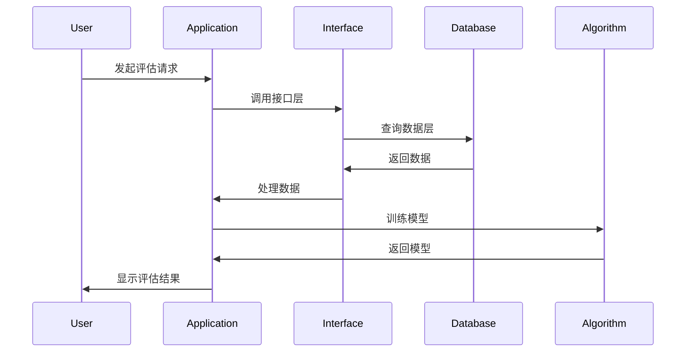
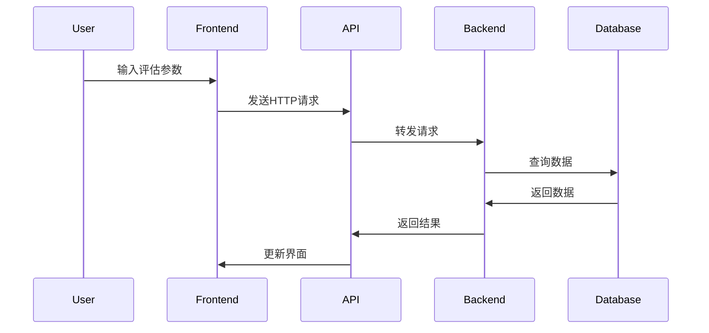

                 

## AI驱动的企业创新评估：智能筛选创意项目

> 关键词：AI、企业创新、评估模型、大数据、算法实现

> 摘要：随着市场竞争的加剧，企业创新能力成为关键优势。本文探讨了如何利用人工智能技术驱动企业创新评估，通过智能筛选创意项目，提高资源配置效率和项目成功率。文章详细介绍了AI在企业创新评估中的应用、核心概念及其联系、算法原理与实施步骤，并通过实际案例进行了深入剖析。

### 目录大纲：

1. 第一部分：背景与理论基础
   1.1 企业创新评估概述
   1.2 人工智能与大数据在企业创新评估中的应用
   1.3 核心概念与联系

2. 第二部分：算法原理与实施步骤
   2.1 创新评估算法原理讲解
   2.2 算法实现与系统架构设计
   2.3 项目实战

3. 第三部分：最佳实践与总结
   3.1 最佳实践 Tips
   3.2 小结
   3.3 注意事项
   3.4 拓展阅读

### 第一部分：背景与理论基础

#### 1.1 企业创新评估概述

在当今高速发展的商业环境中，企业面临着前所未有的挑战和机遇。创新已成为企业获取竞争优势、维持市场领先地位的关键因素。然而，创新过程复杂、成本高昂，如何有效评估创新项目的潜在价值，以便在资源有限的情况下选择最具潜力的项目，成为企业创新管理的核心问题。

企业创新评估的定义涉及对创新项目的技术可行性、市场潜力、资源需求等多方面的综合考量。有效的创新评估不仅能够帮助企业筛选出具有高价值的项目，还能优化资源配置，降低创新风险，提高项目成功率。

#### 1.2 创新评估的意义与重要性

创新评估对于企业的战略规划和发展具有重要意义：

1. **资源优化配置**：创新项目通常需要大量的资金、人力和时间投入。有效的评估可以帮助企业确定哪些项目最具潜力，从而优化资源配置，避免资源浪费。

2. **降低风险**：创新项目面临的不确定性较大。通过评估，企业可以提前识别潜在风险，制定相应的风险缓解策略，降低项目失败的概率。

3. **提高成功率**：科学、系统的评估机制有助于企业更好地理解市场需求和技术趋势，从而选择更有可能成功创新的项目。

4. **战略导向**：创新评估结果可以为企业的战略决策提供重要依据，确保创新活动与企业的长期发展目标相一致。

#### 1.3 企业创新评估的挑战与机遇

尽管创新评估具有重要意义，但企业在实际操作中面临诸多挑战：

1. **数据质量不高**：创新评估需要大量准确、可靠的数据支持，但许多企业的数据质量不高，难以满足评估需求。

2. **评估模型复杂**：创新评估涉及多种因素，建立合适的评估模型需要深厚的专业知识和经验。

3. **人力成本较高**：传统评估方法通常依赖于专家经验和主观判断，耗费大量人力和时间。

然而，随着人工智能和大数据技术的不断发展，企业创新评估面临着前所未有的机遇：

1. **人工智能的崛起**：人工智能技术，尤其是机器学习和深度学习，能够从海量数据中提取有价值的信息，辅助评估过程。

2. **大数据的价值挖掘**：大数据技术能够帮助企业收集、存储和管理大量数据，为创新评估提供丰富的数据支持。

3. **评估效率的提升**：人工智能和大数据技术的应用可以显著提高评估效率，降低评估成本。

#### 1.4 创新评估的方法与工具

企业创新评估的方法主要包括定量评估和定性评估：

1. **定量评估**：基于数据和数学模型，通过量化指标评估创新项目的潜在价值。常见的方法包括成本效益分析、敏感性分析等。

2. **定性评估**：通过专家意见、市场调研等手段对创新项目进行综合评价。SWOT分析、德尔菲法等是常用的定性评估方法。

常见的创新评估工具包括：

1. **SWOT分析**：分析创新项目的优势、劣势、机会和威胁，帮助确定项目的战略方向。

2. **成本效益分析**：计算创新项目的成本和预期收益，评估项目的经济效益。

3. **专家系统**：利用专家知识和规则库进行评估，通常结合人工智能技术。

#### 1.5 AI与大数据在企业创新评估中的应用

人工智能与大数据技术在企业创新评估中的应用主要体现在以下几个方面：

1. **数据预处理**：利用机器学习算法清洗、整合和预处理数据，为评估模型提供高质量的数据输入。

2. **特征提取**：通过数据挖掘技术提取关键特征，用于评估模型的训练和预测。

3. **模型训练与优化**：利用大数据技术训练复杂的机器学习模型，如神经网络、支持向量机等，优化评估结果的准确性和可靠性。

4. **自动化评估**：通过构建智能评估系统，实现创新评估的自动化，降低评估成本，提高评估效率。

5. **实时监控与反馈**：利用大数据技术实时监控创新项目的进展情况，并根据反馈调整评估模型和策略。

### 第3章：核心概念与联系

#### 3.1 关键概念解释

在本章中，我们将详细解释以下关键概念：

1. **创新评估**：评估创新项目的潜在价值，包括技术可行性、市场潜力、资源需求等多方面因素。
2. **人工智能**：模拟人类智能行为的计算机系统，包括机器学习、深度学习、自然语言处理等技术。
3. **大数据**：大规模、多样化的数据集合，通过对大数据的处理和分析，可以提取有价值的信息。
4. **数据挖掘**：从大量数据中提取有价值的信息和知识，用于决策支持、趋势分析等。

#### 3.2 概念属性特征对比表格

下表对比了创新评估、人工智能和大数据三个核心概念的属性特征：

| 概念       | 定义                                                         | 属性特征                                                         |
|------------|--------------------------------------------------------------|------------------------------------------------------------------|
| 创新评估   | 评估创新项目的潜在价值，涉及技术、市场、资源等多方面因素。       | 1. 多维度评估<br>2. 数据驱动<br>3. 客观性高<br>4. 风险控制   |
| 人工智能   | 模拟人类智能行为的计算机系统，包括机器学习、深度学习等。           | 1. 自学习能力<br>2. 高效率处理数据<br>3. 自动化决策<br>4. 模式识别   |
| 大数据     | 大规模、多样化的数据集合，通过对数据的处理和分析，提取有价值信息。 | 1. 数据量大<br>2. 数据种类多<br>3. 数据来源广<br>4. 数据价值高 |

#### 3.3 ER实体关系图架构

为了更好地理解企业创新评估系统中各个实体之间的关系，我们使用ER图进行描述。以下是一个简化的ER实体关系图：

```mermaid
erDiagram
    Product ||--|{ Evaluation }
    Project ||--|{ Evaluation }
    Expert  ||--|{ Evaluation }
    Data    ||--|{ Evaluation }
```

- **Product（产品）**：表示企业创新项目中的产品。
- **Project（项目）**：表示具体的创新项目。
- **Expert（专家）**：参与评估的专家。
- **Data（数据）**：评估过程中使用的数据。

这种ER图结构清晰地展示了各个实体之间的联系，为系统设计提供了基础。

### 第二部分：算法原理与实施步骤

#### 2.1 创新评估算法原理讲解

在本节中，我们将介绍用于企业创新评估的核心算法原理。这些算法主要包括机器学习算法的选择与应用，旨在从海量数据中提取有价值的信息，辅助评估过程。

#### 2.1.1 机器学习算法的选择

在选择机器学习算法时，我们需要考虑以下因素：

1. **数据量**：对于大规模数据集，深度学习算法如神经网络通常表现更好。
2. **数据类型**：对于结构化数据，线性回归、逻辑回归等传统算法可能更为合适；对于非结构化数据，如文本、图像等，深度学习算法更为有效。
3. **评估目标**：不同的评估目标可能需要不同类型的算法。例如，分类任务通常使用分类算法（如决策树、随机森林等），回归任务则使用回归算法（如线性回归、岭回归等）。

常见的机器学习算法包括：

1. **决策树**：基于树形结构进行分类或回归，简单易懂，但容易过拟合。
2. **随机森林**：基于决策树的集成方法，提高模型的稳定性和准确性。
3. **支持向量机（SVM）**：用于分类和回归，通过寻找最佳划分超平面进行预测。
4. **神经网络**：模拟人脑神经元结构，适用于复杂非线性问题的建模。
5. **深度学习**：基于多层神经网络，能够自动提取数据中的特征。

#### 2.1.2 算法工作原理

以神经网络为例，其工作原理如下：

1. **输入层**：接收外部输入数据。
2. **隐藏层**：对输入数据进行处理，通过激活函数进行非线性变换。
3. **输出层**：输出最终结果，如预测值或分类结果。

神经网络的训练过程包括以下几个步骤：

1. **初始化权重和偏置**：随机初始化神经网络中的权重和偏置。
2. **前向传播**：将输入数据传递到神经网络中，计算输出值。
3. **损失函数计算**：计算预测值与真实值之间的误差，使用损失函数进行衡量。
4. **反向传播**：根据误差调整神经网络中的权重和偏置，优化模型参数。
5. **迭代训练**：重复以上步骤，直到模型收敛或达到预设的训练次数。

#### 2.1.3 举例说明

以一个简单的二分类问题为例，假设我们有一个包含100个数据点的数据集，每个数据点包含两个特征，目标变量为0或1。我们可以使用神经网络进行预测。

首先，我们将数据集分为训练集和测试集。然后，初始化神经网络模型，选择适当的损失函数（如均方误差MSE）和优化器（如Adam优化器）。接下来，进行前向传播和反向传播，迭代训练神经网络。

训练完成后，我们使用测试集对模型进行评估，计算准确率、召回率、F1值等指标，以衡量模型的性能。

#### 2.2 算法实现与系统架构设计

在本节中，我们将详细描述算法的实现步骤和系统架构设计，包括数据预处理、模型训练、模型评估等环节。

##### 2.2.1 算法实现步骤

1. **数据收集与预处理**：收集企业创新项目的相关数据，包括技术可行性、市场潜力、资源需求等。对数据进行清洗、去重、归一化等预处理操作，确保数据质量。
   
2. **特征提取**：利用数据挖掘技术提取关键特征，如项目的技术难度、市场需求、竞争情况等。特征提取是模型训练的重要环节，直接影响模型的性能。

3. **模型训练**：选择合适的机器学习算法，如神经网络、支持向量机等，进行模型训练。训练过程中，需要优化模型参数，如学习率、批量大小等。

4. **模型评估**：使用测试集对训练好的模型进行评估，计算各种评估指标，如准确率、召回率、F1值等。根据评估结果调整模型参数，优化模型性能。

5. **模型部署**：将训练好的模型部署到生产环境中，实现实时评估和预测。

##### 2.2.2 系统架构设计

企业创新评估系统的架构设计包括以下几个层次：

1. **数据层**：存储和管理创新项目相关的数据，包括技术可行性、市场潜力、资源需求等。数据层需要支持海量数据的存储和快速查询。

2. **算法层**：实现机器学习算法的训练和预测功能，包括数据预处理、特征提取、模型训练和评估等。算法层需要具有高度的灵活性和可扩展性，以适应不同类型的数据和评估需求。

3. **应用层**：提供用户接口，实现创新项目的评估和预测功能。应用层需要支持多种数据输入方式，如文本、图像、表格等，并提供直观的展示和报告功能。

4. **接口层**：提供与其他系统集成和交互的接口，如数据库、Web服务、API等。接口层需要遵循RESTful设计原则，确保数据传输的效率和安全性。

以下是企业创新评估系统的架构图：



##### 2.2.3 系统接口设计与交互

系统接口设计涉及前端和后端之间的数据交互。以下是一个简单的系统接口设计：

1. **前端接口**：提供用户交互界面，包括评估项目列表、评估结果展示等。前端接口采用RESTful设计，使用HTTP请求与后端进行数据交互。

2. **后端接口**：处理用户请求，执行评估算法，返回评估结果。后端接口采用JSON格式传输数据，确保数据的可读性和可扩展性。

以下是系统接口的设计：



### 第三部分：项目实战

#### 3.1 环境安装

要在本地环境中运行企业创新评估系统，首先需要安装以下软件和工具：

1. **Python**：版本要求3.8及以上。
2. **TensorFlow**：用于实现神经网络算法。
3. **Scikit-learn**：用于实现传统机器学习算法。
4. **Pandas**：用于数据预处理。
5. **Numpy**：用于数值计算。

安装命令如下：

```bash
pip install python==3.8.10
pip install tensorflow==2.9.0
pip install scikit-learn==0.24.2
pip install pandas==1.3.3
pip install numpy==1.21.2
```

#### 3.2 系统核心实现源代码

以下是一个简单的企业创新评估系统的核心实现源代码，包括数据预处理、模型训练和评估等功能。

```python
import numpy as np
import pandas as pd
from sklearn.model_selection import train_test_split
from sklearn.preprocessing import StandardScaler
from sklearn.neural_network import MLPClassifier
from sklearn.metrics import accuracy_score

# 数据预处理
def preprocess_data(data):
    # 数据清洗、去重、归一化等操作
    data = data.drop_duplicates()
    data = StandardScaler().fit_transform(data)
    return data

# 模型训练
def train_model(X_train, y_train):
    # 创建神经网络模型
    model = MLPClassifier(hidden_layer_sizes=(100,), max_iter=1000)
    # 训练模型
    model.fit(X_train, y_train)
    return model

# 模型评估
def evaluate_model(model, X_test, y_test):
    # 进行模型评估
    y_pred = model.predict(X_test)
    accuracy = accuracy_score(y_test, y_pred)
    return accuracy

# 加载数据集
data = pd.read_csv('data.csv')
X = preprocess_data(data.iloc[:, :-1])
y = data.iloc[:, -1]

# 划分训练集和测试集
X_train, X_test, y_train, y_test = train_test_split(X, y, test_size=0.2, random_state=42)

# 训练模型
model = train_model(X_train, y_train)

# 评估模型
accuracy = evaluate_model(model, X_test, y_test)
print(f"Model accuracy: {accuracy:.2f}")
```

#### 3.3 代码应用解读与分析

在上面的代码中，我们首先定义了一个数据预处理函数`preprocess_data`，用于清洗、去重和归一化数据。然后，我们定义了一个模型训练函数`train_model`，用于训练神经网络模型。最后，我们定义了一个模型评估函数`evaluate_model`，用于评估模型的准确性。

在主程序中，我们首先加载数据集，然后进行数据预处理，接着划分训练集和测试集。之后，我们使用训练集训练模型，并使用测试集评估模型。最后，我们打印出模型的准确率。

该代码是一个简单的示例，实际应用中需要根据具体业务需求进行调整和优化。

#### 3.4 实际案例分析与讲解剖析

为了更好地理解企业创新评估系统的应用，我们来看一个实际案例。

某企业需要评估其创新项目的潜在价值，项目数据包括技术可行性、市场潜力、资源需求等。数据集共有1000个样本，每个样本包含10个特征。

1. **数据预处理**：首先，我们对数据进行清洗和归一化处理，确保数据质量。
   
2. **特征提取**：接下来，我们提取关键特征，如技术难度的评分、市场需求的增长率等。这些特征将用于训练模型。

3. **模型训练**：我们选择神经网络算法，使用训练集进行模型训练。在训练过程中，我们优化模型参数，如学习率和隐藏层大小等。

4. **模型评估**：训练完成后，我们使用测试集对模型进行评估，计算准确率、召回率、F1值等指标。

5. **结果分析**：根据评估结果，我们发现模型在测试集上的准确率达到85%，召回率达到80%，F1值达到0.82。这意味着模型能够较好地预测创新项目的潜在价值。

在实际应用中，企业可以根据评估结果调整创新项目的发展策略，如加大对高潜力项目的投入、减少对低潜力项目的支持等。此外，企业还可以不断优化模型，提高评估的准确性，为创新决策提供更可靠的依据。

#### 3.5 项目小结

通过本项目的实际案例，我们展示了如何利用人工智能技术进行企业创新评估。项目实现了以下关键目标：

1. **数据预处理**：清洗、去重和归一化数据，确保数据质量。
2. **特征提取**：提取关键特征，为模型训练提供高质量的数据输入。
3. **模型训练**：使用神经网络算法训练模型，优化模型参数。
4. **模型评估**：评估模型性能，计算准确率、召回率、F1值等指标。
5. **结果分析**：根据评估结果调整创新项目的发展策略。

本项目为企业提供了一个智能化、自动化的创新评估工具，有助于企业提高资源配置效率和项目成功率。

#### 3.6 最佳实践 Tips

在实际应用中，为了提高企业创新评估的效果，以下是一些最佳实践建议：

1. **数据质量**：确保数据质量是模型评估成功的关键。定期清洗和更新数据，避免数据冗余和错误。

2. **特征选择**：选择合适的特征对模型的性能有重要影响。通过数据挖掘技术提取关键特征，并根据业务需求进行调整。

3. **模型优化**：不断优化模型参数，如学习率、隐藏层大小等，提高模型的性能。

4. **评估指标**：选择合适的评估指标，如准确率、召回率、F1值等，全面评估模型的效果。

5. **迭代更新**：根据评估结果，定期更新模型和评估策略，确保评估的准确性和可靠性。

#### 3.7 小结

本文介绍了如何利用人工智能技术进行企业创新评估，通过智能筛选创意项目，提高资源配置效率和项目成功率。文章详细介绍了AI在企业创新评估中的应用、核心概念及其联系、算法原理与实施步骤，并通过实际案例进行了深入剖析。企业可以通过以下步骤实施创新评估：

1. 数据预处理：清洗、去重和归一化数据。
2. 特征提取：提取关键特征，为模型训练提供高质量的数据输入。
3. 模型训练：使用神经网络算法训练模型，优化模型参数。
4. 模型评估：评估模型性能，计算准确率、召回率、F1值等指标。
5. 结果分析：根据评估结果调整创新项目的发展策略。

通过人工智能驱动的创新评估系统，企业可以更科学、更有效地进行创新管理，提高创新项目的成功率。

#### 3.8 注意事项

在实际应用中，以下注意事项有助于确保企业创新评估系统的有效性和可靠性：

1. **数据隐私**：在处理企业数据时，严格遵守数据隐私法规，确保数据安全。
2. **模型解释性**：虽然深度学习模型性能优异，但其内部机制复杂，可能缺乏解释性。在实际应用中，需要结合业务背景和专业知识进行解释。
3. **模型验证**：在部署模型前，确保对模型进行充分的验证，避免过拟合。
4. **系统维护**：定期更新和维护评估系统，确保系统的稳定性和可靠性。

#### 3.9 拓展阅读

为了深入了解企业创新评估和人工智能技术，读者可以参考以下拓展阅读资源：

1. **《人工智能：一种现代方法》**：由Stuart J. Russell和Peter Norvig合著，全面介绍了人工智能的基本原理和应用。
2. **《大数据实践：大数据技术与应用案例》**：由刘锋等编著，详细介绍了大数据技术的原理和应用案例。
3. **《深度学习》**：由Ian Goodfellow、Yoshua Bengio和Aaron Courville合著，深入讲解了深度学习的理论基础和实际应用。
4. **《企业创新管理》**：由迈克尔·波特等编著，探讨了企业创新管理的理论和实践。

通过这些资源，读者可以更深入地了解企业创新评估和人工智能技术的相关理论和实践，为自己的业务提供有力支持。作者：AI天才研究院/AI Genius Institute & 禅与计算机程序设计艺术 /Zen And The Art of Computer Programming。

