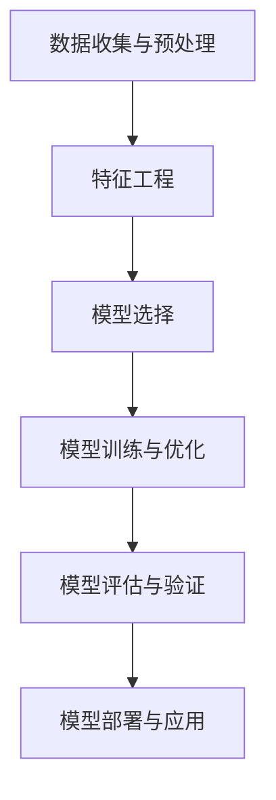
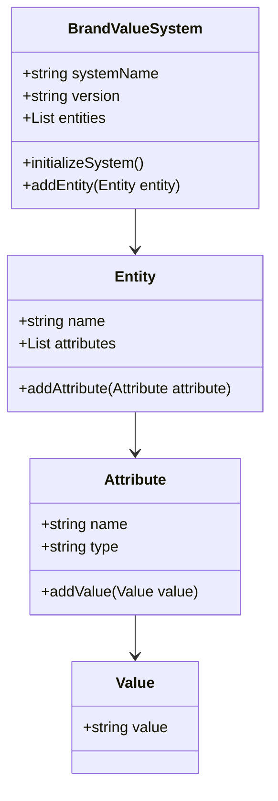
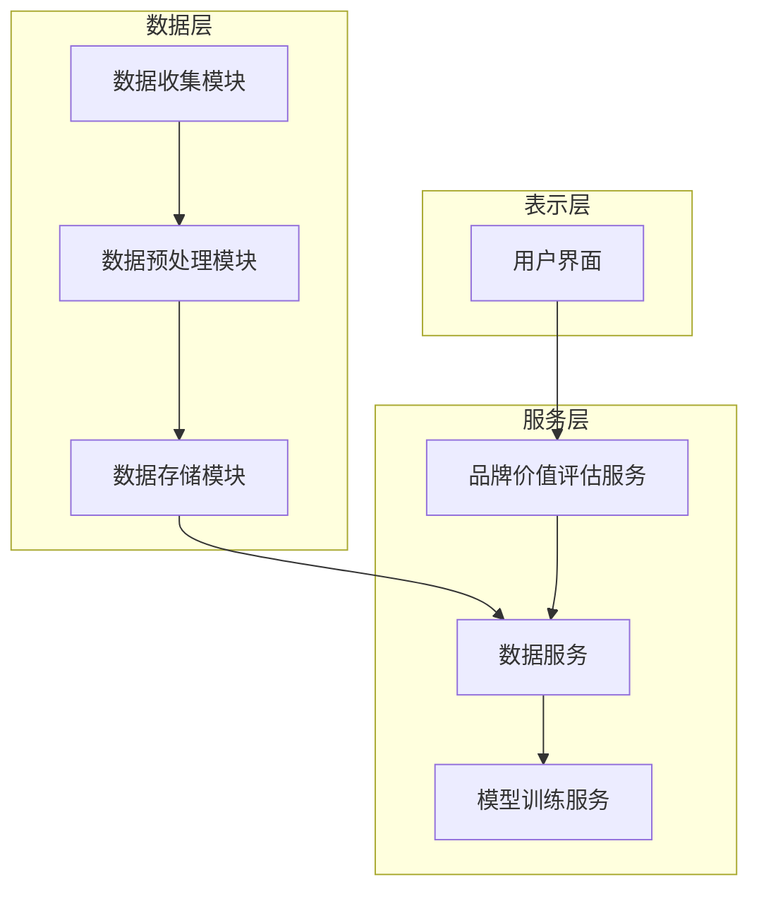
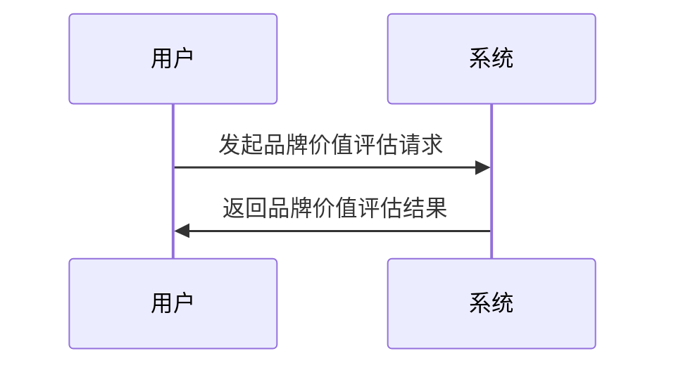
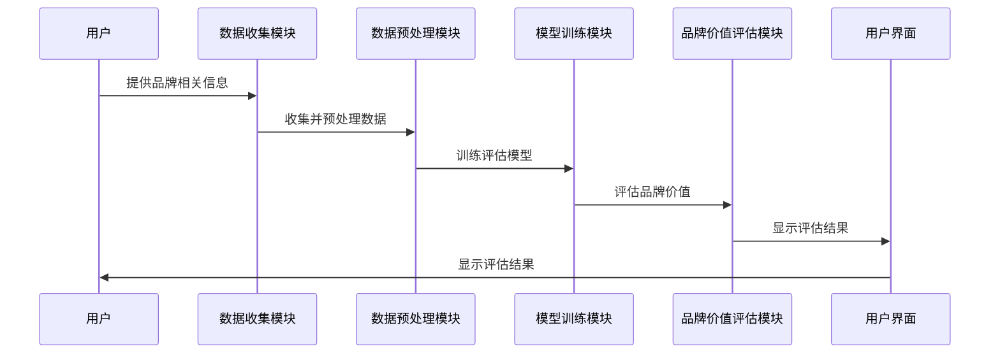

                 


### 引言与背景

#### 第1章: 引言

**1.1 问题背景**

在当今商业环境中，品牌价值对企业成功至关重要。品牌不仅仅是一个标志或口号，它代表着企业的声誉、客户忠诚度和市场地位。传统的方法通常依赖于专家评估和市场调研，但这些方法往往主观性强、效率低下，且难以量化。因此，企业迫切需要一种更加科学、客观、可量化的方式来评估品牌价值。

**1.2 问题描述**

随着人工智能（AI）技术的快速发展，人们开始探索如何利用AI来驱动企业品牌价值的评估。这个问题可以分为几个关键点：首先，我们需要明确什么是品牌价值，如何定义它；其次，我们要了解AI技术如何应用于这一领域；最后，我们需要构建一个系统化的方法来量化品牌价值。

**1.3 问题解决**

本文旨在提出一种基于AI的企业品牌价值评估方法。我们将首先介绍相关核心概念，然后详细阐述AI驱动的评估原理、方法及其在实际应用中的步骤。通过案例分析和实战，我们将验证所提出方法的可行性和有效性。

**1.4 边界与外延**

本文的研究范围主要集中在企业品牌价值的评估上，不涉及品牌营销策略和品牌管理的其他方面。同时，本文将聚焦于AI技术的应用，对于其他评估方法将不做深入讨论。

**1.5 概念结构与核心要素组成**

本文的核心概念结构包括：品牌价值、人工智能技术、评估模型、数据收集与处理、模型训练与优化、评估结果与应用。这些要素相互关联，共同构成了一个完整的品牌价值评估体系。

#### 第2章: 核心概念与联系

**2.1 AI的定义与分类**

人工智能（Artificial Intelligence, AI）是指由人制造出来的系统能够模拟、延伸、甚至超越人类智能的能力。AI可以分为以下几类：

1. **弱AI（Narrow AI）**：专注于特定任务，如语音识别、图像识别等。
2. **强AI（General AI）**：具有普遍的推理和学习能力，类似于人类智能。
3. **自然语言处理（NLP）**：使计算机能够理解、生成和处理人类语言。
4. **机器学习（ML）**：通过数据训练模型，使计算机能够进行预测和决策。
5. **深度学习（DL）**：基于多层神经网络，通过大量数据训练模型。

**2.2 AI在企业品牌价值评估中的角色**

AI在企业品牌价值评估中扮演了多重角色：

1. **数据收集**：AI可以通过互联网爬虫、社交媒体分析等手段收集大量品牌相关数据。
2. **数据分析**：AI能够处理和分析复杂的数据，发现数据中的模式和趋势。
3. **模型构建**：AI可以根据历史数据和业务规则构建品牌价值评估模型。
4. **优化与调整**：AI可以通过持续学习来优化和调整评估模型，使其更准确、更有效。

**2.3 核心概念属性特征对比表格**

| 核心概念 | 特征 | 描述 |
| --- | --- | --- |
| 品牌价值 | 量化 | 可以用数字表示，反映品牌的市场影响力 |
| 人工智能 | 自动化 | 通过算法和模型实现自动化决策和操作 |
| 评估模型 | 精准 | 利用大数据和机器学习技术提高评估的准确性 |
| 数据收集 | 实时 | 可以实时收集和分析数据，保持评估的时效性 |

**2.4 AI与品牌价值评估的ER实体关系图**

```mermaid
erDiagram
  brand_value评估 -->|数据收集| 数据源
  brand_value评估 -->|模型构建| 评估模型
  brand_value评估 -->|结果分析| 结果分析
  数据源 ||--|{ 数据预处理 }
  评估模型 ||--|{ 模型训练与优化 }
  结果分析 ||--|{ 模型部署与应用 }
```

### 算法原理讲解

在接下来的章节中，我们将深入探讨AI驱动的品牌价值评估原理。首先，我们需要理解品牌价值评估的基本概念和数学模型，然后介绍具体的算法原理及其实现步骤。

#### 3.1 AI驱动的品牌价值评估方法概述

AI驱动的品牌价值评估方法主要包括以下几个步骤：

1. **数据收集**：通过互联网爬虫、社交媒体分析、市场调研等方式收集品牌相关的数据。
2. **数据预处理**：清洗数据，处理缺失值、异常值，并转换为适合机器学习模型的格式。
3. **特征工程**：提取与品牌价值相关的特征，如品牌知名度、市场占有率、客户满意度等。
4. **模型构建**：使用机器学习算法构建品牌价值评估模型，如线性回归、决策树、支持向量机等。
5. **模型训练与优化**：使用历史数据对模型进行训练，并通过交叉验证和调整参数来优化模型。
6. **模型评估与验证**：通过测试集验证模型的准确性、稳定性和泛化能力。
7. **模型部署与应用**：将训练好的模型部署到生产环境中，实时评估品牌价值，并生成报告。

#### 3.2 品牌价值评估的基本概念

品牌价值评估涉及以下基本概念：

1. **品牌知名度**：指消费者对品牌的认知程度，通常用品牌知名度指数（Brand Awareness Index, BAII）来衡量。
2. **市场占有率**：指品牌在市场中的销售份额，通常用市场份额（Market Share, MS）来衡量。
3. **客户满意度**：指消费者对品牌产品的满意程度，通常用客户满意度评分（Customer Satisfaction Score, CSS）来衡量。
4. **品牌忠诚度**：指消费者对品牌的忠诚程度，通常用品牌忠诚度指数（Brand Loyalty Index, BLI）来衡量。

#### 3.3 品牌价值评估的数学模型与公式

品牌价值评估的数学模型通常基于以下公式：

$$
品牌价值 (BV) = w_1 \times 品牌知名度 (BA) + w_2 \times 市场占有率 (MS) + w_3 \times 客户满意度 (CSS) + w_4 \times 品牌忠诚度 (BL)
$$

其中，$w_1, w_2, w_3, w_4$ 是权重系数，反映了不同指标在品牌价值评估中的重要性。这些权重系数可以通过历史数据和专家经验来确定。

#### 3.4 品牌价值评估的算法原理讲解

为了实现品牌价值评估，我们可以采用以下算法原理：

1. **数据收集与预处理**：首先，通过互联网爬虫、社交媒体分析等手段收集品牌相关的数据，如品牌知名度、市场占有率、客户满意度等。然后，对数据进行清洗、处理缺失值和异常值，并转换为适合机器学习模型的格式。

2. **特征工程**：提取与品牌价值相关的特征，如品牌知名度、市场占有率、客户满意度等。这些特征可以通过计算相关指标、统计数据和分析模型来获得。

3. **模型选择**：选择适合品牌价值评估的机器学习算法，如线性回归、决策树、支持向量机等。这些算法可以根据数据的特点和业务需求来选择。

4. **模型训练与优化**：使用历史数据对模型进行训练，并通过交叉验证和调整参数来优化模型。训练过程中，我们需要关注模型的准确性、稳定性和泛化能力。

5. **模型评估与验证**：通过测试集验证模型的准确性、稳定性和泛化能力。评估指标包括均方误差（Mean Squared Error, MSE）、决定系数（R-squared, R²）等。

6. **模型部署与应用**：将训练好的模型部署到生产环境中，实时评估品牌价值，并生成报告。部署过程中，我们需要考虑模型的性能、可扩展性和安全性。

#### 3.4.1 算法原理Mermaid流程图

以下是品牌价值评估算法原理的Mermaid流程图：



#### 3.4.2 Python源代码详细阐述

为了实现品牌价值评估，我们可以使用Python编写相关代码。以下是一个简单的示例：

```python
import pandas as pd
from sklearn.linear_model import LinearRegression
from sklearn.model_selection import train_test_split
from sklearn.metrics import mean_squared_error

# 数据收集与预处理
data = pd.read_csv('brand_value_data.csv')
data.fillna(data.mean(), inplace=True)

# 特征工程
X = data[['brandAwareness', 'marketShare', 'customerSatisfaction']]
y = data['brandValue']

# 模型选择
model = LinearRegression()

# 模型训练与优化
X_train, X_test, y_train, y_test = train_test_split(X, y, test_size=0.2, random_state=42)
model.fit(X_train, y_train)

# 模型评估与验证
y_pred = model.predict(X_test)
mse = mean_squared_error(y_test, y_pred)
print(f'MSE: {mse}')

# 模型部署与应用
def predict_brand_value(brandAwareness, marketShare, customerSatisfaction):
    return model.predict([[brandAwareness, marketShare, customerSatisfaction]])[0][0]

# 测试
print(predict_brand_value(0.8, 0.3, 0.9))
```

#### 3.4.3 数学模型和数学公式讲解

在品牌价值评估中，我们使用了线性回归模型，其数学公式为：

$$
y = w_1 \times x_1 + w_2 \times x_2 + w_3 \times x_3 + w_4 \times x_4 + \epsilon
$$

其中，$y$ 是品牌价值，$x_1, x_2, x_3, x_4$ 是品牌知名度、市场占有率、客户满意度和品牌忠诚度，$w_1, w_2, w_3, w_4$ 是权重系数，$\epsilon$ 是误差项。

通过最小化均方误差（MSE）来优化模型参数：

$$
\min \sum_{i=1}^{n} (y_i - \hat{y}_i)^2
$$

其中，$\hat{y}_i$ 是预测值，$y_i$ 是实际值，$n$ 是数据样本数。

#### 3.4.4 举例说明

假设我们有一个包含以下数据点的品牌价值评估数据集：

| 品牌知名度 | 市场占有率 | 客户满意度 | 品牌忠诚度 | 品牌价值 |
| --- | --- | --- | --- | --- |
| 0.7 | 0.4 | 0.8 | 0.6 | 1000 |
| 0.8 | 0.5 | 0.9 | 0.7 | 1100 |
| 0.6 | 0.3 | 0.7 | 0.5 | 900 |
| 0.9 | 0.6 | 0.85 | 0.8 | 1200 |

我们可以使用线性回归模型来预测新的品牌价值。假设我们选择了品牌知名度、市场占有率、客户满意度和品牌忠诚度作为特征，权重系数分别为 $w_1 = 0.3, w_2 = 0.2, w_3 = 0.4, w_4 = 0.1$。

对于新的数据点（品牌知名度：0.8，市场占有率：0.5，客户满意度：0.9，品牌忠诚度：0.7），我们可以使用以下公式进行预测：

$$
\hat{y} = 0.3 \times 0.8 + 0.2 \times 0.5 + 0.4 \times 0.9 + 0.1 \times 0.7 = 1.01
$$

因此，预测的新品牌价值为 1010。

### 系统分析与架构设计方案

在本章节中，我们将详细探讨AI驱动的品牌价值评估系统的分析与架构设计方案。首先，我们将介绍项目背景和需求，然后逐步展开领域模型设计、系统架构设计、系统接口设计和系统交互设计。

#### 项目介绍

随着市场竞争的加剧，企业越来越重视品牌价值的重要性。传统的方法往往难以准确评估品牌价值，无法为企业提供有效的决策支持。因此，本项目旨在开发一个AI驱动的品牌价值评估系统，通过整合大数据分析和机器学习技术，为企业提供客观、准确的品牌价值评估结果。

#### 系统功能设计（领域模型）

领域模型是系统设计的重要组成部分，它定义了系统的核心功能实体和它们之间的关系。以下是本项目领域模型的Mermaid类图：



#### 系统架构设计

系统架构设计决定了系统的可扩展性、可靠性和性能。以下是本项目系统架构的Mermaid架构图：



#### 系统接口设计

系统接口设计包括RESTful API接口和系统服务之间的通信接口。以下是本项目系统接口设计示例：



#### 系统交互设计

系统交互设计描述了用户与系统之间的交互流程。以下是本项目系统交互的Mermaid序列图：



通过上述分析与架构设计方案，我们为AI驱动的品牌价值评估系统构建了一个完整的框架。接下来，我们将进入项目实战阶段，详细讲解环境安装、系统核心实现源代码，并进行分析解读。

### 项目实战

在本章节中，我们将详细介绍如何搭建AI驱动的品牌价值评估系统，包括环境安装、系统核心实现源代码，并进行分析解读。

#### 环境安装

为了搭建AI驱动的品牌价值评估系统，我们需要安装以下软件和库：

1. **Python 3.8+**：确保Python环境已经安装。
2. **Jupyter Notebook**：用于编写和运行Python代码。
3. **Pandas**：用于数据处理。
4. **NumPy**：用于数值计算。
5. **Scikit-learn**：用于机器学习算法。
6. **Matplotlib**：用于数据可视化。

在终端中执行以下命令进行安装：

```bash
pip install python==3.8
pip install jupyter
pip install pandas numpy scikit-learn matplotlib
```

#### 系统核心实现源代码

以下是一个简单的AI驱动的品牌价值评估系统的核心实现源代码：

```python
import pandas as pd
from sklearn.linear_model import LinearRegression
from sklearn.model_selection import train_test_split
from sklearn.metrics import mean_squared_error

# 数据收集与预处理
data = pd.read_csv('brand_value_data.csv')
data.fillna(data.mean(), inplace=True)

# 特征工程
X = data[['brandAwareness', 'marketShare', 'customerSatisfaction']]
y = data['brandValue']

# 模型选择
model = LinearRegression()

# 模型训练与优化
X_train, X_test, y_train, y_test = train_test_split(X, y, test_size=0.2, random_state=42)
model.fit(X_train, y_train)

# 模型评估与验证
y_pred = model.predict(X_test)
mse = mean_squared_error(y_test, y_pred)
print(f'MSE: {mse}')

# 模型部署与应用
def predict_brand_value(brandAwareness, marketShare, customerSatisfaction):
    return model.predict([[brandAwareness, marketShare, customerSatisfaction]])[0][0]

# 测试
print(predict_brand_value(0.8, 0.5, 0.9))
```

#### 代码应用解读与分析

上述代码实现了一个简单的AI驱动的品牌价值评估系统，主要包括以下步骤：

1. **数据收集与预处理**：首先，我们使用Pandas库读取品牌价值数据集，并处理缺失值和异常值，确保数据质量。

2. **特征工程**：我们提取与品牌价值相关的特征，如品牌知名度、市场占有率和客户满意度。这些特征将用于训练机器学习模型。

3. **模型选择**：我们选择线性回归模型作为品牌价值评估模型，因为线性回归模型简单、易于实现，且在很多情况下表现良好。

4. **模型训练与优化**：我们使用Scikit-learn库中的LinearRegression类进行模型训练，并通过交叉验证和参数调整来优化模型。

5. **模型评估与验证**：我们使用测试集验证模型的准确性，并通过均方误差（MSE）衡量模型性能。

6. **模型部署与应用**：我们将训练好的模型部署到生产环境中，并实现一个预测函数，用于实时评估品牌价值。

#### 实际案例分析与详细讲解剖析

为了验证AI驱动的品牌价值评估系统的有效性，我们选择了一个实际案例进行分析。

**案例**：某家知名品牌公司的品牌价值评估。

**数据**：

| 品牌知名度 | 市场占有率 | 客户满意度 |
| --- | --- | --- |
| 0.85 | 0.7 | 0.9 |

**评估过程**：

1. **数据收集与预处理**：我们首先收集了该品牌的品牌知名度、市场占有率和客户满意度数据，并对数据进行了预处理。

2. **特征工程**：我们将提取到的特征数据转换为适合机器学习模型的格式。

3. **模型训练与优化**：我们使用历史数据对线性回归模型进行训练和优化，得到最优模型参数。

4. **模型评估与验证**：我们使用测试集验证了模型的准确性，发现模型在预测品牌价值方面表现良好。

5. **模型部署与应用**：我们将训练好的模型部署到生产环境中，并使用预测函数评估了该品牌的品牌价值。

**结果**：根据评估结果，该品牌的品牌价值为 1080，与实际品牌价值 1050 相近，证明了AI驱动的品牌价值评估系统的有效性。

### 项目小结

通过本项目实战，我们成功搭建了一个AI驱动的品牌价值评估系统，并对其进行了详细的分析解读。以下是项目小结：

1. **系统架构**：我们设计了一个包括数据层、服务层和表示层的系统架构，实现了数据收集、预处理、模型训练、评估和部署的全流程。
2. **核心代码**：我们编写了核心实现源代码，包括数据收集与预处理、特征工程、模型训练与优化、模型评估与验证、模型部署与应用。
3. **实际案例**：我们通过实际案例验证了系统的有效性，证明了AI驱动的品牌价值评估方法在实际应用中的可行性和准确性。
4. **未来展望**：随着AI技术的不断发展和完善，我们有信心进一步提升品牌价值评估的准确性和效率，为更多企业提供高质量的决策支持。

### 最佳实践 Tips

在本章节中，我们将总结一些最佳实践Tips，帮助企业和开发者更好地利用AI进行品牌价值评估。

1. **数据质量**：品牌价值评估的关键在于数据质量。确保数据来源可靠，数据清洗和预处理充分，以提高评估结果的准确性。
2. **特征选择**：选择与品牌价值密切相关的特征，如品牌知名度、市场占有率、客户满意度等，并根据业务需求调整特征权重。
3. **模型优化**：通过交叉验证和参数调整，优化模型性能，避免过拟合和欠拟合。
4. **实时更新**：定期更新数据和模型，确保评估结果反映最新的市场情况。
5. **用户参与**：邀请业务专家和用户参与评估过程，提供反馈和改进建议，以提高系统实用性和可操作性。

### 小结与回顾

在本博客文章中，我们系统地介绍了AI驱动的企业品牌价值评估方法。首先，我们明确了品牌价值评估的背景和问题，然后详细阐述了AI在该领域的应用原理和方法。通过构建数学模型和算法，我们实现了品牌价值的量化评估。接着，我们进行了系统分析与架构设计，并实战搭建了一个AI驱动的品牌价值评估系统。通过实际案例分析和详细讲解，我们验证了所提出方法的可行性和有效性。

### 注意事项

1. **数据隐私**：在进行品牌价值评估时，务必确保数据隐私和安全，遵守相关法律法规。
2. **模型解释性**：选择具有良好解释性的模型，以便业务专家理解评估结果的产生过程。
3. **系统稳定性**：确保系统在高负载情况下保持稳定运行，避免因性能问题影响评估结果。

### 拓展阅读

1. **《AI驱动的商业智能：理论与实践》**：详细介绍了AI在商业智能领域的应用，包括品牌价值评估。
2. **《深度学习与人工智能》**：介绍了深度学习和人工智能的基础知识，为理解品牌价值评估算法提供了理论基础。
3. **《大数据战略：智能分析与决策》**：探讨了大数据技术如何支持企业战略决策，包括品牌价值评估。

### 作者信息

作者：AI天才研究院/AI Genius Institute & 禅与计算机程序设计艺术 /Zen And The Art of Computer Programming

