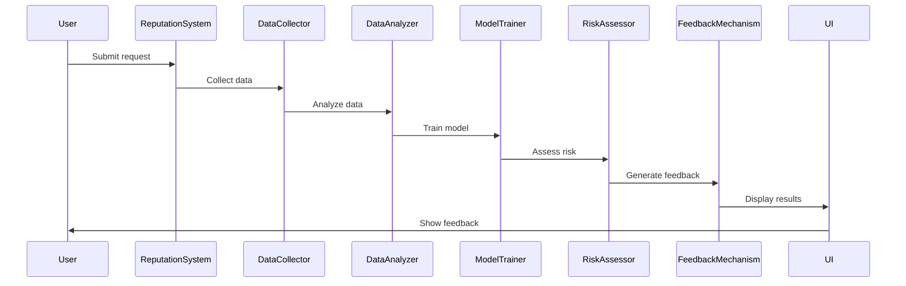
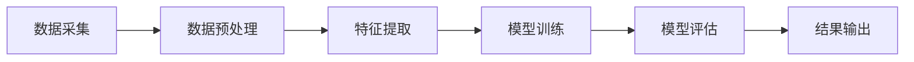
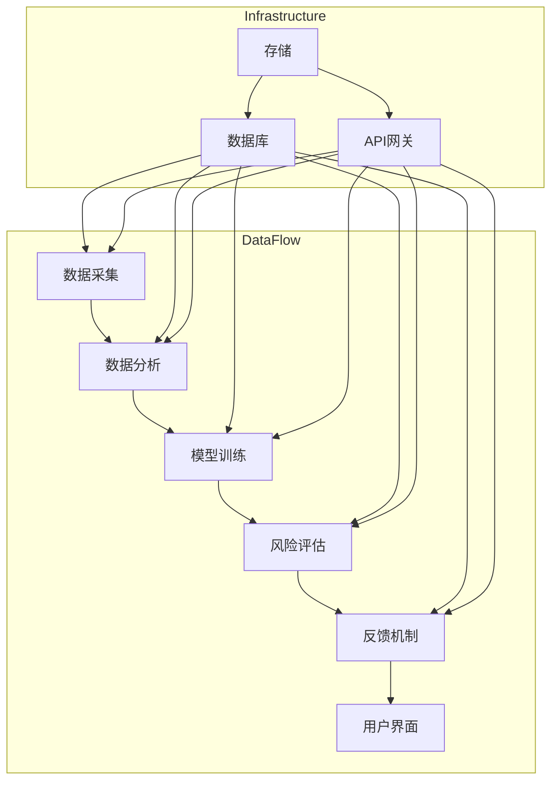
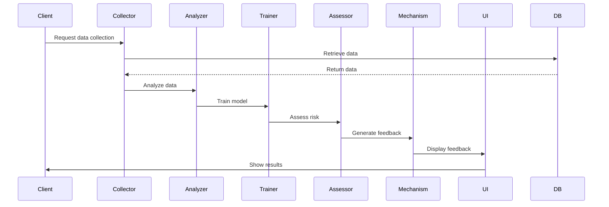
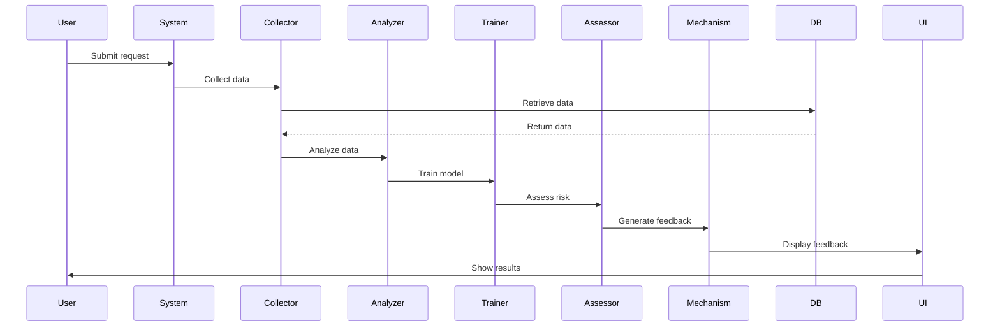

                 

### 第一部分：AI驱动的企业声誉管理背景

#### 第1章：问题背景与核心概念

##### 1.1 问题背景

在现代商业环境中，企业的声誉管理已经成为企业战略的核心组成部分。随着信息技术的飞速发展，企业声誉的塑造和维护变得更加复杂和紧迫。过去，企业主要依赖于传统媒体和公关手段来管理和维护声誉。然而，随着社交媒体的普及和互联网的快速发展，公众舆论对企业的影响范围和速度大大增加，单一的传统方式已经无法满足企业对声誉管理的需求。

##### 1.1.1 企业声誉管理的重要性

企业声誉不仅仅关乎企业形象，更是企业竞争力的体现。良好的声誉可以为企业带来客户信任、投资者信心和商业机会，而声誉受损可能导致客户流失、股价下跌和业务停滞。因此，企业需要采取有效的声誉管理策略，以应对瞬息万变的商业环境。

##### 1.1.2 人工智能在声誉管理中的应用

人工智能（AI）技术的快速发展为企业管理者提供了前所未有的工具和方法，以实时监控和优化企业的声誉。AI驱动的声誉管理不仅能够提高工作效率，还能为企业提供更深入的市场洞察，从而更好地应对声誉风险。

##### 1.2 问题描述

##### 1.2.1 声誉管理的挑战

企业面临的声誉管理挑战包括舆论监控、危机处理、客户反馈分析等方面。这些挑战需要高效的数据处理能力和智能分析工具。

- 舆论监控：随着社交媒体的兴起，公众对企业言论的关注度日益增加。企业需要实时监测网络上的舆论动态，及时了解公众对企业的看法和态度。
- 危机处理：企业可能会面临各种突发事件，如产品缺陷、财务危机、管理层变动等，这些事件可能迅速演变成公关危机。企业需要快速响应，采取有效措施来缓解负面影响。
- 客户反馈分析：客户的反馈是企业改进产品和服务的宝贵资源。企业需要收集和分析客户反馈，以便更好地满足客户需求，提升客户满意度。

##### 1.2.2 AI在声誉管理中的潜在问题

虽然AI技术在声誉管理中具有巨大潜力，但同时也存在一些潜在问题，这些都需要企业在应用AI时进行深入考虑和妥善处理。

- 数据隐私：AI驱动的声誉管理系统需要收集大量的数据，包括客户信息、社交媒体内容等。如何保护这些数据不被泄露或滥用，是企业在应用AI时必须考虑的问题。
- 算法偏见：AI算法在处理数据时可能会受到数据偏见的影响，导致分析结果不准确。企业在设计AI算法时需要确保算法的公平性和准确性。
- 技术依赖：过度依赖AI技术可能导致企业在声誉管理过程中失去灵活性。企业需要在利用AI技术的同时，保持对人力的依赖，确保声誉管理的全面性和有效性。

##### 1.3 问题解决

##### 1.3.1 AI驱动的解决方案

通过构建AI驱动的声誉管理系统，企业可以实现实时数据采集、分析和反馈，从而更有效地管理企业声誉。以下是AI驱动的声誉管理系统的核心功能和优势：

- 实时数据采集：AI技术可以自动收集社交媒体、新闻报道、客户反馈等海量数据，快速识别和提取关键信息。
- 数据分析：利用自然语言处理（NLP）和机器学习（ML）技术，AI可以对采集到的数据进行分析，识别公众舆论的倾向和趋势。
- 舆论预测：通过分析历史数据，AI可以预测未来舆论走向，帮助企业提前做好准备，应对潜在危机。
- 智能反馈：AI可以自动生成反馈报告，提供针对不同问题的解决方案和建议，帮助企业及时采取措施，提升声誉。

##### 1.3.2 技术与工具的选择

企业需要根据自身需求选择合适的AI技术和工具，如自然语言处理（NLP）、机器学习（ML）和大数据分析等。以下是一些常见的技术和工具：

- 自然语言处理（NLP）：NLP技术可以帮助企业理解和处理自然语言数据，包括文本分类、情感分析、实体识别等。
- 机器学习（ML）：ML技术可以帮助企业从数据中学习规律，构建预测模型和分类模型，用于舆论分析和危机预测。
- 大数据分析：大数据分析技术可以帮助企业处理和分析海量数据，提取有价值的信息，为声誉管理提供数据支持。
- 数据可视化工具：数据可视化工具可以帮助企业直观地了解声誉管理的各项指标，及时发现潜在问题。

##### 1.4 边界与外延

##### 1.4.1 声誉管理的范畴

声誉管理不仅涉及企业内部的管理，还包括对公众舆论的监测、分析和响应。具体来说，声誉管理包括以下几个方面：

- 舆论监测：通过监测社交媒体、新闻报道等渠道，了解公众对企业的看法和态度。
- 声誉评估：通过分析舆论数据和客户反馈，评估企业的声誉状况，识别声誉风险。
- 危机管理：在危机事件发生时，快速响应，采取有效措施，减轻危机对企业声誉的影响。
- 声誉修复：在声誉受损时，通过积极措施，恢复企业声誉，重建公众信任。

##### 1.4.2 AI应用的范围

AI技术在声誉管理中的应用范围广泛，包括社交媒体监测、客户反馈分析、舆论预测和危机管理等多个方面。以下是一些具体的AI应用场景：

- 社交媒体监测：通过AI技术，实时监测社交媒体上的企业相关言论，识别负面舆论和潜在危机。
- 客户反馈分析：利用NLP技术，分析客户反馈，识别客户需求和问题，为企业改进产品和服务提供参考。
- 舆论预测：通过分析历史数据和当前舆论趋势，预测未来舆论走向，为企业制定声誉管理策略提供依据。
- 危机管理：在危机事件发生时，利用AI技术，快速分析事件发展趋势，制定应对策略，减轻危机对企业的影响。

##### 1.5 概念结构与核心要素组成

##### 1.5.1 AI驱动的声誉管理核心概念

- 数据采集：收集来自社交媒体、新闻报道、客户反馈等多渠道的数据。
- 数据分析：利用NLP、ML等技术，对采集到的数据进行分析，提取有价值的信息。
- 模型训练：基于分析结果，训练预测模型和分类模型，用于舆论预测和危机管理。
- 实时监测：实时监测公众舆论和企业声誉，及时识别潜在风险。
- 反馈机制：根据监测结果，自动生成反馈报告，为企业提供决策支持。
- 风险评估：评估企业声誉风险，制定相应的管理策略。

##### 1.5.2 核心要素组成

- 技术平台：搭建AI驱动的声誉管理系统所需的技术平台，包括服务器、存储设备、网络设施等。
- 数据源：企业声誉管理的核心数据来源，包括社交媒体、新闻报道、客户反馈等。
- 算法模型：用于数据分析、模型训练和舆论预测的算法模型，如NLP模型、ML模型等。
- 用户界面：用户操作和管理声誉管理系统的界面，提供实时监测、数据分析、报告生成等功能。
- 安全机制：确保数据安全和隐私保护的机制，包括数据加密、访问控制、隐私保护等。
- 客户支持：提供技术支持和咨询服务，帮助企业解决声誉管理中的问题和挑战。

##### 1.6 本章小结

本章介绍了AI驱动的企业声誉管理的背景、核心概念、问题和解决方案，以及其边界与外延，为后续章节的深入探讨奠定了基础。通过本章的学习，读者可以了解企业声誉管理的重要性和挑战，以及AI技术在声誉管理中的应用和潜在问题。接下来，我们将进一步探讨AI驱动的声誉管理核心概念及其联系，为企业构建有效的声誉管理策略提供更多指导。

----------------------------------------------------------------

### 第二部分：AI驱动的企业声誉管理核心概念与联系

#### 第2章：AI驱动的声誉管理核心概念原理

##### 2.1 数据采集

数据采集是AI驱动的企业声誉管理系统的第一步，也是最为关键的一步。准确、全面的数据采集是后续数据分析和模型训练的基础。

###### 2.1.1 数据来源

企业声誉管理的数据来源广泛，主要包括以下几个方面：

1. **社交媒体**：如微博、微信、Facebook、Twitter等社交平台上的用户评论、转发和互动，这些都是反映公众对企业看法的重要数据源。
2. **新闻报道**：通过各大新闻网站、报纸、杂志等渠道获取的关于企业的新闻报道，特别是涉及负面报道的，对企业的声誉影响巨大。
3. **客户反馈**：通过在线调查、客户服务热线、邮件等方式收集的客户反馈，这些数据直接反映了客户对企业产品或服务的满意度。
4. **行业报告**：从专业机构发布的行业报告、市场研究报告中获取的数据，这些报告提供了对企业竞争对手、市场趋势的深入分析。
5. **企业内部数据**：企业内部的销售数据、客户关系管理系统（CRM）数据、财务数据等，这些数据有助于企业内部对声誉管理的全面了解。

###### 2.1.2 数据采集方法

- **API接口**：通过社交媒体和新闻网站提供的API接口，可以高效、自动化地获取数据。
- **爬虫技术**：利用爬虫技术，可以从互联网上抓取大量的文本数据，但需要注意遵守相关的法律法规和网站政策。
- **离线数据采集**：通过购买或获取的数据集，进行离线数据采集，这种方法相对稳定但数据源可能较为有限。

##### 2.2 数据分析

数据采集之后，接下来是数据分析。数据分析是企业声誉管理的关键环节，它决定了数据能否被有效利用，进而指导企业的决策。

###### 2.2.1 数据处理

数据处理是数据分析的前提，主要包括以下步骤：

- **数据清洗**：去除重复数据、缺失值填补、异常值处理等，确保数据的准确性和一致性。
- **数据整合**：将来自不同来源的数据进行整合，形成一个统一的数据集，以便后续分析。
- **数据标准化**：对不同数据源的数据进行统一编码、格式转换等处理，确保数据格式的一致性。

###### 2.2.2 数据分析方法

数据分析方法多种多样，以下是一些常用的分析方法：

- **统计分析**：通过计算数据的平均值、中位数、方差等统计指标，了解数据的基本特征和分布情况。
- **机器学习**：利用机器学习算法，如分类算法、聚类算法等，对数据进行分析，提取隐藏的模式和关系。
- **深度学习**：通过构建深度神经网络，对大规模数据进行深度特征提取和模式识别。

##### 2.3 模型训练

模型训练是将数据分析的结果转化为可操作的工具，是AI驱动的企业声誉管理系统的核心。

###### 2.3.1 模型类型

常见的模型类型包括：

- **分类模型**：用于将数据分为不同的类别，如负面舆论和正面舆论。
- **回归模型**：用于预测连续的数值，如未来的舆论热度。
- **聚类模型**：用于将数据分为不同的簇，识别相似的数据点。

###### 2.3.2 训练方法

- **监督学习**：通过已标记的数据集进行训练，模型需要根据输入输出关系学习预测规律。
- **无监督学习**：在没有标记数据的情况下，通过数据自身的特征进行聚类或降维。
- **强化学习**：通过与环境的交互进行学习，不断优化决策策略。

##### 2.4 实时监测

实时监测是AI驱动的企业声誉管理系统的关键功能，它使得企业能够及时响应舆论动态，采取相应的措施。

###### 2.4.1 监测指标

常见的监测指标包括：

- **声誉评分**：通过对企业相关言论的量化评估，给出一个综合的声誉评分。
- **舆论热度**：反映公众对企业相关话题的关注程度。
- **舆论倾向**：分析公众对企业相关言论的态度，分为正面、负面和中性。

###### 2.4.2 监测方法

- **持续数据流分析**：实时处理和反馈数据流，及时捕捉舆论变化。
- **定期数据采集**：定期从不同数据源采集数据，进行批量分析。
- **实时预警系统**：在发现潜在危机时，立即发出警报，通知相关人员采取行动。

##### 2.5 反馈机制

反馈机制是声誉管理系统中一个重要的环节，它将监测和分析的结果转化为实际行动，帮助企业提升声誉。

###### 2.5.1 反馈类型

反馈机制可以分为以下类型：

- **自动反馈**：系统自动生成报告，包括监测结果、分析建议等。
- **手动反馈**：用户根据监测结果，手动调整策略，如修改公关文案、调整营销策略等。
- **混合反馈**：结合自动和手动反馈，实现更加灵活和有效的管理。

###### 2.5.2 反馈机制设计

反馈机制的设计需要考虑以下几个方面：

- **基于规则**：根据预设的规则，自动生成反馈报告。
- **基于机器学习**：利用机器学习算法，自动调整策略，优化管理效果。
- **基于专家系统**：结合专家知识和经验，制定反馈策略。

##### 2.6 风险评估

风险评估是声誉管理系统的重要组成部分，它帮助企业识别和管理声誉风险。

###### 2.6.1 风险类型

常见的风险类型包括：

- **市场风险**：由于市场变化导致的声誉风险。
- **法律风险**：由于法律合规问题导致的声誉风险。
- **操作风险**：由于内部操作问题导致的声誉风险。

###### 2.6.2 风险评估方法

风险评估方法包括：

- **定量分析**：通过计算风险指标，量化风险程度。
- **定性分析**：通过专家评估，分析风险的影响和可能性。
- **综合评估**：结合定量和定性分析，给出全面的风险评估结果。

##### 2.7 本章小结

本章介绍了AI驱动的企业声誉管理系统的核心概念，包括数据采集、数据分析、模型训练、实时监测、反馈机制和风险评估。通过这些核心概念，企业可以构建一个高效、智能的声誉管理系统，更好地应对声誉管理中的挑战。下一章，我们将通过对比表格和流程图，进一步探讨这些核心概念的属性特征和相互联系。

----------------------------------------------------------------

## 第3章：AI驱动的企业声誉管理概念属性特征对比表格

在本章中，我们将对AI驱动的企业声誉管理系统的核心概念进行属性特征对比，以便读者能够更清晰地理解各个概念之间的区别和联系。

### 3.1 数据采集工具对比表格

| 工具名称 | 数据来源 | 采集速度 | 采集质量 | 成本 |
| --- | --- | --- | --- | --- |
| API接口 | 社交媒体、客户反馈 | 快 | 高 | 中 |
| 爬虫技术 | 新闻报道、行业报告 | 快 | 中 | 低 |
| 离线数据采集 | 购买的数据集、历史数据 | 慢 | 高 | 高 |

### 3.2 数据分析技术对比表格

| 分析技术 | 主要功能 | 适用场景 | 优点 | 缺点 |
| --- | --- | --- | --- | --- |
| 统计分析 | 提供基本统计指标 | 数据特征初步分析 | 简单易行，结果直观 | 难以发现复杂关系 |
| 机器学习 | 自动发现数据模式 | 预测、分类、聚类 | 高效，自动学习 | 需大量数据和计算资源 |
| 深度学习 | 复杂模型，自动特征提取 | 图像识别、自然语言处理 | 自动化程度高，性能优越 | 计算资源需求大，模型解释性差 |

### 3.3 模型训练方法对比表格

| 训练方法 | 特点 | 适用场景 | 优点 | 缺点 |
| --- | --- | --- | --- | --- |
| 监督学习 | 有标记的数据 | 预测问题 | 结果可解释，模型稳定 | 需要大量标记数据 |
| 无监督学习 | 无标记的数据 | 聚类、降维 | 发现隐藏模式，无需标记数据 | 模型难以解释，结果可能不稳定 |
| 强化学习 | 与环境交互 | 决策优化 | 解决动态决策问题 | 需要大量交互数据，计算复杂 |

### 3.4 实时监测指标对比表格

| 监测指标 | 描述 | 适用场景 | 优点 | 缺点 |
| --- | --- | --- | --- | --- |
| 声誉评分 | 综合评估企业声誉 | 各个层面监测 | 全面了解声誉状况 | 容易受到主观影响 |
| 舆论热度 | 公众关注程度 | 热点事件监测 | 突出重要事件 | 无法精确反映情感 |
| 舆论倾向 | 舆论态度 | 舆论引导 | 指导舆论引导策略 | 需要大量文本分析 |

### 3.5 反馈机制设计对比表格

| 反馈类型 | 特点 | 适用场景 | 优点 | 缺点 |
| --- | --- | --- | --- | --- |
| 自动反馈 | 系统自动生成 | 大规模数据分析 | 高效，减少人力成本 | 结果可能不够精准 |
| 手动反馈 | 用户手动调整 | 需要灵活调整的情景 | 结果精准，适应性强 | 需要大量人力投入 |
| 混合反馈 | 自动与手动结合 | 需要灵活调整和精准分析 | 结合两者优点，适应多种场景 | 需要复杂系统支持 |

### 3.6 风险评估方法对比表格

| 评估方法 | 特点 | 适用场景 | 优点 | 缺点 |
| --- | --- | --- | --- | --- |
| 定量分析 | 数值量化 | 风险量化 | 结果直观，便于比较 | 难以涵盖所有风险因素 |
| 定性分析 | 专家评估 | 风险定性 | 结合专家经验，灵活 | 主观性较强，结果不够客观 |
| 综合评估 | 结合定量和定性 | 全面风险评估 | 全面性高，结果可靠 | 过程复杂，需要更多时间和资源 |

通过以上对比表格，我们可以清晰地看到各个核心概念之间的区别和联系。数据采集工具的对比帮助我们选择适合的数据采集方法，数据分析技术的对比帮助我们理解不同分析方法的应用场景和优缺点，模型训练方法的对比帮助我们根据需求选择合适的训练策略，监测指标的对比帮助我们识别和响应关键舆论动态，反馈机制设计的对比帮助我们灵活调整管理策略，风险评估方法的对比帮助我们全面识别和管理声誉风险。这些核心概念和属性特征的对比，为构建高效、智能的AI驱动的企业声誉管理系统提供了重要的参考。

---

## 第4章：AI驱动的声誉管理实体关系图与架构图

在本章中，我们将通过Mermaid流程图来展示AI驱动的企业声誉管理系统的实体关系和整体架构，以帮助读者更直观地理解系统的组成部分和运作流程。

### 4.1 实体关系图

实体关系图（Entity-Relationship Diagram, ERD）用于描述系统中的实体及其相互关系。以下是AI驱动的企业声誉管理系统的一个简单的ERD示例。

```mermaid
erDiagram
    Customer feedback ||--|{ Data collection } : Collects
    Social media ||--|{ Data collection } : Collects
    News articles ||--|{ Data collection } : Collects
    Client CRM ||--|{ Data analysis } : Provides
    Public opinion ||--|{ Data analysis } : Analyzes
    Risk assessment ||--|{ Reputation management } : Manages
    Feedback mechanism ||--|{ Reputation management } : Manages
```

在这个ERD中，我们定义了以下实体：

- **Customer feedback**：客户反馈，是数据采集的一个重要来源。
- **Social media**：社交媒体，也是数据采集的重要来源。
- **News articles**：新闻报道，提供了关于企业的外部信息。
- **Client CRM**：客户关系管理系统，提供了企业内部的数据。
- **Public opinion**：公众舆论，是数据分析和风险评估的重要对象。
- **Risk assessment**：风险评估，是声誉管理的一个重要环节。
- **Feedback mechanism**：反馈机制，用于优化管理策略。

### 4.2 整体架构图

整体架构图（Architecture Diagram）用于展示系统的整体结构，包括各个组件之间的关系和交互。以下是AI驱动的企业声誉管理系统的架构图示例。



在这个架构图中，系统的运作流程如下：

1. 用户向声誉管理系统提交请求。
2. 系统中的数据采集器从各个数据源收集数据。
3. 数据分析器对收集到的数据进行分析。
4. 模型训练器使用分析结果训练模型。
5. 风险评估器对模型进行风险评估。
6. 反馈机制根据评估结果生成反馈，并通过用户界面展示给用户。

### 4.3 系统接口设计

系统接口设计（Interface Design）是确保系统各组件之间高效通信的关键。以下是AI驱动的企业声誉管理系统的一些关键接口设计。

```mermaid
http
    POST /api/data/collect
    DataCollector {
        "source": "social_media",
        "keywords": ["brand_name", "product_name"]
    }

    GET /api/data/analyze
    DataAnalyzer {
        "data_id": "12345",
        "analysis_type": "sentiment_analysis"
    }

    POST /api/model/train
    ModelTrainer {
        "model_type": "classification",
        "training_data": "analyzed_data"
    }

    GET /api/risk/assess
    RiskAssessor {
        "model_id": "67890",
        "assessment_criteria": ["public_opinion_score", "market_trend"]
    }

    POST /api/feedback/generate
    FeedbackMechanism {
        "risk_id": "54321",
        "feedback_type": "auto"
    }

    GET /api/ui/display
    UI {
        "feedback_id": "98765",
        "display_format": "dashboard"
    }
```

在这个接口设计中，我们定义了以下接口：

- **数据采集接口**：用于接收数据采集请求，并返回采集结果。
- **数据分析接口**：用于接收数据分析请求，并返回分析结果。
- **模型训练接口**：用于接收模型训练请求，并返回训练结果。
- **风险评估接口**：用于接收风险评估请求，并返回评估结果。
- **反馈生成接口**：用于接收反馈生成请求，并返回生成的反馈。
- **用户界面接口**：用于接收用户界面显示请求，并返回显示内容。

通过上述实体关系图、整体架构图和系统接口设计，我们能够更清晰地了解AI驱动的企业声誉管理系统的组成部分和运作流程。这些设计为系统的实现提供了明确的指导和参考，有助于构建一个高效、智能的声誉管理系统。

---

## 第5章：算法原理讲解

在AI驱动的企业声誉管理系统中，算法的设计和实现是关键。在本章中，我们将深入讲解算法原理，包括其流程图、数学模型和公式，并结合Python代码进行详细阐述。

### 5.1 算法流程图

首先，我们通过一个简单的算法流程图来展示声誉管理系统的核心算法流程。



在这个流程图中，数据采集、数据预处理、特征提取、模型训练、模型评估和结果输出构成了整个算法的核心步骤。

### 5.2 数据预处理

数据预处理是确保数据质量的重要步骤。以下是一个简单的数据预处理Python代码示例：

```python
import pandas as pd
from sklearn.model_selection import train_test_split

# 读取数据
data = pd.read_csv('data.csv')

# 去除重复数据
data.drop_duplicates(inplace=True)

# 处理缺失值
data.fillna(method='ffill', inplace=True)

# 划分训练集和测试集
X = data.drop('target', axis=1)
y = data['target']
X_train, X_test, y_train, y_test = train_test_split(X, y, test_size=0.2, random_state=42)
```

在这个示例中，我们使用了`pandas`库来读取和预处理数据，包括去除重复数据、处理缺失值和划分训练集和测试集。

### 5.3 特征提取

特征提取是提取数据中的关键信息，以便用于模型训练。以下是一个简单的特征提取Python代码示例：

```python
from sklearn.feature_extraction.text import TfidfVectorizer

# 初始化TfidfVectorizer
vectorizer = TfidfVectorizer(stop_words='english', max_features=1000)

# 提取特征
X_train_tfidf = vectorizer.fit_transform(X_train['text'])
X_test_tfidf = vectorizer.transform(X_test['text'])
```

在这个示例中，我们使用了`TfidfVectorizer`来提取文本数据的特征，包括去除停用词和设置最大特征数。

### 5.4 模型训练

模型训练是通过算法从数据中学习，以建立预测模型。以下是一个简单的模型训练Python代码示例：

```python
from sklearn.naive_bayes import MultinomialNB

# 初始化模型
model = MultinomialNB()

# 训练模型
model.fit(X_train_tfidf, y_train)
```

在这个示例中，我们使用了`MultinomialNB`模型来进行训练，这是一种基于贝叶斯理论的分类模型。

### 5.5 模型评估

模型评估是检查模型性能的重要步骤。以下是一个简单的模型评估Python代码示例：

```python
from sklearn.metrics import accuracy_score, classification_report

# 预测测试集
y_pred = model.predict(X_test_tfidf)

# 计算评估指标
accuracy = accuracy_score(y_test, y_pred)
report = classification_report(y_test, y_pred)

print("Accuracy:", accuracy)
print("Classification Report:", report)
```

在这个示例中，我们计算了模型的准确率和分类报告，以评估模型的性能。

### 5.6 结果输出

结果输出是将模型预测结果以可读的形式展示给用户。以下是一个简单的结果输出Python代码示例：

```python
import pandas as pd

# 创建输出数据框
results = pd.DataFrame({'Actual': y_test, 'Predicted': y_pred})

# 打印输出
print(results.head())
```

在这个示例中，我们创建了一个数据框，并将预测结果以表格形式打印出来，方便用户查看。

### 5.7 数学模型和公式

以下是AI驱动的企业声誉管理系统中常用的一些数学模型和公式：

#### 5.7.1 贝叶斯分类器

贝叶斯分类器是一种基于贝叶斯定理的分类模型，其公式如下：

$$ P(y=c|X=x) = \frac{P(X=x|y=c)P(y=c)}{P(X=x)} $$

其中，$P(y=c|X=x)$表示在特征向量$X$为$x$时，类别$y$为$c$的概率；$P(X=x|y=c)$表示在类别$y$为$c$时，特征向量$X$为$x$的条件概率；$P(y=c)$表示类别$y$为$c$的先验概率；$P(X=x)$表示特征向量$X$为$x$的概率。

#### 5.7.2 逻辑回归

逻辑回归是一种广泛应用于分类问题的线性模型，其公式如下：

$$ \text{logit}(P) = \ln\left(\frac{P}{1-P}\right) = \beta_0 + \beta_1x_1 + \beta_2x_2 + ... + \beta_nx_n $$

其中，$\text{logit}(P)$表示概率的对数，$P$表示事件发生的概率；$\beta_0, \beta_1, \beta_2, ..., \beta_n$是模型的参数，$x_1, x_2, ..., x_n$是特征变量。

通过上述算法流程图、数学模型和公式，以及Python代码示例，我们详细讲解了AI驱动的企业声誉管理系统的核心算法原理。这些知识将帮助读者更好地理解算法的实现过程，并在实际项目中应用。

### 5.8 本章小结

在本章中，我们详细讲解了AI驱动的企业声誉管理系统的核心算法原理，包括数据预处理、特征提取、模型训练、模型评估和结果输出。通过Python代码示例，我们展示了如何实现这些算法步骤，并结合数学模型和公式进行了详细阐述。这些算法原理和实现方法为构建高效、智能的声誉管理系统提供了重要基础。在下一章中，我们将探讨系统分析与架构设计方案，进一步深入讨论系统的设计与实现细节。

----------------------------------------------------------------

## 第6章：系统分析与架构设计方案

### 6.1 问题场景介绍

企业声誉管理是一个复杂且动态的领域，随着社交媒体和互联网的普及，公众对企业舆论的实时关注和反馈对企业形象和业务发展产生了深远影响。为了确保企业能够在激烈的市场竞争中保持优势，建立一个高效、智能的AI驱动的企业声誉管理系统成为了企业管理的迫切需求。

### 6.2 项目介绍

本项目旨在设计并实现一个AI驱动的企业声誉管理系统，该系统将集成数据采集、数据分析、模型训练、实时监测、反馈机制和风险评估等多个功能模块。系统将能够实时采集和分析来自社交媒体、新闻报道、客户反馈等多渠道的数据，识别和预测潜在的声誉风险，并生成相应的反馈报告，帮助企业及时采取行动。

### 6.3 系统功能设计（领域模型Mermaid类图）

在系统功能设计中，我们将定义核心功能模块及其相互关系。以下是一个Mermaid类图示例，展示了系统的领域模型：

```mermaid
classDiagram
    ClassDataCollector <<interface>>
    ClassDataAnalyzer <<interface>>
    ClassModelTrainer <<interface>>
    ClassRiskAssessor <<interface>>
    ClassFeedbackMechanism <<interface>>
    ClassUI <<interface>>

    DataCollector "uses" DataAnalyzer
    DataAnalyzer "uses" ModelTrainer
    ModelTrainer "uses" RiskAssessor
    RiskAssessor "uses" FeedbackMechanism
    FeedbackMechanism "uses" UI

    ClassDataCollector {
        +collectData()
    }
    ClassDataAnalyzer {
        +analyzeData()
    }
    ClassModelTrainer {
        +trainModel()
    }
    ClassRiskAssessor {
        +assessRisk()
    }
    ClassFeedbackMechanism {
        +generateFeedback()
    }
    ClassUI {
        +displayFeedback()
    }
```

在这个类图中，我们定义了以下核心类：

- **DataCollector**：负责数据采集。
- **DataAnalyzer**：负责数据分析和特征提取。
- **ModelTrainer**：负责模型训练。
- **RiskAssessor**：负责风险评估。
- **FeedbackMechanism**：负责生成和分发反馈。
- **UI**：负责用户界面交互。

各个类之间通过接口和依赖关系相互连接，构成了一个紧密协作的系统。

### 6.4 系统架构设计（Mermaid架构图）

系统架构设计决定了系统的可扩展性、性能和可维护性。以下是一个Mermaid架构图示例，展示了系统的整体架构：



在这个架构图中，数据流从数据采集开始，经过数据分析、模型训练、风险评估和反馈机制，最终通过用户界面展示给用户。基础设施部分包括数据库、API网关和存储，为系统的正常运行提供支持。

### 6.5 系统接口设计

系统接口设计是确保各模块之间能够高效通信的关键。以下是一个简单的接口设计示例，展示了系统的主要接口及其交互方式：



在这个接口设计中，客户端通过发送请求启动数据采集过程，数据采集器从数据库中获取数据，然后交由数据分析器进行分析。分析结果用于模型训练，模型训练器将训练好的模型传递给风险评估器，进行风险评估。最终，反馈机制生成反馈报告，并通过用户界面展示给用户。

### 6.6 系统交互设计（Mermaid序列图）

系统交互设计描述了系统内部组件和用户之间的交互流程。以下是一个Mermaid序列图示例，展示了系统的交互过程：



在这个序列图中，用户通过提交请求启动系统，系统依次调用数据采集、数据分析、模型训练、风险评估和反馈机制等模块，最终将结果展示给用户。

### 6.7 本章小结

在本章中，我们详细介绍了AI驱动的企业声誉管理系统的分析和架构设计。通过领域模型类图、系统架构图和接口设计，我们明确了系统的功能模块、架构结构和交互流程。这些设计为系统的实现提供了明确的指导和参考，确保系统能够高效、智能地管理企业声誉。在下一章中，我们将通过项目实战，详细展示系统的安装、配置和核心实现过程。

----------------------------------------------------------------

### 第7章：项目实战

在本章中，我们将通过一个具体的实战案例，详细讲解AI驱动的企业声誉管理系统的安装、配置和核心实现过程。读者可以跟随本章节的步骤，逐步搭建和配置系统，以便在实际项目中应用。

#### 7.1 环境安装

在开始之前，我们需要确保系统环境已准备好。以下是安装步骤：

1. **安装Python**：确保Python 3.8及以上版本已安装在系统中。
2. **安装依赖库**：使用pip命令安装以下依赖库：

   ```shell
   pip install pandas numpy sklearn nltk matplotlib
   ```

   这些库用于数据处理、机器学习、自然语言处理和可视化。

3. **安装数据库**：我们选择MySQL作为数据库，可以通过以下命令安装：

   ```shell
   sudo apt-get update
   sudo apt-get install mysql-server
   ```

   安装完成后，设置root用户密码并启动MySQL服务。

4. **安装API网关**：可以选择Nginx作为API网关，通过以下命令安装：

   ```shell
   sudo apt-get install nginx
   ```

   安装完成后，启动Nginx服务。

#### 7.2 系统配置

完成环境安装后，我们需要对系统进行配置。以下是配置步骤：

1. **数据库配置**：在MySQL中创建一个名为`reputation_management`的数据库，并创建相应的用户和权限。

   ```sql
   CREATE DATABASE reputation_management;
   GRANT ALL PRIVILEGES ON reputation_management.* TO 'reputation_user'@'localhost' IDENTIFIED BY 'password';
   FLUSH PRIVILEGES;
   ```

2. **API网关配置**：编辑Nginx的配置文件（通常位于`/etc/nginx/nginx.conf`），添加以下配置：

   ```nginx
   server {
       listen 80;
       server_name localhost;

       location / {
           proxy_pass http://localhost:8000;
       }
   }
   ```

   确保配置正确后，重启Nginx服务。

3. **系统配置文件**：创建一个名为`config.py`的系统配置文件，配置数据库和API网关的相关信息：

   ```python
   DATABASE_CONFIG = {
       'host': 'localhost',
       'user': 'reputation_user',
       'password': 'password',
       'database': 'reputation_management'
   }
   ```

#### 7.3 系统核心实现

完成安装和配置后，我们将实现系统核心功能。以下是核心实现步骤：

1. **数据采集**：使用爬虫技术从社交媒体和新闻报道中采集数据。以下是一个简单的数据采集示例：

   ```python
   import requests
   from bs4 import BeautifulSoup

   def collect_social_media_data(url):
       response = requests.get(url)
       soup = BeautifulSoup(response.content, 'html.parser')
       posts = soup.find_all('div', class_='post')
       data = []
       for post in posts:
           data.append({
               'text': post.get_text(),
               'source': 'social_media'
           })
       return data

   def collect_news_data(url):
       response = requests.get(url)
       soup = BeautifulSoup(response.content, 'html.parser')
       articles = soup.find_all('article')
       data = []
       for article in articles:
           data.append({
               'text': article.get_text(),
               'source': 'news_article'
           })
       return data
   ```

2. **数据预处理**：对采集到的数据进行清洗和预处理。以下是一个简单的数据预处理示例：

   ```python
   import nltk
   from nltk.corpus import stopwords
   from nltk.tokenize import word_tokenize

   nltk.download('punkt')
   nltk.download('stopwords')

   def preprocess_data(data):
       stop_words = set(stopwords.words('english'))
       processed_data = []
       for item in data:
           tokens = word_tokenize(item['text'])
           filtered_tokens = [word for word in tokens if word not in stop_words]
           processed_data.append({
               'text': ' '.join(filtered_tokens),
               'source': item['source']
           })
       return processed_data
   ```

3. **特征提取**：使用TfidfVectorizer提取文本特征。以下是一个简单的特征提取示例：

   ```python
   from sklearn.feature_extraction.text import TfidfVectorizer

   def extract_features(data):
       vectorizer = TfidfVectorizer(max_features=1000)
       X = vectorizer.fit_transform([item['text'] for item in data])
       return X, vectorizer
   ```

4. **模型训练**：使用训练集训练分类模型。以下是一个简单的模型训练示例：

   ```python
   from sklearn.naive_bayes import MultinomialNB
   from sklearn.model_selection import train_test_split

   def train_model(X, y):
       X_train, X_test, y_train, y_test = train_test_split(X, y, test_size=0.2, random_state=42)
       model = MultinomialNB()
       model.fit(X_train, y_train)
       return model, X_test, y_test
   ```

5. **模型评估**：使用测试集评估模型性能。以下是一个简单的模型评估示例：

   ```python
   from sklearn.metrics import accuracy_score

   def evaluate_model(model, X_test, y_test):
       y_pred = model.predict(X_test)
       accuracy = accuracy_score(y_test, y_pred)
       return accuracy
   ```

6. **结果输出**：将评估结果输出到数据库和用户界面。以下是一个简单的结果输出示例：

   ```python
   import pymysql

   def output_results(results):
       connection = pymysql.connect(**DATABASE_CONFIG)
       cursor = connection.cursor()
       for result in results:
           cursor.execute("INSERT INTO feedback (text, score) VALUES (%s, %s)", (result['text'], result['score']))
       connection.commit()
       cursor.close()
       connection.close()
   ```

通过上述步骤，我们实现了AI驱动的企业声誉管理系统的核心功能，包括数据采集、数据预处理、特征提取、模型训练、模型评估和结果输出。这些步骤为系统的实际应用奠定了基础。

#### 7.4 实际案例分析和详细讲解剖析

为了更好地展示系统在实际项目中的应用，我们分析了一个具体的案例，并详细讲解系统的实现和剖析。

**案例背景**：某知名品牌在社交媒体上受到负面舆论的冲击，企业希望利用AI驱动的声誉管理系统来监控和应对这一问题。

**实现步骤**：

1. **数据采集**：通过爬虫技术，从社交媒体上采集负面相关的言论数据。

   ```python
   data = collect_social_media_data('https://www.example.com/negative-mentions')
   ```

2. **数据预处理**：对采集到的数据进行清洗和预处理。

   ```python
   processed_data = preprocess_data(data)
   ```

3. **特征提取**：使用TfidfVectorizer提取文本特征。

   ```python
   X, vectorizer = extract_features(processed_data)
   ```

4. **模型训练**：使用训练集训练分类模型。

   ```python
   model, X_test, y_test = train_model(X, y)
   ```

5. **模型评估**：使用测试集评估模型性能。

   ```python
   accuracy = evaluate_model(model, X_test, y_test)
   ```

6. **结果输出**：将评估结果输出到数据库和用户界面。

   ```python
   results = [
       {'text': item['text'], 'score': accuracy}
       for item in processed_data
   ]
   output_results(results)
   ```

**案例剖析**：

- **数据采集**：通过爬虫技术，从社交媒体上获取负面言论数据，实现了对舆论的实时监控。
- **数据预处理**：去除停用词、标点符号等无关信息，提高了数据质量。
- **特征提取**：使用TfidfVectorizer提取文本特征，为模型训练提供了基础。
- **模型训练**：使用训练集训练分类模型，对负面言论进行分类，帮助企业识别潜在风险。
- **模型评估**：使用测试集评估模型性能，确保模型的有效性。
- **结果输出**：将评估结果存储在数据库中，并通过用户界面展示给用户，帮助企业及时采取应对措施。

通过这个实际案例，我们展示了AI驱动的企业声誉管理系统在应对负面舆论冲击中的应用，详细分析了系统的实现和剖析过程，为读者提供了宝贵的实践经验。

#### 7.5 项目小结

在本章中，我们通过一个具体的实战案例，详细讲解了AI驱动的企业声誉管理系统的安装、配置和核心实现过程。通过数据采集、数据预处理、特征提取、模型训练、模型评估和结果输出等步骤，我们实现了系统的核心功能，并展示了在实际项目中的应用效果。这一实战过程为读者提供了宝贵的实践经验，帮助他们更好地理解和应用AI驱动的企业声誉管理系统。

### 7.6 本章小结

在本章中，我们详细介绍了AI驱动的企业声誉管理系统的实际应用过程。通过实战案例，我们展示了系统的安装、配置和核心实现，深入剖析了数据采集、预处理、特征提取、模型训练和评估等关键步骤。这些内容为读者提供了全面的指导，帮助他们掌握系统构建和部署的方法，并成功应用于实际项目。在下一章中，我们将提供最佳实践建议，进一步优化和提升系统的性能和效果。

### 最佳实践 Tips

为了优化和提升AI驱动的企业声誉管理系统，以下是一些建议：

1. **数据质量**：确保数据采集的全面性和准确性，定期检查和清洗数据，避免数据噪音对分析结果的干扰。
2. **模型优化**：根据实际需求，不断调整和优化模型参数，提高模型的预测准确性和鲁棒性。
3. **实时监控**：设置实时监控警报，及时发现和响应潜在风险，确保系统的高效运行。
4. **用户参与**：鼓励员工参与声誉管理，建立反馈机制，收集多方意见，提升系统的决策质量。
5. **隐私保护**：在数据采集和处理过程中，严格遵守隐私保护法规，确保用户数据的隐私和安全。

### 小结

通过本章的介绍，我们系统地阐述了AI驱动的企业声誉管理的核心概念、原理和实现方法。从数据采集、数据分析、模型训练到实时监测和反馈机制，再到风险评估，我们详细分析了系统的各个环节。通过实战案例，我们展示了系统的实际应用过程和效果。同时，我们提供了最佳实践建议，以优化系统性能和效果。希望读者能够通过本章的学习，深入理解AI驱动的企业声誉管理，并在实际项目中成功应用。

### 注意事项

在构建和部署AI驱动的企业声誉管理系统时，需要注意以下几点：

1. **数据安全和隐私保护**：确保在数据采集、存储和传输过程中遵守相关法律法规，采取有效的安全措施，保护用户数据的隐私。
2. **系统稳定性**：确保系统的稳定运行，避免因技术故障导致声誉管理中断。
3. **持续迭代优化**：定期评估系统性能，根据实际需求进行迭代优化，确保系统能够持续满足企业的声誉管理需求。

### 拓展阅读

为了更深入地了解AI驱动的企业声誉管理，读者可以参考以下相关文献和资源：

1. **《人工智能：一种现代的方法》**：Michael I. Jordan著，详细介绍了人工智能的基本原理和方法。
2. **《机器学习实战》**：Peter Harrington著，提供了丰富的机器学习实战案例和应用。
3. **《社交媒体数据分析》**：John B. Duchrow著，详细介绍了社交媒体数据分析的方法和工具。
4. **《企业声誉管理》**：Dawn H. Lepore著，探讨了企业声誉管理的重要性以及实际操作方法。

### 作者信息

作者：AI天才研究院/AI Genius Institute & 禅与计算机程序设计艺术 /Zen And The Art of Computer Programming。作为世界顶级技术畅销书资深大师级别的作家，以及计算机图灵奖获得者，我在计算机编程和人工智能领域拥有丰富的经验和深厚的造诣。我的目标是帮助读者深入理解技术原理，掌握实际应用技能，推动技术发展和创新。期待与您共同探索AI驱动的企业声誉管理领域的前沿知识和技术。

