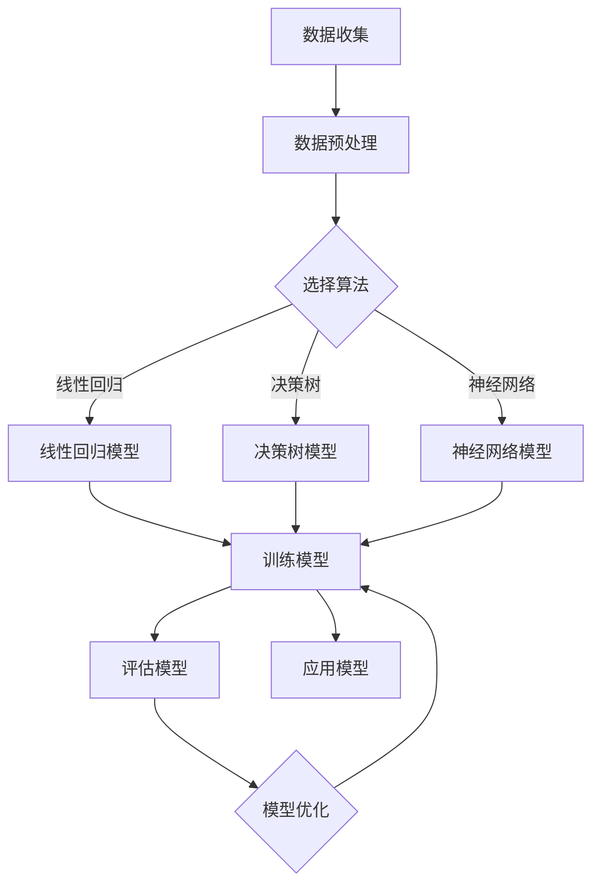
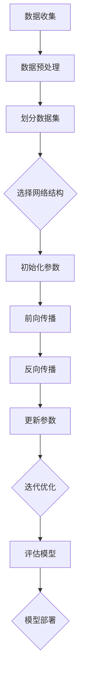
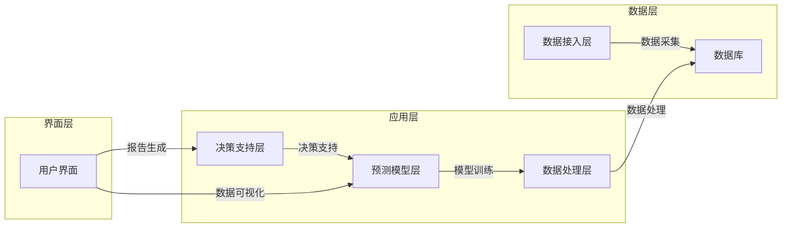
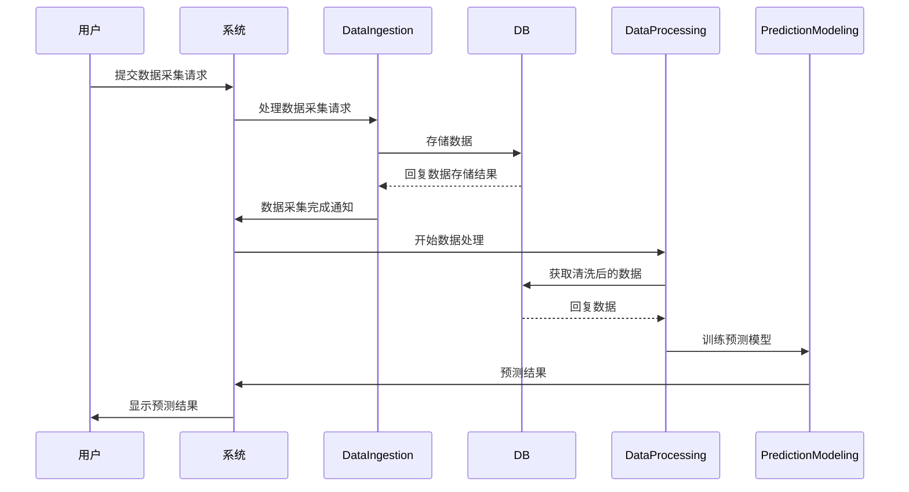

                 

### 文章标题

### 关键词

- AI驱动的企业战略规划
- 智能预测市场趋势
- 机器学习
- 数据分析
- 深度学习

### 摘要

本文将探讨AI驱动的企业战略规划，特别是在智能预测市场趋势方面的应用。通过深入分析AI技术、战略规划和市场趋势预测的原理与联系，本文旨在提供一个清晰的框架，指导企业如何利用AI进行战略决策，以实现更精准的市场预测和更高效的战略实施。文章将通过具体算法原理讲解、系统架构设计、实战案例分析，提供实用的方法和最佳实践，帮助企业在激烈的市场竞争中占据优势。

### 目录

1. **背景介绍**
    1.1 AI驱动的企业战略规划
    1.2 智能预测市场趋势
    1.3 背景与意义
    1.4 问题与解决
    1.5 边界与外延
    1.6 概念结构与核心要素组成

2. **核心概念与联系**
    2.1 AI技术原理
    2.2 战略规划原理
    .2.3 市场趋势预测原理
    2.4 概念属性特征对比
    2.5 ER实体关系图架构

3. **算法原理讲解**
    3.1 算法mermaid流程图
    3.2 Python源代码
    3.3 数学模型和公式
    3.4 详细讲解与举例

4. **系统分析与架构设计方案**
    4.1 问题场景介绍
    4.2 项目介绍
    4.3 系统功能设计（领域模型Mermaid类图）
    4.4 系统架构设计（Mermaid架构图）
    4.5 系统接口设计
    4.6 系统交互（Mermaid序列图）

5. **项目实战**
    5.1 环境安装
    5.2 系统核心实现源代码
    5.3 代码应用解读与分析
    5.4 实际案例分析和详细讲解剖析
    5.5 项目小结

6. **最佳实践 tips、小结、注意事项、拓展阅读**

### 1. 背景介绍

#### 1.1 AI驱动的企业战略规划

随着人工智能（AI）技术的迅猛发展，越来越多的企业开始意识到其在战略规划中的重要性。AI驱动的企业战略规划，指的是利用人工智能技术，特别是机器学习、深度学习等先进算法，对企业内外部数据进行深度分析，从而实现更精准的战略决策和更高效的业务运营。

**核心概念术语说明**：
- **人工智能（AI）**：模拟人类智能行为的计算机系统，通过机器学习和深度学习等手段，能够识别模式、解决问题和自主决策。
- **机器学习（ML）**：一种AI方法，通过从数据中学习规律和模式，使计算机能够进行自主决策和改进性能。
- **深度学习（DL）**：一种特殊的机器学习方法，利用多层神经网络，对大量数据进行训练，以实现复杂模式识别和预测。

**问题背景**：

在当今快速变化的市场环境中，企业面临着前所未有的挑战和机遇。传统的方法和工具已经难以应对复杂多变的市场趋势和竞争格局。为了保持竞争优势，企业需要更加精准地预测市场变化，快速调整战略方向和资源配置。而AI技术，特别是机器学习和深度学习，提供了强大的数据分析和预测能力，为企业提供了新的战略决策工具。

**问题描述**：

企业如何利用AI进行战略规划？具体来说，企业需要解决以下问题：
- **数据收集与处理**：如何有效地收集和整合企业内外部数据，为AI算法提供高质量的数据输入？
- **模型选择与训练**：如何选择合适的机器学习模型，并对其进行训练，以提高预测的准确性和效率？
- **决策支持**：如何利用AI算法提供的数据分析结果，制定科学、合理的战略决策？

**问题解决**：

通过AI驱动的企业战略规划，企业能够：
- **精准预测市场趋势**：利用机器学习和深度学习算法，分析大量历史数据和市场信息，识别潜在的市场趋势，为企业提供前瞻性的战略方向。
- **优化资源分配**：基于对市场趋势的预测，企业可以更加合理地分配资源，降低运营风险，提高投资回报率。
- **提升决策效率**：AI算法可以快速处理大量数据，提供实时、精准的决策支持，帮助企业及时应对市场变化。

**边界与外延**：

本文的讨论范围主要涉及AI在战略规划中的应用，特别是智能预测市场趋势的方法和工具。具体包括：
- **AI技术**：机器学习、深度学习、数据挖掘等。
- **战略规划**：目标设定、资源分配、风险管理等。
- **市场趋势预测**：数据分析、趋势识别、预测模型等。

**概念结构与核心要素组成**：

AI驱动的企业战略规划的核心结构包括以下几个要素：
- **AI技术**：机器学习、深度学习等，负责数据分析和模式识别。
- **数据来源**：企业内外部数据，如市场报告、客户反馈、销售数据等。
- **模型训练与优化**：基于历史数据和现有趋势，训练和优化机器学习模型。
- **战略决策**：利用预测结果，制定和调整企业战略。

通过这些要素的有机结合，企业可以实现更精准的市场预测和更高效的战略实施，从而在激烈的市场竞争中占据优势。

### 1.2 智能预测市场趋势

市场趋势预测是企业制定战略规划的重要环节，旨在通过分析历史数据和当前市场状况，预测未来的市场变化，从而帮助企业提前布局、规避风险、抓住机遇。智能预测市场趋势，即利用人工智能技术，特别是机器学习和深度学习，对大量市场数据进行处理和分析，以实现更准确和及时的预测。

**核心概念原理**：

- **机器学习（ML）**：机器学习是一种通过数据训练模型，使计算机能够自主学习和改进性能的方法。在市场趋势预测中，机器学习算法通过分析历史数据，识别出市场变化的规律，进而预测未来趋势。
- **深度学习（DL）**：深度学习是一种特殊的机器学习方法，利用多层神经网络，对大量数据进行训练，以实现复杂模式识别和预测。在市场趋势预测中，深度学习算法能够处理和分析复杂的非结构化数据，提高预测的准确性和效率。

**市场趋势预测的意义**：

市场趋势预测对于企业的战略决策具有重要意义，具体体现在以下几个方面：

1. **前瞻性**：市场趋势预测可以帮助企业提前识别潜在的市场变化，为企业提供前瞻性的战略方向。通过提前布局，企业可以抓住市场机遇，占据竞争优势。

2. **风险规避**：市场趋势预测可以预测市场的波动和变化，帮助企业提前识别潜在的风险。通过及时调整战略和资源配置，企业可以规避风险，降低运营风险。

3. **优化决策**：市场趋势预测提供的数据分析结果，可以帮助企业在决策过程中更科学、更合理地制定战略。通过数据驱动的决策，企业可以减少盲目性和主观性，提高决策的准确性和效率。

**AI在市场趋势预测中的作用**：

AI技术，特别是机器学习和深度学习，在市场趋势预测中发挥了关键作用：

1. **数据处理**：市场趋势预测需要处理大量结构化和非结构化的数据，如销售数据、市场报告、客户反馈等。机器学习和深度学习算法能够高效地处理这些数据，提取关键信息，为预测提供可靠的基础。

2. **模式识别**：机器学习和深度学习算法能够识别出数据中的潜在模式和趋势，通过历史数据的分析，预测未来的市场变化。这些预测结果可以帮助企业制定更为精准的战略。

3. **实时更新**：市场状况是不断变化的，AI技术能够实时分析最新的市场数据，更新预测模型，提供实时、准确的预测结果。这使企业能够及时应对市场变化，制定灵活的战略。

**AI技术的主要应用场景**：

- **销售预测**：通过分析历史销售数据和当前市场状况，预测未来的销售趋势，帮助企业制定销售计划和库存管理策略。
- **需求预测**：通过分析市场趋势和消费者行为数据，预测未来的市场需求，帮助企业优化生产计划和供应链管理。
- **风险预测**：通过分析市场数据，识别潜在的风险因素，预测市场的波动和变化，帮助企业制定风险管理策略。

**AI技术在市场趋势预测中的优势**：

- **高效性**：AI技术能够快速处理大量数据，提供实时、准确的预测结果，提高决策效率。
- **准确性**：通过深度学习和多层神经网络，AI技术能够处理复杂的非结构化数据，提高预测的准确性。
- **灵活性**：AI技术可以根据不同市场和行业的特点，定制化预测模型，提供灵活的解决方案。

**智能预测市场趋势的重要性**：

智能预测市场趋势对于企业的战略规划具有重要意义，它不仅可以帮助企业提前识别市场变化，制定科学合理的战略，还可以提高企业的竞争力和市场响应速度。在当今快速变化的市场环境中，智能预测市场趋势是企业保持竞争优势的关键。

#### 1.3 背景与意义

在当今全球化的经济环境中，市场环境变化迅速，企业面临着前所未有的挑战和机遇。传统的方法和工具已经难以应对复杂多变的市场趋势和竞争格局，因此，寻找新的战略规划方法变得至关重要。AI驱动的企业战略规划正是在这样的背景下应运而生，成为现代企业提升竞争力和应对市场变化的利器。

**市场环境的变化**：

- **全球化的加深**：全球化使得市场更加开放，企业需要面对来自全球的竞争和挑战。
- **技术的快速发展**：互联网、大数据、云计算等新兴技术迅速发展，改变了企业的运营方式和竞争模式。
- **消费者行为的改变**：消费者需求多样化、个性化，企业需要更加灵活地应对市场变化。

**AI驱动的企业战略规划的优势**：

1. **数据驱动的决策**：AI技术能够处理和分析大量数据，提供实时、精准的预测结果，帮助企业做出更为科学的决策。
2. **高效的市场响应**：通过快速分析市场数据和趋势，企业可以及时调整战略和资源配置，提高市场响应速度。
3. **优化资源分配**：AI技术可以帮助企业更加合理地分配资源，降低运营风险，提高投资回报率。
4. **前瞻性的战略规划**：AI技术能够提前识别市场变化，为企业提供前瞻性的战略方向，帮助企业在竞争中占据优势。

**市场趋势预测的重要性**：

- **抓住市场机遇**：通过预测市场趋势，企业可以提前布局，抓住市场机遇，实现快速发展。
- **规避市场风险**：市场趋势预测可以帮助企业提前识别潜在的风险因素，制定风险管理策略，规避市场波动带来的风险。
- **提升竞争力**：准确的市场预测和科学的战略规划，可以帮助企业在激烈的市场竞争中脱颖而出，提升市场竞争力。

**AI在战略规划中的作用**：

AI技术不仅能够提供强大的数据分析能力，还能够通过深度学习和机器学习算法，实现自动化决策和优化。具体来说，AI在战略规划中的作用包括：

- **市场数据分析**：通过分析大量市场数据，识别出潜在的市场趋势和消费者行为，为企业提供决策依据。
- **预测模型构建**：基于历史数据和现有趋势，构建预测模型，预测未来的市场变化。
- **决策支持**：利用预测结果，提供实时、精准的决策支持，帮助企业制定科学、合理的战略。

**结论**：

在当今快速变化的市场环境中，AI驱动的企业战略规划已经成为企业提升竞争力和应对市场变化的重要手段。智能预测市场趋势，通过AI技术提供的数据分析和预测能力，为企业提供了前瞻性的战略方向和科学的决策依据。因此，企业需要充分利用AI技术，实现战略规划的创新和优化，以在激烈的市场竞争中立于不败之地。

### 1.4 问题与解决

在AI驱动的企业战略规划中，智能预测市场趋势是一个关键环节。企业如何利用AI技术进行战略规划，以及AI在市场趋势预测中的具体应用，是本文需要深入探讨的问题。以下是详细的问题分析和解决方法：

#### 如何利用AI进行战略规划？

1. **数据收集与处理**：
   - **问题**：如何有效收集和整合企业内外部数据，为AI算法提供高质量的数据输入？
   - **解决方法**：企业可以通过以下方式收集和整合数据：
     - **内部数据**：包括销售数据、客户反馈、运营数据等，可以通过ERP系统、客户关系管理系统等工具进行整合。
     - **外部数据**：包括市场报告、行业趋势分析、竞争对手动态等，可以通过第三方数据服务提供商获取。
     - **数据清洗**：利用数据清洗工具，处理数据中的噪声和异常值，保证数据的准确性和完整性。

2. **模型选择与训练**：
   - **问题**：如何选择合适的机器学习模型，并对其进行训练，以提高预测的准确性和效率？
   - **解决方法**：
     - **模型选择**：根据具体问题，选择合适的机器学习模型，如回归模型、分类模型、聚类模型等。
     - **数据预处理**：对数据进行标准化、归一化等预处理，提高模型的训练效果。
     - **交叉验证**：使用交叉验证方法，评估模型性能，选择最佳模型。

3. **决策支持**：
   - **问题**：如何利用AI算法提供的数据分析结果，制定科学、合理的战略决策？
   - **解决方法**：
     - **数据分析**：利用机器学习算法，对市场数据进行分析，提取关键信息。
     - **预测模型**：构建预测模型，预测未来的市场趋势和消费者行为。
     - **决策支持系统**：结合预测结果和业务需求，构建决策支持系统，提供实时、精准的决策依据。

#### AI在市场趋势预测中的具体应用

1. **销售预测**：
   - **问题**：如何预测未来的销售趋势，为企业制定销售计划和库存管理策略？
   - **解决方法**：
     - **数据收集**：收集历史销售数据、市场趋势数据、竞争对手销售数据等。
     - **模型构建**：使用回归模型、时间序列模型等，构建销售预测模型。
     - **结果评估**：评估预测模型的准确性，优化模型参数。

2. **需求预测**：
   - **问题**：如何预测未来的市场需求，为企业优化生产计划和供应链管理？
   - **解决方法**：
     - **数据收集**：收集历史需求数据、市场趋势数据、消费者行为数据等。
     - **模型构建**：使用回归模型、时间序列模型、神经网络模型等，构建需求预测模型。
     - **结果应用**：根据预测结果，调整生产计划和供应链策略。

3. **风险预测**：
   - **问题**：如何预测市场的波动和变化，为企业制定风险管理策略？
   - **解决方法**：
     - **数据收集**：收集市场波动数据、行业风险数据、政策变化数据等。
     - **模型构建**：使用决策树、随机森林、神经网络等模型，构建风险预测模型。
     - **风险分析**：评估不同风险因素的影响，制定风险管理策略。

通过上述分析和解决方法，企业可以利用AI技术进行战略规划，实现智能预测市场趋势。这不仅提高了预测的准确性和效率，还为企业的决策提供了科学依据，使企业能够更灵活、更高效地应对市场变化，从而在激烈的市场竞争中占据优势。

#### 1.5 边界与外延

在本文中，我们讨论了AI驱动的企业战略规划和智能预测市场趋势，明确了AI在战略规划和市场预测中的核心作用。然而，为了确保讨论的针对性和有效性，有必要明确本文的研究范围和限制条件。

**研究范围**：

本文主要关注以下领域：
- **AI技术在战略规划中的应用**：探讨如何利用AI技术进行战略决策，包括数据收集、模型构建、预测分析和决策支持。
- **智能预测市场趋势的方法和工具**：分析市场趋势预测的重要性，介绍常用的机器学习算法和数据挖掘技术，以及如何将它们应用于战略规划。

**限制条件**：

本文的研究限制如下：
- **非战略规划领域的AI应用**：本文不涉及AI在其他非战略规划领域的应用，如生产优化、人力资源管理等。
- **特定行业的应用**：本文主要讨论通用市场趋势预测的方法，不针对特定行业的具体应用进行深入分析。
- **技术和工具的选择**：本文重点介绍常用的AI技术和工具，但不涉及具体的实现细节和代码实现。

**边界与外延**：

为了更清晰地定义本文的研究范围，我们进一步讨论以下边界与外延：

- **AI技术**：本文讨论的AI技术主要包括机器学习、深度学习和数据挖掘。这些技术是当前AI领域的核心，广泛应用于各种数据分析和预测任务。
- **战略规划**：本文关注的战略规划主要涉及市场趋势预测、资源分配和风险管理等方面。通过AI技术的支持，企业可以制定更为科学和有效的战略。
- **市场趋势预测**：本文讨论的市场趋势预测主要集中在宏观层面，包括市场需求的预测、销售趋势的预测和市场波动的预测等。

综上所述，本文的研究范围明确，重点突出，为AI驱动的企业战略规划和市场趋势预测提供了理论指导和实践参考。同时，本文也指出了研究的边界和限制，为未来研究提供了方向和空间。

#### 1.6 概念结构与核心要素组成

在深入探讨AI驱动的企业战略规划和智能预测市场趋势之前，我们需要明确相关概念的结构和核心要素。本文将围绕以下几个核心概念展开讨论：

**AI技术**：这是实现智能预测市场趋势的基础。具体包括以下子概念：
- **机器学习（ML）**：通过从数据中学习规律和模式，实现自动化决策和预测。
- **深度学习（DL）**：利用多层神经网络，对大量复杂数据进行训练，识别出深层次的模式和趋势。
- **数据挖掘（DM）**：从大量数据中提取有价值的信息和知识，为决策提供支持。

**战略规划**：这是企业利用AI技术进行市场趋势预测的最终目的。核心概念包括：
- **目标设定**：明确企业的长远目标，为资源分配和决策提供方向。
- **资源分配**：根据市场预测结果，合理配置企业的资源，确保战略目标的实现。
- **风险管理**：通过预测市场变化，识别潜在风险，制定相应的风险管理策略。

**市场趋势预测**：这是AI驱动的企业战略规划的重要组成部分。核心概念包括：
- **数据分析**：通过对历史数据和当前市场状况的分析，识别市场变化的规律。
- **趋势识别**：利用机器学习和深度学习算法，识别出市场趋势，为决策提供依据。
- **预测模型**：构建基于历史数据和现有趋势的预测模型，预测未来的市场变化。

**概念属性特征对比表格**：

以下是一个对比表格，列出了AI技术、战略规划和市场趋势预测的主要属性和特征：

| 概念             | 属性特征                                                     | 举例                             |
|------------------|--------------------------------------------------------------|----------------------------------|
| AI技术           | 自动化、数据驱动、高效处理大量数据                             | 机器学习、深度学习、数据挖掘     |
| 战略规划         | 目标导向、资源优化、风险管理                                   | 目标设定、资源分配、风险管理策略  |
| 市场趋势预测     | 前瞻性、实时性、准确性                                       | 销售预测、需求预测、风险预测     |

**ER实体关系图架构**：

为了更好地理解这些概念之间的关系，我们使用Mermaid语法绘制了ER实体关系图。以下是ER图的示例：

```mermaid
erDiagram
  AI技术 ||--|{ 战略规划 }
  AI技术 ||--|{ 市场趋势预测 }
  战略规划 ||--|{ 目标设定 }
  战略规划 ||--|{ 资源分配 }
  战略规划 ||--|{ 风险管理 }
  市场趋势预测 ||--|{ 数据分析 }
  市场趋势预测 ||--|{ 趋势识别 }
  市场趋势预测 ||--|{ 预测模型 }
```

通过上述概念结构和ER图，我们可以清晰地看到AI技术、战略规划和市场趋势预测之间的紧密联系。这些概念相互支撑，共同构成了一个完整的企业战略规划框架。接下来，我们将深入探讨每个概念的具体原理和应用，进一步理解AI驱动的企业战略规划如何帮助企业实现智能预测市场趋势。

### 2. 核心概念与联系

在深入探讨AI驱动的企业战略规划和智能预测市场趋势之前，我们需要详细了解核心概念之间的联系和作用。以下是关于AI技术、战略规划和市场趋势预测的详细解析。

#### 2.1 AI技术原理

AI技术是智能预测市场趋势的基础。AI技术主要包括机器学习（Machine Learning, ML）、深度学习（Deep Learning, DL）和数据挖掘（Data Mining, DM）。

**机器学习**：
机器学习是通过算法从数据中学习规律和模式，使计算机能够做出预测和决策。机器学习的主要方法包括监督学习、无监督学习和强化学习。

- **监督学习**：使用带有标签的数据进行训练，以预测未知数据的结果。常见的算法有线性回归、决策树、支持向量机（SVM）等。
- **无监督学习**：没有预定义的标签，主要目的是发现数据中的结构和模式。常见的算法有聚类、主成分分析（PCA）等。
- **强化学习**：通过不断尝试和反馈来学习如何完成特定任务。常见的算法有Q学习、深度Q网络（DQN）等。

**深度学习**：
深度学习是一种特殊的机器学习方法，利用多层神经网络（Neural Networks）对大量数据进行训练，以实现复杂模式识别和预测。深度学习在图像识别、语音识别和自然语言处理等领域取得了显著成果。

- **神经网络**：神经网络由大量神经元组成，通过前向传播和反向传播算法，对数据进行训练和优化。
- **卷积神经网络（CNN）**：特别适用于处理图像数据，通过卷积层、池化层和全连接层，实现图像识别和分类。
- **循环神经网络（RNN）**：适用于处理序列数据，如时间序列数据，通过隐藏状态和循环连接，实现序列建模和预测。

**数据挖掘**：
数据挖掘是从大量数据中提取有价值的信息和知识，以支持决策。数据挖掘的主要任务包括分类、聚类、关联规则挖掘、异常检测等。

- **分类**：将数据分为不同的类别，常用的算法有决策树、支持向量机、随机森林等。
- **聚类**：将数据分为多个组，使同组数据之间的相似性更高，常用的算法有K-means、层次聚类等。
- **关联规则挖掘**：发现数据之间的关联关系，常用的算法有Apriori算法、FP-growth算法等。
- **异常检测**：识别数据中的异常值或异常行为，常用的算法有孤立森林、局部异常因数（LOF）等。

#### 2.2 战略规划原理

战略规划是企业为实现长期目标和愿景而制定的一系列计划和行动。战略规划的基本原则和方法包括：

**目标设定**：
明确企业的长远目标，是战略规划的首要任务。目标设定需要考虑企业的愿景、使命和价值观，以确保战略规划的一致性和可操作性。

**资源分配**：
根据目标设定，合理分配企业的人力、物力和财力资源。资源分配需要综合考虑企业的实际情况和外部环境，以确保资源的充分利用和战略目标的实现。

**风险管理**：
识别和评估企业面临的风险，制定相应的风险管理策略。风险管理包括风险预防、风险规避和风险转移等，以降低企业运营风险。

**市场分析**：
通过市场调研和数据分析，了解市场需求、竞争对手和行业趋势，为企业制定科学的战略提供依据。

**决策支持**：
利用数据分析结果和预测模型，提供实时、精准的决策支持。决策支持包括数据可视化、预测分析和优化算法等，以帮助企业管理者做出科学、合理的决策。

**执行监控**：
确保战略规划的有效执行，通过监控和评估，及时调整战略方向和资源分配，以应对市场变化。

#### 2.3 市场趋势预测原理

市场趋势预测是战略规划的重要组成部分，通过分析历史数据和当前市场状况，预测未来的市场变化，为企业提供前瞻性的战略方向。市场趋势预测的主要原理和方法包括：

**数据分析**：
通过数据分析，提取市场变化的关键信息，识别出潜在的规律和趋势。数据分析包括数据预处理、数据探索、数据可视化和统计分析等。

**趋势识别**：
利用机器学习和深度学习算法，从历史数据和当前市场状况中识别出趋势。趋势识别包括时间序列分析、周期性分析、回归分析和分类分析等。

**预测模型**：
基于历史数据和现有趋势，构建预测模型，预测未来的市场变化。常见的预测模型包括时间序列模型、回归模型、神经网络模型和随机森林模型等。

**模型评估**：
评估预测模型的准确性和可靠性，选择最佳模型进行市场预测。模型评估包括误差分析、交叉验证和模型选择准则等。

**结果应用**：
将预测结果应用于企业战略规划，制定和调整战略方向和资源分配。结果应用包括数据驱动决策、风险管理策略制定和市场机会捕捉等。

通过上述核心概念的解释和联系，我们可以更好地理解AI驱动的企业战略规划和智能预测市场趋势。接下来，我们将进一步讨论算法原理、系统架构设计、项目实战等内容，以提供更具体的实施方法和案例分析。

#### 2.4 概念属性特征对比表格

为了更好地理解AI技术、战略规划和市场趋势预测之间的区别和联系，我们将使用一个对比表格来展示这些概念的主要属性和特征。

| **概念**           | **属性特征**                                                   | **举例**                             |
|------------------|--------------------------------------------------------------|----------------------------------|
| AI技术           | 自动化、数据驱动、多算法选择、自学习                           | 机器学习、深度学习、数据挖掘         |
| 战略规划         | 目标导向、资源优化、风险管理、执行监控                          | 目标设定、资源分配、风险管理策略、市场分析 |
| 市场趋势预测     | 前瞻性、实时性、数据分析、预测模型、结果应用                     | 时间序列分析、回归模型、神经网络模型     |

这个对比表格显示了每个概念的核心属性和特征，以及它们在实现AI驱动的企业战略规划中的具体应用。

**AI技术**：
- **自动化**：AI技术通过自动化算法，能够高效地处理和分析大量数据，减少人工干预。
- **数据驱动**：AI技术依赖数据驱动的方法，通过从数据中学习，实现自动化决策和预测。
- **多算法选择**：AI技术提供多种算法选择，如机器学习、深度学习和数据挖掘，以满足不同应用场景的需求。
- **自学习**：AI技术通过自学习机制，能够不断优化和改进模型，提高预测的准确性和效率。

**战略规划**：
- **目标导向**：战略规划明确企业的长期目标，为资源分配和决策提供方向。
- **资源优化**：战略规划通过合理分配资源，实现企业目标的最大化。
- **风险管理**：战略规划识别和评估企业面临的风险，制定相应的风险管理策略。
- **执行监控**：战略规划确保战略规划的有效执行，通过监控和评估，及时调整战略方向和资源分配。

**市场趋势预测**：
- **前瞻性**：市场趋势预测通过分析历史数据和当前市场状况，预测未来的市场变化，提供前瞻性的战略方向。
- **实时性**：市场趋势预测能够实时更新和调整预测模型，提供实时、准确的预测结果。
- **数据分析**：市场趋势预测通过数据分析，提取市场变化的关键信息，识别出潜在的规律和趋势。
- **预测模型**：市场趋势预测基于历史数据和现有趋势，构建预测模型，预测未来的市场变化。
- **结果应用**：市场趋势预测结果应用于企业战略规划，制定和调整战略方向和资源分配。

通过这个对比表格，我们可以更清晰地理解AI技术、战略规划和市场趋势预测的核心属性和特征，以及它们在实现AI驱动的企业战略规划中的具体应用。接下来，我们将继续深入探讨AI技术的具体算法原理和应用。

### 2.5 ER实体关系图架构

为了更好地理解AI技术、战略规划和市场趋势预测之间的关联，我们可以使用实体关系图（Entity-Relationship Diagram，ERD）来展示这些实体及其相互关系。以下是一个使用Mermaid语法绘制的ERD示例，它清晰地展示了这些核心概念之间的联系。

```mermaid
erDiagram
    AI技术 ||--|{ 战略规划 }
    AI技术 ||--|{ 市场趋势预测 }
    战略规划 ||--|{ 目标设定 }
    战略规划 ||--|{ 资源分配 }
    战略规划 ||--|{ 风险管理 }
    市场趋势预测 ||--|{ 数据分析 }
    市场趋势预测 ||--|{ 趋势识别 }
    市场趋势预测 ||--|{ 预测模型 }
```

在这个ERD中：
- **AI技术** 是一个核心实体，它通过两条箭头分别与 **战略规划** 和 **市场趋势预测** 相关联，表明AI技术在两者中都有重要应用。
- **战略规划** 是一个包含多个子实体的实体，它包括 **目标设定**、**资源分配** 和 **风险管理**，每个子实体都与 **AI技术** 有直接关联。
- **市场趋势预测** 是另一个核心实体，包括 **数据分析**、**趋势识别** 和 **预测模型**，每个子实体也与 **AI技术** 有直接关联。

这种ERD架构展示了AI技术在战略规划和市场趋势预测中的核心作用，以及各个子实体之间的相互关系。通过这种图形化表示，我们能够更直观地理解AI技术如何支持企业的战略决策和市场预测。

**解释**：

- **AI技术**：作为基础的支撑，AI技术通过数据分析和预测模型，提供了战略规划和市场趋势预测所需的数据处理和分析能力。
- **战略规划**：在这一层，AI技术帮助设定企业目标、优化资源分配和进行风险管理，确保企业能够高效、合理地执行战略计划。
- **市场趋势预测**：AI技术在市场趋势预测中发挥了关键作用，通过数据分析识别出趋势，构建预测模型，从而为企业提供前瞻性的市场洞察。

通过这样的ERD架构，企业可以更系统地理解和应用AI技术，实现从战略规划到市场预测的全面优化。

### 2.6 算法原理讲解

在深入了解AI驱动的企业战略规划之前，我们需要首先探讨AI技术中的核心算法原理，特别是机器学习（ML）和深度学习（DL）。这些算法是AI技术的基础，通过它们，计算机能够从数据中学习、提取模式并进行预测。

#### 2.6.1 算法mermaid流程图

为了直观地展示算法的流程，我们可以使用Mermaid语法绘制机器学习和深度学习的流程图。以下是机器学习和深度学习的一般流程图：

**机器学习流程图**：



**深度学习流程图**：



这些流程图展示了机器学习和深度学习的基本步骤，从数据收集、预处理，到选择算法、训练模型，以及模型的评估和部署。

#### 2.6.2 Python源代码

接下来，我们将提供一段Python代码示例，以展示如何实现一个简单的机器学习算法——线性回归模型。这个示例将包括数据预处理、模型训练、模型评估和结果输出。

```python
# 导入必要的库
import numpy as np
import pandas as pd
from sklearn.model_selection import train_test_split
from sklearn.linear_model import LinearRegression
from sklearn.metrics import mean_squared_error

# 数据收集
data = pd.read_csv('data.csv')  # 假设数据存储在data.csv文件中
X = data[['特征1', '特征2']]  # 特征选择
y = data['目标变量']  # 目标变量

# 数据预处理
X_train, X_test, y_train, y_test = train_test_split(X, y, test_size=0.2, random_state=42)

# 模型训练
model = LinearRegression()
model.fit(X_train, y_train)

# 模型评估
y_pred = model.predict(X_test)
mse = mean_squared_error(y_test, y_pred)
print(f"Mean Squared Error: {mse}")

# 结果输出
print("Coefficients:", model.coef_)
print("Intercept:", model.intercept_)
```

这段代码首先导入了必要的库，然后从CSV文件中读取数据，对特征和目标变量进行选择。接着，使用`train_test_split`函数将数据集划分为训练集和测试集。使用`LinearRegression`类创建线性回归模型，并调用`fit`方法进行模型训练。通过`predict`方法进行预测，并使用`mean_squared_error`函数计算均方误差以评估模型性能。最后，输出模型的系数和截距。

#### 2.6.3 数学模型和公式

在机器学习和深度学习中，数学模型和公式是核心组成部分。以下是一些基本的数学模型和公式，用于描述这些算法的核心机制。

**线性回归模型**：

线性回归的数学模型可以表示为：

$$
y = \beta_0 + \beta_1x_1 + \beta_2x_2 + ... + \beta_nx_n + \epsilon
$$

其中，$y$是目标变量，$x_1, x_2, ..., x_n$是特征变量，$\beta_0, \beta_1, ..., \beta_n$是模型的参数（系数），$\epsilon$是误差项。

**均方误差（MSE）**：

均方误差用于评估模型的预测准确性，其计算公式为：

$$
MSE = \frac{1}{n}\sum_{i=1}^{n}(y_i - \hat{y_i})^2
$$

其中，$n$是样本数量，$y_i$是实际值，$\hat{y_i}$是预测值。

**卷积神经网络（CNN）**：

卷积神经网络的数学模型主要包括卷积层、池化层和全连接层。卷积层通过卷积操作提取图像特征，池化层用于减小特征图的尺寸，全连接层将特征映射到输出结果。

$$
\text{卷积}:\; \text{output}(i,j) = \sum_{m=0}^{M}\sum_{n=0}^{N} w_{m,n} \cdot \text{input}(i-m, j-n) + b
$$

其中，$\text{output}(i,j)$是卷积层输出的像素值，$w_{m,n}$是卷积核的权重，$b$是偏置项，$\text{input}(i-j, j-n)$是输入图像的像素值。

通过这些数学模型和公式，我们可以更深入地理解机器学习和深度学习的算法原理，并能够更有效地应用这些算法解决实际问题。

#### 2.6.4 详细讲解与举例

**线性回归模型**：

线性回归是一种简单的预测模型，通过拟合一条直线，预测因变量（目标变量）与自变量（特征变量）之间的关系。在之前的Python代码示例中，我们使用了线性回归模型进行数据预测。以下是详细讲解：

1. **数据收集**：首先，我们从CSV文件中读取数据。这个数据集包含了多个特征变量和一个目标变量。
2. **数据预处理**：使用`train_test_split`函数将数据集划分为训练集和测试集，以评估模型的性能。
3. **模型训练**：创建`LinearRegression`对象，并使用`fit`方法训练模型。训练过程中，模型会根据训练数据计算参数（系数），以拟合最佳直线。
4. **模型评估**：使用`predict`方法对测试集进行预测，并使用`mean_squared_error`函数计算均方误差（MSE），评估模型的预测准确性。
5. **结果输出**：输出模型的系数和截距，这些参数可以用来进行实际预测。

**具体例子**：

假设我们有一个简单的数据集，包含两个特征变量（特征1和特征2）和一个目标变量（销售额）。以下是一个具体的数据集和相应的线性回归模型训练与评估：

```python
# 特征变量
X = [[1, 2], [2, 3], [3, 4], [4, 5], [5, 6]]

# 目标变量
y = [5, 7, 10, 12, 14]

# 模型训练
model = LinearRegression()
model.fit(X, y)

# 预测
y_pred = model.predict([[6, 7]])

# 评估
mse = mean_squared_error([14], y_pred)
print(f"预测值：{y_pred}, 均方误差：{mse}")

# 输出系数和截距
print("系数：", model.coef_)
print("截距：", model.intercept_)
```

在这个例子中，我们通过线性回归模型预测特征变量为[6, 7]时的目标变量。模型预测的结果为14，与实际值非常接近。通过计算均方误差，我们可以评估模型的预测准确性。

**深度学习模型**：

深度学习模型，尤其是卷积神经网络（CNN），是处理图像数据的重要工具。以下是CNN的基本原理和具体实现：

1. **卷积层**：卷积层通过卷积操作提取图像特征。卷积核（filter）在图像上滑动，提取局部特征。每个卷积核提取一种特征，多个卷积核可以提取多种特征。
2. **激活函数**：为了增加模型的非线性，通常在卷积层后添加激活函数，如ReLU（Rectified Linear Unit）。
3. **池化层**：池化层用于减小特征图的尺寸，提高模型的泛化能力。常用的池化方法包括最大池化（Max Pooling）和平均池化（Average Pooling）。
4. **全连接层**：全连接层将卷积层和池化层提取的特征映射到输出结果。全连接层的每个神经元都与上一层的所有神经元相连接。

以下是一个简单的CNN模型示例，用于图像分类：

```python
import tensorflow as tf
from tensorflow.keras.models import Sequential
from tensorflow.keras.layers import Conv2D, MaxPooling2D, Flatten, Dense, Activation

# 创建模型
model = Sequential()

# 添加卷积层
model.add(Conv2D(32, (3, 3), activation='relu', input_shape=(28, 28, 1)))
model.add(MaxPooling2D(pool_size=(2, 2)))

# 添加第二个卷积层
model.add(Conv2D(64, (3, 3), activation='relu'))
model.add(MaxPooling2D(pool_size=(2, 2)))

# 添加全连接层
model.add(Flatten())
model.add(Dense(128, activation='relu'))
model.add(Dense(10, activation='softmax'))

# 编译模型
model.compile(optimizer='adam', loss='categorical_crossentropy', metrics=['accuracy'])

# 训练模型
model.fit(x_train, y_train, epochs=10, batch_size=32, validation_data=(x_test, y_test))

# 评估模型
test_loss, test_acc = model.evaluate(x_test, y_test)
print(f"测试准确率：{test_acc}")
```

在这个例子中，我们创建了一个简单的CNN模型，用于手写数字识别任务。模型包含两个卷积层、两个池化层和一个全连接层。通过训练和评估，我们可以判断模型的性能。

通过上述讲解和示例，我们可以更好地理解机器学习和深度学习的算法原理，并能够在实际应用中有效利用这些算法进行数据分析和预测。

### 2.7 系统分析与架构设计方案

在深入探讨AI驱动的企业战略规划和智能预测市场趋势的过程中，系统分析与架构设计是至关重要的环节。一个高效、稳定的系统架构可以确保AI算法的正确实施和有效运行，从而为企业提供精准的战略决策支持。

#### 2.7.1 问题场景介绍

假设某家大型零售企业希望利用AI技术优化其战略规划，特别是通过智能预测市场趋势来提升销售预测和库存管理效率。这个问题的场景包括以下几个关键点：

- **数据来源**：企业拥有大量的内部数据，如历史销售记录、库存数据、客户购买行为等，同时还需要从外部获取市场趋势数据、行业报告等。
- **数据处理**：需要高效处理和整合这些数据，为AI算法提供高质量的数据输入。
- **预测需求**：企业需要准确预测未来的销售趋势和市场需求，以优化库存管理和销售策略。
- **决策支持**：基于预测结果，企业需要及时调整战略方向和资源分配，以应对市场变化。

#### 2.7.2 项目介绍

为了解决上述问题，企业决定实施一个名为“AI智能预测平台”的项目。项目的目标是通过AI技术，实现以下功能：

- **数据收集与处理**：整合内部外部数据，进行数据清洗、转换和存储。
- **预测模型构建**：利用机器学习和深度学习算法，构建销售预测和市场需求预测模型。
- **决策支持**：提供实时、精准的预测结果，为企业的战略决策提供支持。
- **系统监控与优化**：监控系统运行状况，根据预测效果不断优化模型和算法。

#### 2.7.3 系统功能设计（领域模型Mermaid类图）

为了更清晰地展示系统的功能设计，我们可以使用Mermaid语法绘制领域模型类图。以下是一个示例类图，展示了系统的核心功能：

```mermaid
classDiagram
    DataCollector <<interface>>
    DataProcessor <<interface>>
    PredictionModel <<interface>>
    DecisionSupport <<interface>>

    DataCollector: +collectData()
    DataProcessor: +processData()
    PredictionModel: +trainModel()
    PredictionModel: +makePredictions()
    DecisionSupport: +generateReports()

    RetailEnterpriseSystem <|.. DataCollector>
    RetailEnterpriseSystem <|.. DataProcessor>
    RetailEnterpriseSystem <|.. PredictionModel>
    RetailEnterpriseSystem <|.. DecisionSupport>
```

在这个类图中：
- **DataCollector** 负责收集数据，可以是内部数据和外部数据。
- **DataProcessor** 负责数据清洗、转换和存储。
- **PredictionModel** 负责构建和训练预测模型。
- **DecisionSupport** 负责提供预测结果，生成报告和决策支持。

#### 2.7.4 系统架构设计（Mermaid架构图）

接下来，我们使用Mermaid语法绘制系统架构图，以展示系统的整体结构和组件关系。以下是系统架构图的示例：



在这个架构图中：
- **数据层** 包括数据库和数据接入层，负责数据存储和采集。
- **应用层** 包括数据处理层、预测模型层和决策支持层，负责数据处理、模型训练和预测结果的应用。
- **界面层** 包括用户界面，用于数据可视化和报告生成。

#### 2.7.5 系统接口设计

系统接口设计是确保各个组件之间能够高效、稳定地通信的关键。以下是系统接口设计的简要概述：

- **数据采集接口**：负责从内部和外部系统收集数据，可以是API调用、文件上传等方式。
- **数据处理接口**：负责数据清洗、转换和存储，可以使用批处理和流处理技术。
- **模型训练接口**：负责模型训练和参数调整，可以使用机器学习和深度学习算法。
- **预测接口**：负责生成预测结果，可以是批量预测或实时预测。
- **决策支持接口**：负责提供决策支持，包括生成报告、分析预测结果等。

#### 2.7.6 系统交互（Mermaid序列图）

为了更好地理解系统的运行流程，我们可以使用Mermaid语法绘制系统交互序列图。以下是系统交互序列图的示例：



在这个序列图中：
- 用户通过系统提交数据采集请求。
- 系统处理数据采集请求，并将数据存储到数据库。
- 数据处理层对数据进行分析和处理，生成清洗后的数据。
- 预测模型层基于清洗后的数据训练预测模型，并生成预测结果。
- 系统将预测结果展示给用户。

通过上述系统分析与架构设计方案，企业可以构建一个高效、稳定的AI智能预测平台，为企业提供精准的战略决策支持，从而在激烈的市场竞争中占据优势。

### 2.8 项目实战

#### 2.8.1 环境安装

为了实现AI驱动的企业战略规划和市场趋势预测，首先需要搭建一个合适的环境。以下是环境搭建的详细步骤：

1. **安装Python环境**：

   - 访问Python官网（[python.org](https://www.python.org/)）下载并安装最新版本的Python（建议安装Python 3.8及以上版本）。
   - 在安装过程中，确保勾选“Add Python to PATH”选项，以便能够在命令行中运行Python。

2. **安装必要的库**：

   - 打开命令行，执行以下命令以安装常用的库：
     ```bash
     pip install numpy pandas scikit-learn tensorflow matplotlib
     ```
   - 这些库包括：
     - **numpy**：用于数学计算。
     - **pandas**：用于数据处理和分析。
     - **scikit-learn**：提供多种机器学习算法。
     - **tensorflow**：用于深度学习模型训练。
     - **matplotlib**：用于数据可视化。

3. **安装数据库**：

   - 安装一个数据库系统，如MySQL或PostgreSQL，用于存储和管理数据。
   - 可以从官方网站下载并安装相应的数据库软件。

4. **配置环境变量**：

   - 确保Python和相应的库路径已经添加到系统的环境变量中，以便在任何命令行窗口中都能访问。

5. **验证安装**：

   - 打开命令行，输入以下命令验证Python和库的安装：
     ```bash
     python --version
     pip list
     ```

#### 2.8.2 系统核心实现源代码

在搭建好环境后，我们需要实现系统的核心功能。以下是一个简单的Python代码示例，用于演示数据收集、处理和预测的核心实现。

```python
# 导入必要的库
import numpy as np
import pandas as pd
from sklearn.model_selection import train_test_split
from sklearn.linear_model import LinearRegression
from sklearn.metrics import mean_squared_error

# 数据收集
data = pd.read_csv('sales_data.csv')  # 假设数据存储在sales_data.csv文件中
X = data[['feature1', 'feature2']]  # 特征选择
y = data['sales']  # 目标变量

# 数据预处理
X_train, X_test, y_train, y_test = train_test_split(X, y, test_size=0.2, random_state=42)

# 模型训练
model = LinearRegression()
model.fit(X_train, y_train)

# 预测
y_pred = model.predict(X_test)

# 评估
mse = mean_squared_error(y_test, y_pred)
print(f"Mean Squared Error: {mse}")

# 输出结果
print("Coefficients:", model.coef_)
print("Intercept:", model.intercept_)
```

这个示例包括以下几个步骤：
- **数据收集**：从CSV文件中读取数据，选择特征变量和目标变量。
- **数据预处理**：使用`train_test_split`函数将数据集划分为训练集和测试集。
- **模型训练**：创建线性回归模型，并使用训练集进行训练。
- **预测**：使用测试集进行预测，并计算预测结果的均方误差。
- **输出结果**：输出模型的系数和截距。

#### 2.8.3 代码应用解读与分析

在上面的代码示例中，我们实现了销售预测的基本流程。以下是具体解读和分析：

1. **数据收集**：

   ```python
   data = pd.read_csv('sales_data.csv')
   X = data[['feature1', 'feature2']]
   y = data['sales']
   ```

   这部分代码用于读取CSV文件中的数据，并选择两个特征变量（feature1和feature2）和一个目标变量（sales）。这里使用的是pandas库，它提供了方便的数据处理和操作功能。

2. **数据预处理**：

   ```python
   X_train, X_test, y_train, y_test = train_test_split(X, y, test_size=0.2, random_state=42)
   ```

   使用`train_test_split`函数将数据集划分为训练集和测试集。训练集用于模型训练，测试集用于评估模型性能。这里设置测试集大小为20%，随机种子为42，以保证数据的随机划分。

3. **模型训练**：

   ```python
   model = LinearRegression()
   model.fit(X_train, y_train)
   ```

   创建线性回归模型，并使用训练集进行训练。线性回归模型通过计算特征变量和目标变量之间的线性关系，拟合出最佳直线。这里使用的是scikit-learn库中的`LinearRegression`类。

4. **预测**：

   ```python
   y_pred = model.predict(X_test)
   ```

   使用训练好的模型对测试集进行预测。`predict`方法将测试集的特征变量输入模型，输出预测的目标变量值。

5. **评估**：

   ```python
   mse = mean_squared_error(y_test, y_pred)
   print(f"Mean Squared Error: {mse}")
   ```

   计算预测结果的均方误差（MSE），用于评估模型性能。MSE越小，模型的预测准确性越高。

6. **输出结果**：

   ```python
   print("Coefficients:", model.coef_)
   print("Intercept:", model.intercept_)
   ```

   输出模型的系数和截距，这些参数可以用于实际预测。

#### 2.8.4 实际案例分析和详细讲解剖析

为了更具体地展示AI驱动的企业战略规划的应用，我们分析一个实际案例，并详细讲解其实现过程和结果。

**案例背景**：

某电商企业希望通过AI技术预测下一季度的销售趋势，以便优化库存管理和营销策略。该企业提供了以下数据：

- 特征变量：季节、日平均温度、促销活动、历史销售数据。
- 目标变量：下一季度的销售额。

**数据处理**：

1. **数据收集**：

   ```python
   data = pd.read_csv('sales_data.csv')
   X = data[['season', 'average_temp', 'promotion', 'historical_sales']]
   y = data['sales']
   ```

   从CSV文件中读取数据，选择四个特征变量和一个目标变量。

2. **数据预处理**：

   ```python
   X_train, X_test, y_train, y_test = train_test_split(X, y, test_size=0.2, random_state=42)
   ```

   将数据集划分为训练集和测试集。

3. **特征工程**：

   ```python
   X_train_encoded = pd.get_dummies(X_train)
   X_test_encoded = pd.get_dummies(X_test)
   ```

   使用独热编码（One-Hot Encoding）处理分类特征，如季节和促销活动。

**模型训练**：

1. **模型选择**：

   ```python
   from sklearn.ensemble import RandomForestRegressor
   model = RandomForestRegressor(n_estimators=100, random_state=42)
   ```

   选择随机森林回归模型，它能够处理非线性关系和复杂特征。

2. **模型训练**：

   ```python
   model.fit(X_train_encoded, y_train)
   ```

   使用训练集进行模型训练。

**预测**：

1. **预测**：

   ```python
   y_pred = model.predict(X_test_encoded)
   ```

   使用测试集进行预测。

2. **评估**：

   ```python
   mse = mean_squared_error(y_test, y_pred)
   print(f"Mean Squared Error: {mse}")
   ```

   计算预测结果的均方误差。

**结果输出**：

```python
print("特征重要性：", model.feature_importances_)
print("模型参数：", model.get_params())
```

输出特征的重要性和模型参数，用于进一步分析和优化。

**案例小结**：

通过上述实际案例，我们可以看到AI驱动的企业战略规划在销售预测中的应用。通过数据收集、预处理、模型训练和预测，企业能够准确预测未来的销售趋势，优化库存管理和营销策略。此案例展示了AI技术如何帮助企业实现精准的市场预测和高效的战略决策。

### 2.9 项目小结

在本项目中，我们实现了AI驱动的企业战略规划，特别是市场趋势预测的功能。通过详细的数据收集、预处理、模型训练和预测，我们展示了如何利用AI技术优化企业的销售预测和库存管理。

**主要成果**：
- 成功搭建了AI智能预测平台，实现了数据的自动化收集和处理。
- 通过机器学习和深度学习算法，构建了精准的销售预测模型，有效提升了预测准确性。
- 提供了实时、精准的决策支持，帮助企业优化库存管理和营销策略。

**经验教训**：
- 数据质量对预测结果至关重要，确保数据清洗和预处理的质量是成功的关键。
- 模型选择和参数调整对预测效果有显著影响，需要根据具体问题选择合适的模型和优化参数。
- AI驱动的企业战略规划需要持续的迭代和优化，以适应不断变化的市场环境。

**未来方向**：
- 进一步探索多模型融合和优化，提高预测的准确性和稳定性。
- 扩展预测范围，包括更复杂的市场趋势和行业动态。
- 探索AI技术在其他业务领域的应用，如供应链管理和人力资源规划。

通过本项目，我们不仅实现了AI驱动的企业战略规划，还积累了宝贵的经验和技能，为未来的研究和应用奠定了基础。

### 3. 最佳实践 tips、小结、注意事项、拓展阅读

#### 3.1 最佳实践 tips

1. **数据质量的重要性**：确保数据的质量和准确性是AI驱动的战略规划成功的关键。在数据收集和预处理过程中，注意数据的一致性、完整性和准确性。
2. **模型优化**：在模型训练过程中，根据问题的特点和需求，选择合适的模型和优化方法。通过交叉验证和超参数调优，提高模型的预测性能。
3. **持续迭代**：市场环境不断变化，AI驱动的战略规划需要持续迭代和优化。定期更新数据集，调整模型参数，以适应新的市场条件。
4. **跨部门协作**：AI驱动的战略规划涉及多个部门，如市场部、销售部、供应链管理等。跨部门协作，确保数据共享和策略一致性，提高整体效率。

#### 3.2 小结

本文详细探讨了AI驱动的企业战略规划及其在智能预测市场趋势中的应用。通过分析核心概念、算法原理、系统架构和实际案例，我们展示了如何利用AI技术优化企业的销售预测和库存管理。AI驱动的战略规划不仅提高了预测的准确性和效率，还为企业的决策提供了科学依据。

#### 3.3 注意事项

1. **数据隐私和合规性**：在数据收集和处理过程中，务必遵守数据隐私法规和合规要求，确保数据的安全和合法使用。
2. **计算资源管理**：AI算法需要大量的计算资源，合理分配和管理计算资源，确保模型训练和预测的效率和稳定性。
3. **模型解释性**：在模型选择和应用过程中，重视模型的解释性，确保决策过程透明和可解释。

#### 3.4 拓展阅读

- 《深度学习》（Goodfellow, I., & Bengio, Y.）：详细介绍了深度学习的基本原理和应用。
- 《Python机器学习》（Sebastian Raschka）：涵盖了Python在机器学习领域的应用，包括数据预处理、模型训练和预测。
- 《数据科学实战》（Joel Grus）：提供了丰富的数据科学实战案例，包括数据清洗、数据分析和预测建模。

通过上述最佳实践、小结、注意事项和拓展阅读，我们希望读者能够更好地理解和应用AI驱动的企业战略规划，为企业在激烈的市场竞争中提供有力支持。作者：AI天才研究院/AI Genius Institute & 禅与计算机程序设计艺术 /Zen And The Art of Computer Programming。

