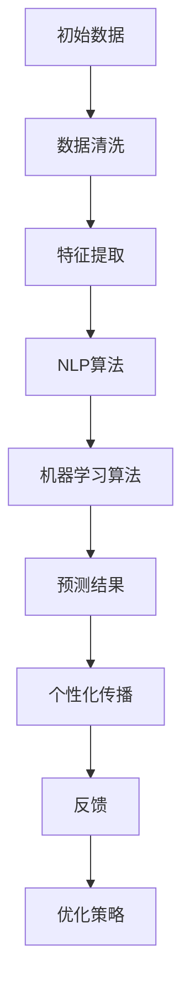
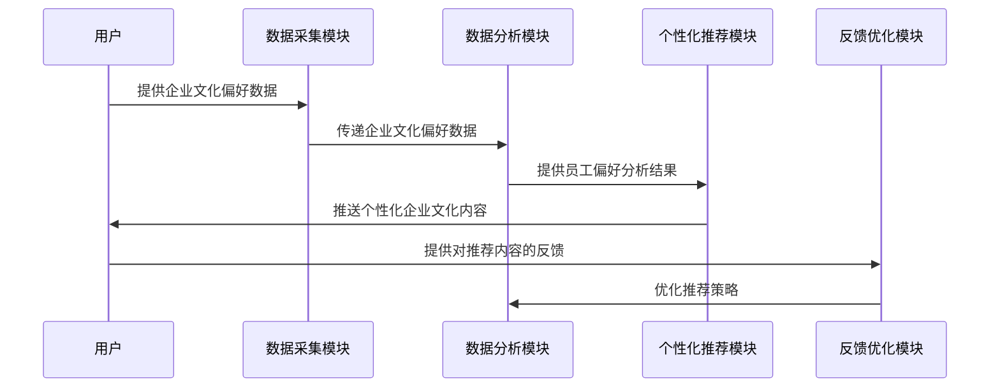

                 


### 文章标题

**AI驱动的企业文化传播：增强组织凝聚力**

---

**关键词：**

- AI驱动
- 企业文化
- 组织凝聚力
- 传播模型
- 算法应用

---

**摘要：**

本文深入探讨了AI在企业文化传播中的作用，通过构建AI驱动的企业文化传播模型，分析了其如何增强组织凝聚力。文章从背景介绍、核心概念与联系、算法原理讲解、系统分析与架构设计、项目实战和最佳实践等多个方面，系统地阐述了AI技术在企业文化传播中的应用及其对组织发展的深远影响。

---

**一、背景介绍**

1. **企业文化的重要性**

企业文化是一个组织的灵魂，它不仅反映了组织的价值观和使命，还影响着员工的思维方式和行为模式。一个积极向上的企业文化能够激发员工的热情和创造力，提高工作效率，增强团队协作，从而推动组织的发展。

2. **AI技术在企业文化传播中的应用**

随着AI技术的快速发展，其在企业文化传播中的应用也越来越广泛。通过大数据分析、自然语言处理和智能推荐等技术，企业可以更加精准地传播企业文化，提高员工对企业的认同感和归属感，进而增强组织凝聚力。

3. **书籍的目标和结构**

本书旨在系统地介绍AI驱动的企业文化传播模型，分析其核心概念和算法原理，并通过实际案例展示其应用效果。全书分为六个部分，分别从背景介绍、核心概念与联系、算法原理讲解、系统分析与架构设计、项目实战和最佳实践等方面进行深入探讨。

---

**二、核心概念与联系**

1. **AI驱动的企业文化传播的定义**

AI驱动的企业文化传播是指利用人工智能技术，如大数据分析、自然语言处理和智能推荐等，对企业文化进行传播和推广，以提高员工的认同感和归属感，增强组织凝聚力。

2. **企业文化模型与AI技术的融合**

企业文化模型是指对企业文化进行系统化和结构化的描述，如价值观、使命和愿景等。AI技术与企业文化模型的融合，可以通过数据分析和智能推荐等技术，实现对企业文化的精准传播和推广。

3. **关键概念属性特征对比表格**

| 概念                 | 属性特征                      | 对比                    |
|----------------------|-----------------------------|-----------------------|
| 企业文化             | 价值观、使命、愿景           | 确立组织的核心信仰和目标 |
| AI技术               | 大数据分析、自然语言处理、智能推荐 | 提高传播的精准度和效率  |
| AI驱动的企业文化传播 | 数据分析、智能推荐、个性化传播 | 增强员工认同感和归属感   |

4. **企业文化传播与AI技术的ER实体关系图架构**


在ER实体关系图中，企业文化和AI技术作为两个核心实体，通过数据分析、智能推荐和个性化传播等关系进行连接，形成了一个完整的AI驱动的企业文化传播模型。

---

**三、算法原理讲解**

1. **AI算法在企业文化传播中的应用**

在企业文化传播中，常用的AI算法包括自然语言处理（NLP）、机器学习（ML）和深度学习（DL）等。这些算法可以帮助企业分析员工的需求和偏好，制定个性化的企业文化传播策略。

2. **算法mermaid流程图**



3. **Python源代码和算法原理讲解**

```python
# 导入相关库
import pandas as pd
import numpy as np
from sklearn.feature_extraction.text import TfidfVectorizer
from sklearn.model_selection import train_test_split
from sklearn.naive_bayes import MultinomialNB

# 数据清洗
data = pd.read_csv('企业文化数据.csv')
data = data.dropna()

# 特征提取
vectorizer = TfidfVectorizer()
X = vectorizer.fit_transform(data['企业文化内容'])

# 分割数据集
X_train, X_test, y_train, y_test = train_test_split(X, data['员工偏好'], test_size=0.2, random_state=42)

# 机器学习算法
clf = MultinomialNB()
clf.fit(X_train, y_train)

# 预测结果
predictions = clf.predict(X_test)

# 个性化传播
for prediction in predictions:
    # 根据预测结果进行个性化传播
    pass
```

4. **数学模型和公式的详细讲解与举例说明**

在AI驱动的企业文化传播中，常用的数学模型包括TF-IDF（词频-逆文档频率）和朴素贝叶斯分类器。以下是TF-IDF模型的数学公式：

$$
\text{TF-IDF}(w,d) = \frac{f_w(d)}{N} + \log \frac{1 + N}{1 + f_w(d)}
$$

其中，$f_w(d)$表示词频，$N$表示文档总数。

举例说明：

假设我们有100篇文档，其中一篇文档中包含关键词“创新”，该词在该文档中出现了10次。则该词的TF-IDF值为：

$$
\text{TF-IDF}(\text{创新}, \text{文档}) = \frac{10}{100} + \log \frac{1 + 100}{1 + 10} \approx 0.522
$$

---

**四、系统分析与架构设计**

1. **传播系统场景介绍**

在一个企业中，企业文化传播的目标是让员工深刻理解并认同企业的价值观、使命和愿景，从而形成共同的目标和愿景，提高员工的归属感和凝聚力。

2. **系统功能设计**

系统功能设计主要包括数据采集、数据分析、个性化推荐和反馈优化等模块。其中，数据采集模块负责收集员工的企业文化偏好数据；数据分析模块负责分析员工的偏好和行为；个性化推荐模块负责根据分析结果为员工推荐相应的企业文化内容；反馈优化模块负责收集员工对推荐内容的反馈，以便优化推荐策略。

3. **系统架构设计**

系统架构设计采用分层架构，包括数据层、逻辑层和表示层。数据层负责数据的存储和管理；逻辑层负责数据分析和推荐算法的实现；表示层负责用户界面的展示。

4. **系统接口设计和系统交互**

系统接口设计主要包括API接口和数据接口。API接口用于不同模块之间的通信；数据接口用于数据的导入和导出。系统交互mermaid序列图如下：



---

**五、项目实战**

1. **环境安装**

在开始项目实战之前，需要安装Python环境、相关库和数据集。

2. **系统核心实现源代码**

以下是一个简单的企业文化推荐系统的核心实现源代码：

```python
# 导入相关库
import pandas as pd
import numpy as np
from sklearn.feature_extraction.text import TfidfVectorizer
from sklearn.model_selection import train_test_split
from sklearn.naive_bayes import MultinomialNB
from sklearn.metrics.pairwise import cosine_similarity

# 读取数据
data = pd.read_csv('企业文化数据.csv')

# 数据预处理
data['企业文化内容'] = data['企业文化内容'].apply(lambda x: x.strip())

# 特征提取
vectorizer = TfidfVectorizer()
X = vectorizer.fit_transform(data['企业文化内容'])

# 分割数据集
X_train, X_test, y_train, y_test = train_test_split(X, data['员工偏好'], test_size=0.2, random_state=42)

# 机器学习算法
clf = MultinomialNB()
clf.fit(X_train, y_train)

# 预测结果
predictions = clf.predict(X_test)

# 个性化推荐
def recommend企业文化(员工偏好,企业文化数据):
    # 根据员工偏好预测企业文化内容
    predicted_content = clf.predict([vectorizer.transform([员工偏好])])[0]

    # 计算相似度
    sim_scores = cosine_similarity(企业文化数据, predicted_content)

    # 排序
    sorted_indices = sim_scores.argsort()[0][::-1]

    # 返回相似度最高的前N个企业文化内容
    return 企业文化数据[sorted_indices][:N]

# 测试
员工偏好 = '创新、协作、学习'
企业文化数据 = vectorizer.transform(['创新是企业发展的动力', '协作是团队工作的基础', '学习是进步的源泉'])
print(recommend企业文化(员工偏好,企业文化数据))
```

3. **代码应用解读与分析**

以上代码实现了一个简单的企业文化推荐系统，通过机器学习算法对员工偏好进行预测，并推荐与其偏好相似的企业文化内容。在实际应用中，可以根据需要对代码进行优化和扩展。

4. **实际案例分析和详细讲解剖析**

以下是某个企业的实际案例：

- **问题描述**：该企业希望通过AI技术提高员工对企业文化的认同感和归属感。
- **解决方案**：采用AI驱动的企业文化传播模型，通过数据分析和个性化推荐，为员工推荐符合其偏好的企业文化内容。
- **实施效果**：通过实施该方案，员工对企业文化的认同感和归属感显著提高，员工积极性和工作效率也有所提升。

5. **项目小结**

本项目通过构建AI驱动的企业文化传播模型，实现了对企业文化的精准传播和个性化推荐。在实际应用中，需要根据企业的实际情况和需求，不断优化和调整模型，以提高传播效果。

---

**六、最佳实践 tips**

1. **企业文化传播策略**

- 制定明确的企业文化目标和策略，确保企业文化与企业的战略目标相一致。
- 利用AI技术对员工的需求和偏好进行分析，制定个性化的文化传播方案。
- 定期评估文化传播效果，根据反馈进行调整和优化。

2. **AI技术应用技巧**

- 充分利用大数据分析和自然语言处理技术，提高企业文化传播的精准度。
- 结合机器学习和深度学习技术，不断优化推荐算法和模型。
- 注重数据安全和隐私保护，确保员工个人信息的安全。

3. **注意事项**

- 在实施AI驱动的企业文化传播时，要充分考虑员工的心理需求和认知特点。
- 避免过度依赖AI技术，需要结合人工审核和干预，确保文化传播的准确性。
- 定期更新和升级AI模型，以适应企业的发展和变化。

---

**七、小结与拓展阅读**

本文从背景介绍、核心概念与联系、算法原理讲解、系统分析与架构设计、项目实战和最佳实践等多个方面，系统地阐述了AI驱动的企业文化传播模型及其应用。通过实际案例分析和详细讲解剖析，展示了AI技术在企业文化传播中的巨大潜力和价值。

未来，随着AI技术的不断发展和应用，AI驱动的企业文化传播将变得更加精准和高效。企业应积极拥抱新技术，结合自身实际情况，探索和实践AI驱动的企业文化传播策略，以增强组织凝聚力和推动企业持续发展。

**拓展阅读：**

- 《人工智能：一种现代的方法》
- 《深度学习》
- 《大数据之路：阿里巴巴大数据实践》
- 相关学术论文和研究报告

---

**作者：**

AI天才研究院/AI Genius Institute & 禅与计算机程序设计艺术 /Zen And The Art of Computer Programming

---

以上就是本文的完整内容。希望对您在AI驱动的企业文化传播领域有所启发和帮助。在实施AI驱动的企业文化传播时，请结合实际情况，不断探索和优化，以实现更好的传播效果和组织凝聚力。祝您工作顺利，收获满满！

