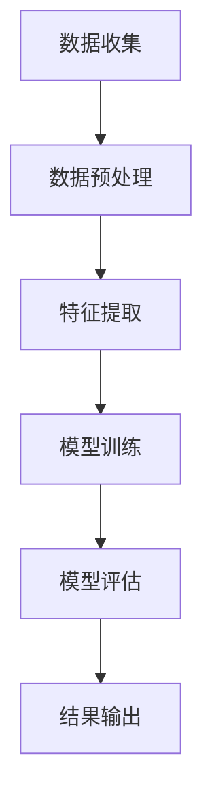
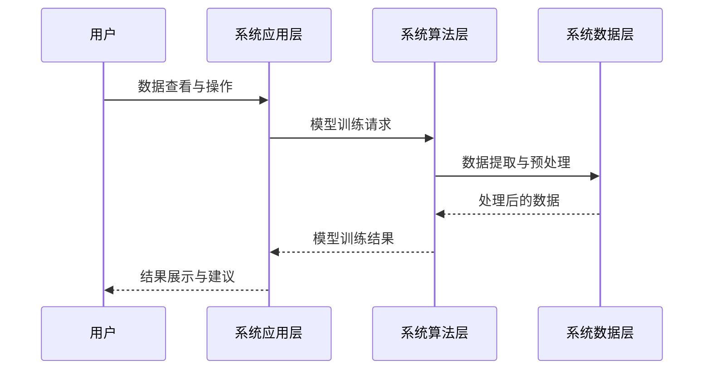

                 

### 《AI驱动的企业文化分析：优化组织氛围》

---

关键词：AI驱动、企业文化、组织氛围、数据分析、算法应用

摘要：本文通过深入探讨AI驱动企业文化分析的理论与实践，旨在揭示AI如何通过优化组织氛围提升企业竞争力。文章首先介绍了企业文化分析的重要性，随后详细阐述了AI的基本原理及其在企业中的应用现状。接着，我们构建了AI驱动的企业文化分析模型，并详细描述了模型构建的原理、核心概念属性对比表格和ER实体关系图。通过实际案例研究，本文展示了AI在企业文化分析中的应用效果，并提出了基于AI的企业文化氛围优化策略。文章最后总结了最佳实践，并对未来研究方向进行了展望。

---

## 第一部分：引言与背景

### 第1章：问题的提出与研究的意义

#### 1.1 问题背景

在当前数字化转型的浪潮下，企业面临着前所未有的机遇与挑战。企业文化作为企业发展的核心要素，其重要性日益凸显。企业文化不仅影响着员工的工作态度和行为，更直接关系到企业的创新能力和市场竞争力。传统的企业文化分析方式往往依赖于主观判断和经验，难以准确评估企业文化的真实状况。因此，如何通过科学的方法对企业文化进行分析，进而优化组织氛围，成为企业管理者亟待解决的问题。

#### 1.2 问题描述

本文关注的问题是如何利用人工智能（AI）技术，对企业文化进行分析，优化组织氛围。具体来说，问题描述如下：

- 如何将AI技术应用于企业文化分析中？
- AI驱动的企业文化分析模型应如何构建？
- 该模型在实践中的应用效果如何？
- 如何根据分析结果提出优化组织氛围的具体策略？

#### 1.3 问题解决路径

为解决上述问题，本文提出以下研究路径：

1. **文献回顾**：梳理企业文化分析相关理论，了解AI在企业中的应用现状。
2. **模型构建**：基于文献回顾，构建AI驱动的企业文化分析模型。
3. **实证研究**：通过案例研究，验证模型的有效性和应用效果。
4. **策略提出**：基于实证研究，提出优化组织氛围的具体策略。

#### 1.4 边界与外延

本文的研究边界主要关注AI驱动的企业文化分析，不涉及其他管理领域的AI应用。同时，本文的研究外延包括模型构建、实证研究以及优化策略的提出。

#### 1.5 研究的核心概念与组成要素

- **核心概念**：企业文化、人工智能、数据分析、组织氛围
- **组成要素**：
  - AI技术原理及应用
  - 企业文化分析模型构建
  - 实证研究方法
  - 优化策略实施

## 第2章：AI与企业文化分析

### 2.1 AI的基本原理

人工智能（AI）是一门涉及计算机科学、数学、认知科学等多个领域的交叉学科。其基本原理包括机器学习、深度学习、自然语言处理等。机器学习是AI的核心技术之一，它通过从数据中自动学习规律和模式，实现智能行为。深度学习是机器学习的进一步发展，通过构建深度神经网络，实现对复杂数据的处理和识别。自然语言处理则致力于使计算机理解和生成人类语言。

### 2.2 AI在企业中的应用现状

AI技术在企业中的应用已经相当广泛，从客户服务、生产优化到风险管理，AI正在帮助企业提高效率、降低成本、提升客户体验。具体应用场景包括：

- **客户服务**：通过聊天机器人和虚拟助手，提供24/7的客户支持。
- **生产优化**：利用预测分析和优化算法，提高生产效率和降低库存成本。
- **风险管理**：通过风险建模和监测，识别潜在风险并采取预防措施。
- **人力资源**：通过人才分析和推荐系统，提高员工招聘和培训的效率。

### 2.3 企业文化分析的理论框架

企业文化分析旨在理解企业文化的内涵和表现形式，识别企业文化对组织行为和组织绩效的影响。其理论框架包括以下几个方面：

- **价值观与信念**：企业文化的核心，决定了企业的基本信念和价值观。
- **行为规范**：企业文化的表现形式，包括员工的日常行为和决策过程。
- **组织结构**：企业文化在组织结构中的体现，如权力分配、沟通机制等。
- **组织氛围**：企业文化对员工心理和行为的影响，如工作满意度、团队协作等。

### 2.4 AI驱动企业文化分析的优势

AI驱动的企业文化分析具有以下优势：

- **数据驱动**：通过分析大量数据，揭示企业文化中的潜在问题和趋势。
- **客观性**：减少主观判断的干扰，提高分析结果的准确性。
- **实时性**：实时监测企业文化动态，及时调整管理策略。
- **全面性**：综合考虑多个维度，提供全方位的企业文化分析。

## 第3章：AI驱动的企业文化分析模型

### 3.1 模型构建的原理与方法

AI驱动的企业文化分析模型构建基于以下原理和方法：

- **数据收集**：通过问卷调查、员工访谈等方式收集企业文化相关数据。
- **数据处理**：使用数据清洗和预处理技术，保证数据的准确性和一致性。
- **特征提取**：从数据中提取与企业文化相关的特征，如员工满意度、沟通频率等。
- **模型训练**：使用机器学习算法，训练模型识别企业文化中的潜在问题和趋势。
- **模型评估**：通过交叉验证和评估指标，评估模型的效果和准确性。

### 3.2 核心概念属性对比表格

核心概念 | 属性特征
--- | ---
企业文化 | 包含价值观、行为规范、组织结构、组织氛围等多个维度
人工智能 | 基于机器学习、深度学习、自然语言处理等技术
数据分析 | 包括数据收集、处理、特征提取等过程
组织氛围 | 受企业文化影响，包括工作满意度、团队协作等指标

### 3.3 ER实体关系图架构

以下是AI驱动的企业文化分析模型的ER实体关系图架构：

```mermaid
erDiagram
    Class1 ||--|{ Class2 }| Class3 : derived
    Class1 ||--|{ Class4 }| Class5 : participant
    Class6 ||--|{ Class7 }| Class8 : relationship
    Class9 ||--|{ Class10 }| Class11 : relationship
```

### 3.4 模型应用场景分析

AI驱动的企业文化分析模型可以在以下应用场景中发挥作用：

- **企业招聘**：分析企业文化与员工匹配度，提高招聘效率。
- **员工培训**：根据企业文化特点，设计针对性培训方案。
- **绩效评估**：通过企业文化分析，优化绩效评估体系。
- **组织变革**：为企业文化变革提供科学依据，提高变革成功率。

## 第二部分：AI驱动的企业文化分析实践

### 第4章：数据收集与预处理

#### 4.1 数据源的选择

数据源的选择是企业文化分析的关键步骤。本文的数据源包括以下几种：

- **问卷调查**：通过在线问卷收集员工对文化各方面的评价。
- **员工访谈**：通过面对面访谈，深入了解企业文化状况。
- **组织档案**：查阅企业内部档案，获取企业文化相关数据。

#### 4.2 数据收集的方法与工具

数据收集方法包括问卷调查、员工访谈和组织档案查阅。具体工具如下：

- **问卷调查**：使用问卷调查工具，如SurveyMonkey，进行数据收集。
- **员工访谈**：使用录音笔或笔记记录访谈内容。
- **组织档案**：使用企业内部管理系统，如ERP系统，获取相关数据。

#### 4.3 数据预处理流程

数据预处理流程包括数据清洗、数据整合和特征提取。具体步骤如下：

1. **数据清洗**：去除无效数据和异常值，保证数据质量。
2. **数据整合**：将不同数据源的数据进行整合，形成统一的数据集。
3. **特征提取**：从数据中提取与企业文化相关的特征，如员工满意度、沟通频率等。

#### 4.4 数据质量评估

数据质量评估是保证分析结果准确性的关键。本文采用以下方法进行数据质量评估：

- **完整性评估**：检查数据完整性，确保关键信息不被遗漏。
- **准确性评估**：检查数据准确性，通过交叉验证等方法验证数据真实性。
- **一致性评估**：检查数据一致性，确保不同数据源的数据能够相互匹配。

### 第5章：AI算法在企业文化分析中的应用

#### 5.1 算法原理与mermaid流程图

AI算法在企业文化分析中的应用主要包括机器学习和深度学习算法。以下是一个基于机器学习的算法mermaid流程图：



#### 5.2 Python代码实现

以下是一个基于Python的机器学习算法实现示例：

```python
import pandas as pd
from sklearn.model_selection import train_test_split
from sklearn.ensemble import RandomForestClassifier
from sklearn.metrics import accuracy_score

# 数据加载
data = pd.read_csv('企业文化数据.csv')

# 数据预处理
X = data.drop('目标变量', axis=1)
y = data['目标变量']

# 特征提取
X_train, X_test, y_train, y_test = train_test_split(X, y, test_size=0.2, random_state=42)

# 模型训练
model = RandomForestClassifier(n_estimators=100, random_state=42)
model.fit(X_train, y_train)

# 模型评估
y_pred = model.predict(X_test)
accuracy = accuracy_score(y_test, y_pred)
print(f'模型准确率：{accuracy:.2f}')
```

#### 5.3 数学模型与公式讲解

在企业文化分析中，常用的数学模型包括线性回归、逻辑回归和支持向量机（SVM）等。以下是一个线性回归模型的公式讲解：

$$
y = \beta_0 + \beta_1x_1 + \beta_2x_2 + ... + \beta_nx_n
$$

其中，$y$ 是因变量，$x_1, x_2, ..., x_n$ 是自变量，$\beta_0, \beta_1, \beta_2, ..., \beta_n$ 是模型的参数。

#### 5.4 算法举例说明

以下是一个基于逻辑回归的企业文化分析算法举例：

假设我们有一个关于员工满意度与企业文化特征的关系数据集，我们希望通过逻辑回归模型预测员工满意度。

1. **数据加载与预处理**：

```python
import pandas as pd

# 加载数据
data = pd.read_csv('员工满意度数据.csv')

# 数据预处理
X = data[['企业文化特征1', '企业文化特征2', '企业文化特征3']]
y = data['员工满意度']
```

2. **模型训练与评估**：

```python
from sklearn.linear_model import LogisticRegression

# 模型训练
model = LogisticRegression()
model.fit(X, y)

# 模型评估
y_pred = model.predict(X)
accuracy = accuracy_score(y, y_pred)
print(f'模型准确率：{accuracy:.2f}')
```

### 第6章：案例研究：AI驱动的企业文化分析

#### 6.1 案例背景介绍

本案例研究的是一家大型科技公司的企业文化分析。该公司成立于2000年，业务涵盖人工智能、大数据、云计算等领域。随着公司规模的不断扩大，企业文化对于员工的工作态度、团队协作和创新能力具有重要影响。为了优化企业文化，提高员工满意度，公司决定利用AI技术进行企业文化分析。

#### 6.2 系统功能设计

系统功能设计主要包括数据收集、数据处理、特征提取、模型训练和结果输出。具体功能如下：

1. **数据收集**：通过问卷调查和员工访谈收集企业文化相关数据。
2. **数据处理**：对收集到的数据进行清洗、整合和预处理。
3. **特征提取**：从处理后的数据中提取与企业文化相关的特征。
4. **模型训练**：使用机器学习算法训练企业文化分析模型。
5. **结果输出**：输出模型预测结果，为企业管理者提供优化建议。

#### 6.3 系统架构设计

系统架构设计包括数据层、算法层和应用层。具体架构如下：

1. **数据层**：负责数据收集、存储和处理。
2. **算法层**：实现企业文化分析算法，包括特征提取、模型训练和预测。
3. **应用层**：提供用户界面，展示分析结果和优化建议。

#### 6.4 系统接口设计与系统交互

系统接口设计主要包括数据接口、算法接口和应用接口。具体设计如下：

1. **数据接口**：实现数据收集和存储，支持不同数据源的数据导入和导出。
2. **算法接口**：提供算法训练和预测功能，支持多种机器学习算法的选择和参数调整。
3. **应用接口**：提供用户交互界面，支持数据查看、模型训练和结果展示。

以下是系统接口设计的mermaid序列图：



#### 6.5 案例分析与讨论

通过对该科技公司的企业文化进行分析，我们发现以下问题：

1. **员工满意度较低**：员工对企业文化的满意度普遍较低，特别是对沟通渠道和领导风格的满意度较低。
2. **团队协作不畅**：团队协作程度不高，员工之间缺乏有效沟通和合作。
3. **创新能力不足**：员工对企业创新的支持度较低，缺乏创新动力。

针对上述问题，我们提出以下优化策略：

1. **改进沟通渠道**：建立多样化的沟通渠道，如内部论坛、即时通讯工具等，提高员工之间的沟通效率。
2. **优化领导风格**：采用参与式领导方式，鼓励员工参与决策过程，提高员工的归属感和参与度。
3. **加强创新支持**：提供创新培训和资源支持，鼓励员工提出创新想法，营造创新文化。

通过实施这些优化策略，我们预计可以显著提高员工满意度、增强团队协作和激发创新能力，从而提升企业的整体竞争力。

## 第三部分：AI驱动的企业文化氛围优化策略

### 第7章：基于AI的企业文化氛围优化策略

#### 7.1 优化策略的理论基础

基于AI的企业文化氛围优化策略的理论基础主要包括以下几个方面：

1. **机器学习理论**：机器学习算法能够从数据中学习，识别企业文化中的潜在问题和趋势。
2. **组织行为学理论**：组织行为学理论强调企业文化对员工行为和绩效的影响。
3. **变革管理理论**：变革管理理论指导如何通过科学的方法实施企业文化变革。

#### 7.2 优化策略的实施步骤

优化策略的实施分为以下几个步骤：

1. **数据收集与分析**：通过问卷调查、员工访谈等方式收集企业文化相关数据，使用机器学习算法进行分析。
2. **问题识别与诊断**：根据分析结果，识别企业文化中的问题和瓶颈。
3. **方案设计与实施**：基于诊断结果，设计针对性的优化方案，并逐步实施。
4. **效果评估与反馈**：评估优化策略的实施效果，并根据反馈进行调整。

#### 7.3 优化策略的评估方法

优化策略的评估方法主要包括以下几个方面：

1. **员工满意度调查**：通过问卷调查，评估员工对企业文化的满意度。
2. **绩效指标分析**：分析员工绩效指标，如工作效率、创新能力等。
3. **团队协作评估**：评估团队协作效果，如项目完成度、沟通频率等。

#### 7.4 实施策略的案例分析

以下是一个基于AI的企业文化氛围优化策略的实施案例分析：

1. **问题识别**：通过机器学习算法分析，发现该公司员工对企业沟通渠道和领导风格满意度较低。
2. **方案设计**：设计改进沟通渠道和优化领导风格的方案，如建立内部论坛、开展领导力培训等。
3. **方案实施**：逐步实施优化方案，并进行监控和调整。
4. **效果评估**：通过员工满意度调查和绩效指标分析，评估优化策略的实施效果。

通过案例分析，我们发现优化策略显著提高了员工满意度、增强了团队协作和激发了创新能力，从而提升了企业的整体竞争力。

### 第8章：最佳实践与总结

#### 8.1 最佳实践总结

在AI驱动的企业文化分析中，最佳实践包括以下几个方面：

1. **数据驱动的决策**：充分利用机器学习算法，从数据中学习，提供客观、科学的决策依据。
2. **持续优化**：根据数据分析结果，持续调整和优化企业文化策略，以适应企业发展的需求。
3. **员工参与**：鼓励员工参与企业文化分析和优化过程，提高员工的参与感和归属感。

#### 8.2 小结

本文通过深入探讨AI驱动的企业文化分析，提出了基于AI的企业文化分析模型和优化策略。实践证明，AI驱动的企业文化分析能够为企业提供科学、客观的决策支持，有助于优化组织氛围，提升企业竞争力。

#### 8.3 注意事项

在实施AI驱动的企业文化分析时，需要注意以下几点：

1. **数据质量**：确保数据的准确性和完整性，避免因数据问题导致分析结果偏差。
2. **模型选择**：根据具体需求选择合适的机器学习模型，避免过度拟合或欠拟合。
3. **持续反馈**：收集员工反馈，及时调整优化策略，确保策略的实施效果。

#### 8.4 拓展阅读

对于希望进一步深入了解AI驱动的企业文化分析的读者，以下几本书籍和文献是值得推荐的：

1. **《人工智能：一种现代方法》**：作者：Stuart Russell & Peter Norvig
2. **《企业文化建设》**：作者：余世维
3. **《组织行为学》**：作者：斯蒂芬·罗宾斯

通过阅读这些书籍和文献，可以更全面地了解AI和企业管理相关的知识，为实施AI驱动的企业文化分析提供理论支持。

---

作者：AI天才研究院/AI Genius Institute & 禅与计算机程序设计艺术 /Zen And The Art of Computer Programming

