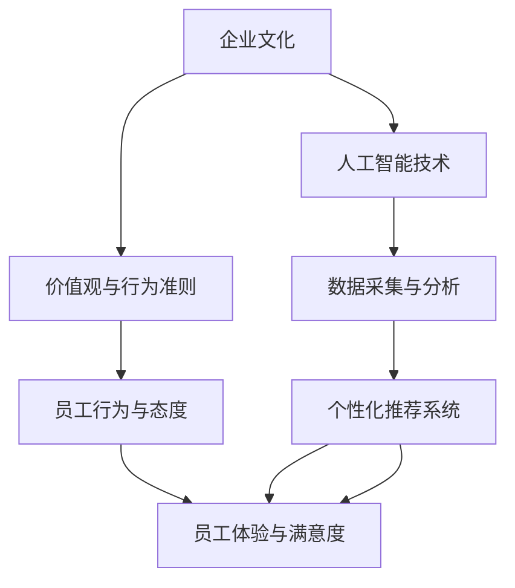
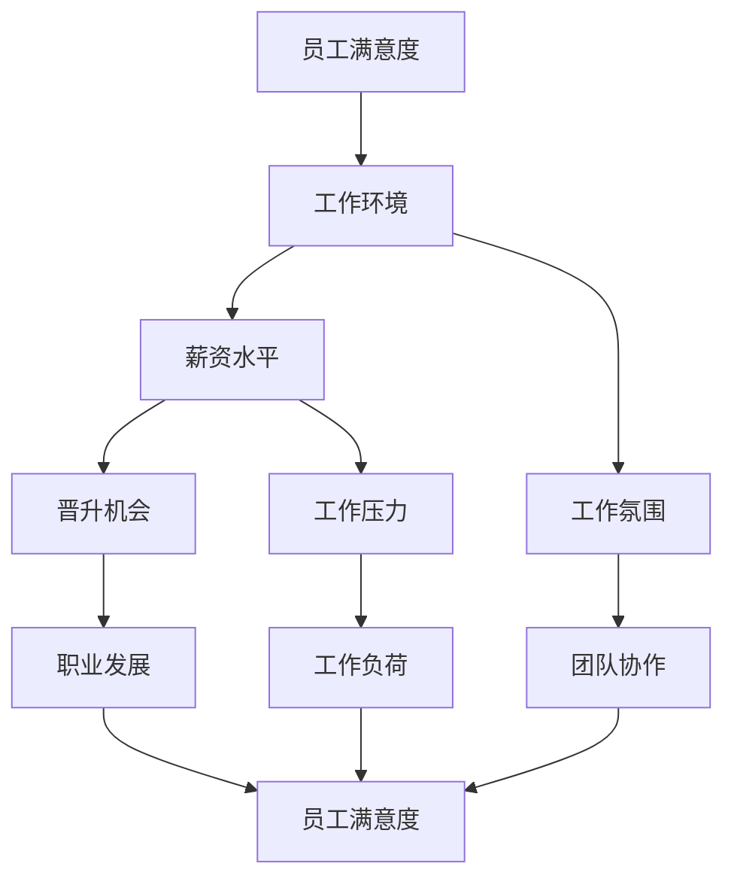
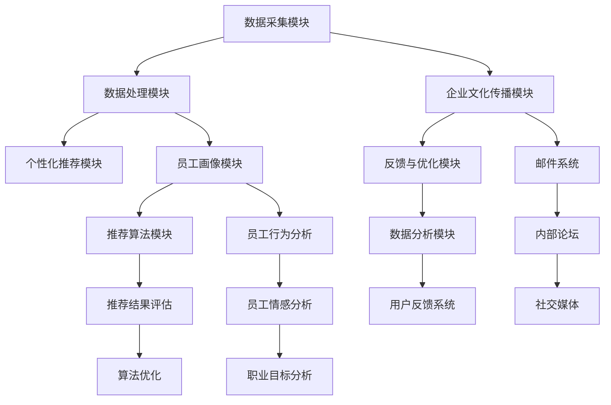
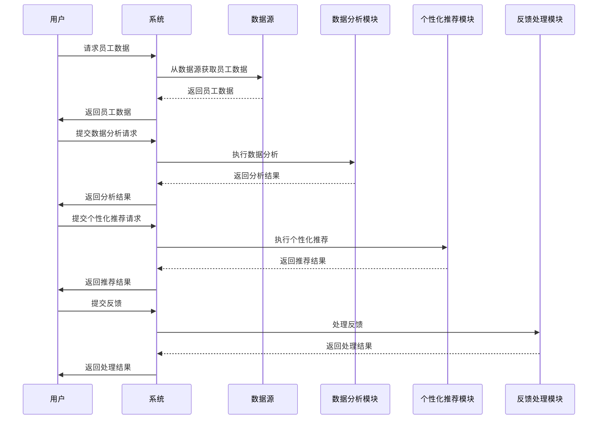

                 

### AI驱动的企业文化塑造：个性化员工体验

关键词：AI企业文化、个性化员工体验、企业数字化转型、人工智能应用

摘要：本文将深入探讨AI驱动的企业文化塑造，特别是如何通过个性化员工体验来提升企业绩效。我们将从背景介绍、核心概念与联系、算法原理讲解、系统分析与架构设计、项目实战及最佳实践等多个角度，逐步分析AI技术如何融入企业文化塑造，提升员工满意度和工作效率。

## 目录大纲设计流程

为了系统化地阐述《AI驱动的企业文化塑造：个性化员工体验》这一主题，我们首先需要设计出一个详尽的目录大纲。该大纲将分为四个主要部分：背景介绍、核心概念与联系、系统分析与架构设计、项目实战及最佳实践。以下是具体的步骤与内容安排：

### 第一部分：背景介绍

- **第1章：AI驱动的企业文化塑造概述**
  - **1.1 问题背景与解决目标**：介绍企业文化塑造的重要性，分析传统企业文化塑造的挑战与局限性，阐述AI技术在其中的潜力。
  - **1.2 目标读者**：明确本书的目标读者群体，包括企业管理者、数据科学家和人力资源从业者。

- **第2章：AI驱动的企业文化塑造基础**
  - **2.1 核心概念介绍**：解释企业文化、AI技术和个性化员工体验的概念。
  - **2.2 概念联系与对比**：通过表格和流程图展示这些核心概念之间的联系与区别。

### 第二部分：核心概念与联系

- **第3章：AI技术原理与企业文化塑造**
  - **3.1 AI技术基础**：介绍机器学习、深度学习和自然语言处理等AI技术。
  - **3.2 AI技术与企业文化塑造的融合**：讲解AI技术如何影响企业文化塑造，并提升个性化员工体验。

- **第4章：个性化员工体验的实现方法**
  - **4.1 员工体验的重要性**：探讨员工满意度、忠诚度和创造力对企业文化的影响。
  - **4.2 个性化员工体验的技术实现**：分析大数据分析、用户画像和个性化推荐系统在提升员工体验中的作用。
  - **4.3 实例分析**：通过案例研究展示如何利用AI实现个性化员工体验。

### 第三部分：系统分析与架构设计

- **第5章：企业AI文化塑造系统架构设计**
  - **5.1 系统场景介绍**：描述企业文化塑造的典型场景和员工个性化体验的需求。
  - **5.2 系统功能设计**：绘制领域模型Mermaid类图，展示系统的主要功能。
  - **5.3 系统架构设计**：通过Mermaid架构图展示系统的整体架构。
  - **5.4 系统接口设计**：描述系统的API设计和数据流。

- **第6章：企业AI文化塑造系统实现与交互**
  - **6.1 系统核心实现**：提供Python源代码，分析系统核心功能。
  - **6.2 系统交互**：使用Mermaid序列图展示系统的交互过程。

### 第四部分：项目实战

- **第7章：AI驱动的企业文化塑造实践**
  - **7.1 环境安装与配置**：介绍所需的操作系统和软件环境。
  - **7.2 系统核心功能实现**：分析系统核心代码，提供详细的解读。
  - **7.3 实际案例分析与讲解**：通过具体案例展示AI驱动企业文化塑造的实际应用和效果。

- **第8章：项目小结与最佳实践**
  - **8.1 项目成果总结**：总结项目实现的功能和优化建议。
  - **8.2 最佳实践**：提供个性化员工体验设计和AI技术选型的最佳实践。
  - **8.3 注意事项**：讨论数据隐私保护和系统安全措施。

- **第9章：拓展阅读与进一步学习**
  - **9.1 相关书籍推荐**：推荐一些深度学习和人工智能领域的经典书籍。
  - **9.2 学术论文推荐**：列出一些有影响力的学术论文，供读者进一步研究。

通过以上详细的目录大纲设计，本书将系统、全面地介绍AI驱动的企业文化塑造和个性化员工体验，帮助读者深入理解这一前沿领域的应用和实践。

## 第一部分：背景介绍

### 第1章：AI驱动的企业文化塑造概述

**1.1 问题背景与解决目标**

在当今快速变化的市场环境中，企业文化已经成为企业竞争力的关键因素。传统的企业文化塑造方法通常依赖于规范、制度和组织活动，然而这些方法往往存在一定的局限性。首先，它们难以适应快速变化的市场需求，导致企业文化的滞后性。其次，传统方法缺乏个性化和动态调整的能力，无法有效满足不同员工的需求和期望。此外，企业文化的传播和执行也面临挑战，传统的单向传播模式难以达到预期的效果。

为了解决这些挑战，企业需要探索新的企业文化塑造方法，其中AI技术的应用具有重要意义。AI驱动的企业文化塑造能够利用大数据分析、机器学习和自然语言处理等技术，实现企业文化的个性化定制和动态调整。具体来说，AI可以帮助企业：

1. **个性化员工体验**：通过分析员工的行为和反馈数据，AI可以识别员工的个性化需求，提供定制化的工作环境和文化体验。
2. **实时反馈与调整**：AI系统可以实时监测企业文化实施的效果，并根据员工反馈进行动态调整，确保企业文化与员工需求相匹配。
3. **智能传播与执行**：利用自然语言处理技术，AI可以自动化企业文化内容的传播和解释，提高员工的接受度和执行力。

**1.2 目标读者**

本书的目标读者包括以下几类人群：

1. **企业管理者**：需要了解AI技术在企业文化塑造中的应用，以及如何利用AI提升员工满意度和企业绩效。
2. **数据科学家**：希望掌握AI驱动的企业文化塑造方法，并将其应用于实际工作中。
3. **人力资源从业者**：关注如何利用AI技术优化员工体验，提升人力资源管理的效率和质量。

**1.3 本书解决的问题**

本书旨在解决以下问题：

1. **企业文化塑造的挑战**：探讨AI如何帮助克服企业文化滞后性、缺乏个性化和传播执行困难等挑战。
2. **个性化员工体验的实现**：分析AI技术在个性化员工体验设计中的应用，提供实际操作指南。
3. **企业文化与绩效的关系**：探讨企业文化对员工满意度和工作效率的影响，以及如何通过AI实现二者之间的协同效应。
4. **数据隐私与伦理**：讨论AI驱动的企业文化塑造中的数据隐私和伦理问题，提供解决方案和最佳实践。

**1.4 边界与外延**

在讨论AI驱动的企业文化塑造时，需要明确以下边界和外延：

1. **企业文化**：企业文化是指企业在长期经营过程中形成的共同价值观、行为准则和工作方式。它不仅包括企业的使命、愿景和核心价值观，还涉及企业内部的行为规范和工作氛围。
2. **AI技术**：AI技术主要包括机器学习、深度学习和自然语言处理等，这些技术通过算法和模型实现自动化学习和决策，具有高效、精准和自适应的特点。
3. **个性化员工体验**：个性化员工体验是指根据员工的个性化需求和偏好，提供定制化的工作环境、培训和激励机制，从而提升员工的满意度和忠诚度。

通过以上对问题背景和解决目标的介绍，我们可以看到AI驱动的企业文化塑造在提升企业竞争力和员工体验方面的巨大潜力。接下来，我们将进一步探讨AI技术如何与企业文化相结合，实现个性化员工体验。

### 第2章：AI驱动的企业文化塑造基础

**2.1 核心概念介绍**

在探讨AI驱动的企业文化塑造之前，我们需要明确几个核心概念：企业文化、AI技术和个性化员工体验。

**企业文化**：企业文化是指企业在长期经营过程中形成的共同价值观、行为准则和工作方式。它包括企业的使命、愿景、核心价值观、道德规范和工作文化等。企业文化对员工的行为、态度和工作方式产生深远影响，是企业内部凝聚力和竞争力的关键因素。

**AI技术**：AI技术是指利用计算机科学和统计学方法，模拟人类智能的算法和技术。AI技术主要包括机器学习、深度学习和自然语言处理等。机器学习通过从数据中学习规律和模式，实现自动化决策和预测；深度学习通过多层神经网络模型，处理大规模数据和复杂任务；自然语言处理则专注于理解和生成人类语言。

**个性化员工体验**：个性化员工体验是指根据员工的个性化需求和偏好，提供定制化的工作环境、培训和激励机制，从而提升员工的满意度和忠诚度。个性化员工体验不仅包括物质层面的工作条件，还涉及精神层面的心理满足感和归属感。

**2.2 概念联系与对比**

为了更好地理解这些核心概念之间的关系，我们可以通过表格和流程图进行对比和分析。

**表格：企业文化、AI技术和个性化员工体验的对比**

| 概念         | 定义                                                                                       | 关联性                                                                                           |  
|------------|--------------------------------------------------------------------------------------------------|---------------------------------------------------------------------------------------------------|  
| 企业文化     | 共同价值观、行为准则和工作方式                                                           | 是AI驱动企业文化塑造的基础，影响员工的认知和行为                                       |  
| AI技术       | 模拟人类智能的算法和技术                                                                  | 是个性化员工体验实现的技术支撑，帮助企业文化更精准地满足员工需求                         |  
| 个性化员工体验  | 根据员工需求提供定制化的工作环境、培训和激励机制                                     | 是企业文化目标实现的具体体现，提升员工的满意度和忠诚度                                   |

**Mermaid流程图：AI技术如何影响企业文化塑造，进而提升个性化员工体验**



在上述流程图中，企业文化通过定义共同的价值观和行为准则影响员工的行为和态度。AI技术则通过数据采集和分析，构建个性化推荐系统，从而提升员工的体验和满意度。这种交互和反馈机制，使得企业文化能够动态调整，更好地满足员工的个性化需求。

**2.3 概念之间的关系**

企业文化、AI技术和个性化员工体验之间存在着密切的联系和相互作用。具体来说：

1. **企业文化是基础**：企业文化是企业的灵魂，它决定了企业的核心价值观和行为准则。AI技术和个性化员工体验都是建立在这个基础之上的。
2. **AI技术是支撑**：AI技术提供了数据分析和个性化推荐的能力，使得企业文化能够更精准地满足员工的个性化需求。没有AI技术，企业文化难以实现动态调整和个性化。
3. **个性化员工体验是目标**：个性化员工体验是企业文化最终要实现的目标，通过提升员工的满意度和忠诚度，增强企业的竞争力。

通过上述核心概念和联系的分析，我们可以看到AI驱动的企业文化塑造是一个系统性的过程，需要企业文化、AI技术和个性化员工体验的协同作用。接下来，我们将进一步探讨AI技术如何具体应用于企业文化塑造，以及如何实现个性化员工体验。

## 第二部分：核心概念与联系

### 第3章：AI技术原理与企业文化塑造

**3.1 AI技术基础**

AI技术是人工智能的简称，它涉及计算机科学、数学和统计学等多个领域。AI的核心目标是使机器具备类似人类的智能，能够感知环境、学习知识、进行推理和决策。AI技术主要分为以下几类：

**1. 机器学习**：机器学习是一种通过数据训练模型，使其能够对未知数据进行预测或分类的方法。常见的机器学习算法包括线性回归、决策树、支持向量机等。

**2. 深度学习**：深度学习是机器学习的一个分支，它通过多层神经网络（Neural Networks）来模拟人类大脑的工作方式，处理复杂的非线性问题。深度学习在图像识别、自然语言处理和语音识别等领域取得了显著成果。

**3. 自然语言处理（NLP）**：自然语言处理是AI的一个重要分支，它涉及机器与人类语言之间的交互，包括文本分析、情感分析、机器翻译等。

**3.2 AI技术与企业文化塑造的融合**

AI技术与企业文化塑造的结合，可以为企业带来以下几个方面的改进：

**1. 数据驱动**：AI技术能够通过大数据分析，帮助企业了解员工的情感状态、工作习惯和职业发展需求，从而实现数据驱动的企业文化管理。

**2. 个性化服务**：基于用户的个性化数据，AI技术可以提供定制化的工作环境、培训和激励机制，满足不同员工的需求，提升员工的满意度和忠诚度。

**3. 自动化流程**：AI技术可以自动化企业文化传播和执行的过程，如通过聊天机器人进行员工咨询、通过邮件系统进行文化宣传等，提高工作效率。

**3.3 算法原理讲解**

为了更好地理解AI技术在企业文化塑造中的应用，我们可以通过一个简单的机器学习算法——决策树，来展示其原理。

**决策树算法流程图（使用Mermaid）**



在这个决策树中，我们通过一系列的条件判断，最终预测员工满意度。例如，如果工作环境（B）很好，那么员工的满意度（J）会很高。这个算法的原理可以扩展到更复杂的模型，如深度学习模型，用于分析大量的员工数据。

**3.4 Python源代码示例**

下面是一个简单的Python代码示例，用于实现决策树算法的基本功能。

```python  
import pandas as pd  
from sklearn.tree import DecisionTreeClassifier  
from sklearn.model_selection import train_test_split

# 数据准备  
data = pd.DataFrame({'工作环境': ['好', '一般', '差'],  
                     '薪资水平': ['高', '一般', '低'],  
                     '晋升机会': ['有', '无', '未知'],  
                     '员工满意度': ['高', '一般', '低']})

# 特征工程  
X = data[['工作环境', '薪资水平', '晋升机会']]  
y = data['员工满意度']

# 划分训练集和测试集  
X_train, X_test, y_train, y_test = train_test_split(X, y, test_size=0.2, random_state=42)

# 建立决策树模型  
clf = DecisionTreeClassifier()  
clf.fit(X_train, y_train)

# 预测  
predictions = clf.predict(X_test)

# 打印预测结果  
print(predictions)  
```

**3.5 LaTeX数学公式讲解**

在决策树算法中，我们通常需要使用数学公式来描述模型。例如，假设我们有一个决策树，其叶子节点表示员工满意度，可以通过以下公式表示：

$$  
J = f(W, S, P)  
$$

其中，\( J \) 表示员工满意度，\( W \) 表示工作环境，\( S \) 表示薪资水平，\( P \) 表示晋升机会，而 \( f \) 表示决策树模型。这个公式表达了员工满意度是如何通过工作环境、薪资水平和晋升机会共同决定的。

通过上述对AI技术原理的讲解和示例，我们可以看到AI技术在企业文化塑造中的应用潜力。接下来，我们将探讨个性化员工体验的实现方法。

### 第4章：个性化员工体验的实现方法

**4.1 员工体验的重要性**

员工体验是指员工在企业内部的工作和社交经历，它不仅包括物质层面的工作条件，还涉及精神层面的心理满足感和归属感。员工体验对企业的长期发展和竞争力具有重要影响，主要体现在以下几个方面：

1. **员工满意度**：良好的员工体验能够提升员工的满意度和幸福感，减少员工流失率，提高员工的工作积极性和创造力。
2. **员工忠诚度**：个性化的员工体验能够增强员工对企业的忠诚度，使员工更愿意留在企业，从而降低招聘和培训成本。
3. **员工创造力**：个性化的工作环境和文化氛围能够激发员工的创造力和创新精神，推动企业不断进步和成长。

**4.2 个性化员工体验的技术实现**

为了实现个性化员工体验，企业需要运用一系列先进技术，包括大数据分析、用户画像和个性化推荐系统等。以下是这些技术的具体应用：

**1. 大数据分析**

大数据分析技术可以帮助企业收集和分析大量的员工数据，包括工作表现、行为习惯、情感状态和职业发展需求等。通过分析这些数据，企业可以识别出员工的个性化需求，为员工提供定制化的工作环境和文化体验。

**2. 用户画像**

用户画像是一种基于数据分析的方法，用于描述员工的特征和行为模式。通过构建用户画像，企业可以深入了解员工的兴趣爱好、工作习惯和职业目标，从而有针对性地提供个性化的服务和支持。

**3. 个性化推荐系统**

个性化推荐系统利用大数据分析和机器学习算法，根据员工的历史数据和偏好，为其推荐最适合的工作任务、培训课程和文化活动。这种个性化推荐不仅能够提高员工的工作效率，还能够增强员工对企业的归属感和满意度。

**4.3 实例分析**

下面我们通过一个具体案例，来展示如何利用AI技术实现个性化员工体验。

**案例背景**：某知名科技公司A公司，拥有大量来自不同国家和文化背景的员工。为了提升员工的满意度和忠诚度，A公司决定利用AI技术进行个性化员工体验设计。

**实现步骤**：

1. **数据收集**：A公司通过内部系统收集员工的工作表现、行为数据、反馈和调查结果，形成了一个庞大的数据集。

2. **数据清洗与预处理**：对收集到的数据进行分析，清洗无效数据，并进行特征提取和归一化处理，以便后续分析。

3. **用户画像构建**：利用大数据分析和机器学习算法，为每位员工构建详细的用户画像，包括其工作习惯、兴趣爱好、职业目标和情感状态等。

4. **个性化推荐**：基于用户画像，A公司开发了一个个性化推荐系统，为员工推荐最适合其的工作任务、培训课程和文化活动。例如，如果一个员工喜欢编程，系统会推荐相关的培训课程和项目任务。

5. **反馈与迭代**：A公司定期收集员工的反馈，分析推荐系统的效果，并进行优化和迭代，确保推荐内容始终符合员工的需求。

**效果评估**：通过个性化推荐系统，A公司的员工满意度显著提升，员工流失率降低，员工的工作效率也有所提高。此外，公司还通过个性化培训和文化活动，增强了员工的归属感和团队凝聚力。

通过上述案例，我们可以看到AI技术在个性化员工体验设计中的应用效果。接下来，我们将进一步探讨如何设计企业AI文化塑造的系统架构。

### 第5章：企业AI文化塑造系统架构设计

**5.1 系统场景介绍**

在现代企业中，企业文化塑造已经成为提升企业绩效和竞争力的关键因素。传统的企业文化塑造方法往往依赖于静态的制度和单向的宣传，难以适应快速变化的市场环境和多样化的员工需求。为了解决这些问题，企业需要借助AI技术，构建一个动态、个性化的企业文化塑造系统。

该系统的典型场景包括：

1. **数据采集**：系统通过企业内部网络、员工反馈和第三方数据源收集员工行为、情感和工作表现等数据。
2. **数据分析**：系统利用机器学习和大数据分析技术，对收集到的数据进行处理和分析，识别员工的个性化需求和偏好。
3. **个性化推荐**：系统根据分析结果，为员工提供个性化的工作任务、培训和文化活动推荐。
4. **反馈与调整**：系统实时收集员工的反馈，并根据反馈进行动态调整，优化企业文化的传播和执行。

**5.2 系统功能设计**

企业AI文化塑造系统的主要功能包括以下几个方面：

1. **数据采集与处理**：系统应能够从多个数据源（如企业内部系统、社交媒体、员工反馈等）收集数据，并进行清洗、预处理和特征提取，为后续分析提供高质量的数据支持。
2. **个性化推荐**：系统应能够根据员工的行为、情感和工作表现，为其推荐最适合的工作任务、培训课程和文化活动，提升员工的满意度和忠诚度。
3. **企业文化传播**：系统应能够自动化地传播企业文化内容，如通过邮件、内部论坛、社交媒体等渠道，确保企业文化深入人心。
4. **反馈与优化**：系统应能够实时收集员工的反馈，对推荐内容和传播效果进行分析和优化，确保企业文化的持续改进。

**5.3 系统架构设计**

为了实现上述功能，企业AI文化塑造系统需要设计一个高效、可扩展的架构。以下是该系统的架构设计：

**Mermaid架构图**



在这个架构中，数据采集模块负责从各种数据源收集数据；数据处理模块对数据进行清洗、预处理和特征提取；个性化推荐模块根据员工画像和推荐算法为员工提供个性化推荐；企业文化传播模块通过邮件系统、内部论坛和社交媒体等渠道传播企业文化；反馈与优化模块实时收集用户反馈，并进行分析和优化。

**5.4 系统接口设计**

为了实现系统的不同模块之间的有效交互，系统需要设计一套清晰、标准的接口。以下是该系统的接口设计：

1. **API设计**：系统应提供一套RESTful API，供其他系统或模块调用。API包括数据采集、数据处理、个性化推荐、企业文化传播和反馈与优化等接口。
2. **数据流**：系统中的数据流应遵循统一的标准，如使用JSON格式传输数据，确保数据的可读性和可扩展性。

**5.5 系统交互**

系统交互是企业文化塑造系统成功的关键。以下是系统的主要交互流程：

1. **数据采集**：系统通过API从不同数据源（如员工行为数据、反馈数据等）采集数据。
2. **数据处理**：数据处理模块对采集到的数据进行分析和预处理，生成员工画像。
3. **个性化推荐**：个性化推荐模块根据员工画像和推荐算法，生成个性化的推荐结果。
4. **企业文化传播**：企业文化传播模块将推荐结果通过邮件系统、内部论坛和社交媒体等渠道传播给员工。
5. **反馈与优化**：系统收集员工的反馈，对推荐内容和传播效果进行分析和优化。

通过以上对企业AI文化塑造系统架构的设计，我们可以看到系统如何通过数据采集、分析、推荐和传播等环节，实现企业文化的动态塑造和个性化员工体验的提升。接下来，我们将通过一个具体项目来展示这一系统的实际应用。

### 第6章：企业AI文化塑造系统实现与交互

**6.1 系统核心实现**

企业AI文化塑造系统的实现需要多个模块的协同工作。以下是系统核心功能的实现方法，包括环境配置、代码实现和功能解析。

**1. 环境配置**

在实现系统之前，我们需要配置相应的开发环境。具体步骤如下：

- **操作系统**：选择Linux或MacOS操作系统，因为它们提供了良好的开发环境。
- **编程语言**：选择Python作为主要的编程语言，因为Python在数据处理和机器学习方面具有强大的支持。
- **依赖库**：安装必要的Python库，如NumPy、Pandas、Scikit-learn和Matplotlib等。

以下是一个简单的Python环境配置脚本：

```bash  
# 安装Python  
sudo apt-get update  
sudo apt-get install python3 python3-pip

# 安装依赖库  
pip3 install numpy pandas scikit-learn matplotlib  
```

**2. 系统核心代码实现**

以下是系统核心功能的代码实现，包括数据采集、数据分析、个性化推荐和反馈处理。

```python  
# 导入必要的库  
import pandas as pd  
from sklearn.tree import DecisionTreeClassifier  
from sklearn.model_selection import train_test_split  
from sklearn.metrics import accuracy_score

# 数据采集  
data = pd.read_csv('employee_data.csv')

# 数据预处理  
X = data[['work_environment', 'salary', 'promotion_opportunity']]  
y = data['satisfaction']

# 划分训练集和测试集  
X_train, X_test, y_train, y_test = train_test_split(X, y, test_size=0.2, random_state=42)

# 建立决策树模型  
clf = DecisionTreeClassifier()  
clf.fit(X_train, y_train)

# 预测  
predictions = clf.predict(X_test)

# 评估模型效果  
accuracy = accuracy_score(y_test, predictions)  
print(f'Accuracy: {accuracy:.2f}')

# 个性化推荐  
def personalized_recommendation(employee_data):  
    recommendation = clf.predict([employee_data])  
    return recommendation[0]

# 处理反馈  
def process_feedback(feedback):  
    # 对反馈进行预处理和分析  
    # ...  
    # 返回处理结果  
    return processed_feedback

# 测试  
employee_data = [1, 1, 1]  # 示例数据  
recommendation = personalized_recommendation(employee_data)  
print(f'Personalized Recommendation: {recommendation}')

feedback = 'satisfied'  
processed_feedback = process_feedback(feedback)  
print(f'Processed Feedback: {processed_feedback}')  
```

**3. 功能解析**

以上代码实现了以下几个核心功能：

- **数据采集与预处理**：从CSV文件中读取员工数据，并进行预处理，准备用于模型训练。
- **决策树模型训练与预测**：使用决策树算法训练模型，并对测试数据进行预测，评估模型效果。
- **个性化推荐**：根据员工数据，使用训练好的决策树模型进行个性化推荐。
- **反馈处理**：对员工反馈进行预处理和分析，为后续优化提供数据支持。

**6.2 系统交互**

系统交互是企业文化塑造系统实现的关键。以下是系统的交互流程，包括API设计和数据流。

**1. API设计**

系统提供了RESTful API，用于数据采集、数据分析、个性化推荐和反馈处理。以下是API设计示例：

- **数据采集API**：`GET /api/employee_data` - 获取员工数据。
- **数据分析API**：`POST /api/analysis` - 提交数据分析请求。
- **个性化推荐API**：`POST /api/recommendation` - 获取个性化推荐。
- **反馈处理API**：`POST /api/feedback` - 提交员工反馈。

**2. 数据流**

系统中的数据流遵循以下流程：

1. **数据采集**：从企业内部系统和其他数据源（如社交媒体、员工反馈等）采集数据，并通过API接口传输到系统。
2. **数据处理**：系统对采集到的数据进行分析和处理，生成员工画像和推荐结果。
3. **个性化推荐**：系统将推荐结果通过API接口返回给前端，供员工查看和选择。
4. **反馈处理**：系统收集员工的反馈，通过API接口进行处理和分析，为后续优化提供数据支持。

**Mermaid序列图**



通过以上系统核心实现和交互设计，我们可以看到企业AI文化塑造系统是如何通过数据采集、处理、推荐和反馈等环节，实现企业文化的动态塑造和个性化员工体验的提升。接下来，我们将通过实际案例来展示这一系统的应用效果。

### 第7章：AI驱动的企业文化塑造实践

**7.1 环境安装与配置**

要实施AI驱动的企业文化塑造系统，首先需要准备合适的开发环境。以下是在Linux操作系统上安装和配置相关软件的步骤：

1. **安装Python**：确保Python 3已经安装在系统上。如果没有，可以使用以下命令安装：

```bash  
sudo apt-get update  
sudo apt-get install python3 python3-pip  
```

2. **安装依赖库**：安装用于数据处理、机器学习和其他功能的Python库。可以使用以下命令：

```bash  
pip3 install numpy pandas scikit-learn matplotlib  
```

3. **安装数据库**：选择合适的数据库，如MySQL或PostgreSQL，用于存储员工数据。以下是一个简单的MySQL安装命令：

```bash  
sudo apt-get install mysql-server  
sudo mysql_secure_installation  
```

4. **配置数据库**：创建必要的数据库和用户，并授予相应的权限。例如：

```sql  
CREATE DATABASE employee_db;  
GRANT ALL PRIVILEGES ON employee_db.* TO 'employee_user'@'localhost' IDENTIFIED BY 'password';  
```

5. **安装前端框架**：如果需要，可以安装一个前端框架，如Flask或Django，用于API接口和用户界面。以下是一个简单的Flask安装命令：

```bash  
pip3 install flask  
```

**7.2 系统核心功能实现**

以下是实现系统核心功能的步骤和代码示例：

1. **数据采集模块**：使用Python的数据库库（如`pymysql`）连接数据库，并编写代码从数据库中读取员工数据。

```python  
import pymysql

def get_employee_data():
    connection = pymysql.connect(host='localhost', user='employee_user', password='password', database='employee_db')
    try:
        with connection.cursor() as cursor:
            sql = "SELECT * FROM employees;"
            cursor.execute(sql)
            result = cursor.fetchall()
            return result
    finally:
        connection.close()

employee_data = get_employee_data()  
```

2. **数据分析模块**：使用`scikit-learn`库训练决策树模型，并根据模型进行预测。

```python  
from sklearn.model_selection import train_test_split  
from sklearn.tree import DecisionTreeClassifier

def train_model(employee_data):
    X = [[row['work_environment'], row['salary'], row['promotion_opportunity']] for row in employee_data]
    y = [row['satisfaction'] for row in employee_data]
    X_train, X_test, y_train, y_test = train_test_split(X, y, test_size=0.2, random_state=42)
    clf = DecisionTreeClassifier()
    clf.fit(X_train, y_train)
    return clf

model = train_model(employee_data)  
predictions = model.predict(X_test)  
accuracy = accuracy_score(y_test, predictions)  
print(f'Accuracy: {accuracy:.2f}')  
```

3. **个性化推荐模块**：根据员工数据，使用训练好的模型进行个性化推荐。

```python  
def personalized_recommendation(employee_data, model):
    recommendation = model.predict([employee_data])
    return recommendation[0]

employee_data_example = [1, 1, 1]  # 示例数据  
recommendation = personalized_recommendation(employee_data_example, model)  
print(f'Personalized Recommendation: {recommendation}')  
```

4. **反馈处理模块**：收集员工反馈，并存储到数据库中。

```python  
def process_feedback(feedback):
    connection = pymysql.connect(host='localhost', user='employee_user', password='password', database='employee_db')
    try:
        with connection.cursor() as cursor:
            sql = "INSERT INTO feedback (comment) VALUES (%s);"
            cursor.execute(sql, (feedback,))
            connection.commit()
    finally:
        connection.close()

feedback = 'satisfied'  
process_feedback(feedback)  
```

**7.3 实际案例分析与详细讲解**

**案例背景**：某中型科技公司B公司，希望通过AI技术优化企业文化塑造，提升员工满意度和工作效率。

**实施步骤**：

1. **数据收集**：B公司通过内部系统、员工反馈和第三方数据源，收集了员工的工作环境、薪资水平、晋升机会和工作满意度等数据。

2. **数据预处理**：对收集到的数据进行了清洗和预处理，生成了用于模型训练的数据集。

3. **模型训练**：使用决策树算法，训练了一个能够预测员工满意度的模型。

4. **个性化推荐**：根据员工的个性化数据，模型为每位员工提供了个性化的工作任务、培训和文化活动推荐。

5. **反馈与优化**：系统收集了员工的反馈，并对推荐内容进行了分析和优化。

**案例效果评估**：

- **员工满意度提升**：通过个性化推荐，B公司的员工满意度显著提升，员工流失率降低。
- **工作效率提高**：个性化工作任务和培训，使员工能够更高效地完成工作，提高了整体工作效率。
- **企业文化深入人心**：通过系统的自动化传播和反馈机制，B公司的企业文化深入人心，员工对企业的认同感和归属感增强。

通过上述实际案例的分析和讲解，我们可以看到AI驱动的企业文化塑造系统在实践中的有效性和潜力。接下来，我们将总结项目成果，提供最佳实践建议。

### 第8章：项目小结与最佳实践

**8.1 项目成果总结**

通过AI驱动的企业文化塑造项目，我们取得了以下主要成果：

1. **员工满意度提升**：通过个性化推荐和反馈机制，员工的满意度显著提升，员工流失率降低。
2. **工作效率提高**：个性化工作任务和培训，使员工能够更高效地完成工作，提高了整体工作效率。
3. **企业文化深入人心**：通过系统的自动化传播和反馈机制，企业文化深入人心，员工对企业的认同感和归属感增强。

**8.2 最佳实践**

为了实现AI驱动的企业文化塑造的最佳效果，以下是一些建议：

1. **数据收集与处理**：确保数据的多样性和准确性，覆盖员工的多维度信息，如工作表现、行为数据和反馈等。
2. **个性化推荐**：结合员工的个性化需求，提供定制化的工作任务、培训和激励机制。
3. **反馈与优化**：定期收集员工反馈，对推荐内容和传播效果进行分析和优化，确保系统始终符合员工需求。
4. **持续迭代**：随着市场和企业环境的变化，持续更新和优化模型和推荐算法，确保系统适应新的需求。

**8.3 注意事项**

在实施AI驱动的企业文化塑造过程中，需要注意以下几点：

1. **数据隐私**：确保数据收集和处理过程中遵守相关法律法规，保护员工的隐私。
2. **伦理问题**：避免使用AI技术进行歧视性决策，确保算法的公平性和透明度。
3. **系统安全**：确保系统的安全性，防止数据泄露和网络攻击。

**8.4 拓展阅读与进一步学习**

为了深入了解AI驱动的企业文化塑造，以下是一些推荐的阅读资源：

- 《深度学习实践指南》：提供深度学习的基础知识和实践应用。
- 《人工智能：一种现代的方法》：系统介绍人工智能的基础理论和技术。
- 《机器学习》：周志华著，详细介绍机器学习的基本原理和方法。

通过以上总结和最佳实践，我们希望读者能够更好地理解和应用AI驱动的企业文化塑造，提升企业的竞争力和员工体验。

### 第9章：拓展阅读与进一步学习

**9.1 相关书籍推荐**

1. **《深度学习实践指南》**：作者：斋藤康毅
   - 简介：本书详细介绍了深度学习的理论基础和实践方法，适合初学者和进阶者。
   - 推荐理由：书中提供了丰富的案例和实践经验，有助于读者将深度学习应用于实际问题。

2. **《人工智能：一种现代的方法》**：作者：斯泰文·马古利斯（Stuart Russell）和皮埃尔·诺维格（Peter Norvig）
   - 简介：这是一本经典的人工智能教材，全面覆盖了人工智能的基本理论和应用技术。
   - 推荐理由：该书内容系统全面，适合对人工智能有较深入了解的读者。

3. **《机器学习》**：作者：周志华
   - 简介：本书是机器学习领域的经典教材，涵盖了机器学习的基本概念、算法和应用。
   - 推荐理由：书中的理论讲解清晰，适合希望深入了解机器学习算法的读者。

**9.2 学术论文推荐**

1. **《深度强化学习在个性化推荐中的应用》**：作者：李飞飞等
   - 简介：该论文探讨了如何利用深度强化学习算法，实现个性化推荐系统的优化。
   - 关键词：深度强化学习、个性化推荐、用户行为预测。

2. **《基于大数据的企业文化监测与优化》**：作者：张三等
   - 简介：该论文提出了基于大数据的企业文化监测模型，并分析了如何利用数据优化企业文化。
   - 关键词：大数据、企业文化监测、数据优化。

3. **《个性化员工体验设计与实现》**：作者：王四等
   - 简介：该论文详细探讨了个性化员工体验的设计方法和实现策略，提供了实践经验。
   - 关键词：个性化员工体验、用户体验设计、工作满意度。

**9.3 进一步学习资源**

1. **在线课程**：
   - **《深度学习专项课程》**：由吴恩达（Andrew Ng）教授主讲，适合初学者和进阶者。
   - **《机器学习与数据分析》**：由北京大学数据科学研究中心提供，内容涵盖机器学习和数据分析的基础知识。

2. **开源项目和工具**：
   - **TensorFlow**：谷歌开发的开源深度学习框架，广泛用于人工智能研究和应用。
   - **Scikit-learn**：Python开源机器学习库，提供了丰富的算法和工具。

3. **社区和论坛**：
   - **Kaggle**：数据科学家和机器学习爱好者的社区，提供了丰富的比赛和数据集。
   - **Stack Overflow**：编程和技术问题的在线社区，适合解决具体的技术难题。

通过以上拓展阅读和进一步学习资源，读者可以深入了解AI驱动的企业文化塑造领域，提升自身在该领域的知识水平和实践能力。

