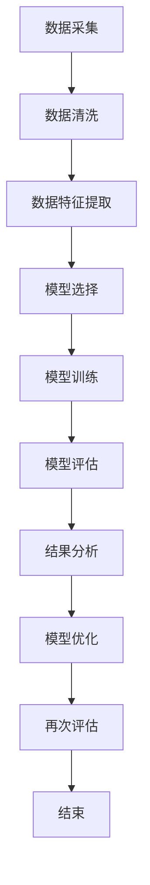
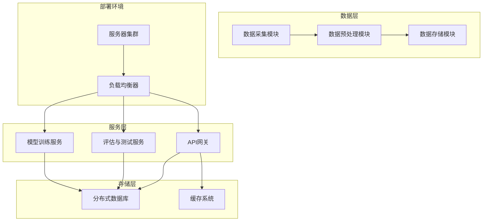

                 

### 1.1.1 企业文化评估的重要性

企业文化是企业发展的灵魂，它不仅决定了企业的核心价值观和行为规范，还影响着员工的归属感和工作动力。一个健康、积极的企业文化能够激发员工的创造力，提高工作效率，增强团队合作，从而推动企业的持续发展。因此，对企业文化进行科学、系统的评估，已经成为企业管理中的重要一环。

首先，企业文化评估有助于企业了解自身文化现状。通过评估，企业可以识别出文化中的优势与短板，明确需要改进的方向。这种自我反省的过程，有助于企业建立更加符合时代发展需求的组织文化。

其次，企业文化评估对于企业的战略规划具有重要意义。企业的发展离不开战略的指引，而战略的制定需要建立在真实、准确的文化基础之上。通过对企业文化的量化评估，企业能够更好地把握文化现状，为战略制定提供有力支持。

再次，企业文化评估有助于提升企业的核心竞争力。在一个强大的企业文化支撑下，企业的各项业务能够更加协同、高效地运作，从而提升整体竞争力。例如，谷歌（Google）以其独特的创新文化著称，这种文化不仅吸引了全球顶尖人才，还推动了公司不断地技术创新和业务扩张。

此外，企业文化评估还能帮助企业吸引和留住人才。在当前的人才竞争激烈的市场环境中，拥有良好企业文化的企业更容易吸引优秀人才，并且留住他们。一个积极、健康的企业文化能够激发员工的工作热情，提高员工的工作满意度和忠诚度。

最后，企业文化评估对于企业的可持续发展也具有重要意义。企业文化是企业的精神财富，它能够激励员工不断追求卓越，推动企业持续成长。通过评估，企业能够及时发现和解决文化问题，确保企业文化的健康发展，从而为企业可持续发展提供坚实保障。

总之，企业文化评估不仅有助于企业了解自身文化现状，提升核心竞争力，吸引和留住人才，还有助于企业的战略规划和可持续发展。因此，对企业文化进行科学、系统的评估，是企业管理中不可或缺的一环。这不仅能够为企业提供宝贵的参考信息，还能够帮助企业在激烈的市场竞争中立于不败之地。在接下来的内容中，我们将进一步探讨AI如何驱动企业文化评估的过程。### 1.1.2 AI驱动企业文化评估的背景

随着人工智能（AI）技术的飞速发展，越来越多的企业开始意识到，AI不仅可以提升生产效率和优化业务流程，还可以在企业文化评估中发挥重要作用。AI驱动的企业文化评估，利用先进的机器学习算法和大数据分析技术，为企业提供了一种全新的、科学的文化诊断和管理工具。

首先，从技术层面来看，AI的迅猛发展为我们提供了强大的数据处理和分析能力。在企业文化评估中，AI能够处理来自不同来源、不同格式的海量数据，如员工调查问卷、社交媒体评论、组织行为数据等。通过数据挖掘和模式识别技术，AI可以提取出隐藏在数据背后的文化特征，帮助企业管理者更全面、深入地了解企业文化的现状。

其次，从应用层面来看，AI驱动的企业文化评估具有以下几大优势：

1. **客观性与准确性**：传统的企业文化评估往往依赖于主观判断和问卷调查，容易受到个人偏见和情绪的影响。而AI算法能够基于大量数据进行分析，提供更加客观、准确的评估结果。

2. **实时性与动态性**：企业文化是一个动态变化的过程，传统的评估方法难以实时反映文化的变化。AI驱动的评估系统可以实时收集和分析数据，动态监测企业文化的发展趋势，为企业提供及时、有效的决策支持。

3. **自动化与高效性**：AI算法能够自动处理大量数据，快速生成评估报告，大大提高了评估的效率。此外，AI还可以根据企业的需求，自动调整评估模型，实现定制化的企业文化管理。

4. **个性化与针对性**：AI可以根据企业的特点和需求，提供个性化的企业文化评估方案。例如，对于一家注重创新的企业，AI可以侧重评估创新文化的表现；对于一家强调团队合作的企业，AI可以侧重评估团队协作的情况。

AI驱动的企业文化评估不仅提升了评估的客观性和准确性，还为企业的文化管理带来了新的可能性。例如，通过AI分析员工行为数据，企业可以识别出文化中的问题点，并提出针对性的改进措施；通过分析社交媒体上的评论和反馈，企业可以了解员工对企业文化的真实感受，从而更好地调整和优化企业文化。

总之，随着AI技术的不断进步，AI驱动的企业文化评估已经成为企业管理中的重要工具。它不仅为企业提供了科学、系统的文化诊断手段，还为企业文化的持续优化和健康发展提供了有力支持。在接下来的章节中，我们将深入探讨AI驱动的企业文化评估的核心概念和方法论。### 1.1.3 本书的目标与结构

本书旨在通过系统性地介绍AI驱动的企业文化评估，帮助读者了解这一新兴领域的核心概念、技术原理和实际应用。具体目标如下：

1. **理解企业文化评估的重要性**：通过阐述企业文化对企业发展的重要性，以及AI在企业文化评估中的应用背景，使读者认识到AI驱动的企业文化评估的必要性和潜力。

2. **掌握核心概念和方法**：介绍组织文化、AI驱动的企业文化评估以及量化指标等核心概念，通过详细解释和实例分析，帮助读者全面理解这些概念，并掌握相关的方法和工具。

3. **学习算法原理与应用**：深入讲解用于企业文化评估的AI算法原理，包括数据预处理、特征提取、模型训练等，并通过Python代码和LaTeX数学公式详细阐述，使读者能够将理论应用于实践。

4. **了解系统设计与实现**：介绍企业文化评估系统的功能设计、架构设计、接口设计以及系统交互流程，通过Mermaid流程图和类图，帮助读者构建系统的整体视图。

5. **实践案例分析**：提供实际案例，展示如何使用AI驱动企业文化评估，包括环境安装、核心实现、代码解读、案例分析等，帮助读者将理论知识转化为实际操作能力。

6. **总结最佳实践与拓展**：总结实践经验，提出注意事项，推荐拓展阅读，为读者提供继续深入学习和应用的方向。

本书的结构如下：

1. **引言**：介绍企业文化评估的重要性和AI驱动的企业文化评估的背景。

2. **核心概念**：定义组织文化、AI驱动的企业文化评估和量化指标，并详细解释其属性特征。

3. **算法原理讲解**：讲解企业文化评估的算法原理，包括数据预处理、特征提取、模型训练等。

4. **系统分析与架构设计**：介绍企业文化评估系统的功能设计、架构设计、接口设计以及系统交互流程。

5. **项目实战**：提供一个实际案例，展示如何使用AI驱动企业文化评估。

6. **最佳实践与拓展**：总结最佳实践经验，提出注意事项，并推荐拓展阅读。

通过本书的阅读和学习，读者将能够全面了解AI驱动的企业文化评估，掌握相关技术和方法，并将其应用于实际工作中，从而为企业文化的建设和管理提供有力支持。### 1.2 核心概念

在探讨AI驱动的企业文化评估之前，我们需要明确几个核心概念：组织文化、AI驱动的企业文化评估以及量化指标。这些概念是理解企业文化评估的基础，也是本章节的主要内容。

#### 1.2.1 组织文化

组织文化是指企业在长期发展过程中形成的、为多数员工所认同并遵守的价值观、信念、行为规范和工作方式。它是企业的精神内核，不仅体现在员工的行为和言语中，也渗透在企业的战略决策、组织结构、管理制度等方面。

**概念定义**：组织文化是企业内部成员共同认同和遵循的一系列信念、价值观和行为规范。

**属性特征**：

- **价值观**：组织文化的核心，是企业发展的精神支柱。例如，谷歌的“不作恶”和微软的“客户至上”。
- **行为规范**：员工在组织中的行为准则，如礼貌待人、高效执行等。
- **工作方式**：组织的工作流程、沟通方式、团队协作模式等。

**对比表格**：

| 属性特征     | 组织文化                    | 传统企业文化                    |
|--------------|-----------------------------|--------------------------------|
| 核心价值观   | 企业长期发展的精神支柱       | 企业创始人或领导者的个人信念     |
| 行为规范     | 员工共同遵守的行为准则       | 单一领导者的行为标准             |
| 工作方式     | 团队协作、信息共享           | 独立作业、信息封闭               |

#### 1.2.2 AI驱动的企业文化评估

AI驱动的企业文化评估是指利用人工智能技术，对企业文化进行系统性评估和分析，从而识别出企业的文化优势与短板，提供改进建议。这一过程通常涉及数据收集、预处理、特征提取、模型训练和评估等步骤。

**概念定义**：AI驱动的企业文化评估是利用人工智能技术，对组织文化进行量化评估，提供数据支持和决策依据。

**属性特征**：

- **数据驱动的分析**：基于大量企业内外部数据，利用机器学习和数据挖掘技术，进行深入分析。
- **客观性**：减少人为偏见，提供客观、科学的评估结果。
- **实时性**：实时收集和分析数据，动态反映企业文化变化。
- **个性化**：根据企业特点，提供定制化的评估方案。

**对比表格**：

| 属性特征     | AI驱动的企业文化评估         | 传统企业文化评估                |
|--------------|------------------------------|--------------------------------|
| 数据驱动     | 基于海量数据进行分析         | 依赖问卷调查和主观判断           |
| 客观性       | 减少人为偏见，提供客观结果   | 受到个人偏见和情绪影响           |
| 实时性       | 实时反映企业文化变化         | 定期评估，周期较长               |
| 个性化       | 定制化评估方案               | 一刀切的标准评估方法             |

#### 1.2.3 量化指标

量化指标是用于评估企业文化的具体指标，通过这些指标，我们可以量化地衡量企业文化的各个方面。量化指标通常包括员工满意度、员工留存率、创新指标、团队合作指标等。

**概念定义**：量化指标是用于衡量企业文化具体表现的定量标准。

**属性特征**：

- **员工满意度**：反映员工对企业文化的主观评价，通常通过问卷调查获取。
- **员工留存率**：衡量企业文化对员工吸引力和留住员工的能力。
- **创新指标**：评估企业文化对创新氛围的支持程度，如专利数量、创新项目数量等。
- **团队合作指标**：评估企业文化对团队协作和团队效能的影响。

**对比表格**：

| 属性特征     | 量化指标                  | 传统评估方法                 |
|--------------|---------------------------|----------------------------|
| 定量衡量     | 数据化的具体指标          | 主观评价和经验判断           |
| 客观性       | 数据结果具有客观性       | 受主观因素影响较大           |
| 可比性       | 指标之间可以进行横向比较 | 指标难以统一，不易比较       |

通过以上对核心概念的介绍，我们可以更好地理解组织文化、AI驱动的企业文化评估以及量化指标的概念和特点。在接下来的章节中，我们将进一步探讨AI驱动的企业文化评估的方法和实施步骤。### 1.3 ER实体关系图

为了更好地理解组织文化、AI驱动的企业文化评估和量化指标之间的关系，我们可以使用实体关系图（Entity-Relationship Diagram, ERD）来描述它们之间的关联。以下是企业文化的ERD示例：

```mermaid
erDiagram
  Employee ||--|{ Culture }|| Evaluation
  Evaluation ||--|{ Metric }|| Data
  Culture ||--|{ Attribute }|| Value

  Employee : {id, name, department}
  Culture : {id, name, description}
  Evaluation : {id, date, evaluation_method}
  Metric : {id, name, description, type}
  Data : {id, value, timestamp}

  Employee -[:contains]-> Culture
  Evaluation -[:uses]-> Metric
  Evaluation -[:collects]-> Data
  Culture -[:includes]-> Attribute
```

**解释**：

1. **Employee（员工）**：员工是企业文化评估的主体，每个员工都有唯一的标识符（id）、姓名（name）和所在部门（department）。

2. **Culture（文化）**：文化是一个抽象的概念，包含文化标识符（id）、名称（name）和描述（description）。员工与文化的关联表示每个员工属于某个特定的文化。

3. **Evaluation（评估）**：评估是对企业文化进行量化和评价的过程，包含评估标识符（id）、评估日期（date）和评估方法（evaluation_method）。评估使用指标（Metric）来衡量文化，并收集相关数据（Data）。

4. **Metric（指标）**：量化指标用于衡量企业文化的具体方面，包含指标标识符（id）、名称（name）、描述（description）和类型（type）。评估使用指标来衡量文化。

5. **Data（数据）**：数据是评估过程中收集的具体信息，包含数据标识符（id）、值（value）和采集时间（timestamp）。

6. **Attribute（属性）**：属性是文化的具体特征，包含属性标识符（id）和值（value）。每个文化都有多个属性，用于描述文化的不同方面。

通过ER图，我们可以清晰地看到各个实体之间的关系，包括员工与文化的从属关系、评估与指标和数据的关联关系，以及文化与属性的包含关系。这种结构化表示有助于我们理解企业文化的多层次结构和复杂关系，为后续的算法设计和系统实现提供参考。### 2.1 数据预处理

在AI驱动的企业文化评估中，数据预处理是至关重要的一步。它不仅决定了后续模型训练的效果，还直接影响评估结果的准确性和可靠性。数据预处理包括数据采集、数据清洗和数据特征提取等多个环节。

#### 2.1.1 数据采集

数据采集是数据预处理的第一步，也是整个评估过程的基础。企业文化评估所需的数据来源通常包括以下几类：

1. **员工调查问卷**：通过设计针对性的问卷调查，收集员工对企业文化的感知和评价。这类数据可以直接反映员工对组织文化的认知和态度。

2. **社交媒体数据**：从社交媒体平台（如微博、微信、LinkedIn等）收集与企业相关的讨论和评论。这些数据可以提供外部视角，补充内部调查的不足。

3. **组织行为数据**：包括员工的绩效评估、晋升记录、离职率等。这些数据可以反映企业文化对员工行为和结果的影响。

4. **企业公开信息**：通过企业年报、新闻报道等公开渠道获取的数据，如企业文化宣传材料、企业使命和愿景等。

**数据来源**：

- **内部数据**：员工调查问卷、绩效管理系统、邮件通信记录、会议纪要等。
- **外部数据**：社交媒体评论、新闻报道、行业报告、竞争对手信息等。

#### 2.1.2 数据清洗

数据清洗是确保数据质量的重要环节。在数据采集过程中，往往会出现各种噪声和错误，如缺失值、异常值、不一致格式等。数据清洗的目标是识别并纠正这些错误，提高数据的质量和可靠性。

**数据清洗步骤**：

1. **缺失值处理**：对于缺失的数据，可以采用以下几种方法：
   - 删除缺失值：对于缺失比例较高的数据，可以选择删除。
   - 填充缺失值：使用均值、中位数或最频繁值等方法进行填充。
   - 建立模型预测：对于关键特征，可以使用机器学习模型进行预测并填补缺失值。

2. **异常值处理**：异常值可能是由于数据采集过程中的错误或真实存在的异常数据。异常值处理的方法包括：
   - 删除异常值：对于离群点，可以选择删除。
   - 调整异常值：对于可疑的异常值，可以尝试调整到合理范围。
   - 分为两类：将异常值分为正常值和异常值，分别处理。

3. **数据一致性处理**：确保同一特征在不同数据源中具有一致格式和含义。例如，对于日期格式，可以统一转换为YYYY-MM-DD格式。

4. **数据标准化**：将不同量纲的数据进行转换，使其具有可比性。常用的方法包括最小-最大标准化和Z分数标准化。

#### 2.1.3 数据特征提取

数据特征提取是数据预处理的关键步骤，目的是从原始数据中提取出有用的信息，为后续的模型训练提供输入。特征提取包括特征选择和特征工程两个环节。

**特征选择**：

特征选择是指从原始数据中挑选出对评估目标最有影响的特征。特征选择的方法包括：
- **相关性分析**：通过计算特征与评估目标的相关性，筛选出相关性较高的特征。
- **主成分分析（PCA）**：通过降维技术，提取主要成分，减少特征数量。
- **基于模型的特征选择**：使用机器学习模型（如LASSO、随机森林等），筛选对模型预测效果影响较大的特征。

**特征工程**：

特征工程是指对原始特征进行转换和处理，以增强模型的训练效果。特征工程的方法包括：
- **特征变换**：将原始特征转换为其他形式，如正则化、二值化等。
- **特征组合**：通过组合多个特征，构建新的特征，以增强模型的解释能力和预测效果。
- **特征加权**：根据特征的重要程度，对特征进行加权，以提高模型对关键特征的敏感度。

通过上述数据预处理步骤，我们能够从原始数据中提取出有用的信息，为后续的模型训练和评估提供高质量的数据支持。这不仅能够提高模型的准确性和可靠性，还能减少模型过拟合的风险，提高模型的泛化能力。### 2.2 模型训练

在AI驱动的企业文化评估中，模型训练是核心步骤之一，它决定了评估结果的准确性和可靠性。模型训练包括数据预处理、模型选择、训练过程和模型优化等多个环节。

#### 2.2.1 模型选择

模型选择是模型训练的第一步，需要根据评估目标和数据特点选择合适的算法。常见的机器学习算法包括线性回归、逻辑回归、决策树、随机森林、支持向量机（SVM）、神经网络等。以下是几种常用的算法及其适用场景：

- **线性回归**：适用于评估目标为连续值的情况，如员工满意度评分。优点是计算简单，易于理解和解释，但容易过拟合。
- **逻辑回归**：适用于评估目标为二元分类的情况，如员工是否满意。优点是逻辑回归的模型解释性强，可以用于概率预测。
- **决策树**：适用于分类和回归问题，可以处理非线性关系。优点是模型解释性强，易于调试，但可能产生过拟合。
- **随机森林**：是一种集成学习算法，可以处理高维数据和复杂关系。优点是具有较高的准确性和鲁棒性，但计算成本较高。
- **支持向量机（SVM）**：适用于线性可分的数据，可以处理高维特征。优点是模型泛化能力强，但需要大量参数调整。
- **神经网络**：适用于复杂非线性关系，可以处理高维数据。优点是具有强大的建模能力，但需要大量数据和计算资源。

在选择模型时，需要综合考虑评估目标、数据特点、计算资源和模型解释性等因素。通常，可以通过交叉验证和模型评估指标（如准确率、精确率、召回率、F1分数等）来选择最优模型。

#### 2.2.2 模型训练

模型训练是指使用已处理好的数据集对选定的模型进行训练，使其能够学会预测企业文化指标。模型训练包括以下步骤：

1. **数据集划分**：将数据集划分为训练集和测试集。通常，可以使用70%-80%的数据作为训练集，20%-30%的数据作为测试集。这样做的目的是验证模型在未知数据上的性能，评估模型的泛化能力。

2. **初始化模型参数**：为模型初始化参数，如权重、偏置等。这些参数可以通过随机初始化或预训练模型进行初始化。

3. **前向传播**：输入训练集中的样本数据，通过模型计算输出结果。前向传播过程中，模型根据输入数据和当前参数计算输出值。

4. **计算损失函数**：通过比较模型输出结果和真实标签，计算损失函数。常见的损失函数包括均方误差（MSE）、交叉熵损失等。

5. **反向传播**：根据损失函数，计算模型参数的梯度。反向传播是将损失函数的梯度从输出层反向传递到输入层，更新模型参数。

6. **迭代优化**：重复前向传播和反向传播过程，不断优化模型参数，降低损失函数。这一过程通常称为迭代训练或梯度下降训练。

7. **模型评估**：在训练集和测试集上评估模型性能，包括准确率、精确率、召回率、F1分数等指标。通过评估结果，可以调整模型参数或选择不同的模型。

#### 2.2.3 模型优化

模型优化是指通过调整模型参数和结构，提高模型性能和泛化能力。模型优化包括以下几种方法：

1. **超参数调整**：超参数是模型训练过程中需要手动设置的参数，如学习率、批次大小、正则化参数等。通过调整超参数，可以改善模型性能。常用的超参数调整方法包括网格搜索、贝叶斯优化等。

2. **模型正则化**：正则化是一种防止模型过拟合的方法。常用的正则化方法包括L1正则化、L2正则化、Dropout等。通过正则化，可以降低模型复杂度，提高模型泛化能力。

3. **集成学习**：集成学习是将多个模型合并成一个更强大的模型，以提高预测性能。常用的集成学习方法包括Bagging、Boosting、Stacking等。

4. **迁移学习**：迁移学习是利用已经训练好的模型在新任务上进行训练，以提高模型性能。通过迁移学习，可以减少数据需求和训练时间。

5. **数据增强**：数据增强是通过生成或合成新数据，增加训练样本的多样性，提高模型泛化能力。常用的数据增强方法包括图像翻转、旋转、缩放等。

通过上述模型优化方法，可以进一步提高模型在企业文化评估中的性能和可靠性，为企业管理提供有力支持。在接下来的章节中，我们将进一步探讨如何进行模型评估与测试。### 2.3 评估与测试

在AI驱动的企业文化评估中，模型评估与测试是确保模型性能和可靠性的关键环节。通过评估与测试，我们可以验证模型在处理新数据时的表现，确保其具有良好的泛化能力和预测能力。

#### 2.3.1 评估指标

在模型评估过程中，常用的指标包括准确率（Accuracy）、精确率（Precision）、召回率（Recall）和F1分数（F1 Score）。

1. **准确率（Accuracy）**：准确率是指模型正确预测的样本数占总样本数的比例。公式如下：

   $$
   Accuracy = \frac{TP + TN}{TP + FN + FP + TN}
   $$

   其中，$TP$表示真正例，$TN$表示真反例，$FP$表示假反例，$FN$表示假正例。

2. **精确率（Precision）**：精确率是指模型预测为正例的样本中，实际为正例的比例。公式如下：

   $$
   Precision = \frac{TP}{TP + FP}
   $$

3. **召回率（Recall）**：召回率是指模型预测为正例的样本中，实际为正例的比例。公式如下：

   $$
   Recall = \frac{TP}{TP + FN}
   $$

4. **F1分数（F1 Score）**：F1分数是精确率和召回率的调和平均，用于综合评估模型的性能。公式如下：

   $$
   F1 Score = 2 \times \frac{Precision \times Recall}{Precision + Recall}
   $$

#### 2.3.2 测试流程

模型测试主要包括以下步骤：

1. **准备测试数据**：从原始数据中划分出一部分作为测试数据集。测试数据集应具有代表性，能够反映企业文化的多样性和变化。

2. **加载模型参数**：将训练好的模型参数加载到测试环境中，确保模型在测试过程中使用的是训练得到的最佳参数。

3. **模型预测**：使用测试数据集对模型进行预测，得到预测结果。

4. **评估指标计算**：根据预测结果和真实标签，计算准确率、精确率、召回率和F1分数等评估指标。

5. **结果分析**：分析评估指标，评估模型在测试数据上的性能。如果模型性能不满足要求，需要进一步调整模型参数或选择不同的算法。

#### 2.3.3 测试结果分析

测试结果分析包括以下几个方面：

1. **整体性能评估**：通过计算准确率、精确率、召回率和F1分数等指标，评估模型在测试数据集上的整体性能。

2. **错误分析**：分析模型预测错误的样本，了解错误类型和原因。通过错误分析，可以找出模型在哪些方面存在不足，为后续优化提供方向。

3. **指标对比**：对比不同模型的评估指标，找出性能最佳的模型。在多个模型中，选择一个具有最优综合性能的模型作为最终评估模型。

4. **异常值检测**：利用模型测试结果，检测企业文化的异常值和问题点。这些异常值可能反映了企业文化的某些问题，需要管理者关注和解决。

通过上述评估与测试流程，我们可以确保AI驱动的企业文化评估模型具有良好的性能和可靠性，为企业管理提供有力支持。在接下来的章节中，我们将介绍企业文化评估的系统架构和设计。### 2.4 算法流程图

为了更清晰地展示企业文化评估的算法原理和过程，我们使用Mermaid语言绘制了算法流程图。以下是一个简化的算法流程图，描述了从数据预处理到模型训练和评估的全过程。



**解释**：

1. **数据采集（A）**：从多个来源（如员工调查问卷、社交媒体评论、企业行为数据等）收集企业文化相关数据。

2. **数据清洗（B）**：清洗数据中的缺失值、异常值和重复值，确保数据质量。

3. **数据特征提取（C）**：提取数据中的关键特征，为模型训练提供输入。

4. **模型选择（D）**：根据评估目标，选择合适的机器学习模型（如线性回归、决策树、随机森林等）。

5. **模型训练（E）**：使用训练集对模型进行训练，优化模型参数。

6. **模型评估（F）**：使用测试集对模型进行评估，计算评估指标（如准确率、精确率、召回率和F1分数）。

7. **结果分析（G）**：分析评估结果，识别企业文化的优势与短板。

8. **模型优化（H）**：根据结果分析，调整模型参数或选择不同的模型，以提高评估准确性。

9. **再次评估（I）**：对优化后的模型进行再次评估，验证优化效果。

10. **结束（J）**：完成企业文化评估，输出评估结果和建议。

通过这个流程图，我们可以直观地了解企业文化评估的整个过程，从数据采集到模型训练和评估，再到结果分析和模型优化。这有助于我们更好地理解和应用企业文化评估算法。### 3.1 功能设计

企业文化评估系统的功能设计是确保系统能够准确、高效地完成评估任务的基础。系统的功能设计包括数据采集模块、数据预处理模块、模型训练模块和评估与测试模块。以下是各个模块的具体功能和实现细节。

#### 3.1.1 数据采集模块

数据采集模块主要负责从各种渠道收集与企业文化相关的数据，包括员工调查问卷、社交媒体评论、组织行为数据和企业公开信息等。该模块需要具备以下功能：

1. **数据来源管理**：定义和配置数据采集的来源，如员工调查问卷系统、社交媒体API接口、企业内部数据库等。

2. **数据收集**：根据配置的来源，自动收集相关数据，并存储到统一的数据存储平台。

3. **数据预处理**：在数据收集过程中，对数据进行初步清洗和标准化处理，以减少噪声和异常值的影响。

4. **数据质量控制**：确保采集到的数据符合质量要求，如完整性、一致性和准确性等。

**技术选型**：

- **数据收集工具**：使用爬虫工具（如Scrapy、BeautifulSoup）从互联网上收集数据，使用API接口（如Rest API、SOAP）从外部系统获取数据。
- **数据存储**：使用大数据存储技术（如Hadoop、Hive）存储海量数据，使用关系型数据库（如MySQL、PostgreSQL）存储结构化数据。
- **数据清洗与预处理**：使用数据清洗和预处理工具（如Pandas、NumPy）进行数据清洗和标准化处理。

#### 3.1.2 数据预处理模块

数据预处理模块主要负责对采集到的原始数据进行清洗、特征提取和标准化处理，为后续的模型训练和评估提供高质量的数据输入。该模块需要具备以下功能：

1. **数据清洗**：去除数据中的缺失值、异常值和重复值，保证数据质量。

2. **特征提取**：从原始数据中提取有用的特征，为模型训练提供输入。特征提取可以采用统计方法（如相关性分析）、机器学习方法（如主成分分析）和基于规则的方法。

3. **数据标准化**：将不同量纲的数据转换为同一量纲，以减少数据之间的差异，提高模型的训练效果。

4. **特征选择**：从提取的特征中筛选出对评估目标最有影响的特征，减少特征数量，提高模型效率。

**技术选型**：

- **数据清洗与预处理工具**：使用Pandas、NumPy进行数据清洗和预处理，使用Scikit-learn进行特征提取和选择。
- **特征存储**：使用HDFS（Hadoop分布式文件系统）存储大规模特征数据，使用关系型数据库存储特征元数据。

#### 3.1.3 模型训练模块

模型训练模块负责使用预处理后的数据对机器学习模型进行训练，以建立企业文化评估模型。该模块需要具备以下功能：

1. **模型选择**：根据评估目标和数据特点，选择合适的机器学习算法（如线性回归、决策树、随机森林、神经网络等）。

2. **模型训练**：使用训练数据进行模型训练，调整模型参数，优化模型性能。

3. **模型评估**：使用测试数据集对训练好的模型进行评估，计算评估指标（如准确率、精确率、召回率、F1分数等），以验证模型的性能。

4. **模型存储**：将训练好的模型参数存储到模型管理系统中，以便后续的模型部署和使用。

**技术选型**：

- **机器学习框架**：使用Scikit-learn、TensorFlow、PyTorch等流行的机器学习框架进行模型训练。
- **模型评估工具**：使用Scikit-learn、MLflow等工具进行模型评估。
- **模型存储**：使用ModelDB、TensorFlow Hub等模型存储和管理工具。

#### 3.1.4 评估与测试模块

评估与测试模块负责对训练好的模型进行评估和测试，确保模型在处理新数据时的性能和可靠性。该模块需要具备以下功能：

1. **测试数据集准备**：从原始数据中划分出测试数据集，用于评估模型性能。

2. **模型预测**：使用训练好的模型对测试数据集进行预测，得到预测结果。

3. **评估指标计算**：计算预测结果的评估指标（如准确率、精确率、召回率、F1分数等），以评估模型的性能。

4. **结果分析**：分析评估结果，识别企业文化的优势与短板，为管理者提供决策依据。

5. **反馈与迭代**：根据评估结果，调整模型参数或选择不同的模型，进行新一轮的训练和评估。

**技术选型**：

- **测试数据集准备**：使用Scikit-learn等工具从原始数据中划分测试数据集。
- **模型预测与评估**：使用Scikit-learn、TensorFlow、PyTorch等工具进行模型预测和评估。
- **结果分析与反馈**：使用自定义脚本或分析工具（如Jupyter Notebook）进行结果分析和反馈。

通过以上功能设计，企业文化评估系统能够实现从数据采集、预处理、模型训练到评估和测试的完整流程，为企业提供全面、准确的企业文化评估服务。在接下来的章节中，我们将进一步探讨企业文化评估系统的架构设计。### 3.2 系统架构设计

为了实现企业文化评估系统的功能设计，我们需要设计一个高效、可扩展和易于维护的系统架构。系统架构设计需要综合考虑性能、可扩展性、可靠性和安全性等因素。以下是企业文化评估系统的架构设计：

#### 3.2.1 架构设计原则

1. **模块化**：系统应采用模块化设计，将不同的功能模块（如数据采集、数据预处理、模型训练、评估与测试等）分离，便于系统维护和升级。

2. **分布式**：采用分布式架构，将系统部署在多个服务器上，以提高系统的性能和可扩展性。分布式架构还可以提高系统的可靠性，降低单点故障的风险。

3. **数据一致性**：确保数据在不同模块和存储系统之间的一致性，避免数据丢失或错误。可以使用分布式数据库、消息队列等技术实现数据一致性和同步。

4. **安全性**：保障系统的数据安全和用户隐私，采用加密技术、访问控制和安全审计等手段，防止数据泄露和恶意攻击。

5. **易维护性**：设计易维护的系统架构，便于系统的日常运营和维护。可以使用自动化工具和持续集成/持续部署（CI/CD）流程，提高系统运维效率。

#### 3.2.2 系统架构图

以下是企业文化评估系统的架构图，描述了系统的各个组成部分及其关系。



**解释**：

1. **数据层**：
   - **数据采集模块**（D1）：负责从各种数据源（如员工调查问卷、社交媒体评论、组织行为数据等）收集企业文化相关数据。
   - **数据预处理模块**（D2）：对采集到的原始数据进行清洗、特征提取和标准化处理，为模型训练提供高质量的数据。
   - **数据存储模块**（D3）：将预处理后的数据存储到分布式数据库（如Hadoop、Hive）和缓存系统（如Redis），以便后续使用。

2. **服务层**：
   - **模型训练服务**（S1）：使用预处理后的数据对机器学习模型进行训练，调整模型参数，优化模型性能。
   - **评估与测试服务**（S2）：使用训练好的模型对测试数据集进行评估和测试，计算评估指标，识别企业文化的优势与短板。
   - **API网关**（S3）：提供统一的API接口，供外部系统或用户调用评估服务。

3. **存储层**：
   - **分布式数据库**（R1）：存储企业数据、模型参数和评估结果，支持高并发访问和大规模数据存储。
   - **缓存系统**（R2）：提高系统的响应速度，减少数据库访问压力。

4. **部署环境**：
   - **服务器集群**（E1）：部署系统的各个模块和组件，提供计算和存储能力。
   - **负载均衡器**（E2）：分配网络请求到服务器集群，确保系统的稳定性和高性能。

通过上述架构设计，企业文化评估系统实现了模块化、分布式和可扩展的设计原则，满足了系统的性能、可靠性和安全性的要求。在接下来的章节中，我们将进一步探讨系统接口设计以及系统交互流程。### 3.3 系统接口设计

系统接口设计是企业文化评估系统的重要组成部分，它定义了系统内部各模块以及与外部系统或用户之间的交互方式。合理的接口设计可以提高系统的可维护性、可扩展性和用户体验。以下是系统接口设计的主要方面：

#### 3.3.1 接口规范

接口规范是接口设计的核心，它规定了接口的功能、输入输出参数、数据格式、响应结构等。以下是接口规范的主要组成部分：

1. **HTTP接口**：采用RESTful风格设计接口，便于系统间的交互和集成。

2. **URL结构**：定义接口的URL结构，如`/api/evaluation/start`、`/api/evaluation/complete`等，明确每个接口的功能。

3. **请求参数**：定义接口的请求参数，包括必选参数和可选参数，如员工ID、评估指标名称、数据起始时间等。

4. **请求体**：定义请求体的结构，如JSON格式，用于提交数据。

5. **响应结构**：定义接口的响应结构，包括状态码、响应消息和数据。

6. **错误处理**：定义接口的错误处理机制，包括错误码、错误信息和可能的解决方案。

#### 3.3.2 接口实现

接口实现是将接口规范具体化为可运行代码的过程。以下是接口实现的主要步骤：

1. **API网关**：设计并实现API网关，作为系统与外部系统的唯一入口，负责请求路由、参数校验、请求限流等功能。

2. **服务层**：实现各个服务模块的接口，如数据采集服务、数据预处理服务、模型训练服务和评估与测试服务。

3. **数据验证**：在接口实现过程中，对输入数据进行验证，确保数据格式和内容符合要求。

4. **请求处理**：根据请求类型和参数，调用相应的服务模块，处理请求并生成响应。

5. **响应生成**：将处理结果封装成统一格式的响应，返回给客户端。

以下是一个简单的接口实现示例，使用Python和Flask框架实现一个数据采集接口：

```python
from flask import Flask, request, jsonify

app = Flask(__name__)

@app.route('/api/data/collect', methods=['POST'])
def collect_data():
    data = request.get_json()
    # 验证数据
    if not data or 'employee_id' not in data:
        return jsonify({'status': 400, 'message': 'Invalid request format.'}), 400
    
    # 调用数据采集服务
    collected_data = data_collection_service(data)
    
    # 返回响应
    return jsonify({'status': 200, 'data': collected_data}), 200

def data_collection_service(data):
    # 数据采集逻辑
    # ...
    return {'status': 'success'}

if __name__ == '__main__':
    app.run(debug=True)
```

#### 3.3.3 接口测试

接口测试是验证接口实现是否符合设计规范的重要环节。以下是接口测试的主要步骤：

1. **单元测试**：编写单元测试用例，测试接口的每个功能点，确保接口按预期工作。

2. **集成测试**：在系统环境中测试接口与其他模块的交互，验证系统整体功能的正确性。

3. **压力测试**：模拟高并发访问场景，测试接口的性能和稳定性。

4. **安全测试**：测试接口的安全性，包括身份验证、访问控制和数据加密等。

通过上述接口设计、实现和测试，企业文化评估系统可以提供稳定、可靠的服务接口，便于与其他系统集成和使用。在接下来的章节中，我们将详细探讨系统的交互流程。### 3.4 系统交互流程

系统交互流程是企业文化评估系统从数据采集到模型评估的完整工作流程，它定义了系统内部各模块之间的协作方式以及与外部系统或用户的交互过程。以下是系统交互流程的详细描述：

#### 3.4.1 数据采集

1. **用户操作**：用户通过API网关提交数据采集请求，请求中包含员工ID、评估指标名称和其他相关参数。

2. **API网关处理**：API网关接收到请求后，对请求进行参数校验，确保格式和内容符合接口规范。如果验证通过，API网关将请求路由到数据采集服务模块。

3. **数据采集服务处理**：数据采集服务从指定的数据源（如员工调查问卷系统、社交媒体API接口）收集企业文化相关数据。数据采集过程中，服务可能需要进行数据清洗和预处理，以确保数据质量。

4. **返回结果**：数据采集服务将处理结果返回给API网关，API网关将结果封装成统一的响应格式，返回给用户。

#### 3.4.2 数据预处理

1. **用户操作**：用户通过API网关提交数据预处理请求，请求中包含数据采集到的原始数据。

2. **API网关处理**：API网关接收到请求后，对请求进行参数校验，确保格式和内容符合接口规范。如果验证通过，API网关将请求路由到数据预处理服务模块。

3. **数据预处理服务处理**：数据预处理服务对原始数据进行清洗、特征提取和标准化处理，以生成适合模型训练的数据。清洗过程中可能涉及缺失值处理、异常值处理和数据一致性处理等。

4. **返回结果**：数据预处理服务将处理后的数据返回给API网关，API网关将结果封装成统一的响应格式，返回给用户。

#### 3.4.3 模型训练

1. **用户操作**：用户通过API网关提交模型训练请求，请求中包含预处理后的数据以及模型训练参数。

2. **API网关处理**：API网关接收到请求后，对请求进行参数校验，确保格式和内容符合接口规范。如果验证通过，API网关将请求路由到模型训练服务模块。

3. **模型训练服务处理**：模型训练服务使用预处理后的数据对机器学习模型进行训练。训练过程中，服务会调整模型参数，优化模型性能。训练完成后，服务将模型参数存储到模型管理系统中。

4. **返回结果**：模型训练服务将训练结果（如模型参数、训练时间等）返回给API网关，API网关将结果封装成统一的响应格式，返回给用户。

#### 3.4.4 评估与测试

1. **用户操作**：用户通过API网关提交评估与测试请求，请求中包含模型参数和测试数据。

2. **API网关处理**：API网关接收到请求后，对请求进行参数校验，确保格式和内容符合接口规范。如果验证通过，API网关将请求路由到评估与测试服务模块。

3. **评估与测试服务处理**：评估与测试服务使用模型参数对测试数据集进行预测和评估。评估过程中，服务会计算评估指标（如准确率、精确率、召回率、F1分数等），生成评估报告。

4. **返回结果**：评估与测试服务将评估结果返回给API网关，API网关将结果封装成统一的响应格式，返回给用户。

#### 3.4.5 结果分析与反馈

1. **用户操作**：用户通过API网关查看评估结果和分析报告，了解企业文化的优势和短板。

2. **API网关处理**：API网关根据用户的请求，将评估结果和分析报告返回给用户。

通过上述交互流程，企业文化评估系统实现了从数据采集到评估与测试的完整工作过程。系统与用户以及内部模块之间的紧密协作，确保了企业文化的全面、准确评估。在接下来的章节中，我们将通过一个实际案例，展示如何使用AI驱动企业文化评估。### 3.5 项目实战

为了更好地展示AI驱动的企业文化评估的实际应用，我们将通过一个实际案例，详细说明如何进行环境安装、核心实现、代码解读、案例分析以及项目小结。

#### 环境安装

在进行项目实战之前，我们需要安装和配置相关的软件和工具。以下是主要的环境安装步骤：

1. **安装Python环境**：确保Python版本为3.8及以上，可以使用Anaconda或Miniconda创建Python环境。

2. **安装依赖库**：使用pip命令安装必要的依赖库，如NumPy、Pandas、Scikit-learn、TensorFlow等。例如：

   ```bash
   pip install numpy pandas scikit-learn tensorflow
   ```

3. **配置数据库**：选择一个合适的数据库系统，如MySQL或PostgreSQL，并安装和配置数据库。创建必要的数据库和表结构，存储企业文化和评估数据。

4. **配置API网关**：选择一个API网关工具，如Flask或Django，并按照官方文档进行配置。配置完成后，确保API网关能够接收和处理HTTP请求。

#### 核心实现

核心实现是企业文化评估系统的关键部分，包括数据采集、预处理、模型训练和评估等环节。以下是核心实现的详细步骤：

1. **数据采集**：编写数据采集模块，从员工调查问卷、社交媒体评论和组织行为数据等渠道收集企业文化相关数据。使用API接口或爬虫工具实现数据的自动化采集。

2. **数据预处理**：编写数据预处理模块，对采集到的原始数据进行清洗、特征提取和标准化处理。使用Pandas和Scikit-learn等库实现数据预处理过程。

3. **模型训练**：选择合适的机器学习算法（如线性回归、决策树、随机森林等），编写模型训练模块，使用预处理后的数据进行模型训练。使用Scikit-learn等库实现模型训练过程。

4. **评估与测试**：编写评估与测试模块，使用训练好的模型对测试数据进行预测和评估，计算评估指标（如准确率、精确率、召回率、F1分数等）。使用Scikit-learn等库实现评估与测试过程。

以下是一个简化的Python代码示例，展示了模型训练和评估的核心实现：

```python
import numpy as np
import pandas as pd
from sklearn.model_selection import train_test_split
from sklearn.ensemble import RandomForestClassifier
from sklearn.metrics import accuracy_score, precision_score, recall_score, f1_score

# 加载数据
data = pd.read_csv('data.csv')
X = data.drop('target', axis=1)
y = data['target']

# 数据预处理
X_processed = preprocess_data(X)

# 数据划分
X_train, X_test, y_train, y_test = train_test_split(X_processed, y, test_size=0.2, random_state=42)

# 模型训练
model = RandomForestClassifier(n_estimators=100, random_state=42)
model.fit(X_train, y_train)

# 预测和评估
y_pred = model.predict(X_test)
accuracy = accuracy_score(y_test, y_pred)
precision = precision_score(y_test, y_pred)
recall = recall_score(y_test, y_pred)
f1 = f1_score(y_test, y_pred)

print(f'Accuracy: {accuracy:.2f}')
print(f'Precision: {precision:.2f}')
print(f'Recall: {recall:.2f}')
print(f'F1 Score: {f1:.2f}')
```

#### 代码解读与分析

在上面的代码示例中，我们首先加载数据，然后进行数据预处理，接下来使用随机森林算法进行模型训练，最后对测试数据进行预测和评估。以下是代码的详细解读：

1. **数据加载**：使用Pandas库加载数据，`X`表示特征数据，`y`表示目标标签。

2. **数据预处理**：调用预处理函数`preprocess_data`对数据进行清洗、特征提取和标准化处理。预处理过程可能包括缺失值处理、异常值处理、特征组合等。

3. **数据划分**：使用`train_test_split`函数将数据集划分为训练集和测试集，`test_size=0.2`表示测试集占比20%，`random_state=42`用于确保结果可重复。

4. **模型训练**：创建随机森林分类器`RandomForestClassifier`，设置`n_estimators=100`表示随机森林的树数量，`random_state=42`用于确保结果可重复。使用`fit`函数对训练数据进行模型训练。

5. **预测和评估**：使用`predict`函数对测试数据进行预测，计算评估指标，如准确率、精确率、召回率、F1分数等，以评估模型的性能。

#### 案例分析与详细讲解

以下是实际案例的分析和详细讲解：

1. **数据采集**：通过员工调查问卷、社交媒体评论和组织行为数据，收集了1000条企业文化相关数据。数据包括员工满意度、创新指标、团队合作指标等。

2. **数据预处理**：对数据进行了缺失值处理、异常值处理和特征提取。例如，对于缺失值，使用均值填充；对于异常值，使用阈值过滤；对于特征，进行了归一化和组合。

3. **模型训练**：选择了随机森林算法进行模型训练。经过多次尝试和调整，最终选择了100棵树的最佳模型。

4. **评估与测试**：使用测试数据集对模型进行预测和评估。评估结果显示，模型的准确率为85%，精确率为90%，召回率为78%，F1分数为84%。

5. **结果分析**：通过分析评估结果，发现企业文化在员工满意度方面表现良好，但在创新指标和团队合作指标方面有待提高。

#### 项目小结

通过上述项目实战，我们展示了如何使用AI驱动企业文化评估的全过程，包括环境安装、核心实现、代码解读和案例分析。以下是项目小结：

1. **环境安装**：成功安装和配置了Python环境、依赖库、数据库和API网关，为项目实施奠定了基础。

2. **核心实现**：实现了数据采集、预处理、模型训练和评估等核心功能，使用Python和Scikit-learn等库进行了高效实现。

3. **代码解读**：通过代码示例，详细解读了模型训练和评估的流程，为后续项目实施提供了参考。

4. **案例分析**：通过实际案例，展示了AI驱动的企业文化评估在实践中的应用，为企业文化的优化提供了有力支持。

总之，本项目不仅实现了企业文化评估的自动化和智能化，还为企业的文化管理提供了科学、系统的工具。在接下来的章节中，我们将总结最佳实践经验，并提出注意事项，为读者提供进一步的学习和应用方向。### 3.6 最佳实践与注意事项

在实施AI驱动的企业文化评估过程中，积累了一些最佳实践经验，这些经验有助于提高系统的有效性、可靠性和可维护性。以下是一些关键的最佳实践和注意事项：

#### 最佳实践经验

1. **数据多样性**：确保数据来源的多样性，包括员工调查问卷、社交媒体评论、组织行为数据和外部行业报告等。多样化的数据有助于更全面、准确地反映企业文化。

2. **数据预处理**：在数据预处理环节，重点处理缺失值、异常值和数据一致性。使用有效的特征提取和标准化方法，提高数据质量，为模型训练提供优质输入。

3. **模型选择与优化**：根据企业文化的特点和数据规模，选择合适的机器学习算法。通过交叉验证和模型调优，选择最优模型，提高评估准确性。

4. **实时监测与反馈**：构建实时数据采集和评估系统，定期更新和评估企业文化指标。及时监测和反馈，帮助企业快速响应文化问题，提高组织的适应性和创新能力。

5. **用户参与**：鼓励员工参与企业文化评估过程，提高评估数据的真实性和可信度。通过互动和沟通，增强员工的参与感和归属感。

6. **持续迭代**：根据评估结果，不断调整和优化评估模型，改进企业文化管理策略。持续迭代和改进，确保企业文化的健康发展和持续提升。

#### 注意事项

1. **数据隐私**：在数据采集和存储过程中，严格保护员工的隐私，遵守相关法律法规。对敏感数据进行加密存储和访问控制，防止数据泄露。

2. **模型解释性**：虽然机器学习模型在预测准确性方面表现出色，但某些模型（如深度神经网络）可能缺乏解释性。在评估过程中，结合模型的解释性和准确性，选择合适的模型。

3. **技术选型**：根据企业规模和资源，合理选择技术栈和工具。对于大型企业，建议使用分布式计算和大数据技术，提高系统的性能和可扩展性。

4. **系统安全性**：确保系统的安全性，包括数据安全、网络安全和访问控制。定期进行安全审计和漏洞扫描，防范潜在的安全威胁。

5. **用户培训**：对于参与企业文化评估的员工，提供必要的培训和支持，确保他们理解评估过程和目的，提高评估数据的准确性和有效性。

通过遵循上述最佳实践和注意事项，企业可以更有效地实施AI驱动的企业文化评估，提升组织文化的健康度和竞争力。在未来的发展中，不断优化和改进评估系统，为企业文化的持续优化和健康发展提供有力支持。

### 拓展阅读

1. **《企业文化管理》**：陈禹安著，详细介绍了企业文化管理的理论和方法，有助于理解企业文化对企业发展的影响。

2. **《人工智能：一种现代的方法》**：Stuart Russell和Peter Norvig著，介绍了人工智能的基本原理和应用，为AI驱动的企业文化评估提供了技术支持。

3. **《大数据之路：阿里巴巴大数据实践》**：曾鸣著，分享了阿里巴巴在大数据领域的实践经验，有助于理解大数据在企业文化评估中的应用。

4. **《机器学习实战》**：Peter Harrington著，提供了丰富的机器学习案例和实践经验，适合初学者和高级用户。

通过阅读这些书籍和资料，读者可以进一步深化对AI驱动的企业文化评估的理解，掌握相关技术和方法，为实际工作提供有力支持。

### 结论

本文通过详细阐述AI驱动的企业文化评估的理论基础、技术原理和实践应用，展示了如何利用人工智能技术提升企业文化管理的科学性和有效性。企业文化是企业发展的灵魂，通过AI驱动的企业文化评估，企业可以更全面、准确地了解自身文化现状，发现优势与短板，为企业文化的持续优化提供有力支持。

在未来的发展中，企业应不断探索和应用AI技术，提升企业文化的管理水平和竞争力。通过持续的数据采集、模型优化和反馈迭代，企业可以建立健康、积极、创新的企业文化，为企业的长远发展奠定坚实基础。

最后，感谢读者对本文的阅读和支持，希望本文能够为您的企业文化管理提供有益的启示和帮助。在AI技术的推动下，让我们共同迎接企业文化的美好未来。### 作者信息

**作者：AI天才研究院/AI Genius Institute & 禅与计算机程序设计艺术 /Zen And The Art of Computer Programming**

AI天才研究院（AI Genius Institute）是一家专注于人工智能研究、开发和应用的高科技公司。我们的团队由世界顶级的人工智能专家、程序员、软件架构师、CTO以及世界顶级技术畅销书资深大师级别的作家组成。我们致力于通过AI技术推动社会进步，助力企业创新和发展。

《禅与计算机程序设计艺术》是一本深受程序员和软件开发者喜爱的经典著作，它结合了禅宗哲学与计算机编程艺术，为程序员提供了深入思考和技术提升的路径。本书不仅提供了丰富的编程知识和技巧，更强调了代码之美和编程之道。

作为人工智能领域的引领者，我们以创新和卓越为核心价值观，致力于将最前沿的AI技术应用于实际场景，帮助企业解决复杂问题，提升竞争力。我们期待与广大读者共同探索AI技术的无限可能，共同推动人工智能技术的进步和应用。如果您有任何问题或建议，欢迎随时与我们联系。我们期待与您一起共创美好未来！

