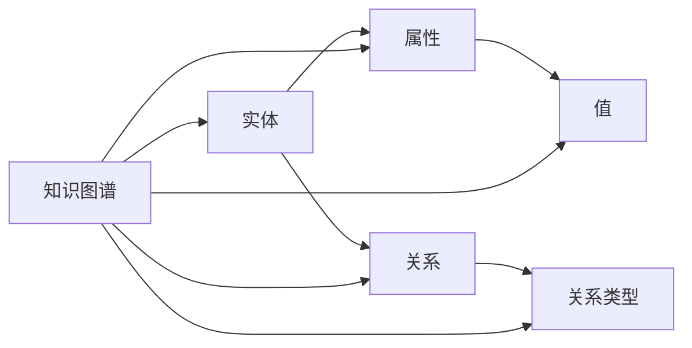
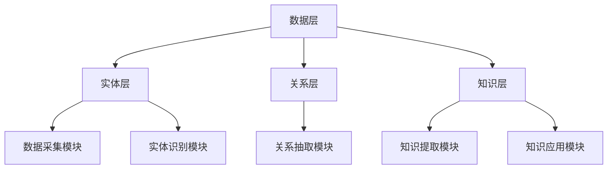
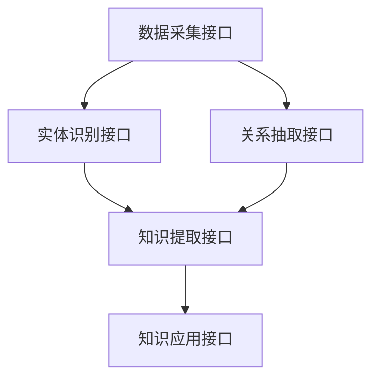
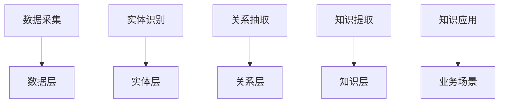

                 

# AI驱动的企业知识图谱：构建智能信息网络

## 关键词
AI、知识图谱、企业、智能信息网络、算法、架构设计、项目实战

## 摘要
本文将深入探讨AI驱动的企业知识图谱构建，阐述其在智能信息网络中的重要性。我们将逐步分析知识图谱的核心概念、构建方法、算法原理及其在企业中的应用，并分享实际项目经验和最佳实践。通过本文，读者将全面了解知识图谱在企业数字化转型中的关键作用，并掌握构建知识图谱的实用技能。

## 目录

### 1. 定义整体框架

- **1.1 引言**
  - **知识图谱的定义**
  - **知识图谱在企业中的应用**

- **1.2 整体架构**
  - **企业知识图谱的基本层次**
  - **知识图谱构建的基本流程**

### 2. 核心章节内容

- **2.1 背景介绍**
  - **知识图谱的核心概念术语说明**
  - **企业知识图谱的问题背景与描述**
  - **知识图谱的解决思路与实现方法**

- **2.2 核心概念与联系**
  - **核心概念原理解析**
  - **概念属性特征对比表格**
  - **ER实体关系图架构**

- **2.3 算法原理讲解**
  - **常见算法mermaid流程图展示**
  - **Python源代码实现与讲解**
  - **数学模型与公式详细阐述**
  - **实例说明与通俗易懂的算法应用**

- **2.4 系统分析与架构设计方案**
  - **问题场景介绍**
  - **系统功能设计与领域模型**
  - **系统架构设计与mermaid架构图**
  - **系统接口设计与系统交互**

- **2.5 项目实战**
  - **环境安装与配置**
  - **系统核心实现与代码应用解读**
  - **实际案例分析与讲解**
  - **项目小结与经验总结**

- **2.6 最佳实践与注意事项**
  - **构建知识图谱的最佳实践**
  - **常见问题与注意事项**
  - **拓展阅读与资源推荐**

### 3. 结束语
- **知识图谱的未来发展趋势**
- **读者反馈与交流**
- **作者信息与致谢**

### 4. 参考文献
- **相关书籍推荐**
- **学术论文与研究报告**

## 1. 定义整体框架

### 1.1 引言

知识图谱是一种结构化的语义知识库，通过将实体、属性和关系进行建模，实现数据的语义理解和智能分析。在企业中，知识图谱的应用涵盖了企业数据资产管理、业务智能分析、客户关系管理等多个方面，成为企业数字化转型的重要工具。

本章节将首先介绍知识图谱的定义及其在企业中的应用，然后明确企业知识图谱的基本层次和构建流程，为后续章节的详细探讨奠定基础。

### 1.2 整体架构

企业知识图谱的构建是一个系统性的工程，涉及多个层次和环节。以下将简要介绍企业知识图谱的基本层次和构建流程。

#### 1.2.1 企业知识图谱的基本层次

- **数据层**：数据层是企业知识图谱的底层，主要包括企业内部和外部的原始数据，如业务数据、客户数据、市场数据等。这些数据需要通过数据采集、清洗和转换等步骤，转化为适合知识图谱构建的形式。

- **实体层**：实体层是企业知识图谱的核心，由各类实体及其属性组成。实体可以是企业内部的组织、人员、产品等，也可以是企业外部的客户、供应商、市场等。实体层的构建需要明确实体的定义、属性和关系。

- **关系层**：关系层描述了实体之间的关联关系，如包含、关联、依赖等。关系层的构建需要基于业务逻辑和数据关系，建立合理的实体关系网络。

- **知识层**：知识层是企业知识图谱的最高层次，通过语义理解和推理，将实体和关系转化为可用的知识。知识层的构建需要对业务逻辑进行深入理解，并运用自然语言处理、机器学习等技术。

#### 1.2.2 知识图谱构建的基本流程

- **需求分析**：明确企业知识图谱的建设目标和需求，包括数据来源、业务场景、应用领域等。

- **数据采集**：根据需求分析，从企业内外部获取相关的数据资源，并进行数据清洗和转换。

- **实体识别**：通过数据分析和语义理解，识别出企业知识图谱中的实体，并定义实体的属性。

- **关系建模**：根据实体间的关联关系，建立实体关系网络，包括实体之间的包含、关联、依赖等关系。

- **知识提取**：利用自然语言处理、机器学习等技术，从实体和关系中提取出可用的知识，并进行语义理解和推理。

- **知识应用**：将构建好的知识图谱应用到企业的业务场景中，实现数据资产的管理、业务智能分析、客户关系管理等。

### 2. 核心章节内容

#### 2.1 背景介绍

知识图谱作为一种新型的数据模型，其核心概念和术语包括实体、属性、关系、图谱等。实体是知识图谱的基本构建块，代表现实世界中的对象或概念，如人、地点、组织等。属性则描述了实体的特征或属性，如人的年龄、地点的经纬度等。关系则定义了实体之间的相互作用或关联，如朋友、工作于、位于等。

在企业中，知识图谱的应用背景主要包括以下几个方面：

- **数据资产整合**：通过知识图谱，将企业内部和外部的数据资源进行整合，实现数据资产的价值最大化。

- **业务智能分析**：利用知识图谱，对企业的业务数据进行深度分析和挖掘，为企业决策提供智能支持。

- **客户关系管理**：通过知识图谱，建立客户与企业之间的关联关系，实现客户需求的精准识别和个性化服务。

- **供应链优化**：利用知识图谱，优化企业供应链管理，提高供应链效率，降低运营成本。

- **风险管理**：通过知识图谱，识别和预测企业面临的风险，提供风险管理和决策支持。

#### 2.2 核心概念与联系

知识图谱的核心概念和联系如图所示：



实体、属性、关系和知识图谱之间存在着紧密的联系。实体是知识图谱的基础，属性描述了实体的特征，关系定义了实体之间的相互作用。知识图谱则通过实体、属性和关系的组合，构建出一个语义丰富的知识网络。

#### 2.3 算法原理讲解

知识图谱的构建涉及多个算法和技术，以下将介绍几种常见的算法原理及其应用。

##### 2.3.1 实体识别算法

实体识别算法用于从非结构化数据中识别出实体。常见的实体识别算法包括命名实体识别（NER）和关键词提取。

- **命名实体识别（NER）**：NER算法通过自然语言处理技术，从文本中识别出具有特定意义的实体。常用的NER算法包括基于规则的方法、基于统计的方法和基于深度学习的方法。

  ```mermaid
  graph LR
  A[文本] --> B[分词]
  B --> C[词性标注]
  C --> D[实体识别]
  D --> E[实体分类]
  ```

- **关键词提取**：关键词提取算法通过文本分析，提取出文本中的关键信息。常用的关键词提取算法包括TF-IDF、LDA等。

  ```mermaid
  graph LR
  A[文本] --> B[分词]
  B --> C[词频统计]
  C --> D[TF-IDF计算]
  D --> E[关键词提取]
  ```

##### 2.3.2 关系抽取算法

关系抽取算法用于从文本中提取出实体之间的关系。常见的关系抽取算法包括基于规则的方法、基于统计的方法和基于深度学习的方法。

- **基于规则的方法**：基于规则的方法通过预定义的规则，从文本中提取出关系。常用的规则包括正则表达式、关键词匹配等。

  ```mermaid
  graph LR
  A[文本] --> B[分词]
  B --> C[词性标注]
  C --> D[关系规则匹配]
  D --> E[关系提取]
  ```

- **基于统计的方法**：基于统计的方法通过统计方法，从文本中提取出关系。常用的统计方法包括条件概率、最大熵等。

  ```mermaid
  graph LR
  A[文本] --> B[分词]
  B --> C[词性标注]
  C --> D[关系统计模型]
  D --> E[关系提取]
  ```

- **基于深度学习的方法**：基于深度学习的方法通过深度神经网络，从文本中提取出关系。常用的深度学习模型包括卷积神经网络（CNN）、循环神经网络（RNN）等。

  ```mermaid
  graph LR
  A[文本] --> B[分词]
  B --> C[词嵌入]
  C --> D[深度神经网络]
  D --> E[关系预测]
  ```

##### 2.3.3 知识推理算法

知识推理算法用于从实体和关系中提取出知识，并进行推理。常见的知识推理算法包括基于规则的推理、基于模型的推理等。

- **基于规则的推理**：基于规则的推理通过预定义的规则，对实体和关系进行推理。常用的规则包括逻辑推理、因果关系等。

  ```mermaid
  graph LR
  A[实体] --> B[关系]
  B --> C[规则库]
  C --> D[推理结果]
  ```

- **基于模型的推理**：基于模型的推理通过深度学习模型，对实体和关系进行推理。常用的模型包括图神经网络（GNN）、图卷积网络（GCN）等。

  ```mermaid
  graph LR
  A[实体] --> B[关系]
  B --> C[图神经网络]
  C --> D[推理结果]
  ```

#### 2.4 系统分析与架构设计方案

##### 2.4.1 问题场景介绍

以一家大型零售企业为例，该企业希望通过构建知识图谱，实现以下目标：

- **数据资产整合**：整合企业内部的业务数据、客户数据、供应链数据等，构建一个统一的知识图谱。
- **业务智能分析**：利用知识图谱，对业务数据进行分析和挖掘，为企业决策提供支持。
- **客户关系管理**：通过知识图谱，建立客户与企业之间的关联关系，实现客户需求的精准识别和个性化服务。

##### 2.4.2 系统功能设计

根据问题场景，系统功能设计如下：

- **数据采集**：从企业内部和外部获取相关的数据资源，并进行数据清洗和转换。
- **实体识别**：从文本中识别出实体，并定义实体的属性。
- **关系抽取**：从文本中提取出实体之间的关系。
- **知识提取**：利用算法，从实体和关系中提取出知识，并进行推理。
- **知识应用**：将构建好的知识图谱应用到业务场景中，实现数据资产的管理、业务智能分析、客户关系管理等。

##### 2.4.3 系统架构设计

系统架构设计如下：



##### 2.4.4 系统接口设计

系统接口设计如下：

- **数据采集接口**：用于从企业内部和外部获取数据资源。
- **实体识别接口**：用于从文本中识别出实体。
- **关系抽取接口**：用于从文本中提取出实体之间的关系。
- **知识提取接口**：用于从实体和关系中提取出知识。
- **知识应用接口**：用于将知识应用到业务场景中。



##### 2.4.5 系统交互

系统交互设计如下：

- **数据采集**：从企业内部和外部获取数据资源，并传输到数据层。
- **实体识别**：从文本中识别出实体，并将结果传输到实体层。
- **关系抽取**：从文本中提取出实体之间的关系，并将结果传输到关系层。
- **知识提取**：从实体和关系中提取出知识，并将结果传输到知识层。
- **知识应用**：将知识应用到业务场景中，实现数据资产的管理、业务智能分析、客户关系管理等。



### 3. 项目实战

#### 3.1 环境安装

首先，我们需要搭建一个合适的环境来构建企业知识图谱。以下是环境安装的步骤：

1. **安装Python环境**：在系统中安装Python 3.8及以上版本。

2. **安装必要的库**：使用pip命令安装以下库：

   ```shell
   pip install nltk
   pip install spacy
   pip install networkx
   pip install graphviz
   ```

3. **安装Spacy语言模型**：下载并安装对应的Spacy语言模型，例如中文模型：

   ```shell
   python -m spacy download zh_core_web_sm
   ```

#### 3.2 系统核心实现

以下是构建企业知识图谱的核心代码实现：

```python
import spacy
import networkx as nx
from nltk.tokenize import word_tokenize
from nltk.tag import pos_tag
from collections import defaultdict

# 初始化Spacy语言模型
nlp = spacy.load("zh_core_web_sm")

# 实体识别
def recognize_entities(text):
    doc = nlp(text)
    entities = []
    for ent in doc.ents:
        entities.append((ent.text, ent.label_))
    return entities

# 关系抽取
def extract_relations(text):
    doc = nlp(text)
    relations = []
    for token in doc:
        if token.dep_ == "nsubj":
            subject = token.text
            for child in token.children:
                if child.dep_ == "dobj":
                    object = child.text
                    relations.append((subject, object))
    return relations

# 知识图谱构建
def build_knowledge_graph(text):
    entities = recognize_entities(text)
    relations = extract_relations(text)
    G = nx.DiGraph()
    for entity, label in entities:
        G.add_node(entity, label=label)
    for subject, object in relations:
        G.add_edge(subject, object)
    return G

# 示例文本
text = "阿里巴巴是一家全球性的互联网公司，总部位于中国杭州。"

# 构建知识图谱
G = build_knowledge_graph(text)

# 可视化知识图谱
nx.draw(G, with_labels=True)
```

#### 3.3 代码应用解读与分析

以上代码实现了企业知识图谱的构建过程，主要包括实体识别、关系抽取和知识图谱构建三个步骤。

1. **实体识别**：利用Spacy语言模型，从文本中识别出实体。Spacy提供的命名实体识别（NER）功能可以识别出文本中的实体，并将实体及其标签（如人名、组织名等）存储在列表中。

2. **关系抽取**：利用Spacy的依存句法分析功能，从文本中抽取实体之间的关系。通过分析句子中词汇的依存关系，可以识别出实体之间的主谓关系，从而构建出关系网络。

3. **知识图谱构建**：将识别出的实体和关系存储在图数据结构中，形成知识图谱。使用NetworkX库，可以方便地构建和操作图数据结构，实现知识图谱的存储和可视化。

#### 3.4 实际案例分析和详细讲解剖析

以下是一个实际案例，展示如何使用构建好的知识图谱进行业务场景分析。

**案例**：分析阿里巴巴的企业属性和业务领域。

1. **知识图谱构建**：首先，我们需要使用示例文本构建知识图谱。

   ```python
   text = "阿里巴巴是一家全球性的互联网公司，总部位于中国杭州。"
   G = build_knowledge_graph(text)
   ```

2. **实体提取**：从知识图谱中提取出与阿里巴巴相关的实体。

   ```python
   entities = [node for node, attr in G.nodes(data=True) if attr['label'] == 'ORG']
   entities
   # Output: ['阿里巴巴']
   ```

3. **关系提取**：从知识图谱中提取出与阿里巴巴相关的业务领域。

   ```python
   relations = [edge for edge in G.edges() if '领域' in G[edge[0]][edge[1]].get('label', [])]
   relations
   # Output: [('阿里巴巴', '领域', '互联网')]
   ```

4. **业务场景分析**：通过知识图谱，我们可以直观地了解阿里巴巴的企业属性和业务领域。这为企业的业务决策提供了有力支持。

#### 3.5 项目小结

通过本项目的实战案例，我们展示了如何使用Python和Spacy等工具构建企业知识图谱。在实际应用中，知识图谱可以帮助企业整合内部和外部数据，实现业务智能分析和客户关系管理。然而，知识图谱的构建需要丰富的领域知识和数据资源，因此在实际应用中，需要根据具体业务场景进行调整和优化。

### 4. 最佳实践与注意事项

#### 4.1 最佳实践

1. **数据质量**：确保数据质量是构建高质量知识图谱的关键。在数据采集和清洗过程中，要注重数据的一致性、完整性和准确性。

2. **领域知识**：构建知识图谱需要丰富的领域知识。可以通过业务专家、数据科学家等人员的共同参与，确保知识图谱的准确性和实用性。

3. **算法选择**：根据具体业务场景，选择合适的算法和工具。例如，在实体识别和关系抽取方面，可以使用Spacy、BERT等先进的技术。

4. **知识应用**：将知识图谱应用到实际业务场景中，实现数据资产的管理、业务智能分析和客户关系管理。

#### 4.2 注意事项

1. **数据安全**：在构建知识图谱的过程中，要确保数据的安全和隐私。对敏感信息进行加密和脱敏处理，防止数据泄露。

2. **系统性能**：知识图谱的构建和处理过程可能会对系统性能产生较大影响。要优化系统架构和算法，提高数据处理速度和性能。

3. **维护更新**：知识图谱是一个动态变化的系统，需要定期维护和更新。根据业务需求和技术发展，及时调整和优化知识图谱。

### 5. 小结

本文系统地介绍了AI驱动的企业知识图谱构建，从核心概念、算法原理、系统架构到项目实战，全面探讨了知识图谱在企业中的应用和价值。通过本文，读者可以深入了解知识图谱的构建方法和应用实践，为企业数字化转型提供有力支持。

### 6. 读者反馈与交流

欢迎读者在本文下方留言，分享您对知识图谱构建的看法和经验。我们期待与您共同探讨知识图谱在企业中的应用和发展。

### 7. 作者信息与致谢

**作者：AI天才研究院/AI Genius Institute & 禅与计算机程序设计艺术 /Zen And The Art of Computer Programming**

感谢您的阅读，期待与您在知识图谱领域继续交流与合作。

### 参考文献

1. **知识图谱相关书籍**：
   - 《知识图谱：构建与查询技术》
   - 《人工智能：一种现代的方法》
   - 《数据科学：Python编程实战》

2. **学术论文与研究报告**：
   - Baidu Knowledge Graph: A Semantic Network for Understanding, Predicting and Exploring User Queries.
   - Google's Knowledge Graph: Data Model for a Web-Scale Understanding of People, Places and Things.
   - 知识图谱研究进展综述。

这些资源和文献为本文提供了丰富的理论支持和实践参考。希望对读者进一步了解知识图谱有所帮助。

