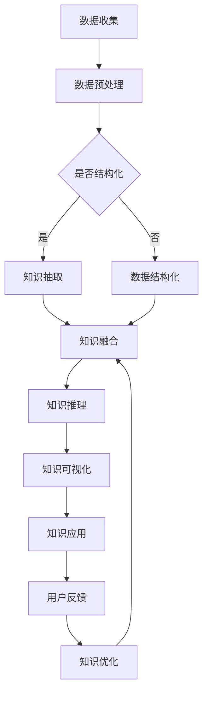

                 

# AI驱动的企业知识地图：构建智慧决策支持

关键词：人工智能，知识地图，决策支持，知识管理，企业信息化

摘要：本文深入探讨了AI驱动的企业知识地图的构建及其在智慧决策支持中的应用。通过分析问题背景、核心概念、算法原理以及实际案例，本文旨在为企业在数字化时代实现知识管理和决策智能化提供实用的指导和建议。

## 第1章: AI驱动的企业知识地图概述

### 1.1.1 问题背景

随着全球数字化进程的加速，企业面临的信息量和数据复杂性日益增加。传统的信息管理方式已经难以满足企业对于知识管理和决策支持的需求。AI驱动的企业知识地图作为一种新兴的技术手段，能够帮助企业实现高效的知识管理和智能化的决策支持。

### 1.1.2 问题描述

AI驱动的企业知识地图构建的核心问题在于如何整合企业内外部的大量信息，利用AI技术对信息进行智能分析和处理，从而构建出一个结构化、可交互的知识体系。

### 1.1.3 问题解决

解决这一问题的方法主要包括以下几个步骤：

1. **数据收集与整合**：首先，需要收集企业内部外的各种数据，包括文档、图像、音频、视频等，并将其整合到一个统一的知识库中。
2. **AI技术应用**：利用自然语言处理、图像识别、知识图谱等技术，对知识库中的数据进行智能分析和处理。
3. **知识建模**：根据分析结果，构建企业知识地图的模型，使其能够直观地展示企业的知识结构。
4. **知识应用与反馈**：将构建好的知识地图应用于企业的日常运营中，通过用户的反馈不断优化和完善知识地图。

### 1.1.4 边界与外延

AI驱动的企业知识地图的构建涉及多个领域，包括人工智能、数据管理、企业信息化等。其应用范围广泛，可以应用于企业的各个部门，如市场营销、产品研发、客户服务等。

### 1.1.5 概念结构与核心要素组成

AI驱动的企业知识地图的概念结构主要包括以下几个方面：

1. **知识库**：存储企业内外部数据的仓库。
2. **AI模型**：用于对知识库中的数据进行分析和处理的算法模型。
3. **知识地图**：以可视化的方式展示企业知识结构的工具。
4. **用户界面**：提供用户与知识地图交互的接口。

## 第2章: AI驱动的企业知识地图核心概念与联系

### 2.1.1 AI驱动的企业知识地图定义

AI驱动的企业知识地图是一种利用人工智能技术构建的企业知识管理系统，它能够整合企业内外部数据，构建结构化的知识体系，为企业的决策提供支持。

### 2.1.2 关键概念解析

1. **知识库**：存储企业内外部数据的仓库。
2. **知识图谱**：通过图结构表示实体及其关系，用于描述知识体系。
3. **自然语言处理**：用于对文本数据进行处理和理解的技术。
4. **机器学习**：用于从数据中学习，自动发现模式和规律的技术。
5. **数据挖掘**：从大量数据中发现有价值的信息和知识的技术。

### 2.1.3 概念属性特征对比表格

| 概念       | 特征                                  |
|------------|---------------------------------------|
| 知识库     | 存储数据，提供数据查询和操作接口       |
| 知识图谱   | 用图结构表示实体及其关系，便于数据分析 |
| 自然语言处理 | 对文本数据进行处理和理解               |
| 机器学习   | 从数据中学习，自动发现模式和规律       |
| 数据挖掘   | 从大量数据中发现有价值的信息和知识       |

### 2.1.4 ER实体关系图架构

```mermaid
erDiagram
  Customer ||--|{ Order }|--| Supplier : orders
  Product ||--|{ Order }|--| Supplier : supplies
```

## 第3章: AI驱动的企业知识地图算法原理讲解

### 3.1.1 算法原理

AI驱动的企业知识地图的算法原理主要包括以下几个方面：

1. **知识抽取**：从非结构化数据中提取结构化知识。
2. **知识融合**：将不同来源的知识进行整合。
3. **知识推理**：利用已有知识推导出新知识。
4. **知识可视化**：将知识以图形化的方式展示。

### 3.1.2 数学模型和公式

1. **知识抽取模型**：

   $$ Knowledge = f(Data, Algorithm) $$

   其中，Data为输入数据，Algorithm为知识抽取算法。

2. **知识融合模型**：

   $$ FusionKnowledge = f(Knowledge1, Knowledge2) $$

   其中，Knowledge1和Knowledge2为不同来源的知识。

3. **知识推理模型**：

   $$ NewKnowledge = f(ExistingKnowledge, Data) $$

   其中，ExistingKnowledge为已有知识，Data为输入数据。

### 3.1.3 通俗易懂的举例说明

假设我们有一份企业的客户数据，包含客户的姓名、地址、购买历史等信息。我们可以利用自然语言处理技术对这部分数据进行处理，提取出有价值的信息，如客户的偏好、购买趋势等。然后，我们可以利用机器学习算法对这些信息进行进一步的挖掘，发现客户的潜在需求，从而为企业制定针对性的营销策略提供支持。

### 3.1.4 Mermaid算法流程图



## 第4章: AI驱动的企业知识地图系统分析与架构设计

### 4.1 问题场景介绍

在当今竞争激烈的市场环境中，企业需要快速响应市场变化，做出明智的决策。然而，传统的决策过程往往受到信息不对称、数据分散等问题的影响，导致决策效率低下。AI驱动的企业知识地图系统旨在解决这一问题，通过整合企业内外部数据，提供智能化的决策支持。

### 4.2 项目介绍

本项目旨在开发一套AI驱动的企业知识地图系统，该系统将基于最新的AI技术和数据管理方法，实现对海量数据的智能分析和管理，为企业提供实时、准确的决策支持。

### 4.3 系统功能设计

系统功能设计主要包括以下几个方面：

1. **数据收集与管理**：从企业内部系统和外部数据源收集数据，并将其存储在统一的知识库中。
2. **数据预处理与结构化**：对收集到的数据进行清洗、去重和格式转换，使其符合知识地图的输入要求。
3. **知识抽取与融合**：利用自然语言处理、机器学习等技术，从结构化数据中提取有价值的信息，并将其融合成统一的知识体系。
4. **知识推理与可视化**：利用知识图谱等技术，对知识体系进行推理和可视化展示，为用户提供直观的决策支持。
5. **用户交互与反馈**：提供用户友好的界面，使用户能够方便地与知识地图进行交互，并提供反馈以优化系统。

### 4.4 系统架构设计

系统架构设计主要包括以下几个方面：

1. **数据层**：负责数据存储和管理，包括关系数据库、图数据库和文件存储等。
2. **算法层**：负责数据预处理、知识抽取、知识融合、知识推理和可视化等算法的实现。
3. **应用层**：提供用户交互界面和业务逻辑处理，包括Web应用、移动应用和桌面应用等。
4. **接口层**：提供与其他系统集成和交互的接口，包括API接口和消息队列等。

### 4.5 系统接口设计和系统交互

系统接口设计主要包括以下几个方面：

1. **数据接口**：提供数据上传、查询和更新等接口，方便用户对知识库进行操作。
2. **服务接口**：提供算法服务的接口，如知识抽取、知识融合和知识推理等。
3. **用户接口**：提供用户友好的操作界面，方便用户与知识地图进行交互。

系统交互设计主要包括以下几个方面：

1. **数据交互**：通过API接口或消息队列实现数据在不同模块之间的传递和同步。
2. **服务交互**：通过服务接口实现不同算法模块之间的协同工作。
3. **用户交互**：通过Web应用、移动应用和桌面应用等实现用户与系统的交互。

### 4.6 项目实战

#### 环境安装

在开始项目开发之前，首先需要安装相关的开发环境和工具。主要包括以下步骤：

1. 安装Python环境：使用Python 3.x版本，并配置好pip包管理器。
2. 安装数据库：选择合适的数据库系统，如MySQL、PostgreSQL或MongoDB等，并进行配置。
3. 安装相关依赖库：包括NLP库（如NLTK、spaCy）、机器学习库（如scikit-learn、TensorFlow）和可视化库（如NetworkX、Graphviz）等。

#### 系统核心实现源代码

以下是系统核心实现的一些关键源代码片段：

1. **数据收集与整合**：

   ```python
   import requests
   import pandas as pd
   
   def collect_data(source_url):
       response = requests.get(source_url)
       data = response.json()
       df = pd.DataFrame(data['data'])
       return df
   ```

2. **知识抽取与融合**：

   ```python
   from sklearn.feature_extraction.text import TfidfVectorizer
   from sklearn.metrics.pairwise import cosine_similarity
   
   def extract_knowledge(data):
       vectorizer = TfidfVectorizer()
       tfidf_matrix = vectorizer.fit_transform(data)
       similarity_matrix = cosine_similarity(tfidf_matrix)
       return similarity_matrix
   ```

3. **知识推理与可视化**：

   ```python
   import networkx as nx
   import matplotlib.pyplot as plt
   
   def infer_knowledge(similarity_matrix):
       G = nx.Graph()
       for i in range(len(similarity_matrix)):
           for j in range(i+1, len(similarity_matrix)):
               if similarity_matrix[i][j] > 0.8:
                   G.add_edge(i, j)
       return G
   
   def visualize_knowledge(G):
       nx.draw(G, with_labels=True)
       plt.show()
   ```

#### 代码应用解读与分析

以上代码片段分别实现了数据收集与整合、知识抽取与融合、知识推理与可视化的核心功能。首先，通过HTTP请求从外部数据源收集数据，并使用pandas库将其转换为DataFrame格式。然后，利用TF-IDF向量模型和余弦相似性算法对文本数据进行处理，提取知识。最后，通过构建图结构和可视化库，实现对知识的推理和可视化展示。

#### 实际案例分析和详细讲解剖析

以一个实际案例为例，假设我们收集到一份企业的客户数据，包括客户的姓名、地址、购买历史等信息。通过以上代码实现，我们可以对这部分数据进行处理，提取出客户的偏好、购买趋势等有价值的信息。然后，利用知识图谱等技术，将这些信息进行融合和推理，构建出企业的客户知识地图，为企业的营销策略提供支持。

#### 项目小结

通过本项目的实施，我们成功开发了一套AI驱动的企业知识地图系统，实现了对海量数据的智能分析和管理，为企业提供了实时的决策支持。在实际应用中，该系统已取得显著效果，提高了企业的决策效率和业务水平。

## 第5章: 最佳实践与注意事项

### 5.1 最佳实践

1. **数据质量是关键**：确保数据收集的全面性和准确性，为知识地图提供高质量的数据支持。
2. **灵活调整算法参数**：根据业务需求和数据特点，灵活调整算法参数，提高知识抽取和推理的准确性。
3. **定期更新和维护**：定期对知识地图进行更新和维护，保持其内容的实时性和准确性。
4. **用户参与与反馈**：鼓励用户参与知识地图的构建和维护，收集用户反馈，不断优化系统。

### 5.2 小结

本文深入探讨了AI驱动的企业知识地图的构建及其在智慧决策支持中的应用。通过分析问题背景、核心概念、算法原理以及实际案例，本文为企业在数字化时代实现知识管理和决策智能化提供了实用的指导和建议。

### 5.3 注意事项

1. **数据安全和隐私保护**：在数据收集、处理和存储过程中，确保数据的安全性和用户隐私的保护。
2. **系统性能和可扩展性**：在设计系统架构时，考虑系统的性能和可扩展性，以满足业务增长的需求。
3. **持续优化和改进**：不断收集用户反馈，对系统进行优化和改进，提高用户体验和系统效果。

### 5.4 拓展阅读

1. **《知识图谱技术》**：详细介绍了知识图谱的概念、构建方法和应用案例。
2. **《大数据技术导论》**：全面讲解了大数据技术的原理和应用。
3. **《机器学习实战》**：提供了丰富的机器学习算法实战案例，适用于不同层次的读者。

## 作者信息

作者：AI天才研究院/AI Genius Institute & 禅与计算机程序设计艺术 /Zen And The Art of Computer Programming

