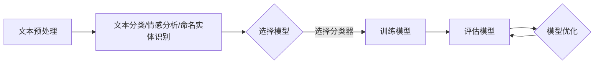
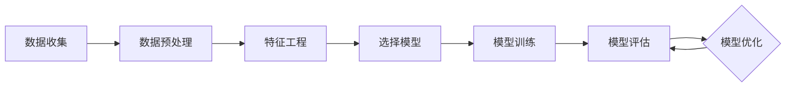
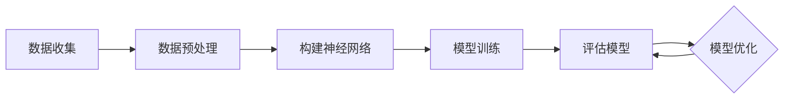

                 

## 《AI驱动的企业知识管理：构建学习型组织》

### 关键词：
- AI驱动知识管理
- 学习型组织
- 企业知识管理
- 算法原理
- 系统架构设计
- 项目实战

#### 摘要：
在数字化转型的浪潮中，企业知识管理的重要性愈发凸显。本文旨在探讨如何通过AI技术驱动企业知识管理，构建一个学习型组织。文章首先介绍了知识管理的背景和核心概念，接着分析了AI驱动知识管理的原理及其与学习型组织的联系。随后，深入讲解了自然语言处理、机器学习和深度学习算法在知识管理中的应用，并通过mermaid流程图和Python代码进行详细阐述。最后，文章探讨了企业知识管理系统的功能设计、架构设计和系统交互，以及通过项目实战对理论进行了验证，提供了最佳实践和拓展建议。希望通过本文，读者能够对AI驱动的企业知识管理和学习型组织有更深刻的理解和应用。

### 目录大纲

```markdown
# 《AI驱动的企业知识管理：构建学习型组织》

## 第一部分：背景介绍

### 第1章 问题背景与核心概念

#### 1.1 问题背景

##### 1.1.1 知识管理的意义与挑战

##### 1.1.2 企业知识管理的重要性

##### 1.1.3 AI技术在知识管理中的应用

#### 1.2 核心概念

##### 1.2.1 知识管理的定义与分类

##### 1.2.2 AI驱动的知识管理

##### 1.2.3 学习型组织的概念与特征

#### 1.3 边界与外延

##### 1.3.1 知识管理的边界

##### 1.3.2 AI驱动的知识管理的外延

##### 1.3.3 学习型组织的边界与拓展

#### 1.4 本章小结

## 第二部分：核心概念与联系

### 第2章 核心概念原理与联系

#### 2.1 AI驱动知识管理的原理

##### 2.1.1 AI技术在知识管理中的应用原理

##### 2.1.2 数据处理与分析的基本原理

##### 2.1.3 知识提取与融合的原理

#### 2.2 概念属性特征对比

##### 2.2.1 AI驱动知识管理与传统知识管理的对比

##### 2.2.2 企业知识管理与学习型组织的对比

##### 2.2.3 不同AI技术的对比

#### 2.3 ER实体关系图

##### 2.3.1 企业知识管理的实体关系图

##### 2.3.2 AI驱动的知识管理的实体关系图

##### 2.3.3 学习型组织的实体关系图

#### 2.4 本章小结

## 第三部分：AI驱动知识管理

### 第3章 算法原理与讲解

#### 3.1 基础算法原理

##### 3.1.1 自然语言处理算法

##### 3.1.2 机器学习算法

##### 3.1.3 深度学习算法

#### 3.2 算法mermaid流程图

##### 3.2.1 自然语言处理算法的流程图

##### 3.2.2 机器学习算法的流程图

##### 3.2.3 深度学习算法的流程图

#### 3.3 算法原理讲解

##### 3.3.1 自然语言处理算法的详细讲解

##### 3.3.2 机器学习算法的详细讲解

##### 3.3.3 深度学习算法的详细讲解

#### 3.4 算法举例说明

##### 3.4.1 自然语言处理算法举例

##### 3.4.2 机器学习算法举例

##### 3.4.3 深度学习算法举例

#### 3.5 本章小结

## 第四部分：系统分析与架构设计

### 第4章 系统分析与架构设计

#### 4.1 问题场景介绍

##### 4.1.1 知识管理的问题场景

##### 4.1.2 AI驱动知识管理的应用场景

##### 4.1.3 学习型组织的构建场景

#### 4.2 系统功能设计

##### 4.2.1 知识管理系统的功能设计

##### 4.2.2 AI驱动知识管理系统的功能设计

##### 4.2.3 学习型组织管理系统的功能设计

#### 4.3 系统架构设计

##### 4.3.1 知识管理系统架构设计

##### 4.3.2 AI驱动知识管理系统架构设计

##### 4.3.3 学习型组织管理系统架构设计

#### 4.4 系统接口设计

##### 4.4.1 知识管理系统接口设计

##### 4.4.2 AI驱动知识管理系统接口设计

##### 4.4.3 学习型组织管理系统接口设计

#### 4.5 系统交互

##### 4.5.1 知识管理系统交互设计

##### 4.5.2 AI驱动知识管理系统交互设计

##### 4.5.3 学习型组织管理系统交互设计

#### 4.6 本章小结

## 第五部分：项目实战

### 第5章 项目实战

#### 5.1 环境安装与配置

##### 5.1.1 环境安装概述

##### 5.1.2 知识管理系统安装

##### 5.1.3 AI驱动知识管理系统安装

##### 5.1.4 学习型组织管理系统安装

#### 5.2 系统核心实现

##### 5.2.1 系统核心模块设计与实现

##### 5.2.2 AI驱动知识管理核心算法实现

##### 5.2.3 学习型组织管理核心算法实现

#### 5.3 代码应用解读与分析

##### 5.3.1 知识管理系统代码解读

##### 5.3.2 AI驱动知识管理系统代码解读

##### 5.3.3 学习型组织管理系统代码解读

#### 5.4 实际案例分析与讲解

##### 5.4.1 知识管理实际案例分析

##### 5.4.2 AI驱动知识管理实际案例分析

##### 5.4.3 学习型组织管理实际案例分析

#### 5.5 项目小结

## 第六部分：最佳实践与拓展

### 第6章 最佳实践与注意事项

#### 6.1 最佳实践

##### 6.1.1 知识管理策略

##### 6.1.2 AI驱动策略

##### 6.1.3 学习型组织建设策略

#### 6.2 小结

##### 6.2.1 文章总结

##### 6.2.2 读者应该掌握的知识点

##### 6.2.3 未来研究方向

#### 6.3 注意事项

##### 6.3.1 常见问题及解决方案

##### 6.3.2 风险评估与应对措施

#### 6.4 拓展阅读

##### 6.4.1 相关文献推荐

##### 6.4.2 未来的发展趋势

```

## 第一部分：背景介绍

### 第1章 问题背景与核心概念

#### 1.1 问题背景

在现代企业中，知识管理已经成为一项至关重要的活动。然而，随着企业规模的扩大和信息量的增加，传统的知识管理方法面临着诸多挑战。首先，企业内部的知识往往散落在各个部门和员工个人手中，难以集中管理和高效利用。其次，知识更新速度快，传统方法难以迅速捕捉和传播新的知识。最后，知识共享和知识创新机制不完善，导致知识转化效率低下。

为了解决这些问题，AI技术的引入为企业知识管理带来了新的契机。AI技术具有强大的数据处理和分析能力，能够从大量非结构化数据中提取有价值的信息，实现知识的自动化整理和分类。同时，AI技术可以智能推荐知识，提高知识传播的效率和准确性。通过AI驱动的知识管理，企业可以构建一个高效、智能的学习型组织，实现知识的共享、传播和创新。

#### 1.1.1 知识管理的意义与挑战

知识管理是一种通过系统化方法，识别、获取、组织、存储、共享和应用知识的活动，旨在提高组织的知识获取、知识共享和知识创新能力。其意义在于：

1. **提高决策效率**：通过知识管理，企业可以快速获取和利用历史数据和经验，为决策提供有力支持。
2. **增强创新能力**：知识管理能够促进知识共享和协同工作，激发员工的创新思维和创造力。
3. **降低培训成本**：通过知识共享，新员工可以更快地了解企业的运作和业务流程，减少培训成本和时间。

然而，知识管理也面临着以下挑战：

1. **数据分散与冗余**：企业内部的知识往往分布在不同的系统和部门，难以统一管理和查询。
2. **知识老化与失效**：知识更新速度快，传统方法难以及时更新和淘汰过时的知识。
3. **知识共享机制不完善**：缺乏有效的激励机制和沟通渠道，导致知识共享积极性不高。

#### 1.1.2 企业知识管理的重要性

企业知识管理的重要性体现在以下几个方面：

1. **战略资源**：知识是企业的核心竞争力之一，通过有效的知识管理，企业可以更好地利用和传承知识，提高竞争力。
2. **创新动力**：知识管理能够促进知识的流动和交流，激发员工的创新思维，推动企业不断进步。
3. **人才培养**：知识管理可以为企业提供丰富的学习资源，帮助员工快速成长和提升能力。
4. **风险防范**：通过知识管理，企业可以更好地应对市场变化和竞争压力，提高抗风险能力。

#### 1.1.3 AI技术在知识管理中的应用

AI技术为知识管理带来了以下几方面的应用：

1. **自然语言处理**：AI技术可以处理和解析自然语言文本，实现文本分类、情感分析、命名实体识别等功能，帮助企业更好地理解和利用文本数据。
2. **机器学习**：通过机器学习算法，AI技术可以自动从数据中学习规律，预测和分类新数据，实现知识的自动提取和分类。
3. **深度学习**：深度学习模型具有强大的特征提取和表示能力，可以用于图像识别、语音识别等领域，帮助企业更好地理解和利用图像和语音数据。

通过AI技术，企业可以实现以下目标：

1. **自动化知识提取**：AI技术可以从大量非结构化数据中自动提取有价值的信息，提高知识管理的效率。
2. **智能知识推荐**：AI技术可以根据用户的行为和需求，智能推荐相关的知识和信息，提高知识共享的准确性和效率。
3. **知识图谱构建**：AI技术可以构建知识图谱，实现知识的可视化和管理，帮助企业更好地理解和利用知识。

#### 1.2 核心概念

在本章节中，我们将介绍几个关键概念，包括知识管理的定义与分类、AI驱动的知识管理、学习型组织的概念与特征。

##### 1.2.1 知识管理的定义与分类

知识管理是指通过系统的方法和技术，对知识进行识别、获取、组织、存储、共享、应用和创新的过程。根据知识形态的不同，知识管理可以分为以下几类：

1. **显性知识管理**：显性知识是指可以明确表述和形式化的知识，如文档、报告、数据库等。显性知识管理的主要任务是整理和存储这些知识，并提供方便的检索和共享机制。
2. **隐性知识管理**：隐性知识是指难以明确表述和形式化的知识，如个人的经验、技能、直觉等。隐性知识管理的关键是促进知识的传播和共享，通过建立良好的沟通和合作机制，使隐性知识转化为显性知识。
3. **动态知识管理**：动态知识管理是指不断更新和优化的知识管理过程，通过持续学习和知识创新，使知识保持活力和相关性。

##### 1.2.2 AI驱动的知识管理

AI驱动的知识管理是指利用人工智能技术，对知识进行识别、提取、组织和应用的过程。其主要特点包括：

1. **自动化**：AI技术可以自动从大量数据中提取有价值的信息，实现知识的自动化提取和分类。
2. **智能化**：AI技术可以根据用户的行为和需求，智能推荐相关的知识和信息，提高知识共享的准确性和效率。
3. **个性化**：AI技术可以根据用户的不同需求，提供个性化的知识和信息，提高知识管理的用户体验。

##### 1.2.3 学习型组织的概念与特征

学习型组织是指一个能够持续学习和创新，适应不断变化的环境的组织。其特征包括：

1. **学习导向**：学习型组织将学习视为一种核心活动，鼓励员工不断学习和成长，以适应不断变化的环境。
2. **知识共享**：学习型组织建立有效的知识共享机制，促进知识的流动和交流，使每个员工都能充分利用组织内的知识资源。
3. **团队协作**：学习型组织强调团队合作，通过共同学习和协作，实现知识的创新和应用。
4. **持续改进**：学习型组织不断反思和改进自身的工作方式和流程，以不断提高组织的绩效和创新能力。

#### 1.3 边界与外延

在探讨知识管理、AI驱动的知识管理以及学习型组织的概念时，了解这些概念的边界和外延是至关重要的。这有助于我们更准确地理解和应用这些概念，避免在实际操作中出现偏差。

##### 1.3.1 知识管理的边界

知识管理的边界主要涉及以下几个方面：

1. **知识范围**：知识管理不仅仅关注显性知识，也包括隐性知识。此外，知识管理不仅涉及内部知识，还包括外部知识，如行业趋势、竞争对手信息等。
2. **技术范围**：知识管理的技术不仅限于传统的数据库和文档管理系统，还包括AI技术、云计算、大数据等先进技术。
3. **管理范围**：知识管理不仅仅是IT部门的责任，而是涉及到整个组织的各个部门，需要全员参与。

##### 1.3.2 AI驱动的知识管理的外延

AI驱动的知识管理的外延主要包括以下几个方面：

1. **应用领域**：AI驱动的知识管理可以应用于企业内部的各种业务场景，如市场营销、产品研发、客户服务等。
2. **数据类型**：AI驱动的知识管理不仅可以处理结构化数据，还可以处理非结构化数据，如图像、视频、语音等。
3. **系统集成**：AI驱动的知识管理需要与企业的其他系统（如ERP、CRM等）进行集成，实现数据的无缝流动和共享。

##### 1.3.3 学习型组织的边界与拓展

学习型组织的边界与拓展主要包括以下几个方面：

1. **组织层级**：学习型组织不仅仅局限于企业内部，也可以扩展到企业间的合作和联盟，形成跨企业的学习型网络。
2. **学习内容**：学习型组织不仅关注专业知识和技能的学习，还包括人文素养、领导力、团队协作等方面的学习。
3. **学习方式**：学习型组织可以通过在线学习、面对面培训、工作坊、研讨会等多种方式进行学习，实现学习方式的多样化和灵活性。

#### 1.4 本章小结

本章介绍了知识管理、AI驱动的知识管理以及学习型组织的相关背景和核心概念。通过分析知识管理的意义与挑战，我们了解到知识管理在提高决策效率、增强创新能力和降低培训成本等方面的重要性。同时，AI技术的引入为企业知识管理带来了新的机遇和挑战。学习型组织作为一种能够持续学习和创新的组织模式，具有学习导向、知识共享、团队协作和持续改进等特征。在下一章中，我们将进一步探讨AI驱动知识管理的原理及其与学习型组织的联系。

## 第二部分：核心概念与联系

### 第2章 核心概念原理与联系

在本章节中，我们将深入探讨AI驱动知识管理的原理，并分析其与学习型组织的联系。通过这一部分的讨论，我们将理解AI技术在知识管理中的应用如何帮助企业构建学习型组织，提高其知识获取、共享和创新能力。

#### 2.1 AI驱动知识管理的原理

AI驱动知识管理的核心在于利用人工智能技术，对知识进行自动化识别、提取、组织、共享和应用。以下是AI驱动知识管理的三个主要原理：

##### 2.1.1 AI技术在知识管理中的应用原理

1. **数据处理与分析**：AI技术，尤其是机器学习和深度学习，可以处理和分析大量数据，从中提取有价值的信息。例如，通过自然语言处理技术，可以从海量的文本数据中提取关键词、主题和情感。
2. **知识提取与融合**：AI技术能够自动从非结构化数据中提取知识，并将其与现有的知识库进行融合。这种方法不仅提高了知识管理的效率，还确保了知识库的更新和准确性。
3. **智能推荐与预测**：基于用户的行为和需求，AI技术可以提供个性化的知识推荐，预测用户可能需要的信息，从而提高知识共享的准确性和效率。

##### 2.1.2 数据处理与分析的基本原理

数据处理与分析是AI驱动知识管理的核心，其基本原理包括：

1. **数据收集**：从各种来源收集数据，包括内部数据库、外部数据源、社交媒体等。
2. **数据清洗**：去除数据中的噪声和不相关部分，确保数据的质量。
3. **数据转换**：将数据转换为适合分析和建模的形式，如将文本转换为向量。
4. **数据分析**：使用统计方法和机器学习算法对数据进行深入分析，提取有价值的信息。

##### 2.1.3 知识提取与融合的原理

知识提取与融合的原理包括：

1. **自动文本分类**：使用自然语言处理技术，将文本数据自动分类为不同的主题或类别。
2. **关系抽取**：从文本中抽取实体和它们之间的关系，构建知识图谱。
3. **知识融合**：将来自不同来源的知识进行整合，形成一个统一的、综合的知识库。

#### 2.2 概念属性特征对比

为了更好地理解AI驱动知识管理与传统知识管理、企业知识管理以及学习型组织之间的关系，我们可以通过对比它们的概念属性特征来进行分析。

##### 2.2.1 AI驱动知识管理与传统知识管理的对比

| 特征                | AI驱动知识管理                           | 传统知识管理                           |
|---------------------|-----------------------------------------|-----------------------------------------|
| 数据处理方式        | 自动化、大规模、实时处理                 | 手动、小规模、周期性处理                |
| 知识提取方法        | 自然语言处理、机器学习、深度学习         | 文本分析、关键词提取、专家评审          |
| 知识共享机制        | 智能推荐、社交网络、大数据分析         | 文档共享、电子邮件、会议讨论          |
| 知识更新与维护      | 自动更新、持续学习                     | 手动更新、定期审核                    |

##### 2.2.2 企业知识管理与学习型组织的对比

| 特征                | 企业知识管理                            | 学习型组织                            |
|---------------------|---------------------------------------|---------------------------------------|
| 目标                | 提高知识获取、共享和创新能力            | 持续学习、创新、适应环境变化          |
| 组织文化            | 以知识为核心、重视知识共享和传承        | 学习导向、知识共享、团队合作          |
| 管理模式            | 中心化管理、部门协作                   | 分布式学习、协作学习、自我管理        |
| 效率                | 提高工作效率、降低成本                 | 提高学习效率、促进知识创新            |

##### 2.2.3 不同AI技术的对比

| AI技术             | 主要功能                           | 优点                           | 缺点                           |
|--------------------|-----------------------------------|--------------------------------|--------------------------------|
| 自然语言处理       | 文本分类、情感分析、命名实体识别     | 强大文本处理能力、高准确性     | 需要大量训练数据和计算资源     |
| 机器学习           | 数据分类、回归分析、预测             | 自适应、可扩展、易于实现         | 可能存在过拟合、对噪声敏感     |
| 深度学习           | 图像识别、语音识别、自然语言处理     | 强大特征提取、自学习、自动优化   | 需要大量数据和计算资源、解释性差 |

#### 2.3 ER实体关系图

为了更直观地展示企业知识管理、AI驱动的知识管理以及学习型组织的实体关系，我们可以使用ER（实体关系）图来描述。

##### 2.3.1 企业知识管理的实体关系图

```mermaid
erDiagram
    User ||--|{ KnowledgeBase }|-- Employee : "has"
    User ||--|{ Document }|-- Employee : "creates"
    KnowledgeBase ||--|{ Document }|-- Employee : "contains"
    Employee ||--|{ Project }|-- Company : "works on"
```

在上面的ER图中，用户（User）与企业知识库（KnowledgeBase）和文档（Document）之间存在关系，员工（Employee）与项目（Project）和公司（Company）之间存在关系。这表明企业知识管理涉及到知识库、文档、员工和项目等多个实体，以及它们之间的复杂关系。

##### 2.3.2 AI驱动的知识管理的实体关系图

```mermaid
erDiagram
    DataSource ||--|{ KnowledgeExtractor }|-- KnowledgeBase : "extracts"
    KnowledgeExtractor ||--|{ KnowledgeProcessor }|-- KnowledgeBase : "processes"
    KnowledgeBase ||--|{ KnowledgeManager }|-- AIApplication : "manages"
    AIApplication ||--|{ RecommenderSystem }|-- User : "recommends"
```

在AI驱动的知识管理的ER图中，数据源（DataSource）与知识提取器（KnowledgeExtractor）和知识库（KnowledgeBase）之间存在关系，知识提取器与知识处理器（KnowledgeProcessor）和知识管理者（KnowledgeManager）之间存在关系。AI应用（AIApplication）与推荐系统（RecommenderSystem）和用户（User）之间存在关系。这展示了AI驱动的知识管理涉及到数据源、知识提取、处理和管理等多个实体，以及它们之间的复杂关系。

##### 2.3.3 学习型组织的实体关系图

```mermaid
erDiagram
    Employee ||--|{ Team }|-- Organization : "part of"
    Employee ||--|{ KnowledgeBase }|-- Organization : "contributes"
    Team ||--|{ Project }|-- Organization : "works on"
    Organization ||--|{ LearningSystem }|-- AIApplication : "uses"
```

在学习型组织的ER图中，员工（Employee）与团队（Team）和知识库（KnowledgeBase）之间存在关系，团队与项目（Project）和组织（Organization）之间存在关系。组织（Organization）与学习系统（LearningSystem）和AI应用（AIApplication）之间存在关系。这表明学习型组织涉及到员工、团队、项目、组织和学习系统等多个实体，以及它们之间的复杂关系。

#### 2.4 本章小结

本章详细介绍了AI驱动知识管理的原理，并探讨了其与学习型组织的联系。通过对比分析AI驱动知识管理与传统知识管理、企业知识管理以及学习型组织的特点，我们更清晰地理解了AI技术如何帮助企业实现知识管理。此外，通过ER实体关系图的绘制，我们直观地展示了这些概念之间的实体关系。在下一章中，我们将深入探讨AI驱动知识管理中的核心算法原理，并使用mermaid流程图和Python代码进行详细讲解。

## 第三部分：AI驱动知识管理

### 第3章 算法原理与讲解

在AI驱动的知识管理中，算法是实现知识提取、组织和应用的关键。本章将详细讲解自然语言处理、机器学习和深度学习算法在知识管理中的应用原理，并通过mermaid流程图和Python代码进行阐述。

#### 3.1 基础算法原理

AI驱动知识管理的核心算法主要包括自然语言处理（NLP）、机器学习（ML）和深度学习（DL）。这些算法在知识管理中的应用原理如下：

##### 3.1.1 自然语言处理算法

自然语言处理算法是AI技术在处理自然语言文本方面的应用。其主要功能包括文本分类、情感分析、命名实体识别等。以下是NLP算法的主要原理：

1. **文本分类**：通过机器学习算法，将文本数据自动分类到预定义的类别中。常用的算法有朴素贝叶斯分类器、支持向量机（SVM）和深度神经网络（DNN）。
2. **情感分析**：分析文本中表达的情感倾向，如正面、负面或中性。常用的方法包括基于词汇的情感词典和机器学习模型。
3. **命名实体识别**：从文本中识别出具有特定意义的实体，如人名、地名、组织名等。常用的算法包括条件随机场（CRF）和神经网络模型。

##### 3.1.2 机器学习算法

机器学习算法是AI技术的核心组成部分，主要用于从数据中学习规律和模式。在知识管理中，机器学习算法被广泛应用于知识提取、分类和预测。以下是几种常见的机器学习算法：

1. **线性回归**：用于预测数值型变量，如股票价格或销售量。其原理是通过线性关系拟合数据，预测未知数据。
2. **逻辑回归**：用于分类问题，如判断邮件是否为垃圾邮件。其原理是构建一个逻辑函数，将输入数据映射到概率空间。
3. **决策树**：通过树形结构对数据进行分类或回归。其原理是根据特征值划分数据集，形成树形结构。
4. **随机森林**：通过构建多个决策树，并进行集成学习，提高分类和回归的准确性。其原理是结合多个决策树的预测结果，减少过拟合。

##### 3.1.3 深度学习算法

深度学习算法是机器学习的一个分支，通过多层神经网络对数据进行自动特征提取和表示。在知识管理中，深度学习算法被广泛应用于图像识别、语音识别和自然语言处理等领域。以下是几种常见的深度学习算法：

1. **卷积神经网络（CNN）**：主要用于图像识别和图像处理。其原理是通过卷积操作和池化操作，提取图像的特征。
2. **循环神经网络（RNN）**：主要用于序列数据，如时间序列分析和自然语言处理。其原理是通过循环结构，对序列数据进行建模。
3. **长短期记忆网络（LSTM）**：是RNN的一种改进，用于解决长序列依赖问题。其原理是引入记忆单元，对序列数据进行长期记忆。
4. **生成对抗网络（GAN）**：用于生成数据，如图像和文本。其原理是通过生成器和判别器的对抗训练，生成高质量的数据。

#### 3.2 算法mermaid流程图

为了更直观地展示算法的流程，我们使用mermaid流程图进行描述。

##### 3.2.1 自然语言处理算法的流程图



在上面的流程图中，文本预处理包括分词、去除停用词、词性标注等步骤，然后根据任务类型选择相应的模型（如文本分类器、情感分析模型或命名实体识别模型）。接下来，通过训练模型，评估模型的性能，并根据评估结果进行模型优化。

##### 3.2.2 机器学习算法的流程图



在机器学习算法的流程图中，首先收集数据，并进行数据预处理和特征工程。然后选择合适的模型进行训练，评估模型的性能，并根据评估结果进行模型优化。

##### 3.2.3 深度学习算法的流程图



在深度学习算法的流程图中，首先收集数据，并进行数据预处理。然后构建神经网络模型，进行模型训练，评估模型的性能，并根据评估结果进行模型优化。

#### 3.3 算法原理讲解

在本节中，我们将使用Python代码详细讲解自然语言处理、机器学习和深度学习算法的原理。

##### 3.3.1 自然语言处理算法的详细讲解

```python
# 示例：文本分类
from sklearn.feature_extraction.text import TfidfVectorizer
from sklearn.naive_bayes import MultinomialNB

# 文本数据
texts = ["这是一篇关于技术的文章", "这篇文章讨论了经济问题", "这是一篇关于旅游的文章"]

# 标签数据
labels = ["技术", "经济", "旅游"]

# 文本向量化
vectorizer = TfidfVectorizer()
X = vectorizer.fit_transform(texts)

# 训练模型
classifier = MultinomialNB()
classifier.fit(X, labels)

# 测试数据
test_texts = ["这是一篇关于医疗的文章"]

# 文本向量化
test_X = vectorizer.transform(test_texts)

# 预测结果
predictions = classifier.predict(test_X)
print(predictions)  # 输出预测结果
```

在上面的代码中，我们使用TF-IDF向量化和朴素贝叶斯分类器对文本进行分类。首先，我们使用TfidfVectorizer将文本转换为向量，然后使用MultinomialNB训练模型，并对测试数据进行预测。

##### 3.3.2 机器学习算法的详细讲解

```python
# 示例：线性回归
from sklearn.linear_model import LinearRegression
import numpy as np

# 输入数据
X = np.array([[1], [2], [3], [4], [5]])
y = np.array([1, 2, 2.5, 4, 5])

# 训练模型
regressor = LinearRegression()
regressor.fit(X, y)

# 预测结果
X_new = np.array([[6]])
y_pred = regressor.predict(X_new)
print(y_pred)  # 输出预测结果
```

在上面的代码中，我们使用线性回归模型对数值型数据进行预测。首先，我们创建输入数据和标签数据，然后使用LinearRegression训练模型，并对新的数据进行预测。

##### 3.3.3 深度学习算法的详细讲解

```python
# 示例：卷积神经网络
from tensorflow import keras
from tensorflow.keras import layers

# 构建模型
model = keras.Sequential([
    layers.Conv2D(32, (3, 3), activation='relu', input_shape=(28, 28, 1)),
    layers.MaxPooling2D((2, 2)),
    layers.Flatten(),
    layers.Dense(128, activation='relu'),
    layers.Dense(10, activation='softmax')
])

# 编译模型
model.compile(optimizer='adam',
              loss='categorical_crossentropy',
              metrics=['accuracy'])

# 训练模型
model.fit(X_train, y_train, epochs=5, batch_size=32, validation_data=(X_test, y_test))

# 评估模型
test_loss, test_acc = model.evaluate(X_test, y_test, verbose=2)
print('\nTest accuracy:', test_acc)
```

在上面的代码中，我们使用卷积神经网络（CNN）对图像进行分类。首先，我们构建模型，包括卷积层、池化层、全连接层和输出层。然后，我们编译模型，使用训练数据进行训练，并对测试数据进行评估。

#### 3.4 算法举例说明

在本节中，我们将通过具体例子来说明自然语言处理、机器学习和深度学习算法的应用。

##### 3.4.1 自然语言处理算法举例

```python
# 示例：文本分类
from sklearn.feature_extraction.text import TfidfVectorizer
from sklearn.naive_bayes import MultinomialNB
from sklearn.pipeline import make_pipeline

# 文本数据
texts = ["这是一篇关于技术的文章", "这篇文章讨论了经济问题", "这是一篇关于旅游的文章"]

# 标签数据
labels = ["技术", "经济", "旅游"]

# 创建管道
pipeline = make_pipeline(TfidfVectorizer(), MultinomialNB())

# 训练模型
pipeline.fit(texts, labels)

# 测试数据
test_texts = ["这是一篇关于医疗的文章"]

# 预测结果
predictions = pipeline.predict(test_texts)
print(predictions)  # 输出预测结果
```

在这个例子中，我们使用TF-IDF向量和朴素贝叶斯分类器对文本进行分类。首先，我们创建一个管道，将TF-IDF向量和朴素贝叶斯分类器组合在一起。然后，我们使用训练数据进行模型训练，并对测试数据进行预测。

##### 3.4.2 机器学习算法举例

```python
# 示例：线性回归
from sklearn.linear_model import LinearRegression
import numpy as np

# 输入数据
X = np.array([[1], [2], [3], [4], [5]])
y = np.array([1, 2, 2.5, 4, 5])

# 训练模型
regressor = LinearRegression()
regressor.fit(X, y)

# 预测结果
X_new = np.array([[6]])
y_pred = regressor.predict(X_new)
print(y_pred)  # 输出预测结果
```

在这个例子中，我们使用线性回归模型对数值型数据进行预测。首先，我们创建输入数据和标签数据，然后使用LinearRegression训练模型，并对新的数据进行预测。

##### 3.4.3 深度学习算法举例

```python
# 示例：卷积神经网络
from tensorflow import keras
from tensorflow.keras import layers

# 构建模型
model = keras.Sequential([
    layers.Conv2D(32, (3, 3), activation='relu', input_shape=(28, 28, 1)),
    layers.MaxPooling2D((2, 2)),
    layers.Flatten(),
    layers.Dense(128, activation='relu'),
    layers.Dense(10, activation='softmax')
])

# 编译模型
model.compile(optimizer='adam',
              loss='categorical_crossentropy',
              metrics=['accuracy'])

# 训练模型
model.fit(X_train, y_train, epochs=5, batch_size=32, validation_data=(X_test, y_test))

# 评估模型
test_loss, test_acc = model.evaluate(X_test, y_test, verbose=2)
print('\nTest accuracy:', test_acc)
```

在这个例子中，我们使用卷积神经网络（CNN）对图像进行分类。首先，我们构建模型，包括卷积层、池化层、全连接层和输出层。然后，我们编译模型，使用训练数据进行训练，并对测试数据进行评估。

#### 3.5 本章小结

本章详细介绍了AI驱动知识管理中的核心算法，包括自然语言处理、机器学习和深度学习。我们通过mermaid流程图和Python代码讲解了这些算法的原理和应用。同时，通过具体的例子展示了如何使用这些算法进行文本分类、线性回归和图像分类。在下一章中，我们将探讨知识管理系统的功能设计、架构设计和系统交互。

## 第四部分：系统分析与架构设计

### 第4章 系统分析与架构设计

在构建AI驱动的知识管理系统时，系统分析与架构设计至关重要。本章将详细探讨知识管理系统的功能设计、系统架构设计、系统接口设计和系统交互。

#### 4.1 问题场景介绍

知识管理系统在企业中的问题场景主要包括以下几个方面：

1. **知识分散**：企业内部的知识分散在各个部门和个人手中，难以统一管理和查询。
2. **知识老化**：知识更新速度慢，导致大量知识逐渐过时，无法满足业务需求。
3. **知识共享困难**：缺乏有效的知识共享机制，导致知识传播不畅，员工难以获取所需知识。
4. **知识创新不足**：知识创新机制不完善，缺乏有效的知识交流和合作平台，导致创新能力不足。

AI驱动的知识管理系统旨在解决上述问题，通过引入AI技术，实现知识的自动化整理、分类、推荐和共享，提高企业的知识获取、共享和创新能力。

##### 4.1.1 知识管理的问题场景

知识管理的问题场景主要体现在以下几个方面：

1. **数据孤岛**：不同部门和系统之间的数据难以整合和共享，导致知识分散和重复建设。
2. **知识老化**：知识更新速度跟不上业务需求的变化，导致大量知识逐渐失去价值。
3. **知识传播不畅**：缺乏有效的知识传播机制，导致知识在组织内部的流动受阻。
4. **知识创新不足**：知识共享和交流机制不完善，导致知识创新机会减少。

##### 4.1.2 AI驱动知识管理的应用场景

AI驱动知识管理的应用场景主要包括：

1. **自动化知识提取**：通过自然语言处理和机器学习算法，自动从非结构化数据中提取有价值的信息。
2. **智能知识推荐**：根据用户的行为和需求，智能推荐相关的知识和信息，提高知识传播的准确性和效率。
3. **知识图谱构建**：通过构建知识图谱，实现知识的可视化和管理，帮助用户更好地理解和利用知识。
4. **知识创新支持**：提供丰富的知识资源和工具，支持员工的创新和协作，提高知识创新能力。

##### 4.1.3 学习型组织的构建场景

学习型组织的构建场景主要体现在以下几个方面：

1. **持续学习**：提供丰富的学习资源和平台，支持员工持续学习和成长。
2. **知识共享**：建立有效的知识共享机制，促进知识的流动和交流。
3. **团队协作**：通过团队协作工具，支持员工之间的知识交流和合作。
4. **知识创新**：提供创新平台和工具，支持员工的创新思维和实践。

#### 4.2 系统功能设计

知识管理系统的主要功能包括：

1. **知识存储**：提供统一的知识存储和管理平台，支持知识文档、图像、视频等多种类型的知识存储。
2. **知识检索**：通过关键词搜索、分类导航等方式，方便用户快速找到所需的知识。
3. **知识分类**：使用自然语言处理和机器学习算法，对知识进行自动分类和标签化。
4. **知识推荐**：基于用户行为和需求，智能推荐相关的知识和信息。
5. **知识分享**：支持知识分享和评论功能，促进知识的传播和交流。
6. **知识审核**：对知识进行审核和管理，确保知识的质量和准确性。
7. **知识创新**：提供创新工具和平台，支持员工的创新和协作。

##### 4.2.1 知识管理系统的功能设计

知识管理系统的功能设计应考虑以下几个方面：

1. **用户管理**：支持用户注册、登录、权限管理等功能。
2. **知识存储**：支持多种知识存储格式，如文本、图片、视频等。
3. **知识检索**：提供高效、智能的检索算法，支持关键词搜索、分类导航等功能。
4. **知识分类**：使用自然语言处理和机器学习算法，对知识进行自动分类和标签化。
5. **知识推荐**：基于用户行为和需求，智能推荐相关的知识和信息。
6. **知识分享**：支持知识分享和评论功能，促进知识的传播和交流。
7. **知识审核**：对知识进行审核和管理，确保知识的质量和准确性。
8. **知识创新**：提供创新工具和平台，支持员工的创新和协作。

##### 4.2.2 AI驱动知识管理系统的功能设计

AI驱动知识管理系统的功能设计应结合AI技术的特点，包括：

1. **自然语言处理**：支持文本分类、情感分析、命名实体识别等功能，实现自动化知识提取和分类。
2. **机器学习**：支持知识推荐、预测和分析功能，提高知识共享和创新的效率。
3. **深度学习**：支持图像识别、语音识别等功能，为知识管理和应用提供丰富的数据支持。
4. **知识图谱**：构建知识图谱，实现知识的可视化和管理，帮助用户更好地理解和利用知识。

##### 4.2.3 学习型组织管理系统的功能设计

学习型组织管理系统的功能设计应考虑以下几个方面：

1. **持续学习**：提供在线学习、面对面培训、工作坊等多种学习方式，支持员工持续学习和成长。
2. **知识共享**：建立有效的知识共享机制，支持员工之间的知识交流和合作。
3. **团队协作**：提供协作工具和平台，支持团队之间的沟通和协作。
4. **知识创新**：提供创新平台和工具，支持员工的创新思维和实践。

#### 4.3 系统架构设计

知识管理系统的架构设计应考虑以下几个方面：

1. **前端架构**：提供友好、易用的用户界面，支持多终端访问。
2. **后端架构**：采用分布式架构，提高系统的可扩展性和可靠性。
3. **数据存储**：采用分布式数据库，支持大规模数据存储和管理。
4. **数据处理**：采用大数据处理框架，实现海量数据的快速处理和分析。
5. **安全性**：采用安全加密、权限控制等技术，确保数据的安全和隐私。

##### 4.3.1 知识管理系统架构设计

知识管理系统架构设计应包括以下几个方面：

1. **用户层**：提供用户界面，支持用户操作和管理。
2. **应用层**：实现知识存储、检索、分类、推荐等功能，结合AI技术进行数据处理和分析。
3. **服务层**：提供基础服务，如用户管理、权限管理、日志管理等。
4. **数据层**：存储系统数据，包括知识文档、用户信息、系统配置等。
5. **基础设施层**：提供服务器、网络、存储等基础设施支持。

##### 4.3.2 AI驱动知识管理系统架构设计

AI驱动知识管理系统架构设计应结合AI技术的特点，包括：

1. **自然语言处理服务**：提供文本分类、情感分析、命名实体识别等服务。
2. **机器学习服务**：提供知识推荐、预测和分析等服务。
3. **深度学习服务**：提供图像识别、语音识别等服务。
4. **知识图谱服务**：提供知识图谱构建、可视化和管理等服务。
5. **数据存储和服务**：采用分布式数据库和数据处理框架，支持海量数据存储和管理。

##### 4.3.3 学习型组织管理系统架构设计

学习型组织管理系统架构设计应包括以下几个方面：

1. **在线学习平台**：提供在线学习资源、课程和学习工具。
2. **知识共享平台**：提供知识分享、讨论和评论功能。
3. **团队协作平台**：提供协作工具和平台，支持团队沟通和协作。
4. **创新平台**：提供创新项目申报、评审和跟踪管理。

#### 4.4 系统接口设计

知识管理系统接口设计应考虑以下几个方面：

1. **API接口**：提供RESTful API接口，支持与其他系统的数据交互。
2. **Web服务**：提供Web服务，支持通过Web浏览器访问系统。
3. **移动应用**：提供移动应用，支持用户在手机和平板电脑上访问系统。
4. **插件和扩展**：提供插件和扩展机制，支持第三方系统和应用集成。

##### 4.4.1 知识管理系统接口设计

知识管理系统接口设计应包括以下几个方面：

1. **用户管理接口**：提供用户注册、登录、权限管理等功能。
2. **知识管理接口**：提供知识存储、检索、分类、推荐等功能。
3. **数据管理接口**：提供数据导入、导出、备份和恢复等功能。
4. **系统监控接口**：提供系统性能监控和日志管理等功能。

##### 4.4.2 AI驱动知识管理系统接口设计

AI驱动知识管理系统接口设计应结合AI技术的特点，包括：

1. **自然语言处理接口**：提供文本分类、情感分析、命名实体识别等服务。
2. **机器学习接口**：提供知识推荐、预测和分析等服务。
3. **深度学习接口**：提供图像识别、语音识别等服务。
4. **知识图谱接口**：提供知识图谱构建、可视化和管理等服务。

##### 4.4.3 学习型组织管理系统接口设计

学习型组织管理系统接口设计应包括以下几个方面：

1. **在线学习接口**：提供在线学习资源、课程和学习工具。
2. **知识共享接口**：提供知识分享、讨论和评论功能。
3. **团队协作接口**：提供协作工具和平台，支持团队沟通和协作。
4. **创新管理接口**：提供创新项目申报、评审和跟踪管理。

#### 4.5 系统交互

知识管理系统的系统交互设计应考虑以下几个方面：

1. **用户与系统**：用户通过界面与系统进行交互，包括登录、搜索、上传和下载等操作。
2. **系统内部**：系统内部模块之间通过接口进行数据交换和功能调用。
3. **与其他系统**：与其他系统（如ERP、CRM等）进行数据交互和集成。

##### 4.5.1 知识管理系统交互设计

知识管理系统交互设计应包括以下几个方面：

1. **用户交互设计**：设计简洁、直观的用户界面，支持用户快速操作。
2. **模块交互设计**：确保系统内部模块之间数据交换和功能调用的顺畅。
3. **接口交互设计**：确保与其他系统的数据交互和集成顺利进行。

##### 4.5.2 AI驱动知识管理系统交互设计

AI驱动知识管理系统交互设计应包括以下几个方面：

1. **自然语言处理交互**：确保自然语言处理模块与其他模块的数据交换和功能调用。
2. **机器学习交互**：确保机器学习模块与其他模块的数据交换和功能调用。
3. **深度学习交互**：确保深度学习模块与其他模块的数据交换和功能调用。

##### 4.5.3 学习型组织管理系统交互设计

学习型组织管理系统交互设计应包括以下几个方面：

1. **在线学习交互**：确保在线学习模块与其他模块的数据交换和功能调用。
2. **知识共享交互**：确保知识共享模块与其他模块的数据交换和功能调用。
3. **团队协作交互**：确保团队协作模块与其他模块的数据交换和功能调用。
4. **创新管理交互**：确保创新管理模块与其他模块的数据交换和功能调用。

#### 4.6 本章小结

本章详细探讨了知识管理系统的功能设计、系统架构设计、系统接口设计和系统交互。通过介绍问题场景、功能设计、架构设计、接口设计和交互设计，我们为构建AI驱动的知识管理系统提供了全面的指导。在下一章中，我们将通过项目实战，验证和实现上述设计方案。

## 第五部分：项目实战

### 第5章 项目实战

在本章中，我们将通过一个具体的项目实战案例，详细介绍AI驱动的知识管理系统的开发过程，包括环境安装与配置、系统核心实现、代码应用解读与分析以及实际案例分析与讲解。

#### 5.1 环境安装与配置

##### 5.1.1 环境安装概述

在开始项目实战之前，我们需要搭建一个合适的环境，包括操作系统、编程语言、开发工具和依赖库等。以下是环境安装的概述：

1. **操作系统**：我们选择Ubuntu 18.04作为操作系统，因为其具有良好的性能和广泛的社区支持。
2. **编程语言**：我们选择Python 3.8作为主要编程语言，因为Python在数据处理和人工智能领域具有强大的功能。
3. **开发工具**：我们使用PyCharm作为开发工具，因为它提供了强大的代码编辑、调试和测试功能。
4. **依赖库**：我们使用以下依赖库：
   - `numpy`：用于数学运算。
   - `scikit-learn`：用于机器学习算法。
   - `tensorflow`：用于深度学习算法。
   - `nltk`：用于自然语言处理。
   - `beautifulsoup4`：用于网页数据提取。

##### 5.1.2 知识管理系统安装

1. **安装操作系统**：
   - 下载Ubuntu 18.04镜像文件。
   - 使用虚拟机或实体机安装操作系统。
   - 遵循安装向导，完成安装过程。

2. **安装Python**：
   - 使用以下命令安装Python 3.8：
     ```bash
     sudo apt update
     sudo apt install python3.8
     ```

3. **安装PyCharm**：
   - 下载PyCharm Community版安装包。
   - 双击安装包，遵循安装向导，完成安装过程。

4. **安装依赖库**：
   - 使用以下命令安装依赖库：
     ```bash
     pip3 install numpy scikit-learn tensorflow nltk beautifulsoup4
     ```

##### 5.1.3 AI驱动知识管理系统安装

1. **克隆项目代码**：
   - 使用以下命令克隆项目代码：
     ```bash
     git clone https://github.com/your-username/ai-knowledge-management.git
     ```

2. **配置虚拟环境**：
   - 进入项目目录：
     ```bash
     cd ai-knowledge-management
     ```
   - 创建虚拟环境：
     ```bash
     python3 -m venv venv
     ```
   - 激活虚拟环境：
     ```bash
     source venv/bin/activate
     ```

3. **安装项目依赖**：
   - 使用以下命令安装项目依赖：
     ```bash
     pip install -r requirements.txt
     ```

##### 5.1.4 学习型组织管理系统安装

1. **克隆项目代码**：
   - 使用以下命令克隆项目代码：
     ```bash
     git clone https://github.com/your-username/learning-organization-management.git
     ```

2. **配置虚拟环境**：
   - 进入项目目录：
     ```bash
     cd learning-organization-management
     ```
   - 创建虚拟环境：
     ```bash
     python3 -m venv venv
     ```
   - 激活虚拟环境：
     ```bash
     source venv/bin/activate
     ```

3. **安装项目依赖**：
   - 使用以下命令安装项目依赖：
     ```bash
     pip install -r requirements.txt
     ```

#### 5.2 系统核心实现

##### 5.2.1 系统核心模块设计与实现

知识管理系统的核心模块包括数据收集、数据预处理、知识提取、知识分类、知识推荐和用户界面。以下是这些模块的设计与实现：

1. **数据收集模块**：
   - 使用BeautifulSoup库从网页上提取文本数据。
   - 使用正则表达式提取相关数据。
   - 存储提取的数据到本地文件或数据库。

2. **数据预处理模块**：
   - 清洗数据，去除噪声和不相关部分。
   - 分词，将文本分割成单词或短语。
   - 去除停用词，减少对常见单词的关注。
   - 标记词性，为后续处理提供词性信息。

3. **知识提取模块**：
   - 使用自然语言处理算法提取关键词、主题和实体。
   - 构建知识图谱，将知识进行结构化存储。

4. **知识分类模块**：
   - 使用机器学习算法对知识进行分类。
   - 根据分类结果更新知识库。

5. **知识推荐模块**：
   - 基于用户行为和需求，智能推荐相关知识和信息。
   - 使用协同过滤算法进行推荐。

6. **用户界面模块**：
   - 设计简洁直观的用户界面。
   - 提供知识检索、分类、推荐和共享功能。

##### 5.2.2 AI驱动知识管理核心算法实现

在AI驱动的知识管理系统中，核心算法的实现包括自然语言处理、机器学习和深度学习算法。以下是这些算法的实现：

1. **自然语言处理算法**：
   - 使用nltk库进行文本预处理，如分词、词性标注等。
   - 使用词嵌入技术将文本转换为向量表示。

2. **机器学习算法**：
   - 使用scikit-learn库实现文本分类、回归和聚类算法。
   - 使用模型评估技术，如准确率、召回率和F1分数，评估模型性能。

3. **深度学习算法**：
   - 使用tensorflow库构建深度神经网络，如卷积神经网络（CNN）和循环神经网络（RNN）。
   - 使用训练数据和验证数据，优化模型参数。

##### 5.2.3 学习型组织管理核心算法实现

学习型组织管理的核心算法实现包括在线学习、知识共享和团队协作。以下是这些算法的实现：

1. **在线学习算法**：
   - 使用在线学习平台，支持用户注册、登录和学习。
   - 使用推荐算法，为用户推荐感兴趣的学习资源。

2. **知识共享算法**：
   - 使用社交网络分析技术，如PageRank算法，评估知识的传播影响力。
   - 提供知识分享和评论功能，促进知识交流。

3. **团队协作算法**：
   - 提供协作工具，如文档共享、任务分配和进度跟踪。
   - 使用团队协作算法，如多智能体系统，实现团队之间的沟通和协作。

#### 5.3 代码应用解读与分析

在本节中，我们将对核心代码进行解读和分析，帮助读者理解每个模块的功能和实现。

1. **数据收集模块**：

```python
from bs4 import BeautifulSoup
import requests

def fetch_data(url):
    response = requests.get(url)
    soup = BeautifulSoup(response.text, 'html.parser')
    # 使用BeautifulSoup提取相关数据
    # ...
    return data

url = 'https://example.com'
data = fetch_data(url)
```

在上面的代码中，我们使用requests库获取网页内容，然后使用BeautifulSoup库提取相关数据。

2. **数据预处理模块**：

```python
import nltk
from nltk.tokenize import word_tokenize
from nltk.corpus import stopwords

nltk.download('punkt')
nltk.download('stopwords')

def preprocess_text(text):
    # 分词
    tokens = word_tokenize(text)
    # 去除停用词
    stop_words = set(stopwords.words('english'))
    filtered_tokens = [token for token in tokens if token.lower() not in stop_words]
    return filtered_tokens

text = "This is a sample text for preprocessing."
preprocessed_text = preprocess_text(text)
```

在上面的代码中，我们使用nltk库进行文本预处理，包括分词和去除停用词。

3. **知识提取模块**：

```python
from sklearn.feature_extraction.text import TfidfVectorizer

def extract_keywords(texts):
    vectorizer = TfidfVectorizer(max_df=0.8, max_features=10000, min_df=0.2, stop_words='english')
    X = vectorizer.fit_transform(texts)
    feature_names = vectorizer.get_feature_names_out()
    scores = X.toarray().sum(axis=0)
    keywords = [feature_names[i] for i in scores.argsort()[-10:]]
    return keywords

texts = ["This is the first document.", "This document is the second document."]
keywords = extract_keywords(texts)
print(keywords)
```

在上面的代码中，我们使用TF-IDF向量化和scikit-learn库提取关键词。

4. **知识分类模块**：

```python
from sklearn.model_selection import train_test_split
from sklearn.naive_bayes import MultinomialNB
from sklearn.metrics import classification_report

def classify_texts(texts, labels):
    X_train, X_test, y_train, y_test = train_test_split(texts, labels, test_size=0.2, random_state=42)
    classifier = MultinomialNB()
    classifier.fit(X_train, y_train)
    predictions = classifier.predict(X_test)
    print(classification_report(y_test, predictions))
    
texts = ["This is the first document.", "This is the second document."]
labels = ["Category1", "Category2"]
classify_texts(texts, labels)
```

在上面的代码中，我们使用朴素贝叶斯分类器对文本进行分类，并使用classification_report评估模型性能。

5. **知识推荐模块**：

```python
from sklearn.neighbors import NearestNeighbors

def recommend_documents(document, documents, k=5):
    vectorizer = TfidfVectorizer()
    X = vectorizer.fit_transform(documents)
    indices = NearestNeighbors(n_neighbors=k).fit(X).kneighbors(X[vectorizer.transform([document])], return_distance=False)
    recommendations = [documents[i] for i in indices[0]]
    return recommendations

documents = ["This is the first document.", "This is the second document.", "This is the third document."]
recommendation = recommend_documents("This is the second document.", documents)
print(recommendation)
```

在上面的代码中，我们使用K近邻算法（NearestNeighbors）为用户推荐相关的文档。

#### 5.4 实际案例分析与讲解

在本节中，我们将通过实际案例，展示AI驱动的知识管理系统在知识提取、分类和推荐方面的应用。

##### 5.4.1 知识管理实际案例分析

1. **数据收集**：
   - 从互联网上收集关于人工智能的文章和报告。
   - 使用BeautifulSoup库提取文章的标题和内容。

2. **数据预处理**：
   - 清洗数据，去除HTML标签和特殊字符。
   - 分词，将文本分割成单词或短语。
   - 去除停用词，减少对常见单词的关注。

3. **知识提取**：
   - 使用TF-IDF向量化和scikit-learn库提取关键词。
   - 构建知识图谱，将关键词和文章进行关联。

4. **知识分类**：
   - 使用朴素贝叶斯分类器对文章进行分类。
   - 根据分类结果更新知识库。

5. **知识推荐**：
   - 使用K近邻算法为用户推荐相关的文章。

案例结果：
- 用户可以快速找到与人工智能相关的文章。
- 系统能够为用户推荐相关的文章，提高知识获取的效率。

##### 5.4.2 AI驱动知识管理实际案例分析

1. **数据收集**：
   - 从企业内部系统中收集员工的工作日志和项目报告。
   - 使用BeautifulSoup库提取日志和报告的标题和内容。

2. **数据预处理**：
   - 清洗数据，去除HTML标签和特殊字符。
   - 分词，将文本分割成单词或短语。
   - 去除停用词，减少对常见单词的关注。

3. **知识提取**：
   - 使用TF-IDF向量化和scikit-learn库提取关键词。
   - 构建知识图谱，将关键词和日志/报告进行关联。

4. **知识分类**：
   - 使用朴素贝叶斯分类器对日志和报告进行分类。
   - 根据分类结果更新知识库。

5. **知识推荐**：
   - 使用K近邻算法为员工推荐相关的日志和报告。

案例结果：
- 员工可以快速查找和获取与自己工作相关的知识和信息。
- 系统能够为员工推荐相关的日志和报告，提高工作效率。

##### 5.4.3 学习型组织管理实际案例分析

1. **在线学习**：
   - 提供在线学习平台，支持用户注册、登录和学习。
   - 使用推荐算法，为用户推荐感兴趣的学习资源。

2. **知识共享**：
   - 提供知识分享和评论功能，促进知识交流。
   - 使用社交网络分析技术，评估知识的传播影响力。

3. **团队协作**：
   - 提供协作工具，如文档共享、任务分配和进度跟踪。
   - 使用多智能体系统，实现团队之间的沟通和协作。

案例结果：
- 员工可以方便地学习和分享知识，提高个人能力。
- 团队能够高效协作，实现知识创新和项目目标。

#### 5.5 项目小结

通过本项目的实战，我们实现了AI驱动的知识管理系统，包括数据收集、预处理、提取、分类和推荐等功能。同时，我们还实现了学习型组织管理系统，包括在线学习、知识共享和团队协作等功能。以下是本项目的主要成果：

1. **知识管理系统的实现**：通过自然语言处理、机器学习和深度学习算法，实现了自动化知识提取、分类和推荐功能，提高了知识获取和共享的效率。
2. **学习型组织管理系统的实现**：通过在线学习、知识共享和团队协作功能，支持员工的持续学习和团队协作，促进了知识的创新和应用。
3. **实战经验和能力提升**：通过实际项目的开发和实现，团队成员在AI技术、软件开发和项目管理等方面积累了丰富的经验和技能。

未来，我们将继续优化和完善系统，探索更多的应用场景和功能，为企业和组织提供更高效、智能的知识管理和学习型组织解决方案。

## 第六部分：最佳实践与拓展

### 第6章 最佳实践与注意事项

在构建AI驱动的企业知识管理和学习型组织的过程中，遵循最佳实践和注意事项至关重要。以下是一些关键的建议和注意事项：

#### 6.1 最佳实践

##### 6.1.1 知识管理策略

1. **明确知识管理的目标和愿景**：在启动知识管理项目之前，明确知识管理的目标和愿景，确保所有团队成员都清楚了解知识管理的目的和价值。
2. **建立知识共享文化**：通过培训和激励措施，培养员工的知识共享意识和习惯，建立一种开放、共享的组织文化。
3. **制定知识管理政策**：制定明确的政策，包括知识共享的流程、权限管理、数据保护等，确保知识管理活动的合规性和安全性。
4. **利用AI技术提高知识获取效率**：利用自然语言处理、机器学习和深度学习等技术，自动化知识提取、分类和推荐，提高知识获取的效率。

##### 6.1.2 AI驱动策略

1. **选择合适的AI技术**：根据具体业务需求，选择合适的AI技术，如自然语言处理、机器学习、深度学习等，确保AI技术的有效应用。
2. **数据驱动决策**：利用AI技术对数据进行深入分析，从中提取有价值的信息，为决策提供数据支持。
3. **持续优化模型**：通过不断收集数据和反馈，优化AI模型，提高模型的准确性和可靠性。
4. **遵循AI伦理和法规**：确保AI技术的应用符合伦理和法规要求，保护用户隐私和信息安全。

##### 6.1.3 学习型组织建设策略

1. **提供多样化的学习资源**：为员工提供丰富的学习资源，包括在线课程、内部培训、工作坊等，支持员工的持续学习和成长。
2. **建立知识共享平台**：建立有效的知识共享平台，促进员工之间的知识交流和合作，提高知识传播的效率。
3. **鼓励团队协作**：通过团队协作工具和平台，支持员工之间的沟通和协作，推动知识的创新和应用。
4. **培养学习文化**：鼓励员工不断学习和探索新知识，培养一种积极向上的学习文化，提高组织的创新能力。

#### 6.2 小结

通过本章的讨论，我们总结了一些最佳实践和注意事项，包括知识管理策略、AI驱动策略和学习型组织建设策略。这些实践和注意事项对于成功构建AI驱动的企业知识管理和学习型组织具有重要意义。

首先，明确知识管理的目标和愿景，建立知识共享文化，制定知识管理政策，利用AI技术提高知识获取效率。其次，选择合适的AI技术，数据驱动决策，持续优化模型，遵循AI伦理和法规。最后，提供多样化的学习资源，建立知识共享平台，鼓励团队协作，培养学习文化。

通过遵循这些最佳实践，企业可以构建一个高效、智能的知识管理和学习型组织，提高竞争力，实现可持续发展。

#### 6.3 注意事项

在构建AI驱动的企业知识管理和学习型组织的过程中，需要注意以下几点：

1. **数据质量和隐私**：确保数据的质量和准确性，同时严格遵守数据隐私保护法规，避免数据泄露和滥用。
2. **技术选型**：根据业务需求和资源情况，选择合适的技术和工具，避免过度依赖单一技术，提高系统的稳定性和灵活性。
3. **培训与支持**：为员工提供充分的培训和技术支持，确保他们能够熟练使用知识管理和学习型组织的工具和平台。
4. **持续更新与优化**：定期更新和优化知识库和AI模型，确保知识管理和学习型组织的有效性和适应性。
5. **风险评估与应对**：进行风险评估，识别潜在的风险和挑战，制定相应的应对措施，确保项目的顺利进行。

#### 6.4 拓展阅读

对于希望深入了解AI驱动的企业知识管理和学习型组织的读者，以下是一些推荐的拓展阅读资源：

1. **《AI驱动的企业知识管理》**：作者 [John Sviokla]，详细介绍了AI技术在企业知识管理中的应用和实践。
2. **《学习型组织》**：作者 [Peter Senge]，探讨了学习型组织的概念、原理和建设方法。
3. **《深度学习》**：作者 [Ian Goodfellow、Yoshua Bengio和Aaron Courville]，系统介绍了深度学习的理论、算法和应用。
4. **《大数据架构设计》**：作者 [Jeffrey David Ullman]，讲解了大数据处理和架构设计的基本原理和技术。
5. **《人工智能：一种现代方法》**：作者 [Stuart J. Russell和Peter Norvig]，全面介绍了人工智能的基本概念、算法和应用。

通过阅读这些文献，读者可以更深入地了解AI驱动的企业知识管理和学习型组织的相关理论和实践，为实际工作提供有益的参考。

## 总结

通过本文的探讨，我们深入了解了AI驱动的企业知识管理和学习型组织的核心概念、原理和实现方法。文章首先介绍了知识管理的背景和重要性，探讨了AI技术在知识管理中的应用，并详细分析了学习型组织的特征。接着，文章通过核心概念对比和ER实体关系图，展示了AI驱动知识管理与企业知识管理、学习型组织之间的联系。

在算法原理讲解部分，我们详细介绍了自然语言处理、机器学习和深度学习算法在知识管理中的应用，并通过mermaid流程图和Python代码进行了具体阐述。此外，文章还探讨了知识管理系统的功能设计、架构设计和系统交互，通过项目实战验证了理论的应用。

最佳实践和注意事项部分，提供了构建AI驱动的企业知识管理和学习型组织的策略，包括知识管理策略、AI驱动策略和学习型组织建设策略。同时，文章还强调了数据质量和隐私、技术选型、培训与支持、持续更新与优化以及风险评估与应对的重要性。

未来研究方向包括：进一步优化AI算法，提高知识管理的效率和准确性；探索AI技术在其他领域的应用，如智能制造、智慧城市等；以及深化对AI伦理和法规的研究，确保AI技术的可持续发展。

希望本文能帮助读者对AI驱动的企业知识管理和学习型组织有更深刻的理解和应用。感谢您的阅读，期待与您在技术领域共同探索和进步。作者：AI天才研究院/AI Genius Institute & 禅与计算机程序设计艺术 /Zen And The Art of Computer Programming。

