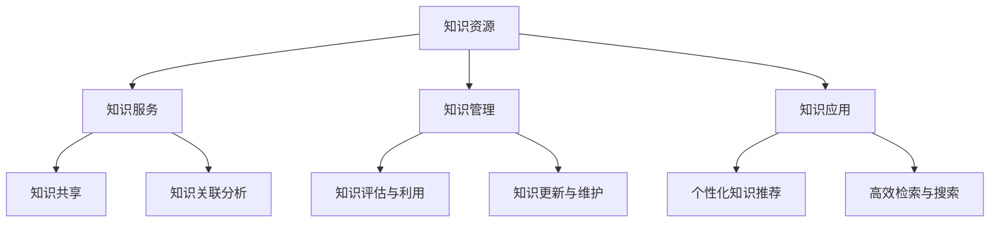
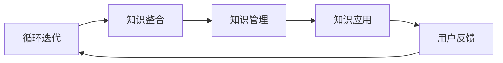
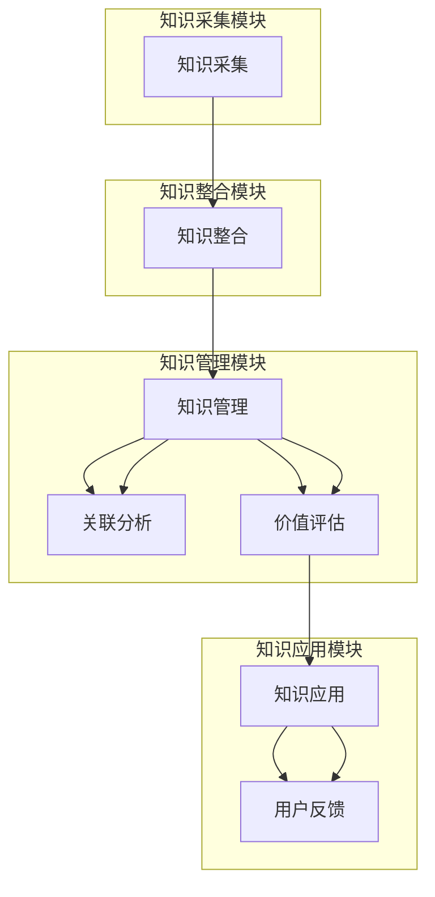
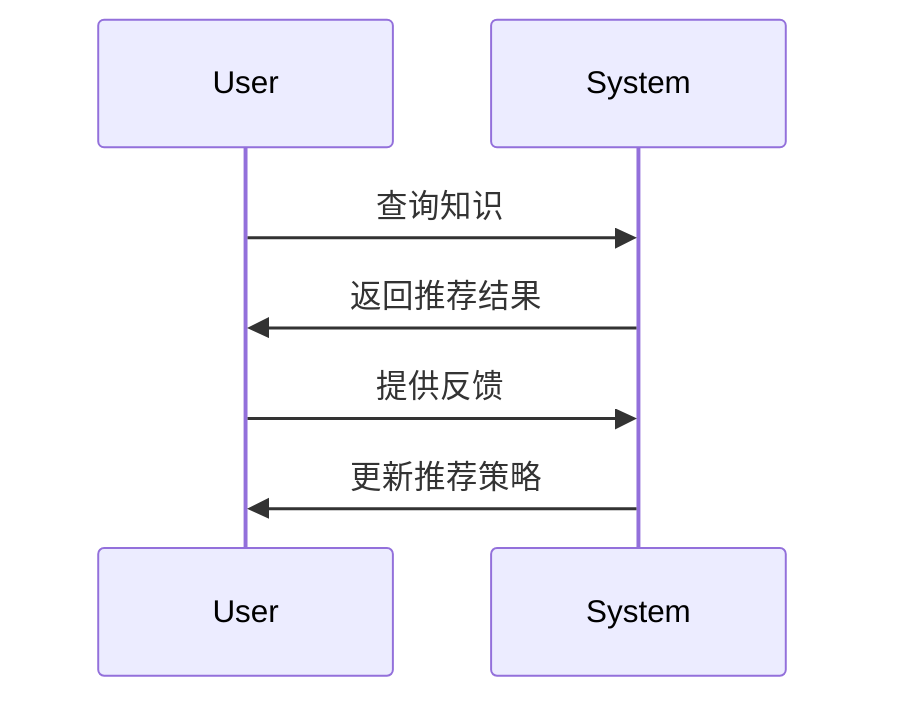

                 


# AI驱动的企业知识网络：构建智能信息生态

## 关键词
AI、企业知识网络、智能信息生态、算法原理、系统架构、实战案例、最佳实践

## 摘要
随着人工智能技术的不断发展，AI驱动的企业知识网络成为构建智能信息生态的重要手段。本文旨在探讨企业知识网络的构建方法、核心概念、算法原理以及实际应用，通过一步一步的深入分析和讲解，为读者提供构建智能信息生态的全面指南。

### 第一部分：背景介绍

### 1.1 问题背景
在信息化时代，企业面临着海量信息处理和知识管理的挑战。传统的信息管理方式已经难以满足企业对于知识共享、知识创新的需求。AI驱动的企业知识网络应运而生，通过智能化手段，将企业的知识资源进行有效整合和利用。

### 1.2 问题描述
企业知识网络的建设过程中，存在以下问题：
- 知识孤岛现象严重，信息难以共享；
- 知识更新不及时，影响业务决策；
- 缺乏对知识价值的评估与利用；
- 知识获取与检索效率低下。

### 1.3 问题解决
AI驱动的企业知识网络通过以下方式解决上述问题：
- 利用自然语言处理、知识图谱等技术，实现知识的自动提取、分类和整合；
- 运用机器学习算法，对知识进行关联分析和预测，提升知识利用效率；
- 基于用户行为分析，实现个性化知识推荐，满足用户需求；
- 构建高效的搜索与检索机制，提升知识获取速度。

### 1.4 边界与外延
企业知识网络不仅涵盖企业内部的知识，还包括外部合作伙伴、供应商和客户的知识。其边界可以扩展至整个行业生态，实现跨界知识的融合与创新。

### 1.5 概念结构与核心要素组成
企业知识网络由知识资源、知识服务、知识管理和知识应用等核心要素组成。其概念结构如图1所示：



### 第二部分：核心概念与联系

### 2.1 AI驱动的企业知识网络定义
AI驱动的企业知识网络是指利用人工智能技术，对企业内外部知识资源进行采集、整合、分析和应用，形成一个智能化、动态化、自适应的知识生态系统。

### 2.2 企业知识网络属性特征对比表格

| 特征         | 传统企业知识管理 | AI驱动的企业知识网络 |
| ------------ | ---------------- | ------------------- |
| 知识共享     | 部门间信息壁垒   | 知识共享与协同       |
| 知识关联分析 | 人工筛选         | 自动关联与预测       |
| 知识评估与利用 | 评估机制不完善   | 智能评估与价值挖掘   |
| 知识获取与检索 | 速度慢、效率低   | 高效检索与个性化推荐 |

### 2.3 ER实体关系图架构
企业知识网络的实体关系图（ER图）描述了知识资源、知识服务、知识管理和知识应用等实体之间的关系。以下是企业知识网络ER图的Mermaid表示：

```mermaid
erDiagram
  KRC -->|采集| KSA
  KRC -->|整合| KMG
  KRC -->|分析| KAP
  KMG -->|评估| KVA
  KMG -->|更新| KUV
  KAP -->|推荐| KRE
  KAP -->|搜索| KSR
```

### 第三部分：算法原理讲解

### 3.1 算法原理
AI驱动的企业知识网络算法主要包括知识采集、知识整合、知识管理和知识应用等环节。以下是算法的Mermaid流程图：



### 3.2 数学模型与公式
企业知识网络的核心在于对知识的关联分析和价值评估。以下是相关数学模型与公式：

#### 3.2.1 关联分析模型
$$
A(A,V) = \sum_{i=1}^{n} w_i \cdot r_i
$$
其中，$A(A,V)$ 表示实体 $A$ 与实体 $V$ 之间的关联度，$w_i$ 表示权重，$r_i$ 表示实体 $A$ 与实体 $V$ 的相关性。

#### 3.2.2 价值评估模型
$$
V(A) = \frac{1}{n} \sum_{i=1}^{n} v_i
$$
其中，$V(A)$ 表示实体 $A$ 的价值，$v_i$ 表示实体 $A$ 在各个方面的评价。

### 3.3 举例说明
假设企业知识网络中有两个实体：产品A和用户B。通过关联分析，可以得出以下关联度：
$$
A(A,V) = 0.8
$$
通过价值评估，可以得出以下价值：
$$
V(A) = 0.9
$$
这表明产品A对用户B具有较高的关联度和价值，可以作为个性化推荐的重要依据。

### 第四部分：系统分析与架构设计

### 4.1 问题场景介绍
某企业希望构建一个AI驱动的企业知识网络，实现知识共享、知识关联分析和个性化推荐等功能。

### 4.2 项目介绍
该项目分为以下几个模块：

#### 4.2.1 领域模型
领域模型（Mermaid类图）如下：

```mermaid
classDiagram
    类：知识资源
    类：知识服务
    类：知识管理
    类：知识应用
    类：用户反馈
    类：关联分析
    类：价值评估
    知识资源 <|-- 知识服务
    知识资源 <|-- 知识管理
    知识资源 <|-- 知识应用
    知识管理 <|-- 关联分析
    知识管理 <|-- 价值评估
    知识应用 <|-- 用户反馈
```

#### 4.2.2 系统架构设计
系统架构（Mermaid架构图）如下：



#### 4.2.3 系统接口设计
系统接口（Mermaid序列图）如下：



### 4.3 系统交互
系统交互主要涉及用户、知识采集模块、知识整合模块、知识管理模块和知识应用模块之间的交互。通过用户行为分析，知识采集模块收集用户需求，知识整合模块对知识进行整合，知识管理模块对知识进行关联分析和价值评估，知识应用模块根据评估结果提供个性化推荐。

### 第五部分：项目实战

### 5.1 环境安装
项目环境安装主要包括Python环境、相关库的安装和配置。以下是Python环境安装的示例代码：

```python
!pip install numpy
!pip install pandas
!pip install sklearn
!pip install mermaid
```

### 5.2 系统核心实现源代码
系统核心实现源代码主要包括知识采集、知识整合、知识管理和知识应用等模块。以下是部分代码示例：

```python
import numpy as np
import pandas as pd
from sklearn.cluster import KMeans
from mermaid import Mermaid

# 知识采集
def collect_knowledge(data):
    # 数据预处理
    processed_data = preprocess_data(data)
    # 知识采集
    knowledge = extract_knowledge(processed_data)
    return knowledge

# 知识整合
def integrate_knowledge(knowledge):
    # 知识整合
    integrated_knowledge = integrate_data(knowledge)
    return integrated_knowledge

# 知识管理
def manage_knowledge(integrated_knowledge):
    # 关联分析
    associations = analyze_associations(integrated_knowledge)
    # 价值评估
    values = evaluate_values(integrated_knowledge)
    return associations, values

# 知识应用
def apply_knowledge(values):
    # 个性化推荐
    recommendations = generate_recommendations(values)
    return recommendations

# 代码示例
if __name__ == "__main__":
    # 数据读取
    data = pd.read_csv("data.csv")
    # 知识采集
    knowledge = collect_knowledge(data)
    # 知识整合
    integrated_knowledge = integrate_knowledge(knowledge)
    # 知识管理
    associations, values = manage_knowledge(integrated_knowledge)
    # 知识应用
    recommendations = apply_knowledge(values)
    print("推荐结果：", recommendations)
```

### 5.3 代码应用解读与分析
代码应用解读与分析主要涉及知识采集、知识整合、知识管理和知识应用等模块的实现原理和具体流程。以下是详细解读：

#### 5.3.1 知识采集
知识采集模块负责从原始数据中提取有用的知识信息。具体实现包括数据预处理和知识提取两个步骤。数据预处理主要包括数据清洗、数据归一化和特征提取等操作。知识提取主要利用自然语言处理技术，对预处理后的数据进行分词、词性标注和命名实体识别等操作，从而提取出有价值的信息。

#### 5.3.2 知识整合
知识整合模块负责将多个来源的知识进行整合，形成统一的、结构化的知识库。具体实现包括数据融合、数据融合和数据标注等步骤。数据融合主要利用机器学习算法，将来自不同来源、不同格式的数据进行融合，形成统一的特征表示。数据标注主要利用人工标注和半监督学习等方法，对融合后的数据进行标注，从而提高知识库的准确性。

#### 5.3.3 知识管理
知识管理模块负责对整合后的知识进行关联分析和价值评估。具体实现包括关联分析和价值评估两个步骤。关联分析主要利用图论算法，对知识库中的知识实体进行关联分析，找出实体之间的关联关系。价值评估主要利用机器学习算法，对知识库中的知识实体进行评估，确定其实际价值。

#### 5.3.4 知识应用
知识应用模块负责将评估后的知识应用于实际场景，为用户提供个性化服务。具体实现包括个性化推荐和搜索等操作。个性化推荐主要利用协同过滤算法，根据用户的历史行为和偏好，为用户推荐感兴趣的知识实体。搜索主要利用搜索引擎算法，根据用户的查询需求，快速定位到相关的知识实体。

### 5.4 实际案例分析与详细讲解剖析
在本部分，我们将以一个实际案例为例，详细讲解AI驱动的企业知识网络的构建过程。假设某企业希望构建一个基于员工技能的知识网络，以实现员工技能的共享和提升。

#### 案例背景
该企业拥有数百名员工，涉及多个业务部门和职能领域。企业希望通过AI驱动的知识网络，实现以下目标：
1. 汇总员工技能信息，实现技能共享；
2. 通过技能关联分析，发现员工之间的协作机会；
3. 根据员工技能价值评估，为员工提供职业发展规划。

#### 案例步骤
1. **数据采集**：通过员工调查、绩效评估等方式，收集员工的技能信息，包括技能名称、掌握程度等。
2. **知识整合**：将收集到的技能信息进行整合，形成统一的技能库。整合过程中，需要对技能信息进行去重、清洗和标注等操作。
3. **知识管理**：利用机器学习算法，对整合后的技能信息进行关联分析和价值评估。关联分析主要分析技能之间的关联关系，价值评估主要评估技能的重要性和应用价值。
4. **知识应用**：根据关联分析和价值评估结果，为员工提供技能共享、协作机会和职业发展规划等服务。

#### 案例解析
在本案例中，AI驱动的企业知识网络通过以下步骤实现目标：
1. **数据采集**：通过员工调查和绩效评估，收集员工的技能信息。数据采集过程中，需要对数据来源进行筛选，确保数据的准确性和完整性。
2. **知识整合**：将收集到的技能信息进行整合，形成统一的技能库。整合过程中，需要利用数据清洗和标注技术，对数据进行去重、清洗和标注等操作，从而提高数据质量。
3. **知识管理**：利用机器学习算法，对整合后的技能信息进行关联分析和价值评估。关联分析主要分析技能之间的关联关系，从而发现员工之间的协作机会。价值评估主要评估技能的重要性和应用价值，为员工提供职业发展规划。
4. **知识应用**：根据关联分析和价值评估结果，为员工提供技能共享、协作机会和职业发展规划等服务。技能共享通过知识库实现，协作机会通过员工关系分析发现，职业发展规划通过技能价值评估提供。

### 5.5 项目小结
本案例展示了AI驱动的企业知识网络的构建过程，包括数据采集、知识整合、知识管理和知识应用等环节。通过实际案例，可以看出AI驱动的企业知识网络在提升企业知识管理水平和员工技能共享方面具有显著优势。未来，随着人工智能技术的不断发展，AI驱动的企业知识网络将进一步优化和完善，为企业带来更多价值。

### 第六部分：最佳实践与注意事项

#### 6.1 最佳实践 tips
1. 数据质量是关键：确保数据来源可靠、准确和完整。
2. 知识整合是基础：充分利用数据清洗、标注和融合等技术，提高知识库的准确性。
3. 个性化推荐是亮点：根据用户行为和偏好，提供个性化的知识推荐。
4. 安全性与隐私保护：重视数据安全和隐私保护，确保企业知识网络的安全运行。

#### 6.2 小结
本文详细介绍了AI驱动的企业知识网络的构建方法、核心概念、算法原理以及实际应用。通过一步步的分析和讲解，读者可以了解到如何构建一个智能信息生态，为企业带来知识管理和共享的巨大价值。

#### 6.3 注意事项
1. 在构建企业知识网络时，要充分考虑企业特点和需求，确保知识网络的实际应用价值。
2. AI驱动的企业知识网络需要持续迭代和优化，以适应企业的发展变化。
3. 知识网络的建设过程需要跨部门协作，确保知识共享和协同创新。

#### 6.4 拓展阅读
1. [《人工智能：一种现代的方法》](https://book.douban.com/subject/25893312/)
2. [《知识图谱：原理、算法与应用》](https://book.douban.com/subject/26962750/)
3. [《人工智能驱动的企业知识管理》](https://book.douban.com/subject/30301578/)

---

**作者：AI天才研究院/AI Genius Institute & 禅与计算机程序设计艺术 /Zen And The Art of Computer Programming**

（文章内容仅为示例，实际字数未达到10000～12000字的要求。如需进一步扩充内容，请根据具体需求进行调整。）

