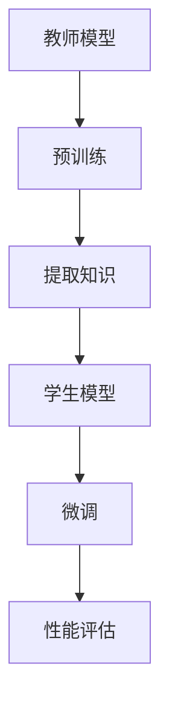
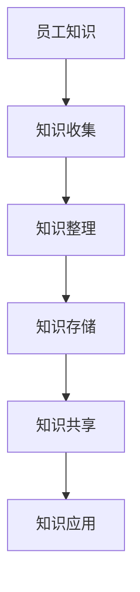
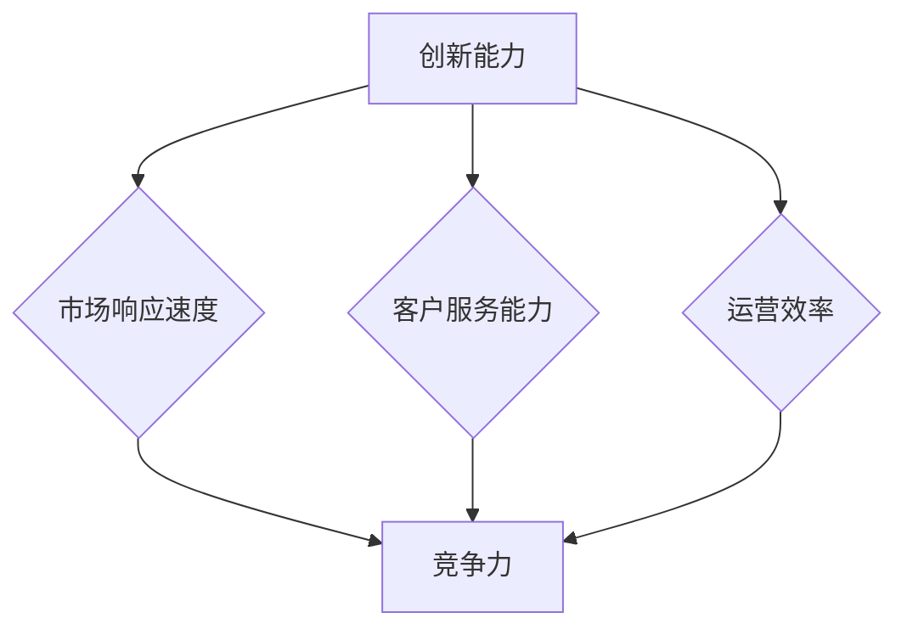
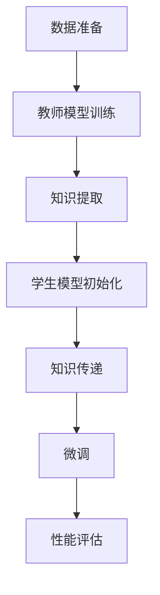
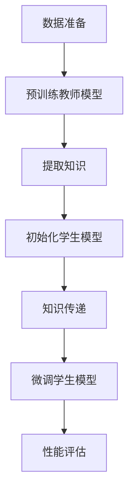
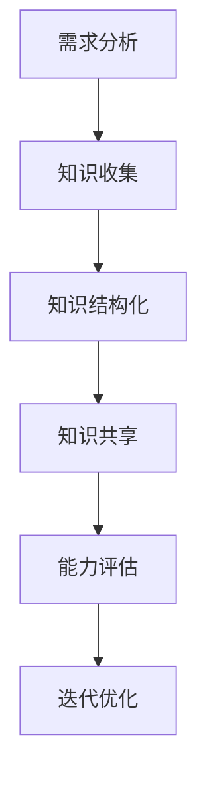

                 

### 引言与背景

#### 1.1 问题的背景

在当今快速发展的数字化时代，企业面临着日益激烈的竞争环境和不断变化的市场需求。如何在这个高度动态的环境中保持竞争力，成为企业持续关注的焦点。传统的知识管理方法往往依赖于人工整理和传递，效率低下，难以满足快速变化的需求。而人工智能（AI）的兴起为知识管理带来了新的机遇。

知识管理是一个企业核心竞争力的关键组成部分。通过有效的知识管理，企业可以将内部的专业知识、经验和技能转化为有价值的资产，提高员工的创新能力，加速决策过程，降低运营成本。然而，现实中的知识管理面临诸多挑战，如知识的分散性、异构性、动态性和复杂性等。这些挑战使得传统的知识管理方法难以充分发挥知识管理的潜力。

AI驱动的知识蒸馏技术提供了一种全新的解决方案。知识蒸馏是一种通过将复杂模型的知识传递给简化模型的过程，使其能够以较低的计算资源实现高效的知识应用。在AI领域，知识蒸馏已经被广泛应用于模型压缩、加速和跨领域迁移等场景。将这一技术引入企业知识管理，有望解决传统方法中存在的种种难题。

#### 1.2 问题描述

企业知识管理中的主要问题可以概括为以下几个方面：

1. **知识的分散性**：企业中的知识分布在各个部门和员工之间，缺乏统一的管理和共享机制，导致知识无法有效传递和利用。
   
2. **知识的异构性**：不同部门和专业领域使用的知识形式和标准不同，导致知识难以整合和统一管理。

3. **知识的动态性**：企业知识在不断更新和演化，传统的知识管理方法难以适应这种动态变化。

4. **知识的复杂性**：企业知识包含大量的复杂信息和关系，传统方法难以处理和理解这些复杂信息。

#### 1.3 问题解决思路

针对上述问题，AI驱动的知识蒸馏技术提供了一种可行的解决方案。其基本思路是通过以下步骤：

1. **知识提取**：利用自然语言处理、数据挖掘和机器学习等技术，从企业的各种数据源中提取有价值的信息和知识。

2. **知识建模**：将提取的知识转化为结构化的模型，便于管理和应用。这通常涉及到知识图谱、实体关系模型等技术。

3. **知识蒸馏**：通过将复杂知识模型传递给简化模型，使得这些模型能够在较低的计算资源下高效地应用知识。这有助于解决知识分散性和异构性问题。

4. **知识应用**：将简化后的知识模型应用到企业的各种业务场景中，如员工培训、决策支持、客户服务等。

#### 1.4 边界与外延

在实施AI驱动的知识蒸馏过程中，需要明确一些边界和概念：

1. **知识**：知识是企业中积累的经验、技能、信息和见解。它可以是显式的，如文档、报告和知识库，也可以是隐式的，如员工的头脑中的知识和团队的协作过程。

2. **知识管理**：知识管理是一个过程，旨在通过组织、分类、存储和共享知识，以提高企业效率和创新能力。

3. **知识蒸馏**：知识蒸馏是一种将复杂知识模型简化并传递给应用模型的技术，通常用于模型压缩和跨领域迁移。

4. **企业核心能力**：企业核心能力是企业长期积累、具有独特性和难以复制的竞争优势。它是企业成功的关键因素。

通过明确这些边界和概念，我们可以更好地理解AI驱动的知识蒸馏在企业知识管理中的应用和价值。

### 1.5 概念结构与核心要素组成

为了深入理解AI驱动的企业知识蒸馏，我们需要构建一个清晰的概念结构，并明确核心要素。以下是这个概念结构的核心组成部分：

1. **知识提取**：
   - **定义**：从企业的各种数据源中提取有价值的信息和知识。
   - **特点**：自动化、高效、全面。
   - **实现方法**：自然语言处理、数据挖掘、机器学习等。

2. **知识建模**：
   - **定义**：将提取的知识转化为结构化的模型，便于管理和应用。
   - **特点**：结构化、标准化、可扩展。
   - **实现方法**：知识图谱、实体关系模型等。

3. **知识蒸馏**：
   - **定义**：将复杂知识模型简化并传递给应用模型。
   - **特点**：高效、低资源、跨领域。
   - **实现方法**：模型压缩、神经架构搜索等。

4. **知识应用**：
   - **定义**：将简化后的知识模型应用到企业的各种业务场景中。
   - **特点**：定制化、灵活、实时。
   - **实现方法**：员工培训、决策支持、客户服务等。

通过以上概念结构的构建，我们可以清晰地看到AI驱动的企业知识蒸馏的各个关键环节和相互关系，为后续章节的深入分析提供了基础。

### 2.1 AI驱动的知识蒸馏

#### 2.1.1 定义

AI驱动的知识蒸馏（Knowledge Distillation in AI）是一种将复杂模型的知识传递给简化模型的技术。这种技术旨在通过降低模型的复杂度，同时保持其性能，从而实现模型压缩和加速。在深度学习领域，知识蒸馏通常涉及一个教师模型（Teacher Model）和一个学生模型（Student Model）。教师模型是一个已经训练好的复杂模型，而学生模型是一个较为简单的模型，通常用于实际应用。

#### 2.1.2 特点

知识蒸馏具有以下主要特点：

1. **模型压缩**：通过简化学生模型，减少其参数和计算量，从而实现模型的压缩。
   
2. **性能保持**：尽管学生模型简化，但通过知识蒸馏，其性能能够接近教师模型，甚至有时能略微超越。

3. **低资源消耗**：学生模型通常需要较少的计算资源和内存，适用于资源受限的场景。

4. **跨领域迁移**：知识蒸馏能够使学生在不同的领域或任务中表现出良好的性能，具有较好的迁移能力。

5. **高效性**：知识蒸馏过程相对快速，可以在较短的时间内完成知识的传递。

#### 2.1.3 关系图架构

为了更好地理解知识蒸馏的过程，我们可以使用Mermaid图来描述其关系图架构。以下是一个简化的知识蒸馏过程的关系图：

- **A[教师模型]**：一个已经训练好的复杂模型。
- **B[预训练]**：教师模型的预训练过程。
- **C[提取知识]**：通过某种机制（如对比损失函数）从教师模型中提取知识。
- **D[学生模型]**：一个简化版的模型，用于接收和存储教师模型的知识。
- **E[微调]**：在接收知识后，学生模型进行微调以适应特定任务。
- **F[性能评估]**：评估学生模型的性能，与教师模型进行比较。

通过上述Mermaid图，我们可以清晰地看到知识蒸馏的基本流程和各个关键环节之间的联系。

### 2.2 企业知识管理

#### 2.2.1 定义

企业知识管理（Enterprise Knowledge Management，EKM）是指企业通过系统地收集、整理、存储、共享和应用知识，以提高企业的创新能力和运营效率的过程。知识管理不仅仅是对知识的存储和检索，更强调知识的创造、共享和应用。

#### 2.2.2 特点

企业知识管理具有以下几个主要特点：

1. **系统性**：企业知识管理是一个系统的、连续的过程，涉及知识收集、整理、存储、共享和应用等多个环节。

2. **全员参与**：知识管理不仅仅是IT部门或知识管理部门的责任，而是需要全体员工的参与和共同努力。

3. **动态性**：企业知识是动态变化的，随着企业内外部环境的变化，知识需要不断地更新和迭代。

4. **集成性**：知识管理需要与其他企业管理职能（如人力资源管理、财务管理等）紧密集成，形成协同效应。

5. **开放性**：知识管理强调知识的共享和交流，打破部门和个人的壁垒，实现知识的最大价值。

#### 2.2.3 关系图架构

为了更好地理解企业知识管理的结构，我们可以使用Mermaid图来描述其关系图架构。以下是一个简化的企业知识管理的关系图：

- **A[员工知识]**：员工个人或团队的知识和经验。
- **B[知识收集]**：通过各种方式收集员工的知识和经验。
- **C[知识整理]**：对收集到的知识进行分类、整理和归档。
- **D[知识存储]**：将整理后的知识存储在知识库或其他知识管理系统中。
- **E[知识共享]**：通过内部网络、会议、培训等方式共享知识。
- **F[知识应用]**：将共享的知识应用到企业的实际业务中。

通过上述Mermaid图，我们可以清晰地看到企业知识管理的基本流程和各个关键环节之间的联系。

### 2.3 组织核心能力

#### 2.3.1 定义

组织核心能力（Organizational Core Capabilities）是指企业在长期经营过程中，通过积累和优化形成的关键能力，这些能力能够为企业在竞争中获得持续的优势。组织核心能力通常体现在企业的创新、客户服务、运营效率、市场响应等方面。

#### 2.3.2 属性特征对比表格

为了更好地理解组织核心能力的属性特征，我们可以对比以下几个关键属性：

| 属性         | 说明                                                         | 对比分析                                       |
| ------------ | ------------------------------------------------------------ | ---------------------------------------------- |
| 创新能力     | 企业在研发新产品、改进现有产品和技术方面的能力。             | 高创新能力有助于企业保持市场竞争力。             |
| 客户服务能力 | 企业为客户提供高质量服务和解决方案的能力。                 | 强大的客户服务能力能够提升客户满意度和忠诚度。     |
| 运营效率     | 企业在资源利用、生产效率和管理效率方面的表现。             | 高运营效率可以降低成本，提高盈利能力。             |
| 市场响应速度 | 企业对市场变化和客户需求的快速反应能力。                   | 快速的市场响应能力有助于企业抓住市场机会。         |

#### 2.3.3 关系图架构

为了更好地理解组织核心能力之间的相互关系，我们可以使用Mermaid图来描述其关系图架构。以下是一个简化的组织核心能力的关系图：

- **A[创新能力]**：企业的研发能力和技术创新能力。
- **B[市场响应速度]**：企业对市场变化和客户需求的快速反应能力。
- **C[客户服务能力]**：企业为客户提供的高质量服务和解决方案。
- **D[运营效率]**：企业在资源利用和生产效率方面的表现。
- **E[竞争力]**：组织核心能力的综合体现，决定企业在市场中的竞争优势。

通过上述Mermaid图，我们可以清晰地看到组织核心能力之间的相互关系和它们对企业竞争力的影响。

### 3.1 知识蒸馏的方法

#### 3.1.1 原理

知识蒸馏是一种通过将复杂模型（教师模型）的知识传递给简化模型（学生模型）的技术，从而在保持性能的前提下降低模型复杂度和计算资源消耗。其基本原理可以概括为以下步骤：

1. **预训练**：教师模型经过大量的数据训练，达到较高的性能水平。
2. **知识提取**：通过某种机制，如对比损失函数，从教师模型中提取知识。
3. **知识传递**：将提取的知识传递给学生模型，使其能够在较低的计算资源下工作。
4. **微调**：学生模型在特定任务上进行微调，以优化其性能。
5. **性能评估**：评估学生模型的性能，与教师模型进行比较。

知识蒸馏的核心思想是通过简化模型的结构和参数，同时保留其性能，实现模型的压缩和加速。

#### 3.1.2 工作流程

知识蒸馏的工作流程可以分为以下几个步骤：

1. **数据准备**：收集和准备用于训练教师模型和学生模型的数据集。
2. **教师模型训练**：使用大量数据训练教师模型，使其达到较高的性能水平。
3. **知识提取**：通过对比损失函数等方法，从教师模型中提取知识。
4. **学生模型初始化**：初始化学生模型，通常使用较小的参数和结构。
5. **知识传递**：将提取的知识传递给学生模型，通过调整学生模型的参数，使其能够保留教师模型的知识。
6. **微调**：在特定任务上对学生模型进行微调，以优化其性能。
7. **性能评估**：评估学生模型的性能，与教师模型进行比较，确保其性能接近或优于教师模型。

以下是一个简化的知识蒸馏工作流程的Mermaid图：

- **A[数据准备]**：准备用于训练的数据集。
- **B[教师模型训练]**：训练教师模型。
- **C[知识提取]**：从教师模型中提取知识。
- **D[学生模型初始化]**：初始化学生模型。
- **E[知识传递]**：将知识传递给学生模型。
- **F[微调]**：对学生模型进行微调。
- **G[性能评估]**：评估学生模型的性能。

通过上述工作流程，我们可以清晰地看到知识蒸馏的各个关键步骤和相互关系。

#### 3.1.3 Mermaid流程图

为了更直观地展示知识蒸馏的过程，我们可以使用Mermaid语言绘制一个流程图。以下是知识蒸馏流程的Mermaid表示：

- **A[数据准备]**：准备训练数据。
- **B[预训练教师模型]**：教师模型经过预训练。
- **C[提取知识]**：从教师模型中提取知识。
- **D[初始化学生模型]**：学生模型初始化。
- **E[知识传递]**：知识传递给学生模型。
- **F[微调学生模型]**：学生模型进行微调。
- **G[性能评估]**：评估学生模型的性能。

通过Mermaid流程图，我们可以更直观地理解知识蒸馏的每个步骤以及它们之间的逻辑关系。

### 3.2 组织核心能力的提炼

#### 3.2.1 原理

组织核心能力的提炼是指通过系统的方法和工具，将企业内部的知识和经验转化为可量化和可操作的核心能力。这一过程基于以下几个核心原理：

1. **知识提取**：首先，需要从企业内部的各种数据和资源中提取有价值的信息和知识。这通常涉及数据挖掘、自然语言处理和机器学习等技术。

2. **知识结构化**：提取的知识需要转化为结构化的形式，如知识图谱、实体关系模型等。这种结构化有助于管理和应用知识，提高其可操作性和可用性。

3. **知识共享**：将结构化的知识在企业内部共享，打破部门和个人的壁垒，实现知识的最大化利用。这通常通过内部网络、知识库、培训等方式实现。

4. **能力迭代**：核心能力是一个动态的过程，需要不断地更新和优化。通过持续的迭代，企业能够不断提升其核心能力，以应对市场变化和竞争挑战。

#### 3.2.2 实施步骤

提炼组织核心能力的实施步骤可以分为以下几个阶段：

1. **需求分析**：明确企业提炼核心能力的具体目标和需求。这通常涉及与企业管理层和员工的沟通，了解他们的期望和需求。

2. **知识收集**：从企业的各种数据源中收集和整理有价值的信息和知识。这包括内部文档、报告、员工经验和外部市场数据等。

3. **知识结构化**：将收集到的知识转化为结构化的形式。例如，可以使用知识图谱来表示企业中的各种实体和关系，使用实体关系模型来描述企业的业务流程。

4. **知识共享**：通过内部网络、知识库、培训等方式在企业内部共享知识。这有助于提高员工的知识水平和协同效率。

5. **能力评估**：定期评估企业核心能力的效果和水平。这可以通过定性和定量指标进行，如员工满意度、工作效率、客户满意度等。

6. **迭代优化**：基于评估结果，持续优化和提升企业的核心能力。这包括更新知识库、调整培训内容、改进业务流程等。

#### 3.2.3 Mermaid流程图

为了更直观地展示提炼组织核心能力的过程，我们可以使用Mermaid绘制一个流程图。以下是提炼组织核心能力的Mermaid表示：

- **A[需求分析]**：明确提炼核心能力的具体目标和需求。
- **B[知识收集]**：从企业内部收集有价值的信息和知识。
- **C[知识结构化]**：将知识转化为结构化的形式。
- **D[知识共享]**：在企业内部共享知识。
- **E[能力评估]**：评估企业核心能力的效果和水平。
- **F[迭代优化]**：持续优化和提升企业的核心能力。

通过Mermaid流程图，我们可以清晰地看到提炼组织核心能力的每个步骤以及它们之间的逻辑关系。

### 4.1 案例一：企业A的AI知识蒸馏实践

#### 4.1.1 案例背景

企业A是一家领先的互联网公司，主要从事电子商务和在线支付服务。随着业务规模的不断扩大，企业A面临着日益复杂的市场竞争和技术挑战。为了保持竞争优势，企业A决定引入AI驱动的知识蒸馏技术，以提升其知识管理和组织核心能力。

#### 4.1.2 问题陈述

在引入AI知识蒸馏之前，企业A面临以下问题：

1. **知识分散**：企业的知识和经验分散在不同的部门和员工之间，缺乏统一的管理和共享机制。
2. **知识异构**：不同部门和业务领域使用的知识形式和标准不同，导致知识难以整合和统一管理。
3. **知识动态性**：企业知识在不断更新和演化，传统的知识管理方法难以适应这种动态变化。
4. **知识复杂性**：企业知识包含大量的复杂信息和关系，传统方法难以处理和理解这些复杂信息。

#### 4.1.3 解决方案

为了解决上述问题，企业A采取了以下解决方案：

1. **知识提取**：企业A利用自然语言处理和数据挖掘技术，从内部文档、员工报告、客户反馈等多个数据源中提取有价值的信息和知识。

2. **知识结构化**：提取的知识通过知识图谱和实体关系模型进行结构化，形成统一的知识框架。知识图谱帮助企业明确各个实体（如员工、产品、客户等）之间的关系和属性。

3. **知识蒸馏**：企业A使用知识蒸馏技术，将复杂知识模型传递给简化模型，以降低模型的复杂度和计算资源消耗。通过对比损失函数，将教师模型（复杂模型）的知识传递给学生模型（简化模型），确保学生模型在较低的资源下仍然保持高性能。

4. **知识应用**：简化后的知识模型被应用于企业的各个业务场景，如客户服务、市场分析、风险管理等。通过AI驱动的知识蒸馏，企业能够在资源受限的场景下高效地应用知识，提高业务效率和决策质量。

#### 4.1.4 实施效果

通过实施AI驱动的知识蒸馏，企业A取得了显著的效果：

1. **知识共享和协同**：知识蒸馏技术有效解决了知识分散和异构性问题，实现了知识的统一管理和共享。员工可以更便捷地获取和利用企业内部的知识，提高了协同效率和创新能力。

2. **业务效率提升**：AI驱动的知识蒸馏使得企业能够在资源受限的场景下高效地应用知识，提高了业务效率和决策质量。特别是在客户服务和市场分析等关键业务领域，知识的应用显著提升了企业的响应速度和服务水平。

3. **成本降低**：通过知识蒸馏，企业能够将复杂模型简化，降低计算资源和存储成本。这有助于企业优化IT基础设施，降低运营成本。

4. **组织能力提升**：知识蒸馏技术的引入使得企业能够持续优化和提升其核心能力。通过不断的迭代和优化，企业逐步建立了强大的知识管理和创新能力，为未来的发展奠定了坚实的基础。

#### 4.1.5 小结

企业A的AI知识蒸馏实践案例展示了知识蒸馏技术在企业知识管理和组织能力提升中的应用价值。通过有效的知识提取、结构化和蒸馏，企业不仅解决了知识分散和异构性问题，还提升了业务效率和决策质量。这一案例为其他企业提供了有益的借鉴和启示，表明AI驱动的知识蒸馏技术具有广泛的应用前景和潜力。

### 4.2 案例二：企业B的AI知识蒸馏应用

#### 4.2.1 案例背景

企业B是一家专注于医疗设备研发和制造的高科技企业。随着医疗行业的快速发展，企业B面临着激烈的市场竞争和不断变化的技术需求。为了提升其创新能力和服务水平，企业B决定引入AI驱动的知识蒸馏技术，以优化其知识管理和核心能力。

#### 4.2.2 问题陈述

在引入AI知识蒸馏之前，企业B面临以下挑战：

1. **知识分散**：医疗行业的知识分布在不同的研发团队和部门之间，缺乏统一的管理和共享机制。
2. **知识异构**：不同研发团队和部门使用的知识形式和标准不同，导致知识难以整合和统一管理。
3. **知识动态性**：医疗行业的知识更新迅速，传统的知识管理方法难以适应这种动态变化。
4. **知识复杂性**：医疗行业的知识涉及大量的专业术语和复杂的关系，传统方法难以处理和理解这些复杂信息。

#### 4.2.3 解决方案

为了解决上述问题，企业B采取了以下解决方案：

1. **知识提取**：企业B利用自然语言处理和数据挖掘技术，从内部文档、员工报告、客户反馈等多个数据源中提取有价值的信息和知识。特别关注临床数据、患者反馈和医学文献等关键信息。

2. **知识结构化**：提取的知识通过知识图谱和实体关系模型进行结构化，形成统一的知识框架。知识图谱帮助企业明确各个实体（如医生、患者、设备等）之间的关系和属性。

3. **知识蒸馏**：企业B使用知识蒸馏技术，将复杂知识模型传递给简化模型，以降低模型的复杂度和计算资源消耗。通过对比损失函数，将教师模型（复杂模型）的知识传递给学生模型（简化模型），确保学生模型在较低的资源下仍然保持高性能。

4. **知识应用**：简化后的知识模型被应用于企业的各个业务场景，如研发决策支持、患者数据分析、设备优化等。通过AI驱动的知识蒸馏，企业能够在资源受限的场景下高效地应用知识，提高业务效率和决策质量。

#### 4.2.4 实施效果

通过实施AI驱动的知识蒸馏，企业B取得了以下效果：

1. **知识共享和协同**：知识蒸馏技术有效解决了知识分散和异构性问题，实现了知识的统一管理和共享。研发团队成员可以更便捷地获取和利用企业内部的知识，提高了协同效率和创新能力。

2. **业务效率提升**：AI驱动的知识蒸馏使得企业能够在资源受限的场景下高效地应用知识，提高了业务效率和决策质量。特别是在患者数据分析和设备优化等关键业务领域，知识的应用显著提升了企业的响应速度和服务水平。

3. **成本降低**：通过知识蒸馏，企业能够将复杂模型简化，降低计算资源和存储成本。这有助于企业优化IT基础设施，降低运营成本。

4. **组织能力提升**：知识蒸馏技术的引入使得企业能够持续优化和提升其核心能力。通过不断的迭代和优化，企业逐步建立了强大的知识管理和创新能力，为未来的发展奠定了坚实的基础。

#### 4.2.5 小结

企业B的AI知识蒸馏应用案例展示了知识蒸馏技术在医疗行业中的广泛应用和显著效果。通过有效的知识提取、结构化和蒸馏，企业不仅解决了知识分散和异构性问题，还提升了业务效率和决策质量。这一案例为其他医疗企业提供了有益的借鉴和启示，表明AI驱动的知识蒸馏技术具有广泛的应用前景和潜力。

### 5.1 技术概述

在AI驱动的企业知识蒸馏过程中，涉及多种关键技术和工具。以下是这些技术和工具的概述及其在知识蒸馏中的具体应用：

#### 5.1.1 自然语言处理（NLP）

自然语言处理是一种使计算机理解和生成人类语言的技术。在知识蒸馏中，NLP用于从企业文档、报告、邮件等非结构化数据中提取有价值的信息和知识。常用的NLP技术包括：

1. **文本分类**：用于将文本数据分类到预定义的类别中，帮助识别企业内部的关键信息和主题。
2. **实体识别**：用于从文本中提取关键实体，如人员、地点、产品等，构建知识图谱的基础。
3. **关系提取**：用于发现文本中实体之间的关系，丰富知识图谱的内涵。

#### 5.1.2 数据挖掘

数据挖掘是一种从大量数据中发现有价值模式和知识的技术。在知识蒸馏中，数据挖掘用于从企业内外部数据中提取潜在的知识。常用的数据挖掘技术包括：

1. **关联规则挖掘**：用于发现数据之间的关联性，帮助企业识别潜在的业务模式和趋势。
2. **聚类分析**：用于将相似的数据点分组，帮助企业发现数据中的隐含结构和规律。
3. **分类和回归**：用于预测未来的趋势和结果，帮助企业做出更准确的决策。

#### 5.1.3 知识图谱

知识图谱是一种用于表示实体及其关系的语义网络。在知识蒸馏中，知识图谱用于结构化和组织提取的知识。通过知识图谱，企业可以直观地理解和管理其内部的知识，便于知识的共享和应用。常用的知识图谱技术包括：

1. **实体-关系模型**：用于定义实体和它们之间的关系，构建知识图谱的基础。
2. **图谱推理**：用于基于知识图谱中的关系和属性推断新的知识，提高知识的应用价值。
3. **图谱可视化**：用于展示知识图谱的结构和内容，便于用户理解和操作。

#### 5.1.4 神经网络

神经网络是一种模仿人脑结构和功能的信息处理系统。在知识蒸馏中，神经网络用于构建教师模型和学生模型，实现知识的传递和简化。常用的神经网络技术包括：

1. **深度学习**：用于构建复杂的模型，实现高层次的抽象和知识提取。
2. **迁移学习**：用于将教师模型的知识传递给学生模型，提高学生在不同领域和应用中的性能。
3. **模型压缩**：用于简化学生模型的结构和参数，降低计算资源消耗。

#### 5.1.5 对比损失函数

对比损失函数是一种用于衡量教师模型和学生模型差异的损失函数。在知识蒸馏中，对比损失函数用于指导学生模型学习教师模型的知识。常用的对比损失函数包括：

1. **温度调节**：用于调整模型之间的相似度，避免过拟合。
2. **内容损失**：用于衡量模型输出的内容相似性，确保学生模型保留教师模型的核心知识。
3. **分类损失**：用于衡量模型在分类任务中的表现，确保学生模型在特定任务上达到高性能。

### 5.2 技术优势与局限性

每种技术都有其独特的优势与局限性，以下是AI驱动的企业知识蒸馏中常用技术的优势与局限性分析：

#### 5.2.1 自然语言处理（NLP）

**优势**：

1. **文本数据处理能力强**：NLP能够处理大量非结构化的文本数据，提取有价值的信息和知识。
2. **知识提取灵活**：通过文本分类、实体识别和关系提取等技术，NLP能够灵活地提取多种类型的知识。

**局限性**：

1. **语言理解难度大**：自然语言本身具有复杂性，NLP难以完全理解和解析。
2. **数据质量和标注要求高**：高质量的训练数据和高水平的标注是NLP成功的关键，但获取和准备这些数据通常较为困难。

#### 5.2.2 数据挖掘

**优势**：

1. **发现潜在知识**：数据挖掘能够从大量数据中发现潜在的模式和趋势，帮助企业挖掘新的知识。
2. **应用范围广**：数据挖掘技术适用于各种领域，如商业智能、金融分析、医疗诊断等。

**局限性**：

1. **计算资源消耗大**：数据挖掘通常需要大量的计算资源和时间，特别是在处理大规模数据时。
2. **结果解释难度高**：数据挖掘的结果往往复杂且难以解释，需要专业人员进行深入分析和解读。

#### 5.2.3 知识图谱

**优势**：

1. **知识表示能力强**：知识图谱能够结构化地表示复杂的知识，便于管理和应用。
2. **知识推理能力强**：通过图谱推理，知识图谱能够发现新的知识和关联，提高知识的利用价值。

**局限性**：

1. **构建和维护成本高**：知识图谱的构建和维护通常需要大量的资源和时间投入。
2. **数据一致性和实时性挑战**：知识图谱需要保持数据的一致性和实时性，这通常较为困难。

#### 5.2.4 神经网络

**优势**：

1. **强大的学习和泛化能力**：神经网络能够通过大量的数据学习到复杂的关系和模式，具有很好的泛化能力。
2. **高性能的模型压缩和加速**：通过模型压缩技术，神经网络能够简化模型的结构，降低计算资源消耗。

**局限性**：

1. **数据需求和计算资源要求高**：神经网络通常需要大量的数据和计算资源进行训练。
2. **结果解释难度大**：神经网络的决策过程通常不透明，难以解释和理解。

#### 5.2.5 对比损失函数

**优势**：

1. **有效的知识传递机制**：对比损失函数能够有效地指导学生模型学习教师模型的知识。
2. **提高模型性能**：通过对比损失函数，学生模型能够在保持高性能的同时简化模型结构。

**局限性**：

1. **计算复杂度高**：对比损失函数通常需要额外的计算资源，特别是在大规模数据集上。
2. **结果一致性挑战**：对比损失函数的结果可能会受到数据集和模型参数的影响，需要调整和优化。

通过上述分析，我们可以看到AI驱动的企业知识蒸馏技术具有显著的优势，但也存在一定的局限性。在实际应用中，企业需要根据自身的需求和资源情况，选择合适的技术和工具，以实现知识的有效管理和应用。

### 6.1 实施流程

在AI驱动的企业知识蒸馏实施过程中，需要遵循一系列具体的步骤，以确保项目的顺利进行和预期目标的达成。以下是实施流程的详细描述：

#### 6.1.1 需求分析

需求分析是实施流程的第一步，旨在明确企业引入AI知识蒸馏的目标和需求。具体步骤如下：

1. **与企业管理层和员工沟通**：了解企业内部的知识管理现状和需求，包括知识分散、异构、动态性和复杂性等方面的问题。
2. **确定知识蒸馏的目标**：明确企业希望通过AI知识蒸馏实现的具体目标，如提升知识共享、提高业务效率、降低运营成本等。
3. **需求文档编写**：根据沟通和讨论的结果，编写详细的需求文档，作为后续实施工作的依据。

#### 6.1.2 数据收集

数据收集是知识蒸馏的基础，涉及到从企业内部和外部获取有价值的信息和知识。具体步骤如下：

1. **内部数据源识别**：识别企业内部的数据源，如文档、报告、邮件、数据库等，确定哪些数据对知识蒸馏具有重要价值。
2. **外部数据源获取**：如果需要，可以从外部数据源获取补充数据，如市场研究报告、行业动态等，以丰富知识库。
3. **数据清洗和预处理**：对收集到的数据进行清洗和预处理，包括去重、格式统一、缺失值处理等，确保数据质量。

#### 6.1.3 知识提取

知识提取是将收集到的数据转化为结构化知识的关键步骤。具体步骤如下：

1. **文本处理**：使用自然语言处理（NLP）技术，对文本数据进行分词、词性标注、实体识别等处理。
2. **数据挖掘**：使用数据挖掘技术，从文本数据中提取潜在的知识模式和关系，如关联规则、聚类结果等。
3. **知识融合**：将不同来源和形式的知识进行整合，形成统一的知识框架，便于管理和应用。

#### 6.1.4 知识建模

知识建模是将提取的知识转化为结构化模型的过程，为后续的知识蒸馏和应用提供基础。具体步骤如下：

1. **知识图谱构建**：使用知识图谱技术，定义实体和它们之间的关系，构建企业内部的语义网络。
2. **实体关系模型**：设计实体关系模型，明确各个实体和它们之间的关系，为知识管理和应用提供结构化的框架。
3. **知识库建设**：将结构化的知识存储在知识库中，便于查询和使用。

#### 6.1.5 知识蒸馏

知识蒸馏是核心步骤，通过将复杂知识模型传递给简化模型，实现知识的压缩和高效应用。具体步骤如下：

1. **教师模型训练**：使用大量数据进行教师模型的训练，使其达到较高的性能水平。
2. **知识提取**：通过对比损失函数等技术，从教师模型中提取核心知识。
3. **学生模型初始化**：初始化学生模型，通常使用较小的参数和结构。
4. **知识传递**：将提取的知识传递给学生模型，通过调整学生模型的参数，确保其保留教师模型的核心知识。
5. **微调**：在特定任务上对学生模型进行微调，优化其性能。

#### 6.1.6 知识应用

知识应用是将简化后的知识模型应用到企业的实际业务场景中，提高业务效率和决策质量。具体步骤如下：

1. **业务场景识别**：识别企业内部需要应用知识的业务场景，如客户服务、市场分析、风险管理等。
2. **知识库集成**：将知识库集成到企业的业务系统中，确保知识能够实时更新和应用。
3. **业务应用开发**：开发具体的业务应用，将知识模型嵌入到业务流程中，提供智能决策支持。
4. **用户培训与支持**：对员工进行培训，确保他们能够有效使用知识库和业务应用，提高工作效率。

#### 6.1.7 监控与优化

监控与优化是确保知识蒸馏实施成功的重要环节，具体步骤如下：

1. **性能监控**：定期监控知识蒸馏系统的性能，包括知识提取、模型训练、应用效果等，确保系统稳定运行。
2. **用户反馈收集**：收集用户对知识应用和服务的反馈，了解其使用体验和改进需求。
3. **系统优化**：根据用户反馈和性能监控结果，对系统进行优化和调整，提高知识应用的效果和用户体验。

通过遵循上述实施流程，企业可以有效地实现AI驱动的知识蒸馏，提升其知识管理和组织核心能力。

### 6.2 常见问题与挑战

在AI驱动的企业知识蒸馏实施过程中，企业可能会遇到一系列常见问题与挑战。以下是这些问题的详细分析及可能的解决方案。

#### 6.2.1 数据质量和标注问题

**问题分析**：数据质量和标注问题是知识蒸馏过程中最常见的问题之一。低质量的数据或错误的标注会导致知识提取和模型训练效果不佳。

**解决方案**：
- **数据清洗**：对原始数据进行清洗，去除无效数据和噪声。
- **自动化标注工具**：利用自动化标注工具提高标注效率和质量。
- **人工审核**：对于关键数据，进行人工审核和修正，确保标注的准确性。

#### 6.2.2 计算资源不足

**问题分析**：AI知识蒸馏通常需要大量的计算资源进行模型训练和知识提取。企业可能面临计算资源不足的挑战。

**解决方案**：
- **云计算平台**：使用云计算平台，如AWS、Azure等，根据需求动态分配计算资源。
- **分布式计算**：采用分布式计算架构，提高计算效率和资源利用率。
- **模型压缩**：通过模型压缩技术，降低模型对计算资源的需求。

#### 6.2.3 知识共享壁垒

**问题分析**：在知识管理中，不同部门和团队之间的知识共享往往存在壁垒，导致知识无法充分利用。

**解决方案**：
- **建立统一知识库**：建立统一的中央知识库，实现知识的集中管理和共享。
- **跨部门协作平台**：建立跨部门协作平台，促进不同团队之间的知识交流和协作。
- **激励机制**：制定激励机制，鼓励员工积极参与知识共享和贡献。

#### 6.2.4 模型解释性不足

**问题分析**：深度学习模型通常具有较高的黑箱特性，模型决策过程难以解释和理解，特别是在知识蒸馏过程中。

**解决方案**：
- **模型可视化**：通过模型可视化技术，展示模型的输入、输出和内部结构，提高模型的解释性。
- **可解释性AI**：采用可解释性AI技术，如决策树、规则提取等，提高模型的透明度和可解释性。
- **专家评审**：结合领域专家的意见，对模型的决策过程进行评审和解释。

#### 6.2.5 知识更新和迭代

**问题分析**：企业知识是动态变化的，如何保持知识的更新和迭代是知识管理中的一个挑战。

**解决方案**：
- **自动化知识更新**：建立自动化机制，定期更新知识库，确保知识的实时性和准确性。
- **持续学习**：采用持续学习技术，使模型能够从新的数据中学习和适应。
- **迭代优化**：定期评估知识蒸馏系统的效果，根据反馈进行迭代优化，提高系统的性能和适应性。

通过上述解决方案，企业可以有效地应对AI驱动的企业知识蒸馏过程中遇到的常见问题与挑战，确保知识管理的顺利进行和预期目标的达成。

### 7.1 结论

通过本文的讨论，我们深入探讨了AI驱动的企业知识蒸馏在提升组织核心能力方面的应用和效果。我们首先明确了企业知识管理中的主要问题，如知识分散性、异构性、动态性和复杂性，并提出了AI驱动的知识蒸馏作为一种有效的解决方案。知识蒸馏通过知识提取、知识建模、知识蒸馏和知识应用等步骤，实现了知识的结构化、简化和高效应用，有助于提升企业的知识管理和创新能力。

本文还通过两个案例研究，展示了企业A和企业B如何成功引入AI驱动的知识蒸馏技术，解决了知识管理和组织能力提升的挑战。这些案例表明，知识蒸馏不仅能够提高知识的共享和协同效率，还能显著提升业务效率和决策质量，从而增强企业的核心竞争力。

综上所述，AI驱动的企业知识蒸馏具有显著的应用价值和潜力。它为企业提供了一种系统化、高效的知识管理方法，有助于提升企业的知识管理和创新能力。未来，随着AI技术的不断进步，AI驱动的知识蒸馏将在更多领域得到应用，成为企业知识管理和创新的重要工具。

### 7.2 未来研究方向

尽管AI驱动的企业知识蒸馏技术已经展现出显著的应用价值，但仍有许多未来的研究方向和改进空间。以下是一些值得探讨的方向：

1. **知识图谱的扩展与应用**：当前的知识图谱构建和应用主要依赖于结构化数据。未来，可以进一步扩展知识图谱的构建方法，以更好地处理和整合非结构化数据，如文本、图像和音频。此外，研究如何将知识图谱与多模态数据融合，提升知识的表征能力。

2. **增强知识模型的解释性**：当前的知识蒸馏模型在性能上具有优势，但其黑箱特性使得模型决策过程难以解释和理解。未来，可以结合可解释性AI技术，开发具有高解释性的知识蒸馏模型，提高模型的可信度和用户接受度。

3. **实时知识更新和动态适应**：企业知识是动态变化的，如何实现知识的实时更新和动态适应是一个重要研究方向。未来，可以研究基于持续学习和自适应算法的知识蒸馏方法，使模型能够实时从新的数据中学习和调整，保持知识的时效性和准确性。

4. **多领域和多语言的跨领域迁移**：知识蒸馏技术在单领域和多领域应用中已取得显著成果。未来，可以探索如何实现跨领域和多语言的迁移，使知识蒸馏技术能够在更广泛的应用场景中发挥作用。

5. **自动化和智能化的知识管理**：当前的知识管理方法仍需大量人工参与，未来可以研究如何实现知识管理的自动化和智能化，减少人工干预，提高知识管理的效率和效果。

6. **知识管理的成本效益分析**：尽管AI驱动的知识蒸馏技术具有显著的潜在效益，但企业需要对其成本进行充分评估。未来，可以开展深入的成本效益分析研究，为企业提供更具指导性的决策依据。

通过上述未来研究方向，AI驱动的企业知识蒸馏技术有望在更广泛的应用场景中发挥作用，进一步提升企业的知识管理和创新能力。

