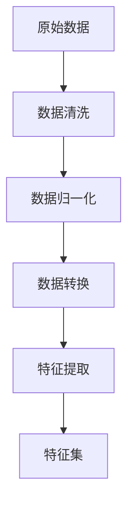
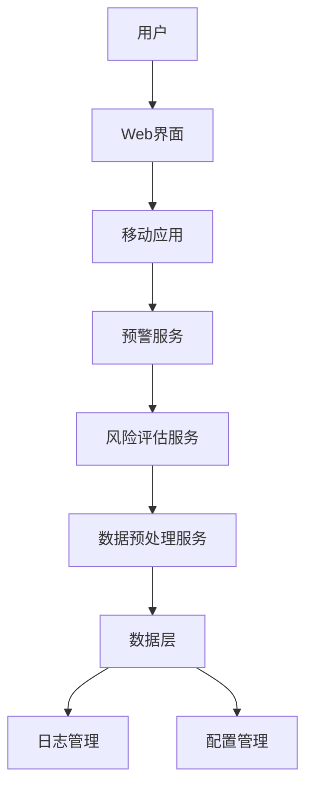

                 


### 文章标题
**AI驱动的企业风险评估：全面识别潜在威胁**

### 文章关键词
AI、风险评估、企业安全、数据挖掘、机器学习、深度学习、情境感知

### 摘要
本文深入探讨了AI技术在企业风险评估中的应用，通过逐步分析AI驱动的企业风险评估的基础、方法以及实战案例，揭示了AI在风险识别、预测和应对中的巨大潜力。文章旨在为企业和相关技术从业人士提供全面、系统的风险评估框架与实践指南，帮助其更好地应对复杂多变的市场环境。

## 第一部分: 引言

### 1.1.1 企业风险评估的重要性
在当今快速变化和竞争激烈的市场环境中，企业面临的威胁和挑战日益增多。企业风险评估作为一种管理工具，有助于识别、评估和应对潜在的风险，从而保障企业的稳定运营和可持续发展。以下是对企业风险评估重要性的详细说明：

**核心概念术语说明**
- 企业风险评估：指通过系统的方法识别、分析、评估和应对企业面临的各种风险。
- 风险：指对企业目标实现可能产生负面影响的不确定性事件。

**问题背景**
- 随着全球化、技术进步和市场变化，企业面临的风险种类和复杂程度不断增加。
- 传统风险评估方法往往依赖于经验和主观判断，难以全面、准确地识别和应对风险。

**问题描述**
- 如何利用先进技术提升企业风险评估的全面性和准确性？
- 如何在企业风险管理体系中引入AI技术，实现智能化的风险评估？

**问题解决**
- AI技术的引入为企业风险评估提供了新的工具和方法。
- 机器学习和数据挖掘技术可以处理大量数据，识别潜在的复杂风险。
- 情境感知和预测模型能够对风险进行实时监测和预警。

**边界与外延**
- 本文主要关注AI在定量风险评估中的应用，不包括定性风险评估。
- 论述的风险评估范围包括但不限于财务风险、市场风险、运营风险等。

**概念结构与核心要素组成**
- 企业风险评估框架：由风险识别、风险评估、风险应对三个核心环节组成。
- 风险识别：通过数据分析和情景模拟识别潜在风险。
- 风险评估：使用统计模型和算法对风险进行定量分析。
- 风险应对：制定相应的策略和措施，降低风险。

### 1.1.2 AI技术在风险评估中的应用
AI技术在企业风险评估中扮演着至关重要的角色，其应用范围广泛，主要包括以下几个方面：

**核心概念原理**
- 机器学习与深度学习：通过从大量数据中学习，自动发现模式，用于风险识别和预测。
- 数据挖掘与数据分析：利用统计分析方法，从数据中发现潜在的风险因素。
- 情境感知技术：通过实时感知环境和数据变化，对风险进行动态监测。

**概念属性特征对比表格**

| 特性 | 机器学习 | 数据挖掘 | 情境感知 |
| ---- | ------- | ------- | ------- |
| 目标 | 预测和分类 | 发现数据中的模式 | 实时监测环境变化 |
| 方法 | 模型训练 | 描述性分析 | 传感器融合 |
| 优势 | 自适应 | 全面性 | 实时性 |

**ER实体关系图架构的 Mermaid 流程图**

```mermaid
erDiagram
  AI技术 --> 风险识别 : 应用
  AI技术 --> 风险评估 : 应用
  AI技术 --> 风险应对 : 应用
  风险识别 ||--|{ 数据挖掘 }
  风险评估 ||--|{ 机器学习 }
  风险应对 ||--|{ 情境感知 }
```

### 1.1.3 本书结构安排与阅读建议
本书旨在提供一套全面、系统的AI驱动的企业风险评估指南，结构安排如下：

**各部分内容概览**
- 第一部分：引言，介绍企业风险评估的重要性和AI技术在其中的应用。
- 第二部分：AI技术基础，详细讲解机器学习、数据挖掘和情境感知等关键技术。
- 第三部分：企业风险评估框架与流程，阐述风险评估的核心环节和方法。
- 第四部分：AI驱动的企业风险评估方法，介绍情境感知与风险识别、风险评估算法与模型等。
- 第五部分：AI驱动的企业风险评估实战，通过具体案例展示风险评估的应用。

**阅读建议与目标读者**
- 适合企业风险管理人员、IT技术人员和研究人员阅读。
- 读者需具备一定的数据分析基础，对机器学习和深度学习有一定了解。

接下来，我们将进一步深入探讨AI驱动的企业风险评估的基础和技术细节，为后续内容的展开打下坚实的基础。在接下来的章节中，我们将详细分析AI技术在企业风险评估中的应用，包括数据预处理、特征提取、风险识别算法等，并探讨如何将这些技术整合到一个完整的风险评估系统中。

## 第二部分: AI驱动的企业风险评估基础

### 第2章: AI技术基础

### 2.1 机器学习与深度学习

**2.1.1 机器学习的基本概念**
机器学习是人工智能的一个重要分支，它使计算机系统能够从数据中学习，并对未知数据做出预测或决策。机器学习主要包括监督学习、无监督学习和强化学习三种类型。

**监督学习**
监督学习是一种从标记数据中学习的方法。算法通过输入和输出的对应关系（即训练数据集）学习如何对新的输入数据进行预测。常见的监督学习算法包括线性回归、逻辑回归、决策树、随机森林、支持向量机和神经网络等。

**无监督学习**
无监督学习则是从未标记的数据中学习，主要目的是发现数据中的内在结构和模式。常见的无监督学习算法包括聚类算法（如K-均值聚类、层次聚类）、降维算法（如主成分分析PCA、线性判别分析LDA）和关联规则学习等。

**强化学习**
强化学习是一种通过试错来学习如何在特定环境中获得最大收益的方法。它通过不断与环境交互，根据奖励和惩罚来调整策略，从而优化决策。常见的强化学习算法包括Q学习、深度Q网络DQN和策略梯度算法等。

**2.1.2 深度学习的发展历程**
深度学习是机器学习的一个重要分支，它通过构建多层的神经网络模型，对大量数据进行学习，从而实现复杂的特征提取和模式识别。深度学习的发展历程可以分为以下几个阶段：

- **1986年**：Rumelhart、Hinton和Williams提出了反向传播算法（Backpropagation），使得多层神经网络训练成为可能。
- **2006年**：Hinton提出了深度置信网络（Deep Belief Network，DBN），为深度学习的发展奠定了基础。
- **2012年**：AlexNet在ImageNet比赛中取得突破性成绩，标志着深度学习进入一个新时代。
- **至今**：随着计算能力的提升和大数据的发展，深度学习在图像识别、自然语言处理、语音识别等领域取得了显著进展。

**2.1.3 神经网络的结构与工作原理**
神经网络是由大量相互连接的神经元组成的计算模型，可以模拟人脑的思维方式。神经网络的基本结构包括输入层、隐藏层和输出层。

- **输入层**：接收外部输入数据，每个输入节点对应一个特征。
- **隐藏层**：对输入数据进行特征提取和变换，隐藏层可以有一个或多个。
- **输出层**：生成预测结果或分类标签。

神经网络的训练过程分为以下几个步骤：

1. **初始化参数**：随机初始化网络的权重和偏置。
2. **前向传播**：将输入数据通过神经网络进行前向传播，计算每个神经元的输出。
3. **损失函数计算**：计算实际输出和预测输出之间的差距，使用损失函数（如均方误差MSE、交叉熵损失Cross-Entropy Loss）进行量化。
4. **反向传播**：通过反向传播算法，将损失函数关于网络参数的梯度传播回网络，更新权重和偏置。
5. **迭代优化**：重复上述步骤，不断迭代优化网络参数，直到损失函数收敛到较小的值。

**2.1.4 案例分析：深度学习在图像识别中的应用**
以ImageNet图像识别比赛为例，深度学习在图像识别领域取得了显著的进展。AlexNet是第一个在ImageNet比赛中取得突破性成绩的深度学习模型。

- **模型结构**：AlexNet由8层神经网络组成，包括5个卷积层、2个池化层和3个全连接层。
- **训练数据**：使用超过120万个标记图像进行训练。
- **损失函数**：采用交叉熵损失函数，用于计算实际输出和预测输出之间的差距。
- **实验结果**：在2012年的ImageNet比赛中，AlexNet赢得了分类错误率的第一名，大幅降低了错误率。

**2.1.5 深度学习在风险评估中的应用**
深度学习在风险评估中的应用主要包括以下几个方面：

- **特征提取**：深度学习模型可以自动学习复杂的特征，提高风险识别的准确性。
- **模式识别**：通过训练深度神经网络，可以识别出潜在的风险模式，帮助企业提前预警。
- **实时监测**：利用深度学习模型，可以实现对风险数据的实时监测，及时识别新的风险。

**2.1.6 深度学习在风险评估中的挑战**
尽管深度学习在风险评估中具有很大的潜力，但也面临一些挑战：

- **数据需求**：深度学习需要大量的标记数据进行训练，这在实际应用中可能难以满足。
- **模型可解释性**：深度学习模型的决策过程往往是不透明的，难以解释，这可能影响决策的信任度。
- **计算资源**：深度学习模型训练需要大量的计算资源，特别是在大规模数据集上训练时。

### 2.2 数据挖掘与数据分析

**2.2.1 数据挖掘的基本方法**
数据挖掘是一种从大量数据中自动发现有用信息和知识的方法。数据挖掘的主要方法包括：

- **关联规则挖掘**：发现数据之间的关联关系，如市场篮子分析。
- **聚类分析**：将相似的数据分组在一起，如K-均值聚类。
- **分类与回归分析**：将数据分为不同的类别或预测数值，如决策树和线性回归。
- **异常检测**：发现数据中的异常点，如孤立森林算法。

**2.2.2 数据分析的关键技术**
数据分析是通过统计方法和算法，从数据中提取有价值的信息和洞见。数据分析的关键技术包括：

- **描述性分析**：描述数据的分布、趋势和关联关系，如数据可视化。
- **推断性分析**：基于样本数据推断总体特征，如假设检验。
- **预测性分析**：基于历史数据预测未来趋势，如时间序列分析。

**2.2.3 数据可视化的重要性**
数据可视化是将数据分析的结果以图形化的方式展示出来，使得复杂的数据更容易理解和解释。数据可视化的重要性包括：

- **提高数据可读性**：通过图形化展示，使得数据更加直观和易于理解。
- **发现数据中的趋势和异常**：通过可视化，可以更容易地发现数据中的规律和异常点。
- **支持决策制定**：数据可视化可以帮助决策者更好地理解数据，从而做出更明智的决策。

### 2.3 人工智能伦理与隐私保护

**2.3.1 AI伦理的挑战**
人工智能技术的发展带来了许多伦理挑战，包括：

- **隐私保护**：人工智能系统在处理数据时，可能会侵犯用户的隐私权。
- **算法偏见**：人工智能系统可能会因为数据偏差而导致不公平的决策。
- **安全性**：人工智能系统可能会成为黑客攻击的目标，导致数据泄露和系统瘫痪。

**2.3.2 隐私保护的重要性**
隐私保护在人工智能应用中至关重要，主要包括以下几个方面：

- **数据收集**：在收集数据时，应遵循最小化原则，只收集必要的数据。
- **数据加密**：对敏感数据进行加密，防止数据泄露。
- **匿名化处理**：对个人数据进行匿名化处理，保护用户隐私。

**2.3.3 相关法律法规与标准**
随着人工智能技术的发展，各国开始出台相关法律法规和标准，以规范人工智能的应用。主要法律法规和标准包括：

- **欧盟的《通用数据保护条例》（GDPR）**：对个人数据的处理和隐私保护提出了严格的要求。
- **美国的《消费者数据保护法案》（CCPA）**：规定了消费者对其数据的权利和保护。
- **ISO/IEC 27001**：提供了信息安全的最佳实践指南。

### 总结
本章详细介绍了AI驱动的企业风险评估所需的基础技术，包括机器学习、数据挖掘、人工智能伦理与隐私保护。这些技术为企业提供了一个强大的工具，用于识别、评估和应对潜在的风险。在下一章中，我们将进一步探讨企业风险评估的框架和流程，为构建一个完整的风险评估系统打下基础。

## 第三部分: 企业风险评估框架与流程

### 第3章: 企业风险评估框架

企业风险评估是一项复杂而系统性的工作，涉及到多个环节和步骤。为了有效地识别、分析和应对企业面临的风险，企业需要构建一个全面、科学的风险评估框架。本章节将详细介绍企业风险评估框架的组成部分、核心流程以及关键要素。

### 3.1.1 企业风险评估框架概述

企业风险评估框架是一个系统化的过程，用于识别、评估和应对企业面临的各种风险。该框架通常包括以下几个核心组成部分：

1. **风险识别**：识别企业可能面临的各种风险，包括外部风险和内部风险。
2. **风险评估**：对识别出的风险进行评估，确定其发生的可能性、影响程度和优先级。
3. **风险应对**：制定相应的应对策略和措施，以减轻或消除风险的影响。

**企业风险评估框架的组成部分**

- **风险识别**：通过数据收集、访谈、问卷调查等方法，识别企业面临的各种风险。
- **风险评估**：使用定量和定性方法，对识别出的风险进行评估，确定其发生的可能性、影响程度和优先级。
- **风险应对**：制定风险应对策略，包括风险规避、风险减轻、风险转移和风险接受等。

### 3.1.2 风险评估流程

企业风险评估流程是一个连续的、循环的过程，包括以下几个步骤：

1. **风险识别**：通过数据收集、访谈、问卷调查等方法，识别企业可能面临的各种风险。
2. **风险分析**：对识别出的风险进行定性或定量分析，确定其发生的可能性、影响程度和优先级。
3. **风险评价**：根据风险分析的结果，对风险进行排序和优先级划分，确定需要重点关注的领域。
4. **风险应对**：制定相应的风险应对策略和措施，包括风险规避、风险减轻、风险转移和风险接受等。
5. **风险监控与更新**：对已识别的风险进行监控，根据实际情况更新风险评估结果。

**风险评估流程的关键环节**

- **风险识别**：通过数据收集、访谈、问卷调查等方法，全面识别企业可能面临的各种风险。
- **风险分析**：使用定性或定量方法，对识别出的风险进行评估，确定其发生的可能性、影响程度和优先级。
- **风险评价**：根据风险分析的结果，对风险进行排序和优先级划分，确定需要重点关注的领域。
- **风险应对**：制定风险应对策略，包括风险规避、风险减轻、风险转移和风险接受等。
- **风险监控与更新**：对已识别的风险进行监控，根据实际情况更新风险评估结果。

### 3.1.3 风险评估的关键要素

为了确保风险评估的有效性和准确性，企业需要关注以下几个关键要素：

1. **数据收集与处理**：收集准确、全面的数据，对数据进行预处理，以提高风险评估的准确性。
2. **分析方法与工具**：选择合适的分析方法与工具，如定量分析方法、定性分析方法、风险矩阵等。
3. **风险评估团队**：组建专业的风险评估团队，包括风险管理专家、数据分析师、IT专业人员等。
4. **沟通与协作**：建立有效的沟通与协作机制，确保风险评估过程中的信息流通和资源共享。
5. **文档记录与报告**：对风险评估的过程和结果进行详细的文档记录，编写风险评估报告，为决策提供依据。

**3.1.4 案例分析：某企业的风险评估实践**

为了更好地理解企业风险评估框架的应用，下面我们通过一个实际案例来进行分析。

**案例背景**

某企业是一家从事电子商务的公司，近年来面临激烈的市场竞争，需要通过风险评估来识别和应对潜在的风险。

**风险识别**

通过访谈和问卷调查，企业识别出以下几个主要风险：

- **市场风险**：市场需求变化导致销售额波动。
- **财务风险**：资金链断裂导致企业无法正常运营。
- **运营风险**：系统故障导致客户服务中断。
- **法律风险**：违反法律法规导致企业面临法律诉讼。

**风险分析**

对识别出的风险进行定量和定性分析，确定其发生的可能性、影响程度和优先级。

- **市场风险**：通过分析历史销售数据和市场竞争情况，确定市场风险的可能性为高，影响程度为中等。
- **财务风险**：通过财务报表分析，确定财务风险的可能性为中等，影响程度为高。
- **运营风险**：通过系统维护记录，确定运营风险的可能性为中等，影响程度为高。
- **法律风险**：通过法律咨询，确定法律风险的可能性为低，影响程度为高。

**风险评价**

根据风险分析的结果，对风险进行排序和优先级划分。

- **高优先级风险**：财务风险、运营风险。
- **中优先级风险**：市场风险。
- **低优先级风险**：法律风险。

**风险应对**

针对识别出的风险，制定相应的应对策略和措施：

- **财务风险**：加强财务管理，优化资金流动，确保企业有足够的现金流。
- **运营风险**：加强系统维护，确保系统的稳定性和可靠性，提高客户服务水平。
- **市场风险**：密切关注市场动态，调整营销策略，以应对市场需求的变化。
- **法律风险**：加强法律意识，避免违法行为，定期进行法律咨询和风险评估。

**风险监控与更新**

对企业面临的风险进行持续监控，根据实际情况更新风险评估结果，确保风险评估的实时性和准确性。

**案例小结**

通过这个案例分析，我们可以看到，企业风险评估框架在实际应用中起到了关键作用，帮助企业识别和应对潜在的风险，确保企业的稳定运营和发展。

### 总结

本章详细介绍了企业风险评估框架的组成部分、核心流程以及关键要素，并通过案例分析展示了如何在实际中应用这些框架和方法。在下一章中，我们将深入探讨AI驱动的企业风险评估方法，包括情境感知与风险识别、风险评估算法与模型等，为企业构建一个智能化的风险评估系统提供技术支持。

## 第四部分: AI驱动的企业风险评估方法

### 第4章: 情境感知与风险识别

情境感知（Situation Awareness）是指系统或个体能够感知和理解其当前所处的环境状态，并据此做出相应的反应。在企业风险评估中，情境感知技术可以帮助企业实时监控环境变化，快速识别潜在风险，从而提高风险评估的准确性和时效性。

### 4.1.1 情境感知技术

**情境感知技术的定义**

情境感知技术是指利用传感器、数据处理和通信技术，实时感知和解释环境中的各种信息，以支持决策和行动的技术。这些技术可以收集和分析环境数据，识别异常情况，并实时做出响应。

**情境感知技术的关键组件**

- **传感器**：用于收集环境中的各种数据，如温度、湿度、光线、声音、振动等。
- **数据处理**：对收集到的数据进行分析和处理，提取有用的信息和模式。
- **通信技术**：用于将传感器数据和情境信息传输到中央处理系统，实现实时监控和响应。

**情境感知技术的应用场景**

- **企业安全监控**：通过摄像头、入侵检测系统等传感器，实时监控企业内外部环境，识别潜在的安全威胁。
- **供应链管理**：实时监控供应链中的各种参数，如库存水平、运输进度等，及时发现供应链中断的风险。
- **生产过程监控**：实时监控生产线上的设备状态、工艺参数等，识别生产过程中的异常情况，提高生产效率。

### 4.1.2 风险识别方法

在情境感知技术的支持下，企业可以采用多种方法进行风险识别，包括定性方法和定量方法。

**定性方法**

- **专家评估法**：邀请风险管理专家对企业面临的潜在风险进行评估，根据经验和专业知识判断风险的存在和严重程度。
- **SWOT分析法**：分析企业的优势、劣势、机会和威胁，识别潜在的风险因素。
- **流程图法**：通过绘制企业的业务流程图，识别流程中的潜在风险点。

**定量方法**

- **概率分析**：使用概率模型计算风险发生的概率和潜在损失，如蒙特卡罗模拟法。
- **风险矩阵法**：将风险的可能性与影响程度进行矩阵化分析，识别高优先级风险。
- **机器学习方法**：使用机器学习算法，从大量数据中自动识别潜在的风险模式。

**风险识别方法的综合应用**

在实际应用中，企业通常将定性方法和定量方法结合使用，以提高风险识别的全面性和准确性。例如，可以先使用专家评估法和SWOT分析法进行初步风险识别，然后使用机器学习算法对风险进行定量分析，最终形成一个综合的风险识别结果。

### 4.1.3 案例分析

**案例背景**

某企业是一家制造企业，近年来在市场需求波动、供应链风险和设备故障等方面面临较大的不确定性。为了提高风险评估的准确性和时效性，企业决定引入AI驱动的情境感知技术进行风险识别。

**情境感知技术应用**

- **传感器部署**：在企业关键区域部署各种传感器，如温度传感器、振动传感器、摄像头等，实时收集环境数据。
- **数据处理平台**：建立数据处理平台，对收集到的传感器数据进行实时处理和分析，提取有用的信息和模式。
- **风险识别算法**：使用机器学习算法，如K-means聚类算法和决策树算法，对处理后的数据进行风险识别。

**案例分析**

1. **市场风险识别**：通过分析市场数据（如销售数据、客户反馈等），使用K-means聚类算法识别市场需求的变化趋势，及时调整生产计划，降低市场需求波动带来的风险。
2. **供应链风险识别**：通过实时监控供应链中的运输进度、库存水平等数据，使用决策树算法识别供应链中断的风险，提前采取措施，确保供应链的稳定运行。
3. **设备故障识别**：通过分析设备运行数据（如温度、振动等），使用异常检测算法（如孤立森林算法）识别设备故障风险，提前进行设备维护，避免设备故障导致的生产中断。

**案例分析小结**

通过引入AI驱动的情境感知技术，企业能够实时识别和监控各种潜在风险，提高了风险评估的准确性和时效性。这不仅有助于企业提前采取应对措施，降低风险损失，还能提高企业的运营效率和竞争力。

### 总结

本章详细介绍了AI驱动的企业风险评估中的情境感知与风险识别方法，包括情境感知技术的关键组件和应用场景，以及风险识别的定性方法和定量方法。通过案例分析，展示了情境感知技术在企业风险评估中的应用效果。在下一章中，我们将进一步探讨AI驱动的风险评估算法与模型，为企业构建智能化的风险评估系统提供技术支持。

## 第五部分: AI驱动的企业风险评估实战

### 第6章: 数据预处理与特征提取

数据预处理和特征提取是AI驱动的企业风险评估中的关键步骤，直接影响模型的性能和准确性。在这一章节中，我们将详细讨论数据预处理、特征提取方法以及一个具体的实战案例。

### 6.1.1 数据预处理

数据预处理是指对原始数据进行清洗、归一化、转换等操作，以提高数据质量，减少噪声，并使其适合用于机器学习模型训练。以下是数据预处理的主要步骤：

**1. 数据清洗**
- **缺失值处理**：使用均值、中位数或最频繁值填充缺失数据，或删除缺失值过多的数据。
- **异常值处理**：通过统计学方法（如箱线图）或机器学习方法（如孤立森林）识别和处理异常值。
- **重复数据删除**：删除重复的数据记录，防止数据冗余。

**2. 数据归一化**
- **归一化**：将数据缩放到相同的尺度，如使用最小-最大缩放法或Z分数标准化。
- **归一化的目的**：消除不同特征之间的尺度差异，使得模型训练更加稳定。

**3. 数据转换**
- **离散化**：将连续特征转换为分类特征，如使用分箱方法将收入范围转换为类别。
- **编码**：将分类特征转换为数值表示，如使用独热编码或标签编码。

### 6.1.2 特征提取方法

特征提取是指从原始数据中提取有用的信息，用于训练机器学习模型。以下是一些常见的特征提取方法：

**1. 统计特征**
- **均值、方差**：描述数据集的中心趋势和离散程度。
- **相关性**：分析特征之间的相关性，识别关键特征。
- **熵**：用于衡量数据的随机性，用于分类问题。

**2. 工程特征**
- **转换特征**：通过数学变换生成新的特征，如使用多项式特征生成。
- **特征组合**：将多个原始特征组合生成新的特征，如交叉特征。

**3. 特征选择方法**
- **过滤方法**：基于特征的重要性进行选择，如信息增益、卡方检验。
- **包装方法**：结合模型性能进行特征选择，如递归特征消除RFE。
- **嵌入式方法**：在模型训练过程中进行特征选择，如LASSO回归。

### 6.1.3 实战案例

**案例背景**

某企业希望通过AI技术对供应链风险进行评估，识别潜在的供应中断风险。现有数据包括供应商信息、订单数据、物流数据等。下面我们将展示数据预处理和特征提取的具体步骤。

**实战步骤**

1. **数据清洗**
   - 删除缺失值过多的供应商记录。
   - 删除异常订单记录，如物流时间远超过正常范围的订单。

2. **数据归一化**
   - 对物流时间、订单金额等连续特征进行最小-最大缩放。

3. **数据转换**
   - 将供应商等级、订单状态等分类特征进行独热编码。

4. **特征提取**
   - 计算供应商的订单交付周期方差，作为统计特征。
   - 生成订单与供应商的互动频率特征，作为工程特征。
   - 使用递归特征消除（RFE）方法，选择对风险评估最有影响的特征。

**实战结果**

通过上述数据预处理和特征提取步骤，我们得到了一个高质量的特征集，用于训练机器学习模型。以下是一个简单的特征提取流程图：



**实战小结**

数据预处理和特征提取是AI驱动的企业风险评估中的关键步骤，通过这些步骤，我们可以提高数据质量，提取有用的特征，从而提升模型性能。在实际应用中，需要根据具体业务场景和数据特点，灵活调整预处理和特征提取方法。

### 总结

本章详细介绍了数据预处理与特征提取的方法和实战案例，展示了如何在实际应用中有效提高数据质量和模型性能。在下一章中，我们将探讨风险评估系统的设计与实现，为企业构建一个完整的AI驱动的风险评估系统提供技术支持。

### 第7章: 风险评估系统设计与实现

### 7.1.1 系统需求分析

在设计和实现一个AI驱动的企业风险评估系统之前，我们需要明确系统的需求。系统需求分析是整个项目的基础，它决定了系统的功能、性能和可扩展性。

**1. 功能需求**
- **数据收集**：系统能够收集来自不同来源的企业数据，如财务报表、市场数据、供应链数据等。
- **数据预处理**：系统能够对收集到的原始数据进行清洗、归一化和特征提取。
- **风险评估**：系统能够利用机器学习算法对企业数据进行风险评估，识别潜在的风险。
- **风险预警**：系统应能够对识别出的风险进行实时监控，并通过多种渠道（如邮件、短信、APP通知）进行预警。
- **报告生成**：系统能够生成详细的风险评估报告，为企业决策提供数据支持。

**2. 性能需求**
- **数据处理能力**：系统应能够快速处理大量数据，确保实时性。
- **算法准确性**：系统所采用的算法应具有较高的准确性和鲁棒性，能够准确识别风险。
- **响应速度**：系统应能够快速响应用户的请求，提供实时风险评估结果。

**3. 可扩展性需求**
- **模块化设计**：系统应采用模块化设计，方便后续扩展和升级。
- **可维护性**：系统代码应具有良好的可读性和可维护性，便于长期维护。

### 7.1.2 系统架构设计

系统架构设计是确保系统需求得以实现的关键步骤。以下是该系统的一个基本架构设计：

**1. 数据层**
- **数据存储**：使用关系数据库（如MySQL）和非关系数据库（如MongoDB）存储企业数据和风险评估结果。
- **数据接入**：通过API或数据接口与企业现有系统进行数据对接，确保数据的实时性和准确性。

**2. 服务层**
- **数据预处理服务**：负责数据清洗、归一化和特征提取，为风险评估模块提供高质量的输入数据。
- **风险评估服务**：利用机器学习算法对企业数据进行风险评估，生成风险评分和预警信息。
- **预警服务**：实时监控风险数据，根据预设的阈值进行预警，并将预警信息推送给相关人员。

**3. 表示层**
- **Web界面**：提供用户友好的Web界面，供用户进行数据上传、查看风险评估结果和预警信息。
- **移动应用**：为用户提供移动端应用，实现风险预警和报告查看。

**4. 辅助模块**
- **日志管理**：记录系统运行日志，便于故障排查和性能优化。
- **配置管理**：管理系统的配置参数，如算法参数、阈值设置等。

**系统架构图**



### 7.1.3 系统实现与部署

系统实现与部署是确保系统正常运行的关键步骤。以下是系统实现与部署的详细步骤：

**1. 系统实现**
- **前端开发**：使用React或Vue等前端框架开发Web界面和移动应用。
- **后端开发**：使用Spring Boot或Django等后端框架实现数据预处理、风险评估和预警功能。
- **数据库设计**：设计关系数据库和非关系数据库的表结构，确保数据的存储和查询效率。
- **算法开发**：选择合适的机器学习算法（如决策树、随机森林、神经网络等）进行风险评估，并进行模型调优。

**2. 系统部署**
- **本地部署**：在开发环境中进行系统测试，确保功能正常。
- **云部署**：将系统部署到云平台（如AWS、Azure），实现高可用性和弹性扩展。
- **自动化部署**：使用CI/CD工具（如Jenkins、GitLab CI）实现自动化部署，提高部署效率。

**3. 系统测试**
- **单元测试**：对系统的各个模块进行单元测试，确保代码质量。
- **集成测试**：对系统的整体功能进行集成测试，确保模块间交互正常。
- **性能测试**：对系统的性能进行测试，确保满足性能需求。

**4. 系统维护**
- **监控与报警**：使用监控工具（如Prometheus、Grafana）对系统运行状况进行监控，并及时报警。
- **故障排查**：定期进行故障排查，确保系统稳定运行。
- **安全加固**：定期对系统进行安全检查和加固，防止安全漏洞。

### 总结

本章详细介绍了企业风险评估系统的需求分析、架构设计和实现与部署。通过系统的设计实现，企业可以有效地利用AI技术进行风险评估，提高风险管理的效率和准确性。在下一章中，我们将探讨未来发展趋势和挑战，为AI驱动的企业风险评估的未来发展提供方向。

## 第五部分: 拓展阅读与展望

### 8.1.1 风险评估中的挑战

尽管AI技术在企业风险评估中展现了巨大的潜力，但在实际应用中仍面临诸多挑战：

**数据隐私与安全**：在收集和处理大量企业数据时，如何保障数据隐私和安全是一个重要问题。AI模型可能需要访问敏感数据，如财务报表、客户信息等，这可能导致数据泄露和隐私侵犯。解决方案包括数据匿名化处理、数据加密和严格的访问控制。

**模型可解释性**：深度学习模型通常具有很高的准确性，但其决策过程往往不透明，难以解释。这可能导致决策者对模型结果缺乏信任。提高模型可解释性是一个重要方向，可以通过可视化和解释性算法（如LIME、SHAP）来增强模型透明度。

**算法偏见**：AI模型可能基于历史数据学习，而这些数据可能包含偏见，导致模型产生不公平的决策。例如，招聘系统可能基于过去的偏见数据，对某些性别或种族的候选人产生歧视。解决算法偏见的方法包括数据清洗、使用公平性度量指标和设计公平性算法。

**计算资源与成本**：深度学习模型通常需要大量的计算资源和时间进行训练。特别是在处理大规模数据集时，计算成本可能非常高。此外，维护和更新AI模型也需要持续的资源投入。解决这一问题的方法包括使用更高效的算法、分布式计算和云服务。

**法律法规与合规性**：随着AI技术的发展，各国政府开始出台相关法律法规，以规范AI应用。企业需要确保其风险评估系统的设计、开发和运营符合法律法规要求。例如，欧盟的《通用数据保护条例》（GDPR）和美国的《消费者数据保护法案》（CCPA）等。

### 8.1.2 未来发展趋势

尽管面临挑战，AI驱动的企业风险评估在未来仍将保持快速发展，以下是一些关键趋势：

**智能化与自动化**：随着AI技术的进步，风险评估系统将变得更加智能化和自动化。通过深度学习和强化学习，系统可以自动识别风险模式，实时调整风险评估策略，提高风险预测的准确性。

**跨领域融合**：AI技术将与物联网（IoT）、区块链等新兴技术相结合，为企业提供更加全面的风险评估服务。例如，通过IoT设备收集实时数据，AI系统可以实时监测企业运营状况，快速识别潜在风险。

**增强可解释性**：未来，模型可解释性将成为一个重要研究方向。研究者将开发新的方法和工具，提高模型透明度，帮助决策者更好地理解和信任AI模型。

**定制化与个性化**：随着AI技术的普及，企业将能够根据自身特点和需求，定制化地开发风险评估系统。系统将更加灵活，可以适应不同行业和企业的特定需求。

**全球化与本地化**：随着全球化的发展，企业面临的挑战和风险也越来越复杂。AI技术将帮助企业更好地应对全球性风险，同时，本地化也将是一个重要趋势，系统需要能够适应不同地区和文化的特点。

### 8.1.3 拓展应用领域

AI驱动的企业风险评估技术不仅在风险管理领域有广泛应用，还可以拓展到其他领域，如：

**供应链管理**：AI技术可以帮助企业实时监控供应链中的各种参数，识别供应链中断风险，优化供应链流程，提高供应链的弹性和稳定性。

**金融风险管理**：在金融领域，AI技术可以用于信用评分、市场风险预测、欺诈检测等，提高金融系统的安全性和稳健性。

**公共卫生**：AI技术可以用于疾病预测、疫情监控等，为公共卫生部门提供决策支持，提高公共卫生应急响应能力。

**环保监测**：通过AI技术，企业可以实时监控环境数据，识别环境污染风险，采取相应的环保措施，促进可持续发展。

**智能制造**：AI技术可以用于设备故障预测、生产流程优化等，提高智能制造系统的效率和可靠性。

### 总结

AI驱动的企业风险评估技术具有广阔的应用前景，尽管面临诸多挑战，但通过不断的技术创新和改进，其将在未来继续为企业提供强大的风险管理工具。企业应积极拥抱AI技术，结合自身实际需求，构建智能化、自动化和个性化的风险评估系统，提高风险管理的效率和准确性。

## 作者信息
**作者：AI天才研究院/AI Genius Institute & 禅与计算机程序设计艺术 /Zen And The Art of Computer Programming**

