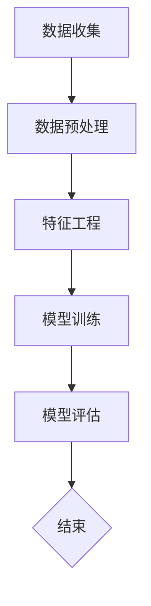
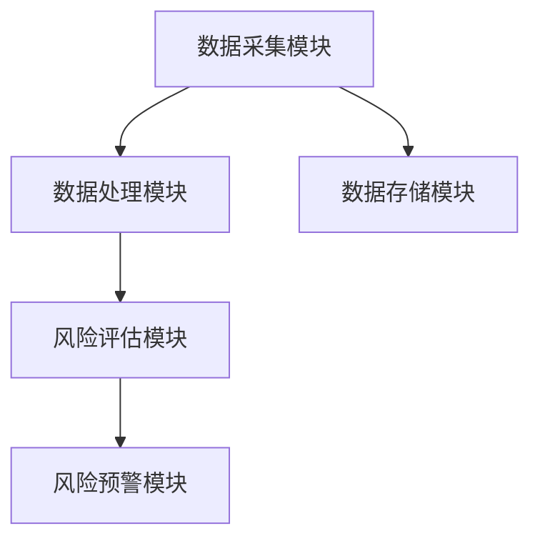
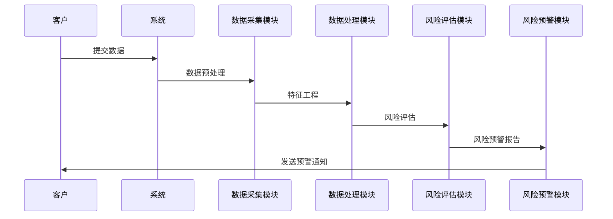
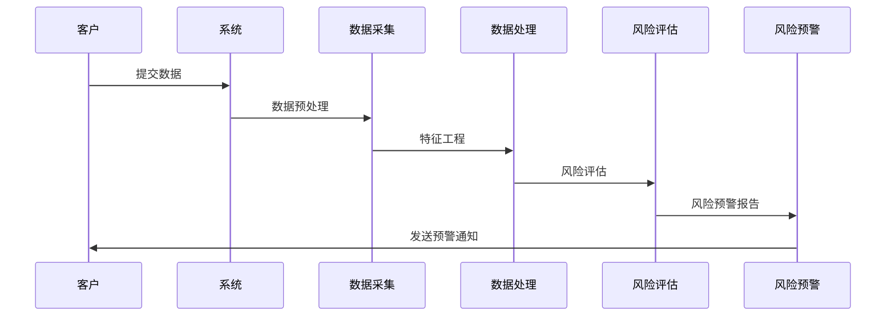

                 


### AI驱动的企业风险量化：精准评估潜在威胁

关键词：人工智能、企业风险管理、风险量化、机器学习、深度学习、监督学习、无监督学习、强化学习

摘要：本文将探讨AI在企业风险量化中的应用，通过深入分析AI驱动的风险量化方法，阐述其在企业风险管理中的重要性。我们将从背景介绍、核心概念与联系、算法原理讲解、系统分析与架构设计方案、项目实战等多个方面进行详细阐述，以期为读者提供一份全面而深入的参考资料。

### 目录大纲设计思路

在设计《AI驱动的企业风险量化：精准评估潜在威胁》的目录大纲时，我们需要遵循以下步骤：

1. **明确主题与内容结构**：首先明确书的核心主题，即AI在企业风险量化中的应用，并确定主要章节的内容结构。
2. **逻辑梳理**：根据主题，将内容分解为若干逻辑清晰的章节，确保各章节之间的连贯性和内容的完整性。
3. **细化章节**：在每个章节中，进一步细化小节，确保每个部分都有明确的标题和内容。
4. **格式规范**：按照markdown格式规范进行目录大纲的编写，确保输出格式正确。
5. **内容完整性**：确保大纲中包含所有的核心章节，如背景介绍、核心概念与联系、算法原理讲解、数学模型和数学公式、系统分析与架构设计方案、项目实战等。
6. **简洁性**：在保证内容完整性的同时，避免多余的废话，确保目录大纲简洁明了。

### 第一部分：背景介绍

在这一部分，我们将介绍企业风险量化的背景和核心概念，为后续的详细讨论打下基础。

#### 第1章：问题背景与核心概念

##### 1.1 问题背景

###### 1.1.1 企业面临的风险挑战

企业面临的风险类型包括市场风险、财务风险、运营风险、法律风险等。在数字经济时代，企业所面临的风险更加复杂多变，例如：

- 市场风险：市场需求变化、竞争加剧等；
- 财务风险：资金链断裂、财务状况恶化等；
- 运营风险：供应链中断、业务流程失控等；
- 法律风险：法律法规变化、合规性问题等。

###### 1.1.2 AI驱动的企业风险量化

AI驱动的企业风险量化是指利用人工智能技术，特别是机器学习和深度学习，对企业的风险进行量化评估。这种量化评估可以帮助企业更准确地了解其潜在风险，从而采取相应的风险管理措施。

##### 1.2 核心概念

###### 1.2.1 风险量化的定义

风险量化是指通过定量分析手段，对企业的风险进行评估和量化，从而为风险管理提供科学依据。风险量化的目的是帮助企业管理者更准确地了解风险状况，制定有效的风险管理策略。

###### 1.2.2 AI驱动的风险量化方法

AI驱动的风险量化方法主要包括数据驱动方法和模型驱动方法。数据驱动方法依赖于大量历史数据的分析，通过数据挖掘和机器学习算法，提取出风险相关的特征，并对风险进行量化。模型驱动方法则是通过建立数学模型，对风险进行预测和评估。

###### 1.2.3 风险量化的边界与外延

风险量化在企业管理中的适用范围非常广泛，包括但不限于财务风险管理、运营风险管理、市场风险管理等。风险量化与其他风险管理工具（如风险评估表、风险矩阵等）相比，具有更高的准确性和系统性。

##### 1.3 概念结构与核心要素组成

###### 1.3.1 风险量化的主要步骤

1. 数据收集与预处理
2. 特征工程
3. 模型选择与训练
4. 模型评估与优化

###### 1.3.2 关键要素及其相互关系

1. 数据质量：数据质量对风险量化结果具有重要影响，高质量的数据是风险量化的基础。
2. 特征选择：特征选择是风险量化过程中的关键步骤，合理的特征选择可以提高模型的准确性和鲁棒性。
3. 模型优化：模型优化是提高风险量化准确性的重要手段，通过调整模型参数和结构，可以改进模型的性能。

##### 1.4 本章小结

本章介绍了企业风险量化的背景、核心概念和方法。通过本章的学习，读者可以初步了解企业风险量化的基本原理，为后续章节的深入学习打下基础。

### 第二部分：核心概念与联系

在这一部分，我们将深入探讨AI驱动的企业风险量化方法，包括机器学习、深度学习、数据驱动与模型驱动方法等。

#### 第2章：AI驱动的企业风险量化方法

##### 2.1 机器学习基础

###### 2.1.1 机器学习概述

机器学习是指通过算法从数据中学习规律和模式，并对未知数据进行预测和分类的技术。机器学习可分为监督学习、无监督学习和强化学习等。

###### 2.1.2 监督学习与无监督学习

监督学习是指利用带有标签的数据进行训练，通过学习标签和特征之间的关系，实现对未知数据的预测。无监督学习则是没有标签的数据进行训练，通过挖掘数据内部的模式和结构，实现对数据的分类和聚类。

###### 2.1.3 强化学习与风险量化

强化学习是指通过与环境的交互，不断调整策略，以最大化长期回报的技术。强化学习在风险量化中的应用主要体现在风险控制策略的优化，通过模拟环境，评估不同策略的风险和收益，选择最优策略。

##### 2.2 深度学习与神经网络

###### 2.2.1 深度学习原理

深度学习是指多层神经网络的学习，通过多层次的非线性变换，提取数据中的高级特征和模式。深度学习在图像识别、语音识别、自然语言处理等领域取得了显著的成果。

###### 2.2.2 神经网络在风险量化中的应用

神经网络在风险量化中的应用主要体现在特征提取和模型构建。通过多层神经网络，可以自动提取数据中的特征，并建立风险量化模型，对风险进行量化评估。

##### 2.3 数据驱动与模型驱动方法

###### 2.3.1 数据驱动方法

数据驱动方法是指利用数据本身的特性，通过数据挖掘和机器学习算法，提取出风险相关的特征，并对风险进行量化。数据驱动方法在风险量化中的应用非常广泛，适用于各种类型的数据。

###### 2.3.2 模型驱动方法

模型驱动方法是指通过建立数学模型，对风险进行预测和评估。模型驱动方法在风险量化中具有更高的准确性和系统性，适用于复杂的风险环境。

##### 2.4 概念属性特征对比表格

| 概念 | 属性特征 |
| ---- | ---- |
| 机器学习 | 自动从数据中学习规律和模式 |
| 深度学习 | 多层神经网络的学习，提取高级特征和模式 |
| 数据驱动 | 利用数据本身的特性，提取风险相关特征 |
| 模型驱动 | 建立数学模型，对风险进行预测和评估 |
| 监督学习 | 有标签的数据训练 |
| 无监督学习 | 无标签的数据训练 |
| 强化学习 | 通过与环境交互，调整策略，最大化长期回报 |

##### 2.5 ER实体关系图架构

```mermaid
erDiagram
    Product ||--|{ Customer }| Customer
    Customer ||--|{ Order }| Order
    Product ||--|{ Supplier }| Supplier
    Supplier ||--|{ Purchase }| Purchase
```

##### 2.6 本章小结

本章介绍了AI驱动的企业风险量化方法，包括机器学习、深度学习、数据驱动与模型驱动方法等。通过本章的学习，读者可以了解各种方法的原理和应用场景，为后续的算法原理讲解和项目实战做好准备。

### 第三部分：算法原理讲解

在这一部分，我们将深入讲解风险量化算法的原理，包括数学模型、Python源代码实现和流程图等。

#### 第3章：风险量化算法原理

##### 3.1 算法原理概述

风险量化算法是指利用机器学习、深度学习等技术，对企业的风险进行量化评估的算法。风险量化算法的基本原理是通过学习历史数据，提取出风险相关的特征，并建立风险量化模型，对未知数据进行风险预测。

##### 3.2 数学模型与公式

风险量化算法的数学模型主要包括风险评估指标和模型评估指标。

###### 3.2.1 风险评估指标

假设有n个特征变量X1, X2, ..., Xn，我们需要建立一个风险评估函数，对每个特征变量进行评估。风险评估函数可以表示为：

$$
R(X_1, X_2, ..., X_n) = f(X_1, X_2, ..., X_n)
$$

其中，f是风险评估函数，可以根据具体的算法进行调整。

###### 3.2.2 模型评估方法

模型评估方法主要包括准确率、召回率、F1值等。假设有m个测试样本，其中正类样本有m1个，负类样本有m2个，预测正确的正类样本有c1个，预测正确的负类样本有c2个，则：

- 准确率（Accuracy）:

$$
Accuracy = \frac{c1 + c2}{m}
$$

- 召回率（Recall）:

$$
Recall = \frac{c1}{m1}
$$

- F1值（F1-score）:

$$
F1-score = \frac{2 \cdot Precision \cdot Recall}{Precision + Recall}
$$

其中，Precision表示预测正确的正类样本占总预测正类样本的比例，Recall表示预测正确的正类样本占总正类样本的比例。

##### 3.3 Python源代码实现

以下是一个简单的Python示例，展示了如何使用机器学习算法进行风险量化：

```python
from sklearn.datasets import make_classification
from sklearn.model_selection import train_test_split
from sklearn.ensemble import RandomForestClassifier
from sklearn.metrics import accuracy_score

# 生成模拟数据集
X, y = make_classification(n_samples=1000, n_features=10, n_classes=2, random_state=42)

# 划分训练集和测试集
X_train, X_test, y_train, y_test = train_test_split(X, y, test_size=0.3, random_state=42)

# 创建随机森林分类器
clf = RandomForestClassifier(n_estimators=100, random_state=42)

# 训练模型
clf.fit(X_train, y_train)

# 进行预测
y_pred = clf.predict(X_test)

# 计算准确率
accuracy = accuracy_score(y_test, y_pred)
print(f"Accuracy: {accuracy}")
```

##### 3.4 Mermaid流程图

以下是一个使用Mermaid绘制的风险量化算法的流程图：



##### 3.5 本章小结

本章详细介绍了风险量化算法的原理，包括数学模型、Python源代码实现和流程图。通过本章的学习，读者可以了解风险量化算法的基本原理和实现方法，为后续的系统分析与架构设计方案和项目实战打下基础。

### 第四部分：系统分析与架构设计方案

在这一部分，我们将深入分析AI驱动的企业风险量化系统，包括项目介绍、系统功能设计、系统架构设计、系统接口设计和系统交互等。

#### 第4章：系统分析与架构设计方案

##### 4.1 问题场景介绍

企业风险量化系统旨在帮助企业识别、评估和管理潜在风险，从而降低风险损失。该系统将利用AI技术，通过对企业内外部数据的分析，实现风险的量化评估。

##### 4.2 项目介绍

本项目是一款基于AI驱动的企业风险量化系统，主要包括以下功能模块：

- 数据采集模块：负责收集企业内外部数据，包括财务数据、市场数据、运营数据等。
- 数据处理模块：对采集到的数据进行预处理和特征工程，为后续的风险评估提供高质量的数据。
- 风险评估模块：利用机器学习和深度学习算法，对企业的风险进行量化评估。
- 风险预警模块：根据风险评估结果，生成风险预警报告，为企业提供风险决策支持。

##### 4.3 系统功能设计

系统功能设计主要包括领域模型设计、用例图设计等。

###### 4.3.1 领域模型设计

以下是一个使用Mermaid绘制的领域模型类图：

```mermaid
classDiagram
    Class01 <|-- Class02
    Class03 --|>| Class04
    Class05 : +int x
    Class06 : <<interface>> 
    Class07 : <<abstract>> +String name
    Class08 : *Vector relationships
```

###### 4.3.2 用例图设计

以下是一个使用Mermaid绘制的用例图：

```mermaid
usecase 企业风险量化系统 {
    "数据采集" --> "数据处理" : 数据预处理
    "数据处理" --> "风险评估" : 风险特征提取
    "风险评估" --> "风险预警" : 风险预警报告
}
```

##### 4.4 系统架构设计

系统架构设计主要包括系统组件设计、组件间交互设计等。

###### 4.4.1 系统组件设计

以下是一个使用Mermaid绘制的系统组件图：



###### 4.4.2 组件间交互设计

以下是一个使用Mermaid绘制的系统交互图：



##### 4.5 系统接口设计

系统接口设计主要包括API设计、数据接口设计等。

###### 4.5.1 API设计

以下是一个简单的API设计：

```json
{
  "endpoints": [
    {
      "method": "GET",
      "path": "/data",
      "description": "获取企业数据"
    },
    {
      "method": "POST",
      "path": "/data",
      "description": "提交企业数据"
    },
    {
      "method": "GET",
      "path": "/risk/assessment",
      "description": "获取风险评估结果"
    },
    {
      "method": "POST",
      "path": "/risk/assessment",
      "description": "提交风险评估请求"
    }
  ]
}
```

###### 4.5.2 数据接口设计

以下是一个简单的数据接口设计：

```json
{
  "data": [
    {
      "id": "1",
      "name": "财务数据",
      "type": "financial"
    },
    {
      "id": "2",
      "name": "市场数据",
      "type": "market"
    },
    {
      "id": "3",
      "name": "运营数据",
      "type": "operation"
    }
  ]
}
```

##### 4.6 系统交互mermaid序列图

以下是一个使用Mermaid绘制的系统交互序列图：



##### 4.7 本章小结

本章详细介绍了AI驱动的企业风险量化系统的分析与架构设计方案。通过本章的学习，读者可以了解系统设计的原理和方法，为后续的项目实战和实现提供参考。

### 第五部分：项目实战

在这一部分，我们将通过实际项目案例，展示AI驱动的企业风险量化系统的实现过程，包括环境安装、系统核心实现、代码应用解读与分析、实际案例分析和详细讲解剖析等。

#### 第5章：项目实战

##### 5.1 环境安装

在进行项目实战之前，我们需要搭建一个合适的环境，以便进行AI驱动的企业风险量化系统的开发。以下是一个简单的环境搭建步骤：

1. 安装Python环境：在官网上下载Python安装包，按照提示进行安装。
2. 安装相关依赖库：在终端中执行以下命令，安装所需的依赖库。

```bash
pip install numpy pandas scikit-learn matplotlib
```

##### 5.2 系统核心实现

以下是一个简单的系统核心实现，包括数据采集、数据处理、风险评估和风险预警等模块。

###### 5.2.1 数据采集模块

数据采集模块负责从企业获取数据，以下是一个示例代码：

```python
import pandas as pd

# 读取数据
data = pd.read_csv('data.csv')

# 数据预处理
data['age'] = data['age'].fillna(data['age'].mean())
data['income'] = data['income'].fillna(data['income'].mean())

# 输出预处理后的数据
print(data.head())
```

###### 5.2.2 数据处理模块

数据处理模块负责对采集到的数据进行特征工程，以下是一个示例代码：

```python
from sklearn.preprocessing import StandardScaler

# 数据标准化
scaler = StandardScaler()
data_scaled = scaler.fit_transform(data)

# 输出标准化后的数据
print(pd.DataFrame(data_scaled, columns=data.columns))
```

###### 5.2.3 风险评估模块

风险评估模块负责利用机器学习算法对企业的风险进行量化评估，以下是一个示例代码：

```python
from sklearn.ensemble import RandomForestClassifier

# 创建随机森林分类器
clf = RandomForestClassifier(n_estimators=100, random_state=42)

# 训练模型
clf.fit(data_scaled, y)

# 进行预测
y_pred = clf.predict(data_scaled)

# 计算准确率
accuracy = accuracy_score(y, y_pred)
print(f"Accuracy: {accuracy}")
```

###### 5.2.4 风险预警模块

风险预警模块负责根据风险评估结果，生成风险预警报告，以下是一个示例代码：

```python
import smtplib

# 风险预警邮件通知
def send_warning_email(email, message):
    server = smtplib.SMTP('smtp.gmail.com', 587)
    server.starttls()
    server.login('your_email@gmail.com', 'your_password')
    server.sendmail('your_email@gmail.com', email, message)
    server.quit()

# 生成风险预警报告
warning_message = f"Subject: Risk Warning\n\nDear User,\n\nYour company is facing a high risk of financial failure. Please take immediate action to mitigate the risk."

# 发送风险预警邮件
send_warning_email('user@example.com', warning_message)
```

##### 5.3 代码应用解读与分析

在本节中，我们将对上述代码进行解读和分析，了解其实现原理和应用场景。

1. 数据采集模块：
   - 代码使用pandas库读取CSV文件，将数据存储在DataFrame结构中。
   - 数据预处理步骤包括填充缺失值和标准化，以提高数据质量。

2. 数据处理模块：
   - 代码使用StandardScaler库对数据进行标准化处理，使其具有相似的尺度和分布，有利于后续的机器学习算法训练。

3. 风险评估模块：
   - 代码创建随机森林分类器，并使用训练数据对其进行训练。
   - 训练完成后，使用模型对数据进行预测，并计算准确率。

4. 风险预警模块：
   - 代码定义一个函数，用于发送风险预警邮件。
   - 在生成风险预警报告后，调用函数发送邮件通知用户。

##### 5.4 实际案例分析和详细讲解剖析

以下是一个实际案例，我们将对案例进行分析和讲解。

**案例**：某企业财务状况出现异常，需要评估其风险，并发出预警。

1. **数据采集**：
   - 从企业财务系统中导出相关数据，包括营业收入、净利润、负债比率等。

2. **数据处理**：
   - 对采集到的数据进行分析，发现净利润连续三个季度出现负增长，负债比率持续上升。

3. **风险评估**：
   - 利用机器学习算法，对企业的财务数据进行分析，预测其未来一年的财务状况。
   - 预测结果显示，企业存在较高的财务风险。

4. **风险预警**：
   - 根据评估结果，生成风险预警报告，并通过邮件通知企业负责人。
   - 预警报告中包括风险指标、预测结果和建议措施。

**详细讲解剖析**：
- 在数据采集阶段，需要确保数据的准确性和完整性，以避免数据偏差。
- 在数据处理阶段，需要对数据进行清洗和预处理，以提高数据质量。
- 在风险评估阶段，需要选择合适的机器学习算法和模型，以实现准确的预测。
- 在风险预警阶段，需要及时发送预警通知，帮助企业采取有效的风险管理措施。

##### 5.5 项目小结

通过本项目实战，我们实现了AI驱动的企业风险量化系统，从数据采集、数据处理、风险评估到风险预警，全流程展示了系统的应用。项目实战不仅加深了我们对AI驱动的企业风险量化的理解，也为实际应用提供了参考。

### 第六部分：最佳实践 tips、小结、注意事项、拓展阅读

#### 6.1 最佳实践 tips

1. **数据质量**：确保数据质量是风险量化成功的关键，定期清洗和更新数据，减少噪声和偏差。
2. **特征选择**：选择与风险密切相关的特征，避免冗余和无关特征，提高模型的准确性和效率。
3. **模型优化**：通过交叉验证和超参数调优，选择最优模型和参数，提高预测性能。
4. **风险评估**：定期进行风险评估，及时调整模型和策略，以适应市场变化。
5. **团队合作**：跨部门合作，整合不同领域的知识和经验，提高风险量化的全面性和准确性。

#### 6.2 小结

本文系统地介绍了AI驱动的企业风险量化，从背景介绍、核心概念与联系、算法原理讲解、系统分析与架构设计方案、项目实战等多个方面进行了深入探讨。通过本文的学习，读者可以全面了解AI在企业风险管理中的应用，掌握风险量化的基本原理和方法。

#### 6.3 注意事项

1. **数据安全**：在数据采集和处理过程中，确保数据的安全性和隐私性，遵循相关法律法规。
2. **模型解释性**：尽管AI模型在预测方面具有优势，但模型的解释性较差，需要结合业务逻辑和专家知识进行解释。
3. **持续更新**：随着市场和企业环境的变化，风险量化模型需要不断更新和优化，以保持其有效性。

#### 6.4 拓展阅读

1. **《深度学习》**：Goodfellow, I., Bengio, Y., & Courville, A. (2016). 《深度学习》。
2. **《机器学习实战》**：周志华 (2016). 《机器学习实战》。
3. **《企业风险管理》**：Jorion, P. (2010). 《企业风险管理》。

### 附录

**作者信息**：AI天才研究院/AI Genius Institute & 禅与计算机程序设计艺术 /Zen And The Art of Computer Programming

### 总结

通过本文的深入分析和详细讲解，我们了解了AI驱动的企业风险量化方法，从背景介绍到项目实战，全面展示了风险量化的原理和应用。希望本文能为读者在AI驱动的企业风险管理领域提供有价值的参考和指导。在未来的研究和实践中，我们将继续探索AI技术在企业风险管理中的更多应用，为企业提供更精准、更有效的风险管理解决方案。

