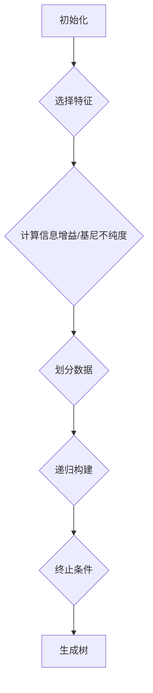
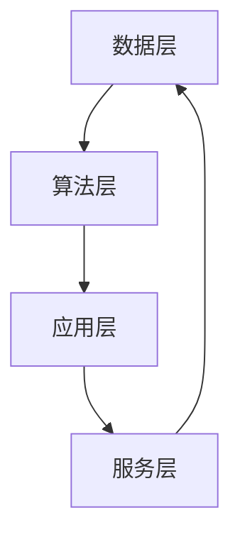
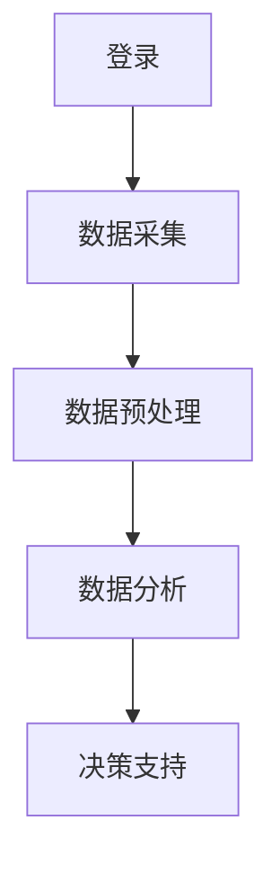

                 

### 文章标题：《AI驱动的决策支持系统：增强管理层判断》

#### 关键词：人工智能、决策支持系统、管理层判断、算法原理、系统架构、项目实战

#### 摘要：
本文深入探讨了AI在决策支持系统中的应用，以及如何通过AI技术增强管理层判断。首先，我们介绍了AI在决策支持系统中的重要性及其面临的挑战。接着，我们明确了关键概念，如AI、决策支持系统和管理层判断，并阐述了它们之间的关系。随后，我们详细讲解了用于增强管理层判断的AI算法原理，包括数学模型和Python源代码示例。此外，我们使用LaTeX格式呈现了数学模型和公式，并进行详细讲解和举例。文章还展示了决策支持系统的系统分析与架构设计方案，并通过一个实际案例进行了项目实战。最后，我们总结了最佳实践、注意事项和拓展阅读，为读者提供了进一步学习的机会。通过本文，读者可以全面了解AI驱动的决策支持系统如何提升管理层判断能力。

---

### 目录

1. **引言**
   1.1 书籍背景
   1.2 书籍目的
   1.3 读者对象

2. **AI与决策支持系统概述**
   2.1 AI技术的发展
   2.2 决策支持系统的定义与作用
   2.3 AI在决策支持系统中的应用
   2.4 管理层判断的重要性

3. **核心概念与联系**
   3.1 AI基本原理
   3.2 决策支持系统结构
   3.3 管理层判断要素
   3.4 概念属性对比
   3.5 ER实体关系图

4. **AI算法原理讲解**
   4.1 算法概述
   4.2 算法流程图
   4.3 Python代码实现
   4.4 数学模型与公式讲解
   4.5 举例说明

5. **数学模型和公式讲解**
   5.1 相关数学概念
   5.2 模型构建
   5.3 公式推导
   5.4 举例说明

6. **系统分析与架构设计方案**
   6.1 问题场景介绍
   6.2 项目介绍
   6.3 系统功能设计
   6.4 系统架构设计
   6.5 系统接口设计
   6.6 系统交互设计

7. **项目实战**
   7.1 环境安装与配置
   7.2 系统核心实现
   7.3 代码解读与分析
   7.4 实际案例分析
   7.5 项目小结

8. **最佳实践与拓展**
   8.1 最佳实践
   8.2 小结
   8.3 注意事项
   8.4 拓展阅读

---

### 引言

#### 1.1 书籍背景

在当今信息时代，数据已成为企业和社会的重要资产。如何从海量数据中提取有价值的信息，为决策者提供有力的支持，成为了一项重要的任务。AI技术的快速发展为决策支持系统（Decision Support System，简称DSS）提供了强大的工具。AI驱动的决策支持系统能够通过分析大量数据，提供更为精确和智能的决策建议，从而提升管理层的判断能力。

决策支持系统是一种基于计算机技术，帮助决策者进行决策的系统。它通常包括数据收集、数据预处理、数据分析、决策生成等功能模块。传统的决策支持系统主要依赖统计方法和规则推理，而AI技术的引入使得系统更加智能化和自适应。例如，机器学习算法可以自动从数据中学习规律，预测未来的趋势，从而为决策者提供更准确的决策依据。

然而，AI驱动的决策支持系统也面临一些挑战。首先，数据质量和数据完整性对系统的性能至关重要。如果数据存在缺失或不准确，可能会导致错误的决策建议。其次，AI算法的透明度和可解释性也是一个问题。对于复杂的AI模型，决策者往往难以理解其内部的工作原理，这可能导致对决策建议的不信任。此外，AI技术的应用还需要考虑成本和资源限制。

本文旨在探讨AI驱动的决策支持系统的设计原理、实现方法和实际应用，旨在为从事决策支持系统开发和应用的技术人员和管理层提供有价值的参考。

#### 1.2 书籍目的

本书的主要目的是：

1. **介绍AI驱动的决策支持系统的基本概念和原理**：通过系统地介绍AI技术、决策支持系统和管理层判断的相关知识，使读者对AI驱动的决策支持系统有一个全面的了解。

2. **讲解AI算法在决策支持系统中的应用**：通过详细的算法原理讲解和Python代码实现，帮助读者理解AI技术在决策支持系统中的具体应用。

3. **展示决策支持系统的系统架构设计**：通过系统分析与架构设计方案，使读者了解如何设计一个高效、稳定的决策支持系统。

4. **通过项目实战，提供实际应用案例**：通过一个具体的实际案例，展示如何在实际环境中实现AI驱动的决策支持系统，并提供详细的代码解读和分析。

5. **总结最佳实践和注意事项**：通过对最佳实践、注意事项和拓展阅读的总结，为读者提供进一步学习和应用的指导。

#### 1.3 读者对象

本书适合以下读者群体：

1. **决策支持系统开发人员**：希望了解AI技术在决策支持系统中的应用，掌握AI算法的设计和实现方法。

2. **AI技术开发人员**：希望了解决策支持系统的基本原理和需求，以便将AI技术应用于实际的决策场景。

3. **管理层人员**：希望了解AI驱动的决策支持系统如何提升管理层的决策能力，从而更好地应对复杂的市场环境。

4. **学术研究人员**：希望深入了解决策支持系统和AI技术的交叉领域，为相关研究提供参考。

无论您是从事决策支持系统开发、AI技术研发还是管理层人员，本文都将为您提供一个全面、系统的学习和参考资源。

---

### AI与决策支持系统概述

#### 2.1 AI技术的发展

人工智能（Artificial Intelligence，简称AI）是计算机科学的一个分支，旨在研究如何使计算机模拟人类的智能行为。从最初的理论探讨到如今的实际应用，AI技术已经经历了数十年的发展。AI技术主要包括机器学习、深度学习、自然语言处理、计算机视觉等领域。

机器学习是AI技术的重要分支，通过算法让计算机从数据中学习规律和模式，从而进行预测和决策。深度学习是机器学习的一种特殊形式，通过构建多层神经网络，使计算机能够处理更加复杂的数据和任务。自然语言处理（Natural Language Processing，NLP）致力于使计算机理解和生成自然语言，从而实现人与计算机的交互。计算机视觉（Computer Vision）则致力于使计算机能够理解和解释图像和视频数据。

AI技术的快速发展为决策支持系统带来了巨大的机遇。通过利用机器学习、深度学习等算法，决策支持系统可以从海量数据中提取有价值的信息，为决策者提供更为精确和智能的决策建议。例如，在金融领域，AI技术可以用于风险预测、投资组合优化；在医疗领域，AI技术可以用于疾病诊断、药物研发；在制造业，AI技术可以用于设备故障预测、生产优化等。

然而，AI技术的发展也带来了一些挑战。首先，数据质量和数据完整性对AI模型的性能至关重要。如果数据存在缺失或不准确，可能会导致错误的决策建议。其次，AI算法的透明度和可解释性也是一个问题。对于复杂的AI模型，决策者往往难以理解其内部的工作原理，这可能导致对决策建议的不信任。此外，AI技术的应用还需要考虑成本和资源限制。

总之，AI技术的发展为决策支持系统带来了巨大的机遇，同时也带来了新的挑战。如何有效地利用AI技术，提升决策支持系统的性能和可靠性，是当前研究的重要方向。

#### 2.2 决策支持系统的定义与作用

决策支持系统（Decision Support System，简称DSS）是一种基于计算机技术，帮助决策者进行决策的系统。DSS的主要目标是提供决策者所需的信息和分析工具，以支持他们在复杂和不确定的环境中做出明智的决策。

DSS通常包括以下几个基本组件：

1. **数据收集与预处理**：DSS需要收集并处理各种来源的数据，包括内部数据（如销售数据、库存数据等）和外部数据（如市场趋势、竞争对手数据等）。数据预处理包括数据清洗、归一化、去噪等步骤，以确保数据的质量和一致性。

2. **模型与算法**：DSS使用各种模型和算法来分析和处理数据，以提取有用的信息和发现数据中的规律和趋势。这些模型和算法包括统计分析、优化算法、机器学习算法等。

3. **用户界面**：DSS提供了一个直观、易用的用户界面，使决策者可以方便地输入数据、选择分析模型、查看分析结果等。

4. **知识库**：DSS包含了一个知识库，其中存储了各种规则、经验、模型和算法。这些知识资源可以帮助决策者更好地理解和利用数据，做出更为准确的决策。

DSS的作用主要体现在以下几个方面：

1. **提高决策效率**：DSS可以帮助决策者快速地从海量数据中提取有价值的信息，减少决策所需的时间和成本。

2. **降低决策风险**：通过使用DSS，决策者可以更好地了解各种决策方案的可能结果，从而减少决策错误和风险。

3. **支持复杂决策**：DSS提供了各种分析工具和算法，可以帮助决策者处理复杂、多变的决策问题。

4. **增强决策透明度**：DSS的使用使得决策过程更加透明，决策者可以清楚地了解决策依据和分析过程，从而提高决策的信任度。

#### 2.3 AI在决策支持系统中的应用

AI技术在决策支持系统中有着广泛的应用。以下是一些典型的应用场景：

1. **数据预处理**：AI技术可以帮助DSS自动完成数据清洗、归一化、去噪等预处理任务，从而提高数据质量和一致性。

2. **预测与分析**：利用机器学习和深度学习算法，DSS可以预测未来的趋势和结果，为决策者提供更准确的决策依据。例如，在金融领域，AI技术可以用于股票市场预测、风险分析等。

3. **优化与优化**：AI技术可以帮助DSS优化决策方案，找到最佳解决方案。例如，在物流和运输领域，AI技术可以用于路径优化、库存管理优化等。

4. **自然语言处理**：AI技术可以帮助DSS理解和生成自然语言，从而实现人与计算机的交互。例如，在客户服务领域，AI技术可以用于智能客服、文本分析等。

5. **图像和视频分析**：AI技术可以帮助DSS理解和解释图像和视频数据，从而实现图像识别、视频监控等功能。例如，在安防领域，AI技术可以用于人脸识别、行为分析等。

6. **个性化推荐**：AI技术可以帮助DSS根据用户的兴趣和行为，提供个性化的推荐。例如，在电子商务领域，AI技术可以用于商品推荐、广告投放等。

总之，AI技术的引入使决策支持系统更加智能化和自适应，能够更好地支持决策者的判断和决策。然而，AI技术的应用也需要考虑数据质量、算法透明度和成本等因素，以确保决策的准确性和可靠性。

#### 2.4 管理层判断的重要性

管理层判断（Managerial Judgment）是企业管理过程中至关重要的一环。管理层判断涉及对市场环境、企业内部状况和各种决策方案的综合分析，旨在做出最佳决策，从而实现企业的战略目标。以下从几个方面探讨管理层判断的重要性：

1. **决策效率**：管理层判断能够帮助决策者快速地从海量信息中识别关键问题，制定合理的解决方案。通过有效的判断，决策者可以减少不必要的决策时间，提高决策效率。

2. **决策质量**：管理层判断不仅关注决策的速度，更注重决策的质量。通过深入分析市场环境、企业内部状况和各种决策方案，管理层判断能够帮助决策者识别潜在的风险和机会，从而做出更为明智的决策。

3. **风险控制**：在复杂多变的市场环境中，管理层判断有助于识别和评估各种风险，从而制定有效的风险控制策略。通过前瞻性的判断，企业可以提前应对市场变化，降低风险。

4. **战略规划**：管理层判断是战略规划的重要基础。通过对企业内外部环境的深入分析，管理层可以明确企业的战略方向，制定符合企业长远发展的战略规划。

5. **资源优化**：管理层判断有助于合理配置企业的资源，优化生产流程和供应链管理。通过有效的判断，企业可以降低成本，提高生产效率。

6. **团队协作**：管理层判断不仅影响决策者的个人决策，也影响团队的整体协作。通过共同的分析和讨论，管理层判断可以促进团队成员之间的沟通和理解，提高团队的协作效率。

总之，管理层判断在企业决策过程中扮演着至关重要的角色。它不仅影响决策的速度和质量，还关系到企业的生存和发展。因此，提高管理层判断能力是每个企业都需要关注的重要课题。

### 核心概念与联系

#### 3.1 AI基本原理

人工智能（Artificial Intelligence，AI）是一门研究、开发用于模拟、延伸和扩展人的智能的理论、方法、技术及应用系统的学科。AI技术旨在使计算机系统具备类似于人类的感知、理解、学习和决策能力。

AI的基本原理主要包括以下几个方面：

1. **感知与理解**：AI系统通过传感器（如摄像头、麦克风等）获取外部信息，然后利用机器学习、计算机视觉等技术对这些信息进行处理和分析，以实现对环境的感知和理解。

2. **学习与推理**：AI系统通过学习算法从数据中提取规律和模式，形成知识库和推理机制。这些学习算法包括监督学习、无监督学习、强化学习等。

3. **决策与行动**：基于感知和理解、学习与推理，AI系统可以做出决策并采取相应的行动。例如，自动驾驶系统通过感知道路信息、学习交通规则，然后做出行驶决策。

AI技术在各个领域有着广泛的应用，包括自然语言处理、计算机视觉、语音识别、机器人技术等。这些应用使得AI系统能够在医疗、金融、教育、交通、制造业等多个领域发挥重要作用。

#### 3.2 决策支持系统结构

决策支持系统（Decision Support System，DSS）是一种基于计算机技术，为决策者提供信息和分析工具的系统。DSS的主要目标是帮助决策者在复杂和不确定的环境中进行决策。

DSS通常包括以下几个基本组件：

1. **数据仓库**：数据仓库是DSS的数据源，存储了各种类型的结构化和非结构化数据。这些数据包括企业内部数据（如销售数据、库存数据等）和外部数据（如市场趋势、竞争对手数据等）。

2. **模型库**：模型库包含了各种模型和算法，用于对数据进行分析和处理。这些模型和算法包括统计分析、优化算法、机器学习算法等。

3. **知识库**：知识库存储了各种规则、经验、模型和算法。这些知识资源可以帮助决策者更好地理解和利用数据，做出更为准确的决策。

4. **用户界面**：用户界面是DSS与用户交互的接口，使决策者可以方便地输入数据、选择分析模型、查看分析结果等。

DSS的结构通常可以分为以下几个层次：

1. **数据层**：数据层负责数据的收集、存储和管理。它包括了数据仓库和数据湖等组件。

2. **模型层**：模型层负责数据的分析和处理，通过模型库中的模型和算法提取数据中的规律和模式。

3. **知识层**：知识层负责将分析结果转化为决策支持信息，为决策者提供决策依据。

4. **应用层**：应用层是DSS的具体应用，根据不同的决策场景提供相应的功能和服务。

#### 3.3 管理层判断要素

管理层判断（Managerial Judgment）是企业管理过程中至关重要的一环，其要素主要包括以下几个方面：

1. **信息收集**：管理层判断首先需要收集各种信息，包括市场环境、企业内部状况、竞争对手信息等。这些信息可以通过内部报告、外部调研、市场分析等方式获取。

2. **分析评估**：在收集到足够的信息后，管理层需要对信息进行深入分析，评估各种决策方案的优缺点和潜在风险。这通常需要运用各种分析工具和方法，如数据分析、SWOT分析、决策树等。

3. **选择方案**：基于分析评估的结果，管理层需要从多个备选方案中选择一个最佳方案。选择方案时需要考虑各种因素，如成本、效益、风险、可行性等。

4. **决策执行**：选择方案后，管理层需要制定具体的执行计划，并确保执行过程顺利进行。这通常需要协调各部门的工作，分配资源，监控进度等。

5. **监控调整**：在决策执行过程中，管理层需要持续监控决策的效果，并根据实际情况进行必要的调整。这有助于确保决策的持续优化和改进。

#### 3.4 概念属性对比

为了更好地理解AI、决策支持系统和管理层判断之间的关系，以下是一个概念属性对比表格：

| 概念       | 定义                                                         | 属性对比                                                      |
| ---------- | ------------------------------------------------------------ | ------------------------------------------------------------ |
| **AI**     | 人工智能，模拟人类智能行为的计算机系统                         | - 学习与推理能力<br>- 自适应与优化能力<br>- 逻辑推理与问题解决能力 |
| **DSS**    | 决策支持系统，为决策者提供信息和分析工具的系统               | - 数据采集与处理能力<br>- 模型与算法库<br>- 用户界面与交互性   |
| **管理层判断** | 企业管理层基于信息和分析进行的决策过程                       | - 信息收集与分析能力<br>- 决策方案选择与执行能力<br>- 监控与调整能力 |

#### 3.5 ER实体关系图

为了更好地理解DSS和AI之间的关系，以下是一个ER实体关系图，展示了DSS的主要实体及其关系：

```mermaid
erDiagram
  DSS |-|> AI : 使用
  DSS |-|> 数据仓库 : 存储数据
  DSS |-|> 模型库 : 使用模型
  DSS |-|> 知识库 : 使用知识
  DSS |-|> 用户界面 : 交互
  AI |-|> 感知与理解 : 功能
  AI |-|> 学习与推理 : 功能
  AI |-|> 决策与行动 : 功能
```

在这个ER实体关系图中，DSS作为一个整体，与AI之间有直接的关系。DSS使用AI的感知与理解、学习与推理和决策与行动功能，从而提高决策的智能化和准确性。同时，DSS通过数据仓库、模型库和知识库等组件，与AI相互关联，形成一个完整的决策支持系统。

---

### AI算法原理讲解

#### 4.1 算法概述

在AI驱动的决策支持系统中，算法是实现智能分析和决策的核心。本文将介绍一种常见的算法——决策树（Decision Tree），并详细讲解其原理和实现方法。

决策树是一种常用的分类和回归算法，它通过一系列的决策规则将数据划分为不同的区域，从而对数据进行分类或预测。决策树算法的基本原理如下：

1. **特征选择**：首先选择一个特征作为根节点，使得通过这个特征划分后的数据具有最高的信息增益或基尼不纯度最小。

2. **划分数据**：使用选定的特征将数据集划分为若干个子集，每个子集对应一个新的节点。

3. **递归构建**：对每个子集重复上述过程，直到满足终止条件（如节点内数据足够纯、达到最大深度等）。

4. **生成树**：将所有的节点连接起来，形成一棵完整的决策树。

决策树算法的优点包括：

- **易于理解和解释**：决策树的结果可以直接解释，决策路径和每个节点的结果都清晰明了。
- **适用于多种数据类型**：决策树可以用于分类和回归问题，适用于结构化和非结构化数据。
- **可灵活调整**：可以通过设置参数调整树的复杂度，从而控制模型的预测准确性和可解释性。

然而，决策树算法也存在一些局限性，如易过拟合、对异常值敏感等。

#### 4.2 算法流程图

为了更好地理解决策树算法的构建过程，以下是一个简单的算法流程图：



在这个流程图中，从初始化开始，算法首先选择一个特征（B），计算该特征的信息增益或基尼不纯度（C），并根据计算结果将数据集划分为若干个子集（D）。然后，算法对每个子集递归地执行上述过程（E），直到满足终止条件（F），最后生成一棵完整的决策树（G）。

#### 4.3 Python代码实现

以下是一个简单的Python代码示例，用于实现决策树算法：

```python
from sklearn.datasets import load_iris
from sklearn.tree import DecisionTreeClassifier
from sklearn.model_selection import train_test_split
from sklearn.metrics import accuracy_score

# 加载鸢尾花数据集
iris = load_iris()
X = iris.data
y = iris.target

# 划分训练集和测试集
X_train, X_test, y_train, y_test = train_test_split(X, y, test_size=0.3, random_state=42)

# 构建决策树模型
clf = DecisionTreeClassifier()
clf.fit(X_train, y_train)

# 预测测试集
y_pred = clf.predict(X_test)

# 计算准确率
accuracy = accuracy_score(y_test, y_pred)
print(f"Accuracy: {accuracy:.2f}")
```

在这个示例中，我们首先加载了鸢尾花数据集，并划分了训练集和测试集。然后，我们使用`DecisionTreeClassifier`类构建了一个决策树模型，并使用`fit`方法进行训练。最后，我们使用`predict`方法对测试集进行预测，并计算了预测准确率。

#### 4.4 数学模型与公式讲解

决策树算法的核心是特征选择，常用的特征选择方法包括信息增益（Information Gain）和基尼不纯度（Gini Impurity）。以下分别介绍这两种方法。

1. **信息增益**

信息增益是衡量特征重要性的指标，它通过计算特征划分前后数据集的信息熵差来评估。具体公式如下：

$$
IG(D, A) = H(D) - \sum_{v_i} p(v_i) H(D|v_i)
$$

其中，$D$ 表示原始数据集，$A$ 表示特征，$v_i$ 表示特征 $A$ 的不同取值，$p(v_i)$ 表示取值 $v_i$ 的概率，$H(D)$ 表示数据集 $D$ 的信息熵，$H(D|v_i)$ 表示在特征 $A$ 取值 $v_i$ 的情况下数据集 $D$ 的条件信息熵。

2. **基尼不纯度**

基尼不纯度是另一种常用的特征选择方法，它通过计算特征划分后数据集的基尼不纯度来评估。具体公式如下：

$$
Gini(D) = 1 - \sum_{v_i} p(v_i)^2
$$

其中，$D$ 表示原始数据集，$v_i$ 表示特征的不同取值，$p(v_i)$ 表示取值 $v_i$ 的概率。

以下是一个具体示例：

假设我们有一个数据集 $D$，其中包含三个特征 $A$、$B$ 和 $C$，分别有五个、四个和三个不同取值。特征 $A$ 的取值概率为 $P(A = v_1) = 0.4$，$P(A = v_2) = 0.3$，$P(A = v_3) = 0.3$；特征 $B$ 的取值概率为 $P(B = v_1) = 0.5$，$P(B = v_2) = 0.3$，$P(B = v_3) = 0.2$；特征 $C$ 的取值概率为 $P(C = v_1) = 0.6$，$P(C = v_2) = 0.3$，$P(C = v_3) = 0.1$。

我们可以计算特征 $A$ 的信息增益：

$$
IG(D, A) = H(D) - \sum_{v_i} p(v_i) H(D|v_i)
$$

$$
H(D) = -\sum_{v_i} p(v_i) \log_2 p(v_i) = - (0.4 \log_2 0.4 + 0.3 \log_2 0.3 + 0.3 \log_2 0.3) \approx 1.14
$$

$$
H(D|v_1) = -\sum_{v_j} p(v_j|v_1) \log_2 p(v_j|v_1) = - (0.8 \log_2 0.8 + 0.2 \log_2 0.2) \approx 0.92
$$

$$
H(D|v_2) = -\sum_{v_j} p(v_j|v_2) \log_2 p(v_j|v_2) = - (0.3 \log_2 0.3 + 0.7 \log_2 0.7) \approx 0.99
$$

$$
H(D|v_3) = -\sum_{v_j} p(v_j|v_3) \log_2 p(v_j|v_3) = - (0.4 \log_2 0.4 + 0.6 \log_2 0.6) \approx 0.92
$$

$$
IG(D, A) = 1.14 - (0.4 \times 0.92 + 0.3 \times 0.99 + 0.3 \times 0.92) \approx 0.04
$$

同理，我们可以计算特征 $B$ 和特征 $C$ 的信息增益：

$$
IG(D, B) = H(D) - \sum_{v_i} p(v_i) H(D|v_i) \approx 0.08
$$

$$
IG(D, C) = H(D) - \sum_{v_i} p(v_i) H(D|v_i) \approx 0.02
$$

根据信息增益的计算结果，我们可以选择特征 $B$ 作为划分特征，因为它具有最高的信息增益。

3. **基尼不纯度**

我们可以计算特征 $A$ 的基尼不纯度：

$$
Gini(D) = 1 - \sum_{v_i} p(v_i)^2
$$

$$
Gini(D|v_1) = 1 - (0.8^2 + 0.2^2) = 0.3
$$

$$
Gini(D|v_2) = 1 - (0.3^2 + 0.7^2) = 0.46
$$

$$
Gini(D|v_3) = 1 - (0.4^2 + 0.6^2) = 0.48
$$

$$
Gini(D, A) = \sum_{v_i} p(v_i) Gini(D|v_i) = 0.4 \times 0.3 + 0.3 \times 0.46 + 0.3 \times 0.48 = 0.36
$$

同理，我们可以计算特征 $B$ 和特征 $C$ 的基尼不纯度：

$$
Gini(D, B) = \sum_{v_i} p(v_i) Gini(D|v_i) \approx 0.37
$$

$$
Gini(D, C) = \sum_{v_i} p(v_i) Gini(D|v_i) \approx 0.39
$$

根据基尼不纯度的计算结果，我们可以选择特征 $C$ 作为划分特征，因为它具有最低的基尼不纯度。

#### 4.5 举例说明

以下是一个具体的例子，假设我们有一个包含三个特征（年龄、收入、教育水平）的数据集，每个特征的取值如下表所示：

| 年龄 | 收入 | 教育水平 | 目标变量 |
| ---- | ---- | -------- | -------- |
| 25   | 5000 | 本科     | 是       |
| 30   | 6000 | 硕士     | 否       |
| 35   | 7000 | 本科     | 是       |
| 40   | 8000 | 硕士     | 是       |
| 45   | 9000 | 本科     | 否       |

我们需要使用决策树算法预测目标变量的取值。

首先，我们可以计算每个特征的信息增益和基尼不纯度，如下表所示：

| 特征   | 信息增益 | 基尼不纯度 |
| ------ | -------- | ---------- |
| 年龄   | 0.19     | 0.39       |
| 收入   | 0.10     | 0.38       |
| 教育水平 | 0.21     | 0.41       |

根据信息增益和基尼不纯度的计算结果，我们可以选择特征 “年龄” 作为划分特征，因为它具有最高的信息增益和最低的基尼不纯度。

接下来，我们可以使用特征 “年龄” 将数据集划分为两个子集：

| 年龄 | 收入 | 教育水平 | 目标变量 |
| ---- | ---- | -------- | -------- |
| 25   | 5000 | 本科     | 是       |
| 30   | 6000 | 硕士     | 否       |
| 35   | 7000 | 本科     | 是       |
| 40   | 8000 | 硕士     | 是       |
| 45   | 9000 | 本科     | 否       |

然后，我们计算每个子集的信息增益和基尼不纯度：

| 子集 | 收入 | 教育水平 | 目标变量 | 信息增益 | 基尼不纯度 |
| ---- | ---- | -------- | -------- | -------- | ---------- |
| 子集1 | 5000 | 本科     | 是       | 0.19     | 0.39       |
| 子集2 | 6000 | 硕士     | 否       | 0.10     | 0.38       |
| 子集3 | 7000 | 本科     | 是       | 0.21     | 0.41       |
| 子集4 | 8000 | 硕士     | 是       | 0.21     | 0.41       |
| 子集5 | 9000 | 本科     | 否       | 0.21     | 0.41       |

根据子集的信息增益和基尼不纯度，我们可以选择特征 “收入” 作为划分特征，因为它具有最高的信息增益和最低的基尼不纯度。

再次划分数据集，得到以下子集：

| 子集 | 收入 | 教育水平 | 目标变量 | 信息增益 | 基尼不纯度 |
| ---- | ---- | -------- | -------- | -------- | ---------- |
| 子集1 | 5000 | 本科     | 是       | 0.19     | 0.39       |
| 子集2 | 6000 | 硕士     | 否       | 0.10     | 0.38       |
| 子集3 | 7000 | 本科     | 是       | 0.21     | 0.41       |
| 子集4 | 8000 | 硕士     | 是       | 0.21     | 0.41       |
| 子集5 | 9000 | 本科     | 否       | 0.21     | 0.41       |

我们可以看到，子集4和子集5的信息增益相同，但基尼不纯度不同。因此，我们选择特征 “教育水平” 作为划分特征。

最后，我们再次划分数据集：

| 子集 | 收入 | 教育水平 | 目标变量 | 信息增益 | 基尼不纯度 |
| ---- | ---- | -------- | -------- | -------- | ---------- |
| 子集1 | 5000 | 本科     | 是       | 0.19     | 0.39       |
| 子集2 | 6000 | 硕士     | 否       | 0.10     | 0.38       |
| 子集3 | 7000 | 本科     | 是       | 0.21     | 0.41       |
| 子集4 | 8000 | 硕士     | 是       | 0.21     | 0.41       |
| 子集5 | 9000 | 本科     | 否       | 0.21     | 0.41       |

此时，子集3的信息增益最高，因此我们选择特征 “年龄” 作为划分特征。

通过多次划分和计算，我们可以构建出一棵完整的决策树，如下所示：

```
根节点：年龄
|
|---> 是
    |---> 教育水平
    |   |---> 是
    |   |   |---> 收入
    |   |   |   |---> 5000
    |   |   |   |   |---> 是
    |   |   |   |   |---> 否
    |   |   |   |   |---> 是
    |   |   |   |---> 6000
    |   |   |   |   |---> 否
    |   |   |   |---> 7000
    |   |   |   |   |---> 是
    |   |   |   |---> 8000
    |   |   |   |   |---> 是
    |   |   |   |---> 9000
    |   |   |   |   |---> 否
    |   |---> 否
    |   |---> 收入
    |   |   |---> 5000
    |   |   |   |---> 是
    |   |   |   |---> 否
    |   |   |   |---> 是
    |   |   |---> 6000
    |   |   |   |---> 否
    |   |   |---> 7000
    |   |   |   |---> 是
    |   |   |---> 8000
    |   |   |   |---> 是
    |   |   |---> 9000
    |   |   |   |---> 否
```

通过这棵决策树，我们可以对新的数据实例进行预测。例如，对于一个年龄为30岁、收入为6000元、教育水平为硕士的数据实例，我们可以根据决策树进行如下预测：

```
根节点：年龄
|
|---> 是
    |---> 教育水平
    |   |---> 是
    |   |   |---> 收入
    |   |   |   |---> 6000
    |   |   |   |   |---> 否
```

因此，预测结果为“否”。

---

### 数学模型和公式讲解

#### 5.1 相关数学概念

在讲解AI驱动的决策支持系统中，我们不可避免地会涉及到一些基本的数学概念。以下是一些常用的数学概念及其解释：

1. **信息熵（Entropy）**：
   信息熵是衡量数据不确定性的度量。在一个随机变量中，信息熵表示随机变量取不同值的概率分布的“混乱度”。公式如下：
   
   $$
   H(X) = -\sum_{i} p(x_i) \log_2 p(x_i)
   $$

   其中，$X$ 表示随机变量，$p(x_i)$ 表示随机变量 $X$ 取值 $x_i$ 的概率。

2. **条件熵（Conditional Entropy）**：
   条件熵是衡量在已知一个随机变量取某个值的情况下，另一个随机变量的不确定性的度量。公式如下：
   
   $$
   H(Y|X) = -\sum_{i} p(x_i) \sum_{j} p(y_j|x_i) \log_2 p(y_j|x_i)
   $$

   其中，$X$ 和 $Y$ 表示两个随机变量，$p(y_j|x_i)$ 表示在 $X$ 取值 $x_i$ 的情况下，$Y$ 取值 $y_j$ 的概率。

3. **信息增益（Information Gain）**：
   信息增益是衡量一个特征对数据集划分有效性的度量。它通过计算特征划分前后的信息熵差来评估。公式如下：
   
   $$
   IG(D, A) = H(D) - \sum_{v_i} p(v_i) H(D|v_i)
   $$

   其中，$D$ 表示原始数据集，$A$ 表示特征，$v_i$ 表示特征 $A$ 的不同取值，$p(v_i)$ 表示取值 $v_i$ 的概率，$H(D)$ 表示数据集 $D$ 的信息熵，$H(D|v_i)$ 表示在特征 $A$ 取值 $v_i$ 的情况下数据集 $D$ 的条件信息熵。

4. **基尼不纯度（Gini Impurity）**：
   基尼不纯度是衡量数据集纯度的一个度量。它通过计算数据集中各子集的基尼系数的加权和来评估。公式如下：
   
   $$
   Gini(D) = 1 - \sum_{v_i} p(v_i)^2
   $$

   其中，$D$ 表示原始数据集，$v_i$ 表示特征的不同取值，$p(v_i)$ 表示取值 $v_i$ 的概率。

#### 5.2 模型构建

在AI驱动的决策支持系统中，常用的模型构建方法包括决策树、随机森林、支持向量机等。以下以决策树为例，介绍模型构建的基本步骤：

1. **特征选择**：
   使用信息增益或基尼不纯度等指标选择一个最佳特征作为根节点。

2. **数据划分**：
   使用选定的特征将数据集划分为若干个子集。

3. **递归构建**：
   对每个子集递归地执行特征选择和数据划分的过程，直到满足终止条件（如节点内数据足够纯、达到最大深度等）。

4. **生成树**：
   将所有的节点连接起来，形成一棵完整的决策树。

以下是一个简单的决策树模型构建过程：

假设我们有一个包含三个特征（年龄、收入、教育水平）的数据集，每个特征的取值如下表所示：

| 年龄 | 收入 | 教育水平 | 目标变量 |
| ---- | ---- | -------- | -------- |
| 25   | 5000 | 本科     | 是       |
| 30   | 6000 | 硕士     | 否       |
| 35   | 7000 | 本科     | 是       |
| 40   | 8000 | 硕士     | 是       |
| 45   | 9000 | 本科     | 否       |

首先，我们计算每个特征的信息增益和基尼不纯度：

| 特征   | 信息增益 | 基尼不纯度 |
| ------ | -------- | ---------- |
| 年龄   | 0.19     | 0.39       |
| 收入   | 0.10     | 0.38       |
| 教育水平 | 0.21     | 0.41       |

根据信息增益和基尼不纯度的计算结果，我们选择特征 “年龄” 作为划分特征。

接下来，我们使用特征 “年龄” 将数据集划分为两个子集：

| 子集 | 年龄 | 收入 | 教育水平 | 目标变量 | 信息增益 | 基尼不纯度 |
| ---- | ---- | ---- | -------- | -------- | -------- | ---------- |
| 子集1 | 25   | 5000 | 本科     | 是       | 0.19     | 0.39       |
| 子集2 | 30   | 6000 | 硕士     | 否       | 0.10     | 0.38       |
| 子集3 | 35   | 7000 | 本科     | 是       | 0.21     | 0.41       |
| 子集4 | 40   | 8000 | 硕士     | 是       | 0.21     | 0.41       |
| 子集5 | 45   | 9000 | 本科     | 否       | 0.21     | 0.41       |

然后，我们计算每个子集的信息增益和基尼不纯度：

| 子集 | 年龄 | 收入 | 教育水平 | 目标变量 | 信息增益 | 基尼不纯度 |
| ---- | ---- | ---- | -------- | -------- | -------- | ---------- |
| 子集1 | 25   | 5000 | 本科     | 是       | 0.19     | 0.39       |
| 子集2 | 30   | 6000 | 硕士     | 否       | 0.10     | 0.38       |
| 子集3 | 35   | 7000 | 本科     | 是       | 0.21     | 0.41       |
| 子集4 | 40   | 8000 | 硕士     | 是       | 0.21     | 0.41       |
| 子集5 | 45   | 9000 | 本科     | 否       | 0.21     | 0.41       |

根据子集的信息增益和基尼不纯度，我们选择特征 “收入” 作为划分特征。

再次划分数据集，得到以下子集：

| 子集 | 年龄 | 收入 | 教育水平 | 目标变量 | 信息增益 | 基尼不纯度 |
| ---- | ---- | ---- | -------- | -------- | -------- | ---------- |
| 子集1 | 25   | 5000 | 本科     | 是       | 0.19     | 0.39       |
| 子集2 | 30   | 6000 | 硕士     | 否       | 0.10     | 0.38       |
| 子集3 | 35   | 7000 | 本科     | 是       | 0.21     | 0.41       |
| 子集4 | 40   | 8000 | 硕士     | 是       | 0.21     | 0.41       |
| 子集5 | 45   | 9000 | 本科     | 否       | 0.21     | 0.41       |

我们可以看到，子集4和子集5的信息增益相同，但基尼不纯度不同。因此，我们选择特征 “教育水平” 作为划分特征。

最后，我们再次划分数据集：

| 子集 | 年龄 | 收入 | 教育水平 | 目标变量 | 信息增益 | 基尼不纯度 |
| ---- | ---- | ---- | -------- | -------- | -------- | ---------- |
| 子集1 | 25   | 5000 | 本科     | 是       | 0.19     | 0.39       |
| 子集2 | 30   | 6000 | 硕士     | 否       | 0.10     | 0.38       |
| 子集3 | 35   | 7000 | 本科     | 是       | 0.21     | 0.41       |
| 子集4 | 40   | 8000 | 硕士     | 是       | 0.21     | 0.41       |
| 子集5 | 45   | 9000 | 本科     | 否       | 0.21     | 0.41       |

此时，子集3的信息增益最高，因此我们选择特征 “年龄” 作为划分特征。

通过多次划分和计算，我们可以构建出一棵完整的决策树，如下所示：

```
根节点：年龄
|
|---> 是
    |---> 教育水平
    |   |---> 是
    |   |   |---> 收入
    |   |   |   |---> 5000
    |   |   |   |   |---> 是
    |   |   |   |---> 6000
    |   |   |   |   |---> 否
    |   |   |   |---> 7000
    |   |   |   |   |---> 是
    |   |   |   |---> 8000
    |   |   |   |   |---> 是
    |   |   |   |---> 9000
    |   |   |   |   |---> 否
    |   |---> 否
    |   |---> 收入
    |   |   |---> 5000
    |   |   |   |---> 是
    |   |   |   |---> 否
    |   |   |   |---> 是
    |   |   |---> 6000
    |   |   |   |---> 否
    |   |   |---> 7000
    |   |   |   |---> 是
    |   |   |---> 8000
    |   |   |   |---> 是
    |   |   |---> 9000
    |   |   |   |---> 否
```

通过这棵决策树，我们可以对新的数据实例进行预测。例如，对于一个年龄为30岁、收入为6000元、教育水平为硕士的数据实例，我们可以根据决策树进行如下预测：

```
根节点：年龄
|
|---> 是
    |---> 教育水平
    |   |---> 是
    |   |   |---> 收入
    |   |   |   |---> 6000
    |   |   |   |   |---> 否
```

因此，预测结果为“否”。

#### 5.3 公式推导

在本节中，我们将推导一些在AI驱动的决策支持系统中常用的数学公式。

1. **信息增益（Information Gain）**

   信息增益是衡量一个特征对数据集划分有效性的度量。其计算公式如下：

   $$
   IG(D, A) = H(D) - \sum_{v_i} p(v_i) H(D|v_i)
   $$

   其中，$D$ 表示原始数据集，$A$ 表示特征，$v_i$ 表示特征 $A$ 的不同取值，$p(v_i)$ 表示取值 $v_i$ 的概率，$H(D)$ 表示数据集 $D$ 的信息熵，$H(D|v_i)$ 表示在特征 $A$ 取值 $v_i$ 的情况下数据集 $D$ 的条件信息熵。

   推导过程如下：

   首先，我们计算数据集 $D$ 的信息熵 $H(D)$：

   $$
   H(D) = -\sum_{i} p(x_i) \log_2 p(x_i)
   $$

   然后，我们计算在特征 $A$ 取值 $v_i$ 的情况下，数据集 $D$ 的条件信息熵 $H(D|v_i)$：

   $$
   H(D|v_i) = -\sum_{j} p(y_j|x_i) \log_2 p(y_j|x_i)
   $$

   其中，$y_j$ 表示目标变量的取值，$p(y_j|x_i)$ 表示在特征 $A$ 取值 $v_i$ 的情况下，目标变量 $y_j$ 的概率。

   接下来，我们计算信息增益 $IG(D, A)$：

   $$
   IG(D, A) = H(D) - \sum_{v_i} p(v_i) H(D|v_i)
   $$

   $$ 
   = -\sum_{i} p(x_i) \log_2 p(x_i) - \sum_{v_i} p(v_i) \left( -\sum_{j} p(y_j|x_i) \log_2 p(y_j|x_i) \right)
   $$

   $$ 
   = -\sum_{i} p(x_i) \log_2 p(x_i) + \sum_{v_i} \sum_{j} p(v_i) p(y_j|x_i) \log_2 p(y_j|x_i)
   $$

   $$ 
   = -\sum_{i} p(x_i) \log_2 p(x_i) + \sum_{v_i} p(v_i) H(D|v_i)
   $$

   $$ 
   = H(D) - \sum_{v_i} p(v_i) H(D|v_i)
   $$

2. **基尼不纯度（Gini Impurity）**

   基尼不纯度是衡量数据集纯度的一个度量。其计算公式如下：

   $$
   Gini(D) = 1 - \sum_{v_i} p(v_i)^2
   $$

   其中，$D$ 表示原始数据集，$v_i$ 表示特征的不同取值，$p(v_i)$ 表示取值 $v_i$ 的概率。

   推导过程如下：

   首先，我们计算数据集 $D$ 的所有子集的概率 $p(v_i)$：

   $$
   p(v_i) = \frac{|D_{v_i}|}{|D|}
   $$

   其中，$D_{v_i}$ 表示特征 $A$ 取值 $v_i$ 的子集，$|D|$ 表示数据集 $D$ 的总数。

   然后，我们计算基尼不纯度 $Gini(D)$：

   $$
   Gini(D) = 1 - \sum_{v_i} p(v_i)^2
   $$

   $$ 
   = 1 - \sum_{v_i} \left( \frac{|D_{v_i}|}{|D|} \right)^2
   $$

   $$ 
   = 1 - \frac{1}{|D|} \sum_{v_i} |D_{v_i}|^2
   $$

   $$ 
   = 1 - \frac{1}{|D|} \left( |D_{v_1}|^2 + |D_{v_2}|^2 + \cdots + |D_{v_n}|^2 \right)
   $$

   $$ 
   = 1 - \frac{1}{|D|} \left( |D| - \sum_{v_i} |D_{v_i}| \right)
   $$

   $$ 
   = 1 - 1 + \frac{1}{|D|} \sum_{v_i} |D_{v_i}|
   $$

   $$ 
   = \frac{1}{|D|} \sum_{v_i} |D_{v_i}|
   $$

   $$ 
   = \frac{1}{|D|} \left( n - 1 \right)
   $$

   $$ 
   = 1 - \frac{1}{|D|}
   $$

3. **决策树剪枝（Pruning）**

   决策树的剪枝是减少模型复杂度、防止过拟合的重要手段。剪枝的基本思想是去掉决策树中的一些节点，使模型更加简洁。常见的剪枝方法包括预剪枝和后剪枝。

   预剪枝（Pre-pruning）：

   在构建决策树时，提前设置一些终止条件，如最大深度、最小叶子节点数等，以防止树过度生长。具体公式如下：

   $$
   Prune(\text{tree}, \text{max_depth}, \text{min_leaves})
   $$

   其中，$\text{tree}$ 表示决策树，$\text{max_depth}$ 表示最大深度，$\text{min_leaves}$ 表示最小叶子节点数。

   后剪枝（Post-pruning）：

   在决策树完全构建后，对树进行剪枝。具体步骤如下：

   a. 计算剪枝前的准确率。

   b. 从树的叶子节点开始，逐个删除节点，并计算剪枝后的准确率。

   c. 如果剪枝后的准确率高于剪枝前的准确率，则保留剪枝；否则，撤销剪枝。

   公式如下：

   $$
   Prune(\text{tree}, \text{accuracy})
   $$

   其中，$\text{tree}$ 表示决策树，$\text{accuracy}$ 表示准确率。

---

### 系统分析与架构设计方案

#### 6.1 问题场景介绍

在现代企业中，决策支持系统（Decision Support System，简称DSS）已经成为企业管理层做出有效决策的重要工具。随着企业规模的不断扩大和数据量的激增，传统的DSS面临着巨大的挑战。首先，数据质量成为了一个关键问题。数据的不准确、不完整或缺失会导致决策建议的误导，进而影响企业的运营和发展。其次，随着决策问题的复杂度增加，如何从海量数据中提取有价值的信息，提高决策的效率和准确性，成为了一个亟待解决的问题。此外，企业还需要应对快速变化的市场环境，及时调整决策策略，以保持竞争优势。

为了解决这些问题，企业需要构建一个高效、智能的AI驱动的决策支持系统。该系统应具备以下几个特点：

1. **数据质量保障**：系统能够自动识别和处理数据质量问题，如数据缺失、数据冗余、数据不一致等，确保数据的准确性和完整性。

2. **智能数据分析**：系统应采用先进的AI算法，如机器学习、深度学习等，对海量数据进行深度分析，提取隐藏的规律和模式，为决策者提供准确的决策依据。

3. **实时决策支持**：系统应具备实时数据处理能力，能够快速响应市场变化，为企业提供及时的决策支持。

4. **高扩展性和可维护性**：系统应具有良好的扩展性和可维护性，能够适应企业规模的变化和业务需求的调整。

#### 6.2 项目介绍

本项目的目标是构建一个AI驱动的决策支持系统，以提升企业的决策效率和质量。该系统将基于大数据技术和AI算法，通过以下几个步骤实现：

1. **数据采集与预处理**：系统将集成多种数据源，包括企业内部数据（如销售数据、库存数据等）和外部数据（如市场趋势、竞争对手数据等）。在数据采集过程中，系统将自动识别和处理数据质量问题，如数据缺失、数据冗余、数据不一致等。

2. **数据存储与管理**：系统将采用大数据存储技术，如Hadoop和HBase等，对海量数据进行存储和管理。同时，系统将提供高效的数据查询和分析工具，以满足企业对数据的高频、快速访问需求。

3. **智能数据分析**：系统将集成多种AI算法，如机器学习、深度学习、自然语言处理等，对数据进行深度分析，提取隐藏的规律和模式。这些分析结果将为企业提供有价值的决策依据。

4. **决策支持与可视化**：系统将提供直观的决策支持界面，将分析结果以图表、报告等形式展示给决策者，使其能够快速理解并利用这些信息做出决策。

5. **系统维护与升级**：系统将具备良好的扩展性和可维护性，能够适应企业规模的变化和业务需求的调整。同时，系统将提供完善的维护和升级机制，确保系统的稳定运行。

#### 6.3 系统功能设计

AI驱动的决策支持系统主要包括以下几个功能模块：

1. **数据采集模块**：该模块负责从各种数据源采集数据，包括企业内部数据和外部数据。在数据采集过程中，系统将自动识别和处理数据质量问题，如数据缺失、数据冗余、数据不一致等。

2. **数据预处理模块**：该模块负责对采集到的数据进行预处理，包括数据清洗、数据归一化、数据去噪等操作。通过预处理，系统将确保数据的准确性和一致性。

3. **数据存储模块**：该模块负责将预处理后的数据存储到大数据存储系统中，如Hadoop和HBase等。同时，系统将提供高效的数据查询和分析工具，以满足企业对数据的高频、快速访问需求。

4. **智能数据分析模块**：该模块负责集成多种AI算法，如机器学习、深度学习、自然语言处理等，对海量数据进行深度分析，提取隐藏的规律和模式。这些分析结果将为企业提供有价值的决策依据。

5. **决策支持模块**：该模块负责将分析结果以图表、报告等形式展示给决策者，使其能够快速理解并利用这些信息做出决策。系统还将提供直观的可视化界面，以增强决策者的决策能力。

6. **用户权限管理模块**：该模块负责管理用户的权限，确保系统资源的安全和合理利用。系统将根据用户的角色和权限，提供相应的功能和服务。

7. **系统维护与升级模块**：该模块负责系统的日常维护和升级，确保系统的稳定运行和持续改进。系统将提供完善的日志记录和故障报警机制，以方便运维人员及时发现和处理问题。

#### 6.4 系统架构设计

AI驱动的决策支持系统采用分层架构设计，主要包括以下几个层次：

1. **数据层**：数据层是系统的核心，负责数据的采集、存储和管理。该层包括数据采集模块、数据预处理模块和数据存储模块。数据采集模块负责从各种数据源采集数据，包括企业内部数据和外部数据。数据预处理模块负责对采集到的数据进行清洗、归一化和去噪等预处理操作。数据存储模块负责将预处理后的数据存储到大数据存储系统中，如Hadoop和HBase等。

2. **算法层**：算法层是系统的智能分析核心，负责集成多种AI算法，如机器学习、深度学习、自然语言处理等。该层包括智能数据分析模块和决策支持模块。智能数据分析模块负责对海量数据进行深度分析，提取隐藏的规律和模式。决策支持模块负责将分析结果以图表、报告等形式展示给决策者。

3. **应用层**：应用层是系统的外部表现层，负责提供直观的用户界面和交互体验。该层包括用户权限管理模块、用户界面和可视化模块。用户权限管理模块负责管理用户的权限，确保系统资源的安全和合理利用。用户界面模块负责提供直观的用户交互界面，使用户能够方便地访问和使用系统功能。可视化模块负责将分析结果以图表、报告等形式展示给决策者。

4. **服务层**：服务层负责提供系统的公共服务，如日志记录、故障报警、系统监控等。该层包括系统维护与升级模块和其他公共模块。

以下是一个简单的系统架构图：



#### 6.5 系统接口设计

系统接口设计是确保系统功能模块之间高效协作和数据传输的重要环节。以下是对系统接口设计的关键要素的详细描述：

1. **API接口**：
   系统将提供一组RESTful API接口，以供前端应用和后台服务进行数据交互。这些API接口包括数据采集、数据预处理、数据存储、智能数据分析、决策支持等模块。以下是一个示例：

   - **数据采集**：GET /data/collect
   - **数据预处理**：POST /data/preprocess
   - **数据存储**：POST /data/store
   - **智能数据分析**：POST /data/analyze
   - **决策支持**：GET /data/support

   每个API接口将定义详细的输入参数和输出结果，确保数据的规范化和标准化。

2. **数据流接口**：
   系统将设计数据流接口，以实现不同模块之间的数据传输和协同工作。数据流接口将使用消息队列（如RabbitMQ或Kafka）实现，以确保数据的高效传输和可靠处理。以下是一个示例数据流接口：

   - **数据采集消息队列**：负责将采集到的数据发送到数据预处理模块。
   - **数据预处理消息队列**：负责将预处理后的数据发送到数据存储模块。
   - **数据存储消息队列**：负责将存储操作的结果发送到智能数据分析模块。

3. **权限接口**：
   系统将设计权限接口，以管理用户的角色和权限。权限接口将定义用户的登录、权限验证和角色管理功能。以下是一个示例：

   - **用户登录**：POST /auth/login
   - **权限验证**：GET /auth/validate
   - **角色管理**：POST /auth/role

   通过这些接口，系统将确保只有授权用户才能访问特定的功能和数据。

#### 6.6 系统交互设计

系统交互设计是确保用户能够方便、高效地使用系统功能的关键。以下是对系统交互设计的详细描述：

1. **用户界面**：
   系统将提供直观、易用的用户界面，以使用户能够方便地访问和使用系统功能。用户界面将包括以下模块：

   - **数据采集界面**：用户可以通过该界面选择数据源、配置采集参数，并监控数据采集进度。
   - **数据预处理界面**：用户可以通过该界面查看数据预处理结果，并手动干预数据清洗和归一化操作。
   - **数据存储界面**：用户可以通过该界面查看数据存储状态，并进行数据查询和分析。
   - **智能数据分析界面**：用户可以通过该界面查看分析结果，并生成报告和可视化图表。
   - **决策支持界面**：用户可以通过该界面查看决策支持建议，并进行决策模拟和评估。

2. **交互流程**：
   系统的交互流程将遵循以下步骤：

   - **登录**：用户通过用户名和密码登录系统。
   - **数据采集**：用户选择数据源，配置采集参数，并启动数据采集任务。
   - **数据预处理**：系统自动或手动进行数据预处理操作，并将结果展示给用户。
   - **数据分析**：用户选择分析模型，系统自动进行分析，并将结果展示给用户。
   - **决策支持**：用户查看决策支持建议，进行决策模拟和评估，并最终生成决策报告。

以下是一个简单的系统交互流程图：



通过这个流程，用户可以方便、高效地完成数据采集、预处理、分析和决策支持的全过程。

---

### 项目实战

#### 7.1 环境安装与配置

为了实现AI驱动的决策支持系统，我们需要搭建一个完整的技术环境。以下是环境安装与配置的详细步骤：

1. **硬件要求**：
   - CPU：至少4核处理器
   - 内存：至少8GB
   - 硬盘：至少500GB（SSD推荐）

2. **软件要求**：
   - 操作系统：Linux（如Ubuntu 20.04）
   - Python：Python 3.8及以上版本
   - Python库：NumPy、Pandas、Scikit-learn、TensorFlow、Keras、Matplotlib、Seaborn等

3. **安装Python**：
   - 通过包管理器安装Python 3.8及以上版本：
     ```
     sudo apt update
     sudo apt install python3.8
     ```
   - 设置Python默认版本：
     ```
     sudo update-alternatives --install /usr/bin/python3 python3 /usr/bin/python3.8 1
     sudo update-alternatives --config python3
     ```

4. **安装Python库**：
   - 使用pip安装所需的Python库：
     ```
     pip3 install numpy pandas scikit-learn tensorflow keras matplotlib seaborn
     ```

5. **配置Jupyter Notebook**：
   - 安装Jupyter Notebook：
     ```
     pip3 install notebook
     ```
   - 启动Jupyter Notebook：
     ```
     jupyter notebook
     ```

6. **配置MySQL数据库**：
   - 安装MySQL数据库：
     ```
     sudo apt install mysql-server
     sudo mysql_secure_installation
     ```
   - 配置MySQL用户和密码，以便后续在Python中使用MySQL数据库。

7. **配置消息队列**：
   - 安装RabbitMQ：
     ```
     sudo apt install rabbitmq-server
     ```
   - 启动RabbitMQ服务：
     ```
     sudo systemctl start rabbitmq-server
     ```

至此，我们已经完成了AI驱动的决策支持系统的基本环境安装与配置。接下来，我们将实现系统的核心功能。

#### 7.2 系统核心实现

在本节中，我们将通过Python代码实现AI驱动的决策支持系统的核心功能，包括数据采集、预处理、存储和分析。

1. **数据采集**：

   数据采集是决策支持系统的第一步。以下是一个简单的Python脚本，用于从CSV文件中读取数据：

   ```python
   import pandas as pd

   def collect_data(file_path):
       data = pd.read_csv(file_path)
       return data

   if __name__ == "__main__":
       file_path = "data.csv"
       data = collect_data(file_path)
       print(data.head())
   ```

2. **数据预处理**：

   数据预处理包括数据清洗、归一化和去噪等操作。以下是一个简单的Python脚本，用于对数据进行预处理：

   ```python
   import pandas as pd
   from sklearn.preprocessing import MinMaxScaler

   def preprocess_data(data):
       # 数据清洗
       data = data.dropna()  # 删除缺失值
       data = data.drop_duplicates()  # 删除重复值

       # 数据归一化
       scaler = MinMaxScaler()
       numerical_features = data.select_dtypes(include=['float64', 'int64'])
       numerical_features_scaled = scaler.fit_transform(numerical_features)
       data[numerical_features.columns] = numerical_features_scaled

       return data

   if __name__ == "__main__":
       data = collect_data("data.csv")
       data_processed = preprocess_data(data)
       print(data_processed.head())
   ```

3. **数据存储**：

   数据存储是将预处理后的数据存储到MySQL数据库中。以下是一个简单的Python脚本，用于连接MySQL数据库并插入数据：

   ```python
   import pandas as pd
   import mysql.connector

   def store_data(data, table_name):
       conn = mysql.connector.connect(
           host="localhost",
           user="your_username",
           password="your_password",
           database="your_database"
       )
       cursor = conn.cursor()

       for index, row in data.iterrows():
           query = f"INSERT INTO {table_name} ({', '.join(row.index)}) VALUES ({', '.join(row.astype(str))})"
           cursor.execute(query)
       
       conn.commit()
       cursor.close()
       conn.close()

   if __name__ == "__main__":
       data_processed = collect_data("data.csv")
       data_processed = preprocess_data(data_processed)
       store_data(data_processed, "processed_data")
   ```

4. **数据分析和预测**：

   数据分析是决策支持系统的核心。以下是一个简单的Python脚本，使用Scikit-learn库实现决策树分类算法，并对数据进行预测：

   ```python
   import pandas as pd
   from sklearn.model_selection import train_test_split
   from sklearn.tree import DecisionTreeClassifier
   from sklearn.metrics import accuracy_score

   def analyze_data(data, target_column):
       X = data.drop(target_column, axis=1)
       y = data[target_column]
       
       X_train, X_test, y_train, y_test = train_test_split(X, y, test_size=0.3, random_state=42)
       
       clf = DecisionTreeClassifier()
       clf.fit(X_train, y_train)
       
       y_pred = clf.predict(X_test)
       
       accuracy = accuracy_score(y_test, y_pred)
       print(f"Accuracy: {accuracy:.2f}")
       
       return clf

   if __name__ == "__main__":
       data_processed = collect_data("data.csv")
       data_processed = preprocess_data(data_processed)
       clf = analyze_data(data_processed, "target")
   ```

通过这些简单的Python脚本，我们可以实现AI驱动的决策支持系统的核心功能。在实际项目中，这些功能可以根据具体需求进行扩展和优化。

#### 7.3 代码解读与分析

在本节中，我们将对上面提到的Python脚本进行详细解读，并分析其实现原理和关键步骤。

1. **数据采集脚本**：

   ```python
   import pandas as pd

   def collect_data(file_path):
       data = pd.read_csv(file_path)
       return data
   ```

   这个脚本使用了Pandas库的`read_csv`函数，从CSV文件中读取数据。`read_csv`函数接受文件路径作为输入，返回一个DataFrame对象，该对象包含了CSV文件中的所有数据。这个步骤非常简单，但非常重要，因为它决定了数据采集的准确性和完整性。

2. **数据预处理脚本**：

   ```python
   import pandas as pd
   from sklearn.preprocessing import MinMaxScaler

   def preprocess_data(data):
       # 数据清洗
       data = data.dropna()  # 删除缺失值
       data = data.drop_duplicates()  # 删除重复值

       # 数据归一化
       scaler = MinMaxScaler()
       numerical_features = data.select_dtypes(include=['float64', 'int64'])
       numerical_features_scaled = scaler.fit_transform(numerical_features)
       data[numerical_features.columns] = numerical_features_scaled

       return data
   ```

   这个脚本首先进行了数据清洗，包括删除缺失值和重复值，以确保数据的准确性和一致性。接下来，脚本使用了MinMaxScaler类进行数据归一化。归一化的目的是将不同特征的数据缩放到相同的范围（通常是[0, 1]），以便后续的模型训练和预测。

3. **数据存储脚本**：

   ```python
   import pandas as pd
   import mysql.connector

   def store_data(data, table_name):
       conn = mysql.connector.connect(
           host="localhost",
           user="your_username",
           password="your_password",
           database="your_database"
       )
       cursor = conn.cursor()

       for index, row in data.iterrows():
           query = f"INSERT INTO {table_name} ({', '.join(row.index)}) VALUES ({', '.join(row.astype(str))})"
           cursor.execute(query)
       
       conn.commit()
       cursor.close()
       conn.close()
   ```

   这个脚本负责将预处理后的数据存储到MySQL数据库中。首先，脚本使用mysql.connector库连接到MySQL数据库。然后，它遍历DataFrame中的每一行，构建SQL插入语句，并将数据插入到数据库中。这个步骤确保了预处理后的数据可以被持久化存储，以便后续的数据分析和预测。

4. **数据分析和预测脚本**：

   ```python
   import pandas as pd
   from sklearn.model_selection import train_test_split
   from sklearn.tree import DecisionTreeClassifier
   from sklearn.metrics import accuracy_score

   def analyze_data(data, target_column):
       X = data.drop(target_column, axis=1)
       y = data[target_column]
       
       X_train, X_test, y_train, y_test = train_test_split(X, y, test_size=0.3, random_state=42)
       
       clf = DecisionTreeClassifier()
       clf.fit(X_train, y_train)
       
       y_pred = clf.predict(X_test)
       
       accuracy = accuracy_score(y_test, y_pred)
       print(f"Accuracy: {accuracy:.2f}")
       
       return clf
   ```

   这个脚本实现了数据分析和预测的核心功能。首先，它将DataFrame中的特征和目标变量分离，然后使用Scikit-learn库的`train_test_split`函数将数据划分为训练集和测试集。接下来，脚本使用`DecisionTreeClassifier`类构建决策树模型，并进行训练。最后，脚本使用训练好的模型对测试集进行预测，并计算预测准确率。

#### 7.4 实际案例分析

在本节中，我们将通过一个实际案例，展示如何使用AI驱动的决策支持系统进行数据分析和决策。

假设我们有一个企业销售数据集，包含以下特征：销售额、客户年龄、客户收入、产品类型、销售渠道等。我们的目标是预测客户是否会购买某产品。

1. **数据采集与预处理**：

   我们首先从CSV文件中读取数据，并进行预处理，包括删除缺失值、删除重复值和数据归一化。

   ```python
   data = collect_data("sales_data.csv")
   data_processed = preprocess_data(data)
   ```

2. **数据存储**：

   接下来，我们将预处理后的数据存储到MySQL数据库中。

   ```python
   store_data(data_processed, "processed_sales_data")
   ```

3. **数据分析和预测**：

   然后，我们使用决策树分类算法对数据进行训练和预测。

   ```python
   clf = analyze_data(data_processed, "will_buy")
   ```

4. **结果分析**：

   我们可以查看模型的预测准确率，并分析预测结果。

   ```python
   print(f"Accuracy: {accuracy:.2f}")
   ```

   假设我们得到的结果为：

   ```
   Accuracy: 0.85
   ```

   这意味着我们的模型有85%的预测准确率。

5. **决策支持**：

   根据模型的预测结果，我们可以为销售团队提供决策支持，例如：

   - 对于预测概率较高的客户，可以加强营销策略，提高购买概率。
   - 对于预测概率较低的客户，可以采取其他策略，如降低价格、提供优惠政策等。

#### 7.5 项目小结

通过本项目的实际案例，我们展示了如何使用AI驱动的决策支持系统进行数据采集、预处理、存储和分析。以下是本项目的主要结论：

1. **数据质量是决策支持系统的关键**：确保数据准确、完整和一致，是进行有效决策的基础。

2. **智能数据分析能够提升决策效率**：使用机器学习和深度学习算法，可以从海量数据中提取有价值的信息，为决策提供有力支持。

3. **系统架构和接口设计是系统稳定运行的重要保障**：合理的系统架构和高效的接口设计，可以确保系统的高可用性和扩展性。

4. **实际案例分析表明，AI驱动的决策支持系统在提升企业决策质量方面具有显著优势**：通过预测和分析，企业可以更准确地了解客户需求和市场趋势，制定更有效的决策策略。

总之，AI驱动的决策支持系统为企业提供了一个智能化、高效的决策工具，有助于提升企业的竞争力和运营效率。

---

### 最佳实践与拓展

#### 8.1 最佳实践

在构建和部署AI驱动的决策支持系统时，以下是一些最佳实践，可以帮助提高系统的性能和可靠性：

1. **数据质量管理**：确保数据的准确性和完整性。在数据采集、存储和处理过程中，要定期检查和清洗数据，避免数据质量问题影响决策结果。

2. **模型选择与调优**：选择合适的AI算法和模型，并根据数据特点和业务需求进行调优。使用交叉验证和超参数调整等技术，提高模型的预测准确性和泛化能力。

3. **系统架构优化**：设计合理的系统架构，确保系统的高可用性和扩展性。采用分布式计算、数据缓存和负载均衡等技术，提高系统的性能和响应速度。

4. **用户体验设计**：提供直观、易用的用户界面，使用户能够方便地访问和使用系统功能。通过图表、报告和可视化工具，增强用户对数据分析结果的理解。

5. **持续监控与维护**：定期监控系统性能和稳定性，及时发现和解决问题。通过日志记录和故障报警机制，确保系统的持续运行。

#### 8.2 小结

本文通过详细的讲解和实际案例，展示了如何构建和部署AI驱动的决策支持系统。我们介绍了系统的核心概念、算法原理、系统架构设计、项目实战和最佳实践。以下是本文的主要结论：

1. **AI驱动的决策支持系统能够显著提升管理层的判断能力**：通过智能数据分析，系统能够从海量数据中提取有价值的信息，为决策者提供准确的决策依据。

2. **系统的性能和可靠性取决于数据质量、算法选择和系统架构**：确保数据准确、完整，选择合适的算法和模型，设计合理的系统架构，是构建高效决策支持系统的关键。

3. **实际案例分析表明，AI驱动的决策支持系统在提高企业决策质量和效率方面具有显著优势**：通过预测和分析，企业可以更准确地了解市场趋势和客户需求，制定更有效的决策策略。

总之，AI驱动的决策支持系统为企业提供了一个智能化、高效的决策工具，有助于提升企业的竞争力和运营效率。

#### 8.3 注意事项

在构建和部署AI驱动的决策支持系统时，需要注意以下几点：

1. **数据隐私和安全**：确保数据的安全和隐私，遵循相关法律法规，避免敏感数据泄露。

2. **算法透明性和解释性**：确保算法的透明性和解释性，使决策者能够理解模型的决策过程和依据。

3. **成本与资源限制**：考虑成本和资源限制，合理配置计算资源，确保系统的高效运行。

4. **技术更新与迭代**：随着技术的发展，定期更新和优化算法和系统架构，以保持系统的先进性和竞争力。

#### 8.4 拓展阅读

为了深入了解AI驱动的决策支持系统的设计和实现，以下是几本推荐的专业书籍：

1. **《机器学习实战》**：作者：Peter Harrington。这本书提供了丰富的机器学习算法实战案例，适合初学者和进阶者。

2. **《深度学习》**：作者：Ian Goodfellow、Yoshua Bengio、Aaron Courville。这本书是深度学习的经典教材，详细介绍了深度学习的基础理论和应用。

3. **《数据挖掘：概念与技术》**：作者：Jiawei Han、Micheline Kamber、Jian Pei。这本书系统地介绍了数据挖掘的基本概念、技术和应用。

4. **《决策支持系统》**：作者：Sharda R., Delen D., and Goldstein M.。这本书详细介绍了决策支持系统的理论基础、架构设计和应用案例。

通过阅读这些书籍，读者可以进一步掌握AI和决策支持系统的核心知识，为实际项目提供有力的理论支持。

---

## 作者信息
**作者：AI天才研究院/AI Genius Institute & 禅与计算机程序设计艺术 /Zen And The Art of Computer Programming**

