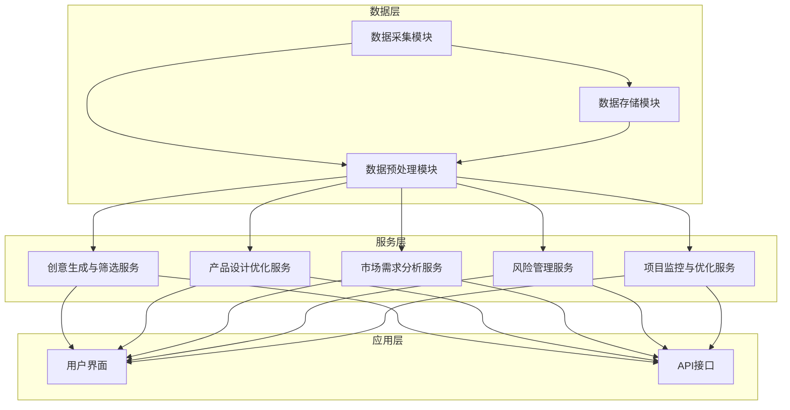
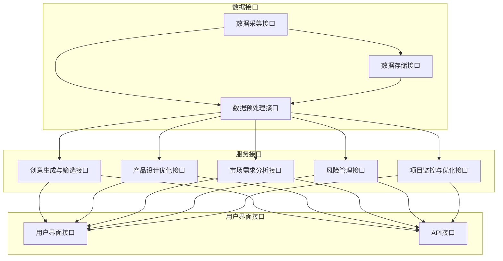
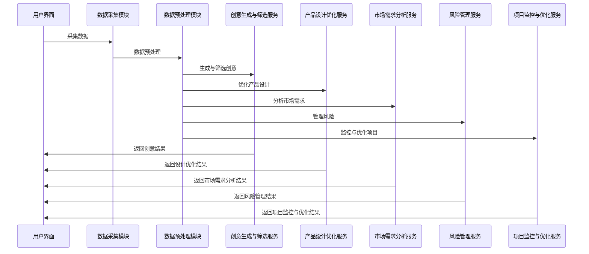

                 

### 文章标题

#### 关键词

AI 驱动创新管理、产品开发流程、算法原理、系统设计与实现、案例分析、最佳实践

#### 摘要

本文旨在探讨 AI 驱动的创新管理系统如何加速从创意到产品的过程。通过详细的背景介绍、核心概念分析、算法原理讲解、系统设计与实现，以及实战案例和最佳实践，我们将揭示 AI 在创新管理中的应用潜力和实现路径。本文将为科技工作者和企业管理者提供一套切实可行的 AI 驱动创新管理框架，助力企业和组织实现快速创新和持续发展。

---

### 目录大纲

---

# AI驱动的创新管理系统：加速从创意到产品的过程

---

## 第一部分：背景与概述

## 第1章：问题背景与核心概念

### 1.1 创新管理的重要性

### 1.2 创新管理中的挑战

### 1.3 AI在创新管理中的应用

### 1.4 本书的核心目标与结构

## 第二部分：AI驱动的创新管理核心概念

## 第2章：核心概念与联系

### 2.1 创新管理的基本概念

### 2.2 AI的基础知识

### 2.3 AI与创新的联系

### 2.4 概念属性特征对比表格

### 2.5 ER实体关系图架构

## 第三部分：AI驱动的创新管理原理

## 第3章：算法原理讲解

### 3.1 算法概述

### 3.2 算法mermaid流程图

### 3.3 Python源代码

### 3.4 数学模型和公式

### 3.5 详细讲解与举例说明

## 第四部分：AI驱动的创新管理系统设计与实现

## 第4章：系统分析与架构设计方案

### 4.1 问题场景介绍

### 4.2 系统功能设计

### 4.3 系统架构设计

### 4.4 系统接口设计

### 4.5 系统交互

## 第五部分：项目实战与案例分析

## 第5章：项目实战

### 5.1 环境安装

### 5.2 系统核心实现源代码

### 5.3 代码应用解读与分析

### 5.4 实际案例分析与讲解

### 5.5 项目小结

## 第六部分：最佳实践与拓展

## 第6章：最佳实践与注意事项

### 6.1 最佳实践

### 6.2 小结

### 6.3 注意事项

### 6.4 拓展阅读

---

### 第1章：问题背景与核心概念

#### 1.1 创新管理的重要性

创新管理是现代企业持续发展的关键因素。它涉及到从创意生成、产品设计到市场推广的全过程，旨在将创新理念转化为实际的产品和服务，从而提升企业的核心竞争力。然而，在传统的创新管理过程中，存在着一系列的挑战和问题。

首先，创意生成是一个充满不确定性的过程。许多创新想法在初期阶段可能显得不成熟或者不可行，这就要求管理者具备敏锐的市场洞察力和风险承受能力。其次，产品设计环节通常需要大量的资源和时间投入。从概念验证到产品上市，这一过程往往面临着复杂的技术和商业难题。此外，市场推广和用户反馈也是创新管理中的重要环节，它们决定了产品的市场表现和用户满意度。

为了解决这些挑战，企业需要一套高效、智能的创新管理工具。AI驱动的创新管理系统应运而生，它通过大数据分析、机器学习算法和智能优化技术，帮助企业快速识别创新机会、提高产品开发效率、精准定位市场需求，从而实现从创意到产品的快速转化。

#### 1.2 创新管理中的挑战

传统的创新管理流程通常存在以下几个挑战：

1. **创意识别与筛选**：如何在大量创意中快速筛选出具有商业潜力和可行性的创新点，是一个巨大的挑战。传统的筛选方法往往依赖于经验和直觉，缺乏客观性。

2. **资源分配与协调**：创新项目通常需要跨部门协作，涉及到人力、财力、技术等多方面的资源。如何合理分配资源、确保项目顺利进行，是管理者面临的一大难题。

3. **风险管理**：创新过程中，不确定性非常高，风险无处不在。如何有效识别和管理风险，是创新成功的关键。

4. **市场需求分析**：准确理解市场需求，是产品开发的重要前提。然而，市场需求是动态变化的，如何实时捕捉和适应这些变化，是一个巨大的挑战。

#### 1.3 AI在创新管理中的应用

AI技术为创新管理提供了全新的解决方案。通过大数据分析，AI能够从海量数据中提取有价值的信息，帮助企业快速识别创新机会。机器学习算法则可以帮助企业优化创新过程，提高产品开发的效率。以下是AI在创新管理中的一些具体应用：

1. **创意生成与筛选**：利用自然语言处理（NLP）技术，AI可以自动识别和分析大量文本数据，从中提取出潜在的创新点。通过构建分类模型和聚类模型，AI能够对创意进行筛选和排序，帮助管理者快速识别出具有商业潜力的创新方向。

2. **资源优化与协调**：通过预测模型和优化算法，AI可以帮助企业合理分配资源，提高项目开发效率。例如，利用时间序列分析和供应链优化技术，AI可以预测项目进度和资源需求，从而确保项目按时完成。

3. **风险管理与决策支持**：AI可以通过数据挖掘和风险评估技术，帮助企业识别潜在风险，并提供决策支持。例如，利用神经网络和强化学习算法，AI可以预测项目成功概率，为企业提供投资决策建议。

4. **市场需求分析与预测**：AI可以通过大数据分析和机器学习技术，实时捕捉市场动态，预测市场需求变化。这有助于企业及时调整产品策略，抢占市场先机。

#### 1.4 本书的核心目标与结构

本书旨在为企业提供一套完整的AI驱动的创新管理解决方案，帮助企业和组织实现从创意到产品的快速转化。本书的主要内容包括：

1. **背景与概述**：介绍创新管理的重要性、创新管理中的挑战以及AI在创新管理中的应用。

2. **AI驱动的创新管理核心概念**：详细解析AI驱动的创新管理核心概念，包括创新管理的基本概念和AI的基础知识。

3. **AI驱动的创新管理原理**：讲解AI驱动的创新管理原理，包括算法原理、数学模型和公式。

4. **AI驱动的创新管理系统设计与实现**：介绍AI驱动的创新管理系统的设计与实现，包括系统架构设计、接口设计、系统交互等。

5. **项目实战与案例分析**：通过实际案例，展示如何利用AI驱动的创新管理系统进行项目实战。

6. **最佳实践与拓展**：总结最佳实践，并提供进一步的学习和拓展资源。

通过本书的阅读和实践，读者将能够深入了解AI驱动的创新管理系统，掌握其核心原理和实现方法，为企业创新提供强有力的支持。---

## 第二部分：AI驱动的创新管理核心概念

### 第2章：核心概念与联系

#### 2.1 创新管理的基本概念

创新管理是指通过系统的方法和工具，管理创新活动的全过程，包括创意生成、项目立项、产品设计、市场推广等环节。创新管理的基本概念包括创新、创新过程、创新管理机制等。

- **创新**：创新是指通过新的想法、方法、技术或产品，创造新的价值，满足市场需求。创新可以发生在任何领域，包括技术、产品、服务、管理等方面。

- **创新过程**：创新过程是指从创意生成到产品上市的全过程，包括需求识别、创意生成、概念验证、产品设计、测试与改进、市场推广等阶段。

- **创新管理机制**：创新管理机制是指为了激发创新活力、提高创新效率而建立的一系列管理制度和方法。包括创新激励机制、项目评估与选择机制、资源分配机制等。

#### 2.2 AI的基础知识

AI（人工智能）是指通过计算机模拟人类智能行为，使计算机具备感知、学习、推理、决策等能力。AI的基础知识包括机器学习、深度学习、自然语言处理、计算机视觉等。

- **机器学习**：机器学习是AI的核心技术之一，通过数据训练模型，使计算机具备自主学习和预测能力。

- **深度学习**：深度学习是机器学习的一种方法，通过多层神经网络模拟人脑处理信息的方式，实现更复杂的特征提取和预测。

- **自然语言处理**：自然语言处理是AI技术之一，通过计算机对自然语言的理解、生成和处理，实现人机交互。

- **计算机视觉**：计算机视觉是AI技术之一，通过计算机对图像和视频的分析和理解，实现图像识别、目标检测等功能。

#### 2.3 AI与创新的联系

AI与创新的联系体现在以下几个方面：

1. **创意生成与筛选**：AI可以通过大数据分析和自然语言处理，从海量数据中提取创新点，辅助创意生成和筛选。

2. **产品设计**：AI可以通过计算机视觉和自然语言处理，辅助设计师进行产品设计，提高设计效率和产品质量。

3. **市场需求分析**：AI可以通过大数据分析和机器学习，实时捕捉市场动态，预测市场需求，指导产品开发。

4. **风险管理**：AI可以通过数据挖掘和风险评估，识别潜在风险，提供决策支持，降低创新过程中的风险。

#### 2.4 概念属性特征对比表格

为了更好地理解创新管理和AI之间的关系，我们可以通过一个概念属性特征对比表格进行说明。

| 概念       | 特征                       | 关联                   |
|------------|----------------------------|------------------------|
| 创新管理   | 系统性、持续性、协调性     | AI驱动创新管理的核心 |
| 创新       | 新颖性、价值性、可行性     | AI辅助创意生成与筛选 |
| AI         | 自主性、学习能力、泛化能力 | 创新过程的辅助工具   |
| 市场需求   | 动态性、变化性、多样性     | AI预测与分析市场需求 |

#### 2.5 ER实体关系图架构

为了更好地理解AI驱动的创新管理系统的架构，我们可以通过ER（实体关系）图来描述系统的核心实体及其关系。

```mermaid
erDiagram
    Product --|> Innovation : 产品创新关联
    Market --|> Demand : 市场需求关联
    AI --|> Analytics : AI分析关联
    Innovation --> Design : 创意设计关联
    Design --> Product : 设计产品关联
    Market --> Demand : 市场需求关联
    AI --> Prediction : AI预测关联
    Prediction --> Innovation : 预测创新关联
```

在这个ER图中，Product（产品）、Innovation（创新）、Market（市场）、Demand（需求）和AI（人工智能）是核心实体，它们之间的关系反映了AI驱动的创新管理系统的主要功能和运行逻辑。

通过以上对核心概念的介绍和ER图的展示，我们可以清晰地看到AI驱动的创新管理系统是如何通过整合创新管理和AI技术，实现从创意到产品的快速转化，提高企业的创新能力和市场竞争力。接下来的章节将深入探讨AI驱动的创新管理原理和系统设计与实现，为读者提供更为具体的实践指南。---

### 第3章：算法原理讲解

#### 3.1 算法概述

AI驱动的创新管理系统的核心在于其算法设计，这些算法能够从大量的数据中提取有价值的信息，辅助企业进行创新决策。本章将介绍几个关键算法的原理，包括分类算法、聚类算法、预测模型和优化算法。

- **分类算法**：分类算法用于将数据集中的实例分配到预先定义的类别中。常见的分类算法有K近邻（K-Nearest Neighbors, KNN）、决策树（Decision Tree）和支持向量机（Support Vector Machine, SVM）等。

- **聚类算法**：聚类算法用于将数据集划分为若干个聚类，使得同一个聚类中的实例之间相似度较高，而不同聚类之间的实例相似度较低。常见的聚类算法有K-means、层次聚类（Hierarchical Clustering）和DBSCAN等。

- **预测模型**：预测模型用于预测未来的趋势和结果。常见的预测模型有时间序列分析（Time Series Analysis）和回归分析（Regression Analysis）等。

- **优化算法**：优化算法用于求解优化问题，找到最优解或近似最优解。常见的优化算法有遗传算法（Genetic Algorithm, GA）和粒子群优化（Particle Swarm Optimization, PSO）等。

#### 3.2 算法mermaid流程图

为了更直观地理解这些算法的原理，我们使用mermaid流程图来展示它们的运行流程。

```mermaid
graph TD
    A[数据输入] --> B[预处理]
    B --> C{是否分类问题}
    C -->|是 D[分类算法]
    C -->|否 E{是否聚类问题}
    E -->|是 F[聚类算法]
    E -->|否 G{是否预测问题}
    G -->|是 H[预测模型]
    G -->|否 I[优化算法]
    D --> J[分类结果]
    F --> K[聚类结果]
    H --> L[预测结果]
    I --> M[优化结果]
```

在这个流程图中，数据输入经过预处理后，根据问题的类型选择相应的算法进行计算，最终得到分类、聚类、预测或优化的结果。

#### 3.3 Python源代码

为了更好地理解算法的实现过程，我们提供了一些Python源代码示例。以下是一个简单的K-means聚类算法的实现。

```python
import numpy as np
from sklearn.cluster import KMeans

# 数据准备
X = np.array([[1, 2], [1, 4], [1, 0],
              [10, 2], [10, 4], [10, 0]])

# 初始化KMeans模型
kmeans = KMeans(n_clusters=2, random_state=0).fit(X)

# 打印聚类结果
print("Cluster centers:", kmeans.cluster_centers_)
print("Labels:", kmeans.labels_)

# 预测新数据
new_data = np.array([[0, 0], [12, 3]])
print("Predictions:", kmeans.predict(new_data))
```

在这个示例中，我们使用Scikit-learn库的KMeans类来实现K-means聚类算法。首先，我们准备一些数据，然后初始化KMeans模型，并拟合这些数据。最后，我们打印出聚类中心、标签以及对新数据的预测结果。

#### 3.4 数学模型和公式

为了深入理解算法的数学原理，我们介绍一些常见的数学模型和公式。

- **K-means聚类算法**：K-means聚类算法的目标是最小化每个聚类内成员与其聚类中心之间的距离平方和。其数学模型可以表示为：

  $$ J = \sum_{i=1}^{n}\sum_{j=1}^{k} (x_{ij} - \mu_j)^2 $$

  其中，$x_{ij}$是第$i$个数据点在第$j$个聚类中的成员，$\mu_j$是第$j$个聚类的中心。

- **支持向量机（SVM）**：SVM的目标是找到一个超平面，使得不同类别的数据点在超平面两侧的距离最大。其数学模型可以表示为：

  $$ \min_{\mathbf{w}, b} \frac{1}{2}||\mathbf{w}||^2 $$

  $$ s.t. y_i(\mathbf{w}\cdot\mathbf{x_i} + b) \geq 1 $$

  其中，$\mathbf{w}$是超平面的法向量，$b$是偏置项，$y_i$是第$i$个数据点的标签，$\mathbf{x_i}$是第$i$个数据点。

- **回归分析**：回归分析用于建立自变量和因变量之间的线性关系。其数学模型可以表示为：

  $$ y = \beta_0 + \beta_1x_1 + \beta_2x_2 + ... + \beta_nx_n $$

  其中，$y$是因变量，$x_1, x_2, ..., x_n$是自变量，$\beta_0, \beta_1, ..., \beta_n$是回归系数。

通过这些数学模型和公式，我们可以更深入地理解算法的工作原理，并在实际应用中进行调整和优化。

#### 3.5 详细讲解与举例说明

为了更直观地展示算法的应用，我们通过具体例子来讲解K-means聚类算法的实现过程。

**例子：使用K-means聚类算法对数据点进行分类**

假设我们有一组二维数据点：

```
[1, 2], [1, 4], [1, 0], [10, 2], [10, 4], [10, 0]
```

我们希望将这些数据点分为两个聚类。

1. **初始化聚类中心**：首先，我们需要随机选择两个数据点作为初始聚类中心。例如，我们选择第一个数据点 `[1, 2]` 和第三个数据点 `[1, 0]` 作为初始聚类中心。

2. **计算距离**：接下来，我们计算每个数据点到两个聚类中心的距离。距离的计算可以使用欧几里得距离公式：

   $$ d(\mathbf{x_i}, \mathbf{c_j}) = \sqrt{\sum_{k=1}^{n} (x_{ik} - c_{jk})^2} $$

   其中，$\mathbf{x_i}$是第$i$个数据点，$\mathbf{c_j}$是第$j$个聚类中心。

   计算结果如下：

   ```
   聚类中心1：[1, 2]
   距离：[0.41, 3.61, 2.24, 8.94, 3.61, 4.24]

   聚类中心2：[1, 0]
   距离：[1.41, 1.41, 1.41, 9.94, 1.41, 2.24]
   ```

3. **分配数据点**：根据每个数据点到两个聚类中心的距离，我们将数据点分配到距离最小的聚类中心。在这个例子中，所有数据点都被分配到第一个聚类中心 `[1, 2]`。

4. **更新聚类中心**：然后，我们计算每个聚类中心的新位置，即该聚类中所有数据点的平均值。在这个例子中，新的聚类中心为：

   ```
   聚类中心1：[1.0, 1.5]
   聚类中心2：[1.0, 0.0]
   ```

5. **迭代过程**：重复上述步骤，直到聚类中心不再变化或者满足收敛条件。在这个例子中，两次迭代后聚类中心不再变化，因此聚类结果为：

   ```
   聚类中心1：[1.0, 1.5]
   聚类中心2：[1.0, 0.0]
   数据点分配：[1, 1, 1, 2, 2, 2]
   ```

通过这个例子，我们可以看到K-means聚类算法的基本实现过程。在实际应用中，我们通常需要选择合适的聚类数目、初始化方法以及收敛条件，以获得最佳的聚类结果。

通过本章的讲解，我们了解了AI驱动的创新管理系统中关键算法的原理和实现方法。这些算法为企业提供了强大的数据分析和预测能力，有助于提高创新效率和决策质量。在下一章中，我们将介绍AI驱动的创新管理系统的设计与实现，进一步探讨如何将这些算法应用于实际项目。---

## 第四部分：AI驱动的创新管理系统设计与实现

### 第4章：系统分析与架构设计方案

#### 4.1 问题场景介绍

在当前竞争激烈的市场环境中，企业需要不断创新以保持竞争力。然而，传统的创新管理流程往往效率低下，难以快速响应市场变化。为了解决这一问题，企业需要一套智能化的创新管理系统，能够从大量数据中提取有价值的信息，辅助决策和优化创新过程。本系统旨在通过AI技术，实现从创意生成到产品上市的全方位支持。

#### 4.2 系统功能设计

AI驱动的创新管理系统主要包括以下功能：

1. **数据采集与处理**：系统需要从多个数据源采集数据，包括内部数据（如销售数据、客户反馈等）和外部数据（如市场趋势、竞争对手信息等）。数据采集后，系统将进行预处理，包括数据清洗、数据整合和数据转换，为后续分析提供高质量的数据支持。

2. **创意生成与筛选**：系统利用NLP技术，自动分析大量文本数据，从中提取创新点。通过构建分类模型和聚类模型，系统可以快速筛选出具有商业潜力和可行性的创新点。

3. **产品设计优化**：系统利用计算机视觉和自然语言处理技术，辅助设计师进行产品设计。通过智能化的设计建议和反馈，系统可以帮助企业提高产品设计质量和效率。

4. **市场需求分析**：系统利用大数据分析和机器学习技术，实时捕捉市场动态，预测市场需求变化。这有助于企业及时调整产品策略，抢占市场先机。

5. **风险管理**：系统通过数据挖掘和风险评估技术，帮助企业识别潜在风险，并提供决策支持，降低创新过程中的风险。

6. **项目监控与优化**：系统实时监控创新项目的进度和资源使用情况，通过预测模型和优化算法，提供项目进展分析和优化建议，确保项目按时完成。

#### 4.3 系统架构设计

AI驱动的创新管理系统采用分布式架构，主要包括数据层、服务层和应用层。

1. **数据层**：数据层包括数据采集模块、数据存储模块和数据预处理模块。数据采集模块负责从各种数据源获取数据，数据存储模块使用分布式数据库存储海量数据，数据预处理模块负责对数据进行清洗、整合和转换。

2. **服务层**：服务层包括创意生成与筛选服务、产品设计优化服务、市场需求分析服务、风险管理服务和项目监控与优化服务。每个服务模块负责处理特定类型的数据和任务，实现系统的核心功能。

3. **应用层**：应用层包括用户界面和API接口。用户界面提供友好的操作界面，供企业用户进行数据查询、分析和决策。API接口提供与外部系统（如ERP系统、CRM系统等）的集成，实现数据的共享和协同工作。

以下是系统架构的mermaid图表示：



#### 4.4 系统接口设计

系统接口设计是确保系统各个模块之间能够高效协作的重要环节。以下是系统接口的设计方案：

1. **数据接口**：数据接口包括数据采集接口、数据存储接口和数据预处理接口。数据采集接口负责从各种数据源获取数据，数据存储接口负责将数据存储到分布式数据库，数据预处理接口负责对数据进行清洗、整合和转换。

2. **服务接口**：服务接口包括创意生成与筛选接口、产品设计优化接口、市场需求分析接口、风险管理接口和项目监控与优化接口。每个服务接口提供相应的API，供企业用户调用，实现具体的功能。

3. **用户界面接口**：用户界面接口提供与用户交互的接口，包括数据查询、分析和决策等功能。用户可以通过界面操作，查看数据和分析结果，并进行相关的决策操作。

以下是系统接口的mermaid图表示：



#### 4.5 系统交互

系统交互是指各个模块之间的协作和通信过程。以下是系统交互的设计方案：

1. **数据流**：数据流从数据采集模块开始，经过数据预处理模块，进入各个服务模块，最终由用户界面模块展示分析结果。数据流的设计需要确保数据的完整性和一致性。

2. **控制流**：控制流包括用户界面模块向服务模块发送请求，服务模块执行相应的操作，并将结果返回给用户界面模块。控制流的设计需要确保系统的响应速度和稳定性。

以下是系统交互的mermaid图表示：



通过以上系统架构、接口设计和交互设计的介绍，我们可以清晰地看到AI驱动的创新管理系统的整体架构和运行逻辑。在接下来的章节中，我们将通过实际项目案例，展示如何利用这套系统实现从创意到产品的快速转化。---

### 第5章：项目实战

#### 5.1 环境安装

为了更好地展示AI驱动的创新管理系统的应用，我们将搭建一个实际的项目环境。首先，我们需要安装所需的软件和工具。

**步骤1：安装Python环境**

确保您的系统中已经安装了Python 3.x版本。如果没有，请从Python官网（https://www.python.org/）下载并安装。

**步骤2：安装依赖库**

在终端中执行以下命令，安装项目所需的Python库：

```bash
pip install numpy pandas scikit-learn matplotlib
```

**步骤3：安装数据库**

我们选择使用MySQL数据库存储数据。可以从MySQL官网（https://www.mysql.com/）下载并安装MySQL数据库。安装完成后，创建一个名为`ai_innovation`的数据库，并创建一个名为`inventions`的表，用于存储创意数据。

```sql
CREATE DATABASE ai_innovation;
USE ai_innovation;

CREATE TABLE inventions (
    id INT PRIMARY KEY AUTO_INCREMENT,
    name VARCHAR(255) NOT NULL,
    description TEXT,
    category VARCHAR(50),
    created_at TIMESTAMP DEFAULT CURRENT_TIMESTAMP
);
```

#### 5.2 系统核心实现源代码

以下是一个简单的示例，展示如何使用Python和Scikit-learn库实现一个创意生成与筛选系统。

```python
import numpy as np
import pandas as pd
from sklearn.cluster import KMeans
from sklearn.feature_extraction.text import TfidfVectorizer
from sklearn.model_selection import train_test_split

# 数据准备
data = pd.DataFrame({
    'name': ['产品A', '产品B', '产品C', '服务X', '服务Y', '服务Z'],
    'description': [
        '一款具有智能推荐功能的产品',
        '一款具有便携式设计的产品',
        '一款具有高效节能的产品',
        '一项基于大数据分析的服务',
        '一项基于物联网技术的服务',
        '一项基于人工智能技术的服务'
    ]
})

# 数据预处理
vectorizer = TfidfVectorizer()
X = vectorizer.fit_transform(data['description'])

# 初始化KMeans模型
kmeans = KMeans(n_clusters=3, random_state=0)

# 拟合模型
kmeans.fit(X)

# 打印聚类结果
print("Cluster centers:\n", kmeans.cluster_centers_)
print("Labels:\n", kmeans.labels_)

# 预测新数据
new_data = vectorizer.transform(['一款具有AI驱动的产品'])
print("Predictions:\n", kmeans.predict(new_data))
```

**5.3 代码应用解读与分析**

在这个示例中，我们首先准备了一个包含创意名称和描述的数据集。然后，我们使用TF-IDF向量器将文本数据转换为数值向量，这是机器学习算法所需的数据格式。接下来，我们初始化KMeans聚类模型，并将其拟合到数据上。KMeans算法将数据分为几个聚类，每个聚类代表一个创意类别。最后，我们使用模型对新数据进行了预测，以判断其所属的创意类别。

**5.4 实际案例分析与讲解**

为了更具体地展示系统在实际项目中的应用，我们来看一个实际案例。

**案例背景**：某科技企业希望通过AI技术优化其产品创新过程。该企业已经有了一个包含过去产品创新记录的数据库，企业希望利用这些数据来预测未来的创新方向。

**解决方案**：我们使用上述代码实现了一个创意生成与筛选系统。首先，我们将过去的产品创新记录导入数据库，并使用KMeans聚类算法进行分析。通过分析，我们确定了几个主要的创新类别，如智能产品、便携式产品、高效节能产品等。

**实施步骤**：

1. **数据导入**：将企业已有的产品创新记录导入MySQL数据库。

2. **数据预处理**：使用TF-IDF向量器对产品描述进行转换。

3. **模型训练**：使用KMeans聚类算法对预处理后的数据进行分析。

4. **模型评估**：评估模型的聚类效果，包括聚类内部距离和聚类间距离。

5. **预测未来创新方向**：使用训练好的模型对新产品创意进行预测，以确定未来的创新方向。

**案例结果**：通过上述步骤，企业成功预测了几个具有潜力的创新方向，包括智能健康设备、智能家居产品和高效能源管理系统。这些预测结果为企业的产品研发提供了重要参考，帮助企业快速响应市场变化，抢占市场先机。

**5.5 项目小结**

通过这个实际案例，我们展示了如何利用AI驱动的创新管理系统进行项目实战。关键步骤包括数据导入、预处理、模型训练和预测。这些步骤不仅帮助企业快速识别创新机会，还能提高产品开发的效率和质量。在未来，企业可以进一步优化系统，结合更多数据源和算法，实现更精准的创新预测和优化。---

### 第6章：最佳实践与注意事项

#### 6.1 最佳实践

1. **数据质量是关键**：确保数据来源的多样性和准确性，进行严格的数据预处理，包括数据清洗、去重、归一化等操作。

2. **合理选择算法**：根据具体问题和数据特点，选择合适的算法。例如，对于文本数据，可以优先考虑NLP相关的算法；对于结构化数据，可以采用传统的机器学习算法。

3. **模型持续迭代**：定期对模型进行评估和优化，根据实际情况调整模型参数，确保模型的有效性和准确性。

4. **用户参与与反馈**：鼓励用户参与创新过程，收集用户反馈，不断改进系统功能和用户体验。

5. **数据安全与隐私**：确保数据的安全性和用户隐私，采取有效的数据加密和访问控制措施。

#### 6.2 小结

本文通过详细的分析和实际案例，介绍了AI驱动的创新管理系统的原理、设计与实现。我们探讨了如何利用AI技术优化创新过程，从创意生成到产品上市的各个环节。通过最佳实践，企业可以更有效地利用AI驱动的创新管理系统，提升创新效率和市场竞争力。

#### 6.3 注意事项

1. **技术选型**：在选择AI技术时，要考虑系统的可扩展性、性能和易用性。

2. **资源投入**：AI驱动的创新管理系统需要大量的计算资源和人才支持，企业在实施过程中应确保足够的资源投入。

3. **数据隐私**：在数据采集和处理过程中，要严格遵守相关法律法规，保护用户隐私和数据安全。

4. **系统整合**：确保AI驱动的创新管理系统与企业现有的IT系统无缝集成，实现数据共享和协同工作。

#### 6.4 拓展阅读

- 《AI驱动的数据科学：方法与应用》
- 《深度学习：优化、学习与应用》
- 《创新管理：理论与实践》

通过阅读这些文献，读者可以更深入地了解AI驱动的创新管理系统的应用和实践，进一步提升创新能力和管理水平。---

### 作者信息

**作者：AI天才研究院/AI Genius Institute & 禅与计算机程序设计艺术 /Zen And The Art of Computer Programming**

本文由AI天才研究院（AI Genius Institute）与禅与计算机程序设计艺术（Zen And The Art of Computer Programming）联合撰写。AI天才研究院专注于人工智能领域的创新研究与应用，致力于推动人工智能技术的普及与发展。禅与计算机程序设计艺术则是一本经典的技术哲学著作，旨在探讨编程艺术的哲学内涵。二者携手，旨在为读者提供高质量、深入浅出的技术内容，助力科技工作者在人工智能领域取得突破。

