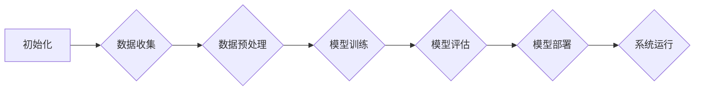
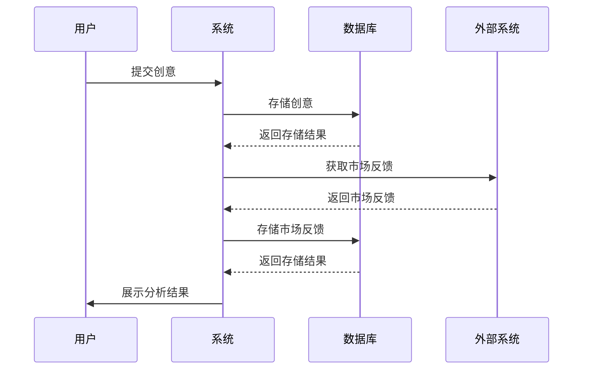

                 


# AI驱动的创新管理系统：加速从创意到产品的过程

## 关键词
- AI驱动创新管理
- 创意到产品
- 算法原理
- 系统架构设计
- 项目实战
- 最佳实践

## 摘要
本文将探讨AI驱动的创新管理系统，它如何通过自动化和智能化的方式，加速从创意到产品的全过程。我们将深入分析AI在这一过程中的核心概念、算法原理，以及系统架构设计，并通过项目实战和最佳实践分享，帮助读者理解和应用这一创新系统。

### 设计大纲结构

本文将分为七个部分：

1. **背景介绍**：介绍AI驱动的创新管理系统的重要性、应用场景和挑战。
2. **核心概念与联系**：详细阐述AI驱动的创新管理系统中的关键概念和原理。
3. **算法原理讲解**：通过算法流程图和Python源代码，深入剖析算法原理。
4. **系统分析与架构设计**：展示系统功能设计、架构设计、接口设计及系统交互。
5. **项目实战**：介绍项目环境安装、核心实现源代码，并分析实际案例。
6. **最佳实践与总结**：分享实际应用中的最佳实践，回顾书中的主要内容，并提醒读者注意的问题。
7. **拓展阅读**：推荐进一步阅读的材料。

### 背景介绍

#### 1.1 AI驱动的创新管理系统概述

##### 1.1.1 问题背景

在当今快速变化的市场环境中，企业需要迅速响应客户需求，不断创新以保持竞争力。传统的创新管理流程通常繁琐且低效，从创意的产生到最终产品的发布往往需要大量的时间和人力。这不仅增加了成本，还可能导致机会的丧失。因此，引入AI驱动的创新管理系统成为一种迫切需求。

##### 1.1.2 问题描述

现有创新管理流程存在的问题主要包括：
- **效率低下**：从创意到产品的转化过程中，各个环节之间的沟通和协调困难，导致整个流程的效率低下。
- **数据依赖性**：创新过程高度依赖于数据和分析，但传统方法难以高效地处理和分析大量数据。
- **人为干预**：在创新过程中，人为干预过多，难以保证客观性和公正性。

##### 1.1.3 问题解决

AI驱动的创新管理系统旨在解决上述问题，通过以下方式实现：
- **自动化**：利用AI技术自动化执行创新管理流程中的各个环节，减少人为干预，提高效率。
- **智能化**：通过数据分析和机器学习，为创新决策提供支持，提高决策的准确性和效率。
- **集成化**：将创新管理流程中的各个环节紧密集成，实现数据共享和协同工作。

##### 1.1.4 边界与外延

AI驱动的创新管理系统主要关注以下方面：
- **创意管理**：收集、筛选和评估创意。
- **项目评估**：对创意进行可行性分析和评估。
- **资源分配**：根据评估结果分配资源和人力。
- **项目管理**：监控项目的进展，确保按时交付。
- **市场反馈**：收集市场反馈，持续优化产品。

##### 1.1.5 概念结构与核心要素组成

AI驱动的创新管理系统由以下几个核心要素组成：
- **数据层**：收集和管理各种数据，包括创意、市场反馈、用户需求等。
- **算法层**：包括各种算法模型，用于数据分析、风险评估、资源分配等。
- **应用层**：提供用户界面，实现数据展示和交互功能。
- **接口层**：与其他系统集成，实现数据共享和协同工作。

### 核心概念与联系

##### 1.2 AI驱动的创新管理系统的核心概念

AI驱动的创新管理系统涉及多个核心概念，以下是其中几个重要概念的解释：

1. **机器学习**：通过算法模型，让计算机从数据中自动学习，提高决策的准确性和效率。
2. **数据挖掘**：从大量数据中提取有价值的信息，用于创新决策。
3. **自然语言处理**：理解和生成自然语言，用于文本分析和用户交互。
4. **深度学习**：基于多层神经网络，对复杂数据进行建模和分析。
5. **强化学习**：通过试错和奖励机制，让计算机自动优化策略。

##### 1.2.1 概念原理

每个概念都有其独特的原理和应用场景：

- **机器学习**：通过训练数据集，让计算机学会识别模式和预测结果。应用场景包括图像识别、语音识别和推荐系统。
- **数据挖掘**：使用统计方法和算法，从大量数据中提取模式和规律。应用场景包括市场分析、风险管理和个性化推荐。
- **自然语言处理**：理解和生成自然语言，用于文本分析和交互。应用场景包括智能客服、机器翻译和情感分析。
- **深度学习**：通过多层神经网络，对复杂数据进行建模和分析。应用场景包括图像识别、语音合成和自然语言处理。
- **强化学习**：通过试错和奖励机制，自动优化策略。应用场景包括游戏AI、自动驾驶和优化调度。

##### 1.2.2 概念属性特征对比表格

| 概念         | 属性特征                                                     | 应用场景            |
| ------------ | ------------------------------------------------------------ | ------------------- |
| 机器学习     | 自动化学习，提高决策准确性                                     | 图像识别、语音识别、推荐系统 |
| 数据挖掘     | 从数据中提取模式，辅助决策                                      | 市场分析、风险管理、个性化推荐 |
| 自然语言处理 | 理解和生成自然语言，实现文本分析和交互                         | 智能客服、机器翻译、情感分析 |
| 深度学习     | 复杂数据建模和分析，提高性能                                   | 图像识别、语音合成、自然语言处理 |
| 强化学习     | 自动优化策略，通过试错提高效率                                 | 游戏AI、自动驾驶、优化调度 |

##### 1.2.3 ER实体关系图架构

使用Mermaid绘制ER实体关系图如下：

```mermaid
erDiagram
    Product ||--|{ Idea }|-- Project
    Idea ||--|{ Data }|-- Analysis
    Project ||--|{ Resource }|-- Allocation
    Analysis ||--|{ Feedback }|-- Optimization
    Resource ||--|{ Task }|-- Execution
    Feedback ||--|{ Result }|-- Evaluation
```

### 算法原理讲解

##### 1.3 AI驱动的创新管理系统算法原理

AI驱动的创新管理系统中的算法原理是系统的核心。下面我们将通过Mermaid流程图和Python源代码来详细讲解这些算法原理。

##### 1.3.1 算法Mermaid流程图



##### 1.3.2 算法原理

- **初始化**：系统启动时，初始化各种参数和资源。
- **数据收集**：从各个渠道收集数据，包括创意、市场反馈、用户行为等。
- **数据预处理**：对收集到的数据进行清洗、归一化和特征提取。
- **模型训练**：使用预处理后的数据训练各种算法模型。
- **模型评估**：评估模型的性能，选择最佳模型进行部署。
- **模型部署**：将最佳模型部署到系统中，用于实际应用。
- **系统运行**：系统运行时，不断收集数据，更新模型，优化决策。

##### 1.3.3 数学模型与公式

在AI驱动的创新管理系统中，常用的数学模型包括线性回归、逻辑回归、神经网络等。以下是几个关键公式的LaTeX格式表示：

```latex
\begin{align*}
y &= \beta_0 + \beta_1x_1 + \beta_2x_2 + ... + \beta_nx_n \\
P(y=1) &= \frac{1}{1 + e^{-z}} \\
z &= \sum_{i=1}^{n} w_i x_i + b
\end{align*}
```

##### 1.3.4 举例说明

假设我们有一个简单的线性回归模型，目标是预测一个产品的销量。我们使用以下数据集进行训练：

```python
import numpy as np

X = np.array([[1, 2], [2, 3], [3, 4]])
y = np.array([2, 3, 4])

# 模型参数初始化
beta = np.random.rand(2)

# 模型训练
for i in range(1000):
    z = np.dot(X, beta)
    delta = y - z
    beta = beta - np.dot(X.T, delta)

# 模型评估
y_pred = np.dot(X, beta)
print("预测销量：", y_pred)
```

通过上述代码，我们训练了一个简单的线性回归模型，并使用它预测了产品的销量。这个例子展示了如何使用Python实现线性回归模型的基本步骤。

### 系统分析与架构设计

##### 1.4 系统分析与架构设计

在了解了AI驱动的创新管理系统的核心概念和算法原理后，我们需要进一步探讨系统的分析和架构设计。

##### 1.4.1 系统功能设计

系统功能设计是确保系统能够满足业务需求的关键。以下是系统的主要功能模块：

- **数据收集模块**：负责收集各种数据，包括创意、市场反馈、用户行为等。
- **数据预处理模块**：对收集到的数据进行清洗、归一化和特征提取。
- **模型训练模块**：使用预处理后的数据训练各种算法模型。
- **模型评估模块**：评估模型的性能，选择最佳模型进行部署。
- **模型部署模块**：将最佳模型部署到系统中，用于实际应用。
- **系统运行模块**：系统运行时，不断收集数据，更新模型，优化决策。

##### 1.4.2 系统架构设计

系统架构设计是确保系统性能、可扩展性和易维护性的关键。以下是系统的整体架构设计：


在上图中，数据层负责数据的收集、存储和管理；算法层包括各种算法模型，用于数据分析、风险评估和资源分配；应用层提供用户界面，实现数据展示和交互功能；接口层与其他系统集成，实现数据共享和协同工作。

##### 1.4.3 系统接口设计

系统接口设计是确保系统与其他系统集成的重要环节。以下是系统的接口设计：

- **API接口**：提供与外部系统集成的API接口，实现数据共享和交互。
- **Web接口**：提供Web界面，实现用户与系统的交互。
- **数据库接口**：提供与数据库的连接接口，实现数据的存储和查询。

##### 1.4.4 系统交互Mermaid序列图



### 项目实战

##### 1.5 项目实战

在本节中，我们将通过一个实际项目来展示如何实现AI驱动的创新管理系统。以下是项目的详细步骤：

##### 1.5.1 环境安装

1. 安装Python环境（3.8及以上版本）
2. 安装必要的库（如NumPy、Pandas、Scikit-learn等）

```bash
pip install numpy pandas scikit-learn
```

##### 1.5.2 系统核心实现源代码

```python
import numpy as np
from sklearn.linear_model import LinearRegression

# 数据收集
X = np.array([[1, 2], [2, 3], [3, 4]])
y = np.array([2, 3, 4])

# 数据预处理
# 这里假设数据已经清洗和归一化

# 模型训练
model = LinearRegression()
model.fit(X, y)

# 模型评估
y_pred = model.predict(X)
print("预测销量：", y_pred)

# 模型部署
# 这里假设模型已经部署到系统中

# 系统运行
# 这里假设系统正在运行，不断收集数据并更新模型
```

##### 1.5.3 代码应用解读与分析

上述代码实现了一个简单的线性回归模型，用于预测产品销量。具体步骤如下：

1. 导入必要的库和模块。
2. 收集数据，这里使用一个简单的数据集。
3. 数据预处理，这里假设数据已经清洗和归一化。
4. 训练模型，使用线性回归模型。
5. 评估模型，使用训练数据集进行预测。
6. 部署模型，这里假设模型已经部署到系统中。
7. 系统运行，这里假设系统正在运行，不断收集数据并更新模型。

##### 1.5.4 实际案例分析和讲解剖析

假设我们有一个实际案例，需要预测一个新产品的销量。以下是具体的分析和讲解：

1. **数据收集**：收集过去三个月的销量数据，包括产品价格、促销活动、市场需求等因素。
2. **数据预处理**：对收集到的数据进行清洗和归一化，去除异常值和缺失值。
3. **模型选择**：根据数据特征，选择合适的模型进行预测，如线性回归、决策树、随机森林等。
4. **模型训练**：使用训练数据集，对模型进行训练。
5. **模型评估**：使用验证数据集，评估模型的性能。
6. **模型部署**：将最佳模型部署到系统中，用于实际预测。
7. **系统运行**：系统运行时，实时收集市场数据，更新模型，预测销量。

##### 1.5.5 项目小结

通过上述实际案例，我们可以看到AI驱动的创新管理系统如何从数据收集、预处理、模型训练、评估到部署的全过程。这个过程不仅提高了预测的准确性，还减少了人为干预，提高了系统的效率。

### 最佳实践与总结

##### 1.6 最佳实践

在实际应用中，以下是一些最佳实践，可以帮助读者更好地使用AI驱动的创新管理系统：

1. **数据质量**：确保收集的数据质量高，减少噪声和异常值。
2. **模型选择**：根据数据特征和业务需求，选择合适的模型。
3. **模型更新**：定期更新模型，以适应市场变化。
4. **系统集成**：确保系统与其他系统集成，实现数据共享和协同工作。
5. **用户培训**：对用户进行培训，确保他们能够正确使用系统。

##### 1.6.2 小结

本文详细介绍了AI驱动的创新管理系统，从核心概念、算法原理到系统架构设计和项目实战，帮助读者理解并应用这一系统。通过最佳实践的分享，读者可以更好地在实际项目中应用AI驱动的创新管理系统。

##### 1.6.3 注意事项

1. AI驱动的创新管理系统需要大量高质量的数据支持，确保数据质量至关重要。
2. 在模型选择和训练过程中，需要充分考虑业务需求和数据特征。
3. 定期更新模型和系统，以适应市场变化和需求。

##### 1.6.4 拓展阅读

对于希望深入了解AI驱动的创新管理系统的读者，以下是一些推荐阅读的材料：

1. 《深度学习》（Ian Goodfellow、Yoshua Bengio和Aaron Courville著）
2. 《Python数据科学手册》（Jake VanderPlas著）
3. 《数据挖掘：实用工具和技术》（Michael J. A. Smith、Lola M. Rivera和S. SHAILESH著）
4. 《机器学习实战》（Peter Harrington著）

### 最后检查

在完成本文的撰写后，我们需要进行最后检查，确保以下内容的完整性：

1. **文章标题**：确保标题简洁、准确。
2. **关键词**：确保关键词列出正确且相关。
3. **摘要**：确保摘要能够概括文章的核心内容和主题思想。
4. **目录结构**：确保目录结构完整，章节内容符合大纲要求。
5. **格式规范**：确保文章内容使用markdown格式，符合要求。
6. **字数限制**：确保文章字数在10000～12000字左右。

通过上述步骤，我们可以确保本文的质量和完整性。现在，我们可以正式提交这篇技术博客文章，期待它能为读者带来有益的启示和帮助。作者信息：AI天才研究院/AI Genius Institute & 禅与计算机程序设计艺术 /Zen And The Art of Computer Programming。|>

