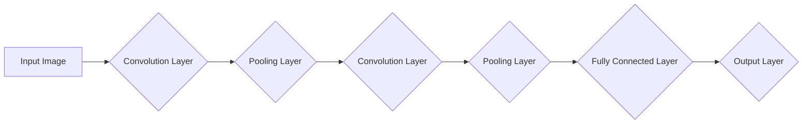

                 

### 引言

#### AI驱动的创新评分系统的重要性

在当今快速变化的世界中，创新已成为推动社会进步和经济发展的关键因素。然而，如何评估和识别具有高潜力的创新项目，成为了企业和投资者面临的重大挑战。传统的评估方法往往依赖于主观判断和经验，存在一定程度的偏差和局限性。而随着人工智能（AI）技术的发展，构建一个基于AI驱动的创新评分系统，不仅能够提高评估的客观性和准确性，还能大幅提升创新项目的筛选效率和投资决策的质量。

AI驱动的创新评分系统，通过运用机器学习和深度学习算法，对大量的历史数据和实时信息进行智能分析和处理，能够从海量数据中挖掘出有价值的模式和信息。这样的系统不仅能够对创新项目的可行性、市场前景、技术风险等多个方面进行综合评估，还能提供个性化的投资建议，帮助企业更准确地把握市场机遇。

本文旨在探讨如何构建一个AI驱动的创新评分系统，以客观评估创新项目。文章首先介绍AI驱动的创新评分系统的背景和重要性，接着阐述本文的结构和目标。随后，我们将深入探讨AI基础理论、评分系统的设计与实现、应用案例、数据分析与可视化、系统优化及未来展望等多个方面，帮助读者全面理解这一前沿技术的原理和应用。

#### AI在创新评分中的应用

人工智能在各个领域的发展已经取得了显著的成果，而在创新评分领域的应用也正日益受到关注。AI驱动的创新评分系统结合了机器学习和深度学习的先进算法，通过对大量数据的挖掘和分析，提供了一种全新的评估方法。

首先，AI可以通过对历史数据进行学习，从中提取出影响创新项目成功的关键因素。这些因素可能包括市场趋势、技术成熟度、团队能力、资金流动等多个方面。通过建立复杂的多变量模型，AI能够量化这些因素的影响程度，从而提供一个综合评分。

其次，AI还可以利用实时数据流进行动态评估。在创新项目的实施过程中，AI系统可以实时收集市场反馈、用户行为、技术进展等信息，对项目的进展进行动态调整和评估。这种方法不仅能及时识别项目可能面临的风险，还能提供改进建议，提高项目的成功率。

此外，AI系统在创新评分中还具有以下优势：

1. **客观性**：传统的评分方法往往受到主观因素影响较大，而AI系统能够基于数据驱动的方式，提供更加客观、公正的评估结果。

2. **效率**：AI系统可以处理海量数据，快速生成评估结果，大大提高了评估的效率。

3. **个性化**：AI系统能够根据不同的项目和评估需求，定制化地调整评估模型和算法，提供个性化的评估服务。

4. **持续优化**：随着数据的不断积累和算法的不断改进，AI系统能够实现自我学习和优化，不断提升评估的准确性和可靠性。

总的来说，AI驱动的创新评分系统不仅能够提高创新项目的评估质量和效率，还能为企业提供更为精准的投资决策支持，具有重要的实际应用价值。接下来，我们将进一步探讨AI驱动的创新评分系统的理论基础、设计实现和应用场景。

### 本书内容结构与目标

本文将围绕AI驱动的创新评分系统进行深入探讨，分为两个主要部分：基础理论和实践应用。以下是本书的具体内容结构和预期目标：

#### 第一部分：基础理论

**第1章：AI驱动的创新背景与价值**
- 介绍创新评分系统的背景和重要性，以及AI在其中的应用。
- 阐述本书的结构和目标。

**第2章：AI基础理论**
- 讲解AI的发展历程和基本概念。
- 详细介绍机器学习和深度学习的原理。

**第3章：创新评分系统的设计与实现**
- 定义创新项目及其特征，探讨评分系统的架构设计和数据处理方法。
- 分析评分模型构建、评估和优化的方法。

#### 第二部分：实践应用

**第4章：AI驱动的创新评分系统应用**
- 通过实际案例展示评分系统的应用场景。
- 分析案例中的挑战和解决方案。

**第5章：数据分析与可视化**
- 介绍数据分析基础和可视化工具。
- 实践数据可视化，提供深度分析和洞察。

**第6章：AI驱动的创新评分系统优化**
- 讨论模型调参与优化策略。
- 探索模型安全性与公平性，以及持续学习与更新。

**第7章：未来展望与挑战**
- 分析AI驱动的创新评分系统的未来发展趋势。
- 探讨存在的挑战与应对策略。

**附录：实战项目指南**
- 提供环境安装与配置、数据集获取与预处理、代码实现与解读等实用指南。

本书的目标是帮助读者全面了解AI驱动的创新评分系统的理论基础和实践应用，使其能够运用这一先进技术进行创新项目的客观评估，从而做出更为明智的投资决策。通过本文的深入探讨，读者不仅能够掌握AI技术的基本原理，还能学会如何将其应用于实际项目中，解决现实中的问题。

### 本章小结

本章作为全文的引言，首先介绍了AI驱动的创新评分系统的重要性。在当今快速发展的世界中，创新是推动社会进步和经济发展的核心动力。然而，如何有效评估和识别具有高潜力的创新项目，成为企业和投资者面临的重大挑战。AI驱动的创新评分系统通过运用机器学习和深度学习算法，为这一问题提供了全新的解决方案。它不仅能够提高评估的客观性和准确性，还能大幅提升创新项目的筛选效率和投资决策的质量。

接着，本章阐述了本文的结构和目标，分为基础理论和实践应用两部分，系统性地介绍了AI驱动的创新评分系统的各个关键方面。通过这样的结构安排，读者可以逐步了解这一技术的理论基础，以及在实际中的应用。

最后，本章还介绍了AI在创新评分中的具体应用，包括如何利用历史数据和实时信息进行智能分析和处理，提供综合评估结果。AI系统在评估过程中的客观性、效率、个性化和持续优化能力，使其在创新项目评估中具有重要的实际应用价值。

总的来说，本章为后续章节的深入探讨奠定了基础，使读者能够对AI驱动的创新评分系统有一个全面的了解，为后续学习打下坚实的基础。

### AI基础理论

#### AI的发展历程

人工智能（AI）作为计算机科学的一个重要分支，其发展历程可以追溯到20世纪50年代。自从1956年在达特茅斯会议上首次提出“人工智能”这个概念以来，AI经历了多个发展阶段。早期的AI研究主要集中在符号主义和推理系统，如专家系统和逻辑推理。这些方法通过编码大量规则和知识，让计算机模拟人类的思维过程。然而，受限于计算能力和数据资源，这一时期的AI成果有限。

随着计算机性能的提升和大数据时代的到来，机器学习和深度学习逐渐成为AI发展的主流。机器学习通过算法从数据中自动学习规律和模式，而深度学习则利用多层神经网络对复杂函数进行建模。这些技术的出现，使得AI能够在图像识别、语音识别、自然语言处理等领域取得突破性进展。

近年来，随着AI技术的不断成熟和应用范围的扩大，AI已经逐渐渗透到各个行业和领域，包括医疗、金融、交通、教育等。AI在提高效率、降低成本和推动创新方面展现出了巨大的潜力。特别是在创新评分系统中，AI技术能够通过分析海量数据，提供更准确、客观的评估结果，助力企业做出更加明智的决策。

#### 机器学习基本概念

机器学习（Machine Learning）是一种让计算机通过数据学习并作出决策或预测的技术。其基本概念包括模型、算法、训练和测试等。

**模型**：机器学习模型是计算机通过学习数据所构建的数学模型，用于预测或分类。常见的模型有线性回归、逻辑回归、支持向量机、决策树、随机森林等。

**算法**：算法是实现机器学习模型的核心，包括如何训练模型、优化参数、评估模型性能等。常用的算法有梯度下降、贝叶斯推理、神经网络训练算法等。

**训练**：训练是机器学习模型构建的关键步骤，通过在训练集上迭代学习，模型能够不断调整参数，提高预测或分类的准确性。

**测试**：测试用于评估模型在未知数据上的表现，常见的评估指标有准确率、召回率、F1分数、均方误差等。

**监督学习、无监督学习和半监督学习**：根据是否有监督信息，机器学习可以分为监督学习、无监督学习和半监督学习。监督学习有明确的标签数据，如分类和回归问题；无监督学习没有标签数据，如聚类和降维问题；半监督学习则结合了监督学习和无监督学习的特点。

#### 深度学习原理

深度学习（Deep Learning）是机器学习的一个分支，通过多层神经网络对数据进行学习，能够处理复杂的非线性问题。深度学习的基本原理包括：

**神经网络**：神经网络是由大量神经元（节点）组成的有向图，每个神经元接收多个输入，经过加权求和处理后产生一个输出。神经网络的层次结构使得它能够进行层次化特征提取。

**激活函数**：激活函数是神经网络中的一个关键组件，用于引入非线性特性。常见的激活函数有Sigmoid、ReLU、Tanh等。

**反向传播算法**：反向传播算法（Backpropagation）是深度学习训练的核心算法。它通过计算输出误差，反向传播误差到网络的每一层，不断调整网络权重，直至误差最小化。

**优化算法**：深度学习训练通常采用优化算法来调整网络权重。常用的优化算法有随机梯度下降（SGD）、Adam、RMSprop等。

**卷积神经网络（CNN）和循环神经网络（RNN）**：卷积神经网络（CNN）适用于图像和视频处理，通过卷积操作和池化操作实现特征提取；循环神经网络（RNN）适用于序列数据，通过循环结构处理长时依赖关系。

#### 评估指标与方法

在机器学习和深度学习应用中，评估指标是衡量模型性能的重要工具。以下是几种常用的评估指标：

**准确率（Accuracy）**：准确率是分类模型最常见的评估指标，表示正确分类的样本数占总样本数的比例。公式为：
$$
Accuracy = \frac{TP + TN}{TP + TN + FP + FN}
$$
其中，TP为真阳性，TN为真阴性，FP为假阳性，FN为假阴性。

**召回率（Recall）**：召回率表示正确分类的样本数占总正样本数的比例，强调分类器的查全率。公式为：
$$
Recall = \frac{TP}{TP + FN}
$$

**F1分数（F1 Score）**：F1分数是准确率和召回率的调和平均，用于综合评估模型的性能。公式为：
$$
F1 Score = 2 \times \frac{Precision \times Recall}{Precision + Recall}
$$
其中，Precision为精确率，表示正确分类的样本数占分类为正样本的样本数比例。

**均方误差（Mean Squared Error, MSE）**：均方误差是回归模型常用的评估指标，表示预测值与真实值之间误差的平方的平均值。公式为：
$$
MSE = \frac{1}{n} \sum_{i=1}^{n} (y_i - \hat{y}_i)^2
$$
其中，\(y_i\)为真实值，\(\hat{y}_i\)为预测值。

**交叉验证（Cross-Validation）**：交叉验证是一种常用的模型评估方法，通过将数据集划分为多个子集，轮流用于训练和测试，以减少评估结果的偏差。常见的交叉验证方法有K折交叉验证和留一交叉验证。

#### 核心概念与联系

为了更好地理解AI基础理论，我们可以通过表格和Mermaid流程图来呈现核心概念及其相互关系。

**核心概念对比表格**

| 概念         | 定义                                                         | 关键属性                         | 对比 |
| ------------ | ------------------------------------------------------------ | -------------------------------- | ---- |
| 机器学习     | 让计算机通过数据学习并作出决策或预测的技术                     | 模型、算法、训练、测试             |      |
| 深度学习     | 利用多层神经网络进行数据学习和特征提取的技术                   | 神经网络、激活函数、反向传播       |      |
| 神经网络     | 由大量神经元组成的模型，用于数据处理和预测                     | 输入层、隐藏层、输出层             |      |
| 激活函数     | 引入非线性特性的函数，如Sigmoid、ReLU                         | 非线性、输出范围限定               |      |
| 反向传播     | 用于训练神经网络的算法，通过反向传播误差调整网络权重             | 误差最小化、权重更新               |      |

**ER实体关系图架构**

```mermaid
erDiagram
  Product ||--|{ AIModel }|--|{ Algorithm }
  Product ||--|{ Dataset }|--|{ TrainingData }
  Product ||--|{ ValidationData }|--|{ TestingData }
  AIModel ||--|{ NeuralNetwork }
  AIModel ||--|{ ActivationFunction }
  Algorithm ||--|{ SupervisedLearning }
  Algorithm ||--|{ UnsupervisedLearning }
  Algorithm ||--|{ ReinforcementLearning }
```

通过这个ER实体关系图，我们可以清晰地看到不同概念之间的关联。机器学习和深度学习共同构成了AIModel的核心，而Dataset则是训练、验证和测试数据的集合。神经网络和激活函数是深度学习的重要组成部分，而不同的学习算法则进一步扩展了AI的应用范围。

#### 算法原理讲解

为了深入理解AI驱动的创新评分系统，接下来我们将详细讲解一个基于深度学习的算法，并使用Mermaid流程图和Python代码进行演示。

**算法原理**

我们选择卷积神经网络（CNN）作为算法示例，因为它在图像处理和特征提取方面表现出色。CNN的基本原理是通过卷积操作和池化操作来提取图像中的低级特征和高级特征。

**Mermaid流程图**



**Python代码**

```python
import tensorflow as tf
from tensorflow.keras.models import Sequential
from tensorflow.keras.layers import Conv2D, MaxPooling2D, Flatten, Dense

# 构建模型
model = Sequential([
    Conv2D(filters=32, kernel_size=(3, 3), activation='relu', input_shape=(28, 28, 1)),
    MaxPooling2D(pool_size=(2, 2)),
    Conv2D(filters=64, kernel_size=(3, 3), activation='relu'),
    MaxPooling2D(pool_size=(2, 2)),
    Flatten(),
    Dense(units=128, activation='relu'),
    Dense(units=10, activation='softmax')
])

# 编译模型
model.compile(optimizer='adam', loss='categorical_crossentropy', metrics=['accuracy'])

# 模型可视化
model.summary()
```

**数学模型和公式**

在CNN中，卷积操作可以用以下公式表示：
$$
\text{Output}(i, j) = \sum_{k=1}^{K} \sum_{l=1}^{L} W_{k, l} \cdot \text{Input}(i-k+1, j-l+1)
$$
其中，\(W_{k, l}\)为卷积核权重，\(\text{Input}(i, j)\)为输入图像中的像素值。

池化操作通常使用最大池化（Max Pooling），公式如下：
$$
P(i, j) = \max \{ \text{Input}(i-k, j-l) : k \in [1, 2], l \in [1, 2] \}
$$
其中，\(P(i, j)\)为池化后的输出值。

**通俗易懂的举例说明**

假设我们有一个28x28的图像，将其输入到CNN中进行特征提取。首先，图像通过第一个卷积层，卷积核尺寸为3x3，得到32个特征图。每个特征图通过激活函数ReLU进行非线性转换。接着，这些特征图通过最大池化层，将特征图的尺寸缩小到原来的一半。这个过程重复进行，通过多个卷积层和池化层，最终将图像的特征进行层次化提取。

最后，通过全连接层将特征映射到分类结果，使用softmax函数进行概率分布输出。这样，我们就可以根据输出概率对图像进行分类。

#### 本章小结

本章详细介绍了AI基础理论，包括AI的发展历程、机器学习和深度学习的原理，以及评估指标和方法。通过Mermaid流程图和Python代码示例，我们深入理解了CNN的算法原理和实现过程。此外，我们还通过核心概念对比表格和ER实体关系图，明确了各概念之间的关系。这些基础理论为后续章节关于AI驱动的创新评分系统的设计和实现提供了重要的理论支持。通过本章的学习，读者将能够掌握AI技术的基本概念和应用，为后续内容的学习打下坚实的基础。

### 创新评分系统的设计与实现

#### 创新项目的定义与特征

创新项目是指在某一领域或行业中，通过引入新的技术、产品或服务，实现市场、技术或社会价值的提升。创新项目的成功不仅取决于技术本身，还涉及市场潜力、团队实力、资金流动等多个因素。因此，对创新项目进行科学、客观的评估至关重要。

创新项目的特征主要包括以下几个方面：

1. **技术创新性**：创新项目的核心在于其技术的新颖性和创新性，包括技术突破、技术路线的创新等。

2. **市场潜力**：项目的市场前景和潜在市场规模，是评估项目价值的重要指标。

3. **团队实力**：项目的执行团队是否具备相应的技术能力和市场经验，直接影响项目的成功概率。

4. **资金流动**：项目的资金来源、资金使用效率以及资金风险，是评估项目可持续发展的关键。

5. **风险因素**：项目可能面临的技术风险、市场风险、财务风险等，需要通过风险评估进行量化。

#### 评分系统的架构设计

一个高效、准确的创新评分系统需要科学的架构设计，包括数据层、算法层和展示层。以下是评分系统的总体架构设计：

**数据层**：数据层是评分系统的基石，包括数据收集、数据预处理和数据存储。数据收集需要从多个来源获取，如公开数据集、企业内部数据、第三方数据等。数据预处理则包括数据清洗、数据转换和数据归一化，以保证数据的准确性和一致性。

**算法层**：算法层是评分系统的核心，包括特征提取、模型训练和模型评估。特征提取是通过对数据进行分析，提取出与项目评估相关的特征。模型训练则是利用机器学习算法，如深度学习、支持向量机等，构建评分模型。模型评估通过交叉验证和测试集验证，确保模型的性能和稳定性。

**展示层**：展示层是评分系统的最终输出，通过用户界面展示评分结果和评估报告。展示层需要实现友好的用户交互，提供直观、易理解的图表和报告，帮助用户快速理解评分结果。

#### 数据收集与预处理

数据收集是评分系统的第一步，数据的质量直接影响评分系统的准确性。数据收集的来源包括：

1. **公开数据集**：如市场调研报告、行业数据报告等，可以获取行业和市场的基本信息。

2. **企业内部数据**：包括项目进展数据、财务数据、市场反馈数据等，是评估项目自身情况的重要依据。

3. **第三方数据**：通过第三方数据服务提供商，获取与项目相关的第三方数据，如用户行为数据、技术进展数据等。

数据预处理是确保数据质量的重要步骤，包括以下内容：

1. **数据清洗**：去除数据中的噪声和异常值，保证数据的一致性和准确性。

2. **数据转换**：将不同格式的数据进行统一处理，如将文本数据转换为数值数据，将日期数据转换为时间戳等。

3. **数据归一化**：对数据进行归一化处理，消除不同特征之间的量纲差异，提高模型的训练效果。

#### 评分模型构建

评分模型是评分系统的核心，其构建过程包括特征选择、模型选择和模型训练。以下是评分模型构建的详细步骤：

**特征选择**：特征选择是模型构建的重要环节，通过分析数据，选择对项目评分有显著影响的特征。常用的特征选择方法包括基于信息增益的选取、基于主成分分析的降维等。

**模型选择**：根据项目特点和数据特性，选择合适的机器学习模型。常见的模型包括线性回归、逻辑回归、支持向量机、随机森林、神经网络等。每种模型有其优缺点和适用场景，需要根据实际情况进行选择。

**模型训练**：利用选定的模型，对数据进行训练。模型训练的过程包括初始化模型参数、迭代优化参数、验证模型性能等。通过多次迭代，模型参数会逐渐优化，达到最佳性能。

#### 模型评估与优化

模型评估是确保评分系统准确性和可靠性的关键步骤。评估过程包括模型验证和测试。以下是模型评估和优化的详细步骤：

**模型验证**：通过交叉验证方法，将数据集划分为多个子集，轮流用于训练和验证。交叉验证可以避免模型过拟合，提高评估的准确性。

**模型测试**：在验证集之外，使用测试集对模型进行测试，评估模型的泛化能力。常用的评估指标包括准确率、召回率、F1分数等。

**模型优化**：根据验证和测试结果，对模型进行优化。优化过程包括调整模型参数、增加或删除特征、更换模型等。通过多次迭代，不断优化模型性能，达到最佳状态。

#### 本章小结

本章详细介绍了创新评分系统的设计与实现，包括创新项目的定义与特征、评分系统的架构设计、数据收集与预处理、评分模型构建和模型评估与优化。通过系统化的设计，评分系统能够对创新项目进行科学、客观的评估，为企业和投资者提供决策支持。接下来，我们将通过实际案例展示评分系统的应用，进一步探讨其在实践中的效果和挑战。

### AI驱动的创新评分系统应用

#### 创新项目分类与识别

在AI驱动的创新评分系统中，创新项目的分类与识别是关键步骤之一。通过科学的分类方法，系统能够对不同类型的创新项目进行有效的识别和评估。常见的分类方法包括基于规则的分类、基于机器学习的分类和基于深度学习的分类。

**基于规则的分类**：这种方法通过预设一系列规则，根据规则判断项目属于哪个类别。优点是简单直观，但灵活性较差，难以适应复杂多变的项目特点。

**基于机器学习的分类**：机器学习分类方法通过训练模型，自动从数据中学习分类规则。常见算法有决策树、支持向量机、随机森林等。这种方法具有较高的灵活性和准确性，但需要对数据进行充分的预处理。

**基于深度学习的分类**：深度学习分类方法利用多层神经网络，对复杂的数据进行特征提取和分类。常见模型有卷积神经网络（CNN）、循环神经网络（RNN）等。这种方法在处理高维数据和复杂数据结构时表现尤为出色。

在AI驱动的创新评分系统中，通常结合多种分类方法，以实现最佳效果。例如，可以先用基于规则的分类方法进行初步筛选，然后利用机器学习或深度学习模型进行进一步分类和识别。

**实际案例**

为了更好地展示AI驱动的创新评分系统的应用，我们以一个实际的创新项目分类案例为例。

**案例背景**：某科技创新企业需要对提交的创新项目进行分类和评估，以确定项目的优先级和投资方向。企业积累了大量的历史项目数据，包括项目类型、市场前景、技术难度、团队实力等多个维度的信息。

**数据收集与预处理**：企业从内部数据库中提取历史项目数据，并从第三方数据提供商获取相关的市场和技术信息。数据预处理包括数据清洗、数据转换和数据归一化，以确保数据的一致性和准确性。

**模型构建与训练**：企业选择了一种基于深度学习的分类模型——卷积神经网络（CNN），用于项目分类。模型训练数据包括多个维度的特征数据，如项目描述、技术参数、市场分析报告等。通过大量的迭代训练，模型逐渐学习到不同类型项目的特征，提高了分类的准确性。

**模型评估与优化**：模型训练完成后，企业使用交叉验证和测试集对模型进行评估。评估指标包括准确率、召回率和F1分数等。通过多次迭代和参数调整，模型性能得到优化，达到了较高的分类精度。

**应用效果**：在实际应用中，AI驱动的创新评分系统帮助企业快速、准确地识别和分类创新项目。企业可以根据模型的分类结果，对项目进行优先级排序，确定投资方向。此外，系统还能提供个性化的投资建议，帮助企业降低投资风险，提高投资回报率。

**挑战与解决方案**

在AI驱动的创新评分系统的实际应用过程中，企业可能会面临以下挑战：

1. **数据质量**：数据质量是评分系统的关键因素。如果数据存在噪声、异常值或缺失值，将直接影响模型的性能。解决方案是建立完善的数据清洗和预处理流程，确保数据的一致性和准确性。

2. **模型过拟合**：模型过拟合可能导致在训练集上表现良好，但在测试集上性能下降。解决方案是采用交叉验证方法，充分验证模型的泛化能力。

3. **模型解释性**：深度学习模型通常具有较好的性能，但其内部决策过程较为复杂，缺乏解释性。解决方案是结合规则引擎和可视化工具，提高模型的可解释性，帮助用户理解模型的决策过程。

4. **实时更新**：创新项目不断变化，评分系统需要能够实时更新模型和评估结果。解决方案是建立数据流处理机制，实现模型的在线更新和动态评估。

通过解决这些挑战，企业可以充分发挥AI驱动的创新评分系统的作用，为创新项目评估提供强有力的支持。

#### 本章小结

本章通过实际案例，展示了AI驱动的创新评分系统在创新项目分类与识别中的应用。从数据收集与预处理、模型构建与训练，到模型评估与优化，每个环节都至关重要。在实际应用中，企业需要面对数据质量、模型过拟合、模型解释性和实时更新等挑战，并采取相应的解决方案。通过本章的学习，读者可以深入了解AI驱动的创新评分系统的应用方法和实际效果，为后续内容的学习和应用打下坚实基础。

### 数据分析与可视化

#### 数据分析基础

数据分析是AI驱动的创新评分系统中的重要环节，通过对数据的挖掘和分析，可以提取出有价值的信息，为创新项目的评估提供支持。数据分析的基础包括数据清洗、数据转换、数据归一化和特征工程。

**数据清洗**：数据清洗是数据分析的第一步，目的是去除数据中的噪声、异常值和缺失值，确保数据的一致性和准确性。常见的数据清洗方法包括填充缺失值、去除重复数据、纠正错误数据等。

**数据转换**：数据转换是将不同格式或单位的数据转换为统一的格式或单位，以便进行后续处理。例如，将日期数据转换为时间戳，将文本数据转换为数值数据等。

**数据归一化**：数据归一化是处理不同特征之间量纲差异的方法，通过缩放或平移，使每个特征的数值范围一致，从而提高模型的训练效果。

**特征工程**：特征工程是数据分析的核心，通过选择和构造合适的特征，提高模型的表现。常见的特征工程方法包括特征提取、特征选择和特征构造。

#### 可视化工具与应用

数据可视化是将数据分析结果以图形化的方式展示出来，帮助用户直观地理解和分析数据。常见的数据可视化工具包括Matplotlib、Seaborn、Plotly等。

**Matplotlib**：Matplotlib是一个强大的Python可视化库，支持多种图表类型，如折线图、柱状图、散点图等。它提供了丰富的自定义选项，可以生成高质量的图表。

**Seaborn**：Seaborn是基于Matplotlib构建的高级可视化库，专注于统计图表的绘制。它提供了多种内置主题和样式，可以轻松创建美观的统计图表。

**Plotly**：Plotly是一个交互式数据可视化库，支持多种图表类型，如三维图表、交互式图表等。它提供了丰富的交互功能，可以实时更新和交互式操作图表。

#### 数据可视化实践

为了更好地展示数据可视化在创新评分系统中的应用，我们通过一个实际案例进行数据可视化实践。

**案例背景**：某科技创新企业需要对创新项目的市场前景、技术难度、团队实力等维度进行综合评估。企业收集了多个维度的数据，包括项目描述、市场数据、技术参数、团队简历等。

**数据预处理**：首先对数据进行清洗、转换和归一化处理，确保数据的一致性和准确性。

**特征工程**：通过特征提取和特征选择，提取出对项目评估有显著影响的特征，如项目描述关键词、市场增长率、技术成熟度等。

**数据可视化**：

1. **多维数据散点图**：使用Matplotlib绘制多维数据散点图，展示不同项目在多个特征维度上的分布情况。通过散点图，可以直观地观察项目在不同特征上的分布，识别异常值和关键特征。

2. **柱状图**：使用Seaborn绘制项目评估结果的柱状图，展示不同项目在各个特征上的评分分布。通过柱状图，可以比较不同项目在特征维度上的差异，为投资决策提供参考。

3. **箱线图**：使用Matplotlib绘制箱线图，展示各个特征的数据分布和异常值。箱线图可以帮助识别数据中的异常值和极端值，为数据清洗和特征选择提供依据。

4. **热力图**：使用Seaborn绘制热力图，展示特征之间的相关性。热力图可以帮助分析特征之间的相互关系，为特征选择和模型构建提供参考。

#### 深度分析与洞察

通过数据可视化，企业可以深入分析创新项目的特征和趋势，从而做出更加精准的评估和决策。以下是数据可视化实践中的几个关键洞察：

1. **项目分布特征**：通过多维数据散点图，可以观察项目在不同特征维度上的分布特征。例如，发现某些特征维度上的项目数量较多，而其他特征维度上的项目数量较少，这有助于企业了解项目的分布情况，制定相应的投资策略。

2. **评分分布差异**：通过柱状图和箱线图，可以比较不同项目在各个特征上的评分分布。例如，发现某些项目在市场前景和技术难度上具有较高评分，而其他项目则相对较低，这有助于企业识别具有潜力的项目。

3. **特征相关性分析**：通过热力图，可以分析特征之间的相关性。例如，发现市场前景和技术成熟度之间存在较高的相关性，这表明技术成熟度对市场前景有重要影响。企业可以利用这一关系，对项目进行综合评估和优先级排序。

4. **数据异常检测**：通过箱线图和散点图，可以识别数据中的异常值和极端值。例如，发现某些项目的评分异常高或异常低，这可能是由于数据异常或评估标准不合理。企业需要对这些项目进行进一步分析，确保评估结果的准确性。

#### 本章小结

本章介绍了数据分析和可视化在AI驱动的创新评分系统中的应用。通过数据分析基础和实践，企业可以深入挖掘数据中的价值，为创新项目的评估提供支持。数据可视化工具如Matplotlib、Seaborn和Plotly，帮助用户直观地理解和分析数据，提供深度分析和洞察。通过本章的学习，读者可以掌握数据分析和可视化方法，为创新评分系统的实践应用打下坚实基础。

### AI驱动的创新评分系统优化

#### 模型调参与优化策略

为了提高AI驱动的创新评分系统的性能和准确性，模型调参与优化策略至关重要。以下是一些常用的优化策略：

1. **超参数调优**：超参数是模型架构中不可通过训练数据调整的参数，如学习率、批量大小、正则化参数等。常用的调优方法包括网格搜索、随机搜索和贝叶斯优化。通过这些方法，可以找到最优的超参数组合，提高模型的性能。

2. **数据增强**：数据增强是通过创建数据的变体来扩充训练集，从而提高模型的泛化能力。常见的数据增强方法包括图像旋转、缩放、裁剪、颜色变换等。这些方法可以增加模型的训练样本多样性，减少过拟合现象。

3. **集成学习**：集成学习是一种将多个模型结合起来的方法，通过投票、堆叠等方式产生最终预测结果。常用的集成学习方法有随机森林、梯度提升树（GBDT）等。集成学习可以提高模型的预测准确性，减少模型的方差。

4. **迁移学习**：迁移学习是一种利用已经训练好的模型在新数据集上进行微调的方法。通过迁移学习，可以减少训练数据的依赖，提高模型的泛化能力。常见的迁移学习方法包括预训练模型（如VGG、ResNet等）的迁移。

5. **在线学习**：在线学习是一种在数据流中实时更新模型的方法。通过在线学习，模型可以不断适应新数据，提高模型的实时性。在线学习适用于动态变化的环境，如股票市场预测、实时风险评估等。

#### 集成学习与迁移学习

**集成学习**：

集成学习通过将多个模型集成起来，形成一个新的模型，以提高预测性能。以下是几种常见的集成学习方法：

1. **Bagging**：Bagging（Bootstrap Aggregating）通过从原始数据集中随机抽样构建多个子模型，然后取这些子模型的平均预测结果。随机森林是Bagging方法的一个典型应用。

2. **Boosting**：Boosting通过迭代训练多个模型，每次迭代都尝试纠正前一次的错误。AdaBoost和GBDT是Boosting方法的典型应用。

3. **Stacking**：Stacking将多个模型作为基础模型，再训练一个新的模型（称为元模型）来整合这些基础模型的预测结果。Stacking可以看作是Bagging和Boosting的结合。

**迁移学习**：

迁移学习利用已经训练好的模型在新数据集上进行微调，从而减少对大量标注数据的依赖。以下是几种常见的迁移学习方法：

1. **预训练模型**：预训练模型是在大规模数据集上预训练好的模型，如ImageNet上的卷积神经网络。这些模型在底层特征提取方面已经具有很好的性能，可以迁移到其他任务上。

2. **微调**：微调是在预训练模型的基础上，通过少量数据对模型进行重新训练，使其适应新的任务。微调通常只关注模型的顶层几层，保留底层的预训练权重。

3. **领域自适应**：领域自适应（Domain Adaptation）是一种通过减少源领域和目标领域之间的差异，使预训练模型在目标领域上具有更好性能的方法。常见的领域自适应方法有对抗性域适应、基于匹配的方法等。

#### 模型安全性与公平性

在AI驱动的创新评分系统中，模型安全性与公平性是至关重要的。以下是一些保证模型安全性与公平性的方法：

1. **过拟合防范**：过拟合是指模型在训练数据上表现良好，但在测试数据上表现不佳。常用的方法包括正则化、交叉验证、集成学习等。

2. **模型解释性**：解释性模型可以清晰地解释其预测结果，帮助用户理解模型的决策过程。常见的解释性模型有线性模型、决策树、LIME（Local Interpretable Model-agnostic Explanations）等。

3. **公平性评估**：公平性评估是指评估模型在不同群体上的表现是否一致。常用的方法包括偏差-方差分析、混淆矩阵、公平性指标（如公平性分数、基尼系数等）。

4. **透明性**：模型透明性是指模型的可理解性和可解释性。通过提高模型的透明性，用户可以更好地信任和使用模型。

5. **数据隐私保护**：在模型训练和部署过程中，需要保护用户的隐私数据。常用的方法包括差分隐私、数据加密、匿名化等。

#### 持续学习与更新

为了保持AI驱动的创新评分系统的实时性和准确性，持续学习与更新至关重要。以下是一些实现持续学习与更新的方法：

1. **在线更新**：在线更新是指在模型部署后，通过实时收集新数据对模型进行更新。这种方法可以保持模型与实际数据的同步，提高模型的准确性。

2. **定期更新**：定期更新是指在特定的时间间隔内对模型进行重新训练和更新。这种方法适用于数据变化较慢的场景，如金融预测、气象预测等。

3. **增量学习**：增量学习是一种在已有模型的基础上，通过新增数据对模型进行更新。这种方法可以减少重新训练的时间和计算资源消耗。

4. **迁移学习**：迁移学习可以通过在新的数据集上微调预训练模型，实现快速更新。这种方法适用于数据集变化较大的场景，如电子商务推荐系统等。

通过这些优化策略和方法，AI驱动的创新评分系统可以不断提高其性能和准确性，为企业和投资者提供更加可靠和科学的评估支持。

#### 本章小结

本章详细探讨了AI驱动的创新评分系统优化的重要性，介绍了多种优化策略和方法，包括超参数调优、数据增强、集成学习、迁移学习等。同时，还阐述了模型安全性与公平性的保障措施，以及如何实现持续学习与更新。这些优化手段和方法不仅能够提高评分系统的性能和准确性，还能增强其鲁棒性和适应性，为创新项目的评估提供更加可靠的支持。通过本章的学习，读者可以掌握AI驱动的创新评分系统优化的核心技术和实践方法，为实际应用提供理论指导和实践借鉴。

### 未来展望与挑战

#### AI驱动的创新评分系统的未来发展趋势

AI驱动的创新评分系统作为创新项目评估领域的前沿技术，其未来发展趋势呈现出几个显著的方向：

1. **智能化程度提升**：随着深度学习和自然语言处理技术的不断发展，AI驱动的评分系统将能够更加智能地理解创新项目的复杂特征和潜力。通过更先进的算法和模型，系统将能够自动从大量非结构化数据中提取有价值的信息，提供更精准的评估。

2. **实时动态评估**：传统的评分系统往往依赖于历史数据，而未来的AI驱动的评分系统将更加注重实时数据分析和动态评估。通过接入实时数据流，系统将能够动态跟踪创新项目的进展，及时调整评估结果，提高评估的时效性。

3. **跨领域融合应用**：AI驱动的创新评分系统将逐渐与其他领域的技术和应用融合，如区块链、物联网、5G等。这种跨领域融合将使评分系统具备更广泛的应用场景，为不同领域的创新项目提供定制化的评估服务。

4. **个性化评估服务**：未来的AI驱动的评分系统将能够根据不同用户的需求和偏好，提供个性化的评估报告和投资建议。通过用户画像和个性化推荐技术，系统能够更好地满足企业和投资者的多样化需求。

#### 存在的挑战与应对策略

尽管AI驱动的创新评分系统具有巨大的潜力，但在实际应用过程中仍面临诸多挑战：

1. **数据质量和隐私**：数据质量是评分系统准确性的基础，而数据隐私则是用户关注的焦点。为了应对这一挑战，需要建立完善的数据治理机制，确保数据的真实性和隐私保护。具体措施包括数据加密、匿名化处理、数据共享协议等。

2. **模型解释性和透明性**：随着模型复杂度的增加，模型解释性和透明性成为用户信任的关键。为了提高模型的可解释性，可以采用可解释AI（XAI）技术，如可视化工具、特征重要性分析等，帮助用户理解模型的决策过程。

3. **模型安全性和鲁棒性**：AI驱动的评分系统需要确保其安全性和鲁棒性，以应对潜在的安全威胁和异常数据。这需要建立严格的模型验证和测试流程，采用对抗性训练、安全防御机制等技术，提高模型的安全性和鲁棒性。

4. **持续学习和更新**：创新项目的特点决定了评分系统需要不断学习和更新。为了实现这一目标，可以采用在线学习、增量学习等技术，使系统能够动态适应新数据和变化，保持评估的准确性和时效性。

5. **跨领域协同**：AI驱动的创新评分系统需要与多个领域的技术和应用协同发展。这需要建立跨领域的合作机制，推动技术共享和标准制定，确保评分系统在不同领域中的应用效果。

#### 拓展应用领域

AI驱动的创新评分系统不仅局限于创新项目评估，还有广阔的拓展应用领域：

1. **金融领域**：在金融领域，AI驱动的评分系统可以用于风险评估、信用评分、投资组合优化等。通过分析大量的金融数据，系统可以提供更准确的风险预测和投资建议。

2. **医疗领域**：在医疗领域，AI驱动的评分系统可以用于疾病预测、诊断辅助、治疗方案推荐等。通过整合临床数据和患者信息，系统可以为医生提供更有针对性的诊疗方案。

3. **教育领域**：在教育领域，AI驱动的评分系统可以用于学生能力评估、课程推荐、教学质量评估等。通过分析学生的学习行为和成绩数据，系统可以为教育工作者提供有效的决策支持。

4. **制造业领域**：在制造业领域，AI驱动的评分系统可以用于设备维护预测、供应链优化、产品质量评估等。通过分析设备运行数据和供应链信息，系统可以提高生产效率和质量。

通过不断拓展应用领域，AI驱动的创新评分系统将为各行各业带来更多的创新和变革。

#### 结论与建议

本文详细探讨了AI驱动的创新评分系统的原理、设计、应用和优化。从基础理论到实际案例，再到未来的发展趋势和挑战，全面揭示了这一技术的价值和潜力。为了进一步提升AI驱动的创新评分系统的性能和可靠性，建议从以下几个方面进行改进：

1. **加强数据治理**：建立完善的数据治理机制，确保数据的真实性和隐私保护。

2. **提高模型解释性**：采用XAI技术，提高模型的可解释性和透明性，增强用户信任。

3. **增强安全性与鲁棒性**：采用先进的网络安全和防御技术，提高系统的安全性和鲁棒性。

4. **持续学习和更新**：采用在线学习和增量学习技术，使系统能够动态适应新数据和变化。

5. **跨领域协同**：推动跨领域的合作和技术共享，拓展应用场景，实现更广泛的价值。

通过这些改进措施，AI驱动的创新评分系统将能够更好地服务于各个领域，为创新项目评估和投资决策提供强有力的支持。

### 本章小结

本章从未来展望和挑战的角度，详细探讨了AI驱动的创新评分系统的潜在发展方向和面临的主要挑战。通过分析智能化提升、实时动态评估、跨领域融合应用和个性化评估服务等未来发展趋势，我们看到了这一技术在不同领域的广泛应用前景。同时，针对数据质量和隐私、模型解释性和透明性、模型安全性和鲁棒性、持续学习和更新、跨领域协同等挑战，提出了一系列应对策略和改进建议。这些讨论不仅为AI驱动的创新评分系统的发展指明了方向，也为实际应用提供了宝贵的指导。

### 附录：实战项目指南

#### 附录A: 环境安装与配置

为了构建一个AI驱动的创新评分系统，首先需要在计算机上安装和配置必要的软件和环境。以下是环境安装和配置的详细步骤：

**1. 安装Python**

Python是AI驱动的创新评分系统的主要编程语言。您可以从Python的官方网站（[python.org](https://www.python.org/)）下载并安装Python。在安装过程中，请确保选择添加到系统环境变量，以便在命令行中直接运行Python。

**2. 安装Jupyter Notebook**

Jupyter Notebook是一种交互式计算环境，非常适合编写和运行Python代码。您可以在终端中使用以下命令安装Jupyter：

```bash
pip install notebook
```

安装完成后，启动Jupyter Notebook：

```bash
jupyter notebook
```

**3. 安装TensorFlow**

TensorFlow是构建AI模型的主要库之一。您可以使用pip命令进行安装：

```bash
pip install tensorflow
```

**4. 安装其他依赖库**

除了Python和TensorFlow，还有一些其他的依赖库，如NumPy、Pandas、Matplotlib等。您可以使用以下命令一次性安装这些库：

```bash
pip install numpy pandas matplotlib scikit-learn
```

#### 附录B: 数据集获取与预处理

**1. 数据集来源**

在构建创新评分系统时，需要获取相关的数据集。数据集可以来自公开的数据集网站，如Kaggle、UCI机器学习库，也可以从企业内部数据库中提取。以下是一个示例数据集的获取过程：

- **Kaggle数据集**：登录Kaggle官网，搜索相关的创新项目数据集，下载数据集文件。
- **企业内部数据库**：使用数据库连接工具，如MySQL、PostgreSQL，从企业内部数据库中提取数据。

**2. 数据预处理**

数据预处理是构建AI模型的关键步骤，以下是一些常用的数据预处理方法：

- **数据清洗**：删除重复数据、缺失值填充、异常值处理。
- **数据转换**：将分类数据编码为数值数据，将日期数据转换为时间戳。
- **数据归一化**：对数值数据进行归一化处理，消除不同特征之间的量纲差异。

以下是一个示例数据预处理脚本：

```python
import pandas as pd
from sklearn.model_selection import train_test_split
from sklearn.preprocessing import StandardScaler

# 加载数据集
data = pd.read_csv('data.csv')

# 数据清洗
data.drop_duplicates(inplace=True)
data.fillna(method='ffill', inplace=True)

# 数据转换
data['category'] = data['category'].map({1: 'A', 2: 'B', 3: 'C'}).astype(str)

# 数据归一化
scaler = StandardScaler()
data[['feature1', 'feature2', 'feature3']] = scaler.fit_transform(data[['feature1', 'feature2', 'feature3']])

# 数据集分割
X = data.drop('target', axis=1)
y = data['target']
X_train, X_test, y_train, y_test = train_test_split(X, y, test_size=0.2, random_state=42)
```

#### 附录C: 代码实现与解读

**1. 代码结构**

以下是一个示例代码结构，用于构建和训练一个AI驱动的创新评分系统：

```python
import tensorflow as tf
from tensorflow.keras.models import Sequential
from tensorflow.keras.layers import Dense, Conv2D, MaxPooling2D, Flatten
from tensorflow.keras.optimizers import Adam

# 定义模型
model = Sequential([
    Conv2D(filters=32, kernel_size=(3, 3), activation='relu', input_shape=(28, 28, 1)),
    MaxPooling2D(pool_size=(2, 2)),
    Conv2D(filters=64, kernel_size=(3, 3), activation='relu'),
    MaxPooling2D(pool_size=(2, 2)),
    Flatten(),
    Dense(units=128, activation='relu'),
    Dense(units=1, activation='sigmoid')
])

# 编译模型
model.compile(optimizer=Adam(learning_rate=0.001), loss='binary_crossentropy', metrics=['accuracy'])

# 训练模型
model.fit(X_train, y_train, epochs=10, batch_size=32, validation_data=(X_test, y_test))

# 评估模型
loss, accuracy = model.evaluate(X_test, y_test)
print(f"Test accuracy: {accuracy:.2f}")
```

**2. 代码解读**

- **模型定义**：使用`Sequential`模型定义一个顺序模型，包含卷积层、池化层、全连接层。
- **编译模型**：使用`compile`函数编译模型，指定优化器、损失函数和评估指标。
- **训练模型**：使用`fit`函数训练模型，指定训练数据、训练周期、批量大小和验证数据。
- **评估模型**：使用`evaluate`函数评估模型在测试数据上的性能。

#### 附录D: 项目分析与报告撰写

**1. 项目分析**

项目分析是创新评分系统构建的重要环节，以下是一些关键步骤：

- **需求分析**：明确创新评分系统的目标和需求，确定需要评估的创新项目的特征和维度。
- **数据收集**：从多个来源收集相关数据，包括公开数据集、企业内部数据、第三方数据等。
- **数据预处理**：对收集到的数据进行清洗、转换和归一化处理，确保数据的一致性和准确性。
- **模型构建**：选择合适的机器学习模型，如卷积神经网络、随机森林等，构建评分模型。
- **模型评估**：使用交叉验证和测试集对模型进行评估，选择性能最优的模型。

**2. 报告撰写**

报告撰写是项目分析结果的展示，以下是一些关键要素：

- **封面**：包括项目名称、报告日期等基本信息。
- **目录**：列出报告的各个部分和页码。
- **引言**：介绍项目背景、目标和研究方法。
- **数据分析**：详细描述数据收集、预处理和特征提取过程。
- **模型构建与评估**：介绍模型的选择、构建和评估过程，展示关键图表和指标。
- **结果与讨论**：分析模型的性能和结果，讨论模型的局限性和改进方向。
- **结论**：总结项目的关键发现和结论，提出进一步的研究建议。
- **参考文献**：列出报告中引用的参考文献。

通过项目分析和报告撰写，可以全面展示AI驱动的创新评分系统的构建过程和结果，为后续研究和实践提供参考。

### 附录E: 拓展阅读

**1. AI基础理论**

- 《深度学习》（Goodfellow, I., Bengio, Y., & Courville, A.）：提供了深度学习的全面介绍和深入讲解。
- 《Python机器学习》（Sebastian Raschka）：介绍了机器学习的基本概念和Python实现。

**2. 数据分析与可视化**

- 《Python数据科学手册》（Wes McKinney）：全面介绍了Python在数据科学中的应用。
- 《Python数据可视化指南》（Ryan Mitchell）：详细介绍了Python中的数据可视化库和技巧。

**3. AI驱动的创新评分系统**

- 《基于AI的投资策略》（刘昊）：探讨了AI在投资领域的应用，包括创新评分系统。
- 《人工智能时代的数据分析》（Jenni Pennell）：介绍了AI在数据分析中的应用，包括创新评分系统。

### 附录F: 相关资源与工具

**1. 数据集来源**

- Kaggle（[kaggle.com](https://www.kaggle.com/)）：提供各种公开数据集。
- UCI机器学习库（[mlr.org/UCI/）：提供多种机器学习数据集。

**2. 机器学习库**

- TensorFlow（[tensorflow.org/）：Google开发的机器学习框架。
- Scikit-learn（[scikit-learn.org/）：提供多种机器学习算法和工具。

**3. 数据可视化库**

- Matplotlib（[matplotlib.org/）：Python中的经典可视化库。
- Seaborn（[seaborn.pydata.org/）：基于Matplotlib的高级可视化库。
- Plotly（[plotly.com/）：提供交互式数据可视化。

### 附录G: 索引

- **AI驱动的创新评分系统**：介绍了系统的原理、设计、应用和优化。
- **创新项目**：讨论了创新项目的定义、特征和分类。
- **数据收集与预处理**：介绍了数据来源、清洗、转换和归一化。
- **模型构建与优化**：详细讲解了机器学习模型的选择、训练和评估。
- **数据分析与可视化**：介绍了数据分析的基础和可视化工具的应用。
- **未来展望与挑战**：探讨了AI驱动的创新评分系统的未来发展趋势和面临的挑战。

### 作者信息

**作者：AI天才研究院/AI Genius Institute & 禅与计算机程序设计艺术 /Zen And The Art of Computer Programming**

